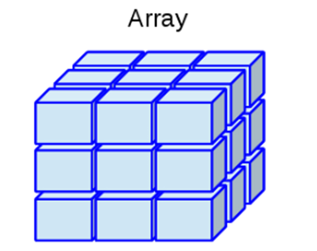

```{r knitr_init, echo=FALSE, cache=FALSE}
library(knitr)
## Global options
opts_chunk$set(echo=TRUE,
               cache=TRUE,
               prompt=FALSE,
               tidy=TRUE,
               comment=NA,
               message=FALSE,
               warning=FALSE,
               fig.path = paste0("../../EstadisticaI/images/", "Clase04"),
               cache.path = "../../EstadisticaI/cache/",
               cache = FALSE)

```

## Introducción a R

<tt>R</tt> **es un lenguaje de programación interpretado orientado a objetos** junto con un sistema de ventanas, que permite una interacción directa e intuitiva con el tipo de programación realizada. Este tipo de programación, posee una notable cercanía con la forma en que se expresarían las cosas en la vida real, ya que trabaja sobre objetos visibles que poseen determinadas característica, lo cual hace que puedan ser empleados para la realización de acciones específicas. 

Para entender cómo se crean o manipulan objetos en <tt>R</tt>, es necesario introducir inicialmente el lenguaje de programación, y para ello lo primero que debe hacerse, es entender la estructura de asignación, los tipos de datos, las clases de los objetos y los tipos de operadores 

### Estructura de asignación
La estructura de asignación del lenguaje <tt>R</tt> puede llevarse a cabo mediante cuatro formas diferentes, donde, cada una de ellas lleva al mismo resultado

<section class="language-r highlighter-rouge"><section class="highlight"><pre class="highlight"><code><span class="n">variable</span><span class="w"> </span><span class="o">&lt;-</span><span class="w"> </span><span class="n">objeto</span><span class="w">       </span><span class="c1"># Primer método</span><span class="w">
</span><span class="n">objeto</span><span class="w"> </span><span class="o">-&gt;</span><span class="w"> </span><span class="n">variable</span><span class="w">       </span><span class="c1"># Segundo método</span><span class="w">
</span><span class="n">variable</span><span class="w"> </span><span class="o">=</span><span class="w"> </span><span class="n">objeto</span><span class="w">        </span><span class="c1"># Tercer método</span><span class="w">
</span><span class="n">assign</span><span class="p">(</span><span class="n">variable</span><span class="p">,</span><span class="w"> </span><span class="n">objeto</span><span class="p">)</span><span class="w"> </span><span class="c1"># Cuarto método</span><span class="w">
</span></code></pre></section></section>

```{r eval=FALSE, echo=FALSE}
variable <- objeto       # Primer método
objeto -> variable       # Segundo método
variable = objeto        # Tercer método
assign(variable, objeto) # Cuarto método
```

De estos cuatro métodos de asignación presentados, **el primero y el segundo poseen la misma estructura**, la diferencia entre ellos radica en que, el primero realiza la asignación a la izquierda y el segundo a la derecha, lo cual depende de la dirección hacia donde apunte la flecha.

El **tercer método**, a pesar de realizar la asignación al igual que los dos primeros métodos, éste **no es el operador habitual de asignación**, pues éste se encuentra reservado para otros propósitos, tales como darle valores a una variable dentro de una función. El **cuarto método**, es una forma de asignación equivalente a las dos primeras, pero **requiere de "más esfuerzo"** para llevarse acabo la asignación.

Por lo tanto, se **recomienda emplear el primer método de asignación**. Es de anotar que el símbolo `<-` puede escribirse de dos formas, presionando la tecla `<` seguida de la tecla `-`, o alternativamente, presionando de forma simultanea las teclas `Alt` y la tecla `-`.

También se señala que **el carácter `#`, se emplea para comentar el código** o una línea específica, lo cual implica que posterior a `#`, no se ejecutará ningún tipo de código en la linea específica en la cual se encuentre `#`.

### Tipo de datos
Existen diferentes tipos de datos en los lenguajes de programación, de estos tipos dependerá las operaciones o funciones que pueden o no emplearse con éstos, y es por ello que debe tenerse especial cuidado cuando se deseen manipular.

Los tipos de datos más que pueden encontrarse en <tt>R</tt> son:

* **<tt>numeric</tt>**: Datos numéricos, los cuales soportan números que se encuentren en el conjunto de los reales, `$\mathbb{R}$`, y por tanto soporta tanto números enteros (<tt>integer</tt>) y números de doble precisión (<tt>double</tt>).
* **<tt>integer</tt>**: Datos enteros, los cuales soportan números que se encuentren en el conjunto de los enteros,  `$\mathbb{Z}$`, y en consecuencia, solo soporta números enteros.
* **<tt>complex</tt>**: Datos complejos, los cuales soportan números que se encuentren en el conjunto de los complejos, `$\mathbb{C}$`, y por tanto, soporta tanto números reales como imaginarios.
* **<tt>character</tt>**: Datos de carácter, los cuales soportan caracteres alfanuméricos, es decir, datos numéricos y alfabéticos. Éstos deben ser escritos entre comillas simples o dobles.
* **<tt>factor</tt>**: Datos categóricos nominales, los cuales soportan caracteres alfanuméricos, y establece entre estos diferentes categorías. Se puede emplear la función <tt>factor()</tt> para crear datos de este tipo. Éstos deben ser escritos entre comillas simples o dobles.
* **<tt>ordered</tt>**: Datos categóricos ordinales, los cuales soportan caracteres alfanuméricos, y establece entre estos diferentes categorías junto con una estructura jerárquica. Se puede emplear la función <tt>ordered()</tt> para crear datos de este tipo. Éstos deben ser escritos entre comillas simples o dobles.
* **<tt>logical</tt>**: Datos lógicos, los cuales soportan caracteres lógicos tales como <tt style="color: #ff628c!important">TRUE</tt> o <tt style="color: #ff628c!important">FALSE</tt>.

Para verificar al estructura de almacenamiento en <tt>R</tt>, puede emplearse la función <tt>str()</tt>, mientras para observar la estructura de almacenamiento pueden emplearse las funciones <tt>mode()</tt>, <tt>typeof</tt>, y para observar la clase interna del objeto puede emplearse la función <tt>class()</tt>.

<button id="Show1" class="btn btn-secondary">Mostrar Ejemplo en <tt>R</tt></button>
<button id="Hide1" class="btn btn-info">Ocultar Ejemplo en <tt>R</tt></button>
<main id="botoncito1"> 
<p>A continuación se presenta un ejemplo en donde se muestran los diferentes tipos de objetos en <tt>R</tt></p>

<h3 data-toc-skip> Dato tipo numérico </h3> 

<section class="language-r highlighter-rouge"><section class="highlight"><pre class="highlight"><code><span class="c1"># Numeric</span><span class="w">
</span><span class="n">a</span><span class="w"> </span><span class="o">&lt;-</span><span class="w"> </span><span class="m">3.3</span><span class="w">
</span><span class="n">str</span><span class="p">(</span><span class="n">a</span><span class="p">)</span><span class="w">
</span></code></pre></section></section>

<section class="highlighter-rouge"><section class="highlight"><pre class="highlight"><code> num 3.3
</code></pre></section></section>

<h3 data-toc-skip> Dato tipo entero </h3> 

<section class="language-r highlighter-rouge"><section class="highlight"><pre class="highlight"><code><span class="c1"># Integer</span><span class="w">
</span><span class="n">b</span><span class="w"> </span><span class="o">&lt;-</span><span class="w"> </span><span class="m">3L</span><span class="w">
</span><span class="n">str</span><span class="p">(</span><span class="n">b</span><span class="p">)</span><span class="w">
</span></code></pre></section></section>

<section class="highlighter-rouge"><section class="highlight"><pre class="highlight"><code> int 3
</code></pre></section></section>

<h3 data-toc-skip> Dato tipo lógico </h3> 

<section class="language-r highlighter-rouge"><section class="highlight"><pre class="highlight"><code><span class="c1"># Complex</span><span class="w">
</span><span class="n">c</span><span class="w"> </span><span class="o">&lt;-</span><span class="w"> </span><span class="m">3</span><span class="w"> </span><span class="o">+</span><span class="w"> </span><span class="p">(</span><span class="m">0+0.2i</span><span class="p">)</span><span class="w">
</span><span class="n">str</span><span class="p">(</span><span class="n">c</span><span class="p">)</span><span class="w">
</span></code></pre></section></section>

<section class="highlighter-rouge"><section class="highlight"><pre class="highlight"><code> cplx 3+0.2i
</code></pre></section></section>

<h3 data-toc-skip> Dato tipo carácter </h3> 

<section class="language-r highlighter-rouge"><section class="highlight"><pre class="highlight"><code><span class="c1"># Character</span><span class="w">
</span><span class="n">d</span><span class="w"> </span><span class="o">&lt;-</span><span class="w"> </span><span class="s2">"Ejemplo :D"</span><span class="w">
</span><span class="n">str</span><span class="p">(</span><span class="n">d</span><span class="p">)</span><span class="w">
</span></code></pre></section></section>

<section class="highlighter-rouge"><section class="highlight"><pre class="highlight"><code> chr "Ejemplo :D"
</code></pre></section></section>

<h3 data-toc-skip> Dato tipo factor </h3> 

<section class="language-r highlighter-rouge"><section class="highlight"><pre class="highlight"><code><span class="c1"># Factor</span><span class="w">
</span><span class="n">e</span><span class="w"> </span><span class="o">&lt;-</span><span class="w"> </span><span class="n">factor</span><span class="p">(</span><span class="s2">"Otro ejemplo :o"</span><span class="p">)</span><span class="w">
</span><span class="n">str</span><span class="p">(</span><span class="n">e</span><span class="p">)</span><span class="w">
</span></code></pre></section></section>

<section class="highlighter-rouge"><section class="highlight"><pre class="highlight"><code> Factor w/ 1 level "Otro ejemplo :o": 1
</code></pre></section></section>

<h3 data-toc-skip> Dato tipo ordinal </h3> 

<section class="language-r highlighter-rouge"><section class="highlight"><pre class="highlight"><code><span class="c1"># Ordered</span><span class="w">
</span><span class="n">f</span><span class="w"> </span><span class="o">&lt;-</span><span class="w"> </span><span class="n">ordered</span><span class="p">(</span><span class="s2">"Uno más &gt;:o"</span><span class="p">)</span><span class="w">
</span><span class="n">str</span><span class="p">(</span><span class="n">f</span><span class="p">)</span><span class="w">
</span></code></pre></section></section>

<section class="highlighter-rouge"><section class="highlight"><pre class="highlight"><code> Ord.factor w/ 1 level "Uno más &gt;:o": 1
</code></pre></section></section>

<h3 data-toc-skip> Dato tipo lógico </h3> 

<section class="language-r highlighter-rouge"><section class="highlight"><pre class="highlight"><code><span class="c1"># logic</span><span class="w">
</span><span class="n">g</span><span class="w"> </span><span class="o">&lt;-</span><span class="w"> </span><span class="kc">FALSE</span><span class="w">
</span><span class="n">str</span><span class="p">(</span><span class="n">g</span><span class="p">)</span><span class="w">
</span></code></pre></section></section>

<section class="highlighter-rouge"><section class="highlight"><pre class="highlight"><code> logi FALSE
</code></pre></section></section>

```{r eval=FALSE, echo=FALSE}
# Numeric
a <- 3.3 
str(a)

# Integer
b <- 3L 
str(b)

# Complex
c <- 3+0.2i
str(c)

# Character
d <- "Ejemplo :D"
str(d)

# Factor
e <- factor("Otro ejemplo :o")
str(e)

# Ordered
f <- ordered("Uno más >:o")
str(f)

# Logic
g <- FALSE
str(g)
```

</main>

### Clases de objetos
Adicionalmente, con el fin de organizar los datos, se presentan algunas de las clases de objetos más comúnmente usados en <tt>R</tt> 

* **Vector:** este objeto admite datos numéricos, caracteres, complejos o lógicos, pero solo permite un solo tipo de dato a la vez. Puede construirse mediante la función `c()`.

<h4 align="center"> Representación de un Vector </h4>
{ width=60% }

<button id="Show4" class="btn btn-secondary">Mostrar Ejemplos de <tt>R</tt></button>
<button id="Hide4" class="btn btn-info">Ocultar Ejemplos de <tt>R</tt></button>
<main id="botoncito4"> 
<h3 data-toc-skip> Solución en <tt>R</tt> </h3> 

<section class="language-r highlighter-rouge"><section class="highlight"><pre class="highlight"><code><span class="n">vecN</span><span class="w"> </span><span class="o">&lt;-</span><span class="w"> </span><span class="nf">c</span><span class="p">(</span><span class="m">1</span><span class="p">,</span><span class="w"> </span><span class="m">4</span><span class="p">,</span><span class="w"> </span><span class="m">5</span><span class="p">,</span><span class="w"> </span><span class="m">-6.2</span><span class="p">,</span><span class="w"> </span><span class="m">2</span><span class="p">,</span><span class="w"> </span><span class="m">-3</span><span class="p">)</span><span class="w">  </span><span class="c1"># Númerico</span><span class="w">
</span><span class="n">vecC</span><span class="w"> </span><span class="o">&lt;-</span><span class="w"> </span><span class="nf">c</span><span class="p">(</span><span class="s2">"a"</span><span class="p">,</span><span class="w"> </span><span class="s2">"c"</span><span class="p">,</span><span class="w"> </span><span class="s2">"a"</span><span class="p">,</span><span class="w"> </span><span class="s2">"b"</span><span class="p">,</span><span class="w"> </span><span class="s2">"c"</span><span class="p">,</span><span class="w"> </span><span class="s2">"a"</span><span class="p">)</span><span class="w">  </span><span class="c1"># Alfanumérico</span><span class="w">
</span><span class="n">vecL</span><span class="w"> </span><span class="o">&lt;-</span><span class="w"> </span><span class="nf">c</span><span class="p">(</span><span class="nb">F</span><span class="p">,</span><span class="w"> </span><span class="nb">T</span><span class="p">,</span><span class="w"> </span><span class="kc">NA</span><span class="p">,</span><span class="w"> </span><span class="nb">F</span><span class="p">,</span><span class="w"> </span><span class="nb">T</span><span class="p">,</span><span class="w"> </span><span class="nb">F</span><span class="p">)</span><span class="w">  </span><span class="c1"># Lógico</span><span class="w">
</span></code></pre></section></section>

</main>

* **Matriz:** este objeto admite datos numéricos, caracteres, complejos o lógicos, pero solo permite un solo tipo de dato a la vez. Puede construirse mediante la función `matrix()`.

<h4 align="center"> Representación de un Matriz </h4>
{ width=60% }

<button id="Show5" class="btn btn-secondary">Mostrar Ejemplos de <tt>R</tt></button>
<button id="Hide5" class="btn btn-info">Ocultar Ejemplos de <tt>R</tt></button>
<main id="botoncito5"> 
<h3 data-toc-skip> Solución en <tt>R</tt> </h3> 

<section class="language-r highlighter-rouge"><section class="highlight"><pre class="highlight"><code><span class="n">matN</span><span class="w"> </span><span class="o">&lt;-</span><span class="w"> </span><span class="n">matrix</span><span class="p">(</span><span class="n">data</span><span class="w"> </span><span class="o">=</span><span class="w"> </span><span class="nf">c</span><span class="p">(</span><span class="m">1</span><span class="p">,</span><span class="w"> </span><span class="m">4</span><span class="p">,</span><span class="w"> </span><span class="m">5</span><span class="p">,</span><span class="w"> </span><span class="m">6</span><span class="p">,</span><span class="w"> </span><span class="m">2</span><span class="p">,</span><span class="w"> </span><span class="m">3</span><span class="p">),</span><span class="w"> </span><span class="n">nrow</span><span class="w"> </span><span class="o">=</span><span class="w"> </span><span class="m">3</span><span class="p">,</span><span class="w"> </span><span class="n">ncol</span><span class="w"> </span><span class="o">=</span><span class="w"> </span><span class="m">2</span><span class="p">,</span><span class="w"> </span><span class="n">byrow</span><span class="w"> </span><span class="o">=</span><span class="w"> </span><span class="nb">T</span><span class="p">)</span><span class="w">  </span><span class="c1"># Númerico      </span><span class="w">
</span><span class="n">matC</span><span class="w"> </span><span class="o">&lt;-</span><span class="w"> </span><span class="n">matrix</span><span class="p">(</span><span class="n">data</span><span class="w"> </span><span class="o">=</span><span class="w"> </span><span class="nf">c</span><span class="p">(</span><span class="s2">"a"</span><span class="p">,</span><span class="w"> </span><span class="s2">"c"</span><span class="p">,</span><span class="w"> </span><span class="s2">"a"</span><span class="p">,</span><span class="w"> </span><span class="s2">"b"</span><span class="p">,</span><span class="w"> </span><span class="s2">"c"</span><span class="p">,</span><span class="w"> </span><span class="s2">"a"</span><span class="p">),</span><span class="w"> </span><span class="n">nrow</span><span class="w"> </span><span class="o">=</span><span class="w"> </span><span class="m">2</span><span class="p">,</span><span class="w"> </span><span class="n">ncol</span><span class="w"> </span><span class="o">=</span><span class="w"> </span><span class="m">3</span><span class="p">,</span><span class="w"> </span><span class="n">byrow</span><span class="w"> </span><span class="o">=</span><span class="w"> </span><span class="nb">F</span><span class="p">)</span><span class="w">  </span><span class="c1"># Alfanumérico</span><span class="w">
</span><span class="n">matL</span><span class="w"> </span><span class="o">&lt;-</span><span class="w"> </span><span class="n">matrix</span><span class="p">(</span><span class="n">data</span><span class="w"> </span><span class="o">=</span><span class="w"> </span><span class="nf">c</span><span class="p">(</span><span class="n">vecL</span><span class="p">,</span><span class="w"> </span><span class="nb">T</span><span class="p">,</span><span class="w"> </span><span class="nb">T</span><span class="p">,</span><span class="w"> </span><span class="nb">F</span><span class="p">),</span><span class="w"> </span><span class="n">nrow</span><span class="w"> </span><span class="o">=</span><span class="w"> </span><span class="m">3</span><span class="p">,</span><span class="w"> </span><span class="n">ncol</span><span class="w"> </span><span class="o">=</span><span class="w"> </span><span class="m">3</span><span class="p">,</span><span class="w"> </span><span class="n">byrow</span><span class="w"> </span><span class="o">=</span><span class="w"> </span><span class="nb">F</span><span class="p">)</span><span class="w">  </span><span class="c1"># Lógico</span><span class="w">
</span><span class="n">rownames</span><span class="p">(</span><span class="n">matN</span><span class="p">)</span><span class="w"> </span><span class="o">&lt;-</span><span class="w"> </span><span class="nf">c</span><span class="p">(</span><span class="s2">"F1"</span><span class="p">,</span><span class="w"> </span><span class="s2">"F2"</span><span class="p">,</span><span class="w"> </span><span class="s2">"bla"</span><span class="p">)</span><span class="w">  </span><span class="c1"># Poner nombre filas</span><span class="w">
</span><span class="n">colnames</span><span class="p">(</span><span class="n">matN</span><span class="p">)</span><span class="w"> </span><span class="o">&lt;-</span><span class="w"> </span><span class="nf">c</span><span class="p">(</span><span class="s2">"D:"</span><span class="p">,</span><span class="w"> </span><span class="s2">"C2"</span><span class="p">)</span><span class="w">  </span><span class="c1"># Poner nombre columnas</span><span class="w">
</span><span class="n">matV</span><span class="w"> </span><span class="o">&lt;-</span><span class="w"> </span><span class="n">matrix</span><span class="p">(</span><span class="n">data</span><span class="w"> </span><span class="o">=</span><span class="w"> </span><span class="nf">c</span><span class="p">(</span><span class="m">-5</span><span class="p">,</span><span class="w"> </span><span class="m">-6</span><span class="p">,</span><span class="w"> </span><span class="m">8.1</span><span class="p">,</span><span class="w"> </span><span class="m">12.3</span><span class="p">,</span><span class="w"> </span><span class="m">2</span><span class="p">,</span><span class="w"> </span><span class="m">-1</span><span class="p">),</span><span class="w"> </span><span class="n">nrow</span><span class="w"> </span><span class="o">=</span><span class="w"> </span><span class="m">1</span><span class="p">)</span><span class="w">  </span><span class="c1"># Crear vector con función matrix</span><span class="w">
</span></code></pre></section></section>

</main>

* **Marco de Datos:** Permite datos numéricos, caracteres, complejos o lógicos, además de permitir múltiples tipos por objeto a la vez. Puede construirse mediante la función `data.frame()`.

<h4 align="center"> Representación de un Marco de Datos </h4>
{ width=60% }

<button id="Show6" class="btn btn-secondary">Mostrar Ejemplos de <tt>R</tt></button>
<button id="Hide6" class="btn btn-info">Ocultar Ejemplos de <tt>R</tt></button>
<main id="botoncito6"> 
<h3 data-toc-skip> Solución en <tt>R</tt> </h3> 

<section class="language-r highlighter-rouge"><section class="highlight"><pre class="highlight"><code><span class="n">dataf</span><span class="w"> </span><span class="o">&lt;-</span><span class="w"> </span><span class="n">data.frame</span><span class="p">(</span><span class="n">cbind</span><span class="p">(</span><span class="n">vecN</span><span class="p">,</span><span class="w"> </span><span class="n">vecC</span><span class="p">,</span><span class="w"> </span><span class="n">vecL</span><span class="p">))</span><span class="w">
</span><span class="c1"># Las funciones cbind() y rbind() combinan vectores, matrices o data-frame</span><span class="w">
</span><span class="c1"># por columna o fila, respectivamente.</span><span class="w">
</span></code></pre></section></section>

</main>

* **Arreglos:** Permite datos numéricos, caracteres, complejos o lógicos, pero solo permite un solo tipo de dato a la vez. Puede construirse mediante la función `array()`.

<h4 align="center"> Representación de un Arreglo </h4>
{ width=60% }

<button id="Show7" class="btn btn-secondary">Mostrar Ejemplos de <tt>R</tt></button>
<button id="Hide7" class="btn btn-info">Ocultar Ejemplos de <tt>R</tt></button>
<main id="botoncito7"> 
<h3 data-toc-skip> Solución en <tt>R</tt> </h3> 

<section class="language-r highlighter-rouge"><section class="highlight"><pre class="highlight"><code><span class="n">arrN</span><span class="w"> </span><span class="o">&lt;-</span><span class="w"> </span><span class="n">array</span><span class="p">(</span><span class="n">data</span><span class="w"> </span><span class="o">=</span><span class="w"> </span><span class="nf">c</span><span class="p">(</span><span class="m">1</span><span class="p">,</span><span class="w"> </span><span class="m">4</span><span class="p">,</span><span class="w"> </span><span class="m">5</span><span class="p">,</span><span class="w"> </span><span class="m">6</span><span class="p">,</span><span class="w"> </span><span class="m">2</span><span class="p">,</span><span class="w"> </span><span class="m">3</span><span class="p">,</span><span class="w"> </span><span class="m">2</span><span class="p">,</span><span class="w"> </span><span class="m">3</span><span class="p">,</span><span class="w"> </span><span class="m">4</span><span class="p">,</span><span class="w"> </span><span class="m">1</span><span class="p">,</span><span class="w"> </span><span class="m">2</span><span class="p">,</span><span class="w"> </span><span class="m">4</span><span class="p">),</span><span class="w"> </span><span class="n">dim</span><span class="w"> </span><span class="o">=</span><span class="w"> </span><span class="nf">c</span><span class="p">(</span><span class="m">3</span><span class="p">,</span><span class="w"> </span><span class="m">2</span><span class="p">,</span><span class="w"> </span><span class="m">2</span><span class="p">))</span><span class="w">  </span><span class="c1"># Númerico</span><span class="w">
</span><span class="n">arrC</span><span class="w"> </span><span class="o">&lt;-</span><span class="w"> </span><span class="n">array</span><span class="p">(</span><span class="n">data</span><span class="w"> </span><span class="o">=</span><span class="w"> </span><span class="nf">c</span><span class="p">(</span><span class="n">vecC</span><span class="p">,</span><span class="w"> </span><span class="s2">"o"</span><span class="p">,</span><span class="w"> </span><span class="s2">"m"</span><span class="p">),</span><span class="w"> </span><span class="n">dim</span><span class="w"> </span><span class="o">=</span><span class="w"> </span><span class="nf">c</span><span class="p">(</span><span class="m">2</span><span class="p">,</span><span class="w"> </span><span class="m">2</span><span class="p">,</span><span class="w"> </span><span class="m">2</span><span class="p">))</span><span class="w">  </span><span class="c1"># Alfanumérico</span><span class="w">
</span><span class="n">arrL</span><span class="w"> </span><span class="o">&lt;-</span><span class="w"> </span><span class="n">array</span><span class="p">(</span><span class="n">data</span><span class="w"> </span><span class="o">=</span><span class="w"> </span><span class="nf">c</span><span class="p">(</span><span class="n">vecL</span><span class="p">,</span><span class="w"> </span><span class="nb">F</span><span class="p">,</span><span class="w"> </span><span class="nb">F</span><span class="p">,</span><span class="w"> </span><span class="kc">NA</span><span class="p">,</span><span class="w"> </span><span class="nb">F</span><span class="p">,</span><span class="w"> </span><span class="nb">T</span><span class="p">,</span><span class="w"> </span><span class="kc">NA</span><span class="p">),</span><span class="w"> </span><span class="n">dim</span><span class="w"> </span><span class="o">=</span><span class="w"> </span><span class="nf">c</span><span class="p">(</span><span class="m">2</span><span class="p">,</span><span class="w"> </span><span class="m">2</span><span class="p">,</span><span class="w"> </span><span class="m">3</span><span class="p">))</span><span class="w">  </span><span class="c1"># Lógico</span><span class="w">
</span><span class="n">arrV</span><span class="w"> </span><span class="o">&lt;-</span><span class="w"> </span><span class="n">array</span><span class="p">(</span><span class="n">data</span><span class="w"> </span><span class="o">=</span><span class="w"> </span><span class="nf">c</span><span class="p">(</span><span class="m">-5</span><span class="p">,</span><span class="w"> </span><span class="m">-6</span><span class="p">,</span><span class="w"> </span><span class="m">8.1</span><span class="p">,</span><span class="w"> </span><span class="m">12.3</span><span class="p">,</span><span class="w"> </span><span class="m">2</span><span class="p">,</span><span class="w"> </span><span class="m">-1</span><span class="p">))</span><span class="w">  </span><span class="c1"># Crear vector con función array</span><span class="w">
</span><span class="n">arrM</span><span class="w"> </span><span class="o">&lt;-</span><span class="w"> </span><span class="n">array</span><span class="p">(</span><span class="n">data</span><span class="w"> </span><span class="o">=</span><span class="w"> </span><span class="n">vecC</span><span class="p">,</span><span class="w"> </span><span class="n">dim</span><span class="w"> </span><span class="o">=</span><span class="w"> </span><span class="nf">c</span><span class="p">(</span><span class="m">2</span><span class="p">,</span><span class="w"> </span><span class="m">3</span><span class="p">,</span><span class="w"> </span><span class="m">1</span><span class="p">))</span><span class="w">  </span><span class="c1"># Crear matriz con función array</span><span class="w">
</span></code></pre></section></section>

</main>

* **Listas:** Permite datos numéricos, caracteres, complejos, lógicos, funciones, expresiones, etc, además de permitir múltiples tipos por objetos a la vez. Puede construirse mediante la función `list()`.

<h4 align="center"> Representación de listas </h4>


<button id="Show8" class="btn btn-secondary">Mostrar Ejemplos de <tt>R</tt></button>
<button id="Hide8" class="btn btn-info">Ocultar Ejemplos de <tt>R</tt></button>
<main id="botoncito8"> 
<h3 data-toc-skip> Solución en <tt>R</tt> </h3> 

<section class="language-r highlighter-rouge"><section class="highlight"><pre class="highlight"><code><span class="n">listica</span><span class="w"> </span><span class="o">&lt;-</span><span class="w"> </span><span class="nf">list</span><span class="p">(</span><span class="n">dataf</span><span class="p">,</span><span class="w"> </span><span class="n">matN</span><span class="p">,</span><span class="w"> </span><span class="nf">expression</span><span class="p">(</span><span class="n">beta</span><span class="p">))</span><span class="w">
</span></code></pre></section></section>

</main>

### Operadores aritméticos y precedencias
Existen diferentes operadores aritméticos que pueden emplearse en los lenguajes de programación. Estos se resumen en la siguiente tabla.

<pre style="margin-bottom: 0px;">
```{r echo=FALSE}
library(kableExtra)

datos <- cbind(
  "Operación" = c("Potencia", "Producto", "División", "División Entera", "Módulo o Resto", "Suma", "Resta"),
  "Operador en R" = c("^", "*", "/", "%/%", "%%", "+", "-"),
  "Asociatividad" = c("Por la derecha", "Por la izquierda", "Por la izquierda", "Por la izquierda", "Por la izquierda", "Por la izquierda", "Por la izquierda"),
  "Precedencia" = c(1, 2, 2, 2, 2, 3, 3))

kable(datos, 
  format = "html", booktabs = T) %>%
kable_styling("striped", full_width = F)
```
</pre>

Como se observa, existen operadores que poseen el mismo nivel de prioridad, y por tanto éstos se ejecuta de izquierda a derecha. Para evitar problemas en los cálculos para operadores del mismo nivel de precedencia, se aconseja emplear el paréntesis, con el fin de modificar el orden de las operaciones.

### Operadores lógicos
También es posible que se quieran realizar operaciones lógicas entre objetos cuando se realiza programación en los diferentes lenguajes, ya sea para establecer condicionales, o para hacer algunas verificaciones. Estos se resumen en la siguiente tabla.

```{r echo=FALSE}
datos2 <- cbind(
  "Operación" = c("Igual que", "Distinto que", "Menor que", "Menor o igual que", "Mayor que", "Mayor o igual que", "Conjunción", "Disyunción", "Negación", "Asignación"),
  "Operador en R" = c("==", "!=", "<", "<=", ">", ">=", "&", "|", "!", "<-"),
  "Precedencia" = c(4, 4, 4, 4, 4, 4, 5, 5, 6, 7))

kable(datos2, 
  format = "html", booktabs = T) %>%
kable_styling("striped", full_width = F)
```

### Funciones matemáticas
Hay una gran variedad de funciones matemáticas que suelen usarse en la práctica, y es por ello que se listan las funciones aritméticas que suelen emplearse comúnmente por lenguaje de programación. Estos se resumen en la siguiente tabla.

```{r echo=FALSE}
datos2 <- cbind(
  "Operación" = c("Valor absoluto", "Raíz cuadrada", "Redondear", "Techo", "Piso", "Exponencial", "Logaritmo", "Factorial", "Gamma", "Seno", "Coseno", "Tangente"),
  "Operador en R" = c("abs()", "sqrt()", "round()", "ceiling()", "floor()", "exp()", "log()", "factorial()", "gamma()", "sin()", "cos()", "tan()"))

kable(datos2, 
  format = "html", booktabs = T) %>%
kable_styling("striped", full_width = F)
```

### Ayuda sobre funciones
Para obtener información sobre una función concreta o carácter en <tt>R</tt>, existen dos métodos que permiten abrir la ventana de ayuda, el primero es mediante la función <tt>help()</tt>, la segunda es mediante el signo `?`. Para ilustrar dichos métodos, empleamos la función <tt>if()</tt> y el carácter <tt>+</tt>, para consultar su ventana de ayuda.

<section class="language-r highlighter-rouge"><section class="highlight"><pre class="highlight"><code><span class="n">help</span><span class="p">(</span><span class="s2">"if"</span><span class="p">)</span><span class="w">  </span><span class="c1"># Primer método</span><span class="w">
</span><span class="n">?</span><span class="s2">"+"</span><span class="w">        </span><span class="c1"># Segundo método</span><span class="w">
</span></code></pre></section></section>

```{r eval=FALSE, echo=FALSE}
help("if")     # Primer método
?"+"           # Segundo método
```


## Caso de estudio
Para ilustrar como realizar los diferentes métodos de resúmenes numéricos, tabulares y gráficos, se empleará la siguiente base de datos de [EjemploDescriptiva](https://github.com/jiperezga/jiperezga.github.io/raw/master/Dataset/EjemploDescriptiva.xlsx){:target="_blank"}, la cual contiene las siguientes variables

* **<tt>Municipio:</tt>** Municipio de residencia de la persona.
* **<tt>Estrato:</tt>** Estrato socioeconómico de la vivienda.
* **<tt>Edad:</tt>** Edad de la persona en años.
* **<tt>Altura:</tt>** Altura de la persona en metros.
* **<tt>Peso:</tt>** Peso de la persona en kilogramos.
* **<tt>Salario:</tt>** Salario devengado por la persona en pesos.
* **<tt>SatisTrabajo:</tt>** Nivel de satisfacción con el trabajo actual.
* **<tt>DeporFavorito:</tt>** Deporte favorito de la persona.

Los datos contenidos en la base de datos se presentan a continuación:

<table class="table table-striped" style="width: auto !important; margin-left: auto; margin-right: auto;"><thead><tr><th style="text-align:left;">Municipio</th><th style="text-align:right;">Estrato</th><th style="text-align:right;">Edad</th><th style="text-align:right;">Altura</th><th style="text-align:right;">Peso</th><th style="text-align:right;">Salario</th><th style="text-align:left;">SatisTrabajo</th><th style="text-align:left;">DeporFavorito</th></tr></thead><tbody><tr><td style="text-align:left;">Caldas</td><td style="text-align:right;">5</td><td style="text-align:right;">17</td><td style="text-align:right;">1.77</td><td style="text-align:right;">66</td><td style="text-align:right;">1635100</td><td style="text-align:left;">Muy satisfecho</td><td style="text-align:left;">Fútbol</td></tr><tr><td style="text-align:left;">Bello</td><td style="text-align:right;">4</td><td style="text-align:right;">27</td><td style="text-align:right;">1.65</td><td style="text-align:right;">90</td><td style="text-align:right;">1752500</td><td style="text-align:left;">Insatisfecho</td><td style="text-align:left;">Fútbol</td></tr><tr><td style="text-align:left;">Medellín</td><td style="text-align:right;">1</td><td style="text-align:right;">18</td><td style="text-align:right;">1.57</td><td style="text-align:right;">66</td><td style="text-align:right;">1858400</td><td style="text-align:left;">Satisfecho</td><td style="text-align:left;">Baloncesto</td></tr><tr><td style="text-align:left;">Caldas</td><td style="text-align:right;">4</td><td style="text-align:right;">22</td><td style="text-align:right;">1.84</td><td style="text-align:right;">87</td><td style="text-align:right;">2131400</td><td style="text-align:left;">Muy satisfecho</td><td style="text-align:left;">Fútbol</td></tr><tr><td style="text-align:left;">La Estrella</td><td style="text-align:right;">3</td><td style="text-align:right;">20</td><td style="text-align:right;">1.86</td><td style="text-align:right;">89</td><td style="text-align:right;">1874800</td><td style="text-align:left;">Satisfecho</td><td style="text-align:left;">Tenis</td></tr><tr><td style="text-align:left;">Caldas</td><td style="text-align:right;">3</td><td style="text-align:right;">22</td><td style="text-align:right;">1.74</td><td style="text-align:right;">90</td><td style="text-align:right;">2933100</td><td style="text-align:left;">Muy satisfecho</td><td style="text-align:left;">Fútbol</td></tr><tr><td style="text-align:left;">Itagüí</td><td style="text-align:right;">1</td><td style="text-align:right;">20</td><td style="text-align:right;">1.91</td><td style="text-align:right;">79</td><td style="text-align:right;">1637200</td><td style="text-align:left;">Muy insatisfecho</td><td style="text-align:left;">Fútbol</td></tr><tr><td style="text-align:left;">La Estrella</td><td style="text-align:right;">3</td><td style="text-align:right;">27</td><td style="text-align:right;">1.77</td><td style="text-align:right;">88</td><td style="text-align:right;">1171200</td><td style="text-align:left;">Indiferente</td><td style="text-align:left;">Baloncesto</td></tr><tr><td style="text-align:left;">Itagüí</td><td style="text-align:right;">2</td><td style="text-align:right;">20</td><td style="text-align:right;">1.58</td><td style="text-align:right;">61</td><td style="text-align:right;">2574700</td><td style="text-align:left;">Muy satisfecho</td><td style="text-align:left;">Baloncesto</td></tr><tr><td style="text-align:left;">Bello</td><td style="text-align:right;">4</td><td style="text-align:right;">39</td><td style="text-align:right;">1.81</td><td style="text-align:right;">70</td><td style="text-align:right;">2739000</td><td style="text-align:left;">Satisfecho</td><td style="text-align:left;">Tenis</td></tr><tr><td style="text-align:left;">La Estrella</td><td style="text-align:right;">6</td><td style="text-align:right;">16</td><td style="text-align:right;">1.69</td><td style="text-align:right;">78</td><td style="text-align:right;">2887800</td><td style="text-align:left;">Indiferente</td><td style="text-align:left;">Baloncesto</td></tr><tr><td style="text-align:left;">Bello</td><td style="text-align:right;">2</td><td style="text-align:right;">40</td><td style="text-align:right;">1.93</td><td style="text-align:right;">83</td><td style="text-align:right;">2559600</td><td style="text-align:left;">Muy satisfecho</td><td style="text-align:left;">Fútbol</td></tr><tr><td style="text-align:left;">Medellín</td><td style="text-align:right;">2</td><td style="text-align:right;">26</td><td style="text-align:right;">1.93</td><td style="text-align:right;">91</td><td style="text-align:right;">1906600</td><td style="text-align:left;">Satisfecho</td><td style="text-align:left;">Fútbol</td></tr><tr><td style="text-align:left;">Medellín</td><td style="text-align:right;">2</td><td style="text-align:right;">21</td><td style="text-align:right;">1.87</td><td style="text-align:right;">61</td><td style="text-align:right;">1299700</td><td style="text-align:left;">Satisfecho
</td><td style="text-align:left;">Baloncesto</td></tr><tr><td style="text-align:left;">Bello</td><td style="text-align:right;">4</td><td style="text-align:right;">23</td><td style="text-align:right;">1.60</td><td style="text-align:right;">84</td><td style="text-align:right;">1950900</td><td style="text-align:left;">Indiferente</td><td style="text-align:left;">Fútbol</td></tr><tr><td style="text-align:left;">Itagüí</td><td style="text-align:right;">3</td><td style="text-align:right;">40</td><td style="text-align:right;">1.91</td><td style="text-align:right;">76</td><td style="text-align:right;">2131900</td><td style="text-align:left;">Satisfecho</td><td style="text-align:left;">Fútbol</td></tr><tr><td style="text-align:left;">La Estrella</td><td style="text-align:right;">6</td><td style="text-align:right;">31</td><td style="text-align:right;">1.79</td><td style="text-align:right;">66</td><td style="text-align:right;">1085400</td><td style="text-align:left;">Indiferente</td><td style="text-align:left;">Voleibol</td></tr><tr><td style="text-align:left;">La Estrella</td><td style="text-align:right;">3</td><td style="text-align:right;">40</td><td style="text-align:right;">1.60</td><td style="text-align:right;">67</td><td style="text-align:right;">1182200</td><td style="text-align:left;">Indiferente</td><td style="text-align:left;">Tenis</td></tr><tr><td style="text-align:left;">Medellín</td><td style="text-align:right;">2</td><td style="text-align:right;">32</td><td style="text-align:right;">1.60</td><td style="text-align:right;">88</td><td style="text-align:right;">2541900</td><td style="text-align:left;">Indiferente</td><td style="text-align:left;">Baloncesto</td></tr><tr><td style="text-align:left;">Caldas</td><td style="text-align:right;">3</td><td style="text-align:right;">33</td><td style="text-align:right;">1.81</td><td style="text-align:right;">65</td><td style="text-align:right;">1333200</td><td style="text-align:left;">Muy satisfecho</td><td style="text-align:left;">Fútbol</td></tr></tbody>
</table>

## Lectura de datos
Para realizar la lectura de datos en <tt>R</tt> es necesario conocer la extensión que posee el archivo de interés, debido a que <tt>R</tt> **posee diferentes librerías y funciones que permiten la lectura de bases de datos**. En la siguiente tabla se resume el origen, la extensión, la librería, y la función para cargar cada base de datos dependiendo de su extensión.

<pre style="margin-bottom: 0px;">
```{r echo=FALSE}
library(kableExtra)

tablita <- cbind(
  "Origen" = c("Texto", "Texto", "Texto",  "Excel", "Excel", "SPSS", "SAS", "STATA"),
  "Extensión" = c(".txt", ".csv (comas)", ".csv (punto y coma)",  ".xls", ".xlsx", ".sav", ".sas7bdat", ".dta"),
  "Librería" = c("utils*", "utils*", "utils*", "readxl", "readxl", "foreign", "foreign", "foreign"),
  "Función" = c("read.table()", "read.csv()", "read.csv2()", "read_xls()", "read_xlsx()", "read.spss()", "read.ssd()", "read.dta()"))

kable(tablita, 
  format = "html", booktabs = T) %>%
kable_styling("striped", full_width = F)

options(scipen = 10)
```
</pre>

**Nota:** Las librerías con * hacen referencia a funciones integradas en <tt>R</tt>, y en consecuencia, no es necesario cargarlas antes de usarlas.

Dado que el conjunto de datos empleados en este ejercicio posee un formato <tt>.xlsx</tt>, se emplea la función <tt>read_xlsx()</tt> de la librería <tt>readxl</tt>. En donde se presenta dos métodos de carga. El primero, para realizar la carga desde un fichero local y la segunda, para realizar la carga de datos en linea, en donde se emplea adicionalmente la función <tt>tempfile()</tt> de base del <tt>R</tt> y la función <tt>download.file()</tt> de la librería <tt>utils</tt> de la base del <tt>R</tt>.

<button id="Show9" class="btn btn-secondary">Mostrar como cargar datos en <tt>R</tt></button>
<button id="Hide9" class="btn btn-info">Ocultar como cargar datos en <tt>R</tt></button>
<main id="botoncito9"> 

<h3 data-toc-skip> Carga de datos fichero local </h3> 
<section class="language-r highlighter-rouge"><section class="highlight"><pre class="highlight"><code><span class="c1">### Instalar y cargar librerías </span><span class="w">
</span><span class="c1"># install.packages(c('readxl'), dependencies = T) # Instala librería</span><span class="w">
</span><span class="kc">library</span><span class="p">(</span><span class="n">readxl</span><span class="p">)</span><span class="w">  </span><span class="c1"># Librería para lectura de archivos .xlsx</span><span class="w">

</span><span class="c1">### Carga archivo</span><span class="w">
</span><span class="n">datos</span><span class="w"> </span><span class="o">&lt;-</span><span class="w"> </span><span class="kc">read_xlsx</span><span class="p">(</span><span class="n">file.choose</span><span class="p">())</span><span class="w">  </span><span class="c1"># Carga base de datos desde fichero local</span><span class="w">
</span></code></pre></section></section>

```{r eval=FALSE, echo=FALSE}
### Instalar y cargar librerías
# install.packages(c("readxl"), dependencies = T) # Instala librería
library(readxl) # Librería para lectura de archivos .xlsx

### Carga archivo
datos <- read_xlsx(file.choose()) # Carga base de datos desde fichero local
```

<h3 data-toc-skip> Carga de datos en linea </h3> 
<section class="language-r highlighter-rouge"><section class="highlight"><pre class="highlight"><code><span class="c1">### Instalar y cargar librería </span><span class="w">
</span><span class="c1"># install.packages('readxl', dependencies = T) # Instala librería</span><span class="w">
</span><span class="kc">library</span><span class="p">(</span><span class="n">readxl</span><span class="p">)</span><span class="w">  </span><span class="c1"># Librería para lectura de archivos .xlsx</span><span class="w">

</span><span class="c1">### Crea archivo temporal para cargar archivo online</span><span class="w">
</span><span class="n">temp</span><span class="w"> </span><span class="o">&lt;-</span><span class="w"> </span><span class="kc">tempfile</span><span class="p">(</span><span class="n">fileext</span><span class="w"> </span><span class="o">=</span><span class="w"> </span><span class="s2">".xlsx"</span><span class="p">)</span><span class="w">
</span><span class="n">dataURL</span><span class="w"> </span><span class="o">&lt;-</span><span class="w"> </span><span class="s2">"https://github.com/jiperezga/jiperezga.github.io/raw/master/Dataset/EjemploDescriptiva.xlsx"</span><span class="w">
</span><span class="kc">download.file</span><span class="p">(</span><span class="n">dataURL</span><span class="p">,</span><span class="w"> </span><span class="n">destfile</span><span class="w"> </span><span class="o">=</span><span class="w"> </span><span class="n">temp</span><span class="p">,</span><span class="w"> </span><span class="n">mode</span><span class="w"> </span><span class="o">=</span><span class="w"> </span><span class="s2">"wb"</span><span class="p">)</span><span class="w">

</span><span class="c1">### Carga archivo</span><span class="w">
</span><span class="n">datos</span><span class="w"> </span><span class="o">&lt;-</span><span class="w"> </span><span class="kc">read_xlsx</span><span class="p">(</span><span class="n">temp</span><span class="p">)</span><span class="w">  </span><span class="c1"># Carga la base de datos online</span><span class="w">
</span></code></pre></section></section>

```{r echo=FALSE}
### Instalar y cargar librerías
# install.packages("readxl", dependencies = T) # Instala librería
library(readxl) # Librería para lectura de archivos .xlsx
library(RcmdrMisc) # Carga librería RcmdrMisc
library(psych) # Carga librería pysch

### Crea archivo temporal para cargar archivo online
temp <- tempfile(fileext = ".xlsx") 
dataURL <- "https://github.com/jiperezga/jiperezga.github.io/raw/master/Dataset/EjemploDescriptiva.xlsx"
download.file(dataURL, destfile=temp, mode='wb')

### Carga archivo
datos <- read_xlsx(temp) # Carga la base de datos online
```

</main>

## Estructura de datos
El tipo y clase de los datos juega un papel importante al momento de realizar análisis de los datos, debido a que **su adecuada especificación será la responsable de que el análisis aplicado a la variable sea el adecuado**.

Para observa las clases que poseen los datos, podemos emplear la función <tt>str()</tt>, de la librería <tt>utils</tt> de la base del <tt>R</tt>.

<button id="Show10" class="btn btn-secondary">Mostrar estructura datos en <tt>R</tt></button>
<button id="Hide10" class="btn btn-info">Ocultar estructura datos en <tt>R</tt></button>
<main id="botoncito10"> 
<h3 data-toc-skip> Estructura de los datos </h3> 

<section class="language-r highlighter-rouge"><section class="highlight"><pre class="highlight"><code><span class="c1"># Muestra la estructura de la base de datos</span><span class="w">
</span><span class="kc">str</span><span class="p">(</span><span class="n">datos</span><span class="p">)</span><span class="w">
</span></code></pre></section></section>

<section class="highlighter-rouge"><section class="highlight"><pre class="highlight"><code>Classes 'tbl_df', 'tbl' and 'data.frame':   20 obs. of  8 variables:
 $ Municipio    : chr  "Caldas" "Bello" "Medellín" "Caldas" ...
 $ Estrato      : num  5 4 1 4 3 3 1 3 2 4 ...
 $ Edad         : num  17 27 18 22 20 22 20 27 20 39 ...
 $ Altura       : num  1.77 1.65 1.57 1.84 1.86 1.74 1.91 1.77 1.58 1.81 ...
 $ Peso         : num  66 90 66 87 89 90 79 88 61 70 ...
 $ Salario      : num  1635100 1752500 1858400 2131400 1874800 ...
 $ SatisTrabajo : chr  "Muy satisfecho" "Insatisfecho" "Satisfecho" "Muy satisfecho" ...
 $ DeporFavorito: chr  "Fútbol" "Fútbol" "Baloncesto" "Fútbol" ...
</code></pre></section></section>

```{r echo=FALSE, eval=FALSE}
# Muestra la estructura de la base de datos
str(datos) 
```

</main>

El papel de una correcta estructura de datos, se debe a que podrían haber dentro de la base de datos, **variables numéricas tratadas como factores, factores tratadas como numéricas, variables ordinales tratadas como si fueran nominales, etc**. Lo cual haría que pueda aplicarse análisis a las variables de forma indebida, por ejemplo, realizar un análisis numérico a una variable que realmente es tipo factor, como es el estrato. 

**Para convertir una variable de un clase a otra**, existen una serie de funciones básicas en la base de <tt>R</tt> que permiten hacer dicho procedimiento, estas funciones son

* **<tt>as.numeric()</tt>:** Convierte una variable a tipo numérico (double).
* **<tt>as.logical()</tt>:** Convierte una variable a tipo lógico.
* **<tt>as.integer()</tt>:** Convierte una variable a tipo entero.
* **<tt>as.factor()</tt>:** Convierte una variable a tipo factor.
* **<tt>as.character()</tt>:** Convierte una variable a tipo caracter (character).
* **<tt>as.ordered()</tt>:** Convierte una variable a tipo factor asumiendo un orden o jerarquía entre los niveles.

<button id="Show11" class="btn btn-secondary">Mostrar corrección estructura de datos en <tt>R</tt></button>
<button id="Hide11" class="btn btn-info">Ocultar corrección estructura de datos en <tt>R</tt></button>
<main id="botoncito11"> 

<h3 data-toc-skip> Corrección de estructura de los datos </h3> 

<section class="language-r highlighter-rouge"><section class="highlight"><pre class="highlight"><code><span class="c1">## Transformar variables a factor</span><span class="w">
</span><span class="n">datos</span><span class="o">$</span><span class="n">Municipio</span><span class="w"> </span><span class="o">&lt;-</span><span class="w"> </span><span class="kc">as.factor</span><span class="p">(</span><span class="n">datos</span><span class="o">$</span><span class="n">Municipio</span><span class="p">)</span><span class="w">
</span><span class="n">datos</span><span class="o">$</span><span class="n">DeporFavorito</span><span class="w"> </span><span class="o">&lt;-</span><span class="w"> </span><span class="kc">as.factor</span><span class="p">(</span><span class="n">datos</span><span class="o">$</span><span class="n">DeporFavorito</span><span class="p">)</span><span class="w">

</span><span class="c1">## Trasforma variable a factor ordinal</span><span class="w">
</span><span class="n">datos</span><span class="o">$</span><span class="n">Estrato</span><span class="w"> </span><span class="o">&lt;-</span><span class="w"> </span><span class="kc">as.ordered</span><span class="p">(</span><span class="n">datos</span><span class="o">$</span><span class="n">Estrato</span><span class="p">)</span><span class="w">
</span><span class="n">datos</span><span class="o">$</span><span class="n">SatisTrabajo</span><span class="w"> </span><span class="o">&lt;-</span><span class="w"> </span><span class="kc">as.ordered</span><span class="p">(</span><span class="n">datos</span><span class="o">$</span><span class="n">SatisTrabajo</span><span class="p">)</span><span class="w">

</span><span class="c1"># En caso de que el orden automático no sea el adecuado</span><span class="w">
</span><span class="n">datos</span><span class="o">$</span><span class="n">SatisTrabajo</span><span class="w"> </span><span class="o">&lt;-</span><span class="w"> </span><span class="kc">ordered</span><span class="p">(</span><span class="n">datos</span><span class="o">$</span><span class="n">SatisTrabajo</span><span class="p">,</span><span class="w"> </span><span class="nf">c</span><span class="p">(</span><span class="s2">"Muy insatisfecho"</span><span class="p">,</span><span class="w"> 
    </span><span class="s2">"Insatisfecho"</span><span class="p">,</span><span class="w"></span><span class="s2">"Indiferente"</span><span class="p">,</span><span class="w"> </span><span class="s2">"Satisfecho"</span><span class="p">,</span><span class="w"> </span><span class="s2">"Muy satisfecho"</span><span class="p">))</span><span class="w">
</span><span class="c1"># Muestra la estructura de la base de datos</span><span class="w"> 
</span><span class="kc">str</span><span class="p">(</span><span class="n">datos</span><span class="p">)</span><span class="w">
</span></code></pre></section></section>

<section class="highlighter-rouge"><section class="highlight"><pre class="highlight"><code>Classes 'tbl_df', 'tbl' and 'data.frame':   20 obs. of  8 variables:
 $ Municipio    : Factor w/ 5 levels "Bello","Caldas",..: 2 1 5 2 4 2 3 4 3 1 ...
 $ Estrato      : Ord.factor w/ 6 levels "1"<"2"<"3"<"4"<..: 5 4 1 4 3 3 1 3 2 4 ...
 $ Edad         : num  17 27 18 22 20 22 20 27 20 39 ...
 $ Altura       : num  1.77 1.65 1.57 1.84 1.86 1.74 1.91 1.77 1.58 1.81 ...
 $ Peso         : num  66 90 66 87 89 90 79 88 61 70 ...
 $ Salario      : num  1635100 1752500 1858400 2131400 1874800 ...
 $ SatisTrabajo : Ord.factor w/ 5 levels "Muy insatisfecho"<..: 5 2 4 5 4 5 1 3 5 4 ...
 $ DeporFavorito: Factor w/ 4 levels "Baloncesto","Fútbol",..: 2 2 1 2 3 2 2 1 1 3 ...
</code></pre></section></section>

```{r echo=FALSE}
## Transformar variables a factor
datos$Municipio <- as.factor(datos$Municipio)
datos$DeporFavorito <- as.factor(datos$DeporFavorito)

## Trasforma variable a factor ordinal
datos$Estrato <- as.ordered(datos$Estrato)
datos$SatisTrabajo <- as.ordered(datos$SatisTrabajo)

# En caso de que el orden automático no sea el adecuado
datos$SatisTrabajo <- ordered(datos$SatisTrabajo, c("Muy insatisfecho", "Insatisfecho", "Indiferente", "Satisfecho", "Muy satisfecho"))
```

```{r echo=FALSE, eval = FALSE}
# Muestra nuevamente la estructura de la base de datos
str(datos)
```

</main>

## Resumen numéricos
Una parte importante de la estadística descriptiva, son las medidas estadísticas ya explicadas en la [Clase 01](https://jiperezga.github.io/EstadisticaI/EstIClase01.html){:target="_blank"} y [Clase 02](https://jiperezga.github.io/EstadisticaI/EstIClase02.html){:target="_blank"}, y aún más importante, es buscar la más adecuada para presentar dichas medidas.

Una alternativa para presentar la información contenida en las medidas estadísticas es mediante resúmenes numéricos, ya que éstos muestran de forma simple y ordenada de forma simultanea conjunto diferentes medidas numéricas, para facilitar su presentación, lectura e interpretación.

### Resumen numérico individual

Entre las diferentes funciones que permiten realizar resúmenes numéricos en <tt>R</tt>, se destaca la función <tt>numSummary()</tt> de la librería <tt>RcmdrMisc</tt> y la función <tt>describe()</tt> de la librería <tt>psych</tt>, que presentan diferentes medidas estadísticas para variables tipo numéricas. 

<button id="Show12" class="btn btn-secondary">Mostrar resumen numérico con <tt>RcmdrMisc</tt></button>
<button id="Hide12" class="btn btn-info">Ocultar resumen numérico con <tt>RcmdrMisc</tt></button>
<main id="botoncito12"> 

<h3 data-toc-skip> Resumen numérico con librería <tt>RcmdrMisc</tt> </h3> 

<section class="language-r highlighter-rouge"><section class="highlight"><pre class="highlight"><code><span class="c1">### Instalar y cargar librería </span><span class="w">
</span><span class="c1"># install.packages('RcmdrMisc') # Instala librería RcmdrMisc</span><span class="w">
</span><span class="kc">library</span><span class="p">(</span><span class="n">RcmdrMisc</span><span class="p">)</span><span class="w">  </span><span class="c1"># Carga librería RcmdrMisc</span><span class="w">

</span><span class="c1"># Forma básica numSummary</span><span class="w">
</span><span class="kc">numSummary</span><span class="p">(</span><span class="n">datos</span><span class="o">$</span><span class="n">Altura</span><span class="p">)</span><span class="w">
</span></code></pre></section></section>

<section class="highlighter-rouge"><section class="highlight"><pre class="highlight"><code>   mean        sd   IQR   0%    25%  50%    75% 100%  n
 1.7615 0.1256677 0.225 1.57 1.6375 1.78 1.8625 1.93 20
</code></pre></section></section>

<section class="language-r highlighter-rouge"><section class="highlight"><pre class="highlight"><code><span class="c1"># Forma avanzada numSummary</span><span class="w">
</span><span class="kc">numSummary</span><span class="p">(</span><span class="n">datos</span><span class="o">$</span><span class="n">Altura</span><span class="p">,</span><span class="w"> </span><span class="n">statistics</span><span class="w"> </span><span class="o">=</span><span class="w"> </span><span class="nf">c</span><span class="p">(</span><span class="s2">"mean"</span><span class="p">,</span><span class="w"> </span><span class="s2">"sd"</span><span class="p">,</span><span class="w"> </span><span class="s2">"se"</span><span class="p">,</span><span class="w"> </span><span class="s2">"IQR"</span><span class="p">,</span><span class="w"> </span><span class="s2">"quantiles"</span><span class="p">,</span><span class="w"> 
    </span><span class="s2">"cv"</span><span class="p">,</span><span class="w"> </span><span class="s2">"skewness"</span><span class="p">,</span><span class="w"> </span><span class="s2">"kurtosis"</span><span class="p">),</span><span class="w"> </span><span class="n">type</span><span class="w"> </span><span class="o">=</span><span class="w"> </span><span class="s2">"3"</span><span class="p">,</span><span class="w"> </span><span class="n">quantiles</span><span class="w"> </span><span class="o">=</span><span class="w"> </span><span class="nf">c</span><span class="p">(</span><span class="m">0</span><span class="p">,</span><span class="w"> </span><span class="m">0.25</span><span class="p">,</span><span class="w"> </span><span class="m">0.5</span><span class="p">,</span><span class="w"> </span><span class="m">0.75</span><span class="p">,</span><span class="w"> 
    </span><span class="m">1</span><span class="p">))</span><span class="w">
</span></code></pre></section></section>

<section class="highlighter-rouge"><section class="highlight"><pre class="highlight"><code>   mean        sd   se(mean)   IQR         cv   skewness kurtosis   0%
 1.7615 0.1256677 0.02810015 0.225 0.07134129 -0.2094466 -1.49256 1.57
    25%  50%    75% 100%  n
 1.6375 1.78 1.8625 1.93 20
</code></pre></section></section>

```{r echo = FALSE, eval = FALSE}
### Instalar y cargar librería
# install.packages("RcmdrMisc") # Instala librería RcmdrMisc
library(RcmdrMisc) # Carga librería RcmdrMisc

# Forma básica numSummary 
numSummary(datos$Altura) 
# Forma avanzada numSummary
numSummary(datos$Altura, statistics = c("mean", "sd", "se", "IQR", "quantiles", "cv", "skewness", "kurtosis"), type = "3", quantiles = c(0, .25, .5, .75, 1)) 
```

<h3 data-toc-skip> Interpretación </h3> 

<p> De la salida anterior, se aprecia que la altura promedio de las personas encuestadas en la base de datos es de $1.7615$ metros, con una desviación estándar de $0.1257$ metros. Adicionalmente de aprecia que el coeficiente de variación es del $7.1341\%$ lo cual, dada la variable evaluada, podría ser considerada como una baja variabilidad en la altura de todos los encuestados. <br> 
<br>
También se aprecia que la Altura mediana de los encuestados es de $1.78$ metros, lo cual indica que la altura de los encuestados se encuentran más reunida a la izquierda, pues se tiene que la mediana posee un valor más alto que la mediana. Dicho resultado puede ser corroborado al observar el coeficiente de asimetría, el cual presenta un resultado de $-0.2094$. <br> 
<br>
En cuanto al coeficiente de kurtosis, se aprecia que éste posee un valor de $-1.4926$, lo cual quiere decir que la distribución de la altura de los encuestados posee un comportamiento platicúrtico, esto es, una forma más plana y de colas más pronunciadas. <br>
<br>
Finalmente, se aprecia que la altura mínima obtenida en la encuesta es de $1.57$ metros, mientras la máxima es de $1.93$ metros. Dichos valores se encuentran dentro del rango normal de altura que puede tener una persona, así que no hay por qué preocuparse por qué estos sean valores atípicos.

</p>

</main>

<button id="Show13" class="btn btn-secondary">Mostrar resumen numérico con <tt>psych</tt></button>
<button id="Hide13" class="btn btn-info">Ocultar resumen numérico con <tt>psych</tt></button>
<main id="botoncito13"> 

<h3 data-toc-skip> Resumen numérico con librería <tt>psych</tt> </h3> 

<section class="language-r highlighter-rouge"><section class="highlight"><pre class="highlight"><code><span class="c1">### Instalar y cargar librería </span><span class="w">
</span><span class="c1"># install.packages('pysch') # Instala librería pysch</span><span class="w">
</span><span class="kc">library</span><span class="p">(</span><span class="n">psych</span><span class="p">)</span><span class="w">  </span><span class="c1"># Carga librería pysch</span><span class="w">

</span><span class="c1"># Forma básica pysch</span><span class="w">
</span><span class="kc">describe</span><span class="p">(</span><span class="n">datos</span><span class="o">$</span><span class="n">Altura</span><span class="p">)</span><span class="w">
</span></code></pre></section></section>

<section class="highlighter-rouge"><section class="highlight"><pre class="highlight"><code>   vars  n mean   sd median trimmed  mad  min  max range  skew kurtosis
X1    1 20 1.76 0.13   1.78    1.76 0.16 1.57 1.93  0.36 -0.21    -1.49
     se
X1 0.03
</code></pre></section></section>

<section class="language-r highlighter-rouge"><section class="highlight"><pre class="highlight"><code><span class="c1"># Forma avanzada psych</span><span class="w">
</span><span class="kc">describe</span><span class="p">(</span><span class="n">datos</span><span class="o">$</span><span class="n">Altura</span><span class="p">,</span><span class="w"> </span><span class="n">ranges</span><span class="w"> </span><span class="o">=</span><span class="w"> </span><span class="kc">TRUE</span><span class="p">,</span><span class="w"> </span><span class="n">trim</span><span class="w"> </span><span class="o">=</span><span class="w"> </span><span class="m">0.1</span><span class="p">,</span><span class="w"> </span><span class="n">type</span><span class="w"> </span><span class="o">=</span><span class="w"> </span><span class="m">3</span><span class="p">,</span><span class="w"> </span><span class="n">quant</span><span class="w"> </span><span class="o">=</span><span class="w"> </span><span class="nf">c</span><span class="p">(</span><span class="m">0.25</span><span class="p">,</span><span class="w"> 
    </span><span class="m">0.75</span><span class="p">),</span><span class="w"> </span><span class="n">IQR</span><span class="w"> </span><span class="o">=</span><span class="w"> </span><span class="kc">TRUE</span><span class="p">)</span><span class="w">
</span></code></pre></section></section>

<section class="highlighter-rouge"><section class="highlight"><pre class="highlight"><code>  vars  n mean   sd median trimmed  mad  min  max range  skew kurtosis
1    1 20 1.76 0.13   1.78    1.76 0.16 1.57 1.93  0.36 -0.21    -1.49
    se  IQR Q0.25 Q0.75
1 0.03 0.23  1.64  1.86
</code></pre></section></section>

```{r echo = FALSE, eval = FALSE}
### Instalar y cargar librería
# install.packages("psych") # Instala librería pysch
library(psych) # Carga librería pysch

# Forma básica pysch
describe(datos$Altura)
# Forma avanzada pysch
describe(datos$Altura, ranges = TRUE, trim = 0.1, type = 3, quant = c(0.25, 0.75), IQR = TRUE)
```

<h3 data-toc-skip> Interpretación </h3> 

<p> Similarmente con esta librería <tt>psych</tt>, se aprecia que la altura promedio de las personas encuestadas en la base de datos es de $1.76$ metros, con una desviación estándar de $0.13$ metros, valores que son iguales a los obtenidos con la librería <tt>RcmdrMisc</tt> con la diferencia de que ésta muestra solo dos decimales. <br> 
<br>
Es de anotar que al observar la media recortada al $10\%$ se aprecia que no hay ningún cambio respecto a su valor promedio sin recortar, lo cual indica que en los extremos de la distribución no hay posibles valores influenciales que afecten el cálculo del promedio de las alturas. <br> 
<br>
También se aprecia que la altura mediana de los encuestados es de $1.78$ metros con una desviación absoluta mediana de $0.16$ metros, valores similares a los obtenidos en las estadísticas de la media y desviación estándar, siendo estos último un poco más pequeños. <br> 
<br>
En cuanto al coeficiente de asimetría y kurtosis, se aprecia que ambos poseen valores negativos, siendo $-0.21$ y $-1.49$, respectivamente, lo cual indica que el conjunto de alturas encuestadas poseen una asimetría negativa junto con una forma platicúrtica. <br>
<br>
Se aprecia además, que la diferencia entre el rango de las alturas de la encuesta posee un valor de $0.30$ metros, siendo la altura mínima obtenida en la encuesta de $1.57$ metros, y la máxima de $1.93$ metros. Mientras que el rango intercuartil de las alturas es de $0.23$ metros, lo cual es tan solo $7$ centímetros menos que el rango total de las observaciones.

</p>

</main>

### Resumen numérico por grupos

También es posible realizar resúmenes numérico por grupos, en donde, para la función <tt>numSummary</tt> de la librería <tt>RcmdrMisc</tt>, es cuestión de agregar el argumento <tt>groups</tt> en donde en este argumento se definirá la variable tipo **factor** para la cual se desea realizar el agrupamiento. Mientras que con la librería <tt>psych</tt> es posible realizar resúmenes numéricos por grupos mediante la función <tt>describeBy</tt> agregando el argumento <tt>group</tt>, siendo este argumento definido por una variable tipo **factor**.

<button id="Show14" class="btn btn-secondary">Mostrar resumen numérico por grupos con <tt>RcmdrMisc</tt></button>
<button id="Hide14" class="btn btn-info">Ocultar resumen numérico por grupos con <tt>RcmdrMisc</tt></button>
<main id="botoncito14"> 

<h3 data-toc-skip> Resumen numérico por grupos con librería <tt>RcmdrMisc</tt> </h3> 

<section class="language-r highlighter-rouge"><section class="highlight"><pre class="highlight"><code><span class="c1"># Forma avanzada numSummary por grupos</span><span class="w">
</span><span class="kc">numSummary</span><span class="p">(</span><span class="n">data</span><span class="w"> </span><span class="o">=</span><span class="w"> </span><span class="n">datos</span><span class="o">$</span><span class="n">Peso</span><span class="p">,</span><span class="w"> </span><span class="n">groups</span><span class="w"> </span><span class="o">=</span><span class="w"> </span><span class="n">datos</span><span class="o">$</span><span class="n">DeporFavorito</span><span class="p">,</span><span class="w"> </span><span class="n">statistics</span><span class="w"> </span><span class="o">=</span><span class="w"> </span><span class="nf">c</span><span class="p">(</span><span class="s2">"mean"</span><span class="p">,</span><span class="w"> 
    </span><span class="s2">"sd"</span><span class="p">,</span><span class="w"> </span><span class="s2">"se"</span><span class="p">,</span><span class="w"> </span><span class="s2">"IQR"</span><span class="p">,</span><span class="w"> </span><span class="s2">"quantiles"</span><span class="p">,</span><span class="w"> </span><span class="s2">"cv"</span><span class="p">,</span><span class="w"> </span><span class="s2">"skewness"</span><span class="p">,</span><span class="w"> </span><span class="s2">"kurtosis"</span><span class="p">),</span><span class="w"> </span><span class="n">type</span><span class="w"> </span><span class="o">=</span><span class="w"> </span><span class="s2">"3"</span><span class="p">,</span><span class="w"> 
    </span><span class="n">quantiles</span><span class="w"> </span><span class="o">=</span><span class="w"> </span><span class="nf">c</span><span class="p">(</span><span class="m">0</span><span class="p">,</span><span class="w"> </span><span class="m">0.25</span><span class="p">,</span><span class="w"> </span><span class="m">0.5</span><span class="p">,</span><span class="w"> </span><span class="m">0.75</span><span class="p">,</span><span class="w"> </span><span class="m">1</span><span class="p">))</span><span class="w">
</span></code></pre></section></section>

<section class="highlighter-rouge"><section class="highlight"><pre class="highlight"><code>               mean        sd se(mean)   IQR        cv   skewness
Baloncesto 73.66667 12.722683 5.194014 23.25 0.1727061  0.1177989
Fútbol     81.10000  9.550451 3.020118 12.50 0.1177614 -0.5902006
Tenis      75.33333 11.930353 6.887993 11.00 0.1583675  0.3577010
Voleibol   66.00000        NA       NA  0.00        NA        NaN
            kurtosis 0%   25%  50%   75% 100% data:n
Baloncesto -2.111306 61 62.25 72.0 85.50   88      6
Fútbol     -1.277242 65 76.75 83.5 89.25   91     10
Tenis      -2.333333 67 68.50 70.0 79.50   89      3
Voleibol         NaN 66 66.00 66.0 66.00   66      1
</code></pre></section></section>

```{r echo = FALSE, eval = FALSE}
# Forma avanzada numSummary por grupos
numSummary(data = datos$Peso, groups = datos$DeporFavorito, statistics = c("mean", "sd", "se", "IQR", "quantiles", "cv", "skewness", "kurtosis"), type = "3", quantiles = c(0, .25, .5, .75, 1)) 
```

<h3 data-toc-skip> Interpretación </h3> 

<p>  De la salida anterior, se aprecia que los cuatro deportes estudiados, se tiene que los futbolistas poseen un mayor peso en promedio que los otros deportes, con una media de $81.1$ kg. También se observa que entre la información disponible solo hay una persona que practica el Voleibol cuyo peso es de $66$ kg. <br> 
<br> 
También se aprecia que el deporte que posee una mayor desviación estándar es el baloncesto con un total de $12$ kg, presentando también el mayor coeficiente de variación con una variabilidad del $17%$ respecto a la media. <br> 
<br> 
Entre los deportes, se aprecia que la distribución del peso de las personas que juegan baloncesto y tenis poseen distribuciones con asimetría positiva, mientras que la distribución del peso de las personas que juegan fútbol posee una distribución con simetría negativa. Respecto a su curtosis, se tiene que para los tres deportes anteriormente mencionados, se observa un comportamiento platicúrtico. Es de anotar que el peso de las personas que juegan voleibol, no posee desviación estándar, asimetría curtosis u otros estadísticos de variabilidad o forma, debido a que solo se cuenta con una sola observación.
</p>

</main>

<button id="Show15" class="btn btn-secondary">Mostrar resumen numérico por grupos con <tt>psych</tt></button>
<button id="Hide15" class="btn btn-info">Ocultar resumen numérico por grupos con <tt>psych</tt></button>
<main id="botoncito15"> 

<h3 data-toc-skip> Resumen numérico por grupos con librería <tt>psych</tt> </h3> 

<section class="language-r highlighter-rouge"><section class="highlight"><pre class="highlight"><code><span class="c1"># Forma avanzada pysch por grupos</span><span class="w">
</span><span class="kc">describeBy</span><span class="p">(</span><span class="n">x</span><span class="w"> </span><span class="o">=</span><span class="w"> </span><span class="n">datos</span><span class="o">$</span><span class="n">Peso</span><span class="p">,</span><span class="w"> </span><span class="n">group</span><span class="w"> </span><span class="o">=</span><span class="w"> </span><span class="n">datos</span><span class="o">$</span><span class="n">DeporFavorito</span><span class="p">,</span><span class="w"> </span><span class="n">ranges</span><span class="w"> </span><span class="o">=</span><span class="w"> </span><span class="kc">TRUE</span><span class="p">,</span><span class="w"> </span><span class="n">trim</span><span class="w"> </span><span class="o">=</span><span class="w"> </span><span class="m">0.2</span><span class="p">,</span><span class="w"> 
    </span><span class="n">type</span><span class="w"> </span><span class="o">=</span><span class="w"> </span><span class="m">3</span><span class="p">,</span><span class="w"> </span><span class="n">quant</span><span class="w"> </span><span class="o">=</span><span class="w"> </span><span class="nf">c</span><span class="p">(</span><span class="m">0.25</span><span class="p">,</span><span class="w"> </span><span class="m">0.75</span><span class="p">),</span><span class="w"> </span><span class="n">IQR</span><span class="w"> </span><span class="o">=</span><span class="w"> </span><span class="kc">TRUE</span><span class="p">)</span><span class="w">
</span></code></pre></section></section>

<section class="highlighter-rouge"><section class="highlight"><pre class="highlight"><code> Descriptive statistics by group 
group: Baloncesto
  vars n  mean    sd median trimmed   mad min max range skew kurtosis   se
1    1 6 73.67 12.72     72   73.25 16.31  61  88    27 0.12    -2.11 5.19
    IQR Q0.25 Q0.75
1 23.25 62.25  85.5
-------------------------------------------------------- 
group: Fútbol
  vars  n mean   sd median trimmed  mad min max range  skew kurtosis   se
1    1 10 81.1 9.55   83.5   83.17 9.64  65  91    26 -0.59    -1.28 3.02
   IQR Q0.25 Q0.75
1 12.5 76.75 89.25
-------------------------------------------------------- 
group: Tenis
  vars n  mean    sd median trimmed  mad min max range skew kurtosis   se
1    1 3 75.33 11.93     70   75.33 4.45  67  89    22 0.36    -2.33 6.89
  IQR Q0.25 Q0.75
1  11  68.5  79.5
-------------------------------------------------------- 
group: Voleibol
  vars n mean sd median trimmed mad min max range skew kurtosis se IQR
1    1 1   66 NA     66      66   0  66  66     0   NA       NA NA   0
  Q0.25 Q0.75
1    66    66
</code></pre></section></section>


```{r eval= FALSE, echo=FALSE}
# Forma avanzada pysch por grupos
describeBy(x = datos$Peso, group = datos$DeporFavorito, ranges = TRUE, trim = 0.2, type = 3, quant = c(0.25, 0.75), IQR = TRUE)
```

<h3 data-toc-skip> Interpretación </h3> 

<p>Con la librería <tt>psych</tt> se observa lo mismo que se mencionó previamente con la librería <tt>RcmdrMisc</tt>, en donde los promedios de peso para los cuatro deportes son, $73.67$ kg para baloncesto, $81.1$ kg para fútbol, $75.33$ kg para tenis y $66$ kg para voleibol. También se aprecia que la media recortada no presenta cambios significativos respecto a la media con todas las observaciones. <br> 
<br> 
Respecto a las mediana, se observa que para el caso del baloncesto se tiene un valor menor que su media, con una mediana de $72$ kg, los futbolistas un valor mayor que su media con una mediana de $83.5$ kg y los tenistas una mediana de $70$ kg, la cual es $5$ kg menor a su media. <br> 
<br> 
También se aprecia que en las medidas de variabilidad, el deporte que posee una mayor desviación estándar y desviación absoluta mediana es es el baloncesto con un total de $12$ kg y $16.31$ kg, respectivamente. presentando también el mayor coeficiente de variación con una variabilidad del $17%$ respecto a la media. <br> 
<br> 
Finalmente, se evidencia que la distribución del peso de las personas que juegan baloncesto y tenis poseen asimetrías positivas, mientras que la distribución del peso de las personas que juegan fútbol una asimetría negativa. Para la curtosis, se observa que tanto el baloncesto como el tenis y el fútbol poseen un platicúrtico. 
</p>

</main>

## Resumen tabular

Una forma convencional de presentar resúmenes de variables cualitativas, es mediante la construcción de tablas de frecuencias, las cuales permiten presentar de **forma individual** (una vía) algunas de las características que poseen las variables cualitativas, o de **forma conjunta** (dos vías) algunas de las características que comparten dichas variables.

### Tabla de frecuencias absolutas

Para presentar de forma individual o grupal las características de las variables, puede ser empleada la función <tt>table()</tt> de la base de <tt>R</tt>, la cual agrega la información presentada en de las variables de una forma simple, mediante una tabla que presenta el número **(frecuencia absoluta)** de observaciones que pertenecen a una categoría. Se aconseja que los datos usados dentro de la función<tt>table()</tt> sean de tipo *factor*.

Adicionalmente, es posible agregar los totales a las tablas mediante el empleo de la función <tt>addmargins</tt> de la librería base de <tt>R</tt>.

<button id="Show16" class="btn btn-secondary">Mostrar tabla de frecuencias absolutas una vía en <tt>R</tt></button>
<button id="Hide16" class="btn btn-info">Ocultar tabla de frecuencias absolutas una vía en <tt>R</tt></button>
<main id="botoncito16"> 

<h3 data-toc-skip> Tabla de frecuencias absoluta una vía </h3> 

<section class="language-r highlighter-rouge"><section class="highlight"><pre class="highlight"><code><span class="c1"># Creación de tabla de frecuencias absolutas en una vía</span><span class="w">
</span><span class="n">tabla1via</span><span class="w"> </span><span class="o">&lt;-</span><span class="w"> </span><span class="kc">table</span><span class="p">(</span><span class="n">datos</span><span class="o">$</span><span class="n">Municipio</span><span class="p">)</span><span class="w">
</span><span class="n">tabla1via</span><span class="w">
</span></code></pre></section></section>

<section class="highlighter-rouge"><section class="highlight"><pre class="highlight"><code>      Bello      Caldas      Itagüí La Estrella    Medellín 
          4           4           3           5           4 
</code></pre></section></section>

```{r echo=FALSE}
#  Creación de tabla de frecuencias absolutas en una vía
tabla1via <- table(datos$Municipio) 
```

<h3 data-toc-skip> Tabla de frecuencias absoluta una vía con totales </h3> 

<section class="language-r highlighter-rouge"><section class="highlight"><pre class="highlight"><code><span class="c1"># Agrega las sumas totales a la tabla de frecuencias absolutas en una vía</span><span class="w">
</span><span class="kc">addmargins</span><span class="p">(</span><span class="n">tabla1via</span><span class="p">)</span><span class="w">
</span></code></pre></section></section>

<section class="highlighter-rouge"><section class="highlight"><pre class="highlight"><code>      Bello      Caldas      Itagüí La Estrella    Medellín         Sum 
          4           4           3           5           4          20 
</code></pre></section></section>

```{r eval=FALSE, echo=FALSE}
# Agrega las sumas totales a la tabla de frecuencias absolutas en una vía
addmargins(tabla1via)
```

<h3 data-toc-skip> Interpretación </h3> 

<p>En la salida anterior se observa que de la a información disponible, se tiene un total de $20$ encuestas en donde la mayoría de las personas viven en la Estrella, seguido por un comportamiento similar para las personas que viven en Bello, Caldas y Medellín, en donde se encuentran $4$ personas encuestadas. Finalmente se tiene que el municipio del cual se tiene menos personas encuestadas es Itagüí con $3$ personas encuestadas.
</p>

</main>

<button id="Show17" class="btn btn-secondary">Mostrar tabla de frecuencias absolutas dos vías en <tt>R</tt></button>
<button id="Hide17" class="btn btn-info">Ocultar tabla de frecuencias absolutas dos vías en <tt>R</tt></button>
<main id="botoncito17"> 

<h3 data-toc-skip> Tabla de frecuencias absoluta dos vías </h3> 

<section class="language-r highlighter-rouge"><section class="highlight"><pre class="highlight"><code><span class="c1"># Creación de tabla de frecuencias absolutas en dos vía</span><span class="w">
</span><span class="n">tabla2vias</span><span class="w"> </span><span class="o">&lt;-</span><span class="w"> </span><span class="n">table</span><span class="p">(</span><span class="n">datos</span><span class="o">$</span><span class="n">Municipio</span><span class="p">,</span><span class="w"> </span><span class="n">datos</span><span class="o">$</span><span class="n">DeporFavorito</span><span class="p">)</span><span class="w">
</span><span class="n">tabla2vias</span><span class="w">
</span></code></pre></section></section>

<section class="highlighter-rouge"><section class="highlight"><pre class="highlight"><code>              Baloncesto Fútbol Tenis Voleibol
  Bello                0      3     1        0
  Caldas               0      4     0        0
  Itagüí               1      2     0        0
  La Estrella          2      0     2        1
  Medellín             3      1     0        0
</code></pre></section></section>

```{r echo=FALSE}
#  Creación de tabla de frecuencias absolutas en dos vía
tabla2vias <- table(datos$Municipio, datos$DeporFavorito)
```

<h3 data-toc-skip> Tabla de frecuencias absoluta dos vías con totales </h3> 

<section class="language-r highlighter-rouge"><section class="highlight"><pre class="highlight"><code><span class="c1"># Agrega las sumas totales a la tabla de frecuencias absolutas</span><span class="w">
</span><span class="c1"># en dos vías, por fila y/o columna</span><span class="w">
</span><span class="n">addmargins</span><span class="p">(</span><span class="n">tabla2vias</span><span class="p">,</span><span class="w"> </span><span class="n">margin</span><span class="w"> </span><span class="o">=</span><span class="w"> </span><span class="nf">c</span><span class="p">(</span><span class="m">1</span><span class="p">,</span><span class="w"> </span><span class="m">2</span><span class="p">))</span><span class="w">  </span><span class="c1"># margin = 1 en filas, margin = 2 en columnas</span><span class="w">
</span></code></pre></section></section>

<section class="highlighter-rouge"><section class="highlight"><pre class="highlight"><code>              Baloncesto Fútbol Tenis Voleibol Sum
  Bello                0      3     1        0   4
  Caldas               0      4     0        0   4
  Itagüí               1      2     0        0   3
  La Estrella          2      0     2        1   5
  Medellín             3      1     0        0   4
  Sum                  6     10     3        1  20
</code></pre></section></section>

```{r echo=FALSE, eval=FALSE}
# Agrega las sumas totales a la tabla de frecuencias absolutas en dos vías, por fila y/o columna
addmargins(tabla2vias, margin = c(1,2)) # margin = 1 en filas, margin = 2 en columnas
```

<h3 data-toc-skip> Interpretación </h3> 

<p>Al observar el cruce entre los municipios y la preferencia por los deportes, observamos que de las $4$ personas que residen de Bello, hay $3$ que prefieren practicar fútbol de sobre otros deportes, similar para Caldas e Itagüí, en donde observamos $4$ y $2$ personas que prefieren fútbol sobre otros deportes. En La Estrella se aprecia que de los $4$ encuestados, $2$ prefieren baloncesto, $2$ tenis y solo $1$ voleibol. Mientras que en Medellín, $3$ de los $4$ encuestados prefieren baloncesto, y $1$ fútbol sobre otros deportes.
</p>

</main>

### Tabla de frecuencias relativa

Una alternativa para presentar la información contenida dentro de una variable categórica, es mediante la presentación de tablas de frecuencias relativas, las cuales muestran **el valor porcentual al que equivale una categoría específica**.

Para la realización de tablas de frecuencias relativas, se emplea la función <tt>prop.table(tabla)</tt> de base de <tt>R</tt>, en donde **<tt>tabla</tt> hace referencia a la tabla de frecuencias absolutas creada anteriormente en la subsección anterior**.

<button id="Show18" class="btn btn-secondary">Mostrar tabla de frecuencias relativas una vía en <tt>R</tt></button>
<button id="Hide18" class="btn btn-info">Ocultar tabla de frecuencias relativas una vía en <tt>R</tt></button>
<main id="botoncito18"> 

<h3 data-toc-skip> Tabla de frecuencias relativas una vía </h3> 

<section class="language-r highlighter-rouge"><section class="highlight"><pre class="highlight"><code><span class="c1"># Creación de tablas de frecuencias relativas en una vía</span><span class="w">
</span><span class="n">prop1via</span><span class="w"> </span><span class="o">&lt;-</span><span class="w"> </span><span class="kc">prop.table</span><span class="p">(</span><span class="n">tabla1via</span><span class="p">)</span><span class="w">
</span><span class="n">prop1via</span><span class="w">
</span></code></pre></section></section>

<section class="highlighter-rouge"><section class="highlight"><pre class="highlight"><code>      Bello      Caldas      Itagüí La Estrella    Medellín 
       0.20        0.20        0.15        0.25        0.20
</code></pre></section></section>

```{r echo=FALSE}
# Creación de tablas de frecuencias relativas en una vía
prop1via <- prop.table(tabla1via)
```

<h3 data-toc-skip> Tabla de frecuencias absoluta una vía con totales </h3>

<section class="language-r highlighter-rouge"><section class="highlight"><pre class="highlight"><code><span class="c1"># Agrega las sumas totales a la tabla de frecuencias relativas en una vía</span><span class="w">
</span><span class="kc">addmargins</span><span class="p">(</span><span class="n">prop1via</span><span class="p">)</span><span class="w">
</span></code></pre></section></section>

<section class="highlighter-rouge"><section class="highlight"><pre class="highlight"><code>      Bello      Caldas      Itagüí La Estrella    Medellín         Sum 
       0.20        0.20        0.15        0.25        0.20        1.00 
</code></pre></section></section>


```{r echo=FALSE, eval=FALSE}
# Agrega las sumas totales a la tabla de frecuencias relativas en una vía
addmargins(prop1via)
```

<h3 data-toc-skip> Interpretación </h3> 

<p>En la tabla de la salida anterior se presenta la proporción de encuestas realizadas en cada municipio, en donde en los municipios de Bello, Caldas y Medellín se realizó en cada una un $20\%$ de las encuestas, mientras que en la Estrella e Itagüí se realizó un $25\%$ y $15\%$ de las encuestas respectivamente.
</p>

</main>

<button id="Show19" class="btn btn-secondary">Mostrar tabla de frecuencias relativas dos vías en <tt>R</tt></button>
<button id="Hide19" class="btn btn-info">Ocultar tabla de frecuencias relativas dos vías en <tt>R</tt></button>
<main id="botoncito19"> 

<h3 data-toc-skip> Tabla de frecuencias relativas dos vías </h3> 

<section class="language-r highlighter-rouge"><section class="highlight"><pre class="highlight"><code><span class="c1"># Creación de tabla de frecuencias relativas en dos vías</span><span class="w">
</span><span class="n">prop2vias</span><span class="w"> </span><span class="o">&lt;-</span><span class="w"> </span><span class="kc">prop.table</span><span class="p">(</span><span class="n">tabla2vias</span><span class="p">)</span><span class="w">
</span><span class="n">prop2vias</span><span class="w">
</span></code></pre></section></section>

<section class="highlighter-rouge"><section class="highlight"><pre class="highlight"><code>              Baloncesto Fútbol Tenis Voleibol
  Bello             0.00   0.15  0.05     0.00
  Caldas            0.00   0.20  0.00     0.00
  Itagüí            0.05   0.10  0.00     0.00
  La Estrella       0.10   0.00  0.10     0.05
  Medellín          0.15   0.05  0.00     0.00
</code></pre></section></section>

```{r echo=FALSE}
#  Creación de tabla de frecuencias relativas en dos vías
prop2vias <- prop.table(tabla2vias)
```

<h3 data-toc-skip> Tabla de frecuencias relativas dos vías con totales </h3>

<section class="language-r highlighter-rouge"><section class="highlight"><pre class="highlight"><code><span class="c1"># Agrega las sumas totales a la tabla de frecuencias relativas en dos vías</span><span class="w">
</span><span class="c1"># por fila y/o columna</span><span class="w">
</span><span class="kc">addmargins</span><span class="p">(</span><span class="n">prop2vias</span><span class="p">,</span><span class="w"> </span><span class="n">margin</span><span class="w"> </span><span class="o">=</span><span class="w"> </span><span class="nf">c</span><span class="p">(</span><span class="m">1</span><span class="p">,</span><span class="w"> </span><span class="m">2</span><span class="p">))</span><span class="w">
</span></code></pre></section></section>

<section class="highlighter-rouge"><section class="highlight"><pre class="highlight"><code>              Baloncesto Fútbol Tenis Voleibol  Sum
  Bello             0.00   0.15  0.05     0.00 0.20
  Caldas            0.00   0.20  0.00     0.00 0.20
  Itagüí            0.05   0.10  0.00     0.00 0.15
  La Estrella       0.10   0.00  0.10     0.05 0.25
  Medellín          0.15   0.05  0.00     0.00 0.20
  Sum               0.30   0.50  0.15     0.05 1.00
</code></pre></section></section>

```{r echo=FALSE, eval=FALSE}
# Agrega las sumas totales a la tabla de frecuencias relativas en dos vías por fila y/o columna
addmargins(prop2vias, margin = c(1,2))
```

<h3 data-toc-skip> Interpretación </h3> 

<p>En la salida anterior, se presentan la proporción de personas encuestadas a partir del municipio y su deporte favorito, en donde se aprecia que las combinaciones Bello-Fútbol y Medellín-Baloncesto poseen el $15\%$ del total de las encuestas, Caldas-Fútbol el $20\%$, Itagüí-Fútbol, La Estrella-Baloncesto y La Estrella-Tenis el $10\%$, y Bello-Tenis, Itagüí-Baloncesto y Medellín Fútbol $5\%$. Es de anotar que entre los municipios con mayor porcentaje se tiene a La estrella con $25\%$ y el deporte preferido sobre los demás el $50\%$.
</p>

</main>
