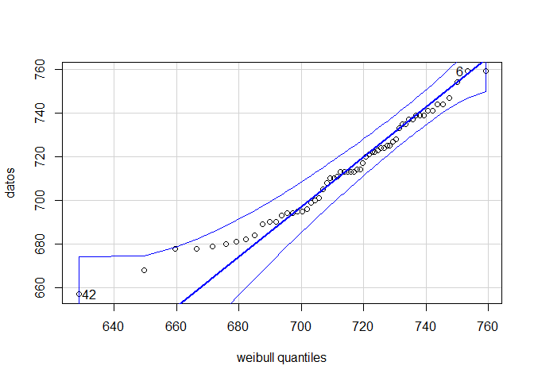
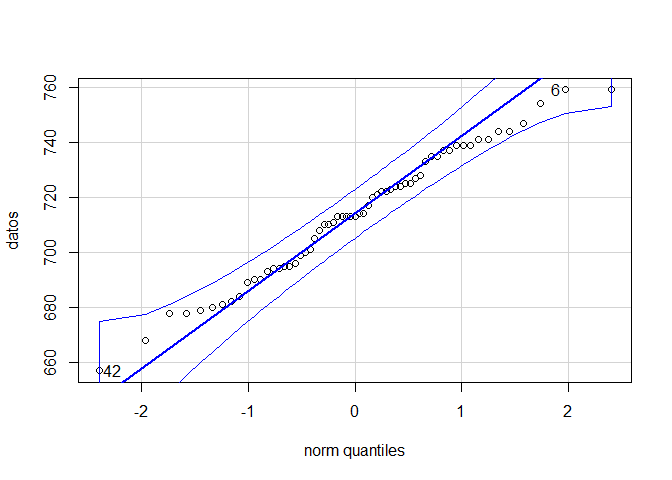

```{r knitr_init, echo=FALSE, cache=FALSE}
library(knitr)
## Global options
opts_chunk$set(echo=TRUE,
               cache=TRUE,
               prompt=FALSE,
               tidy=TRUE,
               comment=NA,
               message=FALSE,
               warning=FALSE,
               fig.path = paste0("../../EstadisticaII/images/", "Clase16"),
               cache.path = "../../EstadisticaII/cache/",
               cache = FALSE)

```

## Prueba de bondad de ajuste
Las pruebas de bondad de ajuste **son un contraste de hipótesis para determinar el grado o nivel de ajuste de nuestros datos a una distribución teórica**. 

Estas pruebas se basan en la comparación de las frecuencias de ocurrencia observadas en una muestra empírica y las frecuencias esperadas de una distribución teórica. En donde, el objetivo será si existe o no discrepancia entre los valores observados y los valores esperados de la distribución de interés.

La hipótesis a probar de interés estará dada por
`\begin{align*}
H_0: X \sim F_0(x) \quad \text{vs} \quad H_1: X \nsim F_0(x)
\end{align*}`

Siendo `$F_0(x)$` la distribución de probabilidad hipótetica que se quiere probar.

Entre las pruebas de bondad de ajuste más usadas se tiene:

```{r echo=FALSE}
library(kableExtra)

tablita <- cbind(
  "Prueba" = c("Kolmogorov–Smirnov", "Cramer–von Mises", "Anderson–Darling", "QQPlot"),
  "Librería" = c("stats", "goftest", "goftest", "car"),
  "Función" = c("ks.test()", "cvm.test()", "ad.test()", "qqPlot()"))

kable(tablita, 
  format = "html", booktabs = T) %>%
kable_styling("striped", full_width = F)

options(scipen = 10)
```

Donde éstas pruebas, **requieren de los parámetros de la distribución que se quiere probar**, y para encontrarlos, es posible emplear **métodos de optimización** que nos permitan observar cuales son los parámetros ajustados para un conjunto de datos determinado. Para emplear estos método de optimización es posible usar la función <tt>fitdistr()</tt> de la librería <tt>MASS</tt>. 

<button id="Show1" class="btn btn-secondary">Mostrar Ejemplo</button>
<button id="Hide1" class="btn btn-info">Ocultar Ejemplo</button>
<main id="botoncito1"> 
<h3 data-toc-skip> Ejercicio </h3> 
<p> Suponga que el grupo de Economía de la Salud ha realizado un estudio sobre los contagios que se han presentado durante las últimas semanas por el COVID-19, ya que tienen la hipótesis de la tasa de contagios posee una distribución Weibull. <br>
<br>
Para probar si dicha hipótesis se encuentra apoyada o no por la información empírica, el grupo de Economía de la Salud, ha decidido tomar como una muestra de los últimos 2 meses (61 días) sobre el número de contagios que se han presentado la región antioqueña, encontrado los siguientes registros (en miles) </p>

<table class="table table-striped" style="width: auto !important; margin-left: auto; margin-right: auto;">
<tbody>
  <tr>
    <td>714</td>
    <td>754</td>
    <td>679</td>
    <td>735</td>
    <td>684</td>
    <td>759</td>
    <td>759</td>
    <td>741</td>
    <td>713</td>
    <td>722</td>
  </tr>
  <tr>
    <td>739</td>
    <td>710</td>
    <td>737</td>
    <td>708</td>
    <td>711</td>
    <td>744</td>
    <td>733</td>
    <td>739</td>
    <td>681</td>
    <td>741</td>
  </tr>
  <tr>
    <td>723</td>
    <td>689</td>
    <td>699</td>
    <td>680</td>
    <td>690</td>
    <td>678</td>
    <td>694</td>
    <td>710</td>
    <td>690</td>
    <td>694</td>
  </tr>
  <tr>
    <td>722</td>
    <td>725</td>
    <td>747</td>
    <td>693</td>
    <td>701</td>
    <td>724</td>
    <td>713</td>
    <td>720</td>
    <td>696</td>
    <td>682</td>
  </tr>
  <tr>
    <td>713</td>
    <td>657</td>
    <td>714</td>
    <td>717</td>
    <td>695</td>
    <td>724</td>
    <td>735</td>
    <td>700</td>
    <td>713</td>
    <td>739</td>
  </tr>
  <tr>
    <td>737</td>
    <td>721</td>
    <td>744</td>
    <td>668</td>
    <td>728</td>
    <td>727</td>
    <td>695</td>
    <td>725</td>
    <td>705</td>
    <td>678</td>
  </tr>
  <tr>
    <td>713</td>
    <td></td>
    <td></td>
    <td></td>
    <td></td>
    <td></td>
    <td></td>
    <td></td>
    <td></td>
    <td></td>
  </tr>
</tbody>
</table>
<p>Si se decide emplear un nivel de significancia del $5\%$, pruebe si las hipótesis planteadas por el grupo de la economía de la salud se encuentran o no apoyadas por la información empírica. </p>

<h3 data-toc-skip> Solución </h3> 
<p>En este caso estamos interesados en emplear un nivel de significancia $\alpha=0.05$ para probar si la información obtenida en $61$ días apoya o no la hipótesis sobre que los contagios que se han presentado durante las últimas semanas por el COVID-19 poseen una distribución Weibull, esto es

$$\begin{align*}
  H_0:X \sim Wei(\alpha,\beta)\\
  H_1:X \not\sim Wei(\alpha,\beta)
\end{align*}$$

y para ello debemos inicialmente ajustar los parámetros de una distribución Weibull que mejor ajustan los datos, mediante la función <tt>fitdistr</tt> de la librería <tt>MASS</tt>, tal que
</p>

<section class="language-r highlighter-rouge"><section class="highlight"><pre class="highlight"><code><span class="c1">## Se cargan los datos</span><span class="w">
</span><span class="n">datos</span><span class="w"> </span><span class="o">&lt;-</span><span class="w"> </span><span class="nf">c</span><span class="p">(</span><span class="m">714</span><span class="p">,</span><span class="w"> </span><span class="m">754</span><span class="p">,</span><span class="w"> </span><span class="m">679</span><span class="p">,</span><span class="w"> </span><span class="m">735</span><span class="p">,</span><span class="w"> </span><span class="m">684</span><span class="p">,</span><span class="w"> </span><span class="m">759</span><span class="p">,</span><span class="w"> </span><span class="m">759</span><span class="p">,</span><span class="w"> </span><span class="m">741</span><span class="p">,</span><span class="w"> </span><span class="m">713</span><span class="p">,</span><span class="w"> </span><span class="m">722</span><span class="p">,</span><span class="w">
           </span><span class="m">739</span><span class="p">,</span><span class="w"> </span><span class="m">710</span><span class="p">,</span><span class="w"> </span><span class="m">737</span><span class="p">,</span><span class="w"> </span><span class="m">708</span><span class="p">,</span><span class="w"> </span><span class="m">711</span><span class="p">,</span><span class="w"> </span><span class="m">744</span><span class="p">,</span><span class="w"> </span><span class="m">733</span><span class="p">,</span><span class="w"> </span><span class="m">739</span><span class="p">,</span><span class="w"> </span><span class="m">681</span><span class="p">,</span><span class="w"> </span><span class="m">741</span><span class="p">,</span><span class="w">
           </span><span class="m">723</span><span class="p">,</span><span class="w"> </span><span class="m">689</span><span class="p">,</span><span class="w"> </span><span class="m">699</span><span class="p">,</span><span class="w"> </span><span class="m">680</span><span class="p">,</span><span class="w"> </span><span class="m">690</span><span class="p">,</span><span class="w"> </span><span class="m">678</span><span class="p">,</span><span class="w"> </span><span class="m">694</span><span class="p">,</span><span class="w"> </span><span class="m">710</span><span class="p">,</span><span class="w"> </span><span class="m">690</span><span class="p">,</span><span class="w"> </span><span class="m">694</span><span class="p">,</span><span class="w">
           </span><span class="m">722</span><span class="p">,</span><span class="w"> </span><span class="m">725</span><span class="p">,</span><span class="w"> </span><span class="m">747</span><span class="p">,</span><span class="w"> </span><span class="m">693</span><span class="p">,</span><span class="w"> </span><span class="m">701</span><span class="p">,</span><span class="w"> </span><span class="m">724</span><span class="p">,</span><span class="w"> </span><span class="m">713</span><span class="p">,</span><span class="w"> </span><span class="m">720</span><span class="p">,</span><span class="w"> </span><span class="m">696</span><span class="p">,</span><span class="w"> </span><span class="m">682</span><span class="p">,</span><span class="w">
           </span><span class="m">713</span><span class="p">,</span><span class="w"> </span><span class="m">657</span><span class="p">,</span><span class="w"> </span><span class="m">714</span><span class="p">,</span><span class="w"> </span><span class="m">717</span><span class="p">,</span><span class="w"> </span><span class="m">695</span><span class="p">,</span><span class="w"> </span><span class="m">724</span><span class="p">,</span><span class="w"> </span><span class="m">735</span><span class="p">,</span><span class="w"> </span><span class="m">700</span><span class="p">,</span><span class="w"> </span><span class="m">713</span><span class="p">,</span><span class="w"> </span><span class="m">739</span><span class="p">,</span><span class="w">
           </span><span class="m">737</span><span class="p">,</span><span class="w"> </span><span class="m">721</span><span class="p">,</span><span class="w"> </span><span class="m">744</span><span class="p">,</span><span class="w"> </span><span class="m">668</span><span class="p">,</span><span class="w"> </span><span class="m">728</span><span class="p">,</span><span class="w"> </span><span class="m">727</span><span class="p">,</span><span class="w"> </span><span class="m">695</span><span class="p">,</span><span class="w"> </span><span class="m">725</span><span class="p">,</span><span class="w"> </span><span class="m">705</span><span class="p">,</span><span class="w"> </span><span class="m">678</span><span class="p">,</span><span class="w">
           </span><span class="m">713</span><span class="p">)</span><span class="w">


</span><span class="c1">## Se realiza el ajuste de los parámetros a una distribución Weibull</span><span class="w">
</span><span class="nf">library</span><span class="p">(</span><span class="n">MASS</span><span class="p">)</span><span class="w">
</span><span class="n">parametros</span><span class="w"> </span><span class="o">&lt;-</span><span class="w"> </span><span class="nf">fitdistr</span><span class="p">(</span><span class="n">x</span><span class="w"> </span><span class="o">=</span><span class="w"> </span><span class="n">datos</span><span class="p">,</span><span class="w"> </span><span class="n">densfun</span><span class="w"> </span><span class="o">=</span><span class="w"> </span><span class="s2">"weibull"</span><span class="p">)</span><span class="w">
</span><span class="n">parametros</span><span class="w">
</span></code></pre></section></section>

<section class="highlighter-rouge"><section class="highlight"><pre class="highlight"><code>     shape        scale   
   33.781908   724.649562 
 (  3.286809) (  2.906706)
</code></pre></section></section>

<p> Una vez conocidos el valor de los parámetros de la distribución Weibull que ofrecen un mejor ajuste a los datos muestrales, tal que $\alpha = 33.781908$ y $\beta = 724.649562$, se procede al ajuste de la distribución mediante el empleo de la prueba Cramer-Von Mises, mediante la función <tt>cvm.test</tt> de la librería <tt>goftest</tt></p>

<section class="language-r highlighter-rouge"><section class="highlight"><pre class="highlight"><code><span class="c1">## Se hace el ajuste de los datos a la distribución Weibull</span><span class="w">
</span><span class="nf">library</span><span class="p">(</span><span class="n">goftest</span><span class="p">)</span><span class="w">
</span><span class="nf">cvm.test</span><span class="p">(</span><span class="n">x</span><span class="w"> </span><span class="o">=</span><span class="w"> </span><span class="n">datos</span><span class="p">,</span><span class="w"> </span><span class="n">null</span><span class="w"> </span><span class="o">=</span><span class="w"> </span><span class="s2">"pweibull"</span><span class="p">,</span><span class="w"> </span><span class="n">shape</span><span class="w"> </span><span class="o">=</span><span class="w"> </span><span class="n">parametros</span><span class="o">$</span><span class="n">estimate</span><span class="p">[</span><span class="m">1</span><span class="p">],</span><span class="w">
    </span><span class="n">scale</span><span class="w"> </span><span class="o">=</span><span class="w"> </span><span class="n">parametros</span><span class="o">$</span><span class="n">estimate</span><span class="p">[</span><span class="m">2</span><span class="p">])</span><span class="w">
</span></code></pre></section></section>

<section class="highlighter-rouge"><section class="highlight"><pre class="highlight"><code>	Cramer-von Mises test of goodness-of-fit
	Null hypothesis: Weibull distribution
	with parameters shape = 33.781908, scale =
	724.649562
	Parameters assumed to be fixed

data:  datos
omega2 = 0.067026, p-value = 0.7718
</code></pre></section></section>

<p> Donde se observa que la prueba de bondad de ajuste arrojó un P-valor$=0.7718$, por lo cual al ser mayor que al nivel de significancia $\alpha=0.05$, se concluirá que no hay evidencia en contra de rechazar la hipótesis nula de que los datos poseen una distribución Weibull con parámetro de forma $\alpha = 33.781908$ y parámetro de escala $\beta = 724.649562$. <br>
<br>
Adicionalmente, podemos ver el ajuste que tiene la distribución Weibull de parámetros $\alpha = 33.781908$ y $\beta = 724.649562$, mediante un QQ-plot, tal que </p>

<section class="language-r highlighter-rouge"><section class="highlight"><pre class="highlight"><code><span class="c1">## Se muestra el ajuste de la distribución Weibull de forma gráfica</span><span class="w">
</span><span class="nf">library</span><span class="p">(</span><span class="n">car</span><span class="p">)</span><span class="w">
</span><span class="nf">qqPlot</span><span class="p">(</span><span class="n">datos</span><span class="p">,</span><span class="w"> </span><span class="n">dist</span><span class="w"> </span><span class="o">=</span><span class="w"> </span><span class="s2">"weibull"</span><span class="p">,</span><span class="w"> </span><span class="n">shape</span><span class="w"> </span><span class="o">=</span><span class="w"> </span><span class="n">parametros</span><span class="o">$</span><span class="n">estimate</span><span class="p">[</span><span class="m">1</span><span class="p">],</span><span class="w"> </span><span class="n">scale</span><span class="w"> </span><span class="o">=</span><span class="w"> </span><span class="n">parametros</span><span class="o">$</span><span class="n">estimate</span><span class="p">[</span><span class="m">2</span><span class="p">],</span><span class="w">
    </span><span class="n">envelope</span><span class="w"> </span><span class="o">=</span><span class="w"> </span><span class="m">0.95</span><span class="p">)</span><span class="w">
</span></code></pre></section></section>

<p></p>

<p> en donde se observa que todos los puntos asociados a la distirbución empírica caen dentro de los límites de confianza del $95\%$ del QQ-plot, y por tanto se tendrá con un nivel de significancia $\alpha=0.05$, que el número de contagios que se han presentado durante las últimas semanas por el COVID-19, posee una distribución Weibull con parámetro de forma $\alpha = 33.781908$ y parámetro de escala $\beta = 724.649562$. </p>

```{r echo = FALSE, eval = FALSE}
## Se cargan los datos
datos <- c(714,754,679,735,684,759,759,741,713,722,
           739,710,737,708,711,744,733,739,681,741,
           723,689,699,680,690,678,694,710,690,694,
           722,725,747,693,701,724,713,720,696,682,
           713,657,714,717,695,724,735,700,713,739,
           737,721,744,668,728,727,695,725,705,678,
           713)


## Se realiza el ajuste de los parámetros a una distribución Weibull
library(MASS)
parametros <- fitdistr(x = datos, densfun = "weibull")
parametros
```

```{r echo = FALSE, eval = FALSE}
## Se hace el ajuste de los datos a la distribución Weibull
library(goftest)
cvm.test(x = datos, distn = "pweibull", shape = parametros$estimate[1], scale = parametros$estimate[2])
```

```{r echo = FALSE, eval = FALSE}
## Se muestra el ajuste de la distribución Weibull de forma gráfica
library(car)
qqPlot(datos, dist="weibull", shape = parametros$estimate[1], scale = parametros$estimate[2], envelope = 0.95)
```
</main>

### Pruebas de normalidad
Un caso particular de las pruebas de bondad de ajuste son las pruebas específicas que permiten probar si un conjunto de datos se distribuyen o no normalmente, en donde el juego de hipótesis de interés estará dado por

`\begin{align*}
H_0: X \sim N(\mu,\sigma^2) \quad \text{vs} \quad H_1: X \nsim N(\mu,\sigma^2)
\end{align*}`

A saber, las funciones más usadas de bondad de ajuste para probar normalidad son:

```{r echo=FALSE}
library(kableExtra)

tablita <- cbind(
  "Prueba" = c("Shapiro-Wilk", "Lilliefors", "Shapiro-Francia", "Cramer Von-Mises", "Anderson-Darling", "QQPlot"),
  "Librería" = c("stats", "nortest", "nortest", "nortest", "nortest", "car"),
  "Función" = c("shapiro.test()", "lillie.test()", "sf.test()", "cvm.test()", "ad.test()", "qqPlot()"))

kable(tablita, 
  format = "html", booktabs = T) %>%
kable_styling("striped", full_width = F)

options(scipen = 10)
```

en donde, a diferencia de las pruebas de bondad de ajuste anteriormente presentadas, éstas pruebas no requieren ajustar con anterioridad los parámetros de la distribución normal, ya que dicho procedimiento se realiza de forma interna dentro de las funciones de ajuste.

<button id="Show2" class="btn btn-secondary">Mostrar Ejemplo</button>
<button id="Hide2" class="btn btn-info">Ocultar Ejemplo</button>
<main id="botoncito2"> 
<h3 data-toc-skip> Ejercicio </h3> 
<p> Suponga que el grupo de Economía de la Salud ha realizado un estudio sobre los contagios que se han presentado durante las últimas semanas por el COVID-19, ya que tienen la hipótesis de la tasa de contagios posee una distribución Normal. <br>
<br>
Para probar si dicha hipótesis se encuentra apoyada o no por la información empírica, el grupo de Economía de la Salud, ha decidido tomar como una muestra de los últimos 2 meses (61 días) sobre el número de contagios que se han presentado la región antioqueña, encontrado los siguientes registros (en miles) </p>

<table class="table table-striped" style="width: auto !important; margin-left: auto; margin-right: auto;">
<tbody>
  <tr>
    <td>714</td>
    <td>754</td>
    <td>679</td>
    <td>735</td>
    <td>684</td>
    <td>759</td>
    <td>759</td>
    <td>741</td>
    <td>713</td>
    <td>722</td>
  </tr>
  <tr>
    <td>739</td>
    <td>710</td>
    <td>737</td>
    <td>708</td>
    <td>711</td>
    <td>744</td>
    <td>733</td>
    <td>739</td>
    <td>681</td>
    <td>741</td>
  </tr>
  <tr>
    <td>723</td>
    <td>689</td>
    <td>699</td>
    <td>680</td>
    <td>690</td>
    <td>678</td>
    <td>694</td>
    <td>710</td>
    <td>690</td>
    <td>694</td>
  </tr>
  <tr>
    <td>722</td>
    <td>725</td>
    <td>747</td>
    <td>693</td>
    <td>701</td>
    <td>724</td>
    <td>713</td>
    <td>720</td>
    <td>696</td>
    <td>682</td>
  </tr>
  <tr>
    <td>713</td>
    <td>657</td>
    <td>714</td>
    <td>717</td>
    <td>695</td>
    <td>724</td>
    <td>735</td>
    <td>700</td>
    <td>713</td>
    <td>739</td>
  </tr>
  <tr>
    <td>737</td>
    <td>721</td>
    <td>744</td>
    <td>668</td>
    <td>728</td>
    <td>727</td>
    <td>695</td>
    <td>725</td>
    <td>705</td>
    <td>678</td>
  </tr>
  <tr>
    <td>713</td>
    <td></td>
    <td></td>
    <td></td>
    <td></td>
    <td></td>
    <td></td>
    <td></td>
    <td></td>
    <td></td>
  </tr>
</tbody>
</table>
<p>Si se decide emplear un nivel de significancia del $5\%$, pruebe si las hipótesis planteadas por el grupo de la economía de la salud se encuentran o no apoyadas por la información empírica. </p>

<section class="language-r highlighter-rouge"><section class="highlight"><pre class="highlight"><code><span class="c1">## Se cargan los datos</span><span class="w">
</span><span class="n">datos</span><span class="w"> </span><span class="o">&lt;-</span><span class="w"> </span><span class="nf">c</span><span class="p">(</span><span class="m">714</span><span class="p">,</span><span class="w"> </span><span class="m">754</span><span class="p">,</span><span class="w"> </span><span class="m">679</span><span class="p">,</span><span class="w"> </span><span class="m">735</span><span class="p">,</span><span class="w"> </span><span class="m">684</span><span class="p">,</span><span class="w"> </span><span class="m">759</span><span class="p">,</span><span class="w"> </span><span class="m">759</span><span class="p">,</span><span class="w"> </span><span class="m">741</span><span class="p">,</span><span class="w"> </span><span class="m">713</span><span class="p">,</span><span class="w"> </span><span class="m">722</span><span class="p">,</span><span class="w"> </span><span class="m">739</span><span class="p">,</span><span class="w"> </span><span class="m">710</span><span class="p">,</span><span class="w"> </span><span class="m">737</span><span class="p">,</span><span class="w"> </span><span class="m">708</span><span class="p">,</span><span class="w">
    </span><span class="m">711</span><span class="p">,</span><span class="w"> </span><span class="m">744</span><span class="p">,</span><span class="w"> </span><span class="m">733</span><span class="p">,</span><span class="w"> </span><span class="m">739</span><span class="p">,</span><span class="w"> </span><span class="m">681</span><span class="p">,</span><span class="w"> </span><span class="m">741</span><span class="p">,</span><span class="w"> </span><span class="m">723</span><span class="p">,</span><span class="w"> </span><span class="m">689</span><span class="p">,</span><span class="w"> </span><span class="m">699</span><span class="p">,</span><span class="w"> </span><span class="m">680</span><span class="p">,</span><span class="w"> </span><span class="m">690</span><span class="p">,</span><span class="w"> </span><span class="m">678</span><span class="p">,</span><span class="w"> </span><span class="m">694</span><span class="p">,</span><span class="w"> </span><span class="m">710</span><span class="p">,</span><span class="w"> </span><span class="m">690</span><span class="p">,</span><span class="w"> </span><span class="m">694</span><span class="p">,</span><span class="w">
    </span><span class="m">722</span><span class="p">,</span><span class="w"> </span><span class="m">725</span><span class="p">,</span><span class="w"> </span><span class="m">747</span><span class="p">,</span><span class="w"> </span><span class="m">693</span><span class="p">,</span><span class="w"> </span><span class="m">701</span><span class="p">,</span><span class="w"> </span><span class="m">724</span><span class="p">,</span><span class="w"> </span><span class="m">713</span><span class="p">,</span><span class="w"> </span><span class="m">720</span><span class="p">,</span><span class="w"> </span><span class="m">696</span><span class="p">,</span><span class="w"> </span><span class="m">682</span><span class="p">,</span><span class="w"> </span><span class="m">713</span><span class="p">,</span><span class="w"> </span><span class="m">657</span><span class="p">,</span><span class="w"> </span><span class="m">714</span><span class="p">,</span><span class="w"> </span><span class="m">717</span><span class="p">,</span><span class="w"> </span><span class="m">695</span><span class="p">,</span><span class="w"> </span><span class="m">724</span><span class="p">,</span><span class="w">
    </span><span class="m">735</span><span class="p">,</span><span class="w"> </span><span class="m">700</span><span class="p">,</span><span class="w"> </span><span class="m">713</span><span class="p">,</span><span class="w"> </span><span class="m">739</span><span class="p">,</span><span class="w"> </span><span class="m">737</span><span class="p">,</span><span class="w"> </span><span class="m">721</span><span class="p">,</span><span class="w"> </span><span class="m">744</span><span class="p">,</span><span class="w"> </span><span class="m">668</span><span class="p">,</span><span class="w"> </span><span class="m">728</span><span class="p">,</span><span class="w"> </span><span class="m">727</span><span class="p">,</span><span class="w"> </span><span class="m">695</span><span class="p">,</span><span class="w"> </span><span class="m">725</span><span class="p">,</span><span class="w"> </span><span class="m">705</span><span class="p">,</span><span class="w"> </span><span class="m">678</span><span class="p">,</span><span class="w"> </span><span class="m">713</span><span class="p">)</span><span class="w">

</span><span class="c1">## Se hace el ajuste de los datos a la distribución Normal</span><span class="w">
</span><span class="nf">library</span><span class="p">(</span><span class="n">nortest</span><span class="p">)</span><span class="w">
</span><span class="nf">lillie.test</span><span class="p">(</span><span class="n">datos</span><span class="p">)</span><span class="w">
</span></code></pre></section></section>

<section class="highlighter-rouge"><section class="highlight"><pre class="highlight"><code>    Lilliefors (Kolmogorov-Smirnov) normality test

data:  datos
D = 0.066013, p-value = 0.7321
</code></pre></section></section>

<p>Observando que al obtener un P-valor$=0.7321$ se tendrá que no hay evidencia en contra de la hipótesis nula, ya que el P-valor obtenido en la prueba de normalidad es superior al nivel de significancia $\alpha=0.05$, concluyendo entonces que el número de contagios que se han presentado durante las últimas semanas por el COVID-19, posee una distribución Normal.<br>
<br>
Además, si realizamos el QQ-plot para observar el ajuste de las observaciones a la distribución normal se tiene que</p>

<section class="language-r highlighter-rouge"><section class="highlight"><pre class="highlight"><code><span class="c1">## Se muestra el ajuste de la distribución Normal de forma gráfica</span><span class="w">
</span><span class="nf">library</span><span class="p">(</span><span class="n">car</span><span class="p">)</span><span class="w">
</span><span class="nf">qqPlot</span><span class="p">(</span><span class="n">datos,</span> <span class="n">envelope</span><span class="w"> </span><span class="o">=</span><span class="w"> </span><span class="m">0.95</span><span class="p">)</span>
</code></pre></section></section>

<p></p>

<p>En donde se aprecia que la totalidad de los puntos asociados a los datos muestrales caen dentro de las bandas de confianza del $95\%$ de la distribución normal, por lo cual se concluye con un nivel de significancia del $5\%$ que el número de contagios que se han presentado durante las últimas semanas por el COVID-19, si posee una distribución Normal.</p>

```{r echo = FALSE, eval = FALSE}
## Se cargan los datos
datos <- c(714,754,679,735,684,759,759,741,713,722,
           739,710,737,708,711,744,733,739,681,741,
           723,689,699,680,690,678,694,710,690,694,
           722,725,747,693,701,724,713,720,696,682,
           713,657,714,717,695,724,735,700,713,739,
           737,721,744,668,728,727,695,725,705,678,
           713)

## Se hace el ajuste de los datos a la distribución Normal
library(nortest)
lillie.test(datos)
```

```{r echo = FALSE, eval = FALSE}
## Se muestra el ajuste de la distribución Normal de forma gráfica
library(car)
qqPlot(datos, envelope = 0.95)
```

</main>


## Tablas de contingencia
Las tablas de contingencia se emplean para probar si uno o más atributos de una población son o no independientes. Para ello se plantea el siguiente juego de hipótesis

`\begin{align*}
H_0&: \text{Los atributos de la población son independientes}\\
H_1&: \text{Los atributos de la población son dependientes}
\end{align*}`

Suponga que en una población se clasifica según los atributos `$A$` y `$B$`, y además suponga que existen `$r$` categorías en el atributo `$A$` y `$c$` categorías en el atributo `$B$`, de forma que hay un total de `$r\times c$`  posibles combinaciones entre los atributos, tal que

<table class="table table-striped" style="width: auto !important; margin-left: auto; margin-right: auto;">
<tbody>
<tr>
<td rowspan="1" colspan="1" style="text-align:center; vertical-align: middle;"><script type="math/tex">\mathbf{\text{F. Observadas}}</script></td>
<td style="text-align:center;vertical-align: middle !important;" colspan="5"><script type="math/tex">\mathbf{\text{Atributo B}}</script>
</td>
<td style="text-align:center;vertical-align: middle !important;" rowspan="2"><script type="math/tex">\mathbf{Total}</script>
</td>
</tr>
<tr>
<td style="text-align:center;vertical-align: middle !important;" rowspan="5"><script type="math/tex">\mathbf{\text{Atributo A}}</script>
</td>
<td style="text-align:center;"><script type="math/tex">\mathbf{\text{Categoría}}</script>
</td>
<td style="text-align:center;"><script type="math/tex">\mathbf{1}</script>
</td>
<td style="text-align:center;"><script type="math/tex">\mathbf{2}</script>
</td>
<td style="text-align:center;"><script type="math/tex">\boldsymbol{\ldots}</script>
</td>
<td style="text-align:center;"><script type="math/tex">\mathbf{c}</script>
</td>
</tr>
<tr>
<td style="text-align:center;"><script type="math/tex">\mathbf{1}</script>
</td>
<td style="text-align:center;"><script type="math/tex">O_{11}</script>
</td>
<td style="text-align:center;"><script type="math/tex">O_{12}</script>
</td>
<td style="text-align:center;"><script type="math/tex">\cdots</script>
</td>
<td style="text-align:center;"><script type="math/tex">O_{1c}</script>
</td>
<td style="text-align:center;"><script type="math/tex">R_{1}</script>
</td></tr>
<tr>
<td style="text-align:center;"><script type="math/tex">\mathbf{2}</script>
</td>
<td style="text-align:center;"><script type="math/tex">O_{21}</script>
</td>
<td style="text-align:center;"><script type="math/tex">O_{22}</script>
</td>
<td style="text-align:center;"><script type="math/tex">\cdots</script>
</td>
<td style="text-align:center;"><script type="math/tex">O_{2c}</script>
</td>
<td style="text-align:center;"><script type="math/tex">R_{2}</script>
</td>
</tr>
<tr>
<td style="text-align:center;"><script type="math/tex">\boldsymbol{\vdots}</script>
</td>
<td style="text-align:center;"><script type="math/tex">\vdots</script>
</td>
<td style="text-align:center;"><script type="math/tex">\vdots</script>
</td>
<td style="text-align:center;"><script type="math/tex">\ddots</script>
</td>
<td style="text-align:center;"><script type="math/tex">\vdots</script>
</td>
<td style="text-align:center;"><script type="math/tex">\vdots</script>
</td></tr>
<tr>
<td style="text-align:center;"><script type="math/tex">\mathbf{r}</script>
</td>
<td style="text-align:center;"><script type="math/tex">O_{r1}</script>
</td>
<td style="text-align:center;"><script type="math/tex">O_{r2}</script>
</td>
<td style="text-align:center;"><script type="math/tex">\cdots</script>
</td>
<td style="text-align:center;"><script type="math/tex">O_{rc}</script>
</td>
<td style="text-align:center;"><script type="math/tex">R_{r}</script>
</td>
</tr>
<tr>
<td style="text-align:center;" colspan="2"><script type="math/tex">\mathbf{\text{Total}}</script>
</td>
<td style="text-align:center;"><script type="math/tex">C_{1}</script>
</td>
<td style="text-align:center;"><script type="math/tex">C_{2}</script>
</td>
<td style="text-align:center;"><script type="math/tex">\cdots</script>
</td>
<td style="text-align:center;"><script type="math/tex">C_{c}</script>
</td>
<td style="text-align:center;"><script type="math/tex">n</script>
</td>
</tr></tbody>
</table>

Donde `$O_{ij}$`: es el número de observaciones entre la i-ésima categoría de `$A$` y la j-ésima categoría de `$B$`, `$R_{i}$`: es la suma de las observaciones por fila, y `$C_{j}$`: es la suma de las observaciones por columnas, tal que 
`\begin{align*}
R_{i}=\sum_{j=1}^{c}O_{ij} \qquad \qquad C_{j}=\sum_{i=1}^{r}O_{ij}
\end{align*}`

Ahora, con el fin de probar si hay o no independencia entre las categorías, es necesario calcular `$E_{ij}$` el número de observaciones esperadas en la casilla `$ij$`, tal que
`\begin{align*}
E_{ij}=np_{ij}
\end{align*}`

donde `$pij$` es la probabilidad conjunta bajo el supuesto de independiencia, entonces
`\begin{align*}
p_{ij} = \frac{R_{i}}{n}\times \frac{C_{j}}{n} =\frac{R_{i}C_{j}}{n^2}
\end{align*}`

y por tanto
`\begin{align*}
E_{ij} = \frac{R_{i}C_{j}}{n}
\end{align*}`

Una vez calculados cada uno de los `$E_{ij}$`, es posible reescribir dichos valores de forma en forma de matríz de la forma

<table class="table table-striped" style="width: auto !important; margin-left: auto; margin-right: auto;">
<tbody>
<tr>
<td rowspan="1" colspan="1" style="text-align:center; vertical-align: middle;"><script type="math/tex">\mathbf{\text{F. Esperadas}}</script></td>
<td style="text-align:center;vertical-align: middle !important;" colspan="5"><script type="math/tex">\mathbf{\text{Atributo B}}</script>
</td>
</tr>
<tr>
<td style="text-align:center;vertical-align: middle !important;" rowspan="5"><script type="math/tex">\mathbf{\text{Atributo A}}</script>
</td>
<td style="text-align:center;"><script type="math/tex">\mathbf{\text{Categoría}}</script>
</td>
<td style="text-align:center;"><script type="math/tex">\mathbf{1}</script>
</td>
<td style="text-align:center;"><script type="math/tex">\mathbf{2}</script>
</td>
<td style="text-align:center;"><script type="math/tex">\boldsymbol{\ldots}</script>
</td>
<td style="text-align:center;"><script type="math/tex">\mathbf{c}</script>
</td>
</tr>
<tr>
<td style="text-align:center;"><script type="math/tex">\mathbf{1}</script>
</td>
<td style="text-align:center;"><script type="math/tex">E_{11}</script>
</td>
<td style="text-align:center;"><script type="math/tex">E_{12}</script>
</td>
<td style="text-align:center;"><script type="math/tex">\cdots</script>
</td>
<td style="text-align:center;"><script type="math/tex">E_{1c}</script>
</td></tr>
<tr>
<td style="text-align:center;"><script type="math/tex">\mathbf{2}</script>
</td>
<td style="text-align:center;"><script type="math/tex">E_{21}</script>
</td>
<td style="text-align:center;"><script type="math/tex">E_{22}</script>
</td>
<td style="text-align:center;"><script type="math/tex">\cdots</script>
</td>
<td style="text-align:center;"><script type="math/tex">E_{2c}</script>
</td></tr>
<tr>
<td style="text-align:center;"><script type="math/tex">\boldsymbol{\vdots}</script>
</td>
<td style="text-align:center;"><script type="math/tex">\vdots</script>
</td>
<td style="text-align:center;"><script type="math/tex">\vdots</script>
</td>
<td style="text-align:center;"><script type="math/tex">\ddots</script>
</td>
<td style="text-align:center;"><script type="math/tex">\vdots</script>
</td></tr>
<tr>
<td style="text-align:center;"><script type="math/tex">\mathbf{r}</script>
</td>
<td style="text-align:center;"><script type="math/tex">E_{r1}</script>
</td>
<td style="text-align:center;"><script type="math/tex">E_{r2}</script>
</td>
<td style="text-align:center;"><script type="math/tex">\cdots</script>
</td>
<td style="text-align:center;"><script type="math/tex">E_{rc}</script>
</td></tr>
</tbody>
</table>

Finalmente, al comparar las frecuencias observadas `$O_{ij}$` con las frecuencias esperadas `$E_{ij}$`, se tendrá que el estadístico de prueba para probar la independencia, será de la forma
`\begin{align*}
\chi^2_{c}=\sum_{i=1}^{r}\sum_{j=1}^{c} \frac{(O_{ij}- E_{ij})^2}{E_{ij}} \sim \chi^2_{(r-1)(c-1)}
\end{align*}`

la región crítica 
`\begin{align*}
RC:\{\chi^2|\chi^2>\chi^2_{\alpha,(r-1)(c-1)}\}
\end{align*}`

y el P-valor 
`\begin{align*}
\text{P-valor}=\mathbb{P}(\chi^2_{(r-1)(c-1)}>\chi^2_c)
\end{align*}`

<button id="Show3" class="btn btn-secondary">Mostrar Ejemplo</button>
<button id="Hide3" class="btn btn-info">Ocultar Ejemplo</button>
<main id="botoncito3"> 
<h3 data-toc-skip> Ejercicio </h3> 
<p> Suponga que se desea clasificar los defectos de fabricación en una empresa manufacturera de acuerdo al tipo de defecto y la jornada en la cual fueron producidas.<br>
<br>
Suponga que se obtienen los siguientes resultados de una muestra aleatoria de $350$ productos defectuosos</p>

<table class="table table-striped" style="width: auto !important; margin-left: auto; margin-right: auto;">
<tbody>
<tr>
<td rowspan="1" colspan="1" style="text-align:center; vertical-align: middle;"><script type="math/tex">\mathbf{\text{F. Observadas}}</script></td>
<td style="text-align:center;vertical-align: middle !important;" colspan="5"><script type="math/tex">\mathbf{\text{Tipo de Defecto}}</script>
</td>
</tr>
<tr>
<td style="text-align:center;vertical-align: middle !important;" rowspan="4"><script type="math/tex">\mathbf{\text{Turno}}</script>
</td>
<td style="text-align:center;"><script type="math/tex">\mathbf{\text{Categoría}}</script>
</td>
<td style="text-align:center;"><script type="math/tex">\mathbf{A}</script>
</td>
<td style="text-align:center;"><script type="math/tex">\mathbf{B}</script>
</td>
<td style="text-align:center;"><script type="math/tex">\mathbf{C}</script>
</td>
<td style="text-align:center;"><script type="math/tex">\mathbf{D}</script>
</td>
</tr>
<tr>
<td style="text-align:center;"><script type="math/tex">\mathbf{Mañana}</script>
</td>
<td style="text-align:center;"><script type="math/tex">16</script>
</td>
<td style="text-align:center;"><script type="math/tex">27</script>
</td>
<td style="text-align:center;"><script type="math/tex">50</script>
</td>
<td style="text-align:center;"><script type="math/tex">17</script>
</td></tr>
<tr>
<td style="text-align:center;"><script type="math/tex">\mathbf{Tarde}</script>
</td>
<td style="text-align:center;"><script type="math/tex">31</script>
</td>
<td style="text-align:center;"><script type="math/tex">34</script>
</td>
<td style="text-align:center;"><script type="math/tex">38</script>
</td>
<td style="text-align:center;"><script type="math/tex">7</script>
</td></tr>
<tr>
<td style="text-align:center;"><script type="math/tex">\mathbf{Noche}</script>
</td>
<td style="text-align:center;"><script type="math/tex">38</script>
</td>
<td style="text-align:center;"><script type="math/tex">17</script>
</td>
<td style="text-align:center;"><script type="math/tex">52</script>
</td>
<td style="text-align:center;"><script type="math/tex">23</script>
</td></tr>
</tbody>
</table>

<p>Contrastar a un nivel de significancia del $5%$, si existe independencia entre el tipo de defecto y el turno de producción en el cual fue manufacturado el producto.</p>

<h3 data-toc-skip> Solución </h3> 
<p>Con el fin de probar si existe o no independencia entre el tipo de defecto y el turno de producción en el cual fue manufacturado el producto, es necesario calcular inicialmente las sumas marginales por filas y columnas de la varible observada, tal que</p>

<table class="table table-striped" style="width: auto !important; margin-left: auto; margin-right: auto;">
<tbody>
<tr>
<td rowspan="1" colspan="1" style="text-align:center; vertical-align: middle;"><script type="math/tex">\mathbf{\text{F. Observadas}}</script></td>
<td style="text-align:center;vertical-align: middle !important;" colspan="5"><script type="math/tex">\mathbf{\text{Tipo de Defecto}}</script>
</td>
<td style="text-align:center;vertical-align: middle !important;" rowspan="2"><script type="math/tex">\mathbf{Total}</script>
</td>
</tr>
<tr>
<td style="text-align:center;vertical-align: middle !important;" rowspan="4"><script type="math/tex">\mathbf{\text{Turno}}</script>
</td>
<td style="text-align:center;"><script type="math/tex">\mathbf{\text{Categoría}}</script>
</td>
<td style="text-align:center;"><script type="math/tex">\mathbf{A}</script>
</td>
<td style="text-align:center;"><script type="math/tex">\mathbf{B}</script>
</td>
<td style="text-align:center;"><script type="math/tex">\mathbf{C}</script>
</td>
<td style="text-align:center;"><script type="math/tex">\mathbf{D}</script>
</td>
</tr>
<tr>
<td style="text-align:center;"><script type="math/tex">\mathbf{Mañana}</script>
</td>
<td style="text-align:center;"><script type="math/tex">16</script>
</td>
<td style="text-align:center;"><script type="math/tex">27</script>
</td>
<td style="text-align:center;"><script type="math/tex">50</script>
</td>
<td style="text-align:center;"><script type="math/tex">17</script>
</td>
<td style="text-align:center;"><script type="math/tex">110</script>
</td></tr>
<tr>
<td style="text-align:center;"><script type="math/tex">\mathbf{Tarde}</script>
</td>
<td style="text-align:center;"><script type="math/tex">31</script>
</td>
<td style="text-align:center;"><script type="math/tex">34</script>
</td>
<td style="text-align:center;"><script type="math/tex">38</script>
</td>
<td style="text-align:center;"><script type="math/tex">7</script>
</td>
<td style="text-align:center;"><script type="math/tex">110</script>
</td>
</tr>
<tr>
<td style="text-align:center;"><script type="math/tex">\mathbf{Noche}</script>
</td>
<td style="text-align:center;"><script type="math/tex">38</script>
</td>
<td style="text-align:center;"><script type="math/tex">17</script>
</td>
<td style="text-align:center;"><script type="math/tex">52</script>
</td>
<td style="text-align:center;"><script type="math/tex">23</script>
</td>
<td style="text-align:center;"><script type="math/tex">130</script>
</td>
</tr>
<tr>
<td style="text-align:center;" colspan="2"><script type="math/tex">\mathbf{\text{Total}}</script>
</td>
<td style="text-align:center;"><script type="math/tex">85</script>
</td>
<td style="text-align:center;"><script type="math/tex">78</script>
</td>
<td style="text-align:center;"><script type="math/tex">140</script>
</td>
<td style="text-align:center;"><script type="math/tex">47</script>
</td>
<td style="text-align:center;"><script type="math/tex">350</script>
</td>
</tr></tbody>
</table>

<p>Una vez calculadas las sumas marginales por fila y por columna, se procede a calcular las frecuencias esperadas, mediante la ecuación 

$$\begin{align*}
  E_{ij} = \frac{R_{i}C_{j}}{n}
\end{align*}$$

para obtener la siguiente tabla de frecuencias esperadas, de la forma </p>

<table class="table table-striped" style="width: auto !important; margin-left: auto; margin-right: auto;">
<tbody>
<tr>
<td rowspan="1" colspan="1" style="text-align:center; vertical-align: middle;"><script type="math/tex">\mathbf{\text{F. Esperadas}}</script></td>
<td style="text-align:center;vertical-align: middle !important;" colspan="5"><script type="math/tex">\mathbf{\text{Tipo de Defecto}}</script>
</td>
</tr>
<tr>
<td style="text-align:center;vertical-align: middle !important;" rowspan="5"><script type="math/tex">\mathbf{\text{Turno}}</script>
</td>
<td style="text-align:center;"><script type="math/tex">\mathbf{\text{Categoría}}</script>
</td>
<td style="text-align:center;"><script type="math/tex">\mathbf{A}</script>
</td>
<td style="text-align:center;"><script type="math/tex">\mathbf{B}</script>
</td>
<td style="text-align:center;"><script type="math/tex">\mathbf{C}</script>
</td>
<td style="text-align:center;"><script type="math/tex">\mathbf{D}</script>
</td>
</tr>
<tr>
<td style="text-align:center;"><script type="math/tex">\mathbf{Mañana}</script>
</td>
<td style="text-align:center;"><script type="math/tex">26.71429</script>
</td>
<td style="text-align:center;"><script type="math/tex">24.51429</script>
</td>
<td style="text-align:center;"><script type="math/tex">44</script>
</td>
<td style="text-align:center;"><script type="math/tex">14.77143</script>
</td></tr>
<tr>
<td style="text-align:center;"><script type="math/tex">\mathbf{Tarde}</script>
</td>
<td style="text-align:center;"><script type="math/tex">26.71429</script>
</td>
<td style="text-align:center;"><script type="math/tex">24.51429</script>
</td>
<td style="text-align:center;"><script type="math/tex">44</script>
</td>
<td style="text-align:center;"><script type="math/tex">14.77143</script>
</td></tr>
<tr>
<td style="text-align:center;"><script type="math/tex">\mathbf{Noche}</script>
</td>
<td style="text-align:center;"><script type="math/tex">31.57143</script>
</td>
<td style="text-align:center;"><script type="math/tex">28.97143</script>
</td>
<td style="text-align:center;"><script type="math/tex">52</script>
</td>
<td style="text-align:center;"><script type="math/tex">17.45714</script>
</td></tr>
</tbody>
</table>

<p>Y ahora, al emplear los valores observados con los esperados, se realiza el cálculo del estadístico de prueba, tal que 

$$\begin{align*}
  \chi^2_{c}&=\sum_{i=1}^{r}\sum_{j=1}^{c} \frac{(O_{ij}- E_{ij})^2}{E_{ij}} \sim \chi^2_{(r-1)(c-1)}\\
  &=\frac{(16 - 26.71429)^2}{26.71429} + \frac{(27 - 24.51429)^2}{24.51429} + \ldots + \frac{(23 - 17.45714)^2}{17.45714}\\
  &=22.98415
\end{align*}$$

Finalmente se plantea el criterio de decisión, en donde la región crítica asociada para un nivel de significancia del $5\%$ está dada por
$$\begin{align*}
  RC&:\{\chi^2|\chi^2>\chi^2_{\alpha,(r-1)(c-1)}\}\\
  RC&:\{\chi^2|\chi^2>\chi^2_{0.05,(3-1)(4-1)}\}\\
  RC&:\{\chi^2|\chi^2>\chi^2_{0.05,6}\}\\
  RC&:\{\chi^2|\chi^2>`r qchisq(p = 0.05, df = (3-1)*(4-1), lower.tail = F)`\}\\
\end{align*}$$

mientras que el P-valor asociado al estadístico de prueba es igual a 

$$\begin{align*}
  \text{P-valor}&=\mathbb{P}(\chi^2_{(r-1)(c-1)} > \chi^2_c)\\
                &=\mathbb{P}(\chi^2_{(3-1)(4-1)} > 22.98415)\\
                &=\mathbb{P}(\chi^2_{6} > 22.98415)\\
                &=0.0008018046
\end{align*}$$

Encontrando con un nivel de significancia del $5\%$ que se rechaza la hipótesis nula de que el tipo de defecto y el turno sean categorías independiente, lo cual quiere decir que el turno laboral si influye en el tipo de defecto que tienen los productos producidos por la empresa maufacturera, debido a que el estadístico de prueba cae dentro de la región crítica, y el P-valor es menor al nivel de significancia $\alpha = 0.05$. </p>
</main>
