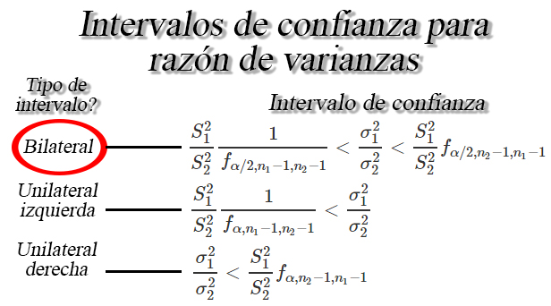

```{r knitr_init, echo=FALSE, cache=FALSE}
library(knitr)
## Global options
opts_chunk$set(echo=TRUE,
               cache=TRUE,
               prompt=FALSE,
               tidy=TRUE,
               comment=NA,
               message=FALSE,
               warning=FALSE,
               fig.path = paste0("../../EstadisticaII/images/", "Clase12"),
               cache.path = "../../EstadisticaII/cache/",
               cache = FALSE)

```

## Intervalos de confianza para razón de varianzas `$\sigma^2_1/\sigma^2_2$`
Sea `$X_{1,1}, X_{1,2}, \ldots, X_{1,n_1}$` y `$X_{2,1}, X_{2,2}, \ldots, X_{2,n_1}$` dos muestras aleatorias normales de tamaños `$n_1$`, y `$n_2$` con medias `$\mathbb{E}(X_{1})=\mu_1$` y `$\mathbb{E}(X_{2})=\mu_2$`, y varianzas desconocidas `$Var(X_{1})=\sigma_1^2<\infty$` y `$Var(X_{2})=\sigma^2_2<\infty$`, respectivamente, entonces un intervalo de confianza del `$100(1-\alpha)\%$` para `$\sigma^2_1/\sigma^2_2$` estará dada por


<button id="Show9" class="btn btn-secondary">Mostrar Ejercicio</button>
<button id="Hide9" class="btn btn-info">Ocultar Ejercicio</button>
<main id="botoncito9"> 
<h3 data-toc-skip> Ejercicio </h3> 
<p>Se aplican pruebas a $10$ cables conductores soldados a un dispositivo  semiconductor con el fin de determinar su resistencia a la tracción. Las pruebas demostraron que para romper la unión se requiere las libras de fuerza que se listan a continuación. </p>
<pre style="font-family: 'Open Sans',sans-serif; margin-bottom: -4rem; margin-top: -4rem; font-size: 120%;">
<table class="table table-striped" style="width: auto !important; margin-left: auto; margin-right: auto;">
<thead>
  <tr>
    <td style="font-weight: bold">Sin Encapsulado</td>
    <td>19.8</td>
    <td>12.7</td>
    <td>13.2</td>
    <td>16.9</td>
    <td>10.6</td>
    <td>18.8</td>
    <td>11.1</td>
    <td>14.3</td>
    <td>17.0</td>
    <td>12.5</td>
    </tr>
</thead>
</table>
</pre>
<p>Otra conjunto de $8$ cables conductores que forman otro dispositivo, se encapsulan y se prueban para determinar si el encapsulado aumenta la resistencia a la tracción, obteniendo para este caso se requirieron las siguientes libras de fuerza para romper la unión</p>
<pre style="font-family: 'Open Sans',sans-serif; margin-bottom: -4rem; margin-top: -4rem; font-size: 120%;">
<table class="table table-striped" style="width: auto !important; margin-left: auto; margin-right: auto;">
<thead>
  <tr>
    <td style="font-weight: bold">Con Encapsulado</td>
    <td>24.9</td>
    <td>22.9</td>
    <td>23.6</td>
    <td>22.1</td>
    <td>20.3</td>
    <td>21.6</td>
    <td>21.9</td>
    <td>22.5</td>
    </tr>
</thead>
</table>
</pre>
<p>Si se supone que las resistencias a la tracción se distribuyen normalmente, construya un intervalo del $90\%$ para la razón de varianzas entre la variabilidad de los cables sin encapsulado y la variabilidad de los cables con encapsulado. Es posible afirmar que la variabilidad de de los cables con encapsulado es superior a los cables sin encapsulado?
</p>
<h3 data-toc-skip> Solución </h3> 
<p> En este punto nos mencionan que se tiene interés en calcular un intervalo de confianza para el cociente de las varianzas asociadas a la resistencia a la tracción para cables sin encapsulado y cables con encapsulado. Además nos mencionan que la resistencia a la tracción hasta la ruptura se distribuye normalmente, y por tanto deberemos calcular el siguiente intervalo



en donde se aprecia que el intervalo bilateral para la razón de varianzas posee la estructura
$$\begin{align*}
   \frac{S^2_C}{S^2_S}\frac{1}{f_{\alpha/2, n_C-1, n_S-1}} < \frac{\sigma^2_C}{\sigma^2_S} < \frac{S^2_C}{S^2_S}f_{\alpha/2, n_S-1, n_C-1}
\end{align*}$$

En donde se observa que para realizar el cálculo del intervalo, se requiere de los varianzas muestrales $S^2_S$ y $S^2_C$, el nivel de confianza $1-\alpha$ y los valores críticos $f_{\alpha/2, n_C-1, n_S-1}$ y $f_{\alpha/2, n_S-1, n_C-1}$. <br>
<br>
Para realizar el cálculo de las varianzas muestrales, se emplean los datos muestrales y los tamaños de muestra $n_C=8$ y $n_S=10$, tal que al realizar el cálculo obtenemos

$$\begin{align*}
S^2_C = 1.378146 \quad \text{ y } \quad S^2_S = 3.231254
\end{align*}$$

Por su parte, al buscar los valores críticos para un nivel de significancia $1-\alpha=0.90$ y tamaños muestrales $n_C=8$ y $n_S=10$ tenemos que

$$\begin{align*}
f_{\alpha/2 = 0.05, n_C-1 = 7, n_S-1 = 9} = 3.292746\\ 
f_{\alpha/2 = 0.05, n_S-1 = 9, n_C-1 = 7} = 3.676675
\end{align*}$$

Una vez calculados los valores necesarios para calcular el intervalo de confianza, se procede a su cálculo, tal que
$$\begin{align*}
   \frac{1.378146}{3.231254}\frac{1}{3.292746} &< \frac{\sigma^2_C}{\sigma^2_S} < \frac{1.378146}{3.231254}3.676675 \\
   0.1295287 &< \frac{\sigma^2_C}{\sigma^2_S} < 1.56812
\end{align*}$$

Por tanto, se podrá concluir con un nivel de confianza del $90\%$ que el verdadero valor para el cociente de varianzas entre la variabilidad de los cables sin encapsulado y la variabilidad de los cables con encapsulado, se encontrará entre $0.1295287$ y $1.56812$.<br>
<br>
Ahora, para verificar si existen o no diferencias significativas entre las varianzas de resistencia a la tracción de los cables encapsulados o sin encapsular, debemos verificar la posición en la que se encuentra el intervalo de confianza para la razón de varianzas $\sigma^2_C/\sigma^2_S$.


En donde se observa que el intervalo calculado contiene el valor de $1$, el cual representa la igualdad entre la varianza de los dos tipos de cable, tal que 
$$\begin{align*}
  \sigma^2_C = \sigma^2_S \quad =>\quad \frac{\sigma^2_C}{\sigma^2_S} = 1
\end{align*}$$

y por tanto, con un nivel de confianza del $90\%$ no será posible afirmar que la variabilidad de la resistencia a la tracción de los cables encapsulados o sin encapsular sean diferentes, y por tanto, debe asumirse que éstos son iguales.
</p>
</main>