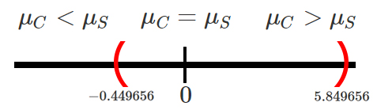
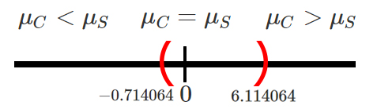
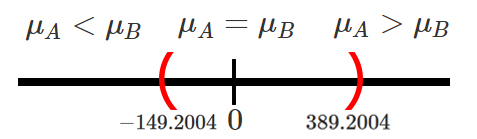

```{r knitr_init, echo=FALSE, cache=FALSE}
library(knitr)
## Global options
opts_chunk$set(echo=TRUE,
               cache=TRUE,
               prompt=FALSE,
               tidy=TRUE,
               comment=NA,
               message=FALSE,
               warning=FALSE,
               fig.path = paste0("../../EstadisticaII/images/", "Clase10"),
               cache.path = "../../EstadisticaII/cache/",
               cache = FALSE)

```

## Intervalos de confianza para diferencia de medias `$\mu_1 - \mu_2$`
Sea `$X_{1,1}, X_{1,2}, \ldots, X_{1,n_1}$` y `$X_{2,1}, X_{2,2}, \ldots, X_{2,n_2}$` dos muestras aleatorias *iid* de tamaños `$n_1$`, y `$n_2$` con medias desconocidas `$\mathbb{E}(X_{1})=\mu_1$` y `$\mathbb{E}(X_{2})=\mu_2$`, y varianzas `$Var(X_{1})=\sigma_1^2<\infty$` y `$Var(X_{2})=\sigma^2_2<\infty$`, respectivamente, entonces dependiendo de las condiciones, se tendrán los siguientes intervalos de confianza para la diferencia de medias `$\mu_1 - \mu_2$`.


<button id="Show1" class="btn btn-secondary">Mostrar Ejercicio 1</button>
<button id="Hide1" class="btn btn-info">Ocultar Ejercicio 1</button>
<main id="botoncito1"> 
<h3 data-toc-skip> Ejercicio </h3> 
<p>Una empresa envía a $12$ de sus agentes de ventas a un curso diseñado para incrementar la motivación, y por tanto, presuntamente su efectividad. Un año después, estos agentes generan unas ventas con un valor promedio de $43.5$ millones de pesos y una desviación estándar de $5.6$ millones de pesos.<br>
<br>
Durante el mismo periodo, se extrajo una muestra aleatoria independiente de $15$ personas que no habían asistido al curso y las ventas medias generadas y su desviación estándar fueron de $40.8$ y $4.3$ millones de pesos respectivamente. <br>
<br>
Si es posible suponer que las poblaciones se distribuyen normalmente con varianzas iguales a $28$ millones de pesos$^2$ para quienes se capacitaron y a $20$ millones de pesos$^2$ para quienes no se capacitaron, construya un intervalo de confianza del $90\%$ para la diferencia entre los promedios de ventas de los dos grupos. Es posible pensar que los cursos de motivación mejoran el promedio de ventas sobre quienes no recibieron estos cursos?
</p>

<h3 data-toc-skip> Solución </h3> 
<p> En este ejercicio estamos interesados en construir un intervalo de confianza bilateral para la diferencia entre el promedio de ventas de las personas que asisten a un curso de capacitación, respecto a las personas que no asisten a dicho curso, y para ello debemos revisar la información presentada en el enunciado. <br>
<br>
En donde, se observa que nos dan el valor de las medias y desviaciones estándar muestrales para cada uno de los grupos, además nos menciona que las poblaciones se distribuyen normalmente con varianzas poblacionales conocidas e iguales a $28$ millones de pesos$^2$ para quienes se capacitaron y a $20$ millones de pesos$^2$ para quienes no se capacitaron, y por tanto estamos en la situación <br><br>


<br>
y por tanto como el intervalo es bilateral, el calculo que debemos hacer tendrá la forma
$$\begin{align*}
  (\bar{X}_C-\bar{X}_S) \pm Z_{\frac{\alpha}{2}}\sqrt{\frac{\sigma^2_C}{n_C}+\frac{\sigma^2_S}{n_S}}
\end{align*}$$

Para realizar el cálculo requerimos de las media muestrales $\bar{X}_C=43.5$ y $\bar{X}_S=40.8$, las varianzas poblacionales $\sigma^2_C=28$ y $\sigma^2_S=20$, los tamaños de muestrales $n_C=12$ y $n_S=15$, el nivel de confianza $1-\alpha=0.90$ y el valor crítico $Z_{\frac{\alpha}{2}=0.05}=1.644854$ calculado a partir del nivel de confianza. Al reemplazar en el intervalo tenemos que
$$\begin{align*}
  &(43.5-40.8) \pm 1.644854\sqrt{\frac{28}{12}+\frac{20}{15}} \\
  &2.7 \pm 1.644854(1.914854) \\
  &2.7 \pm 3.149656 \\
  &-0.449656 < \mu_C - \mu_S < 5.849656
\end{align*}$$

Entonces podremos afirmar con un nivel de confianza del $90\%$, de que la diferencia entre el promedio de ventas de las personas que asisten a un curso de capacitación, respecto a las personas que no asisten a dicho curso
de capacitación, se encuentra entre $-0.449656$ y $5.849656$ millones de pesos. <br>
<br>
Ahora, para saber si la capacitación mejora o no las ventas hay que tener en cuenta la posición en la que se encuentre el intervalo para la diferencia entre $\mu_C - \mu_S$.<br><br>


<br>
En donde se observa que la totalidad del intervalo se encuentra
localizado en la sección que contiene el $0$, lo cual indica que para todo el intervalo de confianza del $90\%$ el promedio de ventas del grupo que recibió un curso de capacitación $\mu_C$ no es necesariamente mayor o menor al promedio de quienes no recibieron capacitación $mu_S$, y por tanto, se podrá concluir que la capacitación no mejora el promedio de ventas, por lo cual no hay evidencia de que sea beneficioso para la empresa enviar al resto de empleados a capacitación.
</p>
</main>

<button id="Show2" class="btn btn-secondary">Mostrar Ejercicio 2</button>
<button id="Hide2" class="btn btn-info">Ocultar Ejercicio 2</button>
<main id="botoncito2"> 
<h3 data-toc-skip> Ejercicio </h3> 
<p>La gobernación de Antioquia, desea realizar un estudio sobre el peso de los niños y las niñas que se encuentran cursando su primaria en los colegios ubicados en las regiones del departamento, y decide contratar a un grupo de investigación la Universidad de Antioquia para llevar a cabo dicho estudio.<br>
<br>
El grupo de investigación decide tomar una muestra aleatoria de $22$ niños y $28$ niñas que se encuentran realizando sus estudios de primaria entre los colegios que hay en la región antioqueña, encontrando que el peso promedio y desviación estándar de los niños fue de $52$ kilos con una desviación estándar de $8$ kilos, mientras que el peso promedio y desviación estándar de las niñas fue de $46$ kilos con una desviación estándar de $6.2$ kilos. <br>
<br>
Si el peso de los niños y niñas puede asumirse como una normal con varianzas iguales, construya un intervalo de confianza del $90\%$ para la diferencia promedio que hay entre el peso de los niños y las niñas. Es posible pensar que hay diferencias significativas entre los pesos promedio de los dos grupos?.
</p>

<h3 data-toc-skip> Solución </h3> 
<p> En este enunciado estamos interesados en construir un intervalo de confianza del $90\%$ para la diferencia promedio entre el peso de los niños y las niñas. En donde, el intervalo de confianza será bilateral debido a que no especifican que se debe calcular el límite superior o inferior solamente. Para saber cuál es el intervalo de interés, debemos revisar la información presentada en el enunciado. <br>
<br>
En el enunciado se aprecia que nos dan las medias y desviaciones estándar muestrales para cada uno de los grupos, obtenidos a partir de muestras de tamaños $22$ y $28$, respectivamente. Además, se menciona que el peso de los niños y las niñas se distribuye normalmente con varianzas desconocidas pero iguales, y por tanto estaremos en la siguiente situación<br><br>


<br>
y por tanto como el intervalo es bilateral, el calculo que debemos hacer tendrá la forma
$$\begin{align*}
  (\bar{X}_H-\bar{X}_M) \pm t_{\frac{\alpha}{2}, n_H+n_M-2}S_p\sqrt{\frac{1}{n_H}+\frac{1}{n_M}}
\end{align*}$$

En donde observamos que entre otros valores, requerimos calcular el valor de la desviación estándar conjunta $Sp$, la cual está dada por

$$\begin{align*}
Sp^2 &= \frac{(n_H-1)S^2_H + (n_M-1)S^2_M}{n_H+n_M-2} \\
     &= \frac{(22-1)8^2 + (28-1)6.2^2}{22 + 28 - 2} \\
     &= 49.6225
\end{align*}$$
y por tanto
$$\begin{align*}
Sp &= \sqrt{Sp^2} \\
   &= \sqrt{49.6225} \\
   &= 7.044324
\end{align*}$$

Ahora, los valores adicionales que se requieren para realizar el cálculo del intervalo de confianza serán, las medias muestrales $\bar{X}_H=52$, y $\bar{X}_M=46$, los tamaños muestrales  $n_H=22$ y $n_M=28$, el nivel de confianza $1-\alpha=0.90$ y el valor crítico $t_{\frac{\alpha}{2}=0.05, n_H+n_M-2 = 28}=1.701131$. Al reemplazar estos valores en el intervalo de interés obtenemos que 
$$\begin{align*}
  &(52-46) \pm 1.701131(7.044324)\sqrt{\frac{1}{22}+\frac{1}{28}} \\
  &6 \pm 1.701131(7.044324)(0.2849014)\\
  &2.7 \pm 3.414064 \\
  &-0.714064 < \mu_H - \mu_M < 6.114064
\end{align*}$$

Por tanto, con un nivel de confianza del $90\%$ se tendrá que la diferencia entre el peso promedio de los niños y el peso promedio de las niñas se encontrará entre $-0.714064$ y $6.114064$ kilogramos. <br>
<br>
Ahora, para saber si existe diferencias significativas entre los pesos promedio de niños y niñas debemos tener en cuenta la posición en la que se encuentre el intervalo para la diferencia entre $\mu_H - \mu_M$.<br><br>


<br>
En donde se observa que el intervalo encontrado contiene el valor $0$, el cual simboliza la igualdad entre los pesos promedio de niños y niñas, tal que 
$$\begin{align*}
  \mu_H = \mu_M \quad =>\quad \mu_H - \mu_M = 0
\end{align*}$$

y por tanto, con un nivel de confianza del $90\%$ no será posible afirmar que existen diferencias significativas entre los pesos promedio de niños y niñas.
</p>
</main>

<button id="Show3" class="btn btn-secondary">Mostrar Ejercicio 3</button>
<button id="Hide3" class="btn btn-info">Ocultar Ejercicio 3</button>
<main id="botoncito3"> 
<h3 data-toc-skip> Ejercicio </h3> 
<p>Suponga que la Universidad de Antioquia adelanta un estudio sobre el salario de sus egresados y desea comparar si es cierta la creencia que las mujeres ganan en promedio menos dinero que los hombres. <br>
<br>
Para comprobar si las creencias son ciertas, un grupo de investigación de la Universidad toma una muestra representativa de $250$ mujeres y $270$ hombres egresados de la Universidad y se les pregunta sobre cuál es el salario que ganan actualmente, obteniendo en su investigación que las mujeres ganan en promedio $2.3$ millones de pesos con una desviación estándar de $0.7$ millones de pesos, mientras que los hombres ganan en promedio $2.6$ millones de pesos con una desviación estándar de $1.2$ millones de pesos.<br>
<br>
Si el grupo de investigación encuentra que los salarios no se distribuyen normalmente, calcule el límite superior para la diferencia promedio del salario de sus egresados hombres y egresados mujeres. Emplee un nivel de confianza de $80\%$.</p>

<h3 data-toc-skip> Solución </h3> 
<p> En este enunciado estamos interesados en calcular el límite superior para la diferencia promedio entre el salario de hombres y mujeres que egresaron de la Universidad, la cual está dada por $\mu_H - \mu_M$, empleando para ello un nivel de confianza del $80\%$. Ahora, para identificar el intervalo de interés, debemos revisar la información presentada por el grupo de investigación de la Universidad. <br>
<br>
El cual a partir de una muestra de $250$ mujeres y $270$ hombres, encontró unos salarios promedios iguales a $2.3$ y $2.6$, con desviaciones estándar de $0.7$ y $1.2$, respectivamente. Además encuentra que los salarios no se distribuyen normalmente, y al no mencionar cuales son las varianzas poblacionales, se asume que éstas no son conocidas, y por tanto estaremos en la siguiente situación dado que los tamaños muestrales son mayores a $30$.<br><br>


<br>
y por tanto al ser un intervalo unilateral derecho (límite superior), el calculo que debemos hacer tendrá la forma
$$\begin{align*}
  \mu_H - \mu_M < (\bar{X}_H-\bar{X}_M) + Z_{\alpha}\sqrt{\frac{S^2_H}{n_H}+\frac{S^2_M}{n_M}}
\end{align*}$$

en donde se observa que al ser unilateral derecho, el intervalo solo cuenta con la suma de la resta de medias muestrales y el término de error, además de que, el valor crítico solo será para el valor $\alpha$, y no $\alpha/2$ como es el caso de los intervalos bilaterales. <br>
<br>
Ahora, al reemplazar los valores encontrados por el grupo de investigación $n_H=270$, $\bar{X}_H=2.6$, $S_H=1.2$ para los hombres, $n_M=250$, $\bar{X}_M=2.3$, $S_M=0.7$ para las mujeres, el nivel de confianza $1-\alpha = 0.80$ y el valor crítico $Z_{\alpha=0.2}=0.8416212$, tendremos que 
$$\begin{align*}
  &\mu_H - \mu_M < (2.6-2.3) + 0.8416212\sqrt{\frac{1.2^2}{270}+\frac{0.7^2}{250}} \\
  &\mu_H - \mu_M < 0.3 + 0.8416212(0.08540101)\\
  &\mu_H - \mu_M < 0.3 + 0.0718753 \\
  &\mu_H - \mu_M < 0.3718753
\end{align*}$$

Por tanto, se tendrá que el valor máximo que se espera tener parar la diferencia entre los salarios promedio de hombres y mujeres es de $0.3718753$ millones de pesos, lo anterior con un nivel de confianza del $80\%$.
</p>
</main>

<button id="Show4" class="btn btn-secondary">Mostrar Ejercicio 4</button>
<button id="Hide4" class="btn btn-info">Ocultar Ejercicio 4</button>
<main id="botoncito4"> 
<h3 data-toc-skip> Ejercicio </h3> 
<p>Se realiza un estudio con el fin de comparar el rendimiento de combustible en kilómetros por galón para dos tipos de motores $A$ y $B$. Suponga que se decide realizar un total de $47$ experimentos con el motor $A$ y $56$ experimentos con el motor $B$, encontrando para cada caso, un rendimiento promedio de gasolina de $44$ y $48$ kilómetros, respectivamente, con desviaciones estándar de $8.3$ y $6.6$, respectivamente. <br>
<br>
Basados en la información anterior, calcule el límite inferior para la diferencia promedio entre los rendimiento de combustible en kilómetro por galón de gasolina para los motores $B$ y $A$, empleando un nivel de confianza del $88\%$. Suponga que los rendimientos de los combustibles no poseen una distribución normal, pero se tiene que las varianzas son conocidas e iguales a $38.44$ y $57.76$ para las maderas $A$ y $B$ respectivamente.
</p>

<h3 data-toc-skip> Solución </h3> 
<p> En este caso estamos interesados en calcular el límite inferior de un intervalo de confianza del $88\%$ para la diferencia promedio entre el rendimiento de combustible en kilómetros por galón de gasolina que ofrecen dos tipos de motores $B$ y $A$, tal que , $\mu_B - \mu_A$, y para calcular este límite inferior debemos revisar la información que poseemos.<br>
<br>
Del enunciado se menciona que los rendimientos de combustible no poseen una distribución normal, pero se menciona que las varianzas poblacionales son conocidas e iguales a $\sigma^2_A=38.44$ y $\sigma^2_B=57.56$ para las maderas $A$ y $B$. En consecuencia, tendremos que el intervalo de interés será el siguiente<br><br>


<br>
y como estamos interesados en el límite inferior, el calculo que debemos hacer tendrá la forma
$$\begin{align*}
  (\bar{X}_B-\bar{X}_A) - Z_{\alpha}\sqrt{\frac{\sigma^2_B}{n_B}+\frac{\sigma^2_A}{n_A}}
\end{align*}$$

Para realizar el cálculo del intervalo, se aprecia que requerimos de los tamaños muestrales $n_A=47$ y $n_B=56$, las medias muestrales $\bar{X}_A=44$, y $\bar{X}_B=48$, las varianzas poblacionales $\sigma^2_A=38.44$ y $\sigma^2_B=57.56$, el nivel de confianza $1-\alpha=0.88$ y el valor crítico $Z_{\alpha=0.12}=1.174987$. Al reemplazar estos valores en el intervalo de interés obtenemos que 
$$\begin{align*}
  & (48-44) - 1.174987\sqrt{\frac{57.56}{56}+\frac{38.44}{47}} \\
  & 4 - 1.174987(1.358576)\\
  & 4 - 1.596309 \\
  & 2.403691 < \mu_B - \mu_A 
\end{align*}$$

y por tanto, se tendrá un con un nivel de confianza del $88\%$, que el límite inferior para la diferencia promedio entre los rendimiento de combustible en kilómetro por galón de gasolina para los motores $B$ y $A$ será de $2.403691$ kilómetros.
</p>
</main>

<button id="Show5" class="btn btn-secondary">Mostrar Ejercicio 5</button>
<button id="Hide5" class="btn btn-info">Ocultar Ejercicio 5</button>
<main id="botoncito5"> 
<h3 data-toc-skip> Ejercicio </h3> 
<p>Suponga que se contrata a un grupo de investigación de la Universidad de Antioquia para que realice un análisis de tensión sobre la unión pegada con una resina experimental a dos clases diferentes de madera. Para realizar el estudio, el grupo de investigación toma una muestra aleatoria de $18$ uniones pegadas con la resina especial a la madera $A$ y encontró que la tensión promedio de corte y desviación estándar fueron de $1130_{psi}$ y $420_{psi}$, respectivamente. Por su parte, toman una muestra aleatoria de $12$ uniones pegadas con la resina especial a la madera $B$, encontrando que la tensión promedio de corte y desviación estándar fueron de $1010_{psi}$ y $380_{psi}$.<br>
<br>
Si se asume que la tensión sobre la unión pegada con la resina experimental en cada clase de madera se distribuye aproximadamente normal con varianzas diferentes. Construya un intervalo de confianza del $92\%$ para la diferencia de tensión promedio de corte para las dos marcas de madera.
</p>

<h3 data-toc-skip> Solución </h3> 
<p> En este enunciado estamos interesados en construir un intervalo de confianza del $92\%$ para la diferencia entre los promedio a la tensión sobre la unión pegada con una resina experimental para dos clases de madera $A$ y $B$. En este caso, el intervalo de confianza que se empleará será bilateral dado que no nos mencionan que se realice el cálculo del límite superior o inferior para la diferencia. Para saber cuál es el intervalo de interés, debemos revisar la información calculada por el grupo de investigación. <br>
<br>
De los datos calculados por el grupo de investigación, encontramos que se realizó una selección de $18$ y $12$ uniones para las maderas $A$ y $B$ respectivamente, para las cuales se encontró de forma respectiva unas medias muestrales de $1130_{psi}$ y $1010_{psi}$ junto a unas desviaciones estándar de $420_{psi}$ y $380_{psi}$. Además, se menciona de que las dos poblaciones se distribuyen de forma aproximadamente normal con varianzas diferentes y en consecuencia se tendrá el siguiente caso<br><br>


<br>
y por tanto como el intervalo es bilateral, el calculo que debemos hacer tendrá la forma
$$\begin{align*}
  (\bar{X}_A-\bar{X}_B) \pm t_{\frac{\alpha}{2}, \nu}\sqrt{\frac{S^2_A}{n_A}+\frac{S^2_B}{n_B}}
\end{align*}$$

En donde se observa que entre otros valores, requerimos calcular el valor de los grados de libertad $\nu$, tal que

$$\begin{align*}
\nu &= \frac{\left(\frac{S^2_A}{n_A} + \frac{S^2_B}{n_B}\right)^2}{\frac{(S^2_A/n_A)^2}{n_A-1} + \frac{(S^2_B/n_B)^2}{n_B-1}} \\
    &= \frac{\left(\frac{420^2}{18} + \frac{380^2}{12}\right)^2}{\frac{(480^2/18)^2}{18-1} + \frac{(380^2/12)^2}{12-1}} \\
    &= \frac{476694444}{18813149} \\
    &= 25.33837
\end{align*}$$

Al calcular el valor techo de $\nu$ tendremos que
$$\begin{align*}
\nu               &= 25.33837 \\
\lceil \nu \rceil &= \lceil25.33837\rceil \\
\lceil \nu \rceil &= 26
\end{align*}$$

y por tanto. se tendrá que los grados de libertad asociados a la distribución $t$ serán iguales a $\nu= 26$. Ahora, los valores adicionales que se requieren para realizar el cálculo del intervalo de interés serán los tamaños muestrales  $n_A=12$ y $n_B=18$, las medias muestrales $\bar{X}_A=1130$, y $\bar{X}_B=1010$, las desviaciones estándar muestrales $S_A=420$ y $S_B=380$, el nivel de confianza $1-\alpha=0.92$ y el valor crítico $t_{\frac{\alpha}{2}=0.04, \nu = 26}=1.821863$. Al reemplazar estos valores en el intervalo de interés obtenemos que 
$$\begin{align*}
  & (1130-1010) \pm 1.821863\sqrt{\frac{420^2}{18}+\frac{380^2}{12}} \\
  & 120 \pm 1.821863(147.7611)\\
  & 120 \pm 269.2004 \\
  & -149.2004 < \mu_A - \mu_B < 389.2004
\end{align*}$$

De lo anterior, se concluye que con una confianza del $92\%$, la diferencia promedio entre la tensión promedio de corte entre las maderas $A$ y $B$ se encontrará entre $-149.2004_{psi}$ y $389.2004_{psi}$. <br>
<br>
Ahora, como el intervalo es bilateral, podemos verificar si existen o no diferencias significativas entre la tensión promedio de corte de dos tipos de madera, y para ello debemos verificar la posición en la que se encuentra el intervalo de confianza para la diferencia entre $\mu_A - \mu_B$.<br><br>


<br>
En donde se observa que el intervalo calculado contiene el valor de $0$, el cual representa la igualdad entre la tensión promedio de corte de dos tipos de madera, tal que 
$$\begin{align*}
  \mu_A = \mu_B \quad =>\quad \mu_A - \mu_B = 0
\end{align*}$$

y por tanto, con un nivel de confianza del $92\%$ no será posible afirmar que existen diferencias significativas entre la tensión promedio de corte de dos tipos de madera.
</p>
</main>

