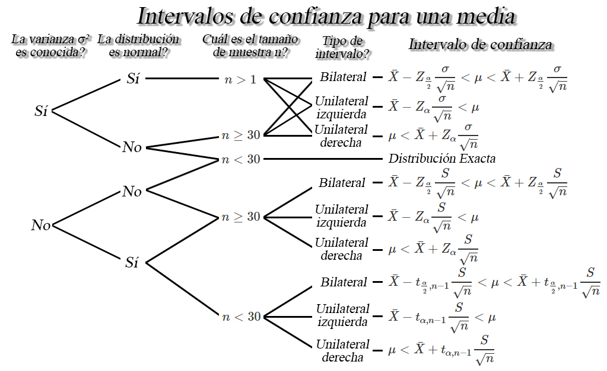
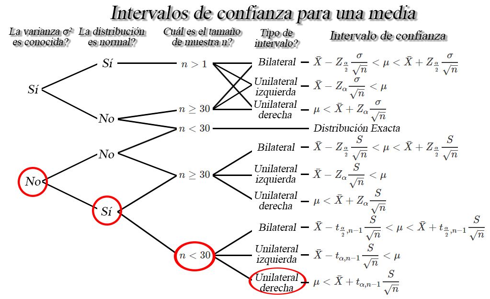
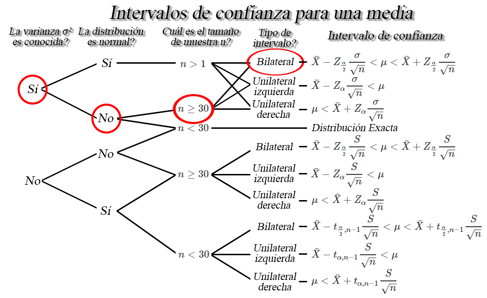
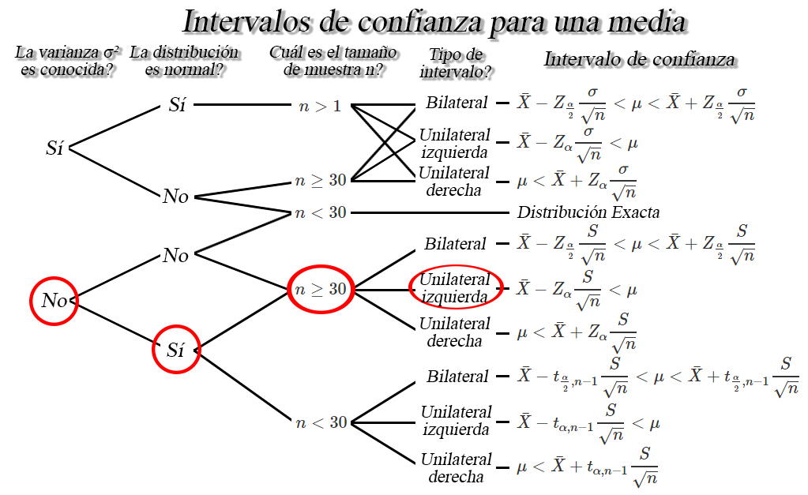

```{r knitr_init, echo=FALSE, cache=FALSE}
library(knitr)
## Global options
opts_chunk$set(echo=TRUE,
               cache=TRUE,
               prompt=FALSE,
               tidy=TRUE,
               comment=NA,
               message=FALSE,
               warning=FALSE,
               fig.path = paste0("../../EstadisticaII/images/", "Clase09"),
               cache.path = "../../EstadisticaII/cache/",
               cache = FALSE)

```

## Estimación por intervalos
Podría ser que ni el estimador que cumpla las propiedades de insesgadez, eficiencia, consistencia y suficiencia, estimen con exactitud el parámetro poblacional de interés- Por esta razón, puede ser preferible determinar un intervalo dentro del cual, se espera encontrar el valor verdadero del parámetro poblacional.

### Definición
Sea `$\theta$` un parámetro poblacional desconocido, entonces basándose en la información de una muestra aleatoria de dicha población, el objetivo será encontrar dos variables aleatorias `$\hat{\Theta}_I$` y `$\hat{\Theta}_S$` tal que
`\begin{align*}
\mathbb{P}(\hat{\Theta}_I<\Theta<\hat{\Theta}_S) = 1-\alpha \quad \quad 0<\alpha<1
\end{align*}`
donde `$(1-\alpha)$` se conoce como nivel de confianza y `$\hat{\Theta}_I$` y `$\hat{\Theta}_S$` se denominan como límites de confianza inferior y superior, tal que `$\hat{\Theta}_I<\hat{\Theta}_S$`.

### Nota
<ol type = "a">
<li>Usualmente se usan valores para $\alpha$ de $0.1, 0.05$ y $ 0.01$, es decir, niveles de confianza de $0.9, 0.95$ y $0.99$.</li>
<li>La longitud o amplitud del intervalo construido, medirá la <strong>precisión</strong> de la estimación realizada, por tanto, intervalos largos proporcionan estimaciones más imprecisas, mientras que intervalos cortos proporcionan estimaciones más precisas.</li>
<li>A medida que aumenta el nivel de confianza, la amplitud del intervalo se hace más grande.</li>
<li>A medida que aumenta el tamaño de muestra, la amplitud del intervalo se hace más pequeño.</li>
</ol>

## Interpretación de nivel de confianza
El nivel de confianza, `$1-\alpha$`, mide la fiabilidad del intervalo de probabilidad, esto es, la probabilidad de que el verdadero valor del parámetro se encuentre dentro del intervalo construido. Es decir, que si se realiza el experimento muchas veces, se tendrá que en el `$100(1-\alpha)\%$` de los intervalos de confianza construidos en cada experimento, se encontrará contenido el verdadero valor del parámetro de interés.

## Intervalos de confianza para una media `$\mu$`
Sea `$X_1, X_2, \ldots, X_n$` una muestra aleatoria *iid* de tamaño `$n$` con media desconocida `$\mathbb{E}(X)=\mu$`, y varianza `$Var(X)=\sigma^2<\infty$`, entonces dependiendo de las condiciones, se tendrán los siguientes intervalos de confianza para la media `$\mu$`.



<button id="Show1" class="btn btn-secondary">Mostrar Ejercicio 1</button>
<button id="Hide1" class="btn btn-info">Ocultar Ejercicio 1</button>
<main id="botoncito1"> 
<h3 data-toc-skip> Ejercicio </h3> 
<p>Suponga que se realiza un estudio sobre el salario de los estudiantes de Ingeniería Industrial una vez finalizan su pregrado y se incertan en el mercado laboral. Para ello, se le pregunta a $15$ egresados seleccionados de forma aleatoria y se les pregunta cuál es el salario que devengan actualmente, obteniendo los siguientes resultados en millones de pesos
$$\begin{align*}
1.78 \quad 2.93 \quad 1.22 \quad 1.27 \quad 1.17 \\
1.03 \quad 1.24 \quad 2.07 \quad 2.04 \quad 1.28 \\
1.53 \quad 0.98 \quad 1.73 \quad 1.38 \quad 3.24
\end{align*}$$

Si es posible supone que los salarios de los egresados se distribuyen aproximadamente normal, calcule el límite superior del salario promedio que ganan los egresados del programa de ingeniería industrial empleando un nivel de confianza del $98\%$. </p>

<h3 data-toc-skip> Solución </h3> 
<p> En este caso estamos interesados en construir un intervalo de confianza para el límite superior de los salarios promedio de los egresados, pero para realizar el cálculo debemos tener en cuenta la información que poseemos.<br>
<br>
De la información extraída del enunciado tenemos que la varianza poblacional no es conocida, ya que no la mencionan en el enunciado, tenemos que la población es normal, debido a que mencionan que puede suponerse que los salarios son aproximadamente normales, y los tamaños de muestra son pequeños, debido a que solo tenemos $15$ datos, estas características se ilustra en la siguiente imagen



de lo anterior encontramos que el intervalo de confianza de interés es de la forma
$$\begin{align*}
  \mu < \bar{X}+t_{\alpha, n-1}\frac{S}{\sqrt{n}}
\end{align*}$$

En donde observamos que requerimos de $5$ variables, la media muestral $\bar{X}=1.659333$, la desviación estándar muestral $S=0.6709425$, el tamaño de muestra $n=15$, el nivel de confianza $1-\alpha=0.98$ y el valor crítico $t_{\alpha=0.02, n-1=14}=2.263781$ calculado a partir del nivel de confianza y el tamaño de la muestra. Al reemplazar en el intervalo tenemos que
$$\begin{align*}
  \mu &< 1.659333+2.263781\frac{0.6709425}{\sqrt{15}}\\
  \mu &< 1.659333+0.3921697\\
  \mu &< 2.051503
\end{align*}$$

Entonces podremos afirmar con un nivel de confianza del $98\%$, que el salario máximo promedio que ganan los egresados del Departamento de Ingeniería Industrial es de $2.051503$ millones de pesos, es decir, dos millones cincuenta y un mil quinientos tres pesos.
</p>
</main>

<button id="Show2" class="btn btn-secondary">Mostrar Ejercicio 2 </button>
<button id="Hide2" class="btn btn-info">Ocultar Ejercicio 2</button>
<main id="botoncito2"> 
<h3 data-toc-skip> Ejercicio </h3> 
<p>Suponga que Postobon desarrolla una nueva máquina de bebidas para servir de forma automática gaseosas en los cines, de tal forma que la cantidad servida, en mililitros, se distribuya Weibull con desviación estándar de $5703.473_{ml}$.<br>
<br>
Si se decide tomar una muestra aleatoria de $8000$ vasos de gaseosa servidos por una de las nuevas máquinas de bebidas, y se obtiene una promedio de $345_{ml}$ con una desviación estándar de $5240.35_{ml}$, construya un intervalo de confianza del $90\%$ para la verdadera cantidad promedio de refresco servida por la máquina.
</p>

<h3 data-toc-skip> Solución </h3> 
<p> En este caso estamos interesados en construir un intervalo de confianza bilateral del $90\% $ para la cantidad promedio de refresco servida por la nueva máquina de bebidas, pero para realizar el cálculo debemos evaluar previamente la información que poseemos.<br>
<br>
Del contexto del ejercicio tenemos que la población no es normal, debido a que se menciona que es Weibull, con desviación estándar de $5703.473_{ml}$, por lo cual tendremos que la varianza poblacional es conocida. Adicionalmente, tenemos que el tamaño de muestra de vasos de gaseosa servidos por la máquina es de $8000$ vasos, por lo cual, basados en la información que poseemos tenemos las siguientes características



de lo anterior encontramos que el intervalo de confianza de interés es de la forma
$$\begin{align*}
  \bar{X}-Z_{\frac{\alpha}{2}}\frac{\sigma}{\sqrt{n}} < \mu < \bar{X}+Z_{\frac{\alpha}{2}}\frac{\sigma}{\sqrt{n}}
\end{align*}$$

En donde observamos que requerimos la media muestral $\bar{X}=345$, la desviación estándar poblacional $\sigma=5703.473$, el tamaño de muestra $n=8000$, el nivel de confianza $1-\alpha=0.90$ y el valor crítico $Z_{\alpha/2=0.05}=1.644854$ calculado a partir del nivel de confianza. Al reemplazar en el intervalo tenemos que
$$\begin{align*}
  &345\pm 1.644854 \frac{5703.473}{\sqrt{8000}} \\
  &345\pm 104.8870143 \\
  &240.1129856 < \mu < 449.8870144
\end{align*}$$

Entonces podremos afirmar con un nivel de confianza del $90\%$, que la cantidad promedio de refresco servida de forma automática por la nueva máquina de bebidas se encontrará entre $240.1129_{ml}$ y $449.8870_{ml}$.
</p>
</main>

<button id="Show3" class="btn btn-secondary">Mostrar Ejercicio 3</button>
<button id="Hide3" class="btn btn-info">Ocultar Ejercicio 3</button>
<main id="botoncito3"> 
<h3 data-toc-skip> Ejercicio </h3> 
<p>Suponga que la marca de cigarrillo Malboro, asegura que el contenido promedio de nicotina de sus cigarrillos es de $1.1$ miligramos. Un estudio realizado por un grupo de investigación de la Universidad de Antioquia mide el contenido de nicotina de una muestra aleatoria de $145$ cigarrillos y encuentra que la nicotina promedio y desviación estándar de la muestra fue de $1.02$ y $0.23$ miligramos de nicotina, respectivamente. <br>
<br>
Si se supone que la cantidad de nicotina en los cigarrillos Malboro se distribuye normalmente, calcule con un nivel de confianza del $85\%$ el límite inferior para la verdadera cantidad promedio de nicotina que poseen los cigarrillos Malboro.
</p>

<h3 data-toc-skip> Solución </h3> 
<p> En este ejercicio se está interesado en construir un intervalo de confianza inferior del $85\%$ para la cantidad promedio de nicotina que poseen los cigarrillos Malboro, y para realizar el cálculo debemos evaluar la información que poseemos.<br>
<br>
En donde, basados en el contexto del ejercicio nos dicen que la distribución de probabilidad de la cantidad de nicotina de los cigarrillos se distribuye normalmente, con varianza poblacional desconocida. Además, mencionan que en un estudio realizado por un grupo de investigación se toma una muestra aleatoria de tamaño $145$ cigarrillos, a partir de la cual encuentran un contenido promedio de nicotina de $1.02$ miligramos con una desviación estándar de $0.23$ miligramos, y en consecuencia nos encontramos en la siguiente situación



de lo anterior encontramos que el intervalo de confianza de interés es de la forma
$$\begin{align*}
  \bar{X}-Z_{\alpha}\frac{S}{\sqrt{n}} < \mu
\end{align*}$$

En donde observamos que necesitamos la media muestral $\bar{X}=1.02$, la desviación estándar muestral $S=0.23$, el tamaño de muestra $n=145$, el nivel de confianza $1-\alpha=0.85$ y el valor crítico $Z_{\alpha=0.15}=1.036433$ calculado a partir del nivel de confianza. Al reemplazar en el intervalo de interés tenemos que
$$\begin{align*}
  1.02-1.036433\frac{0.23}{\sqrt{145}} &< \mu \\
  1.02-0.01979635 &< \mu \\
  1.000204 &< \mu
\end{align*}$$

Lo cual significa que, con un nivel de confianza del $85\%$ podemos afirmar que la cantidad mínima promedio de nicotina que poseen los cigarrillos Malboro es de $1.000204$ miligramos de nicotina.
</p>
</main>
