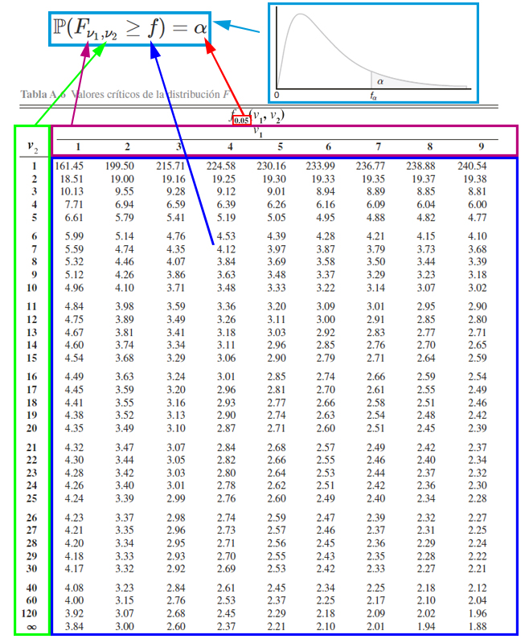
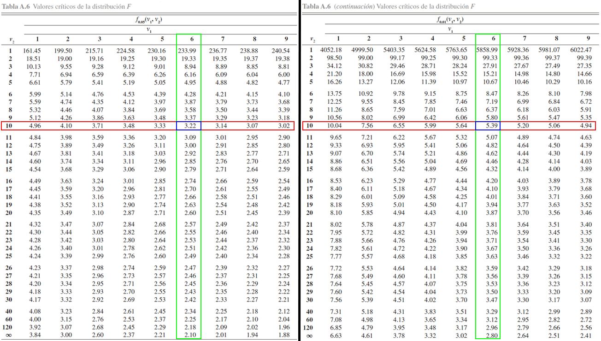
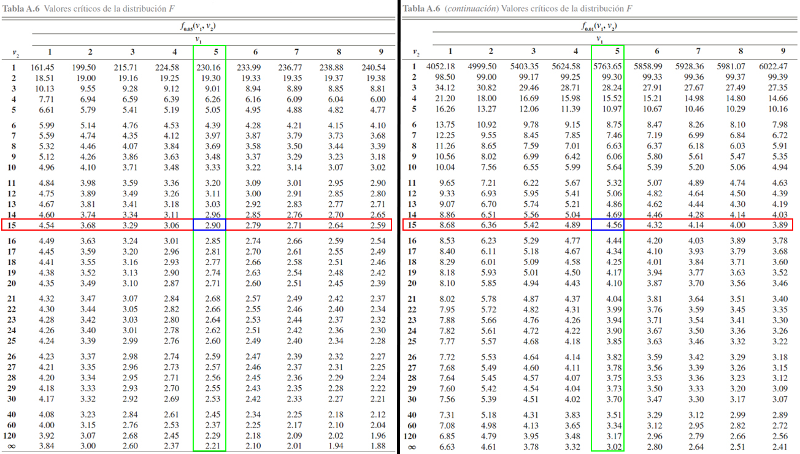
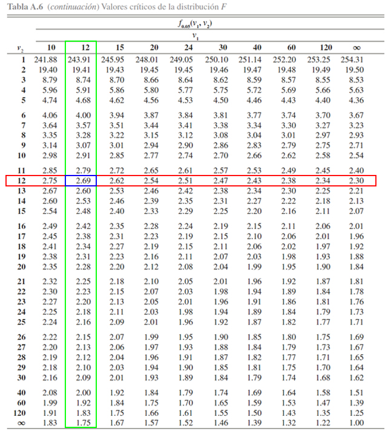

```{r knitr_init, echo=FALSE, cache=FALSE}
library(knitr)
## Global options
opts_chunk$set(echo=TRUE,
               cache=TRUE,
               prompt=FALSE,
               tidy=TRUE,
               comment=NA,
               message=FALSE,
               warning=FALSE,
               fig.path = paste0("../../EstadisticaII/images/", "Clase03"),
               cache.path = "../../EstadisticaII/cache/",
               cache = FALSE)

```

## Distribuciones muestrales
### Distribución muestral `$F$` de Fisher-Snedecor
Sea `$W_1$` una variable aleatoria `$\chi^2_{v_1}$` y `$W_2$` una variable aleatoria `$\chi^2_{v_2}$`, entonces si `$W_1$` y `$W_2$` son independientes.
`\begin{align*}
F = \frac{W_1/v_1}{W_2/v_2}\sim F_{v_1, v_2}
\end{align*}`
tiene una distribución `$F$` con `$v_1$` grados de libertad en el númerador y `$v_2$` grados de libertad en el denominador.
Ahora si `$X_{1,1}, X_{1,2}, \ldots, X_{1,n_1}$` y `$X_{2,1}, X_{2,2}, \ldots, X_{2,n_2}$` son dos muestras aleatorias independientes de poblaciones normales con medias `$\mu_1, \mu_2$` y varianzas `$\sigma^2_1, \sigma^2,2$`, respectivamente, entonces
`\begin{align*}
W_1 = \frac{(n_1-1)S_1^2}{\sigma^2_1} \sim N(0,1) \quad \text{ y } \quad W_2 =\frac{(n_1-1)S_1^2}{\sigma^2_1}\sim \chi^2_{n_2-1}
\end{align*}`
tienen distribuciones chi-cuadrado independientes con `$v_1=(n_1-1)$` y `$v_2 = (n_2-1)$` grados de libertad, respectivamente. Y por tanto
`\begin{align*}
F = \frac{\left(\frac{(n_1-1)S_1^2}{\sigma^2_1}\right)/(n_1-1)}{\left(\frac{(n_1-1)S_1^2}{\sigma^2_1}\right)/(n_2-1)} = \frac{S_1^2/\sigma^2_1}{S_2^2/\sigma^2_2} 
\end{align*}`

En donde, al reordenar términos se tendrá que 
`\begin{align*}
F_c  = \frac{S^2_1\sigma^2_2}{S^2_2\sigma^2_1} \sim F_{n_1-1, n_2-1}
\end{align*}`

tienen una distribución `$F$` con `$n_1-1$` grados de libertad en el numerador y `$n_2-1$` grados de libertad en el denominador.

#### Teorema Cola Izquierda
Para encontrar la probabilidad de la cola izquierda para `$\alpha$` de la distribución F, usamos la siguiente formula
`\begin{align*}
F_{1-\alpha,v_1,v_2} = \frac{1}{F_{\alpha, v_2, v_1}}
\end{align*}`

<button id="Show1" class="btn btn-secondary">Mostrar Ejercicio Manejo de Tabla `$F$`</button>
<button id="Hide1" class="btn btn-info">Ocultar Ejercicio Manejo de Tabla  `$F$`</button>
<main id="botoncito1"> 
<h3 data-toc-skip> Ejercicio </h3> 
<p> Suponga que en esta ocasión, tenemos una distribución $F$ de Snedecor con $\nu_1$ grados de libertad en el numerador y $nu_2$ grados de libertad en el denominador. Entonces, usando esta distribución y empleando la <a href="https://github.com/jiperezga/jiperezga.github.io/raw/master/Dataset/Documentos/DistFSnedecor.pdf">Tabla de la Distribución F de Fisher-Snedecor</a>, calcule </p>
<ol>
<li>$\mathbb{P}(F_{8, 12} \geq 3)$</li> 
<li>$\mathbb{P}(F_{10, 6} \leq 0.18)$</li>
<li>$\mathbb{P}(0.31 < F_{15, 5} \leq 9.6)$</li>
<li>$\mathbb{P}(F_{12, 12} \geq f) = 0.05$</li>
</ol>

<h3 data-toc-skip> Solución </h3> 
<p>La tabla de la distribución $F$ es usualmente la más complicada de manejar, debido a que para cada probabilidad se tendrá una tabla diferente, debido a que ésta depende de dos grados de libertad diferentes. Entonces para calcular probabilidad con la tabla de la distribución $F$ de Snedecor, es necesario tener en cuenta el funcionamiento de la tabla misma. Y para ello se presenta la siguiente imagen.</p>



<p>En donde, se aprecia que, <strong>el cuadro azul representan los valores críticos</strong> $f$ que se emplea para calcular probabilidades. <strong>El cuadro rojo pequeño representa las probabilidades</strong> $\alpha$ que se desean calcular a partir de los valores críticos y el cruce de los grados de libertad. <strong>El cuadro morado representa los grados de libertad del numerador</strong> $\nu_1$ que se emplean para calcular probabilidades junto al empleo de los valores críticos y los grados de libertad del denominador. <strong>El cuadro verde representa los grados de libertad del denominador</strong> $\nu_2$ que se emplean para calcular probabilidades junto al empleo de los valores críticos y los grados de libertad del numerador. Finalmente, <strong>el cuadro azul claro representa el funcionamiento de la tabla</strong>, la cual muestra las probabilidades que poseen la forma $\mathbb{P}(F_{\nu_1, \nu_2}\geq f)=\alpha$.</p>

<ol>
<li>Conocida el funcionamiento de la tabla, la primera probabilidad a calcular es $\mathbb{P}(F_{8, 12} \geq 3)$, la cual tiene la estructura establecida por la tabla $\mathbb{P}(F_{\nu_1, \nu_2}\geq f)$, así que será cuestión de buscar los valores críticos asociados al cruce entre $\nu_1 = 8$ los grados de libertad en el numerador y $\nu_2 = 12$ los grados de libertad en el denominador, para para comparar dichos valores con respecto al valor crítico de interés $3$. <br> 
<br> 
Para tanto, se localiza en cada una de las tablas en la parte superior los grados de libertad del numerador $8$, en la parte izquierda los grados de libertad del denominador $14$, y en la parte central se busca el cruce de los dos grados de libertad para observar cuál es el valor crítico asociado a este. Dicho procedimiento se ilustra en el siguiente gráfico, en donde, en la parte izquierda se muestra el valor crítico de la tabla  $F_{0.05}$ y en la parte derecha el valor crítico de la tabla para $F_{0.01}$.


En donde se evidencia que
$$\begin{align*}
F_{0.05, 8, 14} = 2.70 \quad => \quad \mathbb{P}(F_{8, 14} \geq 2.70) = 0.05\\
F_{0.01, 8, 14} = 4.14 \quad => \quad \mathbb{P}(F_{8, 14} \geq 4.14) = 0.01
\end{align*}$$

Una vez localizados los valores críticos de las dos tablas, se procede a comparar dichos valores con la probabilidad de interés, la cual está dada por
$$\begin{align*}
\mathbb{P}(F_{8, 12} \geq 3)
\end{align*}$$

Entonces, como el valor crítico de interés se encuentra entre los valores $F_{0.05, 8, 14} = 2.70$ y $F_{0.01, 8, 14} = 4.14$, se tendrá que la probabilidad de interés estará entre el $5\%$ y el $1\%$, tal que
$$\begin{align*}
0.01 < \mathbb{P}(F_{8, 12} \geq 3) < 0.05
\end{align*}$$
</li> 
<li>A diferencia del punto anterior, se observa que la probabilidad propuesta en este caso es de la forma $\mathbb{P}(F_{10, 6} \leq 0.18)$, posee una estructura diferente a la establecida por la tabla $\mathbb{P}(F_{\nu_1, \nu_2}\geq f)$, por lo cual, será necesario emplear el complemento de la probabilidad propuesta para obtener una estructura similar a la que maneja la tabla, tal que
$$\begin{align*}
\mathbb{P}(F_{10, 6} \leq 0.18) = 1 - \mathbb{P}(F_{10, 6} > 0.18)
\end{align*}$$

Una vez empleado el complemento, podemos usar la probabilidad $\mathbb{P}(F_{10, 6} > 0.18)$ para calcular la probabilidad de interés, mediante la búsqueda de la probabilidad, tal como se hizo en el ejercicio anterior. Para ello, se debe localizar para las tablas $F_{0.05}$ y $F_{0.01}$, los $10$ grados de libertad del numerador en la parte superior, mientras que, los $6$ grados de libertad del denominador en la parte izquierda de la tabla, y comparar los valores encontrados del cruce de grados de libertad, con la probabilidad de interés, tal como se ilustra acontinuación


En donde se evidencia que
$$\begin{align*}
F_{0.05, 10, 6} = 4.06 \quad => \quad \mathbb{P}(F_{10, 6} \geq 4.06) = 0.05\\
F_{0.01, 10, 6} = 7.87 \quad => \quad \mathbb{P}(F_{10, 6} \geq 7.87) = 0.01
\end{align*}$$

Entonces, como el valor crítico de interés se encuentra a la izquierda de los valores $F_{0.05, 10, 6} = 4.06$ y $F_{0.01, 10, 6} = 7.87$, se tendrá que la probabilidad de interés será mayor al $5\%$ , tal que
$$\begin{align*}
\mathbb{P}(F_{10, 6} > 0.18) > 0.05
\end{align*}$$

y en consecuencia, se hace necesario realizar un paso adicional debido a que el valor crítico se encuentra cercano a $0$, el cuál consta en aplicar el teorema de la cola izquierda para la distribución $F$, con el fin de calcular los valores críticos asociados a una $F_{0.95}$ y una $F_{0.99}$, mediante la ecuación

$$\begin{align*}
F_{1-\alpha,v_1,v_2} = \frac{1}{F_{\alpha, v_2, v_1}}
\end{align*}$$

tal que, para calcular los valores críticos asociados a $F_{0.95, 10, 6}$ y $F_{0.99, 10, 6}$, tendremos que

$$\begin{align*}
F_{0.95, 10, 6} = \frac{1}{F_{0.05, 6, 10}} \quad \quad \text{ y } \quad \quad F_{0.99, 10, 6} = \frac{1}{F_{0.01, 6, 10}} 
\end{align*}$$

y por tanto, podremos calcular los valores críticos anteriores, mediante el empleo de los valores críticos asociados a $F_{0.05, 6, 10}$ y $F_{0.01, 6, 10}$, los cuales podemos calcular en las tablas de la distribución $F$ tal como se muestra acontinuación



En donde se evidencia que
$$\begin{align*}
F_{0.05, 6, 10} = 3.22 \quad => \quad \mathbb{P}(F_{6, 10} \geq 3.22) = 0.05\\
F_{0.01, 6, 10} = 5.39 \quad => \quad \mathbb{P}(F_{6, 10} \geq 5.39) = 0.01
\end{align*}$$

y por tanto, se tendrá que los valores para $F_{0.95, 10, 6}$ y $F_{0.99, 10, 6}$ será respectivamente

$$\begin{align*}
F_{0.95, 10, 6} = \frac{1}{3.22} = 0.3105590 \quad => \quad \mathbb{P}(F_{10, 6} \geq 0.3105590) = 0.95\\
F_{0.99, 10, 6} = \frac{1}{5.39} = 0.1855288 \quad => \quad \mathbb{P}(F_{10, 6} \geq 0.1855288) = 0.99
\end{align*}$$

Ahora, basados en los $4$ valores $F$ calculados para $10$ grados de libertad para el numerador y $6$ grados de libertad para el denominador

$$\begin{align*}
F_{0.01, 10, 6} &= 7.87 \\
F_{0.05, 10, 6} &= 4.06 \\
F_{0.95, 10, 6} &= 0.3105590 \\
F_{0.99, 10, 6} &= 0.1855288
\end{align*}$$

tendremos que la probabilidad $\mathbb{P}(F_{10, 6} > 0.18)$ es aproximadamente de $0.99$, es decir que

$$\begin{align*}
\mathbb{P}(F_{10, 6} > 0.18) \approx 0.99
\end{align*}$$

y por tanto, se tendrá que 
$$\begin{align*}
\mathbb{P}(F_{10, 6} \leq 0.18) &= 1 - \mathbb{P}(F_{10, 6} > 0.18) \\
                                &\approx 1 - 0.99 \\
                                &\approx 0.01
\end{align*}$$
</li>
<li>En este punto, nos piden calcular la $\mathbb{P}(0.31 < F_{15, 5} \leq 9.6)$, y se observa que la estructura de dicha probabilidad es diferente a la establecida por la tabla $\mathbb{P}(F_{\nu_1, \nu_2}\geq f)$, Pero se aprecia que si aplicamos las propiedades de la función de distribución acumulada para el caso continuo, ya presentadas en la <a href="../../EstadisticaI/EstIClase08.html#función-de-distribución-acumulada-caso-continuo">Clase 08</a>, y posteriormente calculamos el complemento de las probabilidades, podemos llevar la probabilidad de interés a la forma

$$\begin{align*}
\mathbb{P}(0.31 < F_{15, 5} \leq 9.6) &= \mathbb{P}(F_{15, 5} \leq 9.6) - \mathbb{P}(F_{15, 5} \leq 0.31) \\
                                       &= [1 - \mathbb{P}(F_{15, 5} > 9.6)] - [1- \mathbb{P}(F_{15, 5} > 0.31)] \\
                                       &= \mathbb{P}(F_{15, 5} > 0.31) - \mathbb{P}(F_{15, 5} > 9.6)
\end{align*}$$
obteniendo que la probabilidad $\mathbb{P}(0.31 < F_{15, 5} \leq 9.6)$, puede ser calculada mediante el empleo de las probabilidades $\mathbb{P}(F_{15, 5} > 0.31)$ y $\mathbb{P}(F_{15, 5} > 9.6)$. Para calcular esta probabilidad debemos calcular los valores críticos $F_{0.01, 15, 5}$, $F_{0.05, 15, 5}$, y los valores críticos, $F_{0.05, 5, 15}$ y $F_{0.01, 5, 15}$, los cuales se usan para calcular $F_{0.95, 15, 5}$ y $F_{0.99, 15, 5}$. A continuación se ilusta la localización de los $4$ valores de interés




Donde se aprecia que 
$$\begin{align*}
F_{0.01, 15, 5} &= 9.72 \\
F_{0.05, 15, 5} &= 4.62 \\
F_{0.95, 15, 5} &= \frac{1}{F_{0.05, 5, 15}} = \frac{1}{2.90} = 0.3448276 \\
F_{0.99, 15, 5} &= \frac{1}{F_{0.01, 5, 15}} = \frac{1}{4.56} = 0.2192982 
\end{align*}$$

Una vez localizados los $4$ valores críticos, se procede a comparar dichos valores con las probabilidad de interés, las cuales están dadas por
$$\begin{align*}
\mathbb{P}(F_{15, 5} > 0.31) \quad \text{ y } \quad \mathbb{P}(F_{15, 5} > 9.6)
\end{align*}$$

En el caso del valor crítico $0.31$, se observa que éste se encuentra entre los valores $F_{0.99, 15, 5} = 0.2192982$ y $F_{0.95, 15, 5} = 0.3448276$, siendo el valor más cercano $F_{0.95, 15, 5}$, y en consecuencia diremos que 
$$\begin{align*}
\mathbb{P}(F_{15, 5} > 0.31) \approx 0.95
\end{align*}$$

mientras que, para el caso del valor crítico $9.6$, se observa que se encuentra entre $F_{0.05, 15, 5} = 4.62$ y $F_{0.01, 15, 5} = 9.72$, siendo el valor más cercano $F_{0.01, 15, 5} = 9.72$, y en consecuencia diremos 
$$\begin{align*}
\mathbb{P}(F_{15, 5} > 9.6) \approx 0.01
\end{align*}$$

Y por tanto se tendrá que 
$$\begin{align*}
\mathbb{P}(0.31 < F_{15, 5} \leq 9.6) &= \mathbb{P}(F_{15, 5} > 0.31) - \mathbb{P}(F_{15, 5} > 9.6)\\
                                      &\approx 0.95 - 0.01\\
                                      &\approx 0.94
\end{align*}$$
</li>
<li>En este punto, a diferencia de los puntos anteriores, nos están dando el valor de la probabilidad, junto a los grados de libertad del numerador y el denominador, y nos piden encontrar el valor crítico $f$ asociado a dichos valores, tal que
$$\begin{align*}
\mathbb{P}(F_{12, 12} \geq f) = 0.05
\end{align*}$$

Donde evidenciamos que la probabilidad de interés ya posee la estructura de la tabla $\mathbb{P}(F_{\nu_1, \nu_2}\geq f)$, y por tanto, podemos encontrar el valor crítico de forma directa en la tabla, buscando en la parte superior los grados de libertad $\nu_1=12$ y en la parte izquierda, los grados de libertad $\nu_2=12$ en la tabla $F_{0.05}$, para encontrar el valor crítico en donde se cruzan los grados de libertad, tal como se ilustra a continuación



En donde se evidencia, que el valor crítico $f$ asociado a una probabilidad de $0.05$ y a $12$ grados de libertad en el numerador junto a $12$ grados de libertad en el denominador, es igual a $2.69$, es decir

$$\begin{align*}
\mathbb{P}(F_{12, 12} \geq 2.69) = 0.05
\end{align*}$$
</li>
</ol>
</main>

<button id="Show2" class="btn btn-secondary">Mostrar Ejercicio </button>
<button id="Hide2" class="btn btn-info">Ocultar Ejercicio </button>
<main id="botoncito2"> 
<h3 data-toc-skip> Ejercicio </h3> 
<p>Se aplican pruebas a $10$ cables conductores soldados a un dispositivo  semiconductor con el fin de determinar su resistencia a la tracción. Las pruebas demostraron que para romper la union se requiere las libras de fuerza que se listan a continuación. </p>

<table class="table table-striped" style="width: auto !important; margin-left: auto; margin-right: auto; font-size:100%!important">
<thead>
  <tr>
    <td style="font-weight: bold">Sin Encapsulado</td>
    <td>19.8</td>
    <td>12.7</td>
    <td>13.2</td>
    <td>16.9</td>
    <td>10.6</td>
    <td>18.8</td>
    <td>11.1</td>
    <td>14.3</td>
    <td>17.0</td>
    <td>12.5</td>
    </tr>
</thead>
</table>

<p>Otra conjunto de $8$ cables conductores que forman otro dispositivo, se encapsulan y se prueban para determinar si el encapsulado aumenta la resistencia a la tracción, obteniendo para este caso se requirieron las siguientes libras de fuerza para romper la unión</p>

<table class="table table-striped" style="width: auto !important; margin-left: auto; margin-right: auto; font-size:100%!important">
<thead>
  <tr>
    <td style="font-weight: bold">Con Encapsulado</td>
    <td>24.9</td>
    <td>22.9</td>
    <td>23.6</td>
    <td>22.1</td>
    <td>20.3</td>
    <td>21.6</td>
    <td>21.9</td>
    <td>22.5</td>
    </tr>
</thead>
</table>

<p>Cuál es la probabilidad de que la variabilidad de los cables sin encapsulado sea mayor a la variabilidad de los cables con encapsulado?
</p>
<h3 data-toc-skip> Solución </h3> 
<p> En este punto, nos preguntan sobre la probabilidad de que la varianza de los cables sin encapsulado, $\sigma^2_S$, sea mayor a la varianza de los cables con encapsulado, $\sigma^2_C$, esto es 
$$\begin{align*}
\mathbb{P}(\sigma^2_S > \sigma^2_C) = \mathbb{P}\left(\frac{\sigma^2_S}{\sigma^2_C} > 1\right)
\end{align*}$$

Es de anotar que, al no conocer la distribución de probabilidad del cocience de las varianzas, debemos realizar operaciones matemáticas para llevar la probabilidad planteada a una forma conocida, tal como lo es la estructura de una distribución $F$ con $n_C-1$ grados de libertad en el numerador y $n_S-1$ grados de libertad en el denominador, tal que
$$\begin{align*}
F_c  = \frac{S^2_C\sigma^2_S}{S^2_S\sigma^2_C} \sim F_{n_C-1, n_S-1}
\end{align*}$$

En donde apreciamos que requerimos de las varianzas muestrales $S^2_C$ y $S^2_S$, los cuales podemos calcular a partir de los datos muestrales y los tamaños de muestra $n_C=8$ y $n_S=10$, tal que al realizar el cálculo obtenemos

$$\begin{align*}
S^2_C = 1.378146 \quad \text{ y } \quad S^2_S = 3.231254
\end{align*}$$

y con estos valores podemos hacer las operaciones matemáticas correspondientes para llevar la probabilidad de interés a la estructura deseada, tal que 
$$\begin{align*}
\mathbb{P}(\sigma^2_S > \sigma^2_C) &= \mathbb{P}\left(\frac{\sigma^2_S}{\sigma^2_C} > 1\right) \\
                                       &= \mathbb{P}\left(\frac{S^2_C\sigma^2_S}{S^2_S\sigma^2_C} > \frac{1.378146}{3.231254}(1)\right) \\
                                       &= \mathbb{P}\left(F_{8-1, 10-1} > 0.426505\right)
\end{align*}$$

entonces podemos encontrar la probabilidad de interés de forma aproximada, empleando la <a href="https://github.com/jiperezga/jiperezga.github.io/raw/master/Dataset/Documentos/DistFSnedecor.pdf">Tabla de la Distribución F de Fisher-Snedecor</a>, o la probabilidad exacta empleando la función <tt>pf()</tt> del software <tt>R</tt> o las funciones <tt>DISTR.F.N()</tt> o <tt>DISTR.F.CD()</tt> de Excel, tal que

$$\begin{align*}
\mathbb{P}\left(F_{7, 9} > 0.426505\right) = 0.862944957
\end{align*}$$

lo cual, dada la equivalencia de la igualdad anterior, significará que
$$\begin{align*}
\mathbb{P}(\sigma^2_S > \sigma^2_C) = 0.862944957
\end{align*}$$

por tanto, se tiene una probabilidad del $86.29\%$ de que la variabilidad de los cables sin encapsulado sea mayor a la variabilidad de los cables con encapsulado, es decir, que es muy probable que el encapsulado disminuya la variabilidad de la resistencia a la tracción.
</p>
</main>

### Distribuciones muestrales para diferencia de medias `$\mu_1 - \mu_2$`
Sea `$X_{11}, X_{12}, \ldots, X_{1n_1}$` y `$X_{21}, X_{22}, \ldots, X_{2n_1}$` dos muestras aleatorias *iid* con medias `$\mathbb{E}(X_{1i})=\mu_1$` y `$\mathbb{E}(X_{2j})=\mu_2$`, y varianzas `$Var(X_{1i})=\sigma_1^2<\infty$` y `$Var(X_{2j})=\sigma_2^2<\infty$`, para `$i=1,2,\ldots,n_1$` y `$j=1,2,\ldots,n_2$`, entonces dependiendo de la distribución de donde provengan las muestras aleatorias, los tamaños muestrales `$n_1$` y `$n_2$`, y de si se conocen o no las varianzas `$\sigma^2_1$` y `$\sigma^2_2$`, se tendra un estadístico diferente.

#### Población normal, con varianzas conocidas y `$n_1,n_2>0$`
`\begin{align*}
Z_c=\frac{(\bar{X}_1 - \bar{X}_2) - (\mu_1 - \mu_2)}{\sqrt{\frac{\sigma^2_1}{n_1} + \frac{\sigma^2_2}{n_2}}} \sim N(0,1)
\end{align*}`

<button id="Show3" class="btn btn-secondary">Mostrar Ejercicio </button>
<button id="Hide3" class="btn btn-info">Ocultar Ejercicio </button>
<main id="botoncito3"> 
<h3 data-toc-skip> Ejercicio </h3> 
<p>Una empresa envía a $12$ de sus agentes de ventas a un curso diseñado para incrementar la motivación, y por tanto, presuntamente su efectividad. Un año después, estos agentes generan unas ventas con un valor promedio de $43.5$ millones de pesos y una desviación estándar de $5.6$ millones de pesos.<br>
<br>
Durante el mismo periodo, se extrajo una muestra aleatoria independiente de $15$ personas que no habían asistido al curso y las ventas medias generadas y su desviación estándar fueron de $40.8$ y $4.3$ millones de pesos respectivamente. <br>
<br>
Si es posible suponer que las poblaciones se distribuyen normalmente con varianzas iguales a $28$ millones de pesos$^2$ para quienes se capacitaron y a $20$ millones de pesos$^2$ para quienes no se capacitaron, Cuál es la probabilidad que el promedio de ventas de personas que reciben capacitación sea superior al promedio de ventas de quienes no reciben capacitación por almenos $3$ millones de pesos?
</p>

<h3 data-toc-skip> Solución </h3> 
<p>En este caso se desea calcular la probabilidad de que la diferencia entre los promedios de ventas entre personas que reciben capacitación $\mu_C$ y quienes no reciben capacitación $\mu_S$, sea superior a $3$ millones de pesos, esto es
$$\begin{align*}
\mathbb{P}(\mu_C - \mu_S > 3)
\end{align*}$$

Es de anotar que, no conocemos la distribución de probabilidad de la diferencia de medias, y en consecuencia no podemos calcular la probabilidad de forma directa, y por tanto, dado que nos dicen que las poblaciones se distribuyen normalmente con varianzas conocidas, debemos realizar operaciones matemáticas de tal forma que llevemos la probabilidad de interés a una estructura conocida, tal como lo es la distribución normal estándar, que posee la forma
$$\begin{align*}
Z_c=\frac{(\bar{X}_C - \bar{X}_S) - (\mu_C - \mu_S)}{\sqrt{\frac{\sigma^2_C}{n_C} + \frac{\sigma^2_S}{n_S}}} \sim N(0,1)
\end{align*}$$

En donde apreciamos que requerimos de las varianzas poblacionales $\sigma^2_C$ y $\sigma^2_S$, los cuales nos dicen que son iguales a $\sigma^2_C=20$ y $\sigma^2_S=28$. Entonces al realizar las operaciones matemáticas correspondientes, tendremos que

$$\begin{align*}
\mathbb{P}(\mu_C - \mu_S > 3) &= \mathbb{P}(- (\mu_C - \mu_S) < -3) \\
                              &= \mathbb{P}((\bar{X}_C - \bar{X}_S) - (\mu_C - \mu_S) < (43.5 - 40.8) - 3) \\
                              &= \mathbb{P}\left(\frac{(\bar{X}_C - \bar{X}_S) - (\mu_C - \mu_S)}{\sqrt{\frac{\sigma^2_C}{n_C} + \frac{\sigma^2_S}{n_S}}} < \frac{(43.5 - 40.8) - 3}{\sqrt{\frac{20}{12} + \frac{28}{15}}}\right) \\
                              &= \mathbb{P}\left(Z < \frac{-0.3 }{1.825742}\right) \\
                              &= \mathbb{P}\left(Z < -0.1595986\right) \\
\end{align*}$$
Y como $Z \sim N(0,1)$, podemos encontrar la probabilidad de interés, empleando la <a href="https://github.com/jiperezga/jiperezga.github.io/raw/master/Dataset/Documentos/DistNormEst.pdf">Tabla de la Distribución Normal Estándar</a>, la función <tt>pnorm()</tt> del software <tt>R</tt> o la función <tt>DISTR.NORM.ESTAND.N()</tt> de Excel, tal que
$$\begin{align*}
\mathbb{P}\left(Z < -0.1595986\right) = 0.4365986
\end{align*}$$
lo cual, dada la equivalencia de la igualdad anterior, significará que
$$\begin{align*}
\mathbb{P}(\mu_C - \mu_S > 3) = 0.4365986
\end{align*}$$

y consecuencia, se tendrá una probabilidad del $43.66\%$ de que la diferencia entre los promedios de ventas entre personas que reciben capacitación $\mu_C$ y quienes no reciben capacitación $\mu_S$, sea superior a $3$ millones de pesos.
</p>
</main>

#### Población normal, con varianzas desconocidas, tal que `$\sigma_1^2=\sigma_2^2$` y `$n_1,n_2>0$`
`\begin{align*}
t_c=\frac{(\bar{X}_1 - \bar{X}_2) - (\mu_1 - \mu_2)}{S_p\sqrt{\frac{1}{n_1} + \frac{1}{n_2}}} \sim t_{n_1+n_2-2}
\end{align*}`
donde
`\begin{align*}
S_p^2 = \frac{(n_1-1)S^2_1+(n_2-1)S^2_2}{n_1+n_2-2}
\end{align*}`

<button id="Show5" class="btn btn-secondary">Mostrar Ejercicio </button>
<button id="Hide5" class="btn btn-info">Ocultar Ejercicio </button>
<main id="botoncito5"> 
<h3 data-toc-skip> Ejercicio </h3> 
<p>La gobernación de Antioquia, desea realizar un estudio sobre el peso de los niños y las niñas que se encuentran cursando su primaria en los colegios ubicados en las regiones del departamento, y decide contratar a un grupo de investigación la Universidad de Antioquia para llevar a cabo dicho estudio.<br>
<br>
El grupo de investigación decide tomar una muestra aleatoria de $22$ niños y $28$ niñas que se encuentran realizando sus estudios de primaria entre los colegios que hay en la región antioqueña, encontrando que el peso promedio y desviación estándar de los niños fue de $52$ kilos con una desviación estándar de $8$ kilos, mientras que el peso promedio y desviación estándar de las niñas fue de $46$ kilos con una desviación estándar de $6.2$ kilos. Si el peso de los niños y niñas se distribuye normalmente, calcule la probabilidad de que el peso promedio de los niños sea a lo más el peso promedio de las niñas más $3$ kilogramos. Suponga que la variabilidad de los pesos de los niños y las niñas son iguales.
</p>

<h3 data-toc-skip> Solución </h3> 
<p>En este punto estamos interesados en calcular la probabilidad de que el peso promedio de los niños sea a lo más el peso promedio de las niñas más $3$ kilogramos, lo cual es equivalente a que, la diferencia entre los pesos promedio de niños y niñas sea como máximo de $3$, esto es
$$\begin{align*}
\mathbb{P}(\mu_H \leq \mu_M + 3) = \mathbb{P}(\mu_H - \mu_M \leq 3) 
\end{align*}$$

Similar a puntos anteriores, debemos realizar operaciones matemáticas para llevar la estructura de la probabilidad de interés a una estructura conocida, dependiendo de la información que poseemos. En este caso, tenemos que el peso de los niños y las niñas se distruye normalmente con varianzas desconocidas pero iguales, y además poseemos que los tamaños muestrales son pequeños ($n_H, n_M \leq 30$) y por tanto podemos llevar la estructura a la forma de una distribución $t$ de $n_H+n_M-2$ grados de libertad, tal que 

$$\begin{align*}
t_c=\frac{(\bar{X}_H - \bar{X}_M) - (\mu_H - \mu_M)}{Sp\sqrt{\frac{1}{n_H} + \frac{1}{n_M}}} \sim t_{n_H+n_M-2}
\end{align*}$$

En donde observamos que entre otros valores, requerimos calcular el valor de la desviación estándar conjunta $Sp$, la cual está dada por

$$\begin{align*}
Sp^2 &= \frac{(n_H-1)S^2_H + (n_M-1)S^2_M}{n_H+n_M-2} \\
     &= \frac{(22-1)8^2 + (28-1)6.2^2}{22 + 28 - 2} \\
     &= 49.6225
\end{align*}$$
y por tanto
$$\begin{align*}
Sp &= \sqrt{Sp^2} \\
   &= \sqrt{49.6225} \\
   &= 7.044324
\end{align*}$$

Ahora, al usar los valores encontrados en la investigación $n_H=22$ y $n_M=28$, $\bar{X}_H=52$, $S_H=8$, $\bar{X}_M=46$ y $S_M=6.2$, tendremos que la probabilidad de interés será igual a
$$\begin{align*}
\mathbb{P}(\mu_H - \mu_M \leq 3) &= \mathbb{P}(-(\mu_H - \mu_M) \geq - 3) \\
                                 &= \mathbb{P}((\bar{X}_H - \bar{X}_M) - (\mu_H - \mu_M) \geq (52 - 46) - 3) \\
                                 &= \mathbb{P}\left(\frac{(\bar{X}_H - \bar{X}_M) - (\mu_H - \mu_M)}{Sp\sqrt{\frac{1}{n_H} + \frac{1}{n_M}}} \geq \frac{(52 - 46) - 3}{7.044324\sqrt{\frac{1}{22} + \frac{1}{28}}}\right) \\
                                 &= \mathbb{P}\left(t_{28+22-2} \geq \frac{3}{2.006938}\right) \\
                                 &= \mathbb{P}\left(t_{48} \geq 1.494814\right) \\
\end{align*}$$
Y como $t \sim t_{48}$, podemos entonces podemos encontrar la probabilidad de interés, empleando la <a href="https://github.com/jiperezga/jiperezga.github.io/raw/master/Dataset/Documentos/DistTStudent.pdf">Tabla de la Distribución t de Student</a>, la función <tt>pt()</tt> del software <tt>R</tt> o las funciones <tt>DISTR.T.N()</tt> o <tt>DISTR.T.CD()</tt> de Excel, tal que
$$\begin{align*}
\mathbb{P}\left(t_{48} > 1.494814\right) = 0.07075437
\end{align*}$$
lo cual, dada la equivalencia de la igualdad anterior, significará que
$$\begin{align*}
\mathbb{P}(\mu_H - \mu_M \leq 3) = 0.07075437
\end{align*}$$

y consecuencia, se tendrá que la probabilidad de que la diferencia entre los pesos promedio de niños y niñas sea como máximo de $3$ kilos, es del $7.07\%$, lo cual parece poco probable, y por tanto podría pensarse que la diferencia entre los pesos promedio debería ser mayor a $3$ kilos.
</p>
</main>

#### Población normal, con varianzas desconocidas, tal que `$\sigma_1^2\neq\sigma_2^2$` y `$n_1,n_2>0$`
`\begin{align*}
t_c=\frac{(\bar{X}_1 - \bar{X}_2) - (\mu_1 - \mu_2)}{\sqrt{\frac{S^2_1}{n_1} + \frac{S^2_2}{n_2}}} \sim t_\nu
\end{align*}`
donde
`\begin{align*}
\lceil\nu\rceil = \frac{\left(\frac{S_1^2}{n_1} + \frac{S_2^2}{n_2}\right)^2}{\left[\frac{(S_1^2/n_1)^2}{n_1-1}\right] + \left[\frac{(S_2^2/n_2)^2}{n_2-1}\right]}
\end{align*}`

<button id="Show6" class="btn btn-secondary">Mostrar Ejercicio </button>
<button id="Hide6" class="btn btn-info">Ocultar Ejercicio </button>
<main id="botoncito6"> 
<h3 data-toc-skip> Ejercicio </h3> 
<p>Suponga que se contrata a un grupo de investigación de la Universidad de Antioquia para que realice un análisis de tensión sobre la unión pegada con una resina experimental a dos clases diferentes de madera. Para realizar el estudio, el grupo de investigación toma una muestra aleatoria de $18$ uniones pegadas con la resina especial a la madera $A$ y encontró que la tensión promedio de corte y desviación estándar fueron de $1130_{psi}$ y $420_{psi}$, respectivamente. Por su parte, toman una muestra aleatoria de $12$ uniones pegadas con la resina especial a la madera $B$, encontrando que la tensión promedio de corte y desviación estándar fueron de $1010_{psi}$ y $380_{psi}$.<br>
<br>
Si se asume que la tensión sobre la unión pegada con la resina experimental en cada clase de madera se distribuye aproximadamente normal con varianzas diferentes. Calcule la probabilidad de que la tensión promedio de corte de la madera $B$ sea menor a la tensión promedio de corte de la madera $A$.
</p>

<h3 data-toc-skip> Solución </h3> 
<p>En este ejercicio estamos interesados en calcular la probabilidad de que la tesión promedio de la madera $B$ sea menor a la tensión promedio de corte de la madera $A$, esto es
$$\begin{align*}
\mathbb{P}(\mu_B < \mu_A)
\end{align*}$$

Dado que no conocemos la distribución de $\mu_B - \mu_A$ para realizar el cálculo de la probabilidad de interés, debemos realizar operaciones matemáticas para llevar dicha estructura a una forma conocida, en donde, para este caso tenemos que la unión pegada con la resina experimental en cada clase de madera se distribuye aproximadamente normal con varianzas diferentes pero desconocidas, y además poseemos que los tamaños muestrales son pequeños ($n_A, n_B \leq 30$) y por tanto podemos llevar la estructura a la forma de una distribución $t$ de $\nu$ grados de libertad, tal que 

$$\begin{align*}
t_c=\frac{(\bar{X}_B - \bar{X}_A) - (\mu_B - \mu_A)}{\sqrt{\frac{S^2_B}{n_B} + \frac{S^2_A}{n_A}}} \sim t_\nu
\end{align*}$$

siendo el valor de los grados de libertad $\nu$ iguales a 
$$\begin{align*}
\lceil\nu\rceil &= \frac{\left(\frac{S_B^2}{n_B} + \frac{S_A^2}{n_A}\right)^2}{\left[\frac{(S_B^2/n_B)^2}{n_B-1}\right] + \left[\frac{(S_A^2/n_A)^2}{12-1}\right]}\\
                &= \frac{\left(\frac{380^2}{12} + \frac{420^2}{18}\right)^2}{\left[\frac{(380^2/12)^2}{12-1}\right] + \left[\frac{(420^2/18)^2}{18-1}\right]}\\
                &= \frac{476694444}{18813149} \\
                &= 25.33837 \\
                &= 26
\end{align*}$$

Ahora al emplear los valores muestrales encontrados previamente por el grupo de investigación, tendremos que la probabilidad de interés es igual a 
$$\begin{align*}
\mathbb{P}(\mu_B < \mu_A) &= \mathbb{P}(\mu_B - \mu_A < 0) \\
                          &= \mathbb{P}(-(\mu_B - \mu_A) > - 0) \\
                          &= \mathbb{P}((\bar{X}_B - \bar{X}_A) - (\mu_B - \mu_A) > (1010 - 1130) - 0) \\
                          &= \mathbb{P}\left(\frac{(\bar{X}_B - \bar{X}_A) - (\mu_B - \mu_A)}{\sqrt{\frac{S^2_B}{n_B} + \frac{S^2_A}{n_A}}} > \frac{(1010 - 1130) - 0}{\sqrt{\frac{380^2}{12} + \frac{420^2}{18}}}\right) \\
                          &= \mathbb{P}\left(t_{26} > \frac{-120}{147.7611}\right) \\
                          &= \mathbb{P}\left(t_{26} > -0.8121217\right) \\
\end{align*}$$
Y como $t \sim t_{26}$, podemos entonces podemos encontrar la probabilidad de interés, empleando la <a href="https://github.com/jiperezga/jiperezga.github.io/raw/master/Dataset/Documentos/DistTStudent.pdf">Tabla de la Distribución t de Student</a>, la función <tt>pt()</tt> del software <tt>R</tt> o las funciones <tt>DISTR.T.N()</tt> o <tt>DISTR.T.CD()</tt> de Excel, tal que
$$\begin{align*}
\mathbb{P}\left(t_{26} > -0.8121217\right)= 0.7879523
\end{align*}$$
lo cual, dada la equivalencia de la igualdad anterior, significará que
$$\begin{align*}
\mathbb{P}(\mu_B < \mu_A) = 0.7879523
\end{align*}$$

y consecuencia, se tendrá que la probabilidad de que la tesión promedio de la madera $B$ sea menor a la tensión promedio de corte de la madera $A$ es del $78.79\%$, lo cual parece muy probable.
</p>
</main>

#### Población no normal, con varianzas desconocidas y `$n_1,n_2\geq30$`
`\begin{align*}
Z_c=\frac{(\bar{X}_1 - \bar{X}_2) - (\mu_1 - \mu_2)}{\sqrt{\frac{S^2_1}{n_1} + \frac{S^2_2}{n_2}}} \stackrel{a}{\sim} N(0,1)
\end{align*}`

<button id="Show7" class="btn btn-secondary">Mostrar Ejercicio </button>
<button id="Hide7" class="btn btn-info">Ocultar Ejercicio </button>
<main id="botoncito7"> 
<h3 data-toc-skip> Ejercicio </h3> 
<p>Se realiza un estudio con el fin de comparar el rendimiento de combustible en kilómetros por galón para dos tipos de motores $A$ y $B$. Suponga que se decide realizar un total de $47$ experimentos con el motor $A$ y $56$ expermientos con el motor $B$, encontrando para cada caso, un rendimiento promedio de gasolina de $44$ y $48$ kilómetros, respectivamente, con desviaciones estándar de $6.2$ y $7.6$, respectivamente. <br>
<br>
Calcule la probabilidad de que el rendimiento promedio de combustible en kilómetro por galón de gasolina sea inferior para el motor $B$ que para el motor $A$. Suponga que los rendimientos no poseen una distribución normal.
</p>

<h3 data-toc-skip> Solución </h3> 
<p>Para resolver este ejercicio es necesario tener en cuenta que nos mencionan que la distribución de los rendimientos no se distribuye normalmente, y por tanto para poder calcular la probabilidad de interés, es necesario verificar si los tamaños de muestra son mayores a $30$ para ambos motores, ya que, de ser menores, no será posible realizar el cálculo.<br>
<br>
Dado que los tamaños de muestra son para los motores $A$ y $B$, de $47$ y $56$, respectivamente, podremos llevar la probabilidad de que el rendimiento promedio de combustible en kilómetro por galón de gasolina sea inferior para el motor $B$ que para el motor $A$, la cual se define como
$$\begin{align*}
\mathbb{P}(\mu_B < \mu_A)
\end{align*}$$

Como no se conoce la distribución de $\mu_B - \mu_A$ para realizar el cálculo de la probabilidad de interés, podemos llevar la estructura de la probabilidad a una conocida, como lo es la forma aproximada de la distribución normal estándar, dado que nos encontramos en un caso en el cual, los datos no poseen una distribución normal, ni conocemos las varianzas poblacionales, pero que tenemos tamaños muestrales mayores a $30$, tal que
$$\begin{align*}
Z_c=\frac{(\bar{X}_B - \bar{X}_A) - (\mu_B - \mu_A)}{\sqrt{\frac{S^2_B}{n_B} + \frac{S^2_A}{n_A}}} \stackrel{a}{\sim} N(0,1)
\end{align*}$$

Entonces, si llevamos la probabilidad de interés a la estructura que se acaba de presentar, tendremos que 
$$\begin{align*}
\mathbb{P}(\mu_B < \mu_A) &= \mathbb{P}(\mu_B - \mu_A < 0) \\
                          &= \mathbb{P}(-(\mu_B - \mu_A) > - 0) \\
                          &= \mathbb{P}((\bar{X}_B - \bar{X}_A) - (\mu_B - \mu_A) > (48 - 44) - 0) \\
                          &= \mathbb{P}\left(\frac{(\bar{X}_B - \bar{X}_A) - (\mu_B - \mu_A)}{\sqrt{\frac{S^2_B}{n_B} + \frac{S^2_A}{n_A}}} > \frac{(48 - 44) - 0}{\sqrt{\frac{7.6^2}{56} + \frac{6.2^2}{47}}}\right) \\
                          &= \mathbb{P}\left(Z > \frac{4}{1.35989}\right) \\
                          &= \mathbb{P}\left(Z > 2.941414\right) \\
\end{align*}$$
Y como $Z \stackrel{a}{\sim} N(0,1)$, podemos encontrar la probabilidad de interés, empleando la <a href="https://github.com/jiperezga/jiperezga.github.io/raw/master/Dataset/Documentos/DistNormEst.pdf">Tabla de la Distribución Normal Estándar</a>, la función <tt>pnorm()</tt> del software <tt>R</tt> o la función <tt>DISTR.NORM.ESTAND.N()</tt> de Excel, tal que
$$\begin{align*}
\mathbb{P}\left(Z > 2.941414\right)= 0.001633588
\end{align*}$$
lo cual, dada la equivalencia de la igualdad anterior, significará que
$$\begin{align*}
\mathbb{P}(\mu_B < \mu_A) = 0.001633588
\end{align*}$$

y consecuencia, se tendrá que la probabilidad de que el rendimiento promedio de combustible en kilómetro por galón de gasolina sea inferior para el motor $B$ que para el motor $A$, es menor al $1\%$, lo cual quiere decir que, basados en los datos muestrales, es improbable que el rendimiento del motor B sea inferior al del motor $A$.
</p>
</main>

### Distribución muestral para diferencia de proporciones `$p_1 - p_2$`
Sea `$X_{11}, X_{12}, \ldots, X_{1n_1}$` y `$X_{21}, X_{22}, \ldots, X_{2n_1}$` dos muestras aleatorias *iid* de tamaño `$n_1$` y `$n_2$`, tal que `$X_{1i}\sim b(n_1,p_1)$` y `$X_{2i}\sim b(n_2,p_2)$`. Entonces si `$n_1$` y `$n_2$` son suficientemente grandes, y las proporción `$p_1$`, `$p_2$` no está muy cercana a `$0$` o a `$1$`, tal que `$n_ip_i$` y `$n_i(1-p_i)>5$`, entonces se puede probar que
`\begin{align*}
\hat{p_1}  = \frac{x_1}{n_1} \stackrel{a}{\sim} N\left(p_1, \frac{p_1(1-p_1)}{n_1}\right) \quad \quad \text{ y } \quad \quad \hat{p_2}  = \frac{x_2}{n_2} \stackrel{a}{\sim} N\left(p_2, \frac{p_2(1-p_2)}{n_2}\right)
\end{align*}`
Y por teorema de estandarización se obtendrá que
`\begin{align*}
Z_c = \frac{(\hat{p_1} - \hat{p_2}) - (p_1 - p_2)}{\sqrt{\frac{p_1(1-p_1)}{n_1} + \frac{p_2(1-p_2)}{n_2}}} \stackrel{a}{\sim} N(0,1)
\end{align*}`

<button id="Show8" class="btn btn-secondary">Mostrar Ejercicio </button>
<button id="Hide8" class="btn btn-info">Ocultar Ejercicio </button>
<main id="botoncito8"> 
<h3 data-toc-skip> Ejercicio </h3> 
<p>Una empresa de computación dedice realizar un cambio en el proceso de fabricación de uno de los componentes que requiere en sus portátiles, y está en interesado en saber si dicho cambio ofrece una mejora significativa en la rendimiento que sus equipos ofrecen.<br>
<br>
Para determinar si el cambio en el proceso de fabricación mejora el rendimiento que sus equipos ofrecen, deciden tomar una muestra de equipos antes y después de la implementación del nuevo proceso de fabricación y se evalúa la velocidad de procesamiento para la ejecución de un programa determinado. Suponga que se encuentra que $120$ de $500$ computadores fabricados con el método actual ofrece un rendimiento superior al promedio, mientras que, $220$ de $700$ computadores fabricados con el nuevo método ofrece un rendimiento superior al promedio.<br>
<br>
Basados en la información presentada, calcule la probabilidad de que la proporción de equipos de computo fabricados con el nuevo proceso de fabricación ofrezca un rendimiento promedio superior a la proporción de equipos de computo fabricados mediante el proceso actual.
</p>

<h3 data-toc-skip> Solución </h3> 
<p>En este caso, nos preguntan por la probabilidad de que la proporción de equipos de computo fabricados con el nuevo proceso de fabricación ofrezca un rendimiento promedio superior a la propoción de equipos de computo fabricados mediante el proceso actual, esto es
$$\begin{align*}
\mathbb{P}(p_N > p_A)
\end{align*}$$

en donde, para poder calcular la proporción, será necesario llevar la estructura actual, a la forma de una distribución aproximadamente normal, aprovechando que se cumple la condición de que los tamaños muestrales $n_N$ y $n_A\geq 30$, y por tanto, podemos llevar la estructura de la probabilidad a la forma
$$\begin{align*}
Z_c=\frac{(\hat{p}_N - \hat{p}_A) - (p_N - p_A)}{\sqrt{\frac{p_N(1-p_N)}{n_N} + \frac{p_A(1-p_A)}{n_A}}} \stackrel{a}{\sim} N(0,1)
\end{align*}$$

Ahora, antes de llevar la estructura de la probabilidad de interés, a la forma planteada para la distribución normal estándar, observamos que requerimos del cálculo de las proporciones muestrales para aquellos equipos que presentan un rendimiento superior al promedio, lo cual podemos hacer mediante el empleo de la ecuación de frecuencia relativa, tal que para el caso de los equipos que fueron construidos con el nuevo procedimiento tenemos que 
$$\begin{align*}
\hat{p}_N &= \frac{\text{# de equipos nuevos con rendimiento superior}}{\text{Total equipos nuevos evaluados}} \\
          &= \frac{x_N}{n_N} \\
          &= \frac{220}{700} \\
          &= 0.3142857
\end{align*}$$
mientras que, para los equipos que fueron construidos con el procedimiento actual tenemos que 
$$\begin{align*}
\hat{p}_A &= \frac{\text{# de equipos actuales con rendimiento superior}}{\text{Total equipos actuales evaluados}} \\
          &= \frac{x_A}{n_A} \\
          &= \frac{120}{500} \\
          &= 0.24
\end{align*}$$

Conocidas las proporciones muestrales, podemos llevar la probabilidad de interés a la estructura de la distribución normal estándar, tal que
$$\begin{align*}
\mathbb{P}(p_N > p_A) &= \mathbb{P}(p_N - p_A > 0) \\
                      &= \mathbb{P}(-(p_N - p_A) < - 0) \\
                      &= \mathbb{P}((\hat{p}_N - \hat{p}_A) - (p_N - p_A) < (0.3142857 - 0.24) - 0) \\
                      &= \mathbb{P}\left(\frac{(\hat{p}_N - \hat{p}_A) - (p_N - p_A)}{\sqrt{\frac{p_N(1-p_N)}{n_N} + \frac{p_A(1-p_A)}{n_A}}} < \frac{(0.3142857 - 0.24) - 0}{\sqrt{\frac{p_N(1-p_N)}{700} + \frac{p_A(1-p_A)}{500}}}\right)
\end{align*}$$

llegados a este punto encontramos un inconveniente y es que no conocemos las proporciones poblacionales, así que, para poder encontrar la probabilidad lo que se hará es reemplazar las proporciones poblacionales, por las proporciones muestrales, de la siguiente forma 
$$\begin{align*}
\mathbb{P}(p_N > p_A) &= \mathbb{P}\left(\frac{(\hat{p}_N - \hat{p}_A) - (p_N - p_A)}{\sqrt{\frac{p_N(1-p_N)}{n_N} + \frac{p_A(1-p_A)}{n_A}}} < \frac{(0.3142857 - 0.24) - 0}{\sqrt{\frac{p_N(1-p_N)}{700} + \frac{p_A(1-p_A)}{500}}}\right) \\
                      &= \mathbb{P}\left(\frac{(\hat{p}_N - \hat{p}_A) - (p_N - p_A)}{\sqrt{\frac{\hat{p}_N(1-\hat{p}_N)}{n_N} + \frac{\hat{p}_A(1-\hat{p}_A)}{n_A}}} < \frac{(0.3142857 - 0.24) - 0}{\sqrt{\frac{\hat{p}_N(1-\hat{p}_N)}{700} + \frac{\hat{p}_A(1-\hat{p}_A)}{500}}}\right) \\
                      &= \mathbb{P}\left(Z < \frac{(0.3142857 - 0.24) - 0}{\sqrt{\frac{0.3142857(1-0.3142857)}{700} + \frac{0.24(1-0.24)}{500}}}\right) \\
                      &= \mathbb{P}\left(Z < \frac{0.0742857}{\sqrt{0.0003078717 + 0.0003648}}\right) \\
                      &= \mathbb{P}\left(Z < 2.864201\right)
\end{align*}$$

Y como $Z \stackrel{a}{\sim} N(0,1)$, podemos encontrar la probabilidad de interés, empleando la <a href="https://github.com/jiperezga/jiperezga.github.io/raw/master/Dataset/Documentos/DistNormEst.pdf">Tabla de la Distribución Normal Estándar</a>, la función <tt>pnorm()</tt> del software <tt>R</tt> o la función <tt>DISTR.NORM.ESTAND.N()</tt> de Excel, tal que
$$\begin{align*}
\mathbb{P}\left(Z < 2.864201\right)= 0.9978818
\end{align*}$$
lo cual, dada la equivalencia de la igualdad anterior, significará que
$$\begin{align*}
\mathbb{P}(p_N > p_A) = 0.9978818
\end{align*}$$

y consecuencia, se tendrá que la probabilidad de que la proporción de equipos de computo fabricados con el nuevo proceso de fabricación ofrezca un rendimiento promedio superior a la propoción de equipos de computo fabricados mediante el proceso actual es del $99.79\%$. Entonces, como la probabilidad es tan alta, podría pensarse con una alta seguridad, de que el proceso nuevo ofrece una mejora signitifactiva respecto a la mejora promedio de rendimiento respecto al proceso actual.
</p>
</main>

