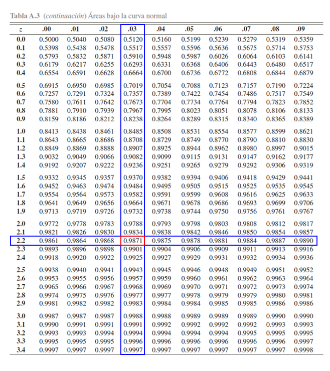

```{r knitr_init, echo=FALSE, cache=FALSE}
library(knitr)
## Global options
opts_chunk$set(echo=TRUE,
               cache=TRUE,
               prompt=FALSE,
               tidy=TRUE,
               comment=NA,
               message=FALSE,
               warning=FALSE,
               fig.path = paste0("../../EstadisticaII/images/", "Clase01"),
               cache.path = "../../EstadisticaII/cache/",
               cache = FALSE)

```

## Introducción

La Estadística es una **fuerte herramienta** empleada en las diferentes disciplinas científicas, debido a su gran potencial para **recolectar, analizar y presentar** de forma amigable, la información que se genera en las distintas áreas del conocimiento, para así poder argumentar y soportar de mejor manera las investigaciones realizadas. 

Adicionalmente, la estadística tiene como ventaja respecto a otras áreas, que permite extraer información de **variables tanto numérica como categórica** de la población de interés o de una muestra de la misma, permitiendo con ello, establecer conclusiones acerca de la misma población, o de alguno de los parámetros que la conforman. Dado lo anterior, no es de sorprender que la estadística sea concebida como **uno de los pilares fundamental** dentro de la investigación científica teórica y aplicada.

En general, el análisis estadístico puede dividirse en dos partes:

* La **Estadística descriptiva**, la cual se encarga de resumir la información suministrada mediante el empleo de tablas, gráficas y medidas numéricas, junto con el análisis de las mismas, para facilitar la interpretación y la presentación de la información.
* La **Inferencia estadística**, la cual se encarga de la inferencias, modelamiento y predicción de la información, para facilitar la obtención de conclusiones y toma de decisiones.

## Inferencia estadística
La inferencia estadística es la obtención de conclusiones basadas en datos experimentales. Para entender la naturaleza de la inferencia estadística, se debe entender primero la diferencia entre "población" y "muestra".

**Población:** Consta del total de observaciones del suceso o proceso en que estamos interesados. En muchas ocasiones, no es posible obtener o replicar dicha información.

**Muestra:** Es un subconjunto de la población de interés, extraída con el objetivo de hacer inferencia sobre la población.

**Muestra aleatoria:** Es un subconjunto de la población seleccionado de forma independiente e idénticamente distribuidos (*iid* en adelante).

## Estadísticos
Son funciones de las variables aleatorias obtenidas a partir de muestras aleatorias, que tienen por objetivo estimar o hacer inferencia acerca de parámetros desconocidos de una población.

A continuación se definirán algunos estadísticos importantes que sirven para medir el centro y la dispersión de un conjunto de datos, acomodados por orden de magnitud.

## Estadísticos muestrales
Sea `$X_1, X_2, \ldots, Xn$` una muestra aleatoria *iid* de tamaño `$n$`, entonces se tendrán los siguientes estadísticos muestrales

### Media muestral
Es el promedio aritmético del total de las `$n$` observaciones pertenecientes a una muestra aleatoria. Éste estadístico se define como
`\begin{align*}
  \bar{X}=\sum_{i=1}^n\frac{x_i}{n}=\frac{x_1+x_2+\ldots+x_n}{n}
\end{align*}`

En <tt>R</tt>, puede calcularse el valor de la media muestral de una muestra aleatoria mediante la función `mean(datos)`.

<button id="Show1" class="btn btn-secondary">Mostrar Ejercicio </button>
<button id="Hide1" class="btn btn-info">Ocultar Ejercicio </button>
<main id="botoncito1"> 
<h3 data-toc-skip> Ejercicio </h3> 
<p>Suponga que se realiza un estudio sobre el salario de los estudiantes de ingeniería industrial una vez finalizan su pregrado y se incertan en el mercado laboral. Para ello, se le pregunta a $15$ egresados seleccionados de forma aleatoria y se les pregunta cuál es el salario que devengan actualmente, obteniendo los siguientes resultados en millones de pesos
$$\begin{align*}
1.78 \quad 2.93 \quad 1.22 \quad 1.27 \quad 1.17 \\
1.03 \quad 1.24 \quad 2.07 \quad 2.04 \quad 1.28 \\
1.53 \quad 0.98 \quad 1.73 \quad 1.38 \quad 3.24
\end{align*}$$

Basados e la información anterior, calcule el salario promedio muestral egresados del programa de ingeniería industrial. </p>

<h3 data-toc-skip> Solución </h3> 
<p> 
En este caso estamos interesados en calcular el salario promedio muestral de los del programa de ingeniería industrial, y para ello no están dando la información individual obtenida para cada uno de los $15$ egresados. <br>
<br>
Entonces para realizar el cálculo empleamos la ecuación para el cálculo de la media muestral, tal que
$$\begin{align*}
  \bar{X}=\sum_{i=1}^n\frac{x_i}{n}
\end{align*}$$
En donde, si llamamos cada una de las observaciones como $X_1, X_2, \ldots, X_{15}$, tendremos que 
$$\begin{align*}
  \bar{X} &= \frac{1.79 + 2.93 + 1.22 + \ldots + 3.24}{15}\\
          &= 1.659333
\end{align*}$$
Por tanto, se tendrá que el promedio muestral obtenido para el salario de los egresados del programa de ingeniería industrial es de $1.659$ millones de pesos.
</p>
</main>

### Varianza muestral
Es la distancia media **al cuadrado** del conjunto de observaciones pertenecientes a una muestra aleatoria, respecto a la media muestra.
`\begin{align*}
  S^2=\frac{1}{n-1}\sum_{i=1}^n{(x_i-\bar{X})^2}
\end{align*}` 

siendo el valor `$n-1$` conocido como la corrección de Bessel, el cuál se usa en lugar de la división sobre `$n$` con el fin de corregir el sesgo tendría el estimador.

En <tt>R</tt> puede calcularse la varianza muestral de una muestra aleatoria mediante la función `var(datos)`.

<button id="Show2" class="btn btn-secondary">Mostrar Ejercicio </button>
<button id="Hide2" class="btn btn-info">Ocultar Ejercicio </button>
<main id="botoncito2"> 
<h3 data-toc-skip> Ejercicio </h3> 
<p>Suponga que se realiza un estudio sobre el salario de los estudiantes de ingeniería industrial una vez finalizan su pregrado y se incertan en el mercado laboral. Para ello, se le pregunta a $15$ egresados seleccionados de forma aleatoria y se les pregunta cuál es el salario que devengan actualmente, obteniendo los siguientes resultados en millones de pesos
$$\begin{align*}
1.78 \quad 2.93 \quad 1.22 \quad 1.27 \quad 1.17 \\
1.03 \quad 1.24 \quad 2.07 \quad 2.04 \quad 1.28 \\
1.53 \quad 0.98 \quad 1.73 \quad 1.38 \quad 3.24
\end{align*}$$

Basados e la información anterior, calcule la varianza muestral del salario de los $15$ egresados del programa de ingeniería industrial. </p>

<h3 data-toc-skip> Solución </h3> 
<p> 
En este ejercicio nos preguntan por la varianza muestral del salario de los egresados del programa de ingeniería industrial, y para realizar el cálculo nos dan el salario individual de cada uno de los $15$ egresados. <br>
<br>
Para realizar el cálculo de la varianza de los salarios de los egresados, empleamos la ecuación de la varianza muestral, tal que
$$\begin{align*}
  S^2=\frac{1}{n-1}\sum_{i=1}^n{(x_i-\bar{X})^2}
\end{align*}$$
En donde, si cada una de las observaciones hace referencia los valores $X_1, X_2, \ldots, X_{15}$, y el valor de la media es igual a $\bar{X}=1.659333$ tendremos que 
$$\begin{align*}
  S^2 &= \frac{(1.78 - 1.659333)^2 + (2.93 - 1.659333)^2+\ldots+(3.24 - 1.659333)^2}{15-1} \\
      &= \frac{0.01456052 + 1.614595 + \ldots + 2.498508}{14}\\
      &= 0.4501638
\end{align*}$$
Por tanto, se tendrá que la varianza muestral del salario de los egresados del programa de ingeniería industrial es de $0.4501638$.
</p>
</main>

### Desviación estándar muestral
Es la raíz cuadrada de la distancia media **al cuadrado** del conjunto de observaciones pertenecientes a una muestra aleatoria, respeto a la media, es decir, indica qué tan dispersos se encuentra el conjunto de observaciones de una muestra aleatoria respecto a su valor promedio.
`\begin{align*}
  S=\sqrt{S^2}
\end{align*}`

En <tt>R</tt> puede calcularse la desviación estándar de una muestra aleatoria mediante la función `sd(datos)`.

<button id="Show3" class="btn btn-secondary">Mostrar Ejercicio </button>
<button id="Hide3" class="btn btn-info">Ocultar Ejercicio </button>
<main id="botoncito3"> 
<h3 data-toc-skip> Ejercicio </h3> 
<p>Suponga que se realiza un estudio sobre el salario de los estudiantes de ingeniería industrial una vez finalizan su pregrado y se incertan en el mercado laboral. Para ello, se le pregunta a $15$ egresados seleccionados de forma aleatoria y se les pregunta cuál es el salario que devengan actualmente, obteniendo los siguientes resultados en millones de pesos
$$\begin{align*}
1.78 \quad 2.93 \quad 1.22 \quad 1.27 \quad 1.17 \\
1.03 \quad 1.24 \quad 2.07 \quad 2.04 \quad 1.28 \\
1.53 \quad 0.98 \quad 1.73 \quad 1.38 \quad 3.24
\end{align*}$$

Basados e la información anterior, calcule el salario promedio de los $15$ egresados del programa de ingeniería industrial. </p>

<h3 data-toc-skip> Solución </h3> 
<p> 
Para calcular la desviación estandar muestral del salario de los egresados del programa de ingeniería industrial, podemos emplear la varianza muestral ya calculada en el ejercicio anterior, la cual dio como resultado
$$\begin{align*}
  S^2 &= 0.4501638
\end{align*}$$

así que, al aplicar la ecuación de la desviación estandar muestral tendremos que
$$\begin{align*}
  S &= \sqrt{S^2} \\
    &= \sqrt{0.4501638} \\
    &= 0.6709425
\end{align*}$$

Por tanto, se tendrá que el promedio muestral obtenido para el salario de los egresados del programa de ingeniería industrial es de $1.659$ millones de pesos, con una desviación estándar de $670$ mil pesos. 

</p>
</main>

## Distribuciones muestrales
Debido a que todos los estadístico son funciones de las variables aleatorias observadas en una muestra, éstos también serán variables aleatorias que tendrán distribuciones de probabilidad asociadas, distribuciones que son llamadas distribuciones muestrales.

### Distribución muestral de `$\bar{X}$`
Sea `$X_1, X_2, \ldots, X_n$` una muestra aleatoria de tamaño `$n$` de una distribución normal con media `$\mu$` y varianza `$\sigma^2$`, entonces se puede mostrar que
`\begin{align*}
\bar{X}=\frac{1}{n}\sum_{i=1}^n x_i \sim N(\mu, \sigma^2/n)
\end{align*}`
se distribuye normalmente con media `$\mu$` y varianza `$\sigma^2/n$`.

#### Teorema
Dado que `$\bar{X}\sim N(\mu,\sigma^2/n)$`, entonces se puede aplicar la estandarización que se emplea a la distribución normal para llevar ésta, a una distribución normal estándar. Dicha estandarización sería de la forma
`\begin{align*}
Z_c = \frac{\bar{X}-\mu}{\sigma/\sqrt{n}} \sim N(0,1)
\end{align*}`
y se tendrá que `$Z$` se distribuirá como una normal estándar de forma exacta.

<button id="Show4" class="btn btn-secondary">Mostrar Ejercicio Manejo de Tabla Normal Estándar</button>
<button id="Hide4" class="btn btn-info">Ocultar Ejercicio Manejo de Tabla Normal Estándar</button>
<main id="botoncito4"> 
<h3 data-toc-skip> Ejercicio </h3> 
<p> Suponga que poseemos una distribución normal estándar, tal que $Z\sim N(0,1)$. Entonces, a partir de esta distribución y empleando la <a href="https://github.com/jiperezga/jiperezga.github.io/raw/master/Dataset/Documentos/DistNormEst.pdf">Tabla de la Distribución Normal Estándar</a>, calcule </p>
<ol>
<li>$\mathbb{P}(Z\leq 1.96)$</li> 
<li>$\mathbb{P}(Z> 2.13)$</li>
<li>$\mathbb{P}(-2.42 <Z \leq 0.24)$</li>
<li>$\mathbb{P}(Z>z) = 0.0129$</li>
</ol>

<h3 data-toc-skip> Solución </h3> 
<p>Para calcular probabilidades con la tabla de la distribución normal estándar, es necesario tener en cuenta el funcionamiento de la tabla misma. Y para ello se presenta la siguiente imagen.</p>


<p>En donde, se aprecia que, <strong>los cuadros rojos representan los valores críticos</strong> $z$ que se emplea para calcular probabilidades, en donde, el cuadro rojo de la parte izquierda muestra la parte entera y el primer decimal, mientras que el cuadro rojo de la parte superior muestra el segundo decimal. <strong>El cuadro azul representa las probabilidades</strong> $\alpha$ que se desean calcular a partir de los valores críticos. Finalmente, <strong>el cuadro azul claro representa el funcionamiento de la tabla </strong>, la cual muestra las probabilidades que poseen la forma $\mathbb{P}(Z<z)=\alpha$. </p>

<ol>
<li>Con la explicación de la tabla en mente, la primera probabilidad a calcular es $\mathbb{P}(Z\leq 1.96)$. Entonces como esta probabilidad tiene la estructura establecida por la tabla $\mathbb{P}(Z\leq z)$, será cuestión de buscar el valor crítico $1.96$ para localizar la probabilidad asociada, tal que se busca en la parte izquierda, el valor $1.9$ y en la parte superior el valor $0.06$, y en donde se encuentre el cruce de ambos valores, se encontrará el valor de la probabilidad asociada a $1.96$. Dicho procedimiento se muestra en la siguiente imagen 


Donde se aprecia que 

$$\begin{align*}\mathbb{P}(Z\leq 1.96)=0.9750\end{align*}$$

</li> 
<li>A diferencia del punto anterior, observamos que la probabilidad propuesta $\mathbb{P}(Z> 2.13)$ tiene una estructura diferente a la establecida por la tabla $\mathbb{P}(Z\leq z)$, y por tanto, será necesario emplear el complemento de la probabilidad propuesta para obtener una estructura similar a la propuesta por la tabla, tal que

$$\begin{align*}
\mathbb{P}(Z> 2.13)= 1 - \mathbb{P}(Z\leq 2.13)
\end{align*}$$
En donde, se aprecia que ahora podemos calcular la $\mathbb{P}(Z> 2.13)$, mediante el empleo de la $\mathbb{P}(Z\leq 2.13)$, la cual podemos buscar en la tabla directamente. Para localizar $\mathbb{P}(Z\leq 2.13)$, se busca el valor $2.1$ en la parte izquierda de la tabla, y el valor $0.03$ en la parte superior de la tabla, y en donde se encuentre el cruce de ambos valores, se encontrará el valor de la probabilidad asociada a $2.13$.


Donde se aprecia que 

$$\begin{align*}
\mathbb{P}(Z\leq 2.13)=0.9834
\end{align*}$$

y por tanto, se tendrá que 

$$\begin{align*}
\mathbb{P}(Z> 2.13)&= 1 - \mathbb{P}(Z\leq 2.13)\\
                   &= 1 - 0.9834 \\
                   &= 0.0166
\end{align*}$$

</li>
<li>En este caso, se desea calcular la $\mathbb{P}(-2.42 <Z \leq 0.24)$, y se observa que la estructura de dicha probabilidad es diferente a la establecida por la tabla $\mathbb{P}(Z\leq z)$, pero también podemos apreciar que si aplicamos las propiedades de la función de distribución acumulada para el caso continuo, ya presentadas en la <a href="../../EstadisticaI/EstIClase08.html#distribución-de-probabilidad-continua">Clase 08</a> de Estadística I, podemos llevar la probabilidad de interés a la forma

$$\begin{align*}
\mathbb{P}(-2.42 <Z \leq 0.24) = \mathbb{P}(Z \leq 0.24) - \mathbb{P}(Z \leq -2.42)
\end{align*}$$
obteniendo que la probabilidad $\mathbb{P}(-2.42 <Z \leq 0.24)$, puede calcularse mediante el empleo de las probabilidades acumuladas $\mathbb{P}(Z \leq 0.24)$ y $\mathbb{P}(Z \leq -2.42)$, las cuales pueden calcularse en la tabla de forma similar a los dos puntos anteriores.


Donde se aprecia que 

$$\begin{align*}
\mathbb{P}(Z \leq -2.42)=0.0078 \quad \text{ y } \quad \mathbb{P}(Z \leq 0.24)=0.5948
\end{align*}$$

y por tanto, se tendrá que 

$$\begin{align*}
\mathbb{P}(-2.42 <Z \leq 0.24) &= \mathbb{P}(Z \leq 0.24) - \mathbb{P}(Z \leq -2.42)\\
                               &= 0.5948 - 0.0078  \\
                               &= 0.587
\end{align*}$$
</li>

<li>En este punto, a diferencia de los puntos anteriores, no están dando el valor de la probabilidad y nos piden encontrar el valor crítico $z$. Es decir debemos calcular el valor crítico asociado a la probabilidad
$$\begin{align*}
\mathbb{P}(Z>z) = 0.0129
\end{align*}$$

Y para ello, debemos llevar inicialmente la estructura de la probabilidad, a la estructura manejada por la tabla, tal que

$$\begin{align*}
\mathbb{P}(Z>z) &= 0.0129 \\
1 - \mathbb{P}(Z\leq z) &= 0.0129 \\
1- 0.0129 &= \mathbb{P}(Z\leq z) \\
0.9871 &= \mathbb{P}(Z\leq z)
\end{align*}$$

En donde observamos que la probabilidad $\mathbb{P}(Z\leq z)$ ya posee la estructura de la tabla, y en consecuencia, podemos proceder a encontrar el valor crítico $z$, buscando el valor de la probabilidad $0.9871$ en la parte interior de la tabla, y luego buscando cual es el valor crítico $z$ asociado a dicha probabilidad.



En la tabla se aprecia, que al buscar la probabilidad $0.9871$ encontramos que el valor crítico $z$ asociado es de $2.24$, es decir

$$\begin{align*}
\mathbb{P}(Z\leq 2.24) &= 0.9871
\end{align*}$$

o equivalentemente

$$\begin{align*}
\mathbb{P}(Z > 2.24) &= 0.0129
\end{align*}$$

</li>
</ol>
</main>

<button id="Show5" class="btn btn-secondary">Mostrar Ejercicio </button>
<button id="Hide5" class="btn btn-info">Ocultar Ejercicio </button>
<main id="botoncito5"> 
<h3 data-toc-skip> Ejercicio </h3> 
<p>Suponga que se realiza un estudio sobre el salario de los estudiantes de ingeniería industrial una vez finalizan su pregrado y se incertan en el mercado laboral. Para ello, se le pregunta a $15$ egresados seleccionados de forma aleatoria y se les pregunta cuál es el salario que devengan actualmente, obteniendo los siguientes resultados en millones de pesos
$$\begin{align*}
1.78 \quad 2.93 \quad 1.22 \quad 1.27 \quad 1.17 \\
1.03 \quad 1.24 \quad 2.07 \quad 2.04 \quad 1.28 \\
1.53 \quad 0.98 \quad 1.73 \quad 1.38 \quad 3.24
\end{align*}$$

Basados e la información anterior, calcule la probabilidad de que el salario promedio de todos los egresados del programa de ingeniería industrial sea a lo más de $2$ millones de pesos, si se sabe, que los salarios se distribuyen normalmente con desviación estándar de $0.5$ millones de pesos.  </p>

<h3 data-toc-skip> Solución </h3> 
<p>
En este caso, estamos interesados en calcular la probabilidad de que la media poblacional del salario de los egresados, sea como máximo de $2$ millones de pesos, esto es
$$\begin{align*}
\mathbb{P}(\mu\leq 2)
\end{align*}$$
Ahora, dado que para encontrar la probabilidad asociada a la media poblacional, requeriríamos conocer la distribución de probabilidad de $\mu$, y ésta, no es una distribución conocida, entonces podemos emplear la distribución muestral de los salarios, la cual se distribuye normalmente.<br>
<br>
Y para ello, debemos realizar operaciones matemáticas, de tal forma que la probabilidad planteada tenga la estructura de una distribución de probabilidad conocida, tal como lo es la distribución normal estándar, tal que

$$\begin{align*}
Z_c = \frac{\bar{X}-\mu}{\sigma/\sqrt{n}} \sim N(0,1)
\end{align*}$$

Con esta estructura en mente, y con el valor de la desviación estándar poblacional conocida e igual a $\sigma=0.5$ y habiendo calculado previamente la media de de la muestra de las $n=15$ observaciones, la cual dió un resultado igual a $\bar{X} = 1.659333$, realizamos las siguientes operaciones matemáticas para llevar la probabilidad original, a una forma conocida, tal que
$$\begin{align*}
\mathbb{P}(\mu\leq 2) &= \mathbb{P}(-\mu\geq -2) \\
                      &= \mathbb{P}(\bar{X}-\mu\geq 1.659333-2) \\
                      &= \mathbb{P}\left(\frac{\bar{X} - \mu}{\sigma/ \ \sqrt{n}} \geq \frac{1.659333-2}{0.5/\sqrt{15}}\right) \\
                      &= \mathbb{P}\left(Z \geq -2.638793\right) \\
\end{align*}$$

Y como $Z \sim N(0,1)$, entonces podemos encontrar la probabilidad de interés, empleando la <a href="https://github.com/jiperezga/jiperezga.github.io/raw/master/Dataset/Documentos/DistNormEst.pdf">Tabla de la Distribución Normal Estándar</a>, la función <tt>pnorm()</tt> del software <tt>R</tt> o la función <tt>DISTR.NORM.ESTAND.N()</tt> de Excel, tal que

$$\begin{align*}
\mathbb{P}\left(Z \geq -2.638793\right) = 0.9958399
\end{align*}$$

lo cual, dada la equivalencia de la igualdad anterior, significará que
$$\begin{align*}
\mathbb{P}(\mu\leq 2) = 0.9958399
\end{align*}$$

es decir que la probabilidad de que el salario promedio de todos los egresados del programa de ingeniería industrial sea como máximo de $2$ millones de pesos, es del $99.58\%$.
</p>
</main>