```{r knitr_init, echo=FALSE, cache=FALSE}
library(knitr)
## Global options
opts_chunk$set(echo=TRUE,
               cache=TRUE,
               prompt=FALSE,
               tidy=TRUE,
               comment=NA,
               message=FALSE,
               warning=FALSE,
               fig.path = paste0("../../Guias/images/", "GuiaMac"),
               cache.path = "../../Guias/cache/",
               cache = FALSE)

```

## Instalación de R-Project
Para la descarga de la última versión del programa R-project en Mac OS X, haga click en el siguiente enlace [(Descargar R-project)](https://cloud.r-project.org/bin/macosx/){:target="_blank"}.
Una vez realizado click en el enlace, se abrirá la siguiente venta

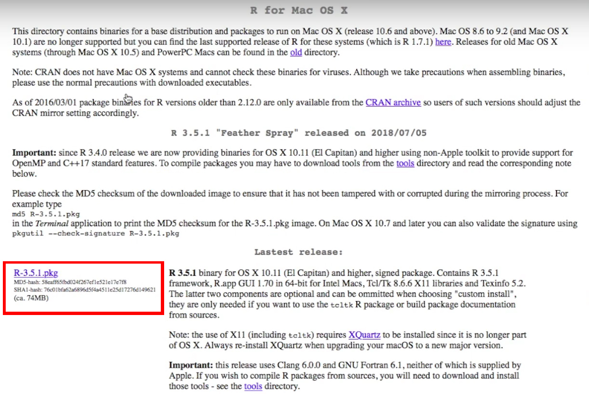

Haga click en el recuadro rojo que aparece en la imagen anterior e iniciará la descarga de un archivo con nombre R-3.x.x.pkg donde x.x hace referencia a la versión del programa que se está descargando. Procure siempre descargar la última versión disponible.

Una vez completada la descarga, haga doble click sobre el instalador para que éste inicie

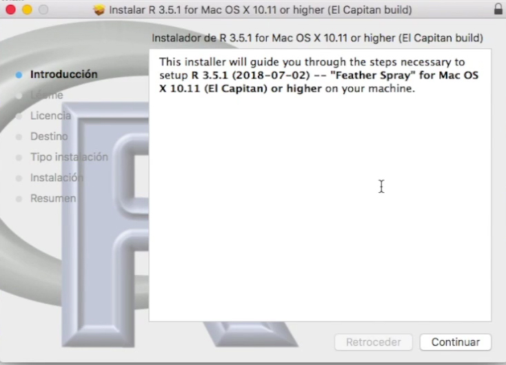

En la ventana de introducción, simplemente haga click en Continuar

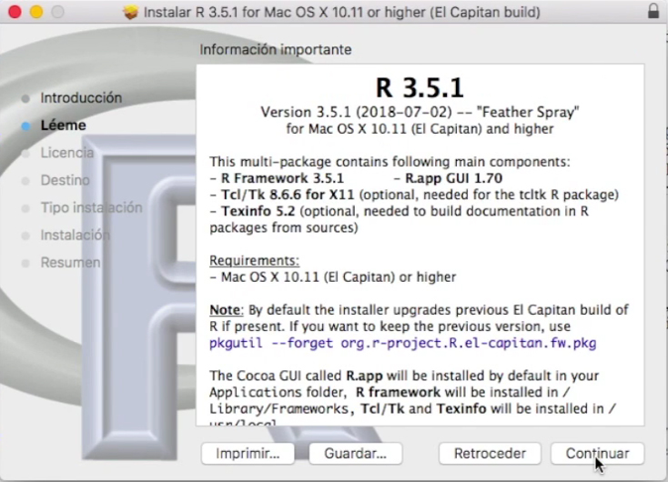

En la ventana Léeme, puede leer la información allí presentada si es de su interés, y de click en el botón Continuar

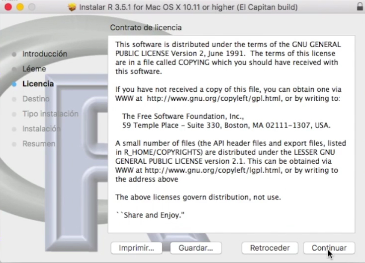

En la ventana de Licencia, se presenta el contrato de licencia de la aplicación, puede leer la información allí presentada si es de su interés, y de click en el botón Continuar

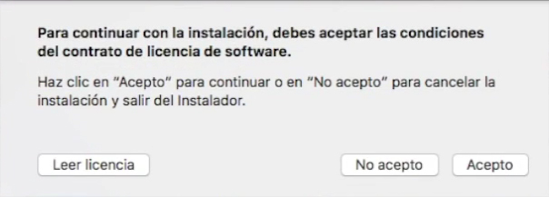

Lo anterior, hará que aparezca una nueva ventana de verificación para aceptar el contrato de licencia, presione simplemente el botón Acepto

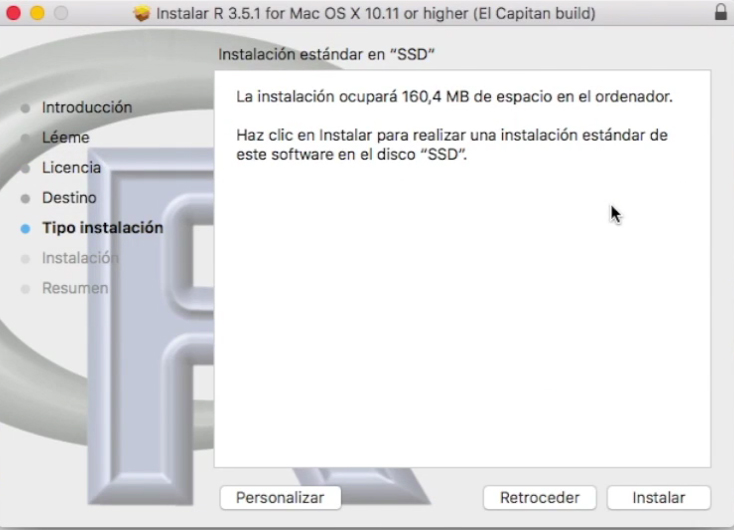

En la ventana de Tipo de Instalación, presione simplemente el botón Instalar

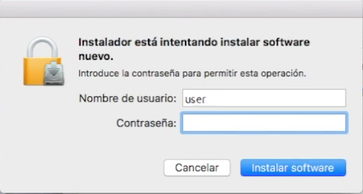

Lo anterior, hará que aparezca una nueva ventana de verificación, que le pedirá que ingrese su contraseña la contraseña del usuario para poder realizar la instalación. Ingrese la contraseña del usuario y presione el botón Instalar software

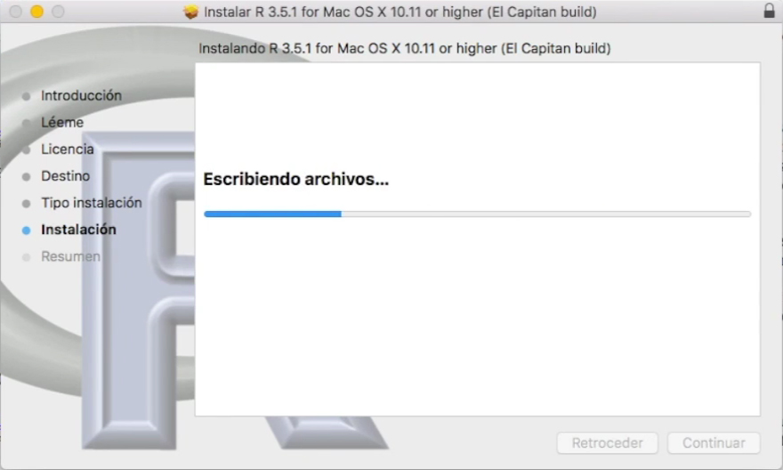

Esto hará que aparezca la ventana de instalación, espere un par de minutos mientras el proceso finaliza.

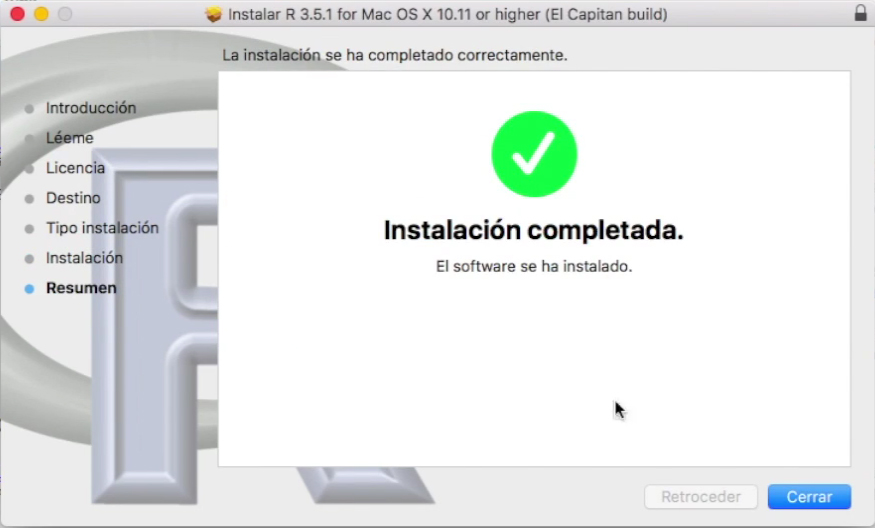

Finalmente, en la venta de de Resumen, se le indica que la instalación fue completada satisfactoriamente, simplemente haga click en el botón Cerrar.

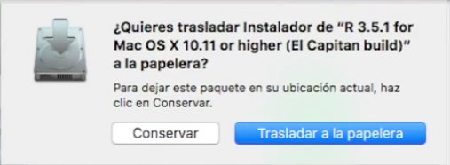

Lo anterior, hará que aparezca una nueva ventana que le pregunta si desea conversar o no el instalador. Presione cualquiera de los dos botones dependiendo de su preferencia, y con ésto concluirá la instalación del programa.

## Instalación de RStudio
Para la descarga de la última versión del programa Rstudio, haga click en el siguiente enlace [(Descargar RStudio)](https://rstudio.com/products/rstudio/download/#download){:target="_blank"}.

Una vez realizado click en el enlace, se abrirá la siguiente venta

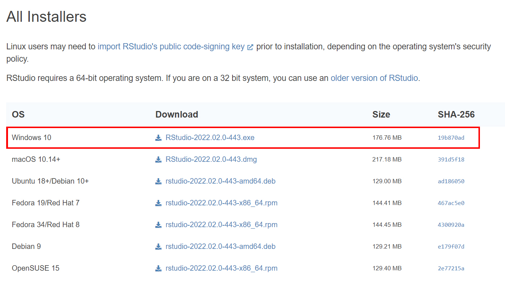

Haga click sobre la versión de Rstudio que sea compatible con su sistema operativo para que comience la descarga. 

Una vez completada la descarga, haga doble click sobre el instalador para que éste inicie

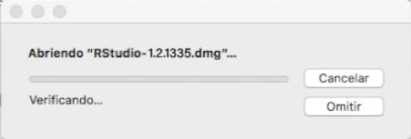

Esto hará que aparezca la ventana de instalación, espere un par de segundos mientras el proceso finaliza.

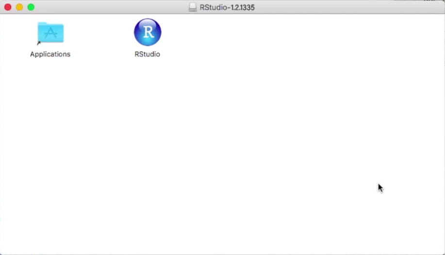

Una vez finalizada la instalación, se abrirá la ventana anterior

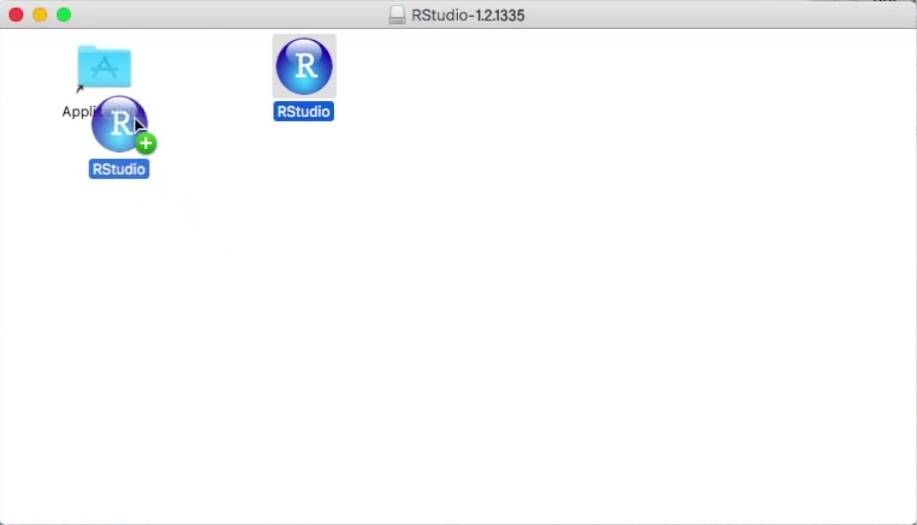

Lo que debe hacer es arrastrar RStudio a la carpeta aplicaciones, y con ésto concluirá la instalación del programa.

**Nota:** Es posible que cuando abra RStudio por primera vez se abra la siguiente ventana

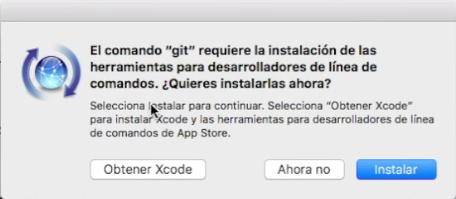

En cuyo caso, haga simplemente click en el botón Instalar.

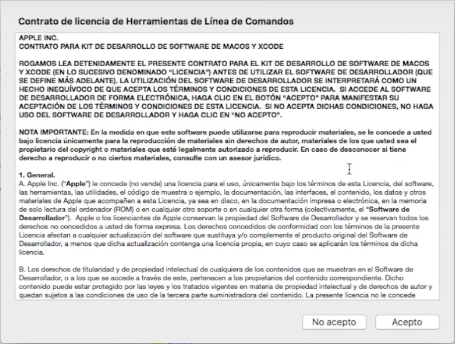

Esto hará, que se abra una ventana con un contrato de licencia, puede leer la información allí presentada si es de su interés, y de click en el botón Acepto.

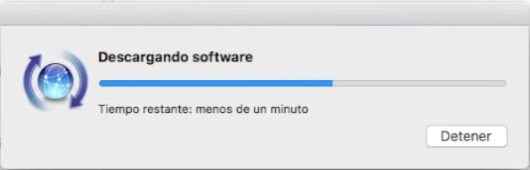

Esto hará que aparezca la ventana de instalación de la herramienta para desarrolladores, espere un par de minutos mientras el proceso finaliza. Y con ésto podrá usar el programa sin ningún tipo de problema.
