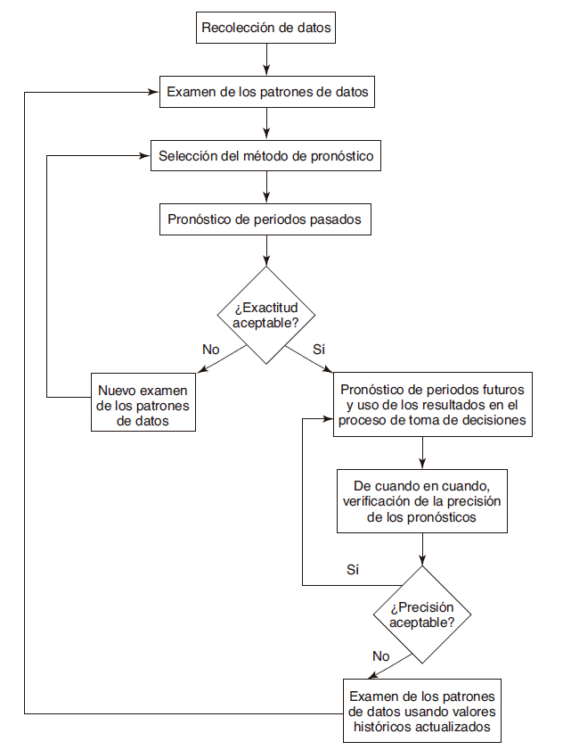

```{r knitr_init, echo=FALSE, cache=FALSE}
library(knitr)
## Global options
opts_chunk$set(echo=TRUE,
               cache=TRUE,
               prompt=FALSE,
               tidy=TRUE,
               comment=NA,
               message=FALSE,
               warning=FALSE,
               fig.path = paste0("../../MuestreoySeriesdeTiempo/images/", "Clase01"),
               cache.path = "../../MuestreoySeriesdeTiempo/cache/",
               cache = FALSE)
```


## Introducción

Una serie de tiempo es una secuencia de observaciones registradas y ordenadas de forma periódica, en intervalos de tiempo igualmente espaciados, tales como, días, meses, semestres, años, entre otros. Estas observaciones son caracterizadas por una variable aleatoria `$Y_t$`, la cual depende del tiempo `$t=1,2,\ldots,T$`, y donde el objetivo es modelar el comportamiento de `$Y_t$` contra `$t$`, siendo `$T$` el número total de observaciones que se tenga en la serie de tiempo.

Un ejemplo de una serie temporal, se presenta a continuación donde se muestra el % anual del `$PIB$` per cápita de Colombia, para un intervalo de tiempo anual que va desde 1961 hasta 2017

<pre>
```{r echo=FALSE}
library(plotly)
# https://datos.bancomundial.org/indicador/NY.GDP.PCAP.KD.ZG
PIBcol <- ts(c(1.983183392, 2.292595551, 0.231792643, 3.033555246, 0.557370132, 2.156500316, 1.110445303, 2.924696885, 3.209951184, 3.462385145, 3.379791618, 5.181404836, 4.344116951, 3.415242062, 0.054377114, 2.385808489, 1.819540279, 6.026298262, 3.003067413, 1.744317806, -0.023027616, -1.316171395, -0.683991606, 1.09300722, 0.907423685, 3.625085068, 3.235271842, 2.009085124, 1.418335593, 2.312929483, 0.116795606, 2.166679144, 3.53222506, 4.009005561, 3.4647784, 0.427584131, 1.834165369, -0.939121717, -5.611912127, 1.43545282, 0.226857288, 1.065060726, 2.489228212, 3.922772027, 3.34837565, 5.439446434, 5.551168521, 2.045206544, 0.058604955, 3.206963611, 6.232264851, 2.850694341, 3.547537302, 3.744554111, 2.023519393, 1.072527479, 0.934070318), start = 1961)
fechas1 <- seq(from = 1961, length.out = length(PIBcol))
plot_ly(x = ~fechas1, y = ~PIBcol, mode = 'lines+markers', text = paste("PIB =", round(PIBcol, 3)), width = 700, height = 400) %>% layout(title="Crecimiento del PIB per cápita (% anual)", xaxis = list(title ="Año"), yaxis = list(title = "PIB (% anual)")) %>% 
layout(margin = list(l = 60, r = 60, b = 60, t = 60, pad = 4))
```
</pre>

Otro ejemplo, se presenta para el material particulado `$PM_{10}$` y `$PM_{2.5}$` en la ciudad de Medellín para el mes de abril del año 2019, el cual se registra en intervalos de una hora

<pre style="height:610px">
```{r echo=FALSE}
library(readxl)
aire <- read_xlsx("../../Dataset/calidadaireabril2019.xlsx")
pm25 <- unclass(aire$pm25)
pm10 <- unclass(aire$pm10)
fechas2 <- aire$Fecha_Hora
# https://siata.gov.co/siata_nuevo/index.php/mapa/
### Extracció de Atípicos y gráfico pm25
lim25 <- quantile(pm25,probs = c(0.25,0.75))+c(-1.5*IQR(pm25),1.5*IQR(pm25))
SApm25 <- pm25[dplyr::between(pm25,lim25[1],lim25[2])]
fpm25 <- fechas2[dplyr::between(pm25,lim25[1],lim25[2])]
plotpm25 <- plot_ly(x = ~fpm25, y = ~SApm25, mode = 'lines+markers', text = paste("PM2.5 =", SApm25), width = 700, height = 400, name = "PM2.5")

### Extracció de Atípicos y gráfico pm25
lim10 <- quantile(pm10,probs = c(0.25,0.75))+c(-1.5*IQR(pm10),1.5*IQR(pm10))
SApm10 <- pm10[dplyr::between(pm10,lim10[1],lim10[2])]
fpm10 <- fechas2[dplyr::between(pm10,lim10[1],lim10[2])]
plotpm10 <- plot_ly(x = ~fpm10, y = ~SApm10, mode = 'lines+markers', text = paste("PM10 =", SApm10), width = 700, height = 400, name = "PM10") 
subplot(plotpm25, plotpm10, nrows = 2, margin = 0.08) %>% 
  layout(title = "Material particulado 2.5 y 10",
         yaxis = list(title = "PM2.5"),
         yaxis2 = list(title = "PM10"),
         xaxis2 = list(title = "Días"),
         margin = list(r=60, l=60, t=60, b=60, pad = 4), height = 600)

```
</pre>

Es de anotar que, para el estudio de series de tiempo, se requiere de procedimientos estadísticos diferentes a los análisis empleados tradicionalmente, debido a la dependencia o correlación existente entre los diferentes puntos observados en el tiempo, la cual no permite suponer que el conjunto de datos sea independiente e idénticamente distribuido, y en consecuencia, se hace necesario el empleo de modelos estadísticos que permitan explicar el comportamiento de variables aleatorias que dependan del tiempo, para así poder realizar inferencia sobre éstas.

Entre los principales objetivos del análisis de series de tiempo, se destaca el comprender, describir e identificar patrones en el comportamiento de las series, evidenciar el efecto de acciones o decisiones pasadas (intervenciones)<!-- conocidas como intervenciones hechas sobre la serie. Estas intervenciones pueden tener un efecto momentáneo o bien un efecto permanente que modifica la estructura de la serie de tiempo intervenida. -->, realizar pronósticos que contribuyan al proceso de toma de decisiones, entre otros.

## Pronósticos

Un pronóstico es una predicción de algún evento futuros, que se hace a partir de los datos pasados que se conocen sobre el suceso específico. Generalmente, los pronósticos son empleados en la toma de decisiones, pues permiten disminuir la incertidumbre sobre el futuro, facilitan los procesos de planificación y control.

## Métodos de pronóstico

Un factor importante en la realización de pronósticos, es el método de pronóstico que se va a emplear. Según lo planteado por @Chase2009[, pp. 469-470], los pronósticos pueden ser clasificados en cuatro tipos diferentes, los cuales se definen como técnicas cualitativas, análisis de series de tiempo, relaciones causales o econométricas y modelos de simulación.

### Técnicas cualitativas
Los pronósticos cualitativos son basados en opiniones subjetivas, en donde, la información empleada para realizar el pronóstico, se obtiene mediante el juicio de un grupo de expertos en el tema, con amplia experiencia en el área de interés, el cual entrega valores o rango de valores sobre el comportamiento futuro de la variable de estudio. Usualmente este método se emplea cuando la información que se tiene de la variable de interés, es escasa, no puede ser cuantificada o es poco confiable.

Entre las técnicas empleadas para realizar pronósticos subjetivos se destacan

* Técnicas acumulativas <!-- Deriva un pronóstico a través de la compilación de las entradas de aquellos que se encuentran al final de la jerarquía y que tratan con lo que se pronostica. Por ejemplo, un pronóstico general de las ventas se puede derivar combinando
las entradas de cada uno de los vendedores que están más cerca de su territorio. -->
* Investigación de mercados <!-- Se establece para recopilar datos de varias formas (encuestas, entrevistas, etc.) con el fin de comprobar hipótesis acerca del mercado. Por lo general, se usa para pronosticar ventas a largo plazo y de nuevos productos -->
* Grupos de consenso <!-- Intercambio libre en las juntas. La idea es que la discusión en grupo produzca mejores pronósticos que cualquier individuo. Los participantes pueden ser ejecutivos, vendedores o clientes. -->
* Analogía histórica <!-- Relaciona lo pronosticado con un artículo similar. Es importante al planear nuevos productos en los que las proyecciones se pueden derivar mediante el uso del historial de un producto similar. -->
* Método Delphi <!-- Un grupo de expertos responde un cuestionario. Un moderador recopila los resultados y formula un cuestionario nuevo que se presenta al grupo. Por lo tanto, existe un proceso de aprendizaje para el grupo mientras recibe información nueva y no existe ninguna influencia por la presión del grupo o individuos dominantes. -->

### Análisis de series de tiempo
Los pronósticos basados en análisis de series de tiempo, son aquellos que emplean la información histórica de una variable de interés, con el objetivo de descubrir patrones que permitan extrapolar la dicha información, para realizar proyecciones hacia el futuro.

Entre las técnicas empleadas para realizar pronósticos mediante análisis de series de tiempo se destacan

* Promedio móvil simple  <!-- Se calcula el promedio de un periodo que contiene varios puntos de datos dividiendo la suma de los valores de los puntos entre el número de éstos. Por lo tanto, cada uno tiene la misma influencia. -->
* Promedio móvil ponderado <!-- Puede ser que algunos puntos específicos se ponderen más o menos que los otros, según la experiencia -->
* Suavización exponencial <!-- Los puntos de datos recientes se ponderan más y la ponderación sufre una reducción exponencial conforme los datos se vuelven más antiguos. -->
* Análisis de regresión <!-- Ajusta una recta a los datos pasados casi siempre en relación con el valor de los datos. La técnica de ajuste más común es la de los mínimos cuadrados. -->
* Técnica Box Jenkins <!-- Muy complicada, pero al parecer la técnica estadística más exacta que existe. Relaciona una clase de modelos estadísticos con los datos y ajusta el modelo con las series de tiempo utilizando distribuciones bayesianas posteriores. -->
* Series de tiempo Shiskin <!-- Un método efectivo para dividir una serie temporal en temporadas, tendencias e irregular. Necesita un historial por lo menos de 3 años. Muy eficiente para identificar los cambios, por ejemplo, en las ventas de una compañía. -->
* Proyecciones de tendencias <!-- Ajusta una recta matemática de tendencias a los puntos de datos y la proyecta en el futuro. -->

### Relaciones causales
Los pronósticos causales, son basados en el hecho de que la serie de tiempo de interés, posee una relación de causa-efecto con una o más variables independientes, los cual permite proyectar el comportamiento de la serie de tiempo de interés dado el comportamiento que tengan las variables independientes.

Entre las técnicas empleadas para realizar pronósticos mediante análisis de series de tiempo se destacan

* Análisis de regresión <!-- Similar al método de los mínimos cuadrados en las series de tiempo, pero puede contener diversas variables. La base es que el pronóstico se desarrolla por la ocurrencia de otros eventos. -->
* Modelos econométricos <!-- Intentos por describir algún sector de la economía mediante una serie de ecuaciones interdependientes. -->
* Modelos de entrada/salida <!-- Se enfoca en las ventas de cada industria a otros gobiernos y empresas. Indica los cambios en las ventas que una industria productora puede esperar debido a los cambios en las compras por parte de otra industria. -->
* Principales indicadores <!-- Estadísticas que se mueven en la misma dirección que la serie a pronosticar, pero antes que ésta, como un incremento en el precio de la gasolina que indica una baja futura en la venta de autos grandes. -->

### Modelos de simulación
Los pronósticos basados en modelos de simulación, son aquellos que dependen de un gran número de variables y las relaciones que poseen con factores exógenos, y por tanto, es posible realizar hacer énfasis en la estructura del modelo, mediante la suposición del comportamiento de las variables internas y el ambiente externo para observar cómo afectan éstas a los pronósticos.


## Tipos de pronóstico
Una vez definido el método de pronóstico que se desea emplear, es necesario decidir el tipo de pronóstico que se desea realizar, es decir, definir si se desea realizar un pronóstico **puntual**, por **intervalo** o de **densidad**.


### Clases de pronóstico
También es necesario definir la clase u horizonte de tiempo para el cual se va a realizar el pronostico, que depende de la frecuencia en que se tienen registrados los datos. @Montgomery2015[, p.2] señalan que los pronósticos puede ser clasificados en tres horizontes de tiempo

* **Corto plazo**: son aquellos que buscan predecir eventos futuros en un horizonte de tiempo pequeño, es decir, días, semanas o meses, y son empleados generalmente para diseñar estrategias o tomar decisiones inmediata.
* **Mediano plazo**: son predicciones que se realizan en un horizonte de tiempo un poco más amplio, el cual abarca estimaciones entre 1 y 2 años en el futuro, y se utiliza en general para diseñar presupuestos o procesos de producción y planeación de variables operativas.
* **Largo plazo**: son aquellos pronósticos que se extienden a horizontes de tiempo mucho más grandes, puesto que éstos pueden extenderse a muchos años en el futuro, y se emplean en procesos de planificación, programación y proyección de proyectos.

### Monitoreo de los pronósticos
Los pronósticos, al igual que otros procesos, requieren de supervisión continua, ya que, de no supervisar o evaluar su calidad constantemente, éste podría salirse de control y dar resultados que erróneos. Por ello, en @Hanke2010 se establece un diagrama de flujo, en el cual se presenta los pasos operativos para el monitoreo del proceso de pronóstico



## Componentes de una serie de tiempo
Para el análisis de series de tiempo, y pronostico de las mismas, es necesario realizar una adecuada selección del modelo que se va a emplear, y por ello, es fundamental hacer una precisa identificación de los componentes que conforman la serie, los cuales pueden ser divididos en los componentes de tendencia, estacionalidad, error y fluctuación cíclica.

Para ilustrar el proceso de descomposición, se emplean dos conjuntos de datos. El primero corresponde a al total mensual de pasajeros de líneas aéreas internacionales, para los años 1949 a 1960, la cual se encuentra integrada en la base de <tt>R</tt>. 

```{r}
data(AirPassengers) # Carga base de datos de AirPassengers
AP <- AirPassengers # Guarda base de datos de AirPassengers

descAP <- stl(AP, s.window = 12)

plot(descAP, main="Componentes del Número de Pasajeros Aéreos", col = "chocolate1", lwd = 2)
```

<pre style="height:610px">
```{r echo=FALSE}
# install.packages("devtools") # Instala librería en github
# devtools::install_github("tidyverts/feasts") # Instala librería para realizar descomposición
library(feasts)
# install.packages("tsibble") # Para transformar datos a objeto tipo tsibble
library(tsibble)

# Extracción de los componentes del número de pasajeros áereos
AP2 <- as_tsibble(AP) # Transforma el conjunto de datos a una base "tibble"
descNP <- AP2 %>% STL(value ~ season(window = 12)) # Realiza descomposición de la serie

estacionalNP <-  descNP$season_year # Se separa componente estacional
tendenciaNP <-  descNP$trend # Se separa componente de tendencia
errorNP <-  descNP$remainder # Se separa componente de error

# install.packages("plotly") ## Instala librería para hacer grágicos avanzados
library(plotly)
# Gráfico avanzado con plotly
p1 <- plot_ly(x = ~AP2$index, y = ~AP2$value, mode = 'lines+markers', width = 700, height = 400, type = "scatter", name = "Datos") 

p2 <- plot_ly(x = ~AP2$index, y = ~estacionalNP, mode = 'lines', width = 700, height = 400, type = "scatter", name = "Estacionalidad") 

p3 <- plot_ly(x = ~AP2$index, y = ~tendenciaNP, mode = 'lines', width = 700, height = 400, type = "scatter", name = "Tendencia") 

p4 <- plot_ly(x = ~AP2$index, y = ~errorNP, width = 700, height = 400, type = "bar", name = "Error") 

subplot(p1, p2, p3, p4, nrows = 4, margin = 0.03) %>% 
  layout(title = "Componentes del Número de Pasajeros Aéreos",
         yaxis = list(title = TeX("Y_t")),
         yaxis2 = list(title = TeX("S_t")),
         yaxis3 = list(title = TeX("T_t")),
         yaxis4 = list(title = TeX("\\varepsilon_t")),
         xaxis4 = list(title = "Fecha"),
         margin = list(r=60, l=60, t=60, b=60, pad = 4), height = 600) %>%
  config(mathjax = 'cdn')
```
</pre>

La segunda corresponde a las Variaciones porcentual de los ingresos reales totales de hoteles en Colombia entre Junio 2005 y Marzo 2019.

```{r}
# install.packages("readxl") ## Instala librería para abrir archivos de Excel
library(readxl) ## Cargar librería
  datos <- read_xlsx("https://github.com/jiperezga/jiperezga.github.io/raw/master/Dataset/ingresorealhoteles2019.xlsx")
ingH <- ts(datos$`Variacion  ingresos`, start = c(2005,7), frequency = 12) # Transforma observaciones a tipo time-series

descIH <- stl(ingH, s.window = 12)
plot(descIH, main="Componentes de la variación porcentual de los ingresos reales de hoteles", col = "chocolate1", lwd = 2)
```

<pre style="height:610px">
```{r echo=FALSE}
# Extracción de los componentes de las importaciones en Colombia
ingH2 <- as_tsibble(ingH) # Transforma el conjunto de datos a una base "tibble"
descAH <- ingH2 %>% STL(value) # Realiza descomposición de la serie

estacionalAH <- descAH$season_year # Se separa componente estacional
tendenciaAH <- descAH$trend # Se separa componente de tendencia
errorAH <-  descAH$remainder # Se separa componente de error

# Gráfico avanzado con plotly
p5 <-  plot_ly(x = ~ingH2$index, y = ~ingH2$value, mode = 'lines+markers', width = 700, height = 400, type = "scatter", name = "Datos")

p6 <- plot_ly(x = ~ingH2$index, y = ~estacionalAH, mode = 'lines+markers', width = 700, height = 400, type = "scatter", name = "Estacionalidad") 

p7 <- plot_ly(x = ~ingH2$index, y = ~tendenciaAH, mode = 'lines', width = 700, height = 400, type = "scatter", name = "Tendencia") 

p8 <- plot_ly(x = ~ingH2$index, y = ~errorAH, width = 700, height = 400, type = "bar", name = "Error") 

subplot(p5, p6, p7, p8, nrows = 4, margin = 0.03) %>% 
  layout(title = "Componentes de la variación porcentual
de los ingresos reales de hoteles",
         yaxis = list(title = TeX("Y_t")),
         yaxis2 = list(title = TeX("S_t")),
         yaxis3 = list(title = TeX("T_t")),
         yaxis4 = list(title = TeX("\\varepsilon_t")),
         xaxis4 = list(title = "Fecha"),
         margin = list(r=60, l=60, t=60, b=60, pad = 4), height = 600) %>%
  config(mathjax = 'cdn')
```
</pre>


### Componente de tendencia

El componente de tendencia se denota `$T_t$`, es el componente de la serie que cambia más lentamente y describe el patrón suave que tiene una serie a largo plazo respecto a su nivel promedio (evolución a largo plazo de su media), el cual es caracterizado por un crecimiento o decrecimiento presistente. El comportamiento de la tendencia, puede ser explicado por el crecimiento o cambio de la población, el cambio tecnológico, el crecimiento económico, etc.

Para el caso del **número de pasajeros áereos entre 1949 y 1961** se tiene que
```{r}
fechasAP <- seq(as.Date("1949/1/1"), length.out = length(AP), by = "month") ## Se definen fechas

plot(x=fechasAP, y = descAP$time.series[, 2], main="Componente de Tendencia para Número de Pasajeros Aéreos", xlab="Fecha", ylab = expression(T[t]), col = "chocolate1", type = "l", pch = 19, lwd = 2)
```

<pre>
```{r echo=FALSE}
# Gráfico avanzado con plotly
plot_ly(x = ~AP2$index, y = ~tendenciaNP, mode = 'lines', width = 700, height = 400, type = "scatter") %>%
  layout(title="Componente de Tendencia para Número de Pasajeros Aéreos", xaxis = list(title ="Fecha"), yaxis = list(title = TeX("T_t"))) %>% config(mathjax = 'cdn') %>% 
layout(margin = list(l = 60, r = 60, b = 60, t = 60, pad = 4)) 
```
</pre>

Mientras que, para el caso de las **variaciones porcentual de los ingresos reales totales de hoteles en Colombia entre Junio 2005 y Marzo 2019** se tiene que

```{r}
fechasIH <- seq(as.Date("2005/7/1"), length.out = length(ingH), by = "month") ## Se definen fechas

plot(x = fechasIH, y = descIH$time.series[, 2], main="Componente de Tendencia para variación porcentual
de los ingresos reales de hoteles", xlab="Fecha", ylab = expression(T[t]), col = "chocolate1", type = "l", pch = 19, lwd = 2)
```

<pre>
```{r echo=FALSE}
# Gráfico avanzado con plotly
plot_ly(x = ~ingH2$index, y = ~tendenciaAH, mode = 'lines', width = 700, height = 400, type = "scatter") %>%
  layout(title="Componente de Tendencia para variaciones porcentual de los ingresos reales totales de hoteles", xaxis = list(title ="Fecha"), yaxis = list(title = TeX("T_t"))) %>% config(mathjax = 'cdn') %>% 
layout(margin = list(l = 60, r = 60, b = 60, t = 60, pad = 4)) 
```
</pre>

### Componente estacional
El componente estacional se denota como `$S_t$`, es el segundo componente de la serie que cambia más rápidamente y se describe como un patrón que se repite regularmente a través de la serie sobre una base anual. Este comportamiento es debido a factores tales como los consumos o las estaciones
climáticas, es decir factores que ocurren con una periodicidad semanal, mensual, trimestral, o semestral.

Es de anotar, que los efectos estacionales son fáciles de entender y se pueden medir explícitamente o incluso se pueden eliminar de la serie de datos, el cual es llamado desestacionalización de la serie

Para el caso del **número de pasajeros áereos entre 1949 y 1961** se tiene que

```{r}
plot(x = fechasAP, y = descAP$time.series[, 1], main="Componente Estacional para Número de Pasajeros Aéreos", xlab="Fecha", ylab = expression(S[t]), col = "chocolate1", type = "l", pch = 19, lwd = 2)
abline(h = 0)
```

<pre>
```{r echo=FALSE}
# Gráfico avanzado con plotly
plot_ly(x = ~AP2$index, y = ~estacionalNP, mode = 'lines', width = 700, height = 400, type = "scatter") %>%
  layout(title="Componente Estacional para Número de Pasajeros Aéreos", xaxis = list(title ="Fecha"), yaxis = list(title = TeX("S_t"))) %>% config(mathjax = 'cdn') %>% 
layout(margin = list(l = 60, r = 60, b = 60, t = 60, pad = 4)) 
```
</pre>

Mientras que, para el caso de las **variaciones porcentual de los ingresos reales totales de hoteles en Colombia entre Junio 2005 y Marzo 2019** se tiene que

```{r}
plot(x = fechasIH, y = descIH$time.series[, 1], main="Componente Estacional para variación porcentual
de los ingresos reales de hoteles", xlab="Fecha", ylab = expression(T[t]), col = "chocolate1", type = "l", pch = 19, lwd = 2)
```

<pre>
```{r echo=FALSE}
# Gráfico avanzado con plotly
plot_ly(x = ~ingH2$index, y = ~estacionalAH, mode = 'lines', width = 700, height = 400, type = "scatter") %>%
  layout(title="Componente Estacional para variación porcentual
de los ingresos reales de hoteles", xaxis = list(title ="Fecha"), yaxis = list(title = TeX("T_t"))) %>% config(mathjax = 'cdn') %>% 
layout(margin = list(l = 60, r = 60, b = 60, t = 60, pad = 4)) 
```
</pre>


### Componente aleatorio, irregular o de error

El componente de error se denota como `$\varepsilon_t$`, también llamado ruido blanco, es el componente de la serie que cambia más rápidamente y se caracteriza por presentar pequeñas fluctuaciones sobre alrededor de una media y varianza constantes sin ningún patrón aparente. Este fluctuaciones se deben generalmente, a eventos externos impredesibles que sólo ocurre fortuitamente e inciden de forma aislada en un instante del tiempo.

Es de anotar, que este componente es impredecible, pero puede ser modelado como observaciones aleatorias de alguna distribución, tal como lo es, una distribución `$N(0,\sigma^2)$`.

Para el caso del **número de pasajeros áereos entre 1949 y 1961** se tiene que

```{r}
plot(x = fechasAP, y = descAP$time.series[, 3], main="Componente de Error para Número de Pasajeros Aéreos", xlab="Fecha", ylab = expression(epsilon[t]), col = "chocolate1", type = "l", pch = 19, lwd = 2)
abline(h = 0)
```

<pre>
```{r echo=FALSE}
# Gráfico avanzado con plotly
plot_ly(x = ~AP2$index, y = ~errorNP, mode = 'lines', width = 700, height = 400, type = "scatter") %>%
  layout(title="Componente de Error para Número de Pasajeros Aéreos", xaxis = list(title ="Fecha"), yaxis = list(title = TeX("\\varepsilon_t"))) %>% config(mathjax = 'cdn') %>% 
layout(margin = list(l = 60, r = 60, b = 60, t = 60, pad = 4)) 
```
</pre>

Mientras que, para el caso de las **variaciones porcentual de los ingresos reales totales de hoteles en Colombia entre Junio 2005 y Marzo 2019** se tiene que

```{r}
plot(x = fechasIH, y = descIH$time.series[, 3], main="Componente de Error para variación porcentual
de los ingresos reales de hoteles", xlab="Fecha", ylab = expression(epsilon[t]), col = "chocolate1", type = "l", pch = 19, lwd = 2)
abline(h = 0)
```

<pre>
```{r echo=FALSE}
# Gráfico avanzado con plotly
plot_ly(x = ~ingH2$index, y = ~errorAH, mode = 'lines', width = 700, height = 400, type = "scatter") %>%
  layout(title="Componente de Error para variación porcentual
de los ingresos reales de hoteles", xaxis = list(title ="Fecha"), yaxis = list(title = TeX("\\varepsilon_t"))) %>% config(mathjax = 'cdn') %>% 
layout(margin = list(l = 60, r = 60, b = 60, t = 60, pad = 4)) 
```
</pre>

### Componente de fluctuación cíclica

El componente de fluctuación cícluca se denota como `$C_t$`, es el segundo componente de la serie que cambia más lentamente y se caracteriza por presentar patrones de onda en puntos recurrentes en el tiempo con duración más de un año. Este comportamiento es debido por ejemplo a ciclos comerciales que dependen de prosperidad, depresión, recesión y recuperación.
 
Es de anotar que, los ciclos son el componente más difíciles de pronosticar, debido a que éstos poseen periodos más largos (medida en años) y amplitudes irregulares (diferencias entre altas y bajas) que están lejos de ser constantes, lo cual hace que éstos no sean fijos ni predecibles, y por tanto, las fluctuaciones cíclicas son mezcladas generalmente con el componente de error `$\varepsilon$` o se asume que cualquier cíclo es parte de la tendencia `$T_t$`.


Para el caso de las **variaciones porcentual de los ingresos reales totales de hoteles en Colombia entre Junio 2005 y Marzo 2019** se tiene que

<pre>
```{r echo=FALSE}
# Gráfico avanzado con plotly
plot_ly(x = ~ingH2$index, y = ~tendenciaAH, mode = 'lines', width = 700, height = 400, type = "scatter") %>%
  layout(title="Componente de Tendencia para variación porcentual
de los ingresos reales de hoteles", xaxis = list(title ="Fecha"), yaxis = list(title = TeX("T_t"))) %>% config(mathjax = 'cdn') %>% 
layout(shapes=list(
  list(type='line', x0 = "2009-07-01", x1 = "2009-07-01", y0 = -6, y1 = 11, line = list(dash = "dot")), 
  list(type='line', x0 = "2013-04-01", x1 = "2013-04-01", y0 = -6, y1 = 11, line = list(dash = "dot")),
  list(type='line', x0 = "2017-04-01", x1 = "2017-04-01", y0 = -6, y1 = 11, line = list(dash = "dot"))))  %>%
layout(margin = list(l = 60, r = 60, b = 60, t = 60, pad = 4)) 
```
</pre>

Es de anotar, que además de tener tendencia, estacionalidad, error y fluctuación cíclica, algunas series de tiempo pueden presentar patrones de impulso, rampa o paso, pero estos efectos se escapan del alcance del curso, y por tanto, no serán tenidos en cuenta.

## Modelo de descomposición
Una vez separados los componentes que conforman una serie de tiempo, es necesario analizar la forma en que se relacionan estos con la serie original, puesto que al recombinar los componentes es posible obtener una serie de tiempo completamente pronosticable.

Existen diferentes modelos matemáticos para expresar la serie original `$Y_t$`, en términos de los componentes de tendencia `$T_t$`, estacionalidad `$S_t$`, fluctuaciones cíclicas `$C_t$` y errores `$\varepsilon_t$`, en donde, es posible ajustar la serie original a uno solo uno de los cuatro componentes o se una combinación de todos ellos. Para combinar los componentes, se tienen dos clases básicas de modelos matemáticos 

* **Modelo aditivo:** `$Y_t = T_t + S_t + C_t + \varepsilon_t$`
* **Modelo multiplicativo:** `$Y_t = T_t * S_t * C_t * \varepsilon_t$`

en donde, como se mencionó en la subsección anterior, las fluctuaciones cíclicas `$C_t$` son el componente más difíciles de pronosticar, y por tanto, son mezcladas con el componente de error `$\varepsilon$` o se asume que son parte de la tendencia `$T_t$`, entonces el modelo aditivo y multiplicativo, puede ser reescritos como

* **Modelo aditivo:** `$Y_t = T_t + S_t + \varepsilon_t$`
* **Modelo multiplicativo:** `$Y_t = T_t * S_t * \varepsilon_t$`

Es anotar que en el modelo aditivo se supone que los cuatro componentes de la serie de tiempo son independientes entre sí, y es propiado cuando la magnitud de las fluctuaciones estacionales de la serie no varía al hacerlo la tendencia, es decir, la serie de tiempo original tiene aproximadamente la misma variabilidad a lo largo de toda la serie.

Mientras que, en el modelo multiplicativo se trabaja bajo el supuesto de que los cuatro componentes de la serie de tiempo no son necesariamente independientes, y por tanto, es apropiados cuando la magnitud de las fluctuaciones estacionales de la serie crece y decrece proporcionalmente con los crecimientos y decrecimientos de la tendencia, respectivamente, es decir, los valores de la serie se dispersan conforme la tendencia aumenta, o se reúnen conforme la tendencia disminuye.

Un aspecto importante de anotar, sobre los modelos aditivos y multiplicativos es que, en el modelo aditivo siempre se asume que `$\varepsilon_t\stackrel{iid}{\sim}N(0,\sigma^2)$`, mientras que para el modelo multiplicativo, se sume que `$\varepsilon_t\stackrel{iid}{\sim}lognormal(\mu=0,\sigma^2)$`, y por tanto `$log(\varepsilon_t)\stackrel{iid}{\sim}N(0,\sigma^2)$`. Una alternativa para evaluar si los componentes de error son o no normales, es mediante los gráficos QQ-plot de la distribución Normal, y mediante la prueba Shapiro-Wilk. Éstas pueden realizarse en <tt>R</tt> mediante las funciones `qqnorm()` y `shapiro.test()`, respectivamente.

Adicionalmente, se destaca que muy a menudo las series, a pesar de no tener un comportamiento aditivo, pueden ser transformadas para ser modeladas de forma aditiva. Un ejemplo de ello son los logaritmos naturales, en donde, es posible convertir el modelo multiplicativo en un modelo aditivo, ya que si

`\begin{align*}
Y_t = T_t * S_t * \varepsilon_t$
\end{align*}`

entonces

`\begin{align*}
log(Y_t) = log(T_t) + log(S_t) + log(\varepsilon_t)
\end{align*}`

y por tanto, es posible realizar los pronosticos necesarios mediante una transformación, y una vez obtenidos estos, retornar los valores a la escala multiplicativa original.

Existen algunas variantes para los modelos de descomposición básicos, tales como

* **Modelo mixto:** `$Y_t = T_t * S_t + \varepsilon_t$`
* **Modelo pseudo-aditivo:** `$Y_t = T_t (S_t + \varepsilon_t - 1)$`

los cuales se emplean situaciones específicas, como por ejemplo, cuando la serie original posee fluctuaciones estacionales marcadamente pronunciadas y un movimiento de ciclos de tendencia, que es extremadamente dependiente del clima, o cuando la serie original posea un mes (o trimestre) que es mucho más alto o más bajo que todos los otros meses (o trimestres), respectivamente.

## Identificación de componentes
### Autocorrelación
Uno de los aspectos más importantes de la series de tiempo es que sus observaciones no son independientes de sus observaciones pasadas, y por ello, debe realizarse un análisis de dependencia o correlación entre las observaciones y sus rezagos, el cual posee el nombre de análisis de autocorrelación, correlación serial o covariación. 

El objetivo será entonces, usar la estructura de correlación que posee la serie temporal consigo misma, para tratar de explicar parte de su variación, identificar si existen patrones repetitivos que se encuentran enmascarados bajo el ruido y observar a partir de qué rezago deja de ser significativo el efecto que tienen éstos sobre las demás observaciones.

Con tal proposito en mente, en una serie de tiempo, se define la varianza muestral de las observaciones como
`\begin{align*}
Var(y_t) = \hat{\gamma}(0) = \mathbb E(y_t - \bar{y})^2 = \frac{1}{T-1}\sum_{t=1}^{T}(y_t-\bar{y})^2
\end{align*}`

la autocovarianza muestral entre observaciones que se encuentran a `$k$` periodos de tiempo de diferencia, como
`\begin{align*}
Cov(y_{t+k},y_t) = \hat{\gamma}(k) = \mathbb E[(y_{t+k} - \bar{y})(y_{t} - \bar{y})] = \frac{1}{T-k-1}\sum_{t=1}^{T-k}(y_{t+k} - \bar{y})(y_{t} - \bar{y})
\end{align*}`

y la autocorrelación muestral entre observaciones que se encuentran a `$k$` periodos de tiempo de diferencia, como
`\begin{align*}
Cor(y_{t+k},y_t) = \hat{\rho(k)} = \frac{\hat{\gamma}(k)}{\hat{\gamma}(0)}
\end{align*}`

donde `$k$` es el número de rezagos o autocorrelaciones que se desean calcular. Por tanto, no se recomienda emplear valores de `$k$` muy altos, ya que ésto provocará que se tengan menos términos para el cálculo de las autocorrelaciones.

La selección del número de autocorrelaciónes puede llevarse a cabo arbitrariamente a partir de los conocimientos del investigador, o mediante la regla empírica para el número máximo de rezagos que deben seleccionarse  `$max(k)=\frac{n}{4}$`.

Para facilitar la visualización e interpretación de la autocorrelación, se hace a través del empleo del correlograma o función de autocorrelación **(ACF)**, la cual muestran la correlación que hay entre observaciones separadas por `$k$` intervalos de tiempo o "lags". 

A continuación se presenta el correlograma del **número de pasajeros áereos entre 1949 y 1961**

```{r}
acf(AP, main = "Número de Pasajeros Aéreos")
```

<pre>
```{r echo=FALSE}
acfAP <- AP2 %>% ACF(value) # Calcula valores de ACF
acfCI <- function(x) qnorm((1 + 0.95)/2)/sqrt(nrow(x)) # Crea función para intervalo de confianza ACF
### Gráfico avanzado
plot_ly(data = acfAP, width = 700, height = 400) %>%
  layout(title="ACF para Número de Pasajeros Aéreo", xaxis = list(title ="Lags"), yaxis = list(title = "ACF")) %>% 
add_bars(x = ~acfAP$lag, y = ~acfAP$acf, width = 0.2, text = paste("Autocorrelación =", acfAP$acf)) %>% 
layout(shapes=list(
  list(type='line', x0=0, x1=nrow(acfAP), y0=acfCI(AP2), y1=acfCI(AP2), line = list(dash = "dot")),
  list(type='line', x0=0, x1=nrow(acfAP), y0=-acfCI(AP2), y1=-acfCI(AP2), line = list(dash = "dot")))) %>%
layout(margin = list(l = 60, r = 60, b = 60, t = 60, pad = 4)) 
```
</pre>

Para el caso de las **variaciones porcentual de los ingresos reales totales de hoteles en Colombia entre Junio 2005 y Marzo 2019** se tiene que

```{r}
acf(ingH, main = "variaciones porcentual de los ingresos reales totales de hoteles")
```

<pre>
```{r echo=FALSE}
acfVH <- ingH2 %>% ACF(value) # Calcula valores de ACF
### Gráfico avanzado
plot_ly(data = acfVH, width = 700, height = 400) %>%
  layout(title="ACF para variaciones porcentual de los ingresos reales totales de hoteles", xaxis = list(title ="Lags"), yaxis = list(title = "ACF")) %>% 
add_bars(x = ~acfVH$lag, y = ~acfVH$acf, width = 0.2, text = paste("Autocorrelación =", acfVH$acf)) %>% 
layout(shapes=list(
  list(type='line', x0=0, x1=nrow(acfVH), y0=acfCI(ingH2), y1=acfCI(ingH2), line = list(dash = "dot")),
  list(type='line', x0=0, x1=nrow(acfVH), y0=-acfCI(ingH2), y1=-acfCI(ingH2), line = list(dash = "dot"))))  %>%
layout(margin = list(l = 60, r = 60, b = 60, t = 60, pad = 4)) 
```
</pre>

### Interpretación Correlograma
Basados en @Rios2008, los criterios para la interpretación del correlograma están dados por

* La altura de la líneas en el correlograma representa la correlación entre las observaciones que están separadas por la cantidad de unidades de tiempo que aparecen en el eje horizontal.
* La correlación para el primer rezago siempre es uno por lo que no deben tomarse en cuenta en las interpretaciones.
* Una autocorrelación es significativa si ésta se encuentra por encima o por debajo de las bandas de confianza (región crítica), la cual se construye con un nivel de confianza del 95% y asumiendo normalidad, mediante la formula:

`\begin{align*}
\pm Z_{\frac{\alpha}{2}}/\sqrt{T} = \pm 1.96/\sqrt{T}
\end{align*}`

* Si ninguna de las autocorrelaciones es significativamente diferente de cero, la serie es esencialmente **ruido blanco**.
* Si las autocorrelaciones decrecen linealmente, pasando por el cero, o muestra un patrón cíclico, pasando por cero varias veces, la serie **no es estacionaria**. Se tendrá que diferenciarla una o más veces antes de modelarla.
* Si las autocorrelaciones muestran estacionalidad, o se tiene una alza cada periodo (cada 12 meses, por ejemplo), la serie **no es estacionaria** y hay que diferenciarla con un salto igual al periodo.

A continuación se presenta el correlograma del **número de pasajeros áereos entre 1949 y 1961**, mediante la diferenciación de un salto igual a 12 meses.

```{r}
AP12 <- diff(AP, lag = 12)
acf(AP12, main = "Serie diff(NPA,12)")
AP121 <- diff(AP12, lag = 1)
acf(AP121, main = "Serie diif(diff(NPA, 12), 1)")
```

## Evaluación de los pronósticos (Funciones de pérdida)
Otro aspecto de suma importancia en los pronósticos, es evaluar la precisión o eficiencia del método de pronóstico empleado, y para ello, se emplean diferentes indicadores que permiten identificar qué tan acertado o cercano es el pronostico realizado respecto a su valor original.

Para aplicar dichos métodos, una alternativa es la implementación de un procedimiento conocido como *validación cruzada*, el cual consta de dividir el conjunto de observaciones de la serie en dos grupos. El primer grupo estará dado por las observaciones `$\{Y_1, Y_2, \ldots, Y_{T-m}\}$`, denotadas como datos de entrenamiento, y serán las observaciones que se emplearán para realizar la estimación del modelo. El segundo grupo estará dado por las observaciones `$\{Y_{T-m+1}, Y_{T-m+2}, \ldots, Y_{T}\}$`, denotadas como datos de validación, y serán las observaciones que se emplearán para evaluar el desempeño de los modelos.

Entonces, suponga que a partir del conjunto de entrenamiento se realizan los pronósticos `$\{\hat{Y}_{T-m+1}, \hat{Y}_{T-m+2}, \ldots, \hat{Y}_{T}\}$`, entonces puede definirse el error de estimación `$e_t=\hat{varepsilon}_t$`, entre las observación real `$t$` y el valor pronosticado `$t$`, de la forma
`\begin{align*}
e_t= Y_t - \hat{Y}_t
\end{align*}`

con `$t={T-m+1}, {T-m+2}, \ldots, {T}$`. A partir de los errores de estimación `$e_t$`, es posible realizar el cálculo de diferentes medidas de error que permitan cuantificar diferentes aspectos de los valores pronosticados. Con el fin de ilustrar y mejorar el entendimiento de las medidas de error, se presentarán las propiedades que posee cada uno de ellos, basados en @Adhikari2013[, p. 42].

### Error medio (ME)
Esta medida está definida como
`\begin{align*}
ME=\frac{1}{n}\sum_{t=T-m+1}^T e_t 
\end{align*}`

* Es una medida de la desviación promedio de los valores pronosticados respecto a los valores reales.
* Muestra la dirección del error y, en consecuencia, el sesgo que poseen los pronóstico.
* En el ME, los efectos de los errores positivos y negativos se cancelan y no hay forma de saber su cantidad exacta.
* Un ME de cero no significa que los pronósticos sean perfectos o que no existan errores de pronóstico, si no que indica que los pronósticos no poseen ningún sesgo, y en consecuencia, están apuntancia hacia el objetivo correcto.
* El ME no penaliza los errores extremos de pronóstico.
* Depende de la escala de medición y también se ve afectada por las transformaciones de datos.
* Para que el pronostico sea bueno, se requiere que el sesgo sea mínimo, y por tanto, es deseable que el ME sea lo más cercano a cero posible.

### Porcentaje medio del error (MPE)
Esta medida está definida como
`\begin{align*}
MPE=\frac{1}{n}\sum_{t=T-m+1}^T \frac{e_t}{y_t} \times 100
\end{align*}`

* Mode el porcentaje de error promedio ocurrido de los pronósticos.
* Muestra la dirección del error y, en consecuencia, el porcentaje de sesgo que poseen los pronóstico.
* En el MPE, los efectos de los errores positivos y negativos se cancelan mutuamente.
* El MPE es independiente de la escala de medición, pero se ve afectado por la transformación de datos.
* Similar al ME, el obtener valores de MPE cercanos a cero, no indican que los pronósticos sean buenos o que no existan errores de pronóstico, si no que indica que los pronosticos poseen un sesgo pequeño. 
* Similar al ME, es deseable que el sesgo del MPE sea mínimo, es decir, que el valor del MPE sea lo más pequeño posible.
* Al igual que el ME, el MPE no penaliza los errores extremos de pronóstico.

### Error absoluto medio (MAE)
Esta medida está definida como
`\begin{align*}
MAE=\frac{1}{n}\sum_{t=T-m+1}^T |e_t|
\end{align*}`

* Mide la desviación absoluta promedio de los valores pronosticados respecto a los valores reales.
* También se denomina como la desviación absoluta media (MAD).
* Muestra la magnitud del error general, ocurrido debido al pronóstico.
* A diferencia del ME, en el MAE, los efectos de los errores positivos y negativos no se anulan.
* A diferencia del ME, el MAE no proporciona ninguna idea sobre el sesgo de los pronósticos.
* Al igual que el ME, el MAE no penaliza los errores extremos de pronóstico.
* Al igual que el ME, el MAE también depende de la escala de medición y de las transformaciones de datos.
* Para que el pronostico sea bueno, se requiere que el MAE obtenido sea lo más pequeño posible.

### Porcentaje del error medio absoluto (MAPE)
Esta medida está definida como
`\begin{align*}
MAPE=\frac{1}{n}\sum_{t=T-m+1}^T \left|\frac{e_t}{y_t}\right|\times 100
\end{align*}`

* Mide el porcentaje de error absoluto promedio ocurrido de los pronósticos.
* A diferencia del MPE, el MAPE no proporciona ninguna idea sobre el sesgo de los pronósticos.
* A diferencia del MPE, en el MAPE los efectos de los errores positivos y negativos no se anulan.
* Al igual que el MPE, el MAPE no penaliza los errores extremos de pronóstico.
* Al igual que el MPE, el MAPE también es independiente de la escala de medición, pero está afectado por la transformación de datos.

### Error cuadrático medio (MSE)
Esta medida está definida como
`\begin{align*}
MSE=\frac{1}{n}\sum_{t=T-m+1}^T (e_t)^2
\end{align*}`

* Mide la desviación al cuadrado promedio de los valores pronosticados respecto a los valores reales.
* En el MSE, los errores positivos y negativos no se compensan entre si, y en consecuencia, el MSE proporciona una idea general del error ocurrido durante el pronóstico.
* A diferencia de las otras medidas, el MSE paneliza errores extremos ocurridos al pronosticar.
* El MSE enfatiza el hecho de que el error de pronóstico total está, de hecho, muy afectado por grandes errores individuales, es decir, los errores grandes son mucho más caros que los errores pequeños.
* A diferencia del ME y MPE, el MSE no proporciona ninguna idea sobre la dirección del error general, es decir, del sesgo de pronóstico.
* El MSE es sensible al cambio de escala y las transformaciones de datos.
* Aunque el MSE es una buena medida del error de pronóstico general, pero NO es tan intuitivo y fácilmente interpretable como las otras medidas discutidas anteriormente.

### Suma de cuadrados del error (SSE)
Esta medida está definida como
`\begin{align*}
SSE=\sum_{t=T-m+1}^T (e_t)^2
\end{align*}`

* Posee las mismas propiedades del MSE.

### Raíz cuadrada del error cuadrático medio (RMSE)
Esta medida está definida como
`\begin{align*}
RMSE=\sqrt{\frac{1}{n}\sum_{t=T-m+1}^T (e_t)^2}
\end{align*}`


a que ésto permite caracterizar o registrar los pérdidas, costos o desútilidades asociadas a varios pares de previsiones y realizaciones.

Para la evaluación del desempeño predictivo se emplean diferentes indicadores que cuantifican qué tan cerca está la variable pronosticada de su serie de datos correspondiente. 

It is not uncommon that several adequate models can be found to represent a series. The ultimate choice of a model may depend on the goodness of fit, such as the residual mean square or criteria discussed in Chapter 7. If the main purpose of a model is to forecast future values, then alternative criteria for model selection can be based on forecast errors. Let the I-step ahead forecast error be


## Bibliografía


