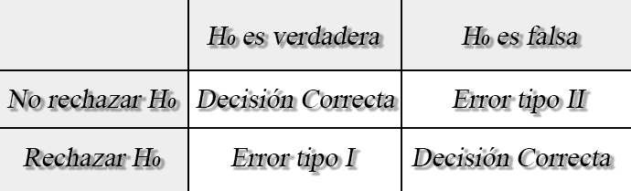
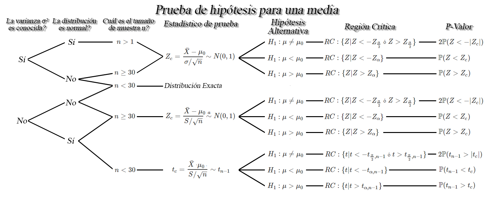
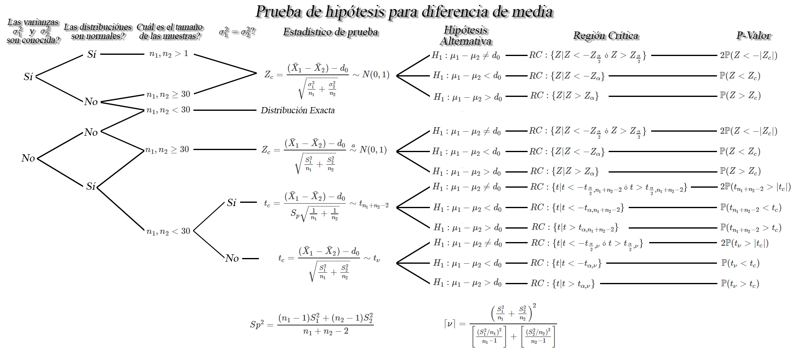
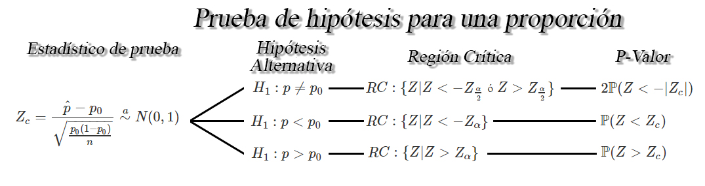
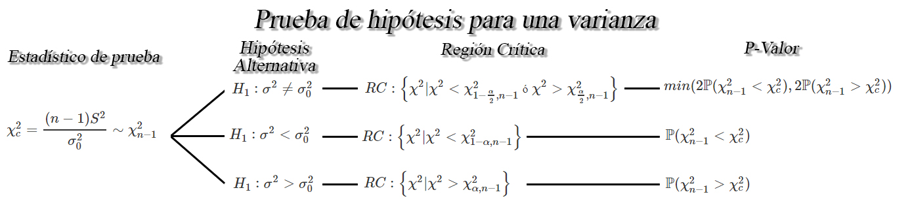

```{r knitr_init, echo=FALSE, cache=FALSE}
library(knitr)
## Global options
opts_chunk$set(echo=TRUE,
               cache=TRUE,
               prompt=FALSE,
               tidy=TRUE,
               comment=NA,
               message=FALSE,
               warning=FALSE,
               fig.path = paste0("../../ProbabilidadeInferencia/images/", "Clase16"),
               cache.path = "../../ProbabilidadeInferencia/cache/",
               cache = FALSE)

```

## Prueba de hipótesis
Una hipótesis estadística es una afirmación o conjetura que se realiza sobre una población o sobre los parámetros de la misma, en donde el objetivo es decidir si la afirmación hecha se encuentra apoyada por la información obtenida de una muestra de la población de interés.

Por ejemplo, un médico afirma que el peso ideal de las personas de cierta población sigue una distribución normal con peso promedio de `$73$`kg y desviación estándar de `$3$`kg.

## Componentes de una prueba de hipótesis
### Hipótesis nula
Sea `$\theta$` un parámetro de interés desconocido y sea `$\theta_0$` un valor particular de `$\theta$`, entonces se tendrá que la hipótesis nula estará dado por

* **Bilateral** `$H_0: \theta = \theta_0$`
* **Unilateral izquierda** `$H_0: \theta \geq \theta_0$`
* **Unilateral derecho** `$H_0: \theta \leq \theta_0$`

matemáticamente `$H_0: \theta \geq \theta_0$` y `$H_0: \theta \leq \theta_0$` es matemáticamente equivalente a escribir `$H_0: \theta = \theta_0$` y por tanto, se acostumbra a usar esta última en los tres casos.

### Hipótesis alternativa
Es el complemento lógico de la hipótesis nula, y por tanto, ésta estará dado por

* **Bilateral** `$H_0: \theta \neq \theta_0$`
* **Unilateral izquierda** `$H_0: \theta < \theta_0$`
* **Unilateral derecho** `$H_0: \theta > \theta_0$`

Ésta hipótesis no puede contener la igualdad, a menos que se quiera una hipótesis alternativa específica.

### Estadístico de prueba
El estadístico de prueba será el valor usado para tomar la decisión entre `$H_0$` y `$H_1$`. Éste dependerá del parámetro de interés y de la distribución muestral del estadístico. Entre los estadísticos de prueba más usados de tiene a `$Z$`, `$t_v$`. `$\chi^2_v$` y `$F_{v_1,v_2}$`.

### Región crítica
La región crítica o región de rechazo representa los valores del estadístico de prueba que conduce a rechazar la hipótesis nula, es decir,
`\begin{align*}
RC:\{\text{valores del estadístico de prueba que conducen a rechazar }H_0\}
\end{align*}`

Por ejemplo, si se emplea la afirmación del médico sobre el peso promedio de los estudiantes, se tendrá el siguiente juego de hipótesis
`\begin{align*}
H_0: \mu = 73 kg \\
H_1: \mu \neq 73 kg
\end{align*}`

Supongamos una región crítica arbitraria, tal que 
`\begin{align*}
RC:\{\bar{X}|\bar{X}<71 \text{ o } \bar{X}>75\}
\end{align*}`


### P-valor
Es el nivel de significancia más bajo en el que el valor observado del estadístico de prueba es significativo. Por tanto, un valor relativamente pequeño puede sugerir que el valor observado del estadístico de prueba sea poco probable, y por tanto, `$H_0$` deba ser rechazado.

Dado que el P-valor puede interpretarse como el tamaño de la región crítica `$RC$` que se obtiene a partir de los datos, entonces para un nivel de significancia preestablecido, el criterio de decisión debe ser
`\begin{align*}
\text{P-valor }<\alpha \Rightarrow \text{ Rechazar } H_0
\end{align*}`

## Errores tipo I, II y potencia de la prueba
Dado un juego de hipótesis, se tendrán cuatro posibles escenarios




siendo
`$\alpha$`: la probabilidad de cometer un error tipo I. Este se define como
`\begin{align*}
\alpha = \mathbb{P}(\text{Rechazar }H_0|H_0 \text{ es verdadera})
\end{align*}`
usualmente se emplean valores de `$\alpha$` de `$0.1, 0.05, 0.01$`. <br>
`$\beta$`: la probabilidad de cometer un error tipo II. Este se define como
`\begin{align*}
\beta = \mathbb{P}(\text{No rechazar }H_0|H_0 \text{ es falsa})
\end{align*}`
Este valor es imposible de calcular a menos de que se tenga una hipótesis alternativa específica, tal que
`\begin{align*}
H_1:\theta = \theta_1
\end{align*}`
con `$\theta_1$` un valor específico a probar.

### Nota
1. Los errores tipo I y II están inversamente relacionados, es decir, cuando aumenta uno, disminuye el otro.
2. Un aumento en el tamaño muestral `$n$`, reducirá tanto `$\alpha$` y `$\beta$` de forma simultanea.
3. Si `$H_0$` es falsa, `$\beta$` es máxima cuando el verdadero valor del parámetro se aproxima al valor hipotético.

## Prueba de hipótesis para la media `$\mu$`
Sea `$X_1, X_2, \ldots, X_n$` una muestra aleatoria *iid* de tamaño `$n$` con media desconocida `$\mathbb{E}(X)=\mu$`, y varianza `$Var(X)=\sigma^2<\infty$`, entonces dependiendo de las condiciones, se tendrán los siguientes pruebas de hipótesis para la media `$\mu$`.



## Prueba de hipótesis para diferencia de medias `$\mu_1 - \mu_2$`
Sea `$X_{1,1}, X_{1,2}, \ldots, X_{1,n_1}$` y `$X_{2,1}, X_{2,2}, \ldots, X_{2,n_1}$` dos muestras aleatorias *iid* de tamaños `$n_1$`, y `$n_2$` con medias desconocidas `$\mathbb{E}(X_{1})=\mu_1$` y `$\mathbb{E}(X_{2})=\mu_2$`, y varianzas `$Var(X_{1})=\sigma_1^2<\infty$` y `$Var(X_{2})=\sigma^2_2<\infty$`, respectivamente, entonces dependiendo de las condiciones, se tendrán los siguientes pruebas de hipótesis para la diferencia de medias `$\mu_1 - \mu_2$`.


## Prueba de hipótesis para una proporción `$p$` 
Sea `$X_1,X_2, \ldots, X_n$` una muestra aleatoria *iid* de tamaño `$n$`, tal que `$X\sim b(n,p)$` entonces si `$n$` es suficientemente grande tal que `$n\geq30$`, y la proporción desconocida `$p$` no se encuentre cercana a `$0$` o `$1$`, tal que `$np>5$` y `$n(1-p)>5$`, entonces un una prueba de hipótesis para la proporción verdadera `$p$` será de la forma



## Prueba de hipótesis para diferencia de proporciones `$p_1 - p_2$` 
Sean `$X_{1,1}, X_{1,2}, \ldots, X_{1,n_1}$` y `$X_{2,1}, X_{2,2}, \ldots, X_{2,n_1}$` dos muestras aleatorias *iid* de tamaño `$n_1$` y `$n_2$`, tal que `$X_{i}\sim b(n_i,p_i)$`, para `$i=1,2$`, entonces si `$n_1$` y `$n_2$` son suficientemente grandes tal que `$n_1, n_2\geq30$`, y si las proporciones desconocidas `$p_1$` y `$p_2$` no se encuentran cercanas a `$0$` o `$1$`, tal que `$n_ip_i>5$` y `$n_i(1-p_i)>5$`, para `$i=1,2$`, entonces un una prueba de hipótesis para la diferencia de las proporciones `$p_1-p_2$` será de la forma


## Prueba de hipótesis para cociente de varianzas `$\sigma^2_1/\sigma^2_2$`
Sea `$X_{1,1}, X_{1,2}, \ldots, X_{1,n_1}$` y `$X_{2,1}, X_{2,2}, \ldots, X_{2,n_1}$` dos muestras aleatorias normales de tamaños `$n_1$`, y `$n_2$` con medias `$\mathbb{E}(X_{1})=\mu_1$` y `$\mathbb{E}(X_{2})=\mu_2$`, y varianzas desconocidas `$Var(X_{1})=\sigma_1^2<\infty$` y `$Var(X_{2})=\sigma^2_2<\infty$`, respectivamente, entonces un contraste de hipótesis para el cociente de varianzas `$\sigma^2_1/\sigma^2_2$`, a un nivel de significancia `$\alpha$` será de la forma

