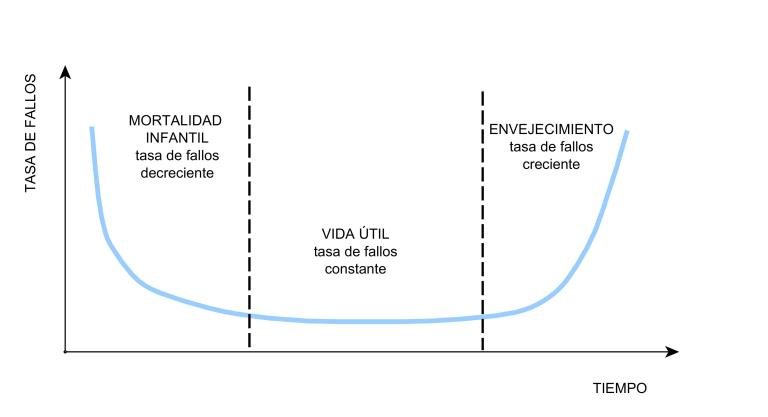

```{r knitr_init, echo=FALSE, cache=FALSE}
library(knitr)
## Global options
opts_chunk$set(echo=TRUE,
               cache=TRUE,
               prompt=FALSE,
               tidy=TRUE,
               comment=NA,
               message=FALSE,
               warning=FALSE,
               fig.path = paste0("../../ProbabilidadeInferencia/images/", "Clase10"),
               cache.path = "../../ProbabilidadeInferencia/cache/",
               cache = FALSE)

```

## Distribuciones de probabilidad continuas
## Distribución Weibull
Se dice que la variable aleatoria `$X$` tiene una distribución Weibull con parámetros `$\alpha$` y `$\beta$`, si su función de densidad de probabilidad es de la forma
`\begin{align*} 
f(x) = \begin{cases} \frac{\alpha}{\beta}\left(\frac{x}{\beta}\right)^{\alpha - 1}e^{-\left(\frac{x}{\beta}\right)^\alpha} & x\geq 0, \alpha>0, \beta>0 \\ 0 & \text{en otro caso} \end{cases}
\end{align*}`

donde, `$\alpha$` se conoce como el parámetro de forma y `$\beta$` como el parámetro de escala. Además, si `$\alpha=1$` se tendrá que la distribución Weibull será igual a la distribución Exponencial.

#### Teorema
Si `$X\sim Wei(\alpha, \beta)$`, entonces se puede probar que la media y la varianza de la variable aleatoria `$X$` están dadas por 
`\begin{align*}
\mathbb{E}(X)=\beta\;\Gamma\left(1 + \frac{1}{\alpha}\right) \quad \quad Var(X)=\beta^2\left[\Gamma\left(1 + \frac{2}{\alpha}\right) - \Gamma\left(1 + \frac{1}{\alpha}\right)^2\right]
\end{align*}`

<button id="Show1" class="btn btn-secondary">Mostrar Ejercicio </button>
<button id="Hide1" class="btn btn-info">Ocultar Ejercicio </button>
<main id="botoncito1"> 
<h3 data-toc-skip> Ejercicio </h3> 
<p> Un ingeniero industrial realiza un estudio sobre la vida útil, en años, de un nuevo aire acondicionado que fabrican en la compañía donde trabaja, y luego de probar muchos aires, encontró que el tiempo de vida, en años, se distribuye Weibull con parámetros $\alpha=2$ y $\beta = 8$. Dado lo anterior
<ol>
<li>Cuál es la probabilidad de que un aire acondicionado falle después de $3$ años de uso?</li> 
<li>Cuál es la probabilidad de que la vida útil del aire acondicionado se encuentre entre $6$ y $9$ años de uso?</li>
<li>Cuál es el tiempo de vida útil promedio y desviación estándar en años del aire acondicionado?</li>
</ol>
</p>

<h3 data-toc-skip> Solución </h3> 
<p>En el enunciado del ejercicio nos dicen tanto la distribución de la vida útil del aire acondicionado, y los parámetros de la distribución, tal que, $X \sim Wei(\alpha=2,\beta=8)$.
<ol>
<li>En este primer punto, nos encontramos interesados en calcular la probabilidad de que el aire acondicionado falle después de $3$, es decir, que la vida útil supere los $3$ años. Esto es
$$\begin{align*}
\mathbb{P}(X>3) = \int_3^\infty \frac{2}{8}\left(\frac{x}{8}\right)^{2 - 1}e^{-\left(\frac{x}{8}\right)^2} dx
\end{align*}$$
Al hacer cambio de variable tenemos que
$$\begin{align*}
u= \left(\frac{x}{8}\right)^2 \quad \quad du = \frac{2}{8}\left(\frac{x}{8}\right)^{2-1} dx
\end{align*}$$
Entonces, al evaluar los límites de la integral debido al cambio de variable, se tiene que cuando $x=3$, el valor de $u=(3/8)^2$, y cuando $x=\infty$, el valor de $u=(\infty/8)^2 = \infty$. Por tanto, al hacer el cambio de variable y cambiar los límites de integración tenemos que 
$$\begin{align*}
\mathbb{P}(X\geq3) &= \int_{\left(\frac{3}{8}\right)^2}^\infty e^{-u} du \\
                   &=  -e^{-u} \Bigg|_{\left(\frac{3}{8}\right)^2}^\infty \\
                   &=  -e^{-\infty} + e^{-\left(\frac{3}{8}\right)^2} \\
                   &=  0 + 0.8688151 \\
                   &=  0.8688151
\end{align*}$$
Es decir, se tendrá una probabilidad del $86.88\%$ de que el aire acondicionado falle después de los $3$ años de uso.
</li>
<li>Esta preguntar es similar al caso anterior, y se desea conocer la probabilidad de que la vida útil del aire acondicionado se encuentre entre $6$ y $9$ años. Es decir, se desea calcular la siguiente probabilidad
$$\begin{align*}
\mathbb{P}(6<X<9) = \int_{6}^9 \frac{2}{8}\left(\frac{x}{8}\right)^{2 - 1}e^{-\left(\frac{x}{8}\right)^2} dx
\end{align*}$$
Al aplicar el cambio de variable usado en el punto anterior se tiene que 
$$\begin{align*}
u= \left(\frac{x}{8}\right)^2 \quad \quad du = \frac{2}{8}\left(\frac{x}{8}\right)^{2-1} dx
\end{align*}$$
en donde, al evaluar el límite inferior y superior de la integrar en $u$, se tendrá que cuando $x=6$, $u=(6/8)^2$, mientras que, cuando $x=9$, $u=(9/8)^2$, obteniendo con ello, la siguiente expresión
$$\begin{align*}
\mathbb{P}(6<X<9) &= \int_{\left(\frac{6}{8}\right)^2}^{\left(\frac{9}{8}\right)^2} e^{-u} du \\
                    &=  -e^{-u} \Bigg|_{\left(\frac{6}{8}\right)^2}^{\left(\frac{9}{8}\right)^2} \\
                    &=  -e^{-\left(\frac{9}{8}\right)^2} + e^{-\left(\frac{6}{8}\right)^2} \\
                    &=  -0.282063 + 0.5697828 \\
                    &=  0.2877199
\end{align*}$$
Es decir, se tendrá un $28.77\%$ de probabilidad, de que el aire acondicionado dure entre entre $6$ y $9$ años.
</li>
<li>Para calcular el tiempo de vida útil promedio y desviación estándar en años para el aire acondicionado, se emplea el conocimiento sobre que el tiempo de vida se distribuye Weibull con parámetros $\alpha=2$ y $\beta=8$, y las las ecuaciones de esperanza matemática y varianza de la distribución Weibull, tal que, la esperanza será igual a
$$\begin{align*}
\mathbb{E}(X)&=\beta\;\Gamma\left(1 + \frac{1}{\alpha}\right) \\
             &=8\;\Gamma\left(1 + \frac{1}{2}\right)\\
             &=8\;\frac{1}{2}\Gamma\left(\frac{1}{2}\right)\\
             &=4\sqrt{\pi} \\
             &=7.089815
        
\end{align*}$$

y la varianza será igual a
$$\begin{align*}
Var(X)& = \beta^2\left[\Gamma\left(1 + \frac{2}{\alpha}\right) - \Gamma\left(1 + \frac{1}{\alpha}\right)^2\right] \\
      & = 8^2\left[\Gamma\left(1 + \frac{2}{2}\right) - \Gamma\left(1 + \frac{1}{2}\right)^2\right] \\
      & = 64\left[1! - \left(\frac{1}{2}\sqrt{\pi}\right)^2\right] \\
      & = 64\left[1 - \frac{\pi}{4}\right] \\
      & = 64(0.2146018) \\
      & = 13.73452
\end{align*}$$
y ahora, empleando el resultado de la varianza se procede a calcular la desviación estándar, tal que
$$\begin{align*}
Sd(X)& = \sqrt{Var(X)} \\
      & = \sqrt{13.73452} \\
      & = 3.706011
\end{align*}$$
Es decir, se espera que el tiempo de vida promedio del aire acondicionado es de $7.09$ años con una desviación estándar de $3.706$ años.
</li>
</ol>
</p>
</main>

#### Función de distribución acumulada Weibull
Si `$X\sim Wei(\alpha, \beta)$`, entonces se puede probar que la función de distribución acumulada de `$X$` está dada por
`\begin{align*} 
F(x) = \mathbb{P}(X\leq x) = \begin{cases} 0 & x<0 \\ 1- e^{-\left(\frac{x}{\beta}\right)^\alpha} & x\geq 0 \end{cases}
\end{align*}`

<button id="Show2" class="btn btn-secondary">Mostrar Ejercicio </button>
<button id="Hide2" class="btn btn-info">Ocultar Ejercicio </button>
<main id="botoncito2"> 
<h3 data-toc-skip> Ejercicio </h3> 
<p> Un ingeniero industrial realiza un estudio sobre la vida útil, en años, de un nuevo aire acondicionado que fabrican en la compañía donde trabaja, y luego de probar muchos aires, encontró que el tiempo de vida, en años, se distribuye Weibull con parámetros $\alpha=2$ y $\beta = 8$. Dado lo anterior, calcule la función de distribución acumulada, y con ésta, calcule la probabilidad de que el tiempo de vida útil, de aire a condicionado sea mayor a $7$ años pero menor de $12$ años. </p>

<h3 data-toc-skip> Solución </h3> 
<p> Como el interés es calcular inicialmente la función de distribución acumulada, aplicamos la ecuación de la distribución acumulada para la distribución Weibull, reemplazando a $\alpha$ por $2$ y a $\beta$ por $8$, tal que
$$\begin{align*} 
F(x) = 1 - e^{-\left(\frac{x}{8}\right)^2}
\end{align*}$$

Ahora, al realizar el cálculo de la probabilidad de que la vida útil del aire acondicionado sea mayor a $7$ años pero menor de $12$ años, se emplea las propiedades de la función de distribución acumulada para el caso continuo, ya presentadas en la <a href="../../ProbabilidadeInferencia/PeIEClase08.html#función-de-distribución-acumulada-caso-continuo">Clase 08</a>.
$$\begin{align*}
\mathbb{P}(7<X<12) & = F(12) - F(7) \\
                   & = \left(1 - e^{-\left(\frac{12}{8}\right)^2}\right) - \left(1 - e^{-\left(\frac{7}{8}\right)^2}\right)  \\
                   & = e^{-\left(\frac{7}{8}\right)^2} - e^{-\left(\frac{12}{8}\right)^2} \\
                   & = 0.4650432 - 0.1053992 \\
                   & = 0.359644
\end{align*}$$
Es decir, se tendrá un $35.96\%$ de probabilidad, de que la vida útil del aire acondicionado se encuentre entre $7$ y $12$ años.
</p>
</main>

## Función de confiabilidad (función de supervivencia)
Es una función decreciente que mide la probabilidad de que un componente funcione adecuadamente por al menos un tiempo `$t$`. Esta se representa como
`\begin{align*} 
R(t) = \mathbb{P}(T > t) = \int_t^\infty f(x) dx = 1- F(t)
\end{align*}`
donde `$F(t)$` es la función de distribución acumulada de la variable aleatoria `$T$`.

### Función de confiabilidad Exponencial
Si `$X\sim Exp(\beta)$`, entonces se puede probar que la función de confiabilidad de la variable aleatoria `$X$` está dada por
`\begin{align*} 
R(t) = e^{-\frac{t}{\beta}} \quad \quad t>0
\end{align*}`

<button id="Show3" class="btn btn-secondary">Mostrar Ejercicio </button>
<button id="Hide3" class="btn btn-info">Ocultar Ejercicio </button>
<main id="botoncito3"> 
<h3 data-toc-skip> Ejercicio </h3> 
<p> Un ingeniero industrial afirma que encontró un catalizador solido que permite aumentar la velocidad de reacción química promedio, requerida en un proceso de producción de una bebida gaseosa. Dicho ingeniero asegura que con este catalizador solido la velocidad de la reacción química se reduce en promedio en $3$ minutos, lo cual mejoraría la eficiencia de la producción en un $28\%$. Dado lo anterior, calcule la función de confiabilidad, y con ésta, calcule la probabilidad de que la reducción promedio en la reacción química sea mayor a $9$ minutos.
</p>

<h3 data-toc-skip> Solución </h3> 
<p> Como el interés es calcular inicialmente la función de confiabilidad, entonces empleamos la ecuación de confiabilidad, reemplazando a $\beta$ por $3$, tal que
$$\begin{align*} 
R(t) = e^{-\frac{t}{3}}
\end{align*}$$

Y ahora, al realizar el cálculo de la probabilidad de que la reducción del tiempo de la reacción química sea mayor a $9$ minutos, tal que
$$\begin{align*}
\mathbb{P}(X>9) &= R(9) \\
                  &= e^{-\frac{9}{3}}  \\
                  &= 0.04978707
\end{align*}$$
Es decir, que se tendrá una probabilidad de $4.98\%$, de que el catalizador solido reduzca el tiempo de reacción química en más de $9$ minutos.
</p>
</main>

### Función de confiabilidad Weibull
Si `$X\sim Wei(\alpha, \beta)$`, entonces se puede probar que la función de confiabilidad de la variable aleatoria `$X$` está dada por
`\begin{align*} 
R(t) = e^{-\left(\frac{t}{\beta}\right)^\alpha} \quad \quad t>0
\end{align*}`

<button id="Show4" class="btn btn-secondary">Mostrar Ejercicio </button>
<button id="Hide4" class="btn btn-info">Ocultar Ejercicio </button>
<main id="botoncito4"> 
<h3 data-toc-skip> Ejercicio </h3> 
<p> Un ingeniero industrial realiza un estudio sobre la vida útil, en años, de un nuevo aire acondicionado que fabrican en la compañía donde trabaja, y luego de probar muchos aires, encontró que el tiempo de vida, en años, se distribuye Weibull con parámetros $\alpha=2$ y $\beta = 8$. Dado lo anterior, calcule la función de confiabilidad, y con ésta, calcule la probabilidad de que el tiempo de vida útil, de aire a condicionado sea mayor a $3$ años. </p>

<h3 data-toc-skip> Solución </h3> 
<p> Como el interés es calcular inicialmente la función de confiabilidad, aplicamos la ecuación de confiabilidad para la distribución Weibull, reemplazando a $\alpha$ por $2$ y a $\beta$ por $8$, tal que
$$\begin{align*} 
R(t) = e^{-\left(\frac{t}{8}\right)^2}
\end{align*}$$

Ahora, se realiza el cálculo de la probabilidad de que la vida útil del aire acondicionado sea mayor a $3$ años, empleando la función de confiabilidad para resolver tal probabilidad.
$$\begin{align*}
\mathbb{P}(X>3) & = R(3) \\
                & = e^{-\left(\frac{3}{8}\right)^2} \\
                & = 0.8688151
\end{align*}$$
Es decir, que se tendrá un $86.88\%$ de probabilidad, de que la vida útil del aire acondicionado supere los $3$ años.
</p>
</main>

## Tasa de fallas (tasa de riesgo)
Representa la probabilidad de falla instantánea, dado que el componente funciona en el momento `$t$`, y se representa como
`\begin{align*} 
h(t) & = \lim_{\Delta t\to0}\frac{\mathbb{P}(t<T<t+\Delta t|T>t)}{\Delta t} \\
     & = \lim_{\Delta t\to0}\frac{1}{\Delta t}\frac{F(t+\Delta t) - F(t)}{R(t)} \\
     & = \frac{F^´(t)}{R(t)} \\
     & = \frac{f(t)}{1 - F(t)}
\end{align*}`

Y mide la tasa de cambio con el tiempo (Desgaste o Fortalecimiento) de la probabilidad de que el componente dure un `$\Delta t$` adicional, dado que ha durado `$t$`.



### Tasa de fallas Exponencial
Si `$X\sim Exp(\beta)$`, entonces se puede probar que la tasa de fallas de la variable aleatoria `$X$` está dada por
`\begin{align*} 
h(t) = \frac{1}{\beta} \quad \quad t>0
\end{align*}`

<button id="Show5" class="btn btn-secondary">Mostrar Ejercicio </button>
<button id="Hide5" class="btn btn-info">Ocultar Ejercicio </button>
<main id="botoncito5"> 
<h3 data-toc-skip> Ejercicio </h3> 
<p> Un ingeniero industrial afirma que encontró un catalizador solido que permite aumentar la velocidad de reacción química promedio, requerida en un proceso de producción de una bebida gaseosa. Dicho ingeniero asegura que con este catalizador solido la velocidad de la reacción química se reduce en promedio en $3$ minutos, lo cual mejoraría la eficiencia de la producción en un $28\%$. Dado lo anterior, calcule la función de riesgo del catalizador para $3$, $5$ y $7$ minutos. Cuál es el comportamiento de la tasa de fallas?
</p>

<h3 data-toc-skip> Solución </h3> 
<p> En este caso estamos interesados en la tasa de fallas para el tiempo que reduce que genera el catalizador solido en la reacción química que se emplea en un proceso de producción de bebidas gaseosas. Entonces, como se tiene que la distribución del tiempo reducido es exponencial con parámetro $\beta=3$, entonces se tendrá que la tasa de fallas estará dada por
$$\begin{align*} 
h(t) = \frac{1}{3} 
\end{align*}$$

Ahora, al evaluar la tasa de fallas en $3$, $5$ y $7$ minutos, se tiene que 
$$\begin{align*}
h(3) =  h(5) =  h(7) = \frac{1}{3} 
\end{align*}$$
Es decir, la tasa de fallas es constante en el tiempo e igual a $\frac{1}{3}$.
</p>
</main>

### Tasa de fallas Weibull
Si `$X\sim Wei(\alpha, \beta)$`, entonces se puede probar que la tasa de fallas de la variable aleatoria `$X$` está dada por
`\begin{align*} 
h(t) = \frac{\alpha}{\beta}\left(\frac{t}{\beta}\right)^{\alpha-1} \quad \quad t>0
\end{align*}`
<ol type = "a">
<li> Si $\alpha<1$, $h(t)$ será una función decreciente del tiempo $t$, que indica que el componente se fortalece o endurece con el paso del tiempo. Por ejemplo,
los equipos electrónicos y mecánicos pueden iniciar con un alto grado de fallas, debido a errores en el diseño, problemas de producción, ensamble, presiones ocultas o control de calidad. Es por ello que se suele realizar un quemado a los componentes por un tiempo para eliminar este tipo de fallas para los usuarios.</li>
<li> Si $\alpha=1$, $h(t)$ será una función constante que indica que las fallas son inesperadas, causadas por factores externos que pueden generar fallas incluso en los componentes mejor construidos. Por ejemplo, sobre cargas, mal uso, casos especiales de falta de memoria.</li>
<li> Si $\alpha>1$, $h(t)$ será una función creciente del tiempo $t$, que indica que el componente se desgasta con el paso del tiempo. Por ejemplo, obsolescencia, fin de vida útil, edad. </li>
</ol>

<button id="Show6" class="btn btn-secondary">Mostrar Ejercicio </button>
<button id="Hide6" class="btn btn-info">Ocultar Ejercicio </button>
<main id="botoncito6"> 
<h3 data-toc-skip> Ejercicio </h3> 
<p> Un ingeniero industrial realiza un estudio sobre la vida útil, en años, de un nuevo aire acondicionado que fabrican en la compañía donde trabaja, y luego de probar muchos aires, encontró que el tiempo de vida, en años, se distribuye Weibull con parámetros $\alpha=2$ y $\beta = 8$. Dado lo anterior, calcule la función de riesgo del catalizador para $3$, $5$ y $7$ años. Cuál es el comportamiento de la tasa de fallas?
</p>

<h3 data-toc-skip> Solución </h3> 
<p> En este caso estamos interesados en la tasa de fallas para el tiempo de vida útil de un aire acondicionado. Entonces, como se tiene que la distribución del tiempo de la vida útil se distribuye Weibull con parámetro $\alpha=2$ y $\beta=8$, entonces se tendrá que la tasa de fallas estará dada por
$$\begin{align*} 
h(t) = \frac{2}{8}\left(\frac{t}{8}\right)^{2-1}
\end{align*}$$

Ahora, al evaluar la tasa de fallas en $3$, $5$ y $7$ años, se tiene que 
$$\begin{align*}
h(3) = \frac{2}{8}\left(\frac{3}{8}\right)^{2-1} = 0.09375 \\
h(5) = \frac{2}{8}\left(\frac{5}{8}\right)^{2-1} = 0.15625 \\
h(7) = \frac{2}{8}\left(\frac{7}{8}\right)^{2-1} = 0.21875
\end{align*}$$
Es decir, se aprecia que a medida que aumenta el número de años, la tasa de riesgo va aumentando, es decir, se tendrá que a medida que pasa el tiempo aumenta el riesgo de que el aire acondicionado falle.
</p>
</main>
