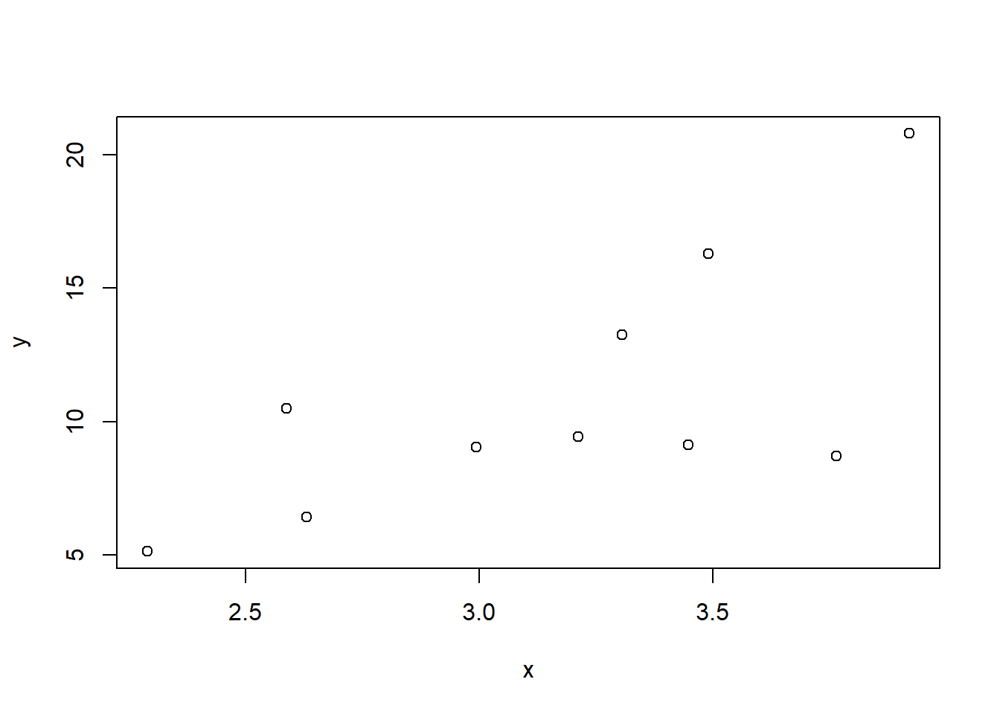

## Introducción


@Shumway2017

$a+b=4+\beta$

\begin{align}\label{eq:bla}
\frac{\mathrm{d}}{\mathrm{d} x} \int_{a}^{x} f(s)ds = f(x)
\end{align}

Hi $z = x + y$ `\eqref{eq:bla}`

$a^2 + b^2 = c^2$

\begin{align}
\begin{vmatrix}a & b\\
c & d
\end{vmatrix}=ad-bc \end{align}


```r
set.seed(1823)
## R code
x <- rnorm(10, 3, 1)
e <- rnorm(10, 0, 3)
y <- 1 + 3 * x + e
plot(y ~ x)
```



```r
## R code
sd <- function(x) {
    mean(x)
}

m = "hola"
```

BLA BLA BLA BLA


```python
## Python code
sum([1, 2, 3, 4, 5])
```

```
15
```


Estou aqui de novo para mais uma **#dicarapida** sobre um assunto que é bastante importante, mas muita gente esquece ou não faz de forma correta, que são as Meta Tags Sociais.
