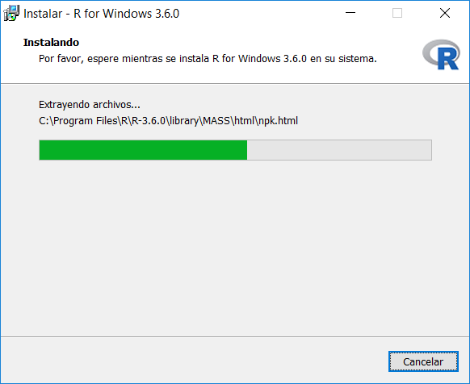
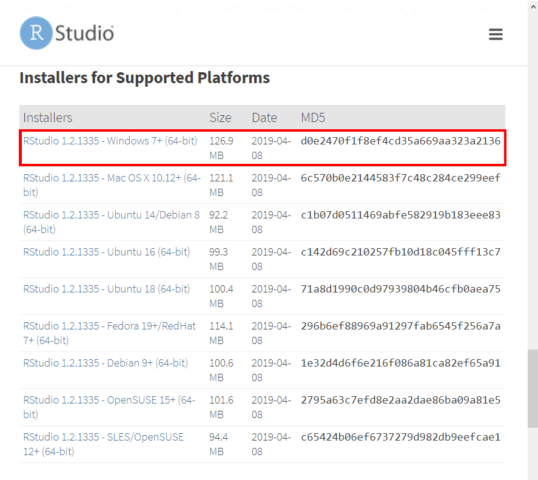

```{r knitr_init, echo=FALSE, cache=FALSE}
library(knitr)
## Global options
opts_chunk$set(echo=TRUE,
               cache=TRUE,
               prompt=FALSE,
               tidy=TRUE,
               comment=NA,
               message=FALSE,
               warning=FALSE,
               fig.path = paste0("../../SeminarioRyPython/images/", "GuiaWindows"),
               cache.path = "../../SeminarioRyPython/cache/")

```

## Instalación de R-Project
Para la descarga de la última versión del programa R-project en Windows, haga click en el siguiente enlace [(Descargar R-project)](https://cloud.r-project.org/bin/windows/base/){:target="_blank"}.
Una vez realizado click en el enlace, se abrirá la siguiente ventana


Haga click en el recuadro rojo que aparece en la imagen anterior e iniciará la descarga de un archivo con nombre R-3.x.x-win.exe donde x.x hace referencia a la versión del programa que se está descargando.

Una vez completada la descarga, haga doble click sobre el instalador para que éste inicie


En la ventana de idioma, seleccione idioma Español, o el idioma de su preferencia y haga click en Aceptar


En la ventana de información, puede leer puede leer la información allí presentado si es de su interes, y de click en el botón siguiente


En la ventana de selección de carpeta de destino, puede presionar el botón examinar y seleccionar otra ubicación para la instalación del programa R, aunque esto no es recomendado puesto que en ocasiones, ésto puede generar problemas en la instalación o lectura de librerías. Seguidamente, presione el botón siguiente


En la ventana de selección de componentes, escoja una de las dos versiones de R dependiendo del sistema operativo que tiene instalado


La versión del sistema operativo puede ser consultada, al presionar las teclas <tt>Windows + Pausa</tt>. En este caso, el sistema operativo es de 64bits, y por tanto se selecciona la opción "64 bits Files", y se da click en el botón siguiente del instalador.


En la ventana de opciones de configuración, se deja seleccionada la opción "No" y se da click en siguiente


En la ventana de tareas adicionales, puede seleccionar "Crear un icono en el escritorio" y/o "Crear un icono en Inicio Rápido", y de click en siguiente



Esto hará que aparezca la ventana de instalación, espere un par de minutos mientras el proceso finaliza.


Finalmente haga click en de botón Finalizar, y con ésto concluirá la instalación del programa.

## Instalación de RStudio
Para la descarga de la última versión del programa Rstudio, haga click en el siguiente enlace [(Descargar RStudio)](https://www.rstudio.com/products/rstudio/download/#download){:target="_blank"}.

Una vez realizado click en el enlace, se abrirá la siguiente venta



Haga click sobre la versión de Rstudio que sea compatible con su sistema operativo para que comience la descarga. 

Una vez completada la descarga, haga doble click sobre el instalador para que éste inicie


En la ventana de bienvenida, seleccione siguiente


En la ventana de selección de carpeta de destino, puede presionar el botón examinar y seleccionar otra ubicación para la instalación del programa RStudio, aunque esto no es recomendado puesto que en ocasiones, ésto puede generar problemas en la instalación o lectura de librerías o compatibilidad con <tt>R</tt>. Seguidamente, presione el botón siguiente


En la ventana de selección de carpeta del Menú Inicio, presione el botón instalar, para que inicie el proceso de instalación


En la ventana de instalación, espere a que el proceso termine. Una vez completado se presentará la siguiente ventana


Finalmente haga click en el botón Terminar, y con ésto concluirá la instalación del programa.

