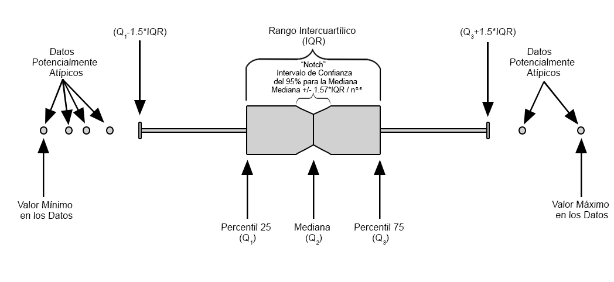
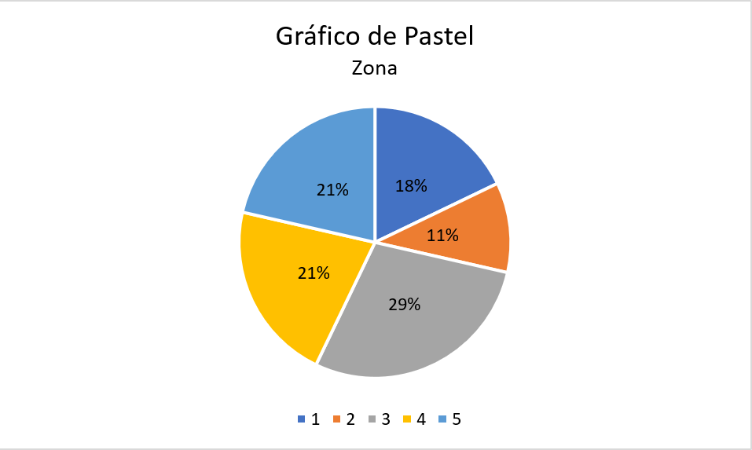
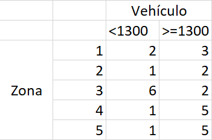

Análisis gráfico
----------------

Otro aspecto importante del análisis descriptivo, es el que se realiza
mediante análisis gráfico. **El análisis gráfico es una forma de
simplificar lo tedioso y complejo de un conjunto de observaciones**,
además de ser una forma más accesible de presentación de la información
cuando se tienen muchas variables, puesto que permiten mostrar el
comportamiento de los datos presentados, y hacer juicios respecto a su
tendencia central, variabilidad, formas, patrones, tendencias, etc.

El análisis gráfico, puede ser dividido en

-   Gráficos para variables cuantitativa
-   Gráficos para variables cualitativas
-   Gráficos para cruces entre variables cuantitativas y cualitativas

En la siguiente tabla se hace un resumen de qué gráficos pueden ser
apropiados para usar en cada uno de los casos

<pre style="font-family: 'Open Sans',sans-serif; margin-bottom: -3rem; margin-top: -3rem; font-size: 120%;"><table class="table table-striped" style="width: auto !important; margin-left: auto; margin-right: auto;"><thead>
  <tr>
   <th style="text-align:left;"> Categoría</th>
   <th style="text-align:left; text-align: center" colspan="3"> Tipo de Gráficos </th>
  </tr>
 </thead>
<tbody>
<tr>
<td style="text-align:left;"> <a href="http://jiperezga.github.io/EspecializacionSocioeconomica/EspSocProySesion01.html#una-variable-cuantitativa" style="
    color: #ffffff;
"><b><u>Una Cuantitativa</u></b></a></td>
<td style="text-align:center;">Gráfico de 
caja y bigotes</td>
<td style="text-align:center;">Histograma</td>
<td style="text-align:center;"></td>
</tr>
<tr>
<td style="text-align:left;"> <a href="https://jiperezga.github.io/EspecializacionSocioeconomica/EspSocProySesion01.html#dos-variables-cuantitativas" style="
    color: #ffffff;
"><b><u>Dos Cuantitativas</u></b></a></td>
<td style="text-align:center;">Diagrama de
dispersión</td>
<td style="text-align:center;"></td>

<td style="text-align:center;">
</td>
</tr>
<tr>
<td style="text-align:left;"> <a href="https://jiperezga.github.io/EspecializacionSocioeconomica/EspSocProySesion01.html#una-variable-cualitativa" style="
    color: #ffffff;
"><b><u>Una Cualitativa</u></b></a></td>
<td style="text-align:center;">Gráfico de
barras
</td>
<td style="text-align:center;">Gráfico de
pareto
</td>
<td style="text-align:center;">Gráfico de
pastel
</td>
</tr>
<tr>
<td style="text-align:left;"> <a href="https://jiperezga.github.io/EspecializacionSocioeconomica/EspSocProySesion01.html#dos-variables-cualitativas" style="
    color: #ffffff;
"><b><u>Dos Cualitativas</u></b></a></td>
<td style="text-align:center;">Gráfico de
barras</td>
<td style="text-align:center;"></td>
<td style="text-align:center;"></td>
</tr>
<tr>
<td style="text-align:left;"> <a href="https://jiperezga.github.io/EspecializacionSocioeconomica/EspSocProySesion01.html#cualitativa---cuantitativa" style="
    color: #ffffff;
"><b><u>Cualitativa - Cuantitativa</u></b></a></td>
<td style="text-align:center;">Gráfico de
caja y bigotes</td>
<td style="text-align:center;"></td>
<td style="text-align:center;"></td>
</tr>
</tbody>
</table></pre>

### Una variable cuantitativa

#### Gráfico de caja y bigotes

Este gráfico sirve para presentar de forma visual, datos numéricos a
través de sus cuartiles, además de presentar otras **características
importantes, tales como el valor de los cuartiles, dispersión, simetría
y datos potencialmente atípicos**.

<h4 align="center">
Representación de un Gráfico de Caja y Bigotes
</h4>

Este gráfico puede ser realizado en <tt>Excel</tt> en la pestaña
Insertar&gt;Gráficos&gt;Insertar Gráficos de Estadística&gt;Cajas y
Bigotes.

<button id="Show15" class="btn btn-secondary">
Mostrar gráfico de caja y bigotes
</button>
<button id="Hide15" class="btn btn-info">
Ocultar gráfico de caja y bigotes
</button>
<main id="botoncito15">
<h3 data-toc-skip>
Ejercicio caso de estudio
</h3>

Construya un diagrama de caja y bigotes para el número de automóviles
que transitan por la avenida Guayabal sur-norte en un día.

<h3 data-toc-skip>
Solución
</h3>
<h4 data-toc-skip>
Gráfico de Caja y Bigotes
</h4>

<h3 data-toc-skip>
Interpretación
</h3>

En el diagrama de caja y bigotes se aprecia que la mediana del número de
automóviles que transitan por la avenida gauyaban en un día se encuentra
alrededor de \(1350\) vehículos, en donde el primer y tercer cuartil
(percentil \(25\%\) y \(75\%\) se encuentran cercanos a \(1200\) y
\(1550\) vehículos, respectivamente. No se aprecian observaciones
extremas por fuera de los bigotes del gráfico y se observa un
comportamiento simétrico, pues se aprecia que la mediana se encuentra
relativamente central respecto al primer y tercer cuartil y que la media
y la mediana se encuentran muy cercanas.

</main>

#### Histograma

Este gráfico muestra la distribución de frecuencia o densidades del
grupo de observaciones, **brinda información sobre el valor más
probables, la dispersión, la asimetría y valores extremos**.
Adicionalmente, tiene la ventaja de que su interpretación es muy
intuitiva y por tanto es de los gráficos más preferidos para resumir
información. Este gráfico puede ser realizado en <tt>Excel</tt> en la
pestaña Insertar&gt;Gráficos&gt;Insertar Gráficos de
Estadística&gt;Histograma.

<button id="Show16" class="btn btn-secondary">
Mostrar histograma
</button>
<button id="Hide16" class="btn btn-info">
Ocultar histograma
</button>
<main id="botoncito16">
<h3 data-toc-skip>
Ejercicio caso de estudio
</h3>

Construya un histograma para el número de automóviles que transitan por
la avenida Guayabal sur-norte en un día.

<h3 data-toc-skip>
Solución
</h3>
<h4 data-toc-skip>
Histograma
</h4>

<h3 data-toc-skip>
Interpretación
</h3>

En la primera figura, se aprecia que en este caso el histograma realiza
agrupaciones para el número de vehículos que transitan por la avenida
Guayabal en un día, con categorías que posee distancias entre \(122\)
vehículos, en donde se evidencia que el número de registros que se
encuentra entre \(1493-1615\) vehículos, poseen la mayor frecuencia con
un total de \(9\) registros. También se puede observar que la frecuencia
de observaciones que se encuentra en las tres primeras categorías es
casi igual a la que se encuentra en las tres últimas categorías, con lo
cual podría pensarse que el número de vehículos que transitan por la
avenida Guayabal posee un comportamiento relativamente simétrico.

</main>

### Dos variables cuantitativas

#### Gráfico de dispersión

Este gráfico se emplea para hacer cruces entre dos variables
cuantitativas, y **sirve para ver tendencias y relaciones entre dos
variables cuantitativas, además de permitir apreciar donde se centra el
total de observaciones, y detección de datos atípicos** dados dos
atributos cuantitativos. Este gráfico puede ser realizado en
<tt>Excel</tt> en la pestaña Insertar&gt;Gráficos&gt;Insertar Gráficos
de Dispersión&gt;Dispersión.

<button id="Show17" class="btn btn-secondary">
Mostrar gráfico de dispersión
</button>
<button id="Hide17" class="btn btn-info">
Ocultar gráfico de dispersión
</button>
<main id="botoncito17">
<h3 data-toc-skip>
Ejercicio caso de estudio
</h3>

Construya un histograma para el número de automóviles que transitan por
la avenida Guayabal sur-norte en un día.

<h3 data-toc-skip>
Solución
</h3>
<h4 data-toc-skip>
Gráfico de Dispersión
</h4>

<h3 data-toc-skip>
Interpretación
</h3>

En el gráfico de dispersión anterior, se aprecia una relación positiva
entre el número de vehículos que transitan por la avenida guayaban por
día y la cantidad de material particulado \(2.5\), pues es posible
observar que el conjunto de observaciones tiene una leve tendencia
creciente a medida que aumenta una de las variables. Adicionalmente, no
se observa gran dispersión entre el conjunto de observaciones, ni se
detectan de datos atípicos entre los puntos, debido a que no hay una
separación significativa entre éstos.

</main>

### Una variable cualitativa

#### Gráfico de barras

Sirve para resumir una cualitativas mediante barras de frecuencias
absolutas o relativas. Éste **permite observar la concentración de
observaciones en una o más categorías diferentes**. Este gráfico puede
ser realizado en <tt>Excel</tt> en la pestaña
Insertar&gt;Gráficos&gt;Insertar Gráficos de Columnas o
Barras&gt;Columnas agrupadas.

Para realizar estas gráficas deben usarse una tabla de frecuencias, la
cual puede ser construida en <tt>Excel</tt> mediante la función
`FRECUENCIA()`, guardando la función con la secuencia
<tt>Ctrl+Shift+Enter</tt>, con la función `CONTAR.SI()` o con una tabla
dinámica.

<button id="Show18" class="btn btn-secondary">
Mostrar gráfico de barras
</button>
<button id="Hide18" class="btn btn-info">
Ocultar gráfico de barras
</button>
<main id="botoncito18">
<h3 data-toc-skip>
Ejercicio caso de estudio
</h3>

Construya un gráfico de barras para la zona en donde fue realizada la
medición, del número de automóviles que transitan por la avenida
Guayabal sur-norte en un día.

<h3 data-toc-skip>
Solución
</h3>
<h4 data-toc-skip>
Tabla de Frecuencias
</h4>

<h4 data-toc-skip>
Gráfico de Barras
</h4>

<h3 data-toc-skip>
Interpretación
</h3>

En el gráfico de barras, se observa que de los \(28\) días en los cuales
se realizaron los registros del número de vehículos, la mayoría de los
días se realizó el registro en la zona \(3\) con un total de \(8\) días,
seguido de las zonas \(4\) y \(5\) con un total de \(6\) días, la zona
\(1\) con un total de \(5\) días y finalmente la zona \(2\) con un total
de \(3\) días.

</main>

#### Gráfico de pareto

Este gráfico es similar al gráfico de barras para una sola variable
cualitativa, pero con la ventaja de que **presenta las frecuencias
absolutas, relativas, y las frecuencias acumuladas absolutas y
acumuladas relativas en el mismo gráfico**. Este gráfico puede ser
realizado en <tt>Excel</tt> en la pestaña
Insertar&gt;Gráficos&gt;Insertar Gráficos de Estadística&gt;Pareto.

Para realizar estas gráficas deben usarse una tabla de frecuencias, la
cual puede ser construida en <tt>Excel</tt> mediante la función
`FRECUENCIA()`, guardando la función con la secuencia
<tt>Ctrl+Shift+Enter</tt>, con la función `CONTAR.SI()` o con una tabla
dinámica.

<button id="Show19" class="btn btn-secondary">
Mostrar gráfico de Pareto
</button>
<button id="Hide19" class="btn btn-info">
Ocultar gráfico de Pareto
</button>
<main id="botoncito19">
<h3 data-toc-skip>
Ejercicio caso de estudio
</h3>

Construya un gráfico Pareto para la zona en donde fue realizada la
medición, del número de automóviles que transitan por la avenida
Guayabal sur-norte en un día.

<h3 data-toc-skip>
Solución
</h3>
<h4 data-toc-skip>
Tabla de Frecuencias
</h4>

<h4 data-toc-skip>
Gráfico de Barras
</h4>

<h3 data-toc-skip>
Interpretación
</h3>

El gráfico Pareto anterior agregada diferente información sobre la zona
en donde se realizó el registro del número de automóviles que transitan
por la avenida Guayabal sur-norte en un día, en donde, en el eje
izquierdo se observa el valor de las frecuencias absolutas, mientras que
en el eje derecho se observa el valor de las frecuencias relativas. Las
barras representan las frecuencias absolutas, mientras que la línea
representa las frecuencias relativas.    En dicho gráfico se
aprecia que la zona en la cual se realizó la mayor cantidad de registros
fue en la zona \(3\) con un total de \(8\) registros, lo cual equivale
al \(28.57\%\) del total de los registros, mientras que la menor
cantidad de registros se realizó en la zona \(2\) con un total de \(3\)
registros, lo cual equivale al \(10.71\%\) del total de los registros.

</main>

#### Gráfico de pastel

Este gráfico también **sirve para representar gráficamente las tablas de
frecuencias absolutas y relativas para una variable cualitativa**. Este
gráfico puede ser realizado en <tt>Excel</tt> en la pestaña
Insertar&gt;Gráficos&gt;Insertar Gráficos Circular o de
Anillos&gt;Circular.

Para realizar estas gráficas deben usarse una tabla de frecuencias, la
cual puede ser construida en <tt>Excel</tt> mediante la función
`FRECUENCIA()`, guardando la función con la secuencia
<tt>Ctrl+Shift+Enter</tt>, con la función `CONTAR.SI()` o con una tabla
dinámica.

<button id="Show20" class="btn btn-secondary">
Mostrar gráfico de pastel
</button>
<button id="Hide20" class="btn btn-info">
Ocultar gráfico de pastel
</button>
<main id="botoncito20">
<h3 data-toc-skip>
Ejercicio caso de estudio
</h3>

Construya un gráfico de Pastel para la zona en donde fue realizada la
medición, del número de automóviles que transitan por la avenida
Guayabal sur-norte en un día.

<h3 data-toc-skip>
Solución
</h3>
<h4 data-toc-skip>
Tabla de Frecuencias
</h4>

<h4 data-toc-skip>
Gráfico de Barras
</h4>

<h3 data-toc-skip>
Interpretación
</h3>

En el gráfico anterior, se presenta la proporción de días que se realizó
el conteo de vehículos que transitan por la avenida Guayabal sur-norte
en un día, en donde el gráfico de pastel representa el \(100\%\) de los
días registrados, y cada triángulo del gráfico la proporción asociada a
cada una de las zonas. En donde, se observa que las proporciones
observadas para los registros realizados por zona es respectivamente
para las zonas \(1\), \(2\), \(3\), \(4\) y \(5\) del \(18\%\),
\(11\%\), \(29\%\), \(21\%\) y \(21\%\).

</main>

### Dos variables cualitativas

#### Gráfico de barras

El gráfico de barras también sirve para resumir dos variable cualitativa
mediante barras de frecuencias absolutas o relativas. **La
interpretación, será la misma que para una sola variable cualitativa,
con la diferencia de que en este caso, se podrán hacer comparaciones por
categorías adicionales.** Este gráfico puede ser realizado en
<tt>Excel</tt> en la pestaña Insertar&gt;Gráficos&gt;Insertar Gráficos
de Columnas o Barras&gt;Columnas agrupadas.

Para realizar estas gráficas deben usarse una tabla de frecuencias, la
cual puede ser construida en <tt>Excel</tt> mediante la función
`CONTAR.SI.COJUNTO()` o con una tabla dinámica.

<button id="Show21" class="btn btn-secondary">
Mostrar gráfico de barras para dos variables
</button>
<button id="Hide21" class="btn btn-info">
Ocultar gráfico de barras para dos variables
</button>
<main id="botoncito21">
<h3 data-toc-skip>
Ejercicio caso de estudio
</h3>

Construya un gráfico de barras para la zona en donde fue realizada la
medición, del número de automóviles que transitan por la avenida
Guayabal sur-norte en un día y la cantidad de días en que el número de
vehículos que transita por la avenida Guayabal es menor a \(1300\) o
mayor o igual a \(1300\).

<h3 data-toc-skip>
Solución
</h3>
<h4 data-toc-skip>
Tabla de Frecuencias Conjunta
</h4>

<h4 data-toc-skip>
Gráfico de Barras
</h4>

<h3 data-toc-skip>
Interpretación
</h3>

En el gráfico de barras para el cruce entre la zona donde se realizaron
los registros y el número de veces que se registraron menos o al menos
\(1300\) vehículos, se observa que solo en la zona \(3\) se evidencia
que el número de días en los cuales el número de vehículos que transitan
por la avenida Guayabal menores a \(1300\) es superior a cuando
transitan al menos \(1300\), lo cual puede significar que la zona \(3\)
es un cruce con menor transito con los demás, tal vez por estar luego de
un puente o debido a que la zona \(3\) se seleccionó días de baja
afluencia como un domingo o días festivos.

</main>

### Cualitativa - Cuantitativa

#### Gráfico de caja y bigotes

Este gráfico sirve para presentar de forma visual, datos numéricos **por
categorías** a través de sus cuartiles, además de presentar **otras
características importantes, tales como la dispersión, simetría y datos
potencialmente atípicos**. Este gráfico puede ser realizado en
<tt>Excel</tt> en la pestaña Insertar&gt;Gráficos&gt;Insertar Gráficos
de Estadística&gt;Cajas y Bigotes.

<button id="Show22" class="btn btn-secondary">
Mostrar gráfico de caja y bigotes
</button>
<button id="Hide22" class="btn btn-info">
Ocultar gráfico de caja y bigotes
</button>
<main id="botoncito22">
<h3 data-toc-skip>
Ejercicio caso de estudio
</h3>

Construya un gráfico de caja y bigotes para el número de vehículos que
transitan por la avenida Guayabal por día y la zona donde fue
registrada.

<h3 data-toc-skip>
Solución
</h3>
<h4 data-toc-skip>
Gráfico de Barras
</h4>

<h3 data-toc-skip>
Interpretación
</h3>

En el gráfico anterior, se hace una comparación entre el número de
vehículos que transitan por la avenida Guayabal en un día y la zona
donde se realizó el registro del número de vehículos. En éste se aprecia
que de las \(5\) zonas, la zona \(3\) es la única que tiene una media y
una mediana inferior a las demás zonas.     Adicionalmente, se
evidencia que de las \(5\) zonas, la zona \(4\) es la que presenta mayor
variabilidad, mientras que las zonas \(3\) y \(4\) son la que posee
datos más alejados respecto al \(50\%\) central de los datos.   
Finalmente, puede notarse que no se evidencia ningún punto en la parte
superior o inferior de los bigotes de las diferentes cajas, lo cual
quiere decir, que no se identificaron datos extremos para ninguna de las
zonas registradas.

</main>

Variables aleatorias
--------------------

Es una función que asocia un número real a cada elemento del espacio
muestral `$S$`. Comúnmente las variables aleatorias se denotan por
letras mayúsculas del final del abecedario `$(X,Y,Z)$` y a los valores
observados por letras minúsculas `$(x,y,z)$`.

Las variables aleatorias se pueden clasificar en tres tipos

-   **Variables Bernoulli:** Cualquier variable aleatoria cuyos posibles
    valores sean 0 o 1. Por ejemplo: **Productos exentos de IVA;
    Cumplimientos de pronóstico**
-   **Variables discretas:** Son aquellas que tienen un número finito de
    posibilidades o una serie interminable de elementos como números
    enteros existentes (es decir, es enumerable). Por ejemplo: **El
    número de personas que habitan en una manzana; El número reformas
    que hay que hacerle a un edificio**
-   **Variables continuas:** Son aquellas que contienen un número
    infinito de posibilidades, o igual número de puntos que un segmento
    de recta. Por ejemplo: **Los costos variables que pueden incurrir
    una empresa en un mes; Los beneficios recibidos por la construcción
    de una vía**

Distribución de probabilidad discreta
-------------------------------------

Se dice que el conjunto de pares ordenados `$(x,p(x))$` es una función
de masa de probabilidad `$(fmp)$` de la variable aleatoria discreta
`$X$`, si para cualquier valor posible de `$X$` se cumple que

1.  `$p(x)\geq0$` para todo `$x \in$` en el dominio de `$X$`
2.  `$\sum_x p(x)=1$`
3.  `$\mathbb{P}(X\in A)= \sum_{x\in A}p(x) $` con `$A$` un conjunto de
    valores `$\in$` al dominio de `$X$`.

<button id="Show1" class="btn btn-secondary">
Mostrar Ejercicio
</button>
<button id="Hide1" class="btn btn-info">
Ocultar Ejercicio
</button>
<main id="botoncito1">
<h3 data-toc-skip>
Ejercicio
</h3>

Suponga que se realiza un estudio para la adecuación de la zona de
urgencias de un hospital y para ello necesitan conocer el número de
ambulancias que llegan a un hospital en una hora, encontrando que la
función de distribución de probabilidad está dada por

<table class="table table-striped" style="width: auto !important; margin-left: auto; margin-right: auto;">
<tbody>
<tr>
<td style="text-align:left;">
\(X\)
</td>
<td style="text-align:left;">
\(0\)
</td>
<td style="text-align:left;">
\(1\)
</td>
<td style="text-align:left;">
\(2\)
</td>
<td style="text-align:left;">
\(3\)
</td>
<td style="text-align:left;">
\(4\)
</td>
<td style="text-align:left;">
\(5\text{ o más}\)
</td>
</tr>
<tr>
<td style="text-align:left;">
\(p(x)\)
</td>
<td style="text-align:left;">
\(0.0498\)
</td>
<td style="text-align:left;">
\(0.1494\)
</td>
<td style="text-align:left;">
\(0.2240\)
</td>
<td style="text-align:left;">
\(0.2240\)
</td>
<td style="text-align:left;">
\(0.1680\)
</td>
<td style="text-align:left;">
\(0.1848\)
</td>
</tr>
</tbody>
</table>

Si la probabilidad de que lleguen al menos \(4\) ambulancias en una hora
es muy alta, el hospital considerará ampliar el estacionamiento, de otro
modo, lo dejará tal y como está. Basado en ésto, aconsejaría usted al
hospital que es necesario ampliar el estacionamiento?

<h3 data-toc-skip>
Solución
</h3>

Como \(X\) es la variable aleatoria del número de ambulancias que llegan
al hospital en una hora, se tendrá que nos preguntan por la probabilidad
\[\begin{align*}
\mathbb{P}(X>=4)
\end{align*}\] la cual, al ser una variable aleatoria discreta podremos
calcularla mediante sumatorias, tal que \[\begin{align*}
\mathbb{P}(X\geq 4) &= 1 - \mathbb{P}(X < 4) \\
                    &= 1 - \sum_{x=0}^{3} p(x) \\
                    &= 1 - [p(0) + p(1) + p(2) + p(3)] \\
                    &= 1 - [p(0) + p(1) + p(2) + p(3)] \\
                    &= 1 - [0.0498 + 0.1494 + 0.2240 + 0.2240] \\
                    &= 1 - 0.6472 \\
                    &= 0.3528 \\
\end{align*}\]

Es decir, que se tendrá una probabilidad del \(35.28\%\) de que lleguen
al menos \(4\) ambulancia en una hora

</main>

### Función de distribución acumulada caso discreto

La función de distribución acumulada `$(fda)$` denotada por `$F(x)$`,
para una variable aleatoria discreta `$X$` con distribución de
probabilidad `$p(x)$` es de la forma
`\begin{align*} F(x)=P(X\leq x)=\sum_{t\leq x}p(t) \quad \quad -\infty<x<\infty \end{align*}`

Para cualquier `$x$` dentro del dominio de `$X$`, `$F(x)$` será la suma
acumulada de todos los `$X$` menores a `$x$`, evaluados en `$f(x)$`.

**Nota:** Si se quieren calcular probabilidades con la función de
distribución acumulada en el caso discreto, entonces, si `$a$` y `$b$`
son dos números **constantes enteras**, deberán tenerse en cuenta las
siguientes reglas

-   `$\mathbb{P}(a \leq X \leq b) = F(b) - F(a - 1)$`
-   `$\mathbb{P}(a < X \leq b) = F(b) - F(a)$`
-   `$\mathbb{P}(a \leq X < b) = F(b - 1) - F(a - 1)$`
-   `$\mathbb{P}(a < X < b) = F(b - 1) - F(a)$`
-   `$\mathbb{P}(X \geq a) = 1 - F(a-1)$`
-   `$\mathbb{P}(X > a) = 1 - F(a)$`
-   `$\mathbb{P}(X \leq b) = F(b)$`
-   `$\mathbb{P}(X < b) = F(b - 1)$`

<button id="Show2" class="btn btn-secondary">
Mostrar Ejercicio
</button>
<button id="Hide2" class="btn btn-info">
Ocultar Ejercicio
</button>
<main id="botoncito2">
<h3 data-toc-skip>
Ejercicio
</h3>

Suponga que se realiza un estudio para la adecuación de la zona de
urgencias de un hospital y para ello necesitan conocer el número de
ambulancias que llegan a un hospital en una hora, encontrando que la
función de distribución de probabilidad está dada por

<table class="table table-striped" style="width: auto !important; margin-left: auto; margin-right: auto;">
<tbody>
<tr>
<td style="text-align:left;">
\(X\)
</td>
<td style="text-align:left;">
\(0\)
</td>
<td style="text-align:left;">
\(1\)
</td>
<td style="text-align:left;">
\(2\)
</td>
<td style="text-align:left;">
\(3\)
</td>
<td style="text-align:left;">
\(4\)
</td>
<td style="text-align:left;">
\(5\text{ o más}\)
</td>
</tr>
<tr>
<td style="text-align:left;">
\(p(x)\)
</td>
<td style="text-align:left;">
\(0.0498\)
</td>
<td style="text-align:left;">
\(0.1494\)
</td>
<td style="text-align:left;">
\(0.2240\)
</td>
<td style="text-align:left;">
\(0.2240\)
</td>
<td style="text-align:left;">
\(0.1680\)
</td>
<td style="text-align:left;">
\(0.1848\)
</td>
</tr>
</tbody>
</table>

Construya la función de distribución acumulada asociada al número de
ambulancias que llegan a la zona de urgencias en una hora y calcule la
probabilidad de que este vañpr sea al menos de \(4\).

<h3 data-toc-skip>
Solución
</h3>

Como la función de distribución acumulada parte de la función de masa de
probabilidad, partimos de esta tabla y se procede a realizar el cálculo
de la función de distribución acumulada \(F(x)\). Para ello, debemos
calcular las siguientes probabilidades \(F(0) = \mathbb{P}(X\leq 0)\),
\(F(1) = \mathbb{P}(X\leq1)\), \(F(2) = \mathbb{P}(X\leq2)\),
\(F(3) = \mathbb{P}(X\leq3)\) y \(F(4) = \mathbb{P}(X\leq4)\).

\[\begin{align*}
F(0) & = \mathbb{P}(X\leq0) = p(0) = 0.0498 \\
F(1) & = \mathbb{P}(X\leq1) = p(0) + p(1) = 0.0498 + 0.1494 =  0.1992\\
F(2) & = \mathbb{P}(X\leq2) = \sum_{x=0}^{2} p(x) = 0.0498 + 0.1494 + 0.2240 =  0.4232 \\
F(3) & = \mathbb{P}(X\leq3) = \sum_{x=0}^{3} p(x) = 0.0498 + 0.1494 + 0.2240 + 0.2240 = 0.6472 \\
F(4) & = \mathbb{P}(X\leq4) = \sum_{x=0}^{4} p(x) = 0.0498 + 0.1494 + 0.2240 + 0.2240 + 0.2240 = 0.8712
\end{align*}\]

Entonces, mediante el empleo de estas probabilidades, podemos construir
la función de distribución acumulada para la variable aleatoria \(X\),
tal que

\[\begin{align*}
F(x) = \begin{cases} 0 & x<0 \\
                     0.0498  & 0\leq x<1 \\
                     0.1992  & 1\leq x<2 \\
                     0.4232  & 2\leq x<3 \\
                     0.6472  & 3\leq x<4 \\
                     0.8712  & 4\leq x<5 \\
                     1       & x\geq5
       \end{cases}
\end{align*}\] En donde se aprecia, que para valores menores a \(0\), no
hay ninguna probabilidad definida, para valores mayores o iguales a
\(0\) pero menores que \(1\) solo está definido \(F(0)=p(0)\), para
valores mayores o iguales a \(1\) pero menores que \(2\) está definido
\(F(1)=p(0)+p(1)\), para valores mayores o iguales a \(2\) pero menores
que \(3\) está definido \(F(2)=p(0)+p(1)+p(2)\), y así
sucesivamente.    Ahora dado que estamos interesados en calcular
la probabilidad de que el número de ambulancias que llegan a la zona de
urgencias en una hora sea de al menos \(4\) ambulancias, se tendrá que
se debe calcular \[\begin{align*}
\mathbb{P}(X \geq 4)
\end{align*}\]

Entonces, siguiendo las reglas anteriormente expuestas, dicha
probabilidad puede calcularse mediante distribuciones acumuladas como
\[\begin{align*}
\mathbb{P}(X \geq 4) & = 1 - F(4-1) \\
                     & = 1 - F(3) \\
                     & = 1 - 0.6472 \\
                     & = 0.3528
\end{align*}\]

y por tanto, se tendrá que la probabilidad de que en una hora lleguen al
menos \(4\) ambulancias a un hospital es del \(35.28\%\).

</main>

Algunas distribuciones de probabilidad discreta
-----------------------------------------------

### Proceso Bernoulli

Un proceso Bernoulli es aquel que cumple

1.  El experimento consta de ensayos repetidos bajo las mismas
    condiciones.
2.  Cada ensayo produce un resultado que se puede clasificar como éxito
    o fracaso.
3.  La probabilidad de éxito se denota por `$p$` y permanece constante
    de un ensayo a otro.
4.  Los ensayos repetidos son independientes entre si.

<button id="Show3" class="btn btn-secondary">
Mostrar Ejemplo
</button>
<button id="Hide3" class="btn btn-info">
Ocultar Ejemplo
</button>
<main id="botoncito3">
<h3 data-toc-skip>
Ejemplo
</h3>

Los siguientes, son algunos ejemplos de casos que pueden considerarse
como Procesos Bernoulli, debido a que cumplen las \(4\) condiciones
propuestas anteriormente.

<ul>
<li>
El número de inversionistas que están a favor de un proyecto.
</li>
<li>
Verificar los metas que son alcanzadas en un proyecto.
</li>
<li>
El número de trabajadores de sexo femenino que trabajan en un proyecto.
</li>
</ul>
</main>

### Ensayo de Bernoulli

Si la probabilidad de éxito de un experimento es `$p$`, entonces la
probabilidad de fallo debe ser `$1-p$` y la función de probabilidad de
la variable aleatoria `$X\sim Be(p)$` para un ensayo Bernoulli será
`\begin{align*} f(x) = p^x(1-p)^{1-x} \quad \quad x=0,1 \end{align*}`

En <tt>Excel</tt>, pueden calcularse probabilidades Bernoulli mediante
la función `DISTR.BINOM.N()`, con `$\text{ensayos}=1$`.

#### Media y Varianza Ensayo de Bernoulli

Si `$X\sim Be(p)$`, entonces se puede probar que la media y la varianza
de la variable aleatoria `$X$` están dadas por
`\begin{align*} \mathbb{E}(X)=p \quad \quad Var(X)=p(1-p) \end{align*}`

<button id="Show4" class="btn btn-secondary">
Mostrar Ejercicio
</button>
<button id="Hide4" class="btn btn-info">
Ocultar Ejercicio
</button>
<main id="botoncito4">
<h3 data-toc-skip>
Ejercicio
</h3>

Por experiencia se sabe que, de \(3\) de cada \(5\) meses, una empresa
obtiene utilidades superiores a las esperadas. Si se selecciona un mes
aleatoriamente,

<ol>
<li>
Cuál es la probabilidad de que en éste no se haya superado las
utilidades esperadas por la empresa?
</li>
<li>
Calcule la media y desviación estándar de que en dicho mes no se superen
las utilidades esperadas?
</li>
</ol>
<h3 data-toc-skip>
Solución
</h3>
<ol>
<li>

En este caso estamos interesados en la variable \(X\), que representa el
número de veces que no se superan las utilidades esperadas, en donde
sabemos que si, \(3\) de cada \(5\) meses se obtienen utilidades
superiores a las esperadas, se tendrá que \(2\) de cada \(5\) no se
superarán dichas utilidades. Por tanto al aplicar la definición de
frecuencia relativa se tiene que

\[\begin{align*}
p &= \frac{\text{Número de éxitos}}{\text{Número de muestras}}\\
  &= \frac{2}{5} \\
  &= 0.4
\end{align*}\] siendo \(p\) la probabilidad de que no se superen las
utilidades en un mes.

Ahora, la probabilidad de que en un mes no se haya superado las
utilidades esperadas por la empresa será igual a \[\begin{align*}
\mathbb{P}(X = 1) &= p(1-p)^{1-x} \\
                  &= 0.4(0.6)^{1-1} \\
                  &= 0.4(0.6)^0 \\
                  &= 0.4
\end{align*}\]

es decir, que se tendrá una probabilidad del \(60\%\) de que no se
superen las utilidades esperadas en un mes seleccionado aleatoriamente.
</li>
<li>

Ahora, como estamos interesados en el valor promedio de un proceso
Bernoulli el cual es igual a \(p\), se tendrá que \[\begin{align*}
\mathbb{E}(X) &= p \\
              &= 0.6
\end{align*}\]

Por su parte, para calcular la desviación estándar se requiere calcular
inicialmente la varianza de la variable aleatoria, la cual está dada por
\[\begin{align*}
Var(X) &= p(1-p) \\
       &= 0.4(0.6) \\
       &= 0.24
\end{align*}\]

y a partir de éste valor, se tendrá que la desviación estándar es igual
a \[\begin{align*}
Sd(X) &= \sqrt{Var(X)} \\
      &= \sqrt{0.24} \\
      &= 0.4898979
\end{align*}\]

Por tanto, al seleccionar un mes aleatoriamente, se espera que en
promedio \(0.4\) de las veces no se superen las utilidades esperadas en
un mes seleccionado aleatoriamente, con una desviación estándar de
\(0.4889\).
</li>
</ol>
</main>

### Distribución Binomial

Si `$X$` es la variable aleatoria del número de éxitos de `$n$` ensayos
de Bernoulli, con probabilidad de éxito `$p$`, entonces se dice que
`$X\sim b(n,p)$` tal que
`\begin{align*} f(x) = \left(\begin{array}{c}n\\ x\end{array}\right)p^x(1-p)^{n-x} \quad \quad x=0,1,\ldots,n \end{align*}`

**Nota:** Esta distribución es usada cuando se realiza muestreo con
reemplazo o en poblaciones infinitas en donde es posible **suponer que
la probabilidad de éxito `$p$` es la misma** en cada ensayo Bernoulli.

En <tt>Excel</tt>, pueden calcularse probabilidades Binomiales mediante
la función `DISTR.BINOM.N()`.

#### Media y Varianza Distribución Binomial

Si `$X\sim b(n,p)$`, entonces se puede probar que la media y varianza de
la variable aleatoria `$X$` están dadas por
`\begin{align*} \mathbb{E}(X)=np \quad \quad Var(X)=np(1-p) \end{align*}`

<button id="Show5" class="btn btn-secondary">
Mostrar Ejercicio
</button>
<button id="Hide5" class="btn btn-info">
Ocultar Ejercicio
</button>
<main id="botoncito5">
<h3 data-toc-skip>
Ejercicio
</h3>

Por experiencia se sabe que, de \(3\) de cada \(5\) meses, una empresa
obtiene utilidades superiores a las esperadas. Si se selecciona \(10\)
meses aleatoriamente,
<ol>
<li>
Cuál es la probabilidad de que en no más de \(3\) meses no se obtengan
utilidades superiores a las esperadas?
</li>
<li>
Cuál es la probabilidad de que en no menos de \(6\) pero menos de \(8\)
meses no se obtengan utilidades superiores a las esperadas?
</li>
<li>
Cuál es el número promedio y desviación estándar del número de meses en
los cuales no se obtienen utilidades superiores a las esperadas?.
</li>
</ol>

<h3 data-toc-skip>
Solución
</h3>

En este caso estamos interesados en la variable \(X\), que representa el
número de veces que no se superan las utilidades esperadas en \(n=10\)
meses, en donde sabemos que si, \(3\) de cada \(5\) meses se obtienen
utilidades superiores a las esperadas, se tendrá que \(2\) de cada \(5\)
no se superarán dichas utilidades. Por tanto al aplicar la definición de
frecuencia relativa se tiene que

\[\begin{align*}
p &= \frac{\text{Número de éxitos}}{\text{Número de muestras}}\\
  &= \frac{2}{5} \\
  &= 0.4
\end{align*}\] siendo \(p\) la probabilidad de que no se superen las
utilidades en un mes.

<ol>
<li>
Basados en lo anterior, en este caso estamos interesados en calcular la
probabilidad de que no más de \(3\) meses no se obtengan utilidades
superiores a las esperadas?, lo cual puede representarse mediante la
siguiente probabilidad \[\begin{align*}
P(X\leq 3) &= \sum_{x=0}^3 \left(\begin{array}{c}10\\ x\end{array}\right)0.4^x(1-0.4)^{10-x} \\
           &= \left(\begin{array}{c}10\\ 0\end{array}\right)0.4^0(0.6)^{10-0} + \ldots + \left(\begin{array}{c}10\\ 3\end{array}\right)0.4^3(0.6)^{10-3} \\
           &= 0.0060466 + 0.0403108 + 0.1209324 + 0.2149908 \\
           &= 0.3822806
\end{align*}\] Es decir, la probabilidad de que como máximo en \(3\)
meses de los \(10\) seleccionados aleatoriamente, no se superen las
utilidades esperadas en un mes, es del \(38.23\%\).
</li>
<li>
Ahora, se tiene interés en conocer la probabilidad de que en no menos de
\(6\) pero en menos de \(8\) meses no se obtengan utilidades superiores
a las esperadas, la cual está dada por \[\begin{align*}
P(6 \leq x < 8) &= \sum_{x=6}^{7} \left(\begin{array}{c}10\\ x\end{array}\right)0.4^x(1-0.4)^{10-x} \\
           &= \left(\begin{array}{c}10\\ 6\end{array}\right)0.4^6(0.6)^{10-6} + \ldots + \left(\begin{array}{c}10\\ 7\end{array}\right)0.4^{7}(0.6)^{10-7} \\
           &= 0.1539441
\end{align*}\] Es decir que, la probabilidad de que en como mínimo \(6\)
pero menos de \(8\) meses de los \(10\) seleccionados aleatoriamente, no
se superen las utilidades esperadas en un mes, es del \(15.39\%\).
</li>
<li>

Finalmente, se tiene interés en conocer cual será el número promedio y
desviación estándar, de meses en los cuales no se superará las
utilidades esperados, cuando se realiza la selección aleatoria de
\(10\). Al aplicar la formula del promedio de la distribución binomial,
se tiene que \[\begin{align*}
\mathbb{E}(X) & = np \\
              & = 10(0.4)\\
\mathbb{E}(X) & = 4
\end{align*}\]

mientras que, al aplicar la formula de la varianza de la distribución
binomial se tendrá que \[\begin{align*}
Var(X) &= np(1-p) \\
       &= 10(0.4)(1-0.4)\\
Var(X) & = 2.4
\end{align*}\] y con este valor, se realiza el cálculo de la desviación
estándar \[\begin{align*}
Sd(X) &= \sqrt{Var(X)} \\
      &= \sqrt{Var(2.4)} \\
Sd(X) & = 1.549193
\end{align*}\] De lo anterior se tiene que, al realizar la selección
aleatoria de \(10\) meses, se espera que en promedio en \(4\) meses no
se superen las utilidades esperadas, con una desviación estándar de
\(1.549193\) meses.
</li>
</ol>
</main>

### Distribución Hipergeométrica

Si `$X$` es el número de éxitos de una muestra completamente aleatoria
de tamaño `$n$` extraída de una población `$N$` compuesta por `$M$`
éxitos y `$(N-M)$` fracasos, entonces la distribución de
`$X\sim h(N,M,n)$`, con función de masa de probabilidad
`\begin{align*} p(x)=\frac{\left(\begin{array}{c}M\\ x\end{array}\right) \left(\begin{array}{c}N-M\\ n-x\end{array}\right)}{\left(\begin{array}{c}N\\ n\end{array}\right)} \end{align*}`

con `$x$` un entero que satisface la condición
`$\max\{0, M-(N-n)\} \leq x \leq \min\{M,n\}$`.

**Nota:** Esta distribución es usada cuando se realiza muestreo **sin
reemplazo**, en poblaciones finitas donde hay `$M$` éxitos de un total
de `$N$` objetos, de los cuales se seleccionan `$n$` objetos a la vez.

En <tt>Excel</tt>, pueden calcularse probabilidades Hipergeométricas
mediante la función `DISTR.HIPERGEOM.N()`.

#### Media y Varianza Hipergeométrica

Si `$X\sim h(N,M,n)$`, entonces se puede probar que la media y varianza
de la variable aleatoria `$X$` están dadas por
`\begin{align*} \mathbb{E}(X)=n\frac{M}{N} \quad \quad Var(X)=\left(\frac{N-n}{N-1}\right)\left(\frac{M}{N}\right)\left(1-\frac{M}{N}\right) \end{align*}`

<button id="Show6" class="btn btn-secondary">
Mostrar Ejercicio
</button>
<button id="Hide6" class="btn btn-info">
Ocultar Ejercicio
</button>
<main id="botoncito6">
<h3 data-toc-skip>
Ejercicio
</h3>

Suponga una junta directiva compuesta por \(15\) personas, las cuales
son las responsables de decidir si se lleva o no a cabo un proyecto de
inversión. Se hace un sondeo para saber cuales inversionistas están a
favor del proyecto de inversión y se encuentra que \(10\) de éstas están
a favor de realizar el proyecto.    Si el día de votación solo
asisten \(9\) personas a la junta,

<ol>
<li>
Cuál es la probabilidad de que la mayoría apruebe llevar a cabo el
proyecto de inversión?.
</li>
<li>
Cuál es la media y desviación estándar del número de personas que
apoyarán realizar la inversión?
</li>
</ol>
<h3 data-toc-skip>
Solución
</h3>
<ol>
<li>

En el primer punto estamos interesados en conocer la probabilidad de que
entre las \(9\) personas que asistieron a la junta, la mayoría apruebe
llevar a cabo el proyecto de inversión, y para ello se requeriría que al
menos \(5\) vote a favor, es decir \[\begin{align*}
\mathbb{P}(X\geq5)
\end{align*}\]

Donde \(X\): representa el número de personas que están a favor de
realizar el proyecto de inversión, de las \(9\) que asistieron a la
junta. Además, de la información suministrada tenemos que el total de
miembros de la junta es de de \(N=15\) personas de las cuales se había
encontrado que \(M=10\) estaba a favor de realizar el proyecto.
Entonces, como \(n=9\) asistieron la junta de votación, se tendrá la
siguiente distribución de probabilidad

\[\begin{align*}
p(x)=\frac{\left(\begin{array}{c}10\\ x\end{array}\right) \left(\begin{array}{c}5\\ 9-x\end{array}\right)}{\left(\begin{array}{c}15\\ 9\end{array}\right)}
\end{align*}\]

la cual está definida para \[\begin{align*}
\max\{0, M-(N-n)\} &\leq x \leq \min\{M,n\} \\
\max\{0, 10-(15-9)\} &\leq x \leq \min\{10,9\} \\
\max\{0, 10-(6)\} &\leq x \leq \min\{10,9\} \\ 
\max\{0, 4\} &\leq x \leq \min\{10,9\} \\
4 &\leq x \leq 9 \\
\end{align*}\] en donde, al ser la distribución hipergeométrica una
distribución discreta, tendremos que el número de miembros a favor del
proyecto puede ser de \(x=4, 5, \ldots 9\).     Ahora, al emplear
esta función de distribución para calcular la probabilidad de interés
tendremos que

\[\begin{align*}
\mathbb{P}(X\geq5) &= \sum_{x=5}^9 \frac{\left(\begin{array}{c}10\\ x\end{array}\right) \left(\begin{array}{c}5\\ 9-x\end{array}\right)}{\left(\begin{array}{c}15\\ 9\end{array}\right)} \\
                &= 0.2517 + 0.4196 + 0.2398 + 0.045 + 0.002\\
                &=0.958042
\end{align*}\]

En consecuencia, se tendrá una probaribilidad del \(-3.1958042\%\), de
que la mayoría apruebe realizar el proyecto de inversión.
</li>
<li>

En esta ocasión estamos interesados en calcular el número promedio y
desviación estándar del número miembros que asistieron a la junta de
votación y están a favor de realizar el proyecto de inversión, entonces
al aplicar la ecuación de la media de la distribución hipergeométrica se
tendrá que \[\begin{align*}
\mathbb{E}(X) &=n\frac{M}{N} \\
              &= 9 \left(\frac{10}{15}\right) \\
              &= 6
\end{align*}\]

Procedimiento similar se emplea para el cálculo de la varianza, en donde
al aplicar la ecuación de la distribución hipergeométrica para la
varianza, se tendrá que \[\begin{align*}
Var(X)&=\left(\frac{N-n}{N-1}\right)\left(\frac{M}{N}\right)\left(1-\frac{M}{N}\right) \\
      &=\left(\frac{15-9}{15-1}\right)\left(\frac{10}{15}\right)\left(1-\frac{10}{15}\right) \\
      &= 0.0952381
\end{align*}\]

Y con este valor, se realizar el cálculo de la desviación estándar,
mediante la ecuación

\[\begin{align*}
Sd(X) &= \sqrt{Var(X)} \\
      &= \sqrt{0.0952381} \\
      &= 0.3086067
\end{align*}\]

lo cual quiere decir que de los \(9\) miembros que asistieron a la junta
de votación, se espera que \(6\) de ellos hayan votado a favor de llevar
a cabo el proyecto de inversión, con una desviación estándar de
\(0.3086067\) miembros.
</li>
</ol>
</main>

### Experimento Binomial Negativo

Consideremos un experimento con las mismas propiedades de un experimento
binomial, solo que en este caso, las pruebas se repetirán hasta que
ocurra un número fijo de éxitos. Por lo tanto en vez de encontrar la
probabilidad de `$X$` éxitos en `$n$` pruebas, donde `$n$` es fija,
ahora nos interesa la probabilidad de que ocurra el `$k$`-ésimo éxito en
la `$X$`-ésima prueba.

<button id="Show7" class="btn btn-secondary">
Mostrar Ejemplo
</button>
<button id="Hide7" class="btn btn-info">
Ocultar Ejemplo
</button>
<main id="botoncito7">
<h3 data-toc-skip>
Ejemplo
</h3>

Los siguientes, son algunos ejemplos de casos que pueden considerarse
Experimentos Binomial Negativo, debido a que cumplen las propiedades de
un experimento binomial, es decir, las \(4\) condiciones propuestas en
el
<a href="../../EspecializacionSocioeconomica/EstIClase11.html#proceso-bernoulli">Proceso
Bernoulli</a>.

<ul>
<li>
El número de inversionistas a los que hay que preguntarle si están a
favor de un proyecto hasta encontrar el quinto que la apoye.
</li>
<li>
Revisar el número de metas alcanzadas en un proyecto hasta enontra la
primera que no se ha complido.
</li>
<li>
Encuestar a un grupo de trabajadores de un proyecto hasta encontrar a la
duodécima mujer.
</li>
</ul>
</main>

### Distribución Binomial Negativa

Sea `$X$` el número de ensayos necesarios para generar `$k$` éxitos en
un experimento Binomial Negativo, entonces se dice que
`$X\sim b^*(k,p)$` si su función de probabilidad es de la forma
`\begin{align*} p(x) = \left(\begin{array}{c}x-1\\ k-1\end{array}\right)p^k(1-p)^{x-k} \quad \quad x=k, k+1, \ldots \end{align*}`

En <tt>Excel</tt>, pueden calcularse probabilidades Binomiales Negativas
mediante la función `NEGBINOM.DIST()` con `$\text{núm_fracasos} = x-k$`
y `$\text{núm_éxitos} = k$`.

#### Media y Varianza Binomial Negativa

Si `$X\sim b^*(k,p)$`, entonces se puede probar que la media y varianza
de la variable aleatoria `$X$` están dadas por
`\begin{align*} \mathbb{E}(X)=\frac{k}{p} \quad \quad Var(X)=k\frac{(1-p)}{p^2} \end{align*}`

<button id="Show8" class="btn btn-secondary">
Mostrar Ejercicio
</button>
<button id="Hide8" class="btn btn-info">
Ocultar Ejercicio
</button>
<main id="botoncito8">
<h3 data-toc-skip>
Ejercicio
</h3>

Suponga que por experiencia se sabe que \(4\) de cada \(5\) edificios
construidos por una constructora famosa superan los estándares de
calidad. Entonces basados en lo anterior,

<ol>
<li>
Cuál es la probabilidad de que más de deban revisarse más de \(3\)
edificios construidos por dicha constructora hasta encontrar el segundo
que no cumpla los estándares de calidad.
</li>
<li>
Cuál es el número promedio y desviación estándar del número de edificios
que hay que revisar hasta encontrar el segundo edificio que no cumpla
los estándares de calidad.
</li>
</ol>
<h3 data-toc-skip>
Solución
</h3>
<ol>
<li>

En este caso nos preguntan, por la probabilidad de que más de \(3\)
edificios construidos por dicha constructora hasta encontrar el primero
que no cumpla los estándares de calidad, esto es \[\begin{align*}
\mathbb{P}(X>3)
\end{align*}\]

Donde \(X\): representa el número de edificios que no cumplen los
estándares de calidad. Entonces, como estamos en una situación en la
cual nos preguntan por el número de ensayos que hay que realizar, hasta
obtener \(1\) éxito, estamos en una situación asociada a una
distribución Binomial Negativa, la cual tiene la estructura
\[\begin{align*}
p(x) = \left(\begin{array}{c}x-1\\ k-1\end{array}\right)p^k(1-p)^{x-k} \quad \quad x=k, k+1, \ldots
\end{align*}\] En donde se sabe por experiencia que \(4\) de cada \(5\)
edificios construidos por dicha constructora cumple los estándares de
calidad, y por tanto, como nuestro éxito está asociado a que no se
cumplan los estándares de calidad, se tendrá que \(1\) de cada \(5\)
edificios no cumple dichos estándares, es decir que al aplicar la
definición de frecuencia relativa, tendremos que la proporción \(p\) de
interés, estará dada por \[\begin{align*}
p &= \frac{\text{# éxitos}}{\text{total Ensayos}} \\
  &= \frac{1}{5} \\
  &= 0.20
\end{align*}\]

Ahora, al emplear la función de distribución Binomial Negativa con
\(p=0.20\), y con \(k=2\) debido a que estamos interesados en el segundo
edificio, tendremos que la probabilidad de interés estará dada por

\[\begin{align*}
\mathbb{P}(X>3) &= 1 - \mathbb{P}(X\leq 3) \\
                &= 1 - \sum_{x=2}^3 \left(\begin{array}{c}x-1\\ 2-1\end{array}\right)0.20(1-0.20)^{x-1} \\
                &= 1 - (0.04 + 0.064) \\
                &= 1 - 0.104 \\
                &= 0.896
\end{align*}\]

En consecuencia, se tendrá un \(-9.4\%\) de probabilidad, de que deban
revisarse más de \(3\) edificios construidos por la constructora hasta
encontrar el segundo que no cumpla los estándares de calidad.
</li>
<li>

En esta ocasión estamos interesados en conocer el número promedio y
desviación estándar del número de edificios que hay que revisar hasta
encontrar el segundo edificio que no cumpla los estándares de calidad. Y
para ello podemos emplear la formula de la esperanza matemática, de la
distribución Geométrica para realiza el cálculo, tal que
\[\begin{align*}
\mathbb{E}(X) &= \frac{k}{p} \\
              &= \frac{2}{0.20}\\
              &= 10
\end{align*}\]

lo cual significa, que en promedio deberán revisar 10$ edificios
construidos por la constructora famosa, hasta encontrar el segundo que
no cumple los estándares de calidad.     Ahora, para completar la
interpretación anterior, realizaremos el cálculo de la Varianza para el
caso de una distribución Geométrica, tal que \[\begin{align*}
Var(X) &= k\frac{(1-p)}{p^2} \\
       &= 2\frac{1-0.2}{0.2^2} \\
       &= 40
\end{align*}\] y con este valor se realiza el cálculo de la desviación
estándar, mediante la ecuación \[\begin{align*}
Sd(X) &= \sqrt{Var(X)} \\
      &= \sqrt{40} \\
      &= 6.324555
\end{align*}\]

Y por tanto se tendrá que en promedio deberán revisar \(10\) edificios
construidos por la constructora famosa, hasta encontrar el segundo que
no cumple los estándares de calidad, con una desviación estándar de
\(6.324555\) edificios.
</li>
</ol>
</main>

### Proceso Poisson

Un proceso Poisson es aquel que cumple

1.  El número de resultados que ocurren en un intervalo o región
    específica es independiente del número que ocurre en cualquier otro
    intervalo de tiempo o región del espacio disjunto.
2.  La probabilidad de que ocurra un solo resultado durante un intervalo
    de tiempo corto o región pequeña es proporcional a la longitud del
    intervalo o al tamaño de la región, y no depende del número de
    resultados que ocurren por fuera de este intervalo de tiempo o
    región.
3.  La probabilidad de que ocurra más de un resultado en tal intervalo o
    región pequeña es insignificante.

<button id="Show9" class="btn btn-secondary">
Mostrar Ejemplo
</button>
<button id="Hide9" class="btn btn-info">
Ocultar Ejemplo
</button>
<main id="botoncito9">
<h3 data-toc-skip>
Ejemplo
</h3>
<ul>
<li>
El número de automóviles que transitan por una avenida principal en dos
horas.
</li>
<li>
El número de conductores que exceden los límites de velocidad por día.
</li>
<li>
El número de proyectos socioeconómicos que impulsa una alcaldía en un
año.
</li>
</ul>
</main>

### Distribución Poisson

El número de sucesos que ocurren en un intervalo de tiempo o región
específica, es una variable aleatoria `$X$` con distribución de
probabilidad Poisson, tal que
`\begin{align*} f(x) = \frac{e^{-\lambda}\lambda^x}{x!} \quad \quad x=0,1,\ldots \end{align*}`
donde `$\lambda$` es el parámetro de la distribución y representa el
número promedio de sucesos por unidad de tiempo o región específica.

En <tt>Excel</tt>, pueden calcularse probabilidades Poisson mediante la
función `POISSON.DIST()`.

#### Media y Varianza Poisson

Si `$X\sim P(\lambda)$` entonces se puede probar que la media y varianza
de la variable aleatoria `$X$` están dadas por
`\begin{align*} \mathbb{E}(X)=\lambda \quad \quad Var(X)=\lambda \end{align*}`

<button id="Show10" class="btn btn-secondary">
Mostrar Ejercicio
</button>
<button id="Hide10" class="btn btn-info">
Ocultar Ejercicio
</button>
<main id="botoncito10">
<h3 data-toc-skip>
Ejercicio
</h3>

Los huecos en las carreteras pueden ser un problema grave y requieren de
reparación constante con un tipo específico de mezcla de concreto. La
experiencia sugiere que hay en promedio \(1.5\) huecos por cada dos
kilómetros recorridos, después de cierta cantidad de uso. Si se supone
que \(X\) representa el número de huecos que hay en la carretera
<ol>
<li>
Cuál es la probabilidad de que no aparezca más de un hueco en la
carretera en un tramo de dos kilómetros?
</li>
<li>
Cuál es la probabilidad de que aparezca más de hueco en un tramo de un
kilómetro?
</li>
<li>
Cuál es el número promedio y desviación estándar del número de huecos
que se encuentran en \(5\) kilómetros?.
</li>
</ol>

<h3 data-toc-skip>
Solución
</h3>

En este caso nos dicen que nuestra variable aleatorias es \(X\) el
número de huecos que se encuentran en la carretera, y que en promedio se
encuentran \(1.5\) huecos cada dos kilómetros.

<ol>
<li>
Basados en lo anterior, nos preguntan por la probabilidad de que no
aparezca más de un hueco en la carretera en un tramo de dos kilómetros.
Es decir, nos preguntan por la probabilidad de que aparezca como máximo
\(1\) hueco en la carretera en un tramo de dos kilómetros. En este caso
se tendrá la siguiente probabilidad \[\begin{align*}
P(X\leq 1) &= \sum_{x=0}^1 \frac{e^{-1.5}1.5^x}{x!} \\
           &= \frac{e^{-1.5}1.5^0}{0!} + \frac{e^{-1.5}1.5^1}{1!} \\\\
           &= 0.2231302 + 0.3346952 \\
           &= 0.5578254
\end{align*}\] Es decir, la probabilidad de que no aparezca más de un
hueco en la carretera en el tramo de dos kilómetros es del \(55.78\%\).
</li>
<li>

Ahora, se tiene interés en conocer la probabilidad de que aparezca más
de un hueco en un tramo de un kilómetro. En este caso debe notarse que
se cambió la unidad de medida, en donde en lugar de dos kilómetros se
habla de un kilómetro.    Debido a ésto, será necesario actualizar
nuestro parámetro \(\lambda\) mediante el empleo de una regla de \(3\),
de la siguiente manera. \[\begin{align*}
 2_{\text{km}} &- 1.5_{\text{huecos}} \\
 1_{\text{km}} &- \lambda
\end{align*}\] esto es, \[\begin{align*}
 \lambda &= \frac{1.5_{\text{huecos}} \times 1_{\text{km}}}{2_{\text{km}}} \\
 \lambda &= 0.75_{\text{huecos}}
\end{align*}\] Es decir, que en un tramo de un kilómetro ocurren
\(0.75\) huecos en promedio. Conocido el valor del parámetro \(\lambda\)
para el tramo de un kilómetro, se procede a calcular la probabilidad de
que aparezca más de un hueco en el tramo de un kilómetro, tal que
\[\begin{align*}
 \mathbb{P}(X>1) = \sum_{x=2}^\infty \frac{e^{-0.75}0.75^x}{x!} \\
\end{align*}\] En donde se aprecia que es una suma infinita, y en
consecuencia se procede a trabajar tal probabilidad por su complemento.
\[\begin{align*}
 \mathbb{P}(X>1) &= 1 - \mathbb{P}(X\leq1)  \\
                 &= 1 - \sum_{x=0}^1 \frac{e^{-0.75}0.75^x}{x!} \\
                 &= 1 - \frac{e^{-0.75}0.75^0}{0!} - \frac{e^{-0.75}0.75^1}{1!} \\
                 &= 1 - 0.4723666 - 0.3542749 \\
                 &= 0.1733585
\end{align*}\]

Es decir que, la probabilidad de que se encuentre más de \(1\) hueco en
un tramo de \(1\) kilómetro cuando se viaja por carretera, es del
\(17.33\%\).
</li>
<li>

Finalmente, se tiene interés en conocer cual será el promedio y
desviación estándar, del número de huecos que se encontrarán en la
carretera en el tramo de \(5\) kilómetro. En este caso, como se cambia
la unidad de medida de \(2\) kilómetros a \(5\) kilómetros, será
necesario recalcular el valor de \(\lambda\), ta que

\[\begin{align*}
 2_{\text{km}} &- 1.5_{\text{huecos}} \\
 5_{\text{km}} &- \lambda
\end{align*}\] esto es, \[\begin{align*}
 \lambda &= \frac{1.5_{\text{huecos}} \times 5_{\text{km}}}{2_{\text{km}}} \\
 \lambda &= 3.75_{\text{huecos}}
\end{align*}\]

Ahora, al aplicar la formular de esperanza matemática para la
distribución Poisson, se tiene que el número esperado de huecos en \(5\)
kilómetros es de \[\begin{align*}
\mathbb{E}(X) & = \lambda \\
              & = 3.75\\
\end{align*}\]

Similarmente, se procede a realizar el cálculo de la varianza para poder
calcular la desviación estándar, del número de huecos que hay en un
tramo de \(5\) kilómetros \[\begin{align*}
Var(X) &= \lambda \\
       &= 3.75\\
\end{align*}\] y con este valor, se procede a calcular la desviación
estándar \[\begin{align*}
Sd(X) &= \sqrt{Var(X)} \\
      &= \sqrt{Var(3.75)} \\
Sd(X) & = 1.936492
\end{align*}\] De lo anterior se tiene que, en el tramo de \(5\)
kilómetros de carretera, se espera encontrar \(3.75\) huecos, con una
desviación estándar de \(1.93\) huecos.
</li>
</ol>
</main>
