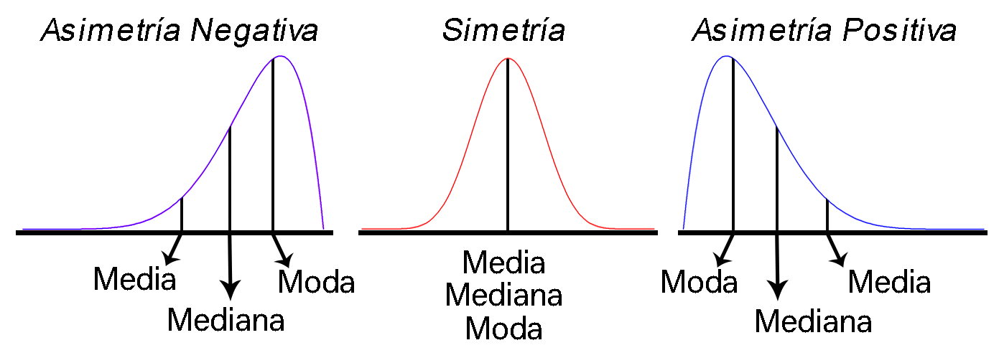

La estadística en la evaluación socioeconómica de proyectos
-----------------------------------------------------------

La evaluación socioeconómica de proyecto es una herramienta de
planeación que busca **identificar, cuantificar y valorar los costos y
beneficios** generados por un proyecto en el bienestar de la sociedad y
**determinar el efecto y la rentabilidad** de las inversiones sobre la
población afectada por el proyecto, con el fin de decidir mediante
juicios objetivos y técnicos la conveniencia de ejecutar dicho proyecto.

Thomas, Vidal, & Chacur ([2008](#ref-Thomas2008), p. 51) señala que
**para decidir si un proyecto es o no rentable** en términos del ingreso
nacional **debe observarse los beneficios y los costos sociales anuales
brutos** del proyecto, en donde el primero se mide mediante el aumento
que dicho proyecto provoque en el ingreso nacional, mientras que el
segundo se mide mediante el ingreso nacional sacrificado por el hecho de
haber efectuado este proyecto en lugar de otro, en donde **el objetivo
será que la rentabilidad del proyecto sea mayor o igual que obtenido al
ejecutar un proyecto alternativo**.

**Es aquí donde el análisis estadístico toma relevancia** dentro de la
evaluación de proyectos, puesto que, permite al investigador realizar
análisis cualitativos o cuantitativos dentro de la gestión de un
proyecto para la toma de decisiones, ya que al emplear herramientas
estadísticas éste puede cuantificar el riesgo y la incertidumbre que
tiene un proyecto, además de permitirle calcular diferentes
probabilidades asociadas a partir de distribuciones de probabilidad.

Introducción a la Estadística
-----------------------------

La Estadística es una **herramienta** ampliamente utilizada en
diferentes disciplinas científicas, debido a su gran potencial para
**recolectar, analizar, interpretar, estimar y presentar** de forma
amigable, la información que se genera en las distintas áreas del
conocimiento, para así **poder argumentar y soportar de mejor manera las
investigaciones realizadas, y/o mejorar los resultados obtenidos en la
toma de decisiones**.

Adicionalmente, la estadística tiene como ventaja respecto a otras
áreas, que permite extraer información de **variables tanto númerica
como categórica** de la población de interés o de una muestra de la
misma, permitiendo al investigador establecer conclusiones acerca de la
misma población, o de alguno de los parámetros que la conforman. Y es
debido a ésto, que puede considerarse a la estadística como **uno de los
pilares fundamental** dentro de la investigación científica teórica y
aplicada.

En general, el análisis estadístico puede dividirse en dos partes:

-   La **Estadística descriptiva**, la cual se encarga de resumir la
    información suministrada mediante el empleo de tablas, gráficas y
    medidas numéricas, junto con el análisis de las mismas, para
    facilitar la interpretación y la presentación de la información.
-   La **Inferencia estadística**, la cual se encarga de la inferencias,
    modelamiento y predicción de la información, para facilitar la
    obtención de conclusiones y toma decisiones.

Estadística descriptiva
-----------------------

En general, la importancia del análisis estadístico radica en la
**resolución de problemas vinculados con datos**, en donde la
variabilidad de los mismos es quién guiará la importancia del empleo de
diferentes técnicas para el manejo de la información. Desde este punto
de vista, se discute en esta sección sobre la implementación de
resúmenes de información, así como la presentación por medio de cuadros,
diagramas o gráficos, cálculo y uso de medidas estadísticas de tendencia
central, localización, variabilidad y forma.

Un aspecto importante a tener en cuenta al realizar análisis
estadísticos, es señalado por Esquivel ([2016](#ref-Esquivel2016), p.
29), el cual menciona que dentro de un análisis con información
estadística, se debe tener en cuenta las siguientes etapas:

1.  **Leer entre los datos**: que consiste en llevar a cabo una lectura
    literal de la información, sin interpretar su contenido.
2.  **Leer dentro de los datos**: implica no solamente interpretar los
    datos sino integrarlos dentro del contexto.
3.  **Leer más allá de los datos**: significa tomar los datos como
    referente para identificar patrones que transciendan el grupo de
    datos observado, ya sea mediante la interpolación o extrapolación de
    resultados.
4.  **Leer detrás de los datos**: consiste en llevar a cabo un análisis
    crítico de la información que se estudia, esto implica analizar
    integralmente el problema, desde su origen, el tipo de dato que se
    utiliza, su validez y fiabilidad para analizar el problema y la
    posibilidad de generalizar los hallazgos.

### Tipos de datos

En términos generales, los datos son cualquier pieza de información
recolectada del fenómeno que se pretende analizar, y que, dependiendo de
las características que posean, deben clasificarse dentro de una
determinada categoría.

-   **Cuantitativos**: Son datos que pueden ser medidos o cuantificados.
    Estos se subdividen en dos categorías:
    -   **Datos cuantitativos discretos**: Son aquellos datos que
        provienen de procesos que involucran conteos, y por tanto, solo
        pueden tomar valores enteros. Por ejemplo: **El número de
        automóviles que transitan por la carretera que conecta dos
        pueblos; El número de pacientes que llega a la Unidad de
        Cuidados Intensivos de un Hospital**
    -   **Datos cuantitativos continuos**: Son aquellos datos que
        provienen de procesos que involucran mediciones, y por tanto,
        solo pueden tomar cualquier valor real dentro de un intervalo.
        Por ejemplo: **El tiempo que tarda una ambulancia en recoger un
        paciente y llevarlo a un hospital; el valor de la mercancía que
        transita por una zona**
-   **Cualitativos**: Son datos asociados a una cualidad o propiedad, y
    por tanto, no pueden representarse numéricamente, a pesar de poder
    caracterizarse alfanuméricamente. Por ejemplo: **Estrato
    socioeconómico, nivel de aceptación de la población por el
    planteamiento de una obra pública**
-   **Lógicos**: Son datos asociados a valores de lógica binaria,
    usualmente denotados como Verdadero y Falso, o Éxito y Fracaso. Por
    ejemplo: **Zona costera, El proyecto es de interés social**

Medidas estadísticas
--------------------

Las medidas estadísticas tienen por objetivo resumir la información
contenida en un conjunto de datos, en pocos valores numéricos que
representan diferentes características. Estas medidas estadísticas nos
darán información sobre la situación, dispersión, forma, asociación que
posee un conjunto de datos de manera que sea posible captar rápidamente
la estructura de los mismos.

#### Caso de estudio

Suponga que se está interesado en la construcción de una nueva vía
sur-norte para la avenida guayabal y para ello debe registrarse el
número de vehículos que transitan dicha vía por día. Si se toma de
referencia un total de `$28$` días obteniendo los siguientes resultados

<pre style="font-family: 'Open Sans',sans-serif; margin-bottom: -4rem; margin-top: -2rem; font-size: 120%;">
<table class="table table-striped" style="width: auto !important; margin-left: auto; margin-right: auto;">
<tbody>
  <tr>
    <td>1142</td>
    <td>1430</td>
    <td>1005</td>
    <td>1538</td>
    <td>1116</td>
    <td>1537</td>
    <td>1307</td>
    <td>1510</td>
    <td>1522</td>
    <td>1310</td>
  </tr>
  <tr>
    <td>1088</td>
    <td>1166</td>
    <td>1365</td>
    <td>1391</td>
    <td>1195</td>
    <td>1737</td>
    <td>1452</td>
    <td>1596</td>
    <td>1588</td>
    <td>1248</td>
  </tr>
  <tr>
    <td>1097</td>
    <td>1142</td>
    <td>1365</td>
    <td>1542</td>
    <td>1609</td>
    <td>1220</td>
    <td>1260</td>
    <td>1588</td>
    <td></td>
    <td></td>
  </tr>
</tbody>
</table>
</pre>

adicionalmente se decide medir el material particulado `$2.5$`
`$PM_{2.5}$` generado en estos días, obteniendo los siguientes
resultados

<pre style="font-family: 'Open Sans',sans-serif; margin-bottom: -4rem; margin-top: -2rem; font-size: 120%;">
<table class="table table-striped" style="width: auto !important; margin-left: auto; margin-right: auto;">
<tbody>
  <tr>
    <td>23.45</td>
    <td>22.9</td>
    <td>11.62</td>
    <td>30.1</td>
    <td>28.17</td>
    <td>21.51</td>
    <td>28.72</td>
    <td>34.29</td>
    <td>31.08</td>
    <td>24.26</td>
  </tr>
  <tr>
    <td>24.08</td>
    <td>19.81</td>
    <td>25.46</td>
    <td>27.98</td>
    <td>24.63</td>
    <td>20.21</td>
    <td>29.6</td>
    <td>20.9</td>
    <td>19.93</td>
    <td>23.02</td>
  </tr>
  <tr>
    <td>18.84</td>
    <td>19.39</td>
    <td>32</td>
    <td>30.32</td>
    <td>27.42</td>
    <td>27.75</td>
    <td>22.8</td>
    <td>31.49</td>
    <td></td>
    <td></td>
  </tr>
</tbody>
</table>
</pre>

### Medidas de tendencia central

Estas medidas tienen por objetivo buscar valores que muestren el lugar
en el cual se encuentra el centro de un conjunto de observaciones. Si se
define `$x_1, x_2, \ldots, x_n$` como un conjunto de `$n$`
observaciones, entonces

#### Media

Es el promedio numérico de las `$n$` observaciones.
`\begin{align*}   \bar{X}=\sum_{i=1}^n\frac{x_i}{n} \end{align*}`

En <tt>Excel</tt>, puede calcularse el valor promedio de un conjunto de
observaciones mediante la función `PROMEDIO()`.

<button id="Show2" class="btn btn-secondary">
Mostrar Ejercicio
</button>
<button id="Hide2" class="btn btn-info">
Ocultar Ejercicio
</button>
<main id="botoncito2">
<h3 data-toc-skip>
Ejercicio caso de estudio
</h3>

Calcule el número promedio de automóviles que transitan por la avenida
guayabal sur-norte en un día.

<h3 data-toc-skip>
Solución
</h3>

A partir de los datos se tiene entonces que el número promedio de
automóviles que transitan por la avenida guayabal es de \[\begin{align*}
  \bar{X} &= \sum_{i=1}^n\frac{x_i}{n}\\
          &= \frac{1142 + 1430 + 1005 + \ldots + 1588}{28} \\
          &= 1359.5
\end{align*}\]

Lo anterior significa que, el número promedio de datos transitan por la
avenida guayabal en un día es igual a \(1359.5\) automóviles.

</main>

#### Mediana

Es el valor que ocupa el lugar central en un conjunto de datos, es
decir, el valor que divide el conjunto de observaciones en dos partes
que contienen el `$50\%$` de las observaciones. Para realizar el cálculo
de la mediana es necesario ordenar inicialmente el conjunto de
observaciones de forma ascendente.
`\begin{align*}   \tilde{X}=\begin{cases}x_{\left[\frac{(n+1)}{2}\right]} & \text{si } n \text{ es impar}\\\frac{1}{2}\left(x_{\left[\frac{n}{2}\right]}+x_{\left[\frac{n}{2}+1\right]}\right) & \text{si } n \text{ es par}\end{cases} \end{align*}`
donde `$x_{\left[j\right]}$` representa la `$j$`-ésima observación
ordenada.

En <tt>Excel</tt> puede calcularse la mediana de un conjunto de
observaciones mediante la función `MEDIANA()`.

<button id="Show3" class="btn btn-secondary">
Mostrar Ejercicio
</button>
<button id="Hide3" class="btn btn-info">
Ocultar Ejercicio
</button>
<main id="botoncito3">
<h3 data-toc-skip>
Ejercicio caso de estudio
</h3>

Calcule la mediana obtenida del número de automóviles que transitan por
la avenida guayabal sur-norte en un día.

<h3 data-toc-skip>
Solución
</h3>

Inicialmente, se observa que el número de días registrados fue de
\(28\), por lo cual, se tiene que \(n\) es un número par, haciendo que
la ecuación empleada sea

\[\begin{align*}
  \tilde{X} &= \frac{1}{2}\left(x_{\left[\frac{n}{2}\right]}+x_{\left[\frac{n}{2}+1\right]}\right) \\
            &= \frac{1}{2}\left(x_{\left[\frac{28}{2}\right]}+x_{\left[\frac{28}{2}+1\right]}\right) \\
            &= \frac{1}{2}\left(x_{\left[14\right]}+x_{\left[15\right]}\right)
\end{align*}\]

En donde se observa que debe localizarse la observación que ocupa la
posición número \(14\) y \(15\) en los registros del número de vehículos
que transitan por día <strong>luego de ordenarlas de menor a
mayor</strong>.

Realizando el ordenamiento se tendrá que

<pre style="font-family: 'Open Sans',sans-serif; margin-bottom: -4rem; margin-top: -2rem; font-size: 120%;">
<table class="table table-striped" style="width: auto !important; margin-left: auto; margin-right: auto;">
<tbody>
  <tr>
    <td>1005</td>
    <td>1088</td>
    <td>1097</td>
    <td>1116</td>
    <td>1142</td>
    <td>1142</td>
    <td>1166</td>
    <td>1195</td>
    <td>1220</td>
    <td>1248</td>
  </tr>
  <tr>
    <td>1260</td>
    <td>1307</td>
    <td>1310</td>
    <td>1365</td>
    <td>1365</td>
    <td>1391</td>
    <td>1430</td>
    <td>1452</td>
    <td>1510</td>
    <td>1522</td>
  </tr>
  <tr>
    <td>1537</td>
    <td>1538</td>
    <td>1542</td>
    <td>1588</td>
    <td>1588</td>
    <td>1596</td>
    <td>1609</td>
    <td>1737</td>
    <td></td>
    <td></td>
  </tr>
</tbody>
</table>
</pre>

donde se observa que las observaciones \(14\) y \(15\) para el número de
vehículos que transitan sur-norte por la avenida guayabal es
\(x_{[14]}=1365\) y \(x_{[15]}=1365\), respectivamente.    Con
dichos valores se realiza entonces, el cálculo de la mediana, tal que

\[\begin{align*}
  \tilde{X} &= \frac{1}{2}(1365+ 1365) \\
            &=1365
\end{align*}\]

De lo anterior se obtiene que el \(50\%\) inferior de los días transitan
por la avenida guayabal sur-norte a lo más \(1365\) vehículos, mientras
que el \(50\%\) superior de los días transitan por la avenida guayabal
sur-norte al menos \(1365\) vehículos.

</main>

#### Moda

Es el valor que ocurre con mayor frecuencia en un conjunto de datos, es
decir, es la observación que se repite con mayor frecuencia. Es de
anotar que en un conjunto de observaciones, se puede tener más de una
moda, en cuyo caso se dirá que el conjunto de datos es bimodal, trimodal
o multimodal.

En <tt>Excel</tt> puede calcularse la moda de un conjunto de
observaciones mediante la función `MODA.UNO()` para calcular el valor
que más se repite, o la función `MODA.VARIOS()` para calcular una lista
con los valores que más se repiten para el caso bimodal, trimodal o
multimodal, guardando la función con la secuencia
<tt>Ctrl+Shift+Enter</tt>.

<button id="Show4" class="btn btn-secondary">
Mostrar Ejercicio
</button>
<button id="Hide4" class="btn btn-info">
Ocultar Ejercicio
</button>
<main id="botoncito4">
<h3 data-toc-skip>
Ejercicio caso de estudio
</h3>

Calcule la moda del número de automóviles que transitan por la avenida
guayabal sur-norte en un día.

<h3 data-toc-skip>
Solución
</h3>

Para encontrar el número modal de automóviles, es necesario localizar el
número de vehículos que más se repita por día. Con el fin de ilustrar
cual es este valor, se presenta nuevamente la tabla ordenada con el
número de vehículos que transitaron cada uno de los \(28\) días para
facilitar su visualización.

<pre style="font-family: 'Open Sans',sans-serif; margin-bottom: -4rem; margin-top: -2rem; font-size: 120%;">
<table class="table table-striped" style="width: auto !important; margin-left: auto; margin-right: auto;">
<tbody>
  <tr>
    <td>1005</td>
    <td>1088</td>
    <td>1097</td>
    <td>1116</td>
    <td>1142</td>
    <td>1142</td>
    <td>1166</td>
    <td>1195</td>
    <td>1220</td>
    <td>1248</td>
  </tr>
  <tr>
    <td>1260</td>
    <td>1307</td>
    <td>1310</td>
    <td>1365</td>
    <td>1365</td>
    <td>1391</td>
    <td>1430</td>
    <td>1452</td>
    <td>1510</td>
    <td>1522</td>
  </tr>
  <tr>
    <td>1537</td>
    <td>1538</td>
    <td>1542</td>
    <td>1588</td>
    <td>1588</td>
    <td>1596</td>
    <td>1609</td>
    <td>1737</td>
    <td></td>
    <td></td>
  </tr>
</tbody>
</table>
</pre>

De la tabla anterior, se observa que estamos ante una situación trimodal
en la cual los valores \(1142\), \(1365\) y \(1588\) son el número de
vehículos que más se repiten en para los días registrados, ya que estos
se repiten dos veces en el conjunto de observaciones.

</main>

### Medidas de localización

Estas medidas tienen por objetivo dividir un conjunto de datos ordenado
en partes iguales, entendidas estas como intervalos que contienen la
misma proporción de observaciones. Si se define
`$x_{[1]}, x_{[2]}, \ldots, x_{[n]}$`, como un conjunto de `$n$`
observaciones ordenadas en forma creciente, entonces

#### Percentil

Son los **noventa y nueve valores** `$(j=1,2,\ldots,99)$`, que dividen a
un conjunto de datos ordenados en **cien partes** iguales. Para ello, es
necesario calcular inicialmente una variable `$h_j$` de posicionamiento
dado el cuartil `$j$` de interés, tal que
`\begin{align*}   h_j = \frac{j(n-1)}{100} + 1 \quad \quad j=1,2,\dots,99 \end{align*}`

y posteriormente, con éste valor se realiza el cálculo del cuartil de
interés
`\begin{align*}   P_j=x_{[\lfloor h_j\rfloor} + \left((h_j - \lfloor h_j\rfloor) \times  (x_{[\lfloor h_j\rfloor + 1]} - x_{\lfloor h_j\rfloor}) \right) \quad \quad j=1,2,\dots,99 \end{align*}`

siendo `$\lfloor h_j\rfloor$` el valor piso de `$h_j$`, **es decir, el
entero de `$h$` aproximando siempre hacia abajo**.

En <tt>Excel</tt> puede calcularse el k-ésimo percentil de un conjunto
de observaciones mediante la función `PERCENTIL.INC()` para calcular el
valor que más se repite, o la función `MODA.VARIOS()` para calcular una
lista con los valores que más se repiten para el caso bimodal, trimodal
o multimodal, guardando la función con la secuencia
<tt>Ctrl+Shift+Enter</tt>.

<button id="Show5" class="btn btn-secondary">
Mostrar Ejercicio
</button>
<button id="Hide5" class="btn btn-info">
Ocultar Ejercicio
</button>
<main id="botoncito5">
<h3 data-toc-skip>
Ejercicio caso de estudio
</h3>

Calcule el percentil \(95\) del número de automóviles que transitan por
la avenida guayabal sur-norte en un día.

<h3 data-toc-skip>
Solución
</h3>

Para realizar el cálculo del percentil número \(j=95\), es necesario
ordenar el número de automóviles que transitan por la avenida guayabal
por día, tal que

<pre style="font-family: 'Open Sans',sans-serif; margin-bottom: -4rem; margin-top: -2rem; font-size: 120%;">
<table class="table table-striped" style="width: auto !important; margin-left: auto; margin-right: auto;">
<tbody>
  <tr>
    <td>1005</td>
    <td>1088</td>
    <td>1097</td>
    <td>1116</td>
    <td>1142</td>
    <td>1142</td>
    <td>1166</td>
    <td>1195</td>
    <td>1220</td>
    <td>1248</td>
  </tr>
  <tr>
    <td>1260</td>
    <td>1307</td>
    <td>1310</td>
    <td>1365</td>
    <td>1365</td>
    <td>1391</td>
    <td>1430</td>
    <td>1452</td>
    <td>1510</td>
    <td>1522</td>
  </tr>
  <tr>
    <td>1537</td>
    <td>1538</td>
    <td>1542</td>
    <td>1588</td>
    <td>1588</td>
    <td>1596</td>
    <td>1609</td>
    <td>1737</td>
    <td></td>
    <td></td>
  </tr>
</tbody>
</table>
</pre>

Con los datos ordenados, se realiza el cálculo para la variable de
posicionamiento \(h_j\), con \(j=95\), dado que se posee un total de
\(28\) observaciones, tal que
\[h_{95} = \frac{95(28-1)}{100} + 1 = 26.65\] Al reemplazar el valor
obtenido en la variable de posicionamiento, en la formula de
percentiles, con \(j=95\), obtenemos que

\[\begin{align*}P_{95} &=x_{\lfloor h_{95}\rfloor} + \left((h_{95} - \lfloor h_{95}\rfloor) \times  (x_{[\lfloor h_{95}\rfloor + 1]} - x_{\lfloor h_{33}\rfloor}) \right) \\ &= x_{\lfloor 26.65\rfloor} + \left((26.65 - \lfloor 26.65\rfloor) \times  (x_{[\lfloor v\rfloor + 1]} - x_{\lfloor 26.65\rfloor}) \right) \\ & = x_{[26]} + \left((26.65 - 26) \times  (x_{[26+1]}-x_{[26]})\right) \\ &= x_{[26]} + \left(0.65 \times  (x_{[27]}-x_{[26]})\right)\end{align*}\]

En donde, \(x_{[26]}=1596\) y \(x_{[27]}=1609\), son las notas que
ocupan la posición \(26\) y \(27\) en el conjunto de datos ordenados
para el número de automóviles que transitan por la avenida guayabal en
un día. Finalmente, al reemplazar dichos valores en la ecuación de
percentiles se tendrá que

\[\begin{align*}
  P_{95} &= 1596 + \left(0.65 \times  (1609-1596)\right)\\
  P_{95} &= 1604.45
\end{align*}\]

De lo anterior, se podrá concluir que el \(95\%\) inferior de los días
transita una cantidad de automóviles menor o igual a \(1604.45\),
mientras que el \(5\%\) superior de los días transita una cantidad mayor
o igual a \(1604.45\).

</main>

### Medidas de dispersión

Estas medidas tienen por objetivo determinar la dispersión o
variabilidad que posee un conjunto de observaciones, en donde, entre
mayor sean estas medidas, mayor será el grado de dispersión de los
datos. Si se define `$x_1, x_2, \ldots, x_n$` como un conjunto de `$n$`
observaciones, entonces

#### Varianza

Mide la distancia media **al cuadrado** del conjunto de datos respecto a
la media
`\begin{align*}   S^2=\frac{1}{n-1}\sum_{i=1}^n{(x_i-\bar{X})^2} \end{align*}`
<!--el n-1 se conoce como corrección de Bessel, y se realiza para corregir el sesgo del estimador-->

En <tt>Excel</tt> puede calcularse la varianza de un conjunto de
observaciones mediante la función `VAR.S()`.

<button id="Show6" class="btn btn-secondary">
Mostrar Ejercicio
</button>
<button id="Hide6" class="btn btn-info">
Ocultar Ejercicio
</button>
<main id="botoncito6">
<h3 data-toc-skip>
Ejercicio caso de estudio
</h3>

Calcule la varianza para el número de automóviles que transitan por la
avenida guayabal sur-norte en un día.

<h3 data-toc-skip>
Solución
</h3>

Para realizar el cálculo de la varianza del número de automóviles que
transitan por la avenida guayabal por día, se emplea la fórmula de la
varianza en donde se observa que se requiere el número promedio de
automóviles, en donde se emplea el valor de la media \(\bar{X}=1359.5\),
tal que \[\begin{align*}
  S^2 &= \frac{1}{n-1}\sum_{i=1}^n{(x_i-\bar{X})^2} \\
      &= \frac{1}{28-1}\left[(1142 - 1359.5)^2 + \ldots + (1220 - 1359.5) ^2\right] \\
      &= 39226.6296296
\end{align*}\] Es de anotar, que la interpretación de la varianza no
tiene mucho sentido, debido a que la unidad de medición estará elevada
al cuadrado, así que en general, los valores calculados se usan para
realizar el cálculo de la desviación estándar.

</main>

#### Desviación estándar

Es la raíz cuadrada de la distancia media del conjunto de datos respeto
a la media, es decir, indica qué tan dispersos se encuentra el conjunto
de observaciones de su valor promedio.
`\begin{align*}   S=\sqrt{S^2} \end{align*}`

En <tt>Excel</tt> puede calcularse la desviación estándar de un conjunto
de observaciones mediante la función `DESVEST.M()`.

<button id="Show7" class="btn btn-secondary">
Mostrar Ejercicio
</button>
<button id="Hide7" class="btn btn-info">
Ocultar Ejercicio
</button>
<main id="botoncito7">
<h3 data-toc-skip>
Ejercicio caso de estudio
</h3>

Calcule la desviación estándar para el número de automóviles que
transitan por la avenida guayabal sur-norte en un día.

<h3 data-toc-skip>
Solución
</h3>

La desviación estándar para el número de automóviles que transitan por
la avenida guayaban en un día, puede ser calculada de forma simple
mediante la raíz cuadrada de la varianza, que se calculó anteriormente,
obteniendo que \[\begin{align*}
  S &= \sqrt{S^2} \\
    &= \sqrt{39226.6296296} \\
    &= 198.0571373
\end{align*}\]

En donde, de los resultados obtenidos se tiene que, la dispersión que
poseen los datos respecto a su valor promedio es de \(198.0571373\) para
el número de automóviles que transitan la avenida guayabal en un día.
Esto quiere decir, que el número promedio de automóviles que transitan
la avenida es de \(1359.5\) con una desviación estándar de
\(198.0571373\).

</main>

#### Coeficiente de variación

Es la desviación estándar como un porcentaje de la media aritmética de
un conjunto de datos. Sirve para observar el grado de variabilidad que
tiene un conjunto de observaciones respecto a su promedio
`\begin{align*}   CV = \frac{S}{|\bar{X}|} \times 100\% \end{align*}`

Entre las funciones base de <tt>Excel</tt> no hay ninguna función que
calcule el coeficiente de variación de un conjunto de observaciones de
forma directa, pero éste es fácil de calcular mediante el empleo de la
desviación estándar `$S$` y el valor absoluto de la media `$\bar{X}$`,
los cuales pueden calcularse mediante las funciones `DESVEST.M()` y
`PROMEDIO()`, respectivamente.

<button id="Show8" class="btn btn-secondary">
Mostrar Ejercicio
</button>
<button id="Hide8" class="btn btn-info">
Ocultar Ejercicio
</button>
<main id="botoncito8">
<h3 data-toc-skip>
Ejercicio caso de estudio
</h3>

Calcule la desviación estándar para el número de automóviles que
transitan por la avenida guayabal sur-norte en un día.

<h3 data-toc-skip>
Solución
</h3>

El coeficiente de variación refleja la variación porcentual que tiene un
conjunto de observaciones respecto a su valor promedio, por tanto, al
aplicar la ecuación del coeficiente de variación al número de
automóviles que transitan por la avenida guayabal en un día, se tiene
que \[\begin{align*}
  CV &= \frac{S}{|\bar{X}|} \\
     &= \frac{198.0571373}{|1359.5|} \times 100\% \\
     &= 14.5683808 \% 
\end{align*}\] De lo anterior, se aprecia que la variación porcentual
del número de automóviles en un día no es muy alto respecto a su media
ya que el porcentaje de variación asciende solo hasta el
\(14.5683808 \%\) y por tanto se tendrá que los datos no se encuentran
muy dispersos respecto a su media.

</main>

#### Rango intercuartílico

Es la distancia o amplitud que hay entre el percentil `$25$` y percentil
`$75$`, de un conjunto de datos. Éste muestra la amplitud del `$50\%$`
de los datos centrales de un conjunto de observaciones. Esta medida
puede ser tomada como una medida de variabilidad para la mediana.
`\begin{align*}   IQR = P_{75} - P_{25} \end{align*}`

Entre las funciones base de <tt>Excel</tt> no hay ninguna función que
calcule el rango intercuartílico de un conjunto de observaciones de
forma directa, pero éste es fácil de calcular mediante el empleo del
percentil `$75$` `$P_{75}$` y percentil `$25$`, `$P_{25}$`, los cuales
pueden calcularse mediante la función `PERCENTIL.EXC()`.

<button id="Show9" class="btn btn-secondary">
Mostrar Ejercicio
</button>
<button id="Hide9" class="btn btn-info">
Ocultar Ejercicio
</button>
<main id="botoncito9">
<h3 data-toc-skip>
Ejercicio caso de estudio
</h3>

Calcule el rango intercuartílico para el número de automóviles que
transitan por la avenida guayabal sur-norte en un día.

<h3 data-toc-skip>
Solución
</h3>

El rango intercuartílico se calcula mediante la diferencia de los
percentiles del \(75\%\) y del \(25\%\), y por ello se hace necesario
realizar el cálculo de dichos valores.  

Entonces, al realizar el cálculo de los dos percentiles con la formula
anteriormente presentada se encontrará que \(P_{75}=1537.25\), mientras
que, \(P_{25}=1187.75\), y por tanto, al reemplazar en la formula del
rango intercuartílico se tendrá que \[\begin{align*}
  IQR &= P_{75} - P_{25} \\
      &= 1537.25 - 1187.75 \\
      &= 349.5 
\end{align*}\]

Mostrando que, al eliminar el \(50\%\) de los datos más extremos, se
obtiene un rango intercuartil de \(349.5\) para el número de vehículos
que transitan por la avenida guayabal en un día.

</main>

#### Desviación absoluta mediana

Es una medida de la dispersión de un conjunto de observaciones respecto
a su mediana

`\begin{align*}   MAD=b\times Me(|X_i-\tilde{X}|) \end{align*}`

donde `$b$` es una constante definida como `$b=1/C_{3}$`, con `$C_{3}$`
el valor del tercer cuartil de la distribución de interés (no el
obtenido de los datos) y con `$Me(|X_i-\tilde{X}|)$` la mediana del
valor absoluto de la diferencia `$X_i-\tilde{X}$`. Además, si la
distribución es normal, entonces `$b\approx1.4826$`.

Entre las funciones base de <tt>Excel</tt> no hay ninguna función que
calcule la desviación absoluta mediana de un conjunto de observaciones
de forma directa, pero éste es fácil de calcular mediante el empleo de
las funciones para la mediana `MEDIANA()` y valor absoluto `ABS()`.

<button id="Show10" class="btn btn-secondary">
Mostrar Ejercicio
</button>
<button id="Hide10" class="btn btn-info">
Ocultar Ejercicio
</button>
<main id="botoncito10">
<h3 data-toc-skip>
Ejercicio caso de estudio
</h3>

Calcule la desviación absoluta mediana del número de automóviles que
transitan por la avenida guayabal sur-norte en un día.

<h3 data-toc-skip>
Solución
</h3>

Para realizar el cálculo de la desviación absoluta mediana para el
número de vehículos que transitan por la avenida guayabal en un día, es
necesario inicialmente realizar el cálculo de \(|X_i-\tilde{X}|\) para
cada uno de los días registrados, siendo \(\tilde{X}=1365\) el valor de
la mediana calculada previamente. Entonces al realizar el cálculo de la
diferencia absoluta y ordenando de mayor a menor se obtienen los
siguientes datos

<pre style="font-family: 'Open Sans',sans-serif; margin-bottom: -4rem; margin-top: -2rem; font-size: 120%;">
<table class="table table-striped" style="width: auto !important; margin-left: auto; margin-right: auto;">
<tbody>
  <tr>
    <td>0</td>
    <td>0</td>
    <td>26</td>
    <td>55</td>
    <td>58</td>
    <td>65</td>
    <td>87</td>
    <td>105</td>
    <td>117</td>
    <td>145</td>
  </tr>
  <tr>
    <td>145</td>
    <td>1307</td>
    <td>170</td>
    <td>172</td>
    <td>173</td>
    <td>177</td>
    <td>199</td>
    <td>223</td>
    <td>223</td>
    <td>223</td>
  </tr>
  <tr>
    <td>223</td>
    <td>231</td>
    <td>244</td>
    <td>249</td>
    <td>268</td>
    <td>277</td>
    <td>360</td>
    <td>372</td>
    <td></td>
    <td></td>
  </tr>
</tbody>
</table>
</pre>

Seguidamente, se realiza el cálculo de la mediana de los valores
obtenidos en la tabla anterior, en donde, dado que se tienen \(28\)
observaciones, entonces \(Me(|X_i-\tilde{X}|)\) para el número de
vehículos que transitan por la avenida guayabal en un día es igual a

\[\begin{align*}
  Me(|X_i-\tilde{X}|) &= \frac{1}{2}\left(|X_i-\tilde{X}|_{\left[\frac{n}{2}\right]}+|X_i-\tilde{X}|_{\left[\frac{n}{2}+1\right]}\right) \\
                      &= \frac{1}{2}\left(|X_i-\tilde{X}|_{\left[\frac{28}{2}\right]}+|X_i-\tilde{X}|_{\left[\frac{28}{2}+1\right]}\right) \\
                      &= \frac{1}{2}\left(|X_i-\tilde{X}|_{\left[14\right]}+|X_i-\tilde{X}|_{\left[15\right]}\right)
\end{align*}\]

donde se observa que las observaciones \(14\) y \(15\) para de la
diferencia absoluta respecto a la mediana es
\(|X_i-\tilde{X}|_{[14]}=172\) y \(|X_i-\tilde{X}|_{[15]}=173\),
respectivamente.    Con dichos valores se realiza entonces, el
cálculo de la mediana, tal que

\[\begin{align*}
  Me(|X_i-\tilde{X}|) &= \frac{1}{2}(172+ 173) \\
            &=172.5
\end{align*}\]

Ahora, al emplear este valor, y asumiendo que \(b=1.4826\), se tendrá
que la desviación absoluta mediana el número de vehículos que transitan
por la avenida guayabal en un día es igual a

\[\begin{align*}
MAD &= b\times Me(|X_i-\tilde{X}|)\\
    &= 1.4826 \times 172.5 \\
    &= 255.7485 
\end{align*}\] De lo anterior se obtiene que la mediana del número de
vehículo que transitan en un día por la avenida guayabal sur-norte es de
\(1365\) vehículos, con una desviación absoluta mediana de \(255.7485\).

</main>

### Medidas de forma

Estas medidas tienen por objetivo evidenciar si el conjunto de
observaciones tiene o no una forma simétrica y observar su nivel de
concentración.

#### Coeficiente de asimetría

Este valor permite identificar si el conjunto de datos se distribuye
uniformemente alrededor de las medidas de tendencia central.
`\begin{align*}   \gamma_1 = \frac{n}{(n-1)(n-2)}\frac{\sum_{i=1}^n{(x_i-\bar{X})^3}}{S^3} \quad \quad -\infty<\gamma_1<\infty \end{align*}`
El signo de `$\gamma_1$` indica la dirección de la asimetría.

-   `$\gamma_1>0$` indica asimetría positiva, es decir, las
    observaciones se reúnen más en la parte izquierda de las medidas de
    tendencia central.
-   `$\gamma_1<0$` indica asimetría negativa, es decir, las
    observaciones se reúnen más en la parte derecha de las medidas de
    tendencia central.
-   `$\gamma_1\sim0$` indica simetría, es decir, existe aproximadamente
    la misma cantidad de observaciones a los dos lados de las medidas de
    tendencia central.

<h4 align="center">
Representación tipos de Asimetría
</h4>

En <tt>Excel</tt> puede calcularse la mediana de un conjunto de
observaciones mediante la función `COEFICIENTE.ASIMETRIA()`.

<button id="Show11" class="btn btn-secondary">
Mostrar Ejercicio
</button>
<button id="Hide11" class="btn btn-info">
Ocultar Ejercicio
</button>
<main id="botoncito11">
<h3 data-toc-skip>
Ejercicio caso de estudio
</h3>

Calcule el coeficiente de asimetría del número de automóviles que
transitan por la avenida guayabal sur-norte en un día.

<h3 data-toc-skip>
Solución
</h3>

El coeficiente de asimetría asociado al número de automóviles que
transitan por la avenida guayabal en un día depende del valor promedio
\(\bar{X}= 1359.5\) y la desviación estándar \(S=198.0571373\). Por
tanto al emplear los valores ya calculados previamente, se tendrá que el
coeficiente de asimetría estará dado por \[\begin{align*}
  \gamma_{1} &= \frac{n}{(n-1)(n-2)}\frac{\sum_{i=1}^n{(x_i-\bar{X})^3}}{S^3}\\
             &= \frac{28}{(27)(26)}\left[\frac{(1142 - 1359.5)^3 + \ldots + (1588 - 1359.5)^3}{198.0571373^3}\right] \\
             &= -0.0106128
\end{align*}\] De lo anterior se observa que el coeficiente de asimetría
es negativa pero cercana a \(0\), lo cual significa que el número de
vehículos que transita por la avenida guayabal en un día es
aproximadamente simétrica con un leve sesgo hacia la izquierda, es
decir, es un poco menos probable que ocurran valores inferiores a la
media a que ocurran valores mayores.

</main>

#### Coeficiente de exceso de curtosis

Este valor permite observar el grado de concentración del conjunto de
datos
`\begin{align*}   \gamma_2 = \frac{n(n+1)}{(n-1)(n-2)(n-3)}\frac{\sum_{i=1}^n{(x_i-\bar{X})^4}}{S^4}-\frac{3(n-1)^2}{(n-2)(n-3)} \quad -2<\gamma_2<\infty \end{align*}`

El signo de `$\gamma_2$` indica el nivel de concentración.

-   `$\gamma_2>0$` indica leptocurtosis, es decir, la forma de los datos
    es más en punta y posee colas menos anchas.
-   `$\gamma_2<0$` indica platicurtosis, es decir, la forma de los datos
    es más plana y posee colas más anchas.
-   `$\gamma_2\sim0$` indica mesocurtosis, es decir, tanto la punta como
    las colas son similares a la distribución normal.

<h4 align="center">
Representación tipos de kurtosis
</h4>

En <tt>Excel</tt> puede calcularse la mediana de un conjunto de
observaciones mediante la función `CURTOSIS()`.

<button id="Show12" class="btn btn-secondary">
Mostrar Ejercicio
</button>
<button id="Hide12" class="btn btn-info">
Ocultar Ejercicio
</button>
<main id="botoncito12">
<h3 data-toc-skip>
Ejercicio caso de estudio
</h3>

Calcule el coeficiente de exceso de kurtosis del número de automóviles
que transitan por la avenida guayabal sur-norte en un día.

<h3 data-toc-skip>
Solución
</h3>

Similar al coeficiente de asimetría, el coeficiente de exceso de
curtosis depende del valor promedio \(\bar{X}= 1359.5\) y la desviación
estándar \(S=198.0571373\), del número de automóviles que transitan por
la avenida guayabal en un día, dando como resultado \[\begin{align*}
  \gamma_{2} &= \frac{n(n+1)}{(n-1)(n-2)(n-3)}\frac{\sum_{i=1}^n{(x_i-\bar{X})^4}}{S^4}-\frac{3(n-1)^2}{(n-2)(n-3)}\\
             &= \frac{28(29)}{27}(26)(25)\left[\frac{(1142 - 1359.5)^4 + \ldots + (1142 - 1359.5)^4}{198.0571373^4}\right] - \frac{3(27)^2}{(26)(25)} \\
             &= -1.1414707
\end{align*}\] A partir del valor calculado, se observa que el
coeficiente de exceso de curtosis es menor que \(0\), y por tanto, se
puede concluir que el número de automóviles que transitan por la avenida
guayabal en un día posee un comportamiento platicúrtico, es decir que el
número de automóviles que transitan por día, poseen un comportamiento
relativamente uniforme, debido a que su comportamiento es muy plano.

</main>

### Medidas de asociación

Estas medidas tienen por objetivo estimar la magnitud con la que dos
fenómenos se relacionan, en donde, entre mayor sean estas medidas, mayor
será el grado de asociación que tendrán las variables. Si se define
`$x_1, x_2, \ldots, x_n$` y `$y_1, y_2, \ldots, y_n$` como dos conjuntos
de `$n$` observaciones, entonces

#### Covarianza

Mide si existe o no dependencia lineal entre las variables, e indica el
grado de variación conjunta de dos variables respecto a sus medias
`\begin{align*}   S_{xy} = \frac{1}{n}\sum_{i=1}^n{(x_i-\bar{X})(y_i-\bar{Y})}  \end{align*}`

El signo de `$S_{xy}$` indica el tipo de dependencia lineal que hay
entre las variables.

-   `$S_{xy} > 0$` indica que hay dependencia lineal positiva entre las
    variables, es decir, cuando aumenta una variable, la otra también
    aumenta.
-   `$S_{xy} < 0$` indica que hay dependencia lineal negativa entre las
    variables, es decir, cuando aumenta una variable, la otra disminuye.
-   `$S_{xy} \approx 0$` indica que no existencia dependencia lineal
    entre las dos variables.

En <tt>Excel</tt> puede calcularse la covarianza de dos conjunto de
observaciones mediante la función `COVARIANZA.M()`.

<button id="Show13" class="btn btn-secondary">
Mostrar Ejercicio
</button>
<button id="Hide13" class="btn btn-info">
Ocultar Ejercicio
</button>
<main id="botoncito13">
<h3 data-toc-skip>
Ejercicio caso de estudio
</h3>

Calcule el covarianza que hay entre el número de automóviles que
transitan la avenida guayabal en un día y el \(CO_2\) generado en dichos
días, para saber si existe o no dependencia lineal entre estas
variables.

<h3 data-toc-skip>
Solución
</h3>

A diferencia de las anteriores medidas, el coeficiente de covarianza
buscar observar si existe o no una dependencia lineal entre dos grupos
de observaciones. Y para ello, se requiere los valores promedio
asociados a las dos variables \(\bar{X}_{Vehículos}=1359.5\) y
\(\bar{X}_{PM_{2.5}}=25.0617857\), obteniendo que la covarianza entre
las variables es igual a

\[\begin{align*}
  S_{Vehículos;\; PM_{2.5}} &= \frac{1}{n}\sum_{i=1}^n{(x_i-\bar{X})(y_i-\bar{Y})}  \\
                            &= \frac{1}{28}\left[(1142-1359.5)(23.45- 25.0617857) + \ldots + (1588-1359.5)(31.49- 25.0617857)\right] \\
                            &= 391.427963
\end{align*}\]

Dado que del coeficiente de covarianza, solo es posible interpretar el
signo o cuando el valor está muy cercano a \(0\), se concluye entonces
que existe una relación lineal positiva entre el número de vehículos que
transitan por la avenida guayabal y el material particulado \(2.5\)
registrado en un día.

</main>

#### Correlación

Mide la fuerza de la dependencia lineal que hay entre variables, esta va
entre `$-1$` y `$1$`
`\begin{align*}   \rho_{xy} = \frac{S_{xy}}{S_{x}S_{y}} \quad \quad -1<\rho_{xy}<1 \end{align*}`

El valor de `$\rho_{xy}$` indica el tipo y fuerza de la dependencia
lineal que hay entre las variables

-   `$\rho_{xy} = 1$` indica que existe dependencia lineal positiva
    exacta entre las variables, es decir, cuando aumenta una variable,
    la otra aumenta proporcionalmente en la misma cantidad. Este aumento
    es de la forma `$Y = a + bX$`, siendo `$a$` y `$b$` dos constantes,
    con `$b>0$`.
-   `$\rho_{xy} = -1$` indica que existe dependencia lineal negativa
    exacta entre las variables, es decir, cuando aumenta una variable,
    la otra disminuye proporcionalmente en la misma cantidad. Este
    aumento es de la forma `$Y = a + bX$` con `$a y b$` dos constantes,
    y `$b<0$`.
-   `$\rho_{xy} = 0$` No existe dependencia lineal entre las variables.

Además, se tendrá que si

-   `$0.5 < \rho_{xy} \leq 1$` fuerte correlación positiva entre `$X$` y
    `$Y$`.
-   `$0.3 < \rho_{xy} \leq 0.5$` moderada correlación positiva entre
    `$X$` y `$Y$`.
-   `$0.1 < \rho_{xy} \leq 0.3$` débil correlación positiva entre `$X$`
    y `$Y$`.
-   `$-0.1 \leq \rho_{xy} \leq 0.1$` débil o ninguna correlación entre
    `$X$` y `$Y$`.
-   `$-0.3 \leq \rho_{xy} < -0.1$` débil correlación negativa entre
    `$X$` y `$Y$`.
-   `$-0.5 \leq \rho_{xy} < -0.3$` moderada correlación negativa entre
    `$X$` y `$Y$`.
-   `$-1 \leq \rho_{xy} < -0.5$` fuerte correlación negativa entre `$X$`
    y `$Y$`.

En <tt>Excel</tt> puede calcularse la correlación de dos conjunto de
observaciones mediante la función `COEF.DE.CORREL()`.

<button id="Show14" class="btn btn-secondary">
Mostrar Ejercicio
</button>
<button id="Hide14" class="btn btn-info">
Ocultar Ejercicio
</button>
<main id="botoncito14">
<h3 data-toc-skip>
Ejercicio caso de estudio
</h3>

Calcule la fuerza de la correlación que hay entre el número de
automóviles que transitan la avenida guayabal en un día y el \(CO_2\)
generado en dichos días, para saber si existe o no dependencia lineal
entre estas variables.

<h3 data-toc-skip>
Solución
</h3>

Similar al coeficiente de covarianza, el coeficiente de correlación
buscar si existe o no una dependencia lineal entre dos grupos de
observaciones, pero a diferencia de éste, el coeficiente de correlación
muestra la fuerza de dicha relación. Por tanto, para realizar el cálculo
del coeficiente de correlación entre el número de vehículos que
transitan la avenida guayabal en un día y el \(CO_2\) registrado, es
necesario emplear el valor del coeficiente de covarianza
\(S_{Vehículos;\; PM_{2.5}} = 391.427963\) y las desviaciones estándar
calculadas para cada variable \(S_{Vehículos}= 198.0571373\) y
\(S_{PM_{2.5}}=5.1145233\), tal que \[\begin{align*}
  \rho_{xy} &= \frac{S_{xy}}{S_{x}S_{y}} \\
            &= \frac{391.427963}{(198.0571373)(5.1145233)} \\
            & = 0.386417
\end{align*}\]

Del resultado anterior se concluye, que hay existe una correlación
positiva moderada entre el número de vehículos que transitan por la
avenida guayabal y el material particulado \(2.5\) registrado en un día,
es decir que cuando aumenta una variable, también aumenta en menor
proporción la otra variable.

</main>

Referencias
-----------

<h7 id="ref-Esquivel2016"></h7> <h7 id="ref-Thomas2008"></h7>

Esquivel, E. (2016). La enseñanza de la estadı́stica y la probabilidad,
más allá de procedimientos y técnicas. *Cuadernos de Investigación Y
Formación En Educación Matemática*, 21–31.

Thomas, M., Vidal, R., & Chacur, A. (2008). Evaluación socioeconómica de
proyectos con el método de opciones reales. *Revista Ingenierı́a
Industrial*, *7*(2).
