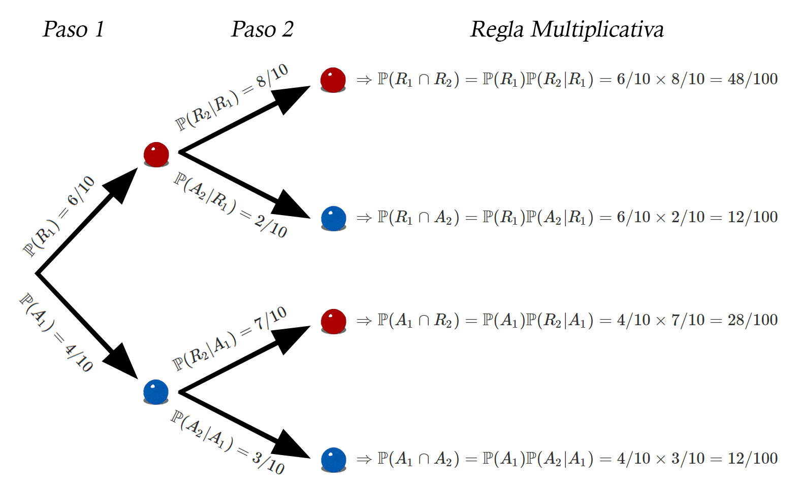
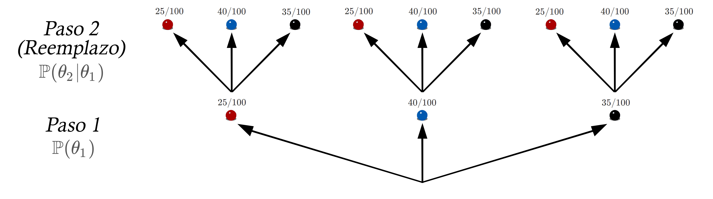

Probabilidad Condicional
------------------------

Es la probabilidad de que ocurra un evento `$A$`, cuando se sabe que ya
ocurrió un evento `$B$`, se denota por `$\mathbb P(A|B)$` y se define
como
`\begin{align*} \mathbb P(A|B)=\frac{\mathbb P(A\cap B)}{\mathbb P(B)}; \text{ con } \mathbb P(B)>0 \end{align*}`

#### Ejercicio

Suponga que se realiza un estudio en la Facultad de Ciencias Económicas,
en donde se le pregunta a sus estudiantes, cuál deporte preferirían
practicar entre Fútbol, Baloncesto, Voleibol y Tenis. Dicha pregunta se
le realiza a un total de \(400\) estudiantes, encontrando los siguientes
resultados

<section style="overflow: auto; margin-top: -3rem; margin-bottom: -2rem;">
<table class="table table-striped" style="width: auto !important; margin-left: auto; margin-right: auto;">
<thead>
<tr>
<th style="text-align:left;">
</th>
<th style="text-align:right;">
Fútbol
</th>
<th style="text-align:right;">
Baloncesto
</th>
<th style="text-align:right;">
Voleibol
</th>
<th style="text-align:right;">
Tenis
</th>
</tr>
</thead>
<tbody>
<tr>
<td style="text-align:left;">
Administración de empresas
</td>
<td style="text-align:right;">
48
</td>
<td style="text-align:right;">
27
</td>
<td style="text-align:right;">
22
</td>
<td style="text-align:right;">
23
</td>
</tr>
<tr>
<td style="text-align:left;">
Contaduría
</td>
<td style="text-align:right;">
34
</td>
<td style="text-align:right;">
41
</td>
<td style="text-align:right;">
25
</td>
<td style="text-align:right;">
10
</td>
</tr>
<tr>
<td style="text-align:left;">
Economía
</td>
<td style="text-align:right;">
66
</td>
<td style="text-align:right;">
51
</td>
<td style="text-align:right;">
13
</td>
<td style="text-align:right;">
40
</td>
</tr>
</tbody>
</table>
</section>

A partir de la tabla anterior, responda

1.  Construya una tabla de probabilidades.
2.  Cuál es la probabilidad de que se seleccione un estudiante prefiera
    el Fútbol sobre los otros deportes?
3.  Cuál es la probabilidad de que se seleccione un estudiante estudie
    Contaduría?
4.  Cuál es la probabilidad de que se seleccione un estudiante estudie
    Economía y prefiera el Tenis sobre los demás deportes?
5.  Si se selecciona un estudiante de Contaduría, cuál es la
    probabilidad de que prefiera el Voleibol sobre los otros deportes?
6.  Cual es la probabilidad de que un estudiante sea de Economía, si se
    sabe que prefiere el Baloncesto sobre los otros deportes?

<button id="Show1" class="btn btn-secondary">
Mostrar Solución
</button>
<button id="Hide1" class="btn btn-info">
Ocultar Solución
</button>
<main id="botoncito1">
<h3 data-toc-skip>
Solución
</h3>
<ol type="1">
<li>

Dado que el interés es construir una tabla de probabilidades, es
cuestión de dividir cada una de las entradas por el total de estudiantes
encuestados, esto con el fin de que la suma de todos los puntos
muestrales sea igual a \(1\), es decir, \(\mathbb{P}(S) = 1\), siendo
\(S\) el espacio muestral. Por tanto se tendrá que

<pre style="font-family: 'Open Sans',sans-serif; margin-top: -3rem; margin-bottom: -2rem; font-size:0.98rem;"><table class="table table-striped" style="width: auto !important; margin-left: auto; margin-right: auto;"><thead><tr><th style="text-align:right;"></th><th style="text-align:left;">Fútbol</th><th style="text-align:left;">Baloncesto</th><th style="text-align:left;">Voleibol</th><th style="text-align:left;">Tenis</th></tr></thead><tbody><tr><td style="text-align:left;">Administración de empresas</td><td style="text-align:right;">0.120</td><td style="text-align:right;">0.0675</td><td style="text-align:right;">0.0550</td><td style="text-align:right;">0.0575</td></tr><tr><td style="text-align:left;">Contaduría</td><td style="text-align:right;">0.085</td><td style="text-align:right;">0.1025</td><td style="text-align:right;">0.0625</td><td style="text-align:right;">0.0250</td></tr><tr><td style="text-align:left;">Economía</td><td style="text-align:right;">0.165</td><td style="text-align:right;">0.1275</td><td style="text-align:right;">0.0325</td><td style="text-align:right;">0.1000</td></tr></tbody></table></pre>
</li>
<li>

Dado que nos interesa solo la probabilidad de que al estudiante
seleccionado prefiera el Fútbol, entonces podemos calcular dicha
probabilidad mediante el cálculo de la suma marginal de la columna de
Fútbol, dicha suma se conoce como
<a href="../../EstadisticaI/EstIClase06.html#probabilidad-total" target="\_blank">Probabilidad
total</a>, de la cual se hablará más adelante.

<pre style="font-family: 'Open Sans',sans-serif; margin-top: -3rem; margin-bottom: -2rem; font-size:0.98rem;"><table class="table table-striped" style="width: auto !important; margin-left: auto; margin-right: auto;"><thead><tr><th style="text-align:right;"></th><th style="text-align:left;">Fútbol</th><th style="text-align:left;">Baloncesto</th><th style="text-align:left;">Voleibol</th><th style="text-align:left;">Tenis</th></tr></thead><tbody><tr><td style="text-align:left;">Administración de empresas</td><td style="text-align:right;">0.120</td><td style="text-align:right;">0.0675</td><td style="text-align:right;">0.0550</td><td style="text-align:right;">0.0575</td></tr><tr><td style="text-align:left;">Contaduría</td><td style="text-align:right;">0.085</td><td style="text-align:right;">0.1025</td><td style="text-align:right;">0.0625</td><td style="text-align:right;">0.0250</td></tr><tr><td style="text-align:left;">Economía</td><td style="text-align:right;">0.165</td><td style="text-align:right;">0.1275</td><td style="text-align:right;">0.0325</td><td style="text-align:right;">0.1000</td></tr></tbody></table></pre>
\[\begin{align*}
\mathbb{P}(F)=0.120+0.085+0.165=0.37
\end{align*}\] Por tanto, se tendrá un \(33.25\%\) de probabilidad de
que el estudiante seleccionado prefiera el futbol sobre los demás
deportes.
</li>
<li>

Similar al punto anterior, dado que solo nos interesa la probabilidad de
que el estudiante estudie Contaduría, entonces será posible realizar el
cálculo mediante la suma marginal de la fila de Contaduría, donde dicha
suma se conoce como
<a href="../../EstadisticaI/EstIClase06.html#probabilidad-total" target="\_blank">Probabilidad
total</a>, de la cual se hablará más adelante.

<pre style="font-family: 'Open Sans',sans-serif; margin-top: -3rem; margin-bottom: -2rem; font-size:0.98rem;"><table class="table table-striped" style="width: auto !important; margin-left: auto; margin-right: auto;"><thead><tr><th style="text-align:right;"></th><th style="text-align:left;">Fútbol</th><th style="text-align:left;">Baloncesto</th><th style="text-align:left;">Voleibol</th><th style="text-align:left;">Tenis</th></tr></thead><tbody><tr><td style="text-align:left;">Administración de empresas</td><td style="text-align:right;">0.120</td><td style="text-align:right;">0.0675</td><td style="text-align:right;">0.0550</td><td style="text-align:right;">0.0575</td></tr><tr><td style="text-align:left;">Contaduría</td><td style="text-align:right;">0.085</td><td style="text-align:right;">0.1025</td><td style="text-align:right;">0.0625</td><td style="text-align:right;">0.0250</td></tr><tr><td style="text-align:left;">Economía</td><td style="text-align:right;">0.165</td><td style="text-align:right;">0.1275</td><td style="text-align:right;">0.0325</td><td style="text-align:right;">0.1000</td></tr></tbody></table></pre>

\[\begin{align*}
\mathbb{P}(C)=0.085+0.1025+0.0625+0.0250=0.275
\end{align*}\] Por tanto, se tendrá un \(27.5\%\) de probabilidad de que
el estudiante seleccionado estudie contaduría.

</li>
<li>

Como el interés se centra en la probabilidad de que un estudiante curse
la carrera de Economía <strong>y</strong> prefiera el Tenis sobre los
demás deportes, debemos localizar el lugar en donde se cruza la columna
de Tenis y la fila de Economía.

<pre style="font-family: 'Open Sans',sans-serif; margin-top: -3rem; margin-bottom: -2rem; font-size:0.98rem;"><table class="table table-striped" style="width: auto !important; margin-left: auto; margin-right: auto;"><thead><tr><th style="text-align:right;"></th><th style="text-align:left;">Fútbol</th><th style="text-align:left;">Baloncesto</th><th style="text-align:left;">Voleibol</th><th style="text-align:left;">Tenis</th></tr></thead><tbody><tr><td style="text-align:left;">Administración de empresas</td><td style="text-align:right;">0.120</td><td style="text-align:right;">0.0675</td><td style="text-align:right;">0.0550</td><td style="text-align:right;">0.0575</td></tr><tr><td style="text-align:left;">Contaduría</td><td style="text-align:right;">0.085</td><td style="text-align:right;">0.1025</td><td style="text-align:right;">0.0625</td><td style="text-align:right;">0.0250</td></tr><tr><td style="text-align:left;">Economía</td><td style="text-align:right;">0.165</td><td style="text-align:right;">0.1275</td><td style="text-align:right;">0.0325</td><td style="text-align:right;">0.1000</td></tr></tbody></table></pre>

De donde obtendremos que \[\begin{align*}
\mathbb{P}(E \cap V)=0.10
\end{align*}\] lo cual indica que la probabilidad de que un estudiante
estudie Economía y prefiera el Tenis es de \(10\%\).

</li>
<li>

En este punto, nos dicen que ya se sabe que el estudiante realiza sus
estudios en Contaduría, lo cual es un condicional a la hora de realizar
el cálculo de la probabilidad de interés. Entonces, como nos piden
encontrar la probabilidad de que prefiera Voleibol, <strong>dado
que</strong> se sabe que estudia Contaduría, entonces tendrémos que
realizar el cálculo de \[\begin{align*}
\mathbb{P}(V|C) = \frac{\mathbb{P}(V \cap C)}{\mathbb{P}(C)}
\end{align*}\]

Tendremos entonces que la \(\mathbb{P}(C) = 0.275\) obtenida a partir de
la suma de las probabilidades invididuales en la fila de Contaduría,
mientras que la \(\mathbb{P}(V \cap C) = 0.0625\), obtenida a partir de
la casilla en donde se intersectan la columna de Voleibol y fila de
Contaduría.  

Y por tanto se tendrá que

\[\begin{align*}
\mathbb{P}(V|C) = \frac{0.0625}{0.275} = 0.2273
\end{align*}\]

Lo cual indica que la probabilidad de que se seleccione un estudiante
que prefiera Voileibol, dado que se sabe que estudia Contaduría, es del
\(22.73\%\).

</li>
<li>

Similar al punto anterior, solo que en este caso se desea calcular la
probabilidad de que un estudiante seleccionado estudie Economía,
<strong>dado que</strong> se sabe que prefiere el Baloncesto sobre los
otros deportes, es decir,

\[\begin{align*}
\mathbb{P}(E|B) = \frac{\mathbb{P}(E \cap B)}{\mathbb{P}(B)}
\end{align*}\] De esto tendremos que \(\mathbb{P}(B) = 0.2975\) obtenida
a partir de la suma de las probabilidades invididuales en la columna de
Baloncesto, mientras que la \(\mathbb{P}(E \cap B) = 0.1275\), obtenida
a partir de la casilla en donde se intersectan la fila de Economía y la
columna de Baloncesto.  

Y por tanto se tendrá que

\[\begin{align*}
\mathbb{P}(E|B) = \frac{0.1275}{0.2975} = 0.4286
\end{align*}\]

Lo cual indica que la probabilidad de que se seleccione un estudiante
que curse Economía, dado que se sabe que prefiere el Baloncesto sobre
otros deportes, es del \(42.86\%\).
</li>
</ol>
</main>

Regla multiplicativa
--------------------

Si un experimento estadístico pueden ocurrir dos eventos `$A$` y `$B$`,
entonces
`\begin{align*} \mathbb P(A\cap B)=\mathbb P(B)\mathbb P(A|B)=\mathbb P(A)\mathbb P(B|A); \text{ para } \mathbb P(B)>0 \text{ y } \mathbb P(A)>0 \end{align*}`

En general, si pueden ocurrir los eventos `$A_1, A_2, \ldots, A_n$`,
entonces
`\begin{align*} \mathbb P\left(\underset{i=1}{\stackrel{n}{\cap}} A_i\right)=\mathbb P(A_1) \mathbb P(A_2|A_1)\mathbb P(A_3|A_1\cap A_2)\ldots \mathbb P\left(A_n \Big|\underset{i=1}{\stackrel{n-1}{\cap}} A_i\right) \end{align*}`

#### Ejercicio

Una bolsa contiene seis pelotas rojas y cuatro azules, una segunda
contiene siete rojas y dos azules. El experimento consiste en
seleccionar una pelota al azar de la primera bolsa y colocarla dento de
la segunda bolsa. Seguidamente se selecciona una de la segunda bolsa y
se coloca en la primera bolsa.

1.  Cuál es la probabilidad de que se seleccione una pelota roja de la
    primera bolsa y una roja de la segunda bolsa?
2.  Al final del proceso de seleccion, Cuál es la probabilidad de que el
    números de pelotas rojas y azules que hay en la primera bolsa sean
    identicos a los iniciales?

<button id="Show2" class="btn btn-secondary">
Mostrar Solución
</button>
<button id="Hide2" class="btn btn-info">
Ocultar Solución
</button>
<main id="botoncito2">
<h3 data-toc-skip>
Solución
</h3>
<ol type="1">
<li>

Para resolver tal problema podemos emplear lo conocido como un
<strong>Diagrama de Arbol</strong> el cual consta de graficas todos los
posibles resultados, de la siguiente forma  

  

Entonces, si observamos el diagrama de árbol, podemos apreciar que la
probabilidad de que se saque una bola roja de la primera bolsa (primer
paso) es de

\[\begin{align*}
\mathbb{P}(R_1) = \frac{6}{10}
\end{align*}\]

mientras que la probabilidad de sacar una bola roja de la segunda bolsa
(segundo paso) es de

\[\begin{align*}
\mathbb{P}(R_2|R_1) = \frac{8}{10}
\end{align*}\] Y por tanto, la aplicando la regla multiplicativa,
tenemos que la probabilidad de sacar una bola roja de la primera bolsa,
introducirla en la segunda bolsa, y posteriormente sacar una bola roja
de la segunda bolsa, es de

\[\begin{align*}
\mathbb{P}(R_1 \cap R_2) =\mathbb{P}(R_1) \mathbb{P}(R_2|R_1) = \frac{6}{10} \times \frac{8}{10} = \frac{48}{100}
\end{align*}\]
</li>
<li>

Para saber cuál es la probabilidad de que el números de pelotas rojas y
azules que hay en la primera bolsa sean identicos a los iniciales, luego
de realizar los dos pasos, es necesario evaluar nuevamente el diagrama
de árbol para ver aquellas en las cuales se cumple la condición final.
 

Entonces, para cumplir la condición se aprecia que sería necesario
cumplir dos posibles situaciones. La primera sería sacar una bola roja
de la primera bolsa (primer paso) y luego una bola roja de la segunda
bolsa (segundo paso), lo cual daría como resultado

\[\begin{align*}
\mathbb{P}(R_1 \cap R_2) =\mathbb{P}(R_1) \mathbb{P}(R_2|R_1) = \frac{6}{10} \times \frac{8}{10} = \frac{48}{100}
\end{align*}\]

mientras que la segunda sería sacar una bola azul de la primera bolsa
(primer paso) y luego una bola azul de la segunda bolsa (segundo paso),
lo cual daría como resultado

\[\begin{align*}
\mathbb{P}(A_1 \cap A_2) =\mathbb{P}(A_1) \mathbb{P}(A_2|A_1) = \frac{4}{10} \times \frac{3}{10} = \frac{12}{100}
\end{align*}\]

Y por tanto, la probabilidad de que el números de pelotas rojas y azules
que hay en la primera bolsa sean identicos a los iniciales, estará dado
por

\[\begin{align*}
\mathbb{P}(R_1 \cap R_2) + \mathbb{P}(A_1 \cap A_2) = \frac{48}{100} + \frac{12}{100} = \frac{60}{100}
\end{align*}\]

</li>
</ol>
</main>

Independencia entre eventos
---------------------------

Si un experimento estadístico pueden ocurrir dos eventos `$A$` y `$B$`
que son independientes entre si, entonces
`\begin{align*} \mathbb P(A|B)=\mathbb P(A) \text{ o } \mathbb P(A|B)=\mathbb P(B) \end{align*}`

lo cual es equivalente a
`\begin{align*} \mathbb P(A\cap B)=\mathbb P(A)\mathbb P(B) \end{align*}`

En cualquier otro caso, los eventos `$A$` y `$B$` son dependientes.

#### Ejercicio

Una bolsa contiene `$100$` pelotas, de las cuales `$25$` son rojas,
`$40$` son azules y `$35$` son negras.

1.  Si se seleccionan dos pelotas, ¿Cuál es la probabilidad de que la
    primera sea negra y la segunda sea azul si la primera pelota se
    reemplaza antes de sacar la segunda? Las probabilidades son
    independientes?
2.  Si se seleccionan tres pelotas, ¿Cuál es la probabilidad de que la
    primera sea azul, la segunda sea negra y la tercera sea roja, si la
    primera pelota se reemplaza antes de sacar la segunda más no se
    reemplaza para sacar la tercera? Las probabilidades son
    independientes?

<button id="Show3" class="btn btn-secondary">
Mostrar Solución
</button>
<button id="Hide3" class="btn btn-info">
Ocultar Solución
</button>
<main id="botoncito3">
<h3 data-toc-skip>
Solución
</h3>
<ol type="1">
<li>

Dado que la selección de las pelotas se realiza con reemplazo, tendremos
que la probabilidad de un paso a otro pemanecerá constante, por ejemplo,
si se saca una bola negra en el primer paso, entonces ésta se
registrará, se volverá a introducir en la bolsa, y posteriormente se
realizará el segundo paso, haciendo que la probabilidad permanezca
invariable.

Dado lo anterior tendremos el siguiente escenario  

En donde, al realizar el cálculo necesario para calcular la probabilidad
de sacar una bola negra en el primer paso y una bola azul en el segundo
tendremos que

\[\begin{align*}
\mathbb{P}(N_1 \cap A_2) & = \mathbb{P}(N_1) \mathbb{P}(A_2 | N_1) \\
& = \frac{35}{100} \times \frac{40}{100} \\ 
&= \frac{1400}{10000} \\
&= 0.14
\end{align*}\]

Ahora, si apreciamos en la primera linea, tenemos que la probabilidad de
sacar una bola negra es \(\mathbb{P}(N)= \frac{35}{100}\) mientras que
sacar una bola azul es \(\mathbb{P}(A)=\frac{40}{100}\), y en
consecuencia para observar si los eventos son independientes probamos si
\[\begin{align*}
\mathbb{P}(N_1 \cap A_2) & = \mathbb{P}(N) \mathbb{P}(A) \\
\frac{1400}{10000} & = \frac{35}{100} \times \frac{40}{100} \\
\frac{1400}{10000} & = \frac{1400}{10000} \\
0.14 &= 0.14
\end{align*}\]

Y por tanto se concluye que los eventos son independientes.
</li>
<li>

Similar al punto anterior, pero con la diferencia a que se realizan
\(3\) pasos, en donde, luego de sacar la primera bola, se reemplaza,
pero al sacar la segunda bola, no se realiza reemplazo, alterando las
probabilidades dentro de la bolsa, tal como se presenta en el siguiente
escenario  

En donde, al realizar el cálculo necesario para calcular la probabilidad
de sacar una bola azul en el primer paso, una bola negra en el segundo y
una bola roja en el tercero tendremos que

\[\begin{align*}
\mathbb{P}(A_1 \cap N_2 \cap R_3) & = \mathbb{P}(A_1) \mathbb{P}(N_2 | A_1) \mathbb{P}(R_3 | A_1 \cap N_2) \\ 
&= \frac{40}{100} \times \frac{35}{100} \times \frac{25}{99} \\ 
&= \frac{35000}{990000} \\
&= 0.03535354
\end{align*}\]

Ahora, si apreciamos en la primera linea, tenemos que la probabilidad de
sacar una bola negra es \(\mathbb{P}(N)= \frac{35}{100}\), sacar una
bola azul es \(\mathbb{P}(A)=\frac{40}{100}\), y sacar una bola roja es
\(\mathbb{P}(R)= \frac{25}{100}\), y en consecuencia para observar si
los eventos son independientes probamos si

\[\begin{align*}
\mathbb{P}(A_1 \cap N_2 \cap R_3) & = \mathbb{P}(A) \mathbb{P}(N) \mathbb{P}(R) \\
\frac{35000}{990000} & = \frac{35}{100} \times \frac{40}{100} \times \frac{25}{100} \\
\frac{35000}{990000} & = \frac{35000}{1000000} \\
0.03535354 &\neq 0.035
\end{align*}\] Y por tanto se concluye que los eventos NO son
independientes.

</li>
</ol>

Probabilidad total
------------------

Sean `$A_1, A_2, \ldots, A_k$` eventos mutuamente excluyentes
`$(A_i\cap A_j = \oslash, para i\neq j)$` y exhaustivos
`$\left(\underset{i=1}{\stackrel{k}{\cup}} A_i = S\right)$`, entonces
para cualquier otro evento `$B$`
`\begin{align*} \mathbb P(B) &= \mathbb P(B\cap A_1)+\mathbb P(B\cap A_2)+\ldots+\mathbb P(B\cap A_k) \\ \mathbb P(B) &= \mathbb P(A_1)\mathbb P(B|A_1)+\mathbb P(A_2)\mathbb P(B|A_2)+\ldots+\mathbb P(A_k)\mathbb P(B|A_k) \end{align*}`

Teorema de Bayes
----------------

Sea `$A_1, A_2, \ldots, A_k$` eventos mutuamente excluyentes y
exhaustivos, con probabilidades previas `$\mathbb P(A_i)$`, para
`$i=1,2,\ldots,k$`, entonces para cualquier evento `$B$` para el cual
`$\mathbb P(B)>0$`, la probabilidad posterior `$A_j$` dado que `$B$` ha
ocurrido está dada por
`\begin{align*} \mathbb P(B|A_j) &= \frac{\mathbb P(A_j\cap B)}{\mathbb P(B)} \\ \mathbb P(B|A_j) &= \frac{\mathbb P(A_j)\mathbb P(B|A_j)}{\sum_{i=1}^k \mathbb P(A_i)\mathbb P(B|A_i)} \end{align*}`
