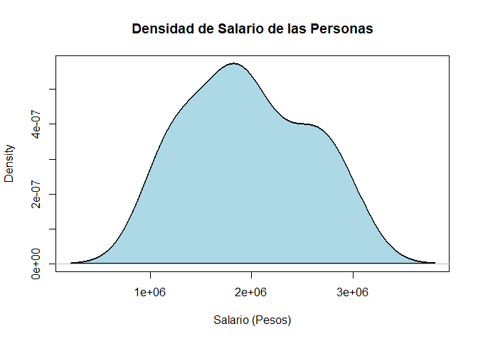
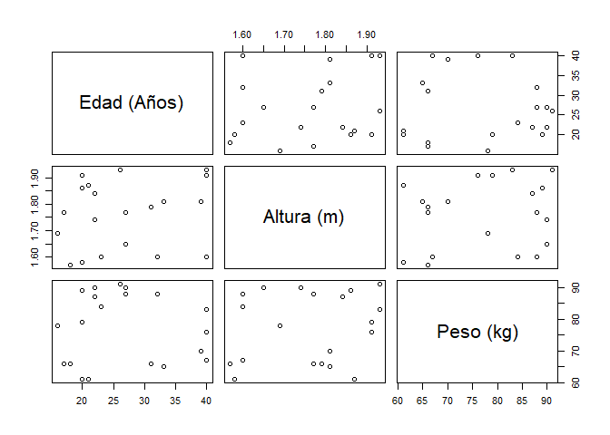

Datos y su estructura
---------------------

Para ilustrar como realizar los diferentes métodos de resúmenes
numéricos, tabulares y gráficos, se empleará la siguiente base de datos
de
[EjemploDescriptiva](https://github.com/jiperezga/jiperezga.github.io/raw/master/Dataset/EjemploDescriptiva.xlsx){:target="\_blank"},
la cual contiene las siguientes variables

-   **<tt>Municipio:</tt>** Municipio de residencia de la persona.
-   **<tt>Estrato:</tt>** Estrato socioeconómico de la vivienda.
-   **<tt>Edad:</tt>** Edad de la persona en años.
-   **<tt>Altura:</tt>** Altura de la persona en metros.
-   **<tt>Peso:</tt>** Peso de la persona en kilogramos.
-   **<tt>Salario:</tt>** Salario devengado por la persona en pesos.
-   **<tt>SatisTrabajo:</tt>** Nivel de satisfacción con el trabajo
    actual.
-   **<tt>DeporFavorito:</tt>** Deporte favorito de la persona.

Los datos contenidos en la base de datos se presentan a continuación:

<pre style="font-family: 'Open Sans',sans-serif; margin-bottom: -3rem; margin-top: -3rem;"><table class="table table-striped" style="width: auto !important; margin-left: auto; margin-right: auto;"><thead><tr><th style="text-align:left;">Municipio</th><th style="text-align:right;">Estrato</th><th style="text-align:right;">Edad</th><th style="text-align:right;">Altura</th><th style="text-align:right;">Peso</th><th style="text-align:right;">Salario</th><th style="text-align:left;">SatisTrabajo</th><th style="text-align:left;">DeporFavorito</th></tr></thead><tbody><tr><td style="text-align:left;">Caldas</td><td style="text-align:right;">5</td><td style="text-align:right;">17</td><td style="text-align:right;">1.77</td><td style="text-align:right;">66</td><td style="text-align:right;">1635100</td><td style="text-align:left;">Muy satisfecho</td><td style="text-align:left;">Fútbol</td></tr><tr><td style="text-align:left;">Bello</td><td style="text-align:right;">4</td><td style="text-align:right;">27</td><td style="text-align:right;">1.65</td><td style="text-align:right;">90</td><td style="text-align:right;">1752500</td><td style="text-align:left;">Insatisfecho</td><td style="text-align:left;">Fútbol</td></tr><tr><td style="text-align:left;">Medellín</td><td style="text-align:right;">1</td><td style="text-align:right;">18</td><td style="text-align:right;">1.57</td><td style="text-align:right;">66</td><td style="text-align:right;">1858400</td><td style="text-align:left;">Satisfecho</td><td style="text-align:left;">Baloncesto</td></tr><tr><td style="text-align:left;">Caldas</td><td style="text-align:right;">4</td><td style="text-align:right;">22</td><td style="text-align:right;">1.84</td><td style="text-align:right;">87</td><td style="text-align:right;">2131400</td><td style="text-align:left;">Muy satisfecho</td><td style="text-align:left;">Fútbol</td></tr><tr><td style="text-align:left;">La Estrella</td><td style="text-align:right;">3</td><td style="text-align:right;">20</td><td style="text-align:right;">1.86</td><td style="text-align:right;">89</td><td style="text-align:right;">1874800</td><td style="text-align:left;">Satisfecho</td><td style="text-align:left;">Tenis</td></tr><tr><td style="text-align:left;">Caldas</td><td style="text-align:right;">3</td><td style="text-align:right;">22</td><td style="text-align:right;">1.74</td><td style="text-align:right;">90</td><td style="text-align:right;">2933100</td><td style="text-align:left;">Muy satisfecho</td><td style="text-align:left;">Fútbol</td></tr><tr><td style="text-align:left;">
Itagüí</td><td style="text-align:right;">1</td><td style="text-align:right;">20</td><td style="text-align:right;">1.91</td><td style="text-align:right;">79</td><td style="text-align:right;">1637200</td><td style="text-align:left;">Muy insatisfecho</td><td style="text-align:left;">Fútbol</td></tr><tr><td style="text-align:left;">La Estrella</td><td style="text-align:right;">3</td><td style="text-align:right;">27</td><td style="text-align:right;">1.77</td><td style="text-align:right;">88</td><td style="text-align:right;">1171200</td><td style="text-align:left;">Indiferente</td><td style="text-align:left;">Baloncesto</td></tr><tr><td style="text-align:left;">Itagüí</td><td style="text-align:right;">2</td><td style="text-align:right;">20</td><td style="text-align:right;">1.58</td><td style="text-align:right;">61</td><td style="text-align:right;">2574700</td><td style="text-align:left;">Muy satisfecho</td><td style="text-align:left;">Baloncesto</td></tr><tr><td style="text-align:left;">Bello</td><td style="text-align:right;">4</td><td style="text-align:right;">39</td><td style="text-align:right;">1.81</td><td style="text-align:right;">70</td><td style="text-align:right;">2739000</td><td style="text-align:left;">Satisfecho</td><td style="text-align:left;">Tenis</td></tr><tr><td style="text-align:left;">La Estrella</td><td style="text-align:right;">6</td><td style="text-align:right;">16</td><td style="text-align:right;">1.69</td><td style="text-align:right;">78</td><td style="text-align:right;">2887800</td><td style="text-align:left;">Indiferente</td><td style="text-align:left;">Baloncesto</td></tr><tr><td style="text-align:left;">Bello</td><td style="text-align:right;">2</td><td style="text-align:right;">40</td><td style="text-align:right;">1.93</td><td style="text-align:right;">83</td><td style="text-align:right;">2559600</td><td style="text-align:left;">Muy satisfecho</td><td style="text-align:left;">Fútbol</td></tr><tr><td style="text-align:left;">Medellín</td><td style="text-align:right;">2</td><td style="text-align:right;">26</td><td style="text-align:right;">1.93</td><td style="text-align:right;">91</td><td style="text-align:right;">1906600</td><td style="text-align:left;">Satisfecho</td><td style="text-align:left;">Fútbol</td></tr><tr><td style="text-align:left;">Medellín</td><td style="text-align:right;">2</td><td style="text-align:right;">21</td><td style="text-align:right;">1.87</td><td style="text-align:right;">61</td><td style="text-align:right;">1299700</td><td style="text-align:left;">Satisfecho
</td><td style="text-align:left;">Baloncesto</td></tr><tr><td style="text-align:left;">Bello</td><td style="text-align:right;">4</td><td style="text-align:right;">23</td><td style="text-align:right;">1.60</td><td style="text-align:right;">84</td><td style="text-align:right;">1950900</td><td style="text-align:left;">Indiferente</td><td style="text-align:left;">Fútbol</td></tr><tr><td style="text-align:left;">Itagüí</td><td style="text-align:right;">3</td><td style="text-align:right;">40</td><td style="text-align:right;">1.91</td><td style="text-align:right;">76</td><td style="text-align:right;">2131900</td><td style="text-align:left;">Satisfecho</td><td style="text-align:left;">Fútbol</td></tr><tr><td style="text-align:left;">La Estrella</td><td style="text-align:right;">6</td><td style="text-align:right;">31</td><td style="text-align:right;">1.79</td><td style="text-align:right;">66</td><td style="text-align:right;">1085400</td><td style="text-align:left;">Indiferente</td><td style="text-align:left;">Voleibol</td></tr><tr><td style="text-align:left;">La Estrella</td><td style="text-align:right;">3</td><td style="text-align:right;">40</td><td style="text-align:right;">1.60</td><td style="text-align:right;">67</td><td style="text-align:right;">1182200</td><td style="text-align:left;">Indiferente</td><td style="text-align:left;">Tenis</td></tr><tr><td style="text-align:left;">Medellín</td><td style="text-align:right;">2</td><td style="text-align:right;">32</td><td style="text-align:right;">1.60</td><td style="text-align:right;">88</td><td style="text-align:right;">2541900</td><td style="text-align:left;">Indiferente</td><td style="text-align:left;">Baloncesto</td></tr><tr><td style="text-align:left;">Caldas</td><td style="text-align:right;">3</td><td style="text-align:right;">33</td><td style="text-align:right;">1.81</td><td style="text-align:right;">65</td><td style="text-align:right;">1333200</td><td style="text-align:left;">Muy satisfecho</td><td style="text-align:left;">Fútbol</td></tr></tbody></table></pre>

### Cargar datos

Para realiza la carga de los datos en <tt>R</tt>, es posible emplear
diferentes funciones, dependiendo si el archivo a cargar se encuentra en
formato <tt>.txt</tt>, <tt>.csv</tt>, <tt>.xls</tt>, <tt>.xlsx</tt>
entre otros.

Para realizar la lectura de archivos en **formato <tt>.txt</tt>**, puede
emplearse la función <tt>read.table()</tt> de la librería `utils` de la
base del <tt>R</tt>.

Para realizar lectura de archivos en **formato <tt>.cvs</tt>**, con coma
(,) como separador de valores y punto (.) como separador decimal, puede
emplearse la función <tt>read.cvs()</tt> de la librería de la librería
`utils` de la base del <tt>R</tt>, mientras que, si la punto (.) es el
separador de valores y la coma (,) el separador decimal, puede emplearse
la función <tt>read.cvs2()</tt> de la librería de la librería `utils` de
la base del <tt>R</tt>.

Para realizar la lectura de archivos en **formato <tt>.xls</tt>**, puede
emplearse la función <tt>read\_xls()</tt> de la librería `readxl`,
mientras que, para leer archivos en **formato <tt>.xlsx</tt>**, puede
emplearse la función <tt>read\_xlsx()</tt> de la librería `readxl`.

Dado que en conjunto de datos empleados en este ejercicio posee un
formato <tt>.xlsx</tt>, se emplea la función <tt>read\_xlsx()</tt> de la
librería `readxl`. En donde se presenta dos métodos de carga. El
primero, para realizar la carga desde un fichero local y la segunda,
para realizar la carga de datos en linea, en donde se emplea
adicionalmente la funcion <tt>tempfile()</tt> de base del <tt>R</tt> y
la función <tt>download.file()</tt> de la librería `utils` de la base
del <tt>R</tt>.

<button id="Show1" class="btn btn-secondary">
Mostrar como cargar datos en <tt>R</tt>
</button>
<button id="Hide1" class="btn btn-info">
Ocultar como cargar datos en <tt>R</tt>
</button>
<main id="botoncito1">
<h3 data-toc-skip>
Carga de datos fichero local
</h3>
<section class="language-r highlighter-rouge">
<section class="highlight">
<pre class="highlight"><code>### Instalar y cargar librerías 
# install.packages(c('readxl'), dependencies = T) # Instala librería
library(readxl)  # Librería para lectura de archivos .xlsx

### Carga archivo
datos &lt;- read_xlsx(file.choose())  # Carga base de datos desde fichero local
</code></pre>
</section>
</section>
<h3 data-toc-skip>
Carga de datos en linea
</h3>
<section class="language-r highlighter-rouge">
<section class="highlight">
<pre class="highlight"><code>### Instalar y cargar librería 
# install.packages('readxl', dependencies = T) # Instala librería
library(readxl)  # Librería para lectura de archivos .xlsx
library(XLConnect)  # Para descargar archivos online de forma temporal

### Crea archivo temporal para cargar archivo online
temp &lt;- tempfile(fileext = ".xlsx")
dataURL &lt;- "https://github.com/jiperezga/jiperezga.github.io/raw/master/Dataset/EjemploDescriptiva.xlsx"
download.file(dataURL, destfile = temp, mode = "wb")

### Carga archivo
datos &lt;- read_xlsx(temp)  # Carga la base de datos online
</code></pre>
</section>
</section>
</main>

### Estructura de datos

El tipo y clase de los datos juega un papel importante al momento de
realizar análisis de los datos, debido a que **su adecuada
especificación será la responsable de que el análisis aplicado a la
variable sea el adecuado**.

Para observa las clases que poseen los datos, podemos emplear la función
<tt>str()</tt>, de la librería `utils` de la base del <tt>R</tt>.

<button id="Show2" class="btn btn-secondary">
Mostrar estructura datos en <tt>R</tt>
</button>
<button id="Hide2" class="btn btn-info">
Ocultar estructura datos en <tt>R</tt>
</button>
<main id="botoncito2">
<h3 data-toc-skip>
Estructura de los datos
</h3>
<section class="language-r highlighter-rouge">
<section class="highlight">
<pre class="highlight"><code># Muestra la estructura de la base de datos
str(datos)
</code></pre>
</section>
</section>
<section class="highlighter-rouge">
<section class="highlight">
<pre class="highlight"><code>Classes 'tbl_df', 'tbl' and 'data.frame':   20 obs. of  8 variables:
 $ Municipio    : chr  "Caldas" "Bello" "Medellín" "Caldas" ...
 $ Estrato      : num  5 4 1 4 3 3 1 3 2 4 ...
 $ Edad         : num  17 27 18 22 20 22 20 27 20 39 ...
 $ Altura       : num  1.77 1.65 1.57 1.84 1.86 1.74 1.91 1.77 1.58 1.81 ...
 $ Peso         : num  66 90 66 87 89 90 79 88 61 70 ...
 $ Salario      : num  1635100 1752500 1858400 2131400 1874800 ...
 $ SatisTrabajo : chr  "Muy satisfecho" "Insatisfecho" "Satisfecho" "Muy satisfecho" ...
 $ DeporFavorito: chr  "Fútbol" "Fútbol" "Baloncesto" "Fútbol" ...
</code></pre>
</section>
</section>
</main>

El papel de una correcta estructura de datos, se debe a que podrían
haber dentro de la base de datos, **variables numéricas tratadas como
factores, factores tratadas como numéricas, variables ordinales tratadas
como si fueran nominales, etc**. Lo cual haría que pueda aplicarse
análisis a las variables de forma indebida, por ejemplo, realizar un
análisis númerico a una variable que realmente es tipo factor, como es
el estrato.

**Para convertir una variable de un clase a otra**, existen una serie de
funciones básicas en la base de <tt>R</tt> que permiten hacer dicho
procedimiento, estas funciones son

-   **<tt>as.numeric()</tt>:** Convierte una variable a tipo numérico
    (double).
-   **<tt>as.logical()</tt>:** Convierte una variable a tipo lógico.
-   **<tt>as.integer()</tt>:** Convierte una variable a tipo entero.
-   **<tt>as.factor()</tt>:** Convierte una variable a tipo factor.
-   **<tt>as.character()</tt>:** Convierte una variable a tipo caracter
    (character).
-   **<tt>as.ordered()</tt>:** Convierte una variable a tipo factor
    asumiendo un orden o jerarquía entre los niveles.

<button id="Show3" class="btn btn-secondary">
Mostrar corrección estructura de datos en <tt>R</tt>
</button>
<button id="Hide3" class="btn btn-info">
Ocultar corrección estructura de datos en <tt>R</tt>
</button>
<main id="botoncito3">
<h3 data-toc-skip>
Corrección de estructura de los datos
</h3>
<section class="language-r highlighter-rouge">
<section class="highlight">
<pre class="highlight"><code>## Transformar variables a factor
datos$Municipio &lt;- as.factor(datos$Municipio)
datos$DeporFavorito &lt;- as.factor(datos$DeporFavorito)

## Trasforma variable a factor ordinal
datos$Estrato &lt;- as.ordered(datos$Estrato)
datos$SatisTrabajo &lt;- as.ordered(datos$SatisTrabajo)

# En caso de que el orden automático no sea el adecuado
datos$SatisTrabajo &lt;- ordered(datos$SatisTrabajo, c("Muy insatisfecho", 
    "Insatisfecho","Indiferente", "Satisfecho", "Muy satisfecho"))
# Muestra la estructura de la base de datos 
str(datos)
</code></pre>
</section>
</section>
<section class="highlighter-rouge">
<section class="highlight">
<pre class="highlight"><code>Classes 'tbl_df', 'tbl' and 'data.frame':   20 obs. of  8 variables:
 $ Municipio    : Factor w/ 5 levels "Bello","Caldas",..: 2 1 5 2 4 2 3 4 3 1 ...
 $ Estrato      : Ord.factor w/ 6 levels "1"<"2"<"3"<"4"<..: 5 4 1 4 3 3 1 3 2 4 ...
 $ Edad         : num  17 27 18 22 20 22 20 27 20 39 ...
 $ Altura       : num  1.77 1.65 1.57 1.84 1.86 1.74 1.91 1.77 1.58 1.81 ...
 $ Peso         : num  66 90 66 87 89 90 79 88 61 70 ...
 $ Salario      : num  1635100 1752500 1858400 2131400 1874800 ...
 $ SatisTrabajo : Ord.factor w/ 5 levels "Muy insatisfecho"<..: 5 2 4 5 4 5 1 3 5 4 ...
 $ DeporFavorito: Factor w/ 4 levels "Baloncesto","Fútbol",..: 2 2 1 2 3 2 2 1 1 3 ...
</code></pre>
</section>
</section>
</main>

Resumen numéricos
-----------------

Una parte importante de la estadística descriptiva, son las medidas
estadísticas ya explicadas en la [Clase
01](../../EstadisticaI/EstIClase01.html){:target="\_blank“} y [Clase
02](../../EstadisticaI/EstIClase02.html){:target=”\_blank"}, y aún más
importante, es buscar la más adecuada para presentar dichas medidas.

Una alternativa para presentar la información contenida en las medidas
estadísticas es mediante resúmenes numéricos, ya que éstos muestran de
forma simple y ordenada de forma simultanea conjunto diferentes medidas
numéricas, para facilitar su presentación, lectura e interpretación.

### Resumen numérico individual

Entre las diferentes funciones que permiten realizar resúmenes numéricos
en <tt>R</tt>, se destaca la función <tt>numSummary()</tt> de la
librería `RcmdrMisc` y la función <tt>describe()</tt> de la librería
`psych`, que presentan diferentes medidas estadísticas para variables
tipo numéricas.

<button id="Show4" class="btn btn-secondary">
Mostrar resumen numérico con <tt>RcmdrMisc</tt>
</button>
<button id="Hide4" class="btn btn-info">
Ocultar resumen numérico con <tt>RcmdrMisc</tt>
</button>
<main id="botoncito4">
<h3 data-toc-skip>
Resumen numérico con librería <tt>RcmdrMisc</tt>
</h3>
<section class="language-r highlighter-rouge">
<section class="highlight">
<pre class="highlight"><code>### Instalar y cargar librería 
# install.packages('RcmdrMisc') # Instala librería RcmdrMisc
library(RcmdrMisc)  # Carga librería RcmdrMisc

# Forma básica numSummary
numSummary(datos$Altura)
</code></pre>
</section>
</section>
<section class="highlighter-rouge">
<section class="highlight">
<pre class="highlight"><code>   mean        sd   IQR   0%    25%  50%    75% 100%  n
 1.7615 0.1256677 0.225 1.57 1.6375 1.78 1.8625 1.93 20
</code></pre>
</section>
</section>
<section class="language-r highlighter-rouge">
<section class="highlight">
<pre class="highlight"><code># Forma avanzada numSummary
numSummary(datos$Altura, statistics = c("mean", "sd", "se", "IQR", "quantiles", 
    "cv", "skewness", "kurtosis"), type = "3", quantiles = c(0, 0.25, 0.5, 0.75, 
    1))
</code></pre>
</section>
</section>
<section class="highlighter-rouge">
<section class="highlight">
<pre class="highlight"><code>   mean        sd   se(mean)   IQR         cv   skewness kurtosis   0%
 1.7615 0.1256677 0.02810015 0.225 0.07134129 -0.2094466 -1.49256 1.57
    25%  50%    75% 100%  n
 1.6375 1.78 1.8625 1.93 20
</code></pre>
</section>
</section>
</main>
<button id="Show5" class="btn btn-secondary">
Mostrar resumen numérico con <tt>psych en <tt>R</tt></tt>
</button>
<button id="Hide5" class="btn btn-info">
Ocultar resumen numérico con <tt>psych en <tt>R</tt></tt>
</button>
<main id="botoncito5">
<h3 data-toc-skip>
Resumen numérico con librería <tt>psych</tt>
</h3>
<section class="language-r highlighter-rouge">
<section class="highlight">
<pre class="highlight"><code>### Instalar y cargar librería 
# install.packages('pysch') # Instala librería pysch
library(psych)  # Carga librería pysch

# Forma básica pysch
describe(datos$Altura)
</code></pre>
</section>
</section>
<section class="highlighter-rouge">
<section class="highlight">
<pre class="highlight"><code>   vars  n mean   sd median trimmed  mad  min  max range  skew kurtosis
X1    1 20 1.76 0.13   1.78    1.76 0.16 1.57 1.93  0.36 -0.21    -1.49
     se
X1 0.03
</code></pre>
</section>
</section>
<section class="language-r highlighter-rouge">
<section class="highlight">
<pre class="highlight"><code># Forma avanzada pysch
describe(datos$Altura, ranges = TRUE, trim = 0.1, type = 3, quant = c(0.25, 
    0.75), IQR = TRUE)
</code></pre>
</section>
</section>
<section class="highlighter-rouge">
<section class="highlight">
<pre class="highlight"><code>  vars  n mean   sd median trimmed  mad  min  max range  skew kurtosis
1    1 20 1.76 0.13   1.78    1.76 0.16 1.57 1.93  0.36 -0.21    -1.49
    se  IQR Q0.25 Q0.75
1 0.03 0.23  1.64  1.86
</code></pre>
</section>
</section>
</main>

### Resumen numérico por grupos

También es posible realizar resúmenes numérico por grupos, en donde,
para la función <tt>numSummary</tt> de la librería `RcmdrMisc`, es
cuestión de agregar el argumento <tt>groups</tt> en donde en este
argumento se definirá la variable tipo **factor** para la cual se desea
realizar el agrupamiento. Mientras que con la librería `psych` es
posible realizar resúmenes numéricos por grupos mediante la función
<tt>describeBy</tt> agregando el argumento <tt>group</tt>, siendo este
argumento definido por una variable tipo **factor**.

<button id="Show6" class="btn btn-secondary">
Mostrar resumen numérico por grupos con <tt>RcmdrMisc</tt>
</button>
<button id="Hide6" class="btn btn-info">
Ocultar resumen numérico por grupos con <tt>RcmdrMisc</tt>
</button>
<main id="botoncito6">
<h3 data-toc-skip>
Resumen numérico por grupos con librería <tt>RcmdrMisc</tt>
</h3>
<section class="language-r highlighter-rouge">
<section class="highlight">
<pre class="highlight"><code># Forma avanzada numSummary por grupos
numSummary(data = datos$Peso, groups = datos$DeporFavorito, statistics = c("mean", 
    "sd", "se", "IQR", "quantiles", "cv", "skewness", "kurtosis"), type = "3", 
    quantiles = c(0, 0.25, 0.5, 0.75, 1))
</code></pre>
</section>
</section>
<section class="highlighter-rouge">
<section class="highlight">
<pre class="highlight"><code>               mean        sd se(mean)   IQR        cv   skewness
Baloncesto 73.66667 12.722683 5.194014 23.25 0.1727061  0.1177989
Fútbol     81.10000  9.550451 3.020118 12.50 0.1177614 -0.5902006
Tenis      75.33333 11.930353 6.887993 11.00 0.1583675  0.3577010
Voleibol   66.00000        NA       NA  0.00        NA        NaN
            kurtosis 0%   25%  50%   75% 100% data:n
Baloncesto -2.111306 61 62.25 72.0 85.50   88      6
Fútbol     -1.277242 65 76.75 83.5 89.25   91     10
Tenis      -2.333333 67 68.50 70.0 79.50   89      3
Voleibol         NaN 66 66.00 66.0 66.00   66      1
</code></pre>
</section>
</section>
</main>
<button id="Show7" class="btn btn-secondary">
Mostrar resumen numérico por grupos con <tt>psych</tt> en <tt>R</tt>
</button>
<button id="Hide7" class="btn btn-info">
Ocultar resumen numérico por grupos con <tt>psych</tt> en <tt>R</tt>
</button>
<main id="botoncito7">
<h3 data-toc-skip>
Resumen numérico por grupos con librería <tt>psych</tt>
</h3>
<section class="language-r highlighter-rouge">
<section class="highlight">
<pre class="highlight"><code># Forma avanzada pysch por grupos
describeBy(x = datos$Peso, group = datos$DeporFavorito, ranges = TRUE, trim = 0.2, 
    type = 3, quant = c(0.25, 0.75), IQR = TRUE)
</code></pre>
</section>
</section>
<section class="highlighter-rouge">
<section class="highlight">
<pre class="highlight"><code> Descriptive statistics by group 
group: Baloncesto
  vars n  mean    sd median trimmed   mad min max range skew kurtosis   se
1    1 6 73.67 12.72     72   73.25 16.31  61  88    27 0.12    -2.11 5.19
    IQR Q0.25 Q0.75
1 23.25 62.25  85.5
-------------------------------------------------------- 
group: Fútbol
  vars  n mean   sd median trimmed  mad min max range  skew kurtosis   se
1    1 10 81.1 9.55   83.5   83.17 9.64  65  91    26 -0.59    -1.28 3.02
   IQR Q0.25 Q0.75
1 12.5 76.75 89.25
-------------------------------------------------------- 
group: Tenis
  vars n  mean    sd median trimmed  mad min max range skew kurtosis   se
1    1 3 75.33 11.93     70   75.33 4.45  67  89    22 0.36    -2.33 6.89
  IQR Q0.25 Q0.75
1  11  68.5  79.5
-------------------------------------------------------- 
group: Voleibol
  vars n mean sd median trimmed mad min max range skew kurtosis se IQR
1    1 1   66 NA     66      66   0  66  66     0   NA       NA NA   0
  Q0.25 Q0.75
1    66    66
</code></pre>
</section>
</section>
</main>

Resumen tabular
---------------

Una forma convencional de presentar resúmenes de variables cualitativas,
es mediante la construcción de tablas de frecuencias, las cuales
permiten presentar de **forma individual** (una vía) algunas de las
características que poseen las variables cualitativas, o de **forma
conjunta** (dos vías) algunas de las características que comparten
dichas variables.

### Tabla de frecuencias absolutas

Para presentar de forma individual o grupal las características de las
variables, puede ser empleada la función <tt>table()</tt> de la base de
<tt>R</tt>, la cual agrega la información presentada en de las variables
de una forma simple, mediante una tabla que presenta el número
**(frecuencia absoluta)** de observaciones que pertenecesn a una
categoría. Se aconseja que los datos usados dentro de la
función<tt>table()</tt> sean de tipo *factor*.

Adicionalmente, es posible agregar los totales a las tablas mediante el
empleo de la función <tt>addmargins</tt> de la librería base de
<tt>R</tt>.

<button id="Show8" class="btn btn-secondary">
Mostrar tabla de frecuencias absolutas una vía en <tt>R</tt>
</button>
<button id="Hide8" class="btn btn-info">
Ocultar tabla de frecuencias absolutas una vía en <tt>R</tt>
</button>
<main id="botoncito8">
<h3 data-toc-skip>
Tabla de frecuencias absoluta una vía
</h3>
<section class="language-r highlighter-rouge">
<section class="highlight">
<pre class="highlight"><code># Creación de tabla de frecuencias absolutas en una vía
tabla1via &lt;- table(datos$Municipio)
tabla1via
</code></pre>
</section>
</section>
<section class="highlighter-rouge">
<section class="highlight">
<pre class="highlight"><code>      Bello      Caldas      Itagüí La Estrella    Medellín 
          4           4           3           5           4 
</code></pre>
</section>
</section>
<h3 data-toc-skip>
Tabla de frecuencias absoluta una vía con totales
</h3>
<section class="language-r highlighter-rouge">
<section class="highlight">
<pre class="highlight"><code># Agrega las sumas totales a la tabla de frecuencias absolutas en una vía
addmargins(tabla1via)
</code></pre>
</section>
</section>
<section class="highlighter-rouge">
<section class="highlight">
<pre class="highlight"><code>      Bello      Caldas      Itagüí La Estrella    Medellín         Sum 
          4           4           3           5           4          20 
</code></pre>
</section>
</section>
</main>
<button id="Show9" class="btn btn-secondary">
Mostrar tabla de frecuencias absolutas dos vías en <tt>R</tt>
</button>
<button id="Hide9" class="btn btn-info">
Ocultar tabla de frecuencias absolutas dos vías en <tt>R</tt>
</button>
<main id="botoncito9">
<h3 data-toc-skip>
Tabla de frecuencias absoluta dos vías
</h3>
<section class="language-r highlighter-rouge">
<section class="highlight">
<pre class="highlight"><code># Creación de tabla de frecuencias absolutas en dos vía
tabla2vias &lt;- table(datos$Municipio, datos$DeporFavorito)
tabla2vias
</code></pre>
</section>
</section>
<section class="highlighter-rouge">
<section class="highlight">
<pre class="highlight"><code>              Baloncesto Fútbol Tenis Voleibol
  Bello                0      3     1        0
  Caldas               0      4     0        0
  Itagüí               1      2     0        0
  La Estrella          2      0     2        1
  Medellín             3      1     0        0
</code></pre>
</section>
</section>
<h3 data-toc-skip>
Tabla de frecuencias absoluta dos vías con totales
</h3>
<section class="language-r highlighter-rouge">
<section class="highlight">
<pre class="highlight"><code># Agrega las sumas totales a la tabla de frecuencias absolutas
# en dos vías, por fila y/o columna
addmargins(tabla2vias, margin = c(1, 2))  # margin = 1 en filas, margin = 2 en columnas
</code></pre>
</section>
</section>
<section class="highlighter-rouge">
<section class="highlight">
<pre class="highlight"><code>              Baloncesto Fútbol Tenis Voleibol Sum
  Bello                0      3     1        0   4
  Caldas               0      4     0        0   4
  Itagüí               1      2     0        0   3
  La Estrella          2      0     2        1   5
  Medellín             3      1     0        0   4
  Sum                  6     10     3        1  20
</code></pre>
</section>
</section>
</main>

### Tabla de frecuencias relativa

Una alternativa para presentar la información contenida dentro de una
variable categórica, es mediante la presentación de tablas de
frecuencias relativas, las cuales muestran **el valor porcentual al que
equivale una categoría específica**.

Para la realización de tablas de frecuencias relativas, se emplea la
función <tt>prop.table(tabla)</tt> de base de <tt>R</tt>, en donde
**<tt>tabla</tt> hace referencia a la tabla de frecuencias absolutas
creada anteriormente en la subsección anterior**.

<button id="Show10" class="btn btn-secondary">
Mostrar tabla de frecuencias relativas una vía en <tt>R</tt>
</button>
<button id="Hide10" class="btn btn-info">
Ocultar tabla de frecuencias relativas una vía en <tt>R</tt>
</button>
<main id="botoncito10">
<h3 data-toc-skip>
Tabla de frecuencias relativas una vía
</h3>
<section class="language-r highlighter-rouge">
<section class="highlight">
<pre class="highlight"><code># Creación de tablas de frecuencias relativas en una vía
prop1via &lt;- prop.table(tabla1via)
prop1via
</code></pre>
</section>
</section>
<section class="highlighter-rouge">
<section class="highlight">
<pre class="highlight"><code>      Bello      Caldas      Itagüí La Estrella    Medellín 
       0.20        0.20        0.15        0.25        0.20
</code></pre>
</section>
</section>
<h3 data-toc-skip>
Tabla de frecuencias absoluta una vía con totales
</h3>
<section class="language-r highlighter-rouge">
<section class="highlight">
<pre class="highlight"><code># Agrega las sumas totales a la tabla de frecuencias relativas en una vía
addmargins(prop1via)
</code></pre>
</section>
</section>
<section class="highlighter-rouge">
<section class="highlight">
<pre class="highlight"><code>      Bello      Caldas      Itagüí La Estrella    Medellín         Sum 
       0.20        0.20        0.15        0.25        0.20        1.00 
</code></pre>
</section>
</section>
</main>
<button id="Show11" class="btn btn-secondary">
Mostrar tabla de frecuencias relativas dos vías en <tt>R</tt>
</button>
<button id="Hide11" class="btn btn-info">
Ocultar tabla de frecuencias relativas dos vías en <tt>R</tt>
</button>
<main id="botoncito11">
<h3 data-toc-skip>
Tabla de frecuencias relativas dos vías
</h3>
<section class="language-r highlighter-rouge">
<section class="highlight">
<pre class="highlight"><code># Creación de tabla de frecuencias relativas en dos vías
prop2vias &lt;- prop.table(tabla2vias)
prop2vias
</code></pre>
</section>
</section>
<section class="highlighter-rouge">
<section class="highlight">
<pre class="highlight"><code>              Baloncesto Fútbol Tenis Voleibol
  Bello             0.00   0.15  0.05     0.00
  Caldas            0.00   0.20  0.00     0.00
  Itagüí            0.05   0.10  0.00     0.00
  La Estrella       0.10   0.00  0.10     0.05
  Medellín          0.15   0.05  0.00     0.00
</code></pre>
</section>
</section>

                 
                  Baloncesto Fútbol Tenis Voleibol
      Bello             0.00   0.15  0.05     0.00
      Caldas            0.00   0.20  0.00     0.00
      Itagüí            0.05   0.10  0.00     0.00
      La Estrella       0.10   0.00  0.10     0.05
      Medellín          0.15   0.05  0.00     0.00

<h3 data-toc-skip>
Tabla de frecuencias relativas dos vías con totales
</h3>
<section class="language-r highlighter-rouge">
<section class="highlight">
<pre class="highlight"><code># Agrega las sumas totales a la tabla de frecuencias relativas en dos vías
# por fila y/o columna
addmargins(prop2vias, margin = c(1, 2))
</code></pre>
</section>
</section>
<section class="highlighter-rouge">
<section class="highlight">
<pre class="highlight"><code>              Baloncesto Fútbol Tenis Voleibol  Sum
  Bello             0.00   0.15  0.05     0.00 0.20
  Caldas            0.00   0.20  0.00     0.00 0.20
  Itagüí            0.05   0.10  0.00     0.00 0.15
  La Estrella       0.10   0.00  0.10     0.05 0.25
  Medellín          0.15   0.05  0.00     0.00 0.20
  Sum               0.30   0.50  0.15     0.05 1.00
</code></pre>
</section>
</section>
</main>

Análisis gráfico
----------------

Otro aspecto importante del análisis descriptivo, es el que se realiza
mediante análisis gráfico. **El análisis gráfico es una forma de
simplificar lo tedioso y complejo de un conjunto de observaciones**,
además de ser una forma más accesible de presentación de la información
cuando se tienen muchas variables, puesto que permiten mostrar el
comportamiento de los datos presentados, y hacer juicios respecto a su
tendencia central, variabilidad, formas, patrones, tendencias, etc.

El análisis gráfico, puede ser dividido en

-   Gráficos para una o más variables cuantitativas
-   Gráficos para una o más variables cualitativas
-   Gráficos para variables cuantitativas y cualitativas

### Gráficos para una o más variables cuantitativas

Entre las gráficos básicos que permiten realizar análisis cuantitativo
para **una variable** se tiene, al diagrama de tallo y hojas, gráfico de
caja y bigotes, histograma y densidad. Mientras que, las gráficos
básicos que permiten realizar análisis cuantitativo para **varias
variables** se tiene, el gráfico de dispersión cuando se tienen solo dos
variables y la matriz de dispersión cuando se tienen más de dos
variables.

#### Diagrama de tallo y hojas

Este gráfico sirve como medida de resumen de los datos, **brinda
información de valores máximos, mínimos, área en donde más se centran
los datos, dispersión, datos atípicos y asimetría**. A pesar de toda la
información que puede brindar esta gráfica, su uso es muy limitado, ya
que en situaciones en las cuales el rango de la variable es muy grande,
ésta no permite visualidad con claridad dichos comportamientos. Este
gráfico puede ser realizado mediante la función <tt>stem()</tt> de la
librería `graphics` de la base del <tt>R</tt>.

<button id="Show12" class="btn btn-secondary">
Mostrar diagrama de tallo y hojas en <tt>R</tt>
</button>
<button id="Hide12" class="btn btn-info">
Ocultar diagrama de tallo y hojas en <tt>R</tt>
</button>
<main id="botoncito12">
<h3 data-toc-skip>
Diagrama de tallo y hojas
</h3>
<section class="language-r highlighter-rouge">
<section class="highlight">
<pre class="highlight"><code># Construcción de diagrama de tallo y hojas
stem(datos$Edad)
</code></pre>
</section>
</section>
<section class="highlighter-rouge">
<section class="highlight">
<pre class="highlight"><code>  The decimal point is 1 digit(s) to the right of the |

  1 | 678
  2 | 0001223
  2 | 677
  3 | 123
  3 | 9
  4 | 000
</code></pre>
</section>
</section>
</main>

#### Gráfico de caja y bigotes (BoxPlot)

Este gráfico sirve para presentar de forma visual, datos numéricos a
través de sus cuartiles, además de presentar otras **características
importantes, tales como el valor de los cuartiles, dispersión, simetría
y datos potencialmente atípicos**.

<h4 align="center">
Representación de un Gráfico de Caja y Bigotes
</h4>

Este gráfico puede ser realizado mediante la función <tt>boxplot()</tt>
de la librería `graphics` de la base del <tt>R</tt>.

<button id="Show13" class="btn btn-secondary">
Mostrar gráfico de caja y bigotes en <tt>R</tt>
</button>
<button id="Hide13" class="btn btn-info">
Ocultar gráfico de caja y bigotes en <tt>R</tt>
</button>
<main id="botoncito13">
<h3 data-toc-skip>
Gráfico de caja y bigotes
</h3>
<section class="language-r highlighter-rouge">
<section class="highlight">
<pre class="highlight"><code># Construcción de gráfico de caja y bigotes
boxplot(datos$Peso, horizontal = T, xlab = "Peso (kg)", main = "Boxplot del Peso de las Personas", 
    col = "lightblue")
</code></pre>
</section>
</section>

</main>

Adicionalmente puede agregarse el argumento <tt>notch = TRUE</tt>, lo
cual provoca una muesca en cada lado de la caja. McGill, Tukey, & Larsen
(1978) señala que **estas muescas representan un intervalo del 95% de
confianza alrededor de la mediana**, y que son construidas a partir de
la ecuación

`\begin{align*} \tilde{X}\pm 1.57\times \frac{IQR}{\sqrt{n}} \end{align*}`

<button id="Show24" class="btn btn-secondary">
Mostrar gráfico de caja y bigotes con intervalo de confianza para la
mediana en <tt>R</tt>
</button>
<button id="Hide24" class="btn btn-info">
Ocultar gráfico de caja y bigotes con intervalo de confianza para la
mediana en <tt>R</tt>
</button>
<main id="botoncito24">
<h3 data-toc-skip>
Gráfico de caja y bigotes con intervalo de confianza del 95% para la
mediana
</h3>
<section class="language-r highlighter-rouge">
<section class="highlight">
<pre class="highlight"><code># Construcción de gráfico de caja y bigotes
# con intervalo del 95% para la mediana
boxplot(datos$Peso, horizontal = T, xlab = "Peso (kg)", main = "Boxplot del Peso de las Personas", 
    col = "lightblue", notch = T)
</code></pre>
</section>
</section>

</main>

#### Histograma

Este gráfico muestra la distribución de frecuencia o densidades del
grupo de observaciones, **brinda información sobre el valor más
probables, la dispersión, la asimetría y valores extremos**.
Adicionalmente, tiene la ventaja de que su interpretación es muy
intuitiva y por tanto es de los gráficos más preferidos para resumir
información. Este gráfico puede ser realizado mediante la función
<tt>hist()</tt> de la librería `graphics` de la base del <tt>R</tt>.

<button id="Show14" class="btn btn-secondary">
Mostrar histograma en <tt>R</tt>
</button>
<button id="Hide14" class="btn btn-info">
Ocultar histograma en <tt>R</tt>
</button>
<main id="botoncito14">
<h3 data-toc-skip>
Histograma
</h3>
<section class="language-r highlighter-rouge">
<section class="highlight">
<pre class="highlight"><code>## Construcción de histograma de frecuencias
hist(datos$Altura, main = "Histograma de Altura de las Personas", xlab = "Altura (m)", 
    col = "lightblue", freq = T)
</code></pre>
</section>
</section>

</main>

#### Densidad

Este gráfico funciona similar al histograma de densidades, con la
diferencia de que en lugar de mostrar la distribución mediante clases
(barras), éste muestra el comportamiento de la distribución de las
observaciones mediante una curva. Dicha curva, brinda mayor información
que el histograma respecto al valor promedio, dispersión y asimetría.
Este gráfico puede ser realizado mediante la combinación de las
funciones <tt>plot()</tt> y <tt>density()</tt>, de la forma
<tt>plot(density())</tt>, siendo <tt>plot()</tt> y <tt>density()</tt>
funciones de las librerías `graphics` y `stats` de la base de
<tt>R</tt>.

Adicionalmente se presenta la función <tt>polygon</tt> de la librería
`graphics` de la base de <tt>R</tt>, la cual sirve para generar formas,
o en este caso, darle color a la densidad.

<button id="Show15" class="btn btn-secondary">
Mostrar densidad en <tt>R</tt>
</button>
<button id="Hide15" class="btn btn-info">
Ocultar densidad en <tt>R</tt>
</button>
<main id="botoncito15">
<h3 data-toc-skip>
Densidad
</h3>
<section class="language-r highlighter-rouge">
<section class="highlight">
<pre class="highlight"><code>## Construcción de la densidad
plot(density(datos$Salario), main = "Densidad de Salario de las Personas", xlab = "Salario (Pesos)", 
    lwd = 2)
# Colorea la densidad
polygon(density(datos$Salario), col = "lightblue")
</code></pre>
</section>
</section>

</main>

#### Gráfico de dispersión

Este gráfico se emplea para hacer cruces entre dos variables
cuantitativas, y **sirve para ver tendencias y relaciones entre dos
variables cuantitativas, además de permitir apreciar donde se centra el
total de observaciones** dados dos atributos cuantitativos. Este gráfico
puede ser realizado mediante la función <tt>plot()</tt> de la librería
`graphics` de la base del <tt>R</tt>.

<button id="Show16" class="btn btn-secondary">
Mostrar gráfico de dispersión en <tt>R</tt>
</button>
<button id="Hide16" class="btn btn-info">
Ocultar gráfico de dispersión en <tt>R</tt>
</button>
<main id="botoncito16">
<h3 data-toc-skip>
Gráfico de dispersión
</h3>
<section class="language-r highlighter-rouge">
<section class="highlight">
<pre class="highlight"><code>plot(x = datos$Altura, y = datos$Salario, xlab = "Altura (m)", ylab = "Salario (Pesos)", 
    main = "Relación entre Altura y Salario", pch = 19)
</code></pre>
</section>
</section>

</main>

#### Matriz de dispersión

Cuando se poseen más de dos variables cuantitativas, es posible
presentar un matriz que muestre el cruce entre pares de variables,
mediante cuadros con versiones simples de la función <tt>plot()</tt>.
Este gráfico puede ser realizado mediante la función <tt>pairs()</tt> de
la librería `graphics` de la base de <tt>R</tt>.

<button id="Show17" class="btn btn-secondary">
Mostrar matriz de dispersión en <tt>R</tt>
</button>
<button id="Hide17" class="btn btn-info">
Ocultar matriz de dispersión en <tt>R</tt>
</button>
<main id="botoncito17">
<h3 data-toc-skip>
Matríz de dispersión básica
</h3>
<section class="language-r highlighter-rouge">
<section class="highlight">
<pre class="highlight"><code>## Matríz de dispersión básica
pairs(cbind(datos$Edad, datos$Altura, datos$Peso), labels = c("Edad (Años)", 
    "Altura (m)", "Peso (kg)"))
</code></pre>
</section>
</section>

<h3 data-toc-skip>
Matríz de dispersión avanzada
</h3>

Funciones complementarias pueden ser desarrolladas para mejorar la
visualización los pares de variables. En el libro de Hernández & Correa
(2018, pp. 40–49), se presentan diferentes funciones que pueden ser
implementadas. Entre ellas

<section class="language-r highlighter-rouge">
<section class="highlight">
<pre class="highlight"><code># Función para dibujar la dispersión y agregar la recta de regresión
panel.reg &lt;- function(x, y) {
    points(x, y, pch = 20)
    abline(lm(y ~ x), lwd = 2, col = "dodgerblue2")
}
# Función para crear el histograma
panel.hist &lt;- function(x, ...) {
    usr &lt;- par("usr")
    on.exit(par(usr))
    par(usr = c(usr[1:2], 0, 1.5))
    h &lt;- hist(x, plot = FALSE)
    breaks &lt;- h$breaks
    nB &lt;- length(breaks)
    y &lt;- h$counts
    y &lt;- y/max(y)
    rect(breaks[-nB], 0, breaks[-1], y, col = "dodgerblue2", ...)
}
# Función para obtener la correlación
panel.cor &lt;- function(x, y, digits = 2, prefix = "", cex.cor) {
    usr &lt;- par("usr")
    on.exit(par(usr))
    par(usr = c(0, 1, 0, 1))
    r &lt;- abs(cor(x, y))
    txt &lt;- format(c(r, 0.123456789), digits = digits)[1]
    txt &lt;- paste(prefix, txt, sep = "")
    if (missing(cex.cor)) 
        cex &lt;- 0.8/strwidth(txt)
    text(0.5, 0.5, txt, cex = cex * r)
}

pairs(cbind(datos$Edad, datos$Altura, datos$Peso), labels = c("Edad (Años)", 
    "Altura (m)", "Peso (kg)"), upper.panel = panel.reg, diag.panel = panel.hist, 
    lower.panel = panel.cor)
</code></pre>
</section>
</section>

</main>

### Gráficos para variables cualitativas

Entre las gráficos básicos que permiten realizar análisis cualitativo
para una o dos variables, se tiene el gráfico de barras, gráfico pareto,
gráfico de pastel, y gráfico de puntos.

#### Gráfico de barras

Sirve para resumir una o dos variables cualitativas mediante barras de
frecuencias absolutas o relativas. Éste **permite observar la
concentración de observaciones en una o más categorías diferentes**.
Este gráfico puede ser realizado mediante la función <tt>barplot()</tt>
de la librería `graphics` de la base de <tt>R</tt>.

Oara realizar estas gráficas deben usarse como insumo, las tablas de
frecuencias absolutas o relativas construidas previamente en la
subsección de [Resumen
tabular](https://jiperezga.github.io//EstadisticaI/EstIClase03.html#resumen-tabular){:target="\_blank"}.

<button id="Show18" class="btn btn-secondary">
Mostrar gráfico de barras para una variable en <tt>R</tt>
</button>
<button id="Hide18" class="btn btn-info">
Ocultar gráfico de barras para una variable en <tt>R</tt>
</button>
<main id="botoncito18">
<h3 data-toc-skip>
Gráfico de barras una variable para frecuencias absoluta
</h3>
<section class="language-r highlighter-rouge">
<section class="highlight">
<pre class="highlight"><code># Gráfico de barras para una variable de frecuencias absolutas
barplot(tabla1via, main = "Frecuencias absolutas de los Municipios", col = hcl.colors(5))
</code></pre>
</section>
</section>

<h3 data-toc-skip>
Gráfico de barras una variable para frecuencias relativas
</h3>
<section class="language-r highlighter-rouge">
<section class="highlight">
<pre class="highlight"><code># Gráfico de barras para una variable de frecuencias relativas
barplot(tabla1via, main = "Frecuencias relativas de los Municipios", col = rainbow(5))
</code></pre>
</section>
</section>

</main>

Adicionalmente, **cuando se emplean dos variables cualitativas en la
construcción del diagrama de barras, es necesario establecer etiqueta**
para las variables que representa cada barra. Dichas etiquetas se
establecen mediante la función <tt>legend()</tt> de la librería
`graphics` de la base de <tt>R</tt>.

<button id="Show19" class="btn btn-secondary">
Mostrar gráfico de barras para dos variables en <tt>R</tt>
</button>
<button id="Hide19" class="btn btn-info">
Ocultar gráfico de barras para dos variables en <tt>R</tt>
</button>
<main id="botoncito19">
<h3 data-toc-skip>
Gráfico de barras dos variables para frecuencias absolutas
</h3>
<section class="language-r highlighter-rouge">
<section class="highlight">
<pre class="highlight"><code># Gráfico de barras para dos variables para frecuencias absolutas
barplot(tabla2vias, main = "Frecuencias absolutas categorías de Deporte por Municipio", 
    col = topo.colors(5), beside = T)
legend("topright", rownames(tabla2vias), fill = topo.colors(5))
</code></pre>
</section>
</section>

<h3 data-toc-skip>
Gráfico de barras dos variables para frecuencias relativas
</h3>
<section class="language-r highlighter-rouge">
<section class="highlight">
<pre class="highlight"><code># Gráfico de barras para dos variables para frecuencias relativas
barplot(prop2vias, main = "Frecuencias relativa categorías de Deporte por Municipio", 
    col = terrain.colors(5), beside = T)
legend("topright", rownames(prop2vias), fill = terrain.colors(5))
</code></pre>
</section>
</section>

</main>

#### Gráfico de pareto

Este gráfico es similar al gráfico de barras para una sola variable
cualitativa, pero con la ventaja de que **presenta las frecuencias
absolutas, relativas, y las frecuencias acumuladas absolutas y
acumuladas relativas en el mismo gráfico**. Este gráfico puede ser
realizado mediante la función <tt>pareto.chart()</tt> de la librería
`qqc`, usando como insumo las tablas de frecuencias absolutas
construidas previamente en la subsección de [Resumen
tabular](https://jiperezga.github.io//EstadisticaI/EstIClase03.html#resumen-tabular){:target="\_blank"}.

<button id="Show20" class="btn btn-secondary">
Mostrar gráfico de pareto una variable cualitativa en <tt>R</tt>
</button>
<button id="Hide20" class="btn btn-info">
Ocultar gráfico de pareto una variable cualitativa en <tt>R</tt>
</button>
<main id="botoncito20">
<h3 data-toc-skip>
Gráfico de pareto una variable cualitativa
</h3>
<section class="language-r highlighter-rouge">
<section class="highlight">
<pre class="highlight"><code>## Instalar y cargar 
# install.packages('qcc') # Instala librería qcc
library(qcc)  # Carga librería qcc

# Gráfico de pareto para una variable cualitativa
pareto.chart(tabla1via, main = "Gráfico Pareto para los Municipios")
</code></pre>
</section>
</section>

<section class="highlighter-rouge">
<section class="highlight">
<pre class="highlight"><code>Pareto chart analysis for tabla1via
              Frequency Cum.Freq. Percentage Cum.Percent.
  La Estrella         5         5         25           25
  Bello               4         9         20           45
  Caldas              4        13         20           65
  Medellín            4        17         20           85
  Itagüí              3        20         15          100
</code></pre>
</section>
</section>
</main>

#### Gráfico de pastel

Este gráfico también **sirve para representar gráficamente las tablas de
frecuencias absolutas y relativas para una variable cualitativa**. A
pesar de ser un gráfico muy usado en la práctica, **no muestra bien la
información que se desea presentar**, ya que siempre debe estar
acompañado de los porcentajes o frecuencias que representa cada área, ya
que no hacerlo, dicho gráfico puede ser muy engañoso.

Este gráfico puede ser realizado mediante la función <tt>pie()</tt> de
la librería `graphics` de la base de <tt>R</tt>, usando como insumo, las
tablas de frecuencias absolutas construidas previamente en la subsección
de [Resumen
tabular](https://jiperezga.github.io//EstadisticaI/EstIClase03.html#resumen-tabular){:target="\_blank"}.

Mientras que las etiquetas de los porcentales o frecuencias de cada
área, puede establecerse mediante la función <tt>legend()</tt> de la
librería `graphics` de la base de <tt>R</tt>.

<button id="Show21" class="btn btn-secondary">
Mostrar gráfico de pastel para una variable en <tt>R</tt>
</button>
<button id="Hide21" class="btn btn-info">
Ocultar gráfico de pastel para una variable en <tt>R</tt>
</button>
<main id="botoncito21">
<h3 data-toc-skip>
Gráfico de barras una variable para frecuencias absoluta
</h3>
<section class="language-r highlighter-rouge">
<section class="highlight">
<pre class="highlight"><code># Gráfico de pastel una variable de frecuencias absolutas
pie(tabla1via, main = "Frecuencias absolutas por Municipio", col = cm.colors(5))
legend("topleft", legend = round(prop1via, 4), fill = cm.colors(5))
</code></pre>
</section>
</section>

<h3 data-toc-skip>
Gráfico de barras una variable para frecuencias relativas
</h3>
<section class="language-r highlighter-rouge">
<section class="highlight">
<pre class="highlight"><code># Gráfico de pastel una variable de frecuencias relativas
pie(prop1via, main = "Frecuencia Relativa por Municipio", col = hcl.colors(5))
legend("topleft", legend = round(prop1via, 4), fill = hcl.colors(5))
</code></pre>
</section>
</section>

</main>

#### Gráfico de puntos

Este gráfico también es similar al gráfico de barras, **sirve para
presentar las frecuencias absolutas o relativas de una variable
cualitativa o un cruce de dos variables cualitativas**, y **muestra un
punto que representa el conteo del total de observaciones que hay para
cada variable**. Este gráfico puede ser realizado mediante la función
<tt>dotchart()</tt> de la librería `graphics` de la base de <tt>R</tt>,
usando como insumo las tablas de frecuencias absolutas construidas
previamente en la subsección de [Resumen
tabular](https://jiperezga.github.io//EstadisticaI/EstIClase03.html#resumen-tabular){:target="\_blank"}.

<button id="Show22" class="btn btn-secondary">
Mostrar gráfico de puntos para una variable en <tt>R</tt>
</button>
<button id="Hide22" class="btn btn-info">
Ocultar gráfico de puntos para una variable en <tt>R</tt>
</button>
<main id="botoncito22">
<h3 data-toc-skip>
Gráfico de puntos para una variable de frecuencias absolutas
</h3>
<section class="language-r highlighter-rouge">
<section class="highlight">
<pre class="highlight"><code># Gráfico de puntos para una variable de frecuencias absolutas
dotchart(tabla1via, main = "Frecuencias absolutas de categorías por Municipio")
</code></pre>
</section>
</section>

<h3 data-toc-skip>
Gráfico de puntos para una variable de frecuencias relativas
</h3>
<section class="language-r highlighter-rouge">
<section class="highlight">
<pre class="highlight"><code># Gráfico de puntos para una variable de frecuencias relativas
dotchart(prop1via, main = "Frecuencias relativas de categorías por Municipio")
</code></pre>
</section>
</section>

</main>
<button id="Show23" class="btn btn-secondary">
Mostrar gráfico de puntos para dos variables en <tt>R</tt>
</button>
<button id="Hide23" class="btn btn-info">
Ocultar gráfico de puntos para dos variables en <tt>R</tt>
</button>
<main id="botoncito23">
<h3 data-toc-skip>
Gráfico de puntos para dos variables de frecuencias absolutas
</h3>
<section class="language-r highlighter-rouge">
<section class="highlight">
<pre class="highlight"><code># Gráfico de barras para dos variables para frecuencias absolutas
dotchart(tabla2vias, main = "Frecuencias absolutas de categorías de Deporte por Municipio")
</code></pre>
</section>
</section>

<h3 data-toc-skip>
Gráfico de puntos para dos variables de frecuencias relativas
</h3>
<section class="language-r highlighter-rouge">
<section class="highlight">
<pre class="highlight"><code># Gráfico de barras para dos variables para frecuencias relativas
dotchart(prop2vias, main = "Frecuencias relativas de categorías de Deporte por Municipio")
</code></pre>
</section>
</section>

</main>

### Gráficos para variables cuantitativas y cualitativas

Entre las gráficos básicos que permiten analizar los cruces entre
variables cuantitativas y cualitativas se tiene, al gráfico de caja y
bigotes, gráfico de medias, diagrama de dispersión.

#### Gráfico de caja y bigotes

Este gráfico sirve para presentar de forma visual, datos numéricos **por
categorías** a través de sus cuartiles, además de presentar **otras
características importantes, tales como la dispersión, simetría y datos
potencialmente atípicos**. Este gráfico puede ser realizado mediante la
función `boxplot()` de la librería `graphics` de <tt>R</tt>.

<button id="Show25" class="btn btn-secondary">
Mostrar gráfico de caja y bigotes en <tt>R</tt>
</button>
<button id="Hide25" class="btn btn-info">
Ocultar gráfico de caja y bigotes en <tt>R</tt>
</button>
<main id="botoncito25">
<h3 data-toc-skip>
Gráfico de caja y bigotes
</h3>

<pre class="highlight"><code># Construcción de gráfico de caja y bigotes por categorías
boxplot(datos$Altura ~ datos$Estrato, horizontal = T, xlab = "Altura (m)", ylab = "Estratos", 
    main = "Boxplot de Altura de las personas por Estrato", col = terrain.colors(6))
</code></pre>

</main>

También puede agregarse el argumento `notch = TRUE`, para construir un
intervalo de confianza del `$95%$` para la mediana, lo cual hace que se
grafique una muesca en cada lado de la caja, alrededor de la mediana. En
donde, si las muescas de dos parcelas no se superponen, entonces se
tendrá evidencia sólida respecto a que la mediana de los grupos es
diferente (Chambers, Cleveland, Kleiner, & Tukey, 1983, p. 62).

<button id="Show26" class="btn btn-secondary">
Mostrar gráfico de caja y bigotes con intervalo de confianza para la
mediana en <tt>R</tt>
</button>
<button id="Hide26" class="btn btn-info">
Ocultar gráfico de caja y bigotes con intervalo de confianza para la
mediana en <tt>R</tt>
</button>
<main id="botoncito26">
<h3 data-toc-skip>
Gráfico de caja y bigotes con intervalo de confianza del 95% para la
mediana
</h3>

<pre class="highlight"><code># Construcción de diagrama de caja y bigotes por categorías con intervalo
# del 95% para la mediana
boxplot(datos$Altura ~ datos$Estrato, horizontal = T, xlab = "Altura (m)", ylab = "Estratos", 
    main = "Boxplot de Altura de las personas por Estrato", col = topo.colors(6), 
    notch = T)
</code></pre>

</main>

#### Gráfico de medias

Este gráfico **sirve para presentar de forma visual, grupos de datos
numéricos a través de sus media y desviación estándar**. El gráfico está
compuesto por un punto que representa el valor promedio del grupo de
observaciones y **las barras representan dos desviación estándar de la
media**. En donde, si las barras no se superponen, entonces se tendrá
evidencia sólida respecto a que la media de los grupos es diferente.

Este gráfico puede ser realizado mediante la función
<tt>plotMeans()</tt> de la librería `RcmdrMisc`.

<button id="Show27" class="btn btn-secondary">
Mostrar gráfico de medias en <tt>R</tt>
</button>
<button id="Hide27" class="btn btn-info">
Ocultar gráfico de medias en <tt>R</tt>
</button>
<main id="botoncito27">
<h3 data-toc-skip>
Gráfico de medias
</h3>
<section class="language-r highlighter-rouge">
<section class="highlight">
<pre class="highlight"><code>## Instalar y cargar librerías 
# install.packages('RcmdrMisc') # Instala librería RcmdrMisc
library(RcmdrMisc)  # Carga la librería RcmdrMisc

## Construcción de diagrama de caja y bigotes por categorías 
# Recordar escribir en error.bars = 'conf.int' porque por defecto se 
# presenta un intervalo para el error estándar y no para dos desviaciones estándar.
plotMeans(response = datos$Peso, factor1 = datos$Estrato, error.bars = "conf.int", 
    xlab = "Estrato", ylab = "Peso (kg)", main = "Plot of Means de Peso de las personas por Estrato")
</code></pre>
</section>
</section>

</main>

#### Gráfico de dispersión

Este gráfico se emplea para hacer cruces entre dos variables
cuantitativas, las cuales pueden ser diferenciadas por una cualitativa,
mediante el cambio de colores. Este **sirve para ver tendencias,
diferencias entre clases, relaciones entre dos variables cuantitativas,
y permite apreciar donde se centra el total de observaciones dados dos
atributos cuantitativos**. Este gráfico puede ser realizado mediante la
función <tt>plot()</tt> de la librería `graphics` de <tt>R</tt>.

Para diferenciar los colores usados en el gráfico, es posible
establecerse las categorías mediante la función <tt>legend()</tt> de la
librería `graphics` de la base de <tt>R</tt>.

<button id="Show28" class="btn btn-secondary">
Mostrar gráfico de dispersión por categorías en <tt>R</tt>
</button>
<button id="Hide28" class="btn btn-info">
Ocultar gráfico de dispersión por categorías en <tt>R</tt>
</button>
<main id="botoncito28">
<h3 data-toc-skip>
Gráfico de dispersión por categorías
</h3>
<section class="language-r highlighter-rouge">
<section class="highlight">
<pre class="highlight"><code>plot(x = datos$Edad, y = datos$Altura, xlab = "Edad (años)", ylab = "Altura (m)", 
    main = "Edad vs Altura", pch = 19, col = datos$DeporFavorito)
legend("bottomright", legend = levels(datos$DeporFavorito), col = 1:4, pch = 19)
</code></pre>
</section>
</section>

</main>

Referencias
-----------

Chambers, J., Cleveland, W., Kleiner, B., & Tukey, P. (1983). *Graphical
methods for data analysis* (1st ed.). Wadsworth & Brooks/Cole.

Hernández, F., & Correa, J. (2018). *Gráficos con r*. Universidad
Nacional de Colombia.

McGill, R., Tukey, J., & Larsen, W. (1978). Variations of box plots.
*The American Statistician*, *32*(1), 12–16.
