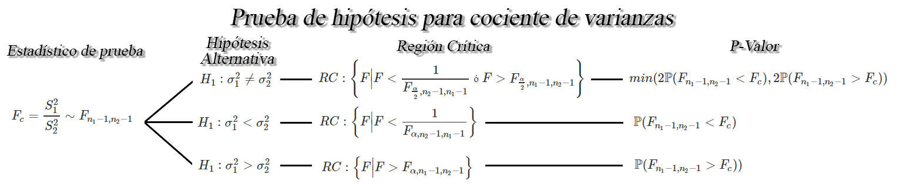

## Prueba de hipótesis para diferencia de proporciones `$p_1 - p_2$`

Sean `$X_{1,1}, X_{1,2}, \ldots, X_{1,n_1}$` y
`$X_{2,1}, X_{2,2}, \ldots, X_{2,n_1}$` dos muestras aleatorias *iid* de
tamaño `$n_1$` y `$n_2$`, tal que `$X_{i}\sim b(n_i,p_i)$`, para
`$i=1,2$`, entonces si `$n_1$` y `$n_2$` son suficientemente grandes tal
que `$n_1, n_2\geq30$`, y si las proporciones desconocidas `$p_1$` y
`$p_2$` no se encuentran cercanas a `$0$` o `$1$`, tal que `$n_ip_i>5$`
y `$n_i(1-p_i)>5$`, para `$i=1,2$`, entonces un una prueba de hipótesis
para la diferencia de las proporciones `$p_1-p_2$` será de la forma

<button id="Show10" class="btn btn-secondary">
Mostrar Ejercicio
</button>
<button id="Hide10" class="btn btn-info">
Ocultar Ejercicio
</button>
<main id="botoncito10">
<h3 data-toc-skip>
Ejercicio
</h3>

Una empresa de computación decide realizar un cambio en el proceso de
fabricación de uno de los componentes que requiere en sus portátiles, y
está en interesado en saber si dicho cambio ofrece una mejora
significativa en la rendimiento que sus equipos ofrecen.    Para
determinar si el cambio en el proceso de fabricación mejora el
rendimiento que sus equipos ofrecen, deciden tomar una muestra de
equipos antes y después de la implementación del nuevo proceso de
fabricación y se evalúa la velocidad de procesamiento para la ejecución
de un programa determinado. Suponga que se encuentra que \(120\) de
\(500\) computadores fabricados con el método actual ofrece un
rendimiento superior al promedio, mientras que, \(220\) de \(700\)
computadores fabricados con el nuevo método ofrece un rendimiento
superior al promedio.    Basados en la información obtenida,
emplee un nivel de confianza del \(2\%\) para probar si la proporción de
nuevos equipos que ofrecen un rendimiento superior al promedio, es igual
o superior a la proporción de equipos actuales que ofrecen un
rendimiento superior al promedio.

<h3 data-toc-skip>
Solución
</h3>

Como estamos interesado en comparar la proporción de rendimiento
superior al promedio entre los nuevos equipos y los actuales, para saber
si los nuevos equipo son iguales o superiores a los actuales, tendremos
que la hipótesis de interés está dada por \[\begin{align*}
  H_0:p_N - p_A \geq 0\\
  H_1:p_N - p_A < 0
\end{align*}\]

Entonces como estamos interesados en hacer inferencia sobre una
diferencia de proporciones, y nos encontramos frente a una hipótesis
unilateral, tendremos que estamos ante la siguiente situación

En donde se observa que el estadístico de prueba está dado por
\[\begin{align*}
  Z_c = \frac{(\hat{p}_N - \hat{p}_A) - d_0}{\sqrt{\frac{p^*(1-p^*)}{n_N} + \frac{p^*(1-p^*)}{n_A}}} \stackrel{a}{\sim} N(0,1)
\end{align*}\]

De lo anterior se observa que para el cálculo se requiere de las
proporciones muestrales \(\hat{p}_{N}\) y \(\hat{p}_{A}\), y
proporciones conjuntas \(p^*\), las cuales se pueden obtener a partir
del tamaño de muestra y del número de éxitos obtenidos, tal que para el
caso de los equipos construidos con el nuevos procedimiento se tendrá
que \[\begin{align*}
\hat{p}_N &= \frac{\text{# de equipos nuevos con rendimiento superior}}{\text{Total equipos nuevos evaluados}} \\
          &= \frac{x_N}{n_N} \\
          &= \frac{220}{700} \\
          &= 0.3142857
\end{align*}\]

mientras que para los equipos que se construyen con el procedimiento
actual, se tendrá que

\[\begin{align*}
\hat{p}_A &= \frac{\text{# de equipos actuales con rendimiento superior}}{\text{Total equipos actuales evaluados}} \\
          &= \frac{x_A}{n_A} \\
          &= \frac{120}{500} \\
          &= 0.24
\end{align*}\]

Ahora, la proporción conjunta es igual a \[\begin{align*}
p^* &= \frac{x_N + x_A}{n_N + n_A} \\
    &= \frac{220 + 120}{700 + 500} \\
    &= 0.2833333
\end{align*}\]

Una vez calculados todos los valores asociados al estadístico de prueba,
se procede a su cálculo, el cual está dado por \[\begin{align*}
  Z_c &= \frac{(0.3142857 - 0.24) - d_0}{\sqrt{\frac{0.2833333(1-0.2833333)}{700} + \frac{0.2833333(1-0.2833333)}{500}}} \\
      &= 2.815407
\end{align*}\]

Ahora, con el fin de decidir si el estadístico de prueba apoya o no la
hipótesis establecida, se emplea en esta ocasión la región crítica la
cual estará dada por \[\begin{align*}
  RC:\{Z|Z<-Z_{\alpha}\}
\end{align*}\]

en donde el valor crítico \(Z_{\alpha=0.02}=2.053749\) y por tanto la
región crítica será \[\begin{align*}
  RC:\{Z|Z<-2.053749\}
\end{align*}\]

Entonces como el estadístico de prueba no cae dentro de la región
crítica, no hay evidencia significativa en contra de la hipótesis nula,
y por tanto se tendrá que la proporción de nuevos equipos que ofrecen un
rendimiento superior al promedio no es inferior a la proporción de
equipos fabricados con el actual proceso que ofrecen rendimientos
superiores al promedio.

</main>

## Prueba de hipótesis para una varianza `$\sigma^2$`

Sea `$X_{1}, X_{2}, \ldots, X_{n}$` una muestra aleatoria de una
población normal de tamaño `$n$` con medias `$\mathbb{E}(X)=\mu$` y
varianza desconocidas `$Var(X)=\sigma_1^2<\infty$`, entonces un
contraste de hipótesis para la varianza real `$\sigma^2$`, a un nivel de
significancia `$\alpha$` será de la forma

<button id="Show11" class="btn btn-secondary">
Mostrar Ejercicio
</button>
<button id="Hide11" class="btn btn-info">
Ocultar Ejercicio
</button>
<main id="botoncito11">
<h3 data-toc-skip>
Ejercicio
</h3>

Suponga que se realiza un estudio sobre los costos que han tenido
proyectos de renovación de parques en la ciudad de Medellín, encontrando
que los costos asociados a \(20\) proyectos que se han a cabo en le
ciudad, en millones de pesos, fueron de

<table class="table table-striped" style="width: auto !important; margin-left: auto; margin-right: auto;">
<tbody>
<tr>
<td>
1780
</td>
<td>
2933
</td>
<td>
1220
</td>
<td>
1278
</td>
<td>
1170
</td>
<td>
1032
</td>
<td>
1245
</td>
<td>
2070
</td>
<td>
2040
</td>
<td>
1289
</td>
</tr>
<tr>
<td>
1531
</td>
<td>
980
</td>
<td>
1730
</td>
<td>
1380
</td>
<td>
2243
</td>
<td>
1687
</td>
<td>
1422
</td>
<td>
1731
</td>
<td>
1435
</td>
<td>
2080
</td>
</tr>
</tbody>
</table>

Si es posible supone que el costo de construir cualquier parque se
distribuyen aproximadamente normal, emplee un nivel de significancia del
\(5\%\) para observar si la variabilidad de los costos de cualquier
construcción es de al menos \(300000\) millones de pesos\(^2\).

<h3 data-toc-skip>
Solución
</h3>

Como estamos interesados en este punto de observar si la variabilidad de
los costos de cualquier construcción es de al menos \(300000\) millones
de pesos\(^2\) y por tanto la hipótesis de interés está dada por
\[\begin{align*}
  H_0:\sigma^2 \geq 300000\\
  H_1:\sigma^2 < 300000
\end{align*}\]

En donde, se evidencia que en este caso estaremos bajo la siguiente
situación

la cual muestra que el estadístico de prueba en esta ocasión está dada
por \[\begin{align*}
   \chi^2_c = \frac{(n-1)S^2}{\sigma^2_0} \sim \chi^2_{n-1}
\end{align*}\]

De lo anterior, se observa que para el cálculo del estadístico de
prueba, se requiere de la varianza muestral \(S^2 = 230541.2\), el
tamaño de muestra \(n=20\) y el valor de la hipótesis nula, en donde, al
reemplazar dichos valores en el estadístico de prueba se tendrá que
\[\begin{align*}
   \chi^2_c &= \frac{(20-1)230541.2}{300000} \\
            &= 14.60094
\end{align*}\]

en donde, al estar frente a una situación unilateral izquierda, se
tendrá que el P-valor para este caso está dado por \[\begin{align*}
  P-valor &= \mathbb{P}(\chi^2_{n-1}<\chi^2_c) \\
          &= 0.216856934
\end{align*}\]

Entonces, como el P-valor obtenido es superior al nivel de significancia
preestablecido del \(5\%\), se concluye que no hay evidencia suficiente
para rechazar la hipótesis nula, y por tanto, se tendrá que la
variabilidad de los costos de cualquier construcción es de al menos
\(300000\) millones de pesos\(^2\).

</main>

## Prueba de hipótesis para cociente de varianzas `$\sigma^2_1/\sigma^2_2$`

Sea `$X_{1,1}, X_{1,2}, \ldots, X_{1,n_1}$` y
`$X_{2,1}, X_{2,2}, \ldots, X_{2,n_1}$` dos muestras aleatorias normales
de tamaños `$n_1$`, y `$n_2$` con medias `$\mathbb{E}(X_{1})=\mu_1$` y
`$\mathbb{E}(X_{2})=\mu_2$`, y varianzas desconocidas
`$Var(X_{1})=\sigma_1^2<\infty$` y `$Var(X_{2})=\sigma^2_2<\infty$`,
respectivamente, entonces un contraste de hipótesis para el cociente de
varianzas `$\sigma^2_1/\sigma^2_2$`, a un nivel de significancia
`$\alpha$` será de la forma

<button id="Show12" class="btn btn-secondary">
Mostrar Ejercicio
</button>
<button id="Hide12" class="btn btn-info">
Ocultar Ejercicio
</button>
<main id="botoncito12">
<h3 data-toc-skip>
Ejercicio
</h3>

Se aplican pruebas a \(10\) cables conductores soldados a un dispositivo
semiconductor con el fin de determinar su resistencia a la tracción. Las
pruebas demostraron que para romper la unión se requiere las libras de
fuerza que se listan a continuación.

<table class="table table-striped" style="width: auto !important; margin-left: auto; margin-right: auto;">
<thead>
<tr>
<td style="font-weight: bold">
Sin Encapsulado
</td>
<td>
19.8
</td>
<td>
12.7
</td>
<td>
13.2
</td>
<td>
16.9
</td>
<td>
10.6
</td>
<td>
18.8
</td>
<td>
11.1
</td>
<td>
14.3
</td>
<td>
17.0
</td>
<td>
12.5
</td>
</tr>
</thead>
</table>

Otra conjunto de \(8\) cables conductores que forman otro dispositivo,
se encapsulan y se prueban para determinar si el encapsulado aumenta la
resistencia a la tracción, obteniendo para este caso se requirieron las
siguientes libras de fuerza para romper la unión

<table class="table table-striped" style="width: auto !important; margin-left: auto; margin-right: auto;">
<thead>
<tr>
<td style="font-weight: bold">
Con Encapsulado
</td>
<td>
24.9
</td>
<td>
22.9
</td>
<td>
23.6
</td>
<td>
22.1
</td>
<td>
20.3
</td>
<td>
21.6
</td>
<td>
21.9
</td>
<td>
22.5
</td>
</tr>
</thead>
</table>

Si se supone que las resistencias a la tracción se distribuyen
normalmente, pruebe con un nivel de significancia del \(10%\) su la
variabilidad de los cables sin encapsulado es menor a la variabilidad de
los cables con encapsulado.?

<h3 data-toc-skip>
Solución
</h3>

En este punto estamos interesados en probar si la variabilidad que
tienen los cables sin encapsulado es menor a la variabilidad de los
cables con encapsulado, y por tanto, tendremos que probar la siguiente
hipótesis \[\begin{align*}
  H_0:\sigma^2_{S} \geq \sigma^2_{C} &=> H_0:\frac{\sigma^2_{S}}{\sigma^2_{C}} \geq 1\\
  H_1:\sigma^2_{S} < \sigma^2_{C} &=> H_1:\frac{\sigma^2_{S}}{\sigma^2_{C}} < 1
\end{align*}\]

Entonces como el interés es probar que una de las varianzas sea mayor a
la otra, significa que estaremos bajo la siguientes situación

en donde se aprecia que el estadístico de prueba para esta ocasión
estará dado por \[\begin{align*}
   F_c=\frac{S^2_{S}}{S^2_{C}}\sim F_{n_S-1, n_C-1}
\end{align*}\] En donde se observa que para realizar el cálculo del
estadístico, se requiere de las varianzas muestrales \(S^2_S\) y
\(S^2_C\), las cuales son iguales a

\[\begin{align*}
S^2_S &= 3.231254\\
S^2_C &= 1.378146
\end{align*}\]

encontrando entonces que el valor del estadístico de prueba es igual a

\[\begin{align*}
   F_c &= \frac{3.231254}{1.378146}\\
       &= 2.344638
\end{align*}\]

Ahora, para poder decidir si la hipótesis de interés se encuentra o no
apoyada por la información muestral, se realiza el cálculo de la región
crítica, la cual está dada por

\[\begin{align*}
  RC:\left\{F\Bigg|F< \frac{1}{F_{\alpha, n_C -1, n_S - 1}}\right\}
\end{align*}\]

En donde se tiene que al reemplazar el valor \(\alpha = 0.10\),
\(n_C=8\) y \(n_S=10\) en el valor crítico de interés, se tendrá que
\[\begin{align*}
  F_{\alpha, n_C -1, n_S - 1} &= F_{0.10, 8 - 1, 10 - 1}\\
  F_{\alpha, n_C -1, n_S - 1} &= F_{0.10, 7, 9}\\
  F_{\alpha, n_C -1, n_S - 1} &= 2.5053132
\end{align*}\]

En donde si se reemplaza dicho valor en el área de la región crítica, se
tendrá que \[\begin{align*}
  RC&:\left\{F\Bigg|F< \frac{1}{F_{\alpha, n_C -1, n_S - 1}}\right\}\\
  RC&:\left\{F\Bigg|F< \frac{1}{F_{0.10, 7, 9}}\right\}\\
  RC&:\left\{F\Bigg|F< \frac{1}{2.5053132}\right\}\\
  RC&:\left\{F\Bigg|F< 0.3992\right\}
\end{align*}\]

mientras que el P-valor asociado al estadístico de prueba está dado por
\[\begin{align*}
  \text{P-valor}&= \mathbb{P}(F_{n_S-1, n_C-1} < F_c)\\
  \text{P-valor}&= \mathbb{P}(F_{10-1, 8-1} < 2.344638)\\
  \text{P-valor}&= \mathbb{P}(F_{9, 7} < 2.344638)\\
  \text{P-valor}&= 0.8629449
\end{align*}\]

Encontrando con ello que al caer el estadístico de prueba por fuera de
la región crítica, y al ser el P-valor mayor al nivel de significancia
\(\alpha = 0.10\), no se encuentra evidencia muestral suficiente para
rechazar la hipótesis nula, lo cual quiere decir que con un nivel de
significancia del \(10%\) se concluye que la variabilidad de los cables
sin encapsulado no es menor a la variabilidad de los cables con
encapsulado.

</main>
