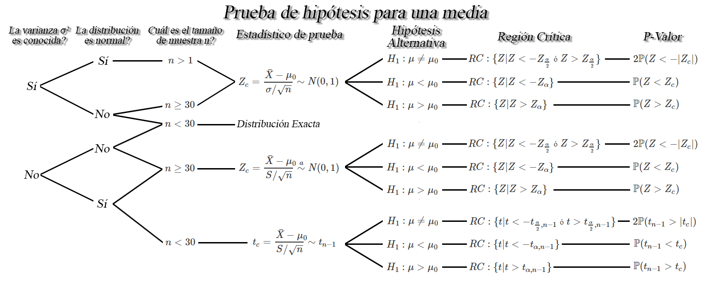
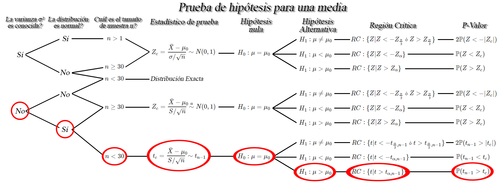
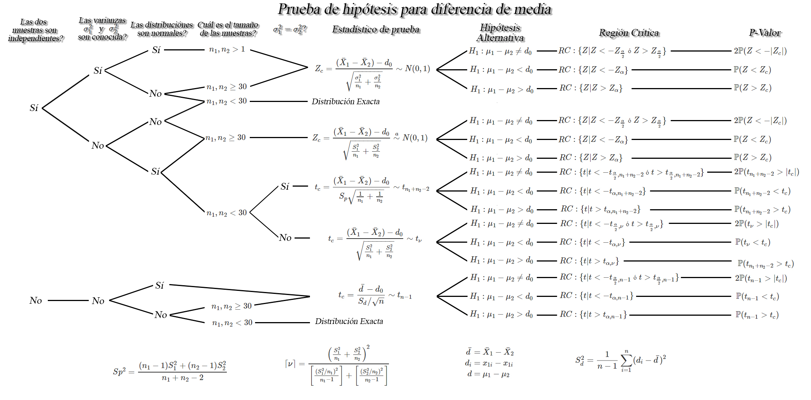
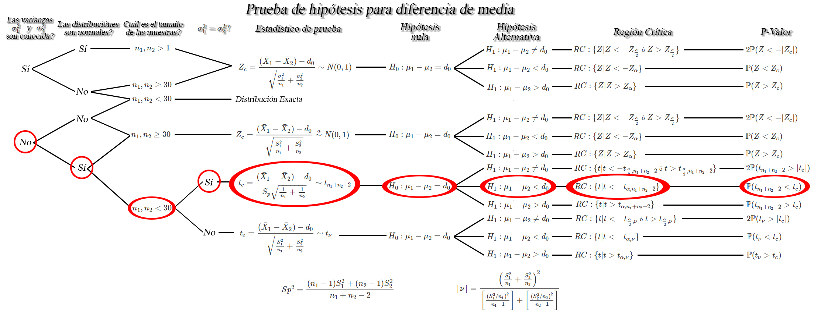
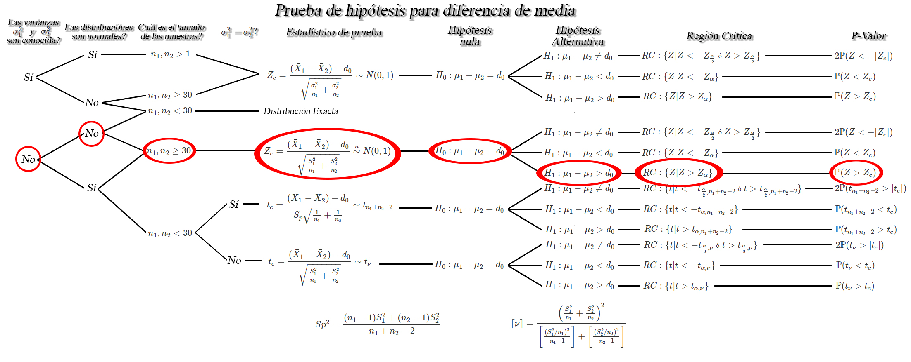
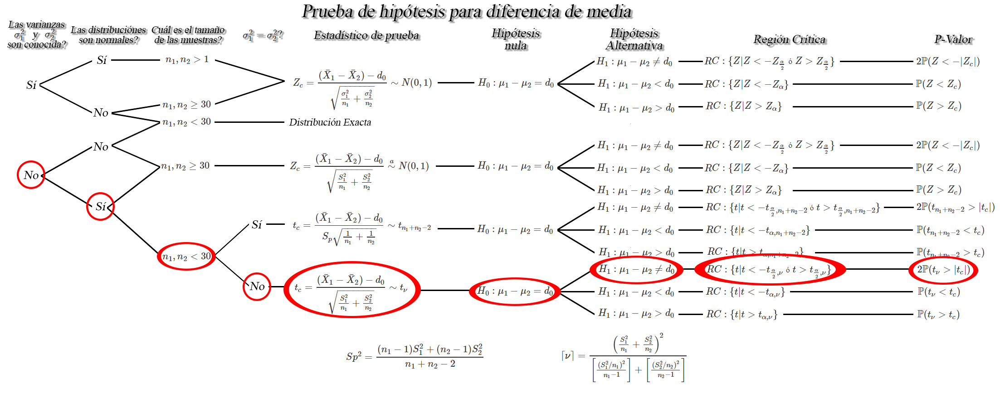
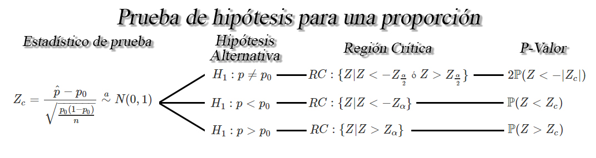
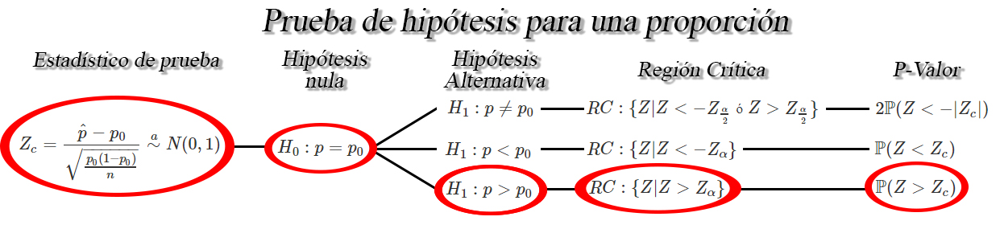

## Prueba de hipótesis para la media `$\mu$`

Sea `$X_1, X_2, \ldots, X_n$` una muestra aleatoria *iid* de tamaño
`$n$` con media desconocida `$\mathbb{E}(X)=\mu$`, y varianza
`$Var(X)=\sigma^2<\infty$`, entonces dependiendo de las condiciones, se
tendrán los siguientes pruebas de hipótesis para la media `$\mu$`.

<button id="Show1" class="btn btn-secondary">
Mostrar Ejercicio 1
</button>
<button id="Hide1" class="btn btn-info">
Ocultar Ejercicio 1
</button>
<main id="botoncito1">
<h3 data-toc-skip>
Ejercicio
</h3>

Suponga que se realiza un estudio sobre los costos que han tenido
proyectos de renovación de parques en la ciudad de Medellín, encontrando
que los costos asociados a \(20\) proyectos que se han a cabo en le
ciudad, en millones de pesos, fueron de

<table class="table table-striped" style="width: auto !important; margin-left: auto; margin-right: auto;">
<tbody>
<tr>
<td>
1780
</td>
<td>
2933
</td>
<td>
1220
</td>
<td>
1278
</td>
<td>
1170
</td>
<td>
1032
</td>
<td>
1245
</td>
<td>
2070
</td>
<td>
2040
</td>
<td>
1289
</td>
</tr>
<tr>
<td>
1531
</td>
<td>
980
</td>
<td>
1730
</td>
<td>
1380
</td>
<td>
2243
</td>
<td>
1687
</td>
<td>
1422
</td>
<td>
1731
</td>
<td>
1435
</td>
<td>
2080
</td>
</tr>
</tbody>
</table>

Si es posible supone que el costo de construir cualquier parque se
distribuyen aproximadamente normal, pruebe si el costo promedio máximo
que tiene la construcción de un nuevo parque es de \(2000\) millones de
pesos. Emplee un nivel de significancia del \(2\%\).

<h3 data-toc-skip>
Solución
</h3>

En este caso estamos interesados en probar si el costo promedio de
construir un nuevo parque sea máximo de \(2000\) millones de pesos, y
por tanto se tendrá que el juego de hipótesis estará dado por
\[\begin{align*}
  H_0: \mu \leq 2000 \\
  H_1: \mu > 2000 
\end{align*}\]

para decidir el estadístico de prueba que debemos emplear, se debe
revisar la información que poseemos, en donde tenemos que la varianza
poblacional no es conocida, ya que no la mencionan en el enunciado,
además nos mencionan que los costos se distribuyen aproximadamente
normal. Entonces, al ser el tamaño muestral pequeño e igual a \(20\)
datos, las características del ejercicio están dados por

de lo anterior encontramos que el intervalo de confianza de interés es
de la forma \[\begin{align*}
  t_c = \frac{\bar{X} - \mu_0}{S/\sqrt{n}} \sim t_{n-1}
\end{align*}\]

En donde observamos que requerimos del valor de la media muestral
\(\bar{X}=1613.8\), el valor asociado a la hipótesis nula
\(\mu_0=2000\), la desviación estándar muestral \(S=480.1471\) y el
tamaño de muestra \(n=20\). Al reemplazar en el estadístico de prueba se
tendrá que \[\begin{align*}
  t_c &= \frac{1613.8 - 2000}{480.1471/\sqrt{20}}\\
      &= -3.597104
\end{align*}\]

Ahora, para saber si se rechaza o no la hipótesis nula, se realiza el
cálculo de la región crítica, obteniendo que \[\begin{align*}
  RC:\{t|t>t_{\alpha, n-1}\}
\end{align*}\]

en donde, al usar el valor \(\alpha=0.02\) y \(n=20\), se tendrá que la
región crítica, será igual a \[\begin{align*}
  RC&:\{t|t>t_{\alpha=0.02, n-1=19}\}\\
  RC&:\{t|t>2.204701\}
\end{align*}\]

Entonces como el valor crítico no cae dentro de la región crítica, no se
rechaza la hipótesis nula, y por tanto se concluye con un nivel de
significancia del \(2\%\) que el costo promedio máximo que costará
construir un nuevo parque no será mayor a \(2000\) millones de pesos.

</main>
<button id="Show2" class="btn btn-secondary">
Mostrar Ejercicio 2
</button>
<button id="Hide2" class="btn btn-info">
Ocultar Ejercicio 2
</button>
<main id="botoncito2">
<h3 data-toc-skip>
Ejercicio
</h3>

Suponga que Postobon desarrolla una nueva máquina de bebidas para servir
de forma automática gaseosas en los cines, de tal forma que la cantidad
servida, en mililitros, se distribuye Weibull con varianza de
\(5703.473_{ml^2}\). Si la máquina sirve en promedio menos de
\(330_{ml}\) por vaso, Postobon decidirá no sacar al mercado la máquina
debido a que no cumple con los estándares establecidos.     Para
probar si las máquinas funcionan bien, se decide tomar una muestra
aleatoria de \(5000\) vasos de gaseosa servidos por las nuevas máquinas
de bebidas, obteniendo una promedio de \(327_{ml}\), con una varianza de
\(5240.35_{ml^2}\). Basados en lo anterior, prueba con un nivel de
significancia del \(5\%\) si la nueva máquina cumple con los estándares
establecidos.

<h3 data-toc-skip>
Solución
</h3>

En este caso estamos interesados en probar la hipótesis de que la
cantidad servida por la nueva máquina no es menor a \(330_{ml}\) por
vaso, empleando un nivel de significancia del \(5\%\), y por tanto,
tendremos que el juego de hipótesis estará dado por \[\begin{align*}
  H_0:\mu \leq 330\\
  H_1:\mu < 330
\end{align*}\]

Entonces dado que estamos en una situación en la cual sabemos que la
población no es normal, debido a que se menciona que es Weibull, con
varianza conocida e igual a \(5703.473_{ml^2}\), estaremos bajo la
siguiente situación

de lo anterior encontramos que el estadístico de prueba de interés es de
la forma \[\begin{align*}
  Z_c = \frac{\bar{X}-\mu_0}{\sigma/\sqrt{n}} \sim N(0,1)
\end{align*}\]

En donde observamos que requerimos la media muestral \(\bar{X}=327\), la
desviación estándar poblacional \(\sigma=75.52134\), el tamaño de
muestra \(n=5000\), el nivel de significancia \(\alpha=0.05\) y el valor
crítico \(-Z_{\alpha=0.05}=-1.644854\). Al reemplazar en el estadístico
de prueba tenemos que \[\begin{align*}
  Z_c &= \frac{327-330}{75.52134/\sqrt{5000}} \\
      &= -2.808902
\end{align*}\]

En esta ocasión se decide calcular el P-valor para tomar la decisión, se
tendrá que \[\begin{align*}
  P-valor &= \mathbb{P}(Z<Z_c)\\
          &= \mathbb{P}(Z<-2.808902)\\
          &= 0.002485539
\end{align*}\]

Entonces, como el P-valor es menor al nivel de significancia
\(\alpha=0.05\), se tendrá evidencia suficiente para rechazar la
hipótesis nula, y por tanto se concluirá con un nivel de significancia
del \(5\%\) que la cantidad promedio de llenado de las gaseosas por vaso
es menor a \(330_{ml}\), lo cual significa que Postobon debería sacar la
máquina del mercado para recalibrarla.

</main>
<button id="Show3" class="btn btn-secondary">
Mostrar Ejercicio 3
</button>
<button id="Hide3" class="btn btn-info">
Ocultar Ejercicio 3
</button>
<main id="botoncito3">
<h3 data-toc-skip>
Ejercicio
</h3>

Suponga que la marca de cigarrillo Malboro es auditada debido a que se
afirma que sus registros están adulterados. Ante ésto, el presidente de
la empresa asegura que sus registros son correctos y que el flujo de
caja promedio mensual que registran es de \(25\) mil millones de pesos.
Para probar si dicha afirmación es posible, el auditor decide revisar el
flujo de caja de la empresa de los últimos \(48\) meses, encontrando que
el flujo de caja promedio que registra la empresa es de \(21.389\) mil
millones de pesos con una desviación estándar de \(3.213\) mil millones
de pesos.     Si puede suponerse que el flujo de caja de la
empresa Malboro se distribuye normalmente, emplee un nivel de confianza
del \(10\%\) para probar si la afirmación del presidente se encuentra
respaldada por la información muestral.

<h3 data-toc-skip>
Solución
</h3>

En este ejercicio se está interesado en probar la hipótesis sobre que el
flujo de caja promedio mensual es igual a \(25\) mil millones de pesos,
lo cual significa que al posee la igualdad la afirmación, tendremos el
siguiente juego de hipótesis \[\begin{align*}
  H_0:\mu = 25\\
  H_1:\mu \neq 25 
\end{align*}\]

Entonces para saber cual es el estadístico de prueba que debemos
aplicar, debemos inicialmente verificar qué información poseemos. De la
información suministrada tenemos que el flujo de caja de la empresa se
distribuye normalmente con una varianza desconocida, y por tanto
estaremos ante la siguiente situación

lo cual quiere decir que el estadístico de prueba estará dado por
\[\begin{align*}
  Z_c = \frac{\bar{X}-\mu_0}{\sigma/\sqrt{n}} \stackrel{a}{\sim} N(0,1)
\end{align*}\]

En donde observamos que necesitamos la media muestral
\(\bar{X}=21.389\), la desviación estándar muestral \(S=3.213\), el
tamaño de muestra \(n=48\) y el nivel de significancia \(\alpha=0.10\).
Al reemplazar estos valores tendremos que \[\begin{align*}
  Z_c &= \frac{21.389-25}{3.213/\sqrt{48}}\\
      &= -7.786412
\end{align*}\]

Entonces si empleamos la región crítica para la toma de decisión,
tendremos que \[\begin{align*}
  RC:\{Z|Z<-Z_{\frac{\alpha}{2}} \text{ ó } Z>Z_{\frac{\alpha}{2}}\}
\end{align*}\]

en donde al ser el valor crítico \(Z_{\frac{\alpha}{2}=0.05}=1.644854\),
se tendrá que la región crítica está dada por \[\begin{align*}
  RC:\{Z|Z<-1.644854 \text{ ó } Z>1.644854\}
\end{align*}\]

En donde al comparar el estadístico de prueba con la región crítica,
encontramos que el estadístico de prueba cae dentro de la región
crítica, y por tanto hay evidencia suficiente para rechazar la hipótesis
nula, lo cual quiere decir con un nivel de significancia del \(10\%\)
que el flujo de caja promedio mensual que registra la marca de
cigarrillos Malboro es diferente a \(25\) mil millones de pesos.

</main>

## Prueba de hipótesis para diferencia de medias `$\mu_1 - \mu_2$`

Sea `$X_{1,1}, X_{1,2}, \ldots, X_{1,n_1}$` y
`$X_{2,1}, X_{2,2}, \ldots, X_{2,n_1}$` dos muestras aleatorias *iid* de
tamaños `$n_1$`, y `$n_2$` con medias desconocidas
`$\mathbb{E}(X_{1})=\mu_1$` y `$\mathbb{E}(X_{2})=\mu_2$`, y varianzas
`$Var(X_{1})=\sigma_1^2<\infty$` y `$Var(X_{2})=\sigma^2_2<\infty$`,
respectivamente, entonces dependiendo de las condiciones, se tendrán los
siguientes pruebas de hipótesis para la diferencia de medias
`$\mu_1 - \mu_2$`.

<button id="Show4" class="btn btn-secondary">
Mostrar Ejercicio 1
</button>
<button id="Hide4" class="btn btn-info">
Ocultar Ejercicio 1
</button>
<main id="botoncito4">
<h3 data-toc-skip>
Ejercicio
</h3>

Una empresa de electrodomésticos desea saber si los cursos de
capacitación sirven para mejorar el nivel de ventas de sus trabajadoras
y para ello decide enviar a \(12\) de sus agentes de ventas a dicho
curso. Una vez finalizado el curso, la empresa encuentra que estos
agentes generan unas ventas promedio de de \(43.5\) millones de pesos
con una desviación estándar de \(3.1\) millones de pesos.    Con
el fin de observar si el curso es o no efectivo, la empresa extrae una
muestra aleatoria independiente de \(15\) agentes que no asistieron a la
capacitación y encontró que las ventas promedio generadas y su
desviación estándar para estos agentes fue de \(40.8\) y \(2.3\)
millones de pesos respectivamente.     Si es posible suponer que
las poblaciones se distribuyen normalmente con varianzas iguales a
\(5.6\) millones de pesos\(^2\) para quienes se capacitaron y a \(4.3\)
millones de pesos\(^2\) para quienes no se capacitaron, emplee un nivel
de significancia del \(5\%\) para observar si es posible pensar que los
cursos de capacitación mejoran el promedio de ventas sobre quienes no
recibieron estos cursos?.

<h3 data-toc-skip>
Solución
</h3>

En este ejercicio estamos interesados en emplear un nivel de
significancia del \(5\%\) para probar la hipótesis de que las ventas de
las personas que tomaron los cursos de capacitación son superiores a las
ventas de quienes no tomaron los cursos de capacitación, la cual es de
la forma \[\begin{align*}
  H_0:\mu_C \leq \mu_S => \mu_C - \mu_S \leq 0\\
  H_1:\mu_C > \mu_S => \mu_C - \mu_S > 0\\
\end{align*}\]

donde el subíndice \(C\) representa “con capacitación” y el subíndice
\(S\) representa “sin capacitación.” Ahora, para decidir si cual es el
estadístico de prueba adecuado, se verifica la información que poseemos,
en donde nos mencionan que las poblaciones se distribuyen normalmente
con varianzas conocidas e iguales a \(\sigma^2_C=5.6\) y
\(\sigma^2_S=4.3\) millones de pesos\(^2\). Lo cual nos llevará a la
siguiente situación

encontrando que el estadístico de prueba de interés es de la forma
\[\begin{align*}
  Z_c = \frac{(\bar{X}_C-\bar{X}_S) - d_0}{\sqrt{\frac{\sigma^2_C}{n_C}+\frac{\sigma^2_S}{n_S}}} \sim N(0,1)
\end{align*}\]

En donde, para realizar el cálculo requerimos de las media muestrales
fueron \(\bar{X}_C=43.5\) y \(\bar{X}_S=40.8\), las varianzas
poblacionales \(\sigma^2_C=5.6\) y \(\sigma^2_S=4.3\), los tamaños de
muestrales \(n_C=12\) y \(n_S=15\). Al reemplazar en la ecuación del
estadístico de prueba tendremos que \[\begin{align*}
  Z_c &= \frac{(43.5-40.8) - 0}{\sqrt{\frac{5.6}{12}+\frac{4.3}{15}}}\\
      &= 3.110786
\end{align*}\]

Ahora, para tomar una decisión suponga que se decide emplear el P-valor,
el cual al ser una hipótesis bilateral, tendremos que está dado por
\[\begin{align*}
  P-valor &= \mathbb{P}(Z > Z_c) \\
          &= \mathbb{P}(Z > 3.110786) \\
          &= \mathbb{P}(Z > 3.110786) \\
          &= 0.000932951 \\
\end{align*}\]

Entonces como el P-valor es menor al nivel de significancia del \(5\%\)
se rechazará la hipótesis nula, y por tanto se tendrá evidencia
suficiente para concluir que el promedio de ventas de las personas que
recibieron capacitación es superior al promedio de ventas de las
personas que no recibieron capacitación.

</main>
<button id="Show5" class="btn btn-secondary">
Mostrar Ejercicio 2
</button>
<button id="Hide5" class="btn btn-info">
Ocultar Ejercicio 2
</button>
<main id="botoncito5">
<h3 data-toc-skip>
Ejercicio
</h3>

La gobernación de Antioquia, desea construir un nuevo puente para
comunicar el municipio de Itagüí con Envigado, y para ello tiene dos
posibles ubicaciones en los cuales puede llevar a cabo dicho proyecto.
Para decidir en cual de las dos ubicaciones llevar a cabo el proyecto
decide tomar muestras aleatorias de cada ubicación y mirar en cual de
los dos hay mayor aflucencia de vehículos.    De la ubicación
\(A\) se decide tomar una muestra aleatoria de \(22\) días y de la
ubicación \(B\) de \(28\) días encontrando respectivamente que el número
promedio de vehículos para cada ubicación fue de \(2359\) y \(2147\)
vehículos, con una desviación estándar de \(143\) y \(301\) vehículos.
    Si puede asumirse que el número de vehículos en las dos zonas
se distribuye aproximadamente normal con varianzas iguales, pruebe con
un nivel de significancia del \(10\%\) si la afluencia de vehículos que
transitan por la ubicación \(A\) es menor que la afluencia de vehículos
que transitan por la ubicación \(B\).

<h3 data-toc-skip>
Solución
</h3>

En este punto estamos interesados en una hipótesis unilateral, debido a
que queremos probar si el número de vehículos que transitan por día por
la ubicación \(A\) es menor que la ubicación \(B\), lo cual puede
traducirse bajo el juego de hipótesis \[\begin{align*}
  H_0:\mu_A \geq \mu_B => \mu_A - \mu_B \geq 0\\
  H_1:\mu_A < \mu_B => \mu_A - \mu_B < 0\\
\end{align*}\]

En donde al revisar la información suministrada se encontró que el
número de vehículos en las dos zonas se distribuyen aproximadamente
normal con varianzas iguales pero desconocidas y tamaños muestrales
pequeñas, por lo cual nos encontraremos en la siguiente situación

en donde se aprecia que el estadístico de prueba estará dado por
\[\begin{align*}
  t_c = \frac{(\bar{X}_A-\bar{X}_B) - d_0}{S_p\sqrt{\frac{1}{n_A}+\frac{1}{n_B}}} \sim t_{n_A + n_B - 2}
\end{align*}\]

En donde se observa que para realizar el cálculo requerimos de los
tamaños muestrales \(n_A=22\) y \(n_B=28\), las medias muestrales
\(\bar{X}_A=2359\) y \(\bar{X}_B=2147\), y una desviación estándar
conjunta \(S_p\), la cual no poseemos, y que debemos calcular, pero que
podemos obtener mediante la ecuación \[\begin{align*}
Sp^2 &= \frac{(n_A-1)S^2_A + (n_B-1)S^2_B}{n_A+n_B-2} \\
     &= \frac{(22-1)143^2 + (28-1)301^2}{22 + 28 - 2} \\
     &= 59909.5
\end{align*}\] y por tanto \[\begin{align*}
Sp &= \sqrt{Sp^2} \\
   &= \sqrt{59909.5} \\
   &= 244.7642
\end{align*}\]

Una vez conocidos los valores necesarios para calcular el estadístico de
prueba, tendremos que \[\begin{align*}
  t_c &= \frac{(2359-2147) - 0}{244.7642\sqrt{\frac{1}{22}+\frac{1}{28}}} \\
      &= 21.49702
\end{align*}\]

Ahora, si empleamos P-valor para tomar una decisión, tendremos que
\[\begin{align*}
  P-valor &= \mathbb{P}(t_{n_A+n_B-2}<t_c) \\
          &= \mathbb{P}(t_{22+28-2}<21.49702) \\
          &= \mathbb{P}(t_{48}<21.49702) \\
          &= \mathbb{P}(t_{48}<21.49702) \\
          &= 1
\end{align*}\]

y por tanto, como el P-valor es superior al nivel de significancia del
\(10\%\), no se rechaza al hipótesis nula y se tendrá que hay evidencia
suficiente para concluir que el número de vehículos que transitan por la
ubicación \(A\) no es menor a la ubicación \(B\).

</main>
<button id="Show6" class="btn btn-secondary">
Mostrar Ejercicio 3
</button>
<button id="Hide6" class="btn btn-info">
Ocultar Ejercicio 3
</button>
<main id="botoncito6">
<h3 data-toc-skip>
Ejercicio
</h3>

Suponga que la Universidad de Antioquia adelanta un estudio sobre el
salario de sus egresados y desea comparar si es cierta la creencia que
las mujeres ganan en promedio menos dinero que los hombres.    
Para comprobar si las creencias son ciertas, un grupo de investigación
de la Universidad toma una muestra representativa de \(250\) mujeres y
\(270\) hombres egresados de la Universidad y se les pregunta sobre cuál
es el salario que ganan actualmente, obteniendo en su investigación que
las mujeres ganan en promedio \(2.3\) millones de pesos con una
desviación estándar de \(0.7\) millones de pesos, mientras que los
hombres ganan en promedio \(2.6\) millones de pesos con una desviación
estándar de \(1.2\) millones de pesos.    Si el grupo de
investigación encuentra que los salarios no se distribuyen normalmente,
emplee un nivel de significancia del \(15\%\) para probar si el salario
de los egresados hombres es mayor al salario de los egresados mujeres.

<h3 data-toc-skip>
Solución
</h3>

En este enunciado estamos interesados en probar con un nivel de
significancia del \(15\%\) si el salario de los hombres es mayor al de
las mujeres, lo cual se traduce en el siguiente juego de hipótesis
\[\begin{align*}
  H_0:\mu_H \leq \mu_M => \mu_H - \mu_M \leq 0\\
  H_1:\mu_H > \mu_M => \mu_H - \mu_M > 0\\
\end{align*}\]

entonces para probar si la hipótesis es o no apoyada por la información
muestral, es necesario realizar el cálculo de una estadístico de prueba,
y para ello se revisa la información que poseemos, en donde al tener que
los salarios no se distribuyen normalmente con varianzas desconocidas
(debido a que no nos mencionan nada de ellas) pero con muestras grandes,
obteniendo la siguiente situación

En donde se observa que el estadístico de prueba está dado por
\[\begin{align*}
  Z_c = \frac{(\bar{X}_H-\bar{X}_M) - d_0}{\sqrt{\frac{S^2_H}{n_H}+\frac{S^2_M}{n_M}}} \stackrel{a}{\sim} N(0,1)
\end{align*}\]

En donde observamos que para realizar el cálculo se requiere de los
tamaños muestrales \(n_M = 250\) y \(n_H = 270\), las medias muestrales
\(\bar{X}_M=2.3\) y \(\bar{X}_H=2.6\), con desviaciones estándar
muestrales iguales a \(S_M=0.7\) y \(S_H=1.2\). Por tanto al reemplazar
los valores en el estadístico de prueba se tendrá que \[\begin{align*}
  Z_c &= \frac{(2.6-2.3) - 0}{\sqrt{\frac{1.2^2}{270}+\frac{0.7^2}{250}}} \\ 
      &= 3.512838818
\end{align*}\]

Ahora, si empleamos la región crítica para observar si se rechaza o no
la hipótesis, tendremos que \[\begin{align*}
  RC&:\{Z|Z>Z_\alpha\}\\
  RC&:\{Z|Z>1.03643\}
\end{align*}\]

Entonces como el estadístico de prueba cae dentro de la región crítica,
se tendrá evidencia suficiente para rechazar la hipótesis nula, lo cual
significa con un nivel de significancia del \(15\%\) que el salario
promedio de los hombres es mayor al salario promedio de las mujeres.

</main>
<button id="Show7" class="btn btn-secondary">
Mostrar Ejercicio 4
</button>
<button id="Hide7" class="btn btn-info">
Ocultar Ejercicio 4
</button>
<main id="botoncito7">
<h3 data-toc-skip>
Ejercicio
</h3>

Se realiza un estudio con el fin de comparar el rendimiento de
combustible en kilómetros por galón para dos tipos de motores \(A\) y
\(B\). Suponga que se decide realizar un total de \(47\) experimentos
con el motor \(A\) y \(56\) experimentos con el motor \(B\), encontrando
para cada caso, un rendimiento promedio de gasolina de \(44\) y \(48\)
kilómetros, respectivamente, con desviaciones estándar de \(8.3\) y
\(6.6\), respectivamente.     Basados en la información anterior,
pruebe con un nivel de significancia del \(12\%\) si la diferencia
promedio entre los rendimientos de combustible en kilómetros por galón
de gasolina para los motores \(A\) y \(B\) son o no iguales, si es
posible suponer que los rendimientos de los combustibles no poseen una
distribución normal y poseen varianzas conocidas e iguales a \(38.44\) y
\(57.76\) para los motores \(A\) y \(B\) respectivamente.

<h3 data-toc-skip>
Solución
</h3>

En este caso estamos interesados en calcular con un nivel de
significancia del \(12\%\) si la diferencia entre los rendimientos
promedios de combustible son o no iguales, es decir, se quiere probar el
juego de hipótesis \[\begin{align*}
  H_0:\mu_A - \mu_B = 0\\
  H_1:\mu_A - \mu_B \neq 0\\
\end{align*}\]

Entonces dado que los rendimientos de combustible para los dos motores
se distribuye normalmente con varianzas conocidas, estaremos en la
siguiente situación

En donde se aprecia que el estadístico de prueba está dada por
\[\begin{align*}
  Z_c = \frac{(\bar{X}_A-\bar{X}_B) - d_0}{\sqrt{\frac{\sigma^2_A}{n_A}+\frac{\sigma^2_B}{n_B}}} \sim N(0,1)
\end{align*}\]

observando que se requiere de los rendimientos promedio muestrales de
los dos motores \(\bar{X}_A=44\) y \(\bar{X}_B=48\), las varianzas
poblacionales \(\sigma^2_A=38.44\) y \(\sigma^2_B=57.76\) y los tamaños
muestrales \(n_A=47\) y \(n_B=56\). Al reemplazar estos valores en el
estadístico de prueba se tendrá que \[\begin{align*}
  Z_c &= \frac{(44-48) - 0}{\sqrt{\frac{38.44}{47}+\frac{57.76}{56}}} \\
      &= -2.941414
\end{align*}\]

Ahora, si realizamos el cálculo de la región crítica para observar si se
rechaza o no la hipótesis establecida, tendremos que \[\begin{align*}
  RC&:\{Z|z < -Z_{\alpha/2} \text{ ó } Z>Z_{\alpha/2}\}\\
  RC&:\{Z|Z<-1.5548 \text{ ó } Z>1.55478\}
\end{align*}\]

apreciando que el estadístico de prueba cae dentro de la región crítica
lo cual significa que con un nivel de significancia del \(12\%\) se
rechaza la hipótesis nula, de que el rendimiento promedios de
combustible de los dos tipos de motores son iguales, y por tanto se
tendrá que hay diferencias significativas entre el rendimiento promedio
de combustible de los motores.

</main>
<button id="Show8" class="btn btn-secondary">
Mostrar Ejercicio 5
</button>
<button id="Hide8" class="btn btn-info">
Ocultar Ejercicio 5
</button>
<main id="botoncito8">
<h3 data-toc-skip>
Ejercicio
</h3>

Suponga que se contrata a un grupo de investigación de la Universidad de
Antioquia para que realice un análisis de tensión sobre la unión pegada
con una resina experimental a dos clases diferentes de madera. Para
realizar el estudio, el grupo de investigación toma una muestra
aleatoria de \(18\) uniones pegadas con la resina especial a la madera
\(A\) y encontró que la tensión promedio de corte y desviación estándar
fueron de \(1130_{psi}\) y \(420_{psi}\), respectivamente. Por su parte,
toman una muestra aleatoria de \(12\) uniones pegadas con la resina
especial a la madera \(B\), encontrando que la tensión promedio de corte
y desviación estándar fueron de \(1010_{psi}\) y \(380_{psi}\).   
Si se asume que la tensión sobre la unión pegada con la resina
experimental en cada clase de madera se distribuye aproximadamente
normal con varianzas diferentes. Emplee un nivel de significancia del
\(8\%\) para observar si existen o no diferencias significativas de la
tensión promedio de corte de las dos marcas de madera.

<h3 data-toc-skip>
Solución
</h3>

El juego de hipótesis en esta dado por \[\begin{align*}
  H_0:\mu_A - \mu_B = 0\\
  H_1:\mu_A - \mu_B \neq 0\\
\end{align*}\] debido a que se quiere probar si hay o no diferencias
significativas entre las tensiones promedio de corte de las dos marcas
de madera. Adicionalmente, debido a que estamos en una situación en la
cual sabemos que las tensiones de corte se distribuyen normalmente con
varianzas diferentes pero desconocidas, se tendrá que estamos en una
situación dada por

situación que posee el siguiente estadístico de prueba \[\begin{align*}
  t_c = \frac{(\bar{X}_A-\bar{X}_B) - d_0}{\sqrt{\frac{S^2_A}{n_A}+\frac{S^2_B}{n_B}}} \sim t_v
\end{align*}\]

En donde se observa que requerimos de los tamaños muestrales \(n_A=18\)
y \(n_B=12\), de las medias muestrales de \(\bar{X}_A=1130_{psi}\) y
\(\bar{X}_B=1010_{psi}\) junto a unas desviaciones estándar de
\(S_A=420_{psi}\) y \(S_B=380_{psi}\). Adicionalmente se requiere el
valor de los grados de libertad \(\nu\), los cuales están dados por

\[\begin{align*}
\nu &= \frac{\left(\frac{S^2_A}{n_A} + \frac{S^2_B}{n_B}\right)^2}{\frac{(S^2_A/n_A)^2}{n_A-1} + \frac{(S^2_B/n_B)^2}{n_B-1}} \\
    &= \frac{\left(\frac{420^2}{12} + \frac{380^2}{18}\right)^2}{\frac{(480^2/12)^2}{12-1} + \frac{(380^2/18)^2}{18-1}} \\
    &= \frac{476694444}{18813149} \\
    &= 25.33837
\end{align*}\]

Al calcular el valor techo de \(\nu\) tendremos que \[\begin{align*}
\nu               &= 25.33837 \\
\lceil \nu \rceil &= \lceil25.33837\rceil \\
\lceil \nu \rceil &= 26
\end{align*}\]

y por tanto, al reemplazar todos los valores necesarios para realizar el
estadístico de prueba se tendrá que \[\begin{align*}
  t_c &= \frac{(1130-1010) - 0}{\sqrt{\frac{420^2}{18}+\frac{380^2}{12}}} \\
      &= 0.8121219
\end{align*}\]

Ahora, para llevar a cabo la decisión, se decide emplear el P-valor, el
cual es igual a \[\begin{align*}
  P-valor  &= 2\mathbb{P}(t_nu > |t_c|) \\
           &= 2(0.212047625) \\
           &= 0.4240952
\end{align*}\]

Encontrando que el P-valor es superior al nivel de significancia del
\(8\%\), lo cual significa que no hay evidencia suficiente para rechazar
la hipótesis nula y por tanto se concluirá que no existen diferencias
significativas entre las tensiones promedio de corte de las dos marcas
de madera.

</main>

## Prueba de hipótesis para una proporción `$p$`

Sea `$X_1,X_2, \ldots, X_n$` una muestra aleatoria *iid* de tamaño
`$n$`, tal que `$X\sim b(n,p)$` entonces si `$n$` es suficientemente
grande tal que `$n\geq30$`, y la proporción desconocida `$p$` no se
encuentre cercana a `$0$` o `$1$`, tal que `$np>5$` y `$n(1-p)>5$`,
entonces un una prueba de hipótesis para la proporción verdadera `$p$`
será de la forma

<button id="Show9" class="btn btn-secondary">
Mostrar Ejercicio
</button>
<button id="Hide9" class="btn btn-info">
Ocultar Ejercicio
</button>
<main id="botoncito9">
<h3 data-toc-skip>
Ejercicio
</h3>

Suponga que se realiza un estudio sobre los costos que han tenido
proyectos de renovación de parques en la ciudad de Medellín, encontrando
que los costos asociados a \(20\) proyectos que se han llevado a cabo en
la ciudad, en millones de pesos, fueron de

<table class="table table-striped" style="width: auto !important; margin-left: auto; margin-right: auto;">
<tbody>
<tr>
<td>
1780
</td>
<td>
2933
</td>
<td>
1220
</td>
<td>
1278
</td>
<td>
1170
</td>
<td>
1032
</td>
<td>
1245
</td>
<td>
2070
</td>
<td>
2040
</td>
<td>
1289
</td>
</tr>
<tr>
<td>
1531
</td>
<td>
980
</td>
<td>
1730
</td>
<td>
1380
</td>
<td>
2243
</td>
<td>
1687
</td>
<td>
1422
</td>
<td>
1731
</td>
<td>
1435
</td>
<td>
2080
</td>
</tr>
</tbody>
</table>

Si se cree que la verdadera proporción de proyectos que poseen costos
superiores a \(1900\) millones de pesos es de más del \(40\%\), emplee
un nivel de significancia del \(5\%\) para probar si dicha creencia se
encuentra apoyada por la información empírica.

<h3 data-toc-skip>
Solución
</h3>

En este caso estamos interesados en probar si la verdadera proporción de
proyectos que poseen costos superiores a \(1900\) millones de pesos es
de más del \(40\%\), y por tanto se tendrá que el juego de hipótesis
está dado por \[\begin{align*}
  H_0:p \leq 0.40\\
  H_1:p > 0.40
\end{align*}\]

Entonces como estamos interesados en hacer inferencia sobre una
proporción, y nos encontramos frente a una hipótesis unilateral,
tendremos que estamos ante la siguiente situación

En donde se observa que el estadístico de prueba está dado por
\[\begin{align*}
  Z_c = \frac{\hat{p} - p_0}{\sqrt{\frac{p_0(1-p_0)}{n}}} \stackrel{a}{\sim} N(0,1)
\end{align*}\]

En donde se evidencia que necesitamos para el cálculo de la proporción
muestral de proyectos que poseen costos superiores a \(1900\) millones
de pesos, del tamaño de muestra \(n=20\) y de la proporción establecida
en la hipótesis nula.     Para realizar el cálculo de la
proporción muestral se trata de localizar aquellos costos que posean un
valor superior a \(1900\) millones de pesos, denotando como \(1\)
aquellas observaciones que sean superiores a \(1900\) millones de pesos,
y \(0\) aquellas observaciones que no cumplan la condición, tal que
\[\begin{align*}
 \underset{0}{1780} \quad \underset{1}{2933} \quad \underset{0}{1220} \quad \underset{0}{1278} \quad \underset{0}{1170} \quad \underset{0}{1032} \quad \underset{0}{1245} \quad \underset{1}{2070} \quad \underset{1}{2040} \quad \underset{0}{1289} \\
\underset{0}{1531} \quad \underset{0}{980} \quad \underset{0}{1730} \quad \underset{0}{1380} \quad \underset{1}{2243} \quad \underset{0}{1687} \quad \underset{0}{1422} \quad \underset{0}{1731} \quad \underset{0}{1435} \quad \underset{1}{2080}
\end{align*}\]

Al contar el número de éxitos, observamos que tenemos un total de
\(x=5\) éxitos en un total de \(n=20\) muestras, y por tanto, podemos
aplicar la fórmula de frecuencia relativa para calcular la proporción
muestral de egresados que poseen salarios superiores a \(1900\)
millones, tal que \[\begin{align*}
  \hat{p} &= \frac{\text{# éxitos}}{\text{Total ensayos}} \\
          &= \frac{x}{n} \\
          &= \frac{5}{20} \\
          &= 0.25
\end{align*}\]

Ahora, al emplear este valor a los ya mencionados para el cálculo del
estadístico de prueba, se tendrá que éste es igual a \[\begin{align*}
  Z_c &= \frac{0.25 - 0.4}{\sqrt{\frac{0.4(1-0.4)}{20}}} \\
      &= -1.369306   
\end{align*}\]

En donde, se decide emplear el P-valor para observar si hay o no
evidencia a favor de la hipótesis nula obteniendo que \[\begin{align*}
  P-valor &= \mathbb{P}(Z>Z_c) \\
          &= \mathbb{P}(Z>-1.369306)\\
          &= 1 - \mathbb{P}(Z\leq -1.369306)\\
          &= 0.9145482
\end{align*}\]

En donde se evidencia que el P-valor asociado al estadístico de prueba
posee un valor del \(91.45\%\) el cual es mayor al nivel de
significancia preestablecido de \(5\%\), permitiendo concluir que no se
rechaza la hipótesis nula, y por tanto, se tendrá que la verdadera
proporción de proyectos que poseen costos superiores a \(1900\) millones
de pesos no es mayor a \(40\%\).

</main>
