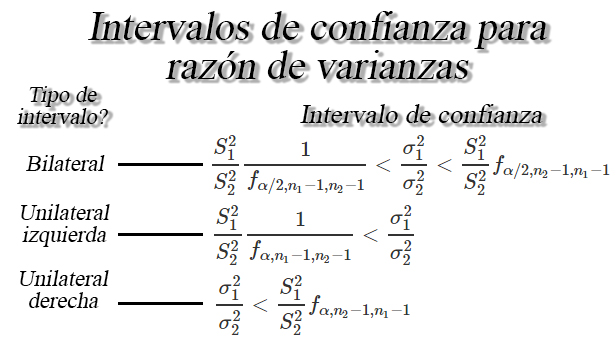

## Intervalos de confianza para razón de varianzas `$\sigma^2_1/\sigma^2_2$`

Sea `$X_{1,1}, X_{1,2}, \ldots, X_{1,n_1}$` y
`$X_{2,1}, X_{2,2}, \ldots, X_{2,n_1}$` dos muestras aleatorias normales
de tamaños `$n_1$`, y `$n_2$` con medias `$\mathbb{E}(X_{1})=\mu_1$` y
`$\mathbb{E}(X_{2})=\mu_2$`, y varianzas desconocidas
`$Var(X_{1})=\sigma_1^2<\infty$` y `$Var(X_{2})=\sigma^2_2<\infty$`,
respectivamente, entonces un intervalo de confianza del
`$100(1-\alpha)\%$` para `$\sigma^2_1/\sigma^2_2$` estará dada por

<button id="Show9" class="btn btn-secondary">
Mostrar Ejercicio
</button>
<button id="Hide9" class="btn btn-info">
Ocultar Ejercicio
</button>
<main id="botoncito9">
<h3 data-toc-skip>
Ejercicio
</h3>

Se aplican pruebas a \(10\) cables conductores soldados a un dispositivo
semiconductor con el fin de determinar su resistencia a la tracción. Las
pruebas demostraron que para romper la unión se requiere las libras de
fuerza que se listan a continuación.

<table class="table table-striped" style="width: auto !important; margin-left: auto; margin-right: auto; font-size:100%!important">
<thead>
<tr>
<td style="font-weight: bold">
Sin Encapsulado
</td>
<td>
19.8
</td>
<td>
12.7
</td>
<td>
13.2
</td>
<td>
16.9
</td>
<td>
10.6
</td>
<td>
18.8
</td>
<td>
11.1
</td>
<td>
14.3
</td>
<td>
17.0
</td>
<td>
12.5
</td>
</tr>
</thead>
</table>

Otra conjunto de \(8\) cables conductores que forman otro dispositivo,
se encapsulan y se prueban para determinar si el encapsulado aumenta la
resistencia a la tracción, obteniendo para este caso se requirieron las
siguientes libras de fuerza para romper la unión

<table class="table table-striped" style="width: auto !important; margin-left: auto; margin-right: auto; font-size:100%!important">
<thead>
<tr>
<td style="font-weight: bold">
Con Encapsulado
</td>
<td>
24.9
</td>
<td>
22.9
</td>
<td>
23.6
</td>
<td>
22.1
</td>
<td>
20.3
</td>
<td>
21.6
</td>
<td>
21.9
</td>
<td>
22.5
</td>
</tr>
</thead>
</table>

Si se supone que las resistencias a la tracción se distribuyen
normalmente, construya un intervalo del \(90\%\) para la razón de
varianzas entre la variabilidad de los cables sin encapsulado y la
variabilidad de los cables con encapsulado. Es posible afirmar que la
variabilidad de de los cables con encapsulado es superior a los cables
sin encapsulado?

<h3 data-toc-skip>
Solución
</h3>

En este punto nos mencionan que se tiene interés en calcular un
intervalo de confianza para el cociente de las varianzas asociadas a la
resistencia a la tracción para cables sin encapsulado y cables con
encapsulado. Además nos mencionan que la resistencia a la tracción hasta
la ruptura se distribuye normalmente, y por tanto deberemos calcular el
siguiente intervalo   

  en donde se aprecia que el intervalo bilateral para la razón de
varianzas posee la estructura \[\begin{align*}
   \frac{S^2_C}{S^2_S}\frac{1}{f_{\alpha/2, n_C-1, n_S-1}} < \frac{\sigma^2_C}{\sigma^2_S} < \frac{S^2_C}{S^2_S}f_{\alpha/2, n_S-1, n_C-1}
\end{align*}\]

En donde se observa que para realizar el cálculo del intervalo, se
requiere de los varianzas muestrales \(S^2_S\) y \(S^2_C\), el nivel de
confianza \(1-\alpha\) y los valores críticos
\(f_{\alpha/2, n_C-1, n_S-1}\) y \(f_{\alpha/2, n_S-1, n_C-1}\).  
  Para realizar el cálculo de las varianzas muestrales, se emplean
los datos muestrales y los tamaños de muestra \(n_C=8\) y \(n_S=10\),
tal que al realizar el cálculo obtenemos

\[\begin{align*}
S^2_C &= 1.899286 \\
S^2_S &= 10.441
\end{align*}\]

Por su parte, al buscar los valores críticos para un nivel de
significancia \(1-\alpha=0.90\) y tamaños muestrales \(n_C=8\) y
\(n_S=10\) tenemos que

\[\begin{align*}
f_{\alpha/2 = 0.05, n_C-1 = 7, n_S-1 = 9} &= 3.292746\\ 
f_{\alpha/2 = 0.05, n_S-1 = 9, n_C-1 = 7} &= 3.676675
\end{align*}\]

Una vez calculados los valores necesarios para calcular el intervalo de
confianza, se procede a su cálculo, tal que \[\begin{align*}
   \frac{1.899286}{10.441}\frac{1}{3.292746} &< \frac{\sigma^2_C}{\sigma^2_S} < \frac{1.899286}{10.441}3.676675 \\
   0.05524463 &< \frac{\sigma^2_C}{\sigma^2_S} < 0.6688112
\end{align*}\]

Por tanto, se podrá concluir con un nivel de confianza del \(90\%\) que
el verdadero valor para el cociente de varianzas entre la variabilidad
de los cables sin encapsulado y la variabilidad de los cables con
encapsulado, se encontrará entre \(0.05524463\) y \(0.6688112\). 
  Ahora, para verificar si existen o no diferencias significativas
entre las varianzas de resistencia a la tracción de los cables
encapsulados o sin encapsular, debemos verificar la posición en la que
se encuentra el intervalo de confianza para la razón de varianzas
\(\sigma^2_C/\sigma^2_S\).   

  En donde se observa que el intervalo calculado no contiene el valor
de \(1\), el cual representa la igualdad entre la varianza de los dos
tipos de cable, tal que \[\begin{align*}
  \sigma^2_C = \sigma^2_S \quad =>\quad \frac{\sigma^2_C}{\sigma^2_S} = 1
\end{align*}\]

y por tanto, con un nivel de confianza del \(90\%\) será posible afirmar
que la variabilidad de la resistencia a la tracción de los cables
encapsulados o sin encapsular sean diferentes, y por tanto, debe
asumirse que éstos son iguales.

</main>
