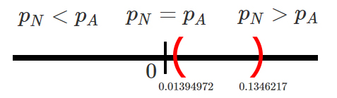
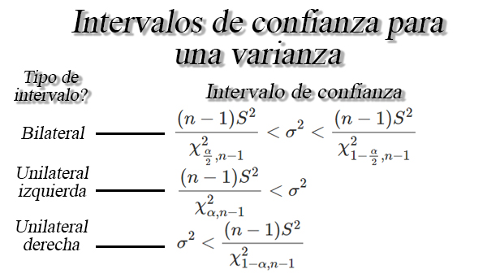

## Intervalos de confianza para una proporción `$p$`

Sea `$X_1,X_2, \ldots, X_n$` una muestra aleatoria *iid* de tamaño
`$n$`, tal que `$X\sim b(n,p)$` entonces si `$n$` es suficientemente
grande tal que `$n\geq30$`, y la proporción desconocida `$p$` no se
encuentre cercana a `$0$` o `$1$`, tal que `$np>5$` y `$n(1-p)>5$`,
entonces un intervalo de confianza para la proporción `$p$` es de la
forma 

<button id="Show6" class="btn btn-secondary">
Mostrar Ejercicio
</button>
<button id="Hide6" class="btn btn-info">
Ocultar Ejercicio
</button>
<main id="botoncito6">
<h3 data-toc-skip>
Ejercicio
</h3>

Suponga que se realiza un estudio sobre el salario de los estudiantes de
ingeniería industrial una vez finalizan su pregrado y se insertan en el
mercado laboral. Para ello, se le pregunta a \(15\) egresados
seleccionados de forma aleatoria y se les pregunta cuál es el salario
que devengan actualmente, obteniendo los siguientes resultados en
millones de pesos \[\begin{align*}
1.78 \quad 2.93 \quad 1.22 \quad 1.27 \quad 1.17 \\
1.03 \quad 1.24 \quad 2.07 \quad 2.04 \quad 1.28 \\
1.53 \quad 0.98 \quad 1.73 \quad 1.38 \quad 3.24
\end{align*}\]

Basados en la información anterior, construya un intervalo de confianza
del \(97\%\) para la verdadera proporción de egresados que tienen un
salario superior a \(2\) millones de pesos.

<h3 data-toc-skip>
Solución
</h3>

En este caso estamos interesados en el cálculo de un intervalo de
confianza del \(97\%\) para la proporción de egresados que poseen un
salario superior a \(2\) millones de pesos.     En donde, al no
mencionar un límite de confianza en particular se deberá realizar el
cálculo de un intervalo bilateral, el cual para el caso de una
proporción tiene la estructura

mostrando que el intervalo bilateral para el caso de una proporción está
dado por \[\begin{align*}
  \hat{p} \pm Z_{\frac{\alpha}{2}}\sqrt{\frac{\hat{p}(1-\hat{p})}{n}}
\end{align*}\]

En donde se observa que requerimos de la proporción muestral para
realizar el cálculo, y por tanto se deberá proceder a realizar su
cálculo, localizando en cuales valores muestrales se localiza un éxito,
el cual está dado por aquellos salarios que posean un valor superior a
\(2\) millones de pesos, y para ello, denotaremos como \(1\) aquellas
observaciones que sean superiores a \(2\) millones de pesos, y \(0\)
aquellas observaciones que no cumplan la condición, tal que
\[\begin{align*}
 \underset{0}{1.78} \quad \underset{1}{2.93} \quad \underset{0}{1.22} \quad \underset{0}{1.27} \quad \underset{0}{1.17} \\
\underset{0}{1.03} \quad \underset{0}{1.24} \quad \underset{1}{2.07} \quad \underset{1}{2.04} \quad \underset{0}{1.28} \\
\underset{0}{1.53} \quad \underset{0}{0.98} \quad \underset{0}{1.73} \quad \underset{0}{1.38} \quad \underset{1}{3.24}
\end{align*}\] Al contar el número de éxitos, observamos que tenemos un
total de \(x=4\) éxitos en un total de \(n=15\) muestras, y por tanto,
podemos aplicar la fórmula de frecuencia relativa para calcular la
proporción muestral de egresados que poseen salarios superiores a \(2\)
millones, tal que \[\begin{align*}
  \hat{p} &= \frac{\text{# éxitos}}{\text{Total ensayos}} \\
          &= \frac{x}{n} \\
          &= \frac{4}{15} \\
          &= 0.2666667
\end{align*}\]

Ahora, al emplear este valor junto con el nivel de confianza
\(1-\alpha=0.97\) y el valor crítico
\(Z_{\frac{\alpha}{2}=0.015}=2.17009\), para calcular el intervalo de
confianza de interés obtendremos que \[\begin{align*}
  & 0.2666667 \pm 2.17009\sqrt{\frac{0.2666667(1-0.2666667)}{15}} \\
  & 0.2666667 \pm 2.17009(0.1141798)\\
  & 0.2666667 \pm 0.2477804 \\
  & 0.0188863 < p < 0.5144471
\end{align*}\]

Por tanto, con una confianza del \(97\%\) se concluye que la verdadera
proporción de egresados que poseen un salario superior a \(2\) millones
de pesos, se encontrará entre \(1.89\%\) y \(51.44\%\).

</main>

## Intervalos de confianza para diferencia de proporciones `$p_1-p_2$`

Sea `$X_{1,1}, X_{1,2}, \ldots, X_{1,n_1}$` y
`$X_{2,1}, X_{2,2}, \ldots, X_{2,n_2}$` dos muestras aleatorias *iid* de
tamaños `$n_1$`, y `$n_2$`, tal que `$X_{1}\sim b(n,p)$` y
`$X_{1}\sim b(n,p)$`. Entonces si `$n_1$` y `$n_2$` son suficientemente
grandes tal que `$n_1, n_2 \geq30$`, y las proporciones desconocidas
`$p_1$` y `$p_2$` no se encuentran cercanas a `$0$` o `$1$`, tal que
`$n_1p_1>5$`, `$n_2p_2>5$`, `$n_1(1-p_1)>5$` y `$n_2(1-p_2)>5$`,
entonces un intervalo de confianza para la diferencia de proporciones
`$p_1-p_2$` es de la forma

<button id="Show7" class="btn btn-secondary">
Mostrar Ejercicio
</button>
<button id="Hide7" class="btn btn-info">
Ocultar Ejercicio
</button>
<main id="botoncito7">
<h3 data-toc-skip>
Ejercicio
</h3>

Una empresa de computación dedice realizar un cambio en el proceso de
fabricación de uno de los componentes que requiere en sus portátiles, y
está en interesado en saber si dicho cambio ofrece una mejora
significativa en la rendimiento que sus equipos ofrecen.    Para
determinar si el cambio en el proceso de fabricación mejora el
rendimiento que sus equipos ofrecen, deciden tomar una muestra de
equipos antes y después de la implementación del nuevo proceso de
fabricación y se evalúa la velocidad de procesamiento para la ejecución
de un programa determinado. Suponga que se encuentra que \(120\) de
\(500\) computadores fabricados con el método actual ofrece un
rendimiento superior al promedio, mientras que, \(220\) de \(700\)
computadores fabricados con el nuevo método ofrece un rendimiento
superior al promedio.    Basados en la información obtenida,
calcule un intervalo de confianza del \(99\%\) para la verdadera
diferencia entre las proporciones de equipos que ofrecen un rendimiento
superior al promedio entre el proceso de fabricación actual y el nuevo.
Es posible pensar que el nuevo proceso si mejora el rendimiento promedio
de los equipos de cómputo?

<h3 data-toc-skip>
Solución
</h3>

En este enunciado estamos interesados en construir un intervalo de
confianza del \(99\%\) para la diferencia entre la proporción de equipos
que son fabricados mediante un proceso de fabricación nuevo y aquellos
que son fabricados con un proceso de fabricación actual, en donde, se
debe construir un intervalo de confianza bilateral debido a que no nos
preguntan por un límite en específico.     Para llevar a cabo el
cálculo debemos revisar la información que poseemos. En primer lugar
observamos que nos hablan de los tamaños de muestra para cada una de las
poblaciones en donde el tamaño de muestra para los equipos fabricados
mediante el proceso de fabricación nuevo fue de \(n_N= 500\), mientras
que, el tamaño de muestra para lo equipos fabricados mediante el proceso
de fabricación actual es de \(n_A=700\).    Adicionalmente, se
presenta para cada valor de la muestra, el número de equipos que
ofrecieron una velocidad de procesamiento superior al promedio, siendo
dichos valores para los equipos fabricados con el proceso nuevo y actual
\(x_N=120\) y \(x_A=220\), respectivamente. Con estos valores es posible
realizar el cálculo de las proporciones muestrales para las dos
poblaciones, tal que para el caso de los equipos que fueron construidos
con el nuevo procedimiento tenemos que \[\begin{align*}
\hat{p}_N &= \frac{\text{# de equipos nuevos con rendimiento superior}}{\text{Total equipos nuevos evaluados}} \\
          &= \frac{x_N}{n_N} \\
          &= \frac{220}{700} \\
          &= 0.3142857
\end{align*}\] mientras que, para los equipos que fueron construidos con
el procedimiento actual tenemos que \[\begin{align*}
\hat{p}_A &= \frac{\text{# de equipos actuales con rendimiento superior}}{\text{Total equipos actuales evaluados}} \\
          &= \frac{x_A}{n_A} \\
          &= \frac{120}{500} \\
          &= 0.24
\end{align*}\] Ahora, dado que el intervalo que nos piden es bilateral,
y tenemos que los tamaños muestrales para cada población son
suficientemente grandes, tenfremos que el intervalo de interés es de la
forma

y por tanto como el intervalo de interés es de la forma, el calculo que
debemos hacer tendrá la forma \[\begin{align*}
  (\hat{p}_N-\hat{p}_A) \pm Z_{\alpha}\sqrt{\frac{\hat{p}_N(1-\hat{p}_N)}{n_N}+\frac{\hat{p}_A(1-\hat{p}_A)}{n_A}}
\end{align*}\]

En donde se observa que entre los valores ya calculados para las
proporciones muestrales, se requiere del nivel de confianza
\(1-\alpha=0.99\) y el valor crítico \(Z_{\alpha=0.01}=2.326348\). Al
reemplazar estos valores en el intervalo de interés obtenemos que
\[\begin{align*}
  & (0.3142857-0.24) \pm 2.326348\sqrt{\frac{0.3142857(1-0.3142857)}{700}+\frac{0.24(1-0.24)}{500}} \\
  &0.0742857 \pm 2.326348 (0.02593592) \\
  &0.0742857 \pm 0.06033598 \\
  &0.01394972 < p_N - p_A < 0.1346217
\end{align*}\]

Dado el resultado anterior, se concluye con una confianza del del
\(99\%\) que la diferencia entre la proporción de equipos que son
fabricados mediante un proceso de fabricación nuevo y aquellos que son
fabricados con un proceso de fabricación actual se encontrará entre
\(1.39\%\) y \(13.46\%\).    Ahora, como el intervalo es
bilateral, podemos verificar si existen o no diferencias significativas
entre la proporción de equipos que son fabricados mediante el nuevo
proceso de fabricación y aquellos que son fabricados mediante el proceso
actual, y para ello debemos verificar la posición en la que se encuentra
el intervalo de confianza para la diferencia entre \(p_N - p_A\).

En donde se observa que el intervalo calculado se encuentra sobre el
valor de \(0\), el cual representa la igualdad entre las dos
proporciones, tal que \[\begin{align*}
  p_N = p_A \quad =>\quad p_N - p_A = 0
\end{align*}\]

y por tanto, podremos afirmar con un nivel de confianza del \(99\%\) que
la proporción de equipos que ofrece un redimiento superior al promedio y
son fabricados mediante el nuevo proceso, es superior a la proporción de
aquellos fabricados mediante el proceso actual.

</main>

## Intervalos de confianza para una varianza `$\sigma^2$`

Sea `$X_{1}, X_{2}, \ldots, X_{n}$` una muestra aleatoria normal de
tamaño `$n$` con media `$\mathbb{E}(X)=\mu$` y varianza desconocida
`$Var(X)=\sigma^2<\infty$`, respectivamente, entonces un intervalo de
confianza del `$100(1-\alpha)\%$` para una varianza `$\sigma^2$` estará
dado por

<button id="Show8" class="btn btn-secondary">
Mostrar Ejemplo
</button>
<button id="Hide8" class="btn btn-info">
Ocultar Ejemplo
</button>
<main id="botoncito8">
<h3 data-toc-skip>
Intervalo de confianza para una varianza
</h3>

En construcción D:.

</main>

## Intervalos de confianza para razón de varianzas `$\sigma^2_1/\sigma^2_2$`

Sea `$X_{1,1}, X_{1,2}, \ldots, X_{1,n_1}$` y
`$X_{2,1}, X_{2,2}, \ldots, X_{2,n_1}$` dos muestras aleatorias normales
de tamaños `$n_1$`, y `$n_2$` con medias `$\mathbb{E}(X_{1})=\mu_1$` y
`$\mathbb{E}(X_{2})=\mu_2$`, y varianzas desconocidas
`$Var(X_{1})=\sigma_1^2<\infty$` y `$Var(X_{2})=\sigma^2_2<\infty$`,
respectivamente, entonces un intervalo de confianza del
`$100(1-\alpha)\%$` para `$\sigma^2_1/\sigma^2_2$` estará dada por

<button id="Show9" class="btn btn-secondary">
Mostrar Ejercicio
</button>
<button id="Hide9" class="btn btn-info">
Ocultar Ejercicio
</button>
<main id="botoncito9">
<h3 data-toc-skip>
Ejercicio
</h3>

Se aplican pruebas a \(10\) cables conductores soldados a un dispositivo
semiconductor con el fin de determinar su resistencia a la tracción. Las
pruebas demostraron que para romper la unión se requiere las libras de
fuerza que se listan a continuación.

<pre style="font-family: 'Open Sans',sans-serif; margin-bottom: -4rem; margin-top: -4rem; font-size: 120%;">
<table class="table table-striped" style="width: auto !important; margin-left: auto; margin-right: auto;">
<thead>
  <tr>
    <td style="font-weight: bold">Sin Encapsulado</td>
    <td>19.8</td>
    <td>12.7</td>
    <td>13.2</td>
    <td>16.9</td>
    <td>10.6</td>
    <td>18.8</td>
    <td>11.1</td>
    <td>14.3</td>
    <td>17.0</td>
    <td>12.5</td>
    </tr>
</thead>
</table>
</pre>

Otra conjunto de \(8\) cables conductores que forman otro dispositivo,
se encapsulan y se prueban para determinar si el encapsulado aumenta la
resistencia a la tracción, obteniendo para este caso se requirieron las
siguientes libras de fuerza para romper la unión

<pre style="font-family: 'Open Sans',sans-serif; margin-bottom: -4rem; margin-top: -4rem; font-size: 120%;">
<table class="table table-striped" style="width: auto !important; margin-left: auto; margin-right: auto;">
<thead>
  <tr>
    <td style="font-weight: bold">Con Encapsulado</td>
    <td>24.9</td>
    <td>22.9</td>
    <td>23.6</td>
    <td>22.1</td>
    <td>20.3</td>
    <td>21.6</td>
    <td>21.9</td>
    <td>22.5</td>
    </tr>
</thead>
</table>
</pre>

Si se supone que las resistencias a la tracción se distribuyen
normalmente, construya un intervalo del \(90\%\) para la razón de
varianzas entre la variabilidad de los cables sin encapsulado y la
variabilidad de los cables con encapsulado. Es posible afirmar que la
variabilidad de de los cables con encapsulado es superior a los cables
sin encapsulado?

<h3 data-toc-skip>
Solución
</h3>

En este punto nos mencionan que se tiene interés en calcular un
intervalo de confianza para el cociente de las varianzas asociadas a la
resistencia a la tracción para cables sin encapsulado y cables con
encapsulado. Además nos mencionan que la resistencia a la tracción hasta
la ruptura se distribuye normalmente, y por tanto deberemos calcular el
siguiente intervalo

en donde se aprecia que el intervalo bilateral para la razón de
varianzas posee la estructura \[\begin{align*}
   \frac{S^2_C}{S^2_S}\frac{1}{f_{\alpha/2, n_C-1, n_S-1}} < \frac{\sigma^2_C}{\sigma^2_S} < \frac{S^2_C}{S^2_S}f_{\alpha/2, n_S-1, n_C-1}
\end{align*}\]

En donde se observa que para realizar el cálculo del intervalo, se
requiere de los varianzas muestrales \(S^2_S\) y \(S^2_C\), el nivel de
confianza \(1-\alpha\) y los valores críticos
\(f_{\alpha/2, n_C-1, n_S-1}\) y \(f_{\alpha/2, n_S-1, n_C-1}\).  
  Para realizar el cálculo de las varianzas muestrales, se emplean
los datos muestrales y los tamaños de muestra \(n_C=8\) y \(n_S=10\),
tal que al realizar el cálculo obtenemos

\[\begin{align*}
S^2_C = 1.378146 \quad \text{ y } \quad S^2_S = 3.231254
\end{align*}\]

Por su parte, al buscar los valores críticos para un nivel de
significancia \(1-\alpha=0.90\) y tamaños muestrales \(n_C=8\) y
\(n_S=10\) tenemos que

\[\begin{align*}
f_{\alpha/2 = 0.05, n_C-1 = 7, n_S-1 = 9} = 3.292746\\ 
f_{\alpha/2 = 0.05, n_S-1 = 9, n_C-1 = 7} = 3.676675
\end{align*}\]

Una vez calculados los valores necesarios para calcular el intervalo de
confianza, se procede a su cálculo, tal que \[\begin{align*}
   \frac{1.378146}{3.231254}\frac{1}{3.292746} &< \frac{\sigma^2_C}{\sigma^2_S} < \frac{1.378146}{3.231254}3.676675 \\
   0.1295287 &< \frac{\sigma^2_C}{\sigma^2_S} < 1.56812
\end{align*}\]

Por tanto, se podrá concluir con un nivel de confianza del \(90\%\) que
el verdadero valor para el cociente de varianzas entre la variabilidad
de los cables sin encapsulado y la variabilidad de los cables con
encapsulado, se encontrará entre \(0.1295287\) y \(1.56812\).   
Ahora, para verificar si existen o no diferencias significativas entre
las varianzas de resistencia a la tracción de los cables encapsulados o
sin encapsular, debemos verificar la posición en la que se encuentra el
intervalo de confianza para la razón de varianzas
\(\sigma^2_C/\sigma^2_S\).

En donde se observa que el intervalo calculado contiene el valor de
\(1\), el cual representa la igualdad entre la varianza de los dos tipos
de cable, tal que \[\begin{align*}
  \sigma^2_C = \sigma^2_S \quad =>\quad \frac{\sigma^2_C}{\sigma^2_S} = 1
\end{align*}\]

y por tanto, con un nivel de confianza del \(90\%\) no será posible
afirmar que la variabilidad de la resistencia a la tracción de los
cables encapsulados o sin encapsular sean diferentes, y por tanto, debe
asumirse que éstos son iguales.

</main>
