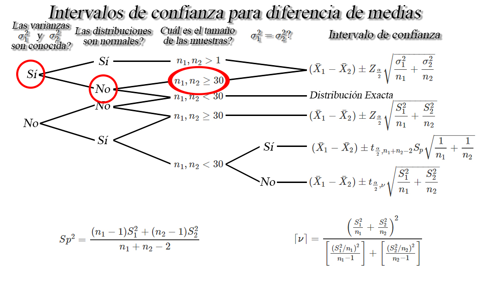
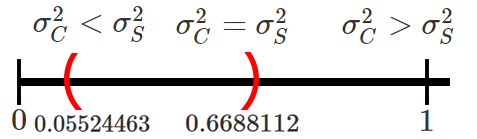

## Intervalos de confianza para diferencia de medias `$\mu_1 - \mu_2$`

Sea `$X_{1,1}, X_{1,2}, \ldots, X_{1,n_1}$` y
`$X_{2,1}, X_{2,2}, \ldots, X_{2,n_2}$` dos muestras aleatorias *iid* de
tamaños `$n_1$`, y `$n_2$` con medias desconocidas
`$\mathbb{E}(X_{1})=\mu_1$` y `$\mathbb{E}(X_{2})=\mu_2$`, y varianzas
`$Var(X_{1})=\sigma_1^2<\infty$` y `$Var(X_{2})=\sigma^2_2<\infty$`,
respectivamente, entonces dependiendo de las condiciones, se tendrán los
siguientes intervalos de confianza para la diferencia de medias
`$\mu_1 - \mu_2$`.

<button id="Show1" class="btn btn-secondary">
Mostrar Ejercicio 1
</button>
<button id="Hide1" class="btn btn-info">
Ocultar Ejercicio 1
</button>
<main id="botoncito1">
<h3 data-toc-skip>
Ejercicio
</h3>

Una empresa envía a \(12\) de sus agentes de ventas a un curso diseñado
para incrementar la motivación, y por tanto, presuntamente su
efectividad. Un año después, estos agentes generan unas ventas con un
valor promedio de \(43.5\) millones de pesos y una desviación estándar
de \(5.6\) millones de pesos.    Durante el mismo periodo, se
extrajo una muestra aleatoria independiente de \(15\) personas que no
habían asistido al curso y las ventas medias generadas y su desviación
estándar fueron de \(40.8\) y \(4.3\) millones de pesos respectivamente.
    Si es posible suponer que las poblaciones se distribuyen
normalmente con varianzas iguales a \(28\) millones de pesos\(^2\) para
quienes se capacitaron y a \(20\) millones de pesos\(^2\) para quienes
no se capacitaron, construya un intervalo de confianza del \(90\%\) para
la diferencia entre los promedios de ventas de los dos grupos. Es
posible pensar que los cursos de motivación mejoran el promedio de
ventas sobre quienes no recibieron estos cursos?

<h3 data-toc-skip>
Solución
</h3>

En este ejercicio estamos interesados en construir un intervalo de
confianza bilateral para la diferencia entre el promedio de ventas de
las personas que asisten a un curso de capacitación, respecto a las
personas que no asisten a dicho curso, y para ello debemos revisar la
información presentada en el enunciado.     En donde, se observa
que nos dan el valor de las medias y desviaciones estándar muestrales
para cada uno de los grupos, además nos menciona que las poblaciones se
distribuyen normalmente con varianzas poblacionales conocidas e iguales
a \(28\) millones de pesos\(^2\) para quienes se capacitaron y a \(20\)
millones de pesos\(^2\) para quienes no se capacitaron, y por tanto
estamos en la situación

y por tanto como el intervalo es bilateral, el calculo que debemos hacer
tendrá la forma \[\begin{align*}
  (\bar{X}_C-\bar{X}_S) \pm Z_{\frac{\alpha}{2}}\sqrt{\frac{\sigma^2_C}{n_C}+\frac{\sigma^2_S}{n_S}}
\end{align*}\]

Para realizar el cálculo requerimos de las media muestrales
\(\bar{X}_C=43.5\) y \(\bar{X}_S=40.8\), las varianzas poblacionales
\(\sigma^2_C=5.6\) y \(\sigma^2_S=4.3\), los tamaños de muestrales
\(n_C=12\) y \(n_S=15\), el nivel de confianza \(1-\alpha=0.90\) y el
valor crítico \(Z_{\frac{\alpha}{2}=0.05}=1.644854\) calculado a partir
del nivel de confianza. Al reemplazar en el intervalo tenemos que
\[\begin{align*}
  &(43.5-40.8) \pm 1.644854\sqrt{\frac{5.6}{12}+\frac{4.3}{15}} \\
  &2.7 \pm 1.644854(0.8679478) \\
  &2.7 \pm 1.427647 \\
  &1.272353 < \mu_C - \mu_S < 4.127647
\end{align*}\]

Entonces podremos afirmar con un nivel de confianza del \(90\%\), de que
la diferencia entre el promedio de ventas de las personas que asisten a
un curso de capacitación, respecto a las personas que no asisten a dicho
curso de capacitación, se encuentra entre \(1.272353\) y \(4.127647\)
millones de pesos.     Ahora, para saber si la capacitación mejora
o no las ventas hay que tener en cuenta la posición en la que se
encuentre el intervalo para la diferencia entre \(\mu_C - \mu_S\).

En donde se observa que la totalidad del intervalo se encuentra
localizado en la sección que es mayor a \(0\), lo cual indica que para
todo el intervalo de confianza del \(90\%\) el promedio de ventas del
grupo que recibió un curso de capacitación \(\mu_C\) es mayor al
promedio de quienes no recibieron capacitación \(mu_S\), y por tanto, se
podrá concluir que la capacitación si mejora el promedio de ventas y se
recomendará a la empresa que envíe a capacitación al resto de empleados.

</main>
<button id="Show2" class="btn btn-secondary">
Mostrar Ejercicio 2
</button>
<button id="Hide" class="btn btn-info">
Ocultar Ejercicio 2
</button>
<main id="botoncito2">
<h3 data-toc-skip>
Ejercicio
</h3>

La gobernación de Antioquia, desea realizar un estudio sobre el peso de
los niños y las niñas que se encuentran cursando su primaria en los
colegios ubicados en las regiones del departamento, y decide contratar a
un grupo de investigación la Universidad de Antioquia para llevar a cabo
dicho estudio.    El grupo de investigación decide tomar una
muestra aleatoria de \(22\) niños y \(28\) niñas que se encuentran
realizando sus estudios de primaria entre los colegios que hay en la
región antioqueña, encontrando que el peso promedio y desviación
estándar de los niños fue de \(52\) kilos con una desviación estándar de
\(8\) kilos, mientras que el peso promedio y desviación estándar de las
niñas fue de \(46\) kilos con una desviación estándar de \(6.2\) kilos.
    Si el peso de los niños y niñas puede asumirse como una normal
con varianzas iguales, construya un intervalo de confianza del \(90\%\)
para la diferencia promedio que hay entre el peso de los niños y las
niñas. Es posible pensar que hay diferencias significativas entre los
pesos promedio de los dos grupos?.

<h3 data-toc-skip>
Solución
</h3>

En este enunciado estamos interesados en construir un intervalo de
confianza del \(90\%\) para la diferencia promedio entre el peso de los
niños y las niñas. En donde, el intervalo de confianza será bilateral
debido a que no especifican que se debe calcular el límite superior o
inferior solamente. Para saber cuál es el intervalo de interés, debemos
revisar la información presentada en el enunciado.     En el
enunciado se aprecia que nos dan las medias y desviaciones estándar
muestrales para cada uno de los grupos, obtenidos a partir de muestras
de tamaños \(22\) y \(28\), respectivamente. Además, se menciona que el
peso de los niños y las niñas se distribuye normalmente con varianzas
desconocidas pero iguales, y por tanto estaremos en la siguiente
situación

y por tanto como el intervalo es bilateral, el calculo que debemos hacer
tendrá la forma \[\begin{align*}
  (\bar{X}_H-\bar{X}_M) \pm t_{\frac{\alpha}{2}, n_H+n_M-2}S_p\sqrt{\frac{1}{n_H}+\frac{1}{n_M}}
\end{align*}\]

En donde observamos que entre otros valores, requerimos calcular el
valor de la desviación estándar conjunta \(Sp\), la cual está dada por

\[\begin{align*}
Sp^2 &= \frac{(n_H-1)S^2_H + (n_M-1)S^2_M}{n_H+n_M-2} \\
     &= \frac{(22-1)8^2 + (28-1)6.2^2}{22 + 28 - 2} \\
     &= 49.6225
\end{align*}\] y por tanto \[\begin{align*}
Sp &= \sqrt{Sp^2} \\
   &= \sqrt{49.6225} \\
   &= 7.044324
\end{align*}\]

Ahora, los valores adicionales que se requieren para realizar el cálculo
del intervalo de confianza serán, las medias muestrales
\(\bar{X}_H=52\), y \(\bar{X}_M=46\), los tamaños muestrales \(n_H=22\)
y \(n_M=28\), el nivel de confianza \(1-\alpha=0.90\) y el valor crítico
\(t_{\frac{\alpha}{2}=0.05, n_H+n_M-2 = 28}=1.701131\). Al reemplazar
estos valores en el intervalo de interés obtenemos que \[\begin{align*}
  &(52-46) \pm 1.701131(7.044324)\sqrt{\frac{1}{22}+\frac{1}{28}} \\
  &6 \pm 1.701131(7.044324)(0.2849014)\\
  &2.7 \pm 3.414064 \\
  &-0.714064 < \mu_H - \mu_M < 6.114064
\end{align*}\]

Por tanto, con un nivel de confianza del \(90\%\) se tendrá que la
diferencia entre el peso promedio de los niños y el peso promedio de las
niñas se encontrará entre \(-0.714064\) y \(6.114064\) kilogramos.  
  Ahora, para saber si existe diferencias significativas entre los
pesos promedio de niños y niñas debemos tener en cuenta la posición en
la que se encuentre el intervalo para la diferencia entre
\(\mu_H - \mu_M\).

En donde se observa que el intervalo encontrado contiene el valor \(0\),
el cual simboliza la igualdad entre los pesos promedio de niños y niñas,
tal que \[\begin{align*}
  \mu_H = \mu_M \quad =>\quad \mu_H - \mu_M = 0
\end{align*}\]

y por tanto, con un nivel de confianza del \(90\%\) no será posible
afirmar que existen diferencias significativas entre los pesos promedio
de niños y niñas.

</main>
<button id="Show3" class="btn btn-secondary">
Mostrar Ejercicio 3
</button>
<button id="Hide3" class="btn btn-info">
Ocultar Ejercicio 3
</button>
<main id="botoncito3">
<h3 data-toc-skip>
Ejercicio
</h3>

Suponga que la Universidad de Antioquia adelanta un estudio sobre el
salario de sus egresados y desea comparar si es cierta la creencia que
las mujeres ganan en promedio menos dinero que los hombres.    
Para comprobar si las creencias son ciertas, un grupo de investigación
de la Universidad toma una muestra representativa de \(250\) mujeres y
\(270\) hombres egresados de la Universidad y se les pregunta sobre cuál
es el salario que ganan actualmente, obteniendo en su investigación que
las mujeres ganan en promedio \(2.3\) millones de pesos con una
desviación estándar de \(0.7\) millones de pesos, mientras que los
hombres ganan en promedio \(2.6\) millones de pesos con una desviación
estándar de \(1.2\) millones de pesos.    Si el grupo de
investigación encuentra que los salarios no se distribuyen normalmente,
calcule el límite superior para la diferencia promedio del salario de
sus egresados hombres y egresados mujeres. Emplee un nivel de confianza
de \(80\%\).

<h3 data-toc-skip>
Solución
</h3>

En este enunciado estamos interesados en calcular el límite superior
para la diferencia promedio entre el salario de hombres y mujeres que
egresaron de la Universidad, la cual está dada por \(\mu_H - \mu_M\),
empleando para ello un nivel de confianza del \(80\%\). Ahora, para
identificar el intervalo de interés, debemos revisar la información
presentada por el grupo de investigación de la Universidad.     El
cual a partir de una muestra de \(250\) mujeres y \(270\) hombres,
encontró unos salarios promedios iguales a \(2.3\) y \(2.6\), con
desviaciones estándar de \(0.7\) y \(1.2\), respectivamente. Además
encuentra que los salarios no se distribuyen normalmente, y al no
mencionar cuales son las varianzas poblacionales, se asume que éstas no
son conocidas, y por tanto estaremos en la siguiente situación dado que
los tamaños muestrales son mayores a \(30\).

y por tanto al ser un intervalo unilateral derecho (límite superior), el
calculo que debemos hacer tendrá la forma \[\begin{align*}
  \mu_H - \mu_M < (\bar{X}_H-\bar{X}_M) + Z_{\alpha}\sqrt{\frac{S^2_H}{n_H}+\frac{S^2_M}{n_M}}
\end{align*}\]

en donde se observa que al ser unilateral derecho, el intervalo solo
cuenta con la suma de la resta de medias muestrales y el término de
error, además de que, el valor crítico solo será para el valor
\(\alpha\), y no \(\alpha/2\) como es el caso de los intervalos
bilaterales.     Ahora, al reemplazar los valores encontrados por
el grupo de investigación \(n_H=270\), \(\bar{X}_H=2.6\), \(S_H=1.2\)
para los hombres, \(n_M=250\), \(\bar{X}_M=2.3\), \(S_M=0.7\) para las
mujeres, el nivel de confianza \(1-\alpha = 0.80\) y el valor crítico
\(Z_{\alpha=0.2}=0.8416212\), tendremos que \[\begin{align*}
  &\mu_H - \mu_M < (2.6-2.3) + 0.8416212\sqrt{\frac{1.2^2}{270}+\frac{0.7^2}{250}} \\
  &\mu_H - \mu_M < 0.3 + 0.8416212(0.08540101)\\
  &\mu_H - \mu_M < 0.3 + 0.0718753 \\
  &\mu_H - \mu_M < 0.3718753
\end{align*}\]

Por tanto, se tendrá que el valor máximo que se espera tener parar la
diferencia entre los salarios promedio de hombres y mujeres es de
\(0.3718753\) millones de pesos, lo anterior con un nivel de confianza
del \(80\%\).

</main>
<button id="Show4" class="btn btn-secondary">
Mostrar Ejercicio 4
</button>
<button id="Hide4" class="btn btn-info">
Ocultar Ejercicio 4
</button>
<main id="botoncito4">
<h3 data-toc-skip>
Ejercicio
</h3>

Se realiza un estudio con el fin de comparar el rendimiento de
combustible en kilómetros por galón para dos tipos de motores \(A\) y
\(B\). Suponga que se decide realizar un total de \(47\) experimentos
con el motor \(A\) y \(56\) experimentos con el motor \(B\), encontrando
para cada caso, un rendimiento promedio de gasolina de \(44\) y \(48\)
kilómetros, respectivamente, con desviaciones estándar de \(8.3\) y
\(6.6\), respectivamente.     Basados en la información anterior,
calcule el límite inferior para la diferencia promedio entre los
rendimiento de combustible en kilómetro por galón de gasolina para los
motores \(B\) y \(A\), empleando un nivel de confianza del \(88\%\).
Suponga que los rendimientos de los combustibles no poseen una
distribución normal, pero se tiene que las varianzas son conocidas e
iguales a \(38.44\) y \(57.76\) para las maderas \(A\) y \(B\)
respectivamente.

<h3 data-toc-skip>
Solución
</h3>

En este caso estamos interesados en calcular el límite inferior de un
intervalo de confianza del \(88\%\) para la diferencia promedio entre el
rendimiento de combustible en kilómetros por galón de gasolina que
ofrecen dos tipos de motores \(B\) y \(A\), tal que , \(\mu_B - \mu_A\),
y para calcular este límite inferior debemos revisar la información que
poseemos.    Del enunciado se menciona que los rendimientos de
combustible no poseen una distribución normal, pero se menciona que las
varianzas poblacionales son conocidas e iguales a \(\sigma^2_A=38.44\) y
\(\sigma^2_B=57.56\) para las maderas \(A\) y \(B\). En consecuencia,
tendremos que el intervalo de interés será el siguiente

y como estamos interesados en el límite inferior, el calculo que debemos
hacer tendrá la forma \[\begin{align*}
  (\bar{X}_B-\bar{X}_A) - Z_{\alpha}\sqrt{\frac{\sigma^2_B}{n_B}+\frac{\sigma^2_A}{n_A}}
\end{align*}\]

Para realizar el cálculo del intervalo, se aprecia que requerimos de los
tamaños muestrales \(n_A=47\) y \(n_B=56\), las medias muestrales
\(\bar{X}_A=44\), y \(\bar{X}_B=48\), las varianzas poblacionales
\(\sigma^2_A=38.44\) y \(\sigma^2_B=57.56\), el nivel de confianza
\(1-\alpha=0.88\) y el valor crítico \(Z_{\alpha=0.12}=1.174987\). Al
reemplazar estos valores en el intervalo de interés obtenemos que
\[\begin{align*}
  & (48-44) - 1.174987\sqrt{\frac{57.56}{56}+\frac{38.44}{47}} \\
  & 4 - 1.174987(1.358576)\\
  & 4 - 1.596309 \\
  & 2.403691 < \mu_B - \mu_A 
\end{align*}\]

y por tanto, se tendrá un con un nivel de confianza del \(88\%\), que el
límite inferior para la diferencia promedio entre los rendimiento de
combustible en kilómetro por galón de gasolina para los motores \(B\) y
\(A\) será de \(2.403691\) kilómetros.

</main>
<button id="Show5" class="btn btn-secondary">
Mostrar Ejercicio 5
</button>
<button id="Hide5" class="btn btn-info">
Ocultar Ejercicio 5
</button>
<main id="botoncito5">
<h3 data-toc-skip>
Ejercicio
</h3>

Suponga que se contrata a un grupo de investigación de la Universidad de
Antioquia para que realice un análisis de tensión sobre la unión pegada
con una resina experimental a dos clases diferentes de madera. Para
realizar el estudio, el grupo de investigación toma una muestra
aleatoria de \(18\) uniones pegadas con la resina especial a la madera
\(A\) y encontró que la tensión promedio de corte y desviación estándar
fueron de \(1130_{psi}\) y \(420_{psi}\), respectivamente. Por su parte,
toman una muestra aleatoria de \(12\) uniones pegadas con la resina
especial a la madera \(B\), encontrando que la tensión promedio de corte
y desviación estándar fueron de \(1010_{psi}\) y \(380_{psi}\).   
Si se asume que la tensión sobre la unión pegada con la resina
experimental en cada clase de madera se distribuye aproximadamente
normal con varianzas diferentes. Construya un intervalo de confianza del
\(92\%\) para la diferencia de tensión promedio de corte para las dos
marcas de madera.

<h3 data-toc-skip>
Solución
</h3>

En este enunciado estamos interesados en construir un intervalo de
confianza del \(92\%\) para la diferencia entre los promedio a la
tensión sobre la unión pegada con una resina experimental para dos
clases de madera \(A\) y \(B\). En este caso, el intervalo de confianza
que se empleará será bilateral dado que no nos mencionan que se realice
el cálculo del límite superior o inferior para la diferencia. Para saber
cuál es el intervalo de interés, debemos revisar la información
calculada por el grupo de investigación.     De los datos
calculados por el grupo de investigación, encontramos que se realizó una
selección de \(18\) y \(12\) uniones para las maderas \(A\) y \(B\)
respectivamente, para las cuales se encontró de forma respectiva unas
medias muestrales de \(1130_{psi}\) y \(1010_{psi}\) junto a unas
desviaciones estándar de \(420_{psi}\) y \(380_{psi}\). Además, se
menciona de que las dos poblaciones se distribuyen de forma
aproximadamente normal con varianzas diferentes y en consecuencia se
tendrá el siguiente caso

y por tanto como el intervalo es bilateral, el calculo que debemos hacer
tendrá la forma \[\begin{align*}
  (\bar{X}_A-\bar{X}_B) \pm t_{\frac{\alpha}{2}, \nu}\sqrt{\frac{S^2_A}{n_A}+\frac{S^2_B}{n_B}}
\end{align*}\]

En donde se observa que entre otros valores, requerimos calcular el
valor de los grados de libertad \(\nu\), tal que

\[\begin{align*}
\nu &= \frac{\left(\frac{S^2_A}{n_A} + \frac{S^2_B}{n_B}\right)^2}{\frac{(S^2_A/n_A)^2}{n_A-1} + \frac{(S^2_B/n_B)^2}{n_B-1}} \\
    &= \frac{\left(\frac{420^2}{12} + \frac{380^2}{18}\right)^2}{\frac{(480^2/12)^2}{12-1} + \frac{(380^2/18)^2}{18-1}} \\
    &= \frac{476694444}{18813149} \\
    &= 25.33837
\end{align*}\]

Al calcular el valor techo de \(\nu\) tendremos que \[\begin{align*}
\nu               &= 25.33837 \\
\lceil \nu \rceil &= \lceil25.33837\rceil \\
\lceil \nu \rceil &= 26
\end{align*}\]

y por tanto. se tendrá que los grados de libertad asociados a la
distribución \(t\) serán iguales a \(\nu= 26\). Ahora, los valores
adicionales que se requieren para realizar el cálculo del intervalo de
interés serán los tamaños muestrales \(n_A=12\) y \(n_B=18\), las medias
muestrales \(\bar{X}_A=1130\), y \(\bar{X}_B=1010\), las desviaciones
estándar muestrales \(S_A=420\) y \(S_B=380\), el nivel de confianza
\(1-\alpha=0.92\) y el valor crítico
\(t_{\frac{\alpha}{2}=0.04, \nu = 26}=1.821863\). Al reemplazar estos
valores en el intervalo de interés obtenemos que \[\begin{align*}
  & (1130-1010) \pm 1.821863\sqrt{\frac{420^2}{12}+\frac{380^2}{18}} \\
  & 120 \pm 1.821863(150.7389)\\
  & 120 \pm 274.6256 \\
  & -154.6256 < \mu_A - \mu_B < 394.6256
\end{align*}\]

De lo anterior, se concluye que con una confianza del \(92\%\), la
diferencia promedio entre la tensión promedio de corte entre las maderas
\(A\) y \(B\) se encontrará entre \(-154.6256_{psi}\) y
\(394.6256_{psi}\).     Ahora, como el intervalo es bilateral,
podemos verificar si existen o no diferencias significativas entre la
tensión promedio de corte de dos tipos de madera, y para ello debemos
verificar la posición en la que se encuentra el intervalo de confianza
para la diferencia entre \(\mu_A - \mu_B\).

En donde se observa que el intervalo calculado contiene el valor de
\(0\), el cual representa la igualdad entre la tensión promedio de corte
de dos tipos de madera, tal que \[\begin{align*}
  \mu_A = \mu_B \quad =>\quad \mu_A - \mu_B = 0
\end{align*}\]

y por tanto, con un nivel de confianza del \(92\%\) no será posible
afirmar que existen diferencias significativas entre la tensión promedio
de corte de dos tipos de madera.

</main>

## Intervalos de confianza para una proporción `$p$`

Sea `$X_1,X_2, \ldots, X_n$` una muestra aleatoria *iid* de tamaño
`$n$`, tal que `$X\sim b(n,p)$` entonces si `$n$` es suficientemente
grande tal que `$n\geq30$`, y la proporción desconocida `$p$` no se
encuentre cercana a `$0$` o `$1$`, tal que `$np>5$` y `$n(1-p)>5$`,
entonces un intervalo de confianza para la proporción `$p$` es de la
forma 

<button id="Show6" class="btn btn-secondary">
Mostrar Ejercicio
</button>
<button id="Hide6" class="btn btn-info">
Ocultar Ejercicio
</button>
<main id="botoncito6">
<h3 data-toc-skip>
Ejercicio
</h3>

Suponga que se realiza un estudio sobre el salario de los estudiantes de
ingeniería industrial una vez finalizan su pregrado y se insertan en el
mercado laboral. Para ello, se le pregunta a \(15\) egresados
seleccionados de forma aleatoria y se les pregunta cuál es el salario
que devengan actualmente, obteniendo los siguientes resultados en
millones de pesos \[\begin{align*}
1.78 \quad 2.93 \quad 1.22 \quad 1.27 \quad 1.17 \\
1.03 \quad 1.24 \quad 2.07 \quad 2.04 \quad 1.28 \\
1.53 \quad 0.98 \quad 1.73 \quad 1.38 \quad 3.24
\end{align*}\]

Basados en la información anterior, construya un intervalo de confianza
del \(97\%\) para la verdadera proporción de egresados que tienen un
salario superior a \(2\) millones de pesos.

<h3 data-toc-skip>
Solución
</h3>

En este caso estamos interesados en el cálculo de un intervalo de
confianza del \(97\%\) para la proporción de egresados que poseen un
salario superior a \(2\) millones de pesos.     En donde, al no
mencionar un límite de confianza en particular se deberá realizar el
cálculo de un intervalo bilateral, el cual para el caso de una
proporción tiene la estructura

mostrando que el intervalo bilateral para el caso de una proporción está
dado por \[\begin{align*}
  \hat{p} \pm Z_{\frac{\alpha}{2}}\sqrt{\frac{\hat{p}(1-\hat{p})}{n}}
\end{align*}\]

En donde se observa que requerimos de la proporción muestral para
realizar el cálculo, y por tanto se deberá proceder a realizar su
cálculo, localizando en cuales valores muestrales se localiza un éxito,
el cual está dado por aquellos salarios que posean un valor superior a
\(2\) millones de pesos, y para ello, denotaremos como \(1\) aquellas
observaciones que sean superiores a \(2\) millones de pesos, y \(0\)
aquellas observaciones que no cumplan la condición, tal que
\[\begin{align*}
 \underset{0}{1.78} \quad \underset{1}{2.93} \quad \underset{0}{1.22} \quad \underset{0}{1.27} \quad \underset{0}{1.17} \\
\underset{0}{1.03} \quad \underset{0}{1.24} \quad \underset{1}{2.07} \quad \underset{1}{2.04} \quad \underset{0}{1.28} \\
\underset{0}{1.53} \quad \underset{0}{0.98} \quad \underset{0}{1.73} \quad \underset{0}{1.38} \quad \underset{1}{3.24}
\end{align*}\] Al contar el número de éxitos, observamos que tenemos un
total de \(x=4\) éxitos en un total de \(n=15\) muestras, y por tanto,
podemos aplicar la fórmula de frecuencia relativa para calcular la
proporción muestral de egresados que poseen salarios superiores a \(2\)
millones, tal que \[\begin{align*}
  \hat{p} &= \frac{\text{# éxitos}}{\text{Total ensayos}} \\
          &= \frac{x}{n} \\
          &= \frac{4}{15} \\
          &= 0.2666667
\end{align*}\]

Ahora, al emplear este valor junto con el nivel de confianza
\(1-\alpha=0.97\) y el valor crítico
\(Z_{\frac{\alpha}{2}=0.015}=2.17009\), para calcular el intervalo de
confianza de interés obtendremos que \[\begin{align*}
  & 0.2666667 \pm 2.17009\sqrt{\frac{0.2666667(1-0.2666667)}{15}} \\
  & 0.2666667 \pm 2.17009(0.1141798)\\
  & 0.2666667 \pm 0.2477804 \\
  & 0.0188863 < p < 0.5144471
\end{align*}\]

Por tanto, con una confianza del \(97\%\) se concluye que la verdadera
proporción de egresados que poseen un salario superior a \(2\) millones
de pesos, se encontrará entre \(1.89\%\) y \(51.44\%\).

</main>

## Intervalos de confianza para diferencia de proporciones `$p_1-p_2$`

Sea `$X_{1,1}, X_{1,2}, \ldots, X_{1,n_1}$` y
`$X_{2,1}, X_{2,2}, \ldots, X_{2,n_2}$` dos muestras aleatorias *iid* de
tamaños `$n_1$`, y `$n_2$`, tal que `$X_{1}\sim b(n,p)$` y
`$X_{1}\sim b(n,p)$`. Entonces si `$n_1$` y `$n_2$` son suficientemente
grandes tal que `$n_1, n_2 \geq30$`, y las proporciones desconocidas
`$p_1$` y `$p_2$` no se encuentran cercanas a `$0$` o `$1$`, tal que
`$n_1p_1>5$`, `$n_2p_2>5$`, `$n_1(1-p_1)>5$` y `$n_2(1-p_2)>5$`,
entonces un intervalo de confianza para la diferencia de proporciones
`$p_1-p_2$` es de la forma

<button id="Show7" class="btn btn-secondary">
Mostrar Ejercicio
</button>
<button id="Hide7" class="btn btn-info">
Ocultar Ejercicio
</button>
<main id="botoncito7">
<h3 data-toc-skip>
Ejercicio
</h3>

Una empresa de computación dedice realizar un cambio en el proceso de
fabricación de uno de los componentes que requiere en sus portátiles, y
está en interesado en saber si dicho cambio ofrece una mejora
significativa en la rendimiento que sus equipos ofrecen.    Para
determinar si el cambio en el proceso de fabricación mejora el
rendimiento que sus equipos ofrecen, deciden tomar una muestra de
equipos antes y después de la implementación del nuevo proceso de
fabricación y se evalúa la velocidad de procesamiento para la ejecución
de un programa determinado. Suponga que se encuentra que \(120\) de
\(500\) computadores fabricados con el método actual ofrece un
rendimiento superior al promedio, mientras que, \(220\) de \(700\)
computadores fabricados con el nuevo método ofrece un rendimiento
superior al promedio.    Basados en la información obtenida,
calcule un intervalo de confianza del \(99\%\) para la verdadera
diferencia entre las proporciones de equipos que ofrecen un rendimiento
superior al promedio entre el proceso de fabricación actual y el nuevo.
Es posible pensar que el nuevo proceso si mejora el rendimiento promedio
de los equipos de cómputo?

<h3 data-toc-skip>
Solución
</h3>

En este enunciado estamos interesados en construir un intervalo de
confianza del \(99\%\) para la diferencia entre la proporción de equipos
que son fabricados mediante un proceso de fabricación nuevo y aquellos
que son fabricados con un proceso de fabricación actual, en donde, se
debe construir un intervalo de confianza bilateral debido a que no nos
preguntan por un límite en específico.     Para llevar a cabo el
cálculo debemos revisar la información que poseemos. En primer lugar
observamos que nos hablan de los tamaños de muestra para cada una de las
poblaciones en donde el tamaño de muestra para los equipos fabricados
mediante el proceso de fabricación nuevo fue de \(n_N= 500\), mientras
que, el tamaño de muestra para lo equipos fabricados mediante el proceso
de fabricación actual es de \(n_A=700\).    Adicionalmente, se
presenta para cada valor de la muestra, el número de equipos que
ofrecieron una velocidad de procesamiento superior al promedio, siendo
dichos valores para los equipos fabricados con el proceso nuevo y actual
\(x_N=120\) y \(x_A=220\), respectivamente. Con estos valores es posible
realizar el cálculo de las proporciones muestrales para las dos
poblaciones, tal que para el caso de los equipos que fueron construidos
con el nuevo procedimiento tenemos que \[\begin{align*}
\hat{p}_N &= \frac{\text{# de equipos nuevos con rendimiento superior}}{\text{Total equipos nuevos evaluados}} \\
          &= \frac{x_N}{n_N} \\
          &= \frac{220}{700} \\
          &= 0.3142857
\end{align*}\] mientras que, para los equipos que fueron construidos con
el procedimiento actual tenemos que \[\begin{align*}
\hat{p}_A &= \frac{\text{# de equipos actuales con rendimiento superior}}{\text{Total equipos actuales evaluados}} \\
          &= \frac{x_A}{n_A} \\
          &= \frac{120}{500} \\
          &= 0.24
\end{align*}\] Ahora, dado que el intervalo que nos piden es bilateral,
y tenemos que los tamaños muestrales para cada población son
suficientemente grandes, tenfremos que el intervalo de interés es de la
forma

y por tanto como el intervalo de interés es de la forma, el calculo que
debemos hacer tendrá la forma \[\begin{align*}
  (\hat{p}_N-\hat{p}_A) \pm Z_{\alpha}\sqrt{\frac{\hat{p}_N(1-\hat{p}_N)}{n_N}+\frac{\hat{p}_A(1-\hat{p}_A)}{n_A}}
\end{align*}\]

En donde se observa que entre los valores ya calculados para las
proporciones muestrales, se requiere del nivel de confianza
\(1-\alpha=0.99\) y el valor crítico \(Z_{\alpha=0.01}=2.326348\). Al
reemplazar estos valores en el intervalo de interés obtenemos que
\[\begin{align*}
  & (0.3142857-0.24) \pm 2.326348\sqrt{\frac{0.3142857(1-0.3142857)}{700}+\frac{0.24(1-0.24)}{500}} \\
  &0.0742857 \pm 2.326348 (0.02593592) \\
  &0.0742857 \pm 0.06033598 \\
  &0.01394972 < p_N - p_A < 0.1346217
\end{align*}\]

Dado el resultado anterior, se concluye con una confianza del del
\(99\%\) que la diferencia entre la proporción de equipos que son
fabricados mediante un proceso de fabricación nuevo y aquellos que son
fabricados con un proceso de fabricación actual se encontrará entre
\(1.39\%\) y \(13.46\%\).    Ahora, como el intervalo es
bilateral, podemos verificar si existen o no diferencias significativas
entre la proporción de equipos que son fabricados mediante el nuevo
proceso de fabricación y aquellos que son fabricados mediante el proceso
actual, y para ello debemos verificar la posición en la que se encuentra
el intervalo de confianza para la diferencia entre \(p_N - p_A\).

En donde se observa que el intervalo calculado se encuentra sobre el
valor de \(0\), el cual representa la igualdad entre las dos
proporciones, tal que \[\begin{align*}
  p_N = p_A \quad =>\quad p_N - p_A = 0
\end{align*}\]

y por tanto, podremos afirmar con un nivel de confianza del \(99\%\) que
la proporción de equipos que ofrece un redimiento superior al promedio y
son fabricados mediante el nuevo proceso, es superior a la proporción de
aquellos fabricados mediante el proceso actual.

</main>

### Intervalos de confianza para una varianza `$\sigma^2$`

Sea `$X_{1}, X_{2}, \ldots, X_{n}$` una muestra aleatoria normal de
tamaño `$n$` con media `$\mathbb{E}(X)=\mu$` y varianza desconocida
`$Var(X)=\sigma^2<\infty$`, respectivamente, entonces un intervalo de
confianza del `$100(1-\alpha)\%$` para una varianza `$\sigma^2$` estará
dado por

<button id="Show8" class="btn btn-secondary">
Mostrar Ejemplo
</button>
<button id="Hide8" class="btn btn-info">
Ocultar Ejemplo
</button>
<main id="botoncito8">
<h3 data-toc-skip>
Intervalo de confianza para una varianza
</h3>

En construcción D:.

</main>

## Intervalos de confianza para razón de varianzas `$\sigma^2_1/\sigma^2_2$`

Sea `$X_{1,1}, X_{1,2}, \ldots, X_{1,n_1}$` y
`$X_{2,1}, X_{2,2}, \ldots, X_{2,n_1}$` dos muestras aleatorias normales
de tamaños `$n_1$`, y `$n_2$` con medias `$\mathbb{E}(X_{1})=\mu_1$` y
`$\mathbb{E}(X_{2})=\mu_2$`, y varianzas desconocidas
`$Var(X_{1})=\sigma_1^2<\infty$` y `$Var(X_{2})=\sigma^2_2<\infty$`,
respectivamente, entonces un intervalo de confianza del
`$100(1-\alpha)\%$` para `$\sigma^2_1/\sigma^2_2$` estará dada por

<button id="Show9" class="btn btn-secondary">
Mostrar Ejercicio
</button>
<button id="Hide9" class="btn btn-info">
Ocultar Ejercicio
</button>
<main id="botoncito9">
<h3 data-toc-skip>
Ejercicio
</h3>

Se aplican pruebas a \(10\) cables conductores soldados a un dispositivo
semiconductor con el fin de determinar su resistencia a la tracción. Las
pruebas demostraron que para romper la unión se requiere las libras de
fuerza que se listan a continuación.

<pre style="font-family: 'Open Sans',sans-serif; margin-bottom: -4rem; margin-top: -4rem; font-size: 120%;">
<table class="table table-striped" style="width: auto !important; margin-left: auto; margin-right: auto;">
<thead>
  <tr>
    <td style="font-weight: bold">Sin Encapsulado</td>
    <td>19.8</td>
    <td>12.7</td>
    <td>13.2</td>
    <td>16.9</td>
    <td>10.6</td>
    <td>18.8</td>
    <td>11.1</td>
    <td>14.3</td>
    <td>17.0</td>
    <td>12.5</td>
    </tr>
</thead>
</table>
</pre>

Otra conjunto de \(8\) cables conductores que forman otro dispositivo,
se encapsulan y se prueban para determinar si el encapsulado aumenta la
resistencia a la tracción, obteniendo para este caso se requirieron las
siguientes libras de fuerza para romper la unión

<pre style="font-family: 'Open Sans',sans-serif; margin-bottom: -4rem; margin-top: -4rem; font-size: 120%;">
<table class="table table-striped" style="width: auto !important; margin-left: auto; margin-right: auto;">
<thead>
  <tr>
    <td style="font-weight: bold">Con Encapsulado</td>
    <td>24.9</td>
    <td>22.9</td>
    <td>23.6</td>
    <td>22.1</td>
    <td>20.3</td>
    <td>21.6</td>
    <td>21.9</td>
    <td>22.5</td>
    </tr>
</thead>
</table>
</pre>

Si se supone que las resistencias a la tracción se distribuyen
normalmente, construya un intervalo del \(90\%\) para la razón de
varianzas entre la variabilidad de los cables sin encapsulado y la
variabilidad de los cables con encapsulado. Es posible afirmar que la
variabilidad de de los cables con encapsulado es superior a los cables
sin encapsulado?

<h3 data-toc-skip>
Solución
</h3>

En este punto nos mencionan que se tiene interés en calcular un
intervalo de confianza para el cociente de las varianzas asociadas a la
resistencia a la tracción para cables sin encapsulado y cables con
encapsulado. Además nos mencionan que la resistencia a la tracción hasta
la ruptura se distribuye normalmente, y por tanto deberemos calcular el
siguiente intervalo

en donde se aprecia que el intervalo bilateral para la razón de
varianzas posee la estructura \[\begin{align*}
   \frac{S^2_C}{S^2_S}\frac{1}{f_{\alpha/2, n_C-1, n_S-1}} < \frac{\sigma^2_C}{\sigma^2_S} < \frac{S^2_C}{S^2_S}f_{\alpha/2, n_S-1, n_C-1}
\end{align*}\]

En donde se observa que para realizar el cálculo del intervalo, se
requiere de los varianzas muestrales \(S^2_S\) y \(S^2_C\), el nivel de
confianza \(1-\alpha\) y los valores críticos
\(f_{\alpha/2, n_C-1, n_S-1}\) y \(f_{\alpha/2, n_S-1, n_C-1}\).  
  Para realizar el cálculo de las varianzas muestrales, se emplean
los datos muestrales y los tamaños de muestra \(n_C=8\) y \(n_S=10\),
tal que al realizar el cálculo obtenemos

\[\begin{align*}
S^2_C = 1.378146 \quad \text{ y } \quad S^2_S = 3.231254
\end{align*}\]

Por su parte, al buscar los valores críticos para un nivel de
significancia \(1-\alpha=0.90\) y tamaños muestrales \(n_C=8\) y
\(n_S=10\) tenemos que

\[\begin{align*}
f_{\alpha/2 = 0.05, n_C-1 = 7, n_S-1 = 9} = 3.292746\\ 
f_{\alpha/2 = 0.05, n_S-1 = 9, n_C-1 = 7} = 3.676675
\end{align*}\]

Una vez calculados los valores necesarios para calcular el intervalo de
confianza, se procede a su cálculo, tal que \[\begin{align*}
   \frac{1.378146}{3.231254}\frac{1}{3.292746} &< \frac{\sigma^2_C}{\sigma^2_S} < \frac{1.378146}{3.231254}3.676675 \\
   0.1295287 &< \frac{\sigma^2_C}{\sigma^2_S} < 1.56812
\end{align*}\]

Por tanto, se podrá concluir con un nivel de confianza del \(90\%\) que
el verdadero valor para el cociente de varianzas entre la variabilidad
de los cables sin encapsulado y la variabilidad de los cables con
encapsulado, se encontrará entre \(0.1295287\) y \(1.56812\).   
Ahora, para verificar si existen o no diferencias significativas entre
las varianzas de resistencia a la tracción de los cables encapsulados o
sin encapsular, debemos verificar la posición en la que se encuentra el
intervalo de confianza para la razón de varianzas
\(\sigma^2_C/\sigma^2_S\).

En donde se observa que el intervalo calculado contiene el valor de
\(1\), el cual representa la igualdad entre la varianza de los dos tipos
de cable, tal que \[\begin{align*}
  \sigma^2_C = \sigma^2_S \quad =>\quad \frac{\sigma^2_C}{\sigma^2_S} = 1
\end{align*}\]

y por tanto, con un nivel de confianza del \(90\%\) no será posible
afirmar que la variabilidad de la resistencia a la tracción de los
cables encapsulados o sin encapsular sean diferentes, y por tanto, debe
asumirse que éstos son iguales.

</main>
