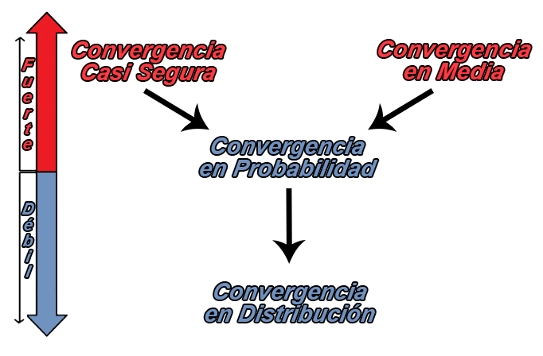

## Estadísticos de orden

Los estadísticos de orden de una muestra aleatoria
`$X_{1}, X_{2}, \ldots, X_{n}$` son los valores muestrales puestos en
orden ascendente, los cuales se denotan como
`$X_{(1)}, X_{(2)}, \ldots, X_{(n)}$` tal que
`$X_{(1)} \leq X_{(2)} \leq \ldots \leq X_{(n)}$`.

Ahora si `$X_{(1)}, X_{(2)}, \ldots, X_{(n)}$` son los estadísticos de
orden de una muestra aleatoria `$X_{1}, X_{2}, \ldots, X_{n}$` de una
población continua con función de densidad de probabilidad `$f(x)$` y
función de distribución acumulada `$F(x)$`, entonces la función de
densidad de probabilidad del j-ésimo estadístico de orden `$x_{(j)}$`
está dada por
`\begin{align*} f_{j}(x_j) = \frac{n!}{(j-1)!(n-j)!} f(x_j) [F(x_j)]^{j-1}[1-F(x_j)]^{n-j} \quad \text{ para } -\infty < x_j < \infty \end{align*}`

<button id="Show1" class="btn btn-secondary">
Mostrar Ejercicio
</button>
<button id="Hide1" class="btn btn-info">
Ocultar Ejercicio
</button>
<main id="botoncito1">
<h3 data-toc-skip>
Ejercicio
</h3>

Sea \(X_1, X_2, \ldots, X_8\) una muestra aleatoria iid de una
distribución uniforme continua, definida en el intervalo \((0,4)\) tal
que \[\begin{align*}
f(x) = \frac{1}{4} \quad \text{ para } 0\leq x \leq 4
\end{align*}\]

Encuentre la función de densidad para el séptimo estadístico de orden, y
con éste calcule la probabilidad de que el valor de este estadístico de
orden sea lo más de \(3.2\).

<h3 data-toc-skip>
Solución
</h3>

Con el fin de encontrar la función de densidad del séptimo estadístico
de prueba, es necesario encontrar primero la función de distribución
acumulada de la distribución uniforme definida en el intervalo
\((0,4)\), tal que \[\begin{align*}
F(x) &= \int_{0}^x f(t) dt\\
     &= \int_{0}^x\frac{1}{4} dt\\
     &= \frac{t}{4} \Bigg|_{0}^x\\
     &= \frac{x}{4} \quad \text{ para } 0 \leq x \leq 4
\end{align*}\]

Conocido el tamaño de la muestra \(n = 8\), la función de densidad de
probabilidad y la función de distribución acumulada de la distribución
uniforme continua definida en el intervalo \((0,4)\), se procede al
cálculo de la función de probabilidad del séptimo estadístico de orden
\((j=7)\), tal que

\[\begin{align*}
f_{7}(x_7) &= \frac{8!}{(7-1)!(8-7)!} f(x_7) [F(x_7)]^{7-1}[1-F(x_7)]^{8-7} \\
               &= 56 \left(\frac{1}{4}\right) \left[\frac{x_7}{4}\right]^{6}\left[1-\frac{x_7}{4}\right]^{1}\\ 
               &= 56 \left(\frac{1}{4}\right)^8x_7^6\left(4-x_7\right)\\                &= \frac{7}{8192}x_7^6\left(4-x_7\right) \quad \text{ para } \quad 0 < x_7 < 4 \\ 
\end{align*}\]

Y ya con esta función de probabilidad se procede a realizar el cálculo
de la la probabilidad del séptimo estadístico de orden sea a lo más de
\(3.2\), tal que \[\begin{align*}
\mathbb{P}(x_7 \leq 3.2) &= \int_{0}^{3.2} f_{7}(x_7) dx_7\\
                         &= \int_{0}^{3.2} \frac{7}{8192}x_7^6\left(4-x_7\right) dx_7\\
                         &= \frac{7}{8192} \left(\frac{4x_7^7}{7} - \frac{x_7^8}{8}\right) \Bigg|_{0}^{3.2} \\
                         &=\frac{7}{8192} \left(\frac{4(3.2 - 0)^7}{7} - \frac{(3.2 - 0)^8}{8}\right) \\
                         &=\frac{7}{8192} \left(\frac{4(3.2)^7}{7} - \frac{(3.2)^8}{8}\right) \\
                         &= 0.50331648 \\
\end{align*}\]

Y por tanto se tendrá una probabilidad del \(50.33\%\) de que el séptimo
estadístico de prueba de una variable aleatoria uniforme definida en el
intervalo \((0,4)\) sea a lo más de \(3.2\).

</main>

## Convergencia de variables aleatorias

El término convergencia hace referencia a que a medida que el tamaño de
una secuencia de variables aleatorias `$X_1, X_2, X_3, \ldots$` es más y
más grande, se espera que el valor de `$X_n$` se acerque cada vez más a
una variable aleatoria `$X$` a medida que `$n\to\infty$`

**Para entender el concepto de convergencia**, suponga una variable
aleatoria desconocida `$X$` la cual deseamos conocer su valor. Como la
variable aleatoria no puede observarse directamente, se decide realizar
algún tipo de medición y obtener una estimación de `$X$` la cual podemos
llamar `$X_1$`. Luego se realiza otra medición y se actualiza la
estimación que se tenía de `$X$`, la cual llamamos `$X_2$`. Entonces si
se continúa este proceso, para obtener las estimaciones
`$X_1, X_2, X_3, \ldots$`, se espera entonces que a medida que `$n$`
aumenta, la estimación `$X_n$` para `$X$` se acercará cada vez más al
valor real, es decir, se espera que `$X_n$` converja a `$X$` cuando
`$n\to\infty$`.

Aunque el supuesto de que el tamaño de una muestra se acerque a infinito
es un supuesto poco realista y se usa meramente como un concepto
teórico, a menudo este tipo de supuestos puede proporcionar algunas
aproximaciones útiles para el caso en el cual la muestra sea finita, ya
que las expresiones suelen simplificarse en el límite.

Existen varios tipos de convergencia en la teoría de probabilidad, y el
objetivo será conocer la forma en que éstos se relacionan unos con
otros, debido a que existe una jerarquía entre los tipos de convergencia
que hace que algunos tipos sean más fuertes que otros, lo cual genera
que una secuencia pueda converger en un sentido pero no otro.

<h4 align="center">
Tipos de Convergencia
</h4>

### Convergencia en Distribución

Sea `$X_1, X_2, X_3, \ldots$` una secuencia de variables aleatorias, y
sea `$X$` una variable aleatoria definida en el espacio muestral,
entonces, si `$F_{X_{n}}$` y `$F_{X}$` son las funciones de distribución
acumulada de `$X_n$` y `$X$` respectivamente, se tendrá que `$X_n$`
converge en distribución a `$X$`, si
`\begin{align*} \lim_{n\to\infty} F_{X_{n}}(x) = F_{X}(x) \end{align*}`
para todos los puntos `$x$` donde `$F_{X}(x)$` está definida. En tal
caso se escribirá que `$X_n\stackrel{d}{\to}X$`.

<button id="Show2" class="btn btn-secondary">
Mostrar Ejercicio
</button>
<button id="Hide2" class="btn btn-info">
Ocultar Ejercicio
</button>
<main id="botoncito2">
<h3 data-toc-skip>
Ejercicio
</h3>

Sea \(X_2, X_3, x_4, \ldots\) una secuencia de variables aleatorias
distribuidas, tal que \[\begin{align*}
  F_{X_i}(x)=1-\left(1-\frac{1}{i}\right)^{ix} \text{ para } x>0
\end{align*}\] muestre que \(X_n\) converge a una distribución
\(Exp(1)\).

<h3 data-toc-skip>
Solución
</h3>

Sea \(X\sim Exp(1)\), entonces si aplicamos límite a \(F_{X_n}(x)\) se
tendrá que para \(x\geq 0\) \[\begin{align*}
  \lim_{n\to\infty}F_{X_n}(x)&=\lim_{n\to\infty}\left[1-\left(1-\frac{1}{n}\right)^{nx}\right] \\
  &=1-\lim_{n\to\infty}\left(1-\frac{1}{n}\right)^{nx} \\
  &=1-e^{-x} \\
  &=F_{X}(x) \text{ para todo } x
\end{align*}\] concluyendo que \(X_{n}\stackrel{d}{\to}X\).

</main>
<!-- #### Propiedades euler -->
<!-- $$\begin{align*} -->
<!-- &1. \lim_{n\to\infty} \left(1 + \frac{1}{n}\right)^n = e^{1} \\ -->
<!-- &2. \lim_{n\to\infty} \left(1 - \frac{1}{n}\right)^n = e^{-1}\\ -->
<!-- &3. \lim_{n\to\infty} \left(1 + \frac{k}{n}\right)^n = e^{k}\\ -->
<!-- &4. \lim_{n\to\infty} \left(1 + \frac{k}{n+m}\right)^{n+m} = e^{k}\\ -->
<!-- &5. \lim_{n\to\infty} \left(1 + \frac{1}{n}\right)^{nx} = e^{x}\\ -->
<!-- &6. \lim_{n\to\infty} \left(1 + \frac{k}{n}\right)^{nx} = e^{xk}\\ -->
<!-- \end{align*}$$ -->

### Convergencia en Probabilidad

Sea `$X_1, X_2, \ldots$` una secuencia de variables aleatorias, y sea
`$X$` una variable aleatoria definida en el espacio muestral, entonces,
se tendrá que `$X_1, X_2, \ldots$` convergen en probabilidad a `$X$`, si
para todo `$\varepsilon>0$`
`\begin{align*} \lim_{n\to\infty} \mathbb{P}(|X_n - X| \geq \varepsilon) = 0 \end{align*}`

o equivalentemente
`\begin{align*} \lim_{n\to\infty} \mathbb{P}(|X_n - X| < \varepsilon) = 1 \end{align*}`

En tal caso se escribirá que `$X_n\stackrel{p}{\to}X$`.

<button id="Show3" class="btn btn-secondary">
Mostrar Ejercicio
</button>
<button id="Hide3" class="btn btn-info">
Ocultar Ejercicio
</button>
<main id="botoncito3">
<h3 data-toc-skip>
Ejercicio
</h3>

Sea \(X_1, X_2, \ldots\) una secuencia de variables aleatorias
distribuidas exponencialmente de la forma \(X_i \sim Exp(\lambda=i)\),
entonces demuestre que \(X_n \stackrel{p}{\to} 0\), es decir, demuestre
que la secuencia \(X_1, X_2, \ldots\) converge en probabilidad a la
variable aleatoria \(X=0\).

<h3 data-toc-skip>
Solución
</h3>

Como tenemos que \(X_n \sim Exp(\lambda=n)\) y \(X_n \geq 0\) entonces
\[\begin{align*}
  \lim_{n\to\infty}\mathbb{P}(|X_n - 0| \geq \varepsilon) &= \lim_{n\to\infty}\mathbb{P}(X_n \geq \varepsilon) \\
  &= \lim_{n\to\infty}e^{-n\varepsilon} \\
  &= 0 \quad \text{ para todo } \varepsilon >0\\
\end{align*}\] concluyendo que \(X_n\stackrel{p}{\to}X\).

</main>

#### Ley de los grandes números

La ley de los grandes números tiene un papel muy central en la
probabilidad y la estadística, puesto que éste establece que si repite
un experimento de forma independiente una gran cantidad de veces y
promedia el resultado, lo que obtenga debe estar cerca del valor
esperado.

Existen dos versiones principales de la ley de los grandes números, a
saber, la ley débiles de los grandes números y la ley fuertes de los
grandes números, en donde la diferencia de ambas leyes es principalmente
teórica.

#### Teorema: Ley débil de los grandes números

Sea `$X_1, X_2, \ldots, X_n$` una secuencia de variables aleatorias iid
con media y varianza finita tal que `$\mathbb{E}(X_i) = \mu<\infty$`,
`$Var(X_i) = \sigma^2 <\infty$` entonces para todo `$\varepsilon > 0$`
se tendrá que
`\begin{align*} \lim_{n\to \infty} \mathbb{P}(|\bar{X} - \mu| \geq \varepsilon) =0 \end{align*}`
en donde `$\bar{X}$` representa a la media muestral, con media y
varianza dadas por
`\begin{align*}   \mathbb{E}(\bar{X}) =\mu \quad \quad Var(\bar{X}) = \frac{\sigma^2}{n} \end{align*}`

En tal caso se escribirá que `$\bar{X}\stackrel{p}{\to}\mu$`.

<button id="Show4" class="btn btn-secondary">
Mostrar Ejercicio
</button>
<button id="Hide4" class="btn btn-info">
Ocultar Ejercicio
</button>
<main id="botoncito4">
<h3 data-toc-skip>
Ejercicio
</h3>

Sea \(X_1, X_2, \ldots, X_n\) una secuencia de variables aleatorias iid
con media dada por \(\mathbb{E}(X_i) = \mu\) y varianza dada por
\(Var(X_i) = \sigma^2\), demuestre que \(\bar{X} \stackrel{p}{\to}\mu\).

<h3 data-toc-skip>
Solución
</h3>

Como tenemos que \(\bar{X}\) posee una media de
\(\mathbb{E}(\bar{X}) =\mu\) y una varianza de
\(Var(\bar{X}) = \frac{\sigma^2}{n}\), entonces se tendrá que para todo
\(\varepsilon > 0\) \[\begin{align*}
  \mathbb{P}(|\bar{X} - \mu| \geq \varepsilon) &= \mathbb{P}((\bar{X} - \mu)^2 \geq \varepsilon^2) \\
  &\leq \frac{\mathbb{E}[(\bar{X} - \mu)^2]}{\varepsilon^2} \quad \text{ (Por teorema de Chebyshev)} \\
  &\leq \frac{Var(\bar{X})}{\varepsilon^2} \\
  &\leq \frac{\sigma^2}{n\varepsilon^2}
\end{align*}\] y por tanto al aplicar límite cuando \(n\to\infty\) se
tendrá que \[\begin{align*}
  \lim_{n\to\infty}\mathbb{P}(|\bar{X} - \mu| \geq \varepsilon) &\leq \lim_{n\to\infty}\frac{\sigma^2}{n\varepsilon^2} \\
  \lim_{n\to\infty}\mathbb{P}(|\bar{X} - \mu| \geq \varepsilon) &=0 \quad \text{ para todo } \varepsilon>0
\end{align*}\] concluyendo que \(\bar{X}\stackrel{p}{\to} \mu\)

</main>

### Convergencia en Media

Sea `$r\geq 1$` un número fijo, entonces la secuencia de variables
aleatorias `$X_1, X_2, X_3, \ldots$` convergen en la `$r$`-ésima media o
en la `$L^r$` forma a la variable aleatoria `$X$`, si
`$\mathbb{E}(|X_n|^r)<\infty$` y
`\begin{align*} \lim_{n\to \infty} \mathbb{E}(|X_n - X|^r) =0 \end{align*}`

En tal caso se escribirá que `$X_n\stackrel{L^r}{\to}X$`. Si `$r=2$` se
llama convegencia de media cuadrática y se escribiría
`$X_n\stackrel{m.c}{\to}X$`

**Nota:** Si una sucesión de variables aleatorias converge en media de
orden `$r$`, entonces también converge en media en ordenes menores a
`$r$`.

<button id="Show5" class="btn btn-secondary">
Mostrar Ejercicio
</button>
<button id="Hide5" class="btn btn-info">
Ocultar Ejercicio
</button>
<main id="botoncito5">
<h3 data-toc-skip>
Ejercicio
</h3>

Sea \(X_1, X_2, \ldots\) una secuencia de variables aleatorias
distribuidas exponencialmente de la forma
\(X_i\sim Unif(0,\frac{1}{i})\), muestre que
\(X_{n}\stackrel{L^r}{\to}0\) para cualquier \(r\geq1\), es decir,
demuestre que la secuencia \(X_1, X_2, \ldots\) converge en la
`$r$`-ésima media a la variable aleatoria \(X=0\)

<h3 data-toc-skip>
Solución
</h3>

Para demostrar esto, defina la función de probabilidad de \(X_{n}\) tal
que \[\begin{align*}
  f_{X_n}(x)= n \text{ para } 0\leq x \leq \frac{1}{n}
\end{align*}\]

entonces se tendrá que \[\begin{align*}
  \mathbb{E}(|X_n - 0|^r) &= \mathbb{E}(X_n^r)\\
                          &= \int_{0}^{\frac{1}{n}} x^r f_{X_n}(x)\ dx\\
                          &= \int_{0}^{\frac{1}{n}} x^r n\ dx\\
                          &= \frac{1}{(r+1)n^r} \\
\end{align*}\] y por tanto al aplicar límite cuando \(n\to\infty\) se
tendrá que \[\begin{align*}
  \lim_{n\to \infty} \mathbb{E}(|X_n - 0|^r) &= \lim_{n\to \infty} \frac{1}{(r+1)n^r} \\
  &= 0 \quad \text{ para todo }  r\geq 1 \\
\end{align*}\] concluyendo que \(X_n\stackrel{L^r}{\to} 0\)

</main>

### Convergencia Casi Segura

Sea `$X_1, X_2, \ldots$` una secuencia de variables aleatorias definidas
en el espacio muestral `$S = \{s_1, s_2,\ldots, s_k\}$`, y sea `$X$` una
variable aleatoria definida en el espacio muestral, entonces, se tendrá
que `$X_1, X_2, \ldots$` convergen casi seguramente a `$X$`, si para
todo `$\varepsilon>0$`
`\begin{align*}   \mathbb{P}\left(\{s\in S:\lim_{n\to \infty}|X_n(s) - X(s)|^r < \varepsilon\} \right) = 1 \end{align*}`

o equivalentemente
`\begin{align*}   \mathbb{P}\left(\{s\in S:\lim_{n\to \infty}X_n(s) = X(s)\}\right) = 1 \end{align*}`

En tal caso se escribirá que `$X_n\stackrel{cs}{\to}X$`.

<button id="Show6" class="btn btn-secondary">
Mostrar Ejercicio
</button>
<button id="Hide6" class="btn btn-info">
Ocultar Ejercicio
</button>
<main id="botoncito6">
<h3 data-toc-skip>
Ejercicio
</h3>

Sea el espacio muestral \(S\) definido en el intervalo \([0,1]\) y sea
\(X_1, X_2, \ldots\) una secuencia de variables aleatorias distribuidas
de la forma \(X_i(s)=s^{i}\), muestre que \(X_{n}\stackrel{cs}{\to}0\),
es decir, demuestre que la secuencia \(X_1, X_2, \ldots\) converge casi
seguramente a la variable aleatoria \(X(s)=0\)

<h3 data-toc-skip>
Solución
</h3>

Para demostrar esto defina un punto muestral fijo \(s\in[0,1)\),
entonces la secuencia de variables aleatoria \(X_n(s)\) tendrá límite
igual a \[\begin{align*}
  \lim_{n\to \infty} X_n(s)=\lim_{n\to \infty} s^{n} = 0
\end{align*}\] sin embargo, si \(s=1\), la secuencia de variables
aleatorias \(X_n(s)\) tendrá límite igual a \[\begin{align*}
  \lim_{n\to \infty} X_n(1)=\lim_{n\to \infty} 1^{n} = 1
\end{align*}\]

Lo cual significa que la secuencia de variables aleatorias \(X_n\) no
convergerá puntualmente a \(X\) cuando \(s=1\) porque \[\begin{align*}
  \lim_{n\to \infty} X_n(1)=1 \neq X(1)=0
\end{align*}\]

Ahora, como la probabilidad puntual para la igualdad de este límite
cuando \(s=1\) es igual a \(0\), \[\begin{align*}
  \mathbb{P}\left(\{s=1:\lim_{n\to \infty}X_n(1) = X(1)\}\right) = 0
\end{align*}\]

significa que para \(s\in [0,1)\), \(X_n(s)\) convergerá casi
seguramente a \(X(s)\) ya que

\[\begin{align*}
  \mathbb{P}\left(\{s\in[0,1):\lim_{n\to \infty}X_n(s) = X(s)\}\right) = 1
\end{align*}\] concluyendo que \(X_n\stackrel{cs}{\to} 0\)

</main>

#### Teorema: Ley fuerte de los grandes números

Sea `$X_1, X_2, \ldots, X_n$` una secuencia de variables aleatorias iid
con media y varianza finita tal que `$\mathbb{E}(X_i) = \mu<\infty$`,
`$Var(X_i) = \sigma^2 <\infty$` entonces para todo `$\varepsilon > 0$`
se tendrá que
`\begin{align*} \mathbb{P}\left(\lim_{n\to \infty}|\bar{X} - \mu| < \varepsilon \right) = 1 \end{align*}`
en donde `$\bar{X}$` representa a la media muestral, con media y
varianza dadas por
`\begin{align*}   \mathbb{E}(\bar{X}) =\mu \quad \quad Var(\bar{X}) = \frac{\sigma^2}{n} \end{align*}`

En tal caso se escribirá que `$\bar{X}\stackrel{cs}{\to}\mu$`.
