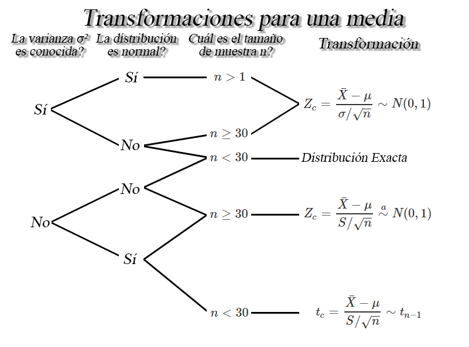
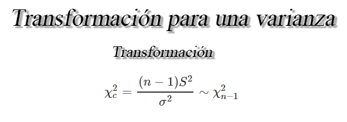
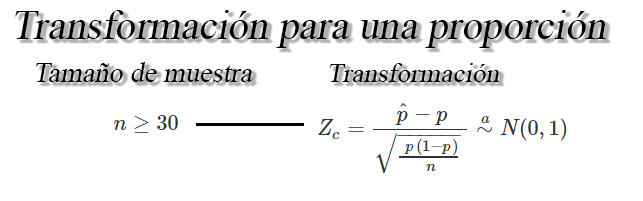
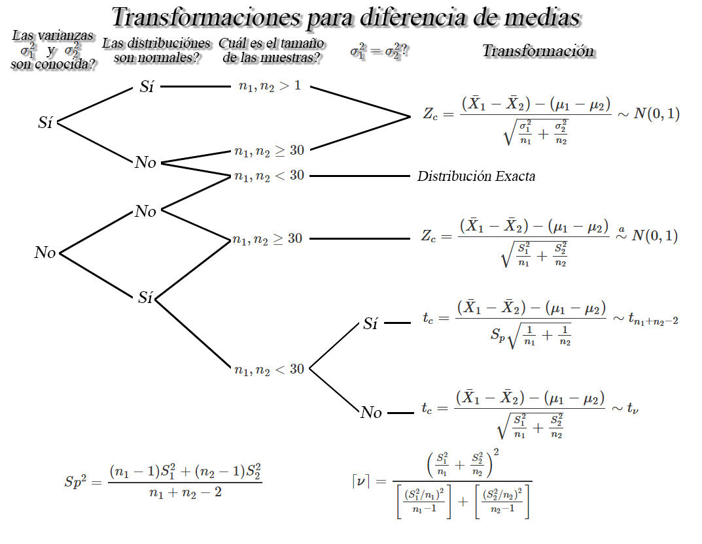
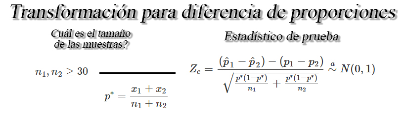

## Transformación para el cálculo de probabilidades basadas en datos muestrales

Entre los principales usos que tienen las distribuciones muestrales es
permitirnos el cálculo de probabilidades para realizar inferencia sobre
los diferentes parámetros desconocidos que puede tener una población,
como la proporción real de un evento o su media y varianza.

Por ello se tendrá que dependiendo de un conjunto de situaciones
determinadas, es posible realizar transformaciones a los parámetros
poblacionales desconocidos, que nos permitirán realizar el cálculo de
probabilidades usando distribuciones muestrales específicas. Dichas
condiciones y transformaciones se irán listando a lo largo de la clase.

### Transformación muestrales para una medias `$\mu$`

Sea `$X_1, X_2, \ldots, X_n$` una muestra aleatoria *iid* de tamaño
`$n$` de una población con media `$\mu$` y varianza `$\sigma^2$`
conocida o desconocida, se tendrá que dependiendo de las condiciones de
la muestra y sobre la población, se tendrán las siguientes
transformaciones para hacer inferencia sobre `$\mu$`.

<button id="Show1" class="btn btn-secondary">
Mostrar Ejercicio 1
</button>
<button id="Hide1" class="btn btn-info">
Ocultar Ejercicio 1
</button>
<main id="botoncito1">
<h3 data-toc-skip>
Ejercicio
</h3>

Suponga que se realiza un estudio sobre el salario de los estudiantes de
ingeniería industrial una vez finalizan su pregrado y se incertan en el
mercado laboral. Para ello, se le pregunta a \(15\) egresados
seleccionados de forma aleatoria y se les pregunta cuál es el salario
que devengan actualmente, obteniendo los siguientes resultados en
millones de pesos \[\begin{align*}
1.78 \quad 2.93 \quad 1.22 \quad 1.27 \quad 1.17 \\
1.03 \quad 1.24 \quad 2.07 \quad 2.04 \quad 1.28 \\
1.53 \quad 0.98 \quad 1.73 \quad 1.38 \quad 3.24
\end{align*}\]

Basados e la información anterior, calcule la probabilidad de que el
salario promedio de todos los egresados del programa de ingeniería
industrial sea a lo más de \(2\) millones de pesos, si se sabe, que los
salarios se distribuyen normalmente con desviación estándar de \(0.5\)
millones de pesos.

<h3 data-toc-skip>
Solución
</h3>

En este caso, estamos interesados en calcular la probabilidad de que la
media poblacional del salario de los egresados, sea como máximo de \(2\)
millones de pesos, esto es \[\begin{align*}
\mathbb{P}(\mu\leq 2)
\end{align*}\] Ahora, dado que para encontrar la probabilidad asociada a
la media poblacional, requeriríamos conocer la distribución de
probabilidad de \(\mu\), y ésta, no es una distribución conocida,
entonces podemos emplear la distribución muestral de los salarios, la
cual se distribuye normalmente.    Y para ello, debemos realizar
operaciones matemáticas, de tal forma que la probabilidad planteada
tenga la estructura de una distribución de probabilidad conocida, tal
como lo es la distribución normal estándar, tal que

\[\begin{align*}
Z_c = \frac{\bar{X}-\mu}{\sigma/\sqrt{n}} \sim N(0,1)
\end{align*}\]

Con esta estructura en mente, y con el valor de la desviación estándar
poblacional conocida e igual a \(\sigma=0.5\) y habiendo calculado
previamente la media de de la muestra de las \(n=15\) observaciones, la
cual dió un resultado igual a \(\bar{X} = 1.659333\), realizamos las
siguientes operaciones matemáticas para llevar la probabilidad original,
a una forma conocida, tal que \[\begin{align*}
\mathbb{P}(\mu\leq 2) &= \mathbb{P}(-\mu\geq -2) \\
                      &= \mathbb{P}(\bar{X}-\mu\geq 1.659333-2) \\
                      &= \mathbb{P}\left(\frac{\bar{X} - \mu}{\sigma/ \ \sqrt{n}} \geq \frac{1.659333-2}{0.5/\sqrt{15}}\right) \\
                      &= \mathbb{P}\left(Z \geq -2.638793\right) \\
\end{align*}\]

Y como \(Z \sim N(0,1)\), entonces podemos encontrar la probabilidad de
interés, empleando la
<a href="https://github.com/jiperezga/jiperezga.github.io/raw/master/Dataset/Documentos/DistNormEst.pdf">Tabla
de la Distribución Normal Estándar</a>, la función <tt>pnorm()</tt> del
software <tt>R</tt> o la función <tt>DISTR.NORM.ESTAND.N()</tt> de
Excel, tal que

\[\begin{align*}
\mathbb{P}\left(Z \geq -2.638793\right) = 0.9958399
\end{align*}\]

lo cual, dada la equivalencia de la igualdad anterior, significará que
\[\begin{align*}
\mathbb{P}(\mu\leq 2) = 0.9958399
\end{align*}\]

es decir que la probabilidad de que el salario promedio de todos los
egresados del programa de ingeniería industrial sea como máximo de \(2\)
millones de pesos, es del \(99.58\%\).

</main>
<button id="Show2" class="btn btn-secondary">
Mostrar Ejercicio 2
</button>
<button id="Hide2" class="btn btn-info">
Ocultar Ejercicio 2
</button>
<main id="botoncito2">
<h3 data-toc-skip>
Ejercicio
</h3>

Suponga que Postobon desarrolla una nueva máquina de bebidas para servir
de forma automática gaseosas en los cines, de tal forma que la cantidad
servida, en mililitros, se distribuya Weibull con parámetro de forma
\(\alpha = 1/5\) y parámetro de escala \(\beta = 3\).    Entonces,
si se decide tomar una muestra aleatoria de \(40\) vasos de gaseosa
servidos por una de las nuevas máquinas de bebidas, cuál es la
probabilidad de quela cantidad promedio de bebida obtenida sea como
máximo de \(340_{ml}\)?.

<h3 data-toc-skip>
Solución
</h3>

En este caso tenemos que la cantidad servida de gaseosa por la nueva
máquina no se distribuye normalmente, si no que tiene una distribución
Weibull, con parámetros \(\alpha = 1/5\) y \(\beta = 3\).
Adicionalmente, nos piden calcular la probabilidad de que una muestra de
\(40\) vasos de gaseosa se obtenga como máximo un promedio muestral de
\(340_{ml}\), es decir \[\begin{align*}
\mathbb{P}(\bar{X} \leq 340)
\end{align*}\]

Entonces, dado que los datos no se distribuyen normalmente, pero el
tamaño de la muestra \(n\geq30\), podemos aplicar el teorema del límite
central el cual nos dice que, mediante la aplicación de la
estandarización \[\begin{align*}
Z_c = \frac{\bar{X}-\mu}{\sigma/\sqrt{n}} \stackrel{a}{\sim} N(0,1)
\end{align*}\] podemos obtener una distribución aproximadamente normal,
lo cual nos permitirá realizar el cálculo de la probabilidad de
interés.    Ahora, para poder aplicar la estandarización, debemos
calcular primero el valor de la media y desviación estandar
poblacionales, y para ello empleamos podemos emplear la definición de
esperanza matemática y varianza de la distribución Weibull, tal que la
media poblacional será igual a \[\begin{align*}
\mathbb{E}(X) = \mu = &= \beta\;\Gamma\left(1 + \frac{1}{\alpha}\right)\\
                      &= 3 \Gamma\left(1 + \frac{1}{(1/5)}\right) \\
                      &= 3 \Gamma\left(1 + 5\right) \\
                      &= 3 \Gamma\left(6\right) \\
                      &= 3 (6-1)!\\
                      &= 3 (120) \\
                      &= 360
\end{align*}\] mientras que, la varianza poblacional será igual a
\[\begin{align*}
Var(X) = \sigma^2 &= \beta^2\left[\Gamma\left(1 + \frac{2}{\alpha}\right) - \Gamma\left(1 + \frac{1}{\alpha}\right)^2\right] \\
                  &= 3^2\left[\Gamma\left(1 + \frac{2}{(1/5)}\right) - \Gamma\left(1 + \frac{1}{(1/5)}\right)^2\right] \\
                  &= 9\left[\Gamma\left(1 + 10\right) - \Gamma\left(1 + 5\right)^2\right] \\
                  &= 9\left[\Gamma\left(11\right) - \Gamma\left(6\right)^2\right] \\
                  &= 9\left[(11 - 1)! - ((6 - 1)!)^2\right] \\
                  &= 9\left[3628800 - (120)^2\right] \\
                  &= 9\left[3628800 - 14400\right] \\
                  &= 9\left[3628800 - 14400\right] \\
                  &= 9\left[3614400\right] \\
                  &= 32529600
\end{align*}\] es decir que, la desviación estándar poblacional será
igual a \[\begin{align*}
Sd(X) = \sigma &= \sqrt{Var(X)} \\
               &= \sqrt{32529600} \\
               &= 5703.473
\end{align*}\]

Ahora, con los valores ya calculados para \(\mu=360\) y
\(\sigma=5703.473\), se realiza la estandarización de la probabilidad,
para poder realizar su cálculo, tal que \[\begin{align*}
\mathbb{P}(\bar{X} \leq 340) &= \mathbb{P}(\bar{X} - \mu \leq 340 - 360)\\
                             &= \mathbb{P}\left(\frac{\bar{X} - \mu}{\sigma / \sqrt{n}} \leq \frac{340 - 360}{5703.473/\sqrt{40}}\right)\\
                             &= \mathbb{P}\left(Z \leq -0.02217791\right)\\
\end{align*}\]

Y como \(Z \stackrel{a}{\sim} N(0,1)\), podemos encontrar la
probabilidad de interés, empleando la
<a href="https://github.com/jiperezga/jiperezga.github.io/raw/master/Dataset/Documentos/DistNormEst.pdf">Tabla
de la Distribución Normal Estándar</a>, la función <tt>pnorm()</tt> del
software <tt>R</tt> o la función <tt>DISTR.NORM.ESTAND.N()</tt> de
Excel, tal que \[\begin{align*}
\mathbb{P}\left(Z \leq -0.02217791\right) = 0.491153
\end{align*}\]

lo cual, dada la equivalencia de la igualdad anterior, significará que
\[\begin{align*}
\mathbb{P}(\bar{X} \leq 340) = 0.491153
\end{align*}\]

es decir que la probabilidad de que la cantidad promedio de bebida
obtenida en la muestra de \(40\) vasos sea como máximo de \(340_{ml}\)
es de \(49.11\%\).

</main>
<button id="Show3" class="btn btn-secondary">
Mostrar Ejercicio 3
</button>
<button id="Hide3" class="btn btn-info">
Ocultar Ejercicio 3
</button>
<main id="botoncito3">
<h3 data-toc-skip>
Ejercicio
</h3>

Suponga que la marca de cigarrillo Malboro, asegura que el contenido
promedio de nicotina de sus cigarrillos es de \(1.1\) miligramos. Un
estudio realizado por un grupo de investigación de la Universidad de
Antioquia mide el contenido de nicotina de una muestra aleatoria de
\(25\) cigarrillos y encuentra que la nicotina promedio y desviación
estándar de la muestra fue de \(1.02\) y \(0.23\) miligramos de
nicotina, respectivamente.     Si se supone que la cantidad de
nicotina en los cigarrillos Malboro se distribuye normalmente, cuál es
la probabilidad de que el promedio muestral sea como máximo el
encontrado por el grupo de investigación de la Universidad de Antioquia,
si se asume como cierta la afirmación de Malboro?

<h3 data-toc-skip>
Solución
</h3>

En este punto, nos preguntan sobre la probabilidad de que el promedio
muestral \(\bar{X}\) sea como máximo el encontrado por el grupo de
investigación, es decir que se desea calcular la siguiente probabilidad
\[\begin{align*}
\mathbb{P}(\bar{X} \leq 1.02)
\end{align*}\] En donde sabemos que la distribución de probabilidad de
la media muestral \(\bar{X} \sim N(\mu, \sigma^2/n)\), por lo cual
podríamos calcular directamente la probabilidad de interés, en caso de
que conocieramos la varianza poblacional, pero al no ser nuestro caso,
debemos realizar operaciones matemáticas con el fin de llevar la
probabilidad de interés, a una forma conocida, tal como lo es la
estructura de una distribución \(t\) con \(n-1\) grados de libertad, tal
que \[\begin{align*}
t_c = \frac{\bar{X}-\mu}{S/\sqrt{n}} \sim t_{n-1}
\end{align*}\]

En donde tenemos que la distribución de la nicotina de los cigarrillos
se distribuye normalmente con una media poblacional \(\mu = 1.1\), la
cual es la asegurada por la compañia Malboro, Además de la muestra,
encontramos que la desviación estándar muestral para las \(n=25\)
cigarrillos muestreados es igual a \(S=0.23\) miligramos de nicotina.
Basados en estas variables realizamos las siguientes operaciones
matemáticas para llevar la probabilidad original, a la estructura
planteada, tal que \[\begin{align*}
\mathbb{P}(\bar{X} \leq 1.02) &= \mathbb{P}(\bar{X} - \mu \leq 0.82 - 1.1) \\
                              &= \mathbb{P}\left(\frac{\bar{X} - \mu}{S/\sqrt{n}} \leq \frac{1.02 - 1.1}{0.23/\sqrt{25}}\right) \\
                              &= \mathbb{P}\left(t_{25-1} \leq -1.73913\right)
\end{align*}\]

entonces podemos encontrar la probabilidad de interés, empleando la
<a href="https://github.com/jiperezga/jiperezga.github.io/raw/master/Dataset/Documentos/DistTStudent.pdf">Tabla
de la Distribución t de Student</a>, la función <tt>pt()</tt> del
software <tt>R</tt> o las funciones <tt>DISTR.T.N()</tt> o
<tt>DISTR.T.CD()</tt> de Excel, tal que

\[\begin{align*}
\mathbb{P}\left(t_{25-1} \leq -1.73913\right) = 0.04741239
\end{align*}\]

lo cual, dada la equivalencia de la igualdad anterior, significará que
\[\begin{align*}
\mathbb{P}(\bar{X} \leq 1.02) = 0.04741239
\end{align*}\]

es decir que la probabilidad de obtener una media muestral inferior a
\(1.02\) miligramos de nicotina en una muestra de \(25\), es de
\(4.74\%\), si el verdadero valor de la media de nicotina de todos los
cigarrillos producidos por la empresa Malboro es de \(1.1\). Por lo cual
parecería poco probable que la afirmación de la compañía sea poco
creíble.

</main>

### Transformación muestrales para una varianza `$\sigma^2$`

Sea `$X_1, X_2, \ldots, X_n$` una muestra aleatoria *iid* de tamaño
`$n$` de una población normal con media `$\mu$` y varianza `$\sigma^2$`
conocida o desconocida, se tendrá la siguiente transformación para hacer
inferencia sobre `$\sigma^2$`.

<button id="Show4" class="btn btn-secondary">
Mostrar Ejercicio
</button>
<button id="Hide4" class="btn btn-info">
Ocultar Ejercicio
</button>
<main id="botoncito4">
<h3 data-toc-skip>
Ejercicio
</h3>

Durante los últimos cinco años se ha realizado en la facultad de
ingeniería un exámen a estudiantes de primer y segundo semestre para
observar la finidad de éstos con la carrera que se encuentran cursando.
Los directivos creen por estudios anteriores, que la calificación
obtenida por los estudiantes es aproximadamente normal con media de
\(72\) y varianza de \(5\) puntos.     Si estre semestre se
realiza el examen a \(26\) estudiantes ¿Encuentre la probabilidad de que
se obtenga una la desviación estándar muestral superior a \(2.828427\)
puntos?

<h3 data-toc-skip>
Solución
</h3>

En este punto estamos interesados en calcular la probabilidad de que la
desviación estándar de la calificación obtenida por una muestra de
\(26\) estudiantes de primero y segundo semestre de la facultad de
ingeniería, en el exámen, sea superior a \(2.828427\) puntos, esto es
\[\begin{align*}
\mathbb{P}(S > 2.828427)
\end{align*}\]

Pero al no conocer la distribución de probabilidad de la desviación
estándar, debemos realizar operaciones matemáticas de tal forma que
llevemos la probabilidad planteada, a una estructura en la cual tengamos
conocimiento de cuál es la distribución de probabilidad asociada, para
el cálculo de la probabilidad, la cual en este caso, sería una
distribución chi-cuadrado, tal que \[\begin{align*}
\chi^2_c = \frac{(n-1)S^2}{\sigma^2} \sim \chi^2_{n-1}
\end{align*}\]

Con esto en mente, desarrollamos las siguienteso operaciones matemáticas

\[\begin{align*}
\mathbb{P}(S > 2.828427) &= \mathbb{P}(S^2 > 2.828427^2)\\
                         &= \mathbb{P}((n-1) S^2 > (26-1)2.828427^2)\\
                         &= \mathbb{P}\left(\frac{(n-1) S^2}{\sigma^2} > \frac{(25)2.828427^2}{5}\right) \\
                         &= \mathbb{P}(\chi^2_{25} > 40) \\
\end{align*}\]

Entonces, como la distribución asociada es una chi cuadrado con \(25\)
grados de libertad, \(\chi^2_{25}\), entonces podemos encontrar la
probabilidad de interés, empleando la
<a href="https://github.com/jiperezga/jiperezga.github.io/raw/master/Dataset/Documentos/DistChiSquare.pdf">Tabla
de la Distribución Chi-Cuadrado</a>, la función <tt>pchisq()</tt> del
software <tt>R</tt> o las funciones <tt>DISTR.CHICUAD()</tt> o
<tt>DISTR.CHICUAD.CD()</tt> de Excel, tal que

\[\begin{align*}
\mathbb{P}(\chi^2_{25} > 40) = 0.0291644
\end{align*}\] lo cual, dada la equivalencia de la igualdad anterior,
significará que \[\begin{align*}
\mathbb{P}(S > 2.828427) = 0.0291644
\end{align*}\] es decir, se tendrá un \(2.92\%\) de probabilidad de que
la desviación estándar de la calificación obtenida por una muestra de
\(26\) estudiantes de primero y segundo semestre de la facultad de
ingeniería, en el exámen, sea superior a \(2.828427\) puntos.

</main>

### Transformación muestrales para una proporción `$p$`

Sea `$X_1, X_2, \ldots, X_n$` una muestra aleatoria *iid* de tamaño
`$n$`, tal que `$X\sim b(n,p)$`. Entonces si `$n$` es suficientemente
grande, se tendrá la siguiente transformación para hacer inferencia
sobre una proporción `$p$`

<button id="Show5" class="btn btn-secondary">
Mostrar Ejercicio
</button>
<button id="Hide5" class="btn btn-info">
Ocultar Ejercicio
</button>
<main id="botoncito5">
<h3 data-toc-skip>
Ejercicio
</h3>

Suponga que se realiza un estudio sobre el salario de los estudiantes de
ingeniería industrial una vez finalizan su pregrado y se incertan en el
mercado laboral. Para ello, se le pregunta a \(15\) egresados
seleccionados de forma aleatoria y se les pregunta cuál es el salario
que devengan actualmente, obteniendo los siguientes resultados en
millones de pesos \[\begin{align*}
1.78 \quad 2.93 \quad 1.22 \quad 1.27 \quad 1.17 \\
1.03 \quad 1.24 \quad 2.07 \quad 2.04 \quad 1.28 \\
1.53 \quad 0.98 \quad 1.73 \quad 1.38 \quad 3.24
\end{align*}\]

Basados en la información anterior, calcule la probabilidad de que la
proporción de egresados que tienen un salario superior a \(2\) millones
de pesos sea mayor al \(40\%\).

<h3 data-toc-skip>
Solución
</h3>

En este punto, nos preguntan por la proporción de egresados que tienen
un salario superior a \(2\) millones de pesos sea mayor al \(40\%\), es
decir \[\begin{align*}
  \mathbb{P}(p > 0.4)
\end{align*}\]

Pero al observar la información recolectada por los \(15\) egresados,
apreciamos que que nos dan el salario que devengan, y no la proporción
muestral, de quienes tienen un salario superior a \(2\) millones de
pesos, por lo cual, será necesario calcular la proporción muestral, y
para ello, denotaremos como \(1\) aquellas observaciones que sean
superiores a \(2\) millones de pesos, y \(0\) aquellas observaciones que
no cumplan la condición, tal que \[\begin{align*}
 \underset{0}{1.78} \quad \underset{1}{2.93} \quad \underset{0}{1.22} \quad \underset{0}{1.27} \quad \underset{0}{1.17} \\
\underset{0}{1.03} \quad \underset{0}{1.24} \quad \underset{1}{2.07} \quad \underset{1}{2.04} \quad \underset{0}{1.28} \\
\underset{0}{1.53} \quad \underset{0}{0.98} \quad \underset{0}{1.73} \quad \underset{0}{1.38} \quad \underset{1}{3.24}
\end{align*}\]

Entonces, si los \(1\) representa los éxitos, tendremos un total de
\(x=4\) éxitos en las \(n=15\) muestras, entonces podemos aplicar la
fórmula de frecuencia relativa para calcular la proporción muestral de
egresados que poseen salarios superiores a \(2\) millones.
\[\begin{align*}
  \hat{p} &= \frac{\text{# éxitos}}{\text{Total ensayos}} \\
          &= \frac{x}{n} \\
          &= \frac{4}{15} \\
          &= 0.2666667
\end{align*}\]

Una vez calculada la proporción muestral, podemos emplear ésta para
calcular la probabilidad de interés, mediante el empleo de operaciones
matemáticas, de tal forma que la probabilidad planteada tenga la
estructura de una distribución de probabilidad conocida, lo cual, en
este caso, será una distribución aproximadamente normal, tal que

\[\begin{align*}
Z_c = \frac{\hat{p}-p}{\sqrt{\frac{p(1-p)}{n}}} \stackrel{a}{\sim} N(0,1)
\end{align*}\]

Con esta estructura en mente, se procede a realizar la operaciones
correspondientes para llevar la probabilidad original, a la forma
conocida, tal que \[\begin{align*}
  \mathbb{P}(p > 0.4) &= \mathbb{P}(- p < - 0.4) \\
                      &= \mathbb{P}(\hat{p}- p < 0.2666667 - 0.4) \\
                      &= \mathbb{P}\left(\frac{\hat{p}- p}{\sqrt{\frac{p(1-p)}{n}}} < \frac{0.2666667 - 0.4}{\sqrt{\frac{0.4(1-0.4)}{15}}}\right) \\
                      &= \mathbb{P}\left(Z < -1.054092\right)
\end{align*}\]

Y como \(Z \sim N(0,1)\), entonces podemos encontrar la probabilidad de
interés, empleando la
<a href="https://github.com/jiperezga/jiperezga.github.io/raw/master/Dataset/Documentos/DistNormEst.pdf">Tabla
de la Distribución Normal Estándar</a>, la función <tt>pnorm()</tt> del
software <tt>R</tt> o la función <tt>DISTR.NORM.ESTAND.N()</tt> de
Excel, tal que

\[\begin{align*}
\mathbb{P}(Z < -1.054092) = 0.1459204
\end{align*}\]

lo cual, dada la equivalencia de la igualdad anterior, significará que
\[\begin{align*}
\mathbb{P}(p > 0.4) = 0.1459204
\end{align*}\]

Y por tanto, se tendrá un \(14.59\%\) de probabilidad de que la
proporción de egresados que tienen un salario superior a \(2\) millones
de pesos, sea mayor al \(40\%\).

</main>

### Transformación muestrales para diferencia de medias `$\mu_1 - \mu_2$`

Sea `$X_{11}, X_{12}, \ldots, X_{1n_1}$` y
`$X_{21}, X_{22}, \ldots, X_{2n_1}$` dos muestras aleatorias *iid* con
medias `$\mathbb{E}(X_{1i})=\mu_1$` y `$\mathbb{E}(X_{2j})=\mu_2$`, y
varianzas `$Var(X_{1i})=\sigma_1^2<\infty$` y
`$Var(X_{2j})=\sigma_2^2<\infty$`, para `$i=1,2,\ldots,n_1$` y
`$j=1,2,\ldots,n_2$`, entonces dependiendo de la distribución de donde
provengan las muestras aleatorias, los tamaños muestrales `$n_1$` y
`$n_2$`, y de si se conocen o no las varianzas `$\sigma^2_1$` y
`$\sigma^2_2$`, se tendrán las siguientes transformaciones para hacer
inferencia sobre la diferencia de medias `$\mu_1 - \mu_2$`.

<button id="Show6" class="btn btn-secondary">
Mostrar Ejercicio 1
</button>
<button id="Hide6" class="btn btn-info">
Ocultar Ejercicio 1
</button>
<main id="botoncito6">
<h3 data-toc-skip>
Ejercicio
</h3>

Una empresa envía a \(12\) de sus agentes de ventas a un curso diseñado
para incrementar la motivación, y por tanto, presuntamente su
efectividad. Un año después, estos agentes generan unas ventas con un
valor promedio de \(43.5\) millones de pesos y una desviación estándar
de \(5.6\) millones de pesos.    Durante el mismo periodo, se
extrajo una muestra aleatoria independiente de \(15\) personas que no
habían asistido al curso y las ventas medias generadas y su desviación
estándar fueron de \(40.8\) y \(4.3\) millones de pesos respectivamente.
    Si es posible suponer que las poblaciones se distribuyen
normalmente con varianzas iguales a \(28\) millones de pesos\(^2\) para
quienes se capacitaron y a \(20\) millones de pesos\(^2\) para quienes
no se capacitaron, Cuál es la probabilidad que el promedio de ventas de
personas que reciben capacitación sea superior al promedio de ventas de
quienes no reciben capacitación por almenos \(3\) millones de pesos?

<h3 data-toc-skip>
Solución
</h3>

En este caso se desea calcular la probabilidad de que la diferencia
entre los promedios de ventas entre personas que reciben capacitación
\(\mu_C\) y quienes no reciben capacitación \(\mu_S\), sea superior a
\(3\) millones de pesos, esto es \[\begin{align*}
\mathbb{P}(\mu_C - \mu_S > 3)
\end{align*}\]

Es de anotar que, no conocemos la distribución de probabilidad de la
diferencia de medias, y en consecuencia no podemos calcular la
probabilidad de forma directa, y por tanto, dado que nos dicen que las
poblaciones se distribuyen normalmente con varianzas conocidas, debemos
realizar operaciones matemáticas de tal forma que llevemos la
probabilidad de interés a una estructura conocida, tal como lo es la
distribución normal estándar, que posee la forma \[\begin{align*}
Z_c=\frac{(\bar{X}_C - \bar{X}_S) - (\mu_C - \mu_S)}{\sqrt{\frac{\sigma^2_C}{n_C} + \frac{\sigma^2_S}{n_S}}} \sim N(0,1)
\end{align*}\]

En donde apreciamos que requerimos de las varianzas poblacionales
\(\sigma^2_C\) y \(\sigma^2_S\), los cuales nos dicen que son iguales a
\(\sigma^2_C=20\) y \(\sigma^2_S=28\). Entonces al realizar las
operaciones matemáticas correspondientes, tendremos que

\[\begin{align*}
\mathbb{P}(\mu_C - \mu_S > 3) &= \mathbb{P}(- (\mu_C - \mu_S) < -3) \\
                              &= \mathbb{P}((\bar{X}_C - \bar{X}_S) - (\mu_C - \mu_S) < (43.5 - 40.8) - 3) \\
                              &= \mathbb{P}\left(\frac{(\bar{X}_C - \bar{X}_S) - (\mu_C - \mu_S)}{\sqrt{\frac{\sigma^2_C}{n_C} + \frac{\sigma^2_S}{n_S}}} < \frac{(43.5 - 40.8) - 3}{\sqrt{\frac{20}{12} + \frac{28}{15}}}\right) \\
                              &= \mathbb{P}\left(Z < \frac{-0.3 }{1.825742}\right) \\
                              &= \mathbb{P}\left(Z < -0.1595986\right) \\
\end{align*}\] Y como \(Z \sim N(0,1)\), podemos encontrar la
probabilidad de interés, empleando la
<a href="https://github.com/jiperezga/jiperezga.github.io/raw/master/Dataset/Documentos/DistNormEst.pdf">Tabla
de la Distribución Normal Estándar</a>, la función <tt>pnorm()</tt> del
software <tt>R</tt> o la función <tt>DISTR.NORM.ESTAND.N()</tt> de
Excel, tal que \[\begin{align*}
\mathbb{P}\left(Z < -0.1595986\right) = 0.4365986
\end{align*}\] lo cual, dada la equivalencia de la igualdad anterior,
significará que \[\begin{align*}
\mathbb{P}(\mu_C - \mu_S > 3) = 0.4365986
\end{align*}\]

y consecuencia, se tendrá una probabilidad del \(43.66\%\) de que la
diferencia entre los promedios de ventas entre personas que reciben
capacitación \(\mu_C\) y quienes no reciben capacitación \(\mu_S\), sea
superior a \(3\) millones de pesos.

</main>
<button id="Show7" class="btn btn-secondary">
Mostrar Ejercicio 2
</button>
<button id="Hide7" class="btn btn-info">
Ocultar Ejercicio 2
</button>
<main id="botoncito7">
<h3 data-toc-skip>
Ejercicio
</h3>

Suponga que la Universidad de Antioquia adelanta un estudio sobre el
salario de sus egresados y desea comparar si es cierta la creencia que
las mujeres ganan en promedio menos dinero que los hombres.    
Para comprobar si las creencias son ciertas, un grupo de investigación
de la Universidad toma una muestra representativa de \(250\) mujeres y
\(270\) hombres egresados de la Universidad y se les pregunta sobre cuál
es el salario que ganan actualmente, obteniendo en su invesgicación que
las mujeres ganan en promedio \(2.3\) millones de pesos con una
desviación estándar de \(0.7\) millones de pesos, mientras que los
hombres ganan en promedio \(2.6\) millones de pesos con una desviación
estándar de \(1.2\) millones de pesos. Si el grupo de investigación
encuentra que los salarios se distribuyen normalmente, cuál es la
probabilidad de que la creencia de que las mujeres ganan en promedio
menos dinero que los hombres?

<h3 data-toc-skip>
Solución
</h3>

En este caso se desea calcular la probabilidad de que el salario
promedio que ganan los hombres sea mayor que el salario promedio que
ganan las mujeres, esto es, \[\begin{align*}
\mathbb{P}(\mu_H > \mu_M)
\end{align*}\]

Como para poder encontrar la probabilidad, debemos llevar la
probabilidad planteada a una estructura conocida, tal como lo es la
estructura de una distribución normal estándar de forma aproximada, dado
que el grupo de investigación encontró que los datos se distribuyen
normalmente con varianzas desconocidas, tal que \[\begin{align*}
Z_c=\frac{(\bar{X}_H - \bar{X}_M) - (\mu_H - \mu_M)}{\sqrt{\frac{S^2_H}{n_H} + \frac{S^2_M}{n_M}}} \stackrel{a}{\sim} N(0,1)
\end{align*}\]

En donde el grupo de investigación encontró que a partir de las muestras
\(n_H=270\) y \(n_M=250\) se encontró que \(\bar{X}_H=2.6\),
\(S_H=1.2\), \(\bar{X}_M=2.3\) y \(S_M=0.7\). Entonces al realizar las
operaciones matemáticas correspondientes, tendremos que \[\begin{align*}
\mathbb{P}(\mu_H > \mu_M) &= \mathbb{P}(\mu_H - \mu_M > 0) \\
                          &= \mathbb{P}(- (\mu_H - \mu_M) < - 0) \\
                          &= \mathbb{P}((\bar{X}_H - \bar{X}_M) - (\mu_H - \mu_M) < (2.6 - 2.3) - 0) \\
                          &= \mathbb{P}\left(\frac{(\bar{X}_H - \bar{X}_M) - (\mu_H - \mu_M)}{\sqrt{\frac{S^2_H}{n_H} + \frac{S^2_M}{n_M}}} < \frac{(2.6 - 2.3) - 0}{\sqrt{\frac{1.2^2}{270} + \frac{0.7^2}{250}}}\right) \\
                          &= \mathbb{P}\left(Z < \frac{0.3}{0.08540101}\right) \\
                          &= \mathbb{P}\left(Z < 3.512839\right) \\
\end{align*}\] Y como \(Z \stackrel{a}{\sim} N(0,1)\), podemos encontrar
la probabilidad de interés, empleando la
<a href="https://github.com/jiperezga/jiperezga.github.io/raw/master/Dataset/Documentos/DistNormEst.pdf">Tabla
de la Distribución Normal Estándar</a>, la función <tt>pnorm()</tt> del
software <tt>R</tt> o la función <tt>DISTR.NORM.ESTAND.N()</tt> de
Excel, tal que \[\begin{align*}
\mathbb{P}\left(Z < 3.512839\right) = 0.9997783
\end{align*}\] lo cual, dada la equivalencia de la igualdad anterior,
significará que \[\begin{align*}
\mathbb{P}(\mu_H > \mu_M) = 0.9997783
\end{align*}\]

y consecuencia, el grupo de investigación deberá concluir con una
probabilidad \(99.97\%\) de que el salario promedio de sus egresados
hombres es superior que el salario promedio de sus egresados mujeres, lo
cual corrobora la creencia de que las mujeres ganan en promedio menos
dinero que los hombres.

</main>
<button id="Show8" class="btn btn-secondary">
Mostrar Ejercicio 3
</button>
<button id="Hide8" class="btn btn-info">
Ocultar Ejercicio 3
</button>
<main id="botoncito8">
<h3 data-toc-skip>
Ejercicio
</h3>

La gobernación de Antioquia, desea realizar un estudio sobre el peso de
los niños y las niñas que se encuentran cursando su primaria en los
colegios ubicados en las regiones del departamento, y decide contratar a
un grupo de investigación la Universidad de Antioquia para llevar a cabo
dicho estudio.    El grupo de investigación decide tomar una
muestra aleatoria de \(22\) niños y \(28\) niñas que se encuentran
realizando sus estudios de primaria entre los colegios que hay en la
región antioqueña, encontrando que el peso promedio y desviación
estándar de los niños fue de \(52\) kilos con una desviación estándar de
\(8\) kilos, mientras que el peso promedio y desviación estándar de las
niñas fue de \(46\) kilos con una desviación estándar de \(6.2\) kilos.
Si el peso de los niños y niñas se distribuye normalmente, calcule la
probabilidad de que el peso promedio de los niños sea a lo más el peso
promedio de las niñas más \(3\) kilogramos. Suponga que la variabilidad
de los pesos de los niños y las niñas son iguales.

<h3 data-toc-skip>
Solución
</h3>

En este punto estamos interesados en calcular la probabilidad de que el
peso promedio de los niños sea a lo más el peso promedio de las niñas
más \(3\) kilogramos, lo cual es equivalente a que, la diferencia entre
los pesos promedio de niños y niñas sea como máximo de \(3\), esto es
\[\begin{align*}
\mathbb{P}(\mu_H \leq \mu_M + 3) = \mathbb{P}(\mu_H - \mu_M \leq 3) 
\end{align*}\]

Similar a puntos anteriores, debemos realizar operaciones matemáticas
para llevar la estructura de la probabilidad de interés a una estructura
conocida, dependiendo de la información que poseemos. En este caso,
tenemos que el peso de los niños y las niñas se distruye normalmente con
varianzas desconocidas pero iguales, y además poseemos que los tamaños
muestrales son pequeños (\(n_H, n_M \leq 30\)) y por tanto podemos
llevar la estructura a la forma de una distribución \(t\) de
\(n_H+n_M-2\) grados de libertad, tal que

\[\begin{align*}
t_c=\frac{(\bar{X}_H - \bar{X}_M) - (\mu_H - \mu_M)}{Sp\sqrt{\frac{1}{n_H} + \frac{1}{n_M}}} \sim t_{n_H+n_M-2}
\end{align*}\]

En donde observamos que entre otros valores, requerimos calcular el
valor de la desviación estándar conjunta \(Sp\), la cual está dada por

\[\begin{align*}
Sp^2 &= \frac{(n_H-1)S^2_H + (n_M-1)S^2_M}{n_H+n_M-2} \\
     &= \frac{(22-1)8^2 + (28-1)6.2^2}{22 + 28 - 2} \\
     &= 49.6225
\end{align*}\] y por tanto \[\begin{align*}
Sp &= \sqrt{Sp^2} \\
   &= \sqrt{49.6225} \\
   &= 7.044324
\end{align*}\]

Ahora, al usar los valores encontrados en la investigación \(n_H=22\) y
\(n_M=28\), \(\bar{X}_H=52\), \(S_H=8\), \(\bar{X}_M=46\) y \(S_M=6.2\),
tendremos que la probabilidad de interés será igual a \[\begin{align*}
\mathbb{P}(\mu_H - \mu_M \leq 3) &= \mathbb{P}(-(\mu_H - \mu_M) \geq - 3) \\
                                 &= \mathbb{P}((\bar{X}_H - \bar{X}_M) - (\mu_H - \mu_M) \geq (52 - 46) - 3) \\
                                 &= \mathbb{P}\left(\frac{(\bar{X}_H - \bar{X}_M) - (\mu_H - \mu_M)}{Sp\sqrt{\frac{1}{n_H} + \frac{1}{n_M}}} \geq \frac{(52 - 46) - 3}{7.044324\sqrt{\frac{1}{22} + \frac{1}{28}}}\right) \\
                                 &= \mathbb{P}\left(t_{28+22-2} \geq \frac{3}{2.006938}\right) \\
                                 &= \mathbb{P}\left(t_{48} \geq 1.494814\right) \\
\end{align*}\] Y como \(t \sim t_{48}\), podemos entonces podemos
encontrar la probabilidad de interés, empleando la
<a href="https://github.com/jiperezga/jiperezga.github.io/raw/master/Dataset/Documentos/DistTStudent.pdf">Tabla
de la Distribución t de Student</a>, la función <tt>pt()</tt> del
software <tt>R</tt> o las funciones <tt>DISTR.T.N()</tt> o
<tt>DISTR.T.CD()</tt> de Excel, tal que \[\begin{align*}
\mathbb{P}\left(t_{48} > 1.494814\right) = 0.07075437
\end{align*}\] lo cual, dada la equivalencia de la igualdad anterior,
significará que \[\begin{align*}
\mathbb{P}(\mu_H - \mu_M \leq 3) = 0.07075437
\end{align*}\]

y consecuencia, se tendrá que la probabilidad de que la diferencia entre
los pesos promedio de niños y niñas sea como máximo de \(3\) kilos, es
del \(7.07\%\), lo cual parece poco probable, y por tanto podría
pensarse que la diferencia entre los pesos promedio debería ser mayor a
\(3\) kilos.

</main>
<button id="Show9" class="btn btn-secondary">
Mostrar Ejercicio 4
</button>
<button id="Hide9" class="btn btn-info">
Ocultar Ejercicio 4
</button>
<main id="botoncito9">
<h3 data-toc-skip>
Ejercicio
</h3>

Suponga que se contrata a un grupo de investigación de la Universidad de
Antioquia para que realice un análisis de tensión sobre la unión pegada
con una resina experimental a dos clases diferentes de madera. Para
realizar el estudio, el grupo de investigación toma una muestra
aleatoria de \(18\) uniones pegadas con la resina especial a la madera
\(A\) y encontró que la tensión promedio de corte y desviación estándar
fueron de \(1130_{psi}\) y \(420_{psi}\), respectivamente. Por su parte,
toman una muestra aleatoria de \(12\) uniones pegadas con la resina
especial a la madera \(B\), encontrando que la tensión promedio de corte
y desviación estándar fueron de \(1010_{psi}\) y \(380_{psi}\).   
Si se asume que la tensión sobre la unión pegada con la resina
experimental en cada clase de madera se distribuye aproximadamente
normal con varianzas diferentes. Calcule la probabilidad de que la
tensión promedio de corte de la madera \(B\) sea menor a la tensión
promedio de corte de la madera \(A\).

<h3 data-toc-skip>
Solución
</h3>

En este ejercicio estamos interesados en calcular la probabilidad de que
la tesión promedio de la madera \(B\) sea menor a la tensión promedio de
corte de la madera \(A\), esto es \[\begin{align*}
\mathbb{P}(\mu_B < \mu_A)
\end{align*}\]

Dado que no conocemos la distribución de \(\mu_B - \mu_A\) para realizar
el cálculo de la probabilidad de interés, debemos realizar operaciones
matemáticas para llevar dicha estructura a una forma conocida, en donde,
para este caso tenemos que la unión pegada con la resina experimental en
cada clase de madera se distribuye aproximadamente normal con varianzas
diferentes pero desconocidas, y además poseemos que los tamaños
muestrales son pequeños (\(n_A, n_B \leq 30\)) y por tanto podemos
llevar la estructura a la forma de una distribución \(t\) de \(\nu\)
grados de libertad, tal que

\[\begin{align*}
t_c=\frac{(\bar{X}_B - \bar{X}_A) - (\mu_B - \mu_A)}{\sqrt{\frac{S^2_B}{n_B} + \frac{S^2_A}{n_A}}} \sim t_\nu
\end{align*}\]

siendo el valor de los grados de libertad \(\nu\) iguales a
\[\begin{align*}
\lceil\nu\rceil &= \frac{\left(\frac{S_B^2}{n_B} + \frac{S_A^2}{n_A}\right)^2}{\left[\frac{(S_B^2/n_B)^2}{n_B-1}\right] + \left[\frac{(S_A^2/n_A)^2}{12-1}\right]}\\
                &= \frac{\left(\frac{380^2}{12} + \frac{420^2}{18}\right)^2}{\left[\frac{(380^2/12)^2}{12-1}\right] + \left[\frac{(420^2/18)^2}{18-1}\right]}\\
                &= \frac{476694444}{18813149} \\
                &= 25.33837 \\
                &= 26
\end{align*}\]

Ahora al emplear los valores muestrales encontrados previamente por el
grupo de investigación, tendremos que la probabilidad de interés es
igual a \[\begin{align*}
\mathbb{P}(\mu_B < \mu_A) &= \mathbb{P}(\mu_B - \mu_A < 0) \\
                          &= \mathbb{P}(-(\mu_B - \mu_A) > - 0) \\
                          &= \mathbb{P}((\bar{X}_B - \bar{X}_A) - (\mu_B - \mu_A) > (1010 - 1130) - 0) \\
                          &= \mathbb{P}\left(\frac{(\bar{X}_B - \bar{X}_A) - (\mu_B - \mu_A)}{\sqrt{\frac{S^2_B}{n_B} + \frac{S^2_A}{n_A}}} > \frac{(1010 - 1130) - 0}{\sqrt{\frac{380^2}{12} + \frac{420^2}{18}}}\right) \\
                          &= \mathbb{P}\left(t_{26} > \frac{-120}{147.7611}\right) \\
                          &= \mathbb{P}\left(t_{26} > -0.8121217\right) \\
\end{align*}\] Y como \(t \sim t_{26}\), podemos entonces podemos
encontrar la probabilidad de interés, empleando la
<a href="https://github.com/jiperezga/jiperezga.github.io/raw/master/Dataset/Documentos/DistTStudent.pdf">Tabla
de la Distribución t de Student</a>, la función <tt>pt()</tt> del
software <tt>R</tt> o las funciones <tt>DISTR.T.N()</tt> o
<tt>DISTR.T.CD()</tt> de Excel, tal que \[\begin{align*}
\mathbb{P}\left(t_{26} > -0.8121217\right)= 0.7879523
\end{align*}\] lo cual, dada la equivalencia de la igualdad anterior,
significará que \[\begin{align*}
\mathbb{P}(\mu_B < \mu_A) = 0.7879523
\end{align*}\]

y consecuencia, se tendrá que la probabilidad de que la tesión promedio
de la madera \(B\) sea menor a la tensión promedio de corte de la madera
\(A\) es del \(78.79\%\), lo cual parece muy probable.

</main>
<button id="Show10" class="btn btn-secondary">
Mostrar Ejercicio 5
</button>
<button id="Hide10" class="btn btn-info">
Ocultar Ejercicio 5
</button>
<main id="botoncito10">
<h3 data-toc-skip>
Ejercicio
</h3>

Se realiza un estudio con el fin de comparar el rendimiento de
combustible en kilómetros por galón para dos tipos de motores \(A\) y
\(B\). Suponga que se decide realizar un total de \(47\) experimentos
con el motor \(A\) y \(56\) expermientos con el motor \(B\), encontrando
para cada caso, un rendimiento promedio de gasolina de \(44\) y \(48\)
kilómetros, respectivamente, con desviaciones estándar de \(6.2\) y
\(7.6\), respectivamente.     Calcule la probabilidad de que el
rendimiento promedio de combustible en kilómetro por galón de gasolina
sea inferior para el motor \(B\) que para el motor \(A\). Suponga que
los rendimientos no poseen una distribución normal.

<h3 data-toc-skip>
Solución
</h3>

Para resolver este ejercicio es necesario tener en cuenta que nos
mencionan que la distribución de los rendimientos no se distribuye
normalmente, y por tanto para poder calcular la probabilidad de interés,
es necesario verificar si los tamaños de muestra son mayores a \(30\)
para ambos motores, ya que, de ser menores, no será posible realizar el
cálculo.    Dado que los tamaños de muestra son para los motores
\(A\) y \(B\), de \(47\) y \(56\), respectivamente, podremos llevar la
probabilidad de que el rendimiento promedio de combustible en kilómetro
por galón de gasolina sea inferior para el motor \(B\) que para el motor
\(A\), la cual se define como \[\begin{align*}
\mathbb{P}(\mu_B < \mu_A)
\end{align*}\]

Como no se conoce la distribución de \(\mu_B - \mu_A\) para realizar el
cálculo de la probabilidad de interés, podemos llevar la estructura de
la probabilidad a una conocida, como lo es la forma aproximada de la
distribución normal estándar, dado que nos encontramos en un caso en el
cual, los datos no poseen una distribución normal, ni conocemos las
varianzas poblacionales, pero que tenemos tamaños muestrales mayores a
\(30\), tal que \[\begin{align*}
Z_c=\frac{(\bar{X}_B - \bar{X}_A) - (\mu_B - \mu_A)}{\sqrt{\frac{S^2_B}{n_B} + \frac{S^2_A}{n_A}}} \stackrel{a}{\sim} N(0,1)
\end{align*}\]

Entonces, si llevamos la probabilidad de interés a la estructura que se
acaba de presentar, tendremos que \[\begin{align*}
\mathbb{P}(\mu_B < \mu_A) &= \mathbb{P}(\mu_B - \mu_A < 0) \\
                          &= \mathbb{P}(-(\mu_B - \mu_A) > - 0) \\
                          &= \mathbb{P}((\bar{X}_B - \bar{X}_A) - (\mu_B - \mu_A) > (48 - 44) - 0) \\
                          &= \mathbb{P}\left(\frac{(\bar{X}_B - \bar{X}_A) - (\mu_B - \mu_A)}{\sqrt{\frac{S^2_B}{n_B} + \frac{S^2_A}{n_A}}} > \frac{(48 - 44) - 0}{\sqrt{\frac{7.6^2}{56} + \frac{6.2^2}{47}}}\right) \\
                          &= \mathbb{P}\left(Z > \frac{4}{1.35989}\right) \\
                          &= \mathbb{P}\left(Z > 2.941414\right) \\
\end{align*}\] Y como \(Z \stackrel{a}{\sim} N(0,1)\), podemos encontrar
la probabilidad de interés, empleando la
<a href="https://github.com/jiperezga/jiperezga.github.io/raw/master/Dataset/Documentos/DistNormEst.pdf">Tabla
de la Distribución Normal Estándar</a>, la función <tt>pnorm()</tt> del
software <tt>R</tt> o la función <tt>DISTR.NORM.ESTAND.N()</tt> de
Excel, tal que \[\begin{align*}
\mathbb{P}\left(Z > 2.941414\right)= 0.001633588
\end{align*}\] lo cual, dada la equivalencia de la igualdad anterior,
significará que \[\begin{align*}
\mathbb{P}(\mu_B < \mu_A) = 0.001633588
\end{align*}\]

y consecuencia, se tendrá que la probabilidad de que el rendimiento
promedio de combustible en kilómetro por galón de gasolina sea inferior
para el motor \(B\) que para el motor \(A\), es menor al \(1\%\), lo
cual quiere decir que, basados en los datos muestrales, es improbable
que el rendimiento del motor B sea inferior al del motor \(A\).

</main>

### Distribución muestral para diferencia de proporciones `$p_1 - p_2$`

Sea `$X_{11}, X_{12}, \ldots, X_{1n_1}$` y
`$X_{21}, X_{22}, \ldots, X_{2n_1}$` dos muestras aleatorias *iid* de
tamaño `$n_1$` y `$n_2$`, tal que `$X_{1i}\sim b(n_1,p_1)$` y
`$X_{2i}\sim b(n_2,p_2)$`. Entonces si `$n_1$` y `$n_2$` son
suficientemente grandes, se tendrá la siguiente transformación para
hacer inferencia sobre la diferencia de proporciones `$\mu_1 - \mu_2$`.

<button id="Show11" class="btn btn-secondary">
Mostrar Ejercicio
</button>
<button id="Hide11" class="btn btn-info">
Ocultar Ejercicio
</button>
<main id="botoncito11">
<h3 data-toc-skip>
Ejercicio
</h3>

Una empresa de computación dedice realizar un cambio en el proceso de
fabricación de uno de los componentes que requiere en sus portátiles, y
está en interesado en saber si dicho cambio ofrece una mejora
significativa en la rendimiento que sus equipos ofrecen.    Para
determinar si el cambio en el proceso de fabricación mejora el
rendimiento que sus equipos ofrecen, deciden tomar una muestra de
equipos antes y después de la implementación del nuevo proceso de
fabricación y se evalúa la velocidad de procesamiento para la ejecución
de un programa determinado. Suponga que se encuentra que \(120\) de
\(500\) computadores fabricados con el método actual ofrece un
rendimiento superior al promedio, mientras que, \(220\) de \(700\)
computadores fabricados con el nuevo método ofrece un rendimiento
superior al promedio.    Basados en la información presentada,
calcule la probabilidad de que la proporción de equipos de computo
fabricados con el nuevo proceso de fabricación ofrezca un rendimiento
promedio superior a la proporción de equipos de computo fabricados
mediante el proceso actual.

<h3 data-toc-skip>
Solución
</h3>

En este caso, nos preguntan por la probabilidad de que la proporción de
equipos de computo fabricados con el nuevo proceso de fabricación
ofrezca un rendimiento promedio superior a la propoción de equipos de
computo fabricados mediante el proceso actual, esto es \[\begin{align*}
\mathbb{P}(p_N > p_A)
\end{align*}\]

en donde, para poder calcular la proporción, será necesario llevar la
estructura actual, a la forma de una distribución aproximadamente
normal, aprovechando que se cumple la condición de que los tamaños
muestrales \(n_N\) y \(n_A\geq 30\), y por tanto, podemos llevar la
estructura de la probabilidad a la forma \[\begin{align*}
Z_c=\frac{(\hat{p}_N - \hat{p}_A) - (p_N - p_A)}{\sqrt{\frac{p_N(1-p_N)}{n_N} + \frac{p_A(1-p_A)}{n_A}}} \stackrel{a}{\sim} N(0,1)
\end{align*}\]

Ahora, antes de llevar la estructura de la probabilidad de interés, a la
forma planteada para la distribución normal estándar, observamos que
requerimos del cálculo de las proporciones muestrales para aquellos
equipos que presentan un rendimiento superior al promedio, lo cual
podemos hacer mediante el empleo de la ecuación de frecuencia relativa,
tal que para el caso de los equipos que fueron construidos con el nuevo
procedimiento tenemos que \[\begin{align*}
\hat{p}_N &= \frac{\text{# de equipos nuevos con rendimiento superior}}{\text{Total equipos nuevos evaluados}} \\
          &= \frac{x_N}{n_N} \\
          &= \frac{220}{700} \\
          &= 0.3142857
\end{align*}\] mientras que, para los equipos que fueron construidos con
el procedimiento actual tenemos que \[\begin{align*}
\hat{p}_A &= \frac{\text{# de equipos actuales con rendimiento superior}}{\text{Total equipos actuales evaluados}} \\
          &= \frac{x_A}{n_A} \\
          &= \frac{120}{500} \\
          &= 0.24
\end{align*}\]

finalmente, la proporción conjunta estará dada por \[\begin{align*}
\hat{p}^* &= \frac{x_N + x_A}{n_N + n_N} \\
          &= \frac{220 + 120}{700 + 500} \\
          &= \frac{340}{1200} \\
          &= 0.2833333
\end{align*}\]

Conocidas las proporciones muestrales, podemos llevar la probabilidad de
interés a la estructura de la distribución normal estándar, tal que
\[\begin{align*}
\mathbb{P}(p_N > p_A) &= \mathbb{P}(p_N - p_A > 0) \\
                      &= \mathbb{P}(-(p_N - p_A) < - 0) \\
                      &= \mathbb{P}((\hat{p}_N - \hat{p}_A) - (p_N - p_A) < (0.3142857 - 0.24) - 0) \\
                      &= \mathbb{P}\left(\frac{(\hat{p}_N - \hat{p}_A) - (p_N - p_A)}{\sqrt{\frac{p^*(1-p^*)}{n_N} + \frac{p^*(1-p^*)}{n_A}}} < \frac{(0.3142857 - 0.24) - 0}{\sqrt{\frac{0.2833333(1-0.2833333)}{700} + \frac{0.2833333(1-0.2833333)}{500}}}\right) \\
                      &= \mathbb{P}\left(Z < \frac{0.0742857}{\sqrt{0.0002901 + 0.0004061}}\right) \\
                      &= \mathbb{P}\left(Z < 2.815407\right)
\end{align*}\]

Y como \(Z \stackrel{a}{\sim} N(0,1)\), podemos encontrar la
probabilidad de interés, empleando la
<a href="https://github.com/jiperezga/jiperezga.github.io/raw/master/Dataset/Documentos/DistNormEst.pdf">Tabla
de la Distribución Normal Estándar</a>, la función <tt>pnorm()</tt> del
software <tt>R</tt> o la función <tt>DISTR.NORM.ESTAND.N()</tt> de
Excel, tal que \[\begin{align*}
\mathbb{P}\left(Z < 2.815407\right)= 0.9975642
\end{align*}\] lo cual, dada la equivalencia de la igualdad anterior,
significará que \[\begin{align*}
\mathbb{P}(p_N > p_A) = 0.9975642
\end{align*}\]

y consecuencia, se tendrá que la probabilidad de que la proporción de
equipos de computo fabricados con el nuevo proceso de fabricación
ofrezca un rendimiento promedio superior a la propoción de equipos de
computo fabricados mediante el proceso actual es del \(99.76\%\).
Entonces, como la probabilidad es tan alta, podría pensarse con una alta
seguridad, de que el proceso nuevo ofrece una mejora signiticativa
respecto a la mejora promedio de rendimiento respecto al proceso actual.

</main>

### Distribución muestral para razón de varianzas `$\sigma^2_1/\sigma^2_2$`

Sea `$X_{11}, X_{12}, \ldots, X_{1n_1}$` y
`$X_{21}, X_{22}, \ldots, X_{2n_1}$` dos muestras aleatorias *iid* de
una distribución normal con medias `$\mathbb{E}(X_{1})=\mu_1$` y
`$\mathbb{E}(X_{2})=\mu_2$`, y varianzas
`$Var(X_{1})=\sigma_1^2<\infty$` y `$Var(X_{2})=\sigma_2^2<\infty$`
desconocidas, entonces se tendrá la siguiente transformaciones para
hacer inferencia sobre la razón de varianzas `$\sigma^2_1/\sigma^2_2$`.

<button id="Show12" class="btn btn-secondary">
Mostrar Ejercicio
</button>
<button id="Hide12" class="btn btn-info">
Ocultar Ejercicio
</button>
<main id="botoncito12">
<h3 data-toc-skip>
Ejercicio
</h3>

Se aplican pruebas a \(10\) cables conductores soldados a un dispositivo
semiconductor con el fin de determinar su resistencia a la tracción. Las
pruebas demostraron que para romper la unión se requiere las libras de
fuerza que se listan a continuación.

<table class="table table-striped" style="width: auto !important; margin-left: auto; margin-right: auto; font-size:100%!important">
<thead>
<tr>
<td style="font-weight: bold">
Sin Encapsulado
</td>
<td>
19.8
</td>
<td>
12.7
</td>
<td>
13.2
</td>
<td>
16.9
</td>
<td>
10.6
</td>
<td>
18.8
</td>
<td>
11.1
</td>
<td>
14.3
</td>
<td>
17.0
</td>
<td>
12.5
</td>
</tr>
</thead>
</table>

Otra conjunto de \(8\) cables conductores que forman otro dispositivo,
se encapsulan y se prueban para determinar si el encapsulado aumenta la
resistencia a la tracción, obteniendo para este caso se requirieron las
siguientes libras de fuerza para romper la unión

<table class="table table-striped" style="width: auto !important; margin-left: auto; margin-right: auto; font-size:100%!important">
<thead>
<tr>
<td style="font-weight: bold">
Con Encapsulado
</td>
<td>
24.9
</td>
<td>
22.9
</td>
<td>
23.6
</td>
<td>
22.1
</td>
<td>
20.3
</td>
<td>
21.6
</td>
<td>
21.9
</td>
<td>
22.5
</td>
</tr>
</thead>
</table>

Cuál es la probabilidad de que la variabilidad de los cables sin
encapsulado sea mayor a la variabilidad de los cables con encapsulado?

<h3 data-toc-skip>
Solución
</h3>

En este punto, nos preguntan sobre la probabilidad de que la varianza de
los cables sin encapsulado, \(\sigma^2_S\), sea mayor a la varianza de
los cables con encapsulado, \(\sigma^2_C\), esto es \[\begin{align*}
\mathbb{P}(\sigma^2_S > \sigma^2_C) = \mathbb{P}\left(\frac{\sigma^2_S}{\sigma^2_C} > 1\right)
\end{align*}\]

Es de anotar que, al no conocer la distribución de probabilidad del
cocience de las varianzas, debemos realizar operaciones matemáticas para
llevar la probabilidad planteada a una forma conocida, tal como lo es la
estructura de una distribución \(F\) con \(n_C-1\) grados de libertad en
el numerador y \(n_S-1\) grados de libertad en el denominador, tal que
\[\begin{align*}
F_c  = \frac{S^2_C\sigma^2_S}{S^2_S\sigma^2_C} \sim F_{n_C-1, n_S-1}
\end{align*}\]

En donde apreciamos que requerimos de las varianzas muestrales \(S^2_C\)
y \(S^2_S\), los cuales podemos calcular a partir de los datos
muestrales y los tamaños de muestra \(n_C=8\) y \(n_S=10\), tal que al
realizar el cálculo obtenemos

\[\begin{align*}
S^2_C = 1.899286 \quad \text{ y } \quad S^2_S = 10.441
\end{align*}\]

y con estos valores podemos hacer las operaciones matemáticas
correspondientes para llevar la probabilidad de interés a la estructura
deseada, tal que \[\begin{align*}
\mathbb{P}(\sigma^2_S > \sigma^2_C) &= \mathbb{P}\left(\frac{\sigma^2_S}{\sigma^2_C} > 1\right) \\
                                       &= \mathbb{P}\left(\frac{S^2_C\sigma^2_S}{S^2_S\sigma^2_C} > \frac{1.899286}{10.441}(1)\right) \\
                                       &= \mathbb{P}\left(F_{8-1, 10-1} > 0.1819065\right)
\end{align*}\]

entonces podemos encontrar la probabilidad de interés de forma
aproximada, empleando la
<a href="https://github.com/jiperezga/jiperezga.github.io/raw/master/Dataset/Documentos/DistFSnedecor.pdf">Tabla
de la Distribución F de Fisher-Snedecor</a>, o la probabilidad exacta
empleando la función <tt>pf()</tt> del software <tt>R</tt> o las
funciones <tt>DISTR.F.N()</tt> o <tt>DISTR.F.CD()</tt> de Excel, tal que

\[\begin{align*}
\mathbb{P}\left(F_{7, 9} > 0.1819065\right) = 0.9824406
\end{align*}\]

lo cual, dada la equivalencia de la igualdad anterior, significará que
\[\begin{align*}
\mathbb{P}(\sigma^2_S > \sigma^2_C) = 0.9824406
\end{align*}\]

por tanto, se tiene una probabilidad del \(98.24\%\) de que la
variabilidad de los cables sin encapsulado sea mayor a la variabilidad
de los cables con encapsulado, es decir, que es muy probable que el
encapsulado disminuya la variabilidad de la resistencia a la tracción.

</main>
