Distribuciones de probabilidad continuas
----------------------------------------

### Distribución Chi-Cuadrado

Se dice que la variable aleatoria `$X$` tiene una distribución
Chi-Cuadrado con `$\nu$` grados de libertad si su función de densidad de
probabilidad está dada por
`\begin{align*} f(x) = \begin{cases} \frac{1}{2^{\frac{\nu}{2}}\Gamma(\frac{\nu}{2})} x^{\frac{\nu}{2}-1}e^{-{\frac{x}{2}}} \quad \quad & x>0; \nu>0 \\ 0 \quad \quad & \text{en otro caso}\end{cases} \end{align*}`

en donde se observa que ésta distribución es un caso particular de la
distribución Gamma cuando el parámetro de forma
`$\alpha = \frac{\nu}{2}$` y el parámetro de razón `$\beta = 1/2$`.

#### Media y Varianza Chi-Cuadrado

Si `$X\sim \chi^2_\nu$`, entonces se puede probar que la media y
varianza de la variable aleatoria `$X$` están dadas por
`\begin{align*} \mathbb{E}(X) = \nu \quad \quad Var(X)=2\nu \end{align*}`

<button id="Show1" class="btn btn-secondary">
Mostrar Ejercicio Manejo de Tabla `$\chi^2$`
</button>
<button id="Hide1" class="btn btn-info">
Ocultar Ejercicio Manejo de Tabla `$\chi^2$`
</button>
<main id="botoncito1">
<h3 data-toc-skip>
Ejercicio
</h3>

Suponga que poseemos una distribución chi-cuadrado con \(\nu\) grados de
libertad. Entonces, a partir de esta distribución y empleando la
<a href="https://github.com/jiperezga/jiperezga.github.io/raw/master/Dataset/Documentos/DistChiSquare.pdf">Tabla
de la Distribución Chi-Cuadrado</a>, calcule

<ol>
<li>
\(\mathbb{P}(\chi^2_5 > 3)\)
</li>
<li>
\(\mathbb{P}(\chi^2_{20} \leq 37.566)\)
</li>
<li>
\(\mathbb{P}(9.034 < \chi^2_{12} \leq 15.812)\)
</li>
<li>
\(\mathbb{P}(\chi^2_{8} < x) = 0.10\)
</li>
</ol>
<h3 data-toc-skip>
Solución
</h3>

Para calcular probabilidades con la tabla de la distribución
chi-cuadrado, es necesario tener en cuenta el funcionamiento de la tabla
misma. Y para ello se presenta la siguiente imagen.

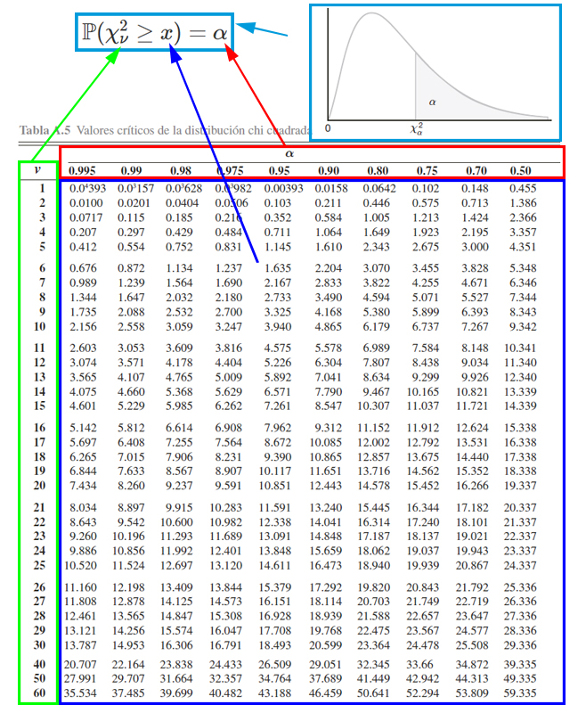

En donde, se aprecia que, <strong>el cuadro azul representan los valores
críticos</strong> \(x\) que se emplea para calcular probabilidades.
<strong>El cuadro rojo representa las probabilidades</strong> \(\alpha\)
que se desean calcular a partir de los valores críticos. <strong>El
cuadro verde representa los grados de libertad</strong> \(\nu\) que se
emplean para calcular probabilidades junto al empleo de los valores
críticos. Finalmente, <strong>el cuadro azul claro representa el
funcionamiento de la tabla </strong>, la cual muestra las probabilidades
que poseen la forma \(\mathbb{P}(\chi_\nu^2\geq x)=\alpha\).

<ol>
<li>

Con la explicación de la tabla en mente, la primera probabilidad a
calcular es \(\mathbb{P}(\chi^2_5 > 3)\). Entonces como esta
probabilidad tiene la estructura establecida por la tabla
\(\mathbb{P}(\chi_\nu^2\geq x)\), será cuestión de buscar para \(5\)
grados de libertad, el valor crítico \(3\) para localizar la
probabilidad asociada, tal que se busca en la parte izquierda, los
grados de libertad \(5\), y en la parte central (siguiendo la misma fila
en la cual se encontraron los grados de libertad) se busca el valor
crítico \(3\). Una vez ubicado el valor crítico, se busca cuál es la
probabilidad de interés asociada al valor crítico y grados de libertad,
en la parte superior. Dicho procedimiento se muestra en la siguiente
imagen

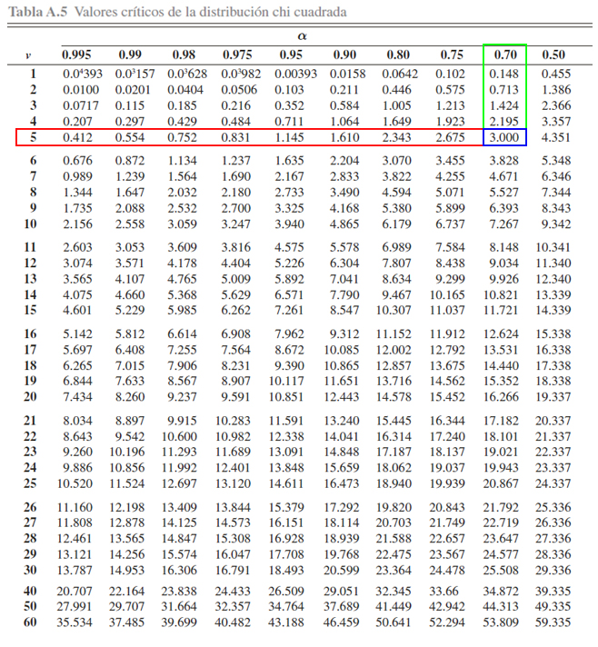

Donde se aprecia que

\[\begin{align*}\mathbb{P}(\chi^2_5 > 3)=0.70\end{align*}\]

</li>
<li>

A diferencia del punto anterior, observamos que la probabilidad
propuesta \(\mathbb{P}(\chi^2_{20} \leq 37.566)\) tiene una estructura
diferente a la establecida por la tabla
\(\mathbb{P}(\chi_\nu^2\geq x)\), y por tanto, será necesario emplear el
complemento de la probabilidad propuesta para obtener una estructura
similar a la propuesta por la tabla, tal que

\[\begin{align*}
\mathbb{P}(\chi^2_{20} \leq 37.566) = 1 - \mathbb{P}(\chi^2_{20} > 37.566)
\end{align*}\] En donde, se aprecia que ahora podemos calcular la
\(\mathbb{P}(\chi^2_{20} \leq 37.566)\), mediante el empleo de la
\(\mathbb{P}(\chi^2_{20} > 37.566)\), la cual podemos buscar en la tabla
directamente. Para localizar \(\mathbb{P}(\chi^2_{20} > 37.566)\), se
buscan los grados de libertad \(20\) en la parte izquierda de la tabla,
y el valor crítico en la parte central de la tabla (siguiendo la misma
fila en la cual se encontraron los grados de libertad). Una vez ubicado
el valor crítico, se busca en la parte superior cuál es la probabilidad
de interés asociada al valor crítico y grados de libertad.

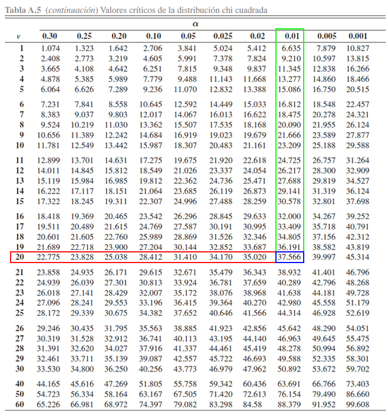

Donde se aprecia que

\[\begin{align*}
\mathbb{P}(\chi^2_{20} > 37.566) = 0.01
\end{align*}\]

y por tanto, se tendrá que

\[\begin{align*}
\mathbb{P}(\chi^2_{20} \leq 37.566) &= 1 - \mathbb{P}(\chi^2_{20} > 37.566)\\
                                    &= 1 - 0.01 \\
                                    &= 0.99
\end{align*}\]

</li>
<li>

En este caso, se desea calcular la
\(\mathbb{P}(9.034 < \chi^2_{12} \leq 15.812)\), y se observa que la
estructura de dicha probabilidad es diferente a la establecida por la
tabla \(\mathbb{P}(\chi_\nu^2\geq x)\), pero también podemos apreciar
que si aplicamos las propiedades de la función de distribución acumulada
para el caso continuo, ya presentadas en la
<a href="../../EstadisticayProbabilidades/EyPClase08.html#función-de-distribución-acumulada-caso-continuo">Clase
08</a>, y posteriormente calculamos el complemento de las
probabilidades, podemos llevar la probabilidad de interés a la forma

\[\begin{align*}
\mathbb{P}(9.034 < \chi^2_{12} \leq 15.812) &= \mathbb{P}(\chi^2_{12} \leq 15.812) - \mathbb{P}(\chi^2_{12} \leq 9.034) \\
                                            &= [1 - \mathbb{P}(\chi^2_{12} > 15.812)] - [1- \mathbb{P}(\chi^2_{12} > 9.034)] \\
                                            &= \mathbb{P}(\chi^2_{12} > 9.034) - \mathbb{P}(\chi^2_{12} > 15.812)
\end{align*}\] obteniendo que la probabilidad
\(\mathbb{P}(9.034 < \chi^2_{12} \leq 15.812)\), puede calcularse
mediante el empleo de las probabilidades
\(\mathbb{P}(\chi^2_{12} > 9.034)\) y
\(\mathbb{P}(\chi^2_{12} > 15.812)\), las cuales pueden calcularse en la
tabla de forma similar a los dos puntos anteriores.

Donde se aprecia que

\[\begin{align*}
\mathbb{P}(\chi^2_{12} > 9.034)=0.70 \quad \text{ y } \quad \mathbb{P}(\chi^2_{12} > 15.812)=0.20
\end{align*}\]

y por tanto, se tendrá que

\[\begin{align*}
\mathbb{P}(9.034 < \chi^2_{12} \leq 15.812) &= \mathbb{P}(\chi^2_{12} > 9.034) - \mathbb{P}(\chi^2_{12} > 15.812)\\
                               &= 0.70 - 0.20 \\
                               &= 0.50
\end{align*}\]
</li>
<li>

En este punto, a diferencia de los puntos anteriores, nos dan el valor
de la probabilidad y nos piden encontrar el valor crítico \(x\), dado
unos grados de libertad. Es decir debemos calcular el valor crítico
asociado a la probabilidad \[\begin{align*}
\mathbb{P}(\chi^2_{8} < x) = 0.10
\end{align*}\]

Y para ello, debemos llevar inicialmente la estructura de la
probabilidad, a la estructura manejada por la tabla, tal que

\[\begin{align*}
\mathbb{P}(\chi^2_{8} < x) = 0.10 \\
1 - \mathbb{P}(\chi^2_{8} \leq x) = 0.10 \\
1- 0.10 &= \mathbb{P}(\chi^2_{8} \leq x) \\
0.90 &= \mathbb{P}(\chi^2_{8} \leq x)
\end{align*}\]

En donde observamos que la probabilidad
\(\mathbb{P}(\chi^2_{8} \leq x)\) ya posee la estructura de la tabla, y
en consecuencia, podemos proceder a encontrar el valor crítico \(x\),
buscando los \(8\) grados de libertad en la parte izquierda de la tabla,
y la probabilidad \(0.90\) de la parte superior de la tabla, y luego
buscar el valor crítico \(x\) asociado a dicha probabilidad y grados de
libertad, en el cruce de los dos valores anteriormente encontrados.

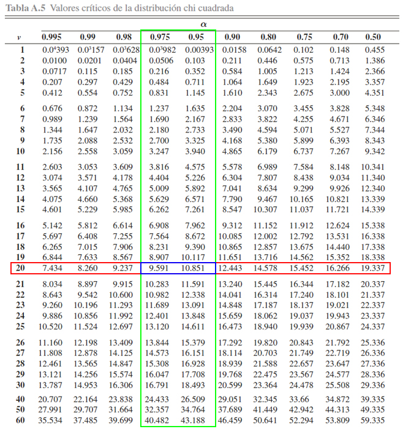

En la tabla se aprecia, que al buscar el cruce entre la probabilidad
\(0.90\) y los \(8\) grados de libertad, encontramos que el valor
crítico \(x\) asociado es de \(3.490\), es decir

\[\begin{align*}
\mathbb{P}(\chi^2_{8} \leq 3.490) &= 0.90
\end{align*}\]

o equivalentemente

\[\begin{align*}
\mathbb{P}(\chi^2_{8} < 3.490) &= 0.10
\end{align*}\]

</li>
</ol>
</main>
<button id="Show2" class="btn btn-secondary">
Mostrar Ejercicio
</button>
<button id="Hide2" class="btn btn-info">
Ocultar Ejercicio
</button>
<main id="botoncito2">
<h3 data-toc-skip>
Ejercicio
</h3>

Suponga que el tiempo que tarda un estudiante, en minutos, en resolver
un punto de un parcial de Estadística y Probabilidades posee una
distribución Chi-Cuadrado con una varianza de \(40_{min^2}\), entonces
basados en lo anterior

Calcule la probabilidad de que para un punto cualquiera, un estudiante
tarde en resolver el punto entre \(10\) y \(15\) minutos?

<h3 data-toc-skip>
Solución
</h3>

En este caso estamos interesados en calcular la probabilidad de que
durante un estudiante tarde entre \(10\) y \(15\) minutos en resolver un
parcial, es decir \[\begin{align*}
  \mathbb{P}(10 < X < 15)
\end{align*}\]

Para poder calcular la probabilidad e interés, debemos calcular primero
los grados de libertad \(\nu\), asociados a la distribución, y para ello
debemos despejar el valor del parámetro de interés de la fórmula de la
varianza, tal que \[\begin{align*}
  Var(X) &= 2\nu \\
  40 &= 2\nu \\
  \frac{40}{2} &= \nu \\
  \nu &= 20
\end{align*}\]

Una vez calculado el parámetro de la distribución se procede a realizar
el cálculo de la probabilidad, tal que

\[\begin{align*}
  \mathbb{P}(10 < X < 15) &= \int_{10}^{15} \frac{1}{2^{\frac{20}{2}}\Gamma(\frac{20}{2})} x^{\frac{20}{2}-1}e^{-{\frac{x}{2}}} dx \\
                          &= \frac{1}{2^{10}\Gamma(10)} \int_{10}^{15} x^{10-1}e^{-{\frac{x}{2}}} dx \\
\end{align*}\]

en donde se observa que al ser el exponente de la \(X\) un \(10-1\),
significa que debe integrar por partes un total de \(10\) veces para
realizar el cálculo de la integral. Como alternativa a realizar el
cálculo manualmente, es posible emplear la tabla de la distribución
chi-cuadrada o un software para encontrar la probabilidad de interés.
    <strong>Caso 1 (Probabilidad con software):</strong> Para
encontrar la probabilidad de interés mediante el empleo de un software
estadístico, será cuestión reescribir la probabilidad bilateral de
interés, en dos probabilidades unilaterales empleando los conceptos de
probabilidad acumulada, tal que \[\begin{align*}
  \mathbb{P}(10 < X < 15) &= \mathbb{P}(X < 15) - \mathbb{P}(X \geq 10)
\end{align*}\]

y finalmente buscando cada una de las probabilidades individuales en el
software, en donde la probabilidad exacta de \(\mathbb{P}(X < 15)\) es
igual a \[\begin{align*}
  \mathbb{P}(X < 15) = 0.2235924
\end{align*}\] mientras que la probabilidad exacta de
\(\mathbb{P}(X \geq 10)\) es igual a \[\begin{align*}
  \mathbb{P}(X < 10) = 0.03182806
\end{align*}\]

y por tanto, la probabilidad de que un estudiante tarde entre \(10\) y
\(15\) minutos resolviendo un punto del parcial es del \[\begin{align*}
  \mathbb{P}(10 < X < 15) &= 0.2235924 - 0.03182806 \\
                          &= 0.1917643
\end{align*}\]

es decir, que habrá una probabilidad del \(19.17\%\), de que un
estudiante tarde entre \(10\) y \(15\) minutos resolviendo un punto del
parcial.    

<strong>Caso 2 (Probabilidad aproximada con tabla):</strong> Para
encontrar la probabilidad de interés mediante el empleo de la tabla de
la chi-cuadrado, debemos reescribir la probabilidad a de tal forma que
su estructura sea la misma que maneja la tabla de la distribución
chi-cuadrado, tal que \[\begin{align*}
  \mathbb{P}(10 < X < 15) &= \mathbb{P}(X > 10) - \mathbb{P}(X \geq 15)
\end{align*}\]

Entonces si buscamos en la tabla un valor aproximado para
\(\mathbb{P}(X > 10)\) encontramos que

En donde se observa que el valor de \(10\), se encuentra entre las
probabilidades \(0.975\) y \(0.95\) y por tanto podemos usar un promedio
para aproximar la probabilidad de interés, tal que \[\begin{align*}
  \mathbb{P}(X > 10) &\approx \frac{0.975 + 0.95}{2} \\
                     &\approx 0.9625
\end{align*}\]

similarmente se encuentra la probabilidad aproximada para
\(\mathbb{P}(X \geq 15)\) tal que

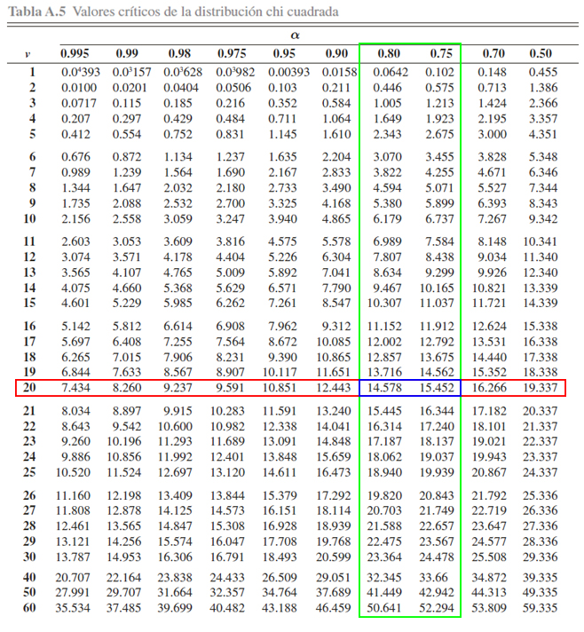

En donde, como ocurre una situación similar a la probabilidad de \(10\),
empleamos un promedio entre las probabilidades \(0.80\) y \(0.75\) para
encontrar la probabilidad aproximada de \(15\) \[\begin{align*}
  \mathbb{P}(X > 15) &\approx \frac{0.80 + 0.75}{2} \\
                     &\approx 0.775
\end{align*}\]

y finalmente, realizamos la resta correspondiente para encontrar la
probabilidad aproximada de interés, tal que \[\begin{align*}
  \mathbb{P}(10 < X < 15) &\approx 0.9625 - 0.775 \\
                          &\approx 0.1875
\end{align*}\]

obteniendo así que la probabilidad de un estudiante tarde entre \(10\) y
\(15\) minutos resolviendo un punto del parcial es aproximadamente de
\(18.75\%\).    De lo anterior se observa que a pesar de que no es
exacto el valor de la aproximación, éste valor se encuentra
relativamente cercano al valor exacto, y por tanto el empleo de la tabla
para buscar probabilidades, es una alternativa viable en caso de no
tener un software estadístico, o no poder o tener tiempo para realizar
el cálculo de la probabilidad de forma manual.

</main>

### Distribución Beta

Se dice que la variable aleatoria `$X$` tiene una distribución beta con
parámetros de forma `$\alpha$` y `$\beta$` si su función de densidad de
probabilidad está dada por
`\begin{align*} f(x) = \begin{cases} \frac{\Gamma(\alpha + \beta)}{\Gamma(\alpha)\Gamma(\beta)} x^{\alpha-1} (1 - x)^{\beta - 1} \quad \quad & 0<x<1; \alpha>0; \beta>0 \\ 0 \quad \quad & \text{en otro caso}\end{cases} \end{align*}`

en donde se observa que ésta distribución es un caso particular de la
distribución Uniforme en el intervalo `$(0, 1)$` cuando los parámetros
de forma `$\alpha = 1$` y `$\beta = 1$`.

#### Media y Varianza Beta

Si `$X\sim Beta(\alpha, \beta)$`, entonces se puede probar que la media
y varianza de la variable aleatoria `$X$` están dadas por
`\begin{align*} \mathbb{E}(X) = \frac{\alpha}{\alpha + \beta} \quad \quad Var(X)=\frac{\alpha\beta}{(\alpha + \beta)^2(\alpha + \beta + 1)} \end{align*}`

<button id="Show3" class="btn btn-secondary">
Mostrar Ejercicio
</button>
<button id="Hide3" class="btn btn-info">
Ocultar Ejercicio
</button>
<main id="botoncito3">
<h3 data-toc-skip>
Ejercicio
</h3>

Suponga que una gasolinera suele llenar los tanque de abastecimiento
cada fin de semana. Si por experiencia se sabe que proporción del tanque
que se vende cada semana se puede modelar mediante una distribución Beta
con parámetros \(\alpha=4\) y \(\beta = 2\).

<ol>
<li>
Calcule la probabilidad de que durante una semana se venda a lo más el
\(70\%\) del tanque?
</li>
<li>
Cuál es la cantidad promedio y desviación estándar de la proporción del
tanque que se vende en una semana.
</li>
</ol>
<h3 data-toc-skip>
Solución
</h3>
<ol>
<li>

En este caso estamos interesados en calcular la probabilidad de que
durante una semana se venda a lo más el \(70\%\) del tanque, y por tanto
la probabilidad de interés será de la forma \[\begin{align*}
  \mathbb{P}(X \geq 0.7)
\end{align*}\]

Entonces al emplear la función de probabilidad tendremos que

\[\begin{align*}
  \mathbb{P}(X \geq 0.7) &= \int_{0}^{0.7} \frac{\Gamma(4 + 2)}{\Gamma(4)\Gamma(2)} x^{4-1} (1 - x)^{2 - 1} dx \\
                         &= \frac{\Gamma(6)}{\Gamma(4)\Gamma(2)} \int_{0}^{0.7}  x^{3} (1 - x) dx \\
                         &= \frac{5!}{(3!)(1!)} \int_{0}^{0.7}  x^{3} - x^4 dx \\
                         &= 20 \int_{0}^{0.7}  x^3 - x^4 dx \\
                         &= 20 \left(\frac{x^4}{4} - \frac{x^5}{5} \right)\Bigg|_{0}^{0.7} \\
                         &= 20 \left(\frac{0.7^4 - 0^4}{4} - \frac{0.7^5 - 0^5}{5} \right) \\
                         &= 0.52822 \\
\end{align*}\]

y por tanto se tendrá una probabilidad del \(52.82\%\) de que en una
semana cualquiera, la gasolinera venda como máximo el \(70\%\) del
tanque.
</li>
<li>

Ahora, el interés está dado por calcular el número promedio y desviación
estándar de la proporción del tanque que se vende en una semana, y por
tanto, al emplear la formula de la esperanza matemática tendremos que
\[\begin{align*}
\mathbb{E}(X) &= \frac{\alpha}{\alpha + \beta }\\
              &= \frac{4}{4 + 2} \\
              &= \frac{4}{6} \\
              &= 0.66667
\end{align*}\]

mientras, al emplear la formula de la varianza tendremos que
\[\begin{align*}
Var(X) &= \frac{\alpha\beta}{(\alpha + \beta)^2(\alpha + \beta + 1)} \\
       &= \frac{(4)(2)}{(4 + 2)^2(4 + 2 + 1)} \\
       &= \frac{8}{(6)^2(7)} \\
       &= 0.03174
\end{align*}\]

y ahora, al sacarle raíz cuadrada a la varianza tendremos que
\[\begin{align*}
Sd(X) &= \sqrt{Var(X)} \\
      &= \sqrt{0.03174} \\
      &= 0.1781572
\end{align*}\]

Y por tanto se tendrá que en una semana la gasolinera vende en promedio
un \(66.66\%\) del tanque con una desviación estándar de \(17.82\%\).
</li>
</ol>
</main>

### Distribución Normal

Se dice que la variable aleatoria `$X$` tiene una distribución Normal
con parámetros `$\mu$` y `$\sigma^2)$`, si su función de densidad de
probabilidad es de la forma
`\begin{align*}  f(x) = \begin{cases} \frac{1}{\sqrt{2\pi\sigma^2}}e^{-\frac{(x - \mu)^2}{2\sigma^2}} & -\infty<x<\infty, -\infty<\mu<\infty, \sigma^2>0 \\ 0 & \text{en otro caso} \end{cases} \end{align*}`

#### Media y Varianza Normal

Si `$X\sim N(\mu, \sigma^2)$`, entonces se puede probar que la media y
la varianza de la variable aleatoria `$X$` están dadas por
`\begin{align*} \mathbb{E}(X)=\mu \quad \quad Var(X)=\sigma^2 \end{align*}`

### Distribución Normal estándar

Un caso particular de la distribución normal cuando la media `$\mu=0$` y
ka varianza `$\sigma^2=1$`, recibe el nombre de distribución normal
estándar, cuya variable aleatoria se simboliza con `$Z$`, tal que
`$Z\sim N(0,1)$`, y donde su función de densidad de probabilidad está
dada por

`\begin{align*}  f(z) = \begin{cases} \frac{1}{\sqrt{2\pi}}e^{-\frac{z^2}{2}} & -\infty<z<\infty \\ 0 & \text{en otro caso} \end{cases} \end{align*}`

#### Teorema de Estandarización

Si `$X\sim N(\mu, \sigma^2)$`, siendo `$a$` y `$b$` dos constantes
cualquiera, entonces si se realiza la transformación
`$Z=\frac{x-\mu}{\sigma}$` conocida como **estandarización**, se tendrá
que `$Z\sim N(0,1)$`, con `$z_1$` y `$z_2$` las dos constantes
transformadas.

#### Propiedades Distribución Normal Estándar

Si `$X\sim N(\mu, \sigma^2)$`, entonces al aplicar el teorema de
estandarización `$Z=\frac{x-\mu}{\sigma} \sim N(0,1)$`, y por tanto, si
`$z_1$` y `$z_2$` son constantes, se tendrá que

1.  `$\mathbb{P}(Z\leq z_1) = \mathbb{P}(Z\geq -z_1)$`
2.  `$\mathbb{P}(Z\geq z_1) = \mathbb{P}(Z\leq -z_1) = 1- \mathbb{P}(Z\leq z_1)$`
3.  `$\mathbb{P}(z_1\leq Z\leq z_2) = \mathbb{P}(Z\leq z_2) - \mathbb{P}(Z< z_1)$`
4.  Si `$z_1 = - z_2$` entonces
    `$\mathbb{P}(z_1\leq Z\leq z_2) = \mathbb{P}(-z_2\leq Z\leq z_2) =2\mathbb{P}(Z\leq z_2) - 1$`
5.  `$Z_\alpha$` es el valor de la variable aleatoria `$Z\sim N(0,1)$`
    tal que `$\mathbb{P}(Z\geq Z_\alpha)=\alpha$`, y
    `$\mathbb{P}(Z\leq Z_\alpha)=1 - \alpha$`

En donde, debe recordarse que, al ser la distribución normal una
distribución continua, la `$\mathbb{P}(Z\leq z_1) = \mathbb{P}(Z< z_1)$`
y `$\mathbb{P}(Z\geq z_1) = \mathbb{P}(Z > z_1)$`. Lo anterior debido a
que en la distribuciones continuas la probabilidad puntual es igual a
`$0$`.

<button id="Show4" class="btn btn-secondary">
Mostrar Ejercicio Manejo de Tabla Normal Estándar
</button>
<button id="Hide4" class="btn btn-info">
Ocultar Ejercicio Manejo de Tabla Normal Estándar
</button>
<main id="botoncito4">
<h3 data-toc-skip>
Ejercicio
</h3>

Suponga que poseemos una distribución normal estándar, tal que
\(Z\sim N(0,1)\). Entonces, a partir de esta distribución y empleando la
<a href="https://github.com/jiperezga/jiperezga.github.io/raw/master/Dataset/Documentos/DistNormEst.pdf">Tabla
de la Distribución Normal Estándar</a>, calcule

<ol>
<li>
\(\mathbb{P}(Z\leq 1.96)\)
</li>
<li>
\(\mathbb{P}(Z> 2.13)\)
</li>
<li>
\(\mathbb{P}(-2.42 <Z \leq 0.24)\)
</li>
<li>
\(\mathbb{P}(Z>z) = 0.0129\)
</li>
</ol>
<h3 data-toc-skip>
Solución
</h3>

Para calcular probabilidades con la tabla de la distribución normal
estándar, es necesario tener en cuenta el funcionamiento de la tabla
misma. Y para ello se presenta la siguiente imagen.

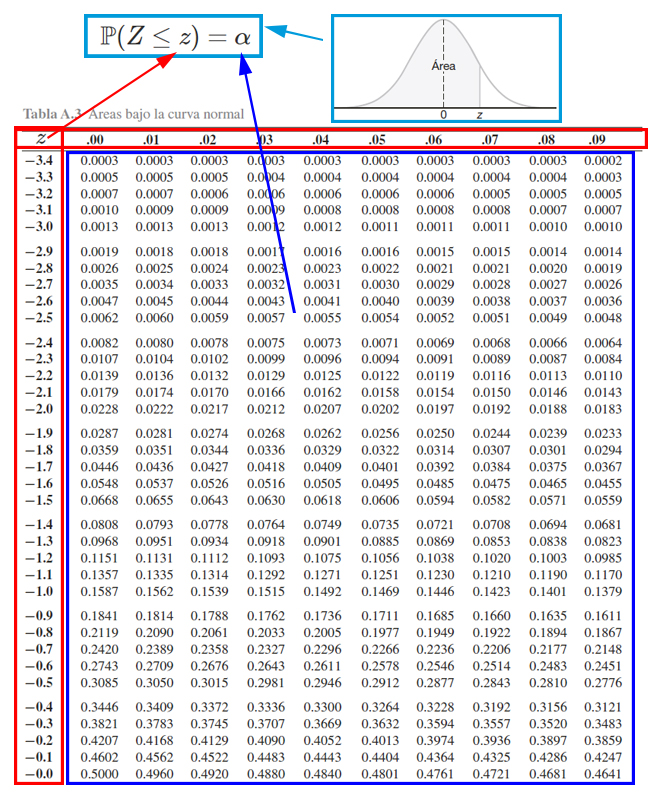

En donde, se aprecia que, <strong>los cuadros rojos representan los
valores críticos</strong> \(z\) que se emplea para calcular
probabilidades, en donde, el cuadro rojo de la parte izquierda muestra
la parte entera y el primer decimal, mientras que el cuadro rojo de la
parte superior muestra el segundo decimal. <strong>El cuadro azul
representa las probabilidades</strong> \(\alpha\) que se desean calcular
a partir de los valores críticos. Finalmente, <strong>el cuadro azul
claro representa el funcionamiento de la tabla </strong>, la cual
muestra las probabilidades que poseen la forma
\(\mathbb{P}(Z<z)=\alpha\).

<ol>
<li>

Con la explicación de la tabla en mente, la primera probabilidad a
calcular es \(\mathbb{P}(Z\leq 1.96)\). Entonces como esta probabilidad
tiene la estructura establecida por la tabla \(\mathbb{P}(Z\leq z)\),
será cuestión de buscar el valor crítico \(1.96\) para localizar la
probabilidad asociada, tal que se busca en la parte izquierda, el valor
\(1.9\) y en la parte superior el valor \(0.06\), y en donde se
encuentre el cruce de ambos valores, se encontrará el valor de la
probabilidad asociada a \(1.96\). Dicho procedimiento se muestra en la
siguiente imagen

Donde se aprecia que

\[\begin{align*}\mathbb{P}(Z\leq 1.96)=0.9750\end{align*}\]

</li>
<li>

A diferencia del punto anterior, observamos que la probabilidad
propuesta \(\mathbb{P}(Z> 2.13)\) tiene una estructura diferente a la
establecida por la tabla \(\mathbb{P}(Z\leq z)\), y por tanto, será
necesario emplear el complemento de la probabilidad propuesta para
obtener una estructura similar a la propuesta por la tabla, tal que

\[\begin{align*}
\mathbb{P}(Z> 2.13)= 1 - \mathbb{P}(Z\leq 2.13)
\end{align*}\] En donde, se aprecia que ahora podemos calcular la
\(\mathbb{P}(Z> 2.13)\), mediante el empleo de la
\(\mathbb{P}(Z\leq 2.13)\), la cual podemos buscar en la tabla
directamente. Para localizar \(\mathbb{P}(Z\leq 2.13)\), se busca el
valor \(2.1\) en la parte izquierda de la tabla, y el valor \(0.03\) en
la parte superior de la tabla, y en donde se encuentre el cruce de ambos
valores, se encontrará el valor de la probabilidad asociada a \(2.13\).

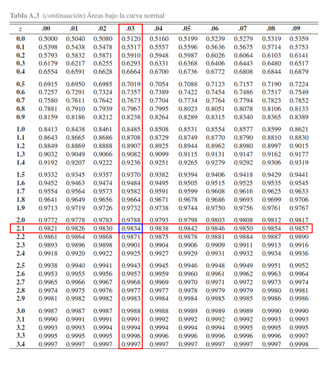

Donde se aprecia que

\[\begin{align*}
\mathbb{P}(Z\leq 2.13)=0.9834
\end{align*}\]

y por tanto, se tendrá que

\[\begin{align*}
\mathbb{P}(Z> 2.13)&= 1 - \mathbb{P}(Z\leq 2.13)\\
                   &= 1 - 0.9834 \\
                   &= 0.0166
\end{align*}\]

</li>
<li>

En este caso, se desea calcular la \(\mathbb{P}(-2.42 <Z \leq 0.24)\), y
se observa que la estructura de dicha probabilidad es diferente a la
establecida por la tabla \(\mathbb{P}(Z\leq z)\), pero también podemos
apreciar que si aplicamos las propiedades de la función de distribución
acumulada para el caso continuo, ya presentadas en la
<a href="https://jiperezga.github.io/EstadisticaI/EstIClase08.html#función-de-distribución-acumulada-caso-continuo">Clase
08</a>, podemos llevar la probabilidad de interés a la forma

\[\begin{align*}
\mathbb{P}(-2.42 <Z \leq 0.24) = \mathbb{P}(Z \leq 0.24) - \mathbb{P}(Z \leq -2.42)
\end{align*}\] obteniendo que la probabilidad
\(\mathbb{P}(-2.42 <Z \leq 0.24)\), puede calcularse mediante el empleo
de las probabilidades acumuladas \(\mathbb{P}(Z \leq 0.24)\) y
\(\mathbb{P}(Z \leq -2.42)\), las cuales pueden calcularse en la tabla
de forma similar a los dos puntos anteriores.

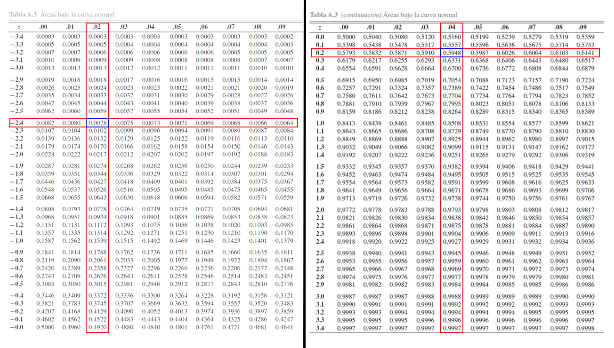

Donde se aprecia que

\[\begin{align*}
\mathbb{P}(Z \leq -2.42)=0.0078 \quad \text{ y } \quad \mathbb{P}(Z \leq 0.24)=0.5948
\end{align*}\]

y por tanto, se tendrá que

\[\begin{align*}
\mathbb{P}(-2.42 <Z \leq 0.24) &= \mathbb{P}(Z \leq 0.24) - \mathbb{P}(Z \leq -2.42)\\
                               &= 0.5948 - 0.0078  \\
                               &= 0.587
\end{align*}\]
</li>
<li>

En este punto, a diferencia de los puntos anteriores, no están dando el
valor de la probabilidad y nos piden encontrar el valor crítico \(z\).
Es decir debemos calcular el valor crítico asociado a la probabilidad
\[\begin{align*}
\mathbb{P}(Z>z) = 0.0129
\end{align*}\]

Y para ello, debemos llevar inicialmente la estructura de la
probabilidad, a la estructura manejada por la tabla, tal que

\[\begin{align*}
\mathbb{P}(Z>z) &= 0.0129 \\
1 - \mathbb{P}(Z\leq z) &= 0.0129 \\
1- 0.0129 &= \mathbb{P}(Z\leq z) \\
0.9871 &= \mathbb{P}(Z\leq z)
\end{align*}\]

En donde observamos que la probabilidad \(\mathbb{P}(Z\leq z)\) ya posee
la estructura de la tabla, y en consecuencia, podemos proceder a
encontrar el valor crítico \(z\), buscando el valor de la probabilidad
\(0.9871\) en la parte interior de la tabla, y luego buscando cual es el
valor crítico \(z\) asociado a dicha probabilidad.

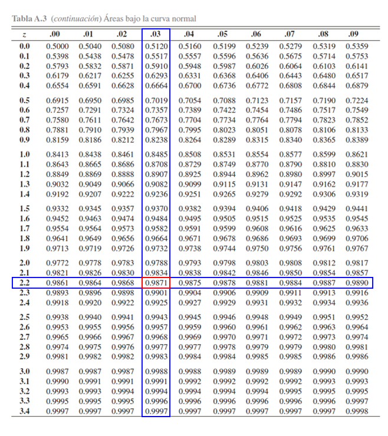

En la tabla se aprecia, que al buscar la probabilidad \(0.9871\)
encontramos que el valor crítico \(z\) asociado es de \(2.24\), es decir

\[\begin{align*}
\mathbb{P}(Z\leq 2.24) &= 0.9871
\end{align*}\]

o equivalentemente

\[\begin{align*}
\mathbb{P}(Z > 2.24) &= 0.0129
\end{align*}\]

</li>
</ol>
</main>
<button id="Show5" class="btn btn-secondary">
Mostrar Ejercicio
</button>
<button id="Hide5" class="btn btn-info">
Ocultar Ejercicio
</button>
<main id="botoncito5">
<h3 data-toc-skip>
Ejercicio
</h3>

Suponga que cierto tipo de batería para celular dura en promedio \(5\)
años con una desviación estándar de \(1.2\) años. Si se sabe por
experiencia que la distribución de las baterías se distribuye
normalmente, cuál es la probabilidad de que una batería de celular dure
al menos \(4\) años?

<h3 data-toc-skip>
Solución
</h3>

En este caso estamos interesados en que la batería de una celular dure
al menos \(4\) años, es decir, queremos calcular la siguiente
probabilidad. \[\begin{align*}
\mathbb{P}(X \geq 4)
\end{align*}\] Pero en este caso tenemos que la distribución de los
datos no se distribuye \(N(0,1)\), si no que se distribuye
\(N(5, 1.2)\), y por ello debemos aplicar el teorema de estandarización,
con el fin de llevar la distribución \(N(5, 1.2)\) a una normal
estándar, tal que \[\begin{align*}
\mathbb{P}(X \geq 4)&=\mathbb{P}\left(\frac{X-\mu}{\sigma}\geq \frac{4-5}{1.2}\right)\\
\mathbb{P}(X \geq 4)&=\mathbb{P}\left(\frac{X-\mu}{\sigma}\geq \frac{4-5}{1.2}\right)\\
\mathbb{P}(X \geq 4)&=\mathbb{P}(Z \geq -0.83)
\end{align*}\] En donde \(Z\sim N(0,1)\). Ahora, como la estructura de
la probabilidad de \(Z\) no posee la estructura de la probabilidad de se
maneja en la tabla, entonces procedemos a calcular el complemento de la
probabilidad, tal que \[\begin{align*}
\mathbb{P}(Z \geq -0.83)&= 1 - \mathbb{P}(Z < -0.83) \\
\end{align*}\] y en consecuencia podemos ahora buscar la probabilidad
\(\mathbb{P}(Z < -0.83)\) en la tabla de la distribución normal
estándar, de la siguiente manera

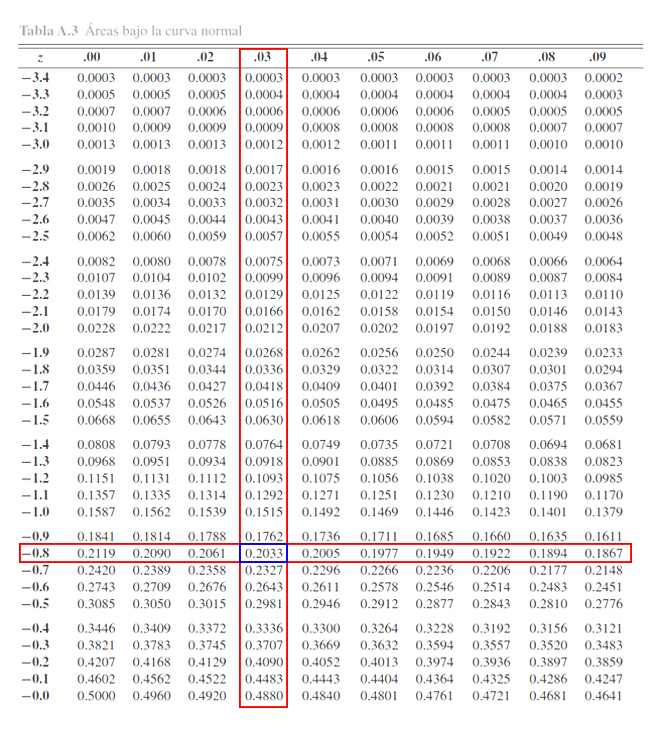

Donde se aprecia que

\[\begin{align*}
\mathbb{P}(Z < -0.83)=0.2033
\end{align*}\]

y por tanto, se tendrá que

\[\begin{align*}
\mathbb{P}(Z \geq -0.83)&= 1 - \mathbb{P}(Z < -0.83) \\
                        &= 1 - 0.2033 \\
                        &= 0.7967
\end{align*}\]

lo cual es equivalente a

\[\begin{align*}
\mathbb{P}(X \geq 4)&= \mathbb{P}(Z \geq -0.83) \\
                    &= 0.7967
\end{align*}\]

En consecuencia, se tendrá que la probabilidad de que una batería de
celular dure al menos \(4\) años, es del \(76.67\%\).

</main>

### Distribución Lognormal

Se dice que la variable aleatoria `$X$` tiene una distribución
lognormal, si la variable aleatoria `$Y=ln(X)$` posee una distribución
normal con parámetros `$\mu$` y `$\sigma^2$`, tal que la función de
densidad de probabilidad de `$X$` será igual a
`\begin{align*}  f(x) = \begin{cases} \frac{1}{x \sqrt{2\pi\sigma^2}}e^{-\frac{(ln(x) - \mu)^2}{2\sigma^2}} & x>0, -\infty<\mu<\infty, \sigma^2>0 \\ 0 & \text{en otro caso} \end{cases} \end{align*}`

#### Media y Varianza Lognormal

Si `$X\sim LogN(\mu, \sigma)$`, entonces se puede probar que la media y
la varianza de la variable aleatoria `$X$` están dadas por
`\begin{align*} \mathbb{E}(X)=e^{\mu+\frac{\sigma^2}{2}} \quad \quad Var(X)=e^{2\mu+\sigma^2} (e^{\sigma^2}  - 1) \end{align*}`

<button id="Show6" class="btn btn-secondary">
Mostrar Ejercicio
</button>
<button id="Hide6" class="btn btn-info">
Ocultar Ejercicio
</button>
<main id="botoncito6">
<h3 data-toc-skip>
Ejercicio
</h3>

Suponga que el departamento de Biología realiza un estudio sobre la
concentración de contaminación que el río Medellín en el trayecto
Poblado-Industriales, dado que en dicha trayecto desembocan los desechos
de una planta química que se encuentra por la zona. Si el departamento
de Biología encuentra que la concentración de contaminación se
distribuye Lognormal con parámetros \(\mu = 5\) y \(\sigma = 2.8\)

<ol>
<li>
¿Cuál es la probabilidad de que en una medición se encuentre que la
concentración de contaminación sea mínimo de \(12\) partes por millón?
</li>
<li>
¿Cuál es el concentración de contaminación promedio y desviación
estandar de las mediciones que se realizan en el río Medellín en el
trayecto Poblado-Industriales.?
</li>
</ol>
<h3 data-toc-skip>
Solución
</h3>
<ol>
<li>

En este caso estamos interesados encontrar la probabilidad de que mínimo
\(12\) partes por millón, sea la concentración de contaminación que se
encuentra en una medición realizada, es decir que si \(X\) es la
concentración de contaminación, se tendrá que \[\begin{align*}
\mathbb{P}(X \geq 12)
\end{align*}\]

Entonces, si empleamos para realizar el cálculo la relación entre la
distribución normal y la distribución lognormal, y el concepto de
estandarización de la distribución normal, tendremos que
\[\begin{align*}
\mathbb{P}(X \geq 12) &= 1 - \mathbb{P}(X < 12) \\
                      &= 1 - \mathbb{P}(ln(X) < ln(12)) \\
                      &= 1 - \mathbb{P}(ln(X) - \mu < ln(12) - 5) \\
                      &= 1 - \mathbb{P}\left(\frac{ln(X) - \mu}{\sigma} < \frac{ln(12) - 5}{2.8}\right) \\
                      &= 1 - \mathbb{P}\left(Z < -0.8982476\right) \\
\end{align*}\]

y en consecuencia podemos ahora buscar la probabilidad
\(\mathbb{P}\left(Z < -0.8982476\right) \approx \mathbb{P}(Z < -0.90)\)
en la tabla de la distribución normal estándar, de la siguiente manera

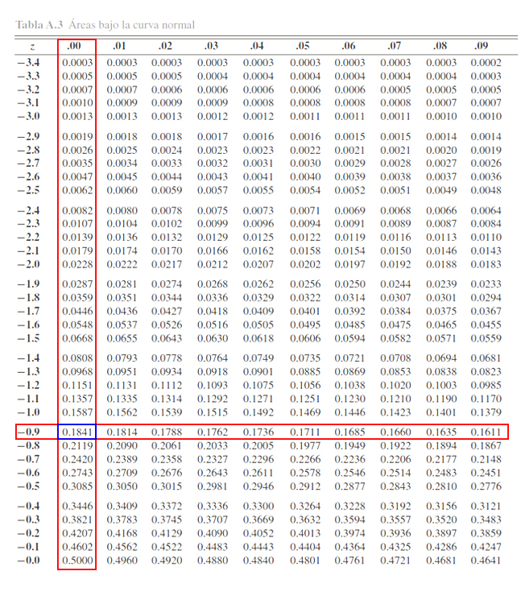

Donde se aprecia que

\[\begin{align*}
\mathbb{P}(Z < -0.8982476)\approx 0.1841
\end{align*}\]

y por tanto, se tendrá que

\[\begin{align*}
\mathbb{P}(X \geq 12) &= 1 - \mathbb{P}\left(Z < -0.8982476\right) \\
                      &\approx 1 - 0.1841 \\
                      &\approx 0.8159
\end{align*}\]

es decir, que la probabilidad de que la concentración de contaminación
encontrada en una medición en el río en el trayecto Poblado-Industriales
sea mínimo de \(12\) partes por millón, es aproximadamente del
\(81.59\%\).
</li>
<li>

En este caso estamos interesados en calcular el promedio y desviación
estándar de la concentración de contaminación que se encuentra en el
trayecto Poblado-Industriales del río Medellín, en donde, al aplicar las
ecuaciones de esperanza matemática y varianza, se tendrá que el promedio
de concentración de contaminación es de \[\begin{align*}
\mathbb{E}(X) &= e^{\mu+\frac{\sigma^2}{2}} \\
              &= e^{5+\frac{2.8^2}{2}} \\
              &= 7480.089
\end{align*}\] la varianza será igual a \[\begin{align*}
Var(X) &= e^{2\mu+\sigma^2} (e^{\sigma^2}  - 1) \\
       &= e^{2(5)+2.8^2} (e^{2.8^2}  - 1) \\
       &= 55951735 (2540.205  - 1) \\
       &= 142072925271
\end{align*}\]

y por tanto la desviación estándar será de \[\begin{align*}
Sd(X) &= \sqrt{Var} \\
      &= \sqrt{142072925271} \\
      &= 376925.6
\end{align*}\]

Es decir que en promedio la medición de la concentración de
contaminación en el río Medellín arrojará un valor de \(7480.089\)
partes por millón, con una desviación estándar de \(376925.6\) partes
por millón.
</li>
</ol>
</main>
