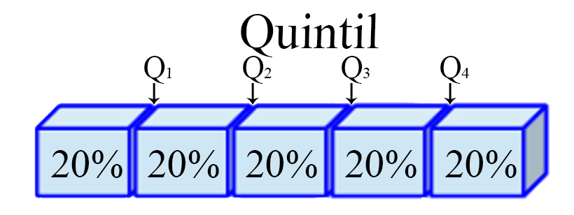
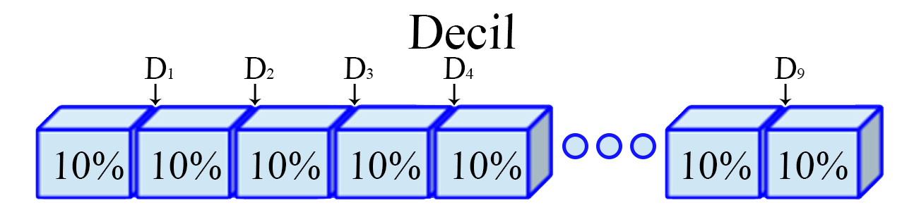
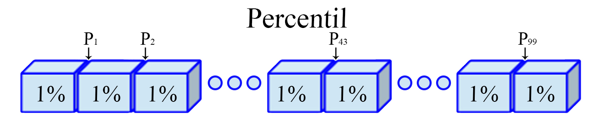

Introducción
------------

La Estadística es una **fuerte herramienta** empleada en las diferentes
disciplinas científicas, debido a su gran potencial para **recolectar,
analizar y presentar** de forma amigable, la información que se genera
en las distintas áreas del conocimiento, para así poder argumentar y
soportar de mejor manera las investigaciones realizadas.

Adicionalmente, la estadística tiene como ventaja respecto a otras
áreas, que permite extraer información de **variables tanto numérica
como categórica** de la población de interés o de una muestra de la
misma, permitiendo con ello, establecer conclusiones acerca de la misma
población, o de alguno de los parámetros que la conforman. Dado lo
anterior, no es de sorprender que la estadística sea concebida como
**uno de los pilares fundamental** dentro de la investigación científica
teórica y aplicada.

En general, el análisis estadístico puede dividirse en dos partes:

-   La **Estadística descriptiva**, la cual se encarga de resumir la
    información suministrada mediante el empleo de tablas, gráficas y
    medidas numéricas, junto con el análisis de las mismas, para
    facilitar la interpretación y la presentación de la información.
-   La **Inferencia estadística**, la cual se encarga de la inferencias,
    modelamiento y predicción de la información, para facilitar la
    obtención de conclusiones y toma de decisiones.

Estadística descriptiva
-----------------------

En general, la importancia del análisis estadístico radica en la
**resolución de problemas vinculados con datos**, en donde la
variabilidad de los mismos es quién guiará la importancia del empleo de
diferentes técnicas para el manejo de la información. Desde este punto
de vista, se discute en esta sección sobre la implementación de
resúmenes de información, así como la presentación por medio de cuadros,
diagramas o gráficos, cálculo y uso de medidas estadísticas de tendencia
central, localización, variabilidad y forma.

### Finalidad de la estadística

-   Conocer el grado de incertidumbre que posee un fenómeno.
-   Conocer la realidad de un fenómeno y determinar los cambios y las
    causas que lo originan.
-   Para hacer estimaciones y pronósticos sobre el comportamiento de
    variables.

### Tipos de datos

En términos generales, los datos son cualquier pieza de información
recolectada del fenómeno que se pretende analizar, y que, dependiendo de
las características que posean, deben clasificarse dentro de una
determinada categoría.

-   **Cuantitativos**: Son datos que pueden ser medidos o cuantificados.
    Estos se subdividen en dos categorías:
    -   **Discretos**: Son aquellos datos que provienen de procesos que
        involucran conteos, y por tanto, solo pueden tomar valores
        enteros. Por ejemplo: **Edad de una persona, número de empleados
        de una empresa, cantidad de estudiantes matriculados en un curso
        de Estadística**
    -   **Continuos**: Son aquellos datos que provienen de procesos que
        involucran mediciones, y por tanto, solo pueden tomar cualquier
        valor real dentro de un intervalo. Por ejemplo: **Temperatura de
        congelación del agua, Tiempo que dura una clase, Utilidad diaria
        de un negocio.**
-   **Cualitativos**: Son datos asociados a una cualidad o propiedad, y
    por tanto, no pueden representarse numéricamente, a pesar de poder
    caracterizarse alfanuméricamente.
    -   **Nominal**: Son aquellos factores que establecen etiquetas o
        categorías a los datos, sin estar sujetos a un orden específico.
        Por ejemplo: **Partido político, Comuna de residencia, Deporte
        favorito**
    -   **Ordinal**: Son aquellos factores que establecen etiquetas o
        categorías a los datos, junto a una estructura jerárquica. Por
        ejemplo: **Estado de una enfermedad, Grado de escolaridad,
        Estrato socioeconómico**

<button id="Show1" class="btn btn-secondary">
Mostrar Ejercicio
</button>
<button id="Hide1" class="btn btn-info">
Ocultar Ejercicio
</button>
<main id="botoncito1">
<h3 data-toc-skip>
Ejercicio Caso de Estudio
</h3>
<p>
Clasifique las variables según el tipo de dato y su escala de medición
</p>
<ol>
<li>
Evaluación de conocimientos
</li>
<li>
Tipo de universidad
</li>
<li>
Posición en un reinado de belleza
</li>
<li>
Calidad de vida en una ciudad
</li>
<li>
Escalas de los test psicológicos
</li>
<li>
Litros de agua consumidos por persona al día
</li>
<li>
Número del documento de identidad
</li>
<li>
Goles marcados por un futbolista en un partido
</li>
</ol>
<h3 data-toc-skip>
Solución
</h3>
<ol>
<li>
<strong> Evaluación de conocimientos: </strong> Suponga que es una
calificación obtenida en un intervalo de \(0\) a \(5\), y en
consecuencia, se tendrá que la variable será de tipo
<strong>Cuantitativa</strong> de tipo <strong>Continua</strong>, debido
a que puede obtenerse valores no enteros, como por ejemplo una
calificación de \(3.6\).
</li>
<li>
<strong> Tipo de universidad:</strong> Dado que las universidades pueden
ser públicas o privadas, se tendrá una variable de tipo
<strong>Cualitativa</strong> de tipo <strong>Nominal</strong>, debido a
que no existe una jerarquía o un ordenamiento natural en donde se siga
que las universidades públicas son superiores a las privadas, o
viceversa.
</li>
<li>
<strong> Posición en un reinado de belleza:</strong> La posición
obtenida en un reinado de belleza se divide en muchas competencias como
Reina, Virreina, Primera princesa, Segunda Princesa y Tercera princesa,
por tanto, se tendrá que la variable será de tipo
<strong>Cualitativa</strong> de tipo <strong>Ordinal</strong> debido a
que hay una jerarquía entre las posiciones obtenidas, siendo la posición
más alta la Reina, cual es la que gana la competencia, seguida por la
Virreina la cual es quién queda en la segunda posición en la
competencia, y así sucesivamente.
</li>
<li>
<strong> Calidad de vida en una ciudad:</strong> Suponiendo que la
medición se hace en niveles de Alta, Media y Baja, se tendrá que la
variable será de tipo <strong>Cualitativa</strong> de tipo
<strong>Ordinal</strong> debido a que hay una persona que tenga una
calidad de vida alta, va a estar en una mejor posición económica que
tenga una calidad de vida baja. Aunque ésto podría ser planteado de
forma diferente, debido a que hay diferentes definiciones de calidad de
vida.
</li>
<li>
<strong> Escalas de los test psicológicos:</strong> son pruebas que
miden diferentes características, por ejemplo, la inteligencia emocional
o altruismo. Éstas por lo general poseen calificaciones que están dadas
por enteros de \(0\) a \(100\), por lo cual se tendrá que la variable
será de tipo <strong>Cuantitativa</strong> de tipo
<strong>Discreta</strong>, debido a que al ser admisibles solo valores
enteros y que el rango de valores no es extremadamente grande.
</li>
<li>
<strong> Litros de agua consumidos por persona al día:</strong> Dado que
una persona puede consumir hasta \(7\) litros de agua por día antes de
sufrir de hiperhidratación o intoxicación por agua, diremos que es una
variable de tipo <strong>Cuantitativa</strong> de tipo
<strong>Continua</strong> debido que en un día una persona puede
consumir cualquier valor entre \(0\) y \(7\), incluidos valores no
enteros, como por ejemplo, \(2.3\) litros.
</li>
<li>
<strong> Número del documento de identidad:</strong> Aunque la variable
sea literalmente númerica, no significa que tenga un valor numérico como
tal, en su lugar, éste sirve un como identificador para las personas, y
por tanto se tendrá que dicha variable es de tipo
<strong>Cualitativa</strong> de tipo <strong>Nominal</strong>, debido a
número de identidad en particular no simboliza una jerarquía mayor a
menor respecto a números de identidad menor o mayor, respectivamente.
</li>
<li>
<strong> Goles marcados por un futbolista en un partido:</strong> Un
futbolista puede no anotar goles en un partido, o anotar \(1\) gol,
\(2\) goles, \(3\) goles, \(\ldots\), \(n\) goles. Dado lo anterior, se
observa que un jugador solo puede anotar un número entero de goles, y
por tanto, se tendrá que la variable será de tipo
<strong>Cuantitativa</strong> de tipo <strong>Discreta</strong> debido a
que solo puede anotarse un número entero de goles.
</li>
</ol>
</main>

Medidas estadísticas
--------------------

Las medidas estadísticas tienen por objetivo resumir la información
contenida en un conjunto de datos, en pocos valores numéricos que
representan diferentes características. **Estas medidas estadísticas nos
darán información sobre la situación, dispersión, forma, asociación que
posee un conjunto de datos** de manera que sea posible captar
rápidamente la estructura de los mismos.

#### Caso de estudio

Suponga que se está interesado en la construcción de una nueva vía
sur-norte para la avenida Guayabal y para ello debe registrarse el
número de vehículos que transitan dicha vía por día. Si se toma de
referencia un total de `$28$` días obteniendo los siguientes resultados

<pre style="font-family: 'Open Sans',sans-serif; margin-bottom: -4rem; margin-top: -2rem; font-size: 120%;">
<table class="table table-striped" style="width: auto !important; margin-left: auto; margin-right: auto;">
<tbody>
  <tr>
    <td>1142</td>
    <td>1430</td>
    <td>1005</td>
    <td>1538</td>
    <td>1116</td>
    <td>1537</td>
    <td>1307</td>
    <td>1510</td>
    <td>1522</td>
    <td>1310</td>
  </tr>
  <tr>
    <td>1088</td>
    <td>1166</td>
    <td>1365</td>
    <td>1391</td>
    <td>1195</td>
    <td>1737</td>
    <td>1452</td>
    <td>1596</td>
    <td>1588</td>
    <td>1248</td>
  </tr>
  <tr>
    <td>1097</td>
    <td>1142</td>
    <td>1365</td>
    <td>1542</td>
    <td>1609</td>
    <td>1220</td>
    <td>1260</td>
    <td>1588</td>
    <td></td>
    <td></td>
  </tr>
</tbody>
</table>
</pre>

### Medidas de tendencia central

Estas medidas tienen por objetivo buscar valores que muestren el lugar
en el cual se encuentra el centro de un conjunto de observaciones. Si se
define `$x_1, x_2, \ldots, x_n$` como un conjunto de `$n$`
observaciones, entonces

#### Media

Es el promedio numérico de las `$n$` observaciones.
`\begin{align*}   \bar{X}=\sum_{i=1}^n\frac{x_i}{n}=\frac{x_1+x_2+\ldots+x_n}{n} \end{align*}`

En <tt>R</tt>, puede calcularse el valor promedio de un conjunto de
observaciones mediante la función `mean(datos)`.

En <tt>Excel</tt>, puede calcularse el valor promedio de un conjunto de
observaciones mediante la función `PROMEDIO()`.

<button id="Show2" class="btn btn-secondary">
Mostrar Ejercicio
</button>
<button id="Hide2" class="btn btn-info">
Ocultar Ejercicio
</button>
<main id="botoncito2">
<h3 data-toc-skip>
Ejercicio caso de estudio
</h3>
<p>
Calcule el número promedio de automóviles que transitan por la avenida
Guayabal sur-norte en un día.
</p>
<h3 data-toc-skip>
Solución
</h3>
<p>

A partir de los datos se tiene entonces que el número promedio de
automóviles que transitan por la avenida Guayabal es de \[\begin{align*}
  \bar{X} &= \sum_{i=1}^n\frac{x_i}{n}\\
          &= \frac{1142 + 1430 + 1005 + \ldots + 1588}{28} \\
          &= 1359.5
\end{align*}\]

Lo anterior significa que, el número promedio de datos transitan por la
avenida Guayabal en un día es igual a \(1359.5\) automóviles.
</p>
</main>

#### Mediana

Es el valor que ocupa el lugar central en un conjunto de datos, es
decir, el valor que divide el conjunto de observaciones en dos partes
que contienen el 50% de las observaciones. Para realizar el cálculo de
la mediana es necesario ordenar inicialmente el conjunto de
observaciones de forma ascendente.
`\begin{align*}   \tilde{X}=\begin{cases}x_{\left[\frac{(n+1)}{2}\right]} & \text{si } n \text{ es impar}\\\frac{1}{2}\left(x_{\left[\frac{n}{2}\right]}+x_{\left[\frac{n}{2}+1\right]}\right) & \text{si } n \text{ es par}\end{cases} \end{align*}`
donde `$x_{\left[j\right]}$` representa la `$j$`-ésima observación
ordenada.

En <tt>R</tt> puede calcularse la mediana de un conjunto de
observaciones mediante la función `median(datos)`.

En <tt>Excel</tt> puede calcularse la mediana de un conjunto de
observaciones mediante la función `MEDIANA()`.

<button id="Show3" class="btn btn-secondary">
Mostrar Ejercicio
</button>
<button id="Hide3" class="btn btn-info">
Ocultar Ejercicio
</button>
<main id="botoncito3">
<h3 data-toc-skip>
Ejercicio caso de estudio
</h3>
<p>
Calcule la mediana obtenida del número de automóviles que transitan por
la avenida Guayabal sur-norte en un día.
</p>
<h3 data-toc-skip>
Solución
</h3>
<p>

Inicialmente, se observa que el número de días registrados fue de
\(28\), por lo cual, se tiene que \(n\) es un número par, haciendo que
la ecuación empleada sea

\[\begin{align*}
  \tilde{X} &= \frac{1}{2}\left(x_{\left[\frac{n}{2}\right]}+x_{\left[\frac{n}{2}+1\right]}\right) \\
            &= \frac{1}{2}\left(x_{\left[\frac{28}{2}\right]}+x_{\left[\frac{28}{2}+1\right]}\right) \\
            &= \frac{1}{2}\left(x_{\left[14\right]}+x_{\left[15\right]}\right)
\end{align*}\]

En donde se observa que debe localizarse la observación que ocupa la
posición número \(14\) y \(15\) en los registros del número de vehículos
que transitan por día <strong>luego de ordenarlas de menor a
mayor</strong>.

Realizando el ordenamiento se tendrá que
</p>
<pre style="font-family: 'Open Sans',sans-serif; margin-bottom: -4rem; margin-top: -2rem; font-size: 120%;">
<table class="table table-striped" style="width: auto !important; margin-left: auto; margin-right: auto;">
<tbody>
  <tr>
    <td>1005</td>
    <td>1088</td>
    <td>1097</td>
    <td>1116</td>
    <td>1142</td>
    <td>1142</td>
    <td>1166</td>
    <td>1195</td>
    <td>1220</td>
    <td>1248</td>
  </tr>
  <tr>
    <td>1260</td>
    <td>1307</td>
    <td>1310</td>
    <td>1365</td>
    <td><span style="border-radius: 4px; padding-right: 4px; padding-left: 4px; background-color: #974c55 !important;">1365</span></td>
    <td><span style="border-radius: 4px; padding-right: 4px; padding-left: 4px; background-color: #974c55 !important;">1391</span></td>
    <td>1430</td>
    <td>1452</td>
    <td>1510</td>
    <td>1522</td>
  </tr>
  <tr>
    <td>1537</td>
    <td>1538</td>
    <td>1542</td>
    <td>1588</td>
    <td>1588</td>
    <td>1596</td>
    <td>1609</td>
    <td>1737</td>
    <td></td>
    <td></td>
  </tr>
</tbody>
</table>
</pre>
<p>
donde se observa que las observaciones \(14\) y \(15\) para el número de
vehículos que transitan sur-norte por la avenida Guayabal es
\(x_{[14]}=1365\) y \(x_{[15]}=1365\), respectivamente.<br> <br> Con
dichos valores se realiza entonces, el cálculo de la mediana, tal que
</p>

\[\begin{align*}
  \tilde{X} &= \frac{1}{2}(1365+ 1365) \\
            &=1365
\end{align*}\]

<p>
De lo anterior se obtiene que el \(50\%\) inferior de los días transitan
por la avenida Guayabal sur-norte a lo más \(1365\) vehículos, mientras
que el \(50\%\) superior de los días transitan por la avenida Guayabal
sur-norte al menos \(1365\) vehículos.
</p>
</main>

#### Moda

Es el valor que ocurre con mayor frecuencia en un conjunto de datos, es
decir, es la observación que se repite con mayor frecuencia. Es de
anotar que en un conjunto de observaciones, se puede tener más de una
moda, en cuyo caso se dirá que el conjunto de datos es bimodal, trimodal
o multimodal.

Entre las funciones base del programa <tt>R</tt> no hay ninguna función
que calcule la moda de un conjunto de observaciones, y por tanto, debe
crearse una función que realice el cálculo, de la forma

``` r
# Función para el cálculo de la moda
Moda <- function(x) {
    keys <- na.omit(unique(x))
    keys[which.max(tabulate(match(x, keys)))]
}
```

Una vez creada la función, puede calcularse la moda de un conjunto de
observaciones mediante la función `Moda(datos)`.

En <tt>Excel</tt> puede calcularse la moda de un conjunto de
observaciones mediante la función `MODA.UNO()` para calcular el valor
que más se repite, o la función `MODA.VARIOS()` para calcular una lista
con los valores que más se repiten para el caso bimodal, trimodal o
multimodal, guardando la función con la secuencia
<tt>Ctrl+Shift+Enter</tt>.

<button id="Show4" class="btn btn-secondary">
Mostrar Ejercicio
</button>
<button id="Hide4" class="btn btn-info">
Ocultar Ejercicio
</button>
<main id="botoncito4">
<h3 data-toc-skip>
Ejercicio caso de estudio
</h3>
<p>
Calcule la moda del número de automóviles que transitan por la avenida
Guayabal sur-norte en un día.
</p>
<h3 data-toc-skip>
Solución
</h3>
<p>
Para encontrar el número modal de automóviles, es necesario localizar el
número de vehículos que más se repita por día. Con el fin de ilustrar
cual es este valor, se presenta nuevamente la tabla ordenada con el
número de vehículos que transitaron cada uno de los \(28\) días para
facilitar su visualización.
</p>
<pre style="font-family: 'Open Sans',sans-serif; margin-bottom: -4rem; margin-top: -2rem; font-size: 120%;">
<table class="table table-striped" style="width: auto !important; margin-left: auto; margin-right: auto;">
<tbody>
  <tr>
    <td>1005</td>
    <td>1088</td>
    <td>1097</td>
    <td>1116</td>
    <td><span style="border-radius: 4px; padding-right: 4px; padding-left: 4px; background-color: #974c55 !important;">1142</span></td>
    <td><span style="border-radius: 4px; padding-right: 4px; padding-left: 4px; background-color: #974c55 !important;">1142</span></td>
    <td>1166</td>
    <td>1195</td>
    <td>1220</td>
    <td>1248</td>
  </tr>
  <tr>
    <td>1260</td>
    <td>1307</td>
    <td>1310</td>
    <td><span style="border-radius: 4px; padding-right: 4px; padding-left: 4px; background-color: #974c55 !important;">1365</span></td>
    <td><span style="border-radius: 4px; padding-right: 4px; padding-left: 4px; background-color: #974c55 !important;">1365</span></td>
    <td>1391</td>
    <td>1430</td>
    <td>1452</td>
    <td>1510</td>
    <td>1522</td>
  </tr>
  <tr>
    <td>1537</td>
    <td>1538</td>
    <td>1542</td>
    <td><span style="border-radius: 4px; padding-right: 4px; padding-left: 4px; background-color: #974c55 !important;">1588</span></td>
    <td><span style="border-radius: 4px; padding-right: 4px; padding-left: 4px; background-color: #974c55 !important;">1588</span></td>
    <td>1596</td>
    <td>1609</td>
    <td>1737</td>
    <td></td>
    <td></td>
  </tr>
</tbody>
</table>
</pre>
<p>
De la tabla anterior, se observa que estamos ante una situación trimodal
en la cual los valores \(1142\), \(1365\) y \(1588\) son el número de
vehículos que más se repiten en para los días registrados, ya que estos
se repiten dos veces en el conjunto de observaciones.
</p>
</main>

### Medidas de localización

Estas medidas tienen por objetivo dividir un conjunto de datos ordenado
en partes iguales, entendidas estas como intervalos que contienen la
misma proporción de observaciones. Si se define
`$x_{[1]}, x_{[2]}, \ldots, x_{[n]}$`, como un conjunto de `$n$`
observaciones ordenadas en forma creciente, entonces

#### Cuartil

Son los **tres valores** `$(j=1,2,3)$`, que dividen a un conjunto de
datos ordenados en **cuatro partes** iguales. Para ello, es necesario
calcular inicialmente una variable `$h_j$` de posicionamiento dado el
cuartil `$j$` de interés, tal que
`\begin{align*}   h_j = \frac{j(n-1)}{4} + 1 \quad \quad j=1,2,3 \end{align*}`

y posteriormente, con éste valor se realiza el cálculo del cuartil de
interés
`\begin{align*}   C_j=x_{[\lfloor h_j\rfloor} + \left((h_j - \lfloor h_j\rfloor) \times  (x_{[\lfloor h_j\rfloor + 1]} - x_{\lfloor h_j\rfloor}) \right)  \quad \quad j=1,2,3 \end{align*}`

siendo `$\lfloor h_j\rfloor$` el valor piso de `$h_j$`, **es decir, el
entero de `$h$` aproximando siempre hacia abajo**.

<h4 align="center">
Representación Cuartil
</h4>


En <tt>R</tt> puede calcularse los cuartiles de un conjunto de
observaciones mediante la función
`quantile(datos, probs = c(0.25, 0.5, 0.75))`.

En <tt>Excel</tt> puede calcularse el k-ésimo percentil de un conjunto
de observaciones mediante la función `PERCENTIL.INC()`, con
`k=0.25, 0.5` o `0.75`.

<button id="Show5" class="btn btn-secondary">
Mostrar Ejercicio
</button>
<button id="Hide5" class="btn btn-info">
Ocultar Ejercicio
</button>
<main id="botoncito5">
<h3 data-toc-skip>
Ejercicio caso de estudio
</h3>
<p>
Calcule el cuartil \(2\) del número de automóviles que transitan por la
avenida Guayabal sur-norte en un día.
</p>
<h3 data-toc-skip>
Solución
</h3>
<p>
Para realizar el cálculo del cuartil número \(j=2\), es necesario
ordenar el número de automóviles que transitan por la avenida Guayabal
por día, tal que
</p>
<pre style="font-family: 'Open Sans',sans-serif; margin-bottom: -4rem; margin-top: -2rem; font-size: 120%;">
<table class="table table-striped" style="width: auto !important; margin-left: auto; margin-right: auto;">
<tbody>
  <tr>
    <td>1005</td>
    <td>1088</td>
    <td>1097</td>
    <td>1116</td>
    <td>1142</td>
    <td>1142</td>
    <td>1166</td>
    <td>1195</td>
    <td>1220</td>
    <td>1248</td>
  </tr>
  <tr>
    <td>1260</td>
    <td>1307</td>
    <td>1310</td>
    <td>1365</td>
    <td>1365</td>
    <td>1391</td>
    <td>1430</td>
    <td>1452</td>
    <td>1510</td>
    <td>1522</td>
  </tr>
  <tr>
    <td>1537</td>
    <td>1538</td>
    <td>1542</td>
    <td>1588</td>
    <td>1588</td>
    <td>1596</td>
    <td>1609</td>
    <td>1737</td>
    <td></td>
    <td></td>
  </tr>
</tbody>
</table>
</pre>
<p>

Con los datos ordenados, se realiza el cálculo para la variable de
posicionamiento \(h_j\), con \(j=2\), dado que se posee un total de
\(28\) observaciones, tal que \[h_{2} = \frac{2(28-1)}{4} + 1 = 14.5\]
Al reemplazar el valor obtenido en la variable de posicionamiento, en la
formula de cuartiles, con \(j=2\), obtenemos que

\[\begin{align*}C_{2} &=x_{\lfloor h_{2}\rfloor} + \left((h_{2} - \lfloor h_{2}\rfloor) \times  (x_{[\lfloor h_{2}\rfloor + 1]} - x_{\lfloor h_{2}\rfloor}) \right) \\ &= x_{\lfloor 14.5\rfloor} + \left((14.5 - \lfloor 14.5\rfloor) \times  (x_{[\lfloor 14.5\rfloor + 1]} - x_{\lfloor 14.5\rfloor}) \right) \\ & = x_{[14]} + \left((14.5 - 14) \times  (x_{[14+1]}-x_{[14]})\right) \\ &= x_{[14]} + \left(0.5 \times  (x_{[15]}-x_{[14]})\right)\end{align*}\]

En donde, \(x_{[14]}=1365\) y \(x_{[15]}=1365\), son las datos que
ocupan la posición \(14\) y \(15\) en el conjunto de datos ordenados
para el número de automóviles que transitan por la avenida Guayabal en
un día. Finalmente, al reemplazar dichos valores en la ecuación de
cuartiles se tendrá que

\[\begin{align*}
  C_{2} &= 1365 + \left(0.5 \times  (1365-1365)\right)\\
        &= 1365
\end{align*}\]

De lo anterior, se podrá concluir que el \(50\%\) inferior de los días
transita una cantidad de automóviles menor o igual a \(1365\), mientras
que el \(50\%\) superior de los días transita una cantidad mayor o igual
a \(1365\).
</p>
</main>

#### Quintil

Son los **cuatro valores** `$(j=1,2,3,4)$`, que dividen a un conjunto de
datos ordenados en **cinco partes** iguales. Para ello, es necesario
calcular inicialmente una variable `$h_j$` de posicionamiento dado el
quintil `$j$` de interés, tal que
`\begin{align*}   h_j = \frac{j(n-1)}{5} + 1 \quad \quad j=1,2,3,4 \end{align*}`

y posteriormente, con éste valor se realiza el cálculo del quintil de
interés
`\begin{align*}   Q_j=x_{[\lfloor h_j\rfloor} + \left((h_j - \lfloor h_j\rfloor) \times  (x_{[\lfloor h_j\rfloor + 1]} - x_{\lfloor h_j\rfloor}) \right) \quad \quad j=1,2,3,4 \end{align*}`

siendo `$\lfloor h_j\rfloor$` el valor piso de `$h_j$`, **es decir, el
entero de `$h$` aproximando siempre hacia abajo**.

<h4 align="center">
Representación Quintil
</h4>



En <tt>R</tt> pueden calcularse los quintiles de un conjunto de
observaciones mediante la función
`quantile(datos, probs = c(0.2, 0.4, 0.6, 0.8))`.

En <tt>Excel</tt> puede calcularse el k-ésimo percentil de un conjunto
de observaciones mediante la función `PERCENTIL.INC()`, con
`k=0.2, 0.4, 0.6` o `0.8`.

<button id="Show6" class="btn btn-secondary">
Mostrar Ejercicio
</button>
<button id="Hide6" class="btn btn-info">
Ocultar Ejercicio
</button>
<main id="botoncito6">
<h3 data-toc-skip>
Ejercicio caso de estudio
</h3>
<p>
Calcule el quintil \(4\) del número de automóviles que transitan por la
avenida Guayabal sur-norte en un día.
</p>
<h3 data-toc-skip>
Solución
</h3>
<p>
Para realizar el cálculo del quintil número \(j=4\), es necesario
ordenar el número de automóviles que transitan por la avenida Guayabal
por día, tal que
</p>
<pre style="font-family: 'Open Sans',sans-serif; margin-bottom: -4rem; margin-top: -2rem; font-size: 120%;">
<table class="table table-striped" style="width: auto !important; margin-left: auto; margin-right: auto;">
<tbody>
  <tr>
    <td>1005</td>
    <td>1088</td>
    <td>1097</td>
    <td>1116</td>
    <td>1142</td>
    <td>1142</td>
    <td>1166</td>
    <td>1195</td>
    <td>1220</td>
    <td>1248</td>
  </tr>
  <tr>
    <td>1260</td>
    <td>1307</td>
    <td>1310</td>
    <td>1365</td>
    <td>1365</td>
    <td>1391</td>
    <td>1430</td>
    <td>1452</td>
    <td>1510</td>
    <td>1522</td>
  </tr>
  <tr>
    <td>1537</td>
    <td>1538</td>
    <td>1542</td>
    <td>1588</td>
    <td>1588</td>
    <td>1596</td>
    <td>1609</td>
    <td>1737</td>
    <td></td>
    <td></td>
  </tr>
</tbody>
</table>
</pre>
<p>

Con los datos ordenados, se realiza el cálculo para la variable de
posicionamiento \(h_j\), con \(j=4\), dado que se posee un total de
\(28\) observaciones, tal que \[h_{4} = \frac{4(28-1)}{5} + 1 = 22.6\]
Al reemplazar el valor obtenido en la variable de posicionamiento, en la
formula de quintiles, con \(j=4\), obtenemos que

\[\begin{align*}Q_{4} &=x_{\lfloor h_{4}\rfloor} + \left((h_{4} - \lfloor h_{4}\rfloor) \times  (x_{[\lfloor h_{4}\rfloor + 1]} - x_{\lfloor h_{4}\rfloor}) \right) \\ &= x_{\lfloor 22.6\rfloor} + \left((22.6 - \lfloor 22.6\rfloor) \times  (x_{[\lfloor 22.6\rfloor + 1]} - x_{\lfloor 22.6\rfloor}) \right) \\ & = x_{[22]} + \left((22.6 - 22) \times  (x_{[22+1]}-x_{[22]})\right) \\ &= x_{[22]} + \left(0.6 \times  (x_{[23]}-x_{[22]})\right)\end{align*}\]

En donde, \(x_{[22]}=1538\) y \(x_{[23]}=1542\), son las datos que
ocupan la posición \(22\) y \(23\) en el conjunto de datos ordenados
para el número de automóviles que transitan por la avenida Guayabal en
un día. Finalmente, al reemplazar dichos valores en la ecuación de
quintiles se tendrá que

\[\begin{align*}
  Q_{4} &= 1538 + \left(0.6 \times  (1542-1538)\right)\\
        &= 1540.4
\end{align*}\]

De lo anterior, se podrá concluir que el \(80\%\) inferior de los días
transita una cantidad de automóviles menor o igual a \(1540.4\),
mientras que el \(20\%\) superior de los días transita una cantidad
mayor o igual a \(1540.4\).
</p>
</main>

#### Decil

Son los **nueve valores** `$(j=1,2,\ldots,9)$`, que dividen a un
conjunto de datos ordenados en **diez partes** iguales. Para ello, es
necesario calcular inicialmente una variable `$h_j$` de posicionamiento
dado el decil `$j$` de interés, tal que
`\begin{align*}   h_j = \frac{j(n-1)}{10} + 1 \quad \quad j=1,2,\dots,9 \end{align*}`

y posteriormente, con éste valor se realiza el cálculo del decil de
interés
`\begin{align*}   D_j=x_{[\lfloor h_j\rfloor} + \left((h_j - \lfloor h_j\rfloor) \times  (x_{[\lfloor h_j\rfloor + 1]} - x_{\lfloor h_j\rfloor}) \right) \quad \quad j=1,2,\dots,9 \end{align*}`

siendo `$\lfloor h_j\rfloor$` el valor piso de `$h_j$`, **es decir, el
entero de `$h$` aproximando siempre hacia abajo**.

<h4 align="center">
Representación Decil
</h4>



En <tt>R</tt> pueden calcularse los deciles de un conjunto de
observaciones mediante la función
`quantile(datos, probs = seq(0.1, 0.9, 0.1))`.

En <tt>Excel</tt> puede calcularse el k-ésimo percentil de un conjunto
de observaciones mediante la función `PERCENTIL.INC()`, con
`k=0.1, 0.2, 0.3, ..., 0.9`.

<button id="Show7" class="btn btn-secondary">
Mostrar Ejercicio
</button>
<button id="Hide7" class="btn btn-info">
Ocultar Ejercicio
</button>
<main id="botoncito7">
<h3 data-toc-skip>
Ejercicio caso de estudio
</h3>
<p>
Calcule el decil \(4\) del número de automóviles que transitan por la
avenida Guayabal sur-norte en un día.
</p>
<h3 data-toc-skip>
Solución
</h3>
<p>
Para realizar el cálculo del decil número \(j=7\), es necesario ordenar
el número de automóviles que transitan por la avenida Guayabal por día,
tal que
</p>
<pre style="font-family: 'Open Sans',sans-serif; margin-bottom: -4rem; margin-top: -2rem; font-size: 120%;">
<table class="table table-striped" style="width: auto !important; margin-left: auto; margin-right: auto;">
<tbody>
  <tr>
    <td>1005</td>
    <td>1088</td>
    <td>1097</td>
    <td>1116</td>
    <td>1142</td>
    <td>1142</td>
    <td>1166</td>
    <td>1195</td>
    <td>1220</td>
    <td>1248</td>
  </tr>
  <tr>
    <td>1260</td>
    <td>1307</td>
    <td>1310</td>
    <td>1365</td>
    <td>1365</td>
    <td>1391</td>
    <td>1430</td>
    <td>1452</td>
    <td>1510</td>
    <td>1522</td>
  </tr>
  <tr>
    <td>1537</td>
    <td>1538</td>
    <td>1542</td>
    <td>1588</td>
    <td>1588</td>
    <td>1596</td>
    <td>1609</td>
    <td>1737</td>
    <td></td>
    <td></td>
  </tr>
</tbody>
</table>
</pre>
<p>

Con los datos ordenados, se realiza el cálculo para la variable de
posicionamiento \(h_j\), con \(j=7\), dado que se posee un total de
\(28\) observaciones, tal que \[h_{7} = \frac{7(28-1)}{10} + 1 = 19.9\]
Al reemplazar el valor obtenido en la variable de posicionamiento, en la
formula de decil, con \(j=7\), obtenemos que

\[\begin{align*}D_{7} &=x_{\lfloor h_{7}\rfloor} + \left((h_{7} - \lfloor h_{7}\rfloor) \times  (x_{[\lfloor h_{7}\rfloor + 1]} - x_{\lfloor h_{7}\rfloor}) \right) \\ &= x_{\lfloor 19.9\rfloor} + \left((19.9 - \lfloor 19.9\rfloor) \times  (x_{[\lfloor 19.9\rfloor + 1]} - x_{\lfloor 19.9\rfloor}) \right) \\ & = x_{[19]} + \left((19.9 - 19) \times  (x_{[19+1]}-x_{[19]})\right) \\ &= x_{[19]} + \left(0.9 \times  (x_{[20]}-x_{[19]})\right)\end{align*}\]

En donde, \(x_{[19]}=1510\) y \(x_{[20]}=1522\), son las datos que
ocupan la posición \(19\) y \(20\) en el conjunto de datos ordenados
para el número de automóviles que transitan por la avenida Guayabal en
un día. Finalmente, al reemplazar dichos valores en la ecuación de decil
se tendrá que

\[\begin{align*}
  D_{7} &= 1510 + \left(0.9 \times  (1522-1510)\right)\\
        &= 1520.8
\end{align*}\]

De lo anterior, se podrá concluir que el \(70\%\) inferior de los días
transita una cantidad de automóviles menor o igual a \(1520.8\),
mientras que el \(30\%\) superior de los días transita una cantidad
mayor o igual a \(1520.8\).
</p>
</main>

#### Percentil

Son los **noventa y nueve valores** `$(j=1,2,\ldots,99)$`, que dividen a
un conjunto de datos ordenados en **cien partes** iguales. Para ello, es
necesario calcular inicialmente una variable `$h_j$` de posicionamiento
dado el percentil `$j$` de interés, tal que
`\begin{align*}   h_j = \frac{j(n-1)}{100} + 1 \quad \quad j=1,2,\dots,99 \end{align*}`

y posteriormente, con éste valor se realiza el cálculo del percentil de
interés
`\begin{align*}   P_j=x_{[\lfloor h_j\rfloor} + \left((h_j - \lfloor h_j\rfloor) \times  (x_{[\lfloor h_j\rfloor + 1]} - x_{\lfloor h_j\rfloor}) \right) \quad \quad j=1,2,\dots,99 \end{align*}`

siendo `$\lfloor h_j\rfloor$` el valor piso de `$h_j$`, **es decir, el
entero de `$h$` aproximando siempre hacia abajo**.

<h4 align="center">
Representación Percentil
</h4>



En <tt>R</tt> pueden calcularse los percentiles de un conjunto de
observaciones mediante la función
`quantile(datos, probs = seq(0.01, 0.99, 0.01))`.

En <tt>Excel</tt> puede calcularse el k-ésimo percentil de un conjunto
de observaciones mediante la función `PERCENTIL.INC()`, con
`k=0.01, 0.02, 0.03, ..., 0.99`.

<button id="Show8" class="btn btn-secondary">
Mostrar Ejercicio
</button>
<button id="Hide8" class="btn btn-info">
Ocultar Ejercicio
</button>
<main id="botoncito8">
<h3 data-toc-skip>
Ejercicio caso de estudio
</h3>
<p>
Calcule el percentil \(95\) del número de automóviles que transitan por
la avenida Guayabal sur-norte en un día.
</p>
<h3 data-toc-skip>
Solución
</h3>
<p>
Para realizar el cálculo del percentil número \(j=95\), es necesario
ordenar el número de automóviles que transitan por la avenida Guayabal
por día, tal que
</p>
<pre style="font-family: 'Open Sans',sans-serif; margin-bottom: -4rem; margin-top: -2rem; font-size: 120%;">
<table class="table table-striped" style="width: auto !important; margin-left: auto; margin-right: auto;">
<tbody>
  <tr>
    <td>1005</td>
    <td>1088</td>
    <td>1097</td>
    <td>1116</td>
    <td>1142</td>
    <td>1142</td>
    <td>1166</td>
    <td>1195</td>
    <td>1220</td>
    <td>1248</td>
  </tr>
  <tr>
    <td>1260</td>
    <td>1307</td>
    <td>1310</td>
    <td>1365</td>
    <td>1365</td>
    <td>1391</td>
    <td>1430</td>
    <td>1452</td>
    <td>1510</td>
    <td>1522</td>
  </tr>
  <tr>
    <td>1537</td>
    <td>1538</td>
    <td>1542</td>
    <td>1588</td>
    <td>1588</td>
    <td>1596</td>
    <td>1609</td>
    <td>1737</td>
    <td></td>
    <td></td>
  </tr>
</tbody>
</table>
</pre>
<p>

Con los datos ordenados, se realiza el cálculo para la variable de
posicionamiento \(h_j\), con \(j=95\), dado que se posee un total de
\(28\) observaciones, tal que
\[h_{95} = \frac{95(28-1)}{100} + 1 = 26.65\] Al reemplazar el valor
obtenido en la variable de posicionamiento, en la formula de
percentiles, con \(j=95\), obtenemos que

\[\begin{align*}P_{95} &=x_{\lfloor h_{95}\rfloor} + \left((h_{95} - \lfloor h_{95}\rfloor) \times  (x_{[\lfloor h_{95}\rfloor + 1]} - x_{\lfloor h_{33}\rfloor}) \right) \\ &= x_{\lfloor 26.65\rfloor} + \left((26.65 - \lfloor 26.65\rfloor) \times  (x_{[\lfloor 26.65\rfloor + 1]} - x_{\lfloor 26.65\rfloor}) \right) \\ & = x_{[26]} + \left((26.65 - 26) \times  (x_{[26+1]}-x_{[26]})\right) \\ &= x_{[26]} + \left(0.65 \times  (x_{[27]}-x_{[26]})\right)\end{align*}\]

En donde, \(x_{[26]}=1596\) y \(x_{[27]}=1609\), son las notas que
ocupan la posición \(26\) y \(27\) en el conjunto de datos ordenados
para el número de automóviles que transitan por la avenida Guayabal en
un día. Finalmente, al reemplazar dichos valores en la ecuación de
percentiles se tendrá que

\[\begin{align*}
  P_{95} &= 1596 + \left(0.65 \times  (1609-1596)\right)\\
  P_{95} &= 1604.45
\end{align*}\]

De lo anterior, se podrá concluir que el \(95\%\) inferior de los días
transita una cantidad de automóviles menor o igual a \(1604.45\),
mientras que el \(5\%\) superior de los días transita una cantidad mayor
o igual a \(1604.45\).
</p>
</main>

### Medidas de dispersión

Estas medidas tienen por objetivo determinar la dispersión o
variabilidad que posee un conjunto de observaciones, en donde, entre
mayor sean estas medidas, mayor será el grado de dispersión de los
datos. Si se define `$x_1, x_2, \ldots, x_n$` como un conjunto de `$n$`
observaciones, entonces

#### Varianza

Mide la distancia media **al cuadrado** del conjunto de datos respecto a
la media
`\begin{align*}   S^2=\frac{1}{n-1}\sum_{i=1}^n{(x_i-\bar{X})^2} \end{align*}`
<!--el n-1 se conoce como corrección de Bessel, y se realiza para corregir el sesgo del estimador-->

En <tt>R</tt> puede calcularse la varianza de un conjunto de
observaciones mediante la función `var(datos)`.

En <tt>Excel</tt> puede calcularse la varianza de un conjunto de
observaciones mediante la función `VAR.S()`.

<button id="Show9" class="btn btn-secondary">
Mostrar Ejercicio
</button>
<button id="Hide9" class="btn btn-info">
Ocultar Ejercicio
</button>
<main id="botoncito9">
<h3 data-toc-skip>
Ejercicio caso de estudio
</h3>
<p>
Calcule la varianza para el número de automóviles que transitan por la
avenida Guayabal sur-norte en un día.
</p>
<h3 data-toc-skip>
Solución
</h3>
<p>
Para realizar el cálculo de la varianza del número de automóviles que
transitan por la avenida Guayabal por día, se emplea la fórmula de la
varianza en donde se observa que se requiere el número promedio de
automóviles, en donde se emplea el valor de la media \(\bar{X}=1359.5\),
tal que \[\begin{align*}
  S^2 &= \frac{1}{n-1}\sum_{i=1}^n{(x_i-\bar{X})^2} \\
      &= \frac{1}{28-1}\left[(1142 - 1359.5)^2 + \ldots + (1220 - 1359.5) ^2\right] \\
      &= 39226.6296296
\end{align*}\] Es de anotar, que la interpretación de la varianza no
tiene mucho sentido, debido a que la unidad de medición estará elevada
al cuadrado, así que en general, los valores calculados se usan para
realizar el cálculo de la desviación estándar.
</p>
</main>

#### Desviación estándar

Es la raíz cuadrada de la distancia media del conjunto de datos respeto
a la media, es decir, indica qué tan dispersos se encuentra el conjunto
de observaciones de su valor promedio.
`\begin{align*}   S=\sqrt{S^2} \end{align*}`

En <tt>R</tt> puede calcularse la desviación estándar de un conjunto de
observaciones mediante la función `sd(datos)`.

En <tt>Excel</tt> puede calcularse la desviación estándar de un conjunto
de observaciones mediante la función `DESVEST.M()`.

<button id="Show10" class="btn btn-secondary">
Mostrar Ejercicio
</button>
<button id="Hide10" class="btn btn-info">
Ocultar Ejercicio
</button>
<main id="botoncito10">
<h3 data-toc-skip>
Ejercicio caso de estudio
</h3>
<p>
Calcule la desviación estándar para el número de automóviles que
transitan por la avenida Guayabal sur-norte en un día.
</p>
<h3 data-toc-skip>
Solución
</h3>
<p>

La desviación estándar para el número de automóviles que transitan por
la avenida guayaban en un día, puede ser calculada de forma simple
mediante la raíz cuadrada de la varianza, que se calculó anteriormente,
obteniendo que \[\begin{align*}
  S &= \sqrt{S^2} \\
    &= \sqrt{39226.6296296} \\
    &= 198.0571373
\end{align*}\]

En donde, de los resultados obtenidos se tiene que, la dispersión que
poseen los datos respecto a su valor promedio es de \(198.0571373\) para
el número de automóviles que transitan la avenida Guayabal en un día.
Esto quiere decir, que el número promedio de automóviles que transitan
la avenida es de \(1359.5\) con una desviación estándar de
\(198.0571373\).
</p>
</main>

#### Coeficiente de variación

Es la desviación estándar como un porcentaje de la media aritmética de
un conjunto de datos. Sirve para observar el grado de variabilidad que
tiene un conjunto de observaciones respecto a su promedio
`\begin{align*}   CV = \frac{S}{|\bar{X}|} \times 100\% \end{align*}`

Entre las funciones base del programa <tt>R</tt> no hay ninguna función
que calcule el coeficiente de variación de un conjunto de observaciones,
pero éste es fácil de calcular mediante el cociente entre la desviación
estándar `$S$` y el valor absoluto de la media `$\bar{X}$`, o creando
una función que realice el cálculo, de la forma

``` r
# Función para el cálculo del coeficiente de variación
CV <- function(x) (sd(x)/abs(mean(x))) * 100
```

Una vez creada la función, puede calcularse el coeficiente de variación
de un conjunto de observaciones mediante la función `CV(datos)`.

Entre las funciones base de <tt>Excel</tt> no hay ninguna función que
calcule el coeficiente de variación de un conjunto de observaciones de
forma directa, pero éste es fácil de calcular mediante el empleo de la
desviación estándar `$S$` y el valor absoluto de la media `$\bar{X}$`,
los cuales pueden calcularse mediante las funciones `DESVEST.M()` y
`PROMEDIO()`, respectivamente.

<button id="Show11" class="btn btn-secondary">
Mostrar Ejercicio
</button>
<button id="Hide11" class="btn btn-info">
Ocultar Ejercicio
</button>
<main id="botoncito11">
<h3 data-toc-skip>
Ejercicio caso de estudio
</h3>
<p>
Calcule la desviación estándar para el número de automóviles que
transitan por la avenida Guayabal sur-norte en un día.
</p>
<h3 data-toc-skip>
Solución
</h3>
<p>
El coeficiente de variación refleja la variación porcentual que tiene un
conjunto de observaciones respecto a su valor promedio, por tanto, al
aplicar la ecuación del coeficiente de variación al número de
automóviles que transitan por la avenida Guayabal en un día, se tiene
que \[\begin{align*}
  CV &= \frac{S}{|\bar{X}|} \\
     &= \frac{198.0571373}{|1359.5|} \times 100\% \\
     &= 14.5683808 \% 
\end{align*}\] De lo anterior, se aprecia que la variación porcentual
del número de automóviles en un día no es muy alto respecto a su media
ya que el porcentaje de variación asciende solo hasta el
\(14.5683808 \%\) y por tanto se tendrá que los datos no se encuentran
muy dispersos respecto a su media.
</p>
</main>

#### Rango

Es la distancia o amplitud que hay entre el valor máximo y mínimo en un
conjunto de datos `\begin{align*}   R = x_{max}-x_{min} \end{align*}`

Entre las funciones base del programa <tt>R</tt> no hay ninguna función
que calcule el rango de un conjunto de observaciones de forma directa,,
pero éste es fácil de calcular mediante la resta del valor máximo
`max(datos)` y mínimo `min(datos)`, o creando una función que realice el
cálculo, de la forma

``` r
# Función para el cálculo del rango
Rango <- function(x) max(x) - min(x)
```

Una vez creada la función, puede calcularse el rango de un conjunto de
observaciones mediante la función `Rango(datos)`. Una forma alternativa
para realizar el cálculo del rango de un conjunto de observaciones, es
empleando una combinaciones de funciones de la forma
`diff(range(datos))`.

Entre las funciones base de <tt>Excel</tt> no hay ninguna función que
calcule el rango de un conjunto de observaciones de forma directa, pero
éste es fácil de calcular mediante el empleo de valor máximo y mínimo,
los cuales pueden calcularse mediante las funciones `MAX()` y `MIN()`,
respectivamente.

<button id="Show12" class="btn btn-secondary">
Mostrar Ejercicio
</button>
<button id="Hide12" class="btn btn-info">
Ocultar Ejercicio
</button>
<main id="botoncito12">
<h3 data-toc-skip>
Ejercicio caso de estudio
</h3>
<p>
Calcule el rango para el número de automóviles que transitan por la
avenida Guayabal sur-norte en un día.
</p>
<h3 data-toc-skip>
Solución
</h3>
<p>

El rango se calcula mediante la diferencia del valor máximo y mínimo del
conjunto de datos, y por ello se hace necesario realizar el cálculo de
dichos valores. <br>

En donde se observa que el valor máximo del número de automóviles que
transitan por la avenida Guayaban sur-norte en un día es
\(x_{max}=1737\), mientras que el mínimo es \(x_{min}=1005\), y por
tanto, al reemplazar en la formula del rango se tendrá que
\[\begin{align*}
  Rango &= x_{max} - x_{min} \\
        &= 1737 - 1005 \\
        &= 732 
\end{align*}\]

Mostrando que, la distancia que hay entre el número máximo y mínimo de
automóviles que transitan por la avenida Guayabal en un día es de
\(732\).
</p>
</main>

#### Rango intercuartílico

Es la distancia o amplitud que hay entre el percentil `$25$` y percentil
`$75$`, de un conjunto de datos. Éste muestra la amplitud del `$50\%$`
de los datos centrales de un conjunto de observaciones. Esta medida
puede ser tomada como una medida de variabilidad para la mediana.
`\begin{align*}   IQR = P_{75} - P_{25} \end{align*}`

En <tt>R</tt> puede calcularse el rango intercuartílico de un conjunto
de observaciones mediante la función `IQR(datos)`.

Entre las funciones base de <tt>Excel</tt> no hay ninguna función que
calcule el rango intercuartílico de un conjunto de observaciones de
forma directa, pero éste es fácil de calcular mediante el empleo del
percentil `$75$` `$P_{75}$` y percentil `$25$`, `$P_{25}$`, los cuales
pueden calcularse mediante la función `PERCENTIL.INC()`.

<button id="Show13" class="btn btn-secondary">
Mostrar Ejercicio
</button>
<button id="Hide13" class="btn btn-info">
Ocultar Ejercicio
</button>
<main id="botoncito13">
<h3 data-toc-skip>
Ejercicio caso de estudio
</h3>
<p>
Calcule el rango intercuartílico para el número de automóviles que
transitan por la avenida Guayabal sur-norte en un día.
</p>
<h3 data-toc-skip>
Solución
</h3>
<p>

El rango intercuartílico se calcula mediante la diferencia de los
percentiles del \(75\%\) y del \(25\%\), y por ello se hace necesario
realizar el cálculo de dichos valores. <br>

Entonces, al realizar el cálculo de los dos percentiles con la formula
anteriormente presentada se encontrará que \(P_{75}=1537.25\), mientras
que, \(P_{25}=1187.75\), y por tanto, al reemplazar en la formula del
rango intercuartílico se tendrá que \[\begin{align*}
  IQR &= P_{75} - P_{25} \\
      &= 1537.25 - 1187.75 \\
      &= 349.5 
\end{align*}\]

Mostrando que, al eliminar el \(50\%\) de los datos más extremos, se
obtiene un rango intercuartil de \(349.5\) para el número de vehículos
que transitan por la avenida Guayabal en un día.
</p>
</main>

### Medidas de forma

Estas medidas tienen por objetivo evidenciar si el conjunto de
observaciones tiene o no una forma simétrica y observar su nivel de
concentración.

#### Coeficiente de asimetría

Este valor permite identificar si el conjunto de datos se distribuye
uniformemente alrededor de las medidas de tendencia central.
`\begin{align*}   \gamma_1 = \frac{n}{(n-1)(n-2)}\frac{\sum_{i=1}^n{(x_i-\bar{X})^3}}{S^3} \quad \quad -\infty<\gamma_1<\infty \end{align*}`
El signo de `$\gamma_1$` indica la dirección de la asimetría.

-   `$\gamma_1>0$` indica asimetría positiva, es decir, las
    observaciones se reúnen más en la parte izquierda de las medidas de
    tendencia central.
-   `$\gamma_1<0$` indica asimetría negativa, es decir, las
    observaciones se reúnen más en la parte derecha de las medidas de
    tendencia central.
-   `$\gamma_1\sim0$` indica simetría, es decir, existe aproximadamente
    la misma cantidad de observaciones a los dos lados de las medidas de
    tendencia central.

<h4 align="center">
Representación tipos de Asimetría
</h4>


Entre las funciones base del programa <tt>R</tt> no hay ninguna función
que calcule el coeficiente de asimetría de un conjunto de observaciones,
pero es posible realizar el cálculo mediante la función
`skewness(datos, type = 2)` de la librería `e1071`.

En <tt>Excel</tt> puede calcularse la mediana de un conjunto de
observaciones mediante la función `COEFICIENTE.ASIMETRIA()`.

<button id="Show14" class="btn btn-secondary">
Mostrar Ejercicio
</button>
<button id="Hide14" class="btn btn-info">
Ocultar Ejercicio
</button>
<main id="botoncito14">
<h3 data-toc-skip>
Ejercicio caso de estudio
</h3>
<p>
Calcule el coeficiente de asimetría del número de automóviles que
transitan por la avenida Guayabal sur-norte en un día.
</p>
<h3 data-toc-skip>
Solución
</h3>
<p>
El coeficiente de asimetría asociado al número de automóviles que
transitan por la avenida Guayabal en un día depende del valor promedio
\(\bar{X}= 1359.5\) y la desviación estándar \(S=198.0571373\). Por
tanto al emplear los valores ya calculados previamente, se tendrá que el
coeficiente de asimetría estará dado por \[\begin{align*}
  \gamma_{1} &= \frac{n}{(n-1)(n-2)}\frac{\sum_{i=1}^n{(x_i-\bar{X})^3}}{S^3}\\
             &= \frac{28}{(27)(26)}\left[\frac{(1142 - 1359.5)^3 + \ldots + (1588 - 1359.5)^3}{198.0571373^3}\right] \\
             &= -0.0106128
\end{align*}\] De lo anterior se observa que el coeficiente de asimetría
es negativa pero cercana a \(0\), lo cual significa que el número de
vehículos que transita por la avenida Guayabal en un día es
aproximadamente simétrica con un leve sesgo hacia la izquierda, es
decir, es un poco menos probable que ocurran valores inferiores a la
media a que ocurran valores mayores.
</p>
</main>

#### Coeficiente de exceso de curtosis

Este valor permite observar el grado de concentración del conjunto de
datos
`\begin{align*}   \gamma_2 = \frac{n(n+1)}{(n-1)(n-2)(n-3)}\frac{\sum_{i=1}^n{(x_i-\bar{X})^4}}{S^4}-\frac{3(n-1)^2}{(n-2)(n-3)} \quad -2<\gamma_2<\infty \end{align*}`

El signo de `$\gamma_2$` indica el nivel de concentración.

-   `$\gamma_2>0$` indica leptocurtosis, es decir, la forma de los datos
    es más en punta y posee colas menos anchas.
-   `$\gamma_2<0$` indica platicurtosis, es decir, la forma de los datos
    es más plana y posee colas más anchas.
-   `$\gamma_2\sim0$` indica mesocurtosis, es decir, tanto la punta como
    las colas son similares a la distribución normal.

<h4 align="center">
Representación tipos de kurtosis
</h4>


Entre las funciones base del programa <tt>R</tt> no hay ninguna función
que calcule el coeficiente de exceso de curtosis de un conjunto de
observaciones, pero es posible realizar el cálculo mediante la función
`kurtosis(datos, type = 2)` de la librería `e1071`.

En <tt>Excel</tt> puede calcularse la mediana de un conjunto de
observaciones mediante la función `CURTOSIS()`.

<button id="Show15" class="btn btn-secondary">
Mostrar Ejercicio
</button>
<button id="Hide15" class="btn btn-info">
Ocultar Ejercicio
</button>
<main id="botoncito15">
<h3 data-toc-skip>
Ejercicio caso de estudio
</h3>
<p>
Calcule el coeficiente de exceso de kurtosis del número de automóviles
que transitan por la avenida Guayabal sur-norte en un día.
</p>
<h3 data-toc-skip>
Solución
</h3>
<p>
Similar al coeficiente de asimetría, el coeficiente de exceso de
curtosis depende del valor promedio \(\bar{X}= 1359.5\) y la desviación
estándar \(S=198.0571373\), del número de automóviles que transitan por
la avenida Guayabal en un día, dando como resultado \[\begin{align*}
  \gamma_{2} &= \frac{n(n+1)}{(n-1)(n-2)(n-3)}\frac{\sum_{i=1}^n{(x_i-\bar{X})^4}}{S^4}-\frac{3(n-1)^2}{(n-2)(n-3)}\\
             &= \frac{28(29)}{27}(26)(25)\left[\frac{(1142 - 1359.5)^4 + \ldots + (1142 - 1359.5)^4}{198.0571373^4}\right] - \frac{3(27)^2}{(26)(25)} \\
             &= -1.1414707
\end{align*}\] A partir del valor calculado, se observa que el
coeficiente de exceso de curtosis es menor que \(0\), y por tanto, se
puede concluir que el número de automóviles que transitan por la avenida
Guayabal en un día posee un comportamiento platicúrtico, es decir que el
número de automóviles que transitan por día, poseen un comportamiento
relativamente uniforme, debido a que su comportamiento es muy plano.
</p>
</main>
