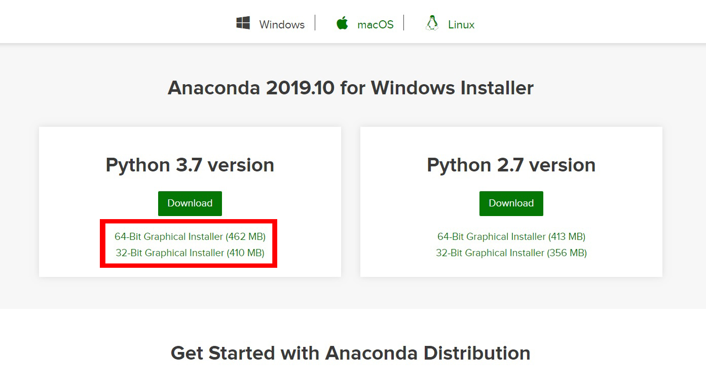
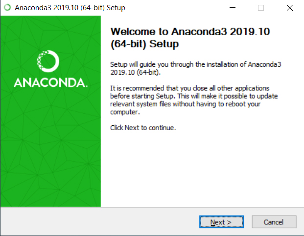
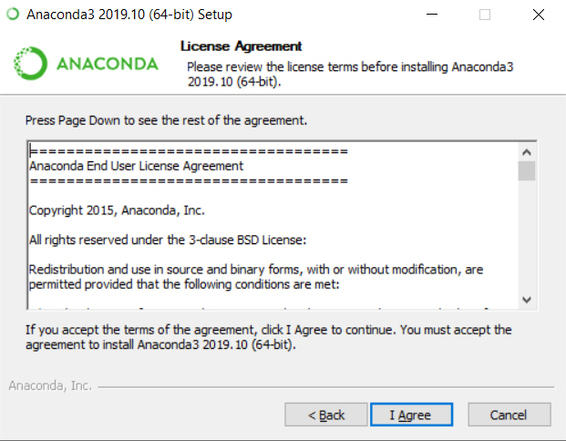
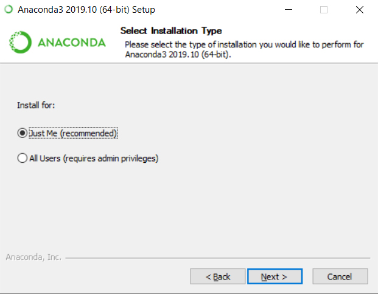
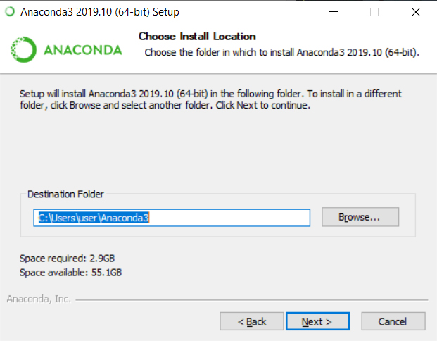
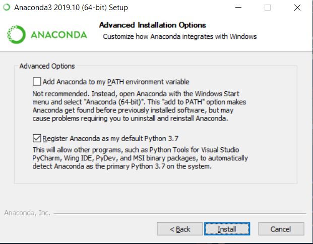
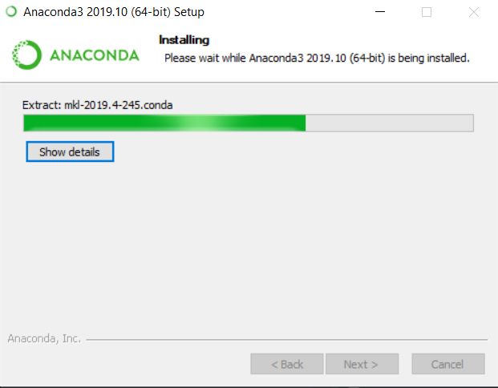
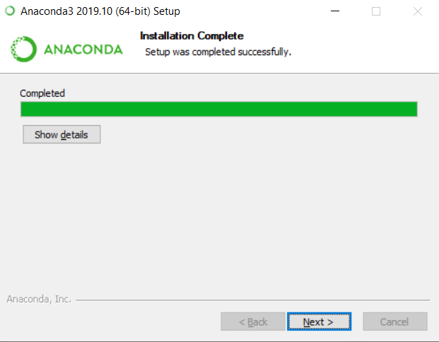
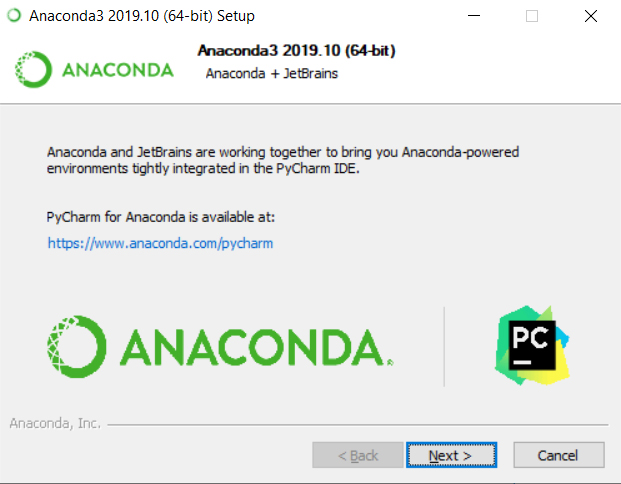
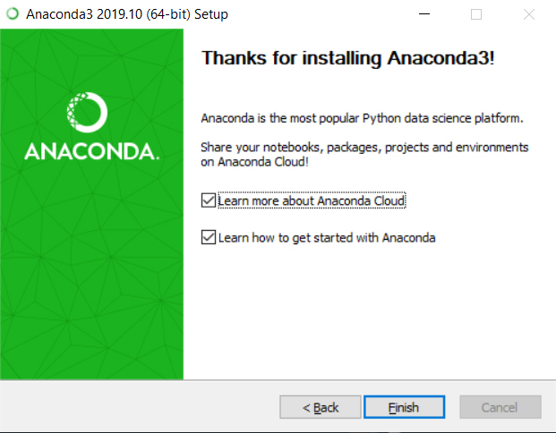

Instalación de Python - Anaconda
--------------------------------

Para la descarga de la última versión de Python - Anaconda en Windows,
haga click en el siguiente enlace [(Descargar
Python-Anaconda)](https://www.anaconda.com/distribution/#windows){:target="\_blank"}.
Una vez realizado click en el enlace, se abrirá la siguiente venta

 Haga click en el recuadro rojo que
aparece en la imagen anterior, dependiendo si su sistema operativo es de
64-bits o 32-bits, e iniciará la descarga de un archivo con nombre
Anaconda3-XXXX.XX-Windows-x86\_64.exe en el caso de 64 bits o
Anaconda3-XXXX.XX-Windows-x86.exe en el caso de 32 bits, donde
**XXXX.XX** hace referencia al año y al mes de la última actualización,
por ejemplo, *Anaconda3-2019.10-Linux-x86\_64.sh*.

Para consultar la versión del sistema operativo, puede presionar las
teclas <tt>Windows + Pausa</tt>, obteniendo la siguiente imagen.

En este caso, el sistema operativo es de 64bits, y por tanto se
selecciona la opción “64-Bit Graphical Installer”, en el momento de
seleccionar la versión a descargar.

Una vez completada la descarga, haga doble click sobre el instalador
para que éste inicie y muestre la siguiente ventana

En la ventana de bienvenida, haga click en **Next &gt;** para que el
instalador continúe

En la ventana de licencia del programa, puede leer la información allí
presentada si es de su interés, y de click en el botón **I Agree**

En la ventana de de selección del tipo de instalación, presione “Just
Me” o “All Users” y luego presione el botón **Next &gt;**. La selección
de “Just Me” o “All Users” dependerá si en el equipo se tienen más de
una sesión y se desea instalar solo en la sesión propia o en todas las
existentes.

En la ventana de selección de carpeta de destino, puede presionar el
botón **Borwse…** y seleccionar otra ubicación para la instalación del
programa (Se recomienda hacer la instalación en un directorio que no
posea espacios o caracteres unicode). Seguidamente, presione el botón
**Next &gt;**

En la ventana de opciones avanzadas, se deja seleccionada las opciones
predeterminadas y haga click en el botón **Install**. (Se recomienda no
seleccionar “Add Anaconda to my PATH enviroment variable” debido a que
esto puede generar interferencias con otros software)

Esto hará que aparezca la ventana de instalación, espere un par de
minutos mientras el proceso finaliza.

Una vez se completa la instalación, pueden observar los detalles de la
instalación presionando el botón **Show details** o simplemente
presionar el botón **Next &gt;**

Como instalación opcional aparecerá una ventana sugiriendo la IDE
PyCharm, la cual se podrá descargar desde el link
[www.anaconda.com/pycharm](www.anaconda.com/pycharm){:target="\_blank"},
presione en el link si desea descargarla, o en otro lugar, presione
simplemente el botón **Next &gt;**

Finalmente aparecerá la ventana de agradecimiento, presione el botón
**Finish**, y con ésto concluirá la instalación del programa.

Instalación de IDE’s
--------------------

Existen diferentes IDE’s para trabajar en Python. La selección de una u
otra depende de los gustos o preferencias que tengan los usuarios ya que
algunas pueden ofrecer más ventajas respecto a otras, ya que en algunas,
se desarrollan algunos complementos que permiten vincular el código de
Python con otros entornos, tales como SQL, HTML, JavaScript, Django,
entre otros. Ya es labor de cada usuario explorar cuál de éstas es la
que se adapta mejor a sus necesidades.

A continuación se listan algunas de las IDE para trabajar en Python

### Spyder

Spyder es una de las IDE más usadas por usuarios de R, debido a la
similaridad que posee ésta con R Studio visualmente, la facilidad para
encontrar ayuda para paquetes o funciones, posee inspector de objetivos,
explorador de archivos y Explorador de variables.

Esta IDE viene instalada por defecto cuando se realiza la instalación de
Anaconda, así que no es necesario realizar instalaciones adicionales
para conseguirla.

### PyCharm

Pycharm es una IDE de Python para desarrolladores profesionales o para
aquellos que deseen aprender a codificar en Python. Existen dos
versiones para esta IDE, una versión profesional de pago o una versión
gratuita, Aunque no todas las características de la versión profesional
están incluidas en la versión gratuita.

Para descargar la IDE PyCharm, pueden dirigirse al siguiente link de
descarga
[www.anaconda.com/pycharm](www.anaconda.com/pycharm){:target="\_blank"}

### Komodo

Komodo IDE es un IDE multilingüe desarrollado por Active State, que
ofrece soporte para Python, PHP, Perl, Go, Ruby, desarrollo web (HTML,
CSS, JavaScript) y más. Active State también desarrolla Komodo Edit y
ActiveTcl, entre otras ofertas.

El producto viene equipado con inteligencia de código para facilitar el
autocompletado y la refactorización. También proporciona herramientas
para depurar y probar. La plataforma admite múltiples formatos de
control de versiones, incluidos Git, Mercurial y Subversión, entre
otros.

Para descargar la IDE Komodo, pueden dirigirse al siguiente link de
descarga
<https://www.activestate.com/products/komodo-ide/download-ide/>{:target="\_blank"}

### Atom

Atom es una IDE que incluye la mayoría de las funcionalidades que poseen
las otras IDE básicas, pero a diferencia de las mismas, posee entre sus
características el resaltado de sintaxis y la finalización automática.
Los desarrolladores de Atom están trabajando en la integración este
programa con otros lenguajes de programación tales como Rust o Go.

Atom está en mejora de su rendimiento y sus desarrolladores están
extremadamente atentos a las necesidades y opiniones de la comunidad, lo
cual hace que la experiencia del usuario sea más gratificante.

Para descargar la IDE Atom, pueden dirigirse al siguiente link de
descarga <https://atom.io>{:target="\_blank"}
