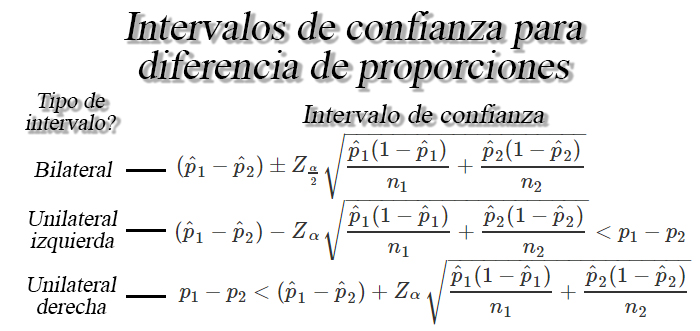

## Intervalos de confianza

Un intervalo de confianza **es un rango de valores**, construidos a
partir de los estadísticos muestrales, **que tienen por objetivo,
incluir** con un nivel de confianza preestablecido, **el valor real de
un parámetro desconocido de una población**.

**Nota**<br>
<ol type="a">
<li>
Usualmente se usan valores de de \(0.1, 0.05\) y $ 0.01$, es decir,
niveles de confianza de \(0.9, 0.95\) y \(0.99\).
</li>
<li>
La longitud o amplitud del intervalo construido, medirá la
<strong>precisión</strong> de la estimación realizada, por tanto,
intervalos largos proporcionan estimaciones más imprecisas, mientras que
intervalos cortos proporcionan estimaciones más precisas.
</li>
<li>
A medida que aumenta el nivel de confianza, la amplitud del intervalo se
hace más grande.
</li>
<li>
A medida que aumenta el tamaño de muestra, la amplitud del intervalo se
hace más pequeño.
</li>
</ol>
<!-- Para facilitar el cálculo de cualquier intervalo, se crean funciones que puede ser descargada mediante la siguiente linea de código -->
<!-- ```{r} -->
<!-- ## Código descargar funciones para intervalos -->
<!-- fun.int <- tempfile(fileext = ".R")  # Crea archivo temporal -->
<!-- URL <- "https://raw.githubusercontent.com/jiperezga/jiperezga.github.io/master/Dataset/Codigos%20R/Intervalos.R"  # URL base de datos -->
<!-- download.file(URL, destfile = fun.int, mode = "wb")  # Descarga archivo en el archivo temporal creado -->
<!-- source(fun.int) # Carga funciones guardadas -->
<!-- ``` -->

### Intervalos de confianza para una media `$\mu$`

Sea `$X_1, X_2, \ldots, X_n$` una muestra aleatoria *iid* de tamaño
`$n$` con media `$\mu$` desconocida, y varianza `$\sigma^2<\infty$`,
entonces dependiendo de las condiciones, se tendrán los siguientes
intervalos de confianza para la media `$\mu$`.


<button id="Show9" class="btn btn-secondary">
Mostrar Ejemplo
</button>
<button id="Hide9" class="btn btn-info">
Ocultar Ejemplo
</button>
<main id="botoncito9">
<h3 data-toc-skip>
Intervalo de confianza para una media
</h3>
<p>
Suponga que se desea crear un intervalo de confianza del \(90\%\) para
el número promedio de pisos de la construcción
(<tt>nro\(\_\)pisos</tt>). En este caso, podemos calcular un intervalo
de confianza para una media en <tt>R</tt> mediante la función
<tt>t.test</tt> de la forma.
</p>
<section class="language-r highlighter-rouge">
<section class="highlight">
<pre class="highlight"><code><span class="c1"># Calcula intervalo de confianza para una media R</span><span class="w">
</span><span class="nf">t.test</span><span class="p">(</span><span class="n">x</span><span class="w"> </span><span class="o">=</span><span class="w"> </span><span class="n">datos</span><span class="o">$</span><span class="n">nro_pisos</span><span class="p">,</span><span class="w"> </span><span class="n">conf.level</span><span class="w"> </span><span class="o">=</span><span class="w"> </span><span class="m">0.9</span><span class="p">)</span><span class="w">
</span></code></pre>
</section>
</section>
<section class="highlighter-rouge">
<section class="highlight">
<pre class="highlight"><code>    One Sample t-test

data:  datos$nro_pisos
t = 267.18, df = 86146, p-value &lt; 2.2e-16
alternative hypothesis: true mean is not equal to 0
90 percent confidence interval:
 3.303944 3.344877
sample estimates:
mean of x 
 3.324411 
</code></pre>
</section>
</section>
</main>
<!-- Suponga que se desea crear un intervalo de confianza del `$90\%$` para el número promedio de pisos de la construcción (<tt>nro_pisos</tt>). En este caso, una vez descargadas las funciones para intervalos, podemos calcular un intervalo de confianza para una media en <tt>R</tt> mediante la función <tt>IntUnaMedia</tt> de la forma -->
<!-- ```{r eval=F} -->
<!-- # Calcula intervalo de confianza para una media creada -->
<!-- IntUnaMedia(datos = datos$nro_pisos, nivel.conf = 0.90) -->
<!-- ``` -->
<!-- Similarmente, puede emplearse la función <tt>t.test()</tt> de <tt>R</tt>, que permite probar la situación en donde la varianza poblacional no es conocida, y la distribución es normal. -->
<!-- ```{r} -->
<!-- # Calcula intervalo de confianza para una media R -->
<!-- t.test(x = datos$nro_pisos, conf.level = 0.90) -->
<!-- ``` -->

### Intervalos de confianza para diferencia de medias `$\mu_1 - \mu_2$`

Sea `$X_{1,1}, X_{1,2}, \ldots, X_{1,n_1}$` y
`$X_{2,1}, X_{2,2}, \ldots, X_{2,n_1}$` dos muestras aleatorias *iid* de
tamaños `$n_1$`, y `$n_2$` con medias `$\mu_1$` y `$\mu_2$`
desconocidas, y varianzas `$\sigma_1^2<\infty$` y `$\sigma^2_2<\infty$`,
respectivamente, entonces dependiendo de las condiciones, se tendrán los
siguientes intervalos de confianza para la diferencia de medias
`$\mu_1 - \mu_2$`.


<button id="Show10" class="btn btn-secondary">
Mostrar Ejemplo
</button>
<button id="Hide10" class="btn btn-info">
Ocultar Ejemplo
</button>
<main id="botoncito10">
<h3 data-toc-skip>
Intervalo de confianza para diferencia de medias
</h3>
<p>
Suponga que se desea crear un intervalo de confianza del \(95\%\) para
la diferencia promedio entre el precio de venta por \(m^2\)
(<tt>preciovtax</tt>), en los estratos \(2\) y \(4\) (<tt>estrato</tt>).
En este caso, podemos calcular un intervalo de confianza para la
diferencia de media en <tt>R</tt> mediante la función <tt>t.test</tt> de
la forma.
</p>
<section class="language-r highlighter-rouge">
<section class="highlight">
<pre class="highlight"><code><span class="c1"># Calcula intervalo de confianza para diferencia de medias R</span><span class="w">
</span><span class="nf">t.test</span><span class="p">(</span><span class="n">x</span><span class="w"> </span><span class="o">=</span><span class="w"> </span><span class="n">datos</span><span class="o">$</span><span class="n">preciovtax</span><span class="p">[</span><span class="n">datos</span><span class="o">$</span><span class="n">estrato</span><span class="w"> </span><span class="o">==</span><span class="w"> </span><span class="m">2</span><span class="p">],</span><span class="w"> </span><span class="n">y</span><span class="w"> </span><span class="o">=</span><span class="w"> </span><span class="n">datos</span><span class="o">$</span><span class="n">preciovtax</span><span class="p">[</span><span class="n">datos</span><span class="o">$</span><span class="n">estrato</span><span class="w"> </span><span class="o">==</span><span class="w"> 
    </span><span class="m">4</span><span class="p">],</span><span class="w"> </span><span class="n">conf.level</span><span class="w"> </span><span class="o">=</span><span class="w"> </span><span class="m">0.95</span><span class="p">,</span><span class="w"> </span><span class="n">var.equal</span><span class="w"> </span><span class="o">=</span><span class="w"> </span><span class="nb">F</span><span class="p">)</span><span class="w">
</span></code></pre>
</section>
</section>
<section class="highlighter-rouge">
<section class="highlight">
<pre class="highlight"><code>    Welch Two Sample t-test

data:  datos$preciovtax[datos$estrato == 2] and datos$preciovtax[datos$estrato == 4]
t = -131.04, df = 14252, p-value &lt; 2.2e-16
alternative hypothesis: true difference in means is not equal to 0
95 percent confidence interval:
 -1254.805 -1217.818
sample estimates:
mean of x mean of y 
 938.2444 2174.5557 
</code></pre>
</section>
</section>
</main>
<!-- Suponga que se desea crear un intervalo de confianza del `$95\%$` para la diferencia promedio entre el precio de venta por `$m^2$` (<tt>preciovtax</tt>), en los estratos `$2$` y `$4$` (<tt>estrato</tt>). En este caso, una vez descargadas las funciones para intervalos, podemos calcular un intervalo de confianza para la diferencia de media en <tt>R</tt> mediante la función <tt>IntDosMedias</tt> de la forma -->
<!-- ```{r eval=F} -->
<!-- # Calcula intervalo de confianza para diferencia de medias creada -->
<!-- IntDosMedias(datos1 = datos$preciovtax[datos$estrato == 2], datos2 = datos$preciovtax[datos$estrato == 4], nivel.conf = 0.95) -->
<!-- ``` -->
<!-- Similarmente, puede emplearse la función <tt>t.test()</tt> de <tt>R</tt>, que permite probar la situación en donde las varianzas poblacionales no son conocidas, y las distribuciones son normal y se puede establecer si las varianzas poblacionales son o no iguales. -->
<!-- ```{r} -->
<!-- # Calcula intervalo de confianza para diferencia de medias R -->
<!-- t.test(x = datos$preciovtax[datos$estrato == 2], y = datos$preciovtax[datos$estrato == 4], conf.level = 0.95, var.equal = F) -->
<!-- ``` -->

### Intervalos de confianza para una proporción `$p$`

Sea `$X_1,X_2, \ldots, X_n$` una muestra aleatoria *iid* de tamaño
`$n$`, tal que `$X\sim b(n,p)$` entonces si `$n$` es suficientemente
grande tal que `$n\geq30$`, y la proporción desconocida `$p$` no se
encuentre cercana a `$0$` o `$1$`, tal que `$np>5$` y `$n(1-p)>5$`,
entonces un intervalo de confianza para la proporción `$p$` es de la
forma 

<button id="Show11" class="btn btn-secondary">
Mostrar Ejemplo
</button>
<button id="Hide11" class="btn btn-info">
Ocultar Ejemplo
</button>
<main id="botoncito11">
<h3 data-toc-skip>
Intervalo de confianza para una proporción
</h3>
<p>
Suponga que se desea crear un intervalo de confianza del \(90\%\) para
la proporción de empresas que poseen licencia de construcción
(<tt>ob\(\_\)formal</tt>). En este caso, podemos calcular un intervalo
de confianza para una proporción en <tt>R</tt> mediante la función
<tt>prop.test</tt> de la forma.
</p>
<section class="language-r highlighter-rouge">
<section class="highlight">
<pre class="highlight"><code><span class="c1"># Calcula intervalo de confianza para una proporción R</span><span class="w">
</span><span class="n">exitos</span><span class="w"> </span><span class="o">&lt;-</span><span class="w"> </span><span class="nf">table</span><span class="p">(</span><span class="n">datos</span><span class="o">$</span><span class="n">ob_formal</span><span class="p">)[</span><span class="m">1</span><span class="p">]</span><span class="w">
</span><span class="n">total</span><span class="w"> </span><span class="o">&lt;-</span><span class="w"> </span><span class="nf">sum</span><span class="p">(</span><span class="nf">table</span><span class="p">(</span><span class="n">datos</span><span class="o">$</span><span class="n">ob_formal</span><span class="p">))</span><span class="w">
</span><span class="nf">prop.test</span><span class="p">(</span><span class="n">x</span><span class="w"> </span><span class="o">=</span><span class="w"> </span><span class="n">exitos</span><span class="p">,</span><span class="w"> </span><span class="n">n</span><span class="w"> </span><span class="o">=</span><span class="w"> </span><span class="n">total</span><span class="p">,</span><span class="w"> </span><span class="n">conf.level</span><span class="w"> </span><span class="o">=</span><span class="w"> </span><span class="m">0.9</span><span class="p">)</span><span class="w">
</span></code></pre>
</section>
</section>
<section class="highlighter-rouge">
<section class="highlight">
<pre class="highlight"><code>    1-sample proportions test with continuity correction

data:  exitos out of total, null probability 0.5
X-squared = 9080.5, df = 1, p-value &lt; 2.2e-16
alternative hypothesis: true p is not equal to 0.5
90 percent confidence interval:
 0.3350122 0.3403242
sample estimates:
        p 
0.3376631 
</code></pre>
</section>
</section>
</main>
<!-- Suponga que se desea crear un intervalo de confianza del `$90\%$` para la proporción de empresas que poseen licencia de construcción (<tt>ob_formal</tt>). En este caso, una vez descargadas las funciones para intervalos, podemos calcular un intervalo de confianza para una proporción en <tt>R</tt> mediante la función <tt>IntDosMedias</tt> de la forma -->
<!-- ```{r eval=F} -->
<!-- # Calcula intervalo de confianza para una proporción creada -->
<!-- IntUnaProp(datos = datos$ob_formal, factor = "Sí", nivel.conf = 0.90) -->
<!-- ``` -->
<!-- Similarmente, puede emplearse la función <tt>prop.test()</tt> de <tt>R</tt>, de la forma -->
<!-- ```{r} -->
<!-- # Calcula intervalo de confianza para una proporción R -->
<!-- exitos <- table(datos$ob_formal)[1] -->
<!-- total <- sum(table(datos$ob_formal)) -->
<!-- prop.test(x = exitos, n = total, conf.level = 0.90) -->
<!-- ``` -->

### Intervalos de confianza para diferencia de proporciones `$p_1 - p_2$`

Sea `$X_{1,1}, X_{1,2}, \ldots, X_{1,n_1}$` y
`$X_{2,1}, X_{2,2}, \ldots, X_{2,n_1}$` dos muestras aleatorias *iid* de
tamaños `$n_1$`, y `$n_2$` tal que `$X_1\sim b(n,p)$` y
`$X_2\sim b(n,p)$`. Entonces si, `$n_1$`, y `$n_2$` son suficientemente
grandes tal que `$n_1, n_2 \geq 30$`, y las proporciones desconocidas
`$p_1$` y `$p_2$` no se encuentran cercanas a `$0$` o `$1$`, tal que
`$n_1p_1, n_2p_2, n_1(1-p_1)$` y `$n_2(1-p_2)>5$`, entonces un intervalo
de confianza para la diferencia de proporciones `$p_1 - p_2$` es de la
forma



<button id="Show12" class="btn btn-secondary">
Mostrar Ejemplo
</button>
<button id="Hide12" class="btn btn-info">
Ocultar Ejemplo
</button>
<main id="botoncito12">
<h3 data-toc-skip>
Intervalo de confianza para diferencia de proporciones
</h3>
<p>
Suponga que se desea crear un intervalo de confianza del \(90\%\) para
la diferencia entre la proporción de empresas que poseen licencia de
construcción (<tt>ob\(\_\)formal</tt>), respecto a las regiones de
Bogotá y Antioquia (<tt>region</tt>). En este caso, podemos calcular un
intervalo de confianza para la diferencia entre proporción en <tt>R</tt>
mediante la función <tt>prop.test()</tt> de la forma.
</p>
<section class="language-r highlighter-rouge">
<section class="highlight">
<pre class="highlight"><code><span class="c1"># Calcula intervalo de confianza para diferencia de proporciones R</span><span class="w">
</span><span class="n">exitos1</span><span class="w"> </span><span class="o">&lt;-</span><span class="w"> </span><span class="nf">table</span><span class="p">(</span><span class="n">datos</span><span class="o">$</span><span class="n">ob_formal</span><span class="p">[</span><span class="n">datos</span><span class="o">$</span><span class="n">region</span><span class="w"> </span><span class="o">==</span><span class="w"> </span><span class="s2">"Bogotá"</span><span class="p">])[</span><span class="m">1</span><span class="p">]</span><span class="w">
</span><span class="n">total1</span><span class="w"> </span><span class="o">&lt;-</span><span class="w"> </span><span class="nf">sum</span><span class="p">(</span><span class="nf">table</span><span class="p">(</span><span class="n">datos</span><span class="o">$</span><span class="n">ob_formal</span><span class="p">[</span><span class="n">datos</span><span class="o">$</span><span class="n">region</span><span class="w"> </span><span class="o">==</span><span class="w"> </span><span class="s2">"Bogotá"</span><span class="p">]))</span><span class="w">
</span><span class="n">exitos2</span><span class="w"> </span><span class="o">&lt;-</span><span class="w"> </span><span class="nf">table</span><span class="p">(</span><span class="n">datos</span><span class="o">$</span><span class="n">ob_formal</span><span class="p">[</span><span class="n">datos</span><span class="o">$</span><span class="n">region</span><span class="w"> </span><span class="o">==</span><span class="w"> </span><span class="s2">"Antioquia"</span><span class="p">])[</span><span class="m">1</span><span class="p">]</span><span class="w">
</span><span class="n">total2</span><span class="w"> </span><span class="o">&lt;-</span><span class="w"> </span><span class="nf">sum</span><span class="p">(</span><span class="nf">table</span><span class="p">(</span><span class="n">datos</span><span class="o">$</span><span class="n">ob_formal</span><span class="p">[</span><span class="n">datos</span><span class="o">$</span><span class="n">region</span><span class="w"> </span><span class="o">==</span><span class="w"> </span><span class="s2">"Antioquia"</span><span class="p">]))</span><span class="w">
</span><span class="nf">prop.test</span><span class="p">(</span><span class="n">x</span><span class="w"> </span><span class="o">=</span><span class="w"> </span><span class="nf">c</span><span class="p">(</span><span class="n">exitos1</span><span class="p">,</span><span class="w"> </span><span class="n">exitos2</span><span class="p">),</span><span class="w"> </span><span class="n">n</span><span class="w"> </span><span class="o">=</span><span class="w"> </span><span class="nf">c</span><span class="p">(</span><span class="n">total1</span><span class="p">,</span><span class="w"> </span><span class="n">total2</span><span class="p">),</span><span class="w"> </span><span class="n">conf.level</span><span class="w"> </span><span class="o">=</span><span class="w"> </span><span class="m">0.9</span><span class="p">)</span><span class="w">
</span></code></pre>
</section>
</section>
<section class="highlighter-rouge">
<section class="highlight">
<pre class="highlight"><code>    2-sample test for equality of proportions with continuity correction

data:  c(exitos1, exitos2) out of c(total1, total2)
X-squared = 52.232, df = 1, p-value = 0.0000000000004933
alternative hypothesis: two.sided
90 percent confidence interval:
 -0.05258971 -0.03289650
sample estimates:
   prop 1    prop 2 
0.4006542 0.4433973 
</code></pre>
</section>
</section>
</main>
<!-- Suponga que se desea crear un intervalo de confianza del `$90\%$` para la diferencia entre la proporción de empresas que poseen licencia de construcción (<tt>ob_formal</tt>), respecto a las regiones de Bogotá y Antioquia (<tt>region</tt>). En este caso, una vez descargadas las funciones para intervalos, podemos calcular un intervalo de confianza para la diferencia entre proporción en <tt>R</tt> mediante la función <tt>IntDosProp</tt> de la forma -->
<!-- ```{r eval=F} -->
<!-- # Calcula intervalo de confianza para diferencia de proporciones creada -->
<!-- IntDosProp(datos1 = datos$ob_formal[datos$region == "Bogotá"], datos2 = datos$ob_formal[datos$region == "Antioquia"], factor1 = "Sí", factor2 = NULL, nivel.conf = 0.90) -->
<!-- ``` -->
<!-- Similarmente, puede emplearse la función <tt>prop.test()</tt> de <tt>R</tt>, de la forma -->
<!-- ```{r} -->
<!-- # Calcula intervalo de confianza para diferencia de proporciones R -->
<!-- exitos1 <- table(datos$ob_formal[datos$region == "Bogotá"])[1] -->
<!-- total1 <- sum(table(datos$ob_formal[datos$region == "Bogotá"])) -->
<!-- exitos2 <- table(datos$ob_formal[datos$region == "Antioquia"])[1] -->
<!-- total2 <- sum(table(datos$ob_formal[datos$region == "Antioquia"])) -->
<!-- prop.test(x = c(exitos1, exitos2), n = c(total1, total2), conf.level = 0.90) -->
<!-- ``` -->

### Intervalos de confianza para una varianza `$\sigma^2$`

Sea `$X_{1}, X_{2}, \ldots, X_{n}$` una muestra aleatoria normal de
tamaño `$n$` con media `$\mathbb{E}(X)=\mu$` y varianza desconocida
`$Var(X)=\sigma^2<\infty$`, respectivamente, entonces un intervalo de
confianza del `$100(1-\alpha)\%$` para una varianza `$\sigma^2$` estará
dado por


<button id="Show13" class="btn btn-secondary">
Mostrar Ejemplo
</button>
<button id="Hide13" class="btn btn-info">
Ocultar Ejemplo
</button>
<main id="botoncito13">
<h3 data-toc-skip>
Intervalo de confianza para una varianza
</h3>
<p>
Suponga que se tiene interés en encontrar un intervalo de confianza del
\(95\%\), para la varianza del precio unitario de ventas por metro
cuadrado (<tt>preciovtax</tt>). En este caso, podemos calcular el
intervalo de confianza de interés mediante la función <tt>varTest</tt>
de la librería <tt>EnvStats</tt>, mediante la estructura.
</p>
<section class="language-r highlighter-rouge">
<section class="highlight">
<pre class="highlight"><code><span class="nf">library</span><span class="p">(</span><span class="n">EnvStats</span><span class="p">)</span><span class="w">
</span><span class="c1"># Calcula intervalo de confianza para una de varianza</span><span class="w">
</span><span class="nf">varTest</span><span class="p">(</span><span class="n">datos</span><span class="o">$</span><span class="n">preciovtax</span><span class="p">,</span><span class="w"> </span><span class="n">alternative</span><span class="w"> </span><span class="o">=</span><span class="w"> </span><span class="s2">"two.sided"</span><span class="p">,</span><span class="w"> </span><span class="n">conf.level</span><span class="w"> </span><span class="o">=</span><span class="w"> </span><span class="m">0.95</span><span class="p">)</span><span class="w">
</span></code></pre>
</section>
</section>
<section class="highlighter-rouge">
<section class="highlight">
<pre class="highlight"><code>    Chi-Squared Test on Variance

data:  datos$preciovtax
Chi-Squared = 106655714921, df = 86147, p-value &lt; 2.2e-16
alternative hypothesis: true variance is not equal to 1
95 percent confidence interval:
 1226457 1249842
sample estimates:
variance 
 1238067 
</code></pre>
</section>
</section>
</main>

### Intervalos de confianza para razón de varianzas `$\sigma^2_1/\sigma^2_2$`

Sea `$X_{1,1}, X_{1,2}, \ldots, X_{1,n_1}$` y
`$X_{2,1}, X_{2,2}, \ldots, X_{2,n_1}$` dos muestras aleatorias normales
de tamaños `$n_1$`, y `$n_2$` con medias `$\mu_1$` y `$\mu_2$`, y
varianzas desconocidas `$\sigma_1^2<\infty$` y `$\sigma^2_2<\infty$`,
respectivamente, entonces un intervalo de confianza del
`$100(1-\alpha)\%$` para `$\sigma^2_1/\sigma^2_2$` estará dada por


<button id="Show14" class="btn btn-secondary">
Mostrar Ejemplo
</button>
<button id="Hide14" class="btn btn-info">
Ocultar Ejemplo
</button>
<main id="botoncito14">
<h3 data-toc-skip>
Intervalo de confianza para cociente de varianzas
</h3>
<p>
Suponga que se desea crear un intervalo de confianza del \(95\%\) para
el cociente de varianzas entre el precio de venta por \(m^2\)
(<tt>preciovtax</tt>), en los estratos \(1\) y \(5\) (<tt>estrato</tt>).
En este caso, podemos calcular un intervalo de confianza para el
cociente de varianzas en <tt>R</tt> mediante la función
<tt>var.test()</tt> de la forma.
</p>
<section class="language-r highlighter-rouge">
<section class="highlight">
<pre class="highlight"><code><span class="c1"># Calcula intervalo de confianza para cociente de varianzas R</span><span class="w">
</span><span class="nf">var.test</span><span class="p">(</span><span class="n">x</span><span class="w"> </span><span class="o">=</span><span class="w"> </span><span class="n">datos</span><span class="o">$</span><span class="n">preciovtax</span><span class="p">[</span><span class="n">datos</span><span class="o">$</span><span class="n">estrato</span><span class="w"> </span><span class="o">==</span><span class="w"> </span><span class="m">1</span><span class="p">],</span><span class="w"> </span><span class="n">y</span><span class="w"> </span><span class="o">=</span><span class="w"> </span><span class="n">datos</span><span class="o">$</span><span class="n">preciovtax</span><span class="p">[</span><span class="n">datos</span><span class="o">$</span><span class="n">estrato</span><span class="w"> </span><span class="o">==</span><span class="w"> 
    </span><span class="m">5</span><span class="p">],</span><span class="w"> </span><span class="n">conf.level</span><span class="w"> </span><span class="o">=</span><span class="w"> </span><span class="m">0.95</span><span class="p">)</span><span class="w">
</span></code></pre>
</section>
</section>
<section class="highlighter-rouge">
<section class="highlight">
<pre class="highlight"><code>    F test to compare two variances

data:  datos$preciovtax[datos$estrato == 1] and datos$preciovtax[datos$estrato == 5]
F = 0.034198, num df = 11170, denom df = 5010, p-value &lt; 2.2e-16
alternative hypothesis: true ratio of variances is not equal to 1
95 percent confidence interval:
 0.03261627 0.03584061
sample estimates:
ratio of variances 
        0.03419778 
</code></pre>
</section>
</section>
</main>
<!-- Suponga que se desea crear un intervalo de confianza del `$95\%$` para el cociente de varianzas entre el precio de venta por `$m^2$` (<tt>preciovtax</tt>), en los estratos `$1$` y `$5$` (<tt>estrato</tt>). En este caso, una vez descargadas las funciones para intervalos, podemos calcular un intervalo de confianza para la diferencia de media en <tt>R</tt> mediante la función <tt>IntCosVar</tt> de la forma -->
<!-- ```{r eval=F} -->
<!-- # Calcula intervalo de confianza para cociente de varianzas creada -->
<!-- IntCosVar(datos1 = datos$preciovtax[datos$estrato == 1], datos2 = datos$preciovtax[datos$estrato == 5], nivel.conf = 0.95) -->
<!-- ``` -->
<!-- Similarmente, puede emplearse la función <tt>var.test()</tt> de <tt>R</tt>, de la forma -->
<!-- ```{r} -->
<!-- # Calcula intervalo de confianza para cociente de varianzas R -->
<!-- var.test(x = datos$preciovtax[datos$estrato == 1], y = datos$preciovtax[datos$estrato == 5], conf.level = 0.95) -->
<!-- ``` -->

## Referencias
