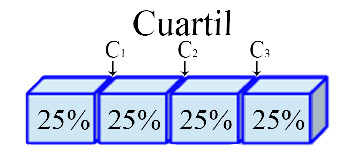
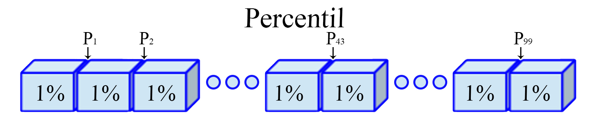
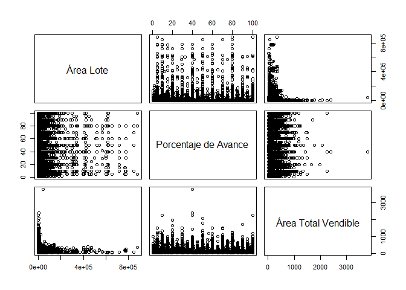
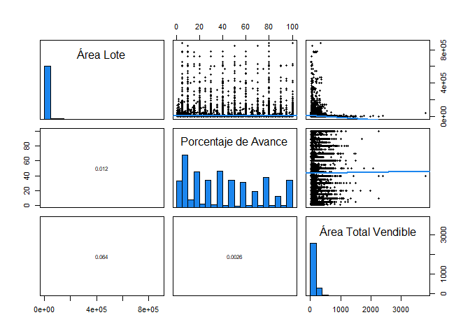
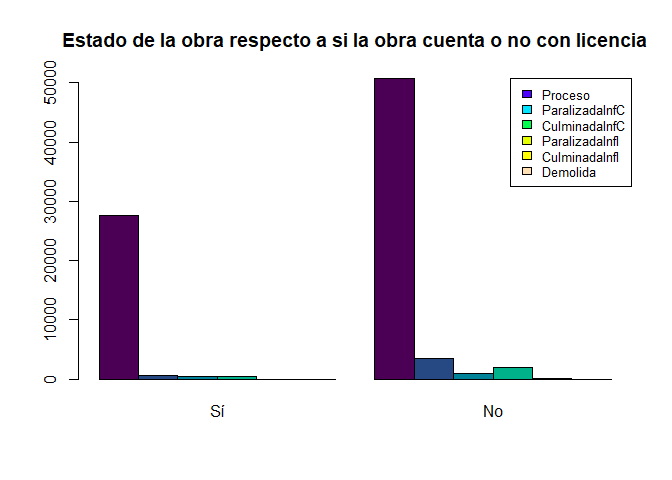
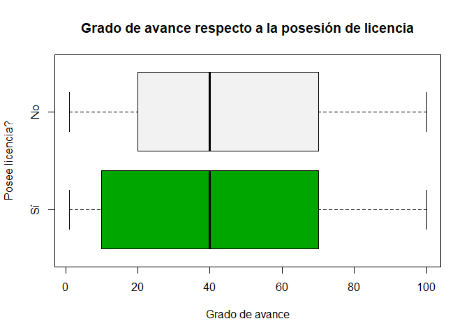
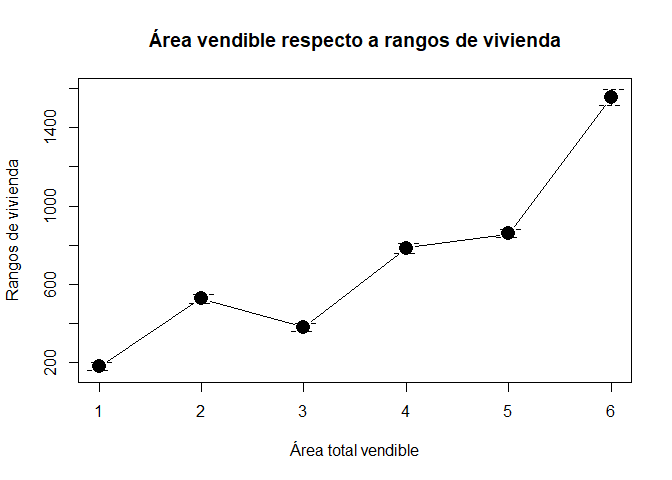

## Medidas estadísticas

Las medidas estadísticas tienen por objetivo resumir la información
contenida en un conjunto de datos, en pocos valores numéricos que
representan diferentes características. **Estas medidas estadísticas nos
darán información sobre la situación, dispersión, forma, asociación que
posee un conjunto de datos** de manera que sea posible captar
rápidamente la estructura de los mismos.

### Medidas de tendencia central

Estas medidas tienen por objetivo buscar valores que muestren el lugar
en el cual se encuentra el centro de un conjunto de observaciones. Si se
define `$x_1, x_2, \ldots, x_n$` como un conjunto de `$n$`
observaciones, entonces

#### Media

Es el promedio numérico de las `$n$` observaciones.
`\begin{align*}   \bar{X}=\sum_{i=1}^n\frac{x_i}{n}=\frac{x_1+x_2+\ldots+x_n}{n} \end{align*}`

En <tt>R</tt>, puede calcularse el valor promedio de un conjunto de
observaciones mediante la función `mean(datos)`.

<button id="Show1" class="btn btn-secondary">
Mostrar Ejercicio
</button>
<button id="Hide1" class="btn btn-info">
Ocultar Ejercicio
</button>
<main id="botoncito1">
<h3 data-toc-skip>
Ejercicio Caso de Estudio
</h3>
<p>
Calcule el precio promedio de venta en metros cuadrados
<tt>preciovtax</tt>.
</p>
<h3 data-toc-skip>
Solución en <tt>R</tt>
</h3>
<p>
Para realizar el cálculo en <tt>R</tt> del precio promedio de venta en
metros cuadrados, se emplea la función <code>mean()</code> tal que
</p>
<section class="language-r highlighter-rouge">
<section class="highlight">
<pre class="highlight"><code><span class="nf">mean</span><span class="p">(</span><span class="n">datos</span><span class="o">$</span><span class="n">preciovtax</span><span class="p">)</span><span class="w">
</span></code></pre>
</section>
</section>
<section class="highlighter-rouge">
<section class="highlight">
<pre class="highlight"><code>[1] 1524.358
</code></pre>
</section>
</section>
<p>
Lo cual significa que en promedio el precio de venta en metros
cuadrados, sin incluir el garaje, en miles de pesos es de \(1524.358\).
</p>
</main>

#### Mediana

Es el valor que ocupa el lugar central en un conjunto de datos, es
decir, el valor que divide el conjunto de observaciones en dos partes
que contienen el 50% de las observaciones. Para realizar el cálculo de
la mediana es necesario ordenar inicialmente el conjunto de
observaciones de forma ascendente.
`\begin{align*}   \tilde{X}=\begin{cases}x_{\left[\frac{(n+1)}{2}\right]} & \text{si } n \text{ es impar}\\\frac{1}{2}\left(x_{\left[\frac{n}{2}\right]}+x_{\left[\frac{n}{2}+1\right]}\right) & \text{si } n \text{ es par}\end{cases} \end{align*}`
donde `$x_{\left[j\right]}$` representa la `$j$`-ésima observación
ordenada. En <tt>R</tt> puede calcularse la mediana de un conjunto de
observaciones mediante la función `median(datos)`.

<button id="Show2" class="btn btn-secondary">
Mostrar Ejercicio
</button>
<button id="Hide2" class="btn btn-info">
Ocultar Ejercicio
</button>
<main id="botoncito2">
<h3 data-toc-skip>
Ejercicio Caso de Estudio
</h3>
<p>
Calcule el precio mediano de venta en metros cuadrados
<tt>preciovtax</tt>.
</p>
<h3 data-toc-skip>
Solución en <tt>R</tt>
</h3>
<p>
Para realizar el cálculo en <tt>R</tt> del precio mediano de venta en
metros cuadrados en miles de pesos, sin incluir el garaje del bien, se
emplea la función <code>median()</code> tal que
</p>
<section class="language-r highlighter-rouge">
<section class="highlight">
<pre class="highlight"><code><span class="nf">median</span><span class="p">(</span><span class="n">datos</span><span class="o">$</span><span class="n">preciovtax</span><span class="p">)</span><span class="w">
</span></code></pre>
</section>
</section>
<section class="highlighter-rouge">
<section class="highlight">
<pre class="highlight"><code>[1] 1200
</code></pre>
</section>
</section>
<p>
Lo cual significa que el precio mediano de venta en metros cuadrados, en
miles de pesos sin incluir el garaje es de \(1200\).
</p>
</main>

#### Moda

Es el valor que ocurre con mayor frecuencia en un conjunto de datos, es
decir, es la observación que se repite con mayor frecuencia. Es de
anotar que en un conjunto de observaciones, se puede tener más de una
moda, en cuyo caso se dirá que el conjunto de datos es bimodal, trimodal
o multimodal.

Entre las funciones base del programa <tt>R</tt> no hay ninguna función
que calcule la moda de un conjunto de observaciones, y por tanto, debe
crearse una función que realice el cálculo, de la forma

``` r
# Función para el cálculo de la moda
Moda <- function(x) {
    keys <- na.omit(unique(x))
    keys[which.max(tabulate(match(x, keys)))]
}
```

Una vez creada la función, puede calcularse la moda de un conjunto de
observaciones mediante la función `Moda(datos)`.

<button id="Show3" class="btn btn-secondary">
Mostrar Ejercicio
</button>
<button id="Hide3" class="btn btn-info">
Ocultar Ejercicio
</button>
<main id="botoncito3">
<h3 data-toc-skip>
Ejercicio Caso de Estudio
</h3>
<p>
Calcule el precio modal de venta en metros cuadrados
<tt>preciovtax</tt>.
</p>
<h3 data-toc-skip>
Solución en <tt>R</tt>
</h3>
<p>
Para realizar el cálculo en <tt>R</tt> del precio modal de venta en
metros cuadrados en miles de pesos, sin incluir el garaje del bien, se
emplea la función <code>Moda()</code> que se creó previamente, tal que
</p>
<section class="language-r highlighter-rouge">
<section class="highlight">
<pre class="highlight"><code><span class="c1">### Se crea la función</span><span class="w">
</span><span class="n">Moda</span><span class="w"> </span><span class="o">&lt;-</span><span class="w"> </span><span class="k">function</span><span class="p">(</span><span class="n">x</span><span class="p">)</span><span class="w"> </span><span class="p">{</span><span class="w">
    </span><span class="n">keys</span><span class="w"> </span><span class="o">&lt;-</span><span class="w"> </span><span class="n">na.omit</span><span class="p">(</span><span class="n">unique</span><span class="p">(</span><span class="n">x</span><span class="p">))</span><span class="w">
    </span><span class="n">keys</span><span class="p">[</span><span class="n">which.max</span><span class="p">(</span><span class="n">tabulate</span><span class="p">(</span><span class="n">match</span><span class="p">(</span><span class="n">x</span><span class="p">,</span><span class="w"> </span><span class="n">keys</span><span class="p">)))]</span><span class="w">
</span><span class="p">}</span><span class="w">
</span><span class="c1">### Se realiza el cálculo de la moda</span><span class="w">
</span><span class="nf">Moda</span><span class="p">(</span><span class="n">datos</span><span class="o">$</span><span class="n">preciovtax</span><span class="p">)</span><span class="w">
</span></code></pre>
</section>
</section>
<section class="highlighter-rouge">
<section class="highlight">
<pre class="highlight"><code>[1] 1000
</code></pre>
</section>
</section>
<p>
Lo cual significa que el precio de venta por en metros cuadrados que más
se repite, en miles de pesos sin incluir el garaje es de \(1000\).
</p>
</main>

#### Media recortada

Es una medida similar a la media, con la diferencia de que, en este
caso, se ordenan las observaciones de forma ascendente, y luego se
recortan un número `$r$` observaciones superiores e inferiores, tal que
`$r=n\times trim$`, `$trim$` un valor porcentual entre 0 y 0.5

`\begin{align*}   \bar{X}_{trim}=\frac{1}{n-2r}\sum_{i={r+1}}^{n-r}x_i \end{align*}`

En <tt>R</tt>, puede calcularse el valor de la media recortada de un
conjunto de observaciones mediante la función
`mean(datos, trim = trim)`.

<button id="Show4" class="btn btn-secondary">
Mostrar Ejercicio
</button>
<button id="Hide4" class="btn btn-info">
Ocultar Ejercicio
</button>
<main id="botoncito4">
<h3 data-toc-skip>
Ejercicio Caso de Estudio
</h3>
<p>
Calcule el precio promedio de venta en metros cuadrados
<tt>preciovtax</tt>, recortada al \(10\%\).
</p>
<h3 data-toc-skip>
Solución en <tt>R</tt>
</h3>
<p>
Para realizar el cálculo en <tt>R</tt> del precio promedio de venta en
metros cuadrados recordando los datos al \(10\%\), se emplea la función
<code>mean()</code>, junto con el argumento <code>trim = 0.10</code> tal
que
</p>
<section class="language-r highlighter-rouge">
<section class="highlight">
<pre class="highlight"><code><span class="nf">mean</span><span class="p">(</span><span class="n">datos</span><span class="o">$</span><span class="n">preciovtax</span><span class="p">,</span><span class="w"> </span><span class="n">trim</span><span class="w"> </span><span class="o">=</span><span class="w"> </span><span class="m">0.1</span><span class="p">)</span><span class="w">
</span></code></pre>
</section>
</section>
<section class="highlighter-rouge">
<section class="highlight">
<pre class="highlight"><code>[1] 1336
</code></pre>
</section>
</section>
<p>
Lo cual significa que al eliminar la influencia del \(10\%\) superior e
inferior de los datos, se tiene que en promedio el precio de venta en
metros cuadrados, sin incluir el garaje, en miles de pesos es de
\(1336\).
</p>
</main>

### Medidas de localización

Estas medidas tienen por objetivo dividir un conjunto de datos ordenado
en partes iguales, entendidas estas como intervalos que contienen la
misma proporción de observaciones. Si se define
`$x_{[1]}, x_{[2]}, \ldots, x_{[n]}$`, como un conjunto de `$n$`
observaciones ordenadas en forma creciente, entonces

#### Cuartil

Son los **tres valores** `$(j=1,2,3)$`, que dividen a un conjunto de
datos ordenados en **cuatro partes** iguales. Para ello, es necesario
calcular inicialmente una variable `$h_j$` de posicionamiento dado el
cuartil `$j$` de interés, tal que
`\begin{align*}   h_j = \frac{j(n-1)}{4} + 1 \quad \quad j=1,2,3 \end{align*}`

y posteriormente, con éste valor se realiza el cálculo del cuartil de
interés
`\begin{align*}   C_j=x_{[\lfloor h_j\rfloor} + \left((h_j - \lfloor h_j\rfloor) \times  (x_{[\lfloor h_j\rfloor + 1]} - x_{\lfloor h_j\rfloor}) \right)  \quad \quad j=1,2,3 \end{align*}`

siendo `$\lfloor h_j\rfloor$` el valor piso de `$h_j$`, **es decir, el
entero de `$h$` aproximando siempre hacia abajo**.

<h4 align="center">
Representación Cuartil
</h4>



En <tt>R</tt> puede calcularse los cuartiles de un conjunto de
observaciones mediante la función
`quantile(datos, probs = c(0.25, 0.5, 0.75))`.

<button id="Show5" class="btn btn-secondary">
Mostrar Ejercicio
</button>
<button id="Hide5" class="btn btn-info">
Ocultar Ejercicio
</button>
<main id="botoncito5">
<h3 data-toc-skip>
Ejercicio Caso de Estudio
</h3>
<p>
Calcule el valor de los tres cuartiles asociados a la variable precio de
venta en metros cuadrados <tt>preciovtax</tt>.
</p>
<h3 data-toc-skip>
Solución en <tt>R</tt>
</h3>
<p>
Para realizar el cálculo en <tt>R</tt> de los tres cuartiles asociados
al precio de venta en metros cuadrados, se emplea la función
<code>quantile()</code>, junto con el argumento <code>probs = c(0.25,
0.5, 0.75)</code> tal que
</p>
<section class="language-r highlighter-rouge">
<section class="highlight">
<pre class="highlight"><code><span class="nf">quantile</span><span class="p">(</span><span class="n">datos</span><span class="o">$</span><span class="n">preciovtax</span><span class="p">,</span><span class="w"> </span><span class="n">probs</span><span class="w"> </span><span class="o">=</span><span class="w"> </span><span class="nf">c</span><span class="p">(</span><span class="m">0.25</span><span class="p">,</span><span class="w"> </span><span class="m">0.5</span><span class="p">,</span><span class="w"> </span><span class="m">0.75</span><span class="p">))</span><span class="w">
</span></code></pre>
</section>
</section>
<section class="highlighter-rouge">
<section class="highlight">
<pre class="highlight"><code> 25%  50%  75% 
 790 1200 1900 
</code></pre>
</section>
</section>
<p>
Encontrando que los tres valores que dividen el precio de venta en
metros cuadrados en cuatro partes iguales son, \(790\), \(1200\) y
\(1900\).
</p>
</main>

#### Quintil

Son los **cuatro valores** `$(j=1,2,3,4)$`, que dividen a un conjunto de
datos ordenados en **cinco partes** iguales. Para ello, es necesario
calcular inicialmente una variable `$h_j$` de posicionamiento dado el
quintil `$j$` de interés, tal que
`\begin{align*}   h_j = \frac{j(n-1)}{5} + 1 \quad \quad j=1,2,3,4 \end{align*}`

y posteriormente, con éste valor se realiza el cálculo del quintil de
interés
`\begin{align*}   Q_j=x_{[\lfloor h_j\rfloor} + \left((h_j - \lfloor h_j\rfloor) \times  (x_{[\lfloor h_j\rfloor + 1]} - x_{\lfloor h_j\rfloor}) \right) \quad \quad j=1,2,3,4 \end{align*}`

siendo `$\lfloor h_j\rfloor$` el valor piso de `$h_j$`, **es decir, el
entero de `$h$` aproximando siempre hacia abajo**.

<h4 align="center">
Representación Quintil
</h4>


En <tt>R</tt> pueden calcularse los quintiles de un conjunto de
observaciones mediante la función
`quantile(datos, probs = c(0.2, 0.4, 0.6, 0.8))`.

<button id="Show6" class="btn btn-secondary">
Mostrar Ejercicio
</button>
<button id="Hide6" class="btn btn-info">
Ocultar Ejercicio
</button>
<main id="botoncito6">
<h3 data-toc-skip>
Ejercicio Caso de Estudio
</h3>
<p>
Calcule el valor de los cuatro quintiles asociados a la variable precio
de venta en metros cuadrados <tt>preciovtax</tt>.
</p>
<h3 data-toc-skip>
Solución en <tt>R</tt>
</h3>
<p>
Para realizar el cálculo en <tt>R</tt> de los cuatro quintiles asociados
al precio de venta en metros cuadrados, se emplea la función
<code>quantile()</code>, junto con el argumento <code>probs = c(0.2,
0.4, 0.6, 0.8)</code> tal que
</p>
<section class="language-r highlighter-rouge">
<section class="highlight">
<pre class="highlight"><code><span class="nf">quantile</span><span class="p">(</span><span class="n">datos</span><span class="o">$</span><span class="n">preciovtax</span><span class="p">,</span><span class="w"> </span><span class="n">probs</span><span class="w"> </span><span class="o">=</span><span class="w"> </span><span class="nf">c</span><span class="p">(</span><span class="m">0.2</span><span class="p">,</span><span class="w"> </span><span class="m">0.4</span><span class="p">,</span><span class="w"> </span><span class="m">0.6</span><span class="p">,</span><span class="w"> </span><span class="m">0.8</span><span class="p">))</span><span class="w">
</span></code></pre>
</section>
</section>
<section class="highlighter-rouge">
<section class="highlight">
<pre class="highlight"><code>   20%    40%    60%    80% 
 700.0 1000.0 1433.0 2110.6 
</code></pre>
</section>
</section>
<p>
Encontrando que los cuatro valores que dividen el precio de venta en
metros cuadrados en cinco partes iguales son, \(700\), \(1000\),
\(1433\) y \(2110.6\).
</p>
</main>

#### Decil

Son los **nueve valores** `$(j=1,2,\ldots,9)$`, que dividen a un
conjunto de datos ordenados en **diez partes** iguales. Para ello, es
necesario calcular inicialmente una variable `$h_j$` de posicionamiento
dado el decil `$j$` de interés, tal que
`\begin{align*}   h_j = \frac{j(n-1)}{10} + 1 \quad \quad j=1,2,\dots,9 \end{align*}`

y posteriormente, con éste valor se realiza el cálculo del decil de
interés
`\begin{align*}   D_j=x_{[\lfloor h_j\rfloor} + \left((h_j - \lfloor h_j\rfloor) \times  (x_{[\lfloor h_j\rfloor + 1]} - x_{\lfloor h_j\rfloor}) \right) \quad \quad j=1,2,\dots,9 \end{align*}`

siendo `$\lfloor h_j\rfloor$` el valor piso de `$h_j$`, **es decir, el
entero de `$h$` aproximando siempre hacia abajo**.

<h4 align="center">
Representación Decil
</h4>


En <tt>R</tt> pueden calcularse los deciles de un conjunto de
observaciones mediante la función
`quantile(datos, probs = seq(0.1, 0.9, 0.1))`.

<button id="Show7" class="btn btn-secondary">
Mostrar Ejercicio
</button>
<button id="Hide7" class="btn btn-info">
Ocultar Ejercicio
</button>
<main id="botoncito7">
<h3 data-toc-skip>
Ejercicio Caso de Estudio
</h3>
<p>
Calcule el valor de los nueve deciles asociados a la variable precio de
venta en metros cuadrados <tt>preciovtax</tt>.
</p>
<h3 data-toc-skip>
Solución en <tt>R</tt>
</h3>
<p>
Para realizar el cálculo en <tt>R</tt> de los nueve deciles asociados al
precio de venta en metros cuadrados, se emplea la función
<code>quantile()</code>, junto con el argumento <code>probs = seq(0.1,
0.9, 0.1)</code> tal que
</p>
<section class="language-r highlighter-rouge">
<section class="highlight">
<pre class="highlight"><code><span class="nf">quantile</span><span class="p">(</span><span class="n">datos</span><span class="o">$</span><span class="n">preciovtax</span><span class="p">,</span><span class="w"> </span><span class="n">probs</span><span class="w"> </span><span class="o">=</span><span class="w"> </span><span class="n">seq</span><span class="p">(</span><span class="m">0.1</span><span class="p">,</span><span class="w"> </span><span class="m">0.9</span><span class="p">,</span><span class="w"> </span><span class="m">0.1</span><span class="p">))</span><span class="w">
</span></code></pre>
</section>
</section>
<section class="highlighter-rouge">
<section class="highlight">
<pre class="highlight"><code>   10%    20%    30%    40%    50%    60%    70%    80%    90% 
 580.0  700.0  850.0 1000.0 1200.0 1433.0 1748.0 2110.6 2844.0 
</code></pre>
</section>
</section>
<p>
Encontrando que los nueve valores que dividen el precio de venta en
metros cuadrados en diez partes iguales son, \(580\), \(700\), \(850\),
\(1000\), \(1200\), \(1433\), \(1748\), \(2110.6\), \(2844\).
</p>
</main>

#### Percentil

Son los **noventa y nueve valores** `$(j=1,2,\ldots,99)$`, que dividen a
un conjunto de datos ordenados en **cien partes** iguales. Para ello, es
necesario calcular inicialmente una variable `$h_j$` de posicionamiento
dado el percentil `$j$` de interés, tal que
`\begin{align*}   h_j = \frac{j(n-1)}{100} + 1 \quad \quad j=1,2,\dots,99 \end{align*}`

y posteriormente, con éste valor se realiza el cálculo del percentil de
interés
`\begin{align*}   P_j=x_{[\lfloor h_j\rfloor} + \left((h_j - \lfloor h_j\rfloor) \times  (x_{[\lfloor h_j\rfloor + 1]} - x_{\lfloor h_j\rfloor}) \right) \quad \quad j=1,2,\dots,99 \end{align*}`

siendo `$\lfloor h_j\rfloor$` el valor piso de `$h_j$`, **es decir, el
entero de `$h$` aproximando siempre hacia abajo**.

<h4 align="center">
Representación Percentil
</h4>



En <tt>R</tt> pueden calcularse los percentiles de un conjunto de
observaciones mediante la función
`quantile(datos, probs = seq(0.01, 0.99, 0.01))`.

<button id="Show8" class="btn btn-secondary">
Mostrar Ejercicio
</button>
<button id="Hide8" class="btn btn-info">
Ocultar Ejercicio
</button>
<main id="botoncito8">
<h3 data-toc-skip>
Ejercicio Caso de Estudio
</h3>
<p>
Calcule el valor de los noventa y nueve percentiles asociados a la
variable precio de venta en metros cuadrados <tt>preciovtax</tt>.
</p>
<h3 data-toc-skip>
Solución en <tt>R</tt>
</h3>
<p>
Para realizar el cálculo en <tt>R</tt> de los noventa y nueve
percentiles asociados al precio de venta en metros cuadrados, se emplea
la función <code>quantile()</code>, junto con el argumento <code>probs =
seq(0.01, 0.99, 0.01)</code> tal que
</p>
<section class="language-r highlighter-rouge">
<section class="highlight">
<pre class="highlight"><code><span class="nf">quantile</span><span class="p">(</span><span class="n">datos</span><span class="o">$</span><span class="n">preciovtax</span><span class="p">,</span><span class="w"> </span><span class="n">probs</span><span class="w"> </span><span class="o">=</span><span class="w"> </span><span class="n">seq</span><span class="p">(</span><span class="m">0.01</span><span class="p">,</span><span class="w"> </span><span class="m">0.99</span><span class="p">,</span><span class="w"> </span><span class="m">0.01</span><span class="p">))</span><span class="w">
</span></code></pre>
</section>
</section>
<section class="highlighter-rouge">
<section class="highlight">
<pre class="highlight"><code>    1%     2%     3%     4%     5%     6%     7%     8%     9%    10%    11% 
 350.0  400.0  430.0  459.0  500.0  500.0  510.0  545.0  550.0  580.0  600.0 
   12%    13%    14%    15%    16%    17%    18%    19%    20%    21%    22% 
 600.0  600.0  630.0  650.0  650.0  680.0  700.0  700.0  700.0  714.0  740.0 
   23%    24%    25%    26%    27%    28%    29%    30%    31%    32%    33% 
 750.0  760.0  790.0  800.0  800.0  809.0  833.0  850.0  860.0  890.0  900.0 
   34%    35%    36%    37%    38%    39%    40%    41%    42%    43%    44% 
 900.0  915.0  948.0  952.0  980.0 1000.0 1000.0 1000.0 1010.0 1050.0 1073.0 
   45%    46%    47%    48%    49%    50%    51%    52%    53%    54%    55% 
1100.0 1100.0 1111.0 1150.0 1200.0 1200.0 1200.0 1218.0 1250.0 1300.0 1300.0 
   56%    57%    58%    59%    60%    61%    62%    63%    64%    65%    66% 
1320.0 1350.0 1397.0 1400.0 1433.0 1480.0 1500.0 1500.0 1538.0 1587.0 1600.0 
   67%    68%    69%    70%    71%    72%    73%    74%    75%    76%    77% 
1622.0 1667.0 1700.0 1748.0 1800.0 1800.0 1820.0 1881.0 1900.0 1981.0 2000.0 
   78%    79%    80%    81%    82%    83%    84%    85%    86%    87%    88% 
2000.0 2089.0 2110.6 2200.0 2231.0 2300.0 2390.0 2450.0 2500.0 2550.0 2637.0 
   89%    90%    91%    92%    93%    94%    95%    96%    97%    98%    99% 
2777.0 2844.0 3000.0 3100.0 3300.0 3500.0 3707.0 4000.0 4300.0 4800.0 5800.0 
</code></pre>
</section>
</section>
<p>
Encontrando que los noventa y nueve valores que dividen el precio de
venta en metros cuadrados en cien partes.
</p>
</main>

### Medidas de dispersión

Estas medidas tienen por objetivo determinar la dispersión o
variabilidad que posee un conjunto de observaciones, en donde, entre
mayor sean estas medidas, mayor será el grado de dispersión de los
datos. Si se define `$x_1, x_2, \ldots, x_n$` como un conjunto de `$n$`
observaciones, entonces

#### Varianza

Mide la distancia media **al cuadrado** del conjunto de datos respecto a
la media
`\begin{align*}   S^2=\frac{1}{n-1}\sum_{i=1}^n{(x_i-\bar{X})^2} \end{align*}`
<!--el n-1 se conoce como corrección de Bessel, y se realiza para corregir el sesgo del estimador-->

En <tt>R</tt> puede calcularse la varianza de un conjunto de
observaciones mediante la función `var(datos)`.

<button id="Show9" class="btn btn-secondary">
Mostrar Ejercicio
</button>
<button id="Hide9" class="btn btn-info">
Ocultar Ejercicio
</button>
<main id="botoncito9">
<h3 data-toc-skip>
Ejercicio Caso de Estudio
</h3>
<p>
Calcule el valor de la varianza asociada a la variable precio de venta
en metros cuadrados <tt>preciovtax</tt>.
</p>
<h3 data-toc-skip>
Solución en <tt>R</tt>
</h3>
<p>
Para realizar el cálculo en <tt>R</tt> de la varianza asociada al precio
de venta en metros cuadrados, se emplea la función <code>var()</code>,
tal que
</p>
<section class="language-r highlighter-rouge">
<section class="highlight">
<pre class="highlight"><code><span class="nf">var</span><span class="p">(</span><span class="n">datos</span><span class="o">$</span><span class="n">preciovtax</span><span class="p">)</span><span class="w">
</span></code></pre>
</section>
</section>
<section class="highlighter-rouge">
<section class="highlight">
<pre class="highlight"><code>[1] 1238067
</code></pre>
</section>
</section>
<p>
Encontrando que el valor de la varianza para el precio de venta en
metros cuadrados sin incluir el garaje, en miles de pesos cuadrados es
de \(1238067\).
</p>
</main>

#### Desviación estándar

Es la raíz cuadrada de la distancia media del conjunto de datos respeto
a la media, es decir, indica qué tan dispersos se encuentra el conjunto
de observaciones de su valor promedio.
`\begin{align*}   S=\sqrt{S^2} \end{align*}`

En <tt>R</tt> puede calcularse la desviación estándar de un conjunto de
observaciones mediante la función `sd(datos)`.

<button id="Show9" class="btn btn-secondary">
Mostrar Ejercicio
</button>
<button id="Hide9" class="btn btn-info">
Ocultar Ejercicio
</button>
<main id="botoncito9">
<h3 data-toc-skip>
Ejercicio Caso de Estudio
</h3>
<p>
Calcule el valor de la desviación estándar asociada a la variable precio
de venta en metros cuadrados <tt>preciovtax</tt>.
</p>
<h3 data-toc-skip>
Solución en <tt>R</tt>
</h3>
<p>
Para realizar el cálculo en <tt>R</tt> de la desviación estándar
asociada al precio de venta en metros cuadrados, se emplea la función
<code>sd()</code>, tal que
</p>
<section class="language-r highlighter-rouge">
<section class="highlight">
<pre class="highlight"><code><span class="nf">sd</span><span class="p">(</span><span class="n">datos</span><span class="o">$</span><span class="n">preciovtax</span><span class="p">)</span><span class="w">
</span></code></pre>
</section>
</section>
<section class="highlighter-rouge">
<section class="highlight">
<pre class="highlight"><code>[1] 1112.684
</code></pre>
</section>
</section>
<p>
Lo cual significa que en promedio el precio de venta en metros
cuadrados, sin incluir el garaje, en miles de pesos es de \(1524.358\),
con una desviación estándar de \(1112.684\) miles de pesos.
</p>
</main>

#### Coeficiente de variación

Es la desviación estándar como un porcentaje de la media aritmética de
un conjunto de datos. Sirve para observar el grado de variabilidad que
tiene un conjunto de observaciones respecto a su promedio
`\begin{align*}   CV = \frac{S}{|\bar{X}|} \times 100\% \end{align*}`

Entre las funciones base del programa <tt>R</tt> no hay ninguna función
que calcule el coeficiente de variación de un conjunto de observaciones,
pero éste es fácil de calcular mediante el cociente entre la desviación
estándar `$S$` y el valor absoluto de la media `$\bar{X}$`, o creando
una función que realice el cálculo, de la forma

``` r
# Función para el cálculo del coeficiente de variación
CV <- function(x) (sd(x)/abs(mean(x))) * 100
```

Una vez creada la función, puede calcularse el coeficiente de variación
de un conjunto de observaciones mediante la función `CV(datos)`.

<button id="Show10" class="btn btn-secondary">
Mostrar Ejercicio
</button>
<button id="Hide10" class="btn btn-info">
Ocultar Ejercicio
</button>
<main id="botoncito10">
<h3 data-toc-skip>
Ejercicio Caso de Estudio
</h3>
<p>
Calcule el coeficiente de variación asociado a la variable precio de
venta en metros cuadrados <tt>preciovtax</tt>.
</p>
<h3 data-toc-skip>
Solución en <tt>R</tt>
</h3>
<p>
Para realizar el cálculo en <tt>R</tt> del coeficiente de variación del
precio de venta en metros cuadrados en miles de pesos, sin incluir el
garaje del bien, se emplea la función <code>CV()</code> que se creó
previamente, tal que
</p>
<section class="language-r highlighter-rouge">
<section class="highlight">
<pre class="highlight"><code><span class="c1">### Se crea la función</span><span class="w">
</span><span class="n">CV</span><span class="w"> </span><span class="o">&lt;-</span><span class="w"> </span><span class="k">function</span><span class="p">(</span><span class="n">x</span><span class="p">)</span><span class="w"> </span><span class="p">(</span><span class="n">sd</span><span class="p">(</span><span class="n">x</span><span class="p">)</span><span class="o">/</span><span class="nf">abs</span><span class="p">(</span><span class="n">mean</span><span class="p">(</span><span class="n">x</span><span class="p">)))</span><span class="w"> </span><span class="o">*</span><span class="w"> </span><span class="m">100</span><span class="w">
</span><span class="c1">### Se realiza el cálculo del coeficiente de variación</span><span class="w">
</span><span class="nf">CV</span><span class="p">(</span><span class="n">datos</span><span class="o">$</span><span class="n">preciovtax</span><span class="p">)</span><span class="w">
</span></code></pre>
</section>
</section>
<section class="highlighter-rouge">
<section class="highlight">
<pre class="highlight"><code>[1] 72.99364
</code></pre>
</section>
</section>
<p>
Lo cual significa que el porcentaje de variación del precio de venta por
en metros cuadrados, en miles de pesos sin incluir el garaje es del
\(72.99%\).
</p>
</main>

#### Rango

Es la distancia o amplitud que hay entre el valor máximo y mínimo en un
conjunto de datos `\begin{align*}   R = x_{max}-x_{min} \end{align*}`

Entre las funciones base del programa <tt>R</tt> no hay ninguna función
que calcule el rango de un conjunto de observaciones de forma directa,,
pero éste es fácil de calcular mediante la resta del valor máximo
`max(datos)` y mínimo `min(datos)`, o creando una función que realice el
cálculo, de la forma

``` r
# Función para el cálculo del rango
Rango <- function(x) max(x) - min(x)
```

Una vez creada la función, puede calcularse el rango de un conjunto de
observaciones mediante la función `Rango(datos)`. Una forma alternativa
para realizar el cálculo del rango de un conjunto de observaciones, es
empleando una combinaciones de funciones de la forma
`diff(range(datos))`.

<button id="Show11" class="btn btn-secondary">
Mostrar Ejercicio
</button>
<button id="Hide11" class="btn btn-info">
Ocultar Ejercicio
</button>
<main id="botoncito11">
<h3 data-toc-skip>
Ejercicio Caso de Estudio
</h3>
<p>
Calcule el rango del asociado a la variable precio de venta en metros
cuadrados <tt>preciovtax</tt>.
</p>
<h3 data-toc-skip>
Solución en <tt>R</tt>
</h3>
<p>
Para realizar el cálculo en <tt>R</tt> del rango del precio de venta en
metros cuadrados en miles de pesos, sin incluir el garaje del bien, se
emplea la función <code>Rango()</code> que se creó previamente, tal que
</p>
<section class="language-r highlighter-rouge">
<section class="highlight">
<pre class="highlight"><code><span class="c1">### Se crea la función</span><span class="w">
</span><span class="n">Rango</span><span class="w"> </span><span class="o">&lt;-</span><span class="w"> </span><span class="k">function</span><span class="p">(</span><span class="n">x</span><span class="p">)</span><span class="w"> </span><span class="nf">max</span><span class="p">(</span><span class="n">x</span><span class="p">)</span><span class="w"> </span><span class="o">-</span><span class="w"> </span><span class="nf">min</span><span class="p">(</span><span class="n">x</span><span class="p">)</span><span class="w">
</span><span class="c1">### Se realiza el cálculo del Rango</span><span class="w">
</span><span class="n">Rango</span><span class="p">(</span><span class="n">datos</span><span class="o">$</span><span class="n">preciovtax</span><span class="p">)</span><span class="w">
</span></code></pre>
</section>
</section>
<section class="highlighter-rouge">
<section class="highlight">
<pre class="highlight"><code>[1] 16552
</code></pre>
</section>
</section>
<p>
Lo cual significa que la diferencia entre el precio más alto y el más
bajo de venta en metros cuadrados, en miles de pesos sin incluir el
garaje es del \(16552\).
</p>
</main>

#### Rango intercuartílico

Es la distancia o amplitud que hay entre el tercer cuartil `$C_3$` y el
primer cuartil `$C_1$`, de un conjunto de datos. Éste muestra la
amplitud del 50% de los datos centrales de un conjunto de observaciones.
Esta medida puede ser tomada como una medida de variabilidad para la
mediana. `\begin{align*}   IQR = C_3 - C_1 \end{align*}`

En <tt>R</tt> puede calcularse el rango intercuartílico de un conjunto
de observaciones mediante la función `IQR(datos)`.

<button id="Show12" class="btn btn-secondary">
Mostrar Ejercicio
</button>
<button id="Hide12" class="btn btn-info">
Ocultar Ejercicio
</button>
<main id="botoncito12">
<h3 data-toc-skip>
Ejercicio Caso de Estudio
</h3>
<p>
Calcule el rango intercuartílico asociado a la variable precio de venta
en metros cuadrados <tt>preciovtax</tt>.
</p>
<h3 data-toc-skip>
Solución en <tt>R</tt>
</h3>
<p>
Para realizar el cálculo en <tt>R</tt> del rango intercuartílico del
precio de venta en metros cuadrados en miles de pesos, sin incluir el
garaje del bien, se emplea la función <code>IQR()</code>, tal que
</p>
<section class="language-r highlighter-rouge">
<section class="highlight">
<pre class="highlight"><code><span class="nf">IQR</span><span class="p">(</span><span class="n">datos</span><span class="o">$</span><span class="n">preciovtax</span><span class="p">)</span><span class="w">
</span></code></pre>
</section>
</section>
<section class="highlighter-rouge">
<section class="highlight">
<pre class="highlight"><code>[1] 1110
</code></pre>
</section>
</section>
<p>
Lo cual significa que la diferencia entre el \(50\%\) central de los
precio de venta en metros cuadrados, en miles de pesos sin incluir el
garaje es del \(1110\).
</p>
</main>

#### Desviación absoluta mediana

Es una medida de la dispersión de un conjunto de observaciones respecto
a su mediana

`\begin{align*}   MAD=b\times Me(|X_i-\tilde{X}|) \end{align*}`

donde `$b$` es una constante definida como `$b=1/C_{3}$`, con `$C_{3}$`
el valor del tercer cuartil de la distribución de interés (no el
obtenido de los datos) y con `$Me(|X_i-\tilde{X}|)$` la mediana del
valor absoluto de la diferencia `$X_i-\tilde{X}$`. Además, si la
distribución es normal, entonces `$b\approx1.4826$`.

En <tt>R</tt> puede calcularse la desviación absoluta mediana de un
conjunto de observaciones, asumiendo que la distribución es normal,
mediante la función `mad(datos)`, si no es posible asumir que la
distribución es normal, entonces puede calcularse mediante la función
`mad(datos, constant = b)`, tal que

<button id="Show13" class="btn btn-secondary">
Mostrar Ejercicio
</button>
<button id="Hide13" class="btn btn-info">
Ocultar Ejercicio
</button>
<main id="botoncito13">
<h3 data-toc-skip>
Ejercicio Caso de Estudio
</h3>
<p>
Calcule la desviación absoluta mediana asociada a la variable precio de
venta en metros cuadrados <tt>preciovtax</tt>.
</p>
<h3 data-toc-skip>
Solución en <tt>R</tt>
</h3>
<p>
Para realizar el cálculo en <tt>R</tt> de la desviación absoluta mediana
del precio de venta en metros cuadrados en miles de pesos, sin incluir
el garaje del bien, se emplea la función <code>mad()</code>, tal que
</p>
<section class="language-r highlighter-rouge">
<section class="highlight">
<pre class="highlight"><code><span class="nf">mad</span><span class="p">(</span><span class="n">datos</span><span class="o">$</span><span class="n">preciovtax</span><span class="p">)</span><span class="w">
</span></code></pre>
</section>
</section>
<section class="highlighter-rouge">
<section class="highlight">
<pre class="highlight"><code>[1] 741.3
</code></pre>
</section>
</section>
<p>
Lo cual significa que el precio mediano de venta en metros cuadrados, en
miles de pesos sin incluir el garaje es de \(1200\), con una desviación
absoluta mediana de \(741.3\) miles de pesos.
</p>
</main>

### Medidas de forma

Estas medidas tienen por objetivo evidenciar si el conjunto de
observaciones tiene o no una forma simétrica y observar su nivel de
concentración.

#### Coeficiente de asimetría

Este valor permite identificar si el conjunto de datos se distribuye
uniformemente alrededor de las medidas de tendencia central.
`\begin{align*}   \gamma_1 = \frac{1}{n}\frac{\sum_{i=1}^n{(x_i-\bar{X})^3}}{S^3} \quad \quad -\infty<\gamma_1<\infty \end{align*}`
El signo de `$\gamma_1$` indica la dirección de la asimetría.

-   `$\gamma_1>0$` indica asimetría positiva, es decir, las
    observaciones se reúnen más en la parte izquierda de las medidas de
    tendencia central.
-   `$\gamma_1<0$` indica asimetría negativa, es decir, las
    observaciones se reúnen más en la parte derecha de las medidas de
    tendencia central.
-   `$\gamma_1\sim0$` indica simetría, es decir, existe aproximadamente
    la misma cantidad de observaciones a los dos lados de las medidas de
    tendencia central.

<h4 align="center">
Representación tipos de Asimetría
</h4>


Entre las funciones base del programa <tt>R</tt> no hay ninguna función
que calcule el coeficiente de asimetría de un conjunto de observaciones,
pero es posible realizar el cálculo mediante la función
`skewness(datos)` de la librería `e1071`.

<button id="Show14" class="btn btn-secondary">
Mostrar Ejercicio
</button>
<button id="Hide14" class="btn btn-info">
Ocultar Ejercicio
</button>
<main id="botoncito14">
<h3 data-toc-skip>
Ejercicio Caso de Estudio
</h3>
<p>
Calcule el coeficiente de asimetría asociada a la variable precio de
venta en metros cuadrados <tt>preciovtax</tt>.
</p>
<h3 data-toc-skip>
Solución en <tt>R</tt>
</h3>
<p>
Para realizar el cálculo en <tt>R</tt> del coeficiente de asimetría del
precio de venta en metros cuadrados en miles de pesos, sin incluir el
garaje del bien, se emplea la función <code>skewness()</code> de la
librería <tt>e1071</tt>, tal que
</p>
<section class="language-r highlighter-rouge">
<section class="highlight">
<pre class="highlight"><code><span class="c1"># Se carga la librería</span><span class="w">
</span><span class="nf">library</span><span class="p">(</span><span class="n">e1071</span><span class="p">)</span><span class="w">
</span><span class="c1"># Se realiza el cálculo del coeficiente de asimetría</span><span class="w">
</span><span class="nf">skewness</span><span class="p">(</span><span class="n">datos</span><span class="o">$</span><span class="n">preciovtax</span><span class="p">)</span><span class="w">
</span></code></pre>
</section>
</section>
<section class="highlighter-rouge">
<section class="highlight">
<pre class="highlight"><code>[1] 2.396478
</code></pre>
</section>
</section>
<p>
Lo cual significa que el coeficiente de asimetría del precio de venta en
metros cuadrados, en miles de pesos sin incluir el garaje es de
\(2.3964\), lo cual significa que al ser positivo, quiere decir que es
más probable que los precios de venta se encuentren más reunidos para
precios bajos, y que los precios altos son menos probables.
</p>
</main>

#### Coeficiente de exceso de curtosis

Este valor permite observar el grado de concentración del conjunto de
datos
`\begin{align*}   \gamma_2 = \frac{1}{n}\frac{\sum_{i=1}^n{(x_i-\bar{X})^4}}{S^4}-3 \quad \quad -2<\gamma_2<\infty \end{align*}`

El signo de `$\gamma_2$` indica el nivel de concentración.

-   `$\gamma_2>0$` indica leptocurtosis, es decir, la forma de los datos
    es más en punta y posee colas menos anchas.
-   `$\gamma_2<0$` indica platicurtosis, es decir, la forma de los datos
    es más plana y posee colas más anchas.
-   `$\gamma_2\sim0$` indica mesocurtosis, es decir, tanto la punta como
    las colas son similares a la distribución normal.

<h4 align="center">
Representación tipos de kurtosis
</h4>


Entre las funciones base del programa <tt>R</tt> no hay ninguna función
que calcule el coeficiente de exceso de curtosis de un conjunto de
observaciones, pero es posible realizar el cálculo mediante la función
`kurtosis(datos)` de la librería `e1071`.

<button id="Show15" class="btn btn-secondary">
Mostrar Ejercicio
</button>
<button id="Hide15" class="btn btn-info">
Ocultar Ejercicio
</button>
<main id="botoncito15">
<h3 data-toc-skip>
Ejercicio Caso de Estudio
</h3>
<p>
Calcule el coeficiente de exceso de curtosis asociada a la variable
precio de venta en metros cuadrados <tt>preciovtax</tt>.
</p>
<h3 data-toc-skip>
Solución en <tt>R</tt>
</h3>
<p>
Para realizar el cálculo en <tt>R</tt> del coeficiente de exceso de
curtosis del precio de venta en metros cuadrados en miles de pesos, sin
incluir el garaje del bien, se emplea la función <code>kurtosis()</code>
de la librería <tt>e1071</tt>, tal que
</p>
<section class="language-r highlighter-rouge">
<section class="highlight">
<pre class="highlight"><code><span class="c1"># Se carga la librería</span><span class="w">
</span><span class="nf">library</span><span class="p">(</span><span class="n">e</span><span class="m">1071</span><span class="p">)</span><span class="w">
</span><span class="c1"># Se realiza el cálculo del coeficiente de exceso de curtosis</span><span class="w">
</span><span class="nf">kurtosis</span><span class="p">(</span><span class="n">datos</span><span class="o">$</span><span class="n">preciovtax</span><span class="p">)</span><span class="w">
</span></code></pre>
</section>
</section>
<section class="highlighter-rouge">
<section class="highlight">
<pre class="highlight"><code>[1] 9.817481
</code></pre>
</section>
</section>
<p>
Lo cual significa que el coeficiente de exceso de curtosis del precio de
venta en metros cuadrados, en miles de pesos sin incluir el garaje es de
\(9.817481\), lo cual significa que al ser un valor positivo, quiere
decir que es la forma de los precios de venta es leptocurtica, es decir,
que los datos se encuentran más reunidos y la forma de la distribución
tiene forma punteaguda.
</p>
</main>

### Medidas de asociación

Estas medidas tienen por objetivo estimar la magnitud con la que dos
fenómenos se relacionan, en donde, entre mayor sean estas medidas, mayor
será el grado de asociación que tendrán las variables. Si se define
`$x_1, x_2, \ldots, x_n$` y `$y_1, y_2, \ldots, y_n$` como dos conjuntos
de `$n$` observaciones, entonces

#### Covarianza

Mide si existe o no dependencia lineal entre las variables, e indica el
grado de variación conjunta de dos variables respecto a sus medias
`\begin{align*}   S_{xy} = \frac{1}{n}\sum_{i=1}^n{(x_i-\bar{X})(y_i-\bar{Y})}  \end{align*}`

El signo de `$S_{xy}$` indica el tipo de dependencia lineal que hay
entre las variables.

-   `$S_{xy} > 0$` indica que hay dependencia lineal positiva entre las
    variables, es decir, cuando aumenta una variable, la otra también
    aumenta.
-   `$S_{xy} < 0$` indica que hay dependencia lineal negativa entre las
    variables, es decir, cuando aumenta una variable, la otra disminuye.
-   `$S_{xy} \approx 0$` indica que no existencia dependencia lineal
    entre las dos variables.

En <tt>R</tt> puede calcularse la covarianza de dos conjunto de
observaciones mediante la función `cov(datos1, datos2)`.

<button id="Show16" class="btn btn-secondary">
Mostrar Ejercicio
</button>
<button id="Hide16" class="btn btn-info">
Ocultar Ejercicio
</button>
<main id="botoncito16">
<h3 data-toc-skip>
Ejercicio Caso de Estudio
</h3>
<p>
Calcule la covarianza que existe entre la variable precio de venta en
metros cuadrados <tt>preciovtax</tt> y la variable del metros cuadrados
de la unidad de garaje <tt>areaunitga</tt>.
</p>
<h3 data-toc-skip>
Solución en <tt>R</tt>
</h3>
<p>
Para realizar el cálculo en <tt>R</tt> del coeficiente de covarianza que
existe entre las variables <tt>preciovtax</tt> y <tt>areaunitga</tt>, se
emplea la función <code>cov()</code>, tal que
</p>
<section class="language-r highlighter-rouge">
<section class="highlight">
<pre class="highlight"><code><span class="nf">cov</span><span class="p">(</span><span class="n">datos</span><span class="o">$</span><span class="n">preciovtax</span><span class="p">,</span><span class="w"> </span><span class="n">datos</span><span class="o">$</span><span class="n">areaunitga</span><span class="p">)</span><span class="w">
</span></code></pre>
</section>
</section>
<section class="highlighter-rouge">
<section class="highlight">
<pre class="highlight"><code>[1] 1806.643
</code></pre>
</section>
</section>
<p>
Lo cual significa que la covarianza entre la variable precio de venta en
metros cuadrados <tt>preciovtax</tt> y la variable del metros cuadrados
de la unidad de garaje <tt>areaunitga</tt> es de \(1806.643\), y por
tanto, como dicho valor es positivo significa que existe una dependencia
lineal positiva entre estas dos variables.
</p>
</main>

#### Correlación

Mide la fuerza de la dependencia lineal que hay entre variables, esta va
entre -1 y 1
`\begin{align*}   \rho_{xy} = \frac{S_{xy}}{S_{x}S_{y}} \quad \quad -1<\rho_{xy}<1 \end{align*}`

El valor de `$\rho_{xy}$` indica el tipo y fuerza de la dependencia
lineal que hay entre las variables

-   `$\rho_{xy} = 1$` indica que existe dependencia lineal positiva
    exacta entre las variables, es decir, cuando aumenta una variable,
    la otra aumenta proporcionalmente en la misma cantidad. Este aumento
    es de la forma `$Y = a + bX$`, siendo `$a$` y `$b$` dos constantes,
    con `$b>0$`.
-   `$\rho_{xy} = -1$` indica que existe dependencia lineal negativa
    exacta entre las variables, es decir, cuando aumenta una variable,
    la otra disminuye proporcionalmente en la misma cantidad. Este
    aumento es de la forma `$Y = a + bX$` con `$a y b$` dos constantes,
    y `$b<0$`.
-   `$\rho_{xy} = 0$` No existe dependencia lineal entre las variables.

Además, se tendrá que si

-   `$0.5 < \rho_{xy} \leq 1$` fuerte correlación positiva entre `$X$` y
    `$Y$`.
-   `$0.3 < \rho_{xy} \leq 0.5$` moderada correlación positiva entre
    `$X$` y `$Y$`.
-   `$0.1 < \rho_{xy} \leq 0.3$` débil correlación positiva entre `$X$`
    y `$Y$`.
-   `$-0.1 \leq \rho_{xy} \leq 0.1$` débil o ninguna correlación entre
    `$X$` y `$Y$`.
-   `$-0.3 \leq \rho_{xy} < -0.1$` débil correlación negativa entre
    `$X$` y `$Y$`.
-   `$-0.5 \leq \rho_{xy} < -0.3$` moderada correlación negativa entre
    `$X$` y `$Y$`.
-   `$-1 \leq \rho_{xy} < -0.5$` fuerte correlación negativa entre `$X$`
    y `$Y$`.

En <tt>R</tt> puede calcularse la correlación de dos conjunto de
observaciones mediante la función `cor(datos1, datos2)`.

<button id="Show17" class="btn btn-secondary">
Mostrar Ejercicio
</button>
<button id="Hide17" class="btn btn-info">
Ocultar Ejercicio
</button>
<main id="botoncito17">
<h3 data-toc-skip>
Ejercicio Caso de Estudio
</h3>
<p>
Calcule la correlación que existe entre la variable precio de venta en
metros cuadrados <tt>preciovtax</tt> y la variable del metros cuadrados
de la unidad de garaje <tt>areaunitga</tt>.
</p>
<h3 data-toc-skip>
Solución en <tt>R</tt>
</h3>
<p>
Para realizar el cálculo en <tt>R</tt> la correlación que existe entre
las variables <tt>preciovtax</tt> y <tt>areaunitga</tt>, se emplea la
función <code>cor()</code>, tal que
</p>
<section class="language-r highlighter-rouge">
<section class="highlight">
<pre class="highlight"><code><span class="nf">cor</span><span class="p">(</span><span class="n">datos</span><span class="o">$</span><span class="n">preciovtax</span><span class="p">,</span><span class="w"> </span><span class="n">datos</span><span class="o">$</span><span class="n">areaunitga</span><span class="p">)</span><span class="w">
</span></code></pre>
</section>
</section>
<section class="highlighter-rouge">
<section class="highlight">
<pre class="highlight"><code>[1] 0.4419193
</code></pre>
</section>
</section>
<p>
Lo cual significa que la correlación que exite entre la variable precio
de venta en metros cuadrados <tt>preciovtax</tt> y la variable del
metros cuadrados de la unidad de garaje <tt>areaunitga</tt> es del
\(44.19%\), lo cual significa que hay una relación lineal positiva
moderada entre estas dos variables.
</p>
</main>

## Resumen numéricos (Variables cuantitativas)

Una parte importante en la estadística descriptiva, son **las medidas
estadísticas que tienen por objetivo resumir la información contenida en
un conjunto de datos, en pocos valores números que representan
diferentes características**. Estas medidas estadísticas nos darán
información sobre la situación, dispersión, forma, asociación que posee
un conjunto de datos de manera que sea posible captar rápidamente la
estructura de los mismos.

**Una alternativa para presentar la información que aportan las medidas
estadísticas**, sin tener que realizar el cálculo de cada una de forma
individual, **es mediante el empleo de resúmenes numéricos**, los cuales
permiten presentar de forma simple, ordenada y simultanea las diferentes
medidas que representan el comportamiento de un conjunto de datos.

### Resumen numérico individual

Entre las diferentes funciones que permiten realizar resúmenes numéricos
en <tt>R</tt>, se destaca la función <tt>describe()</tt> de la librería
<tt>psych</tt>, que presentan diferentes medidas estadísticas para
variables tipo numéricas.

Suponga que se desea realizar un resumen numérico de la variable
<tt>areavenuni</tt> (Área total vendible por unidad). En este caso
podríamos emplear la función <tt>describe()</tt> especificando las
variables que se desean calcular.

<button id="Show19" class="btn btn-secondary">
Mostrar Ejemplo
</button>
<button id="Hide19" class="btn btn-info">
Ocultar Ejemplo
</button>
<main id="botoncito19">
<h3 data-toc-skip>
Resumen numérico individual
</h3>
<section class="language-r highlighter-rouge">
<section class="highlight">
<pre class="highlight"><code><span class="n">library</span><span class="p">(</span><span class="n">psych</span><span class="p">)</span><span class="w">

</span><span class="c1"># resumen numérico mediante librería psych</span><span class="w">
</span><span class="n">describe</span><span class="p">(</span><span class="n">datos</span><span class="o">$</span><span class="n">areavenuni</span><span class="p">,</span><span class="w"> </span><span class="n">ranges</span><span class="w"> </span><span class="o">=</span><span class="w"> </span><span class="kc">TRUE</span><span class="p">,</span><span class="w"> </span><span class="n">trim</span><span class="w"> </span><span class="o">=</span><span class="w"> </span><span class="m">0.1</span><span class="p">,</span><span class="w"> </span><span class="n">type</span><span class="w"> </span><span class="o">=</span><span class="w"> </span><span class="m">3</span><span class="p">,</span><span class="w"> </span><span class="n">quant</span><span class="w"> </span><span class="o">=</span><span class="w"> </span><span class="nf">c</span><span class="p">(</span><span class="m">0.25</span><span class="p">,</span><span class="w"> </span><span class="m">0.75</span><span class="p">),</span><span class="w"> 
    </span><span class="n">IQR</span><span class="w"> </span><span class="o">=</span><span class="w"> </span><span class="kc">TRUE</span><span class="p">)</span><span class="w">
</span></code></pre>
</section>
</section>
<section class="highlighter-rouge">
<section class="highlight">
<pre class="highlight"><code>  vars     n   mean     sd median trimmed   mad min  max range skew kurtosis
1    1 86148 124.81 100.08     92  106.83 54.86  11 3792  3781 4.15    51.58
    se IQR Q0.25 Q0.75
1 0.34  88    62   150
</code></pre>
</section>
</section>
</main>

### Resumen numérico por grupos

También es posible realizar resúmenes numérico por grupos, en donde, se
busca tomar una variable cuantitativa, y discriminarla por una variable
cualitativa. Para ello, es posible emplear la función
<tt>describeBy</tt> de la librería <tt>psych</tt>, la cual permite
establecer una variable de tipo **numerica**, y agrupar los resultados
por los niveles de una variable tipo **factor**.

Suponga que se desea realizar un resumen numérico de la variable
<tt>areavenuni</tt> (Área total vendible por unidad), discriminando por
la variable estrato (estrato socioeconómico de un espacio geográfico).
En este caso podríamos emplear la función <tt>describeBy()</tt>
especificando las variables que se desean calcular, de la forma.

<button id="Show20" class="btn btn-secondary">
Mostrar Ejemplo
</button>
<button id="Hide20" class="btn btn-info">
Ocultar Ejemplo
</button>
<main id="botoncito20">
<h3 data-toc-skip>
Resumen numérico por grupos
</h3>
<section class="language-r highlighter-rouge">
<section class="highlight">
<pre class="highlight"><code><span class="c1"># resumen numérico por grupos mediante librería psych</span><span class="w">
</span><span class="n">describeBy</span><span class="p">(</span><span class="n">x</span><span class="w"> </span><span class="o">=</span><span class="w"> </span><span class="n">datos</span><span class="o">$</span><span class="n">areavenuni</span><span class="p">,</span><span class="w"> </span><span class="n">group</span><span class="w"> </span><span class="o">=</span><span class="w"> </span><span class="n">datos</span><span class="o">$</span><span class="n">estrato</span><span class="p">,</span><span class="w"> </span><span class="n">ranges</span><span class="w"> </span><span class="o">=</span><span class="w"> </span><span class="kc">TRUE</span><span class="p">,</span><span class="w"> </span><span class="n">trim</span><span class="w"> </span><span class="o">=</span><span class="w"> </span><span class="m">0.1</span><span class="p">,</span><span class="w"> 
    </span><span class="n">type</span><span class="w"> </span><span class="o">=</span><span class="w"> </span><span class="m">3</span><span class="p">,</span><span class="w"> </span><span class="n">quant</span><span class="w"> </span><span class="o">=</span><span class="w"> </span><span class="nf">c</span><span class="p">(</span><span class="m">0.25</span><span class="p">,</span><span class="w"> </span><span class="m">0.75</span><span class="p">),</span><span class="w"> </span><span class="n">IQR</span><span class="w"> </span><span class="o">=</span><span class="w"> </span><span class="kc">TRUE</span><span class="p">)</span><span class="w">
</span></code></pre>
</section>
</section>
<section class="language-plaintext highlighter-rouge">
<section class="highlight">
<pre class="highlight"><code> Descriptive statistics by group 
group: 1
  vars     n  mean    sd median trimmed   mad min max range skew kurtosis   se
1    1 11171 87.75 52.11     72   79.03 31.13  11 780   769 2.43    10.96 0.49
  IQR Q0.25 Q0.75
1  50    55   105
------------------------------------------------------------ 
group: 2
  vars     n   mean    sd median trimmed   mad min  max range skew kurtosis
1    1 25852 106.79 69.75     81   95.42 47.44  15 1350  1335 2.14     10.8
    se IQR Q0.25 Q0.75
1 0.43  82    58   140
------------------------------------------------------------ 
group: 3
  vars     n   mean    sd median trimmed   mad min  max range skew kurtosis
1    1 28138 115.84 80.18     85   101.5 45.96  12 1160  1148 2.02     6.64
    se IQR Q0.25 Q0.75
1 0.48  83    61   144
------------------------------------------------------------ 
group: 4
  vars     n   mean    sd median trimmed   mad min max range skew kurtosis  se
1    1 12452 134.54 78.46    115  122.55 57.82  18 800   782 2.14     7.78 0.7
  IQR Q0.25 Q0.75
1  81    81   162
------------------------------------------------------------ 
group: 5
  vars    n   mean     sd median trimmed   mad min  max range skew kurtosis
1    1 5011 187.58 133.89    146  165.24 83.03  21 1400  1379 2.33     8.42
    se IQR Q0.25 Q0.75
1 1.89 131   100   231
------------------------------------------------------------ 
group: 6
  vars    n   mean     sd median trimmed    mad min  max range skew kurtosis
1    1 3524 322.35 222.87    290  293.41 184.58  31 3792  3761 3.34    28.14
    se    IQR Q0.25  Q0.75
1 3.75 248.25   162 410.25
</code></pre>
</section>
</section>
</main>

## Resumen tabular (Variables cualitativas)

Una forma convencional de presentar resúmenes de variables cualitativas,
es mediante la construcción de tablas de frecuencias, las cuales
permiten presentar de **forma individual** (una vía) algunas de las
características que poseen las variables cualitativas, o de **forma
conjunta** (dos vías) algunas de las características que comparten
dichas variables.

### Tabla de frecuencias absolutas

Para presentar de forma individual o grupal las características de las
variables, puede ser empleada la función <tt>table()</tt> de la base de
<tt>R</tt>, la cual agrega la información presentada en de las variables
de una forma simple, mediante una tabla que presenta el número
**(frecuencia absoluta)** de observaciones que pertenecen a una
categoría. Se aconseja que los datos usados dentro de la función
<tt>table()</tt> sean de tipo *factor*.

Las tablas de frecuencia pueden ser construida en una o dos vías, es
decir, las tablas pueden presentar la frecuencia absoluta de una sola
variable, o presentar la frecuencia absoluta del cruce entre dos
variables.

<button id="Show21" class="btn btn-secondary">
Mostrar Ejemplo una variable
</button>
<button id="Hide21" class="btn btn-info">
Ocultar Ejemplo una variable
</button>
<main id="botoncito21">
<h3 data-toc-skip>
Resumen tabular individual
</h3>
<p>
Para ilustrar su empleo, suponga que se desea observar el estado en el
cual se encontraron las obras al momento de realizar el censo
(<tt>estado\(\_\)act</tt>). Al ser una sola variable, se emplea la
función <tt>table()</tt> de la forma
</p>
<section class="language-r highlighter-rouge">
<section class="highlight">
<pre class="highlight"><code><span class="c1"># tabla de frecuencias absolutas una vía</span><span class="w">
</span><span class="n">Tunavia</span><span class="w"> </span><span class="o">&lt;-</span><span class="w"> </span><span class="n">table</span><span class="p">(</span><span class="n">datos</span><span class="o">$</span><span class="n">estado_act</span><span class="p">)</span><span class="w">
</span><span class="n">Tunavia</span><span class="w">
</span></code></pre>
</section>
</section>
<section class="language-plaintext highlighter-rouge">
<section class="highlight">
<pre class="highlight"><code>       Proceso ParalizadaInfC  CulminadaInfC ParalizadaInfI  CulminadaInfI 
         78355           4196           1251           2324             21 
      Demolida 
             1 
</code></pre>
</section>
</section>
</main>
<button id="Show22" class="btn btn-secondary">
Mostrar Ejemplo dos variables
</button>
<button id="Hide22" class="btn btn-info">
Ocultar Ejemplo dos variables
</button>
<main id="botoncito22">
<h3 data-toc-skip>
Resumen tabular dos variables
</h3>
<p>
Ahora suponga, que se desea observar el cruce que hay entre el año en
que se realizó el censo (<tt>ano\(\_\)censo</tt>) y el estado actual en
el cual se encontraron las obras al momento de realizar el censo
(<tt>estado\(\_\)act</tt>). En éste caso, al ser dos variables, se
emplea la función <tt>table()</tt> de la forma.
</p>
<section class="language-r highlighter-rouge">
<section class="highlight">
<pre class="highlight"><code><span class="c1"># tabla de frecuencias absolutas doble vía</span><span class="w">
</span><span class="n">Tdosvias</span><span class="w"> </span><span class="o">&lt;-</span><span class="w"> </span><span class="n">table</span><span class="p">(</span><span class="n">datos</span><span class="o">$</span><span class="n">ano_censo</span><span class="p">,</span><span class="w"> </span><span class="n">datos</span><span class="o">$</span><span class="n">estado_act</span><span class="p">)</span><span class="w">
</span><span class="n">Tdosvias</span><span class="w">
</span></code></pre>
</section>
</section>
<section class="language-plaintext highlighter-rouge">
<section class="highlight">
<pre class="highlight"><code>       Proceso ParalizadaInfC CulminadaInfC ParalizadaInfI CulminadaInfI
  2012    9025            114            14            524             0
  2013   12637            108             3            385             3
  2014   12551             81            18            251             0
  2015   12612            102            14            274             1
  2016   10577            176             5            289             0
  2017   11472            793           163            321             2
  2018    9481           2822          1034            280            15
      
       Demolida
  2012        0
  2013        0
  2014        0
  2015        0
  2016        0
  2017        1
  2018        0
</code></pre>
</section>
</section>
</main>

### Tabla de frecuencias relativas

Una alternativa para presentar la información contenida dentro de las
variables cualitativas, es mediante la presentación de tablas de
frecuencias relativas, las cuales muestran **el valor porcentual al que
equivale una categoría específica**.

Para la realización de tablas de frecuencias relativas, se emplea la
función <tt>prop.table(tabla)</tt> de base de <tt>R</tt>, en donde
<tt>tabla</tt> hace referencia a la tabla de frecuencias absolutas
creada en la subsección anterior.

<button id="Show23" class="btn btn-secondary">
Mostrar Ejemplo una variable
</button>
<button id="Hide23" class="btn btn-info">
Ocultar Ejemplo una variable
</button>
<main id="botoncito23">
<h3 data-toc-skip>
Resumen tabular individual
</h3>
<p>
Para ilustrar su empleo, suponga que se desea observar el valor
porcentual para los diferentes estados en el cual se encontraron las
obras al momento de realizar el censo (<tt>estado\(\_\)act</tt>). Al ser
una sola variable, la función <tt>prop.table()</tt> se emplea de la
siguiente forma
</p>
<section class="language-r highlighter-rouge">
<section class="highlight">
<pre class="highlight"><code><span class="c1"># tabla de frecuencias relativas una vía</span><span class="w">
</span><span class="n">Punavia</span><span class="w"> </span><span class="o">&lt;-</span><span class="w"> </span><span class="n">prop.table</span><span class="p">(</span><span class="n">Tunavia</span><span class="p">)</span><span class="w">
</span><span class="n">Punavia</span><span class="w">
</span></code></pre>
</section>
</section>
<section class="language-plaintext highlighter-rouge">
<section class="highlight">
<pre class="highlight"><code>       Proceso ParalizadaInfC  CulminadaInfC ParalizadaInfI  CulminadaInfI 
 0.90953939732  0.04870687654  0.01452152110  0.02697683057  0.00024376654 
      Demolida 
 0.00001160793 
</code></pre>
</section>
</section>
</main>
<button id="Show24" class="btn btn-secondary">
Mostrar Ejemplo una variable
</button>
<button id="Hide24" class="btn btn-info">
Ocultar Ejemplo una variable
</button>
<main id="botoncito24">
<h3 data-toc-skip>
Resumen tabular individual
</h3>
<p>
En el mismo hílo, suponga que se desea observar en valores porcentuales,
el cruce que hay entre el año en que se realizó el censo
(<tt>ano\_censo</tt>) y el estado actual en el cual se encontraron las
obras al momento de realizar el censo (<tt>estado\_act</tt>). En éste
caso, al ser dos variables, la función <tt>prop.table()</tt> debe
emplearse de la siguiente manera
</p>
<section class="language-r highlighter-rouge">
<section class="highlight">
<pre class="highlight"><code><span class="c1"># tabla de frecuencias relativas doble vía</span><span class="w">
</span><span class="n">Pdosvias</span><span class="w"> </span><span class="o">&lt;-</span><span class="w"> </span><span class="n">prop.table</span><span class="p">(</span><span class="n">Tdosvias</span><span class="p">)</span><span class="w">
</span><span class="n">Pdosvias</span><span class="w">
</span></code></pre>
</section>
</section>
<section class="language-plaintext highlighter-rouge">
<section class="highlight">
<pre class="highlight"><code>             Proceso ParalizadaInfC CulminadaInfC ParalizadaInfI CulminadaInfI
  2012 0.10476157311  0.00132330408 0.00016251103  0.00608255560 0.00000000000
  2013 0.14668941821  0.00125365650 0.00003482379  0.00446905326 0.00003482379
  2014 0.14569113618  0.00094024237 0.00020894275  0.00291359057 0.00000000000
  2015 0.14639921995  0.00118400891 0.00016251103  0.00318057297 0.00001160793
  2016 0.12277708130  0.00204299577 0.00005803965  0.00335469193 0.00000000000
  2017 0.13316617913  0.00920508892 0.00189209268  0.00372614570 0.00002321586
  2018 0.11005478943  0.03275757998 0.01200260018  0.00325022055 0.00017411896
      
            Demolida
  2012 0.00000000000
  2013 0.00000000000
  2014 0.00000000000
  2015 0.00000000000
  2016 0.00000000000
  2017 0.00001160793
  2018 0.00000000000
</code></pre>
</section>
</section>
</main>

## Análisis gráfico

Otro aspecto importante del análisis descriptivo, es el que se realiza
mediante análisis gráfico. **El análisis gráfico es una forma de
simplificar lo tedioso y complejo de un conjunto de observaciones**,
además de ser una forma más accesible de presentación de la información
cuando se tienen muchas variables, puesto que permiten mostrar el
comportamiento de los datos presentados, y hacer juicios respecto a su
tendencia central, variabilidad, formas, patrones, tendencias, etc.

El análisis gráfico, puede ser dividido en

-   Gráficos para variables cuantitativa
-   Gráficos para variables cualitativas
-   Gráficos para cruces entre variables cuantitativas y cualitativas

En la siguiente tabla se hace un resumen de qué gráficos pueden ser
apropiados para usar en cada uno de los casos

<pre style="font-family: 'Open Sans',sans-serif;"><table class="table table-striped" style="width: auto !important; margin-left: auto; margin-right: auto;"><thead>
  <tr>
   <th style="text-align:left;"> Categoría</th>
   <th style="text-align:left; text-align: center" colspan="3"> Tipo de Gráficos </th>
  </tr>
 </thead>
<tbody>
<tr>
<td style="text-align:left;"> <a href="http://jiperezga.github.io/MaestriaPoliticasPublicas/SesionEsp02#una-variable-cuantitativa" style="
    color: #ffffff;
"><b><u>Una Cuantitativa</u></b></a></td>
<td style="text-align:left;">Gráfico de caja y bigotes</td>
<td style="text-align:left;">Histograma</td>
<td style="text-align:left;">Densidad</td>
</tr>
<tr>
<td style="text-align:left;"> <a href="https://jiperezga.github.io/MaestriaPoliticasPublicas/SesionEsp02#dos-variables-cuantitativas" style="
    color: #ffffff;
"><b><u>Dos Cuantitativas</u></b></a></td>
<td style="text-align:left;">Diagrama de dispersión</td>
<td style="text-align:left;"></td>
<td style="text-align:left;">
</td>
</tr>
<tr>
<td style="text-align:left;"> <a href="https://jiperezga.github.io/MaestriaPoliticasPublicas/SesionEsp02#más-de-dos-variables-cuantitativas" style="
    color: #ffffff;
"><b><u>Más de Dos Cuantitativas</u></b></a></td>
<td style="text-align:left;">Matriz de dispersión</td>
<td style="text-align:left;">
</td>
<td style="text-align:left;">
</td>
</tr>
<tr>
<td style="text-align:left;"> <a href="https://jiperezga.github.io/MaestriaPoliticasPublicas/SesionEsp02#una-variable-cualitativa" style="
    color: #ffffff;
"><b><u>Una Cualitativa</u></b></a></td>
<td style="text-align:left;">Gráfico de barras
</td>
<td style="text-align:left;">Gráfico de pareto
</td>
<td style="text-align:left;">Gráfico de pastel
</td>
</tr>
<tr>
<td style="text-align:left;"> <a href="https://jiperezga.github.io/MaestriaPoliticasPublicas/SesionEsp02#dos-variables-cualitativas" style="
    color: #ffffff;
"><b><u>Dos Cualitativas</u></b></a></td>
<td style="text-align:left;">Gráfico de barras</td>
<td style="text-align:left;">Gráfico de balón</td>
<td style="text-align:left;"></td>
</tr>
<tr>
<td style="text-align:left;"> <a href="https://jiperezga.github.io/MaestriaPoliticasPublicas/SesionEsp02#cruce-entre-variables-cualitativas-y-cuantitativas" style="
    color: #ffffff;
"><b><u>Cualitativa - Cuantitativa</u></b></a></td>
<td style="text-align:left;">Gráfico de caja y bigotes</td>
<td style="text-align:left;">Gráfico de medias</td>
<td style="text-align:left;"></td>
</tr>
</tbody>
</table></pre>

#### Una variable Cuantitativa

**Gráfico de caja y bigotes**<br><br> Este gráfico sirve para presentar
de forma visual, datos numéricos a través de sus cuartiles, además de
presentar otras **características importantes, tales como el valor de
los cuartiles, dispersión, simetría y datos potencialmente atípicos**.

<h4 align="center">
Representación de un Gráfico de Caja y Bigotes
</h4>


Este gráfico puede ser realizado mediante la función <tt>boxplot()</tt>
de la librería <tt>graphics</tt> de la base del <tt>R</tt>.

Suponga que se desea presentar de forma visual, el comportamiento de la
variable que corresponde al grado de avance de la obra en contrucción
(<tt>gradoavanc</tt>) a partir de el comportamiento de los cuartiles.
Para ello, podemos emplear la función <tt>boxplot()</tt> de la forma

``` r
# Construcción de gráfico de caja y bigotes
boxplot(datos$gradoavanc, horizontal = T, xlab = "Porcentaje de avance (%)", main = "Boxplot del Grado de Avance de la Obra", 
    col = "lightblue")
```


**Histograma**<br><br> Este gráfico muestra la distribución de
frecuencia o densidades del grupo de observaciones, **brinda información
sobre el valor más probables, la dispersión, la asimetría y valores
extremos**. Adicionalmente, tiene la ventaja de que su interpretación es
muy intuitiva y por tanto es de los gráficos más preferidos para resumir
información. Este gráfico puede ser realizado mediante la función
<tt>hist()</tt> de la librería <tt>graphics</tt> de la base del
<tt>R</tt>.

Suponga que se desea presentar mediante un histograma, el comportamiento
de la variable que corresponde al precio de venta por `$m^2$` del
inmueble (<tt>preciovtax</tt>). Para ello, podemos emplear la función
<tt>hist()</tt> de la forma

``` r
## Construcción de histograma
hist(datos$preciovtax, main = "Histograma del Precio de venta por M2", xlab = "Precio (en miles de pesos)", 
    col = 8)
```


**Densidad**<br><br> Este gráfico funciona similar al histograma de
densidades, con la diferencia de que en lugar de mostrar la distribución
mediante clases (barras), éste muestra el comportamiento de la
distribución de las observaciones mediante una curva. Dicha curva,
**brinda mayor información que el histograma respecto al valor promedio,
dispersión y asimetría**. Este gráfico puede ser realizado mediante la
combinación de las funciones <tt>plot()</tt> y <tt>density()</tt>, de la
forma <tt>plot(density())</tt>, siendo <tt>plot()</tt> y
<tt>density()</tt> funciones de las librerías <tt>graphics</tt> y
<tt>stats</tt> de la base de <tt>R</tt>.

Adicionalmente se presenta la función <tt>polygon</tt> de la librería
<tt>graphics</tt> de la base de <tt>R</tt>, la cual sirve para generar
formas, o en este caso, darle color a la densidad.

Suponga que se desea presentar la densidad, de la variable que
corresponde al área total vendible por unidad (<tt>areavenuni</tt>).
Para ello, podemos emplear la función <tt>hist()</tt> de la forma

``` r
## Construcción de la densidad
plot(density(datos$areavenuni, na.rm = T), main = "Gráfico de Densidad para Area Total Vendible", 
    xlab = "Área Total Vendible", lwd = 2)
# Colorea la densidad
polygon(density(datos$areavenuni, na.rm = T), col = 3)
```


#### Dos variables Cuantitativas

**Gráfico de dispersión**<br><br> Este gráfico se emplea para hacer
cruces entre dos variables cuantitativas, y **sirve para ver tendencias
y relaciones entre dos variables cuantitativas, además de permitir
apreciar donde se centra el total de observaciones, y detección de datos
atípicos** dados dos atributos cuantitativos. Este gráfico puede ser
realizado mediante la función <tt>plot()</tt> de la librería
<tt>graphics</tt> de la base del <tt>R</tt>.

Para entender la forma en que se aplica un diagrama de dispersión,
suponga que se quiere observar, si éxiste alguna relación entre el área
del lote donde se construye la obra o proyecto (<tt>area\_lote</tt>) y
el precio de venta por `$m^2$` (<tt>preciovtax</tt>). Para ello, podemos
emplear la función <tt>plot()</tt> de la forma.

``` r
plot(x = datos$area_lote, y = datos$preciovtax, xlab = "Área del Lote", ylab = "Precio de venta (m2)", 
    main = "Relación entre Área del Lote y Precio de venta m2", pch = 19)
```


#### Más de dos variables Cuantitativas

**Matriz de dispersión**<br><br> Cuando se poseen más de dos variables
cuantitativas, es posible presentar un matriz que muestre el cruce entre
pares de variables, mediante cuadros con versiones simples de la función
<tt>plot()</tt>. Este gráfico puede ser realizado mediante la función
<tt>pairs()</tt> de la librería <tt>graphics</tt> de la base de
<tt>R</tt>.

Para ello, suponga que se desea observar la relación que hay entre las
variables, área del lote donde se construye la obra o proyecto
(<tt>area\_lote</tt>), porcentaje de avance de la obra en contrucción
(<tt>gradoavanc</tt>) y área total vendible por unidad
(<tt>areavenuni</tt>). Para ello empleamos la función <tt>pairs()</tt>
de la forma

``` r
## Matríz de dispersión básica
pairs(cbind(datos$area_lote, datos$gradoavanc, datos$areavenuni), labels = c("Área Lote", 
    "Porcentaje de Avance", "Área Total Vendible"))
```



Funciones complementarias pueden ser desarrolladas para mejorar la
visualización los pares de variables. En el libro de [Hernández &
Correa](#ref-Hernandez2018) ([2018, pp. 40–49](#ref-Hernandez2018)), se
presentan diferentes funciones que pueden ser implementadas. Entre ellas
la siguiente función

``` r
## Matríz de dispersión avanzada Función para dibujar la dispersión y agregar la
## recta de regresión
panel.reg <- function(x, y) {
    points(x, y, pch = 20)
    abline(lm(y ~ x), lwd = 2, col = "dodgerblue2")
}
# Función para crear el histograma
panel.hist <- function(x, ...) {
    usr <- par("usr")
    on.exit(par(usr))
    par(usr = c(usr[1:2], 0, 1.5))
    h <- hist(x, plot = FALSE)
    breaks <- h$breaks
    nB <- length(breaks)
    y <- h$counts
    y <- y/max(y)
    rect(breaks[-nB], 0, breaks[-1], y, col = "dodgerblue2", ...)
}
# Función para obtener la correlación
panel.cor <- function(x, y, digits = 2, prefix = "", cex.cor) {
    usr <- par("usr")
    on.exit(par(usr))
    par(usr = c(0, 1, 0, 1))
    r <- abs(cor(x, y))
    txt <- format(c(r, 0.123456789), digits = digits)[1]
    txt <- paste(prefix, txt, sep = "")
    if (missing(cex.cor)) 
        cex <- 0.8
    text(0.5, 0.5, txt, cex = cex)
}

pairs(cbind(datos$area_lote, datos$gradoavanc, datos$areavenuni), labels = c("Área Lote", 
    "Porcentaje de Avance", "Área Total Vendible"), upper.panel = panel.reg, diag.panel = panel.hist, 
    lower.panel = panel.cor)
```



#### Una Variable Cualitativa

**Gráfico de barras**<br><br> Sirve para resumir una variable
cualitativa mediante barras de frecuencias absolutas o relativas. Éste
**permite observar la concentración de observaciones en una o más
categorías diferentes**. Este gráfico puede ser realizado mediante la
función <tt>barplot()</tt> de la librería <tt>graphics</tt> de la base
de <tt>R</tt>.

Para ilustrar su empleo, suponga que se desea observar el estado en el
cual se encontraron las obras al momento de realizar el censo
(<tt>estado\_act</tt>). En este caso, la función <tt>barplot()</tt> se
emplea de la siguiente forma

``` r
# Gráfico de barras
tabla1 <- table(datos$estado_ac)
barplot(tabla1, main = "Estado en el cual se encontraron las obras al momento del censo", 
    col = hcl.colors(6))
```


**Gráfico de pareto**<br><br> Este gráfico es similar al gráfico de
barras para una sola variable cualitativa, pero con la ventaja de que
**presenta las frecuencias absolutas, relativas, y las frecuencias
acumuladas absolutas y acumuladas relativas en el mismo gráfico**. Este
gráfico puede ser realizado mediante la función <tt>pareto.chart()</tt>
de la librería <tt>qqc</tt>.

Para ilustrar su empleo, suponga que se desea observar el estrato
socioeconómico en donde se está realizado la obra (<tt>estrato</tt>). Al
ser una sola variable, la función <tt>pareto.chart()</tt> se emplea de
la siguiente forma

``` r
library(qcc)

# Gráfico de pareto
tabla2 <- table(datos$estrato)
pareto.chart(tabla2, main = "Gráfico Pareto por Estrato")
```


       
    Pareto chart analysis for tabla2
           Frequency    Cum.Freq.   Percentage Cum.Percent.
      3 28138.000000 28138.000000    32.662395    32.662395
      2 25852.000000 53990.000000    30.008822    62.671217
      4 12452.000000 66442.000000    14.454195    77.125412
      1 11171.000000 77613.000000    12.967219    90.092631
      5  5011.000000 82624.000000     5.816734    95.909365
      6  3524.000000 86148.000000     4.090635   100.000000

**Gráfico de pastel**<br><br> Este gráfico también **sirve para
representar gráficamente las tablas de frecuencias absolutas y relativas
para una variable cualitativa**. A pesar de ser un gráfico muy usado en
la práctica, **no muestra bien la información que se desea presentar**,
ya que siempre debe estar acompañado de los porcentajes o frecuencias
que representa cada área, ya que no hacerlo, dicho gráfico puede ser muy
engañoso.

Este gráfico puede ser realizado mediante la función <tt>pie()</tt> de
la librería <tt>graphics</tt> de la base de <tt>R</tt>, y donde, para
establecer etiquetas de los porcentajes o frecuencias de cada área,
puede establecerse mediante la función <tt>legend()</tt> de la librería
<tt>graphics</tt> de la base de <tt>R</tt>.

Empleamos la variable del estado en que se encuentra la obra
(<tt>movimiento</tt>) para ilustrar el empleo del gráfico de pastel. En
dicho caso, la estructura de la función <tt>pie()</tt> y
<tt>legend()</tt> será de la forma

``` r
# Gráfico de pastel una variable de frecuencias absolutas
tabla3 <- prop.table(table(datos$movimiento))
pie(tabla3, main = "Estado en que se encuentra la obra", col = cm.colors(6))
legend("topleft", legend = paste0(names(tabla3), " (", round(tabla3, 4), ")"), fill = cm.colors(6), 
    cex = 0.8)
```


#### Dos Variables Cualitativas

**Gráfico de barras**<br><br> El gráfico de barras también sirve para
resumir dos variable cualitativa mediante barras de frecuencias
absolutas o relativas. **La interpretación, será la misma que para una
sola variable cualitativa, con la diferencia de que en este caso, se
podrán hacer comparaciones por categorías adicionales.** Este gráfico
puede ser realizado mediante la función <tt>barplot()</tt> de la
librería <tt>graphics</tt> de la base de <tt>R</tt>, junto a la función
<tt>legend()</tt>, para establecer las etiquetas asociadas a cada una de
las barras que se presenten en el gráfico.

Para ilustrar su empleo, suponga que se desea observar el estado en el
cual se encontraron las obras al momento de realizar el censo
(<tt>estado\_act</tt>), respecto a si la obra cuenta o no con licencia
(<tt>ob\_formal</tt>). En este caso, la función <tt>barplot()</tt> se
emplea junto a la función <tt>legend()</tt> de la siguiente forma

``` r
# Gráfico de barras
tabla4 <- table(datos$estado_ac, datos$ob_formal)
barplot(tabla4, main = "Estado de la obra respecto a si la obra cuenta o no con licencia", 
    col = hcl.colors(6), beside = T)
legend("topright", rownames(tabla4), fill = topo.colors(6), cex = 0.8)
```



**Gráfico de balón**<br><br> El gráfico de balón, suele ser un gráfico
más avanzado para resumir dos variable cualitativa, en donde **se
establecen en el cruce de las dos variables, círculos que se asocian al
tamaño del cruce de las dos variables cualitativas**. Este gráfico puede
ser realizado mediante la función <tt>ggballoonplot()</tt> de la
librería <tt>ggpubr</tt>, la cual depende de la librería
<tt>ggplot2</tt>.

Para ilustrar el empleo de la función, suponga que se desea observar el
estado en el cual se encontraron las obras al momento de realizar el
censo (<tt>estado\_act</tt>), respecto al estado en que se encuentra la
obra (<tt>movimiento</tt>). En este caso, la función
<tt>ggballoonplot()</tt> puede emplearse de la forma

``` r
library(ggplot2)
library(ggpubr)
theme_set(theme_pubr())

# Gráfico de balón
tabla5 <- data.frame(table(datos$estado_ac, datos$movimiento))
ggballoonplot(tabla5, fill = "value") + scale_fill_viridis_c(option = "C")
```


#### Cruce entre Variables Cualitativas y Cuantitativas

**Gráfico de caja y bigotes**<br><br> Este gráfico sirve para presentar
de forma visual, datos numéricos **por categorías** a través de sus
cuartiles, además de presentar **otras características importantes,
tales como la dispersión, simetría y datos potencialmente atípicos**.
Este gráfico puede ser realizado mediante la función <tt>boxplot()</tt>
de la librería <tt>graphics</tt> de <tt>R</tt>.

Suponga que se tiene interés en realizar un cruce entre la variable
cualitativa que indica si la obra cuenta o no con licencia
(<tt>ob\_formal</tt>) y la variable cuantitativa del grado de avance de
la obra (<tt>gradoavanc</tt>). Para ello, puede emplearse el gráfico de
caja y bigotes de la forma

``` r
# Construcción de gráfico de caja y bigotes por categorías
boxplot(datos$gradoavanc ~ datos$ob_formal, horizontal = T, xlab = "Grado de avance", 
    ylab = "Posee licencia?", main = "Grado de avance respecto a la posesión de licencia", 
    col = terrain.colors(2))
```



**Gráfico de medias**<br><br> Este gráfico **sirve para presentar de
forma visual, grupos de datos numéricos a través de sus media y
desviación estándar**. El gráfico está compuesto por un punto que
representa el valor promedio del grupo de observaciones y **las barras
representan dos desviación estándar de la media**. En donde, si las
barras no se superponen, entonces se tendrá evidencia sólida respecto a
que la media de los grupos es diferente.

Este gráfico puede ser realizado mediante la función
<tt>plotMeans()</tt> de la librería <tt>RcmdrMisc</tt>. Y para ilustrar
su empleo, suponga que se desea observar área total vendible
(<tt>areavendib</tt>), respecto al rango de vivienda calculado
(<tt>ranvivi</tt>). Ésto se puede realizar mediante la forma

``` r
library(RcmdrMisc)

## Construcción de diagrama de caja y bigotes por categorías Recordar escribir en
## error.bars = 'conf.int' porque por defecto se presenta un intervalo para el
## error estándar y no para dos desviaciones estándar.
plotMeans(response = datos$areavendib, factor1 = datos$ranvivi, error.bars = "conf.int", 
    xlab = "Área total vendible", ylab = "Rangos de vivienda", main = "Área vendible respecto a rangos de vivienda")
```



## Inferencia estadística

La inferencia estadística es la obtención de conclusiones basadas en
datos experimentales. Para entender la naturaleza de la inferencia
estadística, se debe entender primero la diferencia entre “población” y
“muestra.”

**Población:** Consta del total de observaciones del suceso o proceso en
que estamos interesados. En muchas ocasiones, no es posible obtener o
replicar dicha información.

**Muestra:** Es un subconjunto de la población de interés, extraída con
el objetivo de hacer inferencia sobre la población.

**Muestra aleatoria:** Es un subconjunto de la población seleccionado de
forma independiente e idénticamente distribuidos (*iid* en adelante).

### Estadísticos muestrales

Son funciones de las variables aleatorias obtenidas a partir de muestras
aleatorias, que **tienen por objetivo estimar o hacer inferencia acerca
de parámetros desconocidos de una población**.

Entonces, si se tiene un conjunto de observaciones
`$X_1, X_2, \ldots, Xn$` obtenidas de una muestra aleatoria *iid* de
tamaño `$n$`, entonces se tendrán los siguientes estadísticos muestrales

#### Media muestral

Es el promedio aritmético del total de las `$n$` observaciones
pertenecientes a una muestra aleatoria. Éste estadístico se define como
`\begin{align*}   \bar{X}=\sum_{i=1}^n\frac{x_i}{n}=\frac{x_1+x_2+\ldots+x_n}{n} \end{align*}`

En <tt>R</tt>, puede calcularse el valor de la media muestral de una
muestra aleatoria mediante la función `mean(datos)`.

#### Varianza muestral

Es la distancia media **al cuadrado** del conjunto de observaciones
pertenecientes a una muestra aleatoria, respecto a la media muestra.
`\begin{align*}   S^2=\frac{1}{n-1}\sum_{i=1}^n{(x_i-\bar{X})^2} \end{align*}`

siendo el valor `$n-1$` conocido como la corrección de Bessel, el cuál
se usa en lugar de la división sobre `$n$` con el fin de corregir el
sesgo tendría el estimador.

En <tt>R</tt> puede calcularse la varianza muestral de una muestra
aleatoria mediante la función `var(datos)`.

#### Desviación estándar muestral

Es la raíz cuadrada de la distancia media **al cuadrado** del conjunto
de observaciones pertenecientes a una muestra aleatoria, respeto a la
media, es decir, indica qué tan dispersos se encuentra el conjunto de
observaciones de una muestra aleatoria respecto a su valor promedio.
`\begin{align*}   S=\sqrt{S^2} \end{align*}`

En <tt>R</tt> puede calcularse la desviación estándar de una muestra
aleatoria mediante la función `sd(datos)`.

#### Proporción muestral

Como su nombre lo indica, es la proporción de observaciones que cumplen
una condición específica dentro de una muestra, respecto al total de
observaciones dentro de la muestra, e indica el porcentaje de individuos
que cumplen una característica dentro de un conjunto de observaciones.

`\begin{align*}   \hat{p}= \frac{x}{n} = \frac{\text{Número de éxitos}}{\text{Total de observaciones}} \end{align*}`

En <tt>R</tt> puede calcularse la proporción de observaciones que cumple
una condición mediante la función `table(datos)`.

### Distribuciones muestrales

Debido a que **todos los estadístico** son funciones de las variables
aleatorias observadas en una muestra, se tendrá que, éstos también serán
variables aleatorias que **tendrán distribuciones de probabilidad
asociadas**, las cuales son llamadas distribuciones muestrales.

#### Distribución muestral `$Z$`

**Se usa para hacer inferencia sobre la media de una o dos
poblaciones.**. Para el caso de una población, sea
`$X_1, X_2, \ldots, X_n$` una muestra aleatoria de tamaño `$n$` de una
distribución normal con media `$\mu$` y varianza `$\sigma^2$` conocida,
entonces se tendrá que
`\begin{align*} Z = \frac{\bar{X}-\mu}{\sigma/\sqrt{n}} \sim N(0,1) \end{align*}`

se distribuirá como una normal estándar de forma exacta.

Mientras que, para el caso de dos poblaciones, sea
`$X_{11}, X_{12}, \ldots, X_{1n_1}$` y
`$X_{21}, X_{22}, \ldots, X_{2n_1}$` dos muestras aleatorias *iid* con
medias `$\mu_1$` y `$\mu_2$`, y varianzas `$\sigma_1^2$` y
`$\sigma_2^2$`, para `$i=1,2,\ldots,n_1$` y `$j=1,2,\ldots,n_2$`,
entonces se tendrá que

`\begin{align*} Z_c=\frac{(\bar{X}_1 - \bar{X}_2) - (\mu_1 - \mu_2)}{\sqrt{\frac{\sigma^2_1}{n_1} + \frac{\sigma^2_2}{n_2}}} \sim N(0,1) \end{align*}`

se distribuirá como una normal estándar de forma exacta.

#### Teorema del límite central

**Se usa para hacer inferencia sobre la media de una o dos
poblaciones**. Para el caso de una población, sea
`$X_1, X_2, \ldots, X_n$` una muestra aleatoria *iid* con media `$\mu$`
y varianza `$\sigma^2$` entonces, cuando `$n\to \infty$`, se tendrá que
`\begin{align*} Z_c = \frac{\bar{X}-\mu}{\sigma/\sqrt{n}} \stackrel{a}{\sim} N(0,1) \end{align*}`
tendrá una distribución aproximadamente normal estándar, cuando
`$n\sim \infty$`.

Para el caso de dos poblaciones, sea
`$X_{11}, X_{12}, \ldots, X_{1n_1}$` y
`$X_{21}, X_{22}, \ldots, X_{2n_1}$` dos muestras aleatorias *iid* con
medias `$\mu_1$` y `$\mu_2$`, y varianzas `$\sigma_1^2$` y
`$\sigma_2^2$`, para `$i=1,2,\ldots,n_1$` y `$j=1,2,\ldots,n_2$`,
entonces se tendrá que

`\begin{align*} Z_c=\frac{(\bar{X}_1 - \bar{X}_2) - (\mu_1 - \mu_2)}{\sqrt{\frac{\sigma^2_1}{n_1} + \frac{\sigma^2_2}{n_2}}} \stackrel{a}{\sim} N(0,1) \end{align*}`

tendrá una distribución aproximadamente normal estándar, cuando
`$n\sim \infty$`.

#### Distribución muestral `$t$` de Student

**Se usa para hacer inferencia sobre la media de una o dos
poblaciones**. Para el caso de una población, sea
`$X_1, X_2, \ldots, X_n$` una muestra aleatoria de una población normal
con media `$\mu$` y varianza `$\sigma^2$` desconocida, se tendrá

`\begin{align*} t_c = \frac{\bar{X}-\mu}{S/\sqrt{n}} \sim t_{n-1} \end{align*}`

tiene una distribución `$t$` con `$(n-1)$` grados de libertad.

Mientras que, para el caso de dos poblaciones, sea
`$X_{11}, X_{12}, \ldots, X_{1n_1}$` y
`$X_{21}, X_{22}, \ldots, X_{2n_1}$` dos muestras aleatorias *iid* con
medias `$\mu_1$` y `$\mu_2$`, y varianzas `$\sigma_1^2$` y
`$\sigma_2^2$` desconocidas, para `$i=1,2,\ldots,n_1$` y
`$j=1,2,\ldots,n_2$`, entonces si se cumple que
`$\sigma_1^2=\sigma_2^2$`, se tendrá que

`\begin{align*} t_c=\frac{(\bar{X}_1 - \bar{X}_2) - (\mu_1 - \mu_2)}{S_p\sqrt{\frac{1}{n_1} + \frac{1}{n_2}}} \sim t_{n_1+n_2-2} \end{align*}`
donde
`\begin{align*} S_p^2 = \frac{(n_1-1)S^2_1+(n_2-1)S^2_2}{n_1+n_2-2} \end{align*}`

o si se cumple que `$\sigma_1^2\neq\sigma_2^2$`, se tendrá que

`\begin{align*} t_c=\frac{(\bar{X}_1 - \bar{X}_2) - (\mu_1 - \mu_2)}{\sqrt{\frac{S^2_1}{n_1} + \frac{S^2_2}{n_2}}} \sim t_\nu \end{align*}`
donde
`\begin{align*} \lceil\nu\rceil = \frac{\left(\frac{S_1^2}{n_1} + \frac{S_2^2}{n_2}\right)^2}{\left[\frac{(S_1^2/n_1)^2}{n_1-1}\right] + \left[\frac{(S_2^2/n_2)^2}{n_2-1}\right]} \end{align*}`

En estos dos casos, `$t_c$` se distribuirá como una `$t$` con
`$(n_1+n_2-1)$` grados de libertad o `$(n-1)$` grados de libertad,
respectivamente.

#### Distribución muestral `$F$` de Fisher-Snedecor

**Se usa para hacer inferencia sobre la varianza de dos poblaciones**.
Si `$X_{1,1}, X_{1,2}, \ldots, X_{1,n_1}$` y
`$X_{2,1}, X_{2,2}, \ldots, X_{2,n_2}$` son dos muestras aleatorias
independientes de poblaciones normales con medias `$\mu_1, \mu_2$` y
varianzas `$\sigma^2_1, \sigma^2,2$`, respectivamente, entonces

`\begin{align*} F_c = \frac{S^2_1\sigma^2_2}{S^2_2\sigma^2_1} \sim F_{n_1-1, n_2-1} \end{align*}`

tienen una distribución `$F$` con `$n_1-1$` grados de libertad en el
numerador y `$n_2-1$` grados de libertad en el denominador.

#### Distribución muestral para proporciones `$p$`

**Se usa para hacer inferencia sobre la proporción de una o dos
poblaciones**. Sea `$X_1, X_2, \ldots, X_n$` una muestra aleatoria *iid*
de tamaño `$n$`, tal que `$X\sim b(n,p)$`. Entonces si `$n$` es
suficientemente grande, y la proporción `$p$` no está muy cercana a
`$0$` o a `$1$`, tal que `$np$` y `$n(1-p)>5$`, entonces se puede probar
que
`\begin{align*} \hat{p}  = \frac{x}{n} \stackrel{a}{\sim} N\left(p, \frac{p(1-p)}{n}\right) \end{align*}`
donde por teorema de estandarización se obtendrá que
`\begin{align*} Z_c = \frac{\hat{p}-p}{\sqrt{\frac{p(1-p)}{n}}} \stackrel{a}{\sim} N(0,1) \end{align*}`

### Intervalos de confianza

Un intervalo de confianza **es un rango de valores**, construidos a
partir de los estadísticos muestrales, **que tienen por objetivo,
incluir** con un nivel de confianza preestablecido, **el valor real de
un parámetro desconocido de una población**.

**Nota**<br>
<ol type="a">
<li>
Usualmente se usan valores de de \(0.1, 0.05\) y $ 0.01$, es decir,
niveles de confianza de \(0.9, 0.95\) y \(0.99\).
</li>
<li>
La longitud o amplitud del intervalo construido, medirá la
<strong>precisión</strong> de la estimación realizada, por tanto,
intervalos largos proporcionan estimaciones más imprecisas, mientras que
intervalos cortos proporcionan estimaciones más precisas.
</li>
<li>
A medida que aumenta el nivel de confianza, la amplitud del intervalo se
hace más grande.
</li>
<li>
A medida que aumenta el tamaño de muestra, la amplitud del intervalo se
hace más pequeño.
</li>
</ol>

Para facilitar el cálculo de cualquier intervalo, se crean funciones que
puede ser descargada mediante la siguiente linea de código

``` r
## Código descargar funciones para intervalos
fun.int <- tempfile(fileext = ".R")  # Crea archivo temporal
URL <- "https://raw.githubusercontent.com/jiperezga/jiperezga.github.io/master/Dataset/Codigos%20R/Intervalos.R"  # URL base de datos
download.file(URL, destfile = fun.int, mode = "wb")  # Descarga archivo en el archivo temporal creado

source(fun.int)  # Carga funciones guardadas
```

#### Intervalos de confianza para una media `$\mu$`

Sea `$X_1, X_2, \ldots, X_n$` una muestra aleatoria *iid* de tamaño
`$n$` con media `$\mu$` desconocida, y varianza `$\sigma^2<\infty$`,
entonces dependiendo de las condiciones, se tendrán los siguientes
intervalos de confianza para la media `$\mu$`.


Suponga que se desea crear un intervalo de confianza del `$90\%$` para
el número promedio de pisos de la construcción (<tt>nro\_pisos</tt>). En
este caso, una vez descargadas las funciones para intervalos, podemos
calcular un intervalo de confianza para una media en <tt>R</tt> mediante
la función <tt>IntUnaMedia</tt> de la forma

``` r
# Calcula intervalo de confianza para una media creada
IntUnaMedia(datos = datos$nro_pisos, nivel.conf = 0.9)
```

Similarmente, puede emplearse la función <tt>t.test()</tt> de
<tt>R</tt>, que permite probar la situación en donde la varianza
poblacional no es conocida, y la distribución es normal.

``` r
# Calcula intervalo de confianza para una media R
t.test(x = datos$nro_pisos, conf.level = 0.9)
```


        One Sample t-test

    data:  datos$nro_pisos
    t = 267.18, df = 86146, p-value < 2.2e-16
    alternative hypothesis: true mean is not equal to 0
    90 percent confidence interval:
     3.303944 3.344877
    sample estimates:
    mean of x 
     3.324411 

#### Intervalos de confianza para diferencia de medias `$\mu_1 - \mu_2$`

Sea `$X_{1,1}, X_{1,2}, \ldots, X_{1,n_1}$` y
`$X_{2,1}, X_{2,2}, \ldots, X_{2,n_1}$` dos muestras aleatorias *iid* de
tamaños `$n_1$`, y `$n_2$` con medias `$\mu_1$` y `$\mu_2$`
desconocidas, y varianzas `$\sigma_1^2<\infty$` y `$\sigma^2_2<\infty$`,
respectivamente, entonces dependiendo de las condiciones, se tendrán los
siguientes intervalos de confianza para la diferencia de medias
`$\mu_1 - \mu_2$`.


Suponga que se desea crear un intervalo de confianza del `$95\%$` para
la diferencia promedio entre el precio de venta por `$m^2$`
(<tt>preciovtax</tt>), en los estratos `$2$` y `$4$` (<tt>estrato</tt>).
En este caso, una vez descargadas las funciones para intervalos, podemos
calcular un intervalo de confianza para la diferencia de media en
<tt>R</tt> mediante la función <tt>IntDosMedias</tt> de la forma

``` r
# Calcula intervalo de confianza para diferencia de medias creada
IntDosMedias(datos1 = datos$preciovtax[datos$estrato == 2], datos2 = datos$preciovtax[datos$estrato == 
    4], nivel.conf = 0.95)
```

Similarmente, puede emplearse la función <tt>t.test()</tt> de
<tt>R</tt>, que permite probar la situación en donde las varianzas
poblacionales no son conocidas, y las distribuciones son normal y se
puede establecer si las varianzas poblacionales son o no iguales.

``` r
# Calcula intervalo de confianza para diferencia de medias R
t.test(x = datos$preciovtax[datos$estrato == 2], y = datos$preciovtax[datos$estrato == 
    4], conf.level = 0.95, var.equal = F)
```


        Welch Two Sample t-test

    data:  datos$preciovtax[datos$estrato == 2] and datos$preciovtax[datos$estrato == 4]
    t = -131.04, df = 14252, p-value < 2.2e-16
    alternative hypothesis: true difference in means is not equal to 0
    95 percent confidence interval:
     -1254.805 -1217.818
    sample estimates:
    mean of x mean of y 
     938.2444 2174.5557 

#### Intervalos de confianza para una proporción `$p$`

Sea `$X_1,X_2, \ldots, X_n$` una muestra aleatoria *iid* de tamaño
`$n$`, tal que `$X\sim b(n,p)$` entonces si `$n$` es suficientemente
grande tal que `$n\geq30$`, y la proporción desconocida `$p$` no se
encuentre cercana a `$0$` o `$1$`, tal que `$np>5$` y `$n(1-p)>5$`,
entonces un intervalo de confianza para la proporción `$p$` es de la
forma 

Suponga que se desea crear un intervalo de confianza del `$90\%$` para
la proporción de empresas que poseen licencia de construcción
(<tt>ob\_formal</tt>). En este caso, una vez descargadas las funciones
para intervalos, podemos calcular un intervalo de confianza para una
proporción en <tt>R</tt> mediante la función <tt>IntDosMedias</tt> de la
forma

``` r
# Calcula intervalo de confianza para una proporción creada
IntUnaProp(datos = datos$ob_formal, factor = "Sí", nivel.conf = 0.9)
```

Similarmente, puede emplearse la función <tt>prop.test()</tt> de
<tt>R</tt>, de la forma

``` r
# Calcula intervalo de confianza para una proporción R
exitos <- table(datos$ob_formal)[1]
total <- sum(table(datos$ob_formal))
prop.test(x = exitos, n = total, conf.level = 0.9)
```


        1-sample proportions test with continuity correction

    data:  exitos out of total, null probability 0.5
    X-squared = 9080.5, df = 1, p-value < 2.2e-16
    alternative hypothesis: true p is not equal to 0.5
    90 percent confidence interval:
     0.3350122 0.3403242
    sample estimates:
            p 
    0.3376631 

#### Intervalos de confianza para diferencia de proporciones `$p_1 - p_2$`

Sea `$X_{1,1}, X_{1,2}, \ldots, X_{1,n_1}$` y
`$X_{2,1}, X_{2,2}, \ldots, X_{2,n_1}$` dos muestras aleatorias *iid* de
tamaños `$n_1$`, y `$n_2$` tal que `$X_1\sim b(n,p)$` y
`$X_2\sim b(n,p)$`. Entonces si, `$n_1$`, y `$n_2$` son suficientemente
grandes tal que `$n_1, n_2 \geq 30$`, y las proporciones desconocidas
`$p_1$` y `$p_2$` no se encuentran cercanas a `$0$` o `$1$`, tal que
`$n_1p_1, n_2p_2, n_1(1-p_1)$` y `$n_2(1-p_2)>5$`, entonces un intervalo
de confianza para la diferencia de proporciones `$p_1 - p_2$` es de la
forma


Suponga que se desea crear un intervalo de confianza del `$90\%$` para
la diferencia entre la proporción de empresas que poseen licencia de
construcción (<tt>ob\_formal</tt>), respecto a las regiones de Bogotá y
Antioquia (<tt>region</tt>). En este caso, una vez descargadas las
funciones para intervalos, podemos calcular un intervalo de confianza
para la diferencia entre proporción en <tt>R</tt> mediante la función
<tt>IntDosProp</tt> de la forma

``` r
# Calcula intervalo de confianza para diferencia de proporciones creada
IntDosProp(datos1 = datos$ob_formal[datos$region == "Bogotá"], datos2 = datos$ob_formal[datos$region == 
    "Antioquia"], factor1 = "Sí", factor2 = NULL, nivel.conf = 0.9)
```

Similarmente, puede emplearse la función <tt>prop.test()</tt> de
<tt>R</tt>, de la forma

``` r
# Calcula intervalo de confianza para diferencia de proporciones R
exitos1 <- table(datos$ob_formal[datos$region == "Bogotá"])[1]
total1 <- sum(table(datos$ob_formal[datos$region == "Bogotá"]))
exitos2 <- table(datos$ob_formal[datos$region == "Antioquia"])[1]
total2 <- sum(table(datos$ob_formal[datos$region == "Antioquia"]))
prop.test(x = c(exitos1, exitos2), n = c(total1, total2), conf.level = 0.9)
```


        2-sample test for equality of proportions with continuity correction

    data:  c(exitos1, exitos2) out of c(total1, total2)
    X-squared = 52.232, df = 1, p-value = 4.933e-13
    alternative hypothesis: two.sided
    90 percent confidence interval:
     -0.05258971 -0.03289650
    sample estimates:
       prop 1    prop 2 
    0.4006542 0.4433973 

#### Intervalos de confianza para razón de varianzas `$\sigma^2_1/\sigma^2_2$`

Sea `$X_{1,1}, X_{1,2}, \ldots, X_{1,n_1}$` y
`$X_{2,1}, X_{2,2}, \ldots, X_{2,n_1}$` dos muestras aleatorias normales
de tamaños `$n_1$`, y `$n_2$` con medias `$\mu_1$` y `$\mu_2$`, y
varianzas desconocidas `$\sigma_1^2<\infty$` y `$\sigma^2_2<\infty$`,
respectivamente, entonces un intervalo de confianza del
`$100(1-\alpha)\%$` para `$\sigma^2_1/\sigma^2_2$` estará dada por


Suponga que se desea crear un intervalo de confianza del `$95\%$` para
el cociente de varianzas entre el precio de venta por `$m^2$`
(<tt>preciovtax</tt>), en los estratos `$1$` y `$5$` (<tt>estrato</tt>).
En este caso, una vez descargadas las funciones para intervalos, podemos
calcular un intervalo de confianza para la diferencia de media en
<tt>R</tt> mediante la función <tt>IntCosVar</tt> de la forma

``` r
# Calcula intervalo de confianza para cociente de varianzas creada
IntCosVar(datos1 = datos$preciovtax[datos$estrato == 1], datos2 = datos$preciovtax[datos$estrato == 
    5], nivel.conf = 0.95)
```

Similarmente, puede emplearse la función <tt>var.test()</tt> de
<tt>R</tt>, de la forma

``` r
# Calcula intervalo de confianza para cociente de varianzas R
var.test(x = datos$preciovtax[datos$estrato == 1], y = datos$preciovtax[datos$estrato == 
    5], conf.level = 0.95)
```


        F test to compare two variances

    data:  datos$preciovtax[datos$estrato == 1] and datos$preciovtax[datos$estrato == 5]
    F = 0.034198, num df = 11170, denom df = 5010, p-value < 2.2e-16
    alternative hypothesis: true ratio of variances is not equal to 1
    95 percent confidence interval:
     0.03261627 0.03584061
    sample estimates:
    ratio of variances 
            0.03419778 

### Prueba de hipótesis

Una hipótesis estadística **es una afirmación o conjetura que se realiza
sobre una población o sobre los parámetros de la misma**, en donde el
objetivo es decidir si la afirmación hecha se encuentra apoyada por la
información obtenida de una muestra de la población de interés.

#### Componentes de una prueba de hipótesis

**Hipótesis nula**<br><br> Sea `$\theta$` un parámetro de interés
desconocido y sea `$\theta_0$` un valor particular de `$\theta$`,
entonces se tendrá que la hipótesis nula estará dado por

-   **Bilateral** `$H_0: \theta = \theta_0$`
-   **Unilateral izquierda** `$H_0: \theta \geq \theta_0$`
-   **Unilateral derecho** `$H_0: \theta \leq \theta_0$`

matemáticamente `$H_0: \theta \geq \theta_0$` y
`$H_0: \theta \leq \theta_0$` es matemáticamente equivalente a escribir
`$H_0: \theta = \theta_0$` y por tanto, se acostumbra a usar esta última
en los tres casos.

**Hipótesis alternativa**<br><br> Es el complemento lógico de la
hipótesis nula, y por tanto, ésta estará dado por

-   **Bilateral** `$H_0: \theta \neq \theta_0$`
-   **Unilateral izquierda** `$H_0: \theta < \theta_0$`
-   **Unilateral derecho** `$H_0: \theta > \theta_0$`

Ésta hipótesis no puede contener la igualdad, a menos que se quiera una
hipótesis alternativa específica.

**Estadístico de prueba**<br><br> El estadístico de prueba será el valor
usado para tomar la decisión entre `$H_0$` y `$H_1$`. Éste dependerá del
parámetro de interés y de la distribución muestral del estadístico
asociado.

**P-valor**<br><br> Es el nivel de significancia más bajo en el que el
valor observado del estadístico de prueba es significativo. Por tanto,
un valor relativamente pequeño puede sugerir que el valor observado del
estadístico de prueba sea poco probable, y por tanto, `$H_0$` deba ser
rechazado.

En general, como criterio de decisión para el P-valor, dado un nivel de
significancia preestablecido, es de la forma
`\begin{align*} \text{P-valor }<\alpha \Rightarrow \text{ Rechazar } H_0 \end{align*}`

#### Prueba de hipótesis para la media `$\mu$`

Sea `$X_1, X_2, \ldots, X_n$` una muestra aleatoria *iid* de tamaño
`$n$` con media desconocida `$\mu$`, y varianza `$\sigma^2<\infty$`,
entonces dependiendo de las condiciones, se tendrán los siguientes
pruebas de hipótesis para la media `$\mu$`.


Suponga que se desea probar con nivel de significancia del `$5\%$`, la
hipótesis de que el número promedio en `$m^2$` de las áreas comunes es
superior a `$154$` `$m^2$` (<tt>areatotzc</tt>). Para realizar la prueba
de hipótesis para una media, bajo los supuestos de que, la distribución
es normal o aproximadamente normal y que la varianza poblacional no es
conocidas, puede emplearse la función <tt>t.test()</tt> de <tt>R</tt>,
de la forma

``` r
# Calcula pueba de hipótesis para una media
t.test(x = datos$areatotzc, mu = 154, alternative = "greater", conf.level = 0.95)
```


        One Sample t-test

    data:  datos$areatotzc
    t = 0.39854, df = 86143, p-value = 0.3451
    alternative hypothesis: true mean is greater than 154
    95 percent confidence interval:
     151.2926      Inf
    sample estimates:
    mean of x 
     154.8657 

#### Prueba de hipótesis para diferencia de medias `$\mu_1 - \mu_2$`

Sea `$X_{1,1}, X_{1,2}, \ldots, X_{1,n_1}$` y
`$X_{2,1}, X_{2,2}, \ldots, X_{2,n_1}$` dos muestras aleatorias *iid* de
tamaños `$n_1$`, y `$n_2$` con medias desconocidas
`$\mathbb{E}(X_{1})=\mu_1$` y `$\mathbb{E}(X_{2})=\mu_2$`, y varianzas
`$Var(X_{1})=\sigma_1^2<\infty$` y `$Var(X_{2})=\sigma^2_2<\infty$`,
respectivamente, entonces dependiendo de las condiciones, se tendrán los
siguientes pruebas de hipótesis para la diferencia de medias
`$\mu_1 - \mu_2$`.


Suponga que se desea probar con nivel de significancia del `$1\%$`, la
hipótesis de que el precio promedio de venta por `$m^2$` en Antioquia,
es menor que el precio promedio de venta por `$m^2$` en el Valle
(<tt>preciovtax</tt>) y (<tt>region</tt>).

Basados en los supuestos de normalidad, y varianzas desconocidas, en
<tt>R</tt> es posible emplear la función <tt>t.test()</tt> para probar
la hipótesis de interés. Tal como se muestra a continuación.

``` r
# Calcula pueba de hipótesis para una media
t.test(x = datos$preciovtax[datos$region == "Antioquia"], y = datos$preciovtax[datos$region == 
    "Valle"], mu = 0, alternative = "less", conf.level = 0.99)
```


        Welch Two Sample t-test

    data:  datos$preciovtax[datos$region == "Antioquia"] and datos$preciovtax[datos$region == "Valle"]
    t = 66.884, df = 16153, p-value = 1
    alternative hypothesis: true difference in means is less than 0
    99 percent confidence interval:
         -Inf 910.2621
    sample estimates:
    mean of x mean of y 
     2090.394  1210.732 

#### Prueba de hipótesis para una proporción `$p$`

Sea `$X_1,X_2, \ldots, X_n$` una muestra aleatoria *iid* de tamaño
`$n$`, tal que `$X\sim b(n,p)$` entonces si `$n$` es suficientemente
grande tal que `$n\geq30$`, y la proporción desconocida `$p$` no se
encuentre cercana a `$0$` o `$1$`, tal que `$np>5$` y `$n(1-p)>5$`,
entonces un una prueba de hipótesis para la proporción verdadera `$p$`
será de la forma


Suponga que se desea probar con nivel de significancia del `$10\%$`, la
hipótesis de que la proporción de viviendas de interés social es
superior al `$43\%$` (<tt>tipovivi</tt>). En este caso, es posible
emplear la función <tt>prop.test</tt> de <tt>R</tt> para probar la
hipótesis de interés.

``` r
# Calcula prueba de hipótesis para una proporcion
exitos3 <- table(datos$tipovivi)[1]
total3 <- sum(table(datos$tipovivi))
prop.test(x = exitos3, n = total3, conf.level = 0.9, alternative = "greater", p = 0.43)
```


        1-sample proportions test with continuity correction

    data:  exitos3 out of total3, null probability 0.43
    X-squared = 255.82, df = 1, p-value = 1
    alternative hypothesis: true p is greater than 0.43
    90 percent confidence interval:
     0.4008701 1.0000000
    sample estimates:
            p 
    0.4030157 

#### Prueba de hipótesis para diferencia de proporciones `$p_1 - p_2$`

Sean `$X_{1,1}, X_{1,2}, \ldots, X_{1,n_1}$` y
`$X_{2,1}, X_{2,2}, \ldots, X_{2,n_1}$` dos muestras aleatorias *iid* de
tamaño `$n_1$` y `$n_2$`, tal que `$X_{i}\sim b(n_i,p_i)$`, para
`$i=1,2$`, entonces si `$n_1$` y `$n_2$` son suficientemente grandes tal
que `$n_1, n_2\geq30$`, y si las proporciones desconocidas `$p_1$` y
`$p_2$` no se encuentran cercanas a `$0$` o `$1$`, tal que `$n_ip_i>5$`
y `$n_i(1-p_i)>5$`, para `$i=1,2$`, entonces un una prueba de hipótesis
para la diferencia de las proporciones `$p_1-p_2$` será de la forma


Suponga que se tiene interés en probar la hipótesis si la proporción de
viviendas de interés social en el `$2016$` es inferior a la proporción
de viviendas de interés social en el `$2018$` (<tt>tipovivi</tt>) y
(<tt>ano\_censo</tt>), empleando un nivel de significancia del `$12\%$`.
En este caso, puede emplearse la función <tt>prop.table</tt> de
<tt>R</tt>, mediante la estructura

``` r
# Calcula intervalo de confianza para diferencia de proporciones R
exitos4 <- table(datos$tipovivi[datos$ano_censo == "2016"])[1]
total4 <- sum(table(datos$tipovivi[datos$ano_censo == "2016"]))
exitos5 <- table(datos$tipovivi[datos$ano_censo == "2018"])[1]
total5 <- sum(table(datos$tipovivi[datos$ano_censo == "2018"]))
prop.test(x = c(exitos4, exitos5), n = c(total4, total5), conf.level = 0.88, alternative = "less")
```


        2-sample test for equality of proportions with continuity correction

    data:  c(exitos4, exitos5) out of c(total4, total5)
    X-squared = 4.4719, df = 1, p-value = 0.01723
    alternative hypothesis: less
    88 percent confidence interval:
     -1.000000000 -0.005788361
    sample estimates:
       prop 1    prop 2 
    0.3549380 0.3680311 

#### Prueba de hipótesis para cociente de varianzas `$\sigma^2_1/\sigma^2_2$`

Sea `$X_{1,1}, X_{1,2}, \ldots, X_{1,n_1}$` y
`$X_{2,1}, X_{2,2}, \ldots, X_{2,n_1}$` dos muestras aleatorias normales
de tamaños `$n_1$`, y `$n_2$` con medias `$\mathbb{E}(X_{1})=\mu_1$` y
`$\mathbb{E}(X_{2})=\mu_2$`, y varianzas desconocidas
`$Var(X_{1})=\sigma_1^2<\infty$` y `$Var(X_{2})=\sigma^2_2<\infty$`,
respectivamente, entonces un contraste de hipótesis para el cociente de
varianzas `$\sigma^2_1/\sigma^2_2$`, a un nivel de significancia
`$\alpha$` será de la forma


Empleando un nivel de significancial del `$5\%$`, verifique si existe
evidencia significativa respecto a que la variabilidad del área de los
lotes, es diferente para las viviendas de interés social y las viviendas
que no son de interés social (<tt>area\_lote</tt>) y
(<tt>tipovivi</tt>).

En este caso, como la hipótesis de interés es probar si la varianza
entre dos poblaciones es o no igual, es posible usar la función
<tt>var.test()</tt> de <tt>R</tt> de la forma

``` r
# Calcula intervalo de confianza para cociente de varianzas R
var.test(x = datos$area_lote[datos$tipovivi == "Social"], y = datos$area_lote[datos$tipovivi == 
    "No Social"], ratio = 1, alternative = "two.sided", conf.level = 0.95)
```


        F test to compare two variances

    data:  datos$area_lote[datos$tipovivi == "Social"] and datos$area_lote[datos$tipovivi == "No Social"]
    F = 2.0344, num df = 34718, denom df = 51428, p-value < 2.2e-16
    alternative hypothesis: true ratio of variances is not equal to 1
    95 percent confidence interval:
     1.995607 2.073951
    sample estimates:
    ratio of variances 
              2.034365 

### Prueba de bondad de ajuste

Las pruebas de bondad de ajuste **son un contraste de hipótesis para
determinar el grado o nivel de ajuste de nuestros datos a una
distribución teórica**.

Estas pruebas se basan en la comparación de las frecuencias de
ocurrencia observadas en una muestra empírica y las frecuencias
esperadas de una distribución teórica. En donde, el objetivo será si
existe o no discrepancia entre los valores observados y los valores
esperados de la distribución de interés.

La hipótesis a probar de interés estará dada por
`\begin{align*} H_0: X \sim F_0(x) \quad \text{vs} \quad H_1: X \nsim F_0(x) \end{align*}`

Siendo `$F_0(x)$` la distribución de probabilidad hipótetica que se
quiere probar.

Entre las pruebas de bondad de ajuste más usadas se tiene:

<pre style="font-family: 'Open Sans',sans-serif; margin-bottom: -3rem; margin-top: -3rem; font-size: 120%;">
<table class="table table-striped" style="width: auto !important; margin-left: auto; margin-right: auto;">
 <thead>
  <tr>
   <th style="text-align:left;"> Prueba </th>
   <th style="text-align:left;"> Librería </th>
   <th style="text-align:left;"> Función </th>
  </tr>
 </thead>
<tbody>
  <tr>
   <td style="text-align:left;"> Kolmogorov–Smirnov </td>
   <td style="text-align:left;"> truncgof </td>
   <td style="text-align:left;"> ks.test() </td>
  </tr>
  <tr>
   <td style="text-align:left;"> Cramér–von Mises </td>
   <td style="text-align:left;"> truncgof </td>
   <td style="text-align:left;"> w2.test() </td>
  </tr>
  <tr>
   <td style="text-align:left;"> Anderson–Darling </td>
   <td style="text-align:left;"> truncgof </td>
   <td style="text-align:left;"> ad.test() </td>
  </tr>
  <tr>
   <td style="text-align:left;"> Kuiper </td>
   <td style="text-align:left;"> truncgof </td>
   <td style="text-align:left;"> v.test() </td>
  </tr>
  <tr>
   <td style="text-align:left;"> QQPlot </td>
   <td style="text-align:left;"> truncgof </td>
   <td style="text-align:left;"> qqPlot </td>
  </tr>
  <tr>
   <td style="text-align:left;"> Kolmogorov–Smirnov </td>
   <td style="text-align:left;"> truncgof </td>
   <td style="text-align:left;"> ks.test() </td>
  </tr>
  <tr>
   <td style="text-align:left;"> Cramér–von Mises </td>
   <td style="text-align:left;"> truncgof </td>
   <td style="text-align:left;"> w2.test() </td>
  </tr>
  <tr>
   <td style="text-align:left;"> Anderson–Darling </td>
   <td style="text-align:left;"> truncgof </td>
   <td style="text-align:left;"> ad.test() </td>
  </tr>
  <tr>
   <td style="text-align:left;"> Kuiper </td>
   <td style="text-align:left;"> car </td>
   <td style="text-align:left;"> v.test() </td>
  </tr>
</tbody>
</table>
</pre>

Donde éstas pruebas, **requieren de los parámetros de la distribución
que se quiere probar**, y para encontrarlos, es posible emplear
**métodos de optimización** que nos permitan observar cuales son los
parámetros ajustados para un conjunto de datos determinado. Para emplear
estos método de optimización es posible usar la función
<tt>fitdistr()</tt> de la librería <tt>MASS</tt>.

Para ilustrar el método de empleo, suponga que se desea probar si, el
área del lote (<tt>area\_lote</tt>), posee el comportamiento de una
distribución Weibull. Entonces, para probar esta distribución, será
necesario usar la función <tt>fitdistr()</tt> para encontrar los
parámetros que nos servirán para el ajuste, y posteriormente emplear una
prueba de bondad de ajuste, como por ejemplo la Kuiper y el gráfico QQ,
para saber si se rechaza o no la hipótesis de interés.

``` r
library(MASS)
## Se hace el ajuste para encontrar el valor de los parámetros
parametros <- fitdistr(na.omit(datos$area_lote), densfun = "weibull")

## Se hace la prueba de bondad de ajuste
truncgof::v.test(na.omit(datos$area_lote), distn = "pweibull", fit = list(shape = parametros$estimate[1], 
    scale = parametros$estimate[2]))
```


        Kuiper Test

    data:  na.omit(datos$area_lote)
    V = 138.16, p-value < 2.2e-16
    alternative hypothesis: NA

    treshold = -Inf, simulations: 100

``` r
## Se hace el QQplot
car::qqPlot(na.omit(datos$area_lote), dist = "weibull", shape = parametros$estimate[1], 
    scale = parametros$estimate[2])
```


    [1] 3806 7530

Adicionalmente, existen pruebas específicas para probar si los datos se
distribuyen o no normalmente

<pre style="font-family: 'Open Sans',sans-serif; margin-bottom: -3rem; margin-top: -3rem; font-size: 120%;">
<table class="table table-striped" style="width: auto !important; margin-left: auto; margin-right: auto;">
 <thead>
  <tr>
   <th style="text-align:left;"> Prueba </th>
   <th style="text-align:left;"> Librería </th>
   <th style="text-align:left;"> Función </th>
  </tr>
 </thead>
<tbody>
  <tr>
   <td style="text-align:left;"> Shapiro-Wilk </td>
   <td style="text-align:left;"> stats* </td>
   <td style="text-align:left;"> shapiro.test() </td>
  </tr>
  <tr>
   <td style="text-align:left;"> Lilliefors </td>
   <td style="text-align:left;"> nortest </td>
   <td style="text-align:left;"> lillie.test() </td>
  </tr>
  <tr>
   <td style="text-align:left;"> Shapiro-Francia </td>
   <td style="text-align:left;"> nortest </td>
   <td style="text-align:left;"> sf.test() </td>
  </tr>
  <tr>
   <td style="text-align:left;"> Cramer Von-Mises </td>
   <td style="text-align:left;"> nortest </td>
   <td style="text-align:left;"> cvm.test() </td>
  </tr>
  <tr>
   <td style="text-align:left;"> Anderson-Darling </td>
   <td style="text-align:left;"> nortest </td>
   <td style="text-align:left;"> ad.test() </td>
  </tr>
  <tr>
   <td style="text-align:left;"> QQPlot </td>
   <td style="text-align:left;"> car </td>
   <td style="text-align:left;"> qqPlot </td>
  </tr>
</tbody>
</table>
</pre>

Para ilustrar el método de empleo de las pruebas de normalidad, suponga
que se desea probar si, el área total vendible (<tt>areavenuni</tt>), se
distribuye normalmente. Suponga que en este caso decidimos emplear la
prueba Lilliefors para probar la hipótesis. (Se decide emplear ésta
prueba debido a que otras prueden generar problemas debido a la cantidad
tan grande de datos)

``` r
## Se hace la prueba de bondad de ajuste de normalidad
nortest::lillie.test(datos$areavenuni)
```


        Lilliefors (Kolmogorov-Smirnov) normality test

    data:  datos$areavenuni
    D = 0.17805, p-value < 2.2e-16

Y también se decide visualizar la prueba de normalidad, mediante el
gráfico QQ, de la forma

``` r
## Se hace la prueba de bondad de ajuste de normalidad
car::qqPlot(datos$areavenuni)
```


    [1] 41015 17823

Hernández, F., & Correa, J. (2018). *Gráficos con r*. Universidad
Nacional de Colombia.
