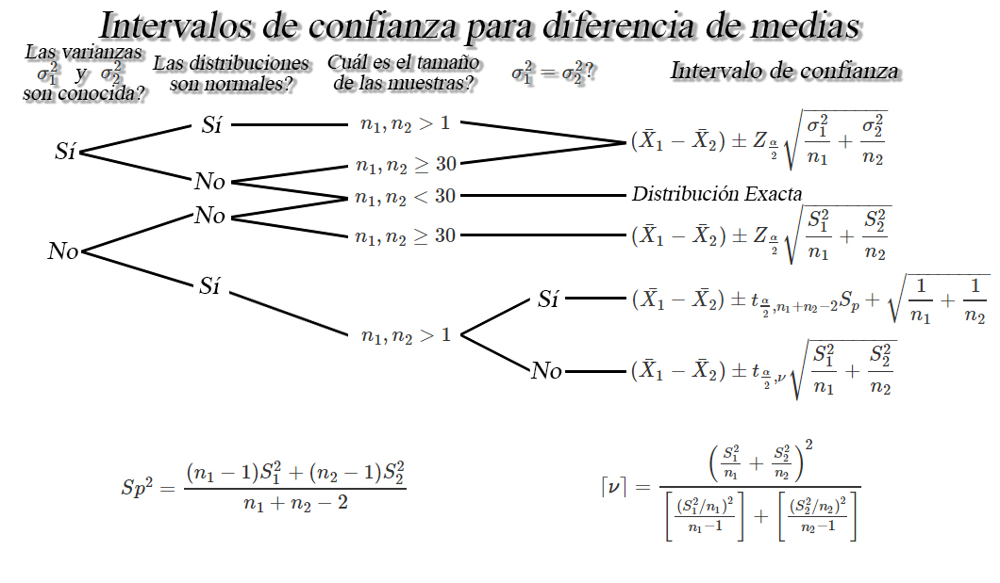
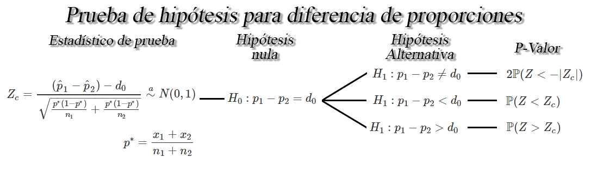
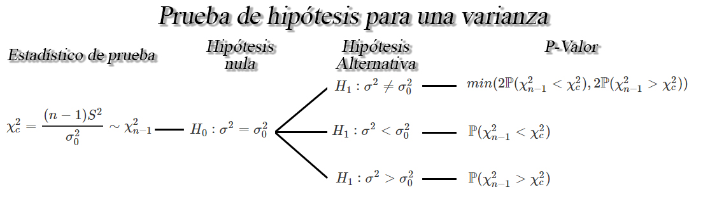
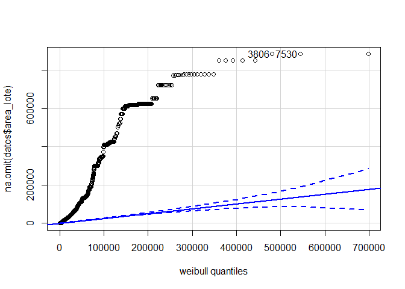

Inferencia estadística
----------------------

La inferencia estadística es la obtención de conclusiones basadas en
datos experimentales. Para entender la naturaleza de la inferencia
estadística, se debe entender primero la diferencia entre “población” y
“muestra”.

**Población:** Consta del total de observaciones del suceso o proceso en
que estamos interesados. En muchas ocasiones, no es posible obtener o
replicar dicha información.

**Muestra:** Es un subconjunto de la población de interés, extraída con
el objetivo de hacer inferencia sobre la población.

**Muestra aleatoria:** Es un subconjunto de la población seleccionado de
forma independiente e idénticamente distribuidos (*iid* en adelante).

### Estadísticos muestrales

Son funciones de las variables aleatorias obtenidas a partir de muestras
aleatorias, que **tienen por objetivo estimar o hacer inferencia acerca
de parámetros desconocidos de una población**.

Entonces, si se tiene un conjunto de observaciones
`$X_1, X_2, \ldots, Xn$` obtenidas de una muestra aleatoria *iid* de
tamaño `$n$`, entonces se tendrán los siguientes estadísticos muestrales

#### Media muestral

Es el promedio aritmético del total de las `$n$` observaciones
pertenecientes a una muestra aleatoria. Éste estadístico se define como
`\begin{align*}   \bar{X}=\sum_{i=1}^n\frac{x_i}{n}=\frac{x_1+x_2+\ldots+x_n}{n} \end{align*}`

En <tt>R</tt>, puede calcularse el valor de la media muestral de una
muestra aleatoria mediante la función `mean(datos)`.

#### Varianza muestral

Es la distancia media **al cuadrado** del conjunto de observaciones
pertenecientes a una muestra aleatoria, respecto a la media muestra.
`\begin{align*}   S^2=\frac{1}{n-1}\sum_{i=1}^n{(x_i-\bar{X})^2} \end{align*}`

siendo el valor `$n-1$` conocido como la corrección de Bessel, el cuál
se usa en lugar de la división sobre `$n$` con el fin de corregir el
sesgo tendría el estimador.

En <tt>R</tt> puede calcularse la varianza muestral de una muestra
aleatoria mediante la función `var(datos)`.

#### Desviación estándar muestral

Es la raíz cuadrada de la distancia media **al cuadrado** del conjunto
de observaciones pertenecientes a una muestra aleatoria, respeto a la
media, es decir, indica qué tan dispersos se encuentra el conjunto de
observaciones de una muestra aleatoria respecto a su valor promedio.
`\begin{align*}   S=\sqrt{S^2} \end{align*}`

En <tt>R</tt> puede calcularse la desviación estándar de una muestra
aleatoria mediante la función `sd(datos)`.

#### Proporción muestral

Como su nombre lo indica, es la proporción de observaciones que cumplen
una condición específica dentro de una muestra, respecto al total de
observaciones dentro de la muestra, e indica el porcentaje de individuos
que cumplen una característica dentro de un conjunto de observaciones.

`\begin{align*}   \hat{p}= \frac{x}{n} = \frac{\text{Número de éxitos}}{\text{Total de observaciones}} \end{align*}`

En <tt>R</tt> puede calcularse la proporción de observaciones que cumple
una condición mediante la función `table(datos)`.

### Distribuciones muestrales

Debido a que **todos los estadístico** son funciones de las variables
aleatorias observadas en una muestra, se tendrá que, éstos también serán
variables aleatorias que **tendrán distribuciones de probabilidad
asociadas**, las cuales son llamadas distribuciones muestrales.

#### Distribución muestral `$Z$`

**Se usa para hacer inferencia sobre la media de una o dos
poblaciones.**. Para el caso de una población, sea
`$X_1, X_2, \ldots, X_n$` una muestra aleatoria de tamaño `$n$` de una
distribución normal con media `$\mu$` y varianza `$\sigma^2$` conocida,
entonces se tendrá que
`\begin{align*} Z = \frac{\bar{X}-\mu}{\sigma/\sqrt{n}} \sim N(0,1) \end{align*}`

se distribuirá como una normal estándar de forma exacta.

Mientras que, para el caso de dos poblaciones, sea
`$X_{11}, X_{12}, \ldots, X_{1n_1}$` y
`$X_{21}, X_{22}, \ldots, X_{2n_1}$` dos muestras aleatorias *iid* con
medias `$\mu_1$` y `$\mu_2$`, y varianzas `$\sigma_1^2$` y
`$\sigma_2^2$`, para `$i=1,2,\ldots,n_1$` y `$j=1,2,\ldots,n_2$`,
entonces se tendrá que

`\begin{align*} Z_c=\frac{(\bar{X}_1 - \bar{X}_2) - (\mu_1 - \mu_2)}{\sqrt{\frac{\sigma^2_1}{n_1} + \frac{\sigma^2_2}{n_2}}} \sim N(0,1) \end{align*}`

se distribuirá como una normal estándar de forma exacta.

#### Teorema del límite central

**Se usa para hacer inferencia sobre la media de una o dos
poblaciones**. Para el caso de una población, sea
`$X_1, X_2, \ldots, X_n$` una muestra aleatoria *iid* con media `$\mu$`
y varianza `$\sigma^2$` entonces, cuando `$n\to \infty$`, se tendrá que
`\begin{align*} Z_c = \frac{\bar{X}-\mu}{\sigma/\sqrt{n}} \stackrel{a}{\sim} N(0,1) \end{align*}`
tendrá una distribución aproximadamente normal estándar, cuando
`$n\sim \infty$`.

Para el caso de dos poblaciones, sea
`$X_{11}, X_{12}, \ldots, X_{1n_1}$` y
`$X_{21}, X_{22}, \ldots, X_{2n_1}$` dos muestras aleatorias *iid* con
medias `$\mu_1$` y `$\mu_2$`, y varianzas `$\sigma_1^2$` y
`$\sigma_2^2$`, para `$i=1,2,\ldots,n_1$` y `$j=1,2,\ldots,n_2$`,
entonces se tendrá que

`\begin{align*} Z_c=\frac{(\bar{X}_1 - \bar{X}_2) - (\mu_1 - \mu_2)}{\sqrt{\frac{\sigma^2_1}{n_1} + \frac{\sigma^2_2}{n_2}}} \stackrel{a}{\sim} N(0,1) \end{align*}`

tendrá una distribución aproximadamente normal estándar, cuando
`$n\sim \infty$`.

#### Distribución muestral `$t$` de Student

**Se usa para hacer inferencia sobre la media de una o dos
poblaciones**. Para el caso de una población, sea
`$X_1, X_2, \ldots, X_n$` una muestra aleatoria de una población normal
con media `$\mu$` y varianza `$\sigma^2$` desconocida, se tendrá

`\begin{align*} t_c = \frac{\bar{X}-\mu}{S/\sqrt{n}} \sim t_{n-1} \end{align*}`

tiene una distribución `$t$` con `$(n-1)$` grados de libertad.

Mientras que, para el caso de dos poblaciones, sea
`$X_{11}, X_{12}, \ldots, X_{1n_1}$` y
`$X_{21}, X_{22}, \ldots, X_{2n_1}$` dos muestras aleatorias *iid* con
medias `$\mu_1$` y `$\mu_2$`, y varianzas `$\sigma_1^2$` y
`$\sigma_2^2$` desconocidas, para `$i=1,2,\ldots,n_1$` y
`$j=1,2,\ldots,n_2$`, entonces si se cumple que
`$\sigma_1^2=\sigma_2^2$`, se tendrá que

`\begin{align*} t_c=\frac{(\bar{X}_1 - \bar{X}_2) - (\mu_1 - \mu_2)}{S_p\sqrt{\frac{1}{n_1} + \frac{1}{n_2}}} \sim t_{n_1+n_2-2} \end{align*}`
donde
`\begin{align*} S_p^2 = \frac{(n_1-1)S^2_1+(n_2-1)S^2_2}{n_1+n_2-2} \end{align*}`

o si se cumple que `$\sigma_1^2\neq\sigma_2^2$`, se tendrá que

`\begin{align*} t_c=\frac{(\bar{X}_1 - \bar{X}_2) - (\mu_1 - \mu_2)}{\sqrt{\frac{S^2_1}{n_1} + \frac{S^2_2}{n_2}}} \sim t_\nu \end{align*}`
donde
`\begin{align*} \lceil\nu\rceil = \frac{\left(\frac{S_1^2}{n_1} + \frac{S_2^2}{n_2}\right)^2}{\left[\frac{(S_1^2/n_1)^2}{n_1-1}\right] + \left[\frac{(S_2^2/n_2)^2}{n_2-1}\right]} \end{align*}`

En estos dos casos, `$t_c$` se distribuirá como una `$t$` con
`$(n_1+n_2-1)$` grados de libertad o `$(n-1)$` grados de libertad,
respectivamente.

#### Distribución muestral `$F$` de Fisher-Snedecor

**Se usa para hacer inferencia sobre la varianza de dos poblaciones**.
Si `$X_{1,1}, X_{1,2}, \ldots, X_{1,n_1}$` y
`$X_{2,1}, X_{2,2}, \ldots, X_{2,n_2}$` son dos muestras aleatorias
independientes de poblaciones normales con medias `$\mu_1, \mu_2$` y
varianzas `$\sigma^2_1, \sigma^2,2$`, respectivamente, entonces

`\begin{align*} F_c = \frac{S^2_1\sigma^2_2}{S^2_2\sigma^2_1} \sim F_{n_1-1, n_2-1} \end{align*}`

tienen una distribución `$F$` con `$n_1-1$` grados de libertad en el
numerador y `$n_2-1$` grados de libertad en el denominador.

#### Distribución muestral para proporciones `$p$`

**Se usa para hacer inferencia sobre la proporción de una o dos
poblaciones**. Sea `$X_1, X_2, \ldots, X_n$` una muestra aleatoria *iid*
de tamaño `$n$`, tal que `$X\sim b(n,p)$`. Entonces si `$n$` es
suficientemente grande, y la proporción `$p$` no está muy cercana a
`$0$` o a `$1$`, tal que `$np$` y `$n(1-p)>5$`, entonces se puede probar
que
`\begin{align*} \hat{p}  = \frac{x}{n} \stackrel{a}{\sim} N\left(p, \frac{p(1-p)}{n}\right) \end{align*}`
donde por teorema de estandarización se obtendrá que
`\begin{align*} Z_c = \frac{\hat{p}-p}{\sqrt{\frac{p(1-p)}{n}}} \stackrel{a}{\sim} N(0,1) \end{align*}`

### Intervalos de confianza

Un intervalo de confianza **es un rango de valores**, construidos a
partir de los estadísticos muestrales, **que tienen por objetivo,
incluir** con un nivel de confianza preestablecido, **el valor real de
un parámetro desconocido de una población**.

**Nota**<br>
<ol type="a">
<li>
Usualmente se usan valores de de \(0.1, 0.05\) y $ 0.01$, es decir,
niveles de confianza de \(0.9, 0.95\) y \(0.99\).
</li>
<li>
La longitud o amplitud del intervalo construido, medirá la
<strong>precisión</strong> de la estimación realizada, por tanto,
intervalos largos proporcionan estimaciones más imprecisas, mientras que
intervalos cortos proporcionan estimaciones más precisas.
</li>
<li>
A medida que aumenta el nivel de confianza, la amplitud del intervalo se
hace más grande.
</li>
<li>
A medida que aumenta el tamaño de muestra, la amplitud del intervalo se
hace más pequeño.
</li>
</ol>

Para facilitar el cálculo de cualquier intervalo, se crean funciones que
puede ser descargada mediante la siguiente linea de código

``` r
## Código descargar funciones para intervalos
fun.int <- tempfile(fileext = ".R")  # Crea archivo temporal
URL <- "https://raw.githubusercontent.com/jiperezga/jiperezga.github.io/master/Dataset/Codigos%20R/Intervalos.R"  # URL base de datos
download.file(URL, destfile = fun.int, mode = "wb")  # Descarga archivo en el archivo temporal creado

source(fun.int)  # Carga funciones guardadas
```

#### Intervalos de confianza para una media `$\mu$`

Sea `$X_1, X_2, \ldots, X_n$` una muestra aleatoria *iid* de tamaño
`$n$` con media `$\mu$` desconocida, y varianza `$\sigma^2<\infty$`,
entonces dependiendo de las condiciones, se tendrán los siguientes
intervalos de confianza para la media `$\mu$`.


Suponga que se desea crear un intervalo de confianza del `$90\%$` para
el número promedio de pisos de la construcción (<tt>nro\_pisos</tt>). En
este caso, una vez descargadas las funciones para intervalos, podemos
calcular un intervalo de confianza para una media en <tt>R</tt> mediante
la función <tt>IntUnaMedia</tt> de la forma

``` r
# Calcula intervalo de confianza para una media creada
IntUnaMedia(datos = datos$nro_pisos, nivel.conf = 0.9)
```

Similarmente, puede emplearse la función <tt>t.test()</tt> de
<tt>R</tt>, que permite probar la situación en donde la varianza
poblacional no es conocida, y la distribución es normal.

``` r
# Calcula intervalo de confianza para una media R
t.test(x = datos$nro_pisos, conf.level = 0.9)
```


        One Sample t-test

    data:  datos$nro_pisos
    t = 267.18, df = 86146, p-value < 2.2e-16
    alternative hypothesis: true mean is not equal to 0
    90 percent confidence interval:
     3.303944 3.344877
    sample estimates:
    mean of x 
     3.324411 

#### Intervalos de confianza para diferencia de medias `$\mu_1 - \mu_2$`

Sea `$X_{1,1}, X_{1,2}, \ldots, X_{1,n_1}$` y
`$X_{2,1}, X_{2,2}, \ldots, X_{2,n_1}$` dos muestras aleatorias *iid* de
tamaños `$n_1$`, y `$n_2$` con medias `$\mu_1$` y `$\mu_2$`
desconocidas, y varianzas `$\sigma_1^2<\infty$` y `$\sigma^2_2<\infty$`,
respectivamente, entonces dependiendo de las condiciones, se tendrán los
siguientes intervalos de confianza para la diferencia de medias
`$\mu_1 - \mu_2$`.



Suponga que se desea crear un intervalo de confianza del `$95\%$` para
la diferencia promedio entre el precio de venta por `$m^2$`
(<tt>preciovtax</tt>), en los estratos `$2$` y `$4$` (<tt>estrato</tt>).
En este caso, una vez descargadas las funciones para intervalos, podemos
calcular un intervalo de confianza para la diferencia de media en
<tt>R</tt> mediante la función <tt>IntDosMedias</tt> de la forma

``` r
# Calcula intervalo de confianza para diferencia de medias creada
IntDosMedias(datos1 = datos$preciovtax[datos$estrato == 2], datos2 = datos$preciovtax[datos$estrato == 
    4], nivel.conf = 0.95)
```

Similarmente, puede emplearse la función <tt>t.test()</tt> de
<tt>R</tt>, que permite probar la situación en donde las varianzas
poblacionales no son conocidas, y las distribuciones son normal y se
puede establecer si las varianzas poblacionales son o no iguales.

``` r
# Calcula intervalo de confianza para diferencia de medias R
t.test(x = datos$preciovtax[datos$estrato == 2], y = datos$preciovtax[datos$estrato == 
    4], conf.level = 0.95, var.equal = F)
```


        Welch Two Sample t-test

    data:  datos$preciovtax[datos$estrato == 2] and datos$preciovtax[datos$estrato == 4]
    t = -131.04, df = 14252, p-value < 2.2e-16
    alternative hypothesis: true difference in means is not equal to 0
    95 percent confidence interval:
     -1254.805 -1217.818
    sample estimates:
    mean of x mean of y 
     938.2444 2174.5557 

#### Intervalos de confianza para una proporción `$p$`

Sea `$X_1,X_2, \ldots, X_n$` una muestra aleatoria *iid* de tamaño
`$n$`, tal que `$X\sim b(n,p)$` entonces si `$n$` es suficientemente
grande tal que `$n\geq30$`, y la proporción desconocida `$p$` no se
encuentre cercana a `$0$` o `$1$`, tal que `$np>5$` y `$n(1-p)>5$`,
entonces un intervalo de confianza para la proporción `$p$` es de la
forma 

Suponga que se desea crear un intervalo de confianza del `$90\%$` para
la proporción de empresas que poseen licencia de construcción
(<tt>ob\_formal</tt>). En este caso, una vez descargadas las funciones
para intervalos, podemos calcular un intervalo de confianza para una
proporción en <tt>R</tt> mediante la función <tt>IntDosMedias</tt> de la
forma

``` r
# Calcula intervalo de confianza para una proporción creada
IntUnaProp(datos = datos$ob_formal, factor = "Sí", nivel.conf = 0.9)
```

Similarmente, puede emplearse la función <tt>prop.test()</tt> de
<tt>R</tt>, de la forma

``` r
# Calcula intervalo de confianza para una proporción R
exitos <- table(datos$ob_formal)[1]
total <- sum(table(datos$ob_formal))
prop.test(x = exitos, n = total, conf.level = 0.9)
```


        1-sample proportions test with continuity correction

    data:  exitos out of total, null probability 0.5
    X-squared = 9080.5, df = 1, p-value < 2.2e-16
    alternative hypothesis: true p is not equal to 0.5
    90 percent confidence interval:
     0.3350122 0.3403242
    sample estimates:
            p 
    0.3376631 

#### Intervalos de confianza para diferencia de proporciones `$p_1 - p_2$`

Sea `$X_{1,1}, X_{1,2}, \ldots, X_{1,n_1}$` y
`$X_{2,1}, X_{2,2}, \ldots, X_{2,n_1}$` dos muestras aleatorias *iid* de
tamaños `$n_1$`, y `$n_2$` tal que `$X_1\sim b(n,p)$` y
`$X_2\sim b(n,p)$`. Entonces si, `$n_1$`, y `$n_2$` son suficientemente
grandes tal que `$n_1, n_2 \geq 30$`, y las proporciones desconocidas
`$p_1$` y `$p_2$` no se encuentran cercanas a `$0$` o `$1$`, tal que
`$n_1p_1, n_2p_2, n_1(1-p_1)$` y `$n_2(1-p_2)>5$`, entonces un intervalo
de confianza para la diferencia de proporciones `$p_1 - p_2$` es de la
forma


Suponga que se desea crear un intervalo de confianza del `$90\%$` para
la diferencia entre la proporción de empresas que poseen licencia de
construcción (<tt>ob\_formal</tt>), respecto a las regiones de Bogotá y
Antioquia (<tt>region</tt>). En este caso, una vez descargadas las
funciones para intervalos, podemos calcular un intervalo de confianza
para la diferencia entre proporción en <tt>R</tt> mediante la función
<tt>IntDosProp</tt> de la forma

``` r
# Calcula intervalo de confianza para diferencia de proporciones creada
IntDosProp(datos1 = datos$ob_formal[datos$region == "Bogotá"], datos2 = datos$ob_formal[datos$region == 
    "Antioquia"], factor1 = "Sí", factor2 = NULL, nivel.conf = 0.9)
```

Similarmente, puede emplearse la función <tt>prop.test()</tt> de
<tt>R</tt>, de la forma

``` r
# Calcula intervalo de confianza para diferencia de proporciones R
exitos1 <- table(datos$ob_formal[datos$region == "Bogotá"])[1]
total1 <- sum(table(datos$ob_formal[datos$region == "Bogotá"]))
exitos2 <- table(datos$ob_formal[datos$region == "Antioquia"])[1]
total2 <- sum(table(datos$ob_formal[datos$region == "Antioquia"]))
prop.test(x = c(exitos1, exitos2), n = c(total1, total2), conf.level = 0.9)
```


        2-sample test for equality of proportions with continuity correction

    data:  c(exitos1, exitos2) out of c(total1, total2)
    X-squared = 52.232, df = 1, p-value = 4.933e-13
    alternative hypothesis: two.sided
    90 percent confidence interval:
     -0.05258971 -0.03289650
    sample estimates:
       prop 1    prop 2 
    0.4006542 0.4433973 

#### Intervalos de confianza para razón de varianzas `$\sigma^2_1/\sigma^2_2$`

Sea `$X_{1,1}, X_{1,2}, \ldots, X_{1,n_1}$` y
`$X_{2,1}, X_{2,2}, \ldots, X_{2,n_1}$` dos muestras aleatorias normales
de tamaños `$n_1$`, y `$n_2$` con medias `$\mu_1$` y `$\mu_2$`, y
varianzas desconocidas `$\sigma_1^2<\infty$` y `$\sigma^2_2<\infty$`,
respectivamente, entonces un intervalo de confianza del
`$100(1-\alpha)\%$` para `$\sigma^2_1/\sigma^2_2$` estará dada por


Suponga que se desea crear un intervalo de confianza del `$95\%$` para
el cociente de varianzas entre el precio de venta por `$m^2$`
(<tt>preciovtax</tt>), en los estratos `$1$` y `$5$` (<tt>estrato</tt>).
En este caso, una vez descargadas las funciones para intervalos, podemos
calcular un intervalo de confianza para la diferencia de media en
<tt>R</tt> mediante la función <tt>IntCosVar</tt> de la forma

``` r
# Calcula intervalo de confianza para cociente de varianzas creada
IntCosVar(datos1 = datos$preciovtax[datos$estrato == 1], datos2 = datos$preciovtax[datos$estrato == 
    5], nivel.conf = 0.95)
```

Similarmente, puede emplearse la función <tt>var.test()</tt> de
<tt>R</tt>, de la forma

``` r
# Calcula intervalo de confianza para cociente de varianzas R
var.test(x = datos$preciovtax[datos$estrato == 1], y = datos$preciovtax[datos$estrato == 
    5], conf.level = 0.95)
```


        F test to compare two variances

    data:  datos$preciovtax[datos$estrato == 1] and datos$preciovtax[datos$estrato == 5]
    F = 0.034198, num df = 11170, denom df = 5010, p-value < 2.2e-16
    alternative hypothesis: true ratio of variances is not equal to 1
    95 percent confidence interval:
     0.03261627 0.03584061
    sample estimates:
    ratio of variances 
            0.03419778 

### Prueba de hipótesis

Una hipótesis estadística **es una afirmación o conjetura que se realiza
sobre una población o sobre los parámetros de la misma**, en donde el
objetivo es decidir si la afirmación hecha se encuentra apoyada por la
información obtenida de una muestra de la población de interés.

#### Componentes de una prueba de hipótesis

**Hipótesis nula**<br><br> Sea `$\theta$` un parámetro de interés
desconocido y sea `$\theta_0$` un valor particular de `$\theta$`,
entonces se tendrá que la hipótesis nula estará dado por

-   **Bilateral** `$H_0: \theta = \theta_0$`
-   **Unilateral izquierda** `$H_0: \theta \geq \theta_0$`
-   **Unilateral derecho** `$H_0: \theta \leq \theta_0$`

matemáticamente `$H_0: \theta \geq \theta_0$` y
`$H_0: \theta \leq \theta_0$` es matemáticamente equivalente a escribir
`$H_0: \theta = \theta_0$` y por tanto, se acostumbra a usar esta última
en los tres casos.

**Hipótesis alternativa**<br><br> Es el complemento lógico de la
hipótesis nula, y por tanto, ésta estará dado por

-   **Bilateral** `$H_0: \theta \neq \theta_0$`
-   **Unilateral izquierda** `$H_0: \theta < \theta_0$`
-   **Unilateral derecho** `$H_0: \theta > \theta_0$`

Ésta hipótesis no puede contener la igualdad, a menos que se quiera una
hipótesis alternativa específica.

**Estadístico de prueba**<br><br> El estadístico de prueba será el valor
usado para tomar la decisión entre `$H_0$` y `$H_1$`. Éste dependerá del
parámetro de interés y de la distribución muestral del estadístico
asociado.

**P-valor**<br><br> Es el nivel de significancia más bajo en el que el
valor observado del estadístico de prueba es significativo. Por tanto,
un valor relativamente pequeño puede sugerir que el valor observado del
estadístico de prueba sea poco probable, y por tanto, `$H_0$` deba ser
rechazado.

En general, como criterio de decisión para el P-valor, dado un nivel de
significancia preestablecido, es de la forma
`\begin{align*} \text{P-valor }<\alpha \Rightarrow \text{ Rechazar } H_0 \end{align*}`

#### Prueba de hipótesis para la media `$\mu$`

Sea `$X_1, X_2, \ldots, X_n$` una muestra aleatoria *iid* de tamaño
`$n$` con media desconocida `$\mu$`, y varianza `$\sigma^2<\infty$`,
entonces dependiendo de las condiciones, se tendrán los siguientes
pruebas de hipótesis para la media `$\mu$`.


Suponga que se desea probar con nivel de significancia del `$5\%$`, la
hipótesis de que el número promedio en `$m^2$` de las áreas comunes es
superior a `$154$` `$m^2$` (<tt>areatotzc</tt>). Para realizar la prueba
de hipótesis para una media, bajo los supuestos de que, la distribución
es normal o aproximadamente normal y que la varianza poblacional no es
conocidas, puede emplearse la función <tt>t.test()</tt> de <tt>R</tt>,
de la forma

``` r
# Calcula pueba de hipótesis para una media
t.test(x = datos$areatotzc, mu = 154, alternative = "greater", conf.level = 0.95)
```


        One Sample t-test

    data:  datos$areatotzc
    t = 0.39854, df = 86143, p-value = 0.3451
    alternative hypothesis: true mean is greater than 154
    95 percent confidence interval:
     151.2926      Inf
    sample estimates:
    mean of x 
     154.8657 

#### Prueba de hipótesis para diferencia de medias `$\mu_1 - \mu_2$`

Sea `$X_{1,1}, X_{1,2}, \ldots, X_{1,n_1}$` y
`$X_{2,1}, X_{2,2}, \ldots, X_{2,n_1}$` dos muestras aleatorias *iid* de
tamaños `$n_1$`, y `$n_2$` con medias desconocidas
`$\mathbb{E}(X_{1})=\mu_1$` y `$\mathbb{E}(X_{2})=\mu_2$`, y varianzas
`$Var(X_{1})=\sigma_1^2<\infty$` y `$Var(X_{2})=\sigma^2_2<\infty$`,
respectivamente, entonces dependiendo de las condiciones, se tendrán los
siguientes pruebas de hipótesis para la diferencia de medias
`$\mu_1 - \mu_2$`.


Suponga que se desea probar con nivel de significancia del `$1\%$`, la
hipótesis de que el precio promedio de venta por `$m^2$` en Antioquia,
es menor que el precio promedio de venta por `$m^2$` en el Valle
(<tt>preciovtax</tt>) y (<tt>region</tt>).

Basados en los supuestos de normalidad, y varianzas desconocidas, en
<tt>R</tt> es posible emplear la función <tt>t.test()</tt> para probar
la hipótesis de interés. Tal como se muestra a continuación.

``` r
# Calcula pueba de hipótesis para una media
t.test(x = datos$preciovtax[datos$region == "Antioquia"], y = datos$preciovtax[datos$region == 
    "Valle"], mu = 0, alternative = "less", conf.level = 0.99)
```


        Welch Two Sample t-test

    data:  datos$preciovtax[datos$region == "Antioquia"] and datos$preciovtax[datos$region == "Valle"]
    t = 66.884, df = 16153, p-value = 1
    alternative hypothesis: true difference in means is less than 0
    99 percent confidence interval:
         -Inf 910.2621
    sample estimates:
    mean of x mean of y 
     2090.394  1210.732 

#### Prueba de hipótesis para una proporción `$p$`

Sea `$X_1,X_2, \ldots, X_n$` una muestra aleatoria *iid* de tamaño
`$n$`, tal que `$X\sim b(n,p)$` entonces si `$n$` es suficientemente
grande tal que `$n\geq30$`, y la proporción desconocida `$p$` no se
encuentre cercana a `$0$` o `$1$`, tal que `$np>5$` y `$n(1-p)>5$`,
entonces un una prueba de hipótesis para la proporción verdadera `$p$`
será de la forma


Suponga que se desea probar con nivel de significancia del `$10\%$`, la
hipótesis de que la proporción de viviendas de interés social es
superior al `$43\%$` (<tt>tipovivi</tt>). En este caso, es posible
emplear la función <tt>prop.test</tt> de <tt>R</tt> para probar la
hipótesis de interés.

``` r
# Calcula prueba de hipótesis para una proporcion
exitos3 <- table(datos$tipovivi)[1]
total3 <- sum(table(datos$tipovivi))
prop.test(x = exitos3, n = total3, conf.level = 0.9, alternative = "greater", p = 0.43)
```


        1-sample proportions test with continuity correction

    data:  exitos3 out of total3, null probability 0.43
    X-squared = 255.82, df = 1, p-value = 1
    alternative hypothesis: true p is greater than 0.43
    90 percent confidence interval:
     0.4008701 1.0000000
    sample estimates:
            p 
    0.4030157 

#### Prueba de hipótesis para diferencia de proporciones `$p_1 - p_2$`

Sean `$X_{1,1}, X_{1,2}, \ldots, X_{1,n_1}$` y
`$X_{2,1}, X_{2,2}, \ldots, X_{2,n_1}$` dos muestras aleatorias *iid* de
tamaño `$n_1$` y `$n_2$`, tal que `$X_{i}\sim b(n_i,p_i)$`, para
`$i=1,2$`, entonces si `$n_1$` y `$n_2$` son suficientemente grandes tal
que `$n_1, n_2\geq30$`, y si las proporciones desconocidas `$p_1$` y
`$p_2$` no se encuentran cercanas a `$0$` o `$1$`, tal que `$n_ip_i>5$`
y `$n_i(1-p_i)>5$`, para `$i=1,2$`, entonces un una prueba de hipótesis
para la diferencia de las proporciones `$p_1-p_2$` será de la forma



Suponga que se tiene interés en probar la hipótesis si la proporción de
viviendas de interés social en el `$2016$` es inferior a la proporción
de viviendas de interés social en el `$2018$` (<tt>tipovivi</tt>) y
(<tt>ano\_censo</tt>), empleando un nivel de significancia del `$12\%$`.
En este caso, puede emplearse la función <tt>prop.table</tt> de
<tt>R</tt>, mediante la estructura

``` r
# Calcula intervalo de confianza para diferencia de proporciones R
exitos4 <- table(datos$tipovivi[datos$ano_censo == "2016"])[1]
total4 <- sum(table(datos$tipovivi[datos$ano_censo == "2016"]))
exitos5 <- table(datos$tipovivi[datos$ano_censo == "2018"])[1]
total5 <- sum(table(datos$tipovivi[datos$ano_censo == "2018"]))
prop.test(x = c(exitos4, exitos5), n = c(total4, total5), conf.level = 0.88, alternative = "less")
```


        2-sample test for equality of proportions with continuity correction

    data:  c(exitos4, exitos5) out of c(total4, total5)
    X-squared = 4.4719, df = 1, p-value = 0.01723
    alternative hypothesis: less
    88 percent confidence interval:
     -1.000000000 -0.005788361
    sample estimates:
       prop 1    prop 2 
    0.3549380 0.3680311 

#### Prueba de hipótesis para cociente de varianzas `$\sigma^2_1/\sigma^2_2$`

Sea `$X_{1,1}, X_{1,2}, \ldots, X_{1,n_1}$` y
`$X_{2,1}, X_{2,2}, \ldots, X_{2,n_1}$` dos muestras aleatorias normales
de tamaños `$n_1$`, y `$n_2$` con medias `$\mathbb{E}(X_{1})=\mu_1$` y
`$\mathbb{E}(X_{2})=\mu_2$`, y varianzas desconocidas
`$Var(X_{1})=\sigma_1^2<\infty$` y `$Var(X_{2})=\sigma^2_2<\infty$`,
respectivamente, entonces un contraste de hipótesis para el cociente de
varianzas `$\sigma^2_1/\sigma^2_2$`, a un nivel de significancia
`$\alpha$` será de la forma



Empleando un nivel de significancial del `$5\%$`, verifique si existe
evidencia significativa respecto a que la variabilidad del área de los
lotes, es diferente para las viviendas de interés social y las viviendas
que no son de interés social (<tt>area\_lote</tt>) y
(<tt>tipovivi</tt>).

En este caso, como la hipótesis de interés es probar si la varianza
entre dos poblaciones es o no igual, es posible usar la función
<tt>var.test()</tt> de <tt>R</tt> de la forma

``` r
# Calcula intervalo de confianza para cociente de varianzas R
var.test(x = datos$area_lote[datos$tipovivi == "Social"], y = datos$area_lote[datos$tipovivi == 
    "No Social"], ratio = 1, alternative = "two.sided", conf.level = 0.95)
```


        F test to compare two variances

    data:  datos$area_lote[datos$tipovivi == "Social"] and datos$area_lote[datos$tipovivi == "No Social"]
    F = 2.0344, num df = 34718, denom df = 51428, p-value < 2.2e-16
    alternative hypothesis: true ratio of variances is not equal to 1
    95 percent confidence interval:
     1.995607 2.073951
    sample estimates:
    ratio of variances 
              2.034365 

### Prueba de bondad de ajuste

Las pruebas de bondad de ajuste **son un contraste de hipótesis para
determinar el grado o nivel de ajuste de nuestros datos a una
distribución teórica**.

Estas pruebas se basan en la comparación de las frecuencias de
ocurrencia observadas en una muestra empírica y las frecuencias
esperadas de una distribución teórica. En donde, el objetivo será si
existe o no discrepancia entre los valores observados y los valores
esperados de la distribución de interés.

La hipótesis a probar de interés estará dada por
`\begin{align*} H_0: X \sim F_0(x) \quad \text{vs} \quad H_1: X \nsim F_0(x) \end{align*}`

Siendo `$F_0(x)$` la distribución de probabilidad hipótetica que se
quiere probar.

Entre las pruebas de bondad de ajuste más usadas se tiene:

<pre style="font-family: 'Open Sans',sans-serif; margin-bottom: -3rem; margin-top: -3rem; font-size: 120%;">
<table class="table table-striped" style="width: auto !important; margin-left: auto; margin-right: auto;">
 <thead>
  <tr>
   <th style="text-align:left;"> Prueba </th>
   <th style="text-align:left;"> Librería </th>
   <th style="text-align:left;"> Función </th>
  </tr>
 </thead>
<tbody>
  <tr>
   <td style="text-align:left;"> Kolmogorov–Smirnov </td>
   <td style="text-align:left;"> truncgof </td>
   <td style="text-align:left;"> ks.test() </td>
  </tr>
  <tr>
   <td style="text-align:left;"> Cramér–von Mises </td>
   <td style="text-align:left;"> truncgof </td>
   <td style="text-align:left;"> w2.test() </td>
  </tr>
  <tr>
   <td style="text-align:left;"> Anderson–Darling </td>
   <td style="text-align:left;"> truncgof </td>
   <td style="text-align:left;"> ad.test() </td>
  </tr>
  <tr>
   <td style="text-align:left;"> Kuiper </td>
   <td style="text-align:left;"> truncgof </td>
   <td style="text-align:left;"> v.test() </td>
  </tr>
  <tr>
   <td style="text-align:left;"> QQPlot </td>
   <td style="text-align:left;"> truncgof </td>
   <td style="text-align:left;"> qqPlot </td>
  </tr>
  <tr>
   <td style="text-align:left;"> Kolmogorov–Smirnov </td>
   <td style="text-align:left;"> truncgof </td>
   <td style="text-align:left;"> ks.test() </td>
  </tr>
  <tr>
   <td style="text-align:left;"> Cramér–von Mises </td>
   <td style="text-align:left;"> truncgof </td>
   <td style="text-align:left;"> w2.test() </td>
  </tr>
  <tr>
   <td style="text-align:left;"> Anderson–Darling </td>
   <td style="text-align:left;"> truncgof </td>
   <td style="text-align:left;"> ad.test() </td>
  </tr>
  <tr>
   <td style="text-align:left;"> Kuiper </td>
   <td style="text-align:left;"> car </td>
   <td style="text-align:left;"> v.test() </td>
  </tr>
</tbody>
</table>
</pre>

Donde éstas pruebas, **requieren de los parámetros de la distribución
que se quiere probar**, y para encontrarlos, es posible emplear
**métodos de optimización** que nos permitan observar cuales son los
parámetros ajustados para un conjunto de datos determinado. Para emplear
estos método de optimización es posible usar la función
<tt>fitdistr()</tt> de la librería <tt>MASS</tt>.

Para ilustrar el método de empleo, suponga que se desea probar si, el
área del lote (<tt>area\_lote</tt>), posee el comportamiento de una
distribución Weibull. Entonces, para probar esta distribución, será
necesario usar la función <tt>fitdistr()</tt> para encontrar los
parámetros que nos servirán para el ajuste, y posteriormente emplear una
prueba de bondad de ajuste, como por ejemplo la Kuiper y el gráfico QQ,
para saber si se rechaza o no la hipótesis de interés.

``` r
library(MASS)
## Se hace el ajuste para encontrar el valor de los parámetros
parametros <- fitdistr(na.omit(datos$area_lote), densfun = "weibull")

## Se hace la prueba de bondad de ajuste
truncgof::v.test(na.omit(datos$area_lote), distn = "pweibull", fit = list(shape = parametros$estimate[1], 
    scale = parametros$estimate[2]))
```


        Kuiper Test

    data:  na.omit(datos$area_lote)
    V = 138.16, p-value < 2.2e-16
    alternative hypothesis: NA

    treshold = -Inf, simulations: 100

``` r
## Se hace el QQplot
car::qqPlot(na.omit(datos$area_lote), dist = "weibull", shape = parametros$estimate[1], 
    scale = parametros$estimate[2])
```



    [1] 3806 7530

Adicionalmente, existen pruebas específicas para probar si los datos se
distribuyen o no normalmente

<pre style="font-family: 'Open Sans',sans-serif; margin-bottom: -3rem; margin-top: -3rem; font-size: 120%;">
<table class="table table-striped" style="width: auto !important; margin-left: auto; margin-right: auto;">
 <thead>
  <tr>
   <th style="text-align:left;"> Prueba </th>
   <th style="text-align:left;"> Librería </th>
   <th style="text-align:left;"> Función </th>
  </tr>
 </thead>
<tbody>
  <tr>
   <td style="text-align:left;"> Shapiro-Wilk </td>
   <td style="text-align:left;"> stats* </td>
   <td style="text-align:left;"> shapiro.test() </td>
  </tr>
  <tr>
   <td style="text-align:left;"> Lilliefors </td>
   <td style="text-align:left;"> nortest </td>
   <td style="text-align:left;"> lillie.test() </td>
  </tr>
  <tr>
   <td style="text-align:left;"> Shapiro-Francia </td>
   <td style="text-align:left;"> nortest </td>
   <td style="text-align:left;"> sf.test() </td>
  </tr>
  <tr>
   <td style="text-align:left;"> Cramer Von-Mises </td>
   <td style="text-align:left;"> nortest </td>
   <td style="text-align:left;"> cvm.test() </td>
  </tr>
  <tr>
   <td style="text-align:left;"> Anderson-Darling </td>
   <td style="text-align:left;"> nortest </td>
   <td style="text-align:left;"> ad.test() </td>
  </tr>
  <tr>
   <td style="text-align:left;"> QQPlot </td>
   <td style="text-align:left;"> car </td>
   <td style="text-align:left;"> qqPlot </td>
  </tr>
</tbody>
</table>
</pre>

Para ilustrar el método de empleo de las pruebas de normalidad, suponga
que se desea probar si, el área total vendible (<tt>areavenuni</tt>), se
distribuye normalmente. Suponga que en este caso decidimos emplear la
prueba Lilliefors para probar la hipótesis. (Se decide emplear ésta
prueba debido a que otras prueden generar problemas debido a la cantidad
tan grande de datos)

``` r
## Se hace la prueba de bondad de ajuste de normalidad
nortest::lillie.test(datos$areavenuni)
```


        Lilliefors (Kolmogorov-Smirnov) normality test

    data:  datos$areavenuni
    D = 0.17805, p-value < 2.2e-16

Y también se decide visualizar la prueba de normalidad, mediante el
gráfico QQ, de la forma

``` r
## Se hace la prueba de bondad de ajuste de normalidad
car::qqPlot(datos$areavenuni)
```


    [1] 41015 17823

Referencias
-----------

<h7 id="ref-Esquivel2016"></h7> <h7 id="ref-Hernandez2018"></h7>
<h7 id="ref-Recchioni2016"></h7>
