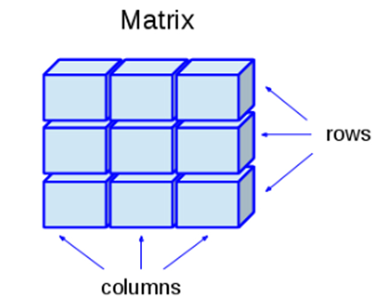
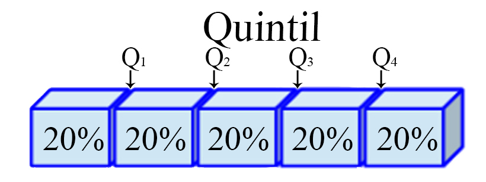
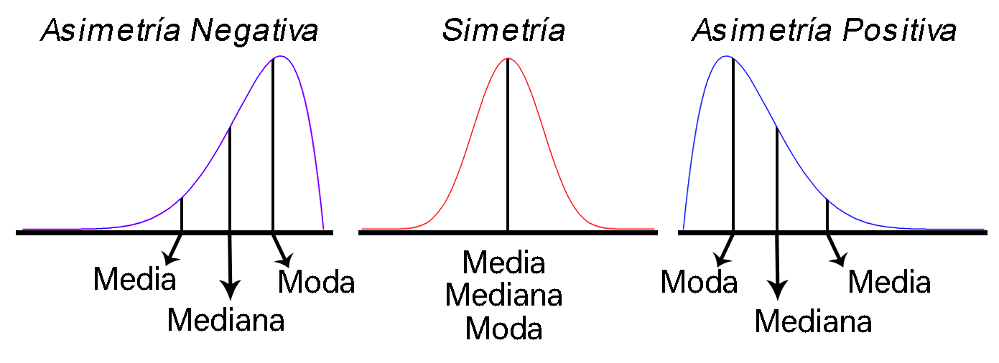
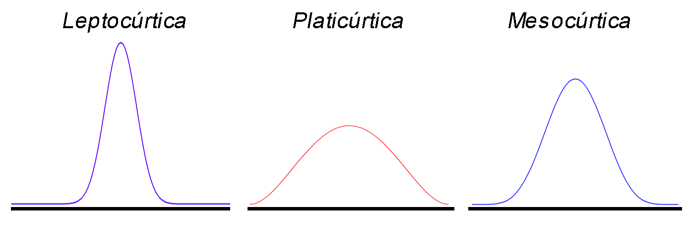
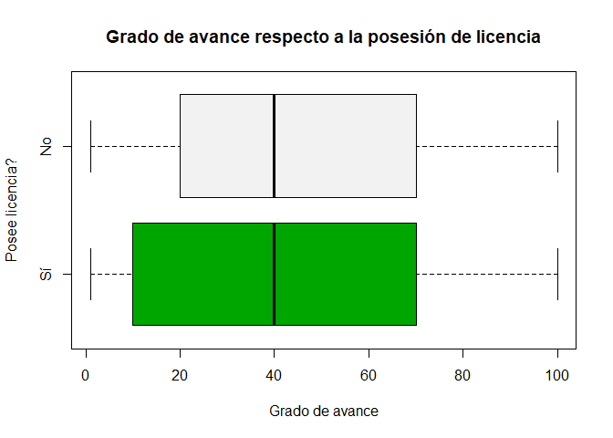

Introducción a R
----------------

<tt>R</tt> **es un lenguaje de programación interpretado orientado a
objetos** junto con un sistema de ventanas, que permite una interacción
directa e intuitiva con el tipo de programación realizada. Este tipo de
programación, posee una notable cercanía con la forma en que se
expresarían las cosas en la vida real, ya que trabaja sobre objetos
visibles que poseen determinadas característica, lo cual hace que puedan
ser empleados para la realización de acciones específicas.

Para entender cómo se crean o manipulan objetos en <tt>R</tt>, es
necesario introducir inicialmente el lenguaje de programación, y para
ello lo primero que debe hacerse, es entender la estructura de
asignación, los tipos de datos, las clases de los objetos y las ayudas
que maneja el programa.

### Estructura de asignación

La estructura de asignación del lenguaje <tt>R</tt> puede llevarse a
cabo mediante cuatro formas diferentes, donde, cada una de ellas lleva
al mismo resultado

<section class="language-r highlighter-rouge">
<section class="highlight">
<pre class="highlight"><code><span class="n">variable</span><span class="w"> </span><span class="o">&lt;-</span><span class="w"> </span><span class="n">objeto</span><span class="w">       </span><span class="c1"># Primer método</span><span class="w">
</span><span class="n">objeto</span><span class="w"> </span><span class="o">-&gt;</span><span class="w"> </span><span class="n">variable</span><span class="w">       </span><span class="c1"># Segundo método</span><span class="w">
</span><span class="n">variable</span><span class="w"> </span><span class="o">=</span><span class="w"> </span><span class="n">objeto</span><span class="w">        </span><span class="c1"># Tercer método</span><span class="w">
</span><span class="n">assign</span><span class="p">(</span><span class="n">variable</span><span class="p">,</span><span class="w"> </span><span class="n">objeto</span><span class="p">)</span><span class="w"> </span><span class="c1"># Cuarto método</span><span class="w">
</span></code></pre>
</section>
</section>

De estos cuatro métodos de asignación presentados, **el primero y el
segundo poseen la misma estructura**, la diferencia entre ellos radica
en que, el primero realiza la asignación a la izquierda y el segundo a
la derecha, lo cual depende de la dirección hacia donde apunte la
flecha.

El **tercer método**, a pesar de realizar la asignación al igual que los
dos primeros métodos, éste **no es el operador habitual de asignación**,
pues éste se encuentra reservado para otros propósitos, tales como darle
valores a una variable dentro de una función. El **cuarto método**, es
una forma de asignación equivalente a las dos primeras, pero **requiere
de “más esfuerzo”** para llevarse acabo la asignación.

Por lo tanto, se **recomienda emplear el primer método de asignación**.
Es de anotar que el símbolo `<-` puede escribirse de dos formas,
presionando la tecla `<` seguida de la tecla `-`, o alternativamente,
presionando de forma simultanea las teclas `Alt` y la tecla `-`.

También se señala que **el carácter `#`, se emplea para comentar el
código** o una línea específica, lo cual implica que posterior a `#`, no
se ejecutará ningún tipo de código en la linea específica en la cual se
encuentre `#`.

### Tipo de datos

Existen diferentes tipos de datos en los lenguajes de programación, de
estos tipos dependerá las operaciones o funciones que pueden o no
emplearse con éstos, y es por ello que debe tenerse especial cuidado
cuando se deseen manipular.

Los tipos de datos más que pueden encontrarse en <tt>R</tt> son:

-   **<tt>numeric</tt>**: Datos numéricos, los cuales soportan números
    que se encuentren en el conjunto de los reales, `$\mathbb{R}$`, y
    por tanto soporta tanto números enteros (<tt>integer</tt>) y números
    de doble precisión (<tt>double</tt>).
-   **<tt>integer</tt>**: Datos enteros, los cuales soportan números que
    se encuentren en el conjunto de los enteros, `$\mathbb{Z}$`, y en
    consecuencia, solo soporta números enteros.
-   **<tt>complex</tt>**: Datos complejos, los cuales soportan números
    que se encuentren en el conjunto de los complejos, `$\mathbb{C}$`, y
    por tanto, soporta tanto números reales como imaginarios.
-   **<tt>character</tt>**: Datos de carácter, los cuales soportan
    caracteres alfanuméricos, es decir, datos numéricos y alfabéticos.
    Éstos deben ser escritos entre comillas simples o dobles.
-   **<tt>factor</tt>**: Datos categóricos nominales, los cuales
    soportan caracteres alfanuméricos, y establece entre estos
    diferentes categorías. Se puede emplear la función <tt>factor()</tt>
    para crear datos de este tipo. Éstos deben ser escritos entre
    comillas simples o dobles.
-   **<tt>ordered</tt>**: Datos categóricos ordinales, los cuales
    soportan caracteres alfanuméricos, y establece entre estos
    diferentes categorías junto con una estructura jerárquica. Se puede
    emplear la función <tt>ordered()</tt> para crear datos de este tipo.
    Éstos deben ser escritos entre comillas simples o dobles.
-   **<tt>logical</tt>**: Datos lógicos, los cuales soportan caracteres
    lógicos tales como <tt style="color: #ff628c!important">TRUE</tt> o
    <tt style="color: #ff628c!important">FALSE</tt>.

Para verificar al estructura de almacenamiento en <tt>R</tt>, puede
emplearse la función <tt>str()</tt>, mientras para observar la
estructura de almacenamiento pueden emplearse las funciones
<tt>mode()</tt>, <tt>typeof</tt>, y para observar la clase interna del
objeto puede emplearse la función <tt>class()</tt>.

<button id="Show1" class="btn btn-secondary">
Mostrar Ejemplo en <tt>R</tt>
</button>
<button id="Hide1" class="btn btn-info">
Ocultar Ejemplo en <tt>R</tt>
</button>
<main id="botoncito1">
<p>
A continuación se presenta un ejemplo en donde se muestran los
diferentes tipos de objetos en <tt>R</tt>
</p>
<h3 data-toc-skip>
Dato tipo numérico
</h3>
<section class="language-r highlighter-rouge">
<section class="highlight">
<pre class="highlight"><code><span class="c1"># Numeric</span><span class="w">
</span><span class="n">a</span><span class="w"> </span><span class="o">&lt;-</span><span class="w"> </span><span class="m">3.3</span><span class="w">
</span><span class="nf">str</span><span class="p">(</span><span class="n">a</span><span class="p">)</span><span class="w">
</span></code></pre>
</section>
</section>
<section class="highlighter-rouge">
<section class="highlight">
<pre class="highlight"><code> num 3.3
</code></pre>
</section>
</section>
<h3 data-toc-skip>
Dato tipo entero
</h3>
<section class="language-r highlighter-rouge">
<section class="highlight">
<pre class="highlight"><code><span class="c1"># Integer</span><span class="w">
</span><span class="n">b</span><span class="w"> </span><span class="o">&lt;-</span><span class="w"> </span><span class="m">3L</span><span class="w">
</span><span class="nf">str</span><span class="p">(</span><span class="n">b</span><span class="p">)</span><span class="w">
</span></code></pre>
</section>
</section>
<section class="highlighter-rouge">
<section class="highlight">
<pre class="highlight"><code> int 3
</code></pre>
</section>
</section>
<h3 data-toc-skip>
Dato tipo lógico
</h3>
<section class="language-r highlighter-rouge">
<section class="highlight">
<pre class="highlight"><code><span class="c1"># Complex</span><span class="w">
</span><span class="n">c</span><span class="w"> </span><span class="o">&lt;-</span><span class="w"> </span><span class="m">3</span><span class="w"> </span><span class="o">+</span><span class="w"> </span><span class="p">(</span><span class="m">0+0.2i</span><span class="p">)</span><span class="w">
</span><span class="nf">str</span><span class="p">(</span><span class="n">c</span><span class="p">)</span><span class="w">
</span></code></pre>
</section>
</section>
<section class="highlighter-rouge">
<section class="highlight">
<pre class="highlight"><code> cplx 3+0.2i
</code></pre>
</section>
</section>
<h3 data-toc-skip>
Dato tipo carácter
</h3>
<section class="language-r highlighter-rouge">
<section class="highlight">
<pre class="highlight"><code><span class="c1"># Character</span><span class="w">
</span><span class="n">d</span><span class="w"> </span><span class="o">&lt;-</span><span class="w"> </span><span class="s2">"Ejemplo :D"</span><span class="w">
</span><span class="nf">str</span><span class="p">(</span><span class="n">d</span><span class="p">)</span><span class="w">
</span></code></pre>
</section>
</section>
<section class="highlighter-rouge">
<section class="highlight">
<pre class="highlight"><code> chr "Ejemplo :D"
</code></pre>
</section>
</section>
<h3 data-toc-skip>
Dato tipo factor
</h3>
<section class="language-r highlighter-rouge">
<section class="highlight">
<pre class="highlight"><code><span class="c1"># Factor</span><span class="w">
</span><span class="n">e</span><span class="w"> </span><span class="o">&lt;-</span><span class="w"> </span><span class="nf">factor</span><span class="p">(</span><span class="s2">"Otro ejemplo :o"</span><span class="p">)</span><span class="w">
</span><span class="nf">str</span><span class="p">(</span><span class="n">e</span><span class="p">)</span><span class="w">
</span></code></pre>
</section>
</section>
<section class="highlighter-rouge">
<section class="highlight">
<pre class="highlight"><code> Factor w/ 1 level "Otro ejemplo :o": 1
</code></pre>
</section>
</section>
<h3 data-toc-skip>
Dato tipo ordinal
</h3>
<section class="language-r highlighter-rouge">
<section class="highlight">
<pre class="highlight"><code><span class="c1"># Ordered</span><span class="w">
</span><span class="n">f</span><span class="w"> </span><span class="o">&lt;-</span><span class="w"> </span><span class="nf">ordered</span><span class="p">(</span><span class="s2">"Uno más &gt;:o"</span><span class="p">)</span><span class="w">
</span><span class="nf">str</span><span class="p">(</span><span class="n">f</span><span class="p">)</span><span class="w">
</span></code></pre>
</section>
</section>
<section class="highlighter-rouge">
<section class="highlight">
<pre class="highlight"><code> Ord.factor w/ 1 level "Uno más &gt;:o": 1
</code></pre>
</section>
</section>
<h3 data-toc-skip>
Dato tipo lógico
</h3>
<section class="language-r highlighter-rouge">
<section class="highlight">
<pre class="highlight"><code><span class="c1"># logic</span><span class="w">
</span><span class="n">g</span><span class="w"> </span><span class="o">&lt;-</span><span class="w"> </span><span class="kc">FALSE</span><span class="w">
</span><span class="nf">str</span><span class="p">(</span><span class="n">g</span><span class="p">)</span><span class="w">
</span></code></pre>
</section>
</section>
<section class="highlighter-rouge">
<section class="highlight">
<pre class="highlight"><code> logi FALSE
</code></pre>
</section>
</section>
</main>

### Clases de objetos

Adicionalmente, con el fin de organizar los datos, se presentan algunas
de las clases de objetos más comúnmente usados en <tt>R</tt>

-   **Vector:** este objeto admite datos numéricos, caracteres,
    complejos o lógicos, pero solo permite un solo tipo de dato a la
    vez. Puede construirse mediante la función `c()`.

<h4 align="center">
Representación de un Vector
</h4>


<button id="Show4" class="btn btn-secondary">
Mostrar Ejemplos de <tt>R</tt>
</button>
<button id="Hide4" class="btn btn-info">
Ocultar Ejemplos de <tt>R</tt>
</button>
<main id="botoncito4">
<h3 data-toc-skip>
Ejemplo en <tt>R</tt>
</h3>
<section class="language-r highlighter-rouge">
<section class="highlight">
<pre class="highlight"><code><span class="n">vecN</span><span class="w"> </span><span class="o">&lt;-</span><span class="w"> </span><span class="nf">c</span><span class="p">(</span><span class="m">1</span><span class="p">,</span><span class="w"> </span><span class="m">4</span><span class="p">,</span><span class="w"> </span><span class="m">5</span><span class="p">,</span><span class="w"> </span><span class="m">-6.2</span><span class="p">,</span><span class="w"> </span><span class="m">2</span><span class="p">,</span><span class="w"> </span><span class="m">-3</span><span class="p">)</span><span class="w">  </span><span class="c1"># Númerico</span><span class="w">
</span><span class="n">vecC</span><span class="w"> </span><span class="o">&lt;-</span><span class="w"> </span><span class="nf">c</span><span class="p">(</span><span class="s2">"a"</span><span class="p">,</span><span class="w"> </span><span class="s2">"c"</span><span class="p">,</span><span class="w"> </span><span class="s2">"a"</span><span class="p">,</span><span class="w"> </span><span class="s2">"b"</span><span class="p">,</span><span class="w"> </span><span class="s2">"c"</span><span class="p">,</span><span class="w"> </span><span class="s2">"a"</span><span class="p">)</span><span class="w">  </span><span class="c1"># Alfanumérico</span><span class="w">
</span><span class="n">vecL</span><span class="w"> </span><span class="o">&lt;-</span><span class="w"> </span><span class="nf">c</span><span class="p">(</span><span class="nb">F</span><span class="p">,</span><span class="w"> </span><span class="nb">T</span><span class="p">,</span><span class="w"> </span><span class="kc">NA</span><span class="p">,</span><span class="w"> </span><span class="nb">F</span><span class="p">,</span><span class="w"> </span><span class="nb">T</span><span class="p">,</span><span class="w"> </span><span class="nb">F</span><span class="p">)</span><span class="w">  </span><span class="c1"># Lógico</span><span class="w">
</span></code></pre>
</section>
</section>
</main>

-   **Matriz:** este objeto admite datos numéricos, caracteres,
    complejos o lógicos, pero solo permite un solo tipo de dato a la
    vez. Puede construirse mediante la función `matrix()`.

<h4 align="center">
Representación de un Matriz
</h4>



<button id="Show5" class="btn btn-secondary">
Mostrar Ejemplos de <tt>R</tt>
</button>
<button id="Hide5" class="btn btn-info">
Ocultar Ejemplos de <tt>R</tt>
</button>
<main id="botoncito5">
<h3 data-toc-skip>
Ejemplo en <tt>R</tt>
</h3>
<section class="language-r highlighter-rouge">
<section class="highlight">
<pre class="highlight"><code><span class="n">matN</span><span class="w"> </span><span class="o">&lt;-</span><span class="w"> </span><span class="n">matrix</span><span class="p">(</span><span class="n">data</span><span class="w"> </span><span class="o">=</span><span class="w"> </span><span class="nf">c</span><span class="p">(</span><span class="m">1</span><span class="p">,</span><span class="w"> </span><span class="m">4</span><span class="p">,</span><span class="w"> </span><span class="m">5</span><span class="p">,</span><span class="w"> </span><span class="m">6</span><span class="p">,</span><span class="w"> </span><span class="m">2</span><span class="p">,</span><span class="w"> </span><span class="m">3</span><span class="p">),</span><span class="w"> </span><span class="n">nrow</span><span class="w"> </span><span class="o">=</span><span class="w"> </span><span class="m">3</span><span class="p">,</span><span class="w"> </span><span class="n">ncol</span><span class="w"> </span><span class="o">=</span><span class="w"> </span><span class="m">2</span><span class="p">,</span><span class="w"> </span><span class="n">byrow</span><span class="w"> </span><span class="o">=</span><span class="w"> </span><span class="nb">T</span><span class="p">)</span><span class="w">  </span><span class="c1"># Númerico      </span><span class="w">
</span><span class="n">matC</span><span class="w"> </span><span class="o">&lt;-</span><span class="w"> </span><span class="n">matrix</span><span class="p">(</span><span class="n">data</span><span class="w"> </span><span class="o">=</span><span class="w"> </span><span class="nf">c</span><span class="p">(</span><span class="s2">"a"</span><span class="p">,</span><span class="w"> </span><span class="s2">"c"</span><span class="p">,</span><span class="w"> </span><span class="s2">"a"</span><span class="p">,</span><span class="w"> </span><span class="s2">"b"</span><span class="p">,</span><span class="w"> </span><span class="s2">"c"</span><span class="p">,</span><span class="w"> </span><span class="s2">"a"</span><span class="p">),</span><span class="w"> </span><span class="n">nrow</span><span class="w"> </span><span class="o">=</span><span class="w"> </span><span class="m">2</span><span class="p">,</span><span class="w"> </span><span class="n">ncol</span><span class="w"> </span><span class="o">=</span><span class="w"> </span><span class="m">3</span><span class="p">,</span><span class="w"> </span><span class="n">byrow</span><span class="w"> </span><span class="o">=</span><span class="w"> </span><span class="nb">F</span><span class="p">)</span><span class="w">  </span><span class="c1"># Alfanumérico</span><span class="w">
</span><span class="n">matL</span><span class="w"> </span><span class="o">&lt;-</span><span class="w"> </span><span class="n">matrix</span><span class="p">(</span><span class="n">data</span><span class="w"> </span><span class="o">=</span><span class="w"> </span><span class="nf">c</span><span class="p">(</span><span class="n">vecL</span><span class="p">,</span><span class="w"> </span><span class="nb">T</span><span class="p">,</span><span class="w"> </span><span class="nb">T</span><span class="p">,</span><span class="w"> </span><span class="nb">F</span><span class="p">),</span><span class="w"> </span><span class="n">nrow</span><span class="w"> </span><span class="o">=</span><span class="w"> </span><span class="m">3</span><span class="p">,</span><span class="w"> </span><span class="n">ncol</span><span class="w"> </span><span class="o">=</span><span class="w"> </span><span class="m">3</span><span class="p">,</span><span class="w"> </span><span class="n">byrow</span><span class="w"> </span><span class="o">=</span><span class="w"> </span><span class="nb">F</span><span class="p">)</span><span class="w">  </span><span class="c1"># Lógico</span><span class="w">
</span><span class="n">rownames</span><span class="p">(</span><span class="n">matN</span><span class="p">)</span><span class="w"> </span><span class="o">&lt;-</span><span class="w"> </span><span class="nf">c</span><span class="p">(</span><span class="s2">"F1"</span><span class="p">,</span><span class="w"> </span><span class="s2">"F2"</span><span class="p">,</span><span class="w"> </span><span class="s2">"bla"</span><span class="p">)</span><span class="w">  </span><span class="c1"># Poner nombre filas</span><span class="w">
</span><span class="n">colnames</span><span class="p">(</span><span class="n">matN</span><span class="p">)</span><span class="w"> </span><span class="o">&lt;-</span><span class="w"> </span><span class="nf">c</span><span class="p">(</span><span class="s2">"D:"</span><span class="p">,</span><span class="w"> </span><span class="s2">"C2"</span><span class="p">)</span><span class="w">  </span><span class="c1"># Poner nombre columnas</span><span class="w">
</span><span class="n">matV</span><span class="w"> </span><span class="o">&lt;-</span><span class="w"> </span><span class="n">matrix</span><span class="p">(</span><span class="n">data</span><span class="w"> </span><span class="o">=</span><span class="w"> </span><span class="nf">c</span><span class="p">(</span><span class="m">-5</span><span class="p">,</span><span class="w"> </span><span class="m">-6</span><span class="p">,</span><span class="w"> </span><span class="m">8.1</span><span class="p">,</span><span class="w"> </span><span class="m">12.3</span><span class="p">,</span><span class="w"> </span><span class="m">2</span><span class="p">,</span><span class="w"> </span><span class="m">-1</span><span class="p">),</span><span class="w"> </span><span class="n">nrow</span><span class="w"> </span><span class="o">=</span><span class="w"> </span><span class="m">1</span><span class="p">)</span><span class="w">  </span><span class="c1"># Crear vector con función matrix</span><span class="w">
</span></code></pre>
</section>
</section>
</main>

-   **Marco de Datos:** Permite datos numéricos, caracteres, complejos o
    lógicos, además de permitir múltiples tipos por objeto a la vez.
    Puede construirse mediante la función `data.frame()`.

<h4 align="center">
Representación de un Marco de Datos
</h4>


<button id="Show6" class="btn btn-secondary">
Mostrar Ejemplos de <tt>R</tt>
</button>
<button id="Hide6" class="btn btn-info">
Ocultar Ejemplos de <tt>R</tt>
</button>
<main id="botoncito6">
<h3 data-toc-skip>
Ejemplo en <tt>R</tt>
</h3>
<section class="language-r highlighter-rouge">
<section class="highlight">
<pre class="highlight"><code><span class="n">dataf</span><span class="w"> </span><span class="o">&lt;-</span><span class="w"> </span><span class="n">data.frame</span><span class="p">(</span><span class="n">cbind</span><span class="p">(</span><span class="n">vecN</span><span class="p">,</span><span class="w"> </span><span class="n">vecC</span><span class="p">,</span><span class="w"> </span><span class="n">vecL</span><span class="p">))</span><span class="w">
</span><span class="c1"># Las funciones cbind() y rbind() combinan vectores, matrices o data-frame</span><span class="w">
</span><span class="c1"># por columna o fila, respectivamente.</span><span class="w">
</span></code></pre>
</section>
</section>
</main>

-   **Arreglos:** Permite datos numéricos, caracteres, complejos o
    lógicos, pero solo permite un solo tipo de dato a la vez. Puede
    construirse mediante la función `array()`.

<h4 align="center">
Representación de un Arreglo
</h4>


<button id="Show7" class="btn btn-secondary">
Mostrar Ejemplos de <tt>R</tt>
</button>
<button id="Hide7" class="btn btn-info">
Ocultar Ejemplos de <tt>R</tt>
</button>
<main id="botoncito7">
<h3 data-toc-skip>
Ejemplo en <tt>R</tt>
</h3>
<section class="language-r highlighter-rouge">
<section class="highlight">
<pre class="highlight"><code><span class="n">arrN</span><span class="w"> </span><span class="o">&lt;-</span><span class="w"> </span><span class="n">array</span><span class="p">(</span><span class="n">data</span><span class="w"> </span><span class="o">=</span><span class="w"> </span><span class="nf">c</span><span class="p">(</span><span class="m">1</span><span class="p">,</span><span class="w"> </span><span class="m">4</span><span class="p">,</span><span class="w"> </span><span class="m">5</span><span class="p">,</span><span class="w"> </span><span class="m">6</span><span class="p">,</span><span class="w"> </span><span class="m">2</span><span class="p">,</span><span class="w"> </span><span class="m">3</span><span class="p">,</span><span class="w"> </span><span class="m">2</span><span class="p">,</span><span class="w"> </span><span class="m">3</span><span class="p">,</span><span class="w"> </span><span class="m">4</span><span class="p">,</span><span class="w"> </span><span class="m">1</span><span class="p">,</span><span class="w"> </span><span class="m">2</span><span class="p">,</span><span class="w"> </span><span class="m">4</span><span class="p">),</span><span class="w"> </span><span class="n">dim</span><span class="w"> </span><span class="o">=</span><span class="w"> </span><span class="nf">c</span><span class="p">(</span><span class="m">3</span><span class="p">,</span><span class="w"> </span><span class="m">2</span><span class="p">,</span><span class="w"> </span><span class="m">2</span><span class="p">))</span><span class="w">  </span><span class="c1"># Númerico</span><span class="w">
</span><span class="n">arrC</span><span class="w"> </span><span class="o">&lt;-</span><span class="w"> </span><span class="n">array</span><span class="p">(</span><span class="n">data</span><span class="w"> </span><span class="o">=</span><span class="w"> </span><span class="nf">c</span><span class="p">(</span><span class="n">vecC</span><span class="p">,</span><span class="w"> </span><span class="s2">"o"</span><span class="p">,</span><span class="w"> </span><span class="s2">"m"</span><span class="p">),</span><span class="w"> </span><span class="n">dim</span><span class="w"> </span><span class="o">=</span><span class="w"> </span><span class="nf">c</span><span class="p">(</span><span class="m">2</span><span class="p">,</span><span class="w"> </span><span class="m">2</span><span class="p">,</span><span class="w"> </span><span class="m">2</span><span class="p">))</span><span class="w">  </span><span class="c1"># Alfanumérico</span><span class="w">
</span><span class="n">arrL</span><span class="w"> </span><span class="o">&lt;-</span><span class="w"> </span><span class="n">array</span><span class="p">(</span><span class="n">data</span><span class="w"> </span><span class="o">=</span><span class="w"> </span><span class="nf">c</span><span class="p">(</span><span class="n">vecL</span><span class="p">,</span><span class="w"> </span><span class="nb">F</span><span class="p">,</span><span class="w"> </span><span class="nb">F</span><span class="p">,</span><span class="w"> </span><span class="kc">NA</span><span class="p">,</span><span class="w"> </span><span class="nb">F</span><span class="p">,</span><span class="w"> </span><span class="nb">T</span><span class="p">,</span><span class="w"> </span><span class="kc">NA</span><span class="p">),</span><span class="w"> </span><span class="n">dim</span><span class="w"> </span><span class="o">=</span><span class="w"> </span><span class="nf">c</span><span class="p">(</span><span class="m">2</span><span class="p">,</span><span class="w"> </span><span class="m">2</span><span class="p">,</span><span class="w"> </span><span class="m">3</span><span class="p">))</span><span class="w">  </span><span class="c1"># Lógico</span><span class="w">
</span><span class="n">arrV</span><span class="w"> </span><span class="o">&lt;-</span><span class="w"> </span><span class="n">array</span><span class="p">(</span><span class="n">data</span><span class="w"> </span><span class="o">=</span><span class="w"> </span><span class="nf">c</span><span class="p">(</span><span class="m">-5</span><span class="p">,</span><span class="w"> </span><span class="m">-6</span><span class="p">,</span><span class="w"> </span><span class="m">8.1</span><span class="p">,</span><span class="w"> </span><span class="m">12.3</span><span class="p">,</span><span class="w"> </span><span class="m">2</span><span class="p">,</span><span class="w"> </span><span class="m">-1</span><span class="p">))</span><span class="w">  </span><span class="c1"># Crear vector con función array</span><span class="w">
</span><span class="n">arrM</span><span class="w"> </span><span class="o">&lt;-</span><span class="w"> </span><span class="n">array</span><span class="p">(</span><span class="n">data</span><span class="w"> </span><span class="o">=</span><span class="w"> </span><span class="n">vecC</span><span class="p">,</span><span class="w"> </span><span class="n">dim</span><span class="w"> </span><span class="o">=</span><span class="w"> </span><span class="nf">c</span><span class="p">(</span><span class="m">2</span><span class="p">,</span><span class="w"> </span><span class="m">3</span><span class="p">,</span><span class="w"> </span><span class="m">1</span><span class="p">))</span><span class="w">  </span><span class="c1"># Crear matriz con función array</span><span class="w">
</span></code></pre>
</section>
</section>
</main>

-   **Listas:** Permite datos numéricos, caracteres, complejos, lógicos,
    funciones, expresiones, etc, además de permitir múltiples tipos por
    objetos a la vez. Puede construirse mediante la función `list()`.

<h4 align="center">
Representación de listas
</h4>


<button id="Show8" class="btn btn-secondary">
Mostrar Ejemplos de <tt>R</tt>
</button>
<button id="Hide8" class="btn btn-info">
Ocultar Ejemplos de <tt>R</tt>
</button>
<main id="botoncito8">
<h3 data-toc-skip>
Ejemplo en <tt>R</tt>
</h3>
<section class="language-r highlighter-rouge">
<section class="highlight">
<pre class="highlight"><code><span class="n">listica</span><span class="w"> </span><span class="o">&lt;-</span><span class="w"> </span><span class="nf">list</span><span class="p">(</span><span class="n">dataf</span><span class="p">,</span><span class="w"> </span><span class="n">matN</span><span class="p">,</span><span class="w"> </span><span class="nf">expression</span><span class="p">(</span><span class="n">beta</span><span class="p">))</span><span class="w">
</span></code></pre>
</section>
</section>
</main>

### Ayuda sobre funciones

Para obtener información sobre una función concreta o carácter en
<tt>R</tt>, existen dos métodos que permiten abrir la ventana de ayuda,
el primero es mediante la función <tt>help()</tt>, la segunda es
mediante el signo `?`. Para ilustrar dichos métodos, empleamos la
función <tt>if()</tt> y el carácter <tt>+</tt>, para consultar su
ventana de ayuda.

<section class="language-r highlighter-rouge">
<section class="highlight">
<pre class="highlight"><code><span class="n">help</span><span class="p">(</span><span class="s2">"if"</span><span class="p">)</span><span class="w">  </span><span class="c1"># Primer método</span><span class="w">
</span><span class="n">?</span><span class="s2">"+"</span><span class="w">        </span><span class="c1"># Segundo método</span><span class="w">
</span></code></pre>
</section>
</section>

La estadística en políticas públicas
------------------------------------

**Las políticas públicas tienen como finalidad abordar problemas
sociales** que requieren de intervención desde el ámbito público, que
tienen como finalidad **gestionar planes, programas o proyectos que
permitan dar solución** de la mejor manera a dichos problemas.

Cada una de las estrategias que buscan dar solución a los problemas
sociales, **requieren de procesos de seguimiento y evaluación**, cuyo
papel puede ser igual o más importante que el objetivo mismo que se
desea alcanzar. Ésto debido a que, los procesos de seguimiento y
evaluación permiten analizar la planificación realizada **para
retroalimentar el proceso de ejecución a través de la medición del
impacto que generan las políticas** para la comunidad. (Recchioni,
[2016](#ref-Recchioni2016), p. 162)

**Es aquí donde la estadística toma relevancia** dentro de las políticas
públicas, puesto que el análisis estadístico es una herramienta
indispensable en el análisis cualitativo o cuantitativo de información,
lo cual hace que se convierta en una parte esencial en el momento de
diseñar planes de evaluación de políticas.

Es debido a lo anterior que, **todo expertos en políticas públicas, debe
desarrollar una fuerte fundamentación en análisis de datos**, ya que
deben enfrentarse continuamente a problemas que requieren la tomar
decisiones, basados en informes estadísticos descriptivos o
inferenciales, que tiene por finalidad apoyar la formulación,
implementación, gestión o evaluación de políticas públicas.

Introducción a la estadística
-----------------------------

La Estadística es una **herramienta** ampliamente utilizada en
diferentes disciplinas científicas, debido a su gran potencial para
**recolectar, analizar, interpretar, estimar y presentar** de forma
amigable, la información que se genera en las distintas áreas del
conocimiento, para así **poder argumentar y soportar de mejor manera las
investigaciones realizadas, y/o mejorar los resultados obtenidos en la
toma de decisiones**.

Adicionalmente, la estadística tiene como ventaja respecto a otras
áreas, que permite extraer información de **variables tanto númerida
como categórica** de la población de interés o de una muestra de la
misma, permitiendo al investigador establecer conclusiones acerca de la
misma población, o de alguno de los parámetros que la conforman. Y es
debido a ésto, que puede considerarse a la estadística como **uno de los
pilares fundamental** dentro de la investigación científica teórica y
aplicada.

En general, el análisis estadístico puede dividirse en dos partes:

-   La **Estadística descriptiva**, la cual se encarga de resumir la
    información suministrada mediante el empleo de tablas, gráficas y
    medidas numéricas, junto con el análisis de las mismas, para
    facilitar la interpretación y la presentación de la información.
-   La **Inferencia estadística**, la cual se encarga de la inferencias,
    modelamiento y predicción de la información, para facilitar la
    obtención de conclusiones y toma decisiones.

Estadística descriptiva
-----------------------

En general, la importancia del análisis estadístico radica en la
**resolución de problemas vinculados con datos**, en donde la
variabilidad de los mismos es quién guiará la importancia del empleo de
diferentes técnicas para el manejo de la información. Desde este punto
de vista, se discute en esta sección sobre la implementación de
resúmenes de información, así como la presentación por medio de cuadros,
diagramas o gráficos, cálculo y uso de medidas estadísticas de tendencia
central, localización, variabilidad y forma.

Un aspecto importante a tener en cuenta en realización de análisis
estadísticos, es señalado por Esquivel ([2016](#ref-Esquivel2016), p.
29), el cual establece una serie de etapas que deben tenerse en cuenta
cuando se realizan análisis de información estadística:

1.  **Leer entre los datos**: que consiste en llevar a cabo una lectura
    literal de la información, sin interpretar su contenido.
2.  **Leer dentro de los datos**: implica no solamente interpretar los
    datos sino integrarlos dentro del contexto.
3.  **Leer más allá de los datos**: significa tomar los datos como
    referente para identificar patrones que transciendan el grupo de
    datos observado, ya sea mediante la interpolación o extrapolación de
    resultados.
4.  **Leer detrás de los datos**: consiste en llevar a cabo un análisis
    crítico de la información que se estudia, esto implica analizar
    integralmente el problema, desde su origen, el tipo de dato que se
    utiliza, su validez y fiabilidad para analizar el problema y la
    posibilidad de generalizar los hallazgos.

Pre-prosesamiento de datos
--------------------------

La limpieza o pre-procesamiento de los datos **es uno de los aspectos
más importantes cuando se desea trabajar con conjuntos de datos**, a tal
punto que muchos investigadores aseguran que en este procedimiento se
emplea regularmente desde el `$50\%$` hasta el `$80\%$` del tiempo total
de una investigación.

El objetivo principal de la limpieza de datos, es el **asegurar la
calidad de la información** que se usará en los análisis, además de
minimizar el riesgo en la toma de decisiones, en base a información
perdida, poco precisa, duplicada, contradictoria, errónea o incompleta,
ya qué ésta podría influir significativamente en los resultados
estadísticos y conclusiones.

Uno de los primeros procedimientos en la limpieza de datos, corresponde
en **transformar los datos sin procesar a datos técnicamente
correctos**, y para ello es necesario corregir aquellos problemas que
pueden generarse en el momento de realizar la lectura de datos, que
pueden impedir o complicar la manipulación de la base de datos.

Dichos problemas están relacionados con, el hallazgo de caracteres
especiales, tipos o clases incorrectos para los conjuntos de datos,
datos faltantes, datos duplicados, entre otros.

En la segunda fase, corresponde en **transformar los datos técnicamente
correcto a datos consistentes**, para lograr llevar los datos a una
**etapa en la que el conjunto de observaciones están listos para la
realización estadística descriptiva e inferencial**.

Este procedimiento consta en solucionar problemas relacionados con datos
faltantes o datos duplicados, que inflan la totalidad de la información
que se posea.

### Caso de estudio y variables

Como caso de estudio para esta sesión, se propone una base de datos
construida a partir del `$10\%$` de la información contenida en el Censo
de Edificaciones que posee el DANE para el periodo comprendido entre
2012-2018. Dicha base de datos puede ser descargada desde el siguiente
[Link](https://github.com/jiperezga/jiperezga.github.io/raw/master/Dataset/CesoEdificaciones2012-2018.csv){:target="\_blank"}.

<button id="Show9" class="btn btn-secondary">
Mostrar Variables
</button>
<button id="Hide9" class="btn btn-info">
Ocultar Variables
</button>
<main id="botoncito9">
<h3 data-toc-skip>
Variables base de datos
</h3>
<p>
Las variables contenidas en la base de datos anterior son:
<ul>
<li>
<strong><tt>ANO\(\color{#28c74c}{\_}\)CENSO</tt>:</strong> Año al que
corresponde la información recolectada en el Censo.
</li>
<li>
<strong><tt>TRIMESTRE</tt>:</strong> Trimestre al que corresponde la
información recolectada en el Censo.
</li>
<li>
<strong><tt>REGION</tt>:</strong> Región de acuerdo con las áreas
urbanas y metropolitanas en las cuales se realiza la publicación de la
información.
</li>
<ul>
<li>
5 = Antioquia
</li>
<li>
66 = Risaralda
</li>
<li>
11 = Bogotá
</li>
<li>
63 = Quindío
</li>
<li>
76 = Valle
</li>
<li>
54 = Norte de Santander
</li>
<li>
50 = Meta
</li>
<li>
8 = Atlántico
</li>
<li>
41 = Huila
</li>
<li>
68 = Santander
</li>
<li>
13 = Bolívar
</li>
<li>
52 = Nariño
</li>
<li>
19 = Cauca
</li>
<li>
73 = Tolima
</li>
<li>
17 = Caldas
</li>
</ul>
<li>
<strong><tt>OB\(\color{#28c74c}{\_}\)FORMAL</tt>:</strong> Define si la
obra cuenta o no con licencia de construcción
</li>
<ul>
<li>
1 = Si
</li>
<li>
2 = No
</li>
</ul>
<li>
<strong><tt>ESTADO\(\color{#28c74c}{\_}\)ACT</tt>:</strong> El estado
determina como se encontró la obra al momento del censo y se capta el
código correspondiente.
</li>
<ul>
<li>
1 = Proceso
</li>
<li>
2 = Paralizada con información completa
</li>
<li>
3 = Culminada completa
</li>
<li>
4 = Paralizada incompleta
</li>
<li>
5 = Culminada con información incompleta
</li>
<li>
6 = Demolida
</li>
</ul>
<li>
<strong><tt>MOVIMIENTO</tt>:</strong> El movimiento es el código de
cambio de estado
</li>
<ul>
<li>
C = Continua
</li>
<li>
I = Inactiva
</li>
<li>
N = Nueva
</li>
<li>
A = Ampliación cobertura
</li>
<li>
R = Reinicia
</li>
<li>
T = Culmina
</li>
<li>
D = Demolida
</li>
</ul>
<li>
<strong><tt>ESTRATO</tt>:</strong> Clasificación dada por las empresas
de servicios públicos. División numérica que caracteriza el entorno
socio económico de un espacio geográfico y arquitectónico determinado
</li>
<ul>
<li>
1 = Bajo bajo
</li>
<li>
2 = Bajo
</li>
<li>
3 = Medio bajo
</li>
<li>
4 = Medio
</li>
<li>
5 = Medio Alto
</li>
<li>
6 = Alto
</li>
</ul>
<li>
<strong><tt>AREATOTZC</tt>:</strong> Área total de zonas comunes
cubiertas (incluido garaje y los depósitos o cuartos útiles como:
portería, salones comunales, pasillos, etc.).
</li>
<li>
<strong><tt>AREAUNITGA</tt>:</strong> Metros cuadrados de la unidad de
garaje (cubiertos).
</li>
<li>
<strong><tt>PRECIOUNIG</tt>:</strong> Valor de las unidades de garaje
cubierto en miles de pesos.
</li>
<li>
<strong><tt>TIPOVALOR</tt>:</strong> Tipo de valor de garaje cubierto
</li>
<ul>
<li>
1 = Real
</li>
<li>
2 = Estimado
</li>
</ul>
<li>
<strong><tt>MANO\(\color{#28c74c}{\_}\)OBRAP</tt>:</strong> Corresponde
a la cantidad de mano de obra permanente generada en el período
intercensal por tipo de mano de obra.
</li>
<li>
<strong><tt>MANO\(\color{#28c74c}{\_}\)OBRAT</tt>:</strong> Corresponde
a la cantidad de mano de obra temporal generada en el período
intercensal por tipo de mano de obra.
</li>
<li>
<strong><tt>AREA\(\color{#28c74c}{\_}\)LOTE</tt>:</strong> Corresponde
al área del terreno donde se construye la obre o proyecto.
</li>
<li>
<strong><tt>AREAVENDIB</tt>:</strong> Área total vendible (no incluye
garaje y los depósitos o cuartos útiles).
</li>
<li>
<strong><tt>NRO\(\color{#28c74c}{\_}\)PISOS</tt>:</strong> Número de
pisos del destino corresponde al número de pisos que conformarán cada
destino que este en proceso de construcción.
</li>
<li>
<strong><tt>GRADOAVANC</tt>:</strong> Grado de avance. Porcentaje de
avance de obra del capítulo constructivo.
</li>
<li>
<strong><tt>PRECIOVTAX</tt>:</strong> Precio de venta por M2 del
destino, sin incluir garaje, en miles de pesos.
</li>
<li>
<strong><tt>AREAVENUNI</tt>:</strong> Área total vendible por unidad (no
incluye garaje y los depósitos o cuartos útiles).
</li>
<li>
<strong><tt>TIPOVIVI</tt>:</strong> Tipo de vivienda hace referencia a
si el destino es vivienda de interés social o no. Valor calculado
</li>
<ul>
<li>
1 = Vivienda de interés social
</li>
<li>
2 = Vivienda diferente de VIS
</li>
</ul>
<li>
<strong><tt>RANVIVI</tt>:</strong> Rango de vivienda, valor calculado
</li>
<ul>
<li>
1 = SMLMV &lt; 50
</li>
<li>
2 = 50 &lt; SMLMV ≤ 70
</li>
<li>
3 = 70 &lt; SMLMV ≤ 100
</li>
<li>
4 = 100 &lt; SMLMV ≤ 135
</li>
<li>
5 = 135 &lt; SMLMV ≤ 350
</li>
<li>
6 = SMLMV ≥ 350
</li>
</ul>
<li>
<strong><tt>Destino2</tt>:</strong> Identificación de la obra, según
tipo o uso de la edificación, que se está construyendo.
</li>
<ul>
<li>
1 = Apartamento
</li>
<li>
2 = Oficinas
</li>
<li>
3 = Comercio
</li>
<li>
4 = Casas
</li>
<li>
5 = Bodegas
</li>
<li>
6 = Destinos no comercializables (educación, hoteles, hospitales y
centros de salud, administración pública y otros)
</li>
</ul>
</ul>
</p>
</main>

### Lectura de datos en <tt>R</tt>

Para realizar la lectura de datos en <tt>R</tt> es necesario conocer la
extensión que posee el archivo de interés, debido a que <tt>R</tt>
**posee diferentes librerías y funciones que permiten la lectura de
bases de datos**. En la siguiente tabla se resume el origen, la
extensión, la librería, y la función para cargar cada base de datos
dependiendo de su extensión.

<pre style="margin-bottom: 0px;">
<table class="table table-striped" style="width: auto !important; margin-left: auto; margin-right: auto;">
 <thead>
  <tr>
   <th style="text-align:left;"> Origen </th>
   <th style="text-align:left;"> Extensión </th>
   <th style="text-align:left;"> Librería </th>
   <th style="text-align:left;"> Función </th>
  </tr>
 </thead>
<tbody>
  <tr>
   <td style="text-align:left;"> Texto </td>
   <td style="text-align:left;"> .txt </td>
   <td style="text-align:left;"> utils* </td>
   <td style="text-align:left;"> read.table() </td>
  </tr>
  <tr>
   <td style="text-align:left;"> Texto </td>
   <td style="text-align:left;"> .csv (comas) </td>
   <td style="text-align:left;"> utils* </td>
   <td style="text-align:left;"> read.csv() </td>
  </tr>
  <tr>
   <td style="text-align:left;"> Texto </td>
   <td style="text-align:left;"> .csv (punto y coma) </td>
   <td style="text-align:left;"> utils* </td>
   <td style="text-align:left;"> read.csv2() </td>
  </tr>
  <tr>
   <td style="text-align:left;"> Excel </td>
   <td style="text-align:left;"> .xls </td>
   <td style="text-align:left;"> readxl </td>
   <td style="text-align:left;"> read_xls() </td>
  </tr>
  <tr>
   <td style="text-align:left;"> Excel </td>
   <td style="text-align:left;"> .xlsx </td>
   <td style="text-align:left;"> readxl </td>
   <td style="text-align:left;"> read_xlsx() </td>
  </tr>
  <tr>
   <td style="text-align:left;"> SPSS </td>
   <td style="text-align:left;"> .sav </td>
   <td style="text-align:left;"> foreign </td>
   <td style="text-align:left;"> read.spss() </td>
  </tr>
  <tr>
   <td style="text-align:left;"> SAS </td>
   <td style="text-align:left;"> .sas7bdat </td>
   <td style="text-align:left;"> foreign </td>
   <td style="text-align:left;"> read.ssd() </td>
  </tr>
  <tr>
   <td style="text-align:left;"> STATA </td>
   <td style="text-align:left;"> .dta </td>
   <td style="text-align:left;"> foreign </td>
   <td style="text-align:left;"> read.dta() </td>
  </tr>
</tbody>
</table>
</pre>

**Nota:** Las librerías con \* hacen referencia a funciones integradas
en <tt>R</tt>, y en consecuencia, no es necesario cargarlas antes de
usarlas.

<button id="Show10" class="btn btn-secondary">
Mostrar Ejemplo
</button>
<button id="Hide10" class="btn btn-info">
Ocultar Ejemplo
</button>
<main id="botoncito10">
<h3 data-toc-skip>
Ejemplo lectura de datos
</h3>
<p>
A modo de ejemplo, suponga que se desea cargar una base de datos de
excel con extensión <tt>.xlsx</tt> **mediante la búsqueda del archivo en
el ordenador**. En este caso será necesario cargar la librería
<tt>readxl</tt> y posteriormente, cargar la base de datos mediante la
función <tt>read.xlsx()</tt> que sirve para cargar archivos con
extensión xlsx, y la función <tt>file.choose()</tt> que permite buscar
el archivo en el ordenador.
</p>
<section class="language-r highlighter-rouge">
<section class="highlight">
<pre class="highlight"><code><span class="c1">## Código de ejemplo NO CORRER</span><span class="w">
</span><span class="nf">library</span><span class="p">(</span><span class="n">readxl</span><span class="p">)</span><span class="w">
</span><span class="n">datos</span><span class="w"> </span><span class="o">&lt;-</span><span class="w"> </span><span class="nf">read_xlsx</span><span class="p">(</span><span class="n">file.choose</span><span class="p">())</span><span class="w">
</span></code></pre>
</section>
</section>
<p>
Por otro lado, suponga que deseamos cargar una base de datos de STATA
con extensión <tt>.dta</tt> **de forma automática**. En este caso será
necesario cargar la librería <tt>foreign</tt> y posteriormente, cargar
la base de datos mediante la función <tt>read.dta()</tt>, estableciendo
la localización en donde se encuentra el archivo en el ordenador.
</p>
<section class="language-r highlighter-rouge">
<section class="highlight">
<pre class="highlight"><code><span class="c1">## Código de ejemplo NO CORRER</span><span class="w">
</span><span class="nf">library</span><span class="p">(</span><span class="n">foreign</span><span class="p">)</span><span class="w">
</span><span class="n">datos</span><span class="w"> </span><span class="o">&lt;-</span><span class="w"> </span><span class="nf">read.dta</span><span class="p">(</span><span class="s2">"C:/Users/user/Desktop/datos.dta"</span><span class="p">)</span><span class="w">
</span></code></pre>
</section>
</section>
<p>
Finalmente, suponga que se desea cargar una base de datos de Texto con
extensión <tt>.csv</tt>, la cual usa como separador de columnas el punto
y coma (;). En este caso será necesario descargar el archivo en una
locación temporal, mediante las funciones <tt>tempfile()</tt> y
<tt>download.file</tt>, y posteriormente, emplear la función
<tt>read.cvs2()</tt>, de la forma
</p>
<section class="language-r highlighter-rouge">
<section class="highlight">
<pre class="highlight"><code><span class="c1">## Código de ejemplo CORRER :D</span><span class="w">
</span><span class="n">temp</span><span class="w"> </span><span class="o">&lt;-</span><span class="w"> </span><span class="nf">tempfile</span><span class="p">(</span><span class="n">fileext</span><span class="w"> </span><span class="o">=</span><span class="w"> </span><span class="s2">".cvs"</span><span class="p">)</span><span class="w">  </span><span class="c1"># Crea archivo temporal</span><span class="w">
</span><span class="n">URL</span><span class="w"> </span><span class="o">&lt;-</span><span class="w"> </span><span class="s2">"https://raw.githubusercontent.com/jiperezga/jiperezga.github.io/master/Dataset/CesoEdificaciones2012-2018.csv"</span><span class="w">  </span><span class="c1"># URL base de datos</span><span class="w">
</span><span class="nf">download.file</span><span class="p">(</span><span class="n">URL</span><span class="p">,</span><span class="w"> </span><span class="n">destfile</span><span class="w"> </span><span class="o">=</span><span class="w"> </span><span class="n">temp</span><span class="p">,</span><span class="w"> </span><span class="n">mode</span><span class="w"> </span><span class="o">=</span><span class="w"> </span><span class="s2">"wb"</span><span class="p">)</span><span class="w">  </span><span class="c1"># Descarga archivo en el archivo temporal creado</span><span class="w">
</span><span class="n">datos</span><span class="w"> </span><span class="o">&lt;-</span><span class="w"> </span><span class="nf">read.csv2</span><span class="p">(</span><span class="n">temp</span><span class="p">)</span><span class="w">
</span></code></pre>
</section>
</section>
</main>

### Limpieza de datos (Datos sin procesar a datos ténicamente correctos)

#### Corrección encabezados en <tt>R</tt>

En muchas ocasiones, podemos enfrentarnos a bases de datos que **poseen
problemas en el nombre de los encabezados**, asociados caracteres
especiales tales como <tt>! " \# $ % & ’ ( ) \* + , - . / : ; &lt; =
&gt; ? @ \[ \] ^ \_ \` { | } ~</tt>, o abuso de letras mayúsculas en los
encabezados, entre otros.

Por ello **es necesario luego de cargar la base de datos, verificar si
tales problemas existen para poder corregirlos de alguna manera**. A
pesar de que en nuestro caso, no hay problemas de caracteres especiales
poseemos el problema del abuso de letras mayúsculas en el nombre de las
variables, lo cual podría ser tedioso en la programación, debido a que
<tt>R</tt> diferencia entre caracteres en mayúscula y minúscula.

Con el fin de darle solución a dicho problema, es posible emplear la
función <tt>clean\_names()</tt> de la librería <tt>janitor</tt>, con el
fin de

-   Analizar las mayúsculas y minúsculas y separadores a un formato
    consistente.
-   Maneja caracteres y espacios especiales.
-   Agrega números a nombres duplicados.
-   Convierte “%” en “percent” y “\#” en “number” para conservar el
    significado de la variable.

<button id="Show11" class="btn btn-secondary">
Mostrar Ejemplo
</button>
<button id="Hide11" class="btn btn-info">
Ocultar Ejemplo
</button>
<main id="botoncito11">
<h3 data-toc-skip>
Ejemplo limpieza encabezados
</h3>
<p>
Se observa inicialmente la estructura inicial de los nombres que posee
la base de datos
</p>
<section class="language-r highlighter-rouge">
<section class="highlight">
<pre class="highlight"><code><span class="c1"># Se observa el nombre de las variables</span><span class="w">
</span><span class="nf">names</span><span class="p">(</span><span class="n">datos</span><span class="p">)</span><span class="w">
</span></code></pre>
</section>
</section>
<section class="highlighter-rouge">
<section class="highlight">
<pre class="highlight"><code> [1] "ANO_CENSO"  "TRIMESTRE"  "REGION"     "OB_FORMAL"  "AMPLIACION"
 [6] "ESTADO_ACT" "MOVIMIENTO" "ESTRATO"    "AREATOTZC"  "AREAUNITGA"
[11] "PRECIOUNIG" "TIPOVALOR"  "MANO_OBRAP" "MANO_OBRAT" "AREA_LOTE" 
[16] "AREAVENDIB" "NRO_PISOS"  "GRADOAVANC" "PRECIOVTAX" "AREAVENUNI"
[21] "TIPOVIVI"   "RANVIVI"    "Destino2"  
</code></pre>
</section>
</section>
<p>
De lo anterior se observa que, a pesar de no poseer caracteres
especiales, los encabezados se encuentran escritos con mayúsculas
sostenidas, por lo cual se procede a realizar la limpieza de los mismos
con la función <tt>clean\(\_\)names()</tt> de la librería
<tt>janitor</tt>.
</p>
<section class="language-r highlighter-rouge">
<section class="highlight">
<pre class="highlight"><code><span class="c1"># Elimina algunos caracteres especiales y abuso de mayúsculas</span><span class="w">
</span><span class="nf">library</span><span class="p">(</span><span class="n">janitor</span><span class="p">)</span><span class="w">
</span><span class="n">datos</span><span class="w"> </span><span class="o">&lt;-</span><span class="w"> </span><span class="nf">clean_names</span><span class="p">(</span><span class="n">datos</span><span class="p">)</span><span class="w">

</span><span class="c1"># Se observa el nombre de las variables</span><span class="w">
</span><span class="nf">names</span><span class="p">(</span><span class="n">datos</span><span class="p">)</span><span class="w">
</span></code></pre>
</section>
</section>
<section class="highlighter-rouge">
<section class="highlight">
<pre class="highlight"><code> [1] "ano_censo"  "trimestre"  "region"     "ob_formal"  "ampliacion"
 [6] "estado_act" "movimiento" "estrato"    "areatotzc"  "areaunitga"
[11] "preciounig" "tipovalor"  "mano_obrap" "mano_obrat" "area_lote" 
[16] "areavendib" "nro_pisos"  "gradoavanc" "preciovtax" "areavenuni"
[21] "tipovivi"   "ranvivi"    "destino2"  
</code></pre>
</section>
</section>
</main>

#### Corrección contenido de base de datos en <tt>R</tt>

Similar a los encabezados, puede ocurrir que se **encuentren problemas
en los valores contenidos dentro de cada variable**, a causa de
caracteres especiales o espacios, que puede generar que al transformar
las variables se creen categorías extras, o se pierdan datos numéricos.

Para dar solución a dicho problema, se pueden emplear en cojunto las
funciones <tt>lapply()</tt> y <tt>gsub()</tt> de la base de <tt>R</tt>,
para eliminar caracteres especiales y espacios dentro de la totalidad de
la base de datos. Posteriormente, se debe emplear la función
<tt>data.frame</tt> para que el conjunto de datos vuelva a tomar la
estructura de una base de datos. Dicho procedimiento se presenta en el
siguiente ejemplo.

<button id="Show12" class="btn btn-secondary">
Mostrar Ejemplo
</button>
<button id="Hide12" class="btn btn-info">
Ocultar Ejemplo
</button>
<main id="botoncito12">
<h3 data-toc-skip>
Ejemplo corrección contenido de base de datos
</h3>
<p>
Suponga que se desean corregir aquellos valores o caracteres especiales
que pueden llegar a poner problema a la hora de manipular la base de
datos, puede emplearse el siguiente código con cualquier base de datos.
</p>
<section class="language-r highlighter-rouge">
<section class="highlight">
<pre class="highlight"><code><span class="c1"># Elimina carácteres especiales y espacios dentro de la base de datos</span><span class="w">
</span><span class="n">datos</span><span class="w"> </span><span class="o">&lt;-</span><span class="w"> </span><span class="n">lapply</span><span class="p">(</span><span class="n">datos</span><span class="p">,</span><span class="w"> </span><span class="k">function</span><span class="p">(</span><span class="n">x</span><span class="p">)</span><span class="w"> </span><span class="n">gsub</span><span class="p">(</span><span class="s2">"[[:punct:] [:blank:]]"</span><span class="p">,</span><span class="w"> </span><span class="s2">""</span><span class="p">,</span><span class="w"> </span><span class="n">x</span><span class="p">))</span><span class="w">
</span><span class="n">datos</span><span class="w"> </span><span class="o">&lt;-</span><span class="w"> </span><span class="n">data.frame</span><span class="p">(</span><span class="n">datos</span><span class="p">,</span><span class="w"> </span><span class="n">stringsAsFactors</span><span class="w"> </span><span class="o">=</span><span class="w"> </span><span class="nb">F</span><span class="p">)</span><span class="w">
</span></code></pre>
</section>
</section>
</main>

### Tipos de datos y escalas de medicción

En términos generales, los datos son cualquier pieza de información
recolectada del fenómeno que se pretende analizar, y que, dependiendo de
las características que posean, deben clasificarse dentro de una
determinada categoría junto a una determinada escala de medición.

-   **Cuantitativos**: Son datos que pueden ser medidos o cuantificados.
    Estos se subdividen en dos categorías:
    -   **Discretos**: Son aquellos datos que provienen de procesos que
        involucran conteos, y por tanto, solo pueden tomar valores
        enteros. Por ejemplo: **Edad de una persona, número de
        estudiantes que perdieron un curso, cantidad de profesores que
        dictan seminarios**
    -   **Continuos**: Son aquellos datos que provienen de procesos que
        involucran mediciones, y por tanto, solo pueden tomar cualquier
        valor real dentro de un intervalo. Por ejemplo: **Temperatura de
        congelación del agua, Tiempo que dura una clase, Utilidad diaria
        de un negocio.**
-   **Cualitativos**: Son datos asociados a una cualidad o propiedad, y
    por tanto, no pueden representarse numéricamente, a pesar de poder
    caracterizarse alfanúmericamente.
    -   **Nominal**: Son aquellos factores que establecen etiquetas o
        categorías a los datos, sin estar sujetos a un orden específico.
        Por ejemplo: **Partido político, Comuna de residencia, Tipo de
        animales en una granja**
    -   **Ordinal**: Son aquellos factores que establecen etiquetas o
        categorías a los datos, junto a una estructura jerárquica. Por
        ejemplo: **Estrato socioeconómico, Nivel de una enfermedad,
        Grado de escolaridad**

#### Estructura de datos en <tt>R</tt>

**Para observar la estructura de los datos** en <tt>R</tt> puede
emplearse la función <tt>str()</tt>, la cual muestra la forma cómo está
siendo leída la información contenida en la base de datos por el
programa.

<button id="Show13" class="btn btn-secondary">
Mostrar Ejemplo
</button>
<button id="Hide13" class="btn btn-info">
Ocultar Ejemplo
</button>
<main id="botoncito13">
<h3 data-toc-skip>
Ejemplo estructura de datos en <tt>R</tt>
</h3>
<section class="language-r highlighter-rouge">
<section class="highlight">
<pre class="highlight"><code><span class="c1"># Estructura de los datos</span><span class="w">
</span><span class="nf">str</span><span class="p">(</span><span class="n">datos</span><span class="p">)</span><span class="w">
</span></code></pre>
</section>
</section>
<section class="highlighter-rouge">
<section class="highlight">
<pre class="highlight"><code>'data.frame':   94432 obs. of  23 variables:
 $ ano_censo : chr  "2012" "2015" "2016" "2013" ...
 $ trimestre : chr  "2" "2" "2" "2" ...
 $ region    : chr  "41" "54" "76" "52" ...
 $ ob_formal : chr  "2" "2" "2" "1" ...
 $ ampliacion: chr  "2" "2" "2" "2" ...
 $ estado_act: chr  "1" "1" "1" "1" ...
 $ movimiento: chr  "N" "N" "N" "N" ...
 $ estrato   : chr  "2" "4" "4" "3" ...
 $ areatotzc : chr  "0" "0" "0" "590" ...
 $ areaunitga: chr  "0" "0" "0" "11" ...
 $ preciounig: chr  "0" "0" "0" "6000" ...
 $ tipovalor : chr  "0" "0" "0" "2" ...
 $ mano_obrap: chr  "0" "0" "0" "1" ...
 $ mano_obrat: chr  "3" "4" "3" "34" ...
 $ area_lote : chr  "84" "79" "85" "14548" ...
 $ areavendib: chr  "63" "155" "156" "7939" ...
 $ nro_pisos : chr  "1" "2" "2" "16" ...
 $ gradoavanc: chr  "30" "30" "50" "10" ...
 $ preciovtax: chr  "1200" "1160" "995" "1340" ...
 $ areavenuni: chr  "63" "155" "156" "62" ...
 $ tipovivi  : chr  "1" "2" "2" "2" ...
 $ ranvivi   : chr  "4" "5" "5" "5" ...
 $ destino2  : chr  "4" "4" "4" "1" ...
</code></pre>
</section>
</section>
</main>

#### Coerción de datos en <tt>R</tt>

Muchas veces cuando tenemos una variable, puede que esta no tenga
almacenados los datos bajo el tipo que queremos tenerlo realmente, por
ello, será necesario transformar (coercionar) cada variable, que permita
ajustar la variable a tipo deseado. En <tt>R</tt> existen funciones que
permiten redefinir una variable, para transformarlo al tipo que
necesitamos. Estás funciones son

-   **<tt>as.numeric()</tt>:** Convierte una variable a tipo numérico
    (double).
-   **<tt>as.logical()</tt>:** Convierte una variable a tipo lógico.
-   **<tt>as.integer()</tt>:** Convierte una variable a tipo entero.
-   **<tt>factor()</tt>:** Convierte una variable a tipo factor
    asumiendo o no un orden o jerarquía entre los niveles.
-   **<tt>as.character()</tt>:** Convierte una variable a tipo carácter
    (character).

<button id="Show14" class="btn btn-secondary">
Mostrar Ejemplo
</button>
<button id="Hide14" class="btn btn-info">
Ocultar Ejemplo
</button>
<main id="botoncito14">
<h3 data-toc-skip>
Ejemplo coerción de variables en <tt>R</tt>
</h3>
<p>
En nuestro caso, tenemos que todas las variables aparecen como si fuesen
variables de tipo carácter, debido al procedimiento de la corrección que
se hizo para eliminar caracteres especiales y espacios dentro de la base
de datos. En consecuencia, debemos transformar cada variable dependiendo
de su estructura y escala de medición.
</p>
<p>
En sí, tenemos que en primer lugar, las variables <tt>ano\(\_\)censo,
trimestre, estrato y ranvivi</tt> son <strong>variables cualitativas
ordinales</strong> y por ello deben se transformadas a variables de tipo
factor ordinal. En segundo lugar, las variables <tt>region,
ob\(\_\)formal, estado\(\_\)act, movimiento, tipovalor, tipovivi y
destino2</tt> son <strong>variables cualitativas nominales</strong> y
deben ser transformadas a variables de tipo factor. Finalmente, las
demás son <strong>variables cuantitativas discretas o continuas</strong>
que pueden trabajarse como variables de tipo numéricas o enteros.
</p>
<p>
Para llevar a cabo la transformación, podemos emplear la función
<tt>factor()</tt> para realizar el cambio de las <strong>variables
cualitativas ordinales</strong>, la función <tt>factor()</tt> para
realizar el cambio de las <strong>variables cualitativas
nominales</strong> y la función <tt>as.numeric()</tt> para realizar el
cambio de las variables a tipo numérica.
</p>
<section class="language-r highlighter-rouge">
<section class="highlight">
<pre class="highlight"><code><span class="c1"># Coerción de variable por variable</span><span class="w">
</span><span class="n">datos</span><span class="o">$</span><span class="n">ano_censo</span><span class="w"> </span><span class="o">&lt;-</span><span class="w"> </span><span class="nf">factor</span><span class="p">(</span><span class="n">datos</span><span class="o">$</span><span class="n">ano_censo</span><span class="p">,</span><span class="w"> </span><span class="n">ordered</span><span class="w"> </span><span class="o">=</span><span class="w"> </span><span class="nb">T</span><span class="p">)</span><span class="w">
</span><span class="n">datos</span><span class="o">$</span><span class="n">trimestre</span><span class="w"> </span><span class="o">&lt;-</span><span class="w"> </span><span class="nf">factor</span><span class="p">(</span><span class="n">datos</span><span class="o">$</span><span class="n">trimestre</span><span class="p">,</span><span class="w"> </span><span class="n">ordered</span><span class="w"> </span><span class="o">=</span><span class="w"> </span><span class="nb">T</span><span class="p">)</span><span class="w">
</span><span class="n">datos</span><span class="o">$</span><span class="n">region</span><span class="w"> </span><span class="o">&lt;-</span><span class="w"> </span><span class="nf">factor</span><span class="p">(</span><span class="n">datos</span><span class="o">$</span><span class="n">region</span><span class="p">,</span><span class="w"> </span><span class="n">levels</span><span class="w"> </span><span class="o">=</span><span class="w"> </span><span class="nf">c</span><span class="p">(</span><span class="m">5</span><span class="p">,</span><span class="w"> </span><span class="m">8</span><span class="p">,</span><span class="w"> </span><span class="m">11</span><span class="p">,</span><span class="w"> </span><span class="m">13</span><span class="p">,</span><span class="w"> </span><span class="m">17</span><span class="p">,</span><span class="w"> </span><span class="m">19</span><span class="p">,</span><span class="w"> </span><span class="m">41</span><span class="p">,</span><span class="w"> </span><span class="m">50</span><span class="p">,</span><span class="w"> </span><span class="m">52</span><span class="p">,</span><span class="w"> 
    </span><span class="m">54</span><span class="p">,</span><span class="w"> </span><span class="m">63</span><span class="p">,</span><span class="w"> </span><span class="m">66</span><span class="p">,</span><span class="w"> </span><span class="m">68</span><span class="p">,</span><span class="w"> </span><span class="m">73</span><span class="p">,</span><span class="w"> </span><span class="m">76</span><span class="p">),</span><span class="w"> </span><span class="n">labels</span><span class="w"> </span><span class="o">=</span><span class="w"> </span><span class="nf">c</span><span class="p">(</span><span class="s2">"Antioquia"</span><span class="p">,</span><span class="w"> </span><span class="s2">"Atlántico"</span><span class="p">,</span><span class="w"> </span><span class="s2">"Bogotá"</span><span class="p">,</span><span class="w"> </span><span class="s2">"Bolívar"</span><span class="p">,</span><span class="w"> 
    </span><span class="s2">"Caldas"</span><span class="p">,</span><span class="w"> </span><span class="s2">"Cauca"</span><span class="p">,</span><span class="w"> </span><span class="s2">"Huila"</span><span class="p">,</span><span class="w"> </span><span class="s2">"Meta"</span><span class="p">,</span><span class="w"> </span><span class="s2">"Nariño"</span><span class="p">,</span><span class="w"> </span><span class="s2">"Norte de Santander"</span><span class="p">,</span><span class="w"> </span><span class="s2">"Quindío"</span><span class="p">,</span><span class="w"> 
    </span><span class="s2">"Risaralda"</span><span class="p">,</span><span class="w"> </span><span class="s2">"Santander"</span><span class="p">,</span><span class="w"> </span><span class="s2">"Tolima"</span><span class="p">,</span><span class="w"> </span><span class="s2">"Valle"</span><span class="p">))</span><span class="w">
</span><span class="n">datos</span><span class="o">$</span><span class="n">ob_formal</span><span class="w"> </span><span class="o">&lt;-</span><span class="w"> </span><span class="nf">factor</span><span class="p">(</span><span class="n">datos</span><span class="o">$</span><span class="n">ob_formal</span><span class="p">,</span><span class="w"> </span><span class="n">level</span><span class="w"> </span><span class="o">=</span><span class="w"> </span><span class="nf">c</span><span class="p">(</span><span class="m">1</span><span class="p">,</span><span class="w"> </span><span class="m">2</span><span class="p">),</span><span class="w"> </span><span class="n">labels</span><span class="w"> </span><span class="o">=</span><span class="w"> </span><span class="nf">c</span><span class="p">(</span><span class="s2">"Sí"</span><span class="p">,</span><span class="w"> </span><span class="s2">"No"</span><span class="p">))</span><span class="w">
</span><span class="n">datos</span><span class="o">$</span><span class="n">estado_act</span><span class="w"> </span><span class="o">&lt;-</span><span class="w"> </span><span class="nf">factor</span><span class="p">(</span><span class="n">datos</span><span class="o">$</span><span class="n">estado_act</span><span class="p">,</span><span class="w"> </span><span class="n">level</span><span class="w"> </span><span class="o">=</span><span class="w"> </span><span class="nf">c</span><span class="p">(</span><span class="m">1</span><span class="p">,</span><span class="w"> </span><span class="m">2</span><span class="p">,</span><span class="w"> </span><span class="m">3</span><span class="p">,</span><span class="w"> </span><span class="m">4</span><span class="p">,</span><span class="w"> </span><span class="m">5</span><span class="p">,</span><span class="w"> </span><span class="m">6</span><span class="p">),</span><span class="w"> </span><span class="n">labels</span><span class="w"> </span><span class="o">=</span><span class="w"> </span><span class="nf">c</span><span class="p">(</span><span class="s2">"Proceso"</span><span class="p">,</span><span class="w"> 
    </span><span class="s2">"ParalizadaInfC"</span><span class="p">,</span><span class="w"> </span><span class="s2">"CulminadaInfC"</span><span class="p">,</span><span class="w"> </span><span class="s2">"ParalizadaInfI"</span><span class="p">,</span><span class="w"> </span><span class="s2">"CulminadaInfI"</span><span class="p">,</span><span class="w"> </span><span class="s2">"Demolida"</span><span class="p">))</span><span class="w">
</span><span class="n">datos</span><span class="o">$</span><span class="n">movimiento</span><span class="w"> </span><span class="o">&lt;-</span><span class="w"> </span><span class="nf">factor</span><span class="p">(</span><span class="n">datos</span><span class="o">$</span><span class="n">movimiento</span><span class="p">,</span><span class="w"> </span><span class="n">levels</span><span class="w"> </span><span class="o">=</span><span class="w"> </span><span class="nf">c</span><span class="p">(</span><span class="s2">"A"</span><span class="p">,</span><span class="w"> </span><span class="s2">"C"</span><span class="p">,</span><span class="w"> </span><span class="s2">"I"</span><span class="p">,</span><span class="w"> </span><span class="s2">"N"</span><span class="p">,</span><span class="w"> </span><span class="s2">"R"</span><span class="p">,</span><span class="w"> 
    </span><span class="s2">"T"</span><span class="p">),</span><span class="w"> </span><span class="n">labels</span><span class="w"> </span><span class="o">=</span><span class="w"> </span><span class="nf">c</span><span class="p">(</span><span class="s2">"Ampliación"</span><span class="p">,</span><span class="w"> </span><span class="s2">"Continua"</span><span class="p">,</span><span class="w"> </span><span class="s2">"Inactiva"</span><span class="p">,</span><span class="w"> </span><span class="s2">"Nueva"</span><span class="p">,</span><span class="w"> </span><span class="s2">"Reinicia"</span><span class="p">,</span><span class="w"> </span><span class="s2">"Culmina"</span><span class="p">))</span><span class="w">
</span><span class="n">datos</span><span class="o">$</span><span class="n">estrato</span><span class="w"> </span><span class="o">&lt;-</span><span class="w"> </span><span class="nf">factor</span><span class="p">(</span><span class="n">datos</span><span class="o">$</span><span class="n">estrato</span><span class="p">,</span><span class="w"> </span><span class="n">ordered</span><span class="w"> </span><span class="o">=</span><span class="w"> </span><span class="nb">T</span><span class="p">)</span><span class="w">
</span><span class="n">datos</span><span class="o">$</span><span class="n">areatotzc</span><span class="w"> </span><span class="o">&lt;-</span><span class="w"> </span><span class="nf">as.numeric</span><span class="p">(</span><span class="n">datos</span><span class="o">$</span><span class="n">areatotzc</span><span class="p">)</span><span class="w">
</span><span class="n">datos</span><span class="o">$</span><span class="n">areaunitga</span><span class="w"> </span><span class="o">&lt;-</span><span class="w"> </span><span class="nf">as.numeric</span><span class="p">(</span><span class="n">datos</span><span class="o">$</span><span class="n">areaunitga</span><span class="p">)</span><span class="w">
</span><span class="n">datos</span><span class="o">$</span><span class="n">preciounig</span><span class="w"> </span><span class="o">&lt;-</span><span class="w"> </span><span class="nf">as.numeric</span><span class="p">(</span><span class="n">datos</span><span class="o">$</span><span class="n">preciounig</span><span class="p">)</span><span class="w">
</span><span class="n">datos</span><span class="o">$</span><span class="n">tipovalor</span><span class="w"> </span><span class="o">&lt;-</span><span class="w"> </span><span class="nf">factor</span><span class="p">(</span><span class="n">datos</span><span class="o">$</span><span class="n">tipovalor</span><span class="p">,</span><span class="w"> </span><span class="n">level</span><span class="w"> </span><span class="o">=</span><span class="w"> </span><span class="nf">c</span><span class="p">(</span><span class="m">0</span><span class="p">,</span><span class="w"> </span><span class="m">1</span><span class="p">,</span><span class="w"> </span><span class="m">2</span><span class="p">),</span><span class="w"> </span><span class="n">labels</span><span class="w"> </span><span class="o">=</span><span class="w"> </span><span class="nf">c</span><span class="p">(</span><span class="s2">"No responde"</span><span class="p">,</span><span class="w"> 
    </span><span class="s2">"Real"</span><span class="p">,</span><span class="w"> </span><span class="s2">"Estimado"</span><span class="p">))</span><span class="w">
</span><span class="n">datos</span><span class="o">$</span><span class="n">mano_obrap</span><span class="w"> </span><span class="o">&lt;-</span><span class="w"> </span><span class="nf">as.numeric</span><span class="p">(</span><span class="n">datos</span><span class="o">$</span><span class="n">mano_obrap</span><span class="p">)</span><span class="w">
</span><span class="n">datos</span><span class="o">$</span><span class="n">mano_obrat</span><span class="w"> </span><span class="o">&lt;-</span><span class="w"> </span><span class="nf">as.numeric</span><span class="p">(</span><span class="n">datos</span><span class="o">$</span><span class="n">mano_obrat</span><span class="p">)</span><span class="w">
</span><span class="n">datos</span><span class="o">$</span><span class="n">area_lote</span><span class="w"> </span><span class="o">&lt;-</span><span class="w"> </span><span class="nf">as.numeric</span><span class="p">(</span><span class="n">datos</span><span class="o">$</span><span class="n">area_lote</span><span class="p">)</span><span class="w">
</span><span class="n">datos</span><span class="o">$</span><span class="n">areavendib</span><span class="w"> </span><span class="o">&lt;-</span><span class="w"> </span><span class="nf">as.numeric</span><span class="p">(</span><span class="n">datos</span><span class="o">$</span><span class="n">areavendib</span><span class="p">)</span><span class="w">
</span><span class="n">datos</span><span class="o">$</span><span class="n">nro_pisos</span><span class="w"> </span><span class="o">&lt;-</span><span class="w"> </span><span class="nf">as.numeric</span><span class="p">(</span><span class="n">datos</span><span class="o">$</span><span class="n">nro_pisos</span><span class="p">)</span><span class="w">
</span><span class="n">datos</span><span class="o">$</span><span class="n">gradoavanc</span><span class="w"> </span><span class="o">&lt;-</span><span class="w"> </span><span class="nf">as.numeric</span><span class="p">(</span><span class="n">datos</span><span class="o">$</span><span class="n">gradoavanc</span><span class="p">)</span><span class="w">
</span><span class="n">datos</span><span class="o">$</span><span class="n">preciovtax</span><span class="w"> </span><span class="o">&lt;-</span><span class="w"> </span><span class="nf">as.numeric</span><span class="p">(</span><span class="n">datos</span><span class="o">$</span><span class="n">preciovtax</span><span class="p">)</span><span class="w">
</span><span class="n">datos</span><span class="o">$</span><span class="n">areavenuni</span><span class="w"> </span><span class="o">&lt;-</span><span class="w"> </span><span class="nf">as.numeric</span><span class="p">(</span><span class="n">datos</span><span class="o">$</span><span class="n">areavenuni</span><span class="p">)</span><span class="w">
</span><span class="n">datos</span><span class="o">$</span><span class="n">tipovivi</span><span class="w"> </span><span class="o">&lt;-</span><span class="w"> </span><span class="nf">factor</span><span class="p">(</span><span class="n">datos</span><span class="o">$</span><span class="n">tipovivi</span><span class="p">,</span><span class="w"> </span><span class="n">level</span><span class="w"> </span><span class="o">=</span><span class="w"> </span><span class="nf">c</span><span class="p">(</span><span class="m">1</span><span class="p">,</span><span class="w"> </span><span class="m">2</span><span class="p">),</span><span class="w"> </span><span class="n">labels</span><span class="w"> </span><span class="o">=</span><span class="w"> </span><span class="nf">c</span><span class="p">(</span><span class="s2">"Social"</span><span class="p">,</span><span class="w"> </span><span class="s2">"No Social"</span><span class="p">))</span><span class="w">
</span><span class="n">datos</span><span class="o">$</span><span class="n">ranvivi</span><span class="w"> </span><span class="o">&lt;-</span><span class="w"> </span><span class="nf">factor</span><span class="p">(</span><span class="n">datos</span><span class="o">$</span><span class="n">ranvivi</span><span class="p">,</span><span class="w"> </span><span class="n">ordered</span><span class="w"> </span><span class="o">=</span><span class="w"> </span><span class="nb">T</span><span class="p">)</span><span class="w">
</span><span class="n">datos</span><span class="o">$</span><span class="n">destino2</span><span class="w"> </span><span class="o">&lt;-</span><span class="w"> </span><span class="nf">factor</span><span class="p">(</span><span class="n">datos</span><span class="o">$</span><span class="n">destino2</span><span class="p">,</span><span class="w"> </span><span class="n">level</span><span class="w"> </span><span class="o">=</span><span class="w"> </span><span class="nf">c</span><span class="p">(</span><span class="m">1</span><span class="p">,</span><span class="w"> </span><span class="m">2</span><span class="p">,</span><span class="w"> </span><span class="m">3</span><span class="p">,</span><span class="w"> </span><span class="m">4</span><span class="p">,</span><span class="w"> </span><span class="m">5</span><span class="p">,</span><span class="w"> </span><span class="m">6</span><span class="p">),</span><span class="w"> </span><span class="n">labels</span><span class="w"> </span><span class="o">=</span><span class="w"> </span><span class="nf">c</span><span class="p">(</span><span class="s2">"Apartamento"</span><span class="p">,</span><span class="w"> 
    </span><span class="s2">"Oficina"</span><span class="p">,</span><span class="w"> </span><span class="s2">"Comercio"</span><span class="p">,</span><span class="w"> </span><span class="s2">"Casas"</span><span class="p">,</span><span class="w"> </span><span class="s2">"Bodega"</span><span class="p">,</span><span class="w"> </span><span class="s2">"Otros"</span><span class="p">))</span><span class="w">
</span><span class="c1"># Estructura de los datos</span><span class="w">
</span><span class="nf">str</span><span class="p">(</span><span class="n">datos</span><span class="p">)</span><span class="w">
</span></code></pre>
</section>
</section>
<section class="highlighter-rouge">
<section class="highlight">
<pre class="highlight"><code>'data.frame':   94432 obs. of  23 variables:
 $ ano_censo : Ord.factor w/ 7 levels "2012"&lt;"2013"&lt;..: 1 4 5 2 7 5 5 1 3 6 ...
 $ trimestre : Ord.factor w/ 4 levels "1"&lt;"2"&lt;"3"&lt;"4": 2 2 2 2 1 4 1 4 1 1 ...
 $ region    : Factor w/ 15 levels "Antioquia","Atlántico",..: 7 10 15 9 4 11 3 3 3 8 ...
 $ ob_formal : Factor w/ 2 levels "Sí","No": 2 2 2 1 1 1 2 1 1 2 ...
 $ ampliacion: chr  "2" "2" "2" "2" ...
 $ estado_act: Factor w/ 6 levels "Proceso","ParalizadaInfC",..: 1 1 1 1 1 1 1 1 1 1 ...
 $ movimiento: Factor w/ 6 levels "Ampliación","Continua",..: 4 4 4 4 4 4 4 4 4 4 ...
 $ estrato   : Ord.factor w/ 6 levels "1"&lt;"2"&lt;"3"&lt;"4"&lt;..: 2 4 4 3 4 3 4 3 3 1 ...
 $ areatotzc : num  0 0 0 590 1820 1990 0 390 0 0 ...
 $ areaunitga: num  0 0 0 11 12 11 0 0 0 0 ...
 $ preciounig: num  0 0 0 6000 20000 16000 0 0 0 0 ...
 $ tipovalor : Factor w/ 3 levels "No responde",..: 1 1 1 3 3 3 1 1 1 1 ...
 $ mano_obrap: num  0 0 0 1 1 3 0 10 2 0 ...
 $ mano_obrat: num  3 4 3 34 25 20 3 70 36 2 ...
 $ area_lote : num  84 79 85 14548 1661 ...
 $ areavendib: num  63 155 156 7939 13581 ...
 $ nro_pisos : num  1 2 2 16 14 10 2 6 3 1 ...
 $ gradoavanc: num  30 30 50 10 2 15 50 60 10 80 ...
 $ preciovtax: num  1200 1160 995 1340 4150 1450 1600 1200 2550 580 ...
 $ areavenuni: num  63 155 156 62 206 66 150 49 85 68 ...
 $ tipovivi  : Factor w/ 2 levels "Social","No Social": 1 2 2 2 2 2 2 1 2 1 ...
 $ ranvivi   : Ord.factor w/ 6 levels "1"&lt;"2"&lt;"3"&lt;"4"&lt;..: 4 5 5 5 6 5 5 4 6 2 ...
 $ destino2  : Factor w/ 6 levels "Apartamento",..: 4 4 4 1 1 1 4 1 4 4 ...
</code></pre>
</section>
</section>
</main>

### Limpieza de datos (Datos ténicamente correctos a datos consistentes)

#### Remover filas o columnas vacías en <tt>R</tt>

Este procedimiento, **permite buscar y eliminar aquellas filas o
columnas que se encuentran totalmente vacías** y que pueden de alguna
manera inflar la totalidad de información que se posee en la base de
datos.

Para ello se emplea la función <tt>remove\_empty()</tt> de la librería
<tt>janitor</tt>.

<button id="Show15" class="btn btn-secondary">
Mostrar Ejemplo
</button>
<button id="Hide15" class="btn btn-info">
Ocultar Ejemplo
</button>
<main id="botoncito15">
<h3 data-toc-skip>
Ejemplo remover filas o columnas vacías en <tt>R</tt>
</h3>
<p>
Dado que se tiene la sospecha de que hay filas o columnas vacías en la
base de datos, se emplea la función <tt>remove\(\_\)empty()</tt> de la
librería <tt>janitor</tt>, tal que
</p>
<section class="language-r highlighter-rouge">
<section class="highlight">
<pre class="highlight"><code><span class="c1"># Muestra dimensión de filas y columnas antes de la eliminación</span><span class="w">
</span><span class="nf">dim</span><span class="p">(</span><span class="n">datos</span><span class="p">)</span><span class="w">
</span></code></pre>
</section>
</section>
<section class="highlighter-rouge">
<section class="highlight">
<pre class="highlight"><code>[1] 94432    23
</code></pre>
</section>
</section>
<section class="language-r highlighter-rouge">
<section class="highlight">
<pre class="highlight"><code><span class="c1"># Elimina filas y columnas que poseen solo valores NA</span><span class="w">
</span><span class="n">datos</span><span class="w"> </span><span class="o">&lt;-</span><span class="w"> </span><span class="nf">remove_empty</span><span class="p">(</span><span class="n">datos</span><span class="p">,</span><span class="w"> </span><span class="n">which</span><span class="w"> </span><span class="o">=</span><span class="w"> </span><span class="nf">c</span><span class="p">(</span><span class="s2">"rows"</span><span class="p">,</span><span class="w"> </span><span class="s2">"cols"</span><span class="p">))</span><span class="w">
</span><span class="c1"># Muestra dimensión de filas y columnas despues de la eliminación</span><span class="w">
</span><span class="nf">dim</span><span class="p">(</span><span class="n">datos</span><span class="p">)</span><span class="w">
</span></code></pre>
</section>
</section>
<section class="highlighter-rouge">
<section class="highlight">
<pre class="highlight"><code>[1] 94281    23
</code></pre>
</section>
</section>
</main>

#### Remover filas duplicadas en <tt>R</tt>

Este procedimiento **se emplea preferiblemente cuando se posee una
variable de identificación única**, tal como cédula o nit, que permita
comparar cada fila y eliminar solo aquellas que realmente se encuentren
duplicadas.

Para eliminar las filas que se encuentren duplicadas, es posible emplear
la función <tt>distinct()</tt> de la librería <tt>dplyr</tt>.

<button id="Show16" class="btn btn-secondary">
Mostrar Ejemplo
</button>
<button id="Hide16" class="btn btn-info">
Ocultar Ejemplo
</button>
<main id="botoncito16">
<h3 data-toc-skip>
Ejemplo remover filas duplicadas en <tt>R</tt>
</h3>
<p>
Dado que se tiene la sospecha de que hay filas duplicadas en la base de
datos, se emplea la función <tt>distinct()</tt> de la librería
<tt>dplyr</tt>, tal que
</p>
<section class="language-r highlighter-rouge">
<section class="highlight">
<pre class="highlight"><code><span class="nf">library</span><span class="p">(</span><span class="n">dplyr</span><span class="p">)</span><span class="w">
</span><span class="c1"># Muestra dimensión de filas y columnas antes de la eliminación</span><span class="w">
</span><span class="nf">dim</span><span class="p">(</span><span class="n">datos</span><span class="p">)</span><span class="w">
</span></code></pre>
</section>
</section>
<section class="highlighter-rouge">
<section class="highlight">
<pre class="highlight"><code>[1] 94281    23
</code></pre>
</section>
</section>
<section class="language-r highlighter-rouge">
<section class="highlight">
<pre class="highlight"><code><span class="c1"># Elimina filas que poseen registros duplicados</span><span class="w">
</span><span class="n">datos</span><span class="w"> </span><span class="o">&lt;-</span><span class="w"> </span><span class="nf">distinct</span><span class="p">(</span><span class="n">datos</span><span class="p">)</span><span class="w">
</span><span class="c1"># Muestra dimensión de filas y columnas despues de la eliminación</span><span class="w">
</span><span class="nf">dim</span><span class="p">(</span><span class="n">datos</span><span class="p">)</span><span class="w">
</span></code></pre>
</section>
</section>
<section class="highlighter-rouge">
<section class="highlight">
<pre class="highlight"><code>[1] 86148    23
</code></pre>
</section>
</section>
</main>

#### Detección de datos faltantes en <tt>R</tt>

La detección de datos faltantes radica en localizar para cada variable,
si se encuentran casillas vacías, valores especiales, tales como
<code style="color: #ff628c!important">Na, NaN</code> o
<code style="color: #ff628c!important">NULL</code>.

-   **<code style="color: #ff628c!important">NA</code> (Not
    Available):** Es un carácter especial para indicar valores perdidos.
    Éstos pueden ser detectados en <tt>R</tt> mediante la función
    <tt>is.na()</tt>.
-   **<code style="color: #ff628c!important">NaN</code> (Not a
    number):** Es un carácter especial para datos de clase numérica,
    para indicar un valor asociado a un cálculo cuyo resultado es
    desconocido, el cual seguramente no es un número. Este puede
    obtenerse mediante operaciones tales como `$0/0$`, `$Inf/Inf$`,
    `$Inf-Inf$`. Éstos pueden ser detectados en <tt>R</tt> mediante la
    función <tt>is.nan()</tt>, aunque también son detectados por la
    función <tt>is.na()</tt>.
-   **<code style="color: #ff628c!important">NULL</code>:** Es un
    carácter especial para indicar valores indefinidos o indicar la no
    existencia de valor dentro de la base de datos o de una entrada de
    la misma. Éstos pueden ser detectados en <tt>R</tt> mediante la
    función <tt>is.null()</tt>.

Para detectar aquellas filas que se encuentren faltantes dentro de una
base de datos, podemos usar una combinación entre las funciones
<tt>apply()</tt>, <tt>which()</tt>, tal como se muestra en la siguiente
linea de código, adicionando las funciones <tt>is.na()</tt> e
<tt>is.null()</tt>, dentro de la función <tt>which()</tt>.

<button id="Show17" class="btn btn-secondary">
Mostrar Ejemplo
</button>
<button id="Hide17" class="btn btn-info">
Ocultar Ejemplo
</button>
<main id="botoncito17">
<h3 data-toc-skip>
Ejemplo detección de datos faltantes en <tt>R</tt>
</h3>
<p>
Con el fin de detectar si existen o no datos faltantes dentro de una
base de datos puede emplearse el siguiente código
</p>
<section class="language-r highlighter-rouge">
<section class="highlight">
<pre class="highlight"><code><span class="c1">## Detectar NA, NaN y NULL dentro de la base de datos</span><span class="w">
</span><span class="n">faltantes</span><span class="w"> </span><span class="o">&lt;-</span><span class="w"> </span><span class="nf">apply</span><span class="p">(</span><span class="n">X</span><span class="w"> </span><span class="o">=</span><span class="w"> </span><span class="n">datos</span><span class="p">,</span><span class="w"> </span><span class="n">MARGIN</span><span class="w"> </span><span class="o">=</span><span class="w"> </span><span class="m">2</span><span class="p">,</span><span class="w"> </span><span class="n">FUN</span><span class="w"> </span><span class="o">=</span><span class="w"> </span><span class="k">function</span><span class="p">(</span><span class="n">x</span><span class="p">)</span><span class="w"> </span><span class="n">which</span><span class="p">(</span><span class="nf">is.na</span><span class="p">(</span><span class="n">x</span><span class="p">)</span><span class="w"> </span><span class="o">|</span><span class="w"> </span><span class="nf">is.null</span><span class="p">(</span><span class="n">x</span><span class="p">)</span><span class="w"> </span><span class="o">|</span><span class="w"> 
    </span><span class="n">x</span><span class="w"> </span><span class="o">==</span><span class="w"> </span><span class="s2">"Na"</span><span class="w"> </span><span class="o">|</span><span class="w"> </span><span class="n">x</span><span class="w"> </span><span class="o">==</span><span class="w"> </span><span class="s2">"NA"</span><span class="w"> </span><span class="o">|</span><span class="w"> </span><span class="n">x</span><span class="w"> </span><span class="o">==</span><span class="w"> </span><span class="s2">"NaN"</span><span class="p">))</span><span class="w">  </span><span class="c1"># se pueden agregar más caracteres</span><span class="w">
</span><span class="n">faltantes</span><span class="w">
</span></code></pre>
</section>
</section>
<section class="highlighter-rouge">
<section class="highlight">
<pre class="highlight"><code>$ano_censo
integer(0)

$trimestre
integer(0)

$region
integer(0)

$ob_formal
integer(0)

$ampliacion
integer(0)

$estado_act
integer(0)

$movimiento
[1] 69018

$estrato
integer(0)

$areatotzc
[1] 15450 26675 48622 85119

$areaunitga
integer(0)

$preciounig
[1] 46372

$tipovalor
integer(0)

$mano_obrap
[1] 36956

$mano_obrat
[1] 49959

$area_lote
integer(0)

$areavendib
integer(0)

$nro_pisos
[1] 51050

$gradoavanc
integer(0)

$preciovtax
integer(0)

$areavenuni
integer(0)

$tipovivi
integer(0)

$ranvivi
integer(0)

$destino2
integer(0)
</code></pre>
</section>
</section>
</main>

### Exportar datos en <tt>R</tt>

Una vez corregida la base de datos, es posible exportar la información
para emplearla posteriormente en <tt>R</tt> o en otros programas.
<tt>R</tt> **posee diferentes librerías y funciones que permiten
exportar bases de datos** dependiendo de la extensión de interés. En la
siguiente tabla se resume el origen, la extensión, la librería, y la
función para cargar cada base de datos dependiendo de su extensión.

<pre style="margin-bottom: 0px;">
<table class="table table-striped" style="width: auto !important; margin-left: auto; margin-right: auto;">
 <thead>
  <tr>
   <th style="text-align:left;"> Origen </th>
   <th style="text-align:left;"> Extensión </th>
   <th style="text-align:left;"> Librería </th>
   <th style="text-align:left;"> Función </th>
  </tr>
 </thead>
<tbody>
  <tr>
   <td style="text-align:left;"> Texto </td>
   <td style="text-align:left;"> .txt </td>
   <td style="text-align:left;"> utils* </td>
   <td style="text-align:left;"> write.table() </td>
  </tr>
  <tr>
   <td style="text-align:left;"> Texto </td>
   <td style="text-align:left;"> .csv (comas) </td>
   <td style="text-align:left;"> utils* </td>
   <td style="text-align:left;"> write.csv() </td>
  </tr>
  <tr>
   <td style="text-align:left;"> Texto </td>
   <td style="text-align:left;"> .csv (punto y coma) </td>
   <td style="text-align:left;"> utils* </td>
   <td style="text-align:left;"> write.csv2() </td>
  </tr>
  <tr>
   <td style="text-align:left;"> Excel </td>
   <td style="text-align:left;"> .xlsx </td>
   <td style="text-align:left;"> openxlsx </td>
   <td style="text-align:left;"> write.xlsx() </td>
  </tr>
  <tr>
   <td style="text-align:left;"> SPSS </td>
   <td style="text-align:left;"> .sav </td>
   <td style="text-align:left;"> foreign </td>
   <td style="text-align:left;"> write.foreign() </td>
  </tr>
  <tr>
   <td style="text-align:left;"> SAS </td>
   <td style="text-align:left;"> .sas7bdat </td>
   <td style="text-align:left;"> foreign </td>
   <td style="text-align:left;"> write.foreign() </td>
  </tr>
  <tr>
   <td style="text-align:left;"> STATA </td>
   <td style="text-align:left;"> .dta </td>
   <td style="text-align:left;"> foreign </td>
   <td style="text-align:left;"> write.foreign() </td>
  </tr>
</tbody>
</table>
</pre>
<button id="Show18" class="btn btn-secondary">
Mostrar Ejemplo
</button>
<button id="Hide18" class="btn btn-info">
Ocultar Ejemplo
</button>
<main id="botoncito18">
<h3 data-toc-skip>
Ejemplo exportar datos en <tt>R</tt>
</h3>
<p>
Para mostrar el empleo de estas funciones, suponga que queremos exportar
la base de datos en extensión, <tt>.xlsx</tt>. Para ello se emplea
entonces la función <tt>write.xlsx()</tt> de la librería
<tt>openxlsx</tt>.
</p>
<section class="language-r highlighter-rouge">
<section class="highlight">
<pre class="highlight"><code><span class="nf">library</span><span class="p">(</span><span class="n">openxlsx</span><span class="p">)</span><span class="w">
</span><span class="c1">## Se escribe el nombre del archivo, junto a la extensión de donde se quiera</span><span class="w">
</span><span class="c1">## guardar</span><span class="w">
</span><span class="nf">write.xlsx</span><span class="p">(</span><span class="n">x</span><span class="w"> </span><span class="o">=</span><span class="w"> </span><span class="n">datos</span><span class="p">,</span><span class="w"> </span><span class="s2">"C:/Users/user/Desktop/datos.xlsx"</span><span class="p">)</span><span class="w">
</span></code></pre>
</section>
</section>
</main>

Medidas estadísticas
--------------------

Las medidas estadísticas tienen por objetivo resumir la información
contenida en un conjunto de datos, en pocos valores numéricos que
representan diferentes características. **Estas medidas estadísticas nos
darán información sobre la situación, dispersión, forma, asociación que
posee un conjunto de datos** de manera que sea posible captar
rápidamente la estructura de los mismos.

### Medidas de tendencia central

Estas medidas tienen por objetivo buscar valores que muestren el lugar
en el cual se encuentra el centro de un conjunto de observaciones. Si se
define `$x_1, x_2, \ldots, x_n$` como un conjunto de `$n$`
observaciones, entonces

#### Media

Es el promedio numérico de las `$n$` observaciones.
`\begin{align*}   \bar{X}=\sum_{i=1}^n\frac{x_i}{n}=\frac{x_1+x_2+\ldots+x_n}{n} \end{align*}`

En <tt>R</tt>, puede calcularse el valor promedio de un conjunto de
observaciones mediante la función `mean(datos)`.

#### Mediana

Es el valor que ocupa el lugar central en un conjunto de datos, es
decir, el valor que divide el conjunto de observaciones en dos partes
que contienen el 50% de las observaciones. Para realizar el cálculo de
la mediana es necesario ordenar inicialmente el conjunto de
observaciones de forma ascendente.
`\begin{align*}   \tilde{X}=\begin{cases}x_{\left[\frac{(n+1)}{2}\right]} & \text{si } n \text{ es impar}\\\frac{1}{2}\left(x_{\left[\frac{n}{2}\right]}+x_{\left[\frac{n}{2}+1\right]}\right) & \text{si } n \text{ es par}\end{cases} \end{align*}`
donde `$x_{\left[j\right]}$` representa la `$j$`-ésima observación
ordenada. En <tt>R</tt> puede calcularse la mediana de un conjunto de
observaciones mediante la función `median(datos)`.

#### Moda

Es el valor que ocurre con mayor frecuencia en un conjunto de datos, es
decir, es la observación que se repite con mayor frecuencia. Es de
anotar que en un conjunto de observaciones, se puede tener más de una
moda, en cuyo caso se dirá que el conjunto de datos es bimodal, trimodal
o multimodal.

Entre las funciones base del programa <tt>R</tt> no hay ninguna función
que calcule la moda de un conjunto de observaciones, y por tanto, debe
crearse una función que realice el cálculo, de la forma

``` r
# Función para el cálculo de la moda
Moda <- function(x) {
    keys <- na.omit(unique(x))
    keys[which.max(tabulate(match(x, keys)))]
}
```

Una vez creada la función, puede calcularse la moda de un conjunto de
observaciones mediante la función `Moda(datos)`. \#\#\#\# Media
recortada Es una medida similar a la media, con la diferencia de que, en
este caso, se ordenan las observaciones de forma ascendente, y luego se
recortan un número `$r$` observaciones superiores e inferiores, tal que
`$r=n\times trim$`, `$trim$` un valor porcentual entre 0 y 0.5

`\begin{align*}   \bar{X}_{trim}=\frac{1}{n-2r}\sum_{i={r+1}}^{n-r}x_i \end{align*}`

En <tt>R</tt>, puede calcularse el valor de la media recortada de un
conjunto de observaciones mediante la función
`mean(datos, trim = trim)`.

### Medidas de localización

Estas medidas tienen por objetivo dividir un conjunto de datos ordenado
en partes iguales, entendidas estas como intervalos que contienen la
misma proporción de observaciones. Si se define
`$x_{[1]}, x_{[2]}, \ldots, x_{[n]}$`, como un conjunto de `$n$`
observaciones ordenadas en forma creciente, entonces

#### Cuartil

Son los **tres valores** `$(j=1,2,3)$`, que dividen a un conjunto de
datos ordenados en **cuatro partes** iguales. Para ello, es necesario
calcular inicialmente una variable `$h_j$` de posicionamiento dado el
cuartil `$j$` de interés, tal que
`\begin{align*}   h_j = \frac{j(n-1)}{4} + 1 \quad \quad j=1,2,3 \end{align*}`

y posteriormente, con éste valor se realiza el cálculo del cuartil de
interés
`\begin{align*}   C_j=x_{[\lfloor h_j\rfloor} + \left((h_j - \lfloor h_j\rfloor) \times  (x_{[\lfloor h_j\rfloor + 1]} - x_{\lfloor h_j\rfloor}) \right)  \quad \quad j=1,2,3 \end{align*}`

siendo `$\lfloor h_j\rfloor$` el valor piso de `$h_j$`, **es decir, el
entero de `$h$` aproximando siempre hacia abajo**.

<h4 align="center">
Representación Cuartil
</h4>


En <tt>R</tt> puede calcularse los cuartiles de un conjunto de
observaciones mediante la función
`quantile(datos, probs = c(0.25, 0.5, 0.75))`. \#\#\#\# Quintil Son los
**cuatro valores** `$(j=1,2,3,4)$`, que dividen a un conjunto de datos
ordenados en **cinco partes** iguales. Para ello, es necesario calcular
inicialmente una variable `$h_j$` de posicionamiento dado el quintil
`$j$` de interés, tal que
`\begin{align*}   h_j = \frac{j(n-1)}{5} + 1 \quad \quad j=1,2,3,4 \end{align*}`

y posteriormente, con éste valor se realiza el cálculo del quintil de
interés
`\begin{align*}   Q_j=x_{[\lfloor h_j\rfloor} + \left((h_j - \lfloor h_j\rfloor) \times  (x_{[\lfloor h_j\rfloor + 1]} - x_{\lfloor h_j\rfloor}) \right) \quad \quad j=1,2,3,4 \end{align*}`

siendo `$\lfloor h_j\rfloor$` el valor piso de `$h_j$`, **es decir, el
entero de `$h$` aproximando siempre hacia abajo**.

<h4 align="center">
Representación Quintil
</h4>



En <tt>R</tt> pueden calcularse los quintiles de un conjunto de
observaciones mediante la función
`quantile(datos, probs = c(0.2, 0.4, 0.6, 0.8))`.

#### Decil

Son los **nueve valores** `$(j=1,2,\ldots,9)$`, que dividen a un
conjunto de datos ordenados en **diez partes** iguales. Para ello, es
necesario calcular inicialmente una variable `$h_j$` de posicionamiento
dado el decil `$j$` de interés, tal que
`\begin{align*}   h_j = \frac{j(n-1)}{10} + 1 \quad \quad j=1,2,\dots,9 \end{align*}`

y posteriormente, con éste valor se realiza el cálculo del decil de
interés
`\begin{align*}   D_j=x_{[\lfloor h_j\rfloor} + \left((h_j - \lfloor h_j\rfloor) \times  (x_{[\lfloor h_j\rfloor + 1]} - x_{\lfloor h_j\rfloor}) \right) \quad \quad j=1,2,\dots,9 \end{align*}`

siendo `$\lfloor h_j\rfloor$` el valor piso de `$h_j$`, **es decir, el
entero de `$h$` aproximando siempre hacia abajo**.

<h4 align="center">
Representación Decil
</h4>


En <tt>R</tt> pueden calcularse los deciles de un conjunto de
observaciones mediante la función
`quantile(datos, probs = seq(0.1, 0.9, 0.1))`.

#### Percentil

Son los **noventa y nueve valores** `$(j=1,2,\ldots,99)$`, que dividen a
un conjunto de datos ordenados en **cien partes** iguales. Para ello, es
necesario calcular inicialmente una variable `$h_j$` de posicionamiento
dado el percentil `$j$` de interés, tal que
`\begin{align*}   h_j = \frac{j(n-1)}{100} + 1 \quad \quad j=1,2,\dots,99 \end{align*}`

y posteriormente, con éste valor se realiza el cálculo del percentil de
interés
`\begin{align*}   P_j=x_{[\lfloor h_j\rfloor} + \left((h_j - \lfloor h_j\rfloor) \times  (x_{[\lfloor h_j\rfloor + 1]} - x_{\lfloor h_j\rfloor}) \right) \quad \quad j=1,2,\dots,99 \end{align*}`

siendo `$\lfloor h_j\rfloor$` el valor piso de `$h_j$`, **es decir, el
entero de `$h$` aproximando siempre hacia abajo**.

<h4 align="center">
Representación Percentil
</h4>


En <tt>R</tt> pueden calcularse los percentiles de un conjunto de
observaciones mediante la función
`quantile(datos, probs = seq(0.01, 0.99, 0.01))`.

### Medidas de dispersión

Estas medidas tienen por objetivo determinar la dispersión o
variabilidad que posee un conjunto de observaciones, en donde, entre
mayor sean estas medidas, mayor será el grado de dispersión de los
datos. Si se define `$x_1, x_2, \ldots, x_n$` como un conjunto de `$n$`
observaciones, entonces

#### Varianza

Mide la distancia media **al cuadrado** del conjunto de datos respecto a
la media
`\begin{align*}   S^2=\frac{1}{n-1}\sum_{i=1}^n{(x_i-\bar{X})^2} \end{align*}`
<!--el n-1 se conoce como corrección de Bessel, y se realiza para corregir el sesgo del estimador-->

En <tt>R</tt> puede calcularse la varianza de un conjunto de
observaciones mediante la función `var(datos)`.

#### Desviación estándar

Es la raíz cuadrada de la distancia media del conjunto de datos respeto
a la media, es decir, indica qué tan dispersos se encuentra el conjunto
de observaciones de su valor promedio.
`\begin{align*}   S=\sqrt{S^2} \end{align*}`

En <tt>R</tt> puede calcularse la desviación estándar de un conjunto de
observaciones mediante la función `sd(datos)`.

#### Coeficiente de variación

Es la desviación estándar como un porcentaje de la media aritmética de
un conjunto de datos. Sirve para observar el grado de variabilidad que
tiene un conjunto de observaciones respecto a su promedio
`\begin{align*}   CV = \frac{S}{|\bar{X}|} \times 100\% \end{align*}`

Entre las funciones base del programa <tt>R</tt> no hay ninguna función
que calcule el coeficiente de variación de un conjunto de observaciones,
pero éste es fácil de calcular mediante el cociente entre la desviación
estándar `$S$` y el valor absoluto de la media `$\bar{X}$`, o creando
una función que realice el cálculo, de la forma

``` r
# Función para el cálculo del coeficiente de variación
CV <- function(x) (sd(x)/abs(mean(x))) * 100
```

Una vez creada la función, puede calcularse el coeficiente de variación
de un conjunto de observaciones mediante la función `CV(datos)`.

#### Rango

Es la distancia o amplitud que hay entre el valor máximo y mínimo en un
conjunto de datos `\begin{align*}   R = x_{max}-x_{min} \end{align*}`

Entre las funciones base del programa <tt>R</tt> no hay ninguna función
que calcule el rango de un conjunto de observaciones de forma directa,,
pero éste es fácil de calcular mediante la resta del valor máximo
`max(datos)` y mínimo `min(datos)`, o creando una función que realice el
cálculo, de la forma

``` r
# Función para el cálculo del rango
Rango <- function(x) max(x) - min(x)
```

Una vez creada la función, puede calcularse el rango de un conjunto de
observaciones mediante la función `Rango(datos)`. Una forma alternativa
para realizar el cálculo del rango de un conjunto de observaciones, es
empleando una combinaciones de funciones de la forma
`diff(range(datos))`.

#### Rango intercuartílico

Es la distancia o amplitud que hay entre el tercer cuartil `$C_3$` y el
primer cuartil `$C_1$`, de un conjunto de datos. Éste muestra la
amplitud del 50% de los datos centrales de un conjunto de observaciones.
Esta medida puede ser tomada como una medida de variabilidad para la
mediana. `\begin{align*}   IQR = C_3 - C_1 \end{align*}`

En <tt>R</tt> puede calcularse el rango intercuartílico de un conjunto
de observaciones mediante la función `IQR(datos)`.

#### Desviación absoluta mediana

Es una medida de la dispersión de un conjunto de observaciones respecto
a su mediana

`\begin{align*}   MAD=b\times Me(|X_i-\tilde{X}|) \end{align*}`

donde `$b$` es una constante definida como `$b=1/C_{3}$`, con `$C_{3}$`
el valor del tercer cuartil de la distribución de interés (no el
obtenido de los datos) y con `$Me(|X_i-\tilde{X}|)$` la mediana del
valor absoluto de la diferencia `$X_i-\tilde{X}$`. Además, si la
distribución es normal, entonces `$b\approx1.4826$`.

En <tt>R</tt> puede calcularse la desviación absoluta mediana de un
conjunto de observaciones, asumiendo que la distribución es normal,
mediante la función `mad(datos)`, si no es posible asumir que la
distribución es normal, entonces puede calcularse mediante la función
`mad(datos, constant = b)`. \#\#\# Medidas de forma Estas medidas tienen
por objetivo evidenciar si el conjunto de observaciones tiene o no una
forma simétrica y observar su nivel de concentración.

#### Coeficiente de asimetría

Este valor permite identificar si el conjunto de datos se distribuye
uniformemente alrededor de las medidas de tendencia central.
`\begin{align*}   \gamma_1 = \frac{1}{n}\frac{\sum_{i=1}^n{(x_i-\bar{X})^3}}{S^3} \quad \quad -\infty<\gamma_1<\infty \end{align*}`
El signo de `$\gamma_1$` indica la dirección de la asimetría.

-   `$\gamma_1>0$` indica asimetría positiva, es decir, las
    observaciones se reúnen más en la parte izquierda de las medidas de
    tendencia central.
-   `$\gamma_1<0$` indica asimetría negativa, es decir, las
    observaciones se reúnen más en la parte derecha de las medidas de
    tendencia central.
-   `$\gamma_1\sim0$` indica simetría, es decir, existe aproximadamente
    la misma cantidad de observaciones a los dos lados de las medidas de
    tendencia central.

<h4 align="center">
Representación tipos de Asimetría
</h4>



Entre las funciones base del programa <tt>R</tt> no hay ninguna función
que calcule el coeficiente de asimetría de un conjunto de observaciones,
pero es posible realizar el cálculo mediante la función
`skewness(datos)` de la librería `e1071`.

#### Coeficiente de exceso de curtosis

Este valor permite observar el grado de concentración del conjunto de
datos
`\begin{align*}   \gamma_2 = \frac{1}{n}\frac{\sum_{i=1}^n{(x_i-\bar{X})^4}}{S^4}-3 \quad \quad -2<\gamma_2<\infty \end{align*}`

El signo de `$\gamma_2$` indica el nivel de concentración.

-   `$\gamma_2>0$` indica leptocurtosis, es decir, la forma de los datos
    es más en punta y posee colas menos anchas.
-   `$\gamma_2<0$` indica platicurtosis, es decir, la forma de los datos
    es más plana y posee colas más anchas.
-   `$\gamma_2\sim0$` indica mesocurtosis, es decir, tanto la punta como
    las colas son similares a la distribución normal.

<h4 align="center">
Representación tipos de kurtosis
</h4>



Entre las funciones base del programa <tt>R</tt> no hay ninguna función
que calcule el coeficiente de exceso de curtosis de un conjunto de
observaciones, pero es posible realizar el cálculo mediante la función
`kurtosis(datos)` de la librería `e1071`.

### Medidas de asociación

Estas medidas tienen por objetivo estimar la magnitud con la que dos
fenómenos se relacionan, en donde, entre mayor sean estas medidas, mayor
será el grado de asociación que tendrán las variables. Si se define
`$x_1, x_2, \ldots, x_n$` y `$y_1, y_2, \ldots, y_n$` como dos conjuntos
de `$n$` observaciones, entonces

#### Covarianza

Mide si existe o no dependencia lineal entre las variables, e indica el
grado de variación conjunta de dos variables respecto a sus medias
`\begin{align*}   S_{xy} = \frac{1}{n}\sum_{i=1}^n{(x_i-\bar{X})(y_i-\bar{Y})}  \end{align*}`

El signo de `$S_{xy}$` indica el tipo de dependencia lineal que hay
entre las variables.

-   `$S_{xy} > 0$` indica que hay dependencia lineal positiva entre las
    variables, es decir, cuando aumenta una variable, la otra también
    aumenta.
-   `$S_{xy} < 0$` indica que hay dependencia lineal negativa entre las
    variables, es decir, cuando aumenta una variable, la otra disminuye.
-   `$S_{xy} \approx 0$` indica que no existencia dependencia lineal
    entre las dos variables.

En <tt>R</tt> puede calcularse la covarianza de dos conjunto de
observaciones mediante la función `cov(datos1, datos2)`.

### Resumen numéricos (Variables cuantitativas)

Una parte importante en la estadística descriptiva, son **las medidas
estadísticas que tienen por objetivo resumir la información contenida en
un conjunto de datos, en pocos valores números que representan
diferentes características**. Estas medidas estadísticas nos darán
información sobre la situación, dispersión, forma, asociación que posee
un conjunto de datos de manera que sea posible captar rápidamente la
estructura de los mismos.

**Una alternativa para presentar la información que aportan las medidas
estadísticas**, sin tener que realizar el cálculo de cada una de forma
individual, **es mediante el empleo de resúmenes numéricos**, los cuales
permiten presentar de forma simple, ordenada y simultanea las diferentes
medidas que representan el comportamiento de un conjunto de datos.

#### Resumen numérico individual

Entre las diferentes funciones que permiten realizar resúmenes numéricos
en <tt>R</tt>, se destaca la función <tt>describe()</tt> de la librería
<tt>psych</tt>, que presentan diferentes medidas estadísticas para
variables tipo numéricas.

Suponga que se desea realizar un resumen numérico de la variable
<tt>areavenuni</tt> (Área total vendible por unidad). En este caso
podríamos emplear la función <tt>describe()</tt> especificando las
variables que se desean calcular.

<button id="Show19" class="btn btn-secondary">
Mostrar Ejemplo
</button>
<button id="Hide19" class="btn btn-info">
Ocultar Ejemplo
</button>
<main id="botoncito19">
<h3 data-toc-skip>
Resumen numérico individual
</h3>
<section class="language-r highlighter-rouge">
<section class="highlight">
<pre class="highlight"><code><span class="n">library</span><span class="p">(</span><span class="n">psych</span><span class="p">)</span><span class="w">

</span><span class="c1"># resumen numérico mediante librería psych</span><span class="w">
</span><span class="n">describe</span><span class="p">(</span><span class="n">datos</span><span class="o">$</span><span class="n">areavenuni</span><span class="p">,</span><span class="w"> </span><span class="n">ranges</span><span class="w"> </span><span class="o">=</span><span class="w"> </span><span class="kc">TRUE</span><span class="p">,</span><span class="w"> </span><span class="n">trim</span><span class="w"> </span><span class="o">=</span><span class="w"> </span><span class="m">0.1</span><span class="p">,</span><span class="w"> </span><span class="n">type</span><span class="w"> </span><span class="o">=</span><span class="w"> </span><span class="m">3</span><span class="p">,</span><span class="w"> </span><span class="n">quant</span><span class="w"> </span><span class="o">=</span><span class="w"> </span><span class="nf">c</span><span class="p">(</span><span class="m">0.25</span><span class="p">,</span><span class="w"> </span><span class="m">0.75</span><span class="p">),</span><span class="w"> 
    </span><span class="n">IQR</span><span class="w"> </span><span class="o">=</span><span class="w"> </span><span class="kc">TRUE</span><span class="p">)</span><span class="w">
</span></code></pre>
</section>
</section>
<section class="highlighter-rouge">
<section class="highlight">
<pre class="highlight"><code>  vars     n   mean     sd median trimmed   mad min  max range skew kurtosis
1    1 86148 124.81 100.08     92  106.83 54.86  11 3792  3781 4.15    51.58
    se IQR Q0.25 Q0.75
1 0.34  88    62   150
</code></pre>
</section>
</section>
</main>

#### Resumen numérico por grupos

También es posible realizar resúmenes numérico por grupos, en donde, se
busca tomar una variable cuantitativa, y discriminarla por una variable
cualitativa. Para ello, es posible emplear la función
<tt>describeBy</tt> de la librería <tt>psych</tt>, la cual permite
establecer una variable de tipo **numerica**, y agrupar los resultados
por los niveles de una variable tipo **factor**.

Suponga que se desea realizar un resumen numérico de la variable
<tt>areavenuni</tt> (Área total vendible por unidad), discriminando por
la variable estrato (estrato socioeconómico de un espacio geográfico).
En este caso podríamos emplear la función <tt>describeBy()</tt>
especificando las variables que se desean calcular, de la forma.

<button id="Show20" class="btn btn-secondary">
Mostrar Ejemplo
</button>
<button id="Hide20" class="btn btn-info">
Ocultar Ejemplo
</button>
<main id="botoncito20">
<h3 data-toc-skip>
Resumen numérico por grupos
</h3>
<section class="language-r highlighter-rouge">
<section class="highlight">
<pre class="highlight"><code><span class="c1"># resumen numérico por grupos mediante librería psych</span><span class="w">
</span><span class="n">describeBy</span><span class="p">(</span><span class="n">x</span><span class="w"> </span><span class="o">=</span><span class="w"> </span><span class="n">datos</span><span class="o">$</span><span class="n">areavenuni</span><span class="p">,</span><span class="w"> </span><span class="n">group</span><span class="w"> </span><span class="o">=</span><span class="w"> </span><span class="n">datos</span><span class="o">$</span><span class="n">estrato</span><span class="p">,</span><span class="w"> </span><span class="n">ranges</span><span class="w"> </span><span class="o">=</span><span class="w"> </span><span class="kc">TRUE</span><span class="p">,</span><span class="w"> </span><span class="n">trim</span><span class="w"> </span><span class="o">=</span><span class="w"> </span><span class="m">0.1</span><span class="p">,</span><span class="w"> 
    </span><span class="n">type</span><span class="w"> </span><span class="o">=</span><span class="w"> </span><span class="m">3</span><span class="p">,</span><span class="w"> </span><span class="n">quant</span><span class="w"> </span><span class="o">=</span><span class="w"> </span><span class="nf">c</span><span class="p">(</span><span class="m">0.25</span><span class="p">,</span><span class="w"> </span><span class="m">0.75</span><span class="p">),</span><span class="w"> </span><span class="n">IQR</span><span class="w"> </span><span class="o">=</span><span class="w"> </span><span class="kc">TRUE</span><span class="p">)</span><span class="w">
</span></code></pre>
</section>
</section>
<section class="language-plaintext highlighter-rouge">
<section class="highlight">
<pre class="highlight"><code> Descriptive statistics by group 
group: 1
  vars     n  mean    sd median trimmed   mad min max range skew kurtosis   se
1    1 11171 87.75 52.11     72   79.03 31.13  11 780   769 2.43    10.96 0.49
  IQR Q0.25 Q0.75
1  50    55   105
------------------------------------------------------------ 
group: 2
  vars     n   mean    sd median trimmed   mad min  max range skew kurtosis
1    1 25852 106.79 69.75     81   95.42 47.44  15 1350  1335 2.14     10.8
    se IQR Q0.25 Q0.75
1 0.43  82    58   140
------------------------------------------------------------ 
group: 3
  vars     n   mean    sd median trimmed   mad min  max range skew kurtosis
1    1 28138 115.84 80.18     85   101.5 45.96  12 1160  1148 2.02     6.64
    se IQR Q0.25 Q0.75
1 0.48  83    61   144
------------------------------------------------------------ 
group: 4
  vars     n   mean    sd median trimmed   mad min max range skew kurtosis  se
1    1 12452 134.54 78.46    115  122.55 57.82  18 800   782 2.14     7.78 0.7
  IQR Q0.25 Q0.75
1  81    81   162
------------------------------------------------------------ 
group: 5
  vars    n   mean     sd median trimmed   mad min  max range skew kurtosis
1    1 5011 187.58 133.89    146  165.24 83.03  21 1400  1379 2.33     8.42
    se IQR Q0.25 Q0.75
1 1.89 131   100   231
------------------------------------------------------------ 
group: 6
  vars    n   mean     sd median trimmed    mad min  max range skew kurtosis
1    1 3524 322.35 222.87    290  293.41 184.58  31 3792  3761 3.34    28.14
    se    IQR Q0.25  Q0.75
1 3.75 248.25   162 410.25
</code></pre>
</section>
</section>
</main>

### Resumen tabular (Variables cualitativas)

Una forma convencional de presentar resúmenes de variables cualitativas,
es mediante la construcción de tablas de frecuencias, las cuales
permiten presentar de **forma individual** (una vía) algunas de las
características que poseen las variables cualitativas, o de **forma
conjunta** (dos vías) algunas de las características que comparten
dichas variables.

#### Tabla de frecuencias absolutas

Para presentar de forma individual o grupal las características de las
variables, puede ser empleada la función <tt>table()</tt> de la base de
<tt>R</tt>, la cual agrega la información presentada en de las variables
de una forma simple, mediante una tabla que presenta el número
**(frecuencia absoluta)** de observaciones que pertenecen a una
categoría. Se aconseja que los datos usados dentro de la función
<tt>table()</tt> sean de tipo *factor*.

Las tablas de frecuencia pueden ser construida en una o dos vías, es
decir, las tablas pueden presentar la frecuencia absoluta de una sola
variable, o presentar la frecuencia absoluta del cruce entre dos
variables.

<button id="Show21" class="btn btn-secondary">
Mostrar Ejemplo una variable
</button>
<button id="Hide21" class="btn btn-info">
Ocultar Ejemplo una variable
</button>
<main id="botoncito21">
<h3 data-toc-skip>
Resumen tabular individual
</h3>
<p>
Para ilustrar su empleo, suponga que se desea observar el estado en el
cual se encontraron las obras al momento de realizar el censo
(<tt>estado\(\_\)act</tt>). Al ser una sola variable, se emplea la
función <tt>table()</tt> de la forma
</p>
<section class="language-r highlighter-rouge">
<section class="highlight">
<pre class="highlight"><code><span class="c1"># tabla de frecuencias absolutas una vía</span><span class="w">
</span><span class="n">Tunavia</span><span class="w"> </span><span class="o">&lt;-</span><span class="w"> </span><span class="n">table</span><span class="p">(</span><span class="n">datos</span><span class="o">$</span><span class="n">estado_act</span><span class="p">)</span><span class="w">
</span><span class="n">Tunavia</span><span class="w">
</span></code></pre>
</section>
</section>
<section class="language-plaintext highlighter-rouge">
<section class="highlight">
<pre class="highlight"><code>       Proceso ParalizadaInfC  CulminadaInfC ParalizadaInfI  CulminadaInfI 
         78355           4196           1251           2324             21 
      Demolida 
             1 
</code></pre>
</section>
</section>
</main>
<button id="Show22" class="btn btn-secondary">
Mostrar Ejemplo dos variables
</button>
<button id="Hide22" class="btn btn-info">
Ocultar Ejemplo dos varaibles
</button>
<main id="botoncito22">
<h3 data-toc-skip>
Resumen tabular dos variables
</h3>
<p>
Ahora suponga, que se desea observar el cruce que hay entre el año en
que se realizó el censo (<tt>ano\(\_\)censo</tt>) y el estado actual en
el cual se encontraron las obras al momento de realizar el censo
(<tt>estado\(\_\)act</tt>). En éste caso, al ser dos variables, se
emplea la función <tt>table()</tt> de la forma.
</p>
<section class="language-r highlighter-rouge">
<section class="highlight">
<pre class="highlight"><code><span class="c1"># tabla de frecuencias absolutas doble vía</span><span class="w">
</span><span class="n">Tdosvias</span><span class="w"> </span><span class="o">&lt;-</span><span class="w"> </span><span class="n">table</span><span class="p">(</span><span class="n">datos</span><span class="o">$</span><span class="n">ano_censo</span><span class="p">,</span><span class="w"> </span><span class="n">datos</span><span class="o">$</span><span class="n">estado_act</span><span class="p">)</span><span class="w">
</span><span class="n">Tdosvias</span><span class="w">
</span></code></pre>
</section>
</section>
<section class="language-plaintext highlighter-rouge">
<section class="highlight">
<pre class="highlight"><code>       Proceso ParalizadaInfC CulminadaInfC ParalizadaInfI CulminadaInfI
  2012    9025            114            14            524             0
  2013   12637            108             3            385             3
  2014   12551             81            18            251             0
  2015   12612            102            14            274             1
  2016   10577            176             5            289             0
  2017   11472            793           163            321             2
  2018    9481           2822          1034            280            15
      
       Demolida
  2012        0
  2013        0
  2014        0
  2015        0
  2016        0
  2017        1
  2018        0
</code></pre>
</section>
</section>
</main>

#### Tabla de frecuencias relativas

Una alternativa para presentar la información contenida dentro de las
variables cualitativas, es mediante la presentación de tablas de
frecuencias relativas, las cuales muestran **el valor porcentual al que
equivale una categoría específica**.

Para la realización de tablas de frecuencias relativas, se emplea la
función <tt>prop.table(tabla)</tt> de base de <tt>R</tt>, en donde
<tt>tabla</tt> hace referencia a la tabla de frecuencias absolutas
creada en la subsección anterior.

<button id="Show23" class="btn btn-secondary">
Mostrar Ejemplo una variable
</button>
<button id="Hide23" class="btn btn-info">
Ocultar Ejemplo una variable
</button>
<main id="botoncito23">
<h3 data-toc-skip>
Resumen tabular individual
</h3>
<p>
Para ilustrar su empleo, suponga que se desea observar el valor
porcentual para los diferentes estados en el cual se encontraron las
obras al momento de realizar el censo (<tt>estado\(\_\)act</tt>). Al ser
una sola variable, la función <tt>prop.table()</tt> se emplea de la
siguiente forma
</p>

<pre class="highlight"><code><span class="c1"># tabla de frecuencias relativas una vía</span><span class="w">
</span><span class="n">Punavia</span><span class="w"> </span><span class="o">&lt;-</span><span class="w"> </span><span class="n">prop.table</span><span class="p">(</span><span class="n">Tunavia</span><span class="p">)</span><span class="w">
</span><span class="n">Punavia</span><span class="w">
</span></code></pre>

<pre class="highlight"><code>       Proceso ParalizadaInfC  CulminadaInfC ParalizadaInfI  CulminadaInfI 
 0.90953939732  0.04870687654  0.01452152110  0.02697683057  0.00024376654 
      Demolida 
 0.00001160793 
</code></pre>

</main>
<button id="Show24" class="btn btn-secondary">
Mostrar Ejemplo una variable
</button>
<button id="Hide24" class="btn btn-info">
Ocultar Ejemplo una variable
</button>
<main id="botoncito24">
<h3 data-toc-skip>
Resumen tabular individual
</h3>
<p>
En el mismo hílo, suponga que se desea observar en valores porcentuales,
el cruce que hay entre el año en que se realizó el censo
(<tt>ano\_censo</tt>) y el estado actual en el cual se encontraron las
obras al momento de realizar el censo (<tt>estado\_act</tt>). En éste
caso, al ser dos variables, la función <tt>prop.table()</tt> debe
emplearse de la siguiente manera
</p>

<pre class="highlight"><code><span class="c1"># tabla de frecuencias relativas doble vía</span><span class="w">
</span><span class="n">Pdosvias</span><span class="w"> </span><span class="o">&lt;-</span><span class="w"> </span><span class="n">prop.table</span><span class="p">(</span><span class="n">Tdosvias</span><span class="p">)</span><span class="w">
</span><span class="n">Pdosvias</span><span class="w">
</span></code></pre>

<pre class="highlight"><code>             Proceso ParalizadaInfC CulminadaInfC ParalizadaInfI CulminadaInfI
  2012 0.10476157311  0.00132330408 0.00016251103  0.00608255560 0.00000000000
  2013 0.14668941821  0.00125365650 0.00003482379  0.00446905326 0.00003482379
  2014 0.14569113618  0.00094024237 0.00020894275  0.00291359057 0.00000000000
  2015 0.14639921995  0.00118400891 0.00016251103  0.00318057297 0.00001160793
  2016 0.12277708130  0.00204299577 0.00005803965  0.00335469193 0.00000000000
  2017 0.13316617913  0.00920508892 0.00189209268  0.00372614570 0.00002321586
  2018 0.11005478943  0.03275757998 0.01200260018  0.00325022055 0.00017411896
      
            Demolida
  2012 0.00000000000
  2013 0.00000000000
  2014 0.00000000000
  2015 0.00000000000
  2016 0.00000000000
  2017 0.00001160793
  2018 0.00000000000
</code></pre>

</main>

### Análisis gráfico

Otro aspecto importante del análisis descriptivo, es el que se realiza
mediante análisis gráfico. **El análisis gráfico es una forma de
simplificar lo tedioso y complejo de un conjunto de observaciones**,
además de ser una forma más accesible de presentación de la información
cuando se tienen muchas variables, puesto que permiten mostrar el
comportamiento de los datos presentados, y hacer juicios respecto a su
tendencia central, variabilidad, formas, patrones, tendencias, etc.

El análisis gráfico, puede ser dividido en

-   Gráficos para variables cuantitativa
-   Gráficos para variables cualitativas
-   Gráficos para cruces entre variables cuantitativas y cualitativas

En la siguiente tabla se hace un resumen de qué gráficos pueden ser
apropiados para usar en cada uno de los casos

<pre style="font-family: 'Open Sans',sans-serif;"><table class="table table-striped" style="width: auto !important; margin-left: auto; margin-right: auto;"><thead>
  <tr>
   <th style="text-align:left;"> Categoría</th>
   <th style="text-align:left; text-align: center" colspan="3"> Tipo de Gráficos </th>
  </tr>
 </thead>
<tbody>
<tr>
<td style="text-align:left;"> <a href="http://jiperezga.github.io/MaestriaPoliticasPublicas/SesionEsp01#una-variable-cuantitativa" style="
    color: #ffffff;
"><b><u>Una Cuantitativa</u></b></a></td>
<td style="text-align:left;">Gráfico de caja y bigotes</td>
<td style="text-align:left;">Histograma</td>
<td style="text-align:left;">Densidad</td>
</tr>
<tr>
<td style="text-align:left;"> <a href="https://jiperezga.github.io/MaestriaPoliticasPublicas/SesionEsp01#dos-variables-cuantitativas" style="
    color: #ffffff;
"><b><u>Dos Cuantitativas</u></b></a></td>
<td style="text-align:left;">Diagrama de dispersión</td>
<td style="text-align:left;"></td>
<td style="text-align:left;">
</td>
</tr>
<tr>
<td style="text-align:left;"> <a href="https://jiperezga.github.io/MaestriaPoliticasPublicas/SesionEsp01#más-de-dos-variables-cuantitativas" style="
    color: #ffffff;
"><b><u>Más de Dos Cuantitativas</u></b></a></td>
<td style="text-align:left;">Matriz de dispersión</td>
<td style="text-align:left;">
</td>
<td style="text-align:left;">
</td>
</tr>
<tr>
<td style="text-align:left;"> <a href="https://jiperezga.github.io/MaestriaPoliticasPublicas/SesionEsp01#una-variable-cualitativa" style="
    color: #ffffff;
"><b><u>Una Cualitativa</u></b></a></td>
<td style="text-align:left;">Gráfico de barras
</td>
<td style="text-align:left;">Gráfico de pareto
</td>
<td style="text-align:left;">Gráfico de pastel
</td>
</tr>
<tr>
<td style="text-align:left;"> <a href="https://jiperezga.github.io/MaestriaPoliticasPublicas/SesionEsp01#dos-variables-cualitativas" style="
    color: #ffffff;
"><b><u>Dos Cualitativas</u></b></a></td>
<td style="text-align:left;">Gráfico de barras</td>
<td style="text-align:left;">Gráfico de balón</td>
<td style="text-align:left;"></td>
</tr>
<tr>
<td style="text-align:left;"> <a href="https://jiperezga.github.io/MaestriaPoliticasPublicas/SesionEsp01#cruce-entre-variables-cualitativas-y-cuantitativas" style="
    color: #ffffff;
"><b><u>Cualitativa - Cuantitativa</u></b></a></td>
<td style="text-align:left;">Gráfico de caja y bigotes</td>
<td style="text-align:left;">Gráfico de medias</td>
<td style="text-align:left;"></td>
</tr>
</tbody>
</table></pre>

#### Una variable Cuantitativa

**Gráfico de caja y bigotes**<br><br> Este gráfico sirve para presentar
de forma visual, datos numéricos a través de sus cuartiles, además de
presentar otras **características importantes, tales como el valor de
los cuartiles, dispersión, simetría y datos potencialmente atípicos**.

<h4 align="center">
Representación de un Gráfico de Caja y Bigotes
</h4>


Este gráfico puede ser realizado mediante la función <tt>boxplot()</tt>
de la librería <tt>graphics</tt> de la base del <tt>R</tt>.

Suponga que se desea presentar de forma visual, el comportamiento de la
variable que corresponde al grado de avance de la obra en contrucción
(<tt>gradoavanc</tt>) a partir de el comportamiento de los cuartiles.
Para ello, podemos emplear la función <tt>boxplot()</tt> de la forma

``` r
# Construcción de gráfico de caja y bigotes
boxplot(datos$gradoavanc, horizontal = T, xlab = "Porcentaje de avance (%)", main = "Boxplot del Grado de Avance de la Obra", 
    col = "lightblue")
```


**Histograma**<br><br> Este gráfico muestra la distribución de
frecuencia o densidades del grupo de observaciones, **brinda información
sobre el valor más probables, la dispersión, la asimetría y valores
extremos**. Adicionalmente, tiene la ventaja de que su interpretación es
muy intuitiva y por tanto es de los gráficos más preferidos para resumir
información. Este gráfico puede ser realizado mediante la función
<tt>hist()</tt> de la librería <tt>graphics</tt> de la base del
<tt>R</tt>.

Suponga que se desea presentar mediante un histograma, el comportamiento
de la variable que corresponde al precio de venta por `$m^2$` del
inmueble (<tt>preciovtax</tt>). Para ello, podemos emplear la función
<tt>hist()</tt> de la forma

``` r
## Construcción de histograma
hist(datos$preciovtax, main = "Histograma del Precio de venta por M2", xlab = "Precio (en miles de pesos)", 
    col = 8)
```


**Densidad**<br><br> Este gráfico funciona similar al histograma de
densidades, con la diferencia de que en lugar de mostrar la distribución
mediante clases (barras), éste muestra el comportamiento de la
distribución de las observaciones mediante una curva. Dicha curva,
**brinda mayor información que el histograma respecto al valor promedio,
dispersión y asimetría**. Este gráfico puede ser realizado mediante la
combinación de las funciones <tt>plot()</tt> y <tt>density()</tt>, de la
forma <tt>plot(density())</tt>, siendo <tt>plot()</tt> y
<tt>density()</tt> funciones de las librerías <tt>graphics</tt> y
<tt>stats</tt> de la base de <tt>R</tt>.

Adicionalmente se presenta la función <tt>polygon</tt> de la librería
<tt>graphics</tt> de la base de <tt>R</tt>, la cual sirve para generar
formas, o en este caso, darle color a la densidad.

Suponga que se desea presentar la densidad, de la variable que
corresponde al área total vendible por unidad (<tt>areavenuni</tt>).
Para ello, podemos emplear la función <tt>hist()</tt> de la forma

``` r
## Construcción de la densidad
plot(density(datos$areavenuni, na.rm = T), main = "Gráfico de Densidad para Area Total Vendible", 
    xlab = "Área Total Vendible", lwd = 2)
# Colorea la densidad
polygon(density(datos$areavenuni, na.rm = T), col = 3)
```


#### Dos variables Cuantitativas

**Gráfico de dispersión**<br><br> Este gráfico se emplea para hacer
cruces entre dos variables cuantitativas, y **sirve para ver tendencias
y relaciones entre dos variables cuantitativas, además de permitir
apreciar donde se centra el total de observaciones, y detección de datos
atípicos** dados dos atributos cuantitativos. Este gráfico puede ser
realizado mediante la función <tt>plot()</tt> de la librería
<tt>graphics</tt> de la base del <tt>R</tt>.

Para entender la forma en que se aplica un diagrama de dispersión,
suponga que se quiere observar, si éxiste alguna relación entre el área
del lote donde se construye la obra o proyecto (<tt>area\_lote</tt>) y
el precio de venta por `$m^2$` (<tt>preciovtax</tt>). Para ello, podemos
emplear la función <tt>plot()</tt> de la forma.

``` r
plot(x = datos$area_lote, y = datos$preciovtax, xlab = "Área del Lote", ylab = "Precio de venta (m2)", 
    main = "Relación entre Área del Lote y Precio de venta m2", pch = 19)
```


#### Más de dos variables Cuantitativas

**Matriz de dispersión**<br><br> Cuando se poseen más de dos variables
cuantitativas, es posible presentar un matriz que muestre el cruce entre
pares de variables, mediante cuadros con versiones simples de la función
<tt>plot()</tt>. Este gráfico puede ser realizado mediante la función
<tt>pairs()</tt> de la librería <tt>graphics</tt> de la base de
<tt>R</tt>.

Para ello, suponga que se desea observar la relación que hay entre las
variables, área del lote donde se construye la obra o proyecto
(<tt>area\_lote</tt>), porcentaje de avance de la obra en contrucción
(<tt>gradoavanc</tt>) y área total vendible por unidad
(<tt>areavenuni</tt>). Para ello empleamos la función <tt>pairs()</tt>
de la forma

``` r
## Matríz de dispersión básica
pairs(cbind(datos$area_lote, datos$gradoavanc, datos$areavenuni), labels = c("Área Lote", 
    "Porcentaje de Avance", "Área Total Vendible"))
```


Funciones complementarias pueden ser desarrolladas para mejorar la
visualización los pares de variables. En el libro de Hernández & Correa
([2018](#ref-Hernandez2018), pp. 40–49), se presentan diferentes
funciones que pueden ser implementadas. Entre ellas la siguiente función

``` r
## Matríz de dispersión avanzada Función para dibujar la dispersión y agregar la
## recta de regresión
panel.reg <- function(x, y) {
    points(x, y, pch = 20)
    abline(lm(y ~ x), lwd = 2, col = "dodgerblue2")
}
# Función para crear el histograma
panel.hist <- function(x, ...) {
    usr <- par("usr")
    on.exit(par(usr))
    par(usr = c(usr[1:2], 0, 1.5))
    h <- hist(x, plot = FALSE)
    breaks <- h$breaks
    nB <- length(breaks)
    y <- h$counts
    y <- y/max(y)
    rect(breaks[-nB], 0, breaks[-1], y, col = "dodgerblue2", ...)
}
# Función para obtener la correlación
panel.cor <- function(x, y, digits = 2, prefix = "", cex.cor) {
    usr <- par("usr")
    on.exit(par(usr))
    par(usr = c(0, 1, 0, 1))
    r <- abs(cor(x, y))
    txt <- format(c(r, 0.123456789), digits = digits)[1]
    txt <- paste(prefix, txt, sep = "")
    if (missing(cex.cor)) 
        cex <- 0.8
    text(0.5, 0.5, txt, cex = cex)
}

pairs(cbind(datos$area_lote, datos$gradoavanc, datos$areavenuni), labels = c("Área Lote", 
    "Porcentaje de Avance", "Área Total Vendible"), upper.panel = panel.reg, diag.panel = panel.hist, 
    lower.panel = panel.cor)
```


#### Una Variable Cualitativa

**Gráfico de barras**<br><br> Sirve para resumir una variable
cualitativa mediante barras de frecuencias absolutas o relativas. Éste
**permite observar la concentración de observaciones en una o más
categorías diferentes**. Este gráfico puede ser realizado mediante la
función <tt>barplot()</tt> de la librería <tt>graphics</tt> de la base
de <tt>R</tt>.

Para ilustrar su empleo, suponga que se desea observar el estado en el
cual se encontraron las obras al momento de realizar el censo
(<tt>estado\_act</tt>). En este caso, la función <tt>barplot()</tt> se
emplea de la siguiente forma

``` r
# Gráfico de barras
tabla1 <- table(datos$estado_ac)
barplot(tabla1, main = "Estado en el cual se encontraron las obras al momento del censo", 
    col = hcl.colors(6))
```


**Gráfico de pareto**<br><br> Este gráfico es similar al gráfico de
barras para una sola variable cualitativa, pero con la ventaja de que
**presenta las frecuencias absolutas, relativas, y las frecuencias
acumuladas absolutas y acumuladas relativas en el mismo gráfico**. Este
gráfico puede ser realizado mediante la función <tt>pareto.chart()</tt>
de la librería <tt>qqc</tt>.

Para ilustrar su empleo, suponga que se desea observar el estrato
socioeconómico en donde se está realizado la obra (<tt>estrato</tt>). Al
ser una sola variable, la función <tt>pareto.chart()</tt> se emplea de
la siguiente forma

``` r
library(qcc)

# Gráfico de pareto
tabla2 <- table(datos$estrato)
pareto.chart(tabla2, main = "Gráfico Pareto por Estrato")
```


       
    Pareto chart analysis for tabla2
           Frequency    Cum.Freq.   Percentage Cum.Percent.
      3 28138.000000 28138.000000    32.662395    32.662395
      2 25852.000000 53990.000000    30.008822    62.671217
      4 12452.000000 66442.000000    14.454195    77.125412
      1 11171.000000 77613.000000    12.967219    90.092631
      5  5011.000000 82624.000000     5.816734    95.909365
      6  3524.000000 86148.000000     4.090635   100.000000

**Gráfico de pastel**<br><br> Este gráfico también **sirve para
representar gráficamente las tablas de frecuencias absolutas y relativas
para una variable cualitativa**. A pesar de ser un gráfico muy usado en
la práctica, **no muestra bien la información que se desea presentar**,
ya que siempre debe estar acompañado de los porcentajes o frecuencias
que representa cada área, ya que no hacerlo, dicho gráfico puede ser muy
engañoso.

Este gráfico puede ser realizado mediante la función <tt>pie()</tt> de
la librería <tt>graphics</tt> de la base de <tt>R</tt>, y donde, para
establecer etiquetas de los porcentajes o frecuencias de cada área,
puede establecerse mediante la función <tt>legend()</tt> de la librería
<tt>graphics</tt> de la base de <tt>R</tt>.

Empleamos la variable del estado en que se encuentra la obra
(<tt>movimiento</tt>) para ilustrar el empleo del gráfico de pastel. En
dicho caso, la estructura de la función <tt>pie()</tt> y
<tt>legend()</tt> será de la forma

``` r
# Gráfico de pastel una variable de frecuencias absolutas
tabla3 <- prop.table(table(datos$movimiento))
pie(tabla3, main = "Estado en que se encuentra la obra", col = cm.colors(6))
legend("topleft", legend = paste0(names(tabla3), " (", round(tabla3, 4), ")"), fill = cm.colors(6), 
    cex = 0.8)
```


#### Dos Variables Cualitativas

**Gráfico de barras**<br><br> El gráfico de barras también sirve para
resumir dos variable cualitativa mediante barras de frecuencias
absolutas o relativas. **La interpretación, será la misma que para una
sola variable cualitativa, con la diferencia de que en este caso, se
podrán hacer comparaciones por categorías adicionales.** Este gráfico
puede ser realizado mediante la función <tt>barplot()</tt> de la
librería <tt>graphics</tt> de la base de <tt>R</tt>, junto a la función
<tt>legend()</tt>, para establecer las etiquetas asociadas a cada una de
las barras que se presenten en el gráfico.

Para ilustrar su empleo, suponga que se desea observar el estado en el
cual se encontraron las obras al momento de realizar el censo
(<tt>estado\_act</tt>), respecto a si la obra cuenta o no con licencia
(<tt>ob\_formal</tt>). En este caso, la función <tt>barplot()</tt> se
emplea junto a la función <tt>legend()</tt> de la siguiente forma

``` r
# Gráfico de barras
tabla4 <- table(datos$estado_ac, datos$ob_formal)
barplot(tabla4, main = "Estado de la obra respecto a si la obra cuenta o no con licencia", 
    col = hcl.colors(6), beside = T)
legend("topright", rownames(tabla4), fill = topo.colors(6), cex = 0.8)
```


**Gráfico de balón**<br><br> El gráfico de balón, suele ser un gráfico
más avanzado para resumir dos variable cualitativa, en donde **se
establecen en el cruce de las dos variables, círculos que se asocian al
tamaño del cruce de las dos variables cualitativas**. Este gráfico puede
ser realizado mediante la función <tt>ggballoonplot()</tt> de la
librería <tt>ggpubr</tt>, la cual depende de la librería
<tt>ggplot2</tt>.

Para ilustrar el empleo de la función, suponga que se desea observar el
estado en el cual se encontraron las obras al momento de realizar el
censo (<tt>estado\_act</tt>), respecto al estado en que se encuentra la
obra (<tt>movimiento</tt>). En este caso, la función
<tt>ggballoonplot()</tt> puede emplearse de la forma

``` r
library(ggplot2)
library(ggpubr)
theme_set(theme_pubr())

# Gráfico de balón
tabla5 <- data.frame(table(datos$estado_ac, datos$movimiento))
ggballoonplot(tabla5, fill = "value") + scale_fill_viridis_c(option = "C")
```


#### Cruce entre Variables Cualitativas y Cuantitativas

**Gráfico de caja y bigotes**<br><br> Este gráfico sirve para presentar
de forma visual, datos numéricos **por categorías** a través de sus
cuartiles, además de presentar **otras características importantes,
tales como la dispersión, simetría y datos potencialmente atípicos**.
Este gráfico puede ser realizado mediante la función <tt>boxplot()</tt>
de la librería <tt>graphics</tt> de <tt>R</tt>.

Suponga que se tiene interés en realizar un cruce entre la variable
cualitativa que indica si la obra cuenta o no con licencia
(<tt>ob\_formal</tt>) y la variable cuantitativa del grado de avance de
la obra (<tt>gradoavanc</tt>). Para ello, puede emplearse el gráfico de
caja y bigotes de la forma

``` r
# Construcción de gráfico de caja y bigotes por categorías
boxplot(datos$gradoavanc ~ datos$ob_formal, horizontal = T, xlab = "Grado de avance", 
    ylab = "Posee licencia?", main = "Grado de avance respecto a la posesión de licencia", 
    col = terrain.colors(2))
```



**Gráfico de medias**<br><br> Este gráfico **sirve para presentar de
forma visual, grupos de datos numéricos a través de sus media y
desviación estándar**. El gráfico está compuesto por un punto que
representa el valor promedio del grupo de observaciones y **las barras
representan dos desviación estándar de la media**. En donde, si las
barras no se superponen, entonces se tendrá evidencia sólida respecto a
que la media de los grupos es diferente.

Este gráfico puede ser realizado mediante la función
<tt>plotMeans()</tt> de la librería <tt>RcmdrMisc</tt>. Y para ilustrar
su empleo, suponga que se desea observar área total vendible
(<tt>areavendib</tt>), respecto al rango de vivienda calculado
(<tt>ranvivi</tt>). Ésto se puede realizar mediante la forma

``` r
library(RcmdrMisc)

## Construcción de diagrama de caja y bigotes por categorías Recordar escribir en
## error.bars = 'conf.int' porque por defecto se presenta un intervalo para el
## error estándar y no para dos desviaciones estándar.
plotMeans(response = datos$areavendib, factor1 = datos$ranvivi, error.bars = "conf.int", 
    xlab = "Área total vendible", ylab = "Rangos de vivienda", main = "Área vendible respecto a rangos de vivienda")
```


Referencias
-----------

<h7 id="ref-Esquivel2016"></h7> <h7 id="ref-Hernandez2018"></h7>
<h7 id="ref-Recchioni2016"></h7>

Esquivel, E. (2016). La enseñanza de la estadı́stica y la probabilidad,
más allá de procedimientos y técnicas. *Cuadernos de Investigación Y
Formación En Educación Matemática*, 21–31.

Hernández, F., & Correa, J. (2018). *Gráficos con r*. Universidad
Nacional de Colombia.

Recchioni, L. (2016). Evaluación de las polı́ticas públicas: Relevancia
de la estadı́stica. *Oikonomos*, *1*.
