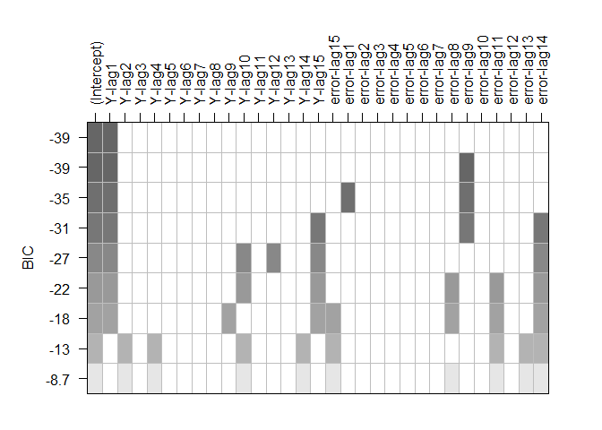
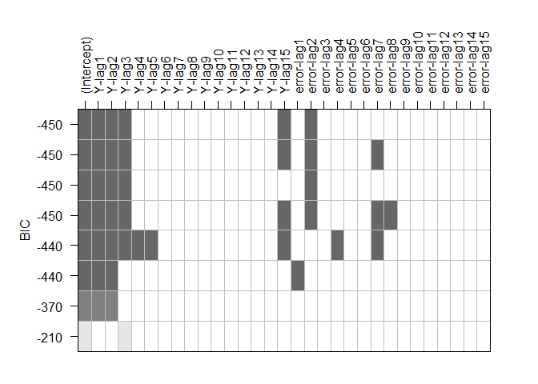
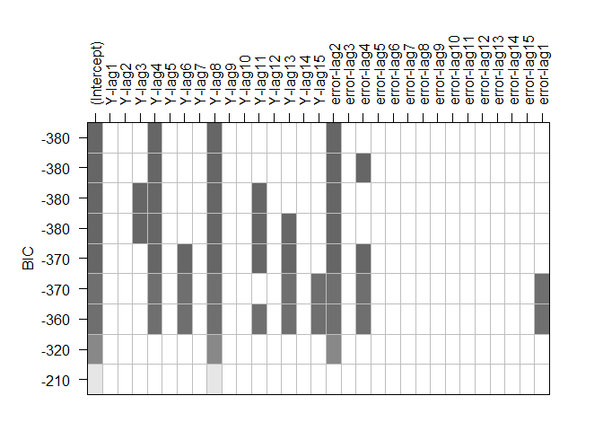

Lista de ejercicios
-------------------

1.  Suponga las siguientes series de tiempo suministradas en los
    archivos de los siguientes enlaces [Serie
    5](https://github.com/jiperezga/jiperezga.github.io/raw/master/Dataset/MySTSim5.xlsx){:target="\_blank“},
    [Serie
    6](https://github.com/jiperezga/jiperezga.github.io/raw/master/Dataset/MySTSim6.xlsx){:target=”\_blank“},
    [Serie
    7](https://github.com/jiperezga/jiperezga.github.io/raw/master/Dataset/MySTSim7.xlsx){:target=”\_blank“},
    [Serie
    8](https://github.com/jiperezga/jiperezga.github.io/raw/master/Dataset/MySTSim8.xlsx){:target=”\_blank“},
    [Serie
    9](https://github.com/jiperezga/jiperezga.github.io/raw/master/Dataset/MySTSim9.xlsx){:target=”\_blank“},
    [Serie
    10](https://github.com/jiperezga/jiperezga.github.io/raw/master/Dataset/MySTSim10.xlsx){:target=”\_blank"},
    y con cada una de ellas
    <ol type="a">
    <li>
    Identifique mediante el gráfico de la serie y su ACF las componentes
    que posee la serie de tiempo.
    </li>
    <li>
    Para las series estacionarias en media, trate de identificar los
    órdenes \(p\) y \(q\) de los procesos \(AR\), \(MA\) o \(ARMA\).
    </li>
    <li>
    Escriba el modelo teórico para cada una de las series usadas en el
    inciso b.
    </li>
    <li>
    Para las series con tendencia, aplique la primera diferencia y trate
    de identificar los órdenes \(p\) y \(q\) de los procesos \(AR\),
    \(MA\) o \(ARMA\).
    </li>
    <li>
    Escriba el modelo teórico para cada una de las series usadas en el
    inciso d. 
    </li>
    <li>
    Para las series estacionales, aplique la \(s\)-ésima diferencia, y
    trate de identificar los órdenes \(p\) y \(q\), de los procesos
    \(AR\), \(MA\) o \(ARMA\).
    </li>
    <li>
    Escriba el modelo teórico para cada una de las series usadas en el
    inciso f. 
    </li>
    </ol>
2.  A partir de las ecuaciones presentados a continuación, identifique
    el modelo y pruebe si los modelos propuestos son invertibles y/o
    estacionarios. Para todos los casos se asume que
    `$\varepsilon \sim RB(0,\sigma)$`
    <ol type="a">
    <li>
    \(Y_t = \varepsilon_t - 0.3\varepsilon_{t-1}\)
    </li>
    <li>
    \(Y_t = -0.54Y_{t-1} + \varepsilon_t\)
    </li>
    <li>
    \(Y_t = -1.79Y_{t-1} - 0.79Y_{t-2}+ \varepsilon_t\)
    </li>
    <li>
    \(Y_t = 0.31Y_{t-1} + 0.84Y_{t-2}+ \varepsilon_t + 0.51\varepsilon_{t-1}\)
    </li>
    <li>
    \(Y_t = 0.82Y_{t-1} + \varepsilon_t - 1.08\varepsilon_{t-1}\)
    </li>
    <li>
    \(Y_t = 2 - 0.51Y_{t-1} - 0.24Y_{t-2} + \varepsilon_t - 0.31\varepsilon_{t-1} + 1.49\varepsilon_{t-2}\).
    </li>
    <li>
    \(Y_t = -0.64Y_{t-2} + \varepsilon_t + 0.58\varepsilon_{t-1} + 1.20\varepsilon_{t-2}\)
    </li>
    <li>
    \(Y_t = Y_{t-1} + \varepsilon_t\)
    </li>
    <li>
    \(Y_t = 1.3Y_{t-1} + 0.3Y_{t-2} + \varepsilon_t + 2.32\varepsilon_{t-2}\)
    <li>
    \(Y_t = -2Y_{t-1} -1 Y_{t-2} + \varepsilon_t - 0.46\varepsilon_{t-1}\)
    </li>
    </li>
    </ol>
3.  Realice los gráficos teóricos ACF y PACF que deberían tener un
    proceso
    <ol type="a">
    <li>
    \(MA(1)\)
    </li>
    <li>
    \(SMA(4)[6]\)
    </li>
    <li>
    \(AR(3)\)
    </li>
    <li>
    \(SMA(2)[3]\)
    </li>
    <li>
    \(ARMA(0,3)\)
    </li>
    <li>
    \(SARMA(2,1)[3]\)
    </li>
    <li>
    \(ARMA(3,1)\)
    </li>
    </ol>
4.  A partir de las siguientes EACF, indique qué modelos creería usted
    que son plausibles para cada caso.

<!-- -->

    ################### Caso 1 ###################

    AR/MA
       0 1 2 3 4 5 6 7 8 9 10
    0  x x o x x o o o o o o 
    1  x x x x x o o o o o o 
    2  x x x o o o o o o o o 
    3  x o x o o o o o o o o 
    4  x x x o o o o o o o o 
    5  x x x o o o o o o o o 
    6  x x x x o o o o o o o 
    7  x x x x o o o o o o o 
    8  x x x x o o o o o o o 
    9  x x x o o x o o o o o 
    10 x o o x x o o o o o o 

    ################### Caso 2 ###################

    AR/MA
       0 1 2 3 4 5 6 7 8 9 10
    0  x x x o x x x x x x x 
    1  o x x o x o o o o o o 
    2  o x x x x o o o o o o 
    3  x o x x o x o o o o o 
    4  o o x x o x o o o o o 
    5  o x x x x x o o o o o 
    6  o x x x o o o o o o o 
    7  x o x x o o o x o o o 
    8  x o x x x o o x o o o 
    9  x x x x o o o x o o o 
    10 x o x x o x o x o o o 

    ################### Caso 3 ###################

    AR/MA
       0 1 2 3 4 5 6 7 8 9 10
    0  x x x x x x x o o o o 
    1  o o o o o o o o o o o 
    2  x x o o o o o o o o o 
    3  x o o o o o o o o o o 
    4  x x o o o o o o o o o 
    5  x x x o o o o o o o o 
    6  x x x o o o o o o o o 
    7  x o x o o o o o o o o 
    8  x o x o o o x o o o o 
    9  x x x x x x x o o o o 
    10 x x x o o x o o o o o 

1.  A partir de los resultados obtenidos mediante la función
    `$armasubsets()$` de la librería `TSA` del <tt>R</tt>, trate de
    identificar el modelo más plausibles para cada caso.

<!-- -->

    ################### Caso 1 ###################

    Reordering variables and trying again:

    ################### Caso 2 ###################

    ################### Caso 3 ###################

    Reordering variables and trying again:

