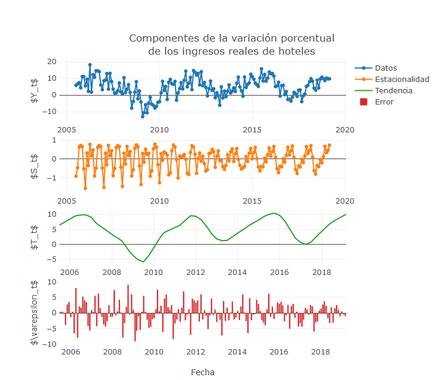
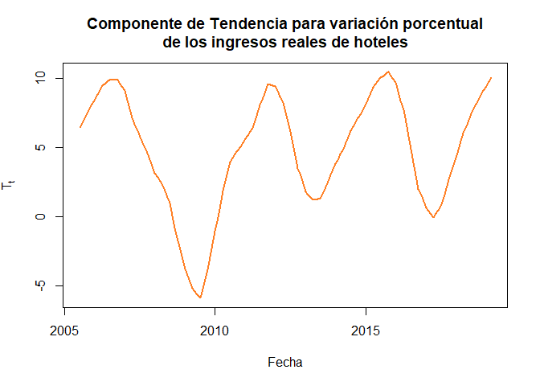
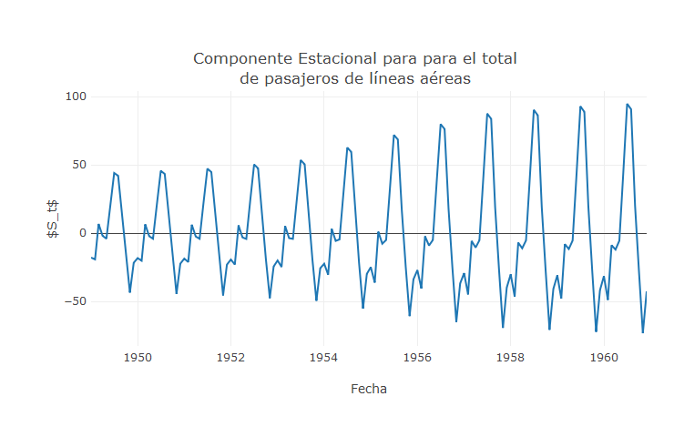

Introducción
------------

Una serie de tiempo es una secuencia de observaciones registradas y
ordenadas de forma periódica, en intervalos de tiempo igualmente
espaciados, tales como, días, meses, semestres, años, entre otros. Estas
observaciones son caracterizadas por una variable aleatoria `$Y_t$`, la
cual depende del tiempo `$t=1,2,\ldots,N$`, y donde el objetivo es
modelar el comportamiento de `$Y_t$` contra `$t$`, siendo `$N$` el
número total de observaciones que se tenga en la serie de tiempo.

Un ejemplo de una serie temporal, se presenta a continuación donde se
muestra el % anual del `$PIB$` per cápita de Colombia, para un intervalo
de tiempo anual que va desde 1961 hasta 2017

<pre>
<!--html_preserve--><div id="htmlwidget-91739f05b1db7e818068" style="width:700px;height:400px;" class="plotly html-widget"></div>
<script type="application/json" data-for="htmlwidget-91739f05b1db7e818068">{"x":{"visdat":{"78c446f7df7":["function () ","plotlyVisDat"]},"cur_data":"78c446f7df7","attrs":{"78c446f7df7":{"x":{},"y":{},"mode":"lines+markers","text":["PIB = 1.983","PIB = 2.293","PIB = 0.232","PIB = 3.034","PIB = 0.557","PIB = 2.157","PIB = 1.11","PIB = 2.925","PIB = 3.21","PIB = 3.462","PIB = 3.38","PIB = 5.181","PIB = 4.344","PIB = 3.415","PIB = 0.054","PIB = 2.386","PIB = 1.82","PIB = 6.026","PIB = 3.003","PIB = 1.744","PIB = -0.023","PIB = -1.316","PIB = -0.684","PIB = 1.093","PIB = 0.907","PIB = 3.625","PIB = 3.235","PIB = 2.009","PIB = 1.418","PIB = 2.313","PIB = 0.117","PIB = 2.167","PIB = 3.532","PIB = 4.009","PIB = 3.465","PIB = 0.428","PIB = 1.834","PIB = -0.939","PIB = -5.612","PIB = 1.435","PIB = 0.227","PIB = 1.065","PIB = 2.489","PIB = 3.923","PIB = 3.348","PIB = 5.439","PIB = 5.551","PIB = 2.045","PIB = 0.059","PIB = 3.207","PIB = 6.232","PIB = 2.851","PIB = 3.548","PIB = 3.745","PIB = 2.024","PIB = 1.073","PIB = 0.934"],"alpha_stroke":1,"sizes":[10,100],"spans":[1,20]}},"layout":{"width":700,"height":400,"margin":{"b":60,"l":60,"t":60,"r":60,"pad":4},"title":"Crecimiento del PIB per cápita (% anual)","xaxis":{"domain":[0,1],"automargin":true,"title":"Año"},"yaxis":{"domain":[0,1],"automargin":true,"title":"PIB (% anual)"},"hovermode":"closest","showlegend":false},"source":"A","config":{"showSendToCloud":false},"data":[{"x":[1961,1962,1963,1964,1965,1966,1967,1968,1969,1970,1971,1972,1973,1974,1975,1976,1977,1978,1979,1980,1981,1982,1983,1984,1985,1986,1987,1988,1989,1990,1991,1992,1993,1994,1995,1996,1997,1998,1999,2000,2001,2002,2003,2004,2005,2006,2007,2008,2009,2010,2011,2012,2013,2014,2015,2016,2017],"y":[1.983183392,2.292595551,0.231792643,3.033555246,0.557370132,2.156500316,1.110445303,2.924696885,3.209951184,3.462385145,3.379791618,5.181404836,4.344116951,3.415242062,0.054377114,2.385808489,1.819540279,6.026298262,3.003067413,1.744317806,-0.023027616,-1.316171395,-0.683991606,1.09300722,0.907423685,3.625085068,3.235271842,2.009085124,1.418335593,2.312929483,0.116795606,2.166679144,3.53222506,4.009005561,3.4647784,0.427584131,1.834165369,-0.939121717,-5.611912127,1.43545282,0.226857288,1.065060726,2.489228212,3.922772027,3.34837565,5.439446434,5.551168521,2.045206544,0.058604955,3.206963611,6.232264851,2.850694341,3.547537302,3.744554111,2.023519393,1.072527479,0.934070318],"mode":"lines+markers","text":["PIB = 1.983","PIB = 2.293","PIB = 0.232","PIB = 3.034","PIB = 0.557","PIB = 2.157","PIB = 1.11","PIB = 2.925","PIB = 3.21","PIB = 3.462","PIB = 3.38","PIB = 5.181","PIB = 4.344","PIB = 3.415","PIB = 0.054","PIB = 2.386","PIB = 1.82","PIB = 6.026","PIB = 3.003","PIB = 1.744","PIB = -0.023","PIB = -1.316","PIB = -0.684","PIB = 1.093","PIB = 0.907","PIB = 3.625","PIB = 3.235","PIB = 2.009","PIB = 1.418","PIB = 2.313","PIB = 0.117","PIB = 2.167","PIB = 3.532","PIB = 4.009","PIB = 3.465","PIB = 0.428","PIB = 1.834","PIB = -0.939","PIB = -5.612","PIB = 1.435","PIB = 0.227","PIB = 1.065","PIB = 2.489","PIB = 3.923","PIB = 3.348","PIB = 5.439","PIB = 5.551","PIB = 2.045","PIB = 0.059","PIB = 3.207","PIB = 6.232","PIB = 2.851","PIB = 3.548","PIB = 3.745","PIB = 2.024","PIB = 1.073","PIB = 0.934"],"type":"scatter","marker":{"color":"rgba(31,119,180,1)","line":{"color":"rgba(31,119,180,1)"}},"error_y":{"color":"rgba(31,119,180,1)"},"error_x":{"color":"rgba(31,119,180,1)"},"line":{"color":"rgba(31,119,180,1)"},"xaxis":"x","yaxis":"y","frame":null}],"highlight":{"on":"plotly_click","persistent":false,"dynamic":false,"selectize":false,"opacityDim":0.2,"selected":{"opacity":1},"debounce":0},"shinyEvents":["plotly_hover","plotly_click","plotly_selected","plotly_relayout","plotly_brushed","plotly_brushing","plotly_clickannotation","plotly_doubleclick","plotly_deselect","plotly_afterplot"],"base_url":"https://plot.ly"},"evals":[],"jsHooks":[]}</script><!--/html_preserve-->
</pre>

Otro ejemplo, se presenta para el material particulado `$PM_{10}$` y
`$PM_{2.5}$` en la ciudad de Medellín para el mes de abril del año 2019,
el cual se registra en intervalos de una hora

<pre style="height:610px">
<!--html_preserve--><div id="htmlwidget-3bac10284a87a1174386" style="width:700px;height:400px;" class="plotly html-widget"></div>
<script type="application/json" data-for="htmlwidget-3bac10284a87a1174386">{"x":{"data":[{"x":["2019-04-01 00:00:00","2019-04-01 01:00:00","2019-04-01 02:00:00","2019-04-01 03:00:00","2019-04-01 04:00:00","2019-04-01 05:00:00","2019-04-01 06:00:00","2019-04-01 07:00:00","2019-04-01 08:00:00","2019-04-01 09:00:00","2019-04-01 10:00:00","2019-04-01 11:00:00","2019-04-01 12:00:00","2019-04-01 13:00:00","2019-04-01 14:00:00","2019-04-01 15:00:00","2019-04-01 16:00:00","2019-04-01 17:00:00","2019-04-01 18:00:00","2019-04-01 19:00:00","2019-04-01 20:00:00","2019-04-01 21:00:00","2019-04-01 22:00:00","2019-04-01 23:00:00","2019-04-02 00:00:00","2019-04-02 01:00:00","2019-04-02 02:00:00","2019-04-02 03:00:00","2019-04-02 04:00:00","2019-04-02 05:00:00","2019-04-02 06:00:00","2019-04-02 07:00:00","2019-04-02 08:00:00","2019-04-02 09:00:00","2019-04-02 10:00:00","2019-04-02 11:00:00","2019-04-02 12:00:00","2019-04-02 13:00:00","2019-04-02 14:00:00","2019-04-02 15:00:00","2019-04-02 16:00:00","2019-04-02 17:00:00","2019-04-02 18:00:00","2019-04-02 19:00:00","2019-04-02 20:00:00","2019-04-02 21:00:00","2019-04-02 22:00:00","2019-04-02 23:00:00","2019-04-03 00:00:00","2019-04-03 01:00:00","2019-04-03 02:00:00","2019-04-03 03:00:00","2019-04-03 04:00:00","2019-04-03 05:00:00","2019-04-03 06:00:00","2019-04-03 07:00:00","2019-04-03 08:00:00","2019-04-03 09:00:00","2019-04-03 10:00:00","2019-04-03 11:00:00","2019-04-03 12:00:00","2019-04-03 13:00:00","2019-04-03 14:00:00","2019-04-03 15:00:00","2019-04-03 16:00:00","2019-04-03 17:00:00","2019-04-03 18:00:00","2019-04-03 19:00:00","2019-04-03 20:00:00","2019-04-03 21:00:00","2019-04-03 22:00:00","2019-04-03 23:00:00","2019-04-04 00:00:00","2019-04-04 01:00:00","2019-04-04 02:00:00","2019-04-04 03:00:00","2019-04-04 04:00:00","2019-04-04 05:00:00","2019-04-04 06:00:00","2019-04-04 07:00:00","2019-04-04 08:00:00","2019-04-04 09:00:00","2019-04-04 10:00:00","2019-04-04 11:00:00","2019-04-04 12:00:00","2019-04-04 13:00:00","2019-04-04 14:00:00","2019-04-04 15:00:00","2019-04-04 16:00:00","2019-04-04 17:00:00","2019-04-04 18:00:00","2019-04-04 19:00:00","2019-04-04 20:00:00","2019-04-04 21:00:00","2019-04-04 22:00:00","2019-04-04 23:00:00","2019-04-05 00:00:00","2019-04-05 01:00:00","2019-04-05 02:00:00","2019-04-05 03:00:00","2019-04-05 04:00:00","2019-04-05 05:00:00","2019-04-05 06:00:00","2019-04-05 07:00:00","2019-04-05 08:00:00","2019-04-05 09:00:00","2019-04-05 10:00:00","2019-04-05 11:00:00","2019-04-05 12:00:00","2019-04-05 13:00:00","2019-04-05 14:00:00","2019-04-05 15:00:00","2019-04-05 16:00:00","2019-04-05 17:00:00","2019-04-05 18:00:00","2019-04-05 19:00:00","2019-04-05 20:00:00","2019-04-05 21:00:00","2019-04-05 22:00:00","2019-04-05 23:00:00","2019-04-06 00:00:00","2019-04-06 01:00:00","2019-04-06 02:00:00","2019-04-06 03:00:00","2019-04-06 04:00:00","2019-04-06 05:00:00","2019-04-06 06:00:00","2019-04-06 07:00:00","2019-04-06 08:00:00","2019-04-06 09:00:00","2019-04-06 10:00:00","2019-04-06 11:00:00","2019-04-06 12:00:00","2019-04-06 13:00:00","2019-04-06 14:00:00","2019-04-06 15:00:00","2019-04-06 16:00:00","2019-04-06 17:00:00","2019-04-06 18:00:00","2019-04-06 19:00:00","2019-04-06 20:00:00","2019-04-06 21:00:00","2019-04-06 22:00:00","2019-04-06 23:00:00","2019-04-07 00:00:00","2019-04-07 01:00:00","2019-04-07 02:00:00","2019-04-07 03:00:00","2019-04-07 04:00:00","2019-04-07 05:00:00","2019-04-07 06:00:00","2019-04-07 07:00:00","2019-04-07 08:00:00","2019-04-07 09:00:00","2019-04-07 10:00:00","2019-04-07 11:00:00","2019-04-07 12:00:00","2019-04-07 13:00:00","2019-04-07 14:00:00","2019-04-07 15:00:00","2019-04-07 16:00:00","2019-04-07 17:00:00","2019-04-07 18:00:00","2019-04-07 19:00:00","2019-04-07 20:00:00","2019-04-07 21:00:00","2019-04-07 22:00:00","2019-04-07 23:00:00","2019-04-08 00:00:00","2019-04-08 01:00:00","2019-04-08 02:00:00","2019-04-08 03:00:00","2019-04-08 04:00:00","2019-04-08 05:00:00","2019-04-08 06:00:00","2019-04-08 07:00:00","2019-04-08 11:00:00","2019-04-08 12:00:00","2019-04-08 13:00:00","2019-04-08 14:00:00","2019-04-08 15:00:00","2019-04-08 16:00:00","2019-04-08 17:00:00","2019-04-08 18:00:00","2019-04-08 19:00:00","2019-04-08 20:00:00","2019-04-08 21:00:00","2019-04-08 22:00:00","2019-04-08 23:00:00","2019-04-09 00:00:00","2019-04-09 01:00:00","2019-04-09 02:00:00","2019-04-09 03:00:00","2019-04-09 04:00:00","2019-04-09 05:00:00","2019-04-09 06:00:00","2019-04-09 07:00:00","2019-04-09 12:00:00","2019-04-09 13:00:00","2019-04-09 14:00:00","2019-04-09 15:00:00","2019-04-09 16:00:00","2019-04-09 17:00:00","2019-04-09 18:00:00","2019-04-09 19:00:00","2019-04-09 20:00:00","2019-04-09 21:00:00","2019-04-09 22:00:00","2019-04-09 23:00:00","2019-04-10 00:00:00","2019-04-10 01:00:00","2019-04-10 02:00:00","2019-04-10 03:00:00","2019-04-10 04:00:00","2019-04-10 05:00:00","2019-04-10 06:00:00","2019-04-10 07:00:00","2019-04-10 08:00:00","2019-04-10 09:00:00","2019-04-10 10:00:00","2019-04-10 11:00:00","2019-04-10 12:00:00","2019-04-10 13:00:00","2019-04-10 14:00:00","2019-04-10 15:00:00","2019-04-10 16:00:00","2019-04-10 17:00:00","2019-04-10 18:00:00","2019-04-10 19:00:00","2019-04-10 20:00:00","2019-04-10 21:00:00","2019-04-10 22:00:00","2019-04-10 23:00:00","2019-04-11 00:00:00","2019-04-11 01:00:00","2019-04-11 02:00:00","2019-04-11 03:00:00","2019-04-11 04:00:00","2019-04-11 05:00:00","2019-04-11 06:00:00","2019-04-11 07:00:00","2019-04-11 08:00:00","2019-04-11 09:00:00","2019-04-11 10:00:00","2019-04-11 11:00:00","2019-04-11 14:00:00","2019-04-11 15:00:00","2019-04-11 16:00:00","2019-04-11 17:00:00","2019-04-11 18:00:00","2019-04-11 19:00:00","2019-04-11 20:00:00","2019-04-11 21:00:00","2019-04-11 22:00:00","2019-04-11 23:00:00","2019-04-12 00:00:00","2019-04-12 01:00:00","2019-04-12 02:00:00","2019-04-12 03:00:00","2019-04-12 04:00:00","2019-04-12 05:00:00","2019-04-12 06:00:00","2019-04-12 07:00:00","2019-04-12 08:00:00","2019-04-12 09:00:00","2019-04-12 10:00:00","2019-04-12 11:00:00","2019-04-12 12:00:00","2019-04-12 13:00:00","2019-04-12 14:00:00","2019-04-12 15:00:00","2019-04-12 16:00:00","2019-04-12 17:00:00","2019-04-12 18:00:00","2019-04-12 19:00:00","2019-04-12 20:00:00","2019-04-12 21:00:00","2019-04-12 22:00:00","2019-04-12 23:00:00","2019-04-13 00:00:00","2019-04-13 01:00:00","2019-04-13 02:00:00","2019-04-13 03:00:00","2019-04-13 04:00:00","2019-04-13 05:00:00","2019-04-13 06:00:00","2019-04-13 07:00:00","2019-04-13 08:00:00","2019-04-13 09:00:00","2019-04-13 10:00:00","2019-04-13 11:00:00","2019-04-13 12:00:00","2019-04-13 13:00:00","2019-04-13 14:00:00","2019-04-13 15:00:00","2019-04-13 16:00:00","2019-04-13 17:00:00","2019-04-13 18:00:00","2019-04-13 19:00:00","2019-04-13 20:00:00","2019-04-13 21:00:00","2019-04-13 22:00:00","2019-04-13 23:00:00","2019-04-14 00:00:00","2019-04-14 01:00:00","2019-04-14 02:00:00","2019-04-14 03:00:00","2019-04-14 04:00:00","2019-04-14 05:00:00","2019-04-14 06:00:00","2019-04-14 07:00:00","2019-04-14 08:00:00","2019-04-14 09:00:00","2019-04-14 10:00:00","2019-04-14 11:00:00","2019-04-14 12:00:00","2019-04-14 13:00:00","2019-04-14 14:00:00","2019-04-14 15:00:00","2019-04-14 16:00:00","2019-04-14 17:00:00","2019-04-14 18:00:00","2019-04-14 19:00:00","2019-04-14 20:00:00","2019-04-14 21:00:00","2019-04-14 22:00:00","2019-04-14 23:00:00","2019-04-15 00:00:00","2019-04-15 01:00:00","2019-04-15 02:00:00","2019-04-15 03:00:00","2019-04-15 04:00:00","2019-04-15 05:00:00","2019-04-15 06:00:00","2019-04-15 07:00:00","2019-04-15 08:00:00","2019-04-15 09:00:00","2019-04-15 10:00:00","2019-04-15 11:00:00","2019-04-15 12:00:00","2019-04-15 13:00:00","2019-04-15 14:00:00","2019-04-15 15:00:00","2019-04-15 16:00:00","2019-04-15 17:00:00","2019-04-15 18:00:00","2019-04-15 19:00:00","2019-04-15 20:00:00","2019-04-15 21:00:00","2019-04-15 22:00:00","2019-04-15 23:00:00","2019-04-16 00:00:00","2019-04-16 01:00:00","2019-04-16 02:00:00","2019-04-16 03:00:00","2019-04-16 04:00:00","2019-04-16 05:00:00","2019-04-16 06:00:00","2019-04-16 07:00:00","2019-04-16 08:00:00","2019-04-16 09:00:00","2019-04-16 10:00:00","2019-04-16 11:00:00","2019-04-16 12:00:00","2019-04-16 13:00:00","2019-04-16 14:00:00","2019-04-16 15:00:00","2019-04-16 16:00:00","2019-04-16 17:00:00","2019-04-16 18:00:00","2019-04-16 19:00:00","2019-04-16 20:00:00","2019-04-16 21:00:00","2019-04-16 22:00:00","2019-04-16 23:00:00","2019-04-17 00:00:00","2019-04-17 01:00:00","2019-04-17 02:00:00","2019-04-17 03:00:00","2019-04-17 04:00:00","2019-04-17 05:00:00","2019-04-17 06:00:00","2019-04-17 07:00:00","2019-04-17 08:00:00","2019-04-17 09:00:00","2019-04-17 10:00:00","2019-04-17 11:00:00","2019-04-17 12:00:00","2019-04-17 13:00:00","2019-04-17 14:00:00","2019-04-17 15:00:00","2019-04-17 16:00:00","2019-04-17 17:00:00","2019-04-17 18:00:00","2019-04-17 19:00:00","2019-04-17 20:00:00","2019-04-17 21:00:00","2019-04-17 22:00:00","2019-04-17 23:00:00","2019-04-18 00:00:00","2019-04-18 01:00:00","2019-04-18 02:00:00","2019-04-18 03:00:00","2019-04-18 04:00:00","2019-04-18 05:00:00","2019-04-18 06:00:00","2019-04-18 07:00:00","2019-04-18 08:00:00","2019-04-18 09:00:00","2019-04-18 10:00:00","2019-04-18 11:00:00","2019-04-18 12:00:00","2019-04-18 13:00:00","2019-04-18 14:00:00","2019-04-18 15:00:00","2019-04-18 16:00:00","2019-04-18 17:00:00","2019-04-18 18:00:00","2019-04-18 19:00:00","2019-04-18 20:00:00","2019-04-18 21:00:00","2019-04-18 22:00:00","2019-04-18 23:00:00","2019-04-19 00:00:00","2019-04-19 01:00:00","2019-04-19 02:00:00","2019-04-19 03:00:00","2019-04-19 04:00:00","2019-04-19 05:00:00","2019-04-19 06:00:00","2019-04-19 07:00:00","2019-04-19 08:00:00","2019-04-19 09:00:00","2019-04-19 10:00:00","2019-04-19 11:00:00","2019-04-19 12:00:00","2019-04-19 13:00:00","2019-04-19 14:00:00","2019-04-19 15:00:00","2019-04-19 16:00:00","2019-04-19 17:00:00","2019-04-19 18:00:00","2019-04-19 19:00:00","2019-04-19 20:00:00","2019-04-19 21:00:00","2019-04-19 22:00:00","2019-04-19 23:00:00","2019-04-20 00:00:00","2019-04-20 01:00:00","2019-04-20 02:00:00","2019-04-20 03:00:00","2019-04-20 04:00:00","2019-04-20 05:00:00","2019-04-20 06:00:00","2019-04-20 07:00:00","2019-04-20 08:00:00","2019-04-20 09:00:00","2019-04-20 10:00:00","2019-04-20 11:00:00","2019-04-20 12:00:00","2019-04-20 13:00:00","2019-04-20 14:00:00","2019-04-20 15:00:00","2019-04-20 16:00:00","2019-04-20 17:00:00","2019-04-20 18:00:00","2019-04-20 19:00:00","2019-04-20 20:00:00","2019-04-20 21:00:00","2019-04-20 22:00:00","2019-04-20 23:00:00","2019-04-21 00:00:00","2019-04-21 01:00:00","2019-04-21 02:00:00","2019-04-21 03:00:00","2019-04-21 04:00:00","2019-04-21 05:00:00","2019-04-21 06:00:00","2019-04-21 07:00:00","2019-04-21 08:00:00","2019-04-21 09:00:00","2019-04-21 10:00:00","2019-04-21 11:00:00","2019-04-21 12:00:00","2019-04-21 13:00:00","2019-04-21 14:00:00","2019-04-21 15:00:00","2019-04-21 16:00:00","2019-04-21 17:00:00","2019-04-21 18:00:00","2019-04-21 19:00:00","2019-04-21 20:00:00","2019-04-21 21:00:00","2019-04-21 22:00:00","2019-04-21 23:00:00","2019-04-22 00:00:00","2019-04-22 01:00:00","2019-04-22 02:00:00","2019-04-22 03:00:00","2019-04-22 04:00:00","2019-04-22 05:00:00","2019-04-22 06:00:00","2019-04-22 07:00:00","2019-04-22 08:00:00","2019-04-22 09:00:00","2019-04-22 10:00:00","2019-04-22 11:00:00","2019-04-22 12:00:00","2019-04-22 13:00:00","2019-04-22 15:00:00","2019-04-22 16:00:00","2019-04-22 17:00:00","2019-04-22 18:00:00","2019-04-22 19:00:00","2019-04-22 20:00:00","2019-04-22 21:00:00","2019-04-22 22:00:00","2019-04-22 23:00:00","2019-04-23 00:00:00","2019-04-23 01:00:00","2019-04-23 02:00:00","2019-04-23 03:00:00","2019-04-23 04:00:00","2019-04-23 05:00:00","2019-04-23 06:00:00","2019-04-23 07:00:00","2019-04-23 08:00:00","2019-04-23 09:00:00","2019-04-23 10:00:00","2019-04-23 11:00:00","2019-04-23 12:00:00","2019-04-23 13:00:00","2019-04-23 14:00:00","2019-04-23 15:00:00","2019-04-23 16:00:00","2019-04-23 17:00:00","2019-04-23 18:00:00","2019-04-23 19:00:00","2019-04-23 20:00:00","2019-04-23 21:00:00","2019-04-23 22:00:00","2019-04-23 23:00:00","2019-04-24 00:00:00","2019-04-24 01:00:00","2019-04-24 02:00:00","2019-04-24 03:00:00","2019-04-24 04:00:00","2019-04-24 05:00:00","2019-04-24 06:00:00","2019-04-24 07:00:00","2019-04-24 08:00:00","2019-04-24 09:00:00","2019-04-24 10:00:00","2019-04-24 11:00:00","2019-04-24 12:00:00","2019-04-24 13:00:00","2019-04-24 14:00:00","2019-04-24 15:00:00","2019-04-24 16:00:00","2019-04-24 17:00:00","2019-04-24 18:00:00","2019-04-24 19:00:00","2019-04-24 20:00:00","2019-04-24 21:00:00","2019-04-24 22:00:00","2019-04-24 23:00:00","2019-04-25 00:00:00","2019-04-25 01:00:00","2019-04-25 02:00:00","2019-04-25 03:00:00","2019-04-25 04:00:00","2019-04-25 05:00:00","2019-04-25 06:00:00","2019-04-25 07:00:00","2019-04-25 08:00:00","2019-04-25 09:00:00","2019-04-25 10:00:00","2019-04-25 11:00:00","2019-04-25 12:00:00","2019-04-25 13:00:00","2019-04-25 14:00:00","2019-04-25 15:00:00","2019-04-25 16:00:00","2019-04-25 17:00:00","2019-04-25 18:00:00","2019-04-25 19:00:00","2019-04-25 20:00:00","2019-04-25 21:00:00","2019-04-25 22:00:00","2019-04-25 23:00:00","2019-04-26 00:00:00","2019-04-26 01:00:00","2019-04-26 02:00:00","2019-04-26 03:00:00","2019-04-26 04:00:00","2019-04-26 05:00:00","2019-04-26 06:00:00","2019-04-26 07:00:00","2019-04-26 08:00:00","2019-04-26 09:00:00","2019-04-26 10:00:00","2019-04-26 11:00:00","2019-04-26 12:00:00","2019-04-26 13:00:00","2019-04-26 14:00:00","2019-04-26 15:00:00","2019-04-26 16:00:00","2019-04-26 17:00:00","2019-04-26 18:00:00","2019-04-26 19:00:00","2019-04-26 20:00:00","2019-04-26 21:00:00","2019-04-26 22:00:00","2019-04-26 23:00:00","2019-04-27 00:00:00","2019-04-27 01:00:00","2019-04-27 02:00:00","2019-04-27 03:00:00","2019-04-27 04:00:00","2019-04-27 05:00:00","2019-04-27 06:00:00","2019-04-27 07:00:00","2019-04-27 08:00:00","2019-04-27 09:00:00","2019-04-27 10:00:00","2019-04-27 11:00:00","2019-04-27 12:00:00","2019-04-27 13:00:00","2019-04-27 14:00:00","2019-04-27 15:00:00","2019-04-27 16:00:00","2019-04-27 17:00:00","2019-04-27 18:00:00","2019-04-27 19:00:00","2019-04-27 20:00:00","2019-04-27 21:00:00","2019-04-27 22:00:00","2019-04-27 23:00:00","2019-04-28 00:00:00","2019-04-28 01:00:00","2019-04-28 02:00:00","2019-04-28 03:00:00","2019-04-28 04:00:00","2019-04-28 05:00:00","2019-04-28 06:00:00","2019-04-28 07:00:00","2019-04-28 08:00:00","2019-04-28 09:00:00","2019-04-28 10:00:00","2019-04-28 11:00:00","2019-04-28 12:00:00","2019-04-28 13:00:00","2019-04-28 14:00:00","2019-04-28 15:00:00","2019-04-28 16:00:00","2019-04-28 17:00:00","2019-04-28 18:00:00","2019-04-28 19:00:00","2019-04-28 20:00:00","2019-04-28 21:00:00","2019-04-28 22:00:00","2019-04-28 23:00:00","2019-04-29 00:00:00","2019-04-29 01:00:00","2019-04-29 02:00:00","2019-04-29 03:00:00","2019-04-29 04:00:00","2019-04-29 05:00:00","2019-04-29 06:00:00","2019-04-29 07:00:00","2019-04-29 08:00:00","2019-04-29 09:00:00","2019-04-29 10:00:00","2019-04-29 12:00:00","2019-04-29 13:00:00","2019-04-29 14:00:00","2019-04-29 15:00:00","2019-04-29 16:00:00","2019-04-29 17:00:00","2019-04-29 18:00:00","2019-04-29 19:00:00","2019-04-29 20:00:00","2019-04-29 21:00:00","2019-04-29 22:00:00","2019-04-29 23:00:00","2019-04-30 00:00:00","2019-04-30 01:00:00","2019-04-30 02:00:00","2019-04-30 03:00:00","2019-04-30 04:00:00","2019-04-30 05:00:00","2019-04-30 06:00:00","2019-04-30 07:00:00","2019-04-30 09:00:00","2019-04-30 10:00:00","2019-04-30 11:00:00","2019-04-30 12:00:00","2019-04-30 13:00:00","2019-04-30 14:00:00","2019-04-30 15:00:00","2019-04-30 16:00:00","2019-04-30 17:00:00","2019-04-30 18:00:00","2019-04-30 19:00:00","2019-04-30 20:00:00","2019-04-30 21:00:00","2019-04-30 22:00:00","2019-04-30 23:00:00"],"y":[24,21,27,5,6,11,10,6,6,18,27,27,14,15,17,12,18,17,15,20,11,8,17,18,16,18,14,17,13,10,9,5,4,16,4,5,6,32,11,8,6,7,10,15,15,16,15,10,10,20,9,18,8,18,27,18,19,38,38,26,31,20,12,19,15,15,13,9,8,12,12,10,17,14,18,16,21,15,18,18,17,25,15,19,23,14,9,6,5,6,9,15,16,11,15,11,14,8,3,3,17,16,14,22,30,29,34,27,33,26,26,24,17,15,20,21,21,18,11,10,16,7,11,13,16,14,21,31,33,30,19,15,14,17,16,14,7,3,6,11,13,16,18,19,19,19,25,22,25,24,32,28,39,41,34,32,30,29,30,25,17,21,23,23,30,36,33,31,30,26,16,16,18,24,28,31,35,29,32,32,40,29,35,32,24,25,30,34,35,32,32,36,23,29,24,31,36,35,35,27,20,20,30,25,35,24,26,19,26,24,22,27,23,26,24,25,40,38,29,24,18,18,27,16,10,22,31,24,24,16,27,18,13,9,7,4,4,4,6,6,7,16,31,36,26,10,14,15,16,13,15,13,14,11,16,23,17,20,22,21,28,13,29,35,30,26,26,22,12,11,16,15,18,17,22,18,20,19,31,24,24,19,17,20,26,31,36,28,35,33,30,23,20,21,19,19,16,15,18,22,24,19,16,30,15,16,11,15,17,23,21,20,15,16,20,18,14,12,15,16,17,19,17,14,12,10,12,7,3,4,4,5,7,11,11,12,24,18,12,13,11,12,16,11,18,11,16,16,16,25,20,22,14,22,20,16,19,20,21,23,18,22,22,16,19,18,19,13,22,28,25,17,15,17,16,16,21,21,21,10,16,21,26,26,32,16,12,16,15,10,11,24,27,23,31,37,38,33,31,12,6,1,5,7,10,7,4,5,7,9,7,5,7,6,2,3,6,6,8,5,9,6,3,2,3,3,3,4,6,7,10,11,15,12,10,6,5,6,6,9,10,5,3,8,10,12,13,15,20,11,8,9,6,9,15,10,23,26,19,12,9,15,9,9,6,7,11,7,9,6,9,19,14,7,7,6,3,12,18,17,21,8,7,8,10,8,8,17,14,13,23,13,14,20,14,18,10,11,10,10,11,12,17,18,24,11,8,8,13,3,2,6,6,8,7,10,8,5,4,5,6,6,5,5,9,6,10,7,5,3,3,3,2,-1,4,4,8,9,9,16,14,15,16,11,8,16,13,17,13,21,29,27,22,16,8,7,9,8,8,14,18,9,6,8,22,17,10,9,7,7,9,13,13,21,26,19,14,23,18,16,21,22,20,24,36,16,21,20,20,17,17,16,10,9,12,11,11,7,16,17,25,8,26,27,31,24,13,10,11,10,9,17,17,6,25,13,10,15,10,17,17,16,24,30,16,18,15,9,9,8,6,4,8,8,6,4,7,8,6,12,8,11,8,4,6,12,16,18,14,7,3,6,6,6,4,5,5,4,6,6,5,9,6,7,5,2,4,2,7,16,16,23,17,12,12,9,9,24,15,17,17,17,14,10,9,17,12,13,18,29,15,29,26,28,13,8,6,6,3,7,8,12,10,13,22,25,25,18],"mode":"lines+markers","text":["PM2.5 = 24","PM2.5 = 21","PM2.5 = 27","PM2.5 = 5","PM2.5 = 6","PM2.5 = 11","PM2.5 = 10","PM2.5 = 6","PM2.5 = 6","PM2.5 = 18","PM2.5 = 27","PM2.5 = 27","PM2.5 = 14","PM2.5 = 15","PM2.5 = 17","PM2.5 = 12","PM2.5 = 18","PM2.5 = 17","PM2.5 = 15","PM2.5 = 20","PM2.5 = 11","PM2.5 = 8","PM2.5 = 17","PM2.5 = 18","PM2.5 = 16","PM2.5 = 18","PM2.5 = 14","PM2.5 = 17","PM2.5 = 13","PM2.5 = 10","PM2.5 = 9","PM2.5 = 5","PM2.5 = 4","PM2.5 = 16","PM2.5 = 4","PM2.5 = 5","PM2.5 = 6","PM2.5 = 32","PM2.5 = 11","PM2.5 = 8","PM2.5 = 6","PM2.5 = 7","PM2.5 = 10","PM2.5 = 15","PM2.5 = 15","PM2.5 = 16","PM2.5 = 15","PM2.5 = 10","PM2.5 = 10","PM2.5 = 20","PM2.5 = 9","PM2.5 = 18","PM2.5 = 8","PM2.5 = 18","PM2.5 = 27","PM2.5 = 18","PM2.5 = 19","PM2.5 = 38","PM2.5 = 38","PM2.5 = 26","PM2.5 = 31","PM2.5 = 20","PM2.5 = 12","PM2.5 = 19","PM2.5 = 15","PM2.5 = 15","PM2.5 = 13","PM2.5 = 9","PM2.5 = 8","PM2.5 = 12","PM2.5 = 12","PM2.5 = 10","PM2.5 = 17","PM2.5 = 14","PM2.5 = 18","PM2.5 = 16","PM2.5 = 21","PM2.5 = 15","PM2.5 = 18","PM2.5 = 18","PM2.5 = 17","PM2.5 = 25","PM2.5 = 15","PM2.5 = 19","PM2.5 = 23","PM2.5 = 14","PM2.5 = 9","PM2.5 = 6","PM2.5 = 5","PM2.5 = 6","PM2.5 = 9","PM2.5 = 15","PM2.5 = 16","PM2.5 = 11","PM2.5 = 15","PM2.5 = 11","PM2.5 = 14","PM2.5 = 8","PM2.5 = 3","PM2.5 = 3","PM2.5 = 17","PM2.5 = 16","PM2.5 = 14","PM2.5 = 22","PM2.5 = 30","PM2.5 = 29","PM2.5 = 34","PM2.5 = 27","PM2.5 = 33","PM2.5 = 26","PM2.5 = 26","PM2.5 = 24","PM2.5 = 17","PM2.5 = 15","PM2.5 = 20","PM2.5 = 21","PM2.5 = 21","PM2.5 = 18","PM2.5 = 11","PM2.5 = 10","PM2.5 = 16","PM2.5 = 7","PM2.5 = 11","PM2.5 = 13","PM2.5 = 16","PM2.5 = 14","PM2.5 = 21","PM2.5 = 31","PM2.5 = 33","PM2.5 = 30","PM2.5 = 19","PM2.5 = 15","PM2.5 = 14","PM2.5 = 17","PM2.5 = 16","PM2.5 = 14","PM2.5 = 7","PM2.5 = 3","PM2.5 = 6","PM2.5 = 11","PM2.5 = 13","PM2.5 = 16","PM2.5 = 18","PM2.5 = 19","PM2.5 = 19","PM2.5 = 19","PM2.5 = 25","PM2.5 = 22","PM2.5 = 25","PM2.5 = 24","PM2.5 = 32","PM2.5 = 28","PM2.5 = 39","PM2.5 = 41","PM2.5 = 34","PM2.5 = 32","PM2.5 = 30","PM2.5 = 29","PM2.5 = 30","PM2.5 = 25","PM2.5 = 17","PM2.5 = 21","PM2.5 = 23","PM2.5 = 23","PM2.5 = 30","PM2.5 = 36","PM2.5 = 33","PM2.5 = 31","PM2.5 = 30","PM2.5 = 26","PM2.5 = 16","PM2.5 = 16","PM2.5 = 18","PM2.5 = 24","PM2.5 = 28","PM2.5 = 31","PM2.5 = 35","PM2.5 = 29","PM2.5 = 32","PM2.5 = 32","PM2.5 = 40","PM2.5 = 29","PM2.5 = 35","PM2.5 = 32","PM2.5 = 24","PM2.5 = 25","PM2.5 = 30","PM2.5 = 34","PM2.5 = 35","PM2.5 = 32","PM2.5 = 32","PM2.5 = 36","PM2.5 = 23","PM2.5 = 29","PM2.5 = 24","PM2.5 = 31","PM2.5 = 36","PM2.5 = 35","PM2.5 = 35","PM2.5 = 27","PM2.5 = 20","PM2.5 = 20","PM2.5 = 30","PM2.5 = 25","PM2.5 = 35","PM2.5 = 24","PM2.5 = 26","PM2.5 = 19","PM2.5 = 26","PM2.5 = 24","PM2.5 = 22","PM2.5 = 27","PM2.5 = 23","PM2.5 = 26","PM2.5 = 24","PM2.5 = 25","PM2.5 = 40","PM2.5 = 38","PM2.5 = 29","PM2.5 = 24","PM2.5 = 18","PM2.5 = 18","PM2.5 = 27","PM2.5 = 16","PM2.5 = 10","PM2.5 = 22","PM2.5 = 31","PM2.5 = 24","PM2.5 = 24","PM2.5 = 16","PM2.5 = 27","PM2.5 = 18","PM2.5 = 13","PM2.5 = 9","PM2.5 = 7","PM2.5 = 4","PM2.5 = 4","PM2.5 = 4","PM2.5 = 6","PM2.5 = 6","PM2.5 = 7","PM2.5 = 16","PM2.5 = 31","PM2.5 = 36","PM2.5 = 26","PM2.5 = 10","PM2.5 = 14","PM2.5 = 15","PM2.5 = 16","PM2.5 = 13","PM2.5 = 15","PM2.5 = 13","PM2.5 = 14","PM2.5 = 11","PM2.5 = 16","PM2.5 = 23","PM2.5 = 17","PM2.5 = 20","PM2.5 = 22","PM2.5 = 21","PM2.5 = 28","PM2.5 = 13","PM2.5 = 29","PM2.5 = 35","PM2.5 = 30","PM2.5 = 26","PM2.5 = 26","PM2.5 = 22","PM2.5 = 12","PM2.5 = 11","PM2.5 = 16","PM2.5 = 15","PM2.5 = 18","PM2.5 = 17","PM2.5 = 22","PM2.5 = 18","PM2.5 = 20","PM2.5 = 19","PM2.5 = 31","PM2.5 = 24","PM2.5 = 24","PM2.5 = 19","PM2.5 = 17","PM2.5 = 20","PM2.5 = 26","PM2.5 = 31","PM2.5 = 36","PM2.5 = 28","PM2.5 = 35","PM2.5 = 33","PM2.5 = 30","PM2.5 = 23","PM2.5 = 20","PM2.5 = 21","PM2.5 = 19","PM2.5 = 19","PM2.5 = 16","PM2.5 = 15","PM2.5 = 18","PM2.5 = 22","PM2.5 = 24","PM2.5 = 19","PM2.5 = 16","PM2.5 = 30","PM2.5 = 15","PM2.5 = 16","PM2.5 = 11","PM2.5 = 15","PM2.5 = 17","PM2.5 = 23","PM2.5 = 21","PM2.5 = 20","PM2.5 = 15","PM2.5 = 16","PM2.5 = 20","PM2.5 = 18","PM2.5 = 14","PM2.5 = 12","PM2.5 = 15","PM2.5 = 16","PM2.5 = 17","PM2.5 = 19","PM2.5 = 17","PM2.5 = 14","PM2.5 = 12","PM2.5 = 10","PM2.5 = 12","PM2.5 = 7","PM2.5 = 3","PM2.5 = 4","PM2.5 = 4","PM2.5 = 5","PM2.5 = 7","PM2.5 = 11","PM2.5 = 11","PM2.5 = 12","PM2.5 = 24","PM2.5 = 18","PM2.5 = 12","PM2.5 = 13","PM2.5 = 11","PM2.5 = 12","PM2.5 = 16","PM2.5 = 11","PM2.5 = 18","PM2.5 = 11","PM2.5 = 16","PM2.5 = 16","PM2.5 = 16","PM2.5 = 25","PM2.5 = 20","PM2.5 = 22","PM2.5 = 14","PM2.5 = 22","PM2.5 = 20","PM2.5 = 16","PM2.5 = 19","PM2.5 = 20","PM2.5 = 21","PM2.5 = 23","PM2.5 = 18","PM2.5 = 22","PM2.5 = 22","PM2.5 = 16","PM2.5 = 19","PM2.5 = 18","PM2.5 = 19","PM2.5 = 13","PM2.5 = 22","PM2.5 = 28","PM2.5 = 25","PM2.5 = 17","PM2.5 = 15","PM2.5 = 17","PM2.5 = 16","PM2.5 = 16","PM2.5 = 21","PM2.5 = 21","PM2.5 = 21","PM2.5 = 10","PM2.5 = 16","PM2.5 = 21","PM2.5 = 26","PM2.5 = 26","PM2.5 = 32","PM2.5 = 16","PM2.5 = 12","PM2.5 = 16","PM2.5 = 15","PM2.5 = 10","PM2.5 = 11","PM2.5 = 24","PM2.5 = 27","PM2.5 = 23","PM2.5 = 31","PM2.5 = 37","PM2.5 = 38","PM2.5 = 33","PM2.5 = 31","PM2.5 = 12","PM2.5 = 6","PM2.5 = 1","PM2.5 = 5","PM2.5 = 7","PM2.5 = 10","PM2.5 = 7","PM2.5 = 4","PM2.5 = 5","PM2.5 = 7","PM2.5 = 9","PM2.5 = 7","PM2.5 = 5","PM2.5 = 7","PM2.5 = 6","PM2.5 = 2","PM2.5 = 3","PM2.5 = 6","PM2.5 = 6","PM2.5 = 8","PM2.5 = 5","PM2.5 = 9","PM2.5 = 6","PM2.5 = 3","PM2.5 = 2","PM2.5 = 3","PM2.5 = 3","PM2.5 = 3","PM2.5 = 4","PM2.5 = 6","PM2.5 = 7","PM2.5 = 10","PM2.5 = 11","PM2.5 = 15","PM2.5 = 12","PM2.5 = 10","PM2.5 = 6","PM2.5 = 5","PM2.5 = 6","PM2.5 = 6","PM2.5 = 9","PM2.5 = 10","PM2.5 = 5","PM2.5 = 3","PM2.5 = 8","PM2.5 = 10","PM2.5 = 12","PM2.5 = 13","PM2.5 = 15","PM2.5 = 20","PM2.5 = 11","PM2.5 = 8","PM2.5 = 9","PM2.5 = 6","PM2.5 = 9","PM2.5 = 15","PM2.5 = 10","PM2.5 = 23","PM2.5 = 26","PM2.5 = 19","PM2.5 = 12","PM2.5 = 9","PM2.5 = 15","PM2.5 = 9","PM2.5 = 9","PM2.5 = 6","PM2.5 = 7","PM2.5 = 11","PM2.5 = 7","PM2.5 = 9","PM2.5 = 6","PM2.5 = 9","PM2.5 = 19","PM2.5 = 14","PM2.5 = 7","PM2.5 = 7","PM2.5 = 6","PM2.5 = 3","PM2.5 = 12","PM2.5 = 18","PM2.5 = 17","PM2.5 = 21","PM2.5 = 8","PM2.5 = 7","PM2.5 = 8","PM2.5 = 10","PM2.5 = 8","PM2.5 = 8","PM2.5 = 17","PM2.5 = 14","PM2.5 = 13","PM2.5 = 23","PM2.5 = 13","PM2.5 = 14","PM2.5 = 20","PM2.5 = 14","PM2.5 = 18","PM2.5 = 10","PM2.5 = 11","PM2.5 = 10","PM2.5 = 10","PM2.5 = 11","PM2.5 = 12","PM2.5 = 17","PM2.5 = 18","PM2.5 = 24","PM2.5 = 11","PM2.5 = 8","PM2.5 = 8","PM2.5 = 13","PM2.5 = 3","PM2.5 = 2","PM2.5 = 6","PM2.5 = 6","PM2.5 = 8","PM2.5 = 7","PM2.5 = 10","PM2.5 = 8","PM2.5 = 5","PM2.5 = 4","PM2.5 = 5","PM2.5 = 6","PM2.5 = 6","PM2.5 = 5","PM2.5 = 5","PM2.5 = 9","PM2.5 = 6","PM2.5 = 10","PM2.5 = 7","PM2.5 = 5","PM2.5 = 3","PM2.5 = 3","PM2.5 = 3","PM2.5 = 2","PM2.5 = -1","PM2.5 = 4","PM2.5 = 4","PM2.5 = 8","PM2.5 = 9","PM2.5 = 9","PM2.5 = 16","PM2.5 = 14","PM2.5 = 15","PM2.5 = 16","PM2.5 = 11","PM2.5 = 8","PM2.5 = 16","PM2.5 = 13","PM2.5 = 17","PM2.5 = 13","PM2.5 = 21","PM2.5 = 29","PM2.5 = 27","PM2.5 = 22","PM2.5 = 16","PM2.5 = 8","PM2.5 = 7","PM2.5 = 9","PM2.5 = 8","PM2.5 = 8","PM2.5 = 14","PM2.5 = 18","PM2.5 = 9","PM2.5 = 6","PM2.5 = 8","PM2.5 = 22","PM2.5 = 17","PM2.5 = 10","PM2.5 = 9","PM2.5 = 7","PM2.5 = 7","PM2.5 = 9","PM2.5 = 13","PM2.5 = 13","PM2.5 = 21","PM2.5 = 26","PM2.5 = 19","PM2.5 = 14","PM2.5 = 23","PM2.5 = 18","PM2.5 = 16","PM2.5 = 21","PM2.5 = 22","PM2.5 = 20","PM2.5 = 24","PM2.5 = 36","PM2.5 = 16","PM2.5 = 21","PM2.5 = 20","PM2.5 = 20","PM2.5 = 17","PM2.5 = 17","PM2.5 = 16","PM2.5 = 10","PM2.5 = 9","PM2.5 = 12","PM2.5 = 11","PM2.5 = 11","PM2.5 = 7","PM2.5 = 16","PM2.5 = 17","PM2.5 = 25","PM2.5 = 8","PM2.5 = 26","PM2.5 = 27","PM2.5 = 31","PM2.5 = 24","PM2.5 = 13","PM2.5 = 10","PM2.5 = 11","PM2.5 = 10","PM2.5 = 9","PM2.5 = 17","PM2.5 = 17","PM2.5 = 6","PM2.5 = 25","PM2.5 = 13","PM2.5 = 10","PM2.5 = 15","PM2.5 = 10","PM2.5 = 17","PM2.5 = 17","PM2.5 = 16","PM2.5 = 24","PM2.5 = 30","PM2.5 = 16","PM2.5 = 18","PM2.5 = 15","PM2.5 = 9","PM2.5 = 9","PM2.5 = 8","PM2.5 = 6","PM2.5 = 4","PM2.5 = 8","PM2.5 = 8","PM2.5 = 6","PM2.5 = 4","PM2.5 = 7","PM2.5 = 8","PM2.5 = 6","PM2.5 = 12","PM2.5 = 8","PM2.5 = 11","PM2.5 = 8","PM2.5 = 4","PM2.5 = 6","PM2.5 = 12","PM2.5 = 16","PM2.5 = 18","PM2.5 = 14","PM2.5 = 7","PM2.5 = 3","PM2.5 = 6","PM2.5 = 6","PM2.5 = 6","PM2.5 = 4","PM2.5 = 5","PM2.5 = 5","PM2.5 = 4","PM2.5 = 6","PM2.5 = 6","PM2.5 = 5","PM2.5 = 9","PM2.5 = 6","PM2.5 = 7","PM2.5 = 5","PM2.5 = 2","PM2.5 = 4","PM2.5 = 2","PM2.5 = 7","PM2.5 = 16","PM2.5 = 16","PM2.5 = 23","PM2.5 = 17","PM2.5 = 12","PM2.5 = 12","PM2.5 = 9","PM2.5 = 9","PM2.5 = 24","PM2.5 = 15","PM2.5 = 17","PM2.5 = 17","PM2.5 = 17","PM2.5 = 14","PM2.5 = 10","PM2.5 = 9","PM2.5 = 17","PM2.5 = 12","PM2.5 = 13","PM2.5 = 18","PM2.5 = 29","PM2.5 = 15","PM2.5 = 29","PM2.5 = 26","PM2.5 = 28","PM2.5 = 13","PM2.5 = 8","PM2.5 = 6","PM2.5 = 6","PM2.5 = 3","PM2.5 = 7","PM2.5 = 8","PM2.5 = 12","PM2.5 = 10","PM2.5 = 13","PM2.5 = 22","PM2.5 = 25","PM2.5 = 25","PM2.5 = 18"],"name":"PM2.5","type":"scatter","marker":{"color":"rgba(31,119,180,1)","line":{"color":"rgba(31,119,180,1)"}},"error_y":{"color":"rgba(31,119,180,1)"},"error_x":{"color":"rgba(31,119,180,1)"},"line":{"color":"rgba(31,119,180,1)"},"xaxis":"x","yaxis":"y","frame":null},{"x":["2019-04-01 00:00:00","2019-04-01 01:00:00","2019-04-01 02:00:00","2019-04-01 03:00:00","2019-04-01 04:00:00","2019-04-01 05:00:00","2019-04-01 06:00:00","2019-04-01 07:00:00","2019-04-01 08:00:00","2019-04-01 09:00:00","2019-04-01 10:00:00","2019-04-01 11:00:00","2019-04-01 12:00:00","2019-04-01 13:00:00","2019-04-01 14:00:00","2019-04-01 15:00:00","2019-04-01 16:00:00","2019-04-01 17:00:00","2019-04-01 18:00:00","2019-04-01 19:00:00","2019-04-01 20:00:00","2019-04-01 21:00:00","2019-04-01 22:00:00","2019-04-01 23:00:00","2019-04-02 00:00:00","2019-04-02 01:00:00","2019-04-02 02:00:00","2019-04-02 03:00:00","2019-04-02 04:00:00","2019-04-02 05:00:00","2019-04-02 06:00:00","2019-04-02 07:00:00","2019-04-02 08:00:00","2019-04-02 09:00:00","2019-04-02 10:00:00","2019-04-02 11:00:00","2019-04-02 12:00:00","2019-04-02 14:00:00","2019-04-02 15:00:00","2019-04-02 17:00:00","2019-04-02 18:00:00","2019-04-02 19:00:00","2019-04-02 20:00:00","2019-04-02 21:00:00","2019-04-02 22:00:00","2019-04-02 23:00:00","2019-04-03 00:00:00","2019-04-03 01:00:00","2019-04-03 02:00:00","2019-04-03 03:00:00","2019-04-03 04:00:00","2019-04-03 05:00:00","2019-04-03 06:00:00","2019-04-03 07:00:00","2019-04-03 08:00:00","2019-04-03 10:00:00","2019-04-03 11:00:00","2019-04-03 12:00:00","2019-04-03 13:00:00","2019-04-03 16:00:00","2019-04-03 17:00:00","2019-04-03 18:00:00","2019-04-03 19:00:00","2019-04-03 20:00:00","2019-04-03 21:00:00","2019-04-03 22:00:00","2019-04-03 23:00:00","2019-04-04 00:00:00","2019-04-04 01:00:00","2019-04-04 02:00:00","2019-04-04 03:00:00","2019-04-04 04:00:00","2019-04-04 05:00:00","2019-04-04 06:00:00","2019-04-04 07:00:00","2019-04-04 08:00:00","2019-04-04 09:00:00","2019-04-04 10:00:00","2019-04-04 11:00:00","2019-04-04 12:00:00","2019-04-04 13:00:00","2019-04-04 14:00:00","2019-04-04 15:00:00","2019-04-04 16:00:00","2019-04-04 17:00:00","2019-04-04 18:00:00","2019-04-04 19:00:00","2019-04-04 20:00:00","2019-04-04 21:00:00","2019-04-04 22:00:00","2019-04-04 23:00:00","2019-04-05 00:00:00","2019-04-05 01:00:00","2019-04-05 02:00:00","2019-04-05 03:00:00","2019-04-05 04:00:00","2019-04-05 05:00:00","2019-04-05 06:00:00","2019-04-05 07:00:00","2019-04-05 08:00:00","2019-04-05 09:00:00","2019-04-05 10:00:00","2019-04-05 11:00:00","2019-04-05 12:00:00","2019-04-05 13:00:00","2019-04-05 14:00:00","2019-04-05 15:00:00","2019-04-05 16:00:00","2019-04-05 17:00:00","2019-04-05 18:00:00","2019-04-05 19:00:00","2019-04-05 20:00:00","2019-04-05 21:00:00","2019-04-05 22:00:00","2019-04-05 23:00:00","2019-04-06 00:00:00","2019-04-06 01:00:00","2019-04-06 02:00:00","2019-04-06 03:00:00","2019-04-06 04:00:00","2019-04-06 05:00:00","2019-04-06 06:00:00","2019-04-06 07:00:00","2019-04-06 08:00:00","2019-04-06 09:00:00","2019-04-06 10:00:00","2019-04-06 11:00:00","2019-04-06 12:00:00","2019-04-06 13:00:00","2019-04-06 14:00:00","2019-04-06 15:00:00","2019-04-06 16:00:00","2019-04-06 17:00:00","2019-04-06 18:00:00","2019-04-06 19:00:00","2019-04-06 20:00:00","2019-04-06 21:00:00","2019-04-06 22:00:00","2019-04-06 23:00:00","2019-04-07 00:00:00","2019-04-07 01:00:00","2019-04-07 02:00:00","2019-04-07 03:00:00","2019-04-07 04:00:00","2019-04-07 05:00:00","2019-04-07 06:00:00","2019-04-07 07:00:00","2019-04-07 08:00:00","2019-04-07 09:00:00","2019-04-07 10:00:00","2019-04-07 11:00:00","2019-04-07 12:00:00","2019-04-07 13:00:00","2019-04-07 14:00:00","2019-04-07 15:00:00","2019-04-07 16:00:00","2019-04-07 17:00:00","2019-04-07 18:00:00","2019-04-07 19:00:00","2019-04-07 20:00:00","2019-04-07 21:00:00","2019-04-07 22:00:00","2019-04-07 23:00:00","2019-04-08 00:00:00","2019-04-08 01:00:00","2019-04-08 02:00:00","2019-04-08 03:00:00","2019-04-08 04:00:00","2019-04-08 05:00:00","2019-04-08 06:00:00","2019-04-08 07:00:00","2019-04-08 08:00:00","2019-04-08 09:00:00","2019-04-08 10:00:00","2019-04-08 11:00:00","2019-04-08 12:00:00","2019-04-08 13:00:00","2019-04-08 14:00:00","2019-04-08 15:00:00","2019-04-08 16:00:00","2019-04-08 17:00:00","2019-04-08 18:00:00","2019-04-08 19:00:00","2019-04-08 20:00:00","2019-04-08 21:00:00","2019-04-08 22:00:00","2019-04-08 23:00:00","2019-04-09 00:00:00","2019-04-09 01:00:00","2019-04-09 02:00:00","2019-04-09 03:00:00","2019-04-09 04:00:00","2019-04-09 05:00:00","2019-04-09 06:00:00","2019-04-09 07:00:00","2019-04-09 12:00:00","2019-04-09 13:00:00","2019-04-09 15:00:00","2019-04-09 16:00:00","2019-04-09 17:00:00","2019-04-09 18:00:00","2019-04-09 19:00:00","2019-04-09 20:00:00","2019-04-09 21:00:00","2019-04-09 22:00:00","2019-04-09 23:00:00","2019-04-10 00:00:00","2019-04-10 01:00:00","2019-04-10 02:00:00","2019-04-10 03:00:00","2019-04-10 04:00:00","2019-04-10 05:00:00","2019-04-10 06:00:00","2019-04-10 09:00:00","2019-04-10 10:00:00","2019-04-10 11:00:00","2019-04-10 12:00:00","2019-04-10 13:00:00","2019-04-10 14:00:00","2019-04-10 15:00:00","2019-04-10 16:00:00","2019-04-10 17:00:00","2019-04-10 18:00:00","2019-04-10 19:00:00","2019-04-10 20:00:00","2019-04-10 21:00:00","2019-04-10 22:00:00","2019-04-10 23:00:00","2019-04-11 00:00:00","2019-04-11 01:00:00","2019-04-11 02:00:00","2019-04-11 03:00:00","2019-04-11 04:00:00","2019-04-11 05:00:00","2019-04-11 06:00:00","2019-04-11 07:00:00","2019-04-11 08:00:00","2019-04-11 09:00:00","2019-04-11 11:00:00","2019-04-11 12:00:00","2019-04-11 14:00:00","2019-04-11 15:00:00","2019-04-11 16:00:00","2019-04-11 17:00:00","2019-04-11 18:00:00","2019-04-11 19:00:00","2019-04-11 20:00:00","2019-04-11 21:00:00","2019-04-11 22:00:00","2019-04-11 23:00:00","2019-04-12 00:00:00","2019-04-12 01:00:00","2019-04-12 02:00:00","2019-04-12 03:00:00","2019-04-12 04:00:00","2019-04-12 05:00:00","2019-04-12 06:00:00","2019-04-12 07:00:00","2019-04-12 08:00:00","2019-04-12 09:00:00","2019-04-12 10:00:00","2019-04-12 11:00:00","2019-04-12 12:00:00","2019-04-12 13:00:00","2019-04-12 14:00:00","2019-04-12 15:00:00","2019-04-12 16:00:00","2019-04-12 17:00:00","2019-04-12 18:00:00","2019-04-12 19:00:00","2019-04-12 20:00:00","2019-04-12 21:00:00","2019-04-12 22:00:00","2019-04-12 23:00:00","2019-04-13 00:00:00","2019-04-13 01:00:00","2019-04-13 02:00:00","2019-04-13 03:00:00","2019-04-13 04:00:00","2019-04-13 05:00:00","2019-04-13 06:00:00","2019-04-13 07:00:00","2019-04-13 08:00:00","2019-04-13 09:00:00","2019-04-13 10:00:00","2019-04-13 11:00:00","2019-04-13 12:00:00","2019-04-13 13:00:00","2019-04-13 14:00:00","2019-04-13 15:00:00","2019-04-13 16:00:00","2019-04-13 17:00:00","2019-04-13 18:00:00","2019-04-13 19:00:00","2019-04-13 20:00:00","2019-04-13 21:00:00","2019-04-13 22:00:00","2019-04-13 23:00:00","2019-04-14 00:00:00","2019-04-14 01:00:00","2019-04-14 02:00:00","2019-04-14 03:00:00","2019-04-14 04:00:00","2019-04-14 05:00:00","2019-04-14 06:00:00","2019-04-14 07:00:00","2019-04-14 08:00:00","2019-04-14 09:00:00","2019-04-14 10:00:00","2019-04-14 11:00:00","2019-04-14 12:00:00","2019-04-14 13:00:00","2019-04-14 14:00:00","2019-04-14 15:00:00","2019-04-14 16:00:00","2019-04-14 17:00:00","2019-04-14 18:00:00","2019-04-14 19:00:00","2019-04-14 20:00:00","2019-04-14 21:00:00","2019-04-14 22:00:00","2019-04-14 23:00:00","2019-04-15 00:00:00","2019-04-15 01:00:00","2019-04-15 02:00:00","2019-04-15 03:00:00","2019-04-15 04:00:00","2019-04-15 05:00:00","2019-04-15 06:00:00","2019-04-15 07:00:00","2019-04-15 08:00:00","2019-04-15 09:00:00","2019-04-15 10:00:00","2019-04-15 11:00:00","2019-04-15 12:00:00","2019-04-15 13:00:00","2019-04-15 14:00:00","2019-04-15 15:00:00","2019-04-15 16:00:00","2019-04-15 17:00:00","2019-04-15 18:00:00","2019-04-15 19:00:00","2019-04-15 20:00:00","2019-04-15 21:00:00","2019-04-15 22:00:00","2019-04-15 23:00:00","2019-04-16 00:00:00","2019-04-16 01:00:00","2019-04-16 02:00:00","2019-04-16 03:00:00","2019-04-16 04:00:00","2019-04-16 05:00:00","2019-04-16 06:00:00","2019-04-16 07:00:00","2019-04-16 08:00:00","2019-04-16 09:00:00","2019-04-16 10:00:00","2019-04-16 11:00:00","2019-04-16 12:00:00","2019-04-16 13:00:00","2019-04-16 14:00:00","2019-04-16 15:00:00","2019-04-16 16:00:00","2019-04-16 17:00:00","2019-04-16 18:00:00","2019-04-16 19:00:00","2019-04-16 20:00:00","2019-04-16 21:00:00","2019-04-16 22:00:00","2019-04-16 23:00:00","2019-04-17 00:00:00","2019-04-17 01:00:00","2019-04-17 02:00:00","2019-04-17 03:00:00","2019-04-17 04:00:00","2019-04-17 05:00:00","2019-04-17 06:00:00","2019-04-17 07:00:00","2019-04-17 08:00:00","2019-04-17 09:00:00","2019-04-17 10:00:00","2019-04-17 11:00:00","2019-04-17 12:00:00","2019-04-17 13:00:00","2019-04-17 14:00:00","2019-04-17 15:00:00","2019-04-17 16:00:00","2019-04-17 17:00:00","2019-04-17 18:00:00","2019-04-17 19:00:00","2019-04-17 20:00:00","2019-04-17 21:00:00","2019-04-17 22:00:00","2019-04-17 23:00:00","2019-04-18 00:00:00","2019-04-18 01:00:00","2019-04-18 02:00:00","2019-04-18 03:00:00","2019-04-18 04:00:00","2019-04-18 05:00:00","2019-04-18 06:00:00","2019-04-18 07:00:00","2019-04-18 08:00:00","2019-04-18 09:00:00","2019-04-18 10:00:00","2019-04-18 11:00:00","2019-04-18 12:00:00","2019-04-18 13:00:00","2019-04-18 14:00:00","2019-04-18 15:00:00","2019-04-18 16:00:00","2019-04-18 17:00:00","2019-04-18 18:00:00","2019-04-18 19:00:00","2019-04-18 20:00:00","2019-04-18 21:00:00","2019-04-18 22:00:00","2019-04-18 23:00:00","2019-04-19 00:00:00","2019-04-19 01:00:00","2019-04-19 02:00:00","2019-04-19 03:00:00","2019-04-19 04:00:00","2019-04-19 05:00:00","2019-04-19 06:00:00","2019-04-19 07:00:00","2019-04-19 08:00:00","2019-04-19 09:00:00","2019-04-19 10:00:00","2019-04-19 11:00:00","2019-04-19 12:00:00","2019-04-19 13:00:00","2019-04-19 14:00:00","2019-04-19 15:00:00","2019-04-19 16:00:00","2019-04-19 17:00:00","2019-04-19 18:00:00","2019-04-19 19:00:00","2019-04-19 20:00:00","2019-04-19 21:00:00","2019-04-19 22:00:00","2019-04-19 23:00:00","2019-04-20 00:00:00","2019-04-20 01:00:00","2019-04-20 02:00:00","2019-04-20 03:00:00","2019-04-20 04:00:00","2019-04-20 05:00:00","2019-04-20 06:00:00","2019-04-20 07:00:00","2019-04-20 08:00:00","2019-04-20 09:00:00","2019-04-20 10:00:00","2019-04-20 11:00:00","2019-04-20 12:00:00","2019-04-20 13:00:00","2019-04-20 14:00:00","2019-04-20 15:00:00","2019-04-20 16:00:00","2019-04-20 17:00:00","2019-04-20 18:00:00","2019-04-20 19:00:00","2019-04-20 20:00:00","2019-04-20 21:00:00","2019-04-20 22:00:00","2019-04-20 23:00:00","2019-04-21 00:00:00","2019-04-21 01:00:00","2019-04-21 02:00:00","2019-04-21 03:00:00","2019-04-21 04:00:00","2019-04-21 05:00:00","2019-04-21 06:00:00","2019-04-21 07:00:00","2019-04-21 08:00:00","2019-04-21 09:00:00","2019-04-21 10:00:00","2019-04-21 11:00:00","2019-04-21 12:00:00","2019-04-21 13:00:00","2019-04-21 14:00:00","2019-04-21 15:00:00","2019-04-21 16:00:00","2019-04-21 17:00:00","2019-04-21 18:00:00","2019-04-21 19:00:00","2019-04-21 20:00:00","2019-04-21 21:00:00","2019-04-21 22:00:00","2019-04-21 23:00:00","2019-04-22 00:00:00","2019-04-22 01:00:00","2019-04-22 02:00:00","2019-04-22 03:00:00","2019-04-22 04:00:00","2019-04-22 05:00:00","2019-04-22 06:00:00","2019-04-22 07:00:00","2019-04-22 08:00:00","2019-04-22 09:00:00","2019-04-22 10:00:00","2019-04-22 11:00:00","2019-04-22 12:00:00","2019-04-22 13:00:00","2019-04-22 14:00:00","2019-04-22 15:00:00","2019-04-22 16:00:00","2019-04-22 17:00:00","2019-04-22 18:00:00","2019-04-22 19:00:00","2019-04-22 20:00:00","2019-04-22 21:00:00","2019-04-22 22:00:00","2019-04-22 23:00:00","2019-04-23 00:00:00","2019-04-23 01:00:00","2019-04-23 02:00:00","2019-04-23 03:00:00","2019-04-23 04:00:00","2019-04-23 05:00:00","2019-04-23 06:00:00","2019-04-23 07:00:00","2019-04-23 08:00:00","2019-04-23 09:00:00","2019-04-23 10:00:00","2019-04-23 11:00:00","2019-04-23 12:00:00","2019-04-23 13:00:00","2019-04-23 14:00:00","2019-04-23 15:00:00","2019-04-23 16:00:00","2019-04-23 17:00:00","2019-04-23 18:00:00","2019-04-23 19:00:00","2019-04-23 20:00:00","2019-04-23 21:00:00","2019-04-23 22:00:00","2019-04-23 23:00:00","2019-04-24 00:00:00","2019-04-24 01:00:00","2019-04-24 02:00:00","2019-04-24 03:00:00","2019-04-24 04:00:00","2019-04-24 05:00:00","2019-04-24 06:00:00","2019-04-24 07:00:00","2019-04-24 08:00:00","2019-04-24 09:00:00","2019-04-24 10:00:00","2019-04-24 11:00:00","2019-04-24 12:00:00","2019-04-24 13:00:00","2019-04-24 14:00:00","2019-04-24 15:00:00","2019-04-24 16:00:00","2019-04-24 17:00:00","2019-04-24 18:00:00","2019-04-24 19:00:00","2019-04-24 20:00:00","2019-04-24 21:00:00","2019-04-24 22:00:00","2019-04-24 23:00:00","2019-04-25 00:00:00","2019-04-25 01:00:00","2019-04-25 02:00:00","2019-04-25 03:00:00","2019-04-25 04:00:00","2019-04-25 05:00:00","2019-04-25 06:00:00","2019-04-25 07:00:00","2019-04-25 08:00:00","2019-04-25 09:00:00","2019-04-25 10:00:00","2019-04-25 11:00:00","2019-04-25 12:00:00","2019-04-25 13:00:00","2019-04-25 14:00:00","2019-04-25 16:00:00","2019-04-25 17:00:00","2019-04-25 18:00:00","2019-04-25 19:00:00","2019-04-25 20:00:00","2019-04-25 21:00:00","2019-04-25 22:00:00","2019-04-25 23:00:00","2019-04-26 00:00:00","2019-04-26 01:00:00","2019-04-26 02:00:00","2019-04-26 03:00:00","2019-04-26 04:00:00","2019-04-26 05:00:00","2019-04-26 06:00:00","2019-04-26 07:00:00","2019-04-26 08:00:00","2019-04-26 09:00:00","2019-04-26 10:00:00","2019-04-26 11:00:00","2019-04-26 12:00:00","2019-04-26 13:00:00","2019-04-26 14:00:00","2019-04-26 15:00:00","2019-04-26 16:00:00","2019-04-26 17:00:00","2019-04-26 18:00:00","2019-04-26 19:00:00","2019-04-26 20:00:00","2019-04-26 21:00:00","2019-04-26 22:00:00","2019-04-26 23:00:00","2019-04-27 00:00:00","2019-04-27 01:00:00","2019-04-27 02:00:00","2019-04-27 03:00:00","2019-04-27 04:00:00","2019-04-27 05:00:00","2019-04-27 06:00:00","2019-04-27 07:00:00","2019-04-27 08:00:00","2019-04-27 09:00:00","2019-04-27 10:00:00","2019-04-27 11:00:00","2019-04-27 12:00:00","2019-04-27 13:00:00","2019-04-27 14:00:00","2019-04-27 15:00:00","2019-04-27 16:00:00","2019-04-27 17:00:00","2019-04-27 18:00:00","2019-04-27 19:00:00","2019-04-27 20:00:00","2019-04-27 21:00:00","2019-04-27 22:00:00","2019-04-27 23:00:00","2019-04-28 00:00:00","2019-04-28 01:00:00","2019-04-28 02:00:00","2019-04-28 03:00:00","2019-04-28 04:00:00","2019-04-28 05:00:00","2019-04-28 06:00:00","2019-04-28 07:00:00","2019-04-28 08:00:00","2019-04-28 09:00:00","2019-04-28 10:00:00","2019-04-28 11:00:00","2019-04-28 12:00:00","2019-04-28 13:00:00","2019-04-28 14:00:00","2019-04-28 15:00:00","2019-04-28 16:00:00","2019-04-28 17:00:00","2019-04-28 18:00:00","2019-04-28 19:00:00","2019-04-28 20:00:00","2019-04-28 21:00:00","2019-04-28 22:00:00","2019-04-28 23:00:00","2019-04-29 00:00:00","2019-04-29 01:00:00","2019-04-29 02:00:00","2019-04-29 03:00:00","2019-04-29 04:00:00","2019-04-29 05:00:00","2019-04-29 06:00:00","2019-04-29 07:00:00","2019-04-29 08:00:00","2019-04-29 09:00:00","2019-04-29 15:00:00","2019-04-29 16:00:00","2019-04-29 17:00:00","2019-04-29 18:00:00","2019-04-29 19:00:00","2019-04-29 20:00:00","2019-04-29 21:00:00","2019-04-29 22:00:00","2019-04-29 23:00:00","2019-04-30 00:00:00","2019-04-30 01:00:00","2019-04-30 02:00:00","2019-04-30 03:00:00","2019-04-30 04:00:00","2019-04-30 05:00:00","2019-04-30 06:00:00","2019-04-30 07:00:00","2019-04-30 08:00:00","2019-04-30 09:00:00","2019-04-30 10:00:00","2019-04-30 11:00:00","2019-04-30 12:00:00","2019-04-30 13:00:00","2019-04-30 14:00:00","2019-04-30 15:00:00","2019-04-30 16:00:00","2019-04-30 17:00:00","2019-04-30 18:00:00","2019-04-30 19:00:00","2019-04-30 20:00:00","2019-04-30 21:00:00","2019-04-30 22:00:00","2019-04-30 23:00:00"],"y":[46,43,37,12,19,21,20,17,26,45,71,81,36,41,43,24,30,28,27,30,22,17,24,29,27,35,38,33,36,27,21,7,10,35,13,36,34,47,25,30,65,34,49,51,50,37,44,46,40,50,36,39,72,59,60,81,65,77,77,65,24,16,9,24,30,26,21,27,34,35,35,46,41,54,46,49,41,28,40,55,39,18,24,6,21,33,27,22,22,14,21,26,22,14,16,35,21,35,31,49,65,66,64,57,50,60,41,25,35,30,35,18,24,17,21,25,21,22,19,21,29,34,48,55,61,48,38,44,36,27,26,18,21,18,14,24,39,28,47,42,52,58,53,39,42,51,53,73,75,57,64,65,46,46,34,38,42,48,48,57,57,66,57,52,39,30,26,32,42,48,53,77,76,83,60,44,44,69,67,56,51,55,35,44,49,53,63,47,50,58,58,48,70,68,82,72,66,44,47,53,66,66,53,75,63,70,53,43,45,52,47,49,70,59,35,58,46,46,30,28,47,65,52,64,56,51,27,28,24,19,14,20,19,19,25,30,37,64,63,56,32,32,39,30,29,22,29,28,22,34,47,45,46,30,49,54,47,68,73,74,62,57,45,35,25,29,23,23,45,35,47,33,45,47,49,56,52,40,47,51,64,71,49,61,59,73,39,41,40,36,27,36,41,37,48,44,36,25,40,35,25,23,30,39,39,40,34,35,34,26,44,38,33,26,22,26,35,39,21,9,16,28,16,25,17,27,25,25,33,23,40,60,21,9,34,39,25,26,49,41,36,54,37,32,37,45,42,35,35,38,32,41,66,62,45,33,42,43,62,39,12,40,43,42,62,65,37,34,27,31,30,27,43,32,27,43,47,48,44,73,38,47,33,21,22,27,43,54,40,58,76,77,70,62,25,9,11,19,26,27,31,21,23,20,13,17,17,13,11,12,14,10,16,14,11,11,10,16,12,20,16,18,13,18,14,28,29,28,19,20,18,18,7,10,13,13,13,22,15,17,23,25,29,27,24,25,23,27,27,36,31,50,54,40,20,32,31,27,27,13,12,25,16,10,18,27,36,34,15,23,23,14,35,40,41,42,20,29,24,27,21,18,25,27,32,41,30,37,37,35,25,34,29,20,25,32,26,33,32,39,36,12,23,35,32,33,19,29,28,30,32,36,41,26,26,26,24,22,22,21,45,46,53,30,4,31,39,36,31,19,14,31,47,21,37,38,34,37,32,33,30,49,51,53,53,64,80,74,57,47,56,37,33,36,19,42,44,16,26,15,52,33,27,28,31,28,28,36,40,54,67,54,45,62,44,48,51,58,57,69,56,45,60,56,53,53,46,38,33,32,33,36,15,37,39,55,33,77,61,74,60,45,39,36,27,19,38,45,24,57,43,43,43,39,44,55,66,71,74,47,57,44,29,33,25,30,32,37,30,27,24,32,29,21,35,33,34,22,20,37,38,46,54,30,11,12,21,8,26,19,22,27,36,29,35,36,34,29,36,24,27,22,19,44,63,52,77,71,84,65,64,65,51,47,41,47,43,27,42,38,68,37,70,73,84,64,31,26,31,22,23,25,53,27,46,58,62,57,64,47],"mode":"lines+markers","text":["PM10 = 46","PM10 = 43","PM10 = 37","PM10 = 12","PM10 = 19","PM10 = 21","PM10 = 20","PM10 = 17","PM10 = 26","PM10 = 45","PM10 = 71","PM10 = 81","PM10 = 36","PM10 = 41","PM10 = 43","PM10 = 24","PM10 = 30","PM10 = 28","PM10 = 27","PM10 = 30","PM10 = 22","PM10 = 17","PM10 = 24","PM10 = 29","PM10 = 27","PM10 = 35","PM10 = 38","PM10 = 33","PM10 = 36","PM10 = 27","PM10 = 21","PM10 = 7","PM10 = 10","PM10 = 35","PM10 = 13","PM10 = 36","PM10 = 34","PM10 = 47","PM10 = 25","PM10 = 30","PM10 = 65","PM10 = 34","PM10 = 49","PM10 = 51","PM10 = 50","PM10 = 37","PM10 = 44","PM10 = 46","PM10 = 40","PM10 = 50","PM10 = 36","PM10 = 39","PM10 = 72","PM10 = 59","PM10 = 60","PM10 = 81","PM10 = 65","PM10 = 77","PM10 = 77","PM10 = 65","PM10 = 24","PM10 = 16","PM10 = 9","PM10 = 24","PM10 = 30","PM10 = 26","PM10 = 21","PM10 = 27","PM10 = 34","PM10 = 35","PM10 = 35","PM10 = 46","PM10 = 41","PM10 = 54","PM10 = 46","PM10 = 49","PM10 = 41","PM10 = 28","PM10 = 40","PM10 = 55","PM10 = 39","PM10 = 18","PM10 = 24","PM10 = 6","PM10 = 21","PM10 = 33","PM10 = 27","PM10 = 22","PM10 = 22","PM10 = 14","PM10 = 21","PM10 = 26","PM10 = 22","PM10 = 14","PM10 = 16","PM10 = 35","PM10 = 21","PM10 = 35","PM10 = 31","PM10 = 49","PM10 = 65","PM10 = 66","PM10 = 64","PM10 = 57","PM10 = 50","PM10 = 60","PM10 = 41","PM10 = 25","PM10 = 35","PM10 = 30","PM10 = 35","PM10 = 18","PM10 = 24","PM10 = 17","PM10 = 21","PM10 = 25","PM10 = 21","PM10 = 22","PM10 = 19","PM10 = 21","PM10 = 29","PM10 = 34","PM10 = 48","PM10 = 55","PM10 = 61","PM10 = 48","PM10 = 38","PM10 = 44","PM10 = 36","PM10 = 27","PM10 = 26","PM10 = 18","PM10 = 21","PM10 = 18","PM10 = 14","PM10 = 24","PM10 = 39","PM10 = 28","PM10 = 47","PM10 = 42","PM10 = 52","PM10 = 58","PM10 = 53","PM10 = 39","PM10 = 42","PM10 = 51","PM10 = 53","PM10 = 73","PM10 = 75","PM10 = 57","PM10 = 64","PM10 = 65","PM10 = 46","PM10 = 46","PM10 = 34","PM10 = 38","PM10 = 42","PM10 = 48","PM10 = 48","PM10 = 57","PM10 = 57","PM10 = 66","PM10 = 57","PM10 = 52","PM10 = 39","PM10 = 30","PM10 = 26","PM10 = 32","PM10 = 42","PM10 = 48","PM10 = 53","PM10 = 77","PM10 = 76","PM10 = 83","PM10 = 60","PM10 = 44","PM10 = 44","PM10 = 69","PM10 = 67","PM10 = 56","PM10 = 51","PM10 = 55","PM10 = 35","PM10 = 44","PM10 = 49","PM10 = 53","PM10 = 63","PM10 = 47","PM10 = 50","PM10 = 58","PM10 = 58","PM10 = 48","PM10 = 70","PM10 = 68","PM10 = 82","PM10 = 72","PM10 = 66","PM10 = 44","PM10 = 47","PM10 = 53","PM10 = 66","PM10 = 66","PM10 = 53","PM10 = 75","PM10 = 63","PM10 = 70","PM10 = 53","PM10 = 43","PM10 = 45","PM10 = 52","PM10 = 47","PM10 = 49","PM10 = 70","PM10 = 59","PM10 = 35","PM10 = 58","PM10 = 46","PM10 = 46","PM10 = 30","PM10 = 28","PM10 = 47","PM10 = 65","PM10 = 52","PM10 = 64","PM10 = 56","PM10 = 51","PM10 = 27","PM10 = 28","PM10 = 24","PM10 = 19","PM10 = 14","PM10 = 20","PM10 = 19","PM10 = 19","PM10 = 25","PM10 = 30","PM10 = 37","PM10 = 64","PM10 = 63","PM10 = 56","PM10 = 32","PM10 = 32","PM10 = 39","PM10 = 30","PM10 = 29","PM10 = 22","PM10 = 29","PM10 = 28","PM10 = 22","PM10 = 34","PM10 = 47","PM10 = 45","PM10 = 46","PM10 = 30","PM10 = 49","PM10 = 54","PM10 = 47","PM10 = 68","PM10 = 73","PM10 = 74","PM10 = 62","PM10 = 57","PM10 = 45","PM10 = 35","PM10 = 25","PM10 = 29","PM10 = 23","PM10 = 23","PM10 = 45","PM10 = 35","PM10 = 47","PM10 = 33","PM10 = 45","PM10 = 47","PM10 = 49","PM10 = 56","PM10 = 52","PM10 = 40","PM10 = 47","PM10 = 51","PM10 = 64","PM10 = 71","PM10 = 49","PM10 = 61","PM10 = 59","PM10 = 73","PM10 = 39","PM10 = 41","PM10 = 40","PM10 = 36","PM10 = 27","PM10 = 36","PM10 = 41","PM10 = 37","PM10 = 48","PM10 = 44","PM10 = 36","PM10 = 25","PM10 = 40","PM10 = 35","PM10 = 25","PM10 = 23","PM10 = 30","PM10 = 39","PM10 = 39","PM10 = 40","PM10 = 34","PM10 = 35","PM10 = 34","PM10 = 26","PM10 = 44","PM10 = 38","PM10 = 33","PM10 = 26","PM10 = 22","PM10 = 26","PM10 = 35","PM10 = 39","PM10 = 21","PM10 = 9","PM10 = 16","PM10 = 28","PM10 = 16","PM10 = 25","PM10 = 17","PM10 = 27","PM10 = 25","PM10 = 25","PM10 = 33","PM10 = 23","PM10 = 40","PM10 = 60","PM10 = 21","PM10 = 9","PM10 = 34","PM10 = 39","PM10 = 25","PM10 = 26","PM10 = 49","PM10 = 41","PM10 = 36","PM10 = 54","PM10 = 37","PM10 = 32","PM10 = 37","PM10 = 45","PM10 = 42","PM10 = 35","PM10 = 35","PM10 = 38","PM10 = 32","PM10 = 41","PM10 = 66","PM10 = 62","PM10 = 45","PM10 = 33","PM10 = 42","PM10 = 43","PM10 = 62","PM10 = 39","PM10 = 12","PM10 = 40","PM10 = 43","PM10 = 42","PM10 = 62","PM10 = 65","PM10 = 37","PM10 = 34","PM10 = 27","PM10 = 31","PM10 = 30","PM10 = 27","PM10 = 43","PM10 = 32","PM10 = 27","PM10 = 43","PM10 = 47","PM10 = 48","PM10 = 44","PM10 = 73","PM10 = 38","PM10 = 47","PM10 = 33","PM10 = 21","PM10 = 22","PM10 = 27","PM10 = 43","PM10 = 54","PM10 = 40","PM10 = 58","PM10 = 76","PM10 = 77","PM10 = 70","PM10 = 62","PM10 = 25","PM10 = 9","PM10 = 11","PM10 = 19","PM10 = 26","PM10 = 27","PM10 = 31","PM10 = 21","PM10 = 23","PM10 = 20","PM10 = 13","PM10 = 17","PM10 = 17","PM10 = 13","PM10 = 11","PM10 = 12","PM10 = 14","PM10 = 10","PM10 = 16","PM10 = 14","PM10 = 11","PM10 = 11","PM10 = 10","PM10 = 16","PM10 = 12","PM10 = 20","PM10 = 16","PM10 = 18","PM10 = 13","PM10 = 18","PM10 = 14","PM10 = 28","PM10 = 29","PM10 = 28","PM10 = 19","PM10 = 20","PM10 = 18","PM10 = 18","PM10 = 7","PM10 = 10","PM10 = 13","PM10 = 13","PM10 = 13","PM10 = 22","PM10 = 15","PM10 = 17","PM10 = 23","PM10 = 25","PM10 = 29","PM10 = 27","PM10 = 24","PM10 = 25","PM10 = 23","PM10 = 27","PM10 = 27","PM10 = 36","PM10 = 31","PM10 = 50","PM10 = 54","PM10 = 40","PM10 = 20","PM10 = 32","PM10 = 31","PM10 = 27","PM10 = 27","PM10 = 13","PM10 = 12","PM10 = 25","PM10 = 16","PM10 = 10","PM10 = 18","PM10 = 27","PM10 = 36","PM10 = 34","PM10 = 15","PM10 = 23","PM10 = 23","PM10 = 14","PM10 = 35","PM10 = 40","PM10 = 41","PM10 = 42","PM10 = 20","PM10 = 29","PM10 = 24","PM10 = 27","PM10 = 21","PM10 = 18","PM10 = 25","PM10 = 27","PM10 = 32","PM10 = 41","PM10 = 30","PM10 = 37","PM10 = 37","PM10 = 35","PM10 = 25","PM10 = 34","PM10 = 29","PM10 = 20","PM10 = 25","PM10 = 32","PM10 = 26","PM10 = 33","PM10 = 32","PM10 = 39","PM10 = 36","PM10 = 12","PM10 = 23","PM10 = 35","PM10 = 32","PM10 = 33","PM10 = 19","PM10 = 29","PM10 = 28","PM10 = 30","PM10 = 32","PM10 = 36","PM10 = 41","PM10 = 26","PM10 = 26","PM10 = 26","PM10 = 24","PM10 = 22","PM10 = 22","PM10 = 21","PM10 = 45","PM10 = 46","PM10 = 53","PM10 = 30","PM10 = 4","PM10 = 31","PM10 = 39","PM10 = 36","PM10 = 31","PM10 = 19","PM10 = 14","PM10 = 31","PM10 = 47","PM10 = 21","PM10 = 37","PM10 = 38","PM10 = 34","PM10 = 37","PM10 = 32","PM10 = 33","PM10 = 30","PM10 = 49","PM10 = 51","PM10 = 53","PM10 = 53","PM10 = 64","PM10 = 80","PM10 = 74","PM10 = 57","PM10 = 47","PM10 = 56","PM10 = 37","PM10 = 33","PM10 = 36","PM10 = 19","PM10 = 42","PM10 = 44","PM10 = 16","PM10 = 26","PM10 = 15","PM10 = 52","PM10 = 33","PM10 = 27","PM10 = 28","PM10 = 31","PM10 = 28","PM10 = 28","PM10 = 36","PM10 = 40","PM10 = 54","PM10 = 67","PM10 = 54","PM10 = 45","PM10 = 62","PM10 = 44","PM10 = 48","PM10 = 51","PM10 = 58","PM10 = 57","PM10 = 69","PM10 = 56","PM10 = 45","PM10 = 60","PM10 = 56","PM10 = 53","PM10 = 53","PM10 = 46","PM10 = 38","PM10 = 33","PM10 = 32","PM10 = 33","PM10 = 36","PM10 = 15","PM10 = 37","PM10 = 39","PM10 = 55","PM10 = 33","PM10 = 77","PM10 = 61","PM10 = 74","PM10 = 60","PM10 = 45","PM10 = 39","PM10 = 36","PM10 = 27","PM10 = 19","PM10 = 38","PM10 = 45","PM10 = 24","PM10 = 57","PM10 = 43","PM10 = 43","PM10 = 43","PM10 = 39","PM10 = 44","PM10 = 55","PM10 = 66","PM10 = 71","PM10 = 74","PM10 = 47","PM10 = 57","PM10 = 44","PM10 = 29","PM10 = 33","PM10 = 25","PM10 = 30","PM10 = 32","PM10 = 37","PM10 = 30","PM10 = 27","PM10 = 24","PM10 = 32","PM10 = 29","PM10 = 21","PM10 = 35","PM10 = 33","PM10 = 34","PM10 = 22","PM10 = 20","PM10 = 37","PM10 = 38","PM10 = 46","PM10 = 54","PM10 = 30","PM10 = 11","PM10 = 12","PM10 = 21","PM10 = 8","PM10 = 26","PM10 = 19","PM10 = 22","PM10 = 27","PM10 = 36","PM10 = 29","PM10 = 35","PM10 = 36","PM10 = 34","PM10 = 29","PM10 = 36","PM10 = 24","PM10 = 27","PM10 = 22","PM10 = 19","PM10 = 44","PM10 = 63","PM10 = 52","PM10 = 77","PM10 = 71","PM10 = 84","PM10 = 65","PM10 = 64","PM10 = 65","PM10 = 51","PM10 = 47","PM10 = 41","PM10 = 47","PM10 = 43","PM10 = 27","PM10 = 42","PM10 = 38","PM10 = 68","PM10 = 37","PM10 = 70","PM10 = 73","PM10 = 84","PM10 = 64","PM10 = 31","PM10 = 26","PM10 = 31","PM10 = 22","PM10 = 23","PM10 = 25","PM10 = 53","PM10 = 27","PM10 = 46","PM10 = 58","PM10 = 62","PM10 = 57","PM10 = 64","PM10 = 47"],"name":"PM10","type":"scatter","marker":{"color":"rgba(255,127,14,1)","line":{"color":"rgba(255,127,14,1)"}},"error_y":{"color":"rgba(255,127,14,1)"},"error_x":{"color":"rgba(255,127,14,1)"},"line":{"color":"rgba(255,127,14,1)"},"xaxis":"x2","yaxis":"y2","frame":null}],"layout":{"xaxis":{"domain":[0,1],"automargin":true,"anchor":"y"},"xaxis2":{"domain":[0,1],"automargin":true,"anchor":"y2","title":"Días"},"yaxis2":{"domain":[0,0.42],"automargin":true,"anchor":"x2","title":"PM10"},"yaxis":{"domain":[0.58,1],"automargin":true,"anchor":"x","title":"PM2.5"},"annotations":[],"shapes":[],"images":[],"width":700,"height":600,"margin":{"b":60,"l":60,"t":60,"r":60,"pad":4},"hovermode":"closest","showlegend":true,"title":"Material particulado 2.5 y 10"},"attrs":{"78c57896a41":{"x":{},"y":{},"mode":"lines+markers","text":["PM10 = 46","PM10 = 43","PM10 = 37","PM10 = 12","PM10 = 19","PM10 = 21","PM10 = 20","PM10 = 17","PM10 = 26","PM10 = 45","PM10 = 71","PM10 = 81","PM10 = 36","PM10 = 41","PM10 = 43","PM10 = 24","PM10 = 30","PM10 = 28","PM10 = 27","PM10 = 30","PM10 = 22","PM10 = 17","PM10 = 24","PM10 = 29","PM10 = 27","PM10 = 35","PM10 = 38","PM10 = 33","PM10 = 36","PM10 = 27","PM10 = 21","PM10 = 7","PM10 = 10","PM10 = 35","PM10 = 13","PM10 = 36","PM10 = 34","PM10 = 47","PM10 = 25","PM10 = 30","PM10 = 65","PM10 = 34","PM10 = 49","PM10 = 51","PM10 = 50","PM10 = 37","PM10 = 44","PM10 = 46","PM10 = 40","PM10 = 50","PM10 = 36","PM10 = 39","PM10 = 72","PM10 = 59","PM10 = 60","PM10 = 81","PM10 = 65","PM10 = 77","PM10 = 77","PM10 = 65","PM10 = 24","PM10 = 16","PM10 = 9","PM10 = 24","PM10 = 30","PM10 = 26","PM10 = 21","PM10 = 27","PM10 = 34","PM10 = 35","PM10 = 35","PM10 = 46","PM10 = 41","PM10 = 54","PM10 = 46","PM10 = 49","PM10 = 41","PM10 = 28","PM10 = 40","PM10 = 55","PM10 = 39","PM10 = 18","PM10 = 24","PM10 = 6","PM10 = 21","PM10 = 33","PM10 = 27","PM10 = 22","PM10 = 22","PM10 = 14","PM10 = 21","PM10 = 26","PM10 = 22","PM10 = 14","PM10 = 16","PM10 = 35","PM10 = 21","PM10 = 35","PM10 = 31","PM10 = 49","PM10 = 65","PM10 = 66","PM10 = 64","PM10 = 57","PM10 = 50","PM10 = 60","PM10 = 41","PM10 = 25","PM10 = 35","PM10 = 30","PM10 = 35","PM10 = 18","PM10 = 24","PM10 = 17","PM10 = 21","PM10 = 25","PM10 = 21","PM10 = 22","PM10 = 19","PM10 = 21","PM10 = 29","PM10 = 34","PM10 = 48","PM10 = 55","PM10 = 61","PM10 = 48","PM10 = 38","PM10 = 44","PM10 = 36","PM10 = 27","PM10 = 26","PM10 = 18","PM10 = 21","PM10 = 18","PM10 = 14","PM10 = 24","PM10 = 39","PM10 = 28","PM10 = 47","PM10 = 42","PM10 = 52","PM10 = 58","PM10 = 53","PM10 = 39","PM10 = 42","PM10 = 51","PM10 = 53","PM10 = 73","PM10 = 75","PM10 = 57","PM10 = 64","PM10 = 65","PM10 = 46","PM10 = 46","PM10 = 34","PM10 = 38","PM10 = 42","PM10 = 48","PM10 = 48","PM10 = 57","PM10 = 57","PM10 = 66","PM10 = 57","PM10 = 52","PM10 = 39","PM10 = 30","PM10 = 26","PM10 = 32","PM10 = 42","PM10 = 48","PM10 = 53","PM10 = 77","PM10 = 76","PM10 = 83","PM10 = 60","PM10 = 44","PM10 = 44","PM10 = 69","PM10 = 67","PM10 = 56","PM10 = 51","PM10 = 55","PM10 = 35","PM10 = 44","PM10 = 49","PM10 = 53","PM10 = 63","PM10 = 47","PM10 = 50","PM10 = 58","PM10 = 58","PM10 = 48","PM10 = 70","PM10 = 68","PM10 = 82","PM10 = 72","PM10 = 66","PM10 = 44","PM10 = 47","PM10 = 53","PM10 = 66","PM10 = 66","PM10 = 53","PM10 = 75","PM10 = 63","PM10 = 70","PM10 = 53","PM10 = 43","PM10 = 45","PM10 = 52","PM10 = 47","PM10 = 49","PM10 = 70","PM10 = 59","PM10 = 35","PM10 = 58","PM10 = 46","PM10 = 46","PM10 = 30","PM10 = 28","PM10 = 47","PM10 = 65","PM10 = 52","PM10 = 64","PM10 = 56","PM10 = 51","PM10 = 27","PM10 = 28","PM10 = 24","PM10 = 19","PM10 = 14","PM10 = 20","PM10 = 19","PM10 = 19","PM10 = 25","PM10 = 30","PM10 = 37","PM10 = 64","PM10 = 63","PM10 = 56","PM10 = 32","PM10 = 32","PM10 = 39","PM10 = 30","PM10 = 29","PM10 = 22","PM10 = 29","PM10 = 28","PM10 = 22","PM10 = 34","PM10 = 47","PM10 = 45","PM10 = 46","PM10 = 30","PM10 = 49","PM10 = 54","PM10 = 47","PM10 = 68","PM10 = 73","PM10 = 74","PM10 = 62","PM10 = 57","PM10 = 45","PM10 = 35","PM10 = 25","PM10 = 29","PM10 = 23","PM10 = 23","PM10 = 45","PM10 = 35","PM10 = 47","PM10 = 33","PM10 = 45","PM10 = 47","PM10 = 49","PM10 = 56","PM10 = 52","PM10 = 40","PM10 = 47","PM10 = 51","PM10 = 64","PM10 = 71","PM10 = 49","PM10 = 61","PM10 = 59","PM10 = 73","PM10 = 39","PM10 = 41","PM10 = 40","PM10 = 36","PM10 = 27","PM10 = 36","PM10 = 41","PM10 = 37","PM10 = 48","PM10 = 44","PM10 = 36","PM10 = 25","PM10 = 40","PM10 = 35","PM10 = 25","PM10 = 23","PM10 = 30","PM10 = 39","PM10 = 39","PM10 = 40","PM10 = 34","PM10 = 35","PM10 = 34","PM10 = 26","PM10 = 44","PM10 = 38","PM10 = 33","PM10 = 26","PM10 = 22","PM10 = 26","PM10 = 35","PM10 = 39","PM10 = 21","PM10 = 9","PM10 = 16","PM10 = 28","PM10 = 16","PM10 = 25","PM10 = 17","PM10 = 27","PM10 = 25","PM10 = 25","PM10 = 33","PM10 = 23","PM10 = 40","PM10 = 60","PM10 = 21","PM10 = 9","PM10 = 34","PM10 = 39","PM10 = 25","PM10 = 26","PM10 = 49","PM10 = 41","PM10 = 36","PM10 = 54","PM10 = 37","PM10 = 32","PM10 = 37","PM10 = 45","PM10 = 42","PM10 = 35","PM10 = 35","PM10 = 38","PM10 = 32","PM10 = 41","PM10 = 66","PM10 = 62","PM10 = 45","PM10 = 33","PM10 = 42","PM10 = 43","PM10 = 62","PM10 = 39","PM10 = 12","PM10 = 40","PM10 = 43","PM10 = 42","PM10 = 62","PM10 = 65","PM10 = 37","PM10 = 34","PM10 = 27","PM10 = 31","PM10 = 30","PM10 = 27","PM10 = 43","PM10 = 32","PM10 = 27","PM10 = 43","PM10 = 47","PM10 = 48","PM10 = 44","PM10 = 73","PM10 = 38","PM10 = 47","PM10 = 33","PM10 = 21","PM10 = 22","PM10 = 27","PM10 = 43","PM10 = 54","PM10 = 40","PM10 = 58","PM10 = 76","PM10 = 77","PM10 = 70","PM10 = 62","PM10 = 25","PM10 = 9","PM10 = 11","PM10 = 19","PM10 = 26","PM10 = 27","PM10 = 31","PM10 = 21","PM10 = 23","PM10 = 20","PM10 = 13","PM10 = 17","PM10 = 17","PM10 = 13","PM10 = 11","PM10 = 12","PM10 = 14","PM10 = 10","PM10 = 16","PM10 = 14","PM10 = 11","PM10 = 11","PM10 = 10","PM10 = 16","PM10 = 12","PM10 = 20","PM10 = 16","PM10 = 18","PM10 = 13","PM10 = 18","PM10 = 14","PM10 = 28","PM10 = 29","PM10 = 28","PM10 = 19","PM10 = 20","PM10 = 18","PM10 = 18","PM10 = 7","PM10 = 10","PM10 = 13","PM10 = 13","PM10 = 13","PM10 = 22","PM10 = 15","PM10 = 17","PM10 = 23","PM10 = 25","PM10 = 29","PM10 = 27","PM10 = 24","PM10 = 25","PM10 = 23","PM10 = 27","PM10 = 27","PM10 = 36","PM10 = 31","PM10 = 50","PM10 = 54","PM10 = 40","PM10 = 20","PM10 = 32","PM10 = 31","PM10 = 27","PM10 = 27","PM10 = 13","PM10 = 12","PM10 = 25","PM10 = 16","PM10 = 10","PM10 = 18","PM10 = 27","PM10 = 36","PM10 = 34","PM10 = 15","PM10 = 23","PM10 = 23","PM10 = 14","PM10 = 35","PM10 = 40","PM10 = 41","PM10 = 42","PM10 = 20","PM10 = 29","PM10 = 24","PM10 = 27","PM10 = 21","PM10 = 18","PM10 = 25","PM10 = 27","PM10 = 32","PM10 = 41","PM10 = 30","PM10 = 37","PM10 = 37","PM10 = 35","PM10 = 25","PM10 = 34","PM10 = 29","PM10 = 20","PM10 = 25","PM10 = 32","PM10 = 26","PM10 = 33","PM10 = 32","PM10 = 39","PM10 = 36","PM10 = 12","PM10 = 23","PM10 = 35","PM10 = 32","PM10 = 33","PM10 = 19","PM10 = 29","PM10 = 28","PM10 = 30","PM10 = 32","PM10 = 36","PM10 = 41","PM10 = 26","PM10 = 26","PM10 = 26","PM10 = 24","PM10 = 22","PM10 = 22","PM10 = 21","PM10 = 45","PM10 = 46","PM10 = 53","PM10 = 30","PM10 = 4","PM10 = 31","PM10 = 39","PM10 = 36","PM10 = 31","PM10 = 19","PM10 = 14","PM10 = 31","PM10 = 47","PM10 = 21","PM10 = 37","PM10 = 38","PM10 = 34","PM10 = 37","PM10 = 32","PM10 = 33","PM10 = 30","PM10 = 49","PM10 = 51","PM10 = 53","PM10 = 53","PM10 = 64","PM10 = 80","PM10 = 74","PM10 = 57","PM10 = 47","PM10 = 56","PM10 = 37","PM10 = 33","PM10 = 36","PM10 = 19","PM10 = 42","PM10 = 44","PM10 = 16","PM10 = 26","PM10 = 15","PM10 = 52","PM10 = 33","PM10 = 27","PM10 = 28","PM10 = 31","PM10 = 28","PM10 = 28","PM10 = 36","PM10 = 40","PM10 = 54","PM10 = 67","PM10 = 54","PM10 = 45","PM10 = 62","PM10 = 44","PM10 = 48","PM10 = 51","PM10 = 58","PM10 = 57","PM10 = 69","PM10 = 56","PM10 = 45","PM10 = 60","PM10 = 56","PM10 = 53","PM10 = 53","PM10 = 46","PM10 = 38","PM10 = 33","PM10 = 32","PM10 = 33","PM10 = 36","PM10 = 15","PM10 = 37","PM10 = 39","PM10 = 55","PM10 = 33","PM10 = 77","PM10 = 61","PM10 = 74","PM10 = 60","PM10 = 45","PM10 = 39","PM10 = 36","PM10 = 27","PM10 = 19","PM10 = 38","PM10 = 45","PM10 = 24","PM10 = 57","PM10 = 43","PM10 = 43","PM10 = 43","PM10 = 39","PM10 = 44","PM10 = 55","PM10 = 66","PM10 = 71","PM10 = 74","PM10 = 47","PM10 = 57","PM10 = 44","PM10 = 29","PM10 = 33","PM10 = 25","PM10 = 30","PM10 = 32","PM10 = 37","PM10 = 30","PM10 = 27","PM10 = 24","PM10 = 32","PM10 = 29","PM10 = 21","PM10 = 35","PM10 = 33","PM10 = 34","PM10 = 22","PM10 = 20","PM10 = 37","PM10 = 38","PM10 = 46","PM10 = 54","PM10 = 30","PM10 = 11","PM10 = 12","PM10 = 21","PM10 = 8","PM10 = 26","PM10 = 19","PM10 = 22","PM10 = 27","PM10 = 36","PM10 = 29","PM10 = 35","PM10 = 36","PM10 = 34","PM10 = 29","PM10 = 36","PM10 = 24","PM10 = 27","PM10 = 22","PM10 = 19","PM10 = 44","PM10 = 63","PM10 = 52","PM10 = 77","PM10 = 71","PM10 = 84","PM10 = 65","PM10 = 64","PM10 = 65","PM10 = 51","PM10 = 47","PM10 = 41","PM10 = 47","PM10 = 43","PM10 = 27","PM10 = 42","PM10 = 38","PM10 = 68","PM10 = 37","PM10 = 70","PM10 = 73","PM10 = 84","PM10 = 64","PM10 = 31","PM10 = 26","PM10 = 31","PM10 = 22","PM10 = 23","PM10 = 25","PM10 = 53","PM10 = 27","PM10 = 46","PM10 = 58","PM10 = 62","PM10 = 57","PM10 = 64","PM10 = 47"],"name":"PM10","alpha_stroke":1,"sizes":[10,100],"spans":[1,20]}},"source":"A","config":{"showSendToCloud":false},"highlight":{"on":"plotly_click","persistent":false,"dynamic":false,"selectize":false,"opacityDim":0.2,"selected":{"opacity":1},"debounce":0},"subplot":true,"shinyEvents":["plotly_hover","plotly_click","plotly_selected","plotly_relayout","plotly_brushed","plotly_brushing","plotly_clickannotation","plotly_doubleclick","plotly_deselect","plotly_afterplot"],"base_url":"https://plot.ly"},"evals":[],"jsHooks":[]}</script><!--/html_preserve-->
</pre>

Es de anotar que, para el estudio de series de tiempo, se requiere de
procedimientos estadísticos diferentes a los análisis empleados
tradicionalmente, debido a la dependencia o correlación existente entre
los diferentes puntos observados en el tiempo, la cual no permite
suponer que el conjunto de datos sea independiente e idénticamente
distribuido, y en consecuencia, se hace necesario el empleo de modelos
estadísticos que permitan explicar el comportamiento de variables
aleatorias que dependan del tiempo, para así poder realizar inferencia
sobre éstas.

Entre los principales objetivos del análisis de series de tiempo, se
destaca el comprender, describir e identificar patrones en el
comportamiento de las series, evidenciar el efecto de acciones o
decisiones pasadas
(intervenciones)<!-- conocidas como intervenciones hechas sobre la serie. Estas intervenciones pueden tener un efecto momentáneo o bien un efecto permanente que modifica la estructura de la serie de tiempo intervenida. -->,
realizar pronósticos que contribuyan al proceso de toma de decisiones,
entre otros.

Pronósticos
-----------

Un pronóstico es una predicción de algún evento futuros, que se hace a
partir de los datos pasados que se conocen sobre el suceso específico.
Generalmente, los pronósticos son empleados en la toma de decisiones,
pues permiten disminuir la incertidumbre sobre el futuro, facilitan los
procesos de planificación y control.

Métodos de pronóstico
---------------------

Un factor importante en la realización de pronósticos, es el método de
pronóstico que se va a emplear. Según lo planteado por Chase, Jacobs,
and Aquilano ([2009](#ref-Chase2009), pp. 469–470), los pronósticos
pueden ser clasificados en cuatro tipos diferentes, los cuales se
definen como técnicas cualitativas, análisis de series de tiempo,
relaciones causales o econométricas y modelos de simulación.

### Técnicas cualitativas

Los pronósticos cualitativos son basados en opiniones subjetivas, en
donde, la información empleada para realizar el pronóstico, se obtiene
mediante el juicio de un grupo de expertos en el tema, con amplia
experiencia en el área de interés, el cual entrega valores o rango de
valores sobre el comportamiento futuro de la variable de estudio.
Usualmente este método se emplea cuando la información que se tiene de
la variable de interés, es escasa, no puede ser cuantificada o es poco
confiable.

Entre las técnicas empleadas para realizar pronósticos subjetivos se
destacan

-   Técnicas acumulativas
    <!-- Deriva un pronóstico a través de la compilación de las entradas de aquellos que se encuentran al final de la jerarquía y que tratan con lo que se pronostica. Por ejemplo, un pronóstico general de las ventas se puede derivar combinando
    las entradas de cada uno de los vendedores que están más cerca de su territorio. -->
-   Investigación de mercados
    <!-- Se establece para recopilar datos de varias formas (encuestas, entrevistas, etc.) con el fin de comprobar hipótesis acerca del mercado. Por lo general, se usa para pronosticar ventas a largo plazo y de nuevos productos -->
-   Grupos de consenso
    <!-- Intercambio libre en las juntas. La idea es que la discusión en grupo produzca mejores pronósticos que cualquier individuo. Los participantes pueden ser ejecutivos, vendedores o clientes. -->
-   Analogía histórica
    <!-- Relaciona lo pronosticado con un artículo similar. Es importante al planear nuevos productos en los que las proyecciones se pueden derivar mediante el uso del historial de un producto similar. -->
-   Método Delphi
    <!-- Un grupo de expertos responde un cuestionario. Un moderador recopila los resultados y formula un cuestionario nuevo que se presenta al grupo. Por lo tanto, existe un proceso de aprendizaje para el grupo mientras recibe información nueva y no existe ninguna influencia por la presión del grupo o individuos dominantes. -->

### Análisis de series de tiempo

Los pronósticos basados en análisis de series de tiempo, son aquellos
que emplean la información histórica de una variable de interés, con el
objetivo de descubrir patrones que permitan extrapolar la dicha
información, para realizar proyecciones hacia el futuro.

Entre las técnicas empleadas para realizar pronósticos mediante análisis
de series de tiempo se destacan

-   Promedio móvil simple
    <!-- Se calcula el promedio de un periodo que contiene varios puntos de datos dividiendo la suma de los valores de los puntos entre el número de éstos. Por lo tanto, cada uno tiene la misma influencia. -->
-   Promedio móvil ponderado
    <!-- Puede ser que algunos puntos específicos se ponderen más o menos que los otros, según la experiencia -->
-   Suavización exponencial
    <!-- Los puntos de datos recientes se ponderan más y la ponderación sufre una reducción exponencial conforme los datos se vuelven más antiguos. -->
-   Análisis de regresión
    <!-- Ajusta una recta a los datos pasados casi siempre en relación con el valor de los datos. La técnica de ajuste más común es la de los mínimos cuadrados. -->
-   Técnica Box Jenkins
    <!-- Muy complicada, pero al parecer la técnica estadística más exacta que existe. Relaciona una clase de modelos estadísticos con los datos y ajusta el modelo con las series de tiempo utilizando distribuciones bayesianas posteriores. -->
-   Series de tiempo Shiskin
    <!-- Un método efectivo para dividir una serie temporal en temporadas, tendencias e irregular. Necesita un historial por lo menos de 3 años. Muy eficiente para identificar los cambios, por ejemplo, en las ventas de una compañía. -->
-   Proyecciones de tendencias
    <!-- Ajusta una recta matemática de tendencias a los puntos de datos y la proyecta en el futuro. -->

### Relaciones causales

Los pronósticos causales, son basados en el hecho de que la serie de
tiempo de interés, posee una relación de causa-efecto con una o más
variables independientes, los cual permite proyectar el comportamiento
de la serie de tiempo de interés dado el comportamiento que tengan las
variables independientes.

Entre las técnicas empleadas para realizar pronósticos mediante análisis
de series de tiempo se destacan

-   Análisis de regresión
    <!-- Similar al método de los mínimos cuadrados en las series de tiempo, pero puede contener diversas variables. La base es que el pronóstico se desarrolla por la ocurrencia de otros eventos. -->
-   Modelos econométricos
    <!-- Intentos por describir algún sector de la economía mediante una serie de ecuaciones interdependientes. -->
-   Modelos de entrada/salida
    <!-- Se enfoca en las ventas de cada industria a otros gobiernos y empresas. Indica los cambios en las ventas que una industria productora puede esperar debido a los cambios en las compras por parte de otra industria. -->
-   Principales indicadores
    <!-- Estadísticas que se mueven en la misma dirección que la serie a pronosticar, pero antes que ésta, como un incremento en el precio de la gasolina que indica una baja futura en la venta de autos grandes. -->

### Modelos de simulación

Los pronósticos basados en modelos de simulación, son aquellos que
dependen de un gran número de variables y las relaciones que poseen con
factores exógenos, y por tanto, es posible realizar hacer énfasis en la
estructura del modelo, mediante la suposición del comportamiento de las
variables internas y el ambiente externo para observar cómo afectan
éstas a los pronósticos.

Tipos de pronóstico
-------------------

Una vez definido el método de pronóstico que se desea emplear, es
necesario decidir el tipo de pronóstico que se desea realizar, es decir,
definir si se desea realizar un pronóstico **puntual**, por
**intervalo** o de **densidad**.

### Clases de pronóstico

También es necesario definir la clase u horizonte de tiempo para el cual
se va a realizar el pronostico, que depende de la frecuencia en que se
tienen registrados los datos. Montgomery, Jennings, and Kulahci
([2015](#ref-Montgomery2015), p. 2) señalan que los pronósticos puede
ser clasificados en tres horizontes de tiempo

-   **Corto plazo**: son aquellos que buscan predecir eventos futuros en
    un horizonte de tiempo pequeño, es decir, días, semanas o meses, y
    son empleados generalmente para diseñar estrategias o tomar
    decisiones inmediata.
-   **Mediano plazo**: son predicciones que se realizan en un horizonte
    de tiempo un poco más amplio, el cual abarca estimaciones entre 1 y
    2 años en el futuro, y se utiliza en general para diseñar
    presupuestos o procesos de producción y planeación de variables
    operativas.
-   **Largo plazo**: son aquellos pronósticos que se extienden a
    horizontes de tiempo mucho más grandes, puesto que éstos pueden
    extenderse a muchos años en el futuro, y se emplean en procesos de
    planificación, programación y proyección de proyectos.

### Monitoreo de los pronósticos

Los pronósticos, al igual que otros procesos, requieren de supervisión
continua, ya que, de no supervisar o evaluar su calidad constantemente,
éste podría salirse de control y dar resultados que erróneos. Por ellos,
en (<span class="citeproc-not-found"
data-reference-id="Hanke2010">**???**</span>) se establece un diagrama
de flujo, en el cual se presenta los pasos operativos para el monitoreo
del proceso de pronóstico


Componentes de una serie de tiempo
----------------------------------

Para el análisis de series de tiempo, y pronostico de las mismas, es
necesario realizar una adecuada selección del modelo que se va a
emplear, y por ello, es fundamental hacer una precisa identificación de
los componentes que conforman la serie, los cuales pueden ser divididos
en los componentes de tendencia, estacionalidad, error y fluctuación
cíclica.

Para ilustrar el proceso de descomposición, se emplean dos conjuntos de
datos. El primero corresponde a al total mensual de pasajeros de líneas
aéreas internacionales, para los años 1949 a 1960, la cual se encuentra
integrada en la base de <tt>R</tt>.

``` r
data(AirPassengers)  # Carga base de datos de AirPassengers
AP <- AirPassengers  # Guarda base de datos de AirPassengers
fechasNP <- seq(from = as.Date("1949/1/1"), length.out = length(AP), by = "months")  # Crea feachas

# install.packages('devtools') # Instala librería para descargar desde
# github devtools::install_github('tidyverts/feasts') # Instala librería
# para realizar descomposición
library(feasts)
# install.packages('tsibble') # Para transformar datos a objeto tipo tsibble
library(tsibble)

# Extracción de los componentes del número de pasajeros áereos
AP2 <- as_tsibble(AP)  # Transforma el conjunto de datos a una base 'tibble'
descNP <- AP2 %>% STL(AP ~ season(window = 12))  # Realiza descomposición de la serie

tendenciaNP <- descNP$trend  # Se separa componente de tendencia
estacionalNP <- descNP$season_year  # Se separa componente estacional
errorNP <- descNP$remainder  # Se separa componente de error

# Gráfico básico
autoplot(descNP, main = "Componentes del Número de Pasajeros Aéreos entre 1949 y 1960", 
    xlab = "Fecha", ylab = "Número de Pasajeros (en miles)", col = "chocolate1", 
    type = "o", pch = 19)
```


``` r
# install.packages('plotly') ## Instala librería para hacer grágicos
# avanzados
library(plotly)
# Gráfico avanzado con plotly
p1 <- plot_ly(x = ~fechasNP, y = ~AP, mode = "lines+markers", text = paste("Número Pasajeros =", 
    AP), width = 700, height = 400, type = "scatter", name = "Datos")

p2 <- plot_ly(x = ~fechasNP, y = ~tendenciaNP, mode = "lines", text = paste("Tendencia =", 
    tendenciaNP), width = 700, height = 400, type = "scatter", name = "Tendencia")

p3 <- plot_ly(x = ~fechasNP, y = ~estacionalNP, mode = "lines", text = paste("Estacionalidad =", 
    estacionalNP), width = 700, height = 400, type = "scatter", name = "Estacionalidad")

p4 <- plot_ly(x = ~fechasNP, y = ~errorNP, mode = "lines", text = paste("Error =", 
    errorNP), width = 700, height = 400, type = "scatter", name = "Error")

subplot(p1, p2, p3, p4, nrows = 4, margin = 0.03) %>% layout(title = "Componentes del Número de Pasajeros Aéreos entre 1949 y 1961", 
    yaxis = list(title = "datos"), yaxis2 = list(title = TeX("T_t")), yaxis3 = list(title = TeX("S_t")), 
    yaxis4 = list(title = TeX("\\varepsilon_t")), xaxis4 = list(title = "Fecha"), 
    margin = list(r = 60, l = 60, t = 60, b = 60, pad = 4), height = 600) %>% 
    config(mathjax = "cdn")
```

<pre style="height:610px">
<!--html_preserve--><div id="htmlwidget-dc05d60ad2e043ffae7e" style="width:700px;height:400px;" class="plotly html-widget"></div>
<script type="application/json" data-for="htmlwidget-dc05d60ad2e043ffae7e">{"x":{"data":[{"x":["1949-01-01","1949-02-01","1949-03-01","1949-04-01","1949-05-01","1949-06-01","1949-07-01","1949-08-01","1949-09-01","1949-10-01","1949-11-01","1949-12-01","1950-01-01","1950-02-01","1950-03-01","1950-04-01","1950-05-01","1950-06-01","1950-07-01","1950-08-01","1950-09-01","1950-10-01","1950-11-01","1950-12-01","1951-01-01","1951-02-01","1951-03-01","1951-04-01","1951-05-01","1951-06-01","1951-07-01","1951-08-01","1951-09-01","1951-10-01","1951-11-01","1951-12-01","1952-01-01","1952-02-01","1952-03-01","1952-04-01","1952-05-01","1952-06-01","1952-07-01","1952-08-01","1952-09-01","1952-10-01","1952-11-01","1952-12-01","1953-01-01","1953-02-01","1953-03-01","1953-04-01","1953-05-01","1953-06-01","1953-07-01","1953-08-01","1953-09-01","1953-10-01","1953-11-01","1953-12-01","1954-01-01","1954-02-01","1954-03-01","1954-04-01","1954-05-01","1954-06-01","1954-07-01","1954-08-01","1954-09-01","1954-10-01","1954-11-01","1954-12-01","1955-01-01","1955-02-01","1955-03-01","1955-04-01","1955-05-01","1955-06-01","1955-07-01","1955-08-01","1955-09-01","1955-10-01","1955-11-01","1955-12-01","1956-01-01","1956-02-01","1956-03-01","1956-04-01","1956-05-01","1956-06-01","1956-07-01","1956-08-01","1956-09-01","1956-10-01","1956-11-01","1956-12-01","1957-01-01","1957-02-01","1957-03-01","1957-04-01","1957-05-01","1957-06-01","1957-07-01","1957-08-01","1957-09-01","1957-10-01","1957-11-01","1957-12-01","1958-01-01","1958-02-01","1958-03-01","1958-04-01","1958-05-01","1958-06-01","1958-07-01","1958-08-01","1958-09-01","1958-10-01","1958-11-01","1958-12-01","1959-01-01","1959-02-01","1959-03-01","1959-04-01","1959-05-01","1959-06-01","1959-07-01","1959-08-01","1959-09-01","1959-10-01","1959-11-01","1959-12-01","1960-01-01","1960-02-01","1960-03-01","1960-04-01","1960-05-01","1960-06-01","1960-07-01","1960-08-01","1960-09-01","1960-10-01","1960-11-01","1960-12-01"],"y":[112,118,132,129,121,135,148,148,136,119,104,118,115,126,141,135,125,149,170,170,158,133,114,140,145,150,178,163,172,178,199,199,184,162,146,166,171,180,193,181,183,218,230,242,209,191,172,194,196,196,236,235,229,243,264,272,237,211,180,201,204,188,235,227,234,264,302,293,259,229,203,229,242,233,267,269,270,315,364,347,312,274,237,278,284,277,317,313,318,374,413,405,355,306,271,306,315,301,356,348,355,422,465,467,404,347,305,336,340,318,362,348,363,435,491,505,404,359,310,337,360,342,406,396,420,472,548,559,463,407,362,405,417,391,419,461,472,535,622,606,508,461,390,432],"mode":"lines+markers","text":["Número Pasajeros = 112","Número Pasajeros = 118","Número Pasajeros = 132","Número Pasajeros = 129","Número Pasajeros = 121","Número Pasajeros = 135","Número Pasajeros = 148","Número Pasajeros = 148","Número Pasajeros = 136","Número Pasajeros = 119","Número Pasajeros = 104","Número Pasajeros = 118","Número Pasajeros = 115","Número Pasajeros = 126","Número Pasajeros = 141","Número Pasajeros = 135","Número Pasajeros = 125","Número Pasajeros = 149","Número Pasajeros = 170","Número Pasajeros = 170","Número Pasajeros = 158","Número Pasajeros = 133","Número Pasajeros = 114","Número Pasajeros = 140","Número Pasajeros = 145","Número Pasajeros = 150","Número Pasajeros = 178","Número Pasajeros = 163","Número Pasajeros = 172","Número Pasajeros = 178","Número Pasajeros = 199","Número Pasajeros = 199","Número Pasajeros = 184","Número Pasajeros = 162","Número Pasajeros = 146","Número Pasajeros = 166","Número Pasajeros = 171","Número Pasajeros = 180","Número Pasajeros = 193","Número Pasajeros = 181","Número Pasajeros = 183","Número Pasajeros = 218","Número Pasajeros = 230","Número Pasajeros = 242","Número Pasajeros = 209","Número Pasajeros = 191","Número Pasajeros = 172","Número Pasajeros = 194","Número Pasajeros = 196","Número Pasajeros = 196","Número Pasajeros = 236","Número Pasajeros = 235","Número Pasajeros = 229","Número Pasajeros = 243","Número Pasajeros = 264","Número Pasajeros = 272","Número Pasajeros = 237","Número Pasajeros = 211","Número Pasajeros = 180","Número Pasajeros = 201","Número Pasajeros = 204","Número Pasajeros = 188","Número Pasajeros = 235","Número Pasajeros = 227","Número Pasajeros = 234","Número Pasajeros = 264","Número Pasajeros = 302","Número Pasajeros = 293","Número Pasajeros = 259","Número Pasajeros = 229","Número Pasajeros = 203","Número Pasajeros = 229","Número Pasajeros = 242","Número Pasajeros = 233","Número Pasajeros = 267","Número Pasajeros = 269","Número Pasajeros = 270","Número Pasajeros = 315","Número Pasajeros = 364","Número Pasajeros = 347","Número Pasajeros = 312","Número Pasajeros = 274","Número Pasajeros = 237","Número Pasajeros = 278","Número Pasajeros = 284","Número Pasajeros = 277","Número Pasajeros = 317","Número Pasajeros = 313","Número Pasajeros = 318","Número Pasajeros = 374","Número Pasajeros = 413","Número Pasajeros = 405","Número Pasajeros = 355","Número Pasajeros = 306","Número Pasajeros = 271","Número Pasajeros = 306","Número Pasajeros = 315","Número Pasajeros = 301","Número Pasajeros = 356","Número Pasajeros = 348","Número Pasajeros = 355","Número Pasajeros = 422","Número Pasajeros = 465","Número Pasajeros = 467","Número Pasajeros = 404","Número Pasajeros = 347","Número Pasajeros = 305","Número Pasajeros = 336","Número Pasajeros = 340","Número Pasajeros = 318","Número Pasajeros = 362","Número Pasajeros = 348","Número Pasajeros = 363","Número Pasajeros = 435","Número Pasajeros = 491","Número Pasajeros = 505","Número Pasajeros = 404","Número Pasajeros = 359","Número Pasajeros = 310","Número Pasajeros = 337","Número Pasajeros = 360","Número Pasajeros = 342","Número Pasajeros = 406","Número Pasajeros = 396","Número Pasajeros = 420","Número Pasajeros = 472","Número Pasajeros = 548","Número Pasajeros = 559","Número Pasajeros = 463","Número Pasajeros = 407","Número Pasajeros = 362","Número Pasajeros = 405","Número Pasajeros = 417","Número Pasajeros = 391","Número Pasajeros = 419","Número Pasajeros = 461","Número Pasajeros = 472","Número Pasajeros = 535","Número Pasajeros = 622","Número Pasajeros = 606","Número Pasajeros = 508","Número Pasajeros = 461","Número Pasajeros = 390","Número Pasajeros = 432"],"name":"Datos","type":"scatter","marker":{"color":"rgba(31,119,180,1)","line":{"color":"rgba(31,119,180,1)"}},"error_y":{"color":"rgba(31,119,180,1)"},"error_x":{"color":"rgba(31,119,180,1)"},"line":{"color":"rgba(31,119,180,1)"},"xaxis":"x","yaxis":"y","frame":null},{"x":["1949-01-01","1949-02-01","1949-03-01","1949-04-01","1949-05-01","1949-06-01","1949-07-01","1949-08-01","1949-09-01","1949-10-01","1949-11-01","1949-12-01","1950-01-01","1950-02-01","1950-03-01","1950-04-01","1950-05-01","1950-06-01","1950-07-01","1950-08-01","1950-09-01","1950-10-01","1950-11-01","1950-12-01","1951-01-01","1951-02-01","1951-03-01","1951-04-01","1951-05-01","1951-06-01","1951-07-01","1951-08-01","1951-09-01","1951-10-01","1951-11-01","1951-12-01","1952-01-01","1952-02-01","1952-03-01","1952-04-01","1952-05-01","1952-06-01","1952-07-01","1952-08-01","1952-09-01","1952-10-01","1952-11-01","1952-12-01","1953-01-01","1953-02-01","1953-03-01","1953-04-01","1953-05-01","1953-06-01","1953-07-01","1953-08-01","1953-09-01","1953-10-01","1953-11-01","1953-12-01","1954-01-01","1954-02-01","1954-03-01","1954-04-01","1954-05-01","1954-06-01","1954-07-01","1954-08-01","1954-09-01","1954-10-01","1954-11-01","1954-12-01","1955-01-01","1955-02-01","1955-03-01","1955-04-01","1955-05-01","1955-06-01","1955-07-01","1955-08-01","1955-09-01","1955-10-01","1955-11-01","1955-12-01","1956-01-01","1956-02-01","1956-03-01","1956-04-01","1956-05-01","1956-06-01","1956-07-01","1956-08-01","1956-09-01","1956-10-01","1956-11-01","1956-12-01","1957-01-01","1957-02-01","1957-03-01","1957-04-01","1957-05-01","1957-06-01","1957-07-01","1957-08-01","1957-09-01","1957-10-01","1957-11-01","1957-12-01","1958-01-01","1958-02-01","1958-03-01","1958-04-01","1958-05-01","1958-06-01","1958-07-01","1958-08-01","1958-09-01","1958-10-01","1958-11-01","1958-12-01","1959-01-01","1959-02-01","1959-03-01","1959-04-01","1959-05-01","1959-06-01","1959-07-01","1959-08-01","1959-09-01","1959-10-01","1959-11-01","1959-12-01","1960-01-01","1960-02-01","1960-03-01","1960-04-01","1960-05-01","1960-06-01","1960-07-01","1960-08-01","1960-09-01","1960-10-01","1960-11-01","1960-12-01"],"y":[123.295246111562,123.84858827472,124.401930437878,124.955272601036,125.6700219807,126.384771360363,127.099520740027,127.671422383578,128.243324027129,128.81522567068,129.797377637334,130.779529603988,131.761681570642,133.183100161324,134.604518752005,136.025937342687,137.704623567957,139.383309793226,141.061996018496,143.656437011948,146.250878005401,148.845318998854,151.566399133401,154.287479267948,157.008559402495,159.413630365406,161.818701328318,164.223772291229,166.471833485094,168.719894678959,170.967955872825,173.004248541278,175.040541209731,177.076833878184,179.217495652606,181.358157427028,183.49881920145,185.971096245731,188.443373290012,190.915650334292,193.219564269445,195.523478204597,197.82739213975,200.772802882287,203.718213624825,206.663624367362,209.673239069572,212.682853771783,215.692468473993,217.789626425981,219.886784377968,221.983942329956,222.913766504568,223.84359067918,224.773414853792,225.106745704691,225.440076555589,225.773407406487,226.571723884655,227.370040362823,228.16835684099,229.882558631888,231.596760422786,233.310962213684,235.863931296234,238.416900378783,240.969869461332,244.344266437408,247.718663413485,251.093060389561,254.7847715327,258.476482675838,262.168193818976,266.095964968913,270.023736118851,273.951507268788,277.87038147784,281.789255686892,285.708129895943,289.744679332774,293.781228769604,297.817778206434,301.874696623866,305.931615041299,309.988533458731,313.547708606771,317.106883754812,320.666058902853,323.609866100083,326.553673297312,329.497480494542,332.42190505508,335.346329615617,338.270754176155,341.784806995374,345.298859814594,348.812912633813,352.591989317206,356.371066000599,360.150142683992,363.043606001908,365.937069319824,368.83053263774,370.118914269971,371.407295902202,372.695677534432,373.730625164424,374.765572794415,375.800520424406,376.974821236211,378.149122048016,379.323422859821,380.58504546753,381.84666807524,383.108290682949,385.726473800975,388.344656919001,390.962840037026,394.91842422935,398.874008421673,402.829592613996,407.234412581454,411.639232548913,416.044052516371,420.741288972199,425.438525428028,430.135761883856,434.169094163784,438.202426443711,442.235758723639,446.714607249358,451.193455775077,455.672304300796,459.86167796385,464.051051626904,468.240425289958,471.68390512734,475.127384964722,478.570864802104,482.307066024517,486.04326724693,489.779468469343,493.356613525534,496.933758581724],"mode":"lines","text":["Tendencia = 123.295246111562","Tendencia = 123.84858827472","Tendencia = 124.401930437878","Tendencia = 124.955272601036","Tendencia = 125.6700219807","Tendencia = 126.384771360363","Tendencia = 127.099520740027","Tendencia = 127.671422383578","Tendencia = 128.243324027129","Tendencia = 128.81522567068","Tendencia = 129.797377637334","Tendencia = 130.779529603988","Tendencia = 131.761681570642","Tendencia = 133.183100161324","Tendencia = 134.604518752005","Tendencia = 136.025937342687","Tendencia = 137.704623567957","Tendencia = 139.383309793226","Tendencia = 141.061996018496","Tendencia = 143.656437011948","Tendencia = 146.250878005401","Tendencia = 148.845318998854","Tendencia = 151.566399133401","Tendencia = 154.287479267948","Tendencia = 157.008559402495","Tendencia = 159.413630365406","Tendencia = 161.818701328318","Tendencia = 164.223772291229","Tendencia = 166.471833485094","Tendencia = 168.719894678959","Tendencia = 170.967955872825","Tendencia = 173.004248541278","Tendencia = 175.040541209731","Tendencia = 177.076833878184","Tendencia = 179.217495652606","Tendencia = 181.358157427028","Tendencia = 183.49881920145","Tendencia = 185.971096245731","Tendencia = 188.443373290012","Tendencia = 190.915650334292","Tendencia = 193.219564269445","Tendencia = 195.523478204597","Tendencia = 197.82739213975","Tendencia = 200.772802882287","Tendencia = 203.718213624825","Tendencia = 206.663624367362","Tendencia = 209.673239069572","Tendencia = 212.682853771783","Tendencia = 215.692468473993","Tendencia = 217.789626425981","Tendencia = 219.886784377968","Tendencia = 221.983942329956","Tendencia = 222.913766504568","Tendencia = 223.84359067918","Tendencia = 224.773414853792","Tendencia = 225.106745704691","Tendencia = 225.440076555589","Tendencia = 225.773407406487","Tendencia = 226.571723884655","Tendencia = 227.370040362823","Tendencia = 228.16835684099","Tendencia = 229.882558631888","Tendencia = 231.596760422786","Tendencia = 233.310962213684","Tendencia = 235.863931296234","Tendencia = 238.416900378783","Tendencia = 240.969869461332","Tendencia = 244.344266437408","Tendencia = 247.718663413485","Tendencia = 251.093060389561","Tendencia = 254.7847715327","Tendencia = 258.476482675838","Tendencia = 262.168193818976","Tendencia = 266.095964968913","Tendencia = 270.023736118851","Tendencia = 273.951507268788","Tendencia = 277.87038147784","Tendencia = 281.789255686892","Tendencia = 285.708129895943","Tendencia = 289.744679332774","Tendencia = 293.781228769604","Tendencia = 297.817778206434","Tendencia = 301.874696623866","Tendencia = 305.931615041299","Tendencia = 309.988533458731","Tendencia = 313.547708606771","Tendencia = 317.106883754812","Tendencia = 320.666058902853","Tendencia = 323.609866100083","Tendencia = 326.553673297312","Tendencia = 329.497480494542","Tendencia = 332.42190505508","Tendencia = 335.346329615617","Tendencia = 338.270754176155","Tendencia = 341.784806995374","Tendencia = 345.298859814594","Tendencia = 348.812912633813","Tendencia = 352.591989317206","Tendencia = 356.371066000599","Tendencia = 360.150142683992","Tendencia = 363.043606001908","Tendencia = 365.937069319824","Tendencia = 368.83053263774","Tendencia = 370.118914269971","Tendencia = 371.407295902202","Tendencia = 372.695677534432","Tendencia = 373.730625164424","Tendencia = 374.765572794415","Tendencia = 375.800520424406","Tendencia = 376.974821236211","Tendencia = 378.149122048016","Tendencia = 379.323422859821","Tendencia = 380.58504546753","Tendencia = 381.84666807524","Tendencia = 383.108290682949","Tendencia = 385.726473800975","Tendencia = 388.344656919001","Tendencia = 390.962840037026","Tendencia = 394.91842422935","Tendencia = 398.874008421673","Tendencia = 402.829592613996","Tendencia = 407.234412581454","Tendencia = 411.639232548913","Tendencia = 416.044052516371","Tendencia = 420.741288972199","Tendencia = 425.438525428028","Tendencia = 430.135761883856","Tendencia = 434.169094163784","Tendencia = 438.202426443711","Tendencia = 442.235758723639","Tendencia = 446.714607249358","Tendencia = 451.193455775077","Tendencia = 455.672304300796","Tendencia = 459.86167796385","Tendencia = 464.051051626904","Tendencia = 468.240425289958","Tendencia = 471.68390512734","Tendencia = 475.127384964722","Tendencia = 478.570864802104","Tendencia = 482.307066024517","Tendencia = 486.04326724693","Tendencia = 489.779468469343","Tendencia = 493.356613525534","Tendencia = 496.933758581724"],"name":"Tendencia","type":"scatter","marker":{"color":"rgba(255,127,14,1)","line":{"color":"rgba(255,127,14,1)"}},"error_y":{"color":"rgba(255,127,14,1)"},"error_x":{"color":"rgba(255,127,14,1)"},"line":{"color":"rgba(255,127,14,1)"},"xaxis":"x2","yaxis":"y2","frame":null},{"x":["1949-01-01","1949-02-01","1949-03-01","1949-04-01","1949-05-01","1949-06-01","1949-07-01","1949-08-01","1949-09-01","1949-10-01","1949-11-01","1949-12-01","1950-01-01","1950-02-01","1950-03-01","1950-04-01","1950-05-01","1950-06-01","1950-07-01","1950-08-01","1950-09-01","1950-10-01","1950-11-01","1950-12-01","1951-01-01","1951-02-01","1951-03-01","1951-04-01","1951-05-01","1951-06-01","1951-07-01","1951-08-01","1951-09-01","1951-10-01","1951-11-01","1951-12-01","1952-01-01","1952-02-01","1952-03-01","1952-04-01","1952-05-01","1952-06-01","1952-07-01","1952-08-01","1952-09-01","1952-10-01","1952-11-01","1952-12-01","1953-01-01","1953-02-01","1953-03-01","1953-04-01","1953-05-01","1953-06-01","1953-07-01","1953-08-01","1953-09-01","1953-10-01","1953-11-01","1953-12-01","1954-01-01","1954-02-01","1954-03-01","1954-04-01","1954-05-01","1954-06-01","1954-07-01","1954-08-01","1954-09-01","1954-10-01","1954-11-01","1954-12-01","1955-01-01","1955-02-01","1955-03-01","1955-04-01","1955-05-01","1955-06-01","1955-07-01","1955-08-01","1955-09-01","1955-10-01","1955-11-01","1955-12-01","1956-01-01","1956-02-01","1956-03-01","1956-04-01","1956-05-01","1956-06-01","1956-07-01","1956-08-01","1956-09-01","1956-10-01","1956-11-01","1956-12-01","1957-01-01","1957-02-01","1957-03-01","1957-04-01","1957-05-01","1957-06-01","1957-07-01","1957-08-01","1957-09-01","1957-10-01","1957-11-01","1957-12-01","1958-01-01","1958-02-01","1958-03-01","1958-04-01","1958-05-01","1958-06-01","1958-07-01","1958-08-01","1958-09-01","1958-10-01","1958-11-01","1958-12-01","1959-01-01","1959-02-01","1959-03-01","1959-04-01","1959-05-01","1959-06-01","1959-07-01","1959-08-01","1959-09-01","1959-10-01","1959-11-01","1959-12-01","1960-01-01","1960-02-01","1960-03-01","1960-04-01","1960-05-01","1960-06-01","1960-07-01","1960-08-01","1960-09-01","1960-10-01","1960-11-01","1960-12-01"],"y":[-17.8962971726058,-19.2463510143961,6.74073202683226,-1.93824291367272,-4.04770195479928,20.7611628279658,44.0832415375956,42.0331442144994,12.0275595221893,-17.1283493132847,-43.5411114767341,-21.7019407703327,-18.2708243910311,-20.2129862024338,6.44268960355739,-2.2159853271072,-4.10965745020427,21.6273074319338,45.6637965934918,43.3872833326399,12.3108246336222,-17.5456859671317,-44.5527671725143,-22.3691352943374,-18.6503456673926,-21.1775962637795,6.15369149160287,-2.47866311893237,-4.15052801371096,22.5159990282574,47.2683607022009,44.7592351841314,12.6057061589443,-17.9634609101865,-45.5769158605992,-23.0643115858429,-19.3333709315487,-22.9790876842403,5.6475663397897,-3.12596162176098,-4.25157627196067,24.2148434690681,50.3030841754883,47.5101006078864,13.1019828098808,-18.8360608586247,-47.6095866345867,-24.4174867642019,-20.0280253375154,-24.7530845721847,5.20805939481989,-3.66626118643187,-4.2052448607383,26.0832116726501,53.5294755048464,50.4453866634861,13.7754328684359,-19.5649607737112,-49.5320307494894,-25.7139686264519,-22.4043931523473,-30.4171931844557,3.15010158084126,-5.69257950354669,-4.6251908980919,30.8605009974662,62.6915639665825,59.5054475788908,15.2454531333754,-21.7813883734897,-55.2194472538758,-29.8456339153903,-24.9472062605028,-36.2012564499608,1.0186797537183,-7.75122295793644,-5.03632319685105,35.6786806341519,71.9266193134635,68.6547724113608,16.8210343473005,-23.8885144079446,-60.7938215766006,-33.8616220520558,-27.1258586573393,-40.5073757011738,-2.33165227678482,-9.08531971825114,-5.04125962384869,38.693444847962,79.8570522654325,76.3036195188017,18.0141261304595,-24.9153265250508,-65.045374313268,-36.8148464239509,-29.328394464477,-44.8747759773707,-5.78066294695456,-10.5529169367059,-5.21451832745976,41.5223910725843,87.5841715156395,83.7573152956147,19.0202289541248,-26.0992579513197,-69.4241767087671,-39.8495949723102,-30.2053157699513,-46.4230556229536,-6.97192248117076,-11.099004946326,-5.31661494140752,42.6506053827777,90.2844596138456,86.3479947344329,19.515782441501,-26.4482603581436,-70.8457689923021,-40.848061923997,-30.9304266095826,-47.8614145999353,-8.09515114402759,-11.6153769400462,-5.42731039491481,43.7449480128414,92.9256031913516,88.8753134769023,19.9437590568796,-26.8522561032438,-72.309771080392,-41.8716341194286,-31.4983599966533,-48.9149347487336,-8.8519539479981,-12.0596852763285,-5.52228863626755,44.5289862989663,94.8024225021074,90.8014106756496,20.2572539189245,-27.1444640108453,-73.3337450209362,-42.6187344749886],"mode":"lines","text":["Estacionalidad = -17.8962971726058","Estacionalidad = -19.2463510143961","Estacionalidad = 6.74073202683226","Estacionalidad = -1.93824291367272","Estacionalidad = -4.04770195479928","Estacionalidad = 20.7611628279658","Estacionalidad = 44.0832415375956","Estacionalidad = 42.0331442144994","Estacionalidad = 12.0275595221893","Estacionalidad = -17.1283493132847","Estacionalidad = -43.5411114767341","Estacionalidad = -21.7019407703327","Estacionalidad = -18.2708243910311","Estacionalidad = -20.2129862024338","Estacionalidad = 6.44268960355739","Estacionalidad = -2.2159853271072","Estacionalidad = -4.10965745020427","Estacionalidad = 21.6273074319338","Estacionalidad = 45.6637965934918","Estacionalidad = 43.3872833326399","Estacionalidad = 12.3108246336222","Estacionalidad = -17.5456859671317","Estacionalidad = -44.5527671725143","Estacionalidad = -22.3691352943374","Estacionalidad = -18.6503456673926","Estacionalidad = -21.1775962637795","Estacionalidad = 6.15369149160287","Estacionalidad = -2.47866311893237","Estacionalidad = -4.15052801371096","Estacionalidad = 22.5159990282574","Estacionalidad = 47.2683607022009","Estacionalidad = 44.7592351841314","Estacionalidad = 12.6057061589443","Estacionalidad = -17.9634609101865","Estacionalidad = -45.5769158605992","Estacionalidad = -23.0643115858429","Estacionalidad = -19.3333709315487","Estacionalidad = -22.9790876842403","Estacionalidad = 5.6475663397897","Estacionalidad = -3.12596162176098","Estacionalidad = -4.25157627196067","Estacionalidad = 24.2148434690681","Estacionalidad = 50.3030841754883","Estacionalidad = 47.5101006078864","Estacionalidad = 13.1019828098808","Estacionalidad = -18.8360608586247","Estacionalidad = -47.6095866345867","Estacionalidad = -24.4174867642019","Estacionalidad = -20.0280253375154","Estacionalidad = -24.7530845721847","Estacionalidad = 5.20805939481989","Estacionalidad = -3.66626118643187","Estacionalidad = -4.2052448607383","Estacionalidad = 26.0832116726501","Estacionalidad = 53.5294755048464","Estacionalidad = 50.4453866634861","Estacionalidad = 13.7754328684359","Estacionalidad = -19.5649607737112","Estacionalidad = -49.5320307494894","Estacionalidad = -25.7139686264519","Estacionalidad = -22.4043931523473","Estacionalidad = -30.4171931844557","Estacionalidad = 3.15010158084126","Estacionalidad = -5.69257950354669","Estacionalidad = -4.6251908980919","Estacionalidad = 30.8605009974662","Estacionalidad = 62.6915639665825","Estacionalidad = 59.5054475788908","Estacionalidad = 15.2454531333754","Estacionalidad = -21.7813883734897","Estacionalidad = -55.2194472538758","Estacionalidad = -29.8456339153903","Estacionalidad = -24.9472062605028","Estacionalidad = -36.2012564499608","Estacionalidad = 1.0186797537183","Estacionalidad = -7.75122295793644","Estacionalidad = -5.03632319685105","Estacionalidad = 35.6786806341519","Estacionalidad = 71.9266193134635","Estacionalidad = 68.6547724113608","Estacionalidad = 16.8210343473005","Estacionalidad = -23.8885144079446","Estacionalidad = -60.7938215766006","Estacionalidad = -33.8616220520558","Estacionalidad = -27.1258586573393","Estacionalidad = -40.5073757011738","Estacionalidad = -2.33165227678482","Estacionalidad = -9.08531971825114","Estacionalidad = -5.04125962384869","Estacionalidad = 38.693444847962","Estacionalidad = 79.8570522654325","Estacionalidad = 76.3036195188017","Estacionalidad = 18.0141261304595","Estacionalidad = -24.9153265250508","Estacionalidad = -65.045374313268","Estacionalidad = -36.8148464239509","Estacionalidad = -29.328394464477","Estacionalidad = -44.8747759773707","Estacionalidad = -5.78066294695456","Estacionalidad = -10.5529169367059","Estacionalidad = -5.21451832745976","Estacionalidad = 41.5223910725843","Estacionalidad = 87.5841715156395","Estacionalidad = 83.7573152956147","Estacionalidad = 19.0202289541248","Estacionalidad = -26.0992579513197","Estacionalidad = -69.4241767087671","Estacionalidad = -39.8495949723102","Estacionalidad = -30.2053157699513","Estacionalidad = -46.4230556229536","Estacionalidad = -6.97192248117076","Estacionalidad = -11.099004946326","Estacionalidad = -5.31661494140752","Estacionalidad = 42.6506053827777","Estacionalidad = 90.2844596138456","Estacionalidad = 86.3479947344329","Estacionalidad = 19.515782441501","Estacionalidad = -26.4482603581436","Estacionalidad = -70.8457689923021","Estacionalidad = -40.848061923997","Estacionalidad = -30.9304266095826","Estacionalidad = -47.8614145999353","Estacionalidad = -8.09515114402759","Estacionalidad = -11.6153769400462","Estacionalidad = -5.42731039491481","Estacionalidad = 43.7449480128414","Estacionalidad = 92.9256031913516","Estacionalidad = 88.8753134769023","Estacionalidad = 19.9437590568796","Estacionalidad = -26.8522561032438","Estacionalidad = -72.309771080392","Estacionalidad = -41.8716341194286","Estacionalidad = -31.4983599966533","Estacionalidad = -48.9149347487336","Estacionalidad = -8.8519539479981","Estacionalidad = -12.0596852763285","Estacionalidad = -5.52228863626755","Estacionalidad = 44.5289862989663","Estacionalidad = 94.8024225021074","Estacionalidad = 90.8014106756496","Estacionalidad = 20.2572539189245","Estacionalidad = -27.1444640108453","Estacionalidad = -73.3337450209362","Estacionalidad = -42.6187344749886"],"name":"Estacionalidad","type":"scatter","marker":{"color":"rgba(44,160,44,1)","line":{"color":"rgba(44,160,44,1)"}},"error_y":{"color":"rgba(44,160,44,1)"},"error_x":{"color":"rgba(44,160,44,1)"},"line":{"color":"rgba(44,160,44,1)"},"xaxis":"x3","yaxis":"y3","frame":null},{"x":["1949-01-01","1949-02-01","1949-03-01","1949-04-01","1949-05-01","1949-06-01","1949-07-01","1949-08-01","1949-09-01","1949-10-01","1949-11-01","1949-12-01","1950-01-01","1950-02-01","1950-03-01","1950-04-01","1950-05-01","1950-06-01","1950-07-01","1950-08-01","1950-09-01","1950-10-01","1950-11-01","1950-12-01","1951-01-01","1951-02-01","1951-03-01","1951-04-01","1951-05-01","1951-06-01","1951-07-01","1951-08-01","1951-09-01","1951-10-01","1951-11-01","1951-12-01","1952-01-01","1952-02-01","1952-03-01","1952-04-01","1952-05-01","1952-06-01","1952-07-01","1952-08-01","1952-09-01","1952-10-01","1952-11-01","1952-12-01","1953-01-01","1953-02-01","1953-03-01","1953-04-01","1953-05-01","1953-06-01","1953-07-01","1953-08-01","1953-09-01","1953-10-01","1953-11-01","1953-12-01","1954-01-01","1954-02-01","1954-03-01","1954-04-01","1954-05-01","1954-06-01","1954-07-01","1954-08-01","1954-09-01","1954-10-01","1954-11-01","1954-12-01","1955-01-01","1955-02-01","1955-03-01","1955-04-01","1955-05-01","1955-06-01","1955-07-01","1955-08-01","1955-09-01","1955-10-01","1955-11-01","1955-12-01","1956-01-01","1956-02-01","1956-03-01","1956-04-01","1956-05-01","1956-06-01","1956-07-01","1956-08-01","1956-09-01","1956-10-01","1956-11-01","1956-12-01","1957-01-01","1957-02-01","1957-03-01","1957-04-01","1957-05-01","1957-06-01","1957-07-01","1957-08-01","1957-09-01","1957-10-01","1957-11-01","1957-12-01","1958-01-01","1958-02-01","1958-03-01","1958-04-01","1958-05-01","1958-06-01","1958-07-01","1958-08-01","1958-09-01","1958-10-01","1958-11-01","1958-12-01","1959-01-01","1959-02-01","1959-03-01","1959-04-01","1959-05-01","1959-06-01","1959-07-01","1959-08-01","1959-09-01","1959-10-01","1959-11-01","1959-12-01","1960-01-01","1960-02-01","1960-03-01","1960-04-01","1960-05-01","1960-06-01","1960-07-01","1960-08-01","1960-09-01","1960-10-01","1960-11-01","1960-12-01"],"y":[6.60105106104336,13.3977627396757,0.857337535289375,5.9829703126364,-0.622320025900606,-12.1459341883292,-23.1827622776226,-21.7045665980775,-4.27088354931836,7.31312364260455,17.7437338393999,8.92241116634457,1.50914282038892,13.0298860411101,-0.0472083555627307,1.19004798442026,-8.59496611775231,-12.01061722516,-16.7257926119876,-17.0437203445884,-0.561702639023395,1.70036696827785,6.98636803911336,8.0816560263894,6.64178626489763,11.7639658983733,10.0276071800796,1.25489082770363,9.67869452861686,-13.2358937072169,-19.2363165750257,-18.7634837254093,-3.64624736867526,2.88662703200251,12.3594202079931,7.70615415881474,6.83455173009841,17.0079914385094,-1.09093962980128,-6.78968871253122,-5.96798799748413,-1.73832167366547,-18.1304763152383,-6.28290349017377,-7.82019643470545,3.17243649126272,9.9363475650143,5.73463299241914,0.335556863522243,2.963458146204,10.9051562272119,16.6823188564762,10.2914783561704,-6.92680235183016,-14.3028903586387,-3.55213236817676,-2.21550942402493,4.79155336722374,2.96030686483442,-0.656071736370706,-1.76396368864283,-11.4653654474325,0.253137996372431,-0.618382710137723,2.76125960185831,-5.27740137624892,-1.6614334279144,-10.8497140162992,-3.96411654686025,-0.311672016071583,3.43467572117629,0.36915123955248,4.77901244152673,3.10529148104735,-4.04241587256905,2.79971568914829,-2.83405828098876,-2.46793632104345,6.36525079059328,-11.3994517441344,1.39773688309549,0.0707362015102149,-4.08087504726592,5.93000701075721,1.13732519860866,3.9596670944025,2.22476852197281,1.41926081539839,-0.568606476233811,8.75288185472573,3.64546724002537,-3.72552457388144,1.63954425392313,-7.35542765110421,-5.7394326821065,-2.48401339064299,-4.48451816933647,-6.71721333983567,5.40959694635529,-1.59722574728636,-2.82908767444854,14.5405396075913,8.58529584662006,13.1237704344143,13.5724751436737,0.403580416887621,0.693551544343507,1.08402217789518,-5.59520465445513,-12.5517656132577,-9.17719956684527,-20.2244179134948,-12.2684305261228,10.5027265419825,17.6072497032051,32.9255314645921,-3.86043936050163,-5.51457967888268,-14.0726552370476,-21.025946497676,-11.8991660044138,-17.3729979815192,2.45591859511495,-8.42867557632451,4.68602142271567,2.81652655913103,24.9386349247924,35.9555923593139,4.85381449940894,-8.3835026203954,-12.4048361689661,-4.32182165564842,-7.17394430414265,-19.9467432151164,-36.1990976789061,4.81925998637024,5.83838350892734,15.3436287363116,48.6267126957885,32.8915232998332,1.69947883414545,-1.63500445849792,-30.0228685045973,-22.3150241067355],"mode":"lines","text":["Error = 6.60105106104336","Error = 13.3977627396757","Error = 0.857337535289375","Error = 5.9829703126364","Error = -0.622320025900606","Error = -12.1459341883292","Error = -23.1827622776226","Error = -21.7045665980775","Error = -4.27088354931836","Error = 7.31312364260455","Error = 17.7437338393999","Error = 8.92241116634457","Error = 1.50914282038892","Error = 13.0298860411101","Error = -0.0472083555627307","Error = 1.19004798442026","Error = -8.59496611775231","Error = -12.01061722516","Error = -16.7257926119876","Error = -17.0437203445884","Error = -0.561702639023395","Error = 1.70036696827785","Error = 6.98636803911336","Error = 8.0816560263894","Error = 6.64178626489763","Error = 11.7639658983733","Error = 10.0276071800796","Error = 1.25489082770363","Error = 9.67869452861686","Error = -13.2358937072169","Error = -19.2363165750257","Error = -18.7634837254093","Error = -3.64624736867526","Error = 2.88662703200251","Error = 12.3594202079931","Error = 7.70615415881474","Error = 6.83455173009841","Error = 17.0079914385094","Error = -1.09093962980128","Error = -6.78968871253122","Error = -5.96798799748413","Error = -1.73832167366547","Error = -18.1304763152383","Error = -6.28290349017377","Error = -7.82019643470545","Error = 3.17243649126272","Error = 9.9363475650143","Error = 5.73463299241914","Error = 0.335556863522243","Error = 2.963458146204","Error = 10.9051562272119","Error = 16.6823188564762","Error = 10.2914783561704","Error = -6.92680235183016","Error = -14.3028903586387","Error = -3.55213236817676","Error = -2.21550942402493","Error = 4.79155336722374","Error = 2.96030686483442","Error = -0.656071736370706","Error = -1.76396368864283","Error = -11.4653654474325","Error = 0.253137996372431","Error = -0.618382710137723","Error = 2.76125960185831","Error = -5.27740137624892","Error = -1.6614334279144","Error = -10.8497140162992","Error = -3.96411654686025","Error = -0.311672016071583","Error = 3.43467572117629","Error = 0.36915123955248","Error = 4.77901244152673","Error = 3.10529148104735","Error = -4.04241587256905","Error = 2.79971568914829","Error = -2.83405828098876","Error = -2.46793632104345","Error = 6.36525079059328","Error = -11.3994517441344","Error = 1.39773688309549","Error = 0.0707362015102149","Error = -4.08087504726592","Error = 5.93000701075721","Error = 1.13732519860866","Error = 3.9596670944025","Error = 2.22476852197281","Error = 1.41926081539839","Error = -0.568606476233811","Error = 8.75288185472573","Error = 3.64546724002537","Error = -3.72552457388144","Error = 1.63954425392313","Error = -7.35542765110421","Error = -5.7394326821065","Error = -2.48401339064299","Error = -4.48451816933647","Error = -6.71721333983567","Error = 5.40959694635529","Error = -1.59722574728636","Error = -2.82908767444854","Error = 14.5405396075913","Error = 8.58529584662006","Error = 13.1237704344143","Error = 13.5724751436737","Error = 0.403580416887621","Error = 0.693551544343507","Error = 1.08402217789518","Error = -5.59520465445513","Error = -12.5517656132577","Error = -9.17719956684527","Error = -20.2244179134948","Error = -12.2684305261228","Error = 10.5027265419825","Error = 17.6072497032051","Error = 32.9255314645921","Error = -3.86043936050163","Error = -5.51457967888268","Error = -14.0726552370476","Error = -21.025946497676","Error = -11.8991660044138","Error = -17.3729979815192","Error = 2.45591859511495","Error = -8.42867557632451","Error = 4.68602142271567","Error = 2.81652655913103","Error = 24.9386349247924","Error = 35.9555923593139","Error = 4.85381449940894","Error = -8.3835026203954","Error = -12.4048361689661","Error = -4.32182165564842","Error = -7.17394430414265","Error = -19.9467432151164","Error = -36.1990976789061","Error = 4.81925998637024","Error = 5.83838350892734","Error = 15.3436287363116","Error = 48.6267126957885","Error = 32.8915232998332","Error = 1.69947883414545","Error = -1.63500445849792","Error = -30.0228685045973","Error = -22.3150241067355"],"name":"Error","type":"scatter","marker":{"color":"rgba(214,39,40,1)","line":{"color":"rgba(214,39,40,1)"}},"error_y":{"color":"rgba(214,39,40,1)"},"error_x":{"color":"rgba(214,39,40,1)"},"line":{"color":"rgba(214,39,40,1)"},"xaxis":"x4","yaxis":"y4","frame":null}],"layout":{"xaxis":{"domain":[0,1],"automargin":true,"anchor":"y"},"xaxis2":{"domain":[0,1],"automargin":true,"anchor":"y2"},"xaxis3":{"domain":[0,1],"automargin":true,"anchor":"y3"},"xaxis4":{"domain":[0,1],"automargin":true,"anchor":"y4","title":"Fecha"},"yaxis4":{"domain":[0,0.22],"automargin":true,"anchor":"x4","title":"$\\varepsilon_t$"},"yaxis3":{"domain":[0.28,0.47],"automargin":true,"anchor":"x3","title":"$S_t$"},"yaxis2":{"domain":[0.53,0.72],"automargin":true,"anchor":"x2","title":"$T_t$"},"yaxis":{"domain":[0.78,1],"automargin":true,"anchor":"x","title":"datos"},"annotations":[],"shapes":[],"images":[],"width":700,"height":600,"margin":{"b":60,"l":60,"t":60,"r":60,"pad":4},"hovermode":"closest","showlegend":true,"title":"Componentes del Número de Pasajeros Aéreos entre 1949 y 1961"},"attrs":{"78c50a44056":{"x":{},"y":{},"mode":"lines+markers","text":["Número Pasajeros = 112","Número Pasajeros = 118","Número Pasajeros = 132","Número Pasajeros = 129","Número Pasajeros = 121","Número Pasajeros = 135","Número Pasajeros = 148","Número Pasajeros = 148","Número Pasajeros = 136","Número Pasajeros = 119","Número Pasajeros = 104","Número Pasajeros = 118","Número Pasajeros = 115","Número Pasajeros = 126","Número Pasajeros = 141","Número Pasajeros = 135","Número Pasajeros = 125","Número Pasajeros = 149","Número Pasajeros = 170","Número Pasajeros = 170","Número Pasajeros = 158","Número Pasajeros = 133","Número Pasajeros = 114","Número Pasajeros = 140","Número Pasajeros = 145","Número Pasajeros = 150","Número Pasajeros = 178","Número Pasajeros = 163","Número Pasajeros = 172","Número Pasajeros = 178","Número Pasajeros = 199","Número Pasajeros = 199","Número Pasajeros = 184","Número Pasajeros = 162","Número Pasajeros = 146","Número Pasajeros = 166","Número Pasajeros = 171","Número Pasajeros = 180","Número Pasajeros = 193","Número Pasajeros = 181","Número Pasajeros = 183","Número Pasajeros = 218","Número Pasajeros = 230","Número Pasajeros = 242","Número Pasajeros = 209","Número Pasajeros = 191","Número Pasajeros = 172","Número Pasajeros = 194","Número Pasajeros = 196","Número Pasajeros = 196","Número Pasajeros = 236","Número Pasajeros = 235","Número Pasajeros = 229","Número Pasajeros = 243","Número Pasajeros = 264","Número Pasajeros = 272","Número Pasajeros = 237","Número Pasajeros = 211","Número Pasajeros = 180","Número Pasajeros = 201","Número Pasajeros = 204","Número Pasajeros = 188","Número Pasajeros = 235","Número Pasajeros = 227","Número Pasajeros = 234","Número Pasajeros = 264","Número Pasajeros = 302","Número Pasajeros = 293","Número Pasajeros = 259","Número Pasajeros = 229","Número Pasajeros = 203","Número Pasajeros = 229","Número Pasajeros = 242","Número Pasajeros = 233","Número Pasajeros = 267","Número Pasajeros = 269","Número Pasajeros = 270","Número Pasajeros = 315","Número Pasajeros = 364","Número Pasajeros = 347","Número Pasajeros = 312","Número Pasajeros = 274","Número Pasajeros = 237","Número Pasajeros = 278","Número Pasajeros = 284","Número Pasajeros = 277","Número Pasajeros = 317","Número Pasajeros = 313","Número Pasajeros = 318","Número Pasajeros = 374","Número Pasajeros = 413","Número Pasajeros = 405","Número Pasajeros = 355","Número Pasajeros = 306","Número Pasajeros = 271","Número Pasajeros = 306","Número Pasajeros = 315","Número Pasajeros = 301","Número Pasajeros = 356","Número Pasajeros = 348","Número Pasajeros = 355","Número Pasajeros = 422","Número Pasajeros = 465","Número Pasajeros = 467","Número Pasajeros = 404","Número Pasajeros = 347","Número Pasajeros = 305","Número Pasajeros = 336","Número Pasajeros = 340","Número Pasajeros = 318","Número Pasajeros = 362","Número Pasajeros = 348","Número Pasajeros = 363","Número Pasajeros = 435","Número Pasajeros = 491","Número Pasajeros = 505","Número Pasajeros = 404","Número Pasajeros = 359","Número Pasajeros = 310","Número Pasajeros = 337","Número Pasajeros = 360","Número Pasajeros = 342","Número Pasajeros = 406","Número Pasajeros = 396","Número Pasajeros = 420","Número Pasajeros = 472","Número Pasajeros = 548","Número Pasajeros = 559","Número Pasajeros = 463","Número Pasajeros = 407","Número Pasajeros = 362","Número Pasajeros = 405","Número Pasajeros = 417","Número Pasajeros = 391","Número Pasajeros = 419","Número Pasajeros = 461","Número Pasajeros = 472","Número Pasajeros = 535","Número Pasajeros = 622","Número Pasajeros = 606","Número Pasajeros = 508","Número Pasajeros = 461","Número Pasajeros = 390","Número Pasajeros = 432"],"name":"Datos","alpha_stroke":1,"sizes":[10,100],"spans":[1,20],"type":"scatter"},"78c4291510b":{"x":{},"y":{},"mode":"lines","text":["Tendencia = 123.295246111562","Tendencia = 123.84858827472","Tendencia = 124.401930437878","Tendencia = 124.955272601036","Tendencia = 125.6700219807","Tendencia = 126.384771360363","Tendencia = 127.099520740027","Tendencia = 127.671422383578","Tendencia = 128.243324027129","Tendencia = 128.81522567068","Tendencia = 129.797377637334","Tendencia = 130.779529603988","Tendencia = 131.761681570642","Tendencia = 133.183100161324","Tendencia = 134.604518752005","Tendencia = 136.025937342687","Tendencia = 137.704623567957","Tendencia = 139.383309793226","Tendencia = 141.061996018496","Tendencia = 143.656437011948","Tendencia = 146.250878005401","Tendencia = 148.845318998854","Tendencia = 151.566399133401","Tendencia = 154.287479267948","Tendencia = 157.008559402495","Tendencia = 159.413630365406","Tendencia = 161.818701328318","Tendencia = 164.223772291229","Tendencia = 166.471833485094","Tendencia = 168.719894678959","Tendencia = 170.967955872825","Tendencia = 173.004248541278","Tendencia = 175.040541209731","Tendencia = 177.076833878184","Tendencia = 179.217495652606","Tendencia = 181.358157427028","Tendencia = 183.49881920145","Tendencia = 185.971096245731","Tendencia = 188.443373290012","Tendencia = 190.915650334292","Tendencia = 193.219564269445","Tendencia = 195.523478204597","Tendencia = 197.82739213975","Tendencia = 200.772802882287","Tendencia = 203.718213624825","Tendencia = 206.663624367362","Tendencia = 209.673239069572","Tendencia = 212.682853771783","Tendencia = 215.692468473993","Tendencia = 217.789626425981","Tendencia = 219.886784377968","Tendencia = 221.983942329956","Tendencia = 222.913766504568","Tendencia = 223.84359067918","Tendencia = 224.773414853792","Tendencia = 225.106745704691","Tendencia = 225.440076555589","Tendencia = 225.773407406487","Tendencia = 226.571723884655","Tendencia = 227.370040362823","Tendencia = 228.16835684099","Tendencia = 229.882558631888","Tendencia = 231.596760422786","Tendencia = 233.310962213684","Tendencia = 235.863931296234","Tendencia = 238.416900378783","Tendencia = 240.969869461332","Tendencia = 244.344266437408","Tendencia = 247.718663413485","Tendencia = 251.093060389561","Tendencia = 254.7847715327","Tendencia = 258.476482675838","Tendencia = 262.168193818976","Tendencia = 266.095964968913","Tendencia = 270.023736118851","Tendencia = 273.951507268788","Tendencia = 277.87038147784","Tendencia = 281.789255686892","Tendencia = 285.708129895943","Tendencia = 289.744679332774","Tendencia = 293.781228769604","Tendencia = 297.817778206434","Tendencia = 301.874696623866","Tendencia = 305.931615041299","Tendencia = 309.988533458731","Tendencia = 313.547708606771","Tendencia = 317.106883754812","Tendencia = 320.666058902853","Tendencia = 323.609866100083","Tendencia = 326.553673297312","Tendencia = 329.497480494542","Tendencia = 332.42190505508","Tendencia = 335.346329615617","Tendencia = 338.270754176155","Tendencia = 341.784806995374","Tendencia = 345.298859814594","Tendencia = 348.812912633813","Tendencia = 352.591989317206","Tendencia = 356.371066000599","Tendencia = 360.150142683992","Tendencia = 363.043606001908","Tendencia = 365.937069319824","Tendencia = 368.83053263774","Tendencia = 370.118914269971","Tendencia = 371.407295902202","Tendencia = 372.695677534432","Tendencia = 373.730625164424","Tendencia = 374.765572794415","Tendencia = 375.800520424406","Tendencia = 376.974821236211","Tendencia = 378.149122048016","Tendencia = 379.323422859821","Tendencia = 380.58504546753","Tendencia = 381.84666807524","Tendencia = 383.108290682949","Tendencia = 385.726473800975","Tendencia = 388.344656919001","Tendencia = 390.962840037026","Tendencia = 394.91842422935","Tendencia = 398.874008421673","Tendencia = 402.829592613996","Tendencia = 407.234412581454","Tendencia = 411.639232548913","Tendencia = 416.044052516371","Tendencia = 420.741288972199","Tendencia = 425.438525428028","Tendencia = 430.135761883856","Tendencia = 434.169094163784","Tendencia = 438.202426443711","Tendencia = 442.235758723639","Tendencia = 446.714607249358","Tendencia = 451.193455775077","Tendencia = 455.672304300796","Tendencia = 459.86167796385","Tendencia = 464.051051626904","Tendencia = 468.240425289958","Tendencia = 471.68390512734","Tendencia = 475.127384964722","Tendencia = 478.570864802104","Tendencia = 482.307066024517","Tendencia = 486.04326724693","Tendencia = 489.779468469343","Tendencia = 493.356613525534","Tendencia = 496.933758581724"],"name":"Tendencia","alpha_stroke":1,"sizes":[10,100],"spans":[1,20],"type":"scatter"},"78c52241bf":{"x":{},"y":{},"mode":"lines","text":["Estacionalidad = -17.8962971726058","Estacionalidad = -19.2463510143961","Estacionalidad = 6.74073202683226","Estacionalidad = -1.93824291367272","Estacionalidad = -4.04770195479928","Estacionalidad = 20.7611628279658","Estacionalidad = 44.0832415375956","Estacionalidad = 42.0331442144994","Estacionalidad = 12.0275595221893","Estacionalidad = -17.1283493132847","Estacionalidad = -43.5411114767341","Estacionalidad = -21.7019407703327","Estacionalidad = -18.2708243910311","Estacionalidad = -20.2129862024338","Estacionalidad = 6.44268960355739","Estacionalidad = -2.2159853271072","Estacionalidad = -4.10965745020427","Estacionalidad = 21.6273074319338","Estacionalidad = 45.6637965934918","Estacionalidad = 43.3872833326399","Estacionalidad = 12.3108246336222","Estacionalidad = -17.5456859671317","Estacionalidad = -44.5527671725143","Estacionalidad = -22.3691352943374","Estacionalidad = -18.6503456673926","Estacionalidad = -21.1775962637795","Estacionalidad = 6.15369149160287","Estacionalidad = -2.47866311893237","Estacionalidad = -4.15052801371096","Estacionalidad = 22.5159990282574","Estacionalidad = 47.2683607022009","Estacionalidad = 44.7592351841314","Estacionalidad = 12.6057061589443","Estacionalidad = -17.9634609101865","Estacionalidad = -45.5769158605992","Estacionalidad = -23.0643115858429","Estacionalidad = -19.3333709315487","Estacionalidad = -22.9790876842403","Estacionalidad = 5.6475663397897","Estacionalidad = -3.12596162176098","Estacionalidad = -4.25157627196067","Estacionalidad = 24.2148434690681","Estacionalidad = 50.3030841754883","Estacionalidad = 47.5101006078864","Estacionalidad = 13.1019828098808","Estacionalidad = -18.8360608586247","Estacionalidad = -47.6095866345867","Estacionalidad = -24.4174867642019","Estacionalidad = -20.0280253375154","Estacionalidad = -24.7530845721847","Estacionalidad = 5.20805939481989","Estacionalidad = -3.66626118643187","Estacionalidad = -4.2052448607383","Estacionalidad = 26.0832116726501","Estacionalidad = 53.5294755048464","Estacionalidad = 50.4453866634861","Estacionalidad = 13.7754328684359","Estacionalidad = -19.5649607737112","Estacionalidad = -49.5320307494894","Estacionalidad = -25.7139686264519","Estacionalidad = -22.4043931523473","Estacionalidad = -30.4171931844557","Estacionalidad = 3.15010158084126","Estacionalidad = -5.69257950354669","Estacionalidad = -4.6251908980919","Estacionalidad = 30.8605009974662","Estacionalidad = 62.6915639665825","Estacionalidad = 59.5054475788908","Estacionalidad = 15.2454531333754","Estacionalidad = -21.7813883734897","Estacionalidad = -55.2194472538758","Estacionalidad = -29.8456339153903","Estacionalidad = -24.9472062605028","Estacionalidad = -36.2012564499608","Estacionalidad = 1.0186797537183","Estacionalidad = -7.75122295793644","Estacionalidad = -5.03632319685105","Estacionalidad = 35.6786806341519","Estacionalidad = 71.9266193134635","Estacionalidad = 68.6547724113608","Estacionalidad = 16.8210343473005","Estacionalidad = -23.8885144079446","Estacionalidad = -60.7938215766006","Estacionalidad = -33.8616220520558","Estacionalidad = -27.1258586573393","Estacionalidad = -40.5073757011738","Estacionalidad = -2.33165227678482","Estacionalidad = -9.08531971825114","Estacionalidad = -5.04125962384869","Estacionalidad = 38.693444847962","Estacionalidad = 79.8570522654325","Estacionalidad = 76.3036195188017","Estacionalidad = 18.0141261304595","Estacionalidad = -24.9153265250508","Estacionalidad = -65.045374313268","Estacionalidad = -36.8148464239509","Estacionalidad = -29.328394464477","Estacionalidad = -44.8747759773707","Estacionalidad = -5.78066294695456","Estacionalidad = -10.5529169367059","Estacionalidad = -5.21451832745976","Estacionalidad = 41.5223910725843","Estacionalidad = 87.5841715156395","Estacionalidad = 83.7573152956147","Estacionalidad = 19.0202289541248","Estacionalidad = -26.0992579513197","Estacionalidad = -69.4241767087671","Estacionalidad = -39.8495949723102","Estacionalidad = -30.2053157699513","Estacionalidad = -46.4230556229536","Estacionalidad = -6.97192248117076","Estacionalidad = -11.099004946326","Estacionalidad = -5.31661494140752","Estacionalidad = 42.6506053827777","Estacionalidad = 90.2844596138456","Estacionalidad = 86.3479947344329","Estacionalidad = 19.515782441501","Estacionalidad = -26.4482603581436","Estacionalidad = -70.8457689923021","Estacionalidad = -40.848061923997","Estacionalidad = -30.9304266095826","Estacionalidad = -47.8614145999353","Estacionalidad = -8.09515114402759","Estacionalidad = -11.6153769400462","Estacionalidad = -5.42731039491481","Estacionalidad = 43.7449480128414","Estacionalidad = 92.9256031913516","Estacionalidad = 88.8753134769023","Estacionalidad = 19.9437590568796","Estacionalidad = -26.8522561032438","Estacionalidad = -72.309771080392","Estacionalidad = -41.8716341194286","Estacionalidad = -31.4983599966533","Estacionalidad = -48.9149347487336","Estacionalidad = -8.8519539479981","Estacionalidad = -12.0596852763285","Estacionalidad = -5.52228863626755","Estacionalidad = 44.5289862989663","Estacionalidad = 94.8024225021074","Estacionalidad = 90.8014106756496","Estacionalidad = 20.2572539189245","Estacionalidad = -27.1444640108453","Estacionalidad = -73.3337450209362","Estacionalidad = -42.6187344749886"],"name":"Estacionalidad","alpha_stroke":1,"sizes":[10,100],"spans":[1,20],"type":"scatter"},"78c4bca3a5":{"x":{},"y":{},"mode":"lines","text":["Error = 6.60105106104336","Error = 13.3977627396757","Error = 0.857337535289375","Error = 5.9829703126364","Error = -0.622320025900606","Error = -12.1459341883292","Error = -23.1827622776226","Error = -21.7045665980775","Error = -4.27088354931836","Error = 7.31312364260455","Error = 17.7437338393999","Error = 8.92241116634457","Error = 1.50914282038892","Error = 13.0298860411101","Error = -0.0472083555627307","Error = 1.19004798442026","Error = -8.59496611775231","Error = -12.01061722516","Error = -16.7257926119876","Error = -17.0437203445884","Error = -0.561702639023395","Error = 1.70036696827785","Error = 6.98636803911336","Error = 8.0816560263894","Error = 6.64178626489763","Error = 11.7639658983733","Error = 10.0276071800796","Error = 1.25489082770363","Error = 9.67869452861686","Error = -13.2358937072169","Error = -19.2363165750257","Error = -18.7634837254093","Error = -3.64624736867526","Error = 2.88662703200251","Error = 12.3594202079931","Error = 7.70615415881474","Error = 6.83455173009841","Error = 17.0079914385094","Error = -1.09093962980128","Error = -6.78968871253122","Error = -5.96798799748413","Error = -1.73832167366547","Error = -18.1304763152383","Error = -6.28290349017377","Error = -7.82019643470545","Error = 3.17243649126272","Error = 9.9363475650143","Error = 5.73463299241914","Error = 0.335556863522243","Error = 2.963458146204","Error = 10.9051562272119","Error = 16.6823188564762","Error = 10.2914783561704","Error = -6.92680235183016","Error = -14.3028903586387","Error = -3.55213236817676","Error = -2.21550942402493","Error = 4.79155336722374","Error = 2.96030686483442","Error = -0.656071736370706","Error = -1.76396368864283","Error = -11.4653654474325","Error = 0.253137996372431","Error = -0.618382710137723","Error = 2.76125960185831","Error = -5.27740137624892","Error = -1.6614334279144","Error = -10.8497140162992","Error = -3.96411654686025","Error = -0.311672016071583","Error = 3.43467572117629","Error = 0.36915123955248","Error = 4.77901244152673","Error = 3.10529148104735","Error = -4.04241587256905","Error = 2.79971568914829","Error = -2.83405828098876","Error = -2.46793632104345","Error = 6.36525079059328","Error = -11.3994517441344","Error = 1.39773688309549","Error = 0.0707362015102149","Error = -4.08087504726592","Error = 5.93000701075721","Error = 1.13732519860866","Error = 3.9596670944025","Error = 2.22476852197281","Error = 1.41926081539839","Error = -0.568606476233811","Error = 8.75288185472573","Error = 3.64546724002537","Error = -3.72552457388144","Error = 1.63954425392313","Error = -7.35542765110421","Error = -5.7394326821065","Error = -2.48401339064299","Error = -4.48451816933647","Error = -6.71721333983567","Error = 5.40959694635529","Error = -1.59722574728636","Error = -2.82908767444854","Error = 14.5405396075913","Error = 8.58529584662006","Error = 13.1237704344143","Error = 13.5724751436737","Error = 0.403580416887621","Error = 0.693551544343507","Error = 1.08402217789518","Error = -5.59520465445513","Error = -12.5517656132577","Error = -9.17719956684527","Error = -20.2244179134948","Error = -12.2684305261228","Error = 10.5027265419825","Error = 17.6072497032051","Error = 32.9255314645921","Error = -3.86043936050163","Error = -5.51457967888268","Error = -14.0726552370476","Error = -21.025946497676","Error = -11.8991660044138","Error = -17.3729979815192","Error = 2.45591859511495","Error = -8.42867557632451","Error = 4.68602142271567","Error = 2.81652655913103","Error = 24.9386349247924","Error = 35.9555923593139","Error = 4.85381449940894","Error = -8.3835026203954","Error = -12.4048361689661","Error = -4.32182165564842","Error = -7.17394430414265","Error = -19.9467432151164","Error = -36.1990976789061","Error = 4.81925998637024","Error = 5.83838350892734","Error = 15.3436287363116","Error = 48.6267126957885","Error = 32.8915232998332","Error = 1.69947883414545","Error = -1.63500445849792","Error = -30.0228685045973","Error = -22.3150241067355"],"name":"Error","alpha_stroke":1,"sizes":[10,100],"spans":[1,20],"type":"scatter"}},"source":"A","config":{"showSendToCloud":false},"highlight":{"on":"plotly_click","persistent":false,"dynamic":false,"selectize":false,"opacityDim":0.2,"selected":{"opacity":1},"debounce":0},"subplot":true,"shinyEvents":["plotly_hover","plotly_click","plotly_selected","plotly_relayout","plotly_brushed","plotly_brushing","plotly_clickannotation","plotly_doubleclick","plotly_deselect","plotly_afterplot"],"base_url":"https://plot.ly"},"evals":[],"jsHooks":[]}</script><!--/html_preserve-->
</pre>

La segunda corresponde a las Importaciones anuales de bienes y servicios
de Colombia como % del PIB, para los años 1960-2017.

``` r
# install.packages('readxl') ## Instala librería para abrir archivos de
# Excel
library(readxl)  ## Cargar librería
datos <- read_xlsx("../../Dataset/importacionescolombia2017.xlsx")
impo <- ts(datos$Importaciones, start = 1960, frequency = 1)  # Transforma observaciones a tipo time-series
fechasIC <- datos$Año
# Extracción de los componentes de las importaciones en Colombia
impo2 <- as_tsibble(impo)  # Transforma el conjunto de datos a una base 'tibble'
descIC <- impo2 %>% STL(impo)  # Realiza descomposición de la serie

tendenciaIC <- descIC$trend  # Se separa componente de tendencia
errorIC <- descIC$remainder  # Se separa componente de error

# Gráfico básico
autoplot(descIC, main = "Componentes de Importaciones de Bienes y Servicios (% del PIB) entre 1960-2017", 
    xlab = "Año", ylab = "% del PIB", col = "chocolate1", type = "o", pch = 19)
```



``` r
# Gráfico avanzado con plotly
p5 <- plot_ly(x = ~fechasIC, y = ~impo, mode = "lines+markers", text = paste("% del PIB =", 
    impo), width = 700, height = 400, type = "scatter", name = "Datos")

p6 <- plot_ly(x = ~fechasIC, y = ~tendenciaIC, mode = "lines", text = paste("Tendencia =", 
    tendenciaIC), width = 700, height = 400, type = "scatter", name = "Tendencia")

p7 <- plot_ly(x = ~fechasIC, y = ~errorIC, mode = "lines", text = paste("Error =", 
    errorIC), width = 700, height = 400, type = "scatter", name = "Error")

subplot(p5, p6, p7, nrows = 3, margin = 0.05) %>% layout(title = "Componentes de las Importaciones de
Bienes y Servicios (% del PIB) entre 1960-2017", 
    yaxis = list(title = "datos"), yaxis2 = list(title = TeX("T_t")), yaxis3 = list(title = TeX("\\varepsilon_t")), 
    xaxis3 = list(title = "Año"), margin = list(r = 60, l = 60, t = 60, b = 60, 
        pad = 4), height = 600) %>% config(mathjax = "cdn")
```

<pre style="height:610px">
<!--html_preserve--><div id="htmlwidget-41514bd78312b8d9f55c" style="width:700px;height:400px;" class="plotly html-widget"></div>
<script type="application/json" data-for="htmlwidget-41514bd78312b8d9f55c">{"x":{"data":[{"x":["1960","1961","1962","1963","1964","1965","1966","1967","1968","1969","1970","1971","1972","1973","1974","1975","1976","1977","1978","1979","1980","1981","1982","1983","1984","1985","1986","1987","1988","1989","1990","1991","1992","1993","1994","1995","1996","1997","1998","1999","2000","2001","2002","2003","2004","2005","2006","2007","2008","2009","2010","2011","2012","2013","2014","2015","2016","2017"],"y":[14.7574328795702,13.8297971795799,12.2273117499825,12.3503943665208,12.6516208056875,9.7093638407618,14.3467285256192,10.3415222948026,12.8112706226442,13.0092725189747,14.5547119787901,16.0168328137228,12.7981056251121,12.6640894884027,15.6304283090972,14.0115722227159,13.895015687527,13.1987670890425,13.7985479726483,13.4451307476256,15.5970059463122,15.4181542718203,15.1909383661862,13.2403032345962,12.4639577408401,12.525325304684,11.9933894680519,12.9158805893834,13.8566343782488,13.8190584368665,15.9151413516665,14.4353791922749,17.093036648287,20.9929761594843,20.9191756155692,20.9634874285564,20.8446454849312,20.7555243452086,20.9015722165226,17.8027005640253,16.7519457538687,18.5139760284435,18.1670695368963,19.9408838054673,19.0926755089972,20.5136843877894,21.9711178746828,20.7134801884708,21.0993007112249,18.7239282876766,17.9529398351923,20.2237281455893,20.0426616601773,19.9131689316304,20.8527689627646,22.7105526089485,21.3764228009312,19.7057192285593],"mode":"lines+markers","text":["% del PIB = 14.7574328795702","% del PIB = 13.8297971795799","% del PIB = 12.2273117499825","% del PIB = 12.3503943665208","% del PIB = 12.6516208056875","% del PIB = 9.7093638407618","% del PIB = 14.3467285256192","% del PIB = 10.3415222948026","% del PIB = 12.8112706226442","% del PIB = 13.0092725189747","% del PIB = 14.5547119787901","% del PIB = 16.0168328137228","% del PIB = 12.7981056251121","% del PIB = 12.6640894884027","% del PIB = 15.6304283090972","% del PIB = 14.0115722227159","% del PIB = 13.895015687527","% del PIB = 13.1987670890425","% del PIB = 13.7985479726483","% del PIB = 13.4451307476256","% del PIB = 15.5970059463122","% del PIB = 15.4181542718203","% del PIB = 15.1909383661862","% del PIB = 13.2403032345962","% del PIB = 12.4639577408401","% del PIB = 12.525325304684","% del PIB = 11.9933894680519","% del PIB = 12.9158805893834","% del PIB = 13.8566343782488","% del PIB = 13.8190584368665","% del PIB = 15.9151413516665","% del PIB = 14.4353791922749","% del PIB = 17.093036648287","% del PIB = 20.9929761594843","% del PIB = 20.9191756155692","% del PIB = 20.9634874285564","% del PIB = 20.8446454849312","% del PIB = 20.7555243452086","% del PIB = 20.9015722165226","% del PIB = 17.8027005640253","% del PIB = 16.7519457538687","% del PIB = 18.5139760284435","% del PIB = 18.1670695368963","% del PIB = 19.9408838054673","% del PIB = 19.0926755089972","% del PIB = 20.5136843877894","% del PIB = 21.9711178746828","% del PIB = 20.7134801884708","% del PIB = 21.0993007112249","% del PIB = 18.7239282876766","% del PIB = 17.9529398351923","% del PIB = 20.2237281455893","% del PIB = 20.0426616601773","% del PIB = 19.9131689316304","% del PIB = 20.8527689627646","% del PIB = 22.7105526089485","% del PIB = 21.3764228009312","% del PIB = 19.7057192285593"],"name":"Datos","type":"scatter","marker":{"color":"rgba(31,119,180,1)","line":{"color":"rgba(31,119,180,1)"}},"error_y":{"color":"rgba(31,119,180,1)"},"error_x":{"color":"rgba(31,119,180,1)"},"line":{"color":"rgba(31,119,180,1)"},"xaxis":"x","yaxis":"y","frame":null},{"x":["1960","1961","1962","1963","1964","1965","1966","1967","1968","1969","1970","1971","1972","1973","1974","1975","1976","1977","1978","1979","1980","1981","1982","1983","1984","1985","1986","1987","1988","1989","1990","1991","1992","1993","1994","1995","1996","1997","1998","1999","2000","2001","2002","2003","2004","2005","2006","2007","2008","2009","2010","2011","2012","2013","2014","2015","2016","2017"],"y":[14.216635202565,13.6925285763179,13.1684219500708,12.8001252485556,12.6109863332195,12.5269106331657,12.6912709794891,12.8344158554115,12.9979190464087,13.1054941584442,13.263664758536,13.3615790412608,13.48645846221,13.6228422126078,13.778716829613,13.8883592395774,13.9757315890702,14.0036389124867,13.9997593497415,13.9686909699062,13.9617622087045,13.9212042057251,13.7519263633226,13.4894665820036,13.2499488289125,13.0448895279475,13.036734013383,13.2578612067462,13.7370769535377,14.4770931258326,15.4469099574345,16.4830679902326,17.6779170857682,18.8521794468244,19.7373319789128,20.2138208217913,20.3199141546066,20.0764100574563,19.5828682600965,19.0545550840131,18.7024999077902,18.6693759439117,18.8677644321423,19.2715475387683,19.7064595424323,20.0506415394428,20.1987391362622,20.2438346135317,20.2100308036739,20.2007426259983,20.2549857411751,20.3698664485466,20.4702204160768,20.5741081362281,20.6930038322562,20.8254582900393,20.9722479405677,21.1190375910961],"mode":"lines","text":["Tendencia = 14.216635202565","Tendencia = 13.6925285763179","Tendencia = 13.1684219500708","Tendencia = 12.8001252485556","Tendencia = 12.6109863332195","Tendencia = 12.5269106331657","Tendencia = 12.6912709794891","Tendencia = 12.8344158554115","Tendencia = 12.9979190464087","Tendencia = 13.1054941584442","Tendencia = 13.263664758536","Tendencia = 13.3615790412608","Tendencia = 13.48645846221","Tendencia = 13.6228422126078","Tendencia = 13.778716829613","Tendencia = 13.8883592395774","Tendencia = 13.9757315890702","Tendencia = 14.0036389124867","Tendencia = 13.9997593497415","Tendencia = 13.9686909699062","Tendencia = 13.9617622087045","Tendencia = 13.9212042057251","Tendencia = 13.7519263633226","Tendencia = 13.4894665820036","Tendencia = 13.2499488289125","Tendencia = 13.0448895279475","Tendencia = 13.036734013383","Tendencia = 13.2578612067462","Tendencia = 13.7370769535377","Tendencia = 14.4770931258326","Tendencia = 15.4469099574345","Tendencia = 16.4830679902326","Tendencia = 17.6779170857682","Tendencia = 18.8521794468244","Tendencia = 19.7373319789128","Tendencia = 20.2138208217913","Tendencia = 20.3199141546066","Tendencia = 20.0764100574563","Tendencia = 19.5828682600965","Tendencia = 19.0545550840131","Tendencia = 18.7024999077902","Tendencia = 18.6693759439117","Tendencia = 18.8677644321423","Tendencia = 19.2715475387683","Tendencia = 19.7064595424323","Tendencia = 20.0506415394428","Tendencia = 20.1987391362622","Tendencia = 20.2438346135317","Tendencia = 20.2100308036739","Tendencia = 20.2007426259983","Tendencia = 20.2549857411751","Tendencia = 20.3698664485466","Tendencia = 20.4702204160768","Tendencia = 20.5741081362281","Tendencia = 20.6930038322562","Tendencia = 20.8254582900393","Tendencia = 20.9722479405677","Tendencia = 21.1190375910961"],"name":"Tendencia","type":"scatter","marker":{"color":"rgba(255,127,14,1)","line":{"color":"rgba(255,127,14,1)"}},"error_y":{"color":"rgba(255,127,14,1)"},"error_x":{"color":"rgba(255,127,14,1)"},"line":{"color":"rgba(255,127,14,1)"},"xaxis":"x2","yaxis":"y2","frame":null},{"x":["1960","1961","1962","1963","1964","1965","1966","1967","1968","1969","1970","1971","1972","1973","1974","1975","1976","1977","1978","1979","1980","1981","1982","1983","1984","1985","1986","1987","1988","1989","1990","1991","1992","1993","1994","1995","1996","1997","1998","1999","2000","2001","2002","2003","2004","2005","2006","2007","2008","2009","2010","2011","2012","2013","2014","2015","2016","2017"],"y":[0.540797677005182,0.137268603261996,-0.941110200088335,-0.449730882034784,0.0406344724679855,-2.8175467924039,1.65545754613009,-2.49289356060884,-0.186648423764495,-0.0962216394695332,1.29104722025404,2.65525377246205,-0.688352837097975,-0.95875272420513,1.8517114794842,0.123212983138526,-0.0807159015432095,-0.804871823444168,-0.201211377093165,-0.523560222280654,1.63524373760771,1.49695006609524,1.43901200286354,-0.249163347407377,-0.785991088072395,-0.519564223263536,-1.04334454533102,-0.341980617362784,0.119557424711028,-0.658034688966104,0.468231394232038,-2.04768879795773,-0.584880437481214,2.14079671265986,1.18184363665644,0.749666606765103,0.52473133032456,0.679114287752331,1.31870395642607,-1.25185451998775,-1.95055415392149,-0.155399915468184,-0.700694895246034,0.669336266698995,-0.613784033435042,0.463042848346561,1.77237873842063,0.469645574939083,0.889269907551011,-1.47681433832167,-2.30204590598285,-0.14613830295734,-0.427558755899561,-0.660939204597678,0.159765130508376,1.88509431890918,0.404174860363447,-1.41331836253677],"mode":"lines","text":["Error = 0.540797677005182","Error = 0.137268603261996","Error = -0.941110200088335","Error = -0.449730882034784","Error = 0.0406344724679855","Error = -2.8175467924039","Error = 1.65545754613009","Error = -2.49289356060884","Error = -0.186648423764495","Error = -0.0962216394695332","Error = 1.29104722025404","Error = 2.65525377246205","Error = -0.688352837097975","Error = -0.95875272420513","Error = 1.8517114794842","Error = 0.123212983138526","Error = -0.0807159015432095","Error = -0.804871823444168","Error = -0.201211377093165","Error = -0.523560222280654","Error = 1.63524373760771","Error = 1.49695006609524","Error = 1.43901200286354","Error = -0.249163347407377","Error = -0.785991088072395","Error = -0.519564223263536","Error = -1.04334454533102","Error = -0.341980617362784","Error = 0.119557424711028","Error = -0.658034688966104","Error = 0.468231394232038","Error = -2.04768879795773","Error = -0.584880437481214","Error = 2.14079671265986","Error = 1.18184363665644","Error = 0.749666606765103","Error = 0.52473133032456","Error = 0.679114287752331","Error = 1.31870395642607","Error = -1.25185451998775","Error = -1.95055415392149","Error = -0.155399915468184","Error = -0.700694895246034","Error = 0.669336266698995","Error = -0.613784033435042","Error = 0.463042848346561","Error = 1.77237873842063","Error = 0.469645574939083","Error = 0.889269907551011","Error = -1.47681433832167","Error = -2.30204590598285","Error = -0.14613830295734","Error = -0.427558755899561","Error = -0.660939204597678","Error = 0.159765130508376","Error = 1.88509431890918","Error = 0.404174860363447","Error = -1.41331836253677"],"name":"Error","type":"scatter","marker":{"color":"rgba(44,160,44,1)","line":{"color":"rgba(44,160,44,1)"}},"error_y":{"color":"rgba(44,160,44,1)"},"error_x":{"color":"rgba(44,160,44,1)"},"line":{"color":"rgba(44,160,44,1)"},"xaxis":"x3","yaxis":"y3","frame":null}],"layout":{"xaxis":{"domain":[0,1],"automargin":true,"type":"category","categoryorder":"array","categoryarray":["1960","1961","1962","1963","1964","1965","1966","1967","1968","1969","1970","1971","1972","1973","1974","1975","1976","1977","1978","1979","1980","1981","1982","1983","1984","1985","1986","1987","1988","1989","1990","1991","1992","1993","1994","1995","1996","1997","1998","1999","2000","2001","2002","2003","2004","2005","2006","2007","2008","2009","2010","2011","2012","2013","2014","2015","2016","2017"],"anchor":"y"},"xaxis2":{"domain":[0,1],"automargin":true,"type":"category","categoryorder":"array","categoryarray":["1960","1961","1962","1963","1964","1965","1966","1967","1968","1969","1970","1971","1972","1973","1974","1975","1976","1977","1978","1979","1980","1981","1982","1983","1984","1985","1986","1987","1988","1989","1990","1991","1992","1993","1994","1995","1996","1997","1998","1999","2000","2001","2002","2003","2004","2005","2006","2007","2008","2009","2010","2011","2012","2013","2014","2015","2016","2017"],"anchor":"y2"},"xaxis3":{"domain":[0,1],"automargin":true,"type":"category","categoryorder":"array","categoryarray":["1960","1961","1962","1963","1964","1965","1966","1967","1968","1969","1970","1971","1972","1973","1974","1975","1976","1977","1978","1979","1980","1981","1982","1983","1984","1985","1986","1987","1988","1989","1990","1991","1992","1993","1994","1995","1996","1997","1998","1999","2000","2001","2002","2003","2004","2005","2006","2007","2008","2009","2010","2011","2012","2013","2014","2015","2016","2017"],"anchor":"y3","title":"Año"},"yaxis3":{"domain":[0,0.283333333333333],"automargin":true,"anchor":"x3","title":"$\\varepsilon_t$"},"yaxis2":{"domain":[0.383333333333333,0.616666666666667],"automargin":true,"anchor":"x2","title":"$T_t$"},"yaxis":{"domain":[0.716666666666667,1],"automargin":true,"anchor":"x","title":"datos"},"annotations":[],"shapes":[],"images":[],"width":700,"height":600,"margin":{"b":60,"l":60,"t":60,"r":60,"pad":4},"hovermode":"closest","showlegend":true,"title":"Componentes de las Importaciones de<br />Bienes y Servicios (% del PIB) entre 1960-2017"},"attrs":{"78c8011397":{"x":{},"y":{},"mode":"lines+markers","text":["% del PIB = 14.7574328795702","% del PIB = 13.8297971795799","% del PIB = 12.2273117499825","% del PIB = 12.3503943665208","% del PIB = 12.6516208056875","% del PIB = 9.7093638407618","% del PIB = 14.3467285256192","% del PIB = 10.3415222948026","% del PIB = 12.8112706226442","% del PIB = 13.0092725189747","% del PIB = 14.5547119787901","% del PIB = 16.0168328137228","% del PIB = 12.7981056251121","% del PIB = 12.6640894884027","% del PIB = 15.6304283090972","% del PIB = 14.0115722227159","% del PIB = 13.895015687527","% del PIB = 13.1987670890425","% del PIB = 13.7985479726483","% del PIB = 13.4451307476256","% del PIB = 15.5970059463122","% del PIB = 15.4181542718203","% del PIB = 15.1909383661862","% del PIB = 13.2403032345962","% del PIB = 12.4639577408401","% del PIB = 12.525325304684","% del PIB = 11.9933894680519","% del PIB = 12.9158805893834","% del PIB = 13.8566343782488","% del PIB = 13.8190584368665","% del PIB = 15.9151413516665","% del PIB = 14.4353791922749","% del PIB = 17.093036648287","% del PIB = 20.9929761594843","% del PIB = 20.9191756155692","% del PIB = 20.9634874285564","% del PIB = 20.8446454849312","% del PIB = 20.7555243452086","% del PIB = 20.9015722165226","% del PIB = 17.8027005640253","% del PIB = 16.7519457538687","% del PIB = 18.5139760284435","% del PIB = 18.1670695368963","% del PIB = 19.9408838054673","% del PIB = 19.0926755089972","% del PIB = 20.5136843877894","% del PIB = 21.9711178746828","% del PIB = 20.7134801884708","% del PIB = 21.0993007112249","% del PIB = 18.7239282876766","% del PIB = 17.9529398351923","% del PIB = 20.2237281455893","% del PIB = 20.0426616601773","% del PIB = 19.9131689316304","% del PIB = 20.8527689627646","% del PIB = 22.7105526089485","% del PIB = 21.3764228009312","% del PIB = 19.7057192285593"],"name":"Datos","alpha_stroke":1,"sizes":[10,100],"spans":[1,20],"type":"scatter"},"78c63f32d0":{"x":{},"y":{},"mode":"lines","text":["Tendencia = 14.216635202565","Tendencia = 13.6925285763179","Tendencia = 13.1684219500708","Tendencia = 12.8001252485556","Tendencia = 12.6109863332195","Tendencia = 12.5269106331657","Tendencia = 12.6912709794891","Tendencia = 12.8344158554115","Tendencia = 12.9979190464087","Tendencia = 13.1054941584442","Tendencia = 13.263664758536","Tendencia = 13.3615790412608","Tendencia = 13.48645846221","Tendencia = 13.6228422126078","Tendencia = 13.778716829613","Tendencia = 13.8883592395774","Tendencia = 13.9757315890702","Tendencia = 14.0036389124867","Tendencia = 13.9997593497415","Tendencia = 13.9686909699062","Tendencia = 13.9617622087045","Tendencia = 13.9212042057251","Tendencia = 13.7519263633226","Tendencia = 13.4894665820036","Tendencia = 13.2499488289125","Tendencia = 13.0448895279475","Tendencia = 13.036734013383","Tendencia = 13.2578612067462","Tendencia = 13.7370769535377","Tendencia = 14.4770931258326","Tendencia = 15.4469099574345","Tendencia = 16.4830679902326","Tendencia = 17.6779170857682","Tendencia = 18.8521794468244","Tendencia = 19.7373319789128","Tendencia = 20.2138208217913","Tendencia = 20.3199141546066","Tendencia = 20.0764100574563","Tendencia = 19.5828682600965","Tendencia = 19.0545550840131","Tendencia = 18.7024999077902","Tendencia = 18.6693759439117","Tendencia = 18.8677644321423","Tendencia = 19.2715475387683","Tendencia = 19.7064595424323","Tendencia = 20.0506415394428","Tendencia = 20.1987391362622","Tendencia = 20.2438346135317","Tendencia = 20.2100308036739","Tendencia = 20.2007426259983","Tendencia = 20.2549857411751","Tendencia = 20.3698664485466","Tendencia = 20.4702204160768","Tendencia = 20.5741081362281","Tendencia = 20.6930038322562","Tendencia = 20.8254582900393","Tendencia = 20.9722479405677","Tendencia = 21.1190375910961"],"name":"Tendencia","alpha_stroke":1,"sizes":[10,100],"spans":[1,20],"type":"scatter"},"78c1ab87ec8":{"x":{},"y":{},"mode":"lines","text":["Error = 0.540797677005182","Error = 0.137268603261996","Error = -0.941110200088335","Error = -0.449730882034784","Error = 0.0406344724679855","Error = -2.8175467924039","Error = 1.65545754613009","Error = -2.49289356060884","Error = -0.186648423764495","Error = -0.0962216394695332","Error = 1.29104722025404","Error = 2.65525377246205","Error = -0.688352837097975","Error = -0.95875272420513","Error = 1.8517114794842","Error = 0.123212983138526","Error = -0.0807159015432095","Error = -0.804871823444168","Error = -0.201211377093165","Error = -0.523560222280654","Error = 1.63524373760771","Error = 1.49695006609524","Error = 1.43901200286354","Error = -0.249163347407377","Error = -0.785991088072395","Error = -0.519564223263536","Error = -1.04334454533102","Error = -0.341980617362784","Error = 0.119557424711028","Error = -0.658034688966104","Error = 0.468231394232038","Error = -2.04768879795773","Error = -0.584880437481214","Error = 2.14079671265986","Error = 1.18184363665644","Error = 0.749666606765103","Error = 0.52473133032456","Error = 0.679114287752331","Error = 1.31870395642607","Error = -1.25185451998775","Error = -1.95055415392149","Error = -0.155399915468184","Error = -0.700694895246034","Error = 0.669336266698995","Error = -0.613784033435042","Error = 0.463042848346561","Error = 1.77237873842063","Error = 0.469645574939083","Error = 0.889269907551011","Error = -1.47681433832167","Error = -2.30204590598285","Error = -0.14613830295734","Error = -0.427558755899561","Error = -0.660939204597678","Error = 0.159765130508376","Error = 1.88509431890918","Error = 0.404174860363447","Error = -1.41331836253677"],"name":"Error","alpha_stroke":1,"sizes":[10,100],"spans":[1,20],"type":"scatter"}},"source":"A","config":{"showSendToCloud":false},"highlight":{"on":"plotly_click","persistent":false,"dynamic":false,"selectize":false,"opacityDim":0.2,"selected":{"opacity":1},"debounce":0},"subplot":true,"shinyEvents":["plotly_hover","plotly_click","plotly_selected","plotly_relayout","plotly_brushed","plotly_brushing","plotly_clickannotation","plotly_doubleclick","plotly_deselect","plotly_afterplot"],"base_url":"https://plot.ly"},"evals":[],"jsHooks":[]}</script><!--/html_preserve-->
</pre>

### Componente de tendencia

El componente de tendencia se denota `$T_t$`, es el componente de la
serie que cambia más lentamente y describe el patrón suave que tiene una
serie a largo plazo respecto a su nivel promedio (evolución a largo
plazo de su media), el cual es caracterizado por un crecimiento o
decrecimiento presistente. El comportamiento de la tendencia, puede ser
explicado por el crecimiento o cambio de la población, el cambio
tecnológico, el crecimiento económico, etc.

Para el caso del **número de pasajeros áereos entre 1949 y 1961** se
tiene que

``` r
# Gráfico básico
plot(x = fechasNP, y = tendenciaNP, main = "Componente de Tendencia para Número de Pasajeros", 
    xlab = "Fecha", ylab = expression(T[t]), col = "chocolate1", type = "l", 
    pch = 19, lwd = 2)
```



``` r
# Gráfico avanzado con plotly
plot_ly(x = ~fechasNP, y = ~tendenciaNP, mode = "lines", text = paste("Tendencia =", 
    tendenciaNP), width = 700, height = 400, type = "scatter") %>% layout(title = "Componente de Tendencia para Número de Pasajeros", 
    xaxis = list(title = "Fecha"), yaxis = list(title = TeX("T_t"))) %>% config(mathjax = "cdn")
```

<pre>
<!--html_preserve--><div id="htmlwidget-80f0fa3b2c446bd89c6a" style="width:700px;height:400px;" class="plotly html-widget"></div>
<script type="application/json" data-for="htmlwidget-80f0fa3b2c446bd89c6a">{"x":{"visdat":{"78c528121f4":["function () ","plotlyVisDat"]},"cur_data":"78c528121f4","attrs":{"78c528121f4":{"x":{},"y":{},"mode":"lines","text":["Tendencia = 123.295246111562","Tendencia = 123.84858827472","Tendencia = 124.401930437878","Tendencia = 124.955272601036","Tendencia = 125.6700219807","Tendencia = 126.384771360363","Tendencia = 127.099520740027","Tendencia = 127.671422383578","Tendencia = 128.243324027129","Tendencia = 128.81522567068","Tendencia = 129.797377637334","Tendencia = 130.779529603988","Tendencia = 131.761681570642","Tendencia = 133.183100161324","Tendencia = 134.604518752005","Tendencia = 136.025937342687","Tendencia = 137.704623567957","Tendencia = 139.383309793226","Tendencia = 141.061996018496","Tendencia = 143.656437011948","Tendencia = 146.250878005401","Tendencia = 148.845318998854","Tendencia = 151.566399133401","Tendencia = 154.287479267948","Tendencia = 157.008559402495","Tendencia = 159.413630365406","Tendencia = 161.818701328318","Tendencia = 164.223772291229","Tendencia = 166.471833485094","Tendencia = 168.719894678959","Tendencia = 170.967955872825","Tendencia = 173.004248541278","Tendencia = 175.040541209731","Tendencia = 177.076833878184","Tendencia = 179.217495652606","Tendencia = 181.358157427028","Tendencia = 183.49881920145","Tendencia = 185.971096245731","Tendencia = 188.443373290012","Tendencia = 190.915650334292","Tendencia = 193.219564269445","Tendencia = 195.523478204597","Tendencia = 197.82739213975","Tendencia = 200.772802882287","Tendencia = 203.718213624825","Tendencia = 206.663624367362","Tendencia = 209.673239069572","Tendencia = 212.682853771783","Tendencia = 215.692468473993","Tendencia = 217.789626425981","Tendencia = 219.886784377968","Tendencia = 221.983942329956","Tendencia = 222.913766504568","Tendencia = 223.84359067918","Tendencia = 224.773414853792","Tendencia = 225.106745704691","Tendencia = 225.440076555589","Tendencia = 225.773407406487","Tendencia = 226.571723884655","Tendencia = 227.370040362823","Tendencia = 228.16835684099","Tendencia = 229.882558631888","Tendencia = 231.596760422786","Tendencia = 233.310962213684","Tendencia = 235.863931296234","Tendencia = 238.416900378783","Tendencia = 240.969869461332","Tendencia = 244.344266437408","Tendencia = 247.718663413485","Tendencia = 251.093060389561","Tendencia = 254.7847715327","Tendencia = 258.476482675838","Tendencia = 262.168193818976","Tendencia = 266.095964968913","Tendencia = 270.023736118851","Tendencia = 273.951507268788","Tendencia = 277.87038147784","Tendencia = 281.789255686892","Tendencia = 285.708129895943","Tendencia = 289.744679332774","Tendencia = 293.781228769604","Tendencia = 297.817778206434","Tendencia = 301.874696623866","Tendencia = 305.931615041299","Tendencia = 309.988533458731","Tendencia = 313.547708606771","Tendencia = 317.106883754812","Tendencia = 320.666058902853","Tendencia = 323.609866100083","Tendencia = 326.553673297312","Tendencia = 329.497480494542","Tendencia = 332.42190505508","Tendencia = 335.346329615617","Tendencia = 338.270754176155","Tendencia = 341.784806995374","Tendencia = 345.298859814594","Tendencia = 348.812912633813","Tendencia = 352.591989317206","Tendencia = 356.371066000599","Tendencia = 360.150142683992","Tendencia = 363.043606001908","Tendencia = 365.937069319824","Tendencia = 368.83053263774","Tendencia = 370.118914269971","Tendencia = 371.407295902202","Tendencia = 372.695677534432","Tendencia = 373.730625164424","Tendencia = 374.765572794415","Tendencia = 375.800520424406","Tendencia = 376.974821236211","Tendencia = 378.149122048016","Tendencia = 379.323422859821","Tendencia = 380.58504546753","Tendencia = 381.84666807524","Tendencia = 383.108290682949","Tendencia = 385.726473800975","Tendencia = 388.344656919001","Tendencia = 390.962840037026","Tendencia = 394.91842422935","Tendencia = 398.874008421673","Tendencia = 402.829592613996","Tendencia = 407.234412581454","Tendencia = 411.639232548913","Tendencia = 416.044052516371","Tendencia = 420.741288972199","Tendencia = 425.438525428028","Tendencia = 430.135761883856","Tendencia = 434.169094163784","Tendencia = 438.202426443711","Tendencia = 442.235758723639","Tendencia = 446.714607249358","Tendencia = 451.193455775077","Tendencia = 455.672304300796","Tendencia = 459.86167796385","Tendencia = 464.051051626904","Tendencia = 468.240425289958","Tendencia = 471.68390512734","Tendencia = 475.127384964722","Tendencia = 478.570864802104","Tendencia = 482.307066024517","Tendencia = 486.04326724693","Tendencia = 489.779468469343","Tendencia = 493.356613525534","Tendencia = 496.933758581724"],"alpha_stroke":1,"sizes":[10,100],"spans":[1,20],"type":"scatter"}},"layout":{"width":700,"height":400,"margin":{"b":60,"l":60,"t":60,"r":60,"pad":4},"title":"Componente de Tendencia para Número de Pasajeros","xaxis":{"domain":[0,1],"automargin":true,"title":"Fecha"},"yaxis":{"domain":[0,1],"automargin":true,"title":"$T_t$"},"hovermode":"closest","showlegend":false},"source":"A","config":{"showSendToCloud":false},"data":[{"x":["1949-01-01","1949-02-01","1949-03-01","1949-04-01","1949-05-01","1949-06-01","1949-07-01","1949-08-01","1949-09-01","1949-10-01","1949-11-01","1949-12-01","1950-01-01","1950-02-01","1950-03-01","1950-04-01","1950-05-01","1950-06-01","1950-07-01","1950-08-01","1950-09-01","1950-10-01","1950-11-01","1950-12-01","1951-01-01","1951-02-01","1951-03-01","1951-04-01","1951-05-01","1951-06-01","1951-07-01","1951-08-01","1951-09-01","1951-10-01","1951-11-01","1951-12-01","1952-01-01","1952-02-01","1952-03-01","1952-04-01","1952-05-01","1952-06-01","1952-07-01","1952-08-01","1952-09-01","1952-10-01","1952-11-01","1952-12-01","1953-01-01","1953-02-01","1953-03-01","1953-04-01","1953-05-01","1953-06-01","1953-07-01","1953-08-01","1953-09-01","1953-10-01","1953-11-01","1953-12-01","1954-01-01","1954-02-01","1954-03-01","1954-04-01","1954-05-01","1954-06-01","1954-07-01","1954-08-01","1954-09-01","1954-10-01","1954-11-01","1954-12-01","1955-01-01","1955-02-01","1955-03-01","1955-04-01","1955-05-01","1955-06-01","1955-07-01","1955-08-01","1955-09-01","1955-10-01","1955-11-01","1955-12-01","1956-01-01","1956-02-01","1956-03-01","1956-04-01","1956-05-01","1956-06-01","1956-07-01","1956-08-01","1956-09-01","1956-10-01","1956-11-01","1956-12-01","1957-01-01","1957-02-01","1957-03-01","1957-04-01","1957-05-01","1957-06-01","1957-07-01","1957-08-01","1957-09-01","1957-10-01","1957-11-01","1957-12-01","1958-01-01","1958-02-01","1958-03-01","1958-04-01","1958-05-01","1958-06-01","1958-07-01","1958-08-01","1958-09-01","1958-10-01","1958-11-01","1958-12-01","1959-01-01","1959-02-01","1959-03-01","1959-04-01","1959-05-01","1959-06-01","1959-07-01","1959-08-01","1959-09-01","1959-10-01","1959-11-01","1959-12-01","1960-01-01","1960-02-01","1960-03-01","1960-04-01","1960-05-01","1960-06-01","1960-07-01","1960-08-01","1960-09-01","1960-10-01","1960-11-01","1960-12-01"],"y":[123.295246111562,123.84858827472,124.401930437878,124.955272601036,125.6700219807,126.384771360363,127.099520740027,127.671422383578,128.243324027129,128.81522567068,129.797377637334,130.779529603988,131.761681570642,133.183100161324,134.604518752005,136.025937342687,137.704623567957,139.383309793226,141.061996018496,143.656437011948,146.250878005401,148.845318998854,151.566399133401,154.287479267948,157.008559402495,159.413630365406,161.818701328318,164.223772291229,166.471833485094,168.719894678959,170.967955872825,173.004248541278,175.040541209731,177.076833878184,179.217495652606,181.358157427028,183.49881920145,185.971096245731,188.443373290012,190.915650334292,193.219564269445,195.523478204597,197.82739213975,200.772802882287,203.718213624825,206.663624367362,209.673239069572,212.682853771783,215.692468473993,217.789626425981,219.886784377968,221.983942329956,222.913766504568,223.84359067918,224.773414853792,225.106745704691,225.440076555589,225.773407406487,226.571723884655,227.370040362823,228.16835684099,229.882558631888,231.596760422786,233.310962213684,235.863931296234,238.416900378783,240.969869461332,244.344266437408,247.718663413485,251.093060389561,254.7847715327,258.476482675838,262.168193818976,266.095964968913,270.023736118851,273.951507268788,277.87038147784,281.789255686892,285.708129895943,289.744679332774,293.781228769604,297.817778206434,301.874696623866,305.931615041299,309.988533458731,313.547708606771,317.106883754812,320.666058902853,323.609866100083,326.553673297312,329.497480494542,332.42190505508,335.346329615617,338.270754176155,341.784806995374,345.298859814594,348.812912633813,352.591989317206,356.371066000599,360.150142683992,363.043606001908,365.937069319824,368.83053263774,370.118914269971,371.407295902202,372.695677534432,373.730625164424,374.765572794415,375.800520424406,376.974821236211,378.149122048016,379.323422859821,380.58504546753,381.84666807524,383.108290682949,385.726473800975,388.344656919001,390.962840037026,394.91842422935,398.874008421673,402.829592613996,407.234412581454,411.639232548913,416.044052516371,420.741288972199,425.438525428028,430.135761883856,434.169094163784,438.202426443711,442.235758723639,446.714607249358,451.193455775077,455.672304300796,459.86167796385,464.051051626904,468.240425289958,471.68390512734,475.127384964722,478.570864802104,482.307066024517,486.04326724693,489.779468469343,493.356613525534,496.933758581724],"mode":"lines","text":["Tendencia = 123.295246111562","Tendencia = 123.84858827472","Tendencia = 124.401930437878","Tendencia = 124.955272601036","Tendencia = 125.6700219807","Tendencia = 126.384771360363","Tendencia = 127.099520740027","Tendencia = 127.671422383578","Tendencia = 128.243324027129","Tendencia = 128.81522567068","Tendencia = 129.797377637334","Tendencia = 130.779529603988","Tendencia = 131.761681570642","Tendencia = 133.183100161324","Tendencia = 134.604518752005","Tendencia = 136.025937342687","Tendencia = 137.704623567957","Tendencia = 139.383309793226","Tendencia = 141.061996018496","Tendencia = 143.656437011948","Tendencia = 146.250878005401","Tendencia = 148.845318998854","Tendencia = 151.566399133401","Tendencia = 154.287479267948","Tendencia = 157.008559402495","Tendencia = 159.413630365406","Tendencia = 161.818701328318","Tendencia = 164.223772291229","Tendencia = 166.471833485094","Tendencia = 168.719894678959","Tendencia = 170.967955872825","Tendencia = 173.004248541278","Tendencia = 175.040541209731","Tendencia = 177.076833878184","Tendencia = 179.217495652606","Tendencia = 181.358157427028","Tendencia = 183.49881920145","Tendencia = 185.971096245731","Tendencia = 188.443373290012","Tendencia = 190.915650334292","Tendencia = 193.219564269445","Tendencia = 195.523478204597","Tendencia = 197.82739213975","Tendencia = 200.772802882287","Tendencia = 203.718213624825","Tendencia = 206.663624367362","Tendencia = 209.673239069572","Tendencia = 212.682853771783","Tendencia = 215.692468473993","Tendencia = 217.789626425981","Tendencia = 219.886784377968","Tendencia = 221.983942329956","Tendencia = 222.913766504568","Tendencia = 223.84359067918","Tendencia = 224.773414853792","Tendencia = 225.106745704691","Tendencia = 225.440076555589","Tendencia = 225.773407406487","Tendencia = 226.571723884655","Tendencia = 227.370040362823","Tendencia = 228.16835684099","Tendencia = 229.882558631888","Tendencia = 231.596760422786","Tendencia = 233.310962213684","Tendencia = 235.863931296234","Tendencia = 238.416900378783","Tendencia = 240.969869461332","Tendencia = 244.344266437408","Tendencia = 247.718663413485","Tendencia = 251.093060389561","Tendencia = 254.7847715327","Tendencia = 258.476482675838","Tendencia = 262.168193818976","Tendencia = 266.095964968913","Tendencia = 270.023736118851","Tendencia = 273.951507268788","Tendencia = 277.87038147784","Tendencia = 281.789255686892","Tendencia = 285.708129895943","Tendencia = 289.744679332774","Tendencia = 293.781228769604","Tendencia = 297.817778206434","Tendencia = 301.874696623866","Tendencia = 305.931615041299","Tendencia = 309.988533458731","Tendencia = 313.547708606771","Tendencia = 317.106883754812","Tendencia = 320.666058902853","Tendencia = 323.609866100083","Tendencia = 326.553673297312","Tendencia = 329.497480494542","Tendencia = 332.42190505508","Tendencia = 335.346329615617","Tendencia = 338.270754176155","Tendencia = 341.784806995374","Tendencia = 345.298859814594","Tendencia = 348.812912633813","Tendencia = 352.591989317206","Tendencia = 356.371066000599","Tendencia = 360.150142683992","Tendencia = 363.043606001908","Tendencia = 365.937069319824","Tendencia = 368.83053263774","Tendencia = 370.118914269971","Tendencia = 371.407295902202","Tendencia = 372.695677534432","Tendencia = 373.730625164424","Tendencia = 374.765572794415","Tendencia = 375.800520424406","Tendencia = 376.974821236211","Tendencia = 378.149122048016","Tendencia = 379.323422859821","Tendencia = 380.58504546753","Tendencia = 381.84666807524","Tendencia = 383.108290682949","Tendencia = 385.726473800975","Tendencia = 388.344656919001","Tendencia = 390.962840037026","Tendencia = 394.91842422935","Tendencia = 398.874008421673","Tendencia = 402.829592613996","Tendencia = 407.234412581454","Tendencia = 411.639232548913","Tendencia = 416.044052516371","Tendencia = 420.741288972199","Tendencia = 425.438525428028","Tendencia = 430.135761883856","Tendencia = 434.169094163784","Tendencia = 438.202426443711","Tendencia = 442.235758723639","Tendencia = 446.714607249358","Tendencia = 451.193455775077","Tendencia = 455.672304300796","Tendencia = 459.86167796385","Tendencia = 464.051051626904","Tendencia = 468.240425289958","Tendencia = 471.68390512734","Tendencia = 475.127384964722","Tendencia = 478.570864802104","Tendencia = 482.307066024517","Tendencia = 486.04326724693","Tendencia = 489.779468469343","Tendencia = 493.356613525534","Tendencia = 496.933758581724"],"type":"scatter","marker":{"color":"rgba(31,119,180,1)","line":{"color":"rgba(31,119,180,1)"}},"error_y":{"color":"rgba(31,119,180,1)"},"error_x":{"color":"rgba(31,119,180,1)"},"line":{"color":"rgba(31,119,180,1)"},"xaxis":"x","yaxis":"y","frame":null}],"highlight":{"on":"plotly_click","persistent":false,"dynamic":false,"selectize":false,"opacityDim":0.2,"selected":{"opacity":1},"debounce":0},"shinyEvents":["plotly_hover","plotly_click","plotly_selected","plotly_relayout","plotly_brushed","plotly_brushing","plotly_clickannotation","plotly_doubleclick","plotly_deselect","plotly_afterplot"],"base_url":"https://plot.ly"},"evals":[],"jsHooks":[]}</script><!--/html_preserve-->
</pre>

Mientras que, para el caso de las **Importaciones de bienes y servicios
(% del PIB) entre 1960-2017** se tiene que

``` r
# Gráfico básico
plot(x = fechasIC, y = tendenciaIC, main = "Componente de Tendencia para Importaciones Colombia", 
    xlab = "Año", ylab = expression(T[t]), col = "chocolate1", type = "l", pch = 19, 
    lwd = 2)
```



``` r
# Gráfico avanzado con plotly
plot_ly(x = ~fechasIC, y = ~tendenciaIC, mode = "lines", text = paste("Tendencia =", 
    tendenciaIC), width = 700, height = 400, type = "scatter") %>% layout(title = "Componente de Tendencia para Importaciones Colombia", 
    xaxis = list(title = "Año"), yaxis = list(title = TeX("T_t"))) %>% config(mathjax = "cdn")
```

<pre>
<!--html_preserve--><div id="htmlwidget-6712298de394da0cc1ac" style="width:700px;height:400px;" class="plotly html-widget"></div>
<script type="application/json" data-for="htmlwidget-6712298de394da0cc1ac">{"x":{"visdat":{"78c7e0a4055":["function () ","plotlyVisDat"]},"cur_data":"78c7e0a4055","attrs":{"78c7e0a4055":{"x":{},"y":{},"mode":"lines","text":["Tendencia = 14.216635202565","Tendencia = 13.6925285763179","Tendencia = 13.1684219500708","Tendencia = 12.8001252485556","Tendencia = 12.6109863332195","Tendencia = 12.5269106331657","Tendencia = 12.6912709794891","Tendencia = 12.8344158554115","Tendencia = 12.9979190464087","Tendencia = 13.1054941584442","Tendencia = 13.263664758536","Tendencia = 13.3615790412608","Tendencia = 13.48645846221","Tendencia = 13.6228422126078","Tendencia = 13.778716829613","Tendencia = 13.8883592395774","Tendencia = 13.9757315890702","Tendencia = 14.0036389124867","Tendencia = 13.9997593497415","Tendencia = 13.9686909699062","Tendencia = 13.9617622087045","Tendencia = 13.9212042057251","Tendencia = 13.7519263633226","Tendencia = 13.4894665820036","Tendencia = 13.2499488289125","Tendencia = 13.0448895279475","Tendencia = 13.036734013383","Tendencia = 13.2578612067462","Tendencia = 13.7370769535377","Tendencia = 14.4770931258326","Tendencia = 15.4469099574345","Tendencia = 16.4830679902326","Tendencia = 17.6779170857682","Tendencia = 18.8521794468244","Tendencia = 19.7373319789128","Tendencia = 20.2138208217913","Tendencia = 20.3199141546066","Tendencia = 20.0764100574563","Tendencia = 19.5828682600965","Tendencia = 19.0545550840131","Tendencia = 18.7024999077902","Tendencia = 18.6693759439117","Tendencia = 18.8677644321423","Tendencia = 19.2715475387683","Tendencia = 19.7064595424323","Tendencia = 20.0506415394428","Tendencia = 20.1987391362622","Tendencia = 20.2438346135317","Tendencia = 20.2100308036739","Tendencia = 20.2007426259983","Tendencia = 20.2549857411751","Tendencia = 20.3698664485466","Tendencia = 20.4702204160768","Tendencia = 20.5741081362281","Tendencia = 20.6930038322562","Tendencia = 20.8254582900393","Tendencia = 20.9722479405677","Tendencia = 21.1190375910961"],"alpha_stroke":1,"sizes":[10,100],"spans":[1,20],"type":"scatter"}},"layout":{"width":700,"height":400,"margin":{"b":60,"l":60,"t":60,"r":60,"pad":4},"title":"Componente de Tendencia para Importaciones Colombia","xaxis":{"domain":[0,1],"automargin":true,"title":"Año","type":"category","categoryorder":"array","categoryarray":["1960","1961","1962","1963","1964","1965","1966","1967","1968","1969","1970","1971","1972","1973","1974","1975","1976","1977","1978","1979","1980","1981","1982","1983","1984","1985","1986","1987","1988","1989","1990","1991","1992","1993","1994","1995","1996","1997","1998","1999","2000","2001","2002","2003","2004","2005","2006","2007","2008","2009","2010","2011","2012","2013","2014","2015","2016","2017"]},"yaxis":{"domain":[0,1],"automargin":true,"title":"$T_t$"},"hovermode":"closest","showlegend":false},"source":"A","config":{"showSendToCloud":false},"data":[{"x":["1960","1961","1962","1963","1964","1965","1966","1967","1968","1969","1970","1971","1972","1973","1974","1975","1976","1977","1978","1979","1980","1981","1982","1983","1984","1985","1986","1987","1988","1989","1990","1991","1992","1993","1994","1995","1996","1997","1998","1999","2000","2001","2002","2003","2004","2005","2006","2007","2008","2009","2010","2011","2012","2013","2014","2015","2016","2017"],"y":[14.216635202565,13.6925285763179,13.1684219500708,12.8001252485556,12.6109863332195,12.5269106331657,12.6912709794891,12.8344158554115,12.9979190464087,13.1054941584442,13.263664758536,13.3615790412608,13.48645846221,13.6228422126078,13.778716829613,13.8883592395774,13.9757315890702,14.0036389124867,13.9997593497415,13.9686909699062,13.9617622087045,13.9212042057251,13.7519263633226,13.4894665820036,13.2499488289125,13.0448895279475,13.036734013383,13.2578612067462,13.7370769535377,14.4770931258326,15.4469099574345,16.4830679902326,17.6779170857682,18.8521794468244,19.7373319789128,20.2138208217913,20.3199141546066,20.0764100574563,19.5828682600965,19.0545550840131,18.7024999077902,18.6693759439117,18.8677644321423,19.2715475387683,19.7064595424323,20.0506415394428,20.1987391362622,20.2438346135317,20.2100308036739,20.2007426259983,20.2549857411751,20.3698664485466,20.4702204160768,20.5741081362281,20.6930038322562,20.8254582900393,20.9722479405677,21.1190375910961],"mode":"lines","text":["Tendencia = 14.216635202565","Tendencia = 13.6925285763179","Tendencia = 13.1684219500708","Tendencia = 12.8001252485556","Tendencia = 12.6109863332195","Tendencia = 12.5269106331657","Tendencia = 12.6912709794891","Tendencia = 12.8344158554115","Tendencia = 12.9979190464087","Tendencia = 13.1054941584442","Tendencia = 13.263664758536","Tendencia = 13.3615790412608","Tendencia = 13.48645846221","Tendencia = 13.6228422126078","Tendencia = 13.778716829613","Tendencia = 13.8883592395774","Tendencia = 13.9757315890702","Tendencia = 14.0036389124867","Tendencia = 13.9997593497415","Tendencia = 13.9686909699062","Tendencia = 13.9617622087045","Tendencia = 13.9212042057251","Tendencia = 13.7519263633226","Tendencia = 13.4894665820036","Tendencia = 13.2499488289125","Tendencia = 13.0448895279475","Tendencia = 13.036734013383","Tendencia = 13.2578612067462","Tendencia = 13.7370769535377","Tendencia = 14.4770931258326","Tendencia = 15.4469099574345","Tendencia = 16.4830679902326","Tendencia = 17.6779170857682","Tendencia = 18.8521794468244","Tendencia = 19.7373319789128","Tendencia = 20.2138208217913","Tendencia = 20.3199141546066","Tendencia = 20.0764100574563","Tendencia = 19.5828682600965","Tendencia = 19.0545550840131","Tendencia = 18.7024999077902","Tendencia = 18.6693759439117","Tendencia = 18.8677644321423","Tendencia = 19.2715475387683","Tendencia = 19.7064595424323","Tendencia = 20.0506415394428","Tendencia = 20.1987391362622","Tendencia = 20.2438346135317","Tendencia = 20.2100308036739","Tendencia = 20.2007426259983","Tendencia = 20.2549857411751","Tendencia = 20.3698664485466","Tendencia = 20.4702204160768","Tendencia = 20.5741081362281","Tendencia = 20.6930038322562","Tendencia = 20.8254582900393","Tendencia = 20.9722479405677","Tendencia = 21.1190375910961"],"type":"scatter","marker":{"color":"rgba(31,119,180,1)","line":{"color":"rgba(31,119,180,1)"}},"error_y":{"color":"rgba(31,119,180,1)"},"error_x":{"color":"rgba(31,119,180,1)"},"line":{"color":"rgba(31,119,180,1)"},"xaxis":"x","yaxis":"y","frame":null}],"highlight":{"on":"plotly_click","persistent":false,"dynamic":false,"selectize":false,"opacityDim":0.2,"selected":{"opacity":1},"debounce":0},"shinyEvents":["plotly_hover","plotly_click","plotly_selected","plotly_relayout","plotly_brushed","plotly_brushing","plotly_clickannotation","plotly_doubleclick","plotly_deselect","plotly_afterplot"],"base_url":"https://plot.ly"},"evals":[],"jsHooks":[]}</script><!--/html_preserve-->
</pre>

### Componente estacional

El componente estacional se denota como `$S_t$`, es el segundo
componente de la serie que cambia más rápidamente y se describe como un
patrón que se repite regularmente a través de la serie sobre una base
anual. Este comportamiento es debido a factores tales como los consumos
o las estaciones climáticas, es decir factores que ocurren con una
periodicidad semanal, mensual, trimestral, o semestral.

Es de anotar, que los efectos estacionales son fáciles de entender y se
pueden medir explícitamente o incluso se pueden eliminar de la serie de
datos, el cual es llamado desestacionalización de la serie

Para el caso del **número de pasajeros áereos entre 1949 y 1961** se
tiene que

``` r
# Gráfico básico
plot(x = fechasNP, y = estacionalNP, main = "Componente Estacional para Número de Pasajeros", 
    xlab = "Fecha", ylab = expression(S[t]), col = "chocolate1", type = "l", 
    pch = 19, lwd = 2)
abline(h = 0)
```


``` r
# Gráfico avanzado con plotly
plot_ly(x = ~fechasNP, y = ~estacionalNP, mode = "lines", text = paste("Estacionalidad =", 
    estacionalNP), width = 700, height = 400, type = "scatter") %>% layout(title = "Componente Estacional para Número de Pasajeros", 
    xaxis = list(title = "Fecha"), yaxis = list(title = TeX("S_t"))) %>% config(mathjax = "cdn")
```

<pre>
<!--html_preserve--><div id="htmlwidget-3e2e3d2e18721b0fec3a" style="width:700px;height:400px;" class="plotly html-widget"></div>
<script type="application/json" data-for="htmlwidget-3e2e3d2e18721b0fec3a">{"x":{"visdat":{"78c54344c12":["function () ","plotlyVisDat"]},"cur_data":"78c54344c12","attrs":{"78c54344c12":{"x":{},"y":{},"mode":"lines","text":["Estacionalidad = -17.8962971726058","Estacionalidad = -19.2463510143961","Estacionalidad = 6.74073202683226","Estacionalidad = -1.93824291367272","Estacionalidad = -4.04770195479928","Estacionalidad = 20.7611628279658","Estacionalidad = 44.0832415375956","Estacionalidad = 42.0331442144994","Estacionalidad = 12.0275595221893","Estacionalidad = -17.1283493132847","Estacionalidad = -43.5411114767341","Estacionalidad = -21.7019407703327","Estacionalidad = -18.2708243910311","Estacionalidad = -20.2129862024338","Estacionalidad = 6.44268960355739","Estacionalidad = -2.2159853271072","Estacionalidad = -4.10965745020427","Estacionalidad = 21.6273074319338","Estacionalidad = 45.6637965934918","Estacionalidad = 43.3872833326399","Estacionalidad = 12.3108246336222","Estacionalidad = -17.5456859671317","Estacionalidad = -44.5527671725143","Estacionalidad = -22.3691352943374","Estacionalidad = -18.6503456673926","Estacionalidad = -21.1775962637795","Estacionalidad = 6.15369149160287","Estacionalidad = -2.47866311893237","Estacionalidad = -4.15052801371096","Estacionalidad = 22.5159990282574","Estacionalidad = 47.2683607022009","Estacionalidad = 44.7592351841314","Estacionalidad = 12.6057061589443","Estacionalidad = -17.9634609101865","Estacionalidad = -45.5769158605992","Estacionalidad = -23.0643115858429","Estacionalidad = -19.3333709315487","Estacionalidad = -22.9790876842403","Estacionalidad = 5.6475663397897","Estacionalidad = -3.12596162176098","Estacionalidad = -4.25157627196067","Estacionalidad = 24.2148434690681","Estacionalidad = 50.3030841754883","Estacionalidad = 47.5101006078864","Estacionalidad = 13.1019828098808","Estacionalidad = -18.8360608586247","Estacionalidad = -47.6095866345867","Estacionalidad = -24.4174867642019","Estacionalidad = -20.0280253375154","Estacionalidad = -24.7530845721847","Estacionalidad = 5.20805939481989","Estacionalidad = -3.66626118643187","Estacionalidad = -4.2052448607383","Estacionalidad = 26.0832116726501","Estacionalidad = 53.5294755048464","Estacionalidad = 50.4453866634861","Estacionalidad = 13.7754328684359","Estacionalidad = -19.5649607737112","Estacionalidad = -49.5320307494894","Estacionalidad = -25.7139686264519","Estacionalidad = -22.4043931523473","Estacionalidad = -30.4171931844557","Estacionalidad = 3.15010158084126","Estacionalidad = -5.69257950354669","Estacionalidad = -4.6251908980919","Estacionalidad = 30.8605009974662","Estacionalidad = 62.6915639665825","Estacionalidad = 59.5054475788908","Estacionalidad = 15.2454531333754","Estacionalidad = -21.7813883734897","Estacionalidad = -55.2194472538758","Estacionalidad = -29.8456339153903","Estacionalidad = -24.9472062605028","Estacionalidad = -36.2012564499608","Estacionalidad = 1.0186797537183","Estacionalidad = -7.75122295793644","Estacionalidad = -5.03632319685105","Estacionalidad = 35.6786806341519","Estacionalidad = 71.9266193134635","Estacionalidad = 68.6547724113608","Estacionalidad = 16.8210343473005","Estacionalidad = -23.8885144079446","Estacionalidad = -60.7938215766006","Estacionalidad = -33.8616220520558","Estacionalidad = -27.1258586573393","Estacionalidad = -40.5073757011738","Estacionalidad = -2.33165227678482","Estacionalidad = -9.08531971825114","Estacionalidad = -5.04125962384869","Estacionalidad = 38.693444847962","Estacionalidad = 79.8570522654325","Estacionalidad = 76.3036195188017","Estacionalidad = 18.0141261304595","Estacionalidad = -24.9153265250508","Estacionalidad = -65.045374313268","Estacionalidad = -36.8148464239509","Estacionalidad = -29.328394464477","Estacionalidad = -44.8747759773707","Estacionalidad = -5.78066294695456","Estacionalidad = -10.5529169367059","Estacionalidad = -5.21451832745976","Estacionalidad = 41.5223910725843","Estacionalidad = 87.5841715156395","Estacionalidad = 83.7573152956147","Estacionalidad = 19.0202289541248","Estacionalidad = -26.0992579513197","Estacionalidad = -69.4241767087671","Estacionalidad = -39.8495949723102","Estacionalidad = -30.2053157699513","Estacionalidad = -46.4230556229536","Estacionalidad = -6.97192248117076","Estacionalidad = -11.099004946326","Estacionalidad = -5.31661494140752","Estacionalidad = 42.6506053827777","Estacionalidad = 90.2844596138456","Estacionalidad = 86.3479947344329","Estacionalidad = 19.515782441501","Estacionalidad = -26.4482603581436","Estacionalidad = -70.8457689923021","Estacionalidad = -40.848061923997","Estacionalidad = -30.9304266095826","Estacionalidad = -47.8614145999353","Estacionalidad = -8.09515114402759","Estacionalidad = -11.6153769400462","Estacionalidad = -5.42731039491481","Estacionalidad = 43.7449480128414","Estacionalidad = 92.9256031913516","Estacionalidad = 88.8753134769023","Estacionalidad = 19.9437590568796","Estacionalidad = -26.8522561032438","Estacionalidad = -72.309771080392","Estacionalidad = -41.8716341194286","Estacionalidad = -31.4983599966533","Estacionalidad = -48.9149347487336","Estacionalidad = -8.8519539479981","Estacionalidad = -12.0596852763285","Estacionalidad = -5.52228863626755","Estacionalidad = 44.5289862989663","Estacionalidad = 94.8024225021074","Estacionalidad = 90.8014106756496","Estacionalidad = 20.2572539189245","Estacionalidad = -27.1444640108453","Estacionalidad = -73.3337450209362","Estacionalidad = -42.6187344749886"],"alpha_stroke":1,"sizes":[10,100],"spans":[1,20],"type":"scatter"}},"layout":{"width":700,"height":400,"margin":{"b":60,"l":60,"t":60,"r":60,"pad":4},"title":"Componente Estacional para Número de Pasajeros","xaxis":{"domain":[0,1],"automargin":true,"title":"Fecha"},"yaxis":{"domain":[0,1],"automargin":true,"title":"$S_t$"},"hovermode":"closest","showlegend":false},"source":"A","config":{"showSendToCloud":false},"data":[{"x":["1949-01-01","1949-02-01","1949-03-01","1949-04-01","1949-05-01","1949-06-01","1949-07-01","1949-08-01","1949-09-01","1949-10-01","1949-11-01","1949-12-01","1950-01-01","1950-02-01","1950-03-01","1950-04-01","1950-05-01","1950-06-01","1950-07-01","1950-08-01","1950-09-01","1950-10-01","1950-11-01","1950-12-01","1951-01-01","1951-02-01","1951-03-01","1951-04-01","1951-05-01","1951-06-01","1951-07-01","1951-08-01","1951-09-01","1951-10-01","1951-11-01","1951-12-01","1952-01-01","1952-02-01","1952-03-01","1952-04-01","1952-05-01","1952-06-01","1952-07-01","1952-08-01","1952-09-01","1952-10-01","1952-11-01","1952-12-01","1953-01-01","1953-02-01","1953-03-01","1953-04-01","1953-05-01","1953-06-01","1953-07-01","1953-08-01","1953-09-01","1953-10-01","1953-11-01","1953-12-01","1954-01-01","1954-02-01","1954-03-01","1954-04-01","1954-05-01","1954-06-01","1954-07-01","1954-08-01","1954-09-01","1954-10-01","1954-11-01","1954-12-01","1955-01-01","1955-02-01","1955-03-01","1955-04-01","1955-05-01","1955-06-01","1955-07-01","1955-08-01","1955-09-01","1955-10-01","1955-11-01","1955-12-01","1956-01-01","1956-02-01","1956-03-01","1956-04-01","1956-05-01","1956-06-01","1956-07-01","1956-08-01","1956-09-01","1956-10-01","1956-11-01","1956-12-01","1957-01-01","1957-02-01","1957-03-01","1957-04-01","1957-05-01","1957-06-01","1957-07-01","1957-08-01","1957-09-01","1957-10-01","1957-11-01","1957-12-01","1958-01-01","1958-02-01","1958-03-01","1958-04-01","1958-05-01","1958-06-01","1958-07-01","1958-08-01","1958-09-01","1958-10-01","1958-11-01","1958-12-01","1959-01-01","1959-02-01","1959-03-01","1959-04-01","1959-05-01","1959-06-01","1959-07-01","1959-08-01","1959-09-01","1959-10-01","1959-11-01","1959-12-01","1960-01-01","1960-02-01","1960-03-01","1960-04-01","1960-05-01","1960-06-01","1960-07-01","1960-08-01","1960-09-01","1960-10-01","1960-11-01","1960-12-01"],"y":[-17.8962971726058,-19.2463510143961,6.74073202683226,-1.93824291367272,-4.04770195479928,20.7611628279658,44.0832415375956,42.0331442144994,12.0275595221893,-17.1283493132847,-43.5411114767341,-21.7019407703327,-18.2708243910311,-20.2129862024338,6.44268960355739,-2.2159853271072,-4.10965745020427,21.6273074319338,45.6637965934918,43.3872833326399,12.3108246336222,-17.5456859671317,-44.5527671725143,-22.3691352943374,-18.6503456673926,-21.1775962637795,6.15369149160287,-2.47866311893237,-4.15052801371096,22.5159990282574,47.2683607022009,44.7592351841314,12.6057061589443,-17.9634609101865,-45.5769158605992,-23.0643115858429,-19.3333709315487,-22.9790876842403,5.6475663397897,-3.12596162176098,-4.25157627196067,24.2148434690681,50.3030841754883,47.5101006078864,13.1019828098808,-18.8360608586247,-47.6095866345867,-24.4174867642019,-20.0280253375154,-24.7530845721847,5.20805939481989,-3.66626118643187,-4.2052448607383,26.0832116726501,53.5294755048464,50.4453866634861,13.7754328684359,-19.5649607737112,-49.5320307494894,-25.7139686264519,-22.4043931523473,-30.4171931844557,3.15010158084126,-5.69257950354669,-4.6251908980919,30.8605009974662,62.6915639665825,59.5054475788908,15.2454531333754,-21.7813883734897,-55.2194472538758,-29.8456339153903,-24.9472062605028,-36.2012564499608,1.0186797537183,-7.75122295793644,-5.03632319685105,35.6786806341519,71.9266193134635,68.6547724113608,16.8210343473005,-23.8885144079446,-60.7938215766006,-33.8616220520558,-27.1258586573393,-40.5073757011738,-2.33165227678482,-9.08531971825114,-5.04125962384869,38.693444847962,79.8570522654325,76.3036195188017,18.0141261304595,-24.9153265250508,-65.045374313268,-36.8148464239509,-29.328394464477,-44.8747759773707,-5.78066294695456,-10.5529169367059,-5.21451832745976,41.5223910725843,87.5841715156395,83.7573152956147,19.0202289541248,-26.0992579513197,-69.4241767087671,-39.8495949723102,-30.2053157699513,-46.4230556229536,-6.97192248117076,-11.099004946326,-5.31661494140752,42.6506053827777,90.2844596138456,86.3479947344329,19.515782441501,-26.4482603581436,-70.8457689923021,-40.848061923997,-30.9304266095826,-47.8614145999353,-8.09515114402759,-11.6153769400462,-5.42731039491481,43.7449480128414,92.9256031913516,88.8753134769023,19.9437590568796,-26.8522561032438,-72.309771080392,-41.8716341194286,-31.4983599966533,-48.9149347487336,-8.8519539479981,-12.0596852763285,-5.52228863626755,44.5289862989663,94.8024225021074,90.8014106756496,20.2572539189245,-27.1444640108453,-73.3337450209362,-42.6187344749886],"mode":"lines","text":["Estacionalidad = -17.8962971726058","Estacionalidad = -19.2463510143961","Estacionalidad = 6.74073202683226","Estacionalidad = -1.93824291367272","Estacionalidad = -4.04770195479928","Estacionalidad = 20.7611628279658","Estacionalidad = 44.0832415375956","Estacionalidad = 42.0331442144994","Estacionalidad = 12.0275595221893","Estacionalidad = -17.1283493132847","Estacionalidad = -43.5411114767341","Estacionalidad = -21.7019407703327","Estacionalidad = -18.2708243910311","Estacionalidad = -20.2129862024338","Estacionalidad = 6.44268960355739","Estacionalidad = -2.2159853271072","Estacionalidad = -4.10965745020427","Estacionalidad = 21.6273074319338","Estacionalidad = 45.6637965934918","Estacionalidad = 43.3872833326399","Estacionalidad = 12.3108246336222","Estacionalidad = -17.5456859671317","Estacionalidad = -44.5527671725143","Estacionalidad = -22.3691352943374","Estacionalidad = -18.6503456673926","Estacionalidad = -21.1775962637795","Estacionalidad = 6.15369149160287","Estacionalidad = -2.47866311893237","Estacionalidad = -4.15052801371096","Estacionalidad = 22.5159990282574","Estacionalidad = 47.2683607022009","Estacionalidad = 44.7592351841314","Estacionalidad = 12.6057061589443","Estacionalidad = -17.9634609101865","Estacionalidad = -45.5769158605992","Estacionalidad = -23.0643115858429","Estacionalidad = -19.3333709315487","Estacionalidad = -22.9790876842403","Estacionalidad = 5.6475663397897","Estacionalidad = -3.12596162176098","Estacionalidad = -4.25157627196067","Estacionalidad = 24.2148434690681","Estacionalidad = 50.3030841754883","Estacionalidad = 47.5101006078864","Estacionalidad = 13.1019828098808","Estacionalidad = -18.8360608586247","Estacionalidad = -47.6095866345867","Estacionalidad = -24.4174867642019","Estacionalidad = -20.0280253375154","Estacionalidad = -24.7530845721847","Estacionalidad = 5.20805939481989","Estacionalidad = -3.66626118643187","Estacionalidad = -4.2052448607383","Estacionalidad = 26.0832116726501","Estacionalidad = 53.5294755048464","Estacionalidad = 50.4453866634861","Estacionalidad = 13.7754328684359","Estacionalidad = -19.5649607737112","Estacionalidad = -49.5320307494894","Estacionalidad = -25.7139686264519","Estacionalidad = -22.4043931523473","Estacionalidad = -30.4171931844557","Estacionalidad = 3.15010158084126","Estacionalidad = -5.69257950354669","Estacionalidad = -4.6251908980919","Estacionalidad = 30.8605009974662","Estacionalidad = 62.6915639665825","Estacionalidad = 59.5054475788908","Estacionalidad = 15.2454531333754","Estacionalidad = -21.7813883734897","Estacionalidad = -55.2194472538758","Estacionalidad = -29.8456339153903","Estacionalidad = -24.9472062605028","Estacionalidad = -36.2012564499608","Estacionalidad = 1.0186797537183","Estacionalidad = -7.75122295793644","Estacionalidad = -5.03632319685105","Estacionalidad = 35.6786806341519","Estacionalidad = 71.9266193134635","Estacionalidad = 68.6547724113608","Estacionalidad = 16.8210343473005","Estacionalidad = -23.8885144079446","Estacionalidad = -60.7938215766006","Estacionalidad = -33.8616220520558","Estacionalidad = -27.1258586573393","Estacionalidad = -40.5073757011738","Estacionalidad = -2.33165227678482","Estacionalidad = -9.08531971825114","Estacionalidad = -5.04125962384869","Estacionalidad = 38.693444847962","Estacionalidad = 79.8570522654325","Estacionalidad = 76.3036195188017","Estacionalidad = 18.0141261304595","Estacionalidad = -24.9153265250508","Estacionalidad = -65.045374313268","Estacionalidad = -36.8148464239509","Estacionalidad = -29.328394464477","Estacionalidad = -44.8747759773707","Estacionalidad = -5.78066294695456","Estacionalidad = -10.5529169367059","Estacionalidad = -5.21451832745976","Estacionalidad = 41.5223910725843","Estacionalidad = 87.5841715156395","Estacionalidad = 83.7573152956147","Estacionalidad = 19.0202289541248","Estacionalidad = -26.0992579513197","Estacionalidad = -69.4241767087671","Estacionalidad = -39.8495949723102","Estacionalidad = -30.2053157699513","Estacionalidad = -46.4230556229536","Estacionalidad = -6.97192248117076","Estacionalidad = -11.099004946326","Estacionalidad = -5.31661494140752","Estacionalidad = 42.6506053827777","Estacionalidad = 90.2844596138456","Estacionalidad = 86.3479947344329","Estacionalidad = 19.515782441501","Estacionalidad = -26.4482603581436","Estacionalidad = -70.8457689923021","Estacionalidad = -40.848061923997","Estacionalidad = -30.9304266095826","Estacionalidad = -47.8614145999353","Estacionalidad = -8.09515114402759","Estacionalidad = -11.6153769400462","Estacionalidad = -5.42731039491481","Estacionalidad = 43.7449480128414","Estacionalidad = 92.9256031913516","Estacionalidad = 88.8753134769023","Estacionalidad = 19.9437590568796","Estacionalidad = -26.8522561032438","Estacionalidad = -72.309771080392","Estacionalidad = -41.8716341194286","Estacionalidad = -31.4983599966533","Estacionalidad = -48.9149347487336","Estacionalidad = -8.8519539479981","Estacionalidad = -12.0596852763285","Estacionalidad = -5.52228863626755","Estacionalidad = 44.5289862989663","Estacionalidad = 94.8024225021074","Estacionalidad = 90.8014106756496","Estacionalidad = 20.2572539189245","Estacionalidad = -27.1444640108453","Estacionalidad = -73.3337450209362","Estacionalidad = -42.6187344749886"],"type":"scatter","marker":{"color":"rgba(31,119,180,1)","line":{"color":"rgba(31,119,180,1)"}},"error_y":{"color":"rgba(31,119,180,1)"},"error_x":{"color":"rgba(31,119,180,1)"},"line":{"color":"rgba(31,119,180,1)"},"xaxis":"x","yaxis":"y","frame":null}],"highlight":{"on":"plotly_click","persistent":false,"dynamic":false,"selectize":false,"opacityDim":0.2,"selected":{"opacity":1},"debounce":0},"shinyEvents":["plotly_hover","plotly_click","plotly_selected","plotly_relayout","plotly_brushed","plotly_brushing","plotly_clickannotation","plotly_doubleclick","plotly_deselect","plotly_afterplot"],"base_url":"https://plot.ly"},"evals":[],"jsHooks":[]}</script><!--/html_preserve-->
</pre>

Mientras que, para el caso de las **Importaciones de bienes y servicios
(% del PIB) entre 1960-2017** no se observa un comportamiento
estacional, y por tanto, éste no puede ser calculado.

### Componente aleatorio, irregular o de error

El componente de error se denota como `$\varepsilon_t$`, también llamado
ruido blanco, es el componente de la serie que cambia más rápidamente y
se caracteriza por presentar pequeñas fluctuaciones sobre alrededor de
una media y varianza constantes sin ningún patrón aparente. Este
fluctuaciones se deben generalmente, a eventos externos impredesibles
que sólo ocurre fortuitamente e inciden de forma aislada en un instante
del tiempo.

Es de anotar, que este componente es impredecible, pero puede ser
modelado como observaciones aleatorias de alguna distribución, tal como
lo es, una distribución `$N(0,\sigma^2)$`.

Para el caso del **número de pasajeros áereos entre 1949 y 1961** se
tiene que

``` r
# Gráfico básico
plot(x = fechasNP, y = errorNP, main = "Componente de Error para Número de Pasajeros", 
    xlab = "Fecha", ylab = expression(epsilon[t]), col = "chocolate1", type = "l", 
    pch = 19, lwd = 2)
abline(h = 0)
```


``` r
# Gráfico avanzado con plotly
plot_ly(x = ~fechasNP, y = ~errorNP, mode = "lines", text = paste("Error =", 
    errorNP), width = 700, height = 400, type = "scatter") %>% layout(title = "Componente de Error para Importaciones Colombia", 
    xaxis = list(title = "Fecha"), yaxis = list(title = TeX("\\varepsilon_t"))) %>% 
    config(mathjax = "cdn")
```

<pre>
<!--html_preserve--><div id="htmlwidget-9fb2d06271c740f03b7c" style="width:700px;height:400px;" class="plotly html-widget"></div>
<script type="application/json" data-for="htmlwidget-9fb2d06271c740f03b7c">{"x":{"visdat":{"78c5be22818":["function () ","plotlyVisDat"]},"cur_data":"78c5be22818","attrs":{"78c5be22818":{"x":{},"y":{},"mode":"lines","text":["Error = 6.60105106104336","Error = 13.3977627396757","Error = 0.857337535289375","Error = 5.9829703126364","Error = -0.622320025900606","Error = -12.1459341883292","Error = -23.1827622776226","Error = -21.7045665980775","Error = -4.27088354931836","Error = 7.31312364260455","Error = 17.7437338393999","Error = 8.92241116634457","Error = 1.50914282038892","Error = 13.0298860411101","Error = -0.0472083555627307","Error = 1.19004798442026","Error = -8.59496611775231","Error = -12.01061722516","Error = -16.7257926119876","Error = -17.0437203445884","Error = -0.561702639023395","Error = 1.70036696827785","Error = 6.98636803911336","Error = 8.0816560263894","Error = 6.64178626489763","Error = 11.7639658983733","Error = 10.0276071800796","Error = 1.25489082770363","Error = 9.67869452861686","Error = -13.2358937072169","Error = -19.2363165750257","Error = -18.7634837254093","Error = -3.64624736867526","Error = 2.88662703200251","Error = 12.3594202079931","Error = 7.70615415881474","Error = 6.83455173009841","Error = 17.0079914385094","Error = -1.09093962980128","Error = -6.78968871253122","Error = -5.96798799748413","Error = -1.73832167366547","Error = -18.1304763152383","Error = -6.28290349017377","Error = -7.82019643470545","Error = 3.17243649126272","Error = 9.9363475650143","Error = 5.73463299241914","Error = 0.335556863522243","Error = 2.963458146204","Error = 10.9051562272119","Error = 16.6823188564762","Error = 10.2914783561704","Error = -6.92680235183016","Error = -14.3028903586387","Error = -3.55213236817676","Error = -2.21550942402493","Error = 4.79155336722374","Error = 2.96030686483442","Error = -0.656071736370706","Error = -1.76396368864283","Error = -11.4653654474325","Error = 0.253137996372431","Error = -0.618382710137723","Error = 2.76125960185831","Error = -5.27740137624892","Error = -1.6614334279144","Error = -10.8497140162992","Error = -3.96411654686025","Error = -0.311672016071583","Error = 3.43467572117629","Error = 0.36915123955248","Error = 4.77901244152673","Error = 3.10529148104735","Error = -4.04241587256905","Error = 2.79971568914829","Error = -2.83405828098876","Error = -2.46793632104345","Error = 6.36525079059328","Error = -11.3994517441344","Error = 1.39773688309549","Error = 0.0707362015102149","Error = -4.08087504726592","Error = 5.93000701075721","Error = 1.13732519860866","Error = 3.9596670944025","Error = 2.22476852197281","Error = 1.41926081539839","Error = -0.568606476233811","Error = 8.75288185472573","Error = 3.64546724002537","Error = -3.72552457388144","Error = 1.63954425392313","Error = -7.35542765110421","Error = -5.7394326821065","Error = -2.48401339064299","Error = -4.48451816933647","Error = -6.71721333983567","Error = 5.40959694635529","Error = -1.59722574728636","Error = -2.82908767444854","Error = 14.5405396075913","Error = 8.58529584662006","Error = 13.1237704344143","Error = 13.5724751436737","Error = 0.403580416887621","Error = 0.693551544343507","Error = 1.08402217789518","Error = -5.59520465445513","Error = -12.5517656132577","Error = -9.17719956684527","Error = -20.2244179134948","Error = -12.2684305261228","Error = 10.5027265419825","Error = 17.6072497032051","Error = 32.9255314645921","Error = -3.86043936050163","Error = -5.51457967888268","Error = -14.0726552370476","Error = -21.025946497676","Error = -11.8991660044138","Error = -17.3729979815192","Error = 2.45591859511495","Error = -8.42867557632451","Error = 4.68602142271567","Error = 2.81652655913103","Error = 24.9386349247924","Error = 35.9555923593139","Error = 4.85381449940894","Error = -8.3835026203954","Error = -12.4048361689661","Error = -4.32182165564842","Error = -7.17394430414265","Error = -19.9467432151164","Error = -36.1990976789061","Error = 4.81925998637024","Error = 5.83838350892734","Error = 15.3436287363116","Error = 48.6267126957885","Error = 32.8915232998332","Error = 1.69947883414545","Error = -1.63500445849792","Error = -30.0228685045973","Error = -22.3150241067355"],"alpha_stroke":1,"sizes":[10,100],"spans":[1,20],"type":"scatter"}},"layout":{"width":700,"height":400,"margin":{"b":60,"l":60,"t":60,"r":60,"pad":4},"title":"Componente de Error para Importaciones Colombia","xaxis":{"domain":[0,1],"automargin":true,"title":"Fecha"},"yaxis":{"domain":[0,1],"automargin":true,"title":"$\\varepsilon_t$"},"hovermode":"closest","showlegend":false},"source":"A","config":{"showSendToCloud":false},"data":[{"x":["1949-01-01","1949-02-01","1949-03-01","1949-04-01","1949-05-01","1949-06-01","1949-07-01","1949-08-01","1949-09-01","1949-10-01","1949-11-01","1949-12-01","1950-01-01","1950-02-01","1950-03-01","1950-04-01","1950-05-01","1950-06-01","1950-07-01","1950-08-01","1950-09-01","1950-10-01","1950-11-01","1950-12-01","1951-01-01","1951-02-01","1951-03-01","1951-04-01","1951-05-01","1951-06-01","1951-07-01","1951-08-01","1951-09-01","1951-10-01","1951-11-01","1951-12-01","1952-01-01","1952-02-01","1952-03-01","1952-04-01","1952-05-01","1952-06-01","1952-07-01","1952-08-01","1952-09-01","1952-10-01","1952-11-01","1952-12-01","1953-01-01","1953-02-01","1953-03-01","1953-04-01","1953-05-01","1953-06-01","1953-07-01","1953-08-01","1953-09-01","1953-10-01","1953-11-01","1953-12-01","1954-01-01","1954-02-01","1954-03-01","1954-04-01","1954-05-01","1954-06-01","1954-07-01","1954-08-01","1954-09-01","1954-10-01","1954-11-01","1954-12-01","1955-01-01","1955-02-01","1955-03-01","1955-04-01","1955-05-01","1955-06-01","1955-07-01","1955-08-01","1955-09-01","1955-10-01","1955-11-01","1955-12-01","1956-01-01","1956-02-01","1956-03-01","1956-04-01","1956-05-01","1956-06-01","1956-07-01","1956-08-01","1956-09-01","1956-10-01","1956-11-01","1956-12-01","1957-01-01","1957-02-01","1957-03-01","1957-04-01","1957-05-01","1957-06-01","1957-07-01","1957-08-01","1957-09-01","1957-10-01","1957-11-01","1957-12-01","1958-01-01","1958-02-01","1958-03-01","1958-04-01","1958-05-01","1958-06-01","1958-07-01","1958-08-01","1958-09-01","1958-10-01","1958-11-01","1958-12-01","1959-01-01","1959-02-01","1959-03-01","1959-04-01","1959-05-01","1959-06-01","1959-07-01","1959-08-01","1959-09-01","1959-10-01","1959-11-01","1959-12-01","1960-01-01","1960-02-01","1960-03-01","1960-04-01","1960-05-01","1960-06-01","1960-07-01","1960-08-01","1960-09-01","1960-10-01","1960-11-01","1960-12-01"],"y":[6.60105106104336,13.3977627396757,0.857337535289375,5.9829703126364,-0.622320025900606,-12.1459341883292,-23.1827622776226,-21.7045665980775,-4.27088354931836,7.31312364260455,17.7437338393999,8.92241116634457,1.50914282038892,13.0298860411101,-0.0472083555627307,1.19004798442026,-8.59496611775231,-12.01061722516,-16.7257926119876,-17.0437203445884,-0.561702639023395,1.70036696827785,6.98636803911336,8.0816560263894,6.64178626489763,11.7639658983733,10.0276071800796,1.25489082770363,9.67869452861686,-13.2358937072169,-19.2363165750257,-18.7634837254093,-3.64624736867526,2.88662703200251,12.3594202079931,7.70615415881474,6.83455173009841,17.0079914385094,-1.09093962980128,-6.78968871253122,-5.96798799748413,-1.73832167366547,-18.1304763152383,-6.28290349017377,-7.82019643470545,3.17243649126272,9.9363475650143,5.73463299241914,0.335556863522243,2.963458146204,10.9051562272119,16.6823188564762,10.2914783561704,-6.92680235183016,-14.3028903586387,-3.55213236817676,-2.21550942402493,4.79155336722374,2.96030686483442,-0.656071736370706,-1.76396368864283,-11.4653654474325,0.253137996372431,-0.618382710137723,2.76125960185831,-5.27740137624892,-1.6614334279144,-10.8497140162992,-3.96411654686025,-0.311672016071583,3.43467572117629,0.36915123955248,4.77901244152673,3.10529148104735,-4.04241587256905,2.79971568914829,-2.83405828098876,-2.46793632104345,6.36525079059328,-11.3994517441344,1.39773688309549,0.0707362015102149,-4.08087504726592,5.93000701075721,1.13732519860866,3.9596670944025,2.22476852197281,1.41926081539839,-0.568606476233811,8.75288185472573,3.64546724002537,-3.72552457388144,1.63954425392313,-7.35542765110421,-5.7394326821065,-2.48401339064299,-4.48451816933647,-6.71721333983567,5.40959694635529,-1.59722574728636,-2.82908767444854,14.5405396075913,8.58529584662006,13.1237704344143,13.5724751436737,0.403580416887621,0.693551544343507,1.08402217789518,-5.59520465445513,-12.5517656132577,-9.17719956684527,-20.2244179134948,-12.2684305261228,10.5027265419825,17.6072497032051,32.9255314645921,-3.86043936050163,-5.51457967888268,-14.0726552370476,-21.025946497676,-11.8991660044138,-17.3729979815192,2.45591859511495,-8.42867557632451,4.68602142271567,2.81652655913103,24.9386349247924,35.9555923593139,4.85381449940894,-8.3835026203954,-12.4048361689661,-4.32182165564842,-7.17394430414265,-19.9467432151164,-36.1990976789061,4.81925998637024,5.83838350892734,15.3436287363116,48.6267126957885,32.8915232998332,1.69947883414545,-1.63500445849792,-30.0228685045973,-22.3150241067355],"mode":"lines","text":["Error = 6.60105106104336","Error = 13.3977627396757","Error = 0.857337535289375","Error = 5.9829703126364","Error = -0.622320025900606","Error = -12.1459341883292","Error = -23.1827622776226","Error = -21.7045665980775","Error = -4.27088354931836","Error = 7.31312364260455","Error = 17.7437338393999","Error = 8.92241116634457","Error = 1.50914282038892","Error = 13.0298860411101","Error = -0.0472083555627307","Error = 1.19004798442026","Error = -8.59496611775231","Error = -12.01061722516","Error = -16.7257926119876","Error = -17.0437203445884","Error = -0.561702639023395","Error = 1.70036696827785","Error = 6.98636803911336","Error = 8.0816560263894","Error = 6.64178626489763","Error = 11.7639658983733","Error = 10.0276071800796","Error = 1.25489082770363","Error = 9.67869452861686","Error = -13.2358937072169","Error = -19.2363165750257","Error = -18.7634837254093","Error = -3.64624736867526","Error = 2.88662703200251","Error = 12.3594202079931","Error = 7.70615415881474","Error = 6.83455173009841","Error = 17.0079914385094","Error = -1.09093962980128","Error = -6.78968871253122","Error = -5.96798799748413","Error = -1.73832167366547","Error = -18.1304763152383","Error = -6.28290349017377","Error = -7.82019643470545","Error = 3.17243649126272","Error = 9.9363475650143","Error = 5.73463299241914","Error = 0.335556863522243","Error = 2.963458146204","Error = 10.9051562272119","Error = 16.6823188564762","Error = 10.2914783561704","Error = -6.92680235183016","Error = -14.3028903586387","Error = -3.55213236817676","Error = -2.21550942402493","Error = 4.79155336722374","Error = 2.96030686483442","Error = -0.656071736370706","Error = -1.76396368864283","Error = -11.4653654474325","Error = 0.253137996372431","Error = -0.618382710137723","Error = 2.76125960185831","Error = -5.27740137624892","Error = -1.6614334279144","Error = -10.8497140162992","Error = -3.96411654686025","Error = -0.311672016071583","Error = 3.43467572117629","Error = 0.36915123955248","Error = 4.77901244152673","Error = 3.10529148104735","Error = -4.04241587256905","Error = 2.79971568914829","Error = -2.83405828098876","Error = -2.46793632104345","Error = 6.36525079059328","Error = -11.3994517441344","Error = 1.39773688309549","Error = 0.0707362015102149","Error = -4.08087504726592","Error = 5.93000701075721","Error = 1.13732519860866","Error = 3.9596670944025","Error = 2.22476852197281","Error = 1.41926081539839","Error = -0.568606476233811","Error = 8.75288185472573","Error = 3.64546724002537","Error = -3.72552457388144","Error = 1.63954425392313","Error = -7.35542765110421","Error = -5.7394326821065","Error = -2.48401339064299","Error = -4.48451816933647","Error = -6.71721333983567","Error = 5.40959694635529","Error = -1.59722574728636","Error = -2.82908767444854","Error = 14.5405396075913","Error = 8.58529584662006","Error = 13.1237704344143","Error = 13.5724751436737","Error = 0.403580416887621","Error = 0.693551544343507","Error = 1.08402217789518","Error = -5.59520465445513","Error = -12.5517656132577","Error = -9.17719956684527","Error = -20.2244179134948","Error = -12.2684305261228","Error = 10.5027265419825","Error = 17.6072497032051","Error = 32.9255314645921","Error = -3.86043936050163","Error = -5.51457967888268","Error = -14.0726552370476","Error = -21.025946497676","Error = -11.8991660044138","Error = -17.3729979815192","Error = 2.45591859511495","Error = -8.42867557632451","Error = 4.68602142271567","Error = 2.81652655913103","Error = 24.9386349247924","Error = 35.9555923593139","Error = 4.85381449940894","Error = -8.3835026203954","Error = -12.4048361689661","Error = -4.32182165564842","Error = -7.17394430414265","Error = -19.9467432151164","Error = -36.1990976789061","Error = 4.81925998637024","Error = 5.83838350892734","Error = 15.3436287363116","Error = 48.6267126957885","Error = 32.8915232998332","Error = 1.69947883414545","Error = -1.63500445849792","Error = -30.0228685045973","Error = -22.3150241067355"],"type":"scatter","marker":{"color":"rgba(31,119,180,1)","line":{"color":"rgba(31,119,180,1)"}},"error_y":{"color":"rgba(31,119,180,1)"},"error_x":{"color":"rgba(31,119,180,1)"},"line":{"color":"rgba(31,119,180,1)"},"xaxis":"x","yaxis":"y","frame":null}],"highlight":{"on":"plotly_click","persistent":false,"dynamic":false,"selectize":false,"opacityDim":0.2,"selected":{"opacity":1},"debounce":0},"shinyEvents":["plotly_hover","plotly_click","plotly_selected","plotly_relayout","plotly_brushed","plotly_brushing","plotly_clickannotation","plotly_doubleclick","plotly_deselect","plotly_afterplot"],"base_url":"https://plot.ly"},"evals":[],"jsHooks":[]}</script><!--/html_preserve-->
</pre>

Mientras que, para el caso de las **Importaciones de bienes y servicios
(% del PIB) entre 1960-2017** se tiene que

``` r
# Gráfico básico
plot(x = fechasIC, y = errorIC, main = "Componente de Error para Importaciones Colombia", 
    xlab = "Fecha", ylab = expression(epsilon[t]), col = "chocolate1", type = "l", 
    pch = 19, lwd = 2)
abline(h = 0)
```


``` r
# Gráfico avanzado con plotly
plot_ly(x = ~fechasIC, y = ~errorIC, mode = "lines", text = paste("Error =", 
    errorIC), width = 700, height = 400, type = "scatter") %>% layout(title = "Componente de Error para Importaciones Colombia", 
    xaxis = list(title = "Año"), yaxis = list(title = TeX("\\varepsilon_t"))) %>% 
    config(mathjax = "cdn")
```

<pre>
<!--html_preserve--><div id="htmlwidget-1e93c76dcf88090ac5de" style="width:700px;height:400px;" class="plotly html-widget"></div>
<script type="application/json" data-for="htmlwidget-1e93c76dcf88090ac5de">{"x":{"visdat":{"78c6fb0535a":["function () ","plotlyVisDat"]},"cur_data":"78c6fb0535a","attrs":{"78c6fb0535a":{"x":{},"y":{},"mode":"lines","text":["Error = 0.540797677005182","Error = 0.137268603261996","Error = -0.941110200088335","Error = -0.449730882034784","Error = 0.0406344724679855","Error = -2.8175467924039","Error = 1.65545754613009","Error = -2.49289356060884","Error = -0.186648423764495","Error = -0.0962216394695332","Error = 1.29104722025404","Error = 2.65525377246205","Error = -0.688352837097975","Error = -0.95875272420513","Error = 1.8517114794842","Error = 0.123212983138526","Error = -0.0807159015432095","Error = -0.804871823444168","Error = -0.201211377093165","Error = -0.523560222280654","Error = 1.63524373760771","Error = 1.49695006609524","Error = 1.43901200286354","Error = -0.249163347407377","Error = -0.785991088072395","Error = -0.519564223263536","Error = -1.04334454533102","Error = -0.341980617362784","Error = 0.119557424711028","Error = -0.658034688966104","Error = 0.468231394232038","Error = -2.04768879795773","Error = -0.584880437481214","Error = 2.14079671265986","Error = 1.18184363665644","Error = 0.749666606765103","Error = 0.52473133032456","Error = 0.679114287752331","Error = 1.31870395642607","Error = -1.25185451998775","Error = -1.95055415392149","Error = -0.155399915468184","Error = -0.700694895246034","Error = 0.669336266698995","Error = -0.613784033435042","Error = 0.463042848346561","Error = 1.77237873842063","Error = 0.469645574939083","Error = 0.889269907551011","Error = -1.47681433832167","Error = -2.30204590598285","Error = -0.14613830295734","Error = -0.427558755899561","Error = -0.660939204597678","Error = 0.159765130508376","Error = 1.88509431890918","Error = 0.404174860363447","Error = -1.41331836253677"],"alpha_stroke":1,"sizes":[10,100],"spans":[1,20],"type":"scatter"}},"layout":{"width":700,"height":400,"margin":{"b":60,"l":60,"t":60,"r":60,"pad":4},"title":"Componente de Error para Importaciones Colombia","xaxis":{"domain":[0,1],"automargin":true,"title":"Año","type":"category","categoryorder":"array","categoryarray":["1960","1961","1962","1963","1964","1965","1966","1967","1968","1969","1970","1971","1972","1973","1974","1975","1976","1977","1978","1979","1980","1981","1982","1983","1984","1985","1986","1987","1988","1989","1990","1991","1992","1993","1994","1995","1996","1997","1998","1999","2000","2001","2002","2003","2004","2005","2006","2007","2008","2009","2010","2011","2012","2013","2014","2015","2016","2017"]},"yaxis":{"domain":[0,1],"automargin":true,"title":"$\\varepsilon_t$"},"hovermode":"closest","showlegend":false},"source":"A","config":{"showSendToCloud":false},"data":[{"x":["1960","1961","1962","1963","1964","1965","1966","1967","1968","1969","1970","1971","1972","1973","1974","1975","1976","1977","1978","1979","1980","1981","1982","1983","1984","1985","1986","1987","1988","1989","1990","1991","1992","1993","1994","1995","1996","1997","1998","1999","2000","2001","2002","2003","2004","2005","2006","2007","2008","2009","2010","2011","2012","2013","2014","2015","2016","2017"],"y":[0.540797677005182,0.137268603261996,-0.941110200088335,-0.449730882034784,0.0406344724679855,-2.8175467924039,1.65545754613009,-2.49289356060884,-0.186648423764495,-0.0962216394695332,1.29104722025404,2.65525377246205,-0.688352837097975,-0.95875272420513,1.8517114794842,0.123212983138526,-0.0807159015432095,-0.804871823444168,-0.201211377093165,-0.523560222280654,1.63524373760771,1.49695006609524,1.43901200286354,-0.249163347407377,-0.785991088072395,-0.519564223263536,-1.04334454533102,-0.341980617362784,0.119557424711028,-0.658034688966104,0.468231394232038,-2.04768879795773,-0.584880437481214,2.14079671265986,1.18184363665644,0.749666606765103,0.52473133032456,0.679114287752331,1.31870395642607,-1.25185451998775,-1.95055415392149,-0.155399915468184,-0.700694895246034,0.669336266698995,-0.613784033435042,0.463042848346561,1.77237873842063,0.469645574939083,0.889269907551011,-1.47681433832167,-2.30204590598285,-0.14613830295734,-0.427558755899561,-0.660939204597678,0.159765130508376,1.88509431890918,0.404174860363447,-1.41331836253677],"mode":"lines","text":["Error = 0.540797677005182","Error = 0.137268603261996","Error = -0.941110200088335","Error = -0.449730882034784","Error = 0.0406344724679855","Error = -2.8175467924039","Error = 1.65545754613009","Error = -2.49289356060884","Error = -0.186648423764495","Error = -0.0962216394695332","Error = 1.29104722025404","Error = 2.65525377246205","Error = -0.688352837097975","Error = -0.95875272420513","Error = 1.8517114794842","Error = 0.123212983138526","Error = -0.0807159015432095","Error = -0.804871823444168","Error = -0.201211377093165","Error = -0.523560222280654","Error = 1.63524373760771","Error = 1.49695006609524","Error = 1.43901200286354","Error = -0.249163347407377","Error = -0.785991088072395","Error = -0.519564223263536","Error = -1.04334454533102","Error = -0.341980617362784","Error = 0.119557424711028","Error = -0.658034688966104","Error = 0.468231394232038","Error = -2.04768879795773","Error = -0.584880437481214","Error = 2.14079671265986","Error = 1.18184363665644","Error = 0.749666606765103","Error = 0.52473133032456","Error = 0.679114287752331","Error = 1.31870395642607","Error = -1.25185451998775","Error = -1.95055415392149","Error = -0.155399915468184","Error = -0.700694895246034","Error = 0.669336266698995","Error = -0.613784033435042","Error = 0.463042848346561","Error = 1.77237873842063","Error = 0.469645574939083","Error = 0.889269907551011","Error = -1.47681433832167","Error = -2.30204590598285","Error = -0.14613830295734","Error = -0.427558755899561","Error = -0.660939204597678","Error = 0.159765130508376","Error = 1.88509431890918","Error = 0.404174860363447","Error = -1.41331836253677"],"type":"scatter","marker":{"color":"rgba(31,119,180,1)","line":{"color":"rgba(31,119,180,1)"}},"error_y":{"color":"rgba(31,119,180,1)"},"error_x":{"color":"rgba(31,119,180,1)"},"line":{"color":"rgba(31,119,180,1)"},"xaxis":"x","yaxis":"y","frame":null}],"highlight":{"on":"plotly_click","persistent":false,"dynamic":false,"selectize":false,"opacityDim":0.2,"selected":{"opacity":1},"debounce":0},"shinyEvents":["plotly_hover","plotly_click","plotly_selected","plotly_relayout","plotly_brushed","plotly_brushing","plotly_clickannotation","plotly_doubleclick","plotly_deselect","plotly_afterplot"],"base_url":"https://plot.ly"},"evals":[],"jsHooks":[]}</script><!--/html_preserve-->
</pre>

### Componente de fluctuación cíclica

El componente de fluctuación cícluca se denota como `$C_t$`, es el
segundo componente de la serie que cambia más lentamente y se
caracteriza por presentar patrones de onda en puntos recurrentes en el
tiempo con duración más de un año. Este comportamiento es debido por
ejemplo a ciclos comerciales que dependen de prosperidad, depresión,
recesión y recuperación.

Es de anotar que, los ciclos son el componente más difíciles de
pronosticar, debido a que éstos poseen periodos más largos y amplitudes
irregulares, lo cual hace que éstos no sean fijos ni predecibles, y por
tanto, éstos se mezclan son mezclados generalmente con el componente de
error `$\varepsilon$`.

Para el caso de las **Importaciones de bienes y servicios (% del PIB)
entre 1960-2017** se tiene que

<pre>
<!--html_preserve--><div id="htmlwidget-0ebcb0e37379c948c653" style="width:700px;height:400px;" class="plotly html-widget"></div>
<script type="application/json" data-for="htmlwidget-0ebcb0e37379c948c653">{"x":{"visdat":{"78c6f2369af":["function () ","plotlyVisDat"]},"cur_data":"78c6f2369af","attrs":{"78c6f2369af":{"x":{},"y":{},"mode":"lines","text":["Tendencia = 14.216635202565","Tendencia = 13.6925285763179","Tendencia = 13.1684219500708","Tendencia = 12.8001252485556","Tendencia = 12.6109863332195","Tendencia = 12.5269106331657","Tendencia = 12.6912709794891","Tendencia = 12.8344158554115","Tendencia = 12.9979190464087","Tendencia = 13.1054941584442","Tendencia = 13.263664758536","Tendencia = 13.3615790412608","Tendencia = 13.48645846221","Tendencia = 13.6228422126078","Tendencia = 13.778716829613","Tendencia = 13.8883592395774","Tendencia = 13.9757315890702","Tendencia = 14.0036389124867","Tendencia = 13.9997593497415","Tendencia = 13.9686909699062","Tendencia = 13.9617622087045","Tendencia = 13.9212042057251","Tendencia = 13.7519263633226","Tendencia = 13.4894665820036","Tendencia = 13.2499488289125","Tendencia = 13.0448895279475","Tendencia = 13.036734013383","Tendencia = 13.2578612067462","Tendencia = 13.7370769535377","Tendencia = 14.4770931258326","Tendencia = 15.4469099574345","Tendencia = 16.4830679902326","Tendencia = 17.6779170857682","Tendencia = 18.8521794468244","Tendencia = 19.7373319789128","Tendencia = 20.2138208217913","Tendencia = 20.3199141546066","Tendencia = 20.0764100574563","Tendencia = 19.5828682600965","Tendencia = 19.0545550840131","Tendencia = 18.7024999077902","Tendencia = 18.6693759439117","Tendencia = 18.8677644321423","Tendencia = 19.2715475387683","Tendencia = 19.7064595424323","Tendencia = 20.0506415394428","Tendencia = 20.1987391362622","Tendencia = 20.2438346135317","Tendencia = 20.2100308036739","Tendencia = 20.2007426259983","Tendencia = 20.2549857411751","Tendencia = 20.3698664485466","Tendencia = 20.4702204160768","Tendencia = 20.5741081362281","Tendencia = 20.6930038322562","Tendencia = 20.8254582900393","Tendencia = 20.9722479405677","Tendencia = 21.1190375910961"],"alpha_stroke":1,"sizes":[10,100],"spans":[1,20],"type":"scatter"}},"layout":{"width":700,"height":400,"margin":{"b":60,"l":60,"t":60,"r":60,"pad":4},"title":"Componente de Tendencia para Importaciones Colombia","xaxis":{"domain":[0,1],"automargin":true,"title":"Año","type":"category","categoryorder":"array","categoryarray":["1960","1961","1962","1963","1964","1965","1966","1967","1968","1969","1970","1971","1972","1973","1974","1975","1976","1977","1978","1979","1980","1981","1982","1983","1984","1985","1986","1987","1988","1989","1990","1991","1992","1993","1994","1995","1996","1997","1998","1999","2000","2001","2002","2003","2004","2005","2006","2007","2008","2009","2010","2011","2012","2013","2014","2015","2016","2017"]},"yaxis":{"domain":[0,1],"automargin":true,"title":"$T_t$"},"shapes":[{"type":"line","x0":1965,"x1":1965,"y0":12,"y1":22,"line":{"dash":"dot"}},{"type":"line","x0":1986,"x1":1986,"y0":12,"y1":22,"line":{"dash":"dot"}},{"type":"line","x0":2001,"x1":2001,"y0":12,"y1":22,"line":{"dash":"dot"}}],"hovermode":"closest","showlegend":false},"source":"A","config":{"showSendToCloud":false},"data":[{"x":["1960","1961","1962","1963","1964","1965","1966","1967","1968","1969","1970","1971","1972","1973","1974","1975","1976","1977","1978","1979","1980","1981","1982","1983","1984","1985","1986","1987","1988","1989","1990","1991","1992","1993","1994","1995","1996","1997","1998","1999","2000","2001","2002","2003","2004","2005","2006","2007","2008","2009","2010","2011","2012","2013","2014","2015","2016","2017"],"y":[14.216635202565,13.6925285763179,13.1684219500708,12.8001252485556,12.6109863332195,12.5269106331657,12.6912709794891,12.8344158554115,12.9979190464087,13.1054941584442,13.263664758536,13.3615790412608,13.48645846221,13.6228422126078,13.778716829613,13.8883592395774,13.9757315890702,14.0036389124867,13.9997593497415,13.9686909699062,13.9617622087045,13.9212042057251,13.7519263633226,13.4894665820036,13.2499488289125,13.0448895279475,13.036734013383,13.2578612067462,13.7370769535377,14.4770931258326,15.4469099574345,16.4830679902326,17.6779170857682,18.8521794468244,19.7373319789128,20.2138208217913,20.3199141546066,20.0764100574563,19.5828682600965,19.0545550840131,18.7024999077902,18.6693759439117,18.8677644321423,19.2715475387683,19.7064595424323,20.0506415394428,20.1987391362622,20.2438346135317,20.2100308036739,20.2007426259983,20.2549857411751,20.3698664485466,20.4702204160768,20.5741081362281,20.6930038322562,20.8254582900393,20.9722479405677,21.1190375910961],"mode":"lines","text":["Tendencia = 14.216635202565","Tendencia = 13.6925285763179","Tendencia = 13.1684219500708","Tendencia = 12.8001252485556","Tendencia = 12.6109863332195","Tendencia = 12.5269106331657","Tendencia = 12.6912709794891","Tendencia = 12.8344158554115","Tendencia = 12.9979190464087","Tendencia = 13.1054941584442","Tendencia = 13.263664758536","Tendencia = 13.3615790412608","Tendencia = 13.48645846221","Tendencia = 13.6228422126078","Tendencia = 13.778716829613","Tendencia = 13.8883592395774","Tendencia = 13.9757315890702","Tendencia = 14.0036389124867","Tendencia = 13.9997593497415","Tendencia = 13.9686909699062","Tendencia = 13.9617622087045","Tendencia = 13.9212042057251","Tendencia = 13.7519263633226","Tendencia = 13.4894665820036","Tendencia = 13.2499488289125","Tendencia = 13.0448895279475","Tendencia = 13.036734013383","Tendencia = 13.2578612067462","Tendencia = 13.7370769535377","Tendencia = 14.4770931258326","Tendencia = 15.4469099574345","Tendencia = 16.4830679902326","Tendencia = 17.6779170857682","Tendencia = 18.8521794468244","Tendencia = 19.7373319789128","Tendencia = 20.2138208217913","Tendencia = 20.3199141546066","Tendencia = 20.0764100574563","Tendencia = 19.5828682600965","Tendencia = 19.0545550840131","Tendencia = 18.7024999077902","Tendencia = 18.6693759439117","Tendencia = 18.8677644321423","Tendencia = 19.2715475387683","Tendencia = 19.7064595424323","Tendencia = 20.0506415394428","Tendencia = 20.1987391362622","Tendencia = 20.2438346135317","Tendencia = 20.2100308036739","Tendencia = 20.2007426259983","Tendencia = 20.2549857411751","Tendencia = 20.3698664485466","Tendencia = 20.4702204160768","Tendencia = 20.5741081362281","Tendencia = 20.6930038322562","Tendencia = 20.8254582900393","Tendencia = 20.9722479405677","Tendencia = 21.1190375910961"],"type":"scatter","marker":{"color":"rgba(31,119,180,1)","line":{"color":"rgba(31,119,180,1)"}},"error_y":{"color":"rgba(31,119,180,1)"},"error_x":{"color":"rgba(31,119,180,1)"},"line":{"color":"rgba(31,119,180,1)"},"xaxis":"x","yaxis":"y","frame":null}],"highlight":{"on":"plotly_click","persistent":false,"dynamic":false,"selectize":false,"opacityDim":0.2,"selected":{"opacity":1},"debounce":0},"shinyEvents":["plotly_hover","plotly_click","plotly_selected","plotly_relayout","plotly_brushed","plotly_brushing","plotly_clickannotation","plotly_doubleclick","plotly_deselect","plotly_afterplot"],"base_url":"https://plot.ly"},"evals":[],"jsHooks":[]}</script><!--/html_preserve-->
</pre>

Modelo de descopmposición
-------------------------

Dado lo anterior, el modelo de descomposición puede definirse como

-   Componente adivito: `$Y_t = T_t + S_t + \varepsilon_t$`

Funciones de pérdida
--------------------

### ME

### MAE

### SSE

### MSE

### SDE

### MAPE

Bibliografía
------------

Chase, R., Jacobs, F., and Aquilano, N. (2009). *Administración de
operaciones, producción y cadena de suministros .* (12th ed.).
McGraw-Hill Interamericana.

Montgomery, D., Jennings, C., and Kulahci, M. (2015). *Introduction to
time series analysis and forecasting*. John Wiley & Sons.
