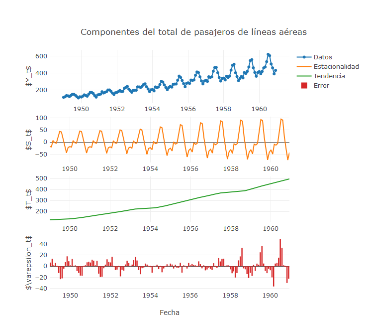
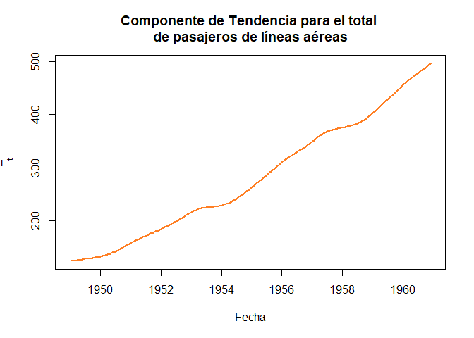
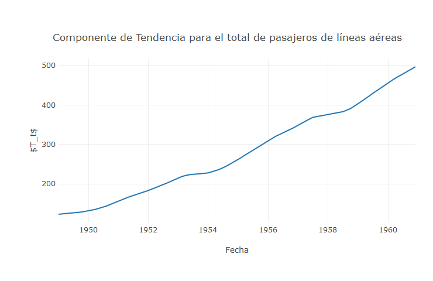
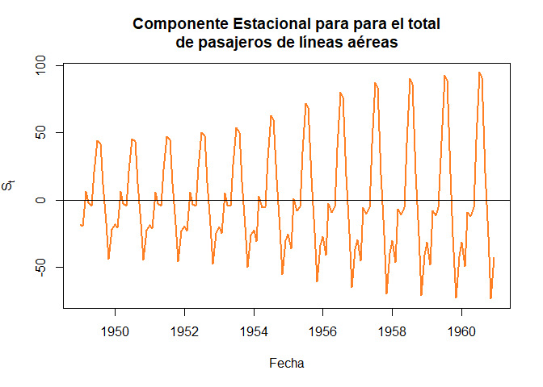
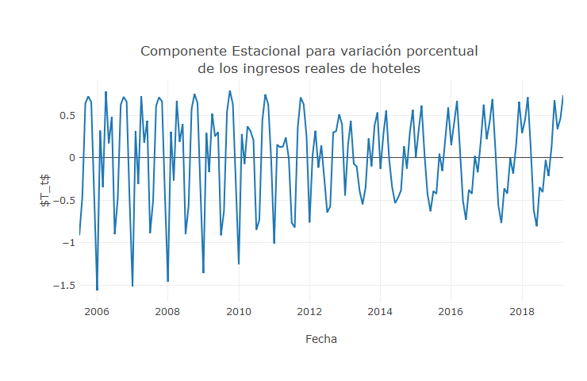
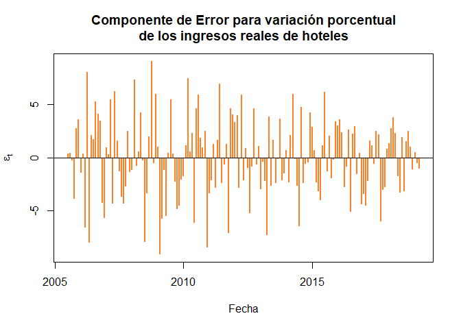
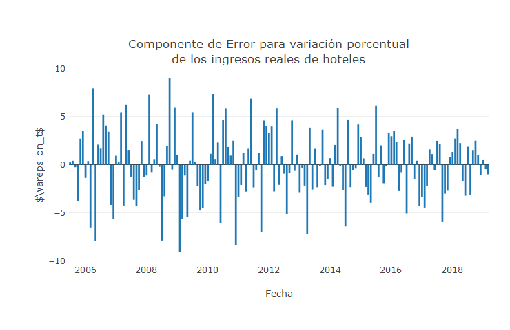

Introducción
------------

Una serie de tiempo es una secuencia de observaciones registradas y
ordenadas de forma periódica, en intervalos de tiempo igualmente
espaciados, tales como, días, meses, semestres, años, entre otros. Estas
observaciones son caracterizadas por una variable aleatoria `$Y_t$`, la
cual depende del tiempo `$t=1,2,\ldots,T$`, y donde el objetivo es
modelar el comportamiento de `$Y_t$` contra `$t$`, siendo `$T$` el
número total de observaciones que se tenga en la serie de tiempo.

Un ejemplo de una serie temporal, se presenta a continuación donde se
muestra el % anual del `$PIB$` per cápita de Colombia, para un intervalo
de tiempo anual que va desde 1961 hasta 2017

<pre>

</pre>

Otro ejemplo, se presenta para el material particulado `$PM_{10}$` y
`$PM_{2.5}$` en la ciudad de Medellín para el mes de abril del año 2019,
para el cual se realizan los registros en intervalos de una hora

<pre style="height:610px">

</pre>

Es de anotar que, para el estudio de series de tiempo, se requiere de
procedimientos estadísticos diferentes a los análisis empleados
tradicionalmente, debido a la dependencia o correlación existente entre
los diferentes puntos observados en el tiempo, la cual no permite
suponer que el conjunto de datos sea independiente e idénticamente
distribuido, y en consecuencia, se hace necesario el empleo de modelos
estadísticos que permitan explicar el comportamiento de variables
aleatorias que dependan del tiempo, para así poder realizar inferencia
sobre éstas.

Entre los principales objetivos del análisis de series de tiempo, se
destaca el comprender, describir e identificar patrones en el
comportamiento de las series, evidenciar el efecto de acciones o
decisiones pasadas
(intervenciones)<!-- conocidas como intervenciones hechas sobre la serie. Estas intervenciones pueden tener un efecto momentáneo o bien un efecto permanente que modifica la estructura de la serie de tiempo intervenida. -->,
realizar pronósticos que contribuyan al proceso de toma de decisiones,
entre otros.

Pronósticos
-----------

Un pronóstico es una predicción de algún evento futuros, que se hace a
partir de los datos pasados que se conocen sobre el suceso específico.
Generalmente, los pronósticos son empleados en la toma de decisiones,
pues permiten disminuir la incertidumbre sobre el futuro, facilitan los
procesos de planificación y control.

<!-- Diebold2006[, pp. 34-35] Mirar todo esta capítulo para mejorar esta clase!!!!

• Decision environment and loss function. What decision will the forecast guide, and what are the implications for the design, use, and evaluation of the forecasting model? Related, how do we quantify' what we mean by a "good" forecast and, in particular, the cost or loss associated with forecast errors of various signs and sizes? How should we define optimality of a forecast in a particular situation? How do we compute optimal forecasts?  -->
<!-- • Forecast object. What is the object that we need to forecast? Is it a time series, such as sales of a firm recorded over time, or an event, such as devaluation of a currency? And what is the quantity and quality of the data? How long is the sample of available data? Are we forecasting one object or many (such as sales of each of 350 products)? Are there missing observations? Unusual observations? -->
<!-- • Forecast statement. How do we wish to state our forecasts? If, for example, the object to be forecast is a time series, are we interested in a single "best guess" forecast, a "reasonable range" of possible future values that reflects the underlying uncertainty associated with the forecasting problem, or a probability distribution of possible future values? What are the associated costs and benefits? -->
<!-- • Forecast horizon. What is the forecast horizon of interest, and what determines it? Are we interested, for example, in forecasting 1 month ahead, 1 year ahead, or 10 years ahead? The best modeling and forecasting strategy will likely vary with the horizon. -->
<!-- • Information set. On what information will the forecast be based? Are the available data simply the past history of the series to be forecast, or are other series available that may be related to the series of interest?  -->
<!-- • Methods and complexity, the parsimony principle, and the shrinkage principle. What forecasting method is best suited to the needs of a particular forecasting problem? How complex should the forecasting model be? More generally, what sorts of models, in terms of complexity, tend to do best for forecasting in business, finance, economics, and government? The phenomena that we model and forecast are often tremendously complex, but does it necessarily follow that our forecasting models should be complex? -->

Métodos de pronóstico
---------------------

Un factor importante en la realización de pronósticos, es el método de
pronóstico que se va a emplear. Según lo planteado por Chase, Jacobs,
and Aquilano ([2009](#ref-Chase2009), pp. 469–470), los pronósticos
pueden ser clasificados en cuatro tipos diferentes, los cuales se
definen como técnicas cualitativas, análisis de series de tiempo,
relaciones causales o econométricas y modelos de simulación.

### Técnicas cualitativas

Los pronósticos cualitativos son basados en opiniones subjetivas, en
donde, la información empleada para realizar el pronóstico, se obtiene
mediante el juicio de un grupo de expertos en el tema, con amplia
experiencia en el área de interés, el cual entrega valores o rangos de
valores sobre el comportamiento futuro de la variable de estudio.
Usualmente este método se emplea cuando la información que se tiene de
la variable de interés, es escasa, no puede ser cuantificada o es poco
confiable.

Entre las técnicas empleadas para realizar pronósticos subjetivos se
destacan

-   Técnicas acumulativas
    <!-- Deriva un pronóstico a través de la compilación de las entradas de aquellos que se encuentran al final de la jerarquía y que tratan con lo que se pronostica. Por ejemplo, un pronóstico general de las ventas se puede derivar combinando
    las entradas de cada uno de los vendedores que están más cerca de su territorio. -->
-   Investigación de mercados
    <!-- Se establece para recopilar datos de varias formas (encuestas, entrevistas, etc.) con el fin de comprobar hipótesis acerca del mercado. Por lo general, se usa para pronosticar ventas a largo plazo y de nuevos productos -->
-   Grupos de consenso
    <!-- Intercambio libre en las juntas. La idea es que la discusión en grupo produzca mejores pronósticos que cualquier individuo. Los participantes pueden ser ejecutivos, vendedores o clientes. -->
-   Analogía histórica
    <!-- Relaciona lo pronosticado con un artículo similar. Es importante al planear nuevos productos en los que las proyecciones se pueden derivar mediante el uso del historial de un producto similar. -->
-   Método Delphi
    <!-- Un grupo de expertos responde un cuestionario. Un moderador recopila los resultados y formula un cuestionario nuevo que se presenta al grupo. Por lo tanto, existe un proceso de aprendizaje para el grupo mientras recibe información nueva y no existe ninguna influencia por la presión del grupo o individuos dominantes. -->

### Análisis de series de tiempo

Los pronósticos basados en análisis de series de tiempo, son aquellos
que emplean la información histórica de una variable de interés, con el
objetivo de descubrir patrones que permitan extrapolar dicha
información, para realizar proyecciones hacia el futuro.

Entre las técnicas empleadas para realizar pronósticos mediante análisis
de series de tiempo se destacan

-   Promedio móvil simple
    <!-- Se calcula el promedio de un periodo que contiene varios puntos de datos dividiendo la suma de los valores de los puntos entre el número de éstos. Por lo tanto, cada uno tiene la misma influencia. -->
-   Promedio móvil ponderado
    <!-- Puede ser que algunos puntos específicos se ponderen más o menos que los otros, según la experiencia -->
-   Suavización exponencial
    <!-- Los puntos de datos recientes se ponderan más y la ponderación sufre una reducción exponencial conforme los datos se vuelven más antiguos. -->
-   Análisis de regresión
    <!-- Ajusta una recta a los datos pasados casi siempre en relación con el valor de los datos. La técnica de ajuste más común es la de los mínimos cuadrados. -->
-   Técnica Box Jenkins
    <!-- Muy complicada, pero al parecer la técnica estadística más exacta que existe. Relaciona una clase de modelos estadísticos con los datos y ajusta el modelo con las series de tiempo utilizando distribuciones bayesianas posteriores. -->
    <!-- * Series de tiempo Shiskin Un método efectivo para dividir una serie temporal en temporadas, tendencias e irregular. Necesita un historial por lo menos de 3 años. Muy eficiente para identificar los cambios, por ejemplo, en las ventas de una compañía. -->
-   Proyecciones de tendencias
    <!-- Ajusta una recta matemática de tendencias a los puntos de datos y la proyecta en el futuro. -->

### Relaciones causales

Los pronósticos causales, son basados en el hecho de que la serie de
tiempo de interés, posee una relación de causa-efecto con una o más
variables independientes, que permiten proyectar el comportamiento de la
serie de tiempo de interés dado el comportamiento que tengan las
variables independientes.

Entre las técnicas empleadas para realizar pronósticos mediante análisis
de series de tiempo se destacan

-   Análisis de regresión
    <!-- Similar al método de los mínimos cuadrados en las series de tiempo, pero puede contener diversas variables. La base es que el pronóstico se desarrolla por la ocurrencia de otros eventos. -->
-   Modelos econométricos
    <!-- Intentos por describir algún sector de la economía mediante una serie de ecuaciones interdependientes. -->
-   Modelos de entrada/salida
    <!-- Se enfoca en las ventas de cada industria a otros gobiernos y empresas. Indica los cambios en las ventas que una industria productora puede esperar debido a los cambios en las compras por parte de otra industria. -->
-   Principales indicadores
    <!-- Estadísticas que se mueven en la misma dirección que la serie a pronosticar, pero antes que ésta, como un incremento en el precio de la gasolina que indica una baja futura en la venta de autos grandes. -->

### Modelos de simulación

Los pronósticos basados en modelos de simulación, son aquellos que
dependen de un gran número de variables y las relaciones que poseen con
factores exógenos, y por tanto, es posible hacer énfasis en la
estructura del modelo, mediante la suposición del comportamiento de las
variables internas y el ambiente externo para observar cómo afectan
éstas a los pronósticos.

Tipos de pronóstico
-------------------

Una vez definido el método de pronóstico que se desea emplear, es
necesario decidir el tipo de pronóstico que se va a realizar, es decir,
definir si se desea realizar un pronóstico **puntual**, por
**intervalo** o de **densidad**.

Clases de pronóstico
--------------------

También es necesario definir la clase u horizonte de tiempo para el cual
se desea realizar el pronostico. Montgomery, Jennings, and Kulahci
([2015](#ref-Montgomery2015), p. 2) señalan que los pronósticos puede
ser clasificados en tres horizontes de tiempo

-   **Corto plazo**: son aquellos que buscan predecir eventos futuros en
    un horizonte de tiempo pequeño, es decir, días, semanas o meses, y
    son empleados generalmente para diseñar estrategias o tomar
    decisiones inmediata.
-   **Mediano plazo**: son predicciones que se realizan en un horizonte
    de tiempo un poco más amplio, el cual abarca estimaciones entre 1 y
    2 años en el futuro, y se utiliza en general para diseñar
    presupuestos o procesos de producción y planeación de variables
    operativas.
-   **Largo plazo**: son aquellos pronósticos que se extienden a
    horizontes de tiempo mucho más grandes, puesto que éstos pueden
    extenderse a muchos años en el futuro, y se emplean en procesos de
    planificación, programación y proyección de proyectos.

Monitoreo de los pronósticos
----------------------------

Los pronósticos, al igual que otros procesos, requieren de supervisión
continua, puesto que, de no supervisar o evaluar su calidad
constantemente, éste podría salirse de control y dar resultados erróneos
o poco confiable.

Debido a ésto, en Hanke and Wichern ([2010](#ref-Hanke2010)) se
establece un diagrama de flujo, en el cual se presenta los pasos
operativos para el monitoreo del proceso de pronóstico


Componentes de una serie de tiempo
----------------------------------

Para el análisis de series de tiempo, y pronostico de las mismas, es
necesario realizar una adecuada selección del modelo que se va a
emplear, y por ello, es fundamental hacer una precisa identificación de
los componentes que conforman la serie, cuya actuación conjunta da como
resultado el comportamiendo de la serie original. Estos componentes
pueden ser ser divididos en cuatro, a saber, tendencia, estacionalidad,
error y fluctuación cíclica.

Para ilustrar el proceso de descomposición, se emplean dos conjuntos de
datos. El primer conjuto de datos, se encuentra integrado en la base de
<tt>R</tt> y corresponde al **total mensual de pasajeros de líneas
aéreas internacionales, para los años 1949 a 1960**.

``` r
data(AirPassengers)  # Carga base de datos de AirPassengers
AP <- AirPassengers  # Guarda base de datos de AirPassengers

descAP <- stl(AP, s.window = 12)

plot(descAP, main = "Componentes del total de pasajeros de líneas aéreas", col = "chocolate1", 
    lwd = 2)
```


<pre style="height:610px">

</pre>

El segundo conjunto de datos, corresponde a las **variaciones porcentual
de los ingresos reales totales de hoteles en Colombia entre Junio 2005 y
Marzo 2019**
[Descargar](https://github.com/jiperezga/jiperezga.github.io/raw/master/Dataset/ingresorealhoteles2019.xlsx){:target="\_blank"}.

``` r
# install.packages('readxl') ## Instala librería para abrir archivos de
# Excel
library(readxl)  ## Cargar librería
datos <- read_xlsx("../../Dataset/ingresorealhoteles2019.xlsx")  # Cargar el archivo
ingH <- ts(datos$`Variacion  ingresos`, start = c(2005, 7), frequency = 12)  # Transforma observaciones a tipo time-series

descIH <- stl(ingH, s.window = 12)
plot(descIH, main = "Componentes de la variación porcentual de los ingresos reales de hoteles", 
    col = "chocolate1", lwd = 2)
```


<pre style="height:610px">

</pre>



### Componente de tendencia

El componente de tendencia se denota por `$T_t$`, es el componente de la
serie que cambia más lentamente y describe el patrón suave que tiene una
serie a largo plazo respecto a su nivel promedio (evolución a largo
plazo de su media), el cual es caracterizado por un crecimiento o
decrecimiento presistente. El comportamiento de la tendencia, puede ser
explicado por el crecimiento o cambio de la población, el cambio
tecnológico, el crecimiento económico, etc.

Para el caso del **total mensual de pasajeros de líneas aéreas
internacionales, para los años 1949 a 1960** se tiene que

``` r
fechasAP <- seq(as.Date("1949/1/1"), length.out = length(AP), by = "month")  ## Se definen fechas

plot(x = fechasAP, y = descAP$time.series[, 2], main = "Componente de Tendencia para el total 
de pasajeros de líneas aéreas", 
    xlab = "Fecha", ylab = expression(T[t]), col = "chocolate1", type = "l", 
    pch = 19, lwd = 2)
```



<pre>

</pre>

Mientras que, para el caso de las **variaciones porcentual de los
ingresos reales totales de hoteles en Colombia entre Junio 2005 y Marzo
2019** se tiene que

``` r
fechasIH <- seq(as.Date("2005/7/1"), length.out = length(ingH), by = "month")  ## Se definen fechas

plot(x = fechasIH, y = descIH$time.series[, 2], main = "Componente de Tendencia para variación porcentual
de los ingresos reales de hoteles", 
    xlab = "Fecha", ylab = expression(T[t]), col = "chocolate1", type = "l", 
    pch = 19, lwd = 2)
```


<pre>

</pre>

### Componente estacional

El componente estacional se denota como `$S_t$`, es el segundo
componente de la serie que cambia más rápidamente y se describe como un
patrón que se repite regularmente a través de la serie sobre una base
anual. Este comportamiento es debido a factores tales como los consumos
o las estaciones climáticas, es decir factores que ocurren con una
periodicidad semanal, mensual, trimestral, o semestral.

Es de anotar, que los efectos estacionales son fáciles de entender y se
pueden medir explícitamente o incluso se pueden eliminar de la serie de
datos, el cual es llamado desestacionalización de la serie.

Para el caso del **total mensual de pasajeros de líneas aéreas
internacionales, para los años 1949 a 1960** se tiene que

``` r
plot(x = fechasAP, y = descAP$time.series[, 1], main = "Componente Estacional para para el total
de pasajeros de líneas aéreas", 
    xlab = "Fecha", ylab = expression(S[t]), col = "chocolate1", type = "l", 
    pch = 19, lwd = 2)
abline(h = 0)
```



<pre>

</pre>

Mientras que, para el caso de las **variaciones porcentual de los
ingresos reales totales de hoteles en Colombia entre Junio 2005 y Marzo
2019** se tiene que

``` r
plot(x = fechasIH, y = descIH$time.series[, 1], main = "Componente Estacional para variación porcentual
de los ingresos reales de hoteles", 
    xlab = "Fecha", ylab = expression(T[t]), col = "chocolate1", type = "l", 
    pch = 19, lwd = 2)
```


<pre>

</pre>

### Componente aleatorio, irregular o de error

El componente de error se denota como `$\varepsilon_t$`, también llamado
**ruido blanco**, es el componente de la serie que cambia más
rápidamente y se caracteriza por presentar pequeñas fluctuaciones sobre
alrededor de una media y varianza constantes sin ningún patrón aparente.
Este fluctuaciones se deben generalmente, a eventos externos
impredesibles que sólo ocurre fortuitamente e inciden de forma aislada
en un instante del tiempo.

Es de anotar, que este componente es impredecible, pero puede ser
modelado como observaciones aleatorias de alguna distribución, tal como
lo es, una distribución `$N(0,\sigma^2)$`.

Para el caso del **total mensual de pasajeros de líneas aéreas
internacionales, para los años 1949 a 1960** se tiene que

``` r
plot(x = fechasAP, y = descAP$time.series[, 3], main = "Componente de Error para el total
de pasajeros de líneas aéreas", 
    xlab = "Fecha", ylab = expression(epsilon[t]), col = "chocolate1", type = "h", 
    pch = 19, lwd = 2)
abline(h = 0)
```


<pre>

</pre>

Mientras que, para el caso de las **variaciones porcentual de los
ingresos reales totales de hoteles en Colombia entre Junio 2005 y Marzo
2019** se tiene que

``` r
plot(x = fechasIH, y = descIH$time.series[, 3], main = "Componente de Error para variación porcentual
de los ingresos reales de hoteles", 
    xlab = "Fecha", ylab = expression(epsilon[t]), col = "chocolate1", type = "h", 
    pch = 19, lwd = 2)
abline(h = 0)
```



<pre>

</pre>

### Componente de fluctuación cíclica

El componente de fluctuación cícluca se denota como `$C_t$`, es el
segundo componente de la serie que cambia más lentamente y se
caracteriza por presentar patrones de onda en puntos recurrentes en el
tiempo con duración más de un año. Este comportamiento es debido por
ejemplo a ciclos comerciales que dependen de prosperidad, depresión,
recesión y recuperación.

Es de anotar que, los ciclos son el componente más difíciles de
pronosticar, debido a que éstos poseen periodos más largos (medida en
años) y amplitudes irregulares (diferencias entre altas y bajas) que
están lejos de ser constantes, lo cual hace que éstos no sean fijos ni
predecibles, y por tanto, las fluctuaciones cíclicas son mezcladas
generalmente con el componente de error `$\varepsilon$` o se asume que
cualquier cíclo es parte de la tendencia `$T_t$`.

Para el caso de las **variaciones porcentual de los ingresos reales
totales de hoteles en Colombia entre Junio 2005 y Marzo 2019** se tiene
que

<pre>

</pre>

### Otras componentes

Es de anotar, que además de tener tendencia, estacionalidad, error y
fluctuación cíclica, algunas series de tiempo pueden presentar patrones
de impulso, rampa o paso

-   **Patrón de impulso:** Se observa cuando para uno o dos periodos, el
    proceso presenta un nivel superior o inferior al comportamiento
    original de la serie.
-   **Patrón de rampa:** Se observa cuando aparece un cambio de
    tendencia repentino en el comportamiento constante de la serie, o
    viceversa.
-   **Patrón de paso:** Se observa cuando hay cambio permanente en el
    nivel de la serie.

Bibliografía
------------

Chase, R., Jacobs, F., and Aquilano, N. (2009). *Administración de
operaciones, producción y cadena de suministros .* (12th ed.).
McGraw-Hill Interamericana.

Hanke, J., and Wichern, D. (2010). *Pronósticos en los negocios* (9th
ed.). Pearson educación.

Montgomery, D., Jennings, C., and Kulahci, M. (2015). *Introduction to
time series analysis and forecasting* (2nd ed.). John Wiley & Sons.
