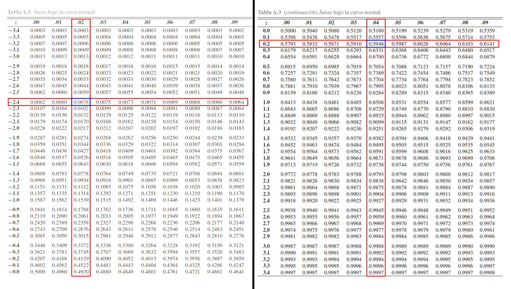
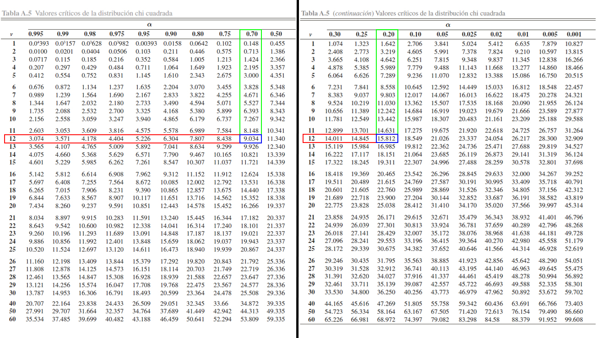
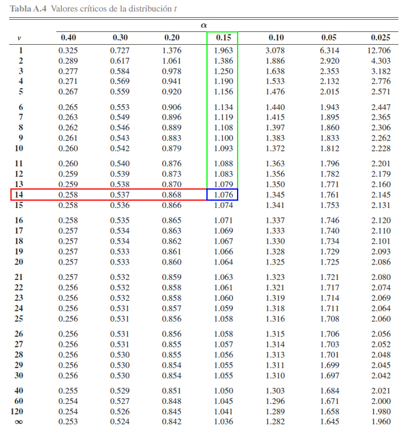
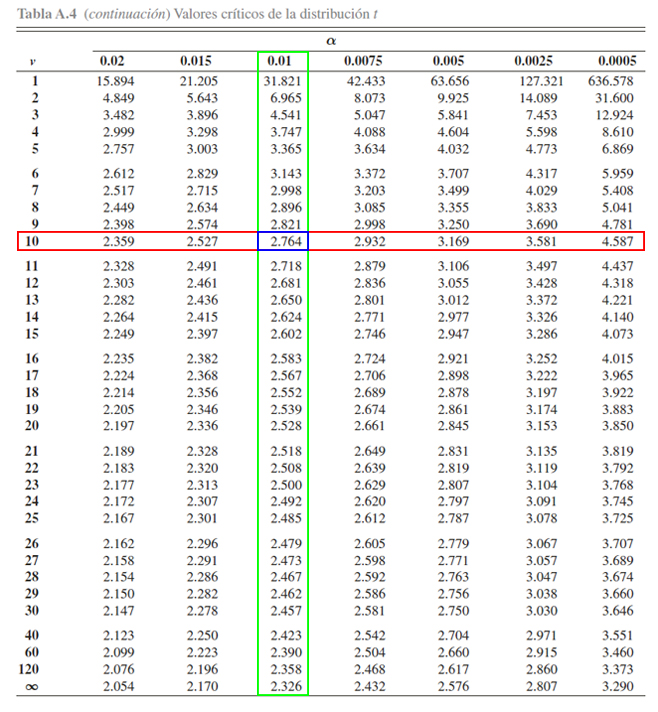

## Inferencia estadística

La inferencia estadística es la obtención de conclusiones basadas en
datos experimentales. Para entender la naturaleza de la inferencia
estadística, se debe entender primero la diferencia entre “población” y
“muestra”.

**Población:** Consta del total de observaciones del suceso o proceso en
que estamos interesados. En muchas ocasiones, no es posible obtener o
replicar dicha información.

**Muestra:** Es un subconjunto de la población de interés, extraída con
el objetivo de hacer inferencia sobre la población.

**Muestra aleatoria:** Es un subconjunto de la población seleccionado de
forma independiente e idénticamente distribuidos (*iid* en adelante).

## Estadísticos

Son funciones de las variables aleatorias obtenidas a partir de muestras
aleatorias, que tienen por objetivo estimar o hacer inferencia acerca de
parámetros desconocidos de una población.

A continuación se definirán algunos estadísticos importantes que sirven
para medir el centro y la dispersión de un conjunto de datos, acomodados
por orden de magnitud.

## Estadísticos muestrales

Sea `$X_1, X_2, \ldots, Xn$` una muestra aleatoria *iid* de tamaño
`$n$`, entonces se tendrán los siguientes estadísticos muestrales

### Media muestral

Es el promedio aritmético del total de las `$n$` observaciones
pertenecientes a una muestra aleatoria. Éste estadístico se define como
`\begin{align*}   \bar{X}=\sum_{i=1}^n\frac{x_i}{n}=\frac{x_1+x_2+\ldots+x_n}{n} \end{align*}`

En <tt>R</tt>, puede calcularse el valor de la media muestral de una
muestra aleatoria mediante la función `mean(datos)`.

<button id="Show1" class="btn btn-secondary">
Mostrar Ejercicio
</button>
<button id="Hide1" class="btn btn-info">
Ocultar Ejercicio
</button>
<main id="botoncito1">
<h3 data-toc-skip>
Ejercicio
</h3>

Suponga que se realiza un estudio sobre el salario de los estudiantes de
ingeniería industrial una vez finalizan su pregrado y se incertan en el
mercado laboral. Para ello, se le pregunta a \(15\) egresados
seleccionados de forma aleatoria y se les pregunta cuál es el salario
que devengan actualmente, obteniendo los siguientes resultados en
millones de pesos \[\begin{align*}
1.78 \quad 2.93 \quad 1.22 \quad 1.27 \quad 1.17 \\
1.03 \quad 1.24 \quad 2.07 \quad 2.04 \quad 1.28 \\
1.53 \quad 0.98 \quad 1.73 \quad 1.38 \quad 3.24
\end{align*}\]

Basados e la información anterior, calcule el salario promedio muestral
egresados del programa de ingeniería industrial.

<h3 data-toc-skip>
Solución
</h3>

En este caso estamos interesados en calcular el salario promedio
muestral de los del programa de ingeniería industrial, y para ello no
están dando la información individual obtenida para cada uno de los
\(15\) egresados.     Entonces para realizar el cálculo empleamos
la ecuación para el cálculo de la media muestral, tal que
\[\begin{align*}
  \bar{X}=\sum_{i=1}^n\frac{x_i}{n}
\end{align*}\] En donde, si llamamos cada una de las observaciones como
\(X_1, X_2, \ldots, X_{15}\), tendremos que \[\begin{align*}
  \bar{X} &= \frac{1.79 + 2.93 + 1.22 + \ldots + 3.24}{15}\\
          &= 1.659333
\end{align*}\] Por tanto, se tendrá que el promedio muestral obtenido
para el salario de los egresados del programa de ingeniería industrial
es de \(1.659\) millones de pesos.

</main>

### Varianza muestral

Es la distancia media **al cuadrado** del conjunto de observaciones
pertenecientes a una muestra aleatoria, respecto a la media muestra.
`\begin{align*}   S^2=\frac{1}{n-1}\sum_{i=1}^n{(x_i-\bar{X})^2} \end{align*}`

siendo el valor `$n-1$` conocido como la corrección de Bessel, el cuál
se usa en lugar de la división sobre `$n$` con el fin de corregir el
sesgo tendría el estimador.

En <tt>R</tt> puede calcularse la varianza muestral de una muestra
aleatoria mediante la función `var(datos)`.

<button id="Show2" class="btn btn-secondary">
Mostrar Ejercicio
</button>
<button id="Hide2" class="btn btn-info">
Ocultar Ejercicio
</button>
<main id="botoncito2">
<h3 data-toc-skip>
Ejercicio
</h3>

Suponga que se realiza un estudio sobre el salario de los estudiantes de
ingeniería industrial una vez finalizan su pregrado y se incertan en el
mercado laboral. Para ello, se le pregunta a \(15\) egresados
seleccionados de forma aleatoria y se les pregunta cuál es el salario
que devengan actualmente, obteniendo los siguientes resultados en
millones de pesos \[\begin{align*}
1.78 \quad 2.93 \quad 1.22 \quad 1.27 \quad 1.17 \\
1.03 \quad 1.24 \quad 2.07 \quad 2.04 \quad 1.28 \\
1.53 \quad 0.98 \quad 1.73 \quad 1.38 \quad 3.24
\end{align*}\]

Basados e la información anterior, calcule la varianza muestral del
salario de los \(15\) egresados del programa de ingeniería industrial.

<h3 data-toc-skip>
Solución
</h3>

En este ejercicio nos preguntan por la varianza muestral del salario de
los egresados del programa de ingeniería industrial, y para realizar el
cálculo nos dan el salario individual de cada uno de los \(15\)
egresados.     Para realizar el cálculo de la varianza de los
salarios de los egresados, empleamos la ecuación de la varianza
muestral, tal que \[\begin{align*}
  S^2=\frac{1}{n-1}\sum_{i=1}^n{(x_i-\bar{X})^2}
\end{align*}\] En donde, si cada una de las observaciones hace
referencia los valores \(X_1, X_2, \ldots, X_{15}\), y el valor de la
media es igual a \(\bar{X}=1.659333\) tendremos que \[\begin{align*}
  S^2 &= \frac{(1.78 - 1.659333)^2 + (2.93 - 1.659333)^2+\ldots+(3.24 - 1.659333)^2}{15-1} \\
      &= \frac{0.01456052 + 1.614595 + \ldots + 2.498508}{14}\\
      &= 0.4501638
\end{align*}\] Por tanto, se tendrá que la varianza muestral del salario
de los egresados del programa de ingeniería industrial es de
\(0.4501638\).

</main>

### Desviación estándar muestral

Es la raíz cuadrada de la distancia media **al cuadrado** del conjunto
de observaciones pertenecientes a una muestra aleatoria, respeto a la
media, es decir, indica qué tan dispersos se encuentra el conjunto de
observaciones de una muestra aleatoria respecto a su valor promedio.
`\begin{align*}   S=\sqrt{S^2} \end{align*}`

En <tt>R</tt> puede calcularse la desviación estándar de una muestra
aleatoria mediante la función `sd(datos)`.

<button id="Show3" class="btn btn-secondary">
Mostrar Ejercicio
</button>
<button id="Hide3" class="btn btn-info">
Ocultar Ejercicio
</button>
<main id="botoncito3">
<h3 data-toc-skip>
Ejercicio
</h3>

Suponga que se realiza un estudio sobre el salario de los estudiantes de
ingeniería industrial una vez finalizan su pregrado y se incertan en el
mercado laboral. Para ello, se le pregunta a \(15\) egresados
seleccionados de forma aleatoria y se les pregunta cuál es el salario
que devengan actualmente, obteniendo los siguientes resultados en
millones de pesos \[\begin{align*}
1.78 \quad 2.93 \quad 1.22 \quad 1.27 \quad 1.17 \\
1.03 \quad 1.24 \quad 2.07 \quad 2.04 \quad 1.28 \\
1.53 \quad 0.98 \quad 1.73 \quad 1.38 \quad 3.24
\end{align*}\]

Basados e la información anterior, calcule el salario promedio de los
\(15\) egresados del programa de ingeniería industrial.

<h3 data-toc-skip>
Solución
</h3>

Para calcular la desviación estandar muestral del salario de los
egresados del programa de ingeniería industrial, podemos emplear la
varianza muestral ya calculada en el ejercicio anterior, la cual dio
como resultado \[\begin{align*}
  S^2 &= 0.4501638
\end{align*}\]

así que, al aplicar la ecuación de la desviación estandar muestral
tendremos que \[\begin{align*}
  S &= \sqrt{S^2} \\
    &= \sqrt{0.4501638} \\
    &= 0.6709425
\end{align*}\]

Por tanto, se tendrá que el promedio muestral obtenido para el salario
de los egresados del programa de ingeniería industrial es de \(1.659\)
millones de pesos, con una desviación estándar de \(670\) mil pesos.

</main>

### Proporción muestral

La proporción muestral para un total de `$n$` observaciones
pertenecientes a una muestra aleatoria, de la cual se sabe que hay un
total de `$x$` éxitos, puede interpretarse como la frecuencia relativa o
porcentaje del número de éxito que se obtienen a partir de un conjunto
de `$n$` observaciones que vienen de una muestra aleatoria.
`\begin{align*}   \hat{p}=\frac{x}{n} \end{align*}`

En <tt>R</tt> puede calcularse el porcentaje de éxitos de una muestra
aleatoria mediante el cálculo de función
`sum(condición) / length(datos)`, donde `condición` representa una
condición que se quiere probar, por ejemplo, que los datos sean
superiores a un `$10$`, por tanto `condición = datos > 10`.

<button id="Show4" class="btn btn-secondary">
Mostrar Ejercicio
</button>
<button id="Hide4" class="btn btn-info">
Ocultar Ejercicio
</button>
<main id="botoncito4">
<h3 data-toc-skip>
Ejercicio
</h3>

Suponga que se realiza un estudio sobre el salario de los estudiantes de
ingeniería industrial una vez finalizan su pregrado y se incertan en el
mercado laboral. Para ello, se le pregunta a \(15\) egresados
seleccionados de forma aleatoria y se les pregunta cuál es el salario
que devengan actualmente, obteniendo los siguientes resultados en
millones de pesos \[\begin{align*}
1.78 \quad 2.93 \quad 1.22 \quad 1.27 \quad 1.17 \\
1.03 \quad 1.24 \quad 2.07 \quad 2.04 \quad 1.28 \\
1.53 \quad 0.98 \quad 1.73 \quad 1.38 \quad 3.24
\end{align*}\]

Basados e la información anterior, calcule la proporción muestral de
egresados del programa de ingeniería industrial que presentan salarios
que superan \(1.5\) millones de pesos

<h3 data-toc-skip>
Solución
</h3>

Para calcular la proporción muestral del salario de los egresados del
programa de ingeniería industrial que superan \(1.5\) millones de pesos,
por tanto lo que debemos hacer es primero verificar cuales de los
registros cumplen la condición planteada, en donde marcaremos como un
\(1\) los registros que cumplen la condición y como \(0\) aquellos
registros que no cumplen la condición, tal que

\[\begin{align*}
\underbrace{1.78}_{1} \quad \underbrace{2.93}_{1} \quad \underbrace{1.22}_{0} \quad \underbrace{1.27}_{0} \quad \underbrace{1.17}_{0} \\
\underbrace{1.03}_{0} \quad \underbrace{1.24}_{0} \quad \underbrace{2.07}_{1} \quad \underbrace{2.04}_{1} \quad \underbrace{1.28}_{0} \\
\underbrace{1.53}_{1} \quad \underbrace{0.98}_{0} \quad \underbrace{1.73}_{1} \quad \underbrace{1.38}_{0} \quad \underbrace{3.24}_{1}
\end{align*}\]

de aquí se observa que de las \(15\) observaciones hay un total de \(7\)
que cumplen la condición por lo cual se tendrá que

\[\begin{align*}
  \hat{p}&=\frac{x}{n}\\
         &=\frac{7}{15}\\
         &=0.4666667\\
\end{align*}\]

Por tanto, se tendrá que la proporción muestral o porcentaje muestral de
egresados del programa de ingeniería industrial que devengan un salario
superior a \(1.5\) millones de pesos es del \(46.66\%\).

</main>

## Distribuciones muestrales

Debido a que todos los estadístico son funciones de las variables
aleatorias observadas en una muestra, éstos también serán variables
aleatorias que tendrán distribuciones de probabilidad asociadas,
distribuciones que son llamadas distribuciones muestrales.

### Distribución para la media muestral `$\bar{X}$`

Sea `$X_1, X_2, \ldots, X_n$` una muestra aleatoria de tamaño `$n$` de
una distribución normal con media `$\mu$` y varianza `$\sigma^2$`,
entonces se puede mostrar que
`\begin{align*} \bar{X}=\frac{1}{n}\sum_{i=1}^n x_i \sim N(\mu, \sigma^2/n) \end{align*}`
se distribuye normalmente con media `$\mu$` y varianza `$\sigma^2/n$`.

#### Teorema

Dado que `$\bar{X}\sim N(\mu,\sigma^2/n)$`, entonces se puede aplicar la
estandarización que se emplea a la distribución normal para llevar ésta,
a una distribución normal estándar. Dicha estandarización sería de la
forma
`\begin{align*} Z_c = \frac{\bar{X}-\mu}{\sigma/\sqrt{n}} \sim N(0,1) \end{align*}`
y se tendrá que `$Z$` se distribuirá como una normal estándar de forma
exacta.

<button id="Show5" class="btn btn-secondary">
Mostrar Ejercicio Manejo de Tabla Normal Estándar
</button>
<button id="Hide5" class="btn btn-info">
Ocultar Ejercicio Manejo de Tabla Normal Estándar
</button>
<main id="botoncito5">
<h3 data-toc-skip>
Ejercicio
</h3>

Suponga que poseemos una distribución normal estándar, tal que
\(Z\sim N(0,1)\). Entonces, a partir de esta distribución y empleando la
<a href="https://github.com/jiperezga/jiperezga.github.io/raw/master/Dataset/Documentos/DistNormEst.pdf">Tabla
de la Distribución Normal Estándar</a>, calcule

<ol>
<li>
\(\mathbb{P}(Z\leq 1.96)\)
</li>
<li>
\(\mathbb{P}(Z> 2.13)\)
</li>
<li>
\(\mathbb{P}(-2.42 <Z \leq 0.24)\)
</li>
<li>
\(\mathbb{P}(Z>z) = 0.0129\)
</li>
</ol>
<h3 data-toc-skip>
Solución
</h3>

Para calcular probabilidades con la tabla de la distribución normal
estándar, es necesario tener en cuenta el funcionamiento de la tabla
misma. Y para ello se presenta la siguiente imagen.

En donde, se aprecia que, <strong>los cuadros rojos representan los
valores críticos</strong> \(z\) que se emplea para calcular
probabilidades, en donde, el cuadro rojo de la parte izquierda muestra
la parte entera y el primer decimal, mientras que el cuadro rojo de la
parte superior muestra el segundo decimal. <strong>El cuadro azul
representa las probabilidades</strong> \(\alpha\) que se desean calcular
a partir de los valores críticos. Finalmente, <strong>el cuadro azul
claro representa el funcionamiento de la tabla </strong>, la cual
muestra las probabilidades que poseen la forma
\(\mathbb{P}(Z<z)=\alpha\).

<ol>
<li>

Con la explicación de la tabla en mente, la primera probabilidad a
calcular es \(\mathbb{P}(Z\leq 1.96)\). Entonces como esta probabilidad
tiene la estructura establecida por la tabla \(\mathbb{P}(Z\leq z)\),
será cuestión de buscar el valor crítico \(1.96\) para localizar la
probabilidad asociada, tal que se busca en la parte izquierda, el valor
\(1.9\) y en la parte superior el valor \(0.06\), y en donde se
encuentre el cruce de ambos valores, se encontrará el valor de la
probabilidad asociada a \(1.96\). Dicho procedimiento se muestra en la
siguiente imagen

Donde se aprecia que

\[\begin{align*}\mathbb{P}(Z\leq 1.96)=0.9750\end{align*}\]

</li>
<li>

A diferencia del punto anterior, observamos que la probabilidad
propuesta \(\mathbb{P}(Z> 2.13)\) tiene una estructura diferente a la
establecida por la tabla \(\mathbb{P}(Z\leq z)\), y por tanto, será
necesario emplear el complemento de la probabilidad propuesta para
obtener una estructura similar a la propuesta por la tabla, tal que

\[\begin{align*}
\mathbb{P}(Z> 2.13)= 1 - \mathbb{P}(Z\leq 2.13)
\end{align*}\] En donde, se aprecia que ahora podemos calcular la
\(\mathbb{P}(Z> 2.13)\), mediante el empleo de la
\(\mathbb{P}(Z\leq 2.13)\), la cual podemos buscar en la tabla
directamente. Para localizar \(\mathbb{P}(Z\leq 2.13)\), se busca el
valor \(2.1\) en la parte izquierda de la tabla, y el valor \(0.03\) en
la parte superior de la tabla, y en donde se encuentre el cruce de ambos
valores, se encontrará el valor de la probabilidad asociada a \(2.13\).

Donde se aprecia que

\[\begin{align*}
\mathbb{P}(Z\leq 2.13)=0.9834
\end{align*}\]

y por tanto, se tendrá que

\[\begin{align*}
\mathbb{P}(Z> 2.13)&= 1 - \mathbb{P}(Z\leq 2.13)\\
                   &= 1 - 0.9834 \\
                   &= 0.0166
\end{align*}\]

</li>
<li>

En este caso, se desea calcular la \(\mathbb{P}(-2.42 <Z \leq 0.24)\), y
se observa que la estructura de dicha probabilidad es diferente a la
establecida por la tabla \(\mathbb{P}(Z\leq z)\), pero también podemos
apreciar que si aplicamos las propiedades de la función de distribución
acumulada para el caso continuo, ya presentadas en la
<a href="../../ProbabilidadeInferencia/PeIEClase08.html#función-de-distribución-acumulada-caso-continuo">Clase
08</a>, podemos llevar la probabilidad de interés a la forma

\[\begin{align*}
\mathbb{P}(-2.42 <Z \leq 0.24) = \mathbb{P}(Z \leq 0.24) - \mathbb{P}(Z \leq -2.42)
\end{align*}\] obteniendo que la probabilidad
\(\mathbb{P}(-2.42 <Z \leq 0.24)\), puede calcularse mediante el empleo
de las probabilidades acumuladas \(\mathbb{P}(Z \leq 0.24)\) y
\(\mathbb{P}(Z \leq -2.42)\), las cuales pueden calcularse en la tabla
de forma similar a los dos puntos anteriores.

Donde se aprecia que

\[\begin{align*}
\mathbb{P}(Z \leq -2.42)=0.0078 \quad \text{ y } \quad \mathbb{P}(Z \leq 0.24)=0.5948
\end{align*}\]

y por tanto, se tendrá que

\[\begin{align*}
\mathbb{P}(-2.42 <Z \leq 0.24) &= \mathbb{P}(Z \leq 0.24) - \mathbb{P}(Z \leq -2.42)\\
                               &= 0.5948 - 0.0078  \\
                               &= 0.587
\end{align*}\]
</li>
<li>

En este punto, a diferencia de los puntos anteriores, no están dando el
valor de la probabilidad y nos piden encontrar el valor crítico \(z\).
Es decir debemos calcular el valor crítico asociado a la probabilidad
\[\begin{align*}
\mathbb{P}(Z>z) = 0.0129
\end{align*}\]

Y para ello, debemos llevar inicialmente la estructura de la
probabilidad, a la estructura manejada por la tabla, tal que

\[\begin{align*}
\mathbb{P}(Z>z) &= 0.0129 \\
1 - \mathbb{P}(Z\leq z) &= 0.0129 \\
1- 0.0129 &= \mathbb{P}(Z\leq z) \\
0.9871 &= \mathbb{P}(Z\leq z)
\end{align*}\]

En donde observamos que la probabilidad \(\mathbb{P}(Z\leq z)\) ya posee
la estructura de la tabla, y en consecuencia, podemos proceder a
encontrar el valor crítico \(z\), buscando el valor de la probabilidad
\(0.9871\) en la parte interior de la tabla, y luego buscando cual es el
valor crítico \(z\) asociado a dicha probabilidad.

En la tabla se aprecia, que al buscar la probabilidad \(0.9871\)
encontramos que el valor crítico \(z\) asociado es de \(2.24\), es decir

\[\begin{align*}
\mathbb{P}(Z\leq 2.24) &= 0.9871
\end{align*}\]

o equivalentemente

\[\begin{align*}
\mathbb{P}(Z > 2.24) &= 0.0129
\end{align*}\]

</li>
</ol>
</main>

### Teorema del límite central

Sea `$X_1, X_2, \ldots, X_n$` una muestra aleatoria *iid* con media
`$\mathbb{E}(X_i) = \mu$` y varianza `$Var(X_i)=\sigma^2<\infty$`
entonces, cuando `$n\to \infty$`, se tendrá que
`\begin{align*} Z_c = \frac{\bar{X}-\mu}{\sigma/\sqrt{n}} \stackrel{a}{\sim} N(0,1) \end{align*}`
tendrá una distribución aproximadamente normal estándar, cuando
`$n\sim \infty$` (usualmente, se usa como valor de referencia a
`$n\geq 30$`).

### Distribución muestral para la proporción muestral `$\hat{p}$`

Sea `$X_1, X_2, \ldots, X_n$` una muestra aleatoria *iid* de tamaño
`$n$`, tal que `$X\sim b(n,p)$`. Entonces si `$n$` es suficientemente
grande, y la proporción `$p$` no está muy cercana a `$0$` o a `$1$`, tal
que `$np$` y `$n(1-p)>5$`, entonces se puede probar que
`\begin{align*} \hat{p}  = \frac{x}{n} \stackrel{a}{\sim} N\left(p, \frac{p(1-p)}{n}\right) \end{align*}`
donde por teorema de estandarización se obtendrá que
`\begin{align*} Z_c = \frac{\hat{p}-p}{\sqrt{\frac{p(1-p)}{n}}} \stackrel{a}{\sim} N(0,1) \end{align*}`

### Distribución para combinaciones lineales

En estadística aplicada a menudo se necesita conocer la distribución de
probabilidad de una combinación lineal de variables aleatorias
independientes. Y Por ello se presentan a continuación `$4$` teoremas
que pueden ser de utilidad

<button id="Show9" class="btn btn-secondary">
Mostrar Teorema 1
</button>
<button id="Hide9" class="btn btn-info">
Ocultar Teorema 1
</button>
<main id="botoncito9">
<h3 data-toc-skip>
Teorema 1
</h3>

Sean \(X_1\) y \(X_2\) dos variables aleatorias normalmente distribuidas
con media \(\mu\) y varianza \(\sigma^2\). Y si \(Y\) es una combinación
lineal de \(X_1\) y \(X_2\), tal que \[\begin{align*}
Y = X_1 + X_2
\end{align*}\] entonces, la media de \(Y\) estará dada por
\[\begin{align*}
\mathbb{E}(Y) = \mu_1 + \mu_2
\end{align*}\]

y la varianza de \(Y\) estará dada por \[\begin{align*}
Var(Y) = \sigma_{x_1}^2 + \sigma_{x_2}^2 + 2 \sigma_{x_1x_2}
\end{align*}\]

o en caso de que \(X_1\) y \(X_2\) sean variables aleatorias
independientes, entonces se tendrá que la varianza de \(Y\) estará dada
por \[\begin{align*}
Var(Y) = \sigma_{x_1}^2 + \sigma_{x_2}^2
\end{align*}\]

</main>
<button id="Show10" class="btn btn-secondary">
Mostrar Teorema 2
</button>
<button id="Hide10" class="btn btn-info">
Ocultar Teorema 2
</button>
<main id="botoncito10">
<h3 data-toc-skip>
Teorema 2
</h3>

Sea \(X_1, X_2, \ldots, X_n\) variables aleatorias independientes,
distribuidas normalmente con medias \(\mu_1, \mu_2, \ldots, \mu_n\) y
varianzas \(\sigma_1^2, \sigma_2^2, \ldots, \sigma_n^2\), entonces la
variable aleatorias \[\begin{align*}
Y = a_1 X_1 + a_2 X_2 + \ldots + a_n X_n
\end{align*}\]

tendrá una distribución Normal, con media \[\begin{align*}
\mu_Y = a_1 \mu_1 + a_2 \mu_2 + \ldots + a_n \mu_n
\end{align*}\]

y varianza \[\begin{align*}
\sigma^2_Y = a_1 \sigma^2_1 + a_2 \sigma^2_2 + \ldots + a_n \sigma^2_n
\end{align*}\]

es decir, \(Y\sim N(\mu_Y, \sigma^2_Y)\).

</main>
<button id="Show11" class="btn btn-secondary">
Mostrar Teorema 3
</button>
<button id="Hide11" class="btn btn-info">
Ocultar Teorema 3
</button>
<main id="botoncito11">
<h3 data-toc-skip>
Teorema 3
</h3>

Sea \(X_1, X_2, \ldots, X_n\) variables aleatorias mutuamente
independientes, que tienen una distribución chi-cuadrado con
\(\nu_1, \nu_2, \ldots, \nu_n\) grados de libertad, entonces la variable
aleatoria \[\begin{align*}
Y = X_1 + X_2 + \ldots + X_n
\end{align*}\]

tiene una distribución chi-cuadrado con
\(\nu = \nu_1 + \nu_2 + \ldots + \nu_n\) grados de libertad, es decir,
\(Y\sim \chi^2(\nu)\)

<h3 data-toc-skip>
Teorema 3.1
</h3>

Si \(Y\sim \chi^2_\nu\) entonces se puede probar que la media y varianza
de la variable aleatoria \(X\) están dadas por \[\begin{align*}
\mathbb{E}(X)=\nu \quad \quad Var(X)=2\nu
\end{align*}\]

</main>
<button id="Show12" class="btn btn-secondary">
Mostrar Teorema 4
</button>
<button id="Hide12" class="btn btn-info">
Ocultar Teorema 4
</button>
<main id="botoncito12">
<h3 data-toc-skip>
Teorema 4
</h3>

Sea \(X_1, X_2, \ldots, X_n\) una muestra aleatoria *iid* de tamaño
\(n\), que poseen una distribución \(N(\mu,\sigma^2)\), entonces
\[\begin{align*}
Z_i = \frac{X_i - \mu}{\sigma} \sim N(0,1)
\end{align*}\]

para \(i =1,2,\ldots,n\) serán variables aleatorias independientes con
distribuciones normales estándar. Además, se tendrá que \[\begin{align*}
Z_i^2 = \frac{(X_i - \mu)^2}{\sigma^2} \sim \chi^2_{1}
\end{align*}\]

serán variables aleatorias independientes con distribuciones
chi-cuadrado con \(1\) grado de libertad. Entonces, basados en el
Teorema 3 se obtiene que \[\begin{align*}
Y = \sum_{i=1}^n Z_i^2 = \sum_{i=1}^n\frac{(X_i-\mu)^2}{\sigma^2} \sim \chi^2_n
\end{align*}\] tendrá una distribución chi-cuadrado con \(n\) grados de
libertad.

</main>

### Distribución muestral de `$\chi^2$`

Sea `$X_1, X_2, \ldots, X_n$` una muestra aleatoria *iid* de una
distribución `$N(\mu,\sigma^2)$` de tamaño `$n$`, entonces partiendo del
<a href="../../ProbabilidadeInferencia/PeIEClase13.html#distribución-para-combinaciones-lineales">Teorema
4</a> se tendrá que
`\begin{align*} \sum_{i=1}^n\frac{(X_i-\mu)^2}{\sigma^2} \sim \chi^2_n \end{align*}`

En donde, al sumar y restar `$\bar{X}$` dentro de `$(X_i-\mu)^2$`
tendremos que
`\begin{align*} \sum_{i=1}^n\frac{(X_i-\mu)^2}{\sigma^2} &= \sum_{i=1}^n\frac{(X_i - \bar{X} + \bar{X} - \mu)^2}{\sigma^2} \\                                          &= \sum_{i=1}^n\frac{[(X_i - \bar{X}) + (\bar{X} - \mu)]^2}{\sigma^2} \\                                          &= \sum_{i=1}^n\frac{(X_i - \bar{X})^2 + 2(X_i - \bar{X})(\bar{X} - \mu) + (\bar{X} - \mu)^2}{\sigma^2} \\                                          &= \sum_{i=1}^n\frac{(X_i - \bar{X})^2 + 2(X_i - \bar{X})(\bar{X} - \mu) + (\bar{X} - \mu)^2}{\sigma^2} \\                                          &= \sum_{i=1}^n\frac{(X_i - \bar{X})^2}{\sigma^2} + \sum_{i=1}^n\frac{2(X_i - \bar{X})(\bar{X} - \mu)}{\sigma^2} + \sum_{i=1}^n\frac{(\bar{X} - \mu)^2}{\sigma^2} \\                                          &= \frac{1}{\sigma^2}\sum_{i=1}^n(X_i - \bar{X})^2 + \frac{2(\bar{X} - \mu)}{\sigma^2}\sum_{i=1}^n(X_i - \bar{X}) + \frac{1}{\sigma^2}\sum_{i=1}^n(\bar{X} - \mu)^2 \end{align*}`

De lo anterior se puede demostrar que
`$\sum_{i=1}^n(X_i - \bar{X})^2=(n-1)S^2$`,
`$\sum_{i=1}^n(X_i - \bar{X})=0$` y
`$\sum_{i=1}^n(\bar{X} - \mu)^2 = n(\bar{X} - \mu)^2$`, lo cual al
reemplazar estos valores en la ecuación anterior, se obtendrá que

`\begin{align*} \sum_{i=1}^n\frac{(X_i-\mu)^2}{\sigma^2} &= \frac{(n-1)S^2}{\sigma^2} + \frac{n(\bar{X} - \mu)^2}{\sigma^2}  \end{align*}`

Entonces, del
<a href="../../ProbabilidadeInferencia/PeIEClase13.html#distribución-para-combinaciones-lineales">Teorema
4</a> se tiene que
`\begin{align*} \sum_{i=1}^n\frac{(X_i-\mu)^2}{\sigma^2}\sim \chi^2_n \quad \quad \text{ y } \quad \quad \frac{(\bar{X} - \mu)^2}{\sigma^2}\sim \chi^2_1 \end{align*}`

Por tanto basados en el
<a href="../../ProbabilidadeInferencia/PeIEClase13.html#distribución-para-combinaciones-lineales">Teorema
3</a> se tendrá que

`\begin{align*} \chi^2_c = \frac{(n-1)S^2}{\sigma^2} \sim \chi^2_{n-1} \end{align*}`
tiene una distribución chi-cuadrado con `$n-1$` grados de libertad.

#### Propiedades

Si `$X_1, X_2, \ldots, X_n$` una muestra aleatoria *iid* de una
distribución `$N(\mu,\sigma^2)$` de tamaño `$n$`, y se tiene que
`$\bar{X}$` y `$S^2$` son la media y varianza muestrales, entonces

1.  Las variables aleatorias `$\bar{X}$` y `$S^2$` son independientes.
2.  la esperanza y la varianza de la variable aleatoria `$S^2$` estarán
    dadas por
    `\begin{align*} \mathbb{E}(S^2)= \sigma^2 \quad \text{ y } \quad Var(S^2) = \frac{2(\sigma^2)^2}{n-1} \end{align*}`

<button id="Show13" class="btn btn-secondary">
Mostrar Ejercicio Manejo de Tabla `$\chi^2$`
</button>
<button id="Hide13" class="btn btn-info">
Ocultar Ejercicio Manejo de Tabla `$\chi^2$`
</button>
<main id="botoncito13">
<h3 data-toc-skip>
Ejercicio
</h3>

Suponga que poseemos una distribución chi-cuadrado con \(\nu\) grados de
libertad. Entonces, a partir de esta distribución y empleando la
<a href="https://github.com/jiperezga/jiperezga.github.io/raw/master/Dataset/Documentos/DistChiSquare.pdf">Tabla
de la Distribución Chi-Cuadrado</a>, calcule

<ol>
<li>
\(\mathbb{P}(\chi^2_5 > 3)\)
</li>
<li>
\(\mathbb{P}(\chi^2_{20} \leq 37.566)\)
</li>
<li>
\(\mathbb{P}(9.034 < \chi^2_{12} \leq 15.812)\)
</li>
<li>
\(\mathbb{P}(\chi^2_{8} < x) = 0.10\)
</li>
</ol>
<h3 data-toc-skip>
Solución
</h3>

Para calcular probabilidades con la tabla de la distribución
chi-cuadrado, es necesario tener en cuenta el funcionamiento de la tabla
misma. Y para ello se presenta la siguiente imagen.

En donde, se aprecia que, <strong>el cuadro azul representan los valores
críticos</strong> \(x\) que se emplea para calcular probabilidades.
<strong>El cuadro rojo representa las probabilidades</strong> \(\alpha\)
que se desean calcular a partir de los valores críticos. <strong>El
cuadro verde representa los grados de libertad</strong> \(\nu\) que se
emplean para calcular probabilidades junto al empleo de los valores
críticos. Finalmente, <strong>el cuadro azul claro representa el
funcionamiento de la tabla </strong>, la cual muestra las probabilidades
que poseen la forma \(\mathbb{P}(\chi_\nu^2\geq x)=\alpha\).

<ol>
<li>

Con la explicación de la tabla en mente, la primera probabilidad a
calcular es \(\mathbb{P}(\chi^2_5 > 3)\). Entonces como esta
probabilidad tiene la estructura establecida por la tabla
\(\mathbb{P}(\chi_\nu^2\geq x)\), será cuestión de buscar para \(5\)
grados de libertad, el valor crítico \(3\) para localizar la
probabilidad asociada, tal que se busca en la parte izquierda, los
grados de libertad \(5\), y en la parte central (siguiendo la misma fila
en la cual se encontraron los grados de libertad) se busca el valor
crítico \(3\). Una vez ubicado el valor crítico, se busca cuál es la
probabilidad de interés asociada al valor crítico y grados de libertad,
en la parte superior. Dicho procedimiento se muestra en la siguiente
imagen

Donde se aprecia que

\[\begin{align*}\mathbb{P}(\chi^2_5 > 3)=0.70\end{align*}\]

</li>
<li>

A diferencia del punto anterior, observamos que la probabilidad
propuesta \(\mathbb{P}(\chi^2_{20} \leq 37.566)\) tiene una estructura
diferente a la establecida por la tabla
\(\mathbb{P}(\chi_\nu^2\geq x)\), y por tanto, será necesario emplear el
complemento de la probabilidad propuesta para obtener una estructura
similar a la propuesta por la tabla, tal que

\[\begin{align*}
\mathbb{P}(\chi^2_{20} \leq 37.566) = 1 - \mathbb{P}(\chi^2_{20} > 37.566)
\end{align*}\] En donde, se aprecia que ahora podemos calcular la
\(\mathbb{P}(\chi^2_{20} \leq 37.566)\), mediante el empleo de la
\(\mathbb{P}(\chi^2_{20} > 37.566)\), la cual podemos buscar en la tabla
directamente. Para localizar \(\mathbb{P}(\chi^2_{20} > 37.566)\), se
buscan los grados de libertad \(20\) en la parte izquierda de la tabla,
y el valor crítico en la parte central de la tabla (siguiendo la misma
fila en la cual se encontraron los grados de libertad). Una vez ubicado
el valor crítico, se busca en la parte superior cuál es la probabilidad
de interés asociada al valor crítico y grados de libertad.

Donde se aprecia que

\[\begin{align*}
\mathbb{P}(\chi^2_{20} > 37.566) = 0.01
\end{align*}\]

y por tanto, se tendrá que

\[\begin{align*}
\mathbb{P}(\chi^2_{20} \leq 37.566) &= 1 - \mathbb{P}(\chi^2_{20} > 37.566)\\
                                    &= 1 - 0.01 \\
                                    &= 0.99
\end{align*}\]

</li>
<li>

En este caso, se desea calcular la
\(\mathbb{P}(9.034 < \chi^2_{12} \leq 15.812)\), y se observa que la
estructura de dicha probabilidad es diferente a la establecida por la
tabla \(\mathbb{P}(\chi_\nu^2\geq x)\), pero también podemos apreciar
que si aplicamos las propiedades de la función de distribución acumulada
para el caso continuo, ya presentadas en la
<a href="../../ProbabilidadeInferencia/PeIEClase08.html#función-de-distribución-acumulada-caso-continuo">Clase
08</a>, y posteriormente calculamos el complemento de las
probabilidades, podemos llevar la probabilidad de interés a la forma

\[\begin{align*}
\mathbb{P}(9.034 < \chi^2_{12} \leq 15.812) &= \mathbb{P}(\chi^2_{12} \leq 15.812) - \mathbb{P}(\chi^2_{12} \leq 9.034) \\
                                            &= [1 - \mathbb{P}(\chi^2_{12} > 15.812)] - [1- \mathbb{P}(\chi^2_{12} > 9.034)] \\
                                            &= \mathbb{P}(\chi^2_{12} > 9.034) - \mathbb{P}(\chi^2_{12} > 15.812)
\end{align*}\] obteniendo que la probabilidad
\(\mathbb{P}(9.034 < \chi^2_{12} \leq 15.812)\), puede calcularse
mediante el empleo de las probabilidades
\(\mathbb{P}(\chi^2_{12} > 9.034)\) y
\(\mathbb{P}(\chi^2_{12} > 15.812)\), las cuales pueden calcularse en la
tabla de forma similar a los dos puntos anteriores.

Donde se aprecia que

\[\begin{align*}
\mathbb{P}(\chi^2_{12} > 9.034)=0.70 \quad \text{ y } \quad \mathbb{P}(\chi^2_{12} > 15.812)=0.20
\end{align*}\]

y por tanto, se tendrá que

\[\begin{align*}
\mathbb{P}(9.034 < \chi^2_{12} \leq 15.812) &= \mathbb{P}(\chi^2_{12} > 9.034) - \mathbb{P}(\chi^2_{12} > 15.812)\\
                               &= 0.70 - 0.20 \\
                               &= 0.50
\end{align*}\]
</li>
<li>

En este punto, a diferencia de los puntos anteriores, nos dan el valor
de la probabilidad y nos piden encontrar el valor crítico \(x\), dado
unos grados de libertad. Es decir debemos calcular el valor crítico
asociado a la probabilidad \[\begin{align*}
\mathbb{P}(\chi^2_{8} < x) = 0.10
\end{align*}\]

Y para ello, debemos llevar inicialmente la estructura de la
probabilidad, a la estructura manejada por la tabla, tal que

\[\begin{align*}
\mathbb{P}(\chi^2_{8} < x) = 0.10 \\
1 - \mathbb{P}(\chi^2_{8} \leq x) = 0.10 \\
1- 0.10 &= \mathbb{P}(\chi^2_{8} \leq x) \\
0.90 &= \mathbb{P}(\chi^2_{8} \leq x)
\end{align*}\]

En donde observamos que la probabilidad
\(\mathbb{P}(\chi^2_{8} \leq x)\) ya posee la estructura de la tabla, y
en consecuencia, podemos proceder a encontrar el valor crítico \(x\),
buscando los \(8\) grados de libertad en la parte izquierda de la tabla,
y la probabilidad \(0.90\) de la parte superior de la tabla, y luego
buscar el valor crítico \(x\) asociado a dicha probabilidad y grados de
libertad, en el cruce de los dos valores anteriormente encontrados.

En la tabla se aprecia, que al buscar el cruce entre la probabilidad
\(0.90\) y los \(8\) grados de libertad, encontramos que el valor
crítico \(x\) asociado es de \(3.490\), es decir

\[\begin{align*}
\mathbb{P}(\chi^2_{8} \leq 3.490) &= 0.90
\end{align*}\]

o equivalentemente

\[\begin{align*}
\mathbb{P}(\chi^2_{8} < 3.490) &= 0.10
\end{align*}\]

</li>
</ol>
</main>

### Distribución muestral `$t$` de Student

Sea `$Z$` una variable aleatoria distribuida `$N(0,1)$` y `$W$` una
variable aleatoria distribuida `$\chi^2_v$`, entonces si `$Z$` y
`$W$`son independientes, se tendrá que
`\begin{align*} t = \frac{Z}{\sqrt{W/v}} \sim t_v \end{align*}` tiene
una distribución `$t$` con `$v$` grados de libertad.

Ahora, si `$X_1, X_2, \ldots, X_n$` es una muestra aleatoria de una
población normal con media `$\mu$` y varianza `$\sigma^2$`, se tendrá
`\begin{align*} Z = \frac{\bar{X}-\mu}{\sigma/\sqrt{n}} \sim N(0,1) \quad \text{ y } \quad W =\frac{(n-1)S^2}{\sigma^2}\sim \chi^2_{n-1} \end{align*}`
serán variables aleatorias independientes puesto que `$\bar{X}$` y
`$S^2$` son independientes, entonces
`\begin{align*} t = \frac{\frac{\bar{X}-\mu}{\sigma/\sqrt{n}}}{\sqrt{\left(\frac{(n-1)S^2}{\sigma^2}\right)/(n-1)}} \end{align*}`
obteniendo como resultado luego de simplificar
`\begin{align*} t_c = \frac{\bar{X}-\mu}{S/\sqrt{n}} \sim t_{n-1} \end{align*}`

tiene una distribución `$t$` con `$(n-1)$` grados de libertad.

<button id="Show15" class="btn btn-secondary">
Mostrar Ejercicio Manejo de Tabla `$t$`
</button>
<button id="Hide15" class="btn btn-info">
Ocultar Ejercicio Manejo de Tabla `$t$`
</button>
<main id="botoncito15">
<h3 data-toc-skip>
Ejercicio
</h3>

Suponga en esta ocasión, que tenemos una distribución \(t\) con \(\nu\)
grados de libertad. Entonces, usando esta distribución y empleando la
<a href="https://github.com/jiperezga/jiperezga.github.io/raw/master/Dataset/Documentos/DistTStudent.pdf">Tabla
de la Distribución t de Student</a>, calcule

<ol>
<li>
\(\mathbb{P}(t_{14} > 1.076)\)
</li>
<li>
\(\mathbb{P}(t_{7} \leq 3.53)\)
</li>
<li>
\(\mathbb{P}(0.862 < t_{18} \leq 2.214)\)
</li>
<li>
\(\mathbb{P}(t_{10} \geq t) = 0.01\)
</li>
</ol>
<h3 data-toc-skip>
Solución
</h3>

Para calcular probabilidades con la tabla de la distribución \(t\), es
necesario tener en cuenta el funcionamiento de la tabla misma. Y para
ello se presenta la siguiente imagen.

En donde, se aprecia que, <strong>el cuadro azul representan los valores
críticos</strong> \(t\) que se emplea para calcular probabilidades.
<strong>El cuadro rojo representa las probabilidades</strong> \(\alpha\)
que se desean calcular a partir de los valores críticos. <strong>El
cuadro verde representa los grados de libertad</strong> \(\nu\) que se
emplean para calcular probabilidades junto al empleo de los valores
críticos. Finalmente, <strong>el cuadro azul claro representa el
funcionamiento de la tabla </strong>, la cual muestra las probabilidades
que poseen la forma \(\mathbb{P}(t_\nu\geq t)=\alpha\).

<ol>
<li>

Conocida el funcionamiento de la tabla, la primera probabilidad a
calcular es \(\mathbb{P}(t_{14} > 1.076)\), la cual tiene la estructura
establecida por la tabla \(\mathbb{P}(t_\nu\geq t)\), así que será
cuestión de buscar para \(14\) grados de libertad, el valor crítico
\(1.076\) para localizar la probabilidad asociada.     Para ello,
se busca en la parte izquierda, los grados de libertad \(14\), y en la
parte central (siguiendo la misma fila en la cual se encontraron los
grados de libertad) se busca el valor crítico \(1.076\). Una vez ubicado
el valor crítico, se busca cuál es la probabilidad de interés asociada
al valor crítico y grados de libertad, en la parte superior. Dicho
procedimiento se ilustra a continuación

Donde se aprecia que

\[\begin{align*}\mathbb{P}(t_{14} > 1.076)=0.15\end{align*}\]

</li>
<li>

A diferencia del punto anterior, se observa que la probabilidad
propuesta en este caso es de la forma \(\mathbb{P}(t_{7} \leq 3.53)\),
la cual posee una estructura diferente a la establecida por la tabla
\(\mathbb{P}(t_\nu\geq t)\), por lo cual, será necesario emplear el
complemento de la probabilidad propuesta, para obtener una estructura
similar a la que maneja la tabla, tal que

\[\begin{align*}
\mathbb{P}(t_{7} \leq 3.53) = 1 - \mathbb{P}(t_{7} > 3.5)
\end{align*}\]

Una vez empleado el complemento, podemos emplear la probabilidad
\(\mathbb{P}(t_{7} > 3.5)\) para calcular la probabilidad de interés,
mediante la búsqueda de la probabilidad, tal como se hizo en el
ejercicio anterior. En donde, se localizan los \(7\) grados de libertad
en la parte izquierda de la tabla, y siguiendo la misma fila de los
grados de libertad, se localiza el valor crítico de interés, lo cual, al
buscar en la parte superior nos dirá cuál es la probabilidad asociada al
valor crítico de interés y los grados de libertad.

Donde se aprecia que, a pesar de no ser exacto, es el valor más
aproximado

\[\begin{align*}
\mathbb{P}(t_{7} > 3.53) \approx 0.005
\end{align*}\]

y por tanto, se tendrá que

\[\begin{align*}
\mathbb{P}(t_{7} \leq 3.53) &\approx 1 - \mathbb{P}(t_{7} > 3.5)\\
                            &\approx 1 - 0.005 \\
                            &\approx 0.995
\end{align*}\]

</li>
<li>

En este ejercicio, nos piden calcular la
\(\mathbb{P}(0.862 < t_{18} \leq 2.214)\), y se observa que la
estructura de dicha probabilidad es diferente a la establecida por la
tabla \(\mathbb{P}(t_\nu\geq t)\), Pero se aprecia que si aplicamos las
propiedades de la función de distribución acumulada para el caso
continuo, ya presentadas en la
<a href="../../ProbabilidadeInferencia/PeIEClase08.html#función-de-distribución-acumulada-caso-continuo">Clase
08</a>, y posteriormente calculamos el complemento de las
probabilidades, podemos llevar la probabilidad de interés a la forma

\[\begin{align*}
\mathbb{P}(0.862 < t_{18} \leq 2.214) &= \mathbb{P}(t_{18} \leq 2.214) - \mathbb{P}(t_{18} \leq 0.862) \\
                                      &= [1 - \mathbb{P}(t_{18} > 2.214)] - [1- \mathbb{P}(t_{18} > 0.862)] \\
                                      &= \mathbb{P}(t_{18} > 0.862) - \mathbb{P}(t_{18} > 2.214)
\end{align*}\] obteniendo que la probabilidad
\(\mathbb{P}(0.862 < t_{18} \leq 2.214)\), puede ser calculada mediante
el empleo de las probabilidades \(\mathbb{P}(t_{18} > 0.862)\) y
\(\mathbb{P}(t_{18} > 2.214)\), las cuales se calculan en la tabla de
forma similar a los dos puntos anteriores.

Donde se aprecia que

\[\begin{align*}
\mathbb{P}(t_{18} > 0.862)=0.20 \quad \text{ y } \quad \mathbb{P}(t_{18} > 2.214)=0.02
\end{align*}\]

y por tanto, se tendrá que

\[\begin{align*}
\mathbb{P}(0.862 < t_{18} \leq 2.214) &= \mathbb{P}(t_{18} > 0.862) - \mathbb{P}(t_{18} > 2.214)\\
                               &= 0.20 - 0.02 \\
                               &= 0.18
\end{align*}\]
</li>
<li>

En este punto, a diferencia de los puntos anteriores, nos están dando el
valor de la probabilidad, junto a los grados de libertad y nos piden
encontrar el valor crítico \(t\) asociado a dichos valores, tal que
\[\begin{align*}
\mathbb{P}(t_{10} \geq t) = 0.01
\end{align*}\]

Como observamos que la probabilidad de interés ya posee la estructura de
la tabla \(\mathbb{P}(t_\nu\geq t)\), entonces podemos encontrar el
valor crítico de forma directa, buscando en la parte izquierda de la
tabla los grados de libertad \(10\) y en la parte superior de la tabla
la probabilidad \(0.01\), con el fin de localizar el valor crítico en el
cual se cruza la probabilidad y los grados de libertad, tal como se
ilustra en la siguiente imagen

En donde se evidencia, que el valor crítico \(t\) asociado a una
probabilidad de \(0.01\) y a \(10\) grados de libertad, es igual a
\(2.764\), es decir

\[\begin{align*}
\mathbb{P}(t_{10} \geq 2.764) = 0.01
\end{align*}\]
</li>
</ol>
</main>

### Distribución muestral `$F$` de Fisher-Snedecor

Sea `$W_1$` una variable aleatoria `$\chi^2_{v_1}$` y `$W_2$` una
variable aleatoria `$\chi^2_{v_2}$`, entonces si `$W_1$` y `$W_2$` son
independientes.
`\begin{align*} F = \frac{W_1/v_1}{W_2/v_2}\sim F_{v_1, v_2} \end{align*}`
tiene una distribución `$F$` con `$v_1$` grados de libertad en el
númerador y `$v_2$` grados de libertad en el denominador. Ahora si
`$X_{1,1}, X_{1,2}, \ldots, X_{1,n_1}$` y
`$X_{2,1}, X_{2,2}, \ldots, X_{2,n_2}$` son dos muestras aleatorias
independientes de poblaciones normales con medias `$\mu_1, \mu_2$` y
varianzas `$\sigma^2_1, \sigma^2,2$`, respectivamente, entonces
`\begin{align*} W_1 = \frac{(n_1-1)S_1^2}{\sigma^2_1} \sim N(0,1) \quad \text{ y } \quad W_2 =\frac{(n_1-1)S_1^2}{\sigma^2_1}\sim \chi^2_{n_2-1} \end{align*}`
tienen distribuciones chi-cuadrado independientes con `$v_1=(n_1-1)$` y
`$v_2 = (n_2-1)$` grados de libertad, respectivamente. Y por tanto
`\begin{align*} F = \frac{\left(\frac{(n_1-1)S_1^2}{\sigma^2_1}\right)/(n_1-1)}{\left(\frac{(n_1-1)S_1^2}{\sigma^2_1}\right)/(n_2-1)} = \frac{S_1^2/\sigma^2_1}{S_2^2/\sigma^2_2}  \end{align*}`

En donde, al reordenar términos se tendrá que
`\begin{align*} F_c  = \frac{S^2_1\sigma^2_2}{S^2_2\sigma^2_1} \sim F_{n_1-1, n_2-1} \end{align*}`

tienen una distribución `$F$` con `$n_1-1$` grados de libertad en el
numerador y `$n_2-1$` grados de libertad en el denominador.

#### Teorema Cola Izquierda

Para encontrar la probabilidad de la cola izquierda para `$\alpha$` de
la distribución F, usamos la siguiente formula
`\begin{align*} F_{1-\alpha,v_1,v_2} = \frac{1}{F_{\alpha, v_2, v_1}} \end{align*}`

<button id="Show17" class="btn btn-secondary">
Mostrar Ejercicio Manejo de Tabla `$F$`
</button>
<button id="Hide17" class="btn btn-info">
Ocultar Ejercicio Manejo de Tabla `$F$`
</button>
<main id="botoncito17">
<h3 data-toc-skip>
Ejercicio
</h3>

Suponga que en esta ocasión, tenemos una distribución \(F\) de Snedecor
con \(\nu_1\) grados de libertad en el numerador y \(nu_2\) grados de
libertad en el denominador. Entonces, usando esta distribución y
empleando la
<a href="https://github.com/jiperezga/jiperezga.github.io/raw/master/Dataset/Documentos/DistFSnedecor.pdf">Tabla
de la Distribución F de Fisher-Snedecor</a>, calcule

<ol>
<li>
\(\mathbb{P}(F_{8, 12} \geq 3)\)
</li>
<li>
\(\mathbb{P}(F_{10, 6} \leq 0.18)\)
</li>
<li>
\(\mathbb{P}(0.31 < F_{15, 5} \leq 9.6)\)
</li>
<li>
\(\mathbb{P}(F_{12, 12} \geq f) = 0.05\)
</li>
</ol>
<h3 data-toc-skip>
Solución
</h3>

La tabla de la distribución \(F\) es usualmente la más complicada de
manejar, debido a que para cada probabilidad se tendrá una tabla
diferente, debido a que ésta depende de dos grados de libertad
diferentes. Entonces para calcular probabilidad con la tabla de la
distribución \(F\) de Snedecor, es necesario tener en cuenta el
funcionamiento de la tabla misma. Y para ello se presenta la siguiente
imagen.

En donde, se aprecia que, <strong>el cuadro azul representan los valores
críticos</strong> \(f\) que se emplea para calcular probabilidades.
<strong>El cuadro rojo pequeño representa las probabilidades</strong>
\(\alpha\) que se desean calcular a partir de los valores críticos y el
cruce de los grados de libertad. <strong>El cuadro morado representa los
grados de libertad del numerador</strong> \(\nu_1\) que se emplean para
calcular probabilidades junto al empleo de los valores críticos y los
grados de libertad del denominador. <strong>El cuadro verde representa
los grados de libertad del denominador</strong> \(\nu_2\) que se emplean
para calcular probabilidades junto al empleo de los valores críticos y
los grados de libertad del numerador. Finalmente, <strong>el cuadro azul
claro representa el funcionamiento de la tabla</strong>, la cual muestra
las probabilidades que poseen la forma
\(\mathbb{P}(F_{\nu_1, \nu_2}\geq f)=\alpha\).

<ol>
<li>

Conocida el funcionamiento de la tabla, la primera probabilidad a
calcular es \(\mathbb{P}(F_{8, 12} \geq 3)\), la cual tiene la
estructura establecida por la tabla
\(\mathbb{P}(F_{\nu_1, \nu_2}\geq f)\), así que será cuestión de buscar
los valores críticos asociados al cruce entre \(\nu_1 = 8\) los grados
de libertad en el numerador y \(\nu_2 = 12\) los grados de libertad en
el denominador, para para comparar dichos valores con respecto al valor
crítico de interés \(3\).     Para tanto, se localiza en cada una
de las tablas en la parte superior los grados de libertad del numerador
\(8\), en la parte izquierda los grados de libertad del denominador
\(14\), y en la parte central se busca el cruce de los dos grados de
libertad para observar cuál es el valor crítico asociado a este. Dicho
procedimiento se ilustra en el siguiente gráfico, en donde, en la parte
izquierda se muestra el valor crítico de la tabla \(F_{0.05}\) y en la
parte derecha el valor crítico de la tabla para \(F_{0.01}\).

En donde se evidencia que \[\begin{align*}
F_{0.05, 8, 14} = 2.70 \quad => \quad \mathbb{P}(F_{8, 14} \geq 2.70) = 0.05\\
F_{0.01, 8, 14} = 4.14 \quad => \quad \mathbb{P}(F_{8, 14} \geq 4.14) = 0.01
\end{align*}\]

Una vez localizados los valores críticos de las dos tablas, se procede a
comparar dichos valores con la probabilidad de interés, la cual está
dada por \[\begin{align*}
\mathbb{P}(F_{8, 12} \geq 3)
\end{align*}\]

Entonces, como el valor crítico de interés se encuentra entre los
valores \(F_{0.05, 8, 14} = 2.70\) y \(F_{0.01, 8, 14} = 4.14\), se
tendrá que la probabilidad de interés estará entre el \(5\%\) y el
\(1\%\), tal que \[\begin{align*}
0.01 < \mathbb{P}(F_{8, 12} \geq 3) < 0.05
\end{align*}\]
</li>
<li>

A diferencia del punto anterior, se observa que la probabilidad
propuesta en este caso es de la forma
\(\mathbb{P}(F_{10, 6} \leq 0.18)\), posee una estructura diferente a la
establecida por la tabla \(\mathbb{P}(F_{\nu_1, \nu_2}\geq f)\), por lo
cual, será necesario emplear el complemento de la probabilidad propuesta
para obtener una estructura similar a la que maneja la tabla, tal que
\[\begin{align*}
\mathbb{P}(F_{10, 6} \leq 0.18) = 1 - \mathbb{P}(F_{10, 6} > 0.18)
\end{align*}\]

Una vez empleado el complemento, podemos usar la probabilidad
\(\mathbb{P}(F_{10, 6} > 0.18)\) para calcular la probabilidad de
interés, mediante la búsqueda de la probabilidad, tal como se hizo en el
ejercicio anterior. Para ello, se debe localizar para las tablas
\(F_{0.05}\) y \(F_{0.01}\), los \(10\) grados de libertad del numerador
en la parte superior, mientras que, los \(6\) grados de libertad del
denominador en la parte izquierda de la tabla, y comparar los valores
encontrados del cruce de grados de libertad, con la probabilidad de
interés, tal como se ilustra acontinuación

En donde se evidencia que \[\begin{align*}
F_{0.05, 10, 6} = 4.06 \quad => \quad \mathbb{P}(F_{10, 6} \geq 4.06) = 0.05\\
F_{0.01, 10, 6} = 7.87 \quad => \quad \mathbb{P}(F_{10, 6} \geq 7.87) = 0.01
\end{align*}\]

Entonces, como el valor crítico de interés se encuentra a la izquierda
de los valores \(F_{0.05, 10, 6} = 4.06\) y \(F_{0.01, 10, 6} = 7.87\),
se tendrá que la probabilidad de interés será mayor al \(5\%\) , tal que
\[\begin{align*}
\mathbb{P}(F_{10, 6} > 0.18) > 0.05
\end{align*}\]

y en consecuencia, se hace necesario realizar un paso adicional debido a
que el valor crítico se encuentra cercano a \(0\), el cuál consta en
aplicar el teorema de la cola izquierda para la distribución \(F\), con
el fin de calcular los valores críticos asociados a una \(F_{0.95}\) y
una \(F_{0.99}\), mediante la ecuación

\[\begin{align*}
F_{1-\alpha,v_1,v_2} = \frac{1}{F_{\alpha, v_2, v_1}}
\end{align*}\]

tal que, para calcular los valores críticos asociados a
\(F_{0.95, 10, 6}\) y \(F_{0.99, 10, 6}\), tendremos que

\[\begin{align*}
F_{0.95, 10, 6} = \frac{1}{F_{0.05, 6, 10}} \quad \quad \text{ y } \quad \quad F_{0.99, 10, 6} = \frac{1}{F_{0.01, 6, 10}} 
\end{align*}\]

y por tanto, podremos calcular los valores críticos anteriores, mediante
el empleo de los valores críticos asociados a \(F_{0.05, 6, 10}\) y
\(F_{0.01, 6, 10}\), los cuales podemos calcular en las tablas de la
distribución \(F\) tal como se muestra acontinuación

En donde se evidencia que \[\begin{align*}
F_{0.05, 6, 10} = 3.22 \quad => \quad \mathbb{P}(F_{6, 10} \geq 3.22) = 0.05\\
F_{0.01, 6, 10} = 5.39 \quad => \quad \mathbb{P}(F_{6, 10} \geq 5.39) = 0.01
\end{align*}\]

y por tanto, se tendrá que los valores para \(F_{0.95, 10, 6}\) y
\(F_{0.99, 10, 6}\) será respectivamente

\[\begin{align*}
F_{0.95, 10, 6} = \frac{1}{3.22} = 0.3105590 \quad => \quad \mathbb{P}(F_{10, 6} \geq 0.3105590) = 0.95\\
F_{0.99, 10, 6} = \frac{1}{5.39} = 0.1855288 \quad => \quad \mathbb{P}(F_{10, 6} \geq 0.1855288) = 0.99
\end{align*}\]

Ahora, basados en los \(4\) valores \(F\) calculados para \(10\) grados
de libertad para el numerador y \(6\) grados de libertad para el
denominador

\[\begin{align*}
F_{0.01, 10, 6} &= 7.87 \\
F_{0.05, 10, 6} &= 4.06 \\
F_{0.95, 10, 6} &= 0.3105590 \\
F_{0.99, 10, 6} &= 0.1855288
\end{align*}\]

tendremos que la probabilidad \(\mathbb{P}(F_{10, 6} > 0.18)\) es
aproximadamente de \(0.99\), es decir que

\[\begin{align*}
\mathbb{P}(F_{10, 6} > 0.18) \approx 0.99
\end{align*}\]

y por tanto, se tendrá que \[\begin{align*}
\mathbb{P}(F_{10, 6} \leq 0.18) &= 1 - \mathbb{P}(F_{10, 6} > 0.18) \\
                                &\approx 1 - 0.99 \\
                                &\approx 0.01
\end{align*}\]
</li>
<li>

En este punto, nos piden calcular la
\(\mathbb{P}(0.31 < F_{15, 5} \leq 9.6)\), y se observa que la
estructura de dicha probabilidad es diferente a la establecida por la
tabla \(\mathbb{P}(F_{\nu_1, \nu_2}\geq f)\), Pero se aprecia que si
aplicamos las propiedades de la función de distribución acumulada para
el caso continuo, ya presentadas en la
<a href="../../ProbabilidadeInferencia/PeIEClase08.html#función-de-distribución-acumulada-caso-continuo">Clase
08</a>, y posteriormente calculamos el complemento de las
probabilidades, podemos llevar la probabilidad de interés a la forma

\[\begin{align*}
\mathbb{P}(0.31 < F_{15, 5} \leq 9.6) &= \mathbb{P}(F_{15, 5} \leq 9.6) - \mathbb{P}(F_{15, 5} \leq 0.31) \\
                                       &= [1 - \mathbb{P}(F_{15, 5} > 9.6)] - [1- \mathbb{P}(F_{15, 5} > 0.31)] \\
                                       &= \mathbb{P}(F_{15, 5} > 0.31) - \mathbb{P}(F_{15, 5} > 9.6)
\end{align*}\] obteniendo que la probabilidad
\(\mathbb{P}(0.31 < F_{15, 5} \leq 9.6)\), puede ser calculada mediante
el empleo de las probabilidades \(\mathbb{P}(F_{15, 5} > 0.31)\) y
\(\mathbb{P}(F_{15, 5} > 9.6)\). Para calcular esta probabilidad debemos
calcular los valores críticos \(F_{0.01, 15, 5}\), \(F_{0.05, 15, 5}\),
y los valores críticos, \(F_{0.05, 5, 15}\) y \(F_{0.01, 5, 15}\), los
cuales se usan para calcular \(F_{0.95, 15, 5}\) y \(F_{0.99, 15, 5}\).
A continuación se ilusta la localización de los \(4\) valores de interés

Donde se aprecia que \[\begin{align*}
F_{0.01, 15, 5} &= 9.72 \\
F_{0.05, 15, 5} &= 4.62 \\
F_{0.95, 15, 5} &= \frac{1}{F_{0.05, 5, 15}} = \frac{1}{2.90} = 0.3448276 \\
F_{0.99, 15, 5} &= \frac{1}{F_{0.01, 5, 15}} = \frac{1}{4.56} = 0.2192982 
\end{align*}\]

Una vez localizados los \(4\) valores críticos, se procede a comparar
dichos valores con las probabilidad de interés, las cuales están dadas
por \[\begin{align*}
\mathbb{P}(F_{15, 5} > 0.31) \quad \text{ y } \quad \mathbb{P}(F_{15, 5} > 9.6)
\end{align*}\]

En el caso del valor crítico \(0.31\), se observa que éste se encuentra
entre los valores \(F_{0.99, 15, 5} = 0.2192982\) y
\(F_{0.95, 15, 5} = 0.3448276\), siendo el valor más cercano
\(F_{0.95, 15, 5}\), y en consecuencia diremos que \[\begin{align*}
\mathbb{P}(F_{15, 5} > 0.31) \approx 0.95
\end{align*}\]

mientras que, para el caso del valor crítico \(9.6\), se observa que se
encuentra entre \(F_{0.05, 15, 5} = 4.62\) y \(F_{0.01, 15, 5} = 9.72\),
siendo el valor más cercano \(F_{0.01, 15, 5} = 9.72\), y en
consecuencia diremos \[\begin{align*}
\mathbb{P}(F_{15, 5} > 9.6) \approx 0.01
\end{align*}\]

Y por tanto se tendrá que \[\begin{align*}
\mathbb{P}(0.31 < F_{15, 5} \leq 9.6) &= \mathbb{P}(F_{15, 5} > 0.31) - \mathbb{P}(F_{15, 5} > 9.6)\\
                                      &\approx 0.95 - 0.01\\
                                      &\approx 0.94
\end{align*}\]
</li>
<li>

En este punto, a diferencia de los puntos anteriores, nos están dando el
valor de la probabilidad, junto a los grados de libertad del numerador y
el denominador, y nos piden encontrar el valor crítico \(f\) asociado a
dichos valores, tal que \[\begin{align*}
\mathbb{P}(F_{12, 12} \geq f) = 0.05
\end{align*}\]

Donde evidenciamos que la probabilidad de interés ya posee la estructura
de la tabla \(\mathbb{P}(F_{\nu_1, \nu_2}\geq f)\), y por tanto, podemos
encontrar el valor crítico de forma directa en la tabla, buscando en la
parte superior los grados de libertad \(\nu_1=12\) y en la parte
izquierda, los grados de libertad \(\nu_2=12\) en la tabla \(F_{0.05}\),
para encontrar el valor crítico en donde se cruzan los grados de
libertad, tal como se ilustra a continuación

En donde se evidencia, que el valor crítico \(f\) asociado a una
probabilidad de \(0.05\) y a \(12\) grados de libertad en el numerador
junto a \(12\) grados de libertad en el denominador, es igual a
\(2.69\), es decir

\[\begin{align*}
\mathbb{P}(F_{12, 12} \geq 2.69) = 0.05
\end{align*}\]
</li>
</ol>
</main>
