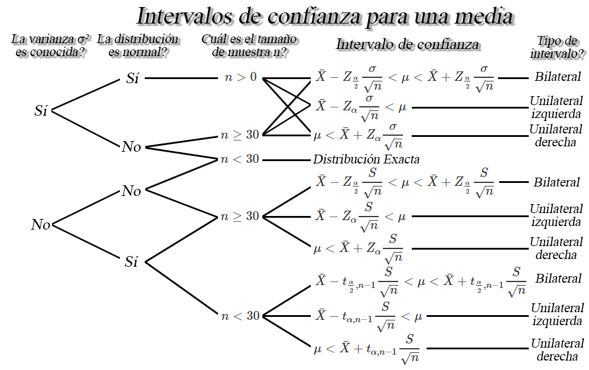

Distribuciones muestrales
-------------------------

### Distribuciones muestrales para diferencia de medias

Sea `$X_{11}, X_{12}, \ldots, X_{1n_1}$` y
`$X_{21}, X_{22}, \ldots, X_{2n_1}$` dos muestras aleatorias *iid* con
medias `$\mathbb{E}(X_{1i})=\mu_1$` y `$\mathbb{E}(X_{2j})=\mu_2$`, y
varianzas `$Var(X_{1i})=\sigma_1^2<\infty$` y
`$Var(X_{2j})=\sigma_2^2<\infty$`, para `$i=1,2,\ldots,n_1$` y
`$j=1,2,\ldots,n_2$`, entonces dependiendo de la distribución de donde
provengan las muestras aleatorias, los tamaños muestrales `$n_1$` y
`$n_2$`, y de si se conocen o no las varianzas `$\sigma^2_1$` y
`$\sigma^2_2$`, se tendra un estadístico diferente.

#### Población normal, con varianzas conocidas y `$n_1,n_2>0$`

`\begin{align*} Z_c=\frac{(\bar{X}_1 - \bar{X}_2) - (\mu_1 - \mu_2)}{\sqrt{\frac{\sigma^2_1}{n_1} + \frac{\sigma^2_2}{n_2}}} \sim N(0,1) \end{align*}`

<button id="Show1" class="btn btn-secondary">
Mostrar Ejercicio
</button>
<button id="Hide1" class="btn btn-info">
Ocultar Ejercicio
</button>
<main id="botoncito1">
<h3 data-toc-skip>
Ejercicio
</h3>

Una empresa envía a \(12\) de sus agentes de ventas a un curso diseñado
para incrementar la motivación, y por tanto, presuntamente su
efectividad. Un año después, estos agentes generan unas ventas con un
valor promedio de \(43.5\) millones de pesos y una desviación estándar
de \(5.6\) millones de pesos.    Durante el mismo periodo, se
extrajo una muestra aleatoria independiente de \(15\) personas que no
habían asistido al curso y las ventas medias generadas y su desviación
estándar fueron de \(40.8\) y \(4.3\) millones de pesos respectivamente.
    Si es posible suponer que las poblaciones se distribuyen
normalmente con varianzas iguales a \(28\) millones de pesos\(^2\) para
quienes se capacitaron y a \(20\) millones de pesos\(^2\) para quienes
no se capacitaron, Cuál es la probabilidad que el promedio de ventas de
personas que reciben capacitación sea superior al promedio de ventas de
quienes no reciben capacitación por almenos \(3\) millones de pesos?

<h3 data-toc-skip>
Solución
</h3>

En este caso se desea calcular la probabilidad de que la diferencia
entre los promedios de ventas entre personas que reciben capacitación
\(\mu_C\) y quienes no reciben capacitación \(\mu_S\), sea superior a
\(3\) millones de pesos, esto es \[\begin{align*}
\mathbb{P}(\mu_C - \mu_S > 3)
\end{align*}\]

Es de anotar que, no conocemos la distribución de probabilidad de la
diferencia de medias, y en consecuencia no podemos calcular la
probabilidad de forma directa, y por tanto, dado que nos dicen que las
poblaciones se distribuyen normalmente con varianzas conocidas, debemos
realizar operaciones matemáticas de tal forma que llevemos la
probabilidad de interés a una estructura conocida, tal como lo es la
distribución normal estándar, que posee la forma \[\begin{align*}
Z_c=\frac{(\bar{X}_C - \bar{X}_S) - (\mu_C - \mu_S)}{\sqrt{\frac{\sigma^2_C}{n_C} + \frac{\sigma^2_S}{n_S}}}
\end{align*}\]

En donde apreciamos que requerimos de las varianzas poblacionales
\(\sigma^2_C\) y \(\sigma^2_S\), los cuales nos dicen que son iguales a
\(\sigma^2_C=20\) y \(\sigma^2_S=28\). Entonces al realizar las
operaciones matemáticas correspondientes, tendremos que

\[\begin{align*}
\mathbb{P}(\mu_C - \mu_S > 3) &= \mathbb{P}(- (\mu_C - \mu_S) < -3) \\
                              &= \mathbb{P}((\bar{X}_C - \bar{X}_S) - (\mu_C - \mu_S) < (43.5 - 40.8) - 3) \\
                              &= \mathbb{P}\left(\frac{(\bar{X}_C - \bar{X}_S) - (\mu_C - \mu_S)}{\sqrt{\frac{\sigma^2_C}{n_C} + \frac{\sigma^2_S}{n_S}}} < \frac{(43.5 - 40.8) - 3}{\sqrt{\frac{20}{12} + \frac{28}{15}}}\right) \\
                              &= \mathbb{P}\left(Z < \frac{-0.3 }{1.825742}\right) \\
                              &= \mathbb{P}\left(Z < -0.1595986\right) \\
\end{align*}\] Y como \(Z \sim N(0,1)\), podemos encontrar la
probabilidad de interés, empleando la
<a href="https://github.com/jiperezga/jiperezga.github.io/raw/master/Dataset/Documentos/DistNormEst.pdf">Tabla
de la Distribución Normal Estándar</a>, la función <tt>pnorm()</tt> del
software <tt>R</tt> o la función <tt>DISTR.NORM.ESTAND.N()</tt> de
Excel, tal que \[\begin{align*}
\mathbb{P}\left(Z < -0.1595986\right) = 0.4365986
\end{align*}\] lo cual, dada la equivalencia de la igualdad anterior,
significará que \[\begin{align*}
\mathbb{P}(\mu_C - \mu_S > 3) = 0.4365986
\end{align*}\]

y consecuencia, se tendrá una probabilidad del \(43.66\%\) de que la
diferencia entre los promedios de ventas entre personas que reciben
capacitación \(\mu_C\) y quienes no reciben capacitación \(\mu_S\), sea
superior a \(3\) millones de pesos.

</main>

#### Población normal, con varianzas desconocidas y `$n_1,n_2\geq30$`

`\begin{align*} Z_c=\frac{(\bar{X}_1 - \bar{X}_2) - (\mu_1 - \mu_2)}{\sqrt{\frac{S^2_1}{n_1} + \frac{S^2_2}{n_2}}} \stackrel{a}{\sim} N(0,1) \end{align*}`

<button id="Show2" class="btn btn-secondary">
Mostrar Ejercicio
</button>
<button id="Hide2" class="btn btn-info">
Ocultar Ejercicio
</button>
<main id="botoncito2">
<h3 data-toc-skip>
Ejercicio
</h3>

Suponga que la Universidad de Antioquia adelanta un estudio sobre el
salario de sus egresados y desea comparar si es cierta la creencia que
las mujeres ganan en promedio menos dinero que los hombres.    
Para comprobar si las creencias son ciertas, un grupo de investigación
de la Universidad toma una muestra representativa de \(250\) mujeres y
\(270\) hombres egresados de la Universidad y se les pregunta sobre cuál
es el salario que ganan actualmente, obteniendo en su invesgicación que
las mujeres ganan en promedio \(2.3\) millones de pesos con una
desviación estándar de \(0.7\) millones de pesos, mientras que los
hombres ganan en promedio \(2.6\) millones de pesos con una desviación
estándar de \(1.2\) millones de pesos. Si el grupo de investigación
encuentra que los salarios se distribuyen normalmente, cuál es la
probabilidad de que la creencia de que las mujeres ganan en promedio
menos dinero que los hombres?

<h3 data-toc-skip>
Solución
</h3>

En este caso se desea calcular la probabilidad de que el salario
promedio que ganan los hombres sea mayor que el salario promedio que
ganan las mujeres, esto es, \[\begin{align*}
\mathbb{P}(\mu_H > \mu_M)
\end{align*}\]

Como para poder encontrar la probabilidad, debemos llevar la
probabilidad planteada a una estructura conocida, tal como lo es la
estructura de una distribución normal estándar de forma aproximada, dado
que el grupo de investigación encontró que los datos se distribuyen
normalmente con varianzas desconocidas, tal que \[\begin{align*}
Z_c=\frac{(\bar{X}_H - \bar{X}_M) - (\mu_H - \mu_M)}{\sqrt{\frac{S^2_H}{n_H} + \frac{S^2_M}{n_M}}}
\end{align*}\]

En donde el grupo de investigación encontró que a partir de las muestras
\(n_H=270\) y \(n_M=250\) se encontró que \(\bar{X}_H=2.6\),
\(S_H=1.2\), \(\bar{X}_M=2.3\) y \(S_M=0.7\). Entonces al realizar las
operaciones matemáticas correspondientes, tendremos que \[\begin{align*}
\mathbb{P}(\mu_H > \mu_M) &= \mathbb{P}(\mu_H - \mu_M > 0) \\
                          &= \mathbb{P}(- (\mu_H - \mu_M) < - 0) \\
                          &= \mathbb{P}((\bar{X}_H - \bar{X}_M) - (\mu_H - \mu_M) < (2.6 - 2.3) - 0) \\
                          &= \mathbb{P}\left(\frac{(\bar{X}_H - \bar{X}_M) - (\mu_H - \mu_M)}{\sqrt{\frac{S^2_H}{n_H} + \frac{S^2_M}{n_M}}} < \frac{(2.6 - 2.3) - 0}{\sqrt{\frac{1.2^2}{270} + \frac{0.7^2}{250}}}\right) \\
                          &= \mathbb{P}\left(Z < \frac{0.3}{0.08540101}\right) \\
                          &= \mathbb{P}\left(Z < 3.512839\right) \\
\end{align*}\] Y como \(Z \stackrel{a}{\sim} N(0,1)\), podemos encontrar
la probabilidad de interés, empleando la
<a href="https://github.com/jiperezga/jiperezga.github.io/raw/master/Dataset/Documentos/DistNormEst.pdf">Tabla
de la Distribución Normal Estándar</a>, la función <tt>pnorm()</tt> del
software <tt>R</tt> o la función <tt>DISTR.NORM.ESTAND.N()</tt> de
Excel, tal que \[\begin{align*}
\mathbb{P}\left(Z < 3.512839\right) = 0.9997783
\end{align*}\] lo cual, dada la equivalencia de la igualdad anterior,
significará que \[\begin{align*}
\mathbb{P}(\mu_H > \mu_M) = 0.9997783
\end{align*}\]

y consecuencia, el grupo de investigación deberá concluir con una
probabilidad \(99.97\%\) de que el salario promedio de sus egresados
hombres es superior que el salario promedio de sus egresados mujeres, lo
cual corrobora la creencia de que las mujeres ganan en promedio menos
dinero que los hombres.

</main>

#### Población normal, con varianzas desconocidas, tal que `$\sigma_1^2=\sigma_2^2$` y `$n_1,n_2<30$`

`\begin{align*} t_c=\frac{(\bar{X}_1 - \bar{X}_2) - (\mu_1 - \mu_2)}{S_p\sqrt{\frac{1}{n_1} + \frac{1}{n_2}}} \sim t_{n_1+n_2-2} \end{align*}`
donde
`\begin{align*} S_p^2 = \frac{(n_1-1)S^2_1+(n_2-1)S^2_2}{n_1+n_2-2} \end{align*}`

<button id="Show3" class="btn btn-secondary">
Mostrar Ejercicio
</button>
<button id="Hide3" class="btn btn-info">
Ocultar Ejercicio
</button>
<main id="botoncito3">
<h3 data-toc-skip>
Ejercicio
</h3>

La gobernación de Antioquia, desea realizar un estudio sobre el peso de
los niños y las niñas que se encuentran cursando su primaria en los
colegios ubicados en las regiones del departamento, y decide contratar a
un grupo de investigación la Universidad de Antioquia para llevar a cabo
dicho estudio.    El grupo de investigación decide tomar una
muestra aleatoria de \(22\) niños y \(28\) niñas que se encuentran
realizando sus estudios de primaria entre los colegios que hay en la
región antioqueña, encontrando que el peso promedio y desviación
estándar de los niños fue de \(52\) kilos con una desviación estándar de
\(8\) kilos, mientras que el peso promedio y desviación estándar de las
niñas fue de \(46\) kilos con una desviación estándar de \(6.2\) kilos.
Si el peso de los niños y niñas se distribuye normalmente, calcule la
probabilidad de que el peso promedio de los niños sea a lo más el peso
promedio de las niñas más \(3\) kilogramos. Suponga que la variabilidad
de los pesos de los niños y las niñas son iguales.

<h3 data-toc-skip>
Solución
</h3>

En este punto estamos interesados en calcular la probabilidad de que el
peso promedio de los niños sea a lo más el peso promedio de las niñas
más \(3\) kilogramos, lo cual es equivalente a que, la diferencia entre
los pesos promedio de niños y niñas sea como máximo de \(3\), esto es
\[\begin{align*}
\mathbb{P}(\mu_H \leq \mu_M + 3) = \mathbb{P}(\mu_H - \mu_M \leq 3) 
\end{align*}\]

Similar a puntos anteriores, debemos realizar operaciones matemáticas
para llevar la estructura de la probabilidad de interés a una estructura
conocida, dependiendo de la información que poseemos. En este caso,
tenemos que el peso de los niños y las niñas se distruye normalmente con
varianzas desconocidas pero iguales, y además poseemos que los tamaños
muestrales son pequeños (\(n_H, n_M \leq 30\)) y por tanto podemos
llevar la estructura a la forma de una distribución \(t\) de
\(n_H+n_M-2\) grados de libertad, tal que

\[\begin{align*}
t_c=\frac{(\bar{X}_H - \bar{X}_M) - (\mu_H - \mu_M)}{Sp\sqrt{\frac{1}{n_H} + \frac{1}{n_M}}} \sim t_{n_H+n_M-2}
\end{align*}\]

En donde observamos que entre otros valores, requerimos calcular el
valor de la desviación estándar conjunta \(Sp\), la cual está dada por

\[\begin{align*}
Sp^2 &= \frac{(n_H-1)S^2_H + (n_M-1)S^2_M}{n_H+n_M-2} \\
     &= \frac{(22-1)8^2 + (28-1)6.2^2}{22 + 28 - 2} \\
     &= 49.6225
\end{align*}\] y por tanto \[\begin{align*}
Sp &= \sqrt{Sp^2} \\
   &= \sqrt{49.6225} \\
   &= 7.044324
\end{align*}\]

Ahora, al usar los valores encontrados en la investigación \(n_H=22\) y
\(n_M=28\), \(\bar{X}_H=52\), \(S_H=8\), \(\bar{X}_M=46\) y \(S_M=6.2\),
tendremos que la probabilidad de interés será igual a \[\begin{align*}
\mathbb{P}(\mu_H - \mu_M \leq 3) &= \mathbb{P}(-(\mu_H - \mu_M) \geq - 3) \\
                                 &= \mathbb{P}((\bar{X}_H - \bar{X}_M) - (\mu_H - \mu_M) \geq (52 - 46) - 3) \\
                                 &= \mathbb{P}\left(\frac{(\bar{X}_H - \bar{X}_M) - (\mu_H - \mu_M)}{Sp\sqrt{\frac{1}{n_H} + \frac{1}{n_M}}} \geq \frac{(52 - 46) - 3}{7.044324\sqrt{\frac{1}{22} + \frac{1}{28}}}\right) \\
                                 &= \mathbb{P}\left(t_{28+22-2} \geq \frac{3}{2.006938}\right) \\
                                 &= \mathbb{P}\left(t_{48} \geq 1.494814\right) \\
\end{align*}\] Y como \(t \sim t_{48}\), podemos entonces podemos
encontrar la probabilidad de interés, empleando la
<a href="https://github.com/jiperezga/jiperezga.github.io/raw/master/Dataset/Documentos/DistTStudent.pdf">Tabla
de la Distribución t de Student</a>, la función <tt>pt()</tt> del
software <tt>R</tt> o las funciones <tt>DISTR.T.N()</tt> o
<tt>DISTR.T.CD()</tt> de Excel, tal que \[\begin{align*}
\mathbb{P}\left(t_{48} > 1.494814\right) = 0.07075437
\end{align*}\] lo cual, dada la equivalencia de la igualdad anterior,
significará que \[\begin{align*}
\mathbb{P}(\mu_H - \mu_M \leq 3) = 0.07075437
\end{align*}\]

y consecuencia, se tendrá que la probabilidad de que la diferencia entre
los pesos promedio de niños y niñas sea como máximo de \(3\) kilos, es
del \(7.07\%\), lo cual parece poco probable, y por tanto podría
pensarse que la diferencia entre los pesos promedio debería ser mayor a
\(3\) kilos.

</main>

#### Población normal, con varianzas desconocidas, tal que `$\sigma_1^2\neq\sigma_2^2$` y `$n_1,n_2<30$`

`\begin{align*} t_c=\frac{(\bar{X}_1 - \bar{X}_2) - (\mu_1 - \mu_2)}{\sqrt{\frac{S^2_1}{n_1} + \frac{S^2_2}{n_2}}} \sim t_\nu \end{align*}`
donde
`\begin{align*} \lceil\nu\rceil = \frac{\left(\frac{S_1^2}{n_1} + \frac{S_2^2}{n_2}\right)^2}{\left[\frac{(S_1^2/n_1)^2}{n_1-1}\right] + \left[\frac{(S_2^2/n_2)^2}{n_2-1}\right]} \end{align*}`

<button id="Show3" class="btn btn-secondary">
Mostrar Ejercicio
</button>
<button id="Hide3" class="btn btn-info">
Ocultar Ejercicio
</button>
<main id="botoncito3">
<h3 data-toc-skip>
Ejercicio
</h3>

Suponga que se contrata a un grupo de investigación de la Universidad de
Antioquia para que realice un análisis de tensión sobre la unión pegada
con una resina experimental a dos clases diferentes de madera. Para
realizar el estudio, el grupo de investigación toma una muestra
aleatoria de \(18\) uniones pegadas con la resina especial a la madera
\(A\) y encontró que la tensión promedio de corte y desviación estándar
fueron de \(1130_{psi}\) y \(420_{psi}\), respectivamente. Por su parte,
toman una muestra aleatoria de \(12\) uniones pegadas con la resina
especial a la madera \(B\), encontrando que la tensión promedio de corte
y desviación estándar fueron de \(1010_{psi}\) y \(380_{psi}\).   
Si se asume que la tensión sobre la unión pegada con la resina
experimental en cada clase de madera se distribuye aproximadamente
normal con varianzas diferentes. Calcule la probabilidad de que la
tensión promedio de corte de la madera \(B\) sea menor a la tensión
promedio de corte de la madera \(A\).

<h3 data-toc-skip>
Solución
</h3>

En este ejercicio estamos interesados en calcular la probabilidad de que
la tesión promedio de la madera \(B\) sea menor a la tensión promedio de
corte de la madera \(A\), esto es \[\begin{align*}
\mathbb{P}(\mu_B < \mu_A)
\end{align*}\]

Dado que no conocemos la distribución de \(\mu_B - \mu_A\) para realizar
el cálculo de la probabilidad de interés, debemos realizar operaciones
matemáticas para llevar dicha estructura a una forma conocida, en donde,
para este caso tenemos que la unión pegada con la resina experimental en
cada clase de madera se distribuye aproximadamente normal con varianzas
diferentes pero desconocidas, y además poseemos que los tamaños
muestrales son pequeños (\(n_A, n_B \leq 30\)) y por tanto podemos
llevar la estructura a la forma de una distribución \(t\) de \(\nu\)
grados de libertad, tal que

\[\begin{align*}
t_c=\frac{(\bar{X}_B - \bar{X}_A) - (\mu_B - \mu_A)}{\sqrt{\frac{S^2_B}{n_B} + \frac{S^2_A}{n_A}}} \sim t_\nu
\end{align*}\]

siendo el valor de los grados de libertad \(\nu\) iguales a
\[\begin{align*}
\lceil\nu\rceil &= \frac{\left(\frac{S_B^2}{n_B} + \frac{S_A^2}{n_A}\right)^2}{\left[\frac{(S_B^2/n_B)^2}{n_B-1}\right] + \left[\frac{(S_A^2/n_A)^2}{12-1}\right]}\\
                &= \frac{\left(\frac{380^2}{12} + \frac{420^2}{18}\right)^2}{\left[\frac{(380^2/12)^2}{12-1}\right] + \left[\frac{(420^2/18)^2}{18-1}\right]}\\
                &= \frac{476694444}{18813149} \\
                &= 25.33837 \\
                &= 26
\end{align*}\]

Ahora al emplear los valores muestrales encontrados previamente por el
grupo de investigación, tendremos que la probabilidad de interés es
igual a \[\begin{align*}
\mathbb{P}(\mu_B < \mu_A) &= \mathbb{P}(\mu_B - \mu_A < 0) \\
                          &= \mathbb{P}(-(\mu_B - \mu_A) > - 0) \\
                          &= \mathbb{P}((\bar{X}_B - \bar{X}_A) - (\mu_B - \mu_A) > (1010 - 1130) - 0) \\
                          &= \mathbb{P}\left(\frac{(\bar{X}_B - \bar{X}_A) - (\mu_B - \mu_A)}{\sqrt{\frac{S^2_B}{n_B} + \frac{S^2_A}{n_A}}} > \frac{(1010 - 1130) - 0}{\sqrt{\frac{380^2}{12} + \frac{420^2}{18}}}\right) \\
                          &= \mathbb{P}\left(t_{26} > \frac{-120}{147.7611}\right) \\
                          &= \mathbb{P}\left(t_{26} > -0.8121217\right) \\
\end{align*}\] Y como \(t \sim t_{26}\), podemos entonces podemos
encontrar la probabilidad de interés, empleando la
<a href="https://github.com/jiperezga/jiperezga.github.io/raw/master/Dataset/Documentos/DistTStudent.pdf">Tabla
de la Distribución t de Student</a>, la función <tt>pt()</tt> del
software <tt>R</tt> o las funciones <tt>DISTR.T.N()</tt> o
<tt>DISTR.T.CD()</tt> de Excel, tal que \[\begin{align*}
\mathbb{P}\left(t_{26} > -0.8121217\right)= 0.7879523
\end{align*}\] lo cual, dada la equivalencia de la igualdad anterior,
significará que \[\begin{align*}
\mathbb{P}(\mu_B < \mu_A) = 0.7879523
\end{align*}\]

y consecuencia, se tendrá que la probabilidad de que la tesión promedio
de la madera \(B\) sea menor a la tensión promedio de corte de la madera
\(A\) es del \(78.79\%\), lo cual parece muy probable.

</main>

#### Población no normal, con varianzas desconocidas y `$n_1,n_2\geq30$`

`\begin{align*} Z_c=\frac{(\bar{X}_1 - \bar{X}_2) - (\mu_1 - \mu_2)}{\sqrt{\frac{S^2_1}{n_1} + \frac{S^2_2}{n_2}}} \stackrel{a}{\sim} N(0,1) \end{align*}`

### Distribución muestral para diferencia de proporciones `$p_1 - p_2$`

Sea `$X_{11}, X_{12}, \ldots, X_{1n_1}$` y
`$X_{21}, X_{22}, \ldots, X_{2n_1}$` dos muestras aleatorias *iid* de
tamaño `$n_1$` y `$n_2$`, tal que `$X_{1i}\sim b(n_1,p_1)$` y
`$X_{2i}\sim b(n_2,p_2)$`. Entonces si `$n_1$` y `$n_2$` son
suficientemente grandes, y las proporción `$p_1$`, `$p_2$` no está muy
cercana a `$0$` o a `$1$`, tal que `$n_ip_i$` y `$n_i(1-p_i)>5$`,
entonces se puede probar que
`\begin{align*} \hat{p_1}  = \frac{x_1}{n_1} \stackrel{a}{\sim} N\left(p_1, \frac{p_1(1-p_1)}{n_1}\right) \quad \quad \text{ y } \quad \quad \hat{p_2}  = \frac{x_2}{n_2} \stackrel{a}{\sim} N\left(p_2, \frac{p_2(1-p_2)}{n_2}\right) \end{align*}`
Y por teorema de estandarización se obtendrá que
`\begin{align*} Z_c = \frac{(\hat{p_1} - \hat{p_2}) - (p_1 - p_2)}{\sqrt{\frac{p_1(1-p_1)}{n_1} + \frac{p_2(1-p_2)}{n_2}}} \stackrel{a}{\sim} N(0,1) \end{align*}`

Estimación puntual
------------------

Como su nombre lo indica, es un único valor que se calcula a partir de
una muestra, con el fin de realizar una aproximación al verdadero valor
desconocido del parámetro de interés. El problema es que en muchas
situaciones prácticas, es posible encontrar varias estimaciones
puntuales para el mismo parámetro poblacional de interés, y por tanto,
se hace necesario emplear aquellos estadísticos que estimen los
parámetros, de tal forma que cumplan las condiciones de insesgadez,
eficiencia, consistencia y suficiencia.

Estimación por intervalos
-------------------------

Podría ser que ni el estimador que cumpla las propiedades de insesgadez,
eficiencia, consistencia y suficiencia, estimen con exactitud el
parámetro poblacional de interés- Por esta razón, puede ser preferible
determinar un intervalo dentro del cual, se espera encontrar el valor
verdadero del parámetro poblacional.

### Definición

Sea `$\theta$` un parámetro poblacional desconocido, entonces basándose
en la información de una muestra aleatoria de dicha población, el
objetivo será encontrar dos variables aleatorias `$\hat{\Theta}_I$` y
`$\hat{\Theta}_S$` tal que
`\begin{align*} \mathbb{P}(\hat{\Theta}_I<\Theta<\hat{\Theta}_S) = 1-\alpha \quad \quad 0<\alpha<1 \end{align*}`
donde `$(1-\alpha)$` se conoce como nivel de confianza y
`$\hat{\Theta}_I$` y `$\hat{\Theta}_S$` se denominan como límites de
confianza inferior y superior, tal que
`$\hat{\Theta}_I<\hat{\Theta}_S$`.

### Nota

<ol type="a">
<li>
Usualmente se usan valores para \(\alpha\) de \(0.1, 0.05\) y $ 0.01$,
es decir, niveles de confianza de \(0.9, 0.95\) y \(0.99\).
</li>
<li>
La longitud o amplitud del intervalo construido, medirá la
<strong>precisión</strong> de la estimación realizada, por tanto,
intervalos largos proporcionan estimaciones más imprecisas, mientras que
intervalos cortos proporcionan estimaciones más precisas.
</li>
<li>
A medida que aumenta el nivel de confianza, la amplitud del intervalo se
hace más grande.
</li>
<li>
A medida que aumenta el tamaño de muestra, la amplitud del intervalo se
hace más pequeño.
</li>
</ol>

Interpretación de nivel de confianza
------------------------------------

El nivel de confianza, `$1-\alpha$`, mide la fiabilidad del intervalo de
probabilidad, esto es, la probabilidad de que el verdadero valor del
parámetro se encuentre dentro del intervalo construido. Es decir, que si
se realiza el experimento muchas veces, se tendrá que en el
`$100(1-\alpha)\%$` de los intervalos de confianza construidos en cada
experimento, se encontrará contenido el verdadero valor del parámetro de
interés.

Intervalos de confianza para una media `$\mu$`
----------------------------------------------

Sea `$X_1, X_2, \ldots, X_n$` una muestra aleatoria *iid* de tamaño
`$n$` con media desconocida `$\mathbb{E}(X)=\mu$`, y varianza
`$Var(X)=\sigma^2<\infty$`, entonces dependiendo de las condiciones, se
tendrán los siguientes intervalos de confianza para la media `$\mu$`.

