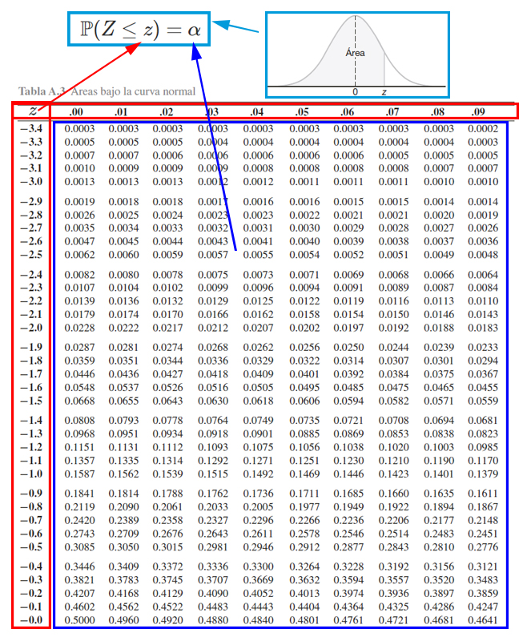
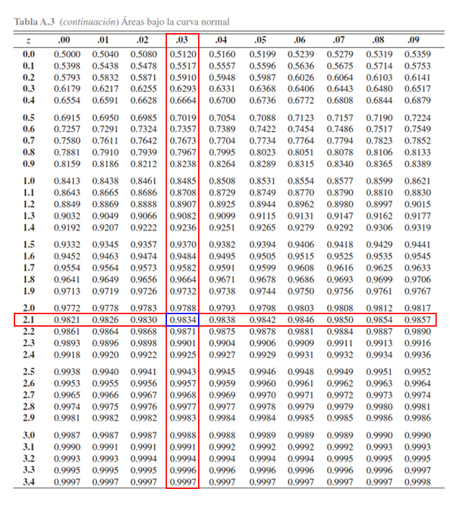
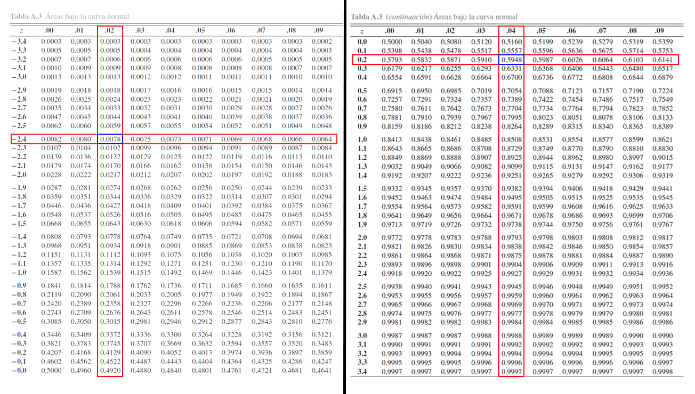
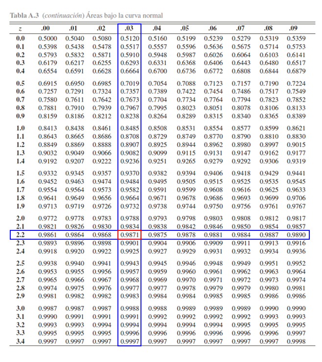
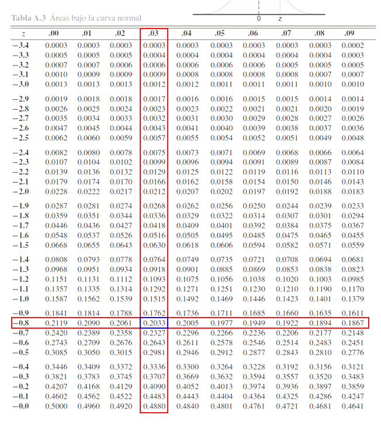
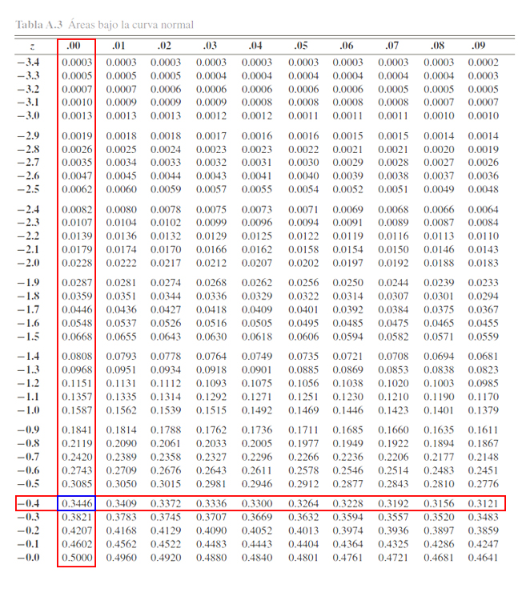

Distribuciones de probabilidad continuas
----------------------------------------

### Distribución Normal

Se dice que la variable aleatoria `$X$` tiene una distribución Normal
con parámetros `$\mu$` y `$\sigma^2)$`, si su función de densidad de
probabilidad es de la forma
`\begin{align*}  f(x) = \begin{cases} \frac{1}{\sqrt{2\pi\sigma^2}}e^{-\frac{(x - \mu)^2}{2\sigma^2}} & -\infty<x<\infty, -\infty<\mu<\infty, \sigma^2>0 \\ 0 & \text{en otro caso} \end{cases} \end{align*}`

#### Teorema

Si `$X\sim N(\mu, \sigma^2)$`, entonces se puede probar que la media y
la varianza de la variable aleatoria `$X$` están dadas por
`\begin{align*} \mathbb{E}(X)=\mu \quad \quad Var(X)=\sigma^2 \end{align*}`

### Distribución Normal estándar

Un caso particular de la distribución normal cuando la media `$\mu=0$` y
ka varianza `$\sigma^2=1$`, recibe el nombre de distribución normal
estándar, cuya variable aleatoria se simboliza con `$Z$`, tal que
`$Z\sim N(0,1)$`, y donde su función de densidad de probabilidad está
dada por

`\begin{align*}  f(z) = \begin{cases} \frac{1}{\sqrt{2\pi}}e^{-\frac{z^2}{2}} & -\infty<z<\infty \\ 0 & \text{en otro caso} \end{cases} \end{align*}`

### Teorema de Estandarización

Si `$X\sim N(\mu, \sigma^2)$`, siendo `$a$` y `$b$` dos constantes
cualquiera, entonces si se realiza la transformación
`$Z=\frac{x-\mu}{\sigma}$` conocida como **estandarización**, se tendrá
que `$Z\sim N(0,1)$`, con `$z_1$` y `$z_2$` las dos constantes
transformadas.

### Propiedades

Si `$X\sim N(\mu, \sigma^2)$`, entonces al aplicar el teorema de
estandarización `$Z=\frac{x-\mu}{\sigma} \sim N(0,1)$`, y por tanto, si
`$z_1$` y `$z_2$` son constantes, se tendrá que

1.  `$\mathbb{P}(Z\leq z_1) = \mathbb{P}(Z\geq -z_1)$`
2.  `$\mathbb{P}(Z\geq z_1) = \mathbb{P}(Z\leq -z_1) = 1- \mathbb{P}(Z\leq z_1)$`
3.  `$\mathbb{P}(z_1\leq Z\leq z_2) = \mathbb{P}(Z\leq z_2) - \mathbb{P}(Z< z_1)$`
4.  Si `$z_1 = - z_2$` entonces
    `$\mathbb{P}(z_1\leq Z\leq z_2) = \mathbb{P}(-z_2\leq Z\leq z_2) =2\mathbb{P}(Z\leq z_2) - 1$`
5.  `$Z_\alpha$` es el valor de la variable aleatoria `$Z\sim N(0,1)$`
    tal que `$\mathbb{P}(Z\geq Z_\alpha)=\alpha$`, y
    `$\mathbb{P}(Z\leq Z_\alpha)=1 - \alpha$`

En donde, debe recordarse que, al ser la distribución normal una
distribución continua, la `$\mathbb{P}(Z\leq z_1) = \mathbb{P}(Z< z_1)$`
y `$\mathbb{P}(Z\geq z_1) = \mathbb{P}(Z > z_1)$`. Lo anterior debido a
que en la distribuciones continuas la probabilidad puntual es igual a
`$0$`.

<button id="Show1" class="btn btn-secondary">
Mostrar Ejercicio Manejo de Tabla
</button>
<button id="Hide1" class="btn btn-info">
Ocultar Ejercicio Manejo de Tabla
</button>
<main id="botoncito1">
<h3 data-toc-skip>
Ejercicio
</h3>

Suponga que poseemos una distribución normal estándar, tal que
\(Z\sim N(0,1)\). Entonces, a partir de esta distribución y empleando la
<a href="https://github.com/jiperezga/jiperezga.github.io/raw/master/Dataset/Documentos/DistNormEst.pdf">Tabla
de la Distribución Normal Estándar</a>, calcule
<ol>
<li>
\(\mathbb{P}(Z\leq 1.96)\)
</li>
<li>
\(\mathbb{P}(Z> 2.13)\)
</li>
<li>
\(\mathbb{P}(-2.42 <Z \leq 0.24)\)
</li>
<li>
\(\mathbb{P}(Z>z) = 0.0129\)
</li>
</ol>

<h3 data-toc-skip>
Solución
</h3>

Para calcular probabilidades con la tabla de la distribución normal
estándar, es necesario tener en cuenta el funcionamiento de la tabla
misma, y para ello, se debe entender su funcionamiento. Y para ello se
presenta la siguiente imagen.

En donde, se aprecia que, <strong>los cuadros rojos representan los
valores críticos</strong> \(z\) que se emplea para calcular
probabilidades, en donde, el cuadro rojo de la parte izquierda muestra
la parte entera y el primer decimal, mientras que el cuadro rojo de la
parte superior muestra el segundo decimal. <strong>El cuadro azul
representa las probabilidades</strong> \(\alpha\) que se desean calcular
a partir de los valores críticos. Finalmente, <strong>el cuadro azul
claro representa el funcionamiento de la tabla </strong>, la cual
muestra las probabilidades que poseen la forma
\(\mathbb{P}(Z<z)=\alpha\).

<ol>
<li>

Con la explicación de la tabla en mente, la primera probabilidad a
calcular es \(\mathbb{P}(Z\leq 1.96)\). Entonces como esta probabilidad
tiene la estructura establecida por la tabla \(\mathbb{P}(Z\leq z)\),
será cuestión de buscar el valor crítico \(1.96\) para localizar la
probabilidad asociada, tal que se busca en la parte izquierda, el valor
\(1.9\) y en la parte superior el valor \(0.06\), y en donde se
encuentre el cruce de ambos valores, se encontrará el valor de la
probabilidad asociada a \(1.96\). Dicho procedimiento se muestra en la
siguiente imagen

Donde se aprecia que

\[\begin{align*}\mathbb{P}(Z\leq 1.96)=0.9750\end{align*}\]

</li>
<li>

A diferencia del punto anterior, observamos que la probabilidad
propuesta \(\mathbb{P}(Z> 2.13)\) tiene una estructura diferente a la
establecida por la tabla \(\mathbb{P}(Z\leq z)\), y por tanto, será
necesario emplear el complemento de la probabilidad propuesta para
obtener una estructura similar a la propuesta por la tabla, tal que

\[\begin{align*}
\mathbb{P}(Z> 2.13)= 1 - \mathbb{P}(Z\leq 2.13)
\end{align*}\] En donde, se aprecia podemos calcular la
\(\mathbb{P}(Z> 2.13)\), mediante el empleo de la
\(\mathbb{P}(Z\leq 2.13)\), la cual podemos buscar en la tabla
directamente. Para localizar \(\mathbb{P}(Z\leq 2.13)\), se busca el
valor \(2.1\) en la parte izquierda de la tabla, y el valor \(0.03\) en
la parte superior de la tabla, y en donde se encuentre el cruce de ambos
valores, se encontrará el valor de la probabilidad asociada a \(2.13\).

Donde se aprecia que

\[\begin{align*}
\mathbb{P}(Z\leq 2.13)=0.9834
\end{align*}\]

y por tanto, se tendrá que

\[\begin{align*}
\mathbb{P}(Z> 2.13)&= 1 - \mathbb{P}(Z\leq 2.13)\\
                   &= 1 - 0.9834 \\
                   &= 0.0166
\end{align*}\]

</li>
<li>

En este caso, se desea calcular la \(\mathbb{P}(-2.42 <Z \leq 0.24)\), y
se observa que la estructura de dicha probabilidad es diferente a la
establecida por la tabla \(\mathbb{P}(Z\leq z)\), pero también podemos
apreciar que si aplicamos las propiedades de la función de distribución
acumulada para el caso continuo, ya presentadas en la
<a href="../../ProbabilidadeInferencia/PeIEClase08.html#función-de-distribución-acumulada-caso-continuo">Clase
08</a>, podemos llevar la probabilidad de interés a la forma

\[\begin{align*}
\mathbb{P}(-2.42 <Z \leq 0.24) = \mathbb{P}(Z \leq 0.24) - \mathbb{P}(Z \leq -2.42)
\end{align*}\] obteniendo que la probabilidad
\(\mathbb{P}(-2.42 <Z \leq 0.24)\), puede calcularse mediante el empleo
de las probabilidades acumuladas \(\mathbb{P}(Z \leq 0.24)\) y
\(\mathbb{P}(Z \leq -2.42)\), las cuales pueden calcularse en la tabla
de forma similar a los dos puntos anteriores.

Donde se aprecia que

\[\begin{align*}
\mathbb{P}(Z \leq -2.42)=0.0078 \quad \text{ y } \quad \mathbb{P}(Z \leq 0.24)=0.5948
\end{align*}\]

y por tanto, se tendrá que

\[\begin{align*}
\mathbb{P}(-2.42 <Z \leq 0.24) &= \mathbb{P}(Z \leq 0.24) - \mathbb{P}(Z \leq -2.42)\\
                               &= 0.5948 - 0.0078  \\
                               &= 0.587
\end{align*}\]
</li>
<li>

En este punto, a diferencia de los puntos anteriores, no están dando el
valor de la probabilidad y nos piden encontrar el valor crítico \(z\).
Es decir debemos calcular el valor crítico asociado a la probabilidad
\[\begin{align*}
\mathbb{P}(Z>z) = 0.0129
\end{align*}\]

Y para ello, debemos llevar inicialmente la estructura de la
probabilidad, a la estructura manejada por la tabla, tal que

\[\begin{align*}
\mathbb{P}(Z>z) &= 0.0129 \\
1 - \mathbb{P}(Z\leq z) &= 0.0129 \\
1- 0.0129 &= \mathbb{P}(Z\leq z) \\
0.9871 &= \mathbb{P}(Z\leq z)
\end{align*}\]

En donde observamos que la probabilidad \(\mathbb{P}(Z\leq z)\) ya posee
la estructura de la tabla, y en consecuencia, podemos proceder a
encontrar el valor crítico \(z\), buscando el valor de la probabilidad
\(0.9871\) en la parte interior de la tabla, y luego buscando cual es el
valor crítico \(z\) asociado a dicha probabilidad.

En la tabla se aprecia, que al buscar la probabilidad \(0.9871\)
encontramos que el valor crítico \(z\) asociado es de \(2.24\), es decir

\[\begin{align*}
\mathbb{P}(Z\leq 2.24) &= 0.9871
\end{align*}\]

o equivalentemente

\[\begin{align*}
\mathbb{P}(Z > 2.24) &= 0.0129
\end{align*}\]

</li>
</ol>
</main>
<button id="Show2" class="btn btn-secondary">
Mostrar Ejercicio
</button>
<button id="Hide2" class="btn btn-info">
Ocultar Ejercicio
</button>
<main id="botoncito2">
<h3 data-toc-skip>
Ejercicio
</h3>

Suponga que cierto tipo de batería para celular dura en promedio \(5\)
años con una desviación estándar de \(1.2\) años. Si se sabe por
experiencia que la distribución de las baterías se distribuye
normalmente, cuál es la probabilidad de que una batería de celular dure
al menos \(4\) años?

<h3 data-toc-skip>
Solución
</h3>

En este caso estamos interesados en que la batería de una celular dure
al menos \(4\) años, es decir, queremos calcular la siguiente
probabilidad. \[\begin{align*}
\mathbb{P}(X \geq 4)
\end{align*}\] Pero en este caso tenemos que la distribución de los
datos no se distribuye \(N(0,1)\), si no que se distribuye
\(N(5, 1.2)\), y por ello debemos aplicar el teorema de estandarización,
con el fin de llevar la distribución \(N(5, 1.2)\) a una normal
estándar, tal que \[\begin{align*}
\mathbb{P}(X \geq 4)&=\mathbb{P}\left(\frac{X-\mu}{\sigma}\geq \frac{4-5}{1.2}\right)\\
\mathbb{P}(X \geq 4)&=\mathbb{P}\left(\frac{X-\mu}{\sigma}\geq \frac{4-5}{1.2}\right)\\
\mathbb{P}(X \geq 4)&=\mathbb{P}(Z \geq -0.83)
\end{align*}\] En donde \(Z\sim N(0,1)\). Ahora, como la estructura de
la probabilidad de \(Z\) no posee la estructura de la probabilidad de se
maneja en la tabla, entonces procedemos a calcular el complemento de la
probabilidad, tal que \[\begin{align*}
\mathbb{P}(Z \geq -0.83)&= 1 - \mathbb{P}(Z < -0.83) \\
\end{align*}\] y en consecuencia podemos ahora buscar la probabilidad
\(\mathbb{P}(Z < -0.83)\) en la tabla de la distribución normal
estándar, de la siguiente manera

Donde se aprecia que

\[\begin{align*}
\mathbb{P}(Z < -0.83)=0.2033
\end{align*}\]

y por tanto, se tendrá que

\[\begin{align*}
\mathbb{P}(Z \geq -0.83)&= 1 - \mathbb{P}(Z < -0.83) \\
                        &= 1 - 0.2033 \\
                        &= 0.7967
\end{align*}\]

lo cual es equivalente a

\[\begin{align*}
\mathbb{P}(X \geq 4)&= \mathbb{P}(Z \geq -0.83) \\
                    &= 0.7967
\end{align*}\]

En consecuencia, se tendrá que la probabilidad de que una batería de
celular dure al menos \(4\) años, es del \(76.67\%\).

</main>

Teoremas de Aproximación
------------------------

### Teorema de Aproximación Binomial a Poisson

Si `$X\sim b(n,p)$` con `$n$` grande `$(n\geq 100)$` y `$p$` pequeña
`$(p\leq 0.01)$` entonces se dice que
`$X\stackrel{a}{\sim}Pois(\lambda)$` donde `$\lambda = np$`.

<button id="Show3" class="btn btn-secondary">
Mostrar Ejercicio
</button>
<button id="Hide3" class="btn btn-info">
Ocultar Ejercicio
</button>
<main id="botoncito3">
<h3 data-toc-skip>
Ejercicio
</h3>

Suponga que al realizar un estudio sobre un proceso de producción, se
encontró que el \(3\%\) de los artículos producidos resultaba tener
algún tipo de defecto. Si se producen \(900\) artículos en un día, cuál
es la probabilidad de que \(30\) artículos o menos resulten tener algún
tipo de defecto. Emplee tanto la distribución binomial como la
aproximación a Poisson y comente sobre los resultados obtenidos.

<h3 data-toc-skip>
Solución
</h3>

En este caso estamos interesados en calcular una probabilidad binomial
de un grupo \(n\) de \(900\) artículos, de los cuales se busca a que el
número de artículos defectuosos \(X\), sea de al menos \(30\)
defectuosos, sabiendo que la probabilidad de producir un artículo
defectuoso es del \(3\%\). Esto es \[\begin{align*}
\mathbb{P}(X \geq 30)&= \sum_{30}^{900} \left(\begin{array}{c}900\\ x\end{array}\right) (0.03)^x(0.97)^{900-x}
\end{align*}\] En donde, como se tiene una sumatoria desde \(30\) hasta
\(900\) se decide emplear el complemento de la probabilidad, tal que
\[\begin{align*}
\mathbb{P}(X \geq 30) &= 1 - \mathbb{P}(X < 30) \\
                      &= 1 - \sum_{0}^{29} \left(\begin{array}{c}900\\ x\end{array}\right) (0.03)^x(0.97)^{900-x} \\
                      &= 1 - 0.695578212 \\
                      &= 0.3044218
\end{align*}\] Es decir, que la probabilidad de que al menos \(30\)
artículos de los \(900\) sean defectuosos es del \(30.44\%\).    

Ahora, si realizamos la aproximación de la distribución binomial a la
distribución Poisson que resultado tendríamos?.    

Para ello será necesario calcular el parámetro \(\lambda\) de la
distribución Poisson, el cual está dado por \[\begin{align*}
\lambda &= np \\
        &= 900(0.03)
        &= 27
\end{align*}\] Es decir que la distribución \(b(n=900, p=0.03)\) puede
aproximarse a una distribución \(Pois(\lambda=27)\), que \(n\) es grande
y \(p\) es pequeño (aunque éste no cumpla la condición de que
\(p\leq 0.01\), pero dichas condiciones son valores para tener como
puntos de referencia). Por tanto, al calcular la probabilidad con la
distribución Poisson tenemos que \[\begin{align*}
\mathbb{P}(X \geq 30) &= 1 - \mathbb{P}(X < 30) \\
                      &= 1 - \sum_{0}^{29} \frac{e^{-27}27^x}{x!} \\
                      &= 1 - 0.6934654545 \\
                      &= 0.3065345
\end{align*}\] Lo cual indica que, al realizar la aproximación, se tiene
un \(30.65%\) de probabilidad de que al menos \(30\) artículos de los
\(900\) seleccionados, resulten tener algún tipo de defecto.    

Al observar las dos probabilidades anteriores, la calculada con la
distribución binomial \(30.44\%\), y la calculada con la distribución
Poisson \(30.65\%\), se aprecia que las dos son muy similares, y en
consecuencia, se dice que la distribución Poisson dadas las
características del ejercicio ofrece una buena aproximación al que se
obtendría con la distribución binomial.

</main>

### Teorema de Aproximación Binomial a Normal

Si `$X\sim b(n,p)$` con `$n$` grande `$(n\geq 30)$` y `$p$` cercano a
0.5 `$(p\approx 0.5)$` entonces se dice que
`$X\stackrel{a}{\sim}N(\mu,\sigma^2)$` donde `$\mu = np$` y
`$\sigma^2 = np(1-p)$`.

Además, se tendrá que `$Z\stackrel{a}{\sim}N(0,1)$`, tal que
`\begin{align*} Z=\frac{x-np}{\sqrt{np(1-p)}}\stackrel{a}{\sim}N(0,1) \end{align*}`

La aproximación será buena si `$np$` y `$n(1-p)>5$`.

**Nota:** Para realizar la aproximación de binomial a normal, se debe
usar un factor de corrección de continuidad de 0.5, así
`\begin{align*}  \text{Binomial} & & & & \text{Normal} \quad \quad \quad \quad \quad \\ \mathbb{P}(X\leq a) & & & & \mathbb{P}(X\leq a + 0.5) \quad \quad \quad \quad \; \\ \mathbb{P}(X<a) & & & & \mathbb{P}(X\leq a - 0.5) \quad \quad \quad \quad \; \\ \mathbb{P}(X\geq a) & & & & \mathbb{P}(X\geq a - 0.5) \quad \quad \quad \quad \; \\ \mathbb{P}(X>a) & & & & \mathbb{P}(X\geq a + 0.5) \quad \quad \quad \quad \; \\ \mathbb{P}(X=a) & & & & \mathbb{P}(a - 0.5 \leq X\leq a + 0.5) \end{align*}`

<button id="Show4" class="btn btn-secondary">
Mostrar Ejercicio
</button>
<button id="Hide4" class="btn btn-info">
Ocultar Ejercicio
</button>
<main id="botoncito4">
<h3 data-toc-skip>
Ejercicio
</h3>

Suponga que el ministerio de salud realiza un estudio sobre la
probabilidad de que una persona de \(40\) años muera antes de la edad de
jubilación a los \(62\) años, y encuentra que dicha probabilidad es de
\(15\%\). Si se toma como referencia un grupo de \(1500\) personas que
posee \(40\) años de edad, cuál es la probabilidad de que menos de
\(225\) muera antes de la edad de jubilación?.

<h3 data-toc-skip>
Solución
</h3>

En este caso estamos interesados en calcular cuál es la probabilidad de
que menos de \(220\) personas mueran antes de los \(62\) años, y se toma
como grupo de estudio un total de \(1500\) personas, sabiendo que la
probabilidad de que mueran antes de los \(62\) es del \(15\%\), es
decir, tenemos que \(X\sim b(n=1500, p=0.15)\), y deseamos calcular
\[\begin{align*}
\mathbb{P}(X<220)&= \sum_{0}^{219} \left(\begin{array}{c}1500\\ x\end{array}\right) (0.15)^x(0.85)^{1500-x} \\
                 &= 0.3480602
\end{align*}\] Es de anotar que el valor de la probabilidad presentada
no es posible calcularla en una calculadora, debido a que las
limitaciones que posee ésta, no permiten calcular una combinatoria de
tal magnitud, y en consecuencia, resulta el intento de calcular dicha
sumatoria en el mensaje \(Math\) \(ERROR\). Y es por ello que la
probabilidad anterior se calculó en el programa <tt>R</tt> para poder
tomar dicho valor como referencia para compararlo con el valor de la
aproximación normal.   

Ahora, dado que no es posible calcular dicha probabilidad en la
calculadora, se procede a la aplicación del teorema de aproximación a la
distribución normal, si \(X\sim b(n=1500, p=0.15)\) entonces se tendrá
que la media será igual a
\(X\stackrel{a}{\sim}N(\mu=np,\sigma^2=np(1-p))\), en donde
\[\begin{align*}
\mu &= np \\
    &= 1500(0.15) \\
    &= 225
\end{align*}\]

y la varianza igual a

\[\begin{align*}
\sigma^2 &= np(1-p) \\
         &= 1500(0.15)(0.85) \\
         &= 191.25
\end{align*}\]

Ahora, conocidos los parámetros \(\mu=225\) y
\(\sigma=\sqrt{191.25}=13.82932\), se procede al cálculo de la
probabilidad de interés, en donde, al aplicar el factor corrector de
continuidad a la probabilidad se tendrá que \[\begin{align*}
\text{Binomial} & & & & \text{Normal} \quad \quad \quad \quad \quad \\
\mathbb{P}(X< 220) & & & & \mathbb{P}(X\leq 220 - 0.5) \quad \quad \quad \quad \; \\
\end{align*}\] es decir que, si \(X\sim b(n=1500, p=0.15)\) estamos
interesados en calcular \(\mathbb{P}(X< 220)\), mientras que si
\(X\stackrel{a}{\sim}N(\mu=225,\sigma^2=191.25)\) estaríamos interesados
en calcular \(\mathbb{P}(X\leq 219.5)\). Por tanto, al aplicar el
teorema de estandarización para transformar dicha probabilidad una
distribución normal estándar, se tendrá que

\[\begin{align*}
\mathbb{P}(X \leq 219.5) &= \mathbb{P}\left(\frac{X-\mu}{\sigma}\leq \frac{219.5 - 225}{13.82932}\right)\\
                     &= \mathbb{P}(Z \leq -0.40)
\end{align*}\]

En donde se aprecia que la \(\mathbb{P}(Z \leq -0.40)\) tiene la misma
estructura establecida por la tabla de distribución normal estándar
\(\mathbb{P}(Z\leq z)\), y por tanto será cuestión de buscar el valor
crítico \(0.40\) en la tabla, para encontrar la probabilidad asociada a
dicho valor, tal que

Donde se aprecia que

\[\begin{align*}
\mathbb{P}(Z \leq -0.40)=0.3446
\end{align*}\] o equivalentemente, se tendrá que

\[\begin{align*}
\mathbb{P}(X \leq 219.5) &= \mathbb{P}(Z \leq -0.40) \\
                         &= 0.3446
\end{align*}\] Es decir que la probabilidad aproximada de que menos de
\(220\) personas mueran de los \(1500\) antes de llegar a los \(62\)
años, es del \(34.46\%\).    

Al comparar el resultado exacto de la distribución binomial \(34.81\%\),
con respecto al resultado aproximado con la distribución normal
\(34.46\%\), se aprecia que la diferencia es muy pequeña, y en
consecuencia, se dice que la distribución normal ofrece una buena
aproximación para la distribución binomial.

</main>
