Resumen numéricos
-----------------

Una parte importante de la estadística descriptiva, son las medidas
estadísticas ya explicadas en la [Clase
03](../../ProbabilidadeInferencia/PeIEClase03.html){:target="\_blank“} y
[Clase
04](../../ProbabilidadeInferencia/PeIEClase04.html){:target=”\_blank"},
y aún más importante, es buscar la más adecuada para presentar dichas
medidas.

Una alternativa es mediante resúmenes numéricos, los cual permiten
observar el comportamiento de un conjunto de observaciones mediante
diferentes medidas numéricas, que se presentan de forma simple y
ordenada.

Entre las diferentes funciones que permiten realizar resúmenes numéricos
en <tt>R</tt>, se destaca la función `numSummary()` de la librería
`RcmdrMisc` y la función `describe()` de la librería `psych`, que
presentan el resúmen de variables tipo numéricas.

Para ilustrar el manejo de estas funciones, se empleara la base de datos
de [Agricultura de
India](https://github.com/jiperezga/jiperezga.github.io/raw/master/Dataset/AgriculturaIndia.xlsx){:target="\_blank"},
la cual contiene la información sobre la producción de cultivos
agrícolas en la India. La base de datos contiene el tipo de cultivo, el
estado en el cual se realiza el cultivo, los costos y la producción
obtenida.

``` r
### Instalar y cargar librerías

# install.packages(c('readxl', 'XLConnect'), dependencies = T) # Instala
# librerías
library(readxl)  # Carga librería
library(XLConnect)  # Para descargar archivos online de forma temporal

### Crea archivo temporal para cargar archivo online
temp <- tempfile(fileext = ".xlsx")
dataURL <- "https://github.com/jiperezga/jiperezga.github.io/raw/master/Dataset/AgriculturaIndia.xlsx"
download.file(dataURL, destfile = temp, mode = "wb")

### Carga archivo
datos <- read_xlsx(temp)  # Carga la base de datos
# datos <- read_xlsx(file.choose()) # para buscar archivo xlsx guardado en
# el PC

str(datos)  # Muestra la estructura de la base de datos
```

    Classes 'tbl_df', 'tbl' and 'data.frame':   63 obs. of  6 variables:
     $ Crop                                 : chr  "ARHAR" "ARHAR" "ARHAR" "ARHAR" ...
     $ State                                : chr  "Uttar Pradesh" "Karnataka" "Gujarat" "Andhra Pradesh" ...
     $ Cost of Cultivation (/ Hectare) A2+FL: num  9794 10593 13469 17052 17131 ...
     $ Cost of Cultivation (/ Hectare) C2   : num  23077 16529 19552 24172 25270 ...
     $ Cost of Production (/ Quintal) C2    : num  1942 2172 1898 3671 2776 ...
     $ Yield (Quintal/ Hectare)             : num  9.83 7.47 9.59 6.42 8.72 ...

``` r
### Transformar variables
datos$Crop <- factor(datos$Crop)
datos$State <- factor(datos$State)

# install.packages('RcmdrMisc') # Instala librería RcmdrMisc
library(RcmdrMisc)  # Carga librería RcmdrMisc

# Forma básica numSummary
numSummary(datos$`Yield (Quintal/ Hectare)`)
```

         mean       sd   IQR   0%  25%   50%   75%    100%  n
     92.69952 241.1077 22.57 1.32 9.19 13.45 31.76 1015.45 63

``` r
# Forma avanzada numSummary
numSummary(datos$`Yield (Quintal/ Hectare)`, statistics = c("mean", "sd", "se", 
    "IQR", "quantiles", "cv", "skewness", "kurtosis"), type = "3", quantiles = c(0, 
    0.25, 0.5, 0.75, 1))
```

         mean       sd se(mean)   IQR      cv skewness kurtosis   0%  25%
     92.69952 241.1077 30.37672 22.57 2.60096 2.929407 7.104628 1.32 9.19
       50%   75%    100%  n
     13.45 31.76 1015.45 63

``` r
library(psych)  # Carga librería pysch
# Forma básica pysch
describe(datos$`Yield (Quintal/ Hectare)`)
```

       vars  n mean     sd median trimmed  mad  min     max   range skew
    X1    1 63 92.7 241.11  13.45   19.25 9.81 1.32 1015.45 1014.13 2.93
       kurtosis    se
    X1      7.1 30.38

``` r
# Forma avanzada pysch
describe(datos$`Yield (Quintal/ Hectare)`, ranges = TRUE, trim = 0.2, type = 3, 
    quant = c(0.25, 0.75), IQR = TRUE)
```

      vars  n mean     sd median trimmed  mad  min     max   range skew
    1    1 63 92.7 241.11  13.45   16.73 9.81 1.32 1015.45 1014.13 2.93
      kurtosis    se   IQR Q0.25 Q0.75
    1      7.1 30.38 22.57  9.19 31.76

También es posible realizar resúmenes numérico por grupos, en donde,
para la función `numSummary` es cuestión de agregar el argumento
`groups`, mientras que la función `describe`, debe ser reemplazada por
la función `describeBy` y agregar en ésta el argumento `group`. Es de
anotar, que para realizar el resumen por grupos, la variable que se
usará para realizar el agrupamiento debe ser de tipo **factor**

``` r
# Forma avanzada numSummary por grupos
numSummary(data = datos$`Yield (Quintal/ Hectare)`, groups = datos$Crop, statistics = c("mean", 
    "sd", "se", "IQR", "quantiles", "cv", "skewness", "kurtosis"), type = "3", 
    quantiles = c(0, 0.25, 0.5, 0.75, 1))
```

                               mean         sd   se(mean)      IQR        cv
    ARHAR                  9.400000   1.734916  0.5486286   1.5550 0.1845655
    COTTON                19.648571   3.747788  1.4165307   3.4000 0.1907410
    GRAM                  10.760000   3.160267  1.1173230   2.8450 0.2937051
    GROUNDNUT             10.625000   3.197785  1.3054903   2.2375 0.3009680
    MAIZE                 30.722500  14.532268  7.2661342  21.6525 0.4730171
    MOONG                  4.014286   1.944075  0.7347914   2.7150 0.4842892
    PADDY                 43.763333  14.638389  5.9760972  18.2925 0.3344898
    RAPESEED AND MUSTARD  14.320000   3.240517  1.4492032   0.6300 0.2262931
    SUGARCANE            806.321667 208.008955 84.9193003 213.5325 0.2579727
    WHEAT                 33.900000   7.152463  3.5762317   5.7100 0.2109871
                            skewness   kurtosis     0%      25%     50%
    ARHAR                 0.04430755 -0.7988576   6.42   8.7775   9.320
    COTTON               -0.58417250 -0.8940184  12.69  18.4400  19.900
    GRAM                  0.58600136 -0.9786382   6.83   8.7775  10.430
    GROUNDNUT            -0.90148232 -0.9195062   4.71   9.9900  11.975
    MAIZE                -0.14354074 -2.2746984  13.70  21.0950  33.120
    MOONG                 0.01793997 -1.7231727   1.32   2.6500   4.050
    PADDY                 0.58940991 -1.6189782  31.10  33.4675  37.825
    RAPESEED AND MUSTARD  0.90557791 -1.0850206  11.61  12.9400  13.540
    SUGARCANE            -0.56586784 -1.2780800 448.89 747.4875 821.685
    WHEAT                -0.58108072 -1.7912252  23.59  32.1400  36.090
                              75%    100% data:n
    ARHAR                 10.3325   12.56     10
    COTTON                21.8400   24.39      7
    GRAM                  11.6225   16.69      8
    GROUNDNUT             12.2275   13.45      6
    MAIZE                 42.7475   42.95      4
    MOONG                  5.3650    6.70      7
    PADDY                 51.7600   67.41      6
    RAPESEED AND MUSTARD  13.5700   19.94      5
    SUGARCANE            961.0200 1015.45      6
    WHEAT                 37.8500   39.83      4

``` r
# Forma avanzada pysch por grupos
describeBy(x = datos$`Yield (Quintal/ Hectare)`, group = datos$Crop, ranges = TRUE, 
    trim = 0.2, type = 3, quant = c(0.25, 0.75), IQR = TRUE)
```


     Descriptive statistics by group 
    group: ARHAR
      vars  n mean   sd median trimmed  mad  min   max range skew kurtosis
    1    1 10  9.4 1.73   9.32    9.44 1.32 6.42 12.56  6.14 0.04     -0.8
        se  IQR Q0.25 Q0.75
    1 0.55 1.55  8.78 10.33
    -------------------------------------------------------- 
    group: COTTON
      vars n  mean   sd median trimmed  mad   min   max range  skew kurtosis
    1    1 7 19.65 3.75   19.9   20.09 3.07 12.69 24.39  11.7 -0.58    -0.89
        se IQR Q0.25 Q0.75
    1 1.42 3.4 18.44 21.84
    -------------------------------------------------------- 
    group: GRAM
      vars n  mean   sd median trimmed  mad  min   max range skew kurtosis
    1    1 8 10.76 3.16  10.43   10.43 2.81 6.83 16.69  9.86 0.59    -0.98
        se  IQR Q0.25 Q0.75
    1 1.12 2.84  8.78 11.62
    -------------------------------------------------------- 
    group: GROUNDNUT
      vars n  mean  sd median trimmed  mad  min   max range skew kurtosis   se
    1    1 6 10.62 3.2  11.98    11.4 1.34 4.71 13.45  8.74 -0.9    -0.92 1.31
       IQR Q0.25 Q0.75
    1 2.24  9.99 12.23
    -------------------------------------------------------- 
    group: MAIZE
      vars n  mean    sd median trimmed   mad  min   max range  skew kurtosis
    1    1 4 30.72 14.53  33.12   30.72 14.37 13.7 42.95 29.25 -0.14    -2.27
        se   IQR Q0.25 Q0.75
    1 7.27 21.65 21.09 42.75
    -------------------------------------------------------- 
    group: MOONG
      vars n mean   sd median trimmed  mad  min max range skew kurtosis   se
    1    1 7 4.01 1.94   4.05    4.02 2.61 1.32 6.7  5.38 0.02    -1.72 0.73
       IQR Q0.25 Q0.75
    1 2.72  2.65  5.37
    -------------------------------------------------------- 
    group: PADDY
      vars n  mean    sd median trimmed  mad  min   max range skew kurtosis
    1    1 6 43.76 14.64  37.83   41.02 8.99 31.1 67.41 36.31 0.59    -1.62
        se   IQR Q0.25 Q0.75
    1 5.98 18.29 33.47 51.76
    -------------------------------------------------------- 
    group: RAPESEED AND MUSTARD
      vars n  mean   sd median trimmed  mad   min   max range skew kurtosis
    1    1 5 14.32 3.24  13.54   13.35 0.89 11.61 19.94  8.33 0.91    -1.09
        se  IQR Q0.25 Q0.75
    1 1.45 0.63 12.94 13.57
    -------------------------------------------------------- 
    group: SUGARCANE
      vars n   mean     sd median trimmed    mad    min     max  range  skew
    1    1 6 806.32 208.01 821.68   843.4 179.54 448.89 1015.45 566.56 -0.57
      kurtosis    se    IQR  Q0.25  Q0.75
    1    -1.28 84.92 213.53 747.49 961.02
    -------------------------------------------------------- 
    group: WHEAT
      vars n mean   sd median trimmed  mad   min   max range  skew kurtosis
    1    1 4 33.9 7.15  36.09    33.9 3.59 23.59 39.83 16.24 -0.58    -1.79
        se  IQR Q0.25 Q0.75
    1 3.58 5.71 32.14 37.85

Resumen tabular
---------------

Una forma convencional de presentar resúmenes de variables cualitativas,
es mediante la construcción de tablas de frecuencias, las cuales
permiten presentar de forma individual algunas de las características
que poseen las variables cualitativas, o permiten presentar de forma
conjunta algunas de las características que comparten dichas variables.

Para presentar de forma individual o grupal las características de las
variables, puede emplearse la función `table()` de la librería `base`,
la cual agrega la información presentada en de las variables de una
forma simple, que permite observar el número (frecuencia absoluta) de
observaciones que comparten cierto atributo. Se aconseja que los datos
usados dentro de la función `table()` sean de tipo *factor*.

Para ilustrar el manejo de esta funciones, se continua trabajando con la
base de datos de [Agricultura de
India](https://github.com/jiperezga/jiperezga.github.io/raw/master/Dataset/AgriculturaIndia.xlsx){:target="\_blank"}.

``` r
# Creación de tabla de frecuencias absolutas en una vía Si el conjunto de
# observaciones tiene valores faltantes agregar el comando useNA = 'ifany'
tabla1via <- table(datos$Crop)
tabla1via
```


                   ARHAR               COTTON                 GRAM 
                      10                    7                    8 
               GROUNDNUT                MAIZE                MOONG 
                       6                    4                    7 
                   PADDY RAPESEED AND MUSTARD            SUGARCANE 
                       6                    5                    6 
                   WHEAT 
                       4 

``` r
# Crear nueva variable
datos$catproduccion <- factor(ifelse(datos$`Yield (Quintal/ Hectare)` < 30, 
    "Baja", "Alta"))
# Creación de tabla de frecuencias absolutas en dos vía
tabla2vias <- table(datos$catproduccion, datos$State)
tabla2vias
```

          
           Andhra Pradesh Bihar Gujarat Haryana Karnataka Madhya Pradesh
      Alta              3     1       0       0         2              0
      Baja              6     3       4       3         4              4
          
           Maharashtra Orissa Punjab Rajasthan Tamil Nadu Uttar Pradesh
      Alta           1      1      2         2          1             3
      Baja           5      2      2         4          3             6
          
           West Bengal
      Alta           1
      Baja           0

``` r
# Agrega las sumas totales a la tabla de frecuencias absolutas por fila y/o
# columna
addmargins(tabla2vias, margin = c(1, 2))  # margin = 1 en filas, margin = 2 en columnas
```

          
           Andhra Pradesh Bihar Gujarat Haryana Karnataka Madhya Pradesh
      Alta              3     1       0       0         2              0
      Baja              6     3       4       3         4              4
      Sum               9     4       4       3         6              4
          
           Maharashtra Orissa Punjab Rajasthan Tamil Nadu Uttar Pradesh
      Alta           1      1      2         2          1             3
      Baja           5      2      2         4          3             6
      Sum            6      3      4         6          4             9
          
           West Bengal Sum
      Alta           1  17
      Baja           0  46
      Sum            1  63

También es posible presentar los valores agregados, en forma de
frecuencias relativas, mediante la función `prop.table(tabla)` de la
librería `base` de <tt>R</tt>, donde `tabla` hace referencia a la tabla
de frecuencias absolutas creada anteriormente.

``` r
# Creación de tablas de frecuencias relativas en una vía
prop1via <- prop.table(tabla1via)
prop1via
```


                   ARHAR               COTTON                 GRAM 
              0.15873016           0.11111111           0.12698413 
               GROUNDNUT                MAIZE                MOONG 
              0.09523810           0.06349206           0.11111111 
                   PADDY RAPESEED AND MUSTARD            SUGARCANE 
              0.09523810           0.07936508           0.09523810 
                   WHEAT 
              0.06349206 

``` r
# Creación de tabla de frecuencias relativas en dos vía
prop2vias <- prop.table(tabla2vias)
prop2vias
```

          
           Andhra Pradesh      Bihar    Gujarat    Haryana  Karnataka
      Alta     0.04761905 0.01587302 0.00000000 0.00000000 0.03174603
      Baja     0.09523810 0.04761905 0.06349206 0.04761905 0.06349206
          
           Madhya Pradesh Maharashtra     Orissa     Punjab  Rajasthan
      Alta     0.00000000  0.01587302 0.01587302 0.03174603 0.03174603
      Baja     0.06349206  0.07936508 0.03174603 0.03174603 0.06349206
          
           Tamil Nadu Uttar Pradesh West Bengal
      Alta 0.01587302    0.04761905  0.01587302
      Baja 0.04761905    0.09523810  0.00000000

``` r
# Agrega las sumas totales a la tabla de frecuencias relativas por fila y/o
# columna
addmargins(prop2vias, margin = c(1, 2))
```

          
           Andhra Pradesh      Bihar    Gujarat    Haryana  Karnataka
      Alta     0.04761905 0.01587302 0.00000000 0.00000000 0.03174603
      Baja     0.09523810 0.04761905 0.06349206 0.04761905 0.06349206
      Sum      0.14285714 0.06349206 0.06349206 0.04761905 0.09523810
          
           Madhya Pradesh Maharashtra     Orissa     Punjab  Rajasthan
      Alta     0.00000000  0.01587302 0.01587302 0.03174603 0.03174603
      Baja     0.06349206  0.07936508 0.03174603 0.03174603 0.06349206
      Sum      0.06349206  0.09523810 0.04761905 0.06349206 0.09523810
          
           Tamil Nadu Uttar Pradesh West Bengal        Sum
      Alta 0.01587302    0.04761905  0.01587302 0.26984127
      Baja 0.04761905    0.09523810  0.00000000 0.73015873
      Sum  0.06349206    0.14285714  0.01587302 1.00000000

Análisis gráfico
----------------

Otro aspecto importante del análisis descriptivo, es el que se realiza
mediante análisis gráfico. El análisis gráfico es una forma de
simplificar lo tedioso y complejo de un conjunto de observaciones,
además de ser una forma más accesible de presentación de la información
cuando se tienen muchas variables, puesto que permiten mostrar el
comportamiento de los datos presentados, y hacer juicios respecto a su
tendencia central, variabilidad, formas, patrones, tendencias, etc.

El análisis gráfico, puede ser dividido en diferentes clases

-   Gráficos para una variable cuantitativa
-   Gráficos para varias variables cuantitativas
-   Gráficos para una o más variables cualitativas
-   Gráficos para variables cuantitativas y cualitativas

Para ilustrar el manejo de los diferentes gráficos, la base de datos de
[Agricultura de
India](https://github.com/jiperezga/jiperezga.github.io/raw/master/Dataset/AgriculturaIndia.xlsx){:target="\_blank"},
la cual contiene la información sobre la producción de cultivos
agrícolas en la India.

### Gráficos para una variable cuantitativa

Entre las gráficos básicos que permiten realizar análisis cuantitativo
para una variable se tiene, al diagrama de tallo y hojas, gráfico de
caja y bigotes, histograma y densidad.

#### Diagrama de tallo y hojas

Este gráfico sirve como medida de resumen de los datos, brinda
información de valores máximos, mínimos, área en donde más se centran
los datos, dispersión. datos atípicos y asimetría. A pesar de toda la
información que puede brindar esta gráfica, su uso es muy limitado, ya
que en situaciones en las cuales el rango de la variable es muy grande,
ésta no permite visualidad con claridad dichos comportamientos. Este
gráfico puede ser realizado mediante la función `stem()` de la librería
`graphics` de <tt>R</tt>.

``` r
stem(datos$`Cost of Production (/ Quintal) C2`)
```


      The decimal point is 3 digit(s) to the right of the |

      0 | 1111114677777788888
      1 | 33344666677899999
      2 | 0001122223344555566678
      3 | 257
      4 | 6
      5 | 8

``` r
stem(datos$`Cost of Production (/ Quintal) C2`, scale = 4)
```


      The decimal point is 2 digit(s) to the right of the |

       0 | 999012
       2 | 
       4 | 08
       6 | 67823379
       8 | 014
      10 | 
      12 | 5849
      14 | 056
      16 | 0190
      18 | 48802468
      20 | 07378
      22 | 036867
      24 | 11345
      26 | 1398
      28 | 
      30 | 
      32 | 1
      34 | 8
      36 | 7
      38 | 
      40 | 
      42 | 
      44 | 5
      46 | 
      48 | 
      50 | 
      52 | 
      54 | 
      56 | 8

#### Gráfico de caja y bigotes (boxplot)

Este gráfico sirve para presentar de forma visual, datos numéricos a
través de sus cuartiles, además de presentar otras características
importantes, tales como la dispersión, simetría y datos potencialmente
atípicos.

La caja del gráfico contiene el 50% central de los datos (rango
intercuartil), brinda información sobre la asimetría, `$Q_1$`, `$Q_2$`
(mediana) y `$Q_3$`, el bigote inferior se calcula usualmente como
`$Q_1–0.5*IQR$`,`$Q_1–IQR$`, o `$Q_1–1.5*IQR$` y el superior como
`$Q3+0.5*IQR$`, `$Q3+IQR$` o `$Q3+1.5*IQR$`. Además, los valores que se
encuentren por encima o debajo de los bigotes se consideran como
potencialmente atípicos. Este gráfico puede ser realizado mediante la
función `boxplot()` de la librería `graphics` de la base del <tt>R</tt>.

``` r
boxplot(datos$`Cost of Production (/ Quintal) C2`, horizontal = T, xlab = "Costo", 
    main = "Boxplot de Costo de Producción", col = "lightblue")
```

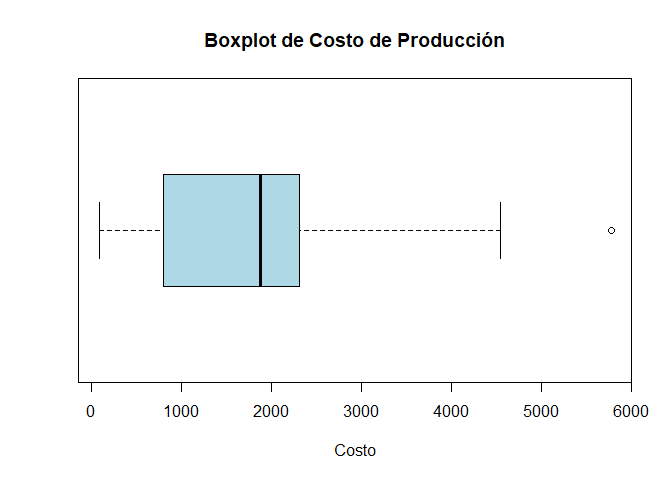

También puede agregarse el argumento `notch = TRUE`, lo cual hace que se
grafique una muesca en cada lado de la caja, alrededor de la mediana.
McGill, Tukey, and Larsen (1978) señala que las muescas muestran un
intervalo del 95% de confianza alrededor de la mediana, y que son
construidas a partir de la ecuación
`\begin{align*} \tilde{X}\pm C*s \end{align*}`

siendo `$s$`, una aproximación asintótica gausiana de la desviación
estándar de la mediana, la cual está dada por
`\begin{align*} s=\frac{1.25*IQR}{1.35*\sqrt{n}} \end{align*}`

y siendo `$C=1.7$` una constante, la cual es una selección empírica
realizada por los autores.

``` r
boxplot(datos$`Cost of Production (/ Quintal) C2`, horizontal = T, xlab = "Costo", 
    main = "Boxplot de Costo de Producción con Bandas de Confianza ", col = "lightgreen", 
    notch = T)
```

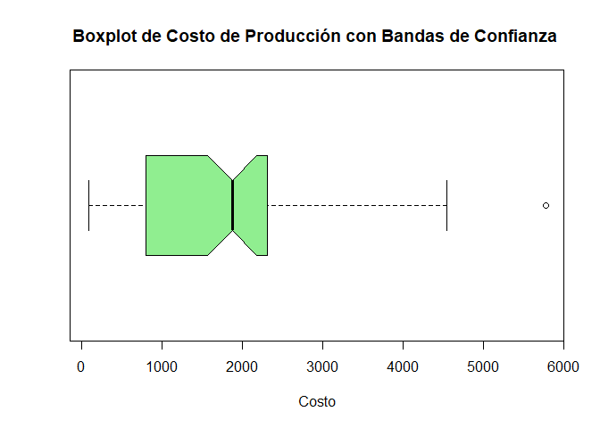

#### Histograma

Este gráfico muestra la distribución de frecuencia o densidades del
grupo de observaciones, brinda información sobre el valor más probables,
la dispersión, la asimetría y valores extremos. Adicionalmente, tiene la
ventaja de que su interpretación es muy intuitiva y por tanto es de los
gráficos más preferidos para resumir información. Este gráfico puede ser
realizado mediante la función `hist()` de la librería `graphics` de la
base del <tt>R</tt>.

``` r
hist(datos$`Cost of Production (/ Quintal) C2`, main = "Histograma de Costos de Producción", 
    xlab = "Costos", col = "lightblue", freq = T)  # Para gráfico con valor de densidades escribir freq = FALSE
```

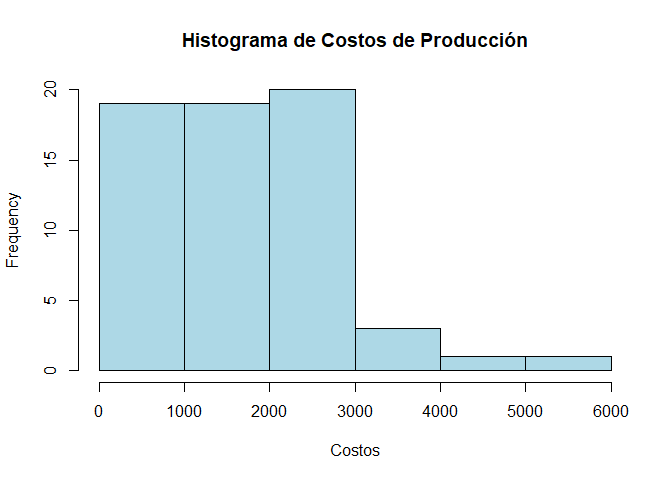

#### Densidad

Este gráfico funciona similar al histograma de densidades, con la
diferencia de que en lugar de mostrar la distribución mediante clases
(barras), éste muestra el comportamiento de la distribución de las
observaciones mediante una curva. Dicha curva, brinda mayor información
que el histograma respecto al valor promedio, dispersión y asimetría.
Este gráfico puede ser realizado mediante las funciones
`plot(density())`, siendo `plot()` una función de la librería `graphics`
y `density()` una función de la librería `stats`. Adicionalmente se
presenta la función `polygon` de la librería `graphics`, la cual sirve
para generar formas, o en este caso, darle color a la densidad

``` r
plot(density(datos$`Cost of Production (/ Quintal) C2`), main = "Densidad de Costos de Producción", 
    xlab = "Costos", lwd = 2)  # gráfica la densidad
polygon(density(datos$`Cost of Production (/ Quintal) C2`), col = "lightblue")  # Colorea la densidad
```

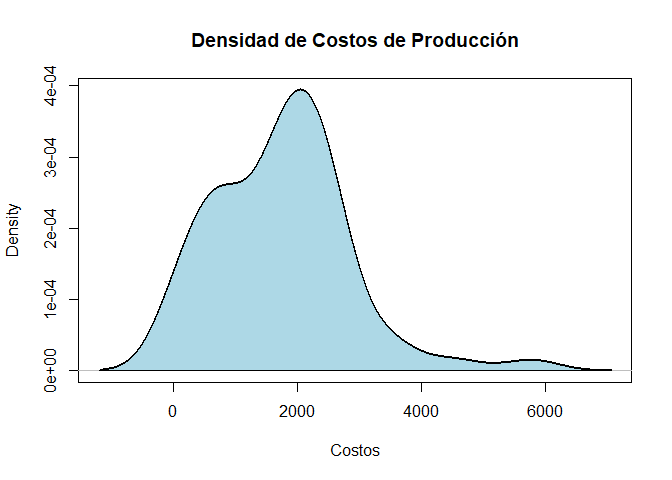

### Gráficos para varias variables cuantitativa

Entre las gráficos básicos que permiten realizar análisis cuantitativo
para varias variables se tiene, el gráfico de dispersión cuando se
tienen solo dos variables y la matriz de dispersión cuando se tienen más
de dos variables.

#### Gráfico de dispersión

Este gráfico se emplea para hacer cruces entre dos variables
cuantitativas, y sirve para ver tendencias y relaciones entre dos
variables cuantitativas, además de permitir apreciar donde se centra el
total de observaciones dados dos atributos cuantitativos. Este gráfico
puede ser realizado mediante la función `plot()` de la librería
`graphics` de la base del <tt>R</tt>.

``` r
plot(x = datos$`Cost of Cultivation (/ Hectare) C2`, y = datos$`Yield (Quintal/ Hectare)`, 
    xlab = "Costos de Cultivo", ylab = "Producción", main = "Gráfica de interés :D", 
    pch = 19)
```


#### Matriz de dispersión

Cuando se poseen más de dos variables cuantitativas, es posible
presentar un matriz que muestre el cruce entre pares de variables,
mediante cuadros con versiones simples de la función `plot()`. Este
gráfico puede ser realizado mediante la función `pairs()` de la librería
`graphics` de la base de <tt>R</tt>.

``` r
### Se crea nueva variable para observar el comportamiento de la función pairs
set.seed(1532)  # Crea una semilla que permite replicar la simulación de valores de rnorm
utilidad <- 140 * datos$`Yield (Quintal/ Hectare)` - 10 * datos$`Cost of Production (/ Quintal) C2` * 
    rgamma(n = 63, shape = 54, rate = 26)

### Se crea matriz de variables a gráficar
mvari <- cbind(datos$`Yield (Quintal/ Hectare)`, datos$`Cost of Production (/ Quintal) C2`, 
    utilidad)
pairs(mvari, labels = c("Producción", "Costos de Producción", "Utilidad"))
```

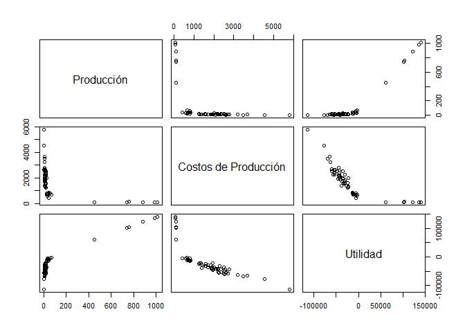

Funciones complementarias pueden ser desarrolladas para mejorar la
visualización los pares de variables. En el libro de Hernández and
Correa (2018, pp. 40–49), se presentan diferentes funciones que pueden
ser implementadas. Entre ellas

``` r
# Función para dibujar la dispersión y agregar la recta de regresión
panel.reg <- function(x, y) {
    points(x, y, pch = 20)
    abline(lm(y ~ x), lwd = 2, col = "dodgerblue2")
}
# Función para crear el histograma
panel.hist <- function(x, ...) {
    usr <- par("usr")
    on.exit(par(usr))
    par(usr = c(usr[1:2], 0, 1.5))
    h <- hist(x, plot = FALSE)
    breaks <- h$breaks
    nB <- length(breaks)
    y <- h$counts
    y <- y/max(y)
    rect(breaks[-nB], 0, breaks[-1], y, col = "dodgerblue2", ...)
}
# Función para obtener la correlación
panel.cor <- function(x, y, digits = 2, prefix = "", cex.cor) {
    usr <- par("usr")
    on.exit(par(usr))
    par(usr = c(0, 1, 0, 1))
    r <- abs(cor(x, y))
    txt <- format(c(r, 0.123456789), digits = digits)[1]
    txt <- paste(prefix, txt, sep = "")
    if (missing(cex.cor)) 
        cex <- 0.8/strwidth(txt)
    text(0.5, 0.5, txt, cex = cex * r)
}

pairs(mvari, labels = c("Producción", "Costos de Producción", "Utilidad"), upper.panel = panel.reg, 
    diag.panel = panel.hist, lower.panel = panel.cor)
```

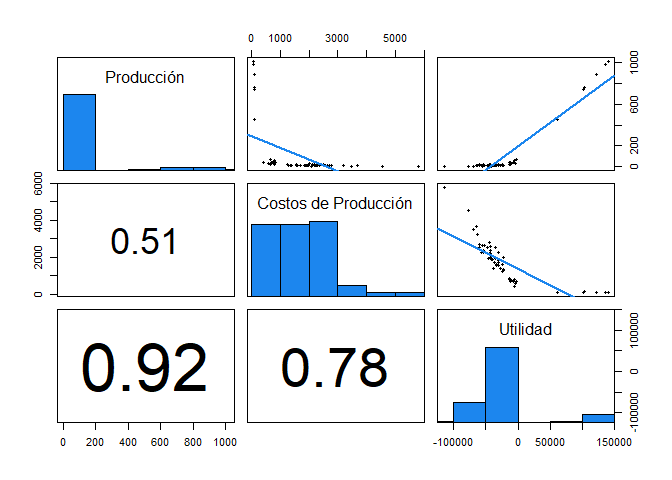

### Gráficos para variables cualitativas

Entre las gráficos básicos que permiten realizar análisis cualitativo
para variables se tiene, el gráfico de barras, gráfico pareto, gráfico
de pastel, y gráfico de puntos.

#### Gráfico de barras

Sirve para resumir variables cualitativas mediante barras de frecuencias
absolutas o relativas. Éste permite observar la concentración de
observaciones en una o más categorías diferentes. Este gráfico puede ser
realizado mediante la función `barplot()` de la librería `graphics` de
<tt>R</tt>, usando como insumo, tablas de frecuencias absolutas o
relativas.

``` r
# Usando las tablas de frecuencias absolutas presentadas en el análisis
# tabular.
barplot(tabla1via, main = "Frecuencias absolutas de los Estados", col = rainbow(10))
```


``` r
barplot(prop1via, main = "Frecuencias relativas de los Estados", col = rainbow(20))
```

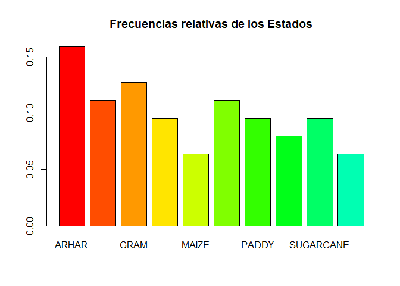

Este gráfico también puede ser empleado para realizar el cruce de dos o
más variables cualitativas

``` r
# Usando las tablas cruzadas de frecuencias absolutas presentadas en el
# análisis tabular.
barplot(tabla2vias, main = "Frecuencias absolutas categorías de producción por Estado", 
    col = c("lightblue", "lightgreen"), las = 2)
```

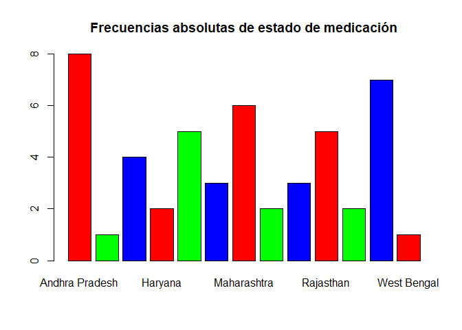

``` r
barplot(prop2vias, main = "Frecuencias relativa categorías de producción por Estado", 
    col = c("lightblue", "lightgreen"), beside = T, las = 2)
legend("topright", rownames(prop2vias), fill = c("lightblue", "lightgreen"))
```

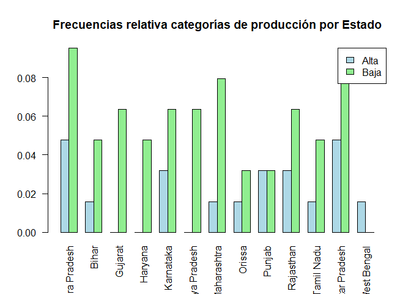

#### Gráfico de pareto

Este gráfico es similar al gráfico de barras para una sola variable
cualitativa, pero con la ventaja de que presenta las frecuencias
absolutas, relativas, y las frecuencias acumuladas absolutas y
acumuladas relativas en el mismo gráfico. Este gráfico puede ser
realizado mediante la función `pareto.chart()` de la librería `qqc`,
usando como insumo, tablas de frecuencias absolutas o relativas.

``` r
# install.packages('qcc') # Instala paquete qcc
library(qcc)  # Carga paquete qcc
# Usando las tablas de frecuencias absolutas presentadas en el análisis
# tabular.
pareto.chart(tabla1via, las = 2, main = "Gráfico Pareto para los Estados")
```

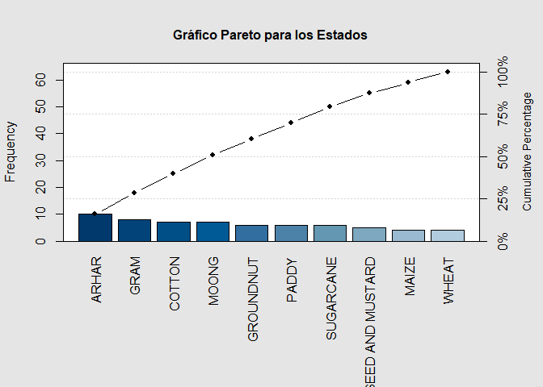

                          
    Pareto chart analysis for tabla1via
                            Frequency  Cum.Freq. Percentage Cum.Percent.
      ARHAR                 10.000000  10.000000  15.873016    15.873016
      GRAM                   8.000000  18.000000  12.698413    28.571429
      COTTON                 7.000000  25.000000  11.111111    39.682540
      MOONG                  7.000000  32.000000  11.111111    50.793651
      GROUNDNUT              6.000000  38.000000   9.523810    60.317460
      PADDY                  6.000000  44.000000   9.523810    69.841270
      SUGARCANE              6.000000  50.000000   9.523810    79.365079
      RAPESEED AND MUSTARD   5.000000  55.000000   7.936508    87.301587
      MAIZE                  4.000000  59.000000   6.349206    93.650794
      WHEAT                  4.000000  63.000000   6.349206   100.000000

#### Gráfico de pastel

Este gráfico también sirve para representar gráficamente las tablas de
frecuencias absolutas y relativas para una variable cualitativa. A pesar
de ser un gráfico muy usado en la práctica, no muestra bien la
información que se desea presentar, ya que siempre debe estar acompañado
de los porcentajes o frecuencias dentro de cada área, ya que no hacerlo,
dicho gráfico puede ser muy engañoso. Este gráfico puede ser realizado
mediante la función `pie()` de la librería `graphics` de <tt>R</tt>,
usando como insumo, tablas de frecuencias absolutas o relativas.

``` r
# Usando las tablas de frecuencias relativas presentadas en el análisis
# tabular.
pie(prop1via, main = "Frecuencia Relativa por Estados", col = rainbow(20))
legend("topleft", legend = round(prop1via, 4), fill = rainbow(20))
```

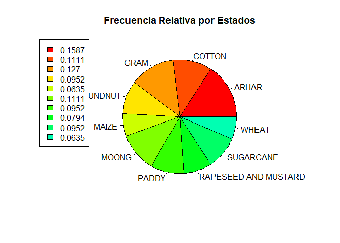

#### Gráfico de puntos

Este gráfico también es similar al gráfico de barras, sirve para
presentar la frecuencia de una variable cualitativa o un cruce de dos
variables cualitativas, y muestra un punto que representa el conteo del
total de observaciones que hay para cada variable. Este gráfico puede
ser realizado mediante la función `dotchart()` de la librería `graphics`
de <tt>R</tt>, usando como insumo, tablas de frecuencias absolutas o
relativas.

``` r
# Usando las tablas de frecuencias absolutas presentadas en el análisis
# tabular.  Gráfico para una sola variable cualitativa
dotchart(tabla1via, main = "Frecuencias absolutas de Estados")
```

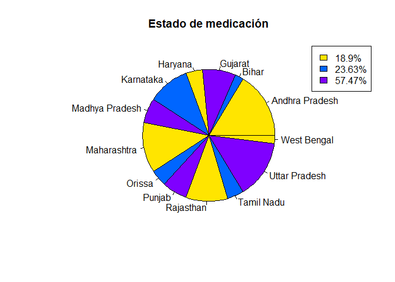

``` r
## Gráfico para el cruce de dos variables cualitativas
dotchart(tabla2vias, main = "Frecuencias absolutas de categorías de producción por Estados")
```

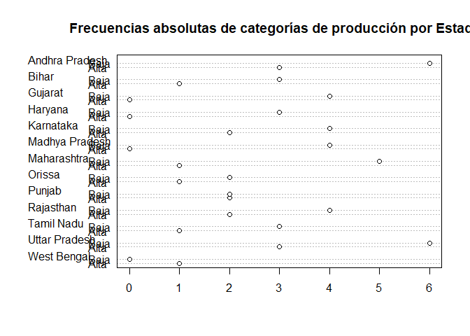

### Gráficos para variables cuantitativas y cualitativas

Entre las gráficos básicos que permiten analizar los cruces entre
variables cuantitativas y cualitativas se tiene, al gráfico de caja y
bigotes, gráfico de medias, histogramas, densidades, diagrama de
dispersión.

#### Gráfico de caja y bigotes

Este gráfico sirve para presentar de forma visual, datos numéricos por
categorías a través de sus cuartiles, además de presentar otras
características importantes, tales como la dispersión, simetría y datos
potencialmente atípicos. Este gráfico puede ser realizado mediante la
función `boxplot()` de la librería `graphics` de <tt>R</tt>.

``` r
boxplot(datos$`Cost of Production (/ Quintal) C2` ~ datos$Crop, horizontal = T, 
    xlab = "Costos", ylab = "", main = "Costos de Producción por tipo de cosecha", 
    col = rainbow(10), las = 1)
```

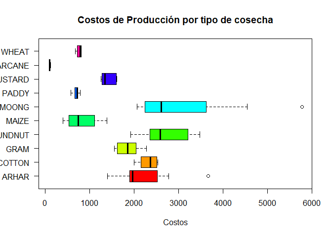

También puede agregarse el argumento `notch = TRUE`, lo cual hace que se
grafique una muesca en cada lado de la caja, alrededor de la mediana.
Además, si las muescas de dos parcelas no se superponen, entonces se
tendrá evidencia sólida respecto a que la mediana de los grupos es
diferente (Chambers, Cleveland, Kleiner, and Tukey, 1983, p. 62).

``` r
boxplot(datos$`Cost of Production (/ Quintal) C2` ~ datos$Crop, horizontal = T, 
    xlab = "Costos", ylab = "", main = "Costos de Producción por tipo de cosecha", 
    col = rainbow(10), las = 1, notch = T)
```

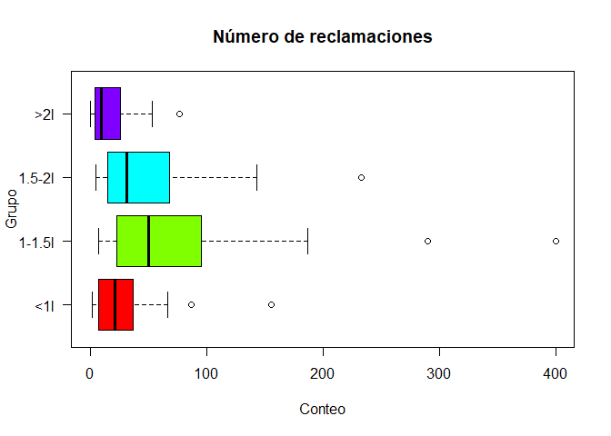

#### Gráfico de medias

Este gráfico sirve para presentar de forma visual, grupos de datos
numéricos a través de sus media y desviación estándar. El gráfico está
compuesto por un punto que representa el valor promedio del grupo de
observaciones y las barras representan **una** desviación estándar de la
media. Este gráfico puede ser realizado mediante la función
`plotMeans()` de la librería `RcmdrMisc`.

``` r
library(RcmdrMisc)  # Carga la librería RcmdrMisc
# recordar escribir en error.bars = 'sd' porque por defecto se presenta el
# error estándar y no la desviacion estándar.
plotMeans(response = datos$`Cost of Production (/ Quintal) C2`, factor1 = datos$Crop, 
    error.bars = "sd", xlab = "Costos de Producción", ylab = "Cosecha")
```

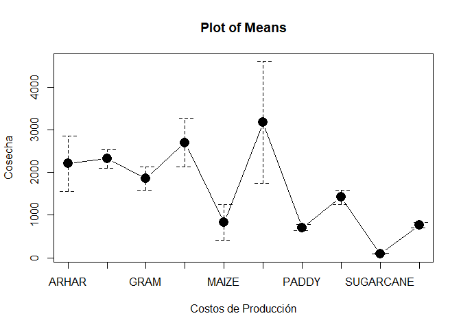

#### Histograma

Este gráfico muestra la distribución de frecuencia o densidades de dos o
más grupos de observaciones, brinda información sobre de los valores más
probables, las dispersiones, las asimetrías y valores extremos. Este
gráfico puede ser realizado mediante la función `hist()` de la librería
`graphics` de <tt>R</tt>. Para agregar más histograma en la misma
gráfico, es necesario agregar el argumento `add = TRUE`.

``` r
mini <- min(datos$`Cost of Cultivation (/ Hectare) C2`)
maxi <- max(datos$`Cost of Cultivation (/ Hectare) C2`)
hist(datos$`Cost of Cultivation (/ Hectare) C2`[datos$Crop == "ARHAR"], main = "Costos de Cultivo por Tipo de Cultivo", 
    xlab = "Costos de Cultivo", col = "lightblue", freq = T, breaks = 6, xlim = c(10000, 
        30000))
hist(datos$`Cost of Cultivation (/ Hectare) C2`[datos$Crop == "GRAM"], col = "lightblue4", 
    freq = T, add = T, breaks = 6)
legend("topleft", legend = c("ARHAR", "GRAM"), fill = c("lightblue", "lightblue4"))
```

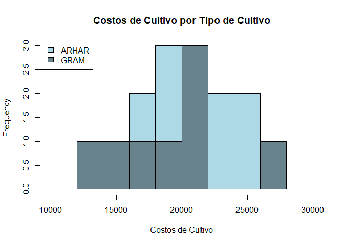

dado que no es posible observar bien la diferencia entre variables con
el histograma, cuando se emplea el paquete base, es posible usar
librerías que permitan gráficos más avanzados, tales como los creados
mediante la función `ggplot` de la librería `ggplot2`.

``` r
# install.packages('ggplot2') # instala paquete ggplot2
library(ggplot2)
# Se organiza base de datos para poder ser leida
BD <- data.frame(Costos = c(datos$`Cost of Cultivation (/ Hectare) C2`[datos$Crop == 
    "ARHAR"], datos$`Cost of Cultivation (/ Hectare) C2`[datos$Crop == "GRAM"]), 
    Clase = c(rep("ARHAR", 10), rep("GRAM", 8)))

ggplot(BD, aes(x = Costos, fill = Clase)) + geom_histogram(alpha = 0.7, colour = 1, 
    bins = 6, position = "identity") + theme_bw() + ylab("Frecuencia") + xlab("Costos de Cultivo") + 
    ggtitle("Costos de Cultivo por Categoría de Producción")
```

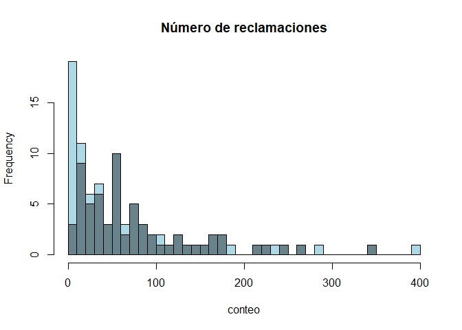

Es de anotar que también puede cambiar la forma en que se agrupan los
datos en cada una de las categorías, y por tanto, puede verse
diferencias entre el gráfico realizado con el paquete base y el gráfico
realizado con el paquete ggplot.

#### Densidad

Este gráfico muestra el comportamiento de la distribución de las
observaciones mediante una curva de densidad para cada una de las
variables. Este gráfico, brinda información respecto al valor promedio,
dispersión y asimetría. Este gráfico puede ser realizado mediante las
funciones `plot(density())`, siendo `plot()` una función de la librería
`graphics` y `density()` una función de la librería `stats`. Para
realizar el segundo gráfico, se debe emplear la función
`lines(density())`, siendo `lines()` una función de la librería
`graphics`.

``` r
plot(density(datos$`Cost of Production (/ Quintal) C2`[datos$Crop == "GRAM"]), 
    main = "Costos de Producción", xlab = "Costos", lwd = 2, xlim = c(1000, 
        4500))  # gráfica la densidad
lines(density(datos$`Cost of Production (/ Quintal) C2`[datos$Crop == "ARHAR"]), 
    col = "red", lwd = 2)
legend("topright", legend = c("GRAM", "ARHAR"), col = c("black", "red"), lwd = 2)
```

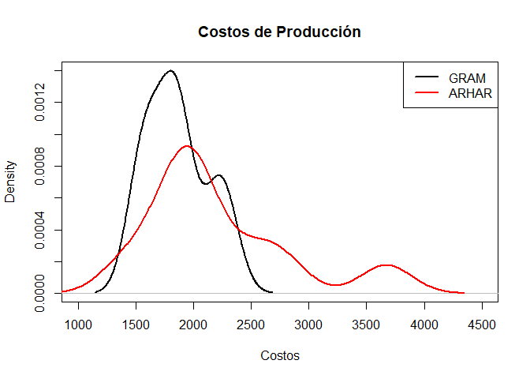

#### Gráfico de dispersión

Este gráfico se emplea para hacer cruces entre dos variables
cuantitativas y diferenciarlas por una cualitativa. Este sirve para ver
tendencias, diferencias entre clases, relaciones entre dos variables
cuantitativas, y permite apreciar donde se centra el total de
observaciones dados dos atributos cuantitativos. Este gráfico puede ser
realizado mediante la función `plot()` de la librería `graphics` de
<tt>R</tt>.

``` r
plot(x = datos$`Yield (Quintal/ Hectare)`, y = datos$`Cost of Cultivation (/ Hectare) C2`, 
    xlab = "Producción", ylab = "Costos de Cultivo", main = "Poriducción vs Costos de Cultivo", 
    pch = 19, col = datos$catproduccion)
legend("bottomright", legend = levels(datos$catproduccion), col = 1:4, pch = 19)
```

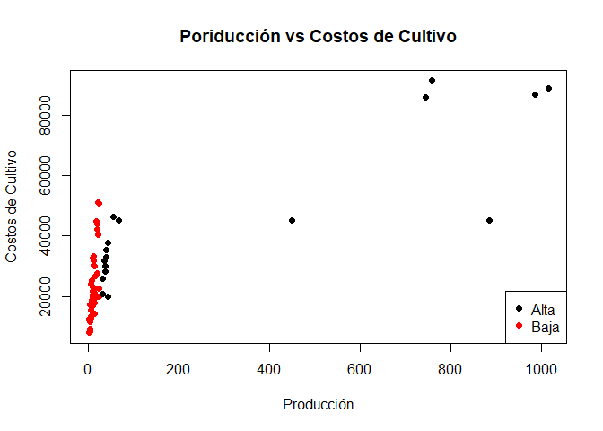

Bibliografía
------------

Chambers, J., Cleveland, W., Kleiner, B., and Tukey, P. (1983).
*Graphical methods for data analysis* (1st ed.). Wadsworth &
Brooks/Cole.

Hernández, F., and Correa, J. (2018). *Gráficos con r*. Universidad
Nacional de Colombia.

McGill, R., Tukey, J., and Larsen, W. (1978). Variations of box plots.
*The American Statistician*, *32*(1), 12–16.
