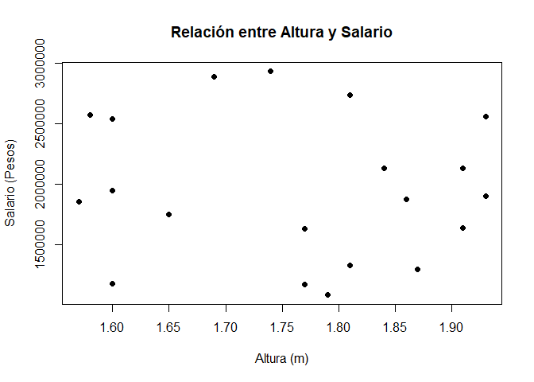
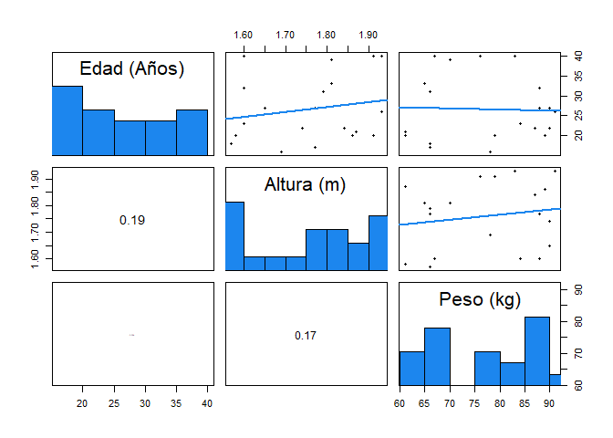

Resumen numéricos
-----------------

Una parte importante de la estadística descriptiva, son las medidas
estadísticas ya explicadas en la [Clase
03](../../ProbabilidadeInferencia/PeIEClase03.html){:target="\_blank“} y
[Clase
04](../../ProbabilidadeInferencia/PeIEClase04.html){:target=”\_blank"},
y aún más importante, es buscar la más adecuada para presentar dichas
medidas.

Una alternativa es mediante resúmenes numéricos, los cual permiten
observar el comportamiento de un conjunto de observaciones mediante
diferentes medidas numéricas, que se presentan de forma simple y
ordenada.

Entre las diferentes funciones que permiten realizar resúmenes numéricos
en <tt>R</tt>, se destaca la función `numSummary(datos)` de la librería
`RcmdrMisc` y la función `describe(datos)` de la librería `psych`, que
presentan el resúmen de variables tipo numéricas.

Para ilustrar el manejo de estas funciones, se empleara la base de datos
de [Agricultura de
India](https://github.com/jiperezga/jiperezga.github.io/raw/master/Dataset/AgriculturaIndia.xlsx){:target="\_blank"},
la cual contiene la información sobre la producción de cultivos
agrícolas en la India. La base de datos contiene el tipo de cultivo, el
estado en el cual se realiza el cultivo, los costos y la producción
obtenida.

``` r
### Instalar y cargar librerías install.packages(c('readxl', 'XLConnect'),
### dependencies = T) # Instala librerías
library(readxl)  # Carga librería
library(XLConnect)  # Para descargar archivos online de forma temporal

### Crea archivo temporal para cargar archivo online
temp <- tempfile(fileext = ".xlsx")
dataURL <- "https://github.com/jiperezga/jiperezga.github.io/raw/master/Dataset/AgriculturaIndia.xlsx"
download.file(dataURL, destfile = temp, mode = "wb")

### Carga archivo
datos <- read_xlsx(temp)  # Carga la base de datos
# datos <- read_xlsx(file.choose()) # para buscar archivo xlsx guardado en
# el PC

str(datos)  # Muestra la estructura de la base de datos
```

    Classes 'tbl_df', 'tbl' and 'data.frame':   49 obs. of  6 variables:
     $ Crop                                 : chr  "ARHAR" "ARHAR" "ARHAR" "ARHAR" ...
     $ State                                : chr  "Uttar Pradesh" "Karnataka" "Gujarat" "Andhra Pradesh" ...
     $ Cost of Cultivation (/ Hectare) A2+FL: num  9794 10593 13469 17052 17131 ...
     $ Cost of Cultivation (/ Hectare) C2   : num  23077 16529 19552 24172 25270 ...
     $ Cost of Production (/ Quintal) C2    : num  1942 2172 1898 3671 2776 ...
     $ Yield (Quintal/ Hectare)             : num  9.83 7.47 9.59 6.42 8.72 ...

``` r
### Transformar variables
datos$Crop <- factor(datos$Crop)
datos$State <- factor(datos$State)

# install.packages('RcmdrMisc') # Instala librería RcmdrMisc
library(RcmdrMisc)  # Carga librería RcmdrMisc

# Forma básica numSummary
numSummary(datos$`Yield (Quintal/ Hectare)`)
```

         mean       sd   IQR   0%  25%  50%   75%    100%  n
     98.08673 245.2931 27.02 1.32 9.59 13.7 36.61 1015.45 49

``` r
# Forma avanzada numSummary
numSummary(datos$`Yield (Quintal/ Hectare)`, statistics = c("mean", "sd", "se", 
    "IQR", "quantiles", "cv", "skewness", "kurtosis"), type = "3", quantiles = c(0, 
    0.25, 0.5, 0.75, 1))
```

         mean       sd se(mean)   IQR       cv skewness kurtosis   0%  25%
     98.08673 245.2931 35.04187 27.02 2.500778 2.833179 6.645966 1.32 9.59
      50%   75%    100%  n
     13.7 36.61 1015.45 49

``` r
library(psych)  # Carga librería pysch
# Forma básica pysch
describe(datos$`Yield (Quintal/ Hectare)`)
```

       vars  n  mean     sd median trimmed   mad  min     max   range skew
    X1    1 49 98.09 245.29   13.7   31.45 10.79 1.32 1015.45 1014.13 2.83
       kurtosis    se
    X1     6.65 35.04

``` r
# Forma avanzada pysch
describe(datos$`Yield (Quintal/ Hectare)`, ranges = TRUE, trim = 0.2, type = 3, 
    quant = c(0.25, 0.75), IQR = TRUE)
```

      vars  n  mean     sd median trimmed   mad  min     max   range skew
    1    1 49 98.09 245.29   13.7    19.3 10.79 1.32 1015.45 1014.13 2.83
      kurtosis    se   IQR Q0.25 Q0.75
    1     6.65 35.04 27.02  9.59 36.61

También es posible realizar resúmenes numérico por grupos, en donde,
para la función `numSummary` es cuestión de agregar el argumento
`groups`, mientras que la función `describe`, debe ser reemplazada por
la función `describeBy` y agregar en ésta el argumento `group`. Es de
anotar, que para realizar el resumen por grupos, la variable que se
usará para realizar el agrupamiento debe ser de tipo **factor**

``` r
# Forma avanzada numSummary por grupos
numSummary(data = datos$`Yield (Quintal/ Hectare)`, groups = datos$Crop, statistics = c("mean", 
    "sd", "se", "IQR", "quantiles", "cv", "skewness", "kurtosis"), type = "3", 
    quantiles = c(0, 0.25, 0.5, 0.75, 1))
```

                            mean         sd    se(mean)    IQR        cv
    ARHAR                  8.406   1.444690   0.6460851   2.12 0.1718642
    COTTON                18.772   4.206830   1.8813516   2.07 0.2241013
    GRAM                  10.558   3.807876   1.7029339   2.88 0.3606626
    GROUNDNUT             10.288   3.454058   1.5447019   2.65 0.3357366
    MAIZE                 30.798  12.586446   5.6288297  19.12 0.4086774
    MOONG                  4.196   2.172149   0.9714144   2.89 0.5176713
    PADDY                 46.296  14.823799   6.6294046  19.39 0.3201961
    RAPESEED AND MUSTARD  14.320   3.240517   1.4492032   0.63 0.2262931
    SUGARCANE            790.496 228.486912 102.1824533 242.20 0.2890425
    WHEAT                 33.900   7.152463   3.5762317   5.71 0.2109871
                            skewness  kurtosis     0%    25%    50%    75%
    ARHAR                -0.27028477 -1.971054   6.42   7.47   8.72   9.59
    COTTON               -0.12637161 -1.488575  12.69  17.83  19.05  19.90
    GRAM                  0.59049262 -1.433647   6.83   8.05  10.29  10.93
    GROUNDNUT            -0.64654568 -1.475321   4.71   9.33  11.97  11.98
    MAIZE                -0.19113989 -1.964417  13.70  23.56  31.10  42.68
    MOONG                -0.09390327 -1.938637   1.32   3.01   4.05   5.90
    PADDY                 0.39073194 -1.938645  32.42  36.61  39.04  56.00
    RAPESEED AND MUSTARD  0.90557791 -1.085021  11.61  12.94  13.54  13.57
    SUGARCANE            -0.35408385 -1.704717 448.89 744.01 757.92 986.21
    WHEAT                -0.58108072 -1.791225  23.59  32.14  36.09  37.85
                            100% data:n
    ARHAR                   9.83      5
    COTTON                 24.39      5
    GRAM                   16.69      5
    GROUNDNUT              13.45      5
    MAIZE                  42.95      5
    MOONG                   6.70      5
    PADDY                  67.41      5
    RAPESEED AND MUSTARD   19.94      5
    SUGARCANE            1015.45      5
    WHEAT                  39.83      4

``` r
# Forma avanzada pysch por grupos
describeBy(x = datos$`Yield (Quintal/ Hectare)`, group = datos$Crop, ranges = TRUE, 
    trim = 0.2, type = 3, quant = c(0.25, 0.75), IQR = TRUE)
```


     Descriptive statistics by group 
    group: ARHAR
      vars n mean   sd median trimmed  mad  min  max range  skew kurtosis   se
    1    1 5 8.41 1.44   8.72    8.59 1.65 6.42 9.83  3.41 -0.27    -1.97 0.65
       IQR Q0.25 Q0.75
    1 2.12  7.47  9.59
    -------------------------------------------------------- 
    group: COTTON
      vars n  mean   sd median trimmed  mad   min   max range  skew kurtosis
    1    1 5 18.77 4.21  19.05   18.93 1.81 12.69 24.39  11.7 -0.13    -1.49
        se  IQR Q0.25 Q0.75
    1 1.88 2.07 17.83  19.9
    -------------------------------------------------------- 
    group: GRAM
      vars n  mean   sd median trimmed  mad  min   max range skew kurtosis  se
    1    1 5 10.56 3.81  10.29    9.76 3.32 6.83 16.69  9.86 0.59    -1.43 1.7
       IQR Q0.25 Q0.75
    1 2.88  8.05 10.93
    -------------------------------------------------------- 
    group: GROUNDNUT
      vars n  mean   sd median trimmed  mad  min   max range  skew kurtosis
    1    1 5 10.29 3.45  11.97   11.09 2.19 4.71 13.45  8.74 -0.65    -1.48
        se  IQR Q0.25 Q0.75
    1 1.54 2.65  9.33 11.98
    -------------------------------------------------------- 
    group: MAIZE
      vars n mean    sd median trimmed   mad  min   max range  skew kurtosis
    1    1 5 30.8 12.59   31.1   32.45 17.17 13.7 42.95 29.25 -0.19    -1.96
        se   IQR Q0.25 Q0.75
    1 5.63 19.12 23.56 42.68
    -------------------------------------------------------- 
    group: MOONG
      vars n mean   sd median trimmed  mad  min max range  skew kurtosis   se
    1    1 5  4.2 2.17   4.05    4.32 2.74 1.32 6.7  5.38 -0.09    -1.94 0.97
       IQR Q0.25 Q0.75
    1 2.89  3.01   5.9
    -------------------------------------------------------- 
    group: PADDY
      vars n mean    sd median trimmed  mad   min   max range skew kurtosis
    1    1 5 46.3 14.82  39.04   43.88 9.81 32.42 67.41 34.99 0.39    -1.94
        se   IQR Q0.25 Q0.75
    1 6.63 19.39 36.61    56
    -------------------------------------------------------- 
    group: RAPESEED AND MUSTARD
      vars n  mean   sd median trimmed  mad   min   max range skew kurtosis
    1    1 5 14.32 3.24  13.54   13.35 0.89 11.61 19.94  8.33 0.91    -1.09
        se  IQR Q0.25 Q0.75
    1 1.45 0.63 12.94 13.57
    -------------------------------------------------------- 
    group: SUGARCANE
      vars n  mean     sd median trimmed    mad    min     max  range  skew
    1    1 5 790.5 228.49 757.92  829.38 338.46 448.89 1015.45 566.56 -0.35
      kurtosis     se   IQR  Q0.25  Q0.75
    1     -1.7 102.18 242.2 744.01 986.21
    -------------------------------------------------------- 
    group: WHEAT
      vars n mean   sd median trimmed  mad   min   max range  skew kurtosis
    1    1 4 33.9 7.15  36.09    33.9 3.59 23.59 39.83 16.24 -0.58    -1.79
        se  IQR Q0.25 Q0.75
    1 3.58 5.71 32.14 37.85

Resumen tabular
---------------

Una forma convencional de presentar resúmenes de variables cualitativas,
es mediante la construcción de tablas de frecuencias, las cuales
permiten presentar de forma individual algunas de las características
que poseen las variables cualitativas, o permiten presentar de forma
conjunta algunas de las características que comparten dichas variables.

Para presentar de forma individual o grupal las características de las
variables, puede emplearse la función `table(datos)` de la librería
`base`, la cual agrega la información presentada en de las variables de
una forma simple, que permite observar el número (frecuencia absoluta)
de observaciones que comparten cierto atributo. Se aconseja que los
datos usados dentro de la función `table(datos)` sean de tipo *factor*.

Para ilustrar el manejo de esta funciones, se continua trabajando con la
base de datos de [Agricultura de
India](https://github.com/jiperezga/jiperezga.github.io/raw/master/Dataset/AgriculturaIndia.xlsx){:target="\_blank".

``` r
# Creación de tabla de frecuencias absolutas en una vía Si el conjunto de
# observaciones tiene valores faltantes agregar el comando useNA = 'ifany'
tabla1via <- table(datos$State)
tabla1via
```


    Andhra Pradesh          Bihar        Gujarat        Haryana      Karnataka 
                 8              1              4              2              5 
    Madhya Pradesh    Maharashtra         Orissa         Punjab      Rajasthan 
                 3              6              2              3              5 
        Tamil Nadu  Uttar Pradesh    West Bengal 
                 2              7              1 

``` r
# Crear nueva variable
datos$catproduccion <- ifelse(datos$`Yield (Quintal/ Hectare)` < 30, "Baja", 
    "Alta")
# Creación de tabla de frecuencias absolutas en dos vía
tabla2vias <- table(datos$catproduccion, datos$State)
tabla2vias
```

          
           Andhra Pradesh Bihar Gujarat Haryana Karnataka Madhya Pradesh
      Alta              3     1       0       0         2              0
      Baja              5     0       4       2         3              3
          
           Maharashtra Orissa Punjab Rajasthan Tamil Nadu Uttar Pradesh
      Alta           1      1      2         1          1             3
      Baja           5      1      1         4          1             4
          
           West Bengal
      Alta           1
      Baja           0

``` r
# Agrega las sumas totales a la tabla de frecuencias absolutas por fila y/o
# columna
addmargins(tabla2vias, margin = c(1, 2))  # margin = 1 en filas, margin = 2 en columnas
```

          
           Andhra Pradesh Bihar Gujarat Haryana Karnataka Madhya Pradesh
      Alta              3     1       0       0         2              0
      Baja              5     0       4       2         3              3
      Sum               8     1       4       2         5              3
          
           Maharashtra Orissa Punjab Rajasthan Tamil Nadu Uttar Pradesh
      Alta           1      1      2         1          1             3
      Baja           5      1      1         4          1             4
      Sum            6      2      3         5          2             7
          
           West Bengal Sum
      Alta           1  16
      Baja           0  33
      Sum            1  49

También es posible presentar los valores agregados, en forma de
frecuencias relativas, mediante la función `prop.table(tabla)` de la
librería `base` de <tt>R</tt>, donde `tabla` hace referencia a la tabla
de frecuencias absolutas creada anteriormente.

``` r
# Creación de tablas de frecuencias relativas en una vía
prop1via <- prop.table(tabla1via)
prop1via
```


    Andhra Pradesh          Bihar        Gujarat        Haryana      Karnataka 
        0.16326531     0.02040816     0.08163265     0.04081633     0.10204082 
    Madhya Pradesh    Maharashtra         Orissa         Punjab      Rajasthan 
        0.06122449     0.12244898     0.04081633     0.06122449     0.10204082 
        Tamil Nadu  Uttar Pradesh    West Bengal 
        0.04081633     0.14285714     0.02040816 

``` r
# Creación de tabla de frecuencias relativas en dos vía
prop2vias <- prop.table(tabla2vias)
prop2vias
```

          
           Andhra Pradesh      Bihar    Gujarat    Haryana  Karnataka
      Alta     0.06122449 0.02040816 0.00000000 0.00000000 0.04081633
      Baja     0.10204082 0.00000000 0.08163265 0.04081633 0.06122449
          
           Madhya Pradesh Maharashtra     Orissa     Punjab  Rajasthan
      Alta     0.00000000  0.02040816 0.02040816 0.04081633 0.02040816
      Baja     0.06122449  0.10204082 0.02040816 0.02040816 0.08163265
          
           Tamil Nadu Uttar Pradesh West Bengal
      Alta 0.02040816    0.06122449  0.02040816
      Baja 0.02040816    0.08163265  0.00000000

``` r
# Agrega las sumas totales a la tabla de frecuencias relativas por fila y/o
# columna
addmargins(prop2vias, margin = c(1, 2))
```

          
           Andhra Pradesh      Bihar    Gujarat    Haryana  Karnataka
      Alta     0.06122449 0.02040816 0.00000000 0.00000000 0.04081633
      Baja     0.10204082 0.00000000 0.08163265 0.04081633 0.06122449
      Sum      0.16326531 0.02040816 0.08163265 0.04081633 0.10204082
          
           Madhya Pradesh Maharashtra     Orissa     Punjab  Rajasthan
      Alta     0.00000000  0.02040816 0.02040816 0.04081633 0.02040816
      Baja     0.06122449  0.10204082 0.02040816 0.02040816 0.08163265
      Sum      0.06122449  0.12244898 0.04081633 0.06122449 0.10204082
          
           Tamil Nadu Uttar Pradesh West Bengal        Sum
      Alta 0.02040816    0.06122449  0.02040816 0.32653061
      Baja 0.02040816    0.08163265  0.00000000 0.67346939
      Sum  0.04081633    0.14285714  0.02040816 1.00000000

Análisis gráfico
----------------

Otro aspecto importante del análisis descriptivo, es el que se realiza
mediante análisis gráfico. El análisis gráfico es una forma de
simplificar lo tedioso y complejo de un conjunto de observaciones,
además de ser una forma más accesible de presentación de la información
cuando se tienen muchas variables, puesto que permiten mostrar el
comportamiento de los datos presentados, y hacer juicios respecto a su
tendencia central, variabilidad, formas, patrones, tendencias, etc.

El análisis gráfico, puede ser dividido en diferentes clases

-   Gráficos para una variable cuantitativa
-   Gráficos para varias variables cuantitativas
-   Gráficos para variables cualitativas
-   Gráficos para variables cuantitativas y cualitativas

Para ilustrar el manejo de los diferentes gráficos, se empleara la base
de datos `Insurance`, integrada en la librería `MASS`, la cual contiene
la información sobre el número de asegurados que estuvieron expuestos a
un riesgo determinado y el número de reclamaciones de seguros de
automóviles realizadas por dichos asegurados. También se empleara la
base de datos `KosteckiDillon`, integrada en la librería `carData`, la
cual contiene un subconjunto de datos sobre tratamientos de migraña.

``` r
library(MASS)  # Carga librería MASS para poder cargar la base de datos
data(Insurance)  # Carga la base de datos Insurance
head(Insurance)  # Muestra el encabezado de la base de datos
```

      District  Group   Age Holders Claims
    1        1    <1l   <25     197     38
    2        1    <1l 25-29     264     35
    3        1    <1l 30-35     246     20
    4        1    <1l   >35    1680    156
    5        1 1-1.5l   <25     284     63
    6        1 1-1.5l 25-29     536     84

``` r
str(Insurance)  # Muestra la estructura de la base de datos
```

    'data.frame':   64 obs. of  5 variables:
     $ District: Factor w/ 4 levels "1","2","3","4": 1 1 1 1 1 1 1 1 1 1 ...
     $ Group   : Ord.factor w/ 4 levels "<1l"<"1-1.5l"<..: 1 1 1 1 2 2 2 2 3 3 ...
     $ Age     : Ord.factor w/ 4 levels "<25"<"25-29"<..: 1 2 3 4 1 2 3 4 1 2 ...
     $ Holders : int  197 264 246 1680 284 536 696 3582 133 286 ...
     $ Claims  : int  38 35 20 156 63 84 89 400 19 52 ...

### Gráficos para una variable cuantitativa

Entre las gráficos básicos que permiten realizar análisis cuantitativo
para una variable se tiene, al diagrama de tallo y hojas, gráfico de
caja y bigotes, histograma y densidad.

#### Diagrama de tallo y hojas

Este gráfico sirve como medida de resumen de los datos, brinda
información de valores máximos, mínimos, área en donde más se centran
los datos, dispersión. datos atípicos y asimetría. A pesar de toda la
información que puede brindar esta gráfica, su uso es muy limitado, ya
que en situaciones en las cuales el rango de la variable es muy grande,
ésta no permite visualidad con claridad dichos comportamientos. Este
gráfico puede ser realizado mediante la función `stem()` de la librería
`graphics` de <tt>R</tt>.

``` r
stem(Insurance$Claims)
```


      The decimal point is 2 digit(s) to the right of the |

      0 | 0000000111111111111111222222222222233444444
      0 | 5555566778899
      1 | 004
      1 | 69
      2 | 3
      2 | 9
      3 | 
      3 | 
      4 | 0

``` r
stem(Insurance$Claims, scale = 2)
```


      The decimal point is 1 digit(s) to the right of the |

       0 | 02234445556778880001245689999
       2 | 02224453567789
       4 | 69123
       6 | 33747
       8 | 479
      10 | 12
      12 | 
      14 | 36
      16 | 
      18 | 7
      20 | 
      22 | 3
      24 | 
      26 | 
      28 | 0
      30 | 
      32 | 
      34 | 
      36 | 
      38 | 
      40 | 0

#### Gráfico de caja y bigotes (boxplot)

Este gráfico sirve para presentar de forma visual, datos numéricos a
través de sus cuartiles, además de presentar otras características
importantes, tales como la dispersión, simetría y datos potencialmente
atípicos.

La caja del gráfico contiene el 50% central de los datos (rango
intercuartil), brinda información sobre la asimetría, `$Q_1$`, `$Q_2$`
(mediana) y `$Q_3$`, el bigote inferior se calcula usualmente como
`$Q_1–0.5*IQR$`,`$Q_1–IQR$`, o `$Q_1–1.5*IQR$` y el superior como
`$Q3+0.5*IQR$`, `$Q3+IQR$` o `$Q3+1.5*IQR$`. Además, los valores que se
encuentren por encima o debajo de los bigotes se consideran como
potencialmente atípicos. Este gráfico puede ser realizado mediante la
función `boxplot()` de la librería `graphics` de <tt>R</tt>.

``` r
boxplot(Insurance$Claims, horizontal = T, xlab = "Conteo", main = "Número de reclamaciones", 
    col = "lightblue")
```


También puede agregarse el argumento `notch = TRUE`, lo cual hace que se
grafique una muesca en cada lado de la caja, alrededor de la mediana.
McGill, Tukey, and Larsen (1978) señala que las muescas muestran un
intervalo del 95% de confianza alrededor de la mediana, y que son
construidas a partir de la ecuación
`\begin{align*} \tilde{X}\pm C*s \end{align*}`

siendo `$s$`, una aproximación asintótica gausiana de la desviación
estándar de la mediana, la cual está dada por
`\begin{align*} s=\frac{1.25*IQR}{1.35*\sqrt{n}} \end{align*}`

y siendo `$C=1.7$` una constante, la cual es una selección empírica
realizada por los autores.

``` r
boxplot(Insurance$Claims, horizontal = T, xlab = "Conteo", main = "Número de reclamaciones", 
    col = "lightgreen", notch = T)
```


#### Histograma

Este gráfico muestra la distribución de frecuencia o densidades del
grupo de observaciones, brinda información sobre el valor más probables,
la dispersión, la asimetría y valores extremos. Adicionalmente, tiene la
ventaja de que su interpretación es muy intuitiva y por tanto es de los
gráficos más preferidos para resumir información. Este gráfico puede ser
realizado mediante la función `hist()` de la librería `graphics` de
<tt>R</tt>.

``` r
hist(Insurance$Claims, main = "Número de reclamaciones", xlab = "conteo", col = "lightblue", 
    freq = T)  # Para gráfico con valor de densidades escribir freq = FALSE
```


#### Densidad

Este gráfico funciona similar al histograma de densidades, con la
diferencia de que en lugar de mostrar la distribución mediante clases
(barras), éste muestra el comportamiento de la distribución de las
observaciones mediante una curva. Dicha curva, brinda mayor información
que el histograma respecto al valor promedio, dispersión y asimetría.
Este gráfico puede ser realizado mediante las funciones
`plot(density())`, siendo `plot()` una función de la librería `graphics`
y `density()` una función de la librería `stats`. Adicionalmente se
presenta la función `polygon` de la librería `graphics`, la cual sirve
para generar formas, o en este caso, darle color a la densidad

``` r
plot(density(Insurance$Claims), main = "Número de reclamaciones", xlab = "conteo", 
    lwd = 2)  # gráfica la densidad
polygon(density(Insurance$Claims), col = "lightblue")  # Colorea la densidad
```


### Gráficos para varias variables cuantitativa

Entre las gráficos básicos que permiten realizar análisis cuantitativo
para varias variables se tiene, el gráfico de dispersión cuando se
tienen solo dos variables y la matriz de dispersión cuando se tienen más
de dos variables.

#### Gráfico de dispersión

Este gráfico se emplea para hacer cruces entre dos variables
cuantitativas, y sirve para ver tendencias y relaciones entre dos
variables cuantitativas, además de permitir apreciar donde se centra el
total de observaciones dados dos atributos cuantitativos. Este gráfico
puede ser realizado mediante la función `plot()` de la librería
`graphics` de <tt>R</tt>.

``` r
plot(x = Insurance$Holders, y = Insurance$Claims, xlab = "Número de asegurados", 
    ylab = "Número de reclamaciones", main = "Seguros :D", pch = 19)
```


#### Matriz de dispersión

Cuando se poseen más de dos variables cuantitativas, es posible
presentar un matriz que muestre el cruce entre pares de variables,
mediante cuadros con versiones simples de la función `$plot()$`. Este
gráfico puede ser realizado mediante la función `pairs()` de la librería
`graphics` de <tt>R</tt>.

``` r
### Se crea nueva variable para observar el comportamiento de la función pairs
set.seed(1532)  # Crea una semilla que permite replicar la simulación de valores de rnorm
utilidad <- 140 * Insurance$Holders - 500 * Insurance$Claims * rgamma(n = 64, 
    shape = 54, rate = 26)

### Se crea matriz de variables a gráficar
mvari <- cbind(Insurance$Holders, Insurance$Claims, utilidad)
pairs(mvari, labels = c("Número de asegurados", "Número de reclamaciones", "Utilidad"))
```


Funciones complementarias pueden ser desarrolladas para mejorar la
visualización los pares de variables. En el libro de Hernández and
Correa (2018, pp. 40–49), se presentan diferentes funciones que pueden
ser implementadas. Entre ellas

``` r
# Función para dibujar la dispersión y agregar la recta de regresión
panel.reg <- function(x, y) {
    points(x, y, pch = 20)
    abline(lm(y ~ x), lwd = 2, col = "dodgerblue2")
}
# Función para crear el histograma
panel.hist <- function(x, ...) {
    usr <- par("usr")
    on.exit(par(usr))
    par(usr = c(usr[1:2], 0, 1.5))
    h <- hist(x, plot = FALSE)
    breaks <- h$breaks
    nB <- length(breaks)
    y <- h$counts
    y <- y/max(y)
    rect(breaks[-nB], 0, breaks[-1], y, col = "dodgerblue2", ...)
}
# Función para obtener la correlación
panel.cor <- function(x, y, digits = 2, prefix = "", cex.cor) {
    usr <- par("usr")
    on.exit(par(usr))
    par(usr = c(0, 1, 0, 1))
    r <- abs(cor(x, y))
    txt <- format(c(r, 0.123456789), digits = digits)[1]
    txt <- paste(prefix, txt, sep = "")
    if (missing(cex.cor)) 
        cex <- 0.8/strwidth(txt)
    text(0.5, 0.5, txt, cex = cex * r)
}

pairs(mvari, labels = c("Número de asegurados", "Número de reclamaciones", "Utilidad"), 
    upper.panel = panel.reg, diag.panel = panel.hist, lower.panel = panel.cor)
```


### Gráficos para variables cualitativas

Entre las gráficos básicos que permiten realizar análisis cualitativo
para variables se tiene, el gráfico de barras, gráfico pareto, gráfico
de pastel, y gráfico de puntos.

#### Gráfico de barras

Sirve para resumir variables cualitativas mediante barras de frecuencias
absolutas o relativas. Éste permite observar la concentración de
observaciones en una o más categorías diferentes. Este gráfico puede ser
realizado mediante la función `barplot()` de la librería `graphics` de
<tt>R</tt>, usando como insumo, tablas de frecuencias absolutas o
relativas.

``` r
# Usando las tablas de frecuencias absolutas presentadas en el análisis
# tabular.
barplot(tabla1via, main = "Frecuencias absolutas de estado de medicación", col = rainbow(3))
```


``` r
barplot(prop1via, main = "Frecuencias relativas de estado de medicación", col = rainbow(20)[c(1, 
    5, 12)])
```


Este gráfico también puede ser empleado para realizar el cruce de dos o
más variables cualitativas

``` r
# Usando las tablas cruzadas de frecuencias absolutas presentadas en el
# análisis tabular.
barplot(tabla2vias, main = "Frecuencias absolutas de estado de medicación por sexo", 
    col = c("lightblue", "lightgreen", "lightblue4"))
```


``` r
barplot(prop2vias, main = "Frecuencias relativas de estado de medicación por sexo", 
    col = c("lightblue", "lightgreen", "lightblue4"), beside = T)
legend("topright", c("none", "reduced", "continuing"), fill = c("lightblue", 
    "lightgreen", "lightblue4"))
```


#### Gráfico de pareto

Este gráfico es similar al gráfico de barras para una sola variable
cualitativa, pero con la ventaja de que presenta las frecuencias
absolutas, relativas, y las frecuencias acumuladas absolutas y
acumuladas relativas en el mismo gráfico. Este gráfico puede ser
realizado mediante la función `pareto.chart()` de la librería `qqc`,
usando como insumo, tablas de frecuencias absolutas o relativas.

``` r
# install.packages('qcc') # Instala paquete qcc
library(qcc)  # Carga paquete qcc
# Usando las tablas de frecuencias absolutas presentadas en el análisis
# tabular.
pareto.chart(tabla1via, las = 1, main = "Gráfico Pareto para estado de medicación")
```


                    
    Pareto chart analysis for tabla1via
                      Frequency  Cum.Freq. Percentage Cum.Percent.
      Andhra Pradesh   8.000000   8.000000  16.326531    16.326531
      Uttar Pradesh    7.000000  15.000000  14.285714    30.612245
      Maharashtra      6.000000  21.000000  12.244898    42.857143
      Karnataka        5.000000  26.000000  10.204082    53.061224
      Rajasthan        5.000000  31.000000  10.204082    63.265306
      Gujarat          4.000000  35.000000   8.163265    71.428571
      Madhya Pradesh   3.000000  38.000000   6.122449    77.551020
      Punjab           3.000000  41.000000   6.122449    83.673469
      Haryana          2.000000  43.000000   4.081633    87.755102
      Orissa           2.000000  45.000000   4.081633    91.836735
      Tamil Nadu       2.000000  47.000000   4.081633    95.918367
      Bihar            1.000000  48.000000   2.040816    97.959184
      West Bengal      1.000000  49.000000   2.040816   100.000000

#### Gráfico de pastel

Este gráfico también sirve para representar gráficamente las tablas de
frecuencias absolutas y relativas para una variable cualitativa. A pesar
de ser un gráfico muy usado en la práctica, no muestra bien la
información que se desea presentar, ya que siempre debe estar acompañado
de los porcentajes o frecuencias dentro de cada área, ya que no hacerlo,
dicho gráfico puede ser muy engañoso. Este gráfico puede ser realizado
mediante la función `pie()` de la librería `graphics` de <tt>R</tt>,
usando como insumo, tablas de frecuencias absolutas o relativas.

``` r
# Usando las tablas de frecuencias relativas presentadas en el análisis
# tabular.
pie(prop1via, main = "Estado de medicación", col = rainbow(20)[c(4, 13, 16)])
legend("topright", c("18.9%", "23.63%", "57.47%"), fill = rainbow(20)[c(4, 13, 
    16)])
```


#### Gráfico de puntos

Este gráfico también es similar al gráfico de barras, sirve para
presentar la frecuencia de una variable cualitativa o un cruce de dos
variables cualitativas, y muestra un punto que representa el conteo del
total de observaciones que hay para cada variable. Este gráfico puede
ser realizado mediante la función `dotchart()` de la librería `graphics`
de <tt>R</tt>, usando como insumo, tablas de frecuencias absolutas o
relativas.

``` r
# Usando las tablas de frecuencias absolutas presentadas en el análisis
# tabular.  Gráfico para una sola variable cualitativa
dotchart(tabla1via, main = "Frecuencias absolutas de estado de medicación")
```


``` r
## Gráfico para el cruce de dos variables cualitativas
dotchart(tabla2vias, main = "Frecuencias absolutas de estado de medicación por sexo")
```


### Gráficos para variables cuantitativas y cualitativas

Entre las gráficos básicos que permiten analizar los cruces entre
variables cuantitativas y cualitativas se tiene, al gráfico de caja y
bigotes, gráfico de medias, histogramas, densidades, diagrama de
dispersión.

#### Gráfico de caja y bigotes

Este gráfico sirve para presentar de forma visual, datos numéricos por
categorías a través de sus cuartiles, además de presentar otras
características importantes, tales como la dispersión, simetría y datos
potencialmente atípicos. Este gráfico puede ser realizado mediante la
función `boxplot()` de la librería `graphics` de <tt>R</tt>.

``` r
boxplot(Insurance$Claims ~ Insurance$Group, horizontal = T, xlab = "Conteo", 
    ylab = "Grupo", main = "Número de reclamaciones", col = rainbow(4), las = 1)
```


También puede agregarse el argumento `notch = TRUE`, lo cual hace que se
grafique una muesca en cada lado de la caja, alrededor de la mediana.
Además, si las muescas de dos parcelas no se superponen, entonces se
tendrá evidencia sólida respecto a que la mediana de los grupos es
diferente (Chambers, Cleveland, Kleiner, and Tukey, 1983, p. 62).

``` r
boxplot(Insurance$Claims ~ Insurance$Group, horizontal = T, xlab = "Conteo", 
    ylab = "Grupo", main = "Número de reclamaciones", col = rainbow(4), las = 1, 
    notch = T)
```


#### Gráfico de medias

Este gráfico sirve para presentar de forma visual, grupos de datos
numéricos a través de sus media y desviación estándar. El gráfico está
compuesto por un punto que representa el valor promedio del grupo de
observaciones y las barras representan **una** desviación estándar de la
media. Este gráfico puede ser realizado mediante la función `plotMeans`
de la librería `RcmdrMisc`.

``` r
library(RcmdrMisc)  # Carga la librería RcmdrMisc
# recordar escribir en error.bars = 'sd' porque por defecto se presenta el
# error estándar y no la desviacion estándar.
plotMeans(response = Insurance$Claims, factor1 = Insurance$Group, error.bars = "sd")
```


#### Histograma

Este gráfico muestra la distribución de frecuencia o densidades de dos o
más grupos de observaciones, brinda información sobre de los valores más
probables, las dispersiones, las asimetrías y valores extremos. Este
gráfico puede ser realizado mediante la función `hist()` de la librería
`graphics` de <tt>R</tt>. Para agregar más histograma en la misma
gráfico, es necesario agregar el argumento `add = TRUE`.

``` r
# Supongamos otra compaía de seguros con su propia variable de reclamaciones
set.seed(6321)  # Se establece semilla para replicar los resultados simulados
reclamaciones <- rexp(n = 64, rate = 1/74)  # Se crea variable nueva

hist(Insurance$Claims, main = "Número de reclamaciones", xlab = "conteo", col = "lightblue", 
    freq = T, breaks = 30)
hist(reclamaciones, col = "lightblue4", freq = T, add = T, breaks = 30)
```


dado que no es posible observar bien la diferencia entre variables con
el histograma, cuando se emplea el paquete base, es posible usar
librerías que permitan gráficos más avanzados, tales como los creados
mediante la función `ggplot` de la librería `ggplot2`.

``` r
# install.packages('ggplot2') # instala paquete ggplot2
library(ggplot2)
# Se organiza base de datos para poder ser leida
BD <- data.frame(Reclama = c(Insurance$Claims, reclamaciones), Clase = as.factor(rep(x = 1:2, 
    each = 64)))

ggplot(BD, aes(x = Reclama, fill = Clase)) + geom_histogram(alpha = 0.7, colour = 1, 
    position = "identity") + theme_bw() + ylab("Frecuencia") + xlab("Conteo") + 
    ggtitle("Número de reclamaciones")
```



Es de anotar que también puede cambiar la forma en que se agrupan los
datos en cada una de las categorías, y por tanto, puede verse
diferencias entre el gráfico realizado con el paquete base y el gráfico
realizado con el paquete ggplot.

#### Densidad

Este gráfico muestra el comportamiento de la distribución de las
observaciones mediante una curva de densidad para cada una de las
variables. Este gráfico, brinda información respecto al valor promedio,
dispersión y asimetría. Este gráfico puede ser realizado mediante las
funciones `plot(density())`, siendo `plot()` una función de la librería
`graphics` y `density()` una función de la librería `stats`. Para
realizar el segundo gráfico, se debe emplear la función
`lines(density())`, siendo `lines()` una función de la librería
`graphics`.

``` r
plot(density(Insurance$Claims), main = "Número de reclamaciones", xlab = "conteo", 
    lwd = 2)  # gráfica la densidad
lines(density(reclamaciones), col = "red", lwd = 2)
legend("topright", legend = c("clase1", "clase2"), col = c("black", "red"), 
    lwd = 2)
```


#### Gráfico de dispersión

Este gráfico se emplea para hacer cruces entre dos variables
cuantitativas y diferenciarlas por una cualitativa. Este sirve para ver
tendencias, diferencias entre clases, relaciones entre dos variables
cuantitativas, y permite apreciar donde se centra el total de
observaciones dados dos atributos cuantitativos. Este gráfico puede ser
realizado mediante la función `plot()` de la librería `graphics` de
<tt>R</tt>.

``` r
plot(x = Insurance$Holders, y = Insurance$Claims, xlab = "Número de asegurados", 
    ylab = "Número de reclamaciones", main = "Seguros por grupo :D", pch = 19, 
    col = Insurance$Group)
legend("bottomright", legend = levels(Insurance$Group), col = 1:4, pch = 19)
```



Referencias
-----------

Chambers, J., Cleveland, W., Kleiner, B., and Tukey, P. (1983).
*Graphical methods for data analysis* (1st ed.). Wadsworth &
Brooks/Cole.

Hernández, F., and Correa, J. (2018). *Gráficos con r*. Universidad
Nacional de Colombia.

McGill, R., Tukey, J., and Larsen, W. (1978). Variations of box plots.
*The American Statistician*, *32*(1), 12–16.
