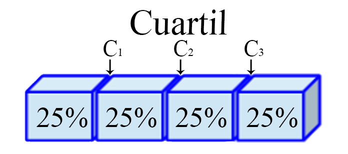

## Medidas estadísticas

#### Caso de estudio

Suponga que se está interesado en observar la evolución en el desempeño
que tuvo un grupo de `$10$` estudiantes en el curso de Estadística I.
Para ello se toma de referencia la nota obtenida en el primer y cuarto
parcial de la materia, obteniendo los siguientes resultados

<table class="table table-striped" style="width: auto !important; margin-left: auto; margin-right: auto;">
<thead>
<tr>
<th style="text-align:left;">
</th>
<th style="text-align:right;">
1
</th>
<th style="text-align:right;">
2
</th>
<th style="text-align:right;">
3
</th>
<th style="text-align:right;">
4
</th>
<th style="text-align:right;">
5
</th>
<th style="text-align:right;">
6
</th>
<th style="text-align:right;">
7
</th>
<th style="text-align:right;">
8
</th>
<th style="text-align:right;">
9
</th>
<th style="text-align:right;">
10
</th>
</tr>
</thead>
<tbody>
<tr>
<td style="text-align:left;">
Parcial 1
</td>
<td style="text-align:right;">
2.7
</td>
<td style="text-align:right;">
4.0
</td>
<td style="text-align:right;">
3.1
</td>
<td style="text-align:right;">
2.7
</td>
<td style="text-align:right;">
2.9
</td>
<td style="text-align:right;">
1.3
</td>
<td style="text-align:right;">
2.6
</td>
<td style="text-align:right;">
2.8
</td>
<td style="text-align:right;">
3.3
</td>
<td style="text-align:right;">
2.1
</td>
</tr>
<tr>
<td style="text-align:left;">
Parcial 4
</td>
<td style="text-align:right;">
1.8
</td>
<td style="text-align:right;">
4.7
</td>
<td style="text-align:right;">
3.4
</td>
<td style="text-align:right;">
0.7
</td>
<td style="text-align:right;">
4.1
</td>
<td style="text-align:right;">
3.6
</td>
<td style="text-align:right;">
4.5
</td>
<td style="text-align:right;">
3.2
</td>
<td style="text-align:right;">
3.4
</td>
<td style="text-align:right;">
2.0
</td>
</tr>
</tbody>
</table>

### Medidas de localización

Estas medidas tienen por objetivo dividir un conjunto de datos ordenado
en partes iguales, entendidas estas como intervalos que contienen la
misma proporción de observaciones. Si se define
`$x_{[1]}, x_{[2]}, \ldots, x_{[n]}$`, como un conjunto de `$n$`
observaciones ordenadas en forma creciente, entonces

#### Cuartil

Son los **tres valores** `$(j=1,2,3)$`, que dividen a un conjunto de
datos ordenados en **cuatro partes** iguales. Para ello, es necesario
calcular inicialmente una variable `$h_j$` de posicionamiento dado el
cuartil `$j$` de interés, tal que
`\begin{align*}   h_j = \frac{j(n-1)}{4} + 1 \quad \quad j=1,2,3 \end{align*}`

y posteriormente, con éste valor se realiza el cálculo del cuartil de
interés
`\begin{align*}   C_j=x_{[\lfloor h_j\rfloor} + \left((h_j - \lfloor h_j\rfloor) \times  (x_{[\lfloor h_j\rfloor + 1]} - x_{\lfloor h_j\rfloor}) \right)  \quad \quad j=1,2,3 \end{align*}`

siendo `$\lfloor h_j\rfloor$` el valor piso de `$h_j$`, **es decir, el
entero de `$h$` aproximando siempre hacia abajo**.

<h4 align="center">
Representación Cuartil
</h4>



En <tt>R</tt> puede calcularse los cuartiles de un conjunto de
observaciones mediante la función
`quantile(datos, probs = c(0.25, 0.5, 0.75))`.

<button id="Show1" class="btn btn-secondary">
Mostrar Ejercicio Manual
</button>
<button id="Hide1" class="btn btn-info">
Ocultar Ejercicio Manual
</button>
<main id="botoncito1">
<h3 data-toc-skip>
Ejercicio Caso de Estudio
</h3>
<p>
Calcule los tres cuartiles para las notas obtenida por los \(10\)
estudiantes en el primer y cuarto parcial del curso de Probabilidad e
Inferencia Estadística de forma manual.
</p>
<h3 data-toc-skip>
Solución Manual
</h3>
<p>
Se presenta el cálculo del primer cuartil obtenido en el parcial \(1\).
El cálculo de los demás cuartiles del parcial \(1\) y para el parcial
\(4\) se dejan al estudiante.
</p>
<p>
Para realizar el cálculo de los cuartiles asociados a las notas
obtenidas por los estudiantes en cada parcial, es necesario ordenar el
total de notas obtenidas en orden ascendente, tal que para el parcial
\(1\) se tendrá
</p>
<table class="table table-striped" style="width: auto !important; margin-left: auto; margin-right: auto;">
<tbody>
<tr>
<td style="text-align:left;">
Parcial 1
</td>
<td style="text-align:left;">
1.3
</td>
<td style="text-align:left;">
2.1
</td>
<td style="text-align:left;">
2.6
</td>
<td style="text-align:left;">
2.7
</td>
<td style="text-align:left;">
2.7
</td>
<td style="text-align:left;">
2.8
</td>
<td style="text-align:left;">
2.9
</td>
<td style="text-align:left;">
3.1
</td>
<td style="text-align:left;">
3.3
</td>
<td style="text-align:left;">
4.0
</td>
</tr>
</tbody>
</table>
<p>

Ahora, dado que se tienen \(10\) observaciones, el variable de
posicionamiento \(h_j\) para el primer cuartil \((j=1)\) estará dado por

\[\begin{align*}
  h_1 &= \frac{1(10-1)}{4} + 1 \\
      &= 3.25
\end{align*}\]

En donde, al reemplazar este valor en la formula de cuartiles, con
\(j=1\), obtendremos

\[\begin{align*}
  C_1 &= x_{\lfloor h_1\rfloor} + \left((h_1 - \lfloor h_1\rfloor) \times  (x_{[\lfloor h_1\rfloor + 1]} - x_{\lfloor h_1\rfloor}) \right) \\ 
      &= x_{\lfloor 3.25\rfloor} + \left((3.25 - \lfloor 3.25\rfloor) \times  (x_{[\lfloor 3.25\rfloor + 1]} - x_{\lfloor 3.25\rfloor}) \right) \\ 
      & = x_{[3]} + \left((3.25 - 3) \times  (x_{[3+1]}-x_{[3]})\right) \\ 
      &= x_{[3]} + \left(0.25 \times  (x_{[4]}-x_{[3]})\right)
\end{align*}\]

Al reemplazar \(x_{[3]}\) y \(x_{[4]}\) por las notas del parcial \(1\),
que ocupan la posición \(3\) y \(4\) en el conjunto de observaciones
ordenadas, es decir, \(x_{[3]}=2.6\) y \(x_{[4]}=2.7\), darán como
resultado que el primer cuartil será igual a

\[\begin{align*}
  C_1 &= 2.6 + \left(0.25 \times  (2.7-2.6)\right)\\ 
      &= 2.625
\end{align*}\]

Por tanto, se concluye que para las notas obtenidas en el parcial \(1\),
el \(25\%\) inferior de los estudiantes obtuvo una nota menor o igual a
\(2.625\), mientras que el \(75\%\) superior de los estudiantes obtuvo
notas mayores o iguales a \(2.625\). <br> <br> Procedimiento e
interpretación similar se realiza para los demás cuartiles del parcial
\(1\), y para los tres cuartiles del parcial \(4\).
</p>
</main>
<button id="Show2" class="btn btn-secondary">
Mostrar Ejercicio en <tt>R</tt>
</button>
<button id="Hide2" class="btn btn-info">
Ocultar Ejercicio en <tt>R</tt>
</button>
<main id="botoncito2">
<h3 data-toc-skip>
Ejercicio Caso de Estudio
</h3>
<p>
Calcule los tres cuartiles para las notas obtenida por los \(10\)
estudiantes en el primer y cuarto parcial del curso de Probabilidad e
Inferencia Estadística con <tt>R</tt>.
</p>
<h3 data-toc-skip>
Solución en <tt>R</tt>
</h3>
<p>
Para realizar el cálculo de los cuartiles en <tt>R</tt> para las notas
obtenidas en los parciales \(1\) y \(4\), se emplea la función
<code>quantile()</code> con el argumento <code>probs = c(0.25, 0.5,
0.75)</code>, tal que
</p>
<section class="language-r highlighter-rouge">
<section class="highlight">
<pre class="highlight"><code><span class="c1">## Se calculan los cuartiles cada conjunto de datos</span><span class="w">
</span><span class="c1"># Cuartiles Parcial 1</span><span class="w">
</span><span class="n">quantile</span><span class="p">(</span><span class="n">P1</span><span class="p">,</span><span class="w"> </span><span class="n">probs</span><span class="w"> </span><span class="o">=</span><span class="w"> </span><span class="nf">c</span><span class="p">(</span><span class="m">0.25</span><span class="p">,</span><span class="w"> </span><span class="m">0.5</span><span class="p">,</span><span class="w"> </span><span class="m">0.75</span><span class="p">))</span><span class="w">
</span></code></pre>
</section>
</section>
<section class="highlighter-rouge">
<section class="highlight">
<pre class="highlight"><code>  25%   50%   75% 
2.625 2.750 3.050 
</code></pre>
</section>
</section>
<section class="language-r highlighter-rouge">
<section class="highlight">
<pre class="highlight"><code><span class="c1"># Cuartiles Parcial 4</span><span class="w">
</span><span class="n">quantile</span><span class="p">(</span><span class="n">P4</span><span class="p">,</span><span class="w"> </span><span class="n">probs</span><span class="w"> </span><span class="o">=</span><span class="w"> </span><span class="nf">c</span><span class="p">(</span><span class="m">0.25</span><span class="p">,</span><span class="w"> </span><span class="m">0.5</span><span class="p">,</span><span class="w"> </span><span class="m">0.75</span><span class="p">))</span><span class="w">
</span></code></pre>
</section>
</section>
<section class="highlighter-rouge">
<section class="highlight">
<pre class="highlight"><code>  25%   50%   75% 
2.300 3.400 3.975 
</code></pre>
</section>
</section>
</main>

#### Quintil

Son los **cuatro valores** `$(j=1,2,3,4)$`, que dividen a un conjunto de
datos ordenados en **cinco partes** iguales. Para ello, es necesario
calcular inicialmente una variable `$h_j$` de posicionamiento dado el
quintil `$j$` de interés, tal que
`\begin{align*}   h_j = \frac{j(n-1)}{5} + 1 \quad \quad j=1,2,3,4 \end{align*}`

y posteriormente, con éste valor se realiza el cálculo del quintil de
interés
`\begin{align*}   Q_j=x_{[\lfloor h_j\rfloor} + \left((h_j - \lfloor h_j\rfloor) \times  (x_{[\lfloor h_j\rfloor + 1]} - x_{\lfloor h_j\rfloor}) \right) \quad \quad j=1,2,3,4 \end{align*}`

siendo `$\lfloor h_j\rfloor$` el valor piso de `$h_j$`, **es decir, el
entero de `$h$` aproximando siempre hacia abajo**.

<h4 align="center">
Representación Quintil
</h4>


En <tt>R</tt> pueden calcularse los quintiles de un conjunto de
observaciones mediante la función
`quantile(datos, probs = c(0.2, 0.4, 0.6, 0.8))`.

<button id="Show3" class="btn btn-secondary">
Mostrar Ejercicio Manual
</button>
<button id="Hide3" class="btn btn-info">
Ocultar Ejercicio Manual
</button>
<main id="botoncito3">
<h3 data-toc-skip>
Ejercicio Caso de Estudio
</h3>
<p>
Calcule los cuatro quintiles para las notas obtenida por los \(10\)
estudiantes en el primer y cuarto parcial del curso de Probabilidad e
Inferencia Estadística de forma manual.
</p>
<h3 data-toc-skip>
Solución Manual
</h3>
<p>
Se presenta el cálculo del tercer quintil obtenido en el parcial \(4\).
El cálculo de los demás quintiles del parcial \(4\) y para el parcial
\(1\) se dejan al estudiante.
</p>
<p>
Para realizar el cálculo de los quintiles asociados a las notas
obtenidas por los estudiantes en cada parcial, es necesario ordenar el
total de notas obtenidas en orden ascendente, tal que para el parcial
\(4\) se tendrá
</p>
<table class="table table-striped" style="width: auto !important; margin-left: auto; margin-right: auto;">
<tbody>
<tr>
<td style="text-align:left;">
Parcial 4
</td>
<td style="text-align:left;">
0.7
</td>
<td style="text-align:left;">
1.8
</td>
<td style="text-align:left;">
2.0
</td>
<td style="text-align:left;">
3.2
</td>
<td style="text-align:left;">
3.4
</td>
<td style="text-align:left;">
3.4
</td>
<td style="text-align:left;">
3.6
</td>
<td style="text-align:left;">
4.1
</td>
<td style="text-align:left;">
4.5
</td>
<td style="text-align:left;">
4.7
</td>
</tr>
</tbody>
</table>
<p>

Ahora, dado que se tienen \(10\) observaciones, el variable de
posicionamiento \(h_j\) para el cuarto quintil \((j=4)\) estará dado por

\[\begin{align*}
  h_4 &= \frac{4(10-1)}{5} + 1 \\
      &= 8.2
\end{align*}\]

En donde, al reemplazar este valor en la formula de quintiles, con
\(j=4\), obtendremos

\[\begin{align*}
  Q_4 &= x_{\lfloor h_4\rfloor} + \left((h_4 - \lfloor h_1\rfloor) \times  (x_{[\lfloor h_4\rfloor + 1]} - x_{\lfloor h_4\rfloor}) \right) \\ 
      &= x_{\lfloor 8.2\rfloor} + \left((8.2 - \lfloor 8.2\rfloor) \times  (x_{[\lfloor 8.2\rfloor + 1]} - x_{\lfloor 8.2\rfloor}) \right) \\ 
      & = x_{[8]} + \left((8.2 - 8) \times  (x_{[8+1]}-x_{[8]})\right) \\ 
      &= x_{[8]} + \left(0.2 \times  (x_{[9]}-x_{[8]})\right)
\end{align*}\]

Al reemplazar \(x_{[8]}\) y \(x_{[9]}\) por las notas del parcial \(4\),
que ocupan la posición \(8\) y \(9\) en el conjunto de observaciones
ordenadas, es decir, \(x_{[8]}=4.1\) y \(x_{[9]}=4.5\), darán como
resultado que el cuarto quintil será igual a

\[\begin{align*}
  Q_4 &= 4.1 + \left(0.2 \times  (4.5-4.1)\right)\\ 
      &= 4.18
\end{align*}\]

En consecuencia, se concluye que para el parcial \(4\), el \(80\%\)
inferior de los estudiantes logró obtener una nota máxima de \(4.18\),
mientras que el \(20\%\) superior obtuvo notas de al menos \(4.18\).
<br> <br> Procedimiento e interpretación similar se realiza para los
demás quintiles del parcial \(4\), y para los cuatro quintiles del
parcial \(1\).
</p>
</main>
<button id="Show4" class="btn btn-secondary">
Mostrar Ejercicio en <tt>R</tt>
</button>
<button id="Hide4" class="btn btn-info">
Ocultar Ejercicio en <tt>R</tt>
</button>
<main id="botoncito4">
<h3 data-toc-skip>
Ejercicio Caso de Estudio
</h3>
<p>
Calcule los cuatro quintiles para las notas obtenida por los \(10\)
estudiantes en el primer y cuarto parcial del curso de Probabilidad e
Inferencia Estadística con <tt>R</tt>.
</p>
<h3 data-toc-skip>
Solución en <tt>R</tt>
</h3>
<p>
Para realizar el cálculo de los quintiles en <tt>R</tt> para las notas
obtenidas en los parciales \(1\) y \(4\), se emplea la función
<code>quantile()</code> con el argumento <code>probs = c(0.2, 0.4, 0.6,
0.8)</code>, tal que
</p>
<section class="language-r highlighter-rouge">
<section class="highlight">
<pre class="highlight"><code><span class="c1">## Se calculan los quintiles de cada conjunto de datos</span><span class="w">
</span><span class="c1"># Quintiles Parcial 1</span><span class="w">
</span><span class="n">quantile</span><span class="p">(</span><span class="n">P1</span><span class="p">,</span><span class="w"> </span><span class="n">probs</span><span class="w"> </span><span class="o">=</span><span class="w"> </span><span class="nf">c</span><span class="p">(</span><span class="m">0.2</span><span class="p">,</span><span class="w"> </span><span class="m">0.4</span><span class="p">,</span><span class="w"> </span><span class="m">0.6</span><span class="p">,</span><span class="w"> </span><span class="m">0.8</span><span class="p">))</span><span class="w">
</span></code></pre>
</section>
</section>
<section class="highlighter-rouge">
<section class="highlight">
<pre class="highlight"><code> 20%  40%  60%  80% 
2.50 2.70 2.84 3.14 
</code></pre>
</section>
</section>
<section class="language-r highlighter-rouge">
<section class="highlight">
<pre class="highlight"><code><span class="c1"># Quintiles Parcial 4</span><span class="w">
</span><span class="n">quantile</span><span class="p">(</span><span class="n">P4</span><span class="p">,</span><span class="w"> </span><span class="n">probs</span><span class="w"> </span><span class="o">=</span><span class="w"> </span><span class="nf">c</span><span class="p">(</span><span class="m">0.2</span><span class="p">,</span><span class="w"> </span><span class="m">0.4</span><span class="p">,</span><span class="w"> </span><span class="m">0.6</span><span class="p">,</span><span class="w"> </span><span class="m">0.8</span><span class="p">))</span><span class="w">
</span></code></pre>
</section>
</section>
<section class="highlighter-rouge">
<section class="highlight">
<pre class="highlight"><code> 20%  40%  60%  80% 
1.96 3.32 3.48 4.18 
</code></pre>
</section>
</section>
</main>

#### Decil

Son los **nueve valores** `$(j=1,2,\ldots,9)$`, que dividen a un
conjunto de datos ordenados en **diez partes** iguales. Para ello, es
necesario calcular inicialmente una variable `$h_j$` de posicionamiento
dado el decil `$j$` de interés, tal que
`\begin{align*}   h_j = \frac{j(n-1)}{10} + 1 \quad \quad j=1,2,\dots,9 \end{align*}`

y posteriormente, con éste valor se realiza el cálculo del decil de
interés
`\begin{align*}   D_j=x_{[\lfloor h_j\rfloor} + \left((h_j - \lfloor h_j\rfloor) \times  (x_{[\lfloor h_j\rfloor + 1]} - x_{\lfloor h_j\rfloor}) \right) \quad \quad j=1,2,\dots,9 \end{align*}`

siendo `$\lfloor h_j\rfloor$` el valor piso de `$h_j$`, **es decir, el
entero de `$h$` aproximando siempre hacia abajo**.

<h4 align="center">
Representación Decil
</h4>


En <tt>R</tt> pueden calcularse los deciles de un conjunto de
observaciones mediante la función
`quantile(datos, probs = seq(0.1, 0.9, 0.1))`.

<button id="Show5" class="btn btn-secondary">
Mostrar Ejercicio Manual
</button>
<button id="Hide5" class="btn btn-info">
Ocultar Ejercicio Manual
</button>
<main id="botoncito5">
<h3 data-toc-skip>
Ejercicio Caso de Estudio
</h3>
<p>
Calcule los nueve deciles para las notas obtenida por los \(10\)
estudiantes en el primer y cuarto parcial del curso de Probabilidad e
Inferencia Estadística de forma manual.
</p>
<h3 data-toc-skip>
Solución Manual
</h3>
<p>
Similar al caso de cuartil y quintil, se presenta el cálculo de un solo
Decil, debido a que el cálculo de los demás posee un procedimiento
similar, y en consecuencia, se deja dicho cálculo al estudiante. <br>
<br> En este caso, se decide realizar el cálculo para el sexto Decil
\((j=6)\), asociado a na nota obtenida por los estudiantes en el parcial
\(1\). Para ello es necesario ordenar el total de notas obtenidas el
parcial \(1\) de forma ascendente, tal que
</p>
<table class="table table-striped" style="width: auto !important; margin-left: auto; margin-right: auto;">
<tbody>
<tr>
<td style="text-align:left;">
Parcial 1
</td>
<td style="text-align:left;">
1.3
</td>
<td style="text-align:left;">
2.1
</td>
<td style="text-align:left;">
2.6
</td>
<td style="text-align:left;">
2.7
</td>
<td style="text-align:left;">
2.7
</td>
<td style="text-align:left;">
2.8
</td>
<td style="text-align:left;">
2.9
</td>
<td style="text-align:left;">
3.1
</td>
<td style="text-align:left;">
3.3
</td>
<td style="text-align:left;">
4.0
</td>
</tr>
</tbody>
</table>
<p>

Donde al tener \(10\) observaciones, se tendrá que la variable de
posicionamiento \(h_j\) para el sexto decil \((j=6)\) estará dado por
\[\begin{align*}
  h_6 &= \frac{6(10-1)}{10} + 1 \\
      &= 6.4
\end{align*}\]

Por tanto, al reemplazar este valor en la formula de deciles, siendo
\(j=6\) se tendrá

\[\begin{align*}
  D_6 &= x_{\lfloor h_6\rfloor} + \left((h_6 - \lfloor h_6\rfloor) \times  (x_{[\lfloor h_6\rfloor + 1]} - x_{\lfloor h_6\rfloor}) \right) \\ 
      &= x_{\lfloor 6.4\rfloor} + \left((6.4 - \lfloor 6.4\rfloor) \times  (x_{[\lfloor 6.4\rfloor + 1]} - x_{\lfloor 6.4\rfloor}) \right) \\ 
      &= x_{[6]} + \left((6.4 - 6) \times  (x_{[6+1]}-x_{[6]})\right) \\ 
      &= x_{[6]} + \left(0.4 \times  (x_{[7]}-x_{[6]})\right)
\end{align*}\]

Reemplazando \(x_{[6]}\) por \(2.8\) y \(x_{[7]}\) por \(2.9\), es
decir, la sexta y séptima nota más alta obtenida en el primer parcial,
se tendrá que el sexto Decil estará dado por

\[\begin{align*}
D_6 &= 2.8 + \left(0.4 \times  (2.9-2.8)\right)\\ 
    &= 2.84
\end{align*}\]

De lo anterior, se puede concluir que para el parcial \(1\), se tendrá
que el \(60\%\) inferior de los estudiantes obtuvo una nota máxima de
\(2.84\), mientras que el \(40\%\) superior obtuvo notas mínima de
\(2.84\). <br> <br> El procedimiento e interpretación aquí presentada,
es similar al que se debe realizar para los demás deciles, tanto del
parcial \(1\), como del parcial \(4\).
</p>
</main>
<button id="Show6" class="btn btn-secondary">
Mostrar Ejercicio en <tt>R</tt>
</button>
<button id="Hide6" class="btn btn-info">
Ocultar Ejercicio en <tt>R</tt>
</button>
<main id="botoncito6">
<h3 data-toc-skip>
Ejercicio Caso de Estudio
</h3>
<p>
Calcule los nueve deciles para las notas obtenida por los \(10\)
estudiantes en el primer y cuarto parcial del curso de Probabilidad e
Inferencia Estadística de forma manual con <tt>R</tt>.
</p>
<h3 data-toc-skip>
Solución en <tt>R</tt>
</h3>
<p>
Para realizar el cálculo de los deciles en <tt>R</tt> para las notas
obtenidas en los parciales \(1\) y \(4\), se emplea la función
<code>quantile()</code> con el argumento <code>probs = seq(0.1, 0.9,
0.1)</code>, tal que
</p>
<section class="language-r highlighter-rouge">
<section class="highlight">
<pre class="highlight"><code><span class="c1">## Se calculan deciles de cada conjunto de datos</span><span class="w">
</span><span class="c1"># Deciles Parcial 1</span><span class="w">
</span><span class="n">quantile</span><span class="p">(</span><span class="n">P1</span><span class="p">,</span><span class="w"> </span><span class="n">probs</span><span class="w"> </span><span class="o">=</span><span class="w"> </span><span class="n">seq</span><span class="p">(</span><span class="m">0.1</span><span class="p">,</span><span class="w"> </span><span class="m">0.9</span><span class="p">,</span><span class="w"> </span><span class="m">0.1</span><span class="p">))</span><span class="w">
</span></code></pre>
</section>
</section>
<section class="highlighter-rouge">
<section class="highlight">
<pre class="highlight"><code> 10%  20%  30%  40%  50%  60%  70%  80%  90% 
2.02 2.50 2.67 2.70 2.75 2.84 2.96 3.14 3.37 
</code></pre>
</section>
</section>
<section class="language-r highlighter-rouge">
<section class="highlight">
<pre class="highlight"><code><span class="c1"># Deciles Parcial 4</span><span class="w">
</span><span class="n">quantile</span><span class="p">(</span><span class="n">P4</span><span class="p">,</span><span class="w"> </span><span class="n">probs</span><span class="w"> </span><span class="o">=</span><span class="w"> </span><span class="n">seq</span><span class="p">(</span><span class="m">0.1</span><span class="p">,</span><span class="w"> </span><span class="m">0.9</span><span class="p">,</span><span class="w"> </span><span class="m">0.1</span><span class="p">))</span><span class="w">
</span></code></pre>
</section>
</section>
<section class="highlighter-rouge">
<section class="highlight">
<pre class="highlight"><code> 10%  20%  30%  40%  50%  60%  70%  80%  90% 
1.69 1.96 2.84 3.32 3.40 3.48 3.75 4.18 4.52 
</code></pre>
</section>
</section>
</main>

#### Percentil

Son los **noventa y nueve valores** `$(j=1,2,\ldots,99)$`, que dividen a
un conjunto de datos ordenados en **cien partes** iguales. Para ello, es
necesario calcular inicialmente una variable `$h_j$` de posicionamiento
dado el percentil `$j$` de interés, tal que
`\begin{align*}   h_j = \frac{j(n-1)}{100} + 1 \quad \quad j=1,2,\dots,99 \end{align*}`

y posteriormente, con éste valor se realiza el cálculo del percentil de
interés
`\begin{align*}   P_j=x_{[\lfloor h_j\rfloor} + \left((h_j - \lfloor h_j\rfloor) \times  (x_{[\lfloor h_j\rfloor + 1]} - x_{\lfloor h_j\rfloor}) \right) \quad \quad j=1,2,\dots,99 \end{align*}`

siendo `$\lfloor h_j\rfloor$` el valor piso de `$h_j$`, **es decir, el
entero de `$h$` aproximando siempre hacia abajo**.

<h4 align="center">
Representación Percentil
</h4>


En <tt>R</tt> pueden calcularse los percentiles de un conjunto de
observaciones mediante la función
`quantile(datos, probs = seq(0.01, 0.99, 0.01))`.

<button id="Show7" class="btn btn-secondary">
Mostrar Ejercicio Manual
</button>
<button id="Hide7" class="btn btn-info">
Ocultar Ejercicio Manual
</button>
<main id="botoncito7">
<h3 data-toc-skip>
Ejercicio Caso de Estudio
</h3>
<p>
Calcule los cien percentiles para las notas obtenida por los \(10\)
estudiantes en el primer y cuarto parcial del curso de Probabilidad e
Inferencia Estadística de forma manual.
</p>
<h3 data-toc-skip>
Solución Manual
</h3>
<p>
Para el cálculo de los percentiles, se decide presentar el cálculo del
trigésimo y tercero percentil \((j=33)\), obtenido en el parcial \(4\).
El cálculo de los demás percentiles se realizan de forma similar, tanto
para el parcial \(4\) como para el parcial \(1\), los cuales se dejan al
estudiante. <br> <br> Para realizar el cálculo de dicho percentil, se
ordenan las notas obtenidas en el parcial \(4\) de menor a mayor, tal
que
</p>
<table class="table table-striped" style="width: auto !important; margin-left: auto; margin-right: auto;">
<tbody>
<tr>
<td style="text-align:left;">
Parcial 4
</td>
<td style="text-align:left;">
0.7
</td>
<td style="text-align:left;">
1.8
</td>
<td style="text-align:left;">
2.0
</td>
<td style="text-align:left;">
3.2
</td>
<td style="text-align:left;">
3.4
</td>
<td style="text-align:left;">
3.4
</td>
<td style="text-align:left;">
3.6
</td>
<td style="text-align:left;">
4.1
</td>
<td style="text-align:left;">
4.5
</td>
<td style="text-align:left;">
4.7
</td>
</tr>
</tbody>
</table>
<p>

Con las notas ordenadas, se realiza el cálculo para la variable de
posicionamiento \(h_j\), con \(j=33\), dado que se posee un total de
\(10\) observaciones, tal que \[\begin{align*}
h_{33} &= \frac{33(10-1)}{100} + 1 \\
       &= 3.97
\end{align*}\]

Al reemplazar el valor obtenido en la variable de posicionamiento, en la
formula de percentiles, con \(j=33\), obtendremos

\[\begin{align*}
  P_{33} &= x_{\lfloor h_{33}\rfloor} + \left((h_{33} - \lfloor h_{33}\rfloor) \times  (x_{[\lfloor h_{33}\rfloor + 1]} - x_{\lfloor h_{33}\rfloor}) \right) \\ 
         &= x_{\lfloor 3.97\rfloor} + \left((3.97 - \lfloor 3.97\rfloor) \times  (x_{[\lfloor 3.97\rfloor + 1]} - x_{\lfloor 3.97\rfloor}) \right) \\ 
         & = x_{[3]} + \left((3.97 - 3) \times  (x_{[3+1]}-x_{[3]})\right) \\ 
         &= x_{[3]} + \left(0.97 \times (x_{[4]}-x_{[3]})\right)
\end{align*}\]

En donde, \(x_{[3]}=2.0\) y \(x_{[4]}=3.2\), son las notas que ocupan la
posición \(3\) y \(4\) en el conjunto de notas ordenadas en el parcial
\(4\). Finalmente, al reemplazar dichos valores en la ecuación de
percentiles se tendrá que

\[\begin{align*}
  P_{33} &= 2.0 + \left(0.97 \times  (3.2-2.0)\right)\\ 
         &= 3.164
\end{align*}\]

De lo anterior, se podrá concluir que el \(33\%\) inferior de los
estudiantes logró obtener una nota menor o igual a \(3.164\) en el
cuarto parcial, mientras que el \(67\%\) superior logró obtener una nota
mínima de \(3.164\) en el cuarto parcial. <br> <br> El procedimiento e
interpretación aquí presentada, se puede replicar para realizar el
cálculo de los demás percentiles asociados a los dos parciales
estudiados.
</p>
</main>
<button id="Show8" class="btn btn-secondary">
Mostrar Ejercicio en <tt>R</tt>
</button>
<button id="Hide8" class="btn btn-info">
Ocultar Ejercicio en <tt>R</tt>
</button>
<main id="botoncito8">
<h3 data-toc-skip>
Ejercicio Caso de Estudio
</h3>
<p>
Calcule los cien percentiles para las notas obtenida por los \(10\)
estudiantes en el primer y cuarto parcial del curso de Probabilidad e
Inferencia Estadística con <tt>R</tt>.
</p>
<h3 data-toc-skip>
Solución en <tt>R</tt>
</h3>
<p>
Para realizar el cálculo de los percentiles en <tt>R</tt> para las notas
obtenidas en los parciales \(1\) y \(4\), se emplea la función
<code>quantile()</code> con el argumento <code>probs = seq(0.01, 0.99,
0.01))</code>, tal que
</p>
<section class="language-r highlighter-rouge">
<section class="highlight">
<pre class="highlight"><code><span class="c1">## Se calculan los percentiles de cada conjunto de datos</span><span class="w">
</span><span class="c1"># Percentiles Parcial 1</span><span class="w">
</span><span class="n">quantile</span><span class="p">(</span><span class="n">P1</span><span class="p">,</span><span class="w"> </span><span class="n">probs</span><span class="w"> </span><span class="o">=</span><span class="w"> </span><span class="n">seq</span><span class="p">(</span><span class="m">0.01</span><span class="p">,</span><span class="w"> </span><span class="m">0.99</span><span class="p">,</span><span class="w"> </span><span class="m">0.01</span><span class="p">))</span><span class="w">
</span></code></pre>
</section>
</section>
<section class="highlighter-rouge">
<section class="highlight">
<pre class="highlight"><code>   1%    2%    3%    4%    5%    6%    7%    8%    9%   10%   11%   12% 
1.372 1.444 1.516 1.588 1.660 1.732 1.804 1.876 1.948 2.020 2.092 2.140 
  13%   14%   15%   16%   17%   18%   19%   20%   21%   22%   23%   24% 
2.185 2.230 2.275 2.320 2.365 2.410 2.455 2.500 2.545 2.590 2.607 2.616 
  25%   26%   27%   28%   29%   30%   31%   32%   33%   34%   35%   36% 
2.625 2.634 2.643 2.652 2.661 2.670 2.679 2.688 2.697 2.700 2.700 2.700 
  37%   38%   39%   40%   41%   42%   43%   44%   45%   46%   47%   48% 
2.700 2.700 2.700 2.700 2.700 2.700 2.700 2.700 2.705 2.714 2.723 2.732 
  49%   50%   51%   52%   53%   54%   55%   56%   57%   58%   59%   60% 
2.741 2.750 2.759 2.768 2.777 2.786 2.795 2.804 2.813 2.822 2.831 2.840 
  61%   62%   63%   64%   65%   66%   67%   68%   69%   70%   71%   72% 
2.849 2.858 2.867 2.876 2.885 2.894 2.906 2.924 2.942 2.960 2.978 2.996 
  73%   74%   75%   76%   77%   78%   79%   80%   81%   82%   83%   84% 
3.014 3.032 3.050 3.068 3.086 3.104 3.122 3.140 3.158 3.176 3.194 3.212 
  85%   86%   87%   88%   89%   90%   91%   92%   93%   94%   95%   96% 
3.230 3.248 3.266 3.284 3.307 3.370 3.433 3.496 3.559 3.622 3.685 3.748 
  97%   98%   99% 
3.811 3.874 3.937 
</code></pre>
</section>
</section>
<section class="language-r highlighter-rouge">
<section class="highlight">
<pre class="highlight"><code><span class="c1"># Percentiles Parcial 4</span><span class="w">
</span><span class="n">quantile</span><span class="p">(</span><span class="n">P4</span><span class="p">,</span><span class="w"> </span><span class="n">probs</span><span class="w"> </span><span class="o">=</span><span class="w"> </span><span class="n">seq</span><span class="p">(</span><span class="m">0.01</span><span class="p">,</span><span class="w"> </span><span class="m">0.99</span><span class="p">,</span><span class="w"> </span><span class="m">0.01</span><span class="p">))</span><span class="w">
</span></code></pre>
</section>
</section>
<section class="highlighter-rouge">
<section class="highlight">
<pre class="highlight"><code>   1%    2%    3%    4%    5%    6%    7%    8%    9%   10%   11%   12% 
0.799 0.898 0.997 1.096 1.195 1.294 1.393 1.492 1.591 1.690 1.789 1.816 
  13%   14%   15%   16%   17%   18%   19%   20%   21%   22%   23%   24% 
1.834 1.852 1.870 1.888 1.906 1.924 1.942 1.960 1.978 1.996 2.084 2.192 
  25%   26%   27%   28%   29%   30%   31%   32%   33%   34%   35%   36% 
2.300 2.408 2.516 2.624 2.732 2.840 2.948 3.056 3.164 3.212 3.230 3.248 
  37%   38%   39%   40%   41%   42%   43%   44%   45%   46%   47%   48% 
3.266 3.284 3.302 3.320 3.338 3.356 3.374 3.392 3.400 3.400 3.400 3.400 
  49%   50%   51%   52%   53%   54%   55%   56%   57%   58%   59%   60% 
3.400 3.400 3.400 3.400 3.400 3.400 3.400 3.408 3.426 3.444 3.462 3.480 
  61%   62%   63%   64%   65%   66%   67%   68%   69%   70%   71%   72% 
3.498 3.516 3.534 3.552 3.570 3.588 3.615 3.660 3.705 3.750 3.795 3.840 
  73%   74%   75%   76%   77%   78%   79%   80%   81%   82%   83%   84% 
3.885 3.930 3.975 4.020 4.065 4.108 4.144 4.180 4.216 4.252 4.288 4.324 
  85%   86%   87%   88%   89%   90%   91%   92%   93%   94%   95%   96% 
4.360 4.396 4.432 4.468 4.502 4.520 4.538 4.556 4.574 4.592 4.610 4.628 
  97%   98%   99% 
4.646 4.664 4.682 
</code></pre>
</section>
</section>
</main>

### Medidas de dispersión

Estas medidas tienen por objetivo determinar la dispersión o
variabilidad que posee un conjunto de observaciones, en donde, entre
mayor sean estas medidas, mayor será el grado de dispersión de los
datos. Si se define `$x_1, x_2, \ldots, x_n$` como un conjunto de `$n$`
observaciones, entonces

#### Varianza

Mide la distancia media **al cuadrado** del conjunto de datos respecto a
la media
`\begin{align*}   S^2=\frac{1}{n-1}\sum_{i=1}^n{(x_i-\bar{X})^2} \end{align*}`
<!--el n-1 se conoce como corrección de Bessel, y se realiza para corregir el sesgo del estimador-->

En <tt>R</tt> puede calcularse la varianza de un conjunto de
observaciones mediante la función `var(datos)`.

<button id="Show9" class="btn btn-secondary">
Mostrar Ejercicio Manual
</button>
<button id="Hide9" class="btn btn-info">
Ocultar Ejercicio Manual
</button>
<main id="botoncito9">
<h3 data-toc-skip>
Ejercicio Caso de Estudio
</h3>
<p>
Calcule la varianza de las notas obtenidas por los \(10\) estudiantes en
el primer y cuarto parcial del curso de Estadística I, de forma manual.
</p>
<h3 data-toc-skip>
Solución Manual
</h3>
<p>

La varianza de las notas obtenidas en los parciales \(1\) y \(4\) por
los estudiantes que cursaron Estadística I estará dada por

\[\begin{align*}
  S^2_{P1} &= \frac{1}{10-1}\left[(2.7 - 2.75)^2 + (4.0 - 2.75)^2 + \ldots + (2.1 - 2.75) ^2\right] \\
           &= 0.5072222 \\
  S^2_{P4} &=\frac{1}{10-1}\left[(1.8 - 3.14)^2 + (4.7 - 3.14)^2 + \ldots + (2.0 - 3.14) ^2\right] \\
           &= 1.622667
\end{align*}\]

Es de anotar, que la interpretación de la varianza no tiene mucho
sentido, debido a que la unidad de medición estará elevada al cuadrado,
así que en general, los valores calculados se usan para realizar el
cálculo de la desviación estándar.
</p>
</main>
<button id="Show10" class="btn btn-secondary">
Mostrar Ejercicio en <tt>R</tt>
</button>
<button id="Hide10" class="btn btn-info">
Ocultar Ejercicio en <tt>R</tt>
</button>
<main id="botoncito10">
<h3 data-toc-skip>
Ejercicio Caso de Estudio
</h3>
<p>
Calcule la varianza de las notas obtenidas por los \(10\) estudiantes en
el primer y cuarto parcial del curso de Estadística I, con <tt>R</tt>.
</p>
<h3 data-toc-skip>
Solución en <tt>R</tt>
</h3>
<p>
Para realizar el cálculo de la varianza en <tt>R</tt>, para las nota
obtenida por los estudiantes en los dos parciales se emplea la función
<code>var()</code> tal que
</p>
<section class="language-r highlighter-rouge">
<section class="highlight">
<pre class="highlight"><code><span class="c1">## Se calcula la varianza de cada conjunto de datos</span><span class="w">
</span><span class="c1"># Varianza Parcial 1</span><span class="w">
</span><span class="n">var</span><span class="p">(</span><span class="n">P1</span><span class="p">)</span><span class="w">
</span></code></pre>
</section>
</section>
<section class="highlighter-rouge">
<section class="highlight">
<pre class="highlight"><code>[1] 0.5072222
</code></pre>
</section>
</section>
<section class="language-r highlighter-rouge">
<section class="highlight">
<pre class="highlight"><code><span class="c1"># Varianza Parcial 4</span><span class="w">
</span><span class="n">var</span><span class="p">(</span><span class="n">P4</span><span class="p">)</span><span class="w">
</span></code></pre>
</section>
</section>
<section class="highlighter-rouge">
<section class="highlight">
<pre class="highlight"><code>[1] 1.622667
</code></pre>
</section>
</section>
</main>

#### Desviación estándar

Es la raíz cuadrada de la distancia media del conjunto de datos respeto
a la media, es decir, indica qué tan dispersos se encuentra el conjunto
de observaciones de su valor promedio.
`\begin{align*}   S=\sqrt{S^2} \end{align*}`

En <tt>R</tt> puede calcularse la desviación estándar de un conjunto de
observaciones mediante la función `sd(datos)`.

<button id="Show11" class="btn btn-secondary">
Mostrar Ejercicio Manual
</button>
<button id="Hide11" class="btn btn-info">
Ocultar Ejercicio Manual
</button>
<main id="botoncito11">
<p>
Calcule la desviación estándar de las notas obtenidas por los \(10\)
estudiantes en el primer y cuarto parcial del curso de Estadística I de
forma manual.
</p>
<h3 data-toc-skip>
Solución Manual
</h3>
<p>

La desviación estándar de las notas obtenidas en los parciales \(1\) y
\(4\) por los estudiantes que cursaron Estadística I, es simplemente la
raíz cuadrada de la varianza que se calculó anteriormente, y por tanto
se tendrá que

\[\begin{align*}
  S_{P1} &= \sqrt{0.5072222} = 0.7121953 \\ 
  S_{P4} &= \sqrt{1.622667} = 1.273839
\end{align*}\]

De los resultados obtenidos se tiene que, la dispersión que poseen los
datos respecto a su valor promedio es de \(0.7121953\) para las notas
obtenidas en el parcial \(1\) y de \(1.273839\) para las notas obtenidas
en el parcial \(4\) de Estadística I. Esto quiere decir, que las notas
obtenidas en el parcial \(1\) se encuentran más reunidas respecto a
valor promedio, que las notas obtenidas en el parcial \(4\).
</p>
</main>
<button id="Show12" class="btn btn-secondary">
Mostrar Ejercicio en <tt>R</tt>
</button>
<button id="Hide12" class="btn btn-info">
Ocultar Ejercicio en <tt>R</tt>
</button>
<main id="botoncito12">
<h3 data-toc-skip>
Ejercicio Caso de Estudio
</h3>
<p>
Calcule la desviación estándar de las notas obtenidas por los \(10\)
estudiantes en el primer y cuarto parcial del curso de Estadística I,
con <tt>R</tt>.
</p>
<h3 data-toc-skip>
Solución en <tt>R</tt>
</h3>
<p>
Para realizar el cálculo de las desviaciones estándar para las nota
obtenida por los estudiantes en los dos parciales en el programa
<tt>R</tt>, se emplea la función <code>sd()</code> tal que
</p>
<section class="language-r highlighter-rouge">
<section class="highlight">
<pre class="highlight"><code><span class="c1">## Se calcula la desviación estándar de cada conjunto de datos</span><span class="w">
</span><span class="c1"># Desviación estándar Parcial 1</span><span class="w">
</span><span class="n">sd</span><span class="p">(</span><span class="n">P1</span><span class="p">)</span><span class="w">
</span></code></pre>
</section>
</section>
<section class="highlighter-rouge">
<section class="highlight">
<pre class="highlight"><code>[1] 0.7121954
</code></pre>
</section>
</section>
<section class="language-r highlighter-rouge">
<section class="highlight">
<pre class="highlight"><code><span class="c1"># Desviación estándar Parcial 4</span><span class="w">
</span><span class="n">sd</span><span class="p">(</span><span class="n">P4</span><span class="p">)</span><span class="w">
</span></code></pre>
</section>
</section>
<section class="highlighter-rouge">
<section class="highlight">
<pre class="highlight"><code>[1] 1.273839
</code></pre>
</section>
</section>
</main>

#### Coeficiente de variación

Es la desviación estándar como un porcentaje de la media aritmética de
un conjunto de datos. Sirve para observar el grado de variabilidad que
tiene un conjunto de observaciones respecto a su promedio
`\begin{align*}   CV = \frac{S}{|\bar{X}|} \times 100\% \end{align*}`

Entre las funciones base del programa <tt>R</tt> no hay ninguna función
que calcule el coeficiente de variación de un conjunto de observaciones,
pero éste es fácil de calcular mediante el cociente entre la desviación
estándar `$S$` y el valor absoluto de la media `$\bar{X}$`, o creando
una función que realice el cálculo, de la forma

``` r
# Función para el cálculo del coeficiente de variación
CV <- function(x) (sd(x)/abs(mean(x))) * 100
```

Una vez creada la función, puede calcularse el coeficiente de variación
de un conjunto de observaciones mediante la función `CV(datos)`.

<button id="Show13" class="btn btn-secondary">
Mostrar Ejercicio Manual
</button>
<button id="Hide13" class="btn btn-info">
Ocultar Ejercicio Manual
</button>
<main id="botoncito13">
<h3 data-toc-skip>
Ejercicio Caso de Estudio
</h3>
<p>
Calcule el porcentaje de variación de las notas obtenidas por los \(10\)
estudiantes en el primer y cuarto parcial del curso de Estadística I,
respecto a su valor promedio de forma manual.
</p>
<h3 data-toc-skip>
Solución Manual
</h3>
<p>

El coeficiente de variación refleja la variación porcentual que tiene un
conjunto de observaciones respecto a su valor promedio, por tanto, al
aplicar la ecuación del coeficiente de variación a las notas obtenidas
en los parciales \(1\) y \(4\) por los estudiantes que cursaron
Estadística I, se tiene que

\[\begin{align*}
  CV_{P1} &= \frac{0.7121953}{|2.75|} \times 100\% = 25.89801 \% \\
  CV_{P4} &= \frac{1.273839}{|3.14|} \times 100\% = 40.56812 \%
\end{align*}\]

De lo anterior, se aprecia que tal como se esperaba, la variación
porcentual de los datos respecto a su media para el caso del parcial
\(1\) es menor al obtenido en el parcial \(4\), pues se evidencia que el
coeficiente de variación del parcial \(1\) es cercano al \(25.9\%\),
mientras que en el parcial \(4\), se obtuvo un porcentaje de variación
de \(40.57\%\).
</p>
</main>
<button id="Show14" class="btn btn-secondary">
Mostrar Ejercicio en <tt>R</tt>
</button>
<button id="Hide14" class="btn btn-info">
Ocultar Ejercicio en <tt>R</tt>
</button>
<main id="botoncito14">
<h3 data-toc-skip>
Ejercicio Caso de Estudio
</h3>
<p>
Calcule el porcentaje de variación de las notas por los \(10\)
estudiantes en el primer y cuarto parcial del curso de Estadística I,
respecto a su valor promedio en <tt>R</tt>.
</p>
<h3 data-toc-skip>
Solución en <tt>R</tt>
</h3>
<p>
Para realizar el cálculo en el programa <tt>R</tt> de los coeficientes
de variación, para las nota obtenida por los estudiantes en el primer y
cuarto parcial de Estadística 1, se emplea la función <code>CV()</code>
planteada anteriormente. tal que
</p>
<section class="language-r highlighter-rouge">
<section class="highlight">
<pre class="highlight"><code><span class="c1"># Se corre inicialmente la función CV para crearla</span><span class="w">
</span><span class="n">CV</span><span class="w"> </span><span class="o">&lt;-</span><span class="w"> </span><span class="k">function</span><span class="p">(</span><span class="n">x</span><span class="p">)</span><span class="w"> </span><span class="p">(</span><span class="n">sd</span><span class="p">(</span><span class="n">x</span><span class="p">)</span><span class="o">/</span><span class="nf">abs</span><span class="p">(</span><span class="n">mean</span><span class="p">(</span><span class="n">x</span><span class="p">)))</span><span class="w"> </span><span class="o">*</span><span class="w"> </span><span class="m">100</span><span class="w">

</span><span class="c1">## Se calcula el coeficiente de variación de cada conjunto de datos</span><span class="w">
</span><span class="c1">## Coeficiente de variación Parcial 1</span><span class="w">
</span><span class="n">CV</span><span class="p">(</span><span class="n">P1</span><span class="p">)</span><span class="w">
</span></code></pre>
</section>
</section>
<section class="highlighter-rouge">
<section class="highlight">
<pre class="highlight"><code>[1] 25.89801
</code></pre>
</section>
</section>
<section class="language-r highlighter-rouge">
<section class="highlight">
<pre class="highlight"><code><span class="c1"># Coeficiente de variación Parcial 4</span><span class="w">
</span><span class="n">CV</span><span class="p">(</span><span class="n">P4</span><span class="p">)</span><span class="w">
</span></code></pre>
</section>
</section>
<section class="highlighter-rouge">
<section class="highlight">
<pre class="highlight"><code>[1] 40.56813
</code></pre>
</section>
</section>
</main>

#### Rango

Es la distancia o amplitud que hay entre el valor máximo y mínimo en un
conjunto de datos `\begin{align*}   R = x_{max}-x_{min} \end{align*}`

Entre las funciones base del programa <tt>R</tt> no hay ninguna función
que calcule el rango de un conjunto de observaciones de forma directa,,
pero éste es fácil de calcular mediante la resta del valor máximo
`max(datos)` y mínimo `min(datos)`, o creando una función que realice el
cálculo, de la forma

``` r
# Función para el cálculo del rango
Rango <- function(x) max(x) - min(x)
```

Una vez creada la función, puede calcularse el rango de un conjunto de
observaciones mediante la función `Rango(datos)`. Una forma alternativa
para realizar el cálculo del rango de un conjunto de observaciones, es
empleando una combinaciones de funciones de la forma
`diff(range(datos))`.

<button id="Show15" class="btn btn-secondary">
Mostrar Ejercicio Manual
</button>
<button id="Hide15" class="btn btn-info">
Ocultar Ejercicio Manual
</button>
<main id="botoncito15">
<h3 data-toc-skip>
Ejercicio Caso de Estudio
</h3>
<p>
Calcule el rango de las notas obtenidas por los \(10\) estudiantes en el
primer y cuarto parcial del curso de Estadística I, de forma manual.
</p>
<h3 data-toc-skip>
Solución Manual
</h3>
<p>
Para realizar el cálculo del rango o amplitud que poseen las notas
obtenidas por los estudiantes que vieron el curso de Estadística I en
los parciales \(1\) y \(4\), es necesario inicialmente ordenar las notas
en orden ascendente, tal que
</p>
<table class="table table-striped" style="width: auto !important; margin-left: auto; margin-right: auto;">
<tbody>
<tr>
<td style="text-align:left;">
Parcial 1
</td>
<td style="text-align:right;">
Parcial 1
</td>
<td style="text-align:right;">
<span
style="     border-radius: 4px; padding-right: 4px; padding-left: 4px; background-color: #974c55 !important;">1.3</span>
</td>
<td style="text-align:right;">
2.1
</td>
<td style="text-align:right;">
2.6
</td>
<td style="text-align:right;">
2.7
</td>
<td style="text-align:right;">
2.7
</td>
<td style="text-align:right;">
2.8
</td>
<td style="text-align:right;">
2.9
</td>
<td style="text-align:right;">
3.1
</td>
<td style="text-align:right;">
3.3
</td>
<td style="text-align:right;">
<span
style="     border-radius: 4px; padding-right: 4px; padding-left: 4px; background-color: #974c55 !important;">4.0</span>
</td>
</tr>
</tbody>
</table>
<table class="table table-striped" style="width: auto !important; margin-left: auto; margin-right: auto;">
<tbody>
<tr>
<td style="text-align:left;">
Parcial 4
</td>
<td style="text-align:right;">
Parcial 4
</td>
<td style="text-align:right;">
<span
style="     border-radius: 4px; padding-right: 4px; padding-left: 4px; background-color: #974c55 !important;">0.7</span>
</td>
<td style="text-align:right;">
1.8
</td>
<td style="text-align:right;">
2.0
</td>
<td style="text-align:right;">
3.2
</td>
<td style="text-align:right;">
3.4
</td>
<td style="text-align:right;">
3.4
</td>
<td style="text-align:right;">
3.6
</td>
<td style="text-align:right;">
4.1
</td>
<td style="text-align:right;">
4.5
</td>
<td style="text-align:right;">
<span
style="     border-radius: 4px; padding-right: 4px; padding-left: 4px; background-color: #974c55 !important;">4.7</span>
</td>
</tr>
</tbody>
</table>
<p>

Una vez ordenados los valores, se localiza el valor máximo y mínimo de
cada parcial, y se realiza entonces el cálculo del rango para cada caso

\[\begin{align*}
  R_{P1} &= 4.0 - 1.3 = 2.7 \\ 
  R_{P4} &= 4.7 - 0.7 = 4.0
\end{align*}\] Se evidencia entonces que la amplitud de las notas del
parcial \(4\) es mucho mayor a la amplitud del parcial \(1\), puesto que
se observa que el rango obtenido por las notas del parcial \(4\) es de
\(4.0\) puntos, mientras que el rango obtenido por las notas del parcial
\(1\) es de \(2.7\) puntos. De lo anterior, vemos que hay una
consistencia con lo encontrado en la desviación estándar, en donde
veíamos que la dispersión para el parcial \(4\) era mayor a la
dispersión del parcial \(1\).
</p>
</main>
<button id="Show16" class="btn btn-secondary">
Mostrar Ejercicio en <tt>R</tt>
</button>
<button id="Hide16" class="btn btn-info">
Ocultar Ejercicio en <tt>R</tt>
</button>
<main id="botoncito16">
<h3 data-toc-skip>
Ejercicio Caso de Estudio
</h3>
<p>
Calcule el rango de las notas obtenidas por los \(10\) estudiantes en el
primer y cuarto parcial del curso de Estadística I en <tt>R</tt>.
</p>
<h3 data-toc-skip>
Solución en <tt>R</tt>
</h3>
<p>
Para realizar el cálculo en <tt>R</tt> del rango de las notas obtenidas
en el primer y cuarto parcial por los estudiantes de Estadística 1, se
emplea la función <code>Rango()</code> planteada anteriormente, tal que
</p>
<section class="language-r highlighter-rouge">
<section class="highlight">
<pre class="highlight"><code><span class="c1"># Se corre inicialmente la función Rango para crearla</span><span class="w">
</span><span class="n">Rango</span><span class="w"> </span><span class="o">&lt;-</span><span class="w"> </span><span class="k">function</span><span class="p">(</span><span class="n">x</span><span class="p">)</span><span class="w"> </span><span class="nf">max</span><span class="p">(</span><span class="n">x</span><span class="p">)</span><span class="w"> </span><span class="o">-</span><span class="w"> </span><span class="nf">min</span><span class="p">(</span><span class="n">x</span><span class="p">)</span><span class="w">

</span><span class="c1">## Se calcula el coeficiente de variación de cada conjunto de datos Rango</span><span class="w">
</span><span class="c1">## Parcial 1</span><span class="w">
</span><span class="n">Rango</span><span class="p">(</span><span class="n">P1</span><span class="p">)</span><span class="w">
</span></code></pre>
</section>
</section>
<section class="highlighter-rouge">
<section class="highlight">
<pre class="highlight"><code>[1] 2.7
</code></pre>
</section>
</section>
<section class="language-r highlighter-rouge">
<section class="highlight">
<pre class="highlight"><code><span class="c1">## Rango Parcial 4</span><span class="w">
</span><span class="n">Rango</span><span class="p">(</span><span class="n">P4</span><span class="p">)</span><span class="w">
</span></code></pre>
</section>
</section>
<section class="highlighter-rouge">
<section class="highlight">
<pre class="highlight"><code>[1] 4.0
</code></pre>
</section>
</section>
</main>

#### Rango intercuartílico

Es la distancia o amplitud que hay entre el tercer cuartil `$C_3$` y el
primer cuartil `$C_1$`, de un conjunto de datos. Éste muestra la
amplitud del 50% de los datos centrales de un conjunto de observaciones.
Esta medida puede ser tomada como una medida de variabilidad para la
mediana. `\begin{align*}   IQR = C_3 - C_1 \end{align*}`

En <tt>R</tt> puede calcularse el rango intercuartílico de un conjunto
de observaciones mediante la función `IQR(datos)`.

<button id="Show17" class="btn btn-secondary">
Mostrar Ejercicio Manual
</button>
<button id="Hide17" class="btn btn-info">
Ocultar Ejercicio Manual
</button>
<main id="botoncito17">
<h3 data-toc-skip>
Ejercicio Caso de Estudio
</h3>
<p>
Calcule el rango intercuartílico de las notas obtenidas por los \(10\)
estudiantes en el primer y cuarto parcial del curso de Estadística I de
forma manual.
</p>
<h3 data-toc-skip>
Solución Manual
</h3>
<p>

El rango intercuartílico se calcula de forma similar al rango, solo que
en lugar de emplear el valor máximo y el valor mínimo del conjunto de
observaciones, se emplea en su lugar, el tercer y primer cuartil. <br>

Entonces, basados en los cálculos de los cuartiles obtenidos en la
<a href="https://jiperezga.github.io/ProbabilidadeInferencia/PeIEClase03.html#cuartil" target="\_blank">Clase
03</a> (ver Solucion en R), se tendrá que el primer y tercer cuartil
para el parcial \(1\) son \(C_{1}= 2.625\) y \(C_{3}= 3.050\),
respectivamente, obteniendo un rango intercuartílico de

\[\begin{align*}
  IQR_{P1} = 3.050 - 2.625 = 0.425
\end{align*}\]

mientras que, el primer y tercer cuartil para el parcial \(4\) son
\(C_{1}= 2.3\) y \(C_{3}= 3.975\), respectivamente, y en consecuencia,
el rango intercuartílico asociado al parcial \(4\) será

\[\begin{align*}
  IQR_{P4}= 3.975 - 2.3 = 1.675
\end{align*}\]

Mostrando que, al eliminar el \(50\%\) de los datos más extremos, se
obtiene un rango de \(0.425\) para el caso del parcial \(1\), y de
\(1.675\) para el caso del parcial \(4\), lo cual, corrobora que aún
para el \(50\%\) de los datos centrales, se aprecia que la dispersión de
las notas del primer parcial es bastante menor que la dispersión de las
notas del cuarto parcial.
</p>
</main>
<button id="Show18" class="btn btn-secondary">
Mostrar Ejercicio en <tt>R</tt>
</button>
<button id="Hide18" class="btn btn-info">
Ocultar Ejercicio en <tt>R</tt>
</button>
<main id="botoncito18">
<h3 data-toc-skip>
Ejercicio Caso de Estudio
</h3>
<p>
Calcule el rango intercuartílico de las notas obtenidas por los \(10\)
estudiantes en el primer y cuarto parcial del curso de Estadística I en
<tt>R</tt>.
</p>
<h3 data-toc-skip>
Solución en <tt>R</tt>
</h3>
<p>
Para realizar el cálculo del rango intercuartílico en <tt>R</tt> de las
notas obtenidas en el primer y cuarto parcial por los estudiantes de
Estadística 1, se emplea la función <code>IQR()</code>, tal que
</p>
<section class="language-r highlighter-rouge">
<section class="highlight">
<pre class="highlight"><code><span class="c1">## Se calcula el rango intercuartílico de cada conjunto de datos</span><span class="w">
</span><span class="c1"># Rango intercuarílico Parcial 1</span><span class="w">
</span><span class="n">IQR</span><span class="p">(</span><span class="n">P1</span><span class="p">)</span><span class="w">
</span></code></pre>
</section>
</section>
<section class="highlighter-rouge">
<section class="highlight">
<pre class="highlight"><code>[1] 0.425
</code></pre>
</section>
</section>
<section class="language-r highlighter-rouge">
<section class="highlight">
<pre class="highlight"><code><span class="c1"># Rango intercuartílico Parcial 4</span><span class="w">
</span><span class="n">IQR</span><span class="p">(</span><span class="n">P4</span><span class="p">)</span><span class="w">
</span></code></pre>
</section>
</section>
<section class="highlighter-rouge">
<section class="highlight">
<pre class="highlight"><code>[1] 1.675
</code></pre>
</section>
</section>
</main>

#### Desviación absoluta mediana

Es una medida de la dispersión de un conjunto de observaciones respecto
a su mediana

`\begin{align*}   MAD=b\times Me(|X_i-\tilde{X}|) \end{align*}`

donde `$b$` es una constante definida como `$b=1/C_{3}$`, con `$C_{3}$`
el valor del tercer cuartil de la distribución de interés (no el
obtenido de los datos) y con `$Me(|X_i-\tilde{X}|)$` la mediana del
valor absoluto de la diferencia `$X_i-\tilde{X}$`. Además, si la
distribución es normal, entonces `$b\approx1.4826$`.

En <tt>R</tt> puede calcularse la desviación absoluta mediana de un
conjunto de observaciones, asumiendo que la distribución es normal,
mediante la función `mad(datos)`, si no es posible asumir que la
distribución es normal, entonces puede calcularse mediante la función
`mad(datos, constant = b)`.

<button id="Show19" class="btn btn-secondary">
Mostrar Ejercicio Manual
</button>
<button id="Hide19" class="btn btn-info">
Ocultar Ejercicio Manual
</button>
<main id="botoncito19">
<h3 data-toc-skip>
Ejercicio Caso de Estudio
</h3>
<p>
Calcule la desviación absoluta mediana de las notas obtenidas por los
\(10\) estudiantes, en el primer y cuarto parcial del curso de
Estadística I de forma manual.
</p>
<h3 data-toc-skip>
Solución Manual
</h3>
<p>
Para realizar el cálculo de la desviación absoluta mediana para las
notas obtenidas por los estudiantes en los parciales \(1\) y \(4\) del
curso de Estadística I, es necesario inicialmente realizar el cálculo de
\(|X_i-\tilde{X}|\) para cada una de las notas obtenidas en los dos
parciales, siendo \(\tilde{X}\) el valor de la mediana calculada en la
<a href="https://jiperezga.github.io/ProbabilidadeInferencia/PeIEClase03.html#mediana" target="\_blank">Clase
03</a> (ver Solucion manual o en R).
</p>
<table class="table table-striped" style="width: auto !important; margin-left: auto; margin-right: auto;">
<thead>
<tr>
<th style="text-align:left;">
</th>
<th style="text-align:right;">
1
</th>
<th style="text-align:right;">
2
</th>
<th style="text-align:right;">
3
</th>
<th style="text-align:right;">
4
</th>
<th style="text-align:right;">
5
</th>
<th style="text-align:right;">
6
</th>
<th style="text-align:right;">
7
</th>
<th style="text-align:right;">
8
</th>
<th style="text-align:right;">
9
</th>
<th style="text-align:right;">
10
</th>
</tr>
</thead>
<tbody>
<tr>
<td style="text-align:left;">
Parcial 1 \(|X_i-\tilde{X}|\)
</td>
<td style="text-align:right;">
0.05
</td>
<td style="text-align:right;">
1.25
</td>
<td style="text-align:right;">
0.35
</td>
<td style="text-align:right;">
0.05
</td>
<td style="text-align:right;">
0.15
</td>
<td style="text-align:right;">
1.45
</td>
<td style="text-align:right;">
0.15
</td>
<td style="text-align:right;">
0.05
</td>
<td style="text-align:right;">
0.55
</td>
<td style="text-align:right;">
0.65
</td>
</tr>
<tr>
<td style="text-align:left;">
Parcial 4 \(|X_i-\tilde{X}|\)
</td>
<td style="text-align:right;">
1.60
</td>
<td style="text-align:right;">
1.30
</td>
<td style="text-align:right;">
0.00
</td>
<td style="text-align:right;">
2.70
</td>
<td style="text-align:right;">
0.70
</td>
<td style="text-align:right;">
0.20
</td>
<td style="text-align:right;">
1.10
</td>
<td style="text-align:right;">
0.20
</td>
<td style="text-align:right;">
0.00
</td>
<td style="text-align:right;">
1.40
</td>
</tr>
</tbody>
</table>
<p>

Seguidamente, se realiza el cálculo de la mediana de los valores
obtenidos en la tabla anterior, en donde, dado que se tienen \(10\)
observaciones, entonces \(Me(|X_i-\tilde{X}|)\) para el parcial \(1\)
será (recuerde que para encontrar la mediana es necesario ordenar las
observaciones de forma ascendente)

\[\begin{align*}
  Me(|X_i-\tilde{X}|) = \frac{1}{2}(0.15 + 0.35)= 0.25
\end{align*}\]

mientras que, el valor \(Me(|X_i-\tilde{X}|)\) para el parcial \(4\)
será

\[\begin{align*}
  Me(|X_i-\tilde{X}|) = \frac{1}{2}(0.7 + 1.1)= 0.9
\end{align*}\]

Ahora, al emplear estos dos valores, y asumiento que \(b=1.4826\), se
tendrá que la desviación absoluta mediana para los parciales \(1\) y
\(4\) son de

\[\begin{align*}
  MAD_{P1} &= 1.4826 \times 0.25 = 0.37065 \\
  MAD_{P4} &= 1.4826 \times 0.9 = 1.33434
\end{align*}\] Se tiene entonces que la desviación abosulta mediana o
dispersión respecto a la mediana que poseen las notas de los estudiantes
de Estadística I, en el primer parcial es de \(0.37\), mientras para el
cuarto parcial es de \(1.33434\), lo cual indica que la dispersión de
las notas para el cuarto parcial es superior a la dispersión de las
notas asociada al primer parcial, lo cual es consistente con las otras
medidas de dispersión vistas en esta sección.
</p>
</main>
<button id="Show20" class="btn btn-secondary">
Mostrar Ejercicio en <tt>R</tt>
</button>
<button id="Hide20" class="btn btn-info">
Ocultar Ejercicio en <tt>R</tt>
</button>
<main id="botoncito20">
<h3 data-toc-skip>
Ejercicio Caso de Estudio
</h3>
<p>
Calcule la desviación absoluta mediana de las notas obtenidas por los
\(10\) estudiantes, en el primer y cuarto parcial del curso de
Estadística I en <tt>R</tt>.
</p>
<h3 data-toc-skip>
Solución en <tt>R</tt>
</h3>
<p>
Para realizar el cálculo de la desviación absoluta mediana en
<tt>R</tt>, para las notas obtenidas en el primer y cuarto parcial por
los estudiantes de Estadística 1, se emplea la función
<code>mad()</code>, de forma que
</p>
<section class="language-r highlighter-rouge">
<section class="highlight">
<pre class="highlight"><code><span class="c1">## Se calcula la desviación absoluta mediana de cada conjunto de datos</span><span class="w">
</span><span class="c1"># Desviación absoluta mediana Parcial 1</span><span class="w">
</span><span class="n">mad</span><span class="p">(</span><span class="n">P1</span><span class="p">)</span><span class="w">
</span></code></pre>
</section>
</section>
<section class="highlighter-rouge">
<section class="highlight">
<pre class="highlight"><code>[1] 0.37065
</code></pre>
</section>
</section>
<section class="language-r highlighter-rouge">
<section class="highlight">
<pre class="highlight"><code><span class="c1"># Desviación absoluta mediana Parcial 4</span><span class="w">
</span><span class="n">mad</span><span class="p">(</span><span class="n">P4</span><span class="p">)</span><span class="w">
</span></code></pre>
</section>
</section>
<section class="highlighter-rouge">
<section class="highlight">
<pre class="highlight"><code>[1] 1.33434
</code></pre>
</section>
</section>
</main>
