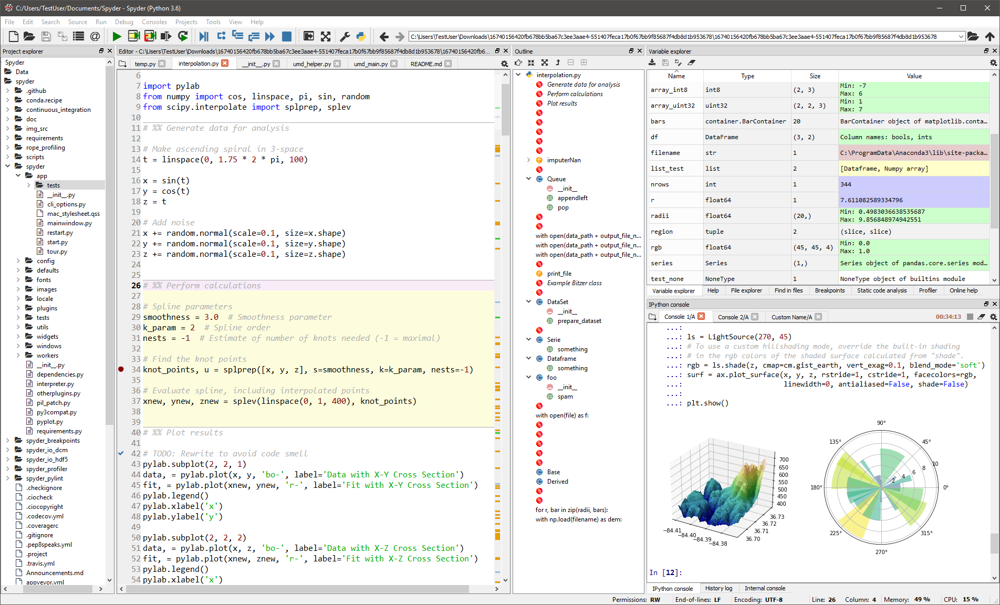

Qué es Python?
--------------

<tt>Python</tt> también es un lenguaje y ambiente de alto nivel cuya
filosofía hace hincapié en una sintaxis que favorezca un código legible,
simple, versatil, para un rápido desarrollo. Similar a <tt>R</tt>,
<tt>Python</tt> también es un lenguaje orientado a obtjetos, pensado
para realizar cualquier tipo de programa, desde aplicaciones Windows a
servidores de red o incluso, páginas web, aplicaciones para celular o
hasta videojuegos.

Python es un lenguaje de programación dinámico que se implementa en una
variedad de plataformas, ésto debido a la licencia de código abierto que
posee, lo cual le permite ser utilización en distintos contextos sin la
necesidad de abonar en éstos.

Similar a <tt>R</tt>, pero con un crecimiento aún mayor durante los
últimos años, <tt>Python</tt> se ha consolidado en el top `$5$` de
software más usados en el mundo, codeandose con otros lenguajes como
<tt>Java</tt>, <tt>C</tt> o <tt>C++</tt>. Ésto puede verse reflejado en
el Indice TIOBE, donde se aprecia que <tt>Python</tt> ocupa actualmente
el puesto número `$3$`.

### Un poco de historia

El creador del lenguaje es un europeo llamado Guido Van Rossum, el cual
ideó el lenguaje <tt>Python</tt> a finales de los 80 y comenzó a
implementarlo en diciembre de 1989, ayudado y motivado por su
experiencia en la creación de otro lenguaje llamado ABC. El objetivo de
Guido era cubrir la necesidad de un lenguaje orientado a objetos de
sencillo uso que sirviese para tratar diversas tareas dentro de la
programación que habitualmente se hacía en Unix usando <tt>C</tt>.

En febrero de 1991 publicó la primera versión pública, la versión 0.9.0.
La versión 1.0 se publicó en enero de 1994, la versión 2.0 se publicó en
octubre de 2000 y la versión 3.0 se publicó en diciembre de 2008. hasta
2018, el desarrollo de Python lo lleva a cabo un colectivo de
programadores dirigido por Guido van Rossum y bajo el paraguas de la
fundación Python Software Foundation.

La imagen siguiente muestra la fecha de publicación de las versiones
principales de Python, en cada una de las tres grandes versiones, Python
1, Python 2 y Python 3. Las versiones indicadas con punto rojo se
consideran obsoletas, las versiones indicadas con punto azul siguen
publicando actualizaciones, las versiones indicadas con punto blanco
corresponden a versiones futuras con las fechas de publicación
previstas.

La imagen siguiente muestra la fecha de publicación de las últimas
versiones menores de Python. Las versiones indicadas en rojo se
consideran obsoletas, las versiones indicadas con punto blanco
corresponden a versiones futuras con fechas ya previstas.

### Ventajas de Python

-   Sencillez, legibilidad y exactitud en la sintaxis.
-   Posee dialcetos o variantes en su programación que se adaptan a
    otros lenguajes, tales como Jython que se utiliza para escribir en
    Java
-   Es un lenguaje muy portable (ya sea en Mac, Linux o Windows) en
    comparación con otros lenguajes.
-   Soporta grandes bases de datos.
-   Es un lenguaje multiplataforma.
-   Funciona mediante paquetes que son trabajos colaborativos.

### Desventajas de Python

-   Dado que Python es un lenguaje de programación interpretado, tiene
    la desventaja de ser más lento que <tt>Java</tt>, <tt>C++</tt> o
    <tt>C\#</tt>.
-   La mayoría de los servidores no tienen soporte a Python, y si lo
    soportan, la configuración es un poco difícil.
-   Algunas librerías que trae por defecto no son del gusto de amplio de
    la comunidad, y optan a usar librerías de terceros.
-   No dispone de buena documentación, respecto a otros lenguajes de
    programación como <tt>PHP</tt> y <tt>Java</tt> y <tt>R</tt>.
-   Programación complicada en multihilo

Entorno de desarrollo integrado (IDE)
-------------------------------------

Un entorno de desarrollo integrado o entorno de desarrollo interactivo,
en inglés Integrated Development Environment (IDE), permite a los
programadores consolidar los diferentes aspectos de escribir un programa
de computadora, ya que proporciona servicios integrales para facilitar
al desarrollador o programador el desarrollo del software.

Los IDE aumentan la productividad del programador al combinar
actividades comunes de escritura de software en una sola aplicación:
edición de código fuente, creación de ejecutables y depuración.

Aunque no todas la IDE tienen las mismas características, una parte
importante en la selección de una IDE, es que ésta conozca la sintaxis
del idioma que trata de interpretar, proporcionando pistas visuales, en
donde tome palabras clave o palabras que tienen un significado especial,
y las resalte de diferentes colores, facilitando con ello la fácil
identificación y lectura de los códigos.

También es importante que el IDE, pueda anticipar lo que se va a
escribir a continuación o los argumentos pertenecientes a funciones
específicas, con el fin de agilizar la escritura de código.
Adicionalmente, se requiere que una buena IDE cuente con herramientas de
depuración, los cuales muestre sugerencias durante la codificación,
permita al programador examinar diferentes variables y realizar
inspecciones detalladas de su código, con el fin de evitar errores antes
de la compilación

### IDE’s para Python

#### Spyder

Spuder es un poderoso entorno científico escrito en Python, para Python,
y diseñado por y para científicos, ingenieros y analistas de datos.
Ofrece una combinación única de la funcionalidad avanzada de edición,
análisis, depuración y creación de perfiles de una herramienta de
desarrollo integral con la exploración de datos, ejecución interactiva,
inspección profunda y hermosas capacidades de visualización de un
paquete científico. <https://www.spyder-ide.org>{:target="\_blank"}

#### Pycharm

El IDE <tt>Pycharm</tt> es muy completo, creado por JetBrains. Este IDE
es profesional y viene en dos modalidades: una edición Free y otra muy
completa privada que apunta a empresas de desarrollo de software.
<https://www.jetbrains.com/pycharm/>{:target="\_blank"}

#### PyDev

PyDev: el libre de costo y está lleno de características poderosas para
programar de manera eficiente en Python. Es un plugin de código abierto
y se ejecuta en Eclipse. PyDev posee integración con Django, completa el
código de manera automática, soporte multilengua, plantillas de código,
análisis de código, marcado de errores y mucho más.
<https://www.pydev.org>{:target="\_blank"}

#### Otras IDE para Python

-   **Sublime Text 3:** Esta IDE es uno de los más livianos y potentes.
    Con el uso de Plugins, puede utilizarse como un IDE completo. En un
    solo lugar podemos ver la elegancia del código y el poder de Python
    para hacer magia. La interfaz de usuario es muy rápida y fácil de
    configurar. Contiene muchos paquetes para darle diferentes
    características. <https://www.sublimetext.com/>{:target="\_blank"}
-   **Wing:** Esta IDE es comercial y apunta a desarrolladores
    profesionales. Fue lanzado hace 15 años atrás y es un producto muy
    maduro, con un montón de herramientas y características para
    programar en Python. Esta IDE es soportado por Windows, OS X, Linux.
    Como Pycharm, tiene una versión básica gratuita, una edición
    personal y una profesional muy potente.
    <https://wingware.com/>{:target="\_blank"}
-   **Vim:** Esta IDE uno de los editores más avanzados y populares
    dentro de la comunidad de desarrolladores Python. Es de código
    abierto y se encuentra disponible gratuitamente bajo licencia GPL.
    <http://www.vim.org/>{:target="\_blank"}
-   **Atom:** es un editor de código abierto desarrollado por Github que
    se puede usar para el desarrollo de Python. Sus características
    también son similares a Sublime Text. Atom es altamente
    personalizable. Puede instalar paquetes según su necesidad. Algunos
    de los paquetes comúnmente utilizados en Atom para el desarrollo de
    Python son autocompletar-python, linter-flake8, python-debugger,
    etc. <https://atom.io>{:target="\_blank"}
-   **Thonny:** Thonny es un IDE dedicado a Python que viene con Python
    3 incorporado. Una vez que lo instales, puedes comenzar a escribir
    código Python. Thonny está destinado a principiantes. La interfaz de
    usuario se mantiene simple para que a los principiantes les resulte
    fácil comenzar el aprendizaje del lenguaje.
    <https://thonny.org>{:target="\_blank"}
-   **Visual Studio para Python:** Es una extensión para Python creada
    por Microsoft, es simple, divertido y productivo. La extensión
    convierte a VS Code en un IDE excelente y funciona en cualquier
    sistema operativo con una variedad de intérpretes de Python.
    Aprovecha toda la potencia de VS Code para proporcionar
    autocompletado e IntelliSense, linting, depuración y pruebas
    unitarias, junto con la capacidad de cambiar fácilmente entre
    entornos Python, incluidos entornos virtuales y conda. Cuenta con
    tres versiones una gratuita, y dos de pago, a saber, Community,
    Professional y Enterprise, respectivamente.
    <https://visualstudio.microsoft.com/es/vs/features/python/>{:target="\_blank"}
-   **Komodo:** es un IDE de Python con todas las funciones que soporta
    las principales tecnologías web, incluyendo HTML5, CSS, JavaScript,
    Flask, Django y muchas más.
    <https://www.activestate.com/products/komodo-ide/python-editor/>{:target="\_blank"}

Nivel de habilidades
--------------------

-   **Usuarios:** Son aquellas personas familiarizadas con el lenguaje
    de programación, capaces de correr funciones, paquetes y construir
    gráficos.
-   **Programadores:** Son aquellos que están en capacidad de construir
    funciones personalizadas y paquetes básicos para la solución de
    problemas.
-   **Desarrolladores:** Son aquellos con competencias de alto nivel que
    pueden construir paquetes complejos e integración con diversas
    herramientas y lenguajes.
-   **Hackers:** Son programadores de muy alto nivel, son aquellos que
    crean nuevas herramientas y aplicaciones que se integran con
    diversas herramientas, y optimizan el lenguaje.

Alcance del Semillero
---------------------

A lo largo del semillero los estudiantes tendrán habilidad de
**Usuarios**, pues tendrán la capacidad de manejar datos estructurados,
realización de gráficas básicas, avanzadas, realizar análisis
estadísticos básicos, y desarrollarán la habilidad de **Programadores**,
pues tendrán la capacidad de crear funciones básicas que les permita
abordar diferentes problemas.

Adicionalmente, se incentivará al estudiante para que aborde un problema
de investigación en el área de interés, usando el programa
<tt>Python</tt> como soporte de la investigación realizada. Ésto con el
fin de mejorar sus habilidades investigativas y manejo de los programas
aquí enseñados.
