Instalación de Python - Anaconda
--------------------------------

Para la descarga de la última versión de Python - Anaconda en Ubuntu,
haga click en el siguiente enlace [(Descargar
Python-Anaconda)](https://www.anaconda.com/distribution/#linux){:target="\_blank"}.
Una vez realizado click en el enlace, se abrirá la siguiente venta

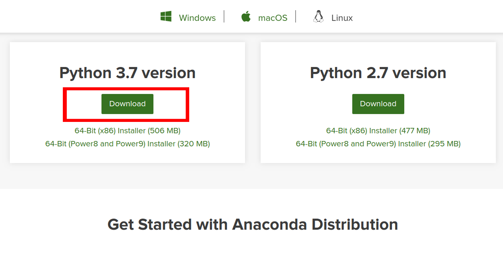

Haga click en el botón de descarga que aparece en la imagen anterior,
para que inicie la descarga de un archivo con nombre
*Anaconda3-XXXX.XX-Linux-x86\_64.sh*, donde **XXXX.XX** hace referencia
al año y al mes de la última actualización, por ejemplo,
*Anaconda3-2019.10-Linux-x86\_64.sh*.

una vez descargado el archivo, es necesario verificar si el archivo fue
correctamente descargado, para ello, abriremos una terminal y
escribiremos las siguientes lineas de código

    sha256sum ~/Descargas/Anaconda3-2019.10-Linux-x86_64.sh

obteniendo la siguiente salida

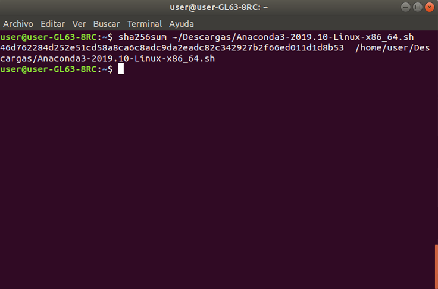

donde la carpeta Descargas es el lugar donde se realizan las descargas
por defecto. Si usted realiza las descargas en un directorio diferente,
será necesario reemplazar esta linea de código por el directorio donde
haya descargado el archivo.

Si la verificación del archivo es satisfactorio, se deberá correr la
siguiente linea de código, con el fin de ejecutar el script de Anaconda
bash

    bash ~/Descargas/Anaconda3-2019.10-Linux-x86_64.sh

una vez ejecutado el script anterior en la terminal se obtendrá la
siguiente salida

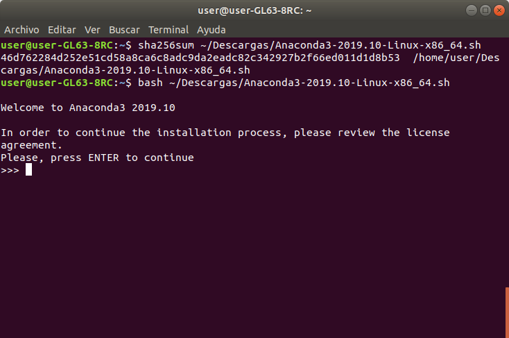

El recuadro le mostrará un mensaje de bienvenida para la instalación de
Anaconda. En donde, para comenzar la instalación será necesario aceptar
el acuerdo de licencia presionando la tecla *Enter*, lo cual hará que le
muestren el contrato de instalación

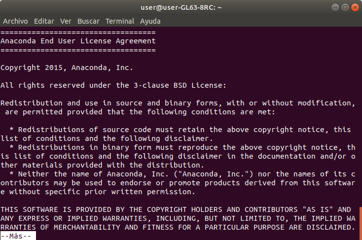

En este caso podrá leer el contrato si es de su interés, y para avanzar
será cuestión de presionar la barra espaciadora varias veces hasta
llegar al final del acuerdo, en donde se encontrará con la siguiente
pantalla

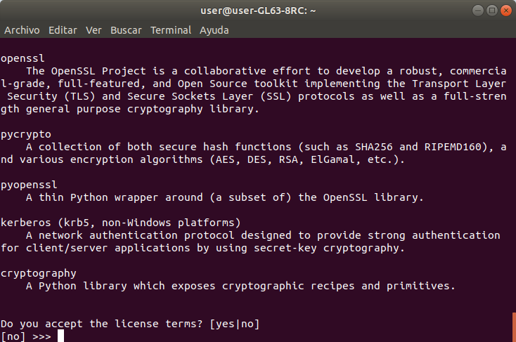

Escriba en la terminal *yes* seguido de la tecla *Enter* para comenzar
con el proceso de instalación. Después de aceptar los términos de la
licencia, aparecerá el siguiente mensaje

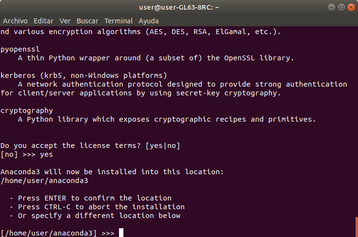

El cual te pedirá que ingreses el directorio donde deseas instalar
Anaconda Python. Te dan tres opciones, pero se recomienda dejar la
ubicación predeterminada, así que solo será cuestión de presionar la
tecla *Enter*. Esto provocará que comience al proceso de extracción de
la información, tal como se muestra en la siguiente ventana

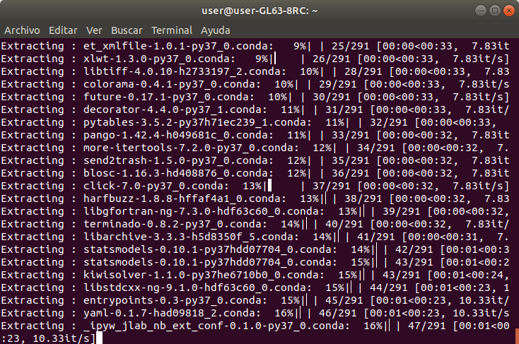

El proceso de instalación puede tardar varios minutos. Una vez
finalizado el proceso de instalación se tendrá la siguiente mensaje

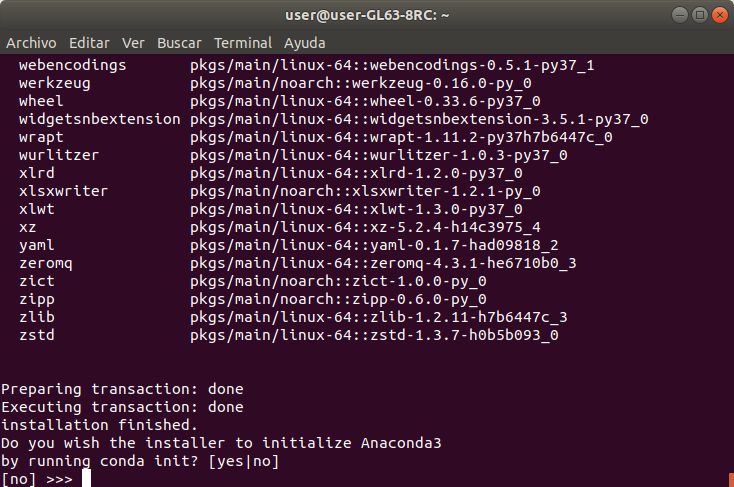

En éste se pregunta si se desea incluir la ubicación de instalación de
Anaconda Python en la ruta de tu Ubuntu 18.04 como se resaltó
anteriormente. Simplemente escribe *yes* y presiona la tecla *Enter*, y
con ésto habrá finalizado el proceso de instalación de Python.

Ahora con el fin de inicializar anaconda, desde la terminal corre las
siguientes lineas de código

    conda config --set auto_activate_base True
    source ~/.bashrc
    anaconda-navigator

y con ésto aparecerá la siguiente ventana, la cual permitirá acceder a
Spyder u a otros programas asociados a Anaconda.

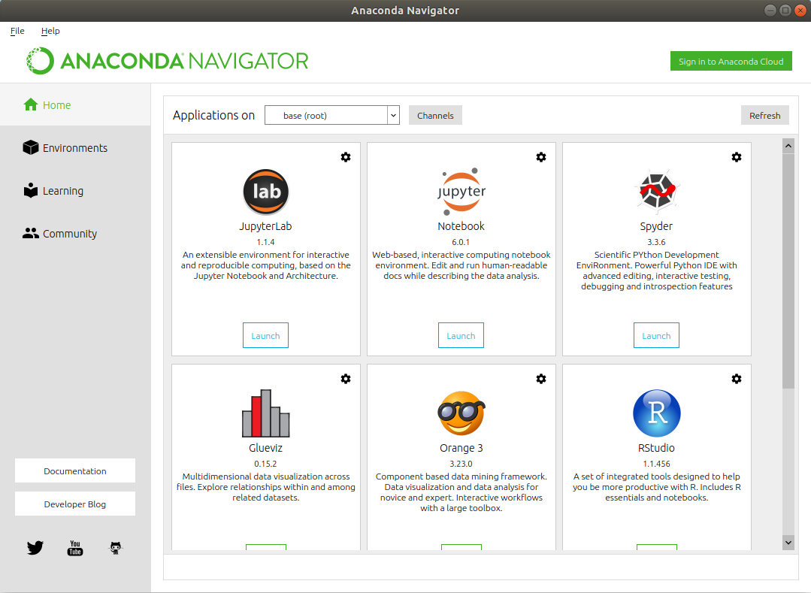

Una vez terminado de usar el programa, escribir en la terminal

    conda config --set auto_activate_base False
    source ~/.bashrc

para volver la terminal a la normalidad.

Instalación de IDE’s
--------------------

Existen diferentes IDE’s para trabajar en Python. La selección de una u
otra depende de los gustos o preferencias que tengan los usuarios ya que
algunas pueden ofrecer más ventajas respecto a otras, ya que en algunas,
se desarrollan algunos complementos que permiten vincular el código de
Python con otros entornos, tales como SQL, HTML, JavaScript, Django,
entre otros. Ya es labor de cada usuario explorar cuál de éstas es la
que se adapta mejor a sus necesidades.

A continuación se listan algunas de las IDE para trabajar en Python

### Spyder

Spyder es una de las IDE más usadas por usuarios de R, debido a la
similaridad que posee ésta con R Studio visualmente, la facilidad para
encontrar ayuda para paquetes o funciones, posee inspector de objetivos,
explorador de archivos y Explorador de variables.

Esta IDE viene instalada por defecto cuando se realiza la instalación de
Anaconda, pero se recomienda realizar su instalación como un programa
independiente, y para ello es necesario abrir una terminar e ingresar la
siguiente linea de código

    sudo apt-get install spyder3

tal como se muestra el la siguiente ventana

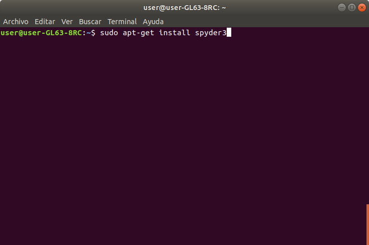

presiona *Enter* y comenzará la instalación. Es posible que la terminal
te pida ingresar la clave de usuario. De ser el caso, ingresa la
contraseña y comenzará la instalación del programa.

Con ello comenzará la descarga de Spyder, lo cual puede tardar unos
minutos. Una vez realizada toda la descarga aparecerá la siguiente linea
de código

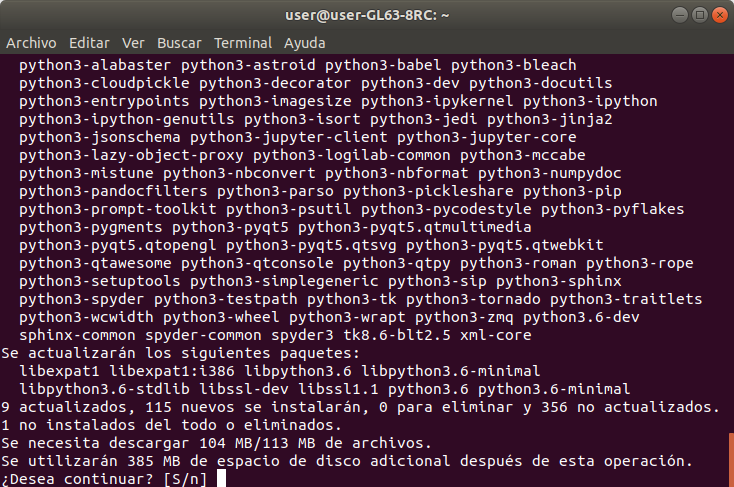

Escribe *S* y presiona *Enter* y ya será cuestión de esperar a que el
proceso de instalación concluya. Una vez concluido el proceso de
instalación de forma satisfactoria, podrás buscar el programa Spyder
dentro de tu lista de programas y abrirlo directamente sin necesitar de
inicializar anaconda desde la terminal.

### PyCharm

Pycharm es una IDE de Python para desarrolladores profesionales o para
aquellos que deseen aprender a codificar en Python. Existen dos
versiones para esta IDE, una versión profesional de pago o una versión
gratuita, Aunque no todas las características de la versión profesional
están incluidas en la versión gratuita.

Para descargar la IDE PyCharm, pueden dirigirse al siguiente link de
descarga
[www.anaconda.com/pycharm](www.anaconda.com/pycharm){:target="\_blank"}

### Komodo

Komodo IDE es un IDE multilingüe desarrollado por Active State, que
ofrece soporte para Python, PHP, Perl, Go, Ruby, desarrollo web (HTML,
CSS, JavaScript) y más. Active State también desarrolla Komodo Edit y
ActiveTcl, entre otras ofertas.

El producto viene equipado con inteligencia de código para facilitar el
autocompletado y la refactorización. También proporciona herramientas
para depurar y probar. La plataforma admite múltiples formatos de
control de versiones, incluidos Git, Mercurial y Subversión, entre
otros.

Para descargar la IDE Komodo, pueden dirigirse al siguiente link de
descarga
<https://www.activestate.com/products/komodo-ide/download-ide/>{:target="\_blank"}

### Atom

Atom es una IDE que incluye la mayoría de las funcionalidades que poseen
las otras IDE básicas, pero a diferencia de las mismas, posee entre sus
características el resaltado de sintaxis y la finalización automática.
Los desarrolladores de Atom están trabajando en la integración este
programa con otros lenguajes de programación tales como Rust o Go.

Atom está en mejora de su rendimiento y sus desarrolladores están
extremadamente atentos a las necesidades y opiniones de la comunidad, lo
cual hace que la experiencia del usuario sea más gratificante.

Para descargar la IDE Atom, pueden dirigirse al siguiente link de
descarga <https://atom.io>{:target="\_blank"}
