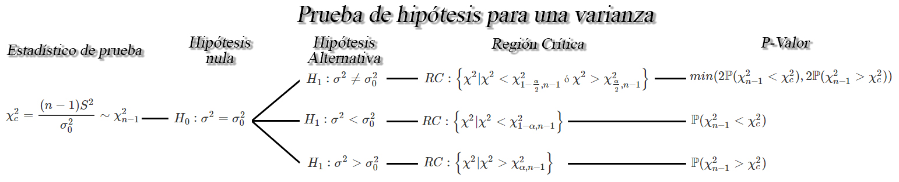

```{r knitr_init, echo=FALSE, cache=FALSE}
library(knitr)
## Global options
opts_chunk$set(echo=TRUE,
               cache=TRUE,
               prompt=FALSE,
               tidy=TRUE,
               comment=NA,
               message=FALSE,
               warning=FALSE,
               fig.path = paste0("../../EspecializacionSocioeconomica/images/", "SesionEsp03"),
               cache.path = "../../EspecializacionSocioeconomica/cache/",
               cache = FALSE)
```

## Inferencia estadística
La inferencia estadística es la obtención de conclusiones basadas en datos experimentales. Para entender la naturaleza de la inferencia estadística, se debe entender primero la diferencia entre "población" y "muestra".

**Población:** Consta del total de observaciones del suceso o proceso en que estamos interesados. En muchas ocasiones, no es posible obtener o replicar dicha información.

**Muestra:** Es un subconjunto de la población de interés, extraída con el objetivo de hacer inferencia sobre la población.

**Muestra aleatoria:** Es un subconjunto de la población seleccionado de forma independiente e idénticamente distribuidos (*iid* en adelante).

### Estadísticos
Son funciones de las variables aleatorias obtenidas a partir de muestras aleatorias, que tienen por objetivo estimar o hacer inferencia acerca de parámetros desconocidos de una población.

A continuación se definirán algunos estadísticos importantes que sirven para medir el centro y la dispersión de un conjunto de datos, acomodados por orden de magnitud.

### Estadísticos muestrales
Sea `$X_1, X_2, \ldots, Xn$` una muestra aleatoria *iid* de tamaño `$n$`, entonces se tendrán los siguientes estadísticos muestrales

#### Media muestral
Es el promedio aritmético del total de las `$n$` observaciones pertenecientes a una muestra aleatoria. Éste estadístico se define como
`\begin{align*}
  \bar{X}=\sum_{i=1}^n\frac{x_i}{n}=\frac{x_1+x_2+\ldots+x_n}{n}
\end{align*}`

En Excel, puede calcularse el valor promedio de un conjunto de observaciones mediante la función <tt>PROMEDIO()</tt>.

#### Varianza muestral

Es la distancia media **al cuadrado** del conjunto de observaciones pertenecientes a una muestra aleatoria, respecto a la media muestra.
`\begin{align*}
  S^2=\frac{1}{n-1}\sum_{i=1}^n{(x_i-\bar{X})^2}
\end{align*}` 

siendo el valor `$n-1$` conocido como la corrección de Bessel, el cuál se usa en lugar de la división sobre `$n$` con el fin de corregir el sesgo tendría el estimador.

En Excel puede calcularse la varianza de un conjunto de observaciones mediante la función <tt>VAR.S()</tt>.

#### Desviación estándar muestral
Es la raíz cuadrada de la distancia media **al cuadrado** del conjunto de observaciones pertenecientes a una muestra aleatoria, respeto a la media, es decir, indica qué tan dispersos se encuentra el conjunto de observaciones de una muestra aleatoria respecto a su valor promedio.
`\begin{align*}
  S=\sqrt{S^2}
\end{align*}`

En Excel puede calcularse la desviación estándar de un conjunto de observaciones mediante la función <tt>DESVEST.M()</tt>.

#### Proporción muestral
Representa la proporción de observaciones que cumplen cierta característica dentro de una muestra aleatoria, indica qué porcentaje de la muestra pertenece a la categoría de interés, y por tanto, puede ser calculada mediante la definición de frecuencia relativa, tal que
`\begin{align*}
  \hat{p}=\frac{x}{n}
\end{align*}`
siendo `$x$` el número de éxitos en la muestra, y `$n$` el total de observaciones de la muestra aleatoria.

## Estimación por intervalos
Podría ser que ni el estimador que cumpla las propiedades de insesgadez, eficiencia, consistencia y suficiencia, estimen con exactitud el parámetro poblacional de interés y por esta razón, puede ser preferible determinar un intervalo dentro del cual, se espera encontrar el valor verdadero del parámetro poblacional.

#### Definición
Sea `$\theta$` un parámetro poblacional desconocido, entonces basándose en la información de una muestra aleatoria de dicha población, el objetivo será encontrar dos variables aleatorias `$\hat{\Theta}_I$` y `$\hat{\Theta}_S$` tal que
`\begin{align*}
\mathbb{P}(\hat{\Theta}_I<\Theta<\hat{\Theta}_S) = 1-\alpha \quad \quad 0<\alpha<1
\end{align*}`
donde `$(1-\alpha)$` se conoce como nivel de confianza y `$\hat{\Theta}_I$` y `$\hat{\Theta}_S$` se denominan como límites de confianza inferior y superior, tal que `$\hat{\Theta}_I<\hat{\Theta}_S$`.

#### Nota
<ol type = "a">
<li>Usualmente se usan valores para $\alpha$ de $0.1, 0.05$ y $ 0.01$, es decir, niveles de confianza de $0.9, 0.95$ y $0.99$.</li>
<li>La longitud o amplitud del intervalo construido, medirá la <strong>precisión</strong> de la estimación realizada, por tanto, intervalos largos proporcionan estimaciones más imprecisas, mientras que intervalos cortos proporcionan estimaciones más precisas.</li>
<li>A medida que aumenta el nivel de confianza, la amplitud del intervalo se hace más grande.</li>
<li>A medida que aumenta el tamaño de muestra, la amplitud del intervalo se hace más pequeño.</li>
</ol>

#### Interpretación de nivel de confianza
El nivel de confianza, `$1-\alpha$`, mide la fiabilidad del intervalo de probabilidad, esto es, la probabilidad de que el verdadero valor del parámetro se encuentre dentro del intervalo construido. Es decir, que si se realiza el experimento muchas veces, se tendrá que en el `$100(1-\alpha)\%$` de los intervalos de confianza construidos en cada experimento, se encontrará contenido el verdadero valor del parámetro de interés.

### Intervalos de confianza para una media `$\mu$`
Sea `$X_1, X_2, \ldots, X_n$` una muestra aleatoria *iid* de tamaño `$n$` con media desconocida `$\mathbb{E}(X)=\mu$`, y varianza `$Var(X)=\sigma^2<\infty$`, entonces dependiendo de las condiciones, se tendrán los siguientes intervalos de confianza para la media `$\mu$`.


<button id="Show1" class="btn btn-secondary">Mostrar Ejercicio 1</button>
<button id="Hide1" class="btn btn-info">Ocultar Ejercicio 1</button>
<main id="botoncito1"> 
<h3 data-toc-skip> Ejercicio </h3> 
<p>Suponga que se realiza un estudio sobre los costos que han tenido proyectos de renovación de parques en la ciudad de Medellín, encontrando que los costos asociados a $20$ proyectos que se han llevado a cabo en le ciudad, en millones de pesos, fueron de</p>

<table class="table table-striped" style="width: auto !important; margin-left: auto; margin-right: auto;">
<tbody>
  <tr>
    <td>1780</td>
    <td>2933</td>
    <td>1220</td>
    <td>1278</td>
    <td>1170</td>
    <td>1032</td>
    <td>1245</td>
    <td>2070</td>
    <td>2040</td>
    <td>1289</td>
  </tr>
  <tr>
    <td>1531</td>
    <td>980</td>
    <td>1730</td>
    <td>1380</td>
    <td>2243</td>
    <td>1687</td>
    <td>1422</td>
    <td>1731</td>
    <td>1435</td>
    <td>2080</td>
  </tr>
</tbody>
</table>

<p>Si es posible supone que el costo de construir cualquier parque se distribuyen aproximadamente normal, calcule el límite superior del costo promedio de construir cualquier parque empleando un nivel de confianza del $98\%$. </p>

<h3 data-toc-skip> Solución </h3> 
<p> En este caso estamos interesados en construir un intervalo de confianza para el límite superior del costo promedio de construir cualquier parque, pero para realizar el cálculo debemos tener en cuenta la información que poseemos.<br>
<br>
De la información extraída del enunciado tenemos que la varianza poblacional no es conocida, ya que no la mencionan en el enunciado, tenemos que la población es normal, debido a que mencionan que puede suponerse que los salarios son aproximadamente normales, y los tamaños de muestra son pequeños, debido a que solo tenemos $20$ datos, estas características se ilustra en la siguiente imagen


de lo anterior encontramos que el intervalo de confianza de interés es de la forma
$$\begin{align*}
  \mu < \bar{X}+t_{\alpha, n-1}\frac{S}{\sqrt{n}}
\end{align*}$$

En donde observamos que requerimos de $5$ variables, la media muestral $\bar{X}=1613.8$, la desviación estándar muestral $S=480.1471$, el tamaño de muestra $n=20$, el nivel de confianza $1-\alpha=0.98$ y el valor crítico $t_{\alpha=0.02, n-1=19}=2.204701$ calculado a partir del nivel de confianza y el tamaño de la muestra. Al reemplazar en el intervalo tenemos que
$$\begin{align*}
  \mu &< 1613.8+2.204701\frac{480.1471}{\sqrt{20}}\\
  \mu &< 1613.8+236.7059\\
  \mu &< 1850.506
\end{align*}$$

Entonces podremos afirmar con un nivel de confianza del $98\%$, que el costo máximo promedio que puede constar un construir cualquier parque es de $1850.506$ millones de pesos, es decir, mil ochocientos cincuenta millones y quinientos seis mil pesos.
</p>
</main>

<button id="Show2" class="btn btn-secondary">Mostrar Ejercicio 2 </button>
<button id="Hide2" class="btn btn-info">Ocultar Ejercicio 2</button>
<main id="botoncito2"> 
<h3 data-toc-skip> Ejercicio </h3> 
<p>Suponga que Postobon desarrolla una nueva máquina de bebidas para servir de forma automática gaseosas en los cines, de tal forma que la cantidad servida, en mililitros, se distribuye Weibull con varianza de $5703.473_{ml}$.<br>
<br>
Si se decide tomar una muestra aleatoria de $8000$ vasos de gaseosa servidos por una de las nuevas máquinas de bebidas, y se obtiene una promedio de $345_{ml}$ con una varianza de $5240.35_{ml^2}$, construya un intervalo de confianza del $90\%$ para la verdadera cantidad promedio de refresco servida por la máquina.
</p>

<h3 data-toc-skip> Solución </h3> 
<p> En este caso estamos interesados en construir un intervalo de confianza bilateral del $90\% $ para la cantidad promedio de refresco servida por la nueva máquina de bebidas, pero para realizar el cálculo debemos evaluar previamente la información que poseemos.<br>
<br>
Del contexto del ejercicio tenemos que la población no es normal, debido a que se menciona que es Weibull, con varianza de $5703.473_{ml^2}$, por lo cual tendremos que la varianza poblacional es conocida. Adicionalmente, tenemos que el tamaño de muestra de vasos de gaseosa servidos por la máquina es de $8000$ vasos, por lo cual, basados en la información que poseemos tenemos las siguientes características


de lo anterior encontramos que el intervalo de confianza de interés es de la forma
$$\begin{align*}
  \bar{X}-Z_{\frac{\alpha}{2}}\frac{\sigma}{\sqrt{n}} < \mu < \bar{X}+Z_{\frac{\alpha}{2}}\frac{\sigma}{\sqrt{n}}
\end{align*}$$

En donde observamos que requerimos la media muestral $\bar{X}=345$, la desviación estándar poblacional $\sigma=75.52134$, el tamaño de muestra $n=8000$, el nivel de confianza $1-\alpha=0.90$ y el valor crítico $Z_{\alpha/2=0.05}=1.644854$ calculado a partir del nivel de confianza. Al reemplazar en el intervalo tenemos que
$$\begin{align*}
  &345\pm 1.644854 \frac{75.52134}{\sqrt{8000}} \\
  &345\pm 1.388839 \\
  &343.6112 < \mu < 346.3888
\end{align*}$$

Entonces podremos afirmar con un nivel de confianza del $90\%$, que la cantidad promedio de refresco servida de forma automática por la nueva máquina de bebidas se encontrará entre $343.6112_{ml}$ y $346.3888_{ml}$.
</p>
</main>

<button id="Show3" class="btn btn-secondary">Mostrar Ejercicio 3</button>
<button id="Hide3" class="btn btn-info">Ocultar Ejercicio 3</button>
<main id="botoncito3"> 
<h3 data-toc-skip> Ejercicio </h3> 
<p>Suponga que la marca de cigarrillo Malboro es auditada debido a que se afirma que sus registros están adulterados. Ante ésto, el presidente de la empresa asegura que sus registros son correctos y que el flujo de caja promedio mensual que registran es de $25$ mil millones. Para probar si dicha afirmación es posible, el auditor decide revisar el flujo de caja de la empresa de los últimos $48$ meses encontrando que el flujo de caja promedio que registra la empresa es de $21.389$ mil millones de pesos con una desviación estándar de $3.213$ mil millones de pesos. <br>
<br>
Si puede suponerse que el flujo de caja de la empresa Malboro se distribuye normalmente, calcule con un nivel de confianza del $95\%$ para el verdadero flujo de caja promedio que posee la empresa Malboro. Hay evidencia para pensar que la afirmación del presidente es acertada?.
</p>

<h3 data-toc-skip> Solución </h3> 
<p> En este ejercicio se está interesado en construir un intervalo de confianza bilateral del $95\%$ para el flujo de caja promedio que posee la empresa Malboro, y para realizar el cálculo debemos evaluar la información que poseemos.<br>
<br>
Entre la información suministrada tenemos que la distribución de probabilidad del flujo de caja de la empresa se distribuye normalmente, con varianza poblacional desconocida. Además, mencionan que en entre la información recolectada por el auditor encontró que de una muestra aleatoria de tamaño $48$ meses, se encontró que el flujo de caja promedio fue de $21.389$ mil millones de pesos con una desviación estándar de $3.213$ mil millones de pesos, y en consecuencia nos encontramos en la siguiente situación


de lo anterior encontramos que el intervalo de confianza de interés es de la forma
$$\begin{align*}
  \bar{X}-Z_{\alpha}\frac{S}{\sqrt{n}} < \mu
\end{align*}$$

En donde observamos que necesitamos la media muestral $\bar{X}=21.389$, la desviación estándar muestral $S=3.213$, el tamaño de muestra $n=48$, el nivel de confianza $1-\alpha=0.95$ y el valor crítico $Z_{\alpha=0.05}=1.644854$ calculado a partir del nivel de confianza. Al reemplazar en el intervalo de interés tenemos que
$$\begin{align*}
  21.389 &\pm 1.644854 \frac{3.213}{\sqrt{48}}\\
  21.389 &\pm 0.763 \\
  20.626 &< \mu < 22.152
\end{align*}$$

Lo cual significa que, con un nivel de confianza del $95\%$ podemos afirmar que la afirmación del presidente no es acertada, debido a que el verdadero flujo promedio que posee la empresa se encontrará entre $20.626$ mil millones de pesos y $22.152$ mil millones de pesos, lo cual se encuentra por debajo del valor afirmado.
</p>
</main>

### Intervalos de confianza para diferencia de medias `$\mu_1 - \mu_2$`
Sea `$X_{1,1}, X_{1,2}, \ldots, X_{1,n_1}$` y `$X_{2,1}, X_{2,2}, \ldots, X_{2,n_2}$` dos muestras aleatorias *iid* de tamaños `$n_1$`, y `$n_2$` con medias desconocidas `$\mathbb{E}(X_{1})=\mu_1$` y `$\mathbb{E}(X_{2})=\mu_2$`, y varianzas `$Var(X_{1})=\sigma_1^2<\infty$` y `$Var(X_{2})=\sigma^2_2<\infty$`, respectivamente, entonces dependiendo de las condiciones, se tendrán los siguientes intervalos de confianza para la diferencia de medias `$\mu_1 - \mu_2$`.


<button id="Show4" class="btn btn-secondary">Mostrar Ejercicio 1</button>
<button id="Hide4" class="btn btn-info">Ocultar Ejercicio 1</button>
<main id="botoncito4"> 
<h3 data-toc-skip> Ejercicio </h3> 
<p>Una empresa de electrodomésticos desea saber si los cursos de capacitación sirven para mejorar el nivel de ventas de sus trabajadoras y para ello decide enviar a $12$ de sus agentes de ventas a dicho curso. Una vez finalizado el curso, la empresa encuentra que estos agentes generan unas ventas promedio de de $43.5$ millones de pesos con una desviación estándar de $3.1$ millones de pesos.<br>
<br>
Con el fin de observar si el curso es o no efectivo, la empresa extrae una muestra aleatoria independiente de $15$ agentes que no asistieron a la capacitación y encontró que las ventas promedio generadas y su desviación estándar para estos agentes fue de $40.8$ y $2.3$ millones de pesos respectivamente. <br>
<br>
Si es posible suponer que las poblaciones se distribuyen normalmente con varianzas iguales a $5.6$ millones de pesos$^2$ para quienes se capacitaron y a $4.3$ millones de pesos$^2$ para quienes no se capacitaron, construya un intervalo de confianza del $90\%$ para la diferencia entre los promedios de ventas de los dos grupos. Es posible pensar que los cursos de capacitación mejoran el promedio de ventas sobre quienes no recibieron estos cursos?
</p>

<h3 data-toc-skip> Solución </h3> 
<p> En este ejercicio estamos interesados en construir un intervalo de confianza bilateral para la diferencia entre el promedio de ventas de las personas que asisten a un curso de capacitación, respecto a las personas que no asisten a dicho curso, y para ello debemos revisar la información presentada en el enunciado. <br>
<br>
En donde, se observa que nos dan el valor de las medias y desviaciones estándar muestrales para cada uno de los grupos, además nos menciona que las poblaciones se distribuyen normalmente con varianzas poblacionales conocidas e iguales a $5.6$ millones de pesos$^2$ para quienes se capacitaron y a $4.3$ millones de pesos$^2$ para quienes no se capacitaron, y por tanto estamos en la situación 


y por tanto como el intervalo es bilateral, el calculo que debemos hacer tendrá la forma
$$\begin{align*}
  (\bar{X}_C-\bar{X}_S) \pm Z_{\frac{\alpha}{2}}\sqrt{\frac{\sigma^2_C}{n_C}+\frac{\sigma^2_S}{n_S}}
\end{align*}$$

Para realizar el cálculo requerimos de las media muestrales $\bar{X}_C=43.5$ y $\bar{X}_S=40.8$, las varianzas poblacionales $\sigma^2_C=5.6$ y $\sigma^2_S=4.3$, los tamaños de muestrales $n_C=12$ y $n_S=15$, el nivel de confianza $1-\alpha=0.90$ y el valor crítico $Z_{\frac{\alpha}{2}=0.05}=1.644854$ calculado a partir del nivel de confianza. Al reemplazar en el intervalo tenemos que
$$\begin{align*}
  &(43.5-40.8) \pm 1.644854\sqrt{\frac{5.6}{12}+\frac{4.3}{15}} \\
  &2.7 \pm 1.644854(0.8679478) \\
  &2.7 \pm 1.427647 \\
  &1.272353 < \mu_C - \mu_S < 4.127647
\end{align*}$$

Entonces podremos afirmar con un nivel de confianza del $90\%$, de que la diferencia entre el promedio de ventas de las personas que asisten a un curso de capacitación, respecto a las personas que no asisten a dicho curso
de capacitación, se encuentra entre $1.272353$ y $4.127647$ millones de pesos. <br>
<br>
Ahora, para saber si la capacitación mejora o no las ventas hay que tener en cuenta la posición en la que se encuentre el intervalo para la diferencia entre $\mu_C - \mu_S$.


En donde se observa que la totalidad del intervalo se encuentra localizado en la sección que es mayor a $0$, lo cual indica que para todo el intervalo de confianza del $90\%$ el promedio de ventas del grupo que recibió un curso de
capacitación $\mu_C$ es mayor al promedio de quienes no recibieron capacitación $mu_S$, y por tanto, se podrá concluir que la capacitación si mejora el promedio de ventas y se recomendará a la empresa que envíe a capacitación al resto de empleados.
</p>
</main>

<button id="Show5" class="btn btn-secondary">Mostrar Ejercicio 2</button>
<button id="Hide5" class="btn btn-info">Ocultar Ejercicio 2</button>
<main id="botoncito5"> 
<h3 data-toc-skip> Ejercicio </h3> 
<p>La gobernación de Antioquia, desea construir un nuevo puente para comunicar el municipio de Itagüí con Envigado, y para ello tiene dos posibles ubicaciones en los cuales puede llevar a cabo dicho proyecto. Para decidir en cual de las dos ubicaciones llevar a cabo el proyecto decide tomar muestras aleatorias de cada ubicación y mirar en cual de los dos hay mayor aflucencia de vehículos.<br>
<br>
De la ubicación $A$ se decide tomar una muestra aleatoria de $22$ días y de la ubicación $B$ de $28$ días encontrando respectivamente que el número promedio de vehículos para cada ubicación fue de $2359$ y $2147$ vehículos, con una desviación estándar de $143$ y $301$ vehículos. <br>
<br>
Si puede asumirse que el número de vehículos en las dos zonas se distribuye aproximadamente normal con varianzas iguales, construya un intervalo de confianza del $90\%$ para la diferencia promedio del número de vehículo que transita por cada ubicación. Es posible pensar que hay diferencias significativas entre el número de vehículos que transita por cada ubicación? En cuál de las dos zonas aconsejaría a la gobernación llevar a cabo la construcción del puente?.
</p>

<h3 data-toc-skip> Solución </h3> 
<p> En este enunciado estamos interesados en construir un intervalo de confianza del $90\%$ para la diferencia promedio del número de vehículo que transita por cada ubicación. En donde, el intervalo de confianza será bilateral debido a que no especifican que se debe calcular el límite superior o inferior solamente. Para saber cuál es el intervalo de interés, debemos revisar la información presentada en el enunciado. <br>
<br>
En el enunciado se aprecia que nos dan las medias y desviaciones estándar muestrales para cada una de las ubicaciones, obtenidos a partir de muestras de tamaños $22$ y $28$, respectivamente, tal que, los vehículos fueron $\bar{X}_A=2359$ y $\bar{X}_B=2147$, mientras que las desviaciones estándar fueron $S_A=143$ y $S_B=301$. Además, se menciona que  el número de vehículos en las dos zonas se distribuye normalmente con varianzas desconocidas pero iguales, y por tanto estaremos en la siguiente situación


y por tanto como el intervalo es bilateral, el calculo que debemos hacer tendrá la forma
$$\begin{align*}
  (\bar{X}_A-\bar{X}_B) \pm t_{\frac{\alpha}{2}, n_A+n_B-2}S_p\sqrt{\frac{1}{n_A}+\frac{1}{n_B}}
\end{align*}$$

En donde observamos que entre otros valores, requerimos calcular el valor de la desviación estándar conjunta $Sp$, la cual está dada por

$$\begin{align*}
Sp^2 &= \frac{(n_A-1)S^2_A + (n_B-1)S^2_B}{n_A+n_B-2} \\
     &= \frac{(22-1)143^2 + (28-1)301^2}{22 + 28 - 2} \\
     &= 59909.5
\end{align*}$$
y por tanto
$$\begin{align*}
Sp &= \sqrt{Sp^2} \\
   &= \sqrt{59909.5} \\
   &= 244.7642
\end{align*}$$

Ahora, los valores adicionales que se requieren para realizar el cálculo del intervalo de confianza serán, las medias muestrales $\bar{X}_A=2359$ y $\bar{X}_B=2147$, y los tamaños muestrales  $n_A=22$ y $n_B=28$, el nivel de confianza $1-\alpha=0.90$ y el valor crítico $t_{\frac{\alpha}{2}=0.05, n_A+n_B-2 = 48}=1.677224$. Al reemplazar estos valores en el intervalo de interés obtenemos que 
$$\begin{align*}
  &(2359-2147) \pm 1.677224(244.7642)\sqrt{\frac{1}{22}+\frac{1}{28}} \\
  &212 \pm 1.677224(244.7642)(0.2849014)\\
  &212 \pm 116.959 \\
  &95.041 < \mu_A - \mu_B < 328.959
\end{align*}$$

Por tanto, con un nivel de confianza del $90\%$ se tendrá que la diferencia promedio del número de vehículo que transita por cada ubicación se encontrará entre $95.041$ y $328.959$ vehículos al día. <br>
<br>
Ahora, para saber si existe diferencias significativas entre el número de vehículos que transitan por cada ubicación debemos tener en cuenta la posición en la que se encuentre el intervalo para la diferencia entre $\mu_A - \mu_B$.


En donde se observa que el intervalo encontrado se encuentra por encima de $0$, el cual simboliza que el número promedio de vehículos que transitan por la ubicación $A$ es superior que el número promedio de vehículos que transitan por la ubicación $B$, tal que 
$$\begin{align*}
  \mu_A > \mu_B \quad =>\quad \mu_A - \mu_B > 0
\end{align*}$$

y por tanto, con un nivel de confianza del $90\%$ es posible afirmar que existen diferencias significativas entre el número de vehículos que transitan por las dos ubicaciones, y por tanto se debería aconsejar a la gobernación de Antioquia que construya el puente en la ubicación $A$ debido a que es por esta ubicación por donde hay mayor afluencias de vehículos.
</p>
</main>

<button id="Show6" class="btn btn-secondary">Mostrar Ejercicio 3</button>
<button id="Hide6" class="btn btn-info">Ocultar Ejercicio 3</button>
<main id="botoncito6"> 
<h3 data-toc-skip> Ejercicio </h3> 
<p>Suponga que la Universidad de Antioquia adelanta un estudio sobre el salario de sus egresados y desea comparar si es cierta la creencia que las mujeres ganan en promedio menos dinero que los hombres. <br>
<br>
Para comprobar si las creencias son ciertas, un grupo de investigación de la Universidad toma una muestra representativa de $250$ mujeres y $270$ hombres egresados de la Universidad y se les pregunta sobre cuál es el salario que ganan actualmente, obteniendo en su investigación que las mujeres ganan en promedio $2.3$ millones de pesos con una desviación estándar de $0.7$ millones de pesos, mientras que los hombres ganan en promedio $2.6$ millones de pesos con una desviación estándar de $1.2$ millones de pesos.<br>
<br>
Si el grupo de investigación encuentra que los salarios no se distribuyen normalmente, calcule el límite superior para la diferencia promedio del salario de sus egresados hombres y egresados mujeres. Emplee un nivel de confianza de $80\%$.</p>

<h3 data-toc-skip> Solución </h3> 
<p> En este enunciado estamos interesados en calcular el límite superior para la diferencia promedio entre el salario de hombres y mujeres que egresaron de la Universidad, la cual está dada por $\mu_H - \mu_M$, empleando para ello un nivel de confianza del $80\%$. Ahora, para identificar el intervalo de interés, debemos revisar la información presentada por el grupo de investigación de la Universidad. <br>
<br>
El cual a partir de una muestra de $250$ mujeres y $270$ hombres, encontró unos salarios promedios iguales a $2.3$ y $2.6$, con desviaciones estándar de $0.7$ y $1.2$, respectivamente. Además encuentra que los salarios no se distribuyen normalmente, y al no mencionar cuales son las varianzas poblacionales, se asume que éstas no son conocidas, y por tanto estaremos en la siguiente situación dado que los tamaños muestrales son mayores a $30$.


y por tanto al ser un intervalo unilateral derecho (límite superior), el calculo que debemos hacer tendrá la forma
$$\begin{align*}
  \mu_H - \mu_M < (\bar{X}_H-\bar{X}_M) + Z_{\alpha}\sqrt{\frac{S^2_H}{n_H}+\frac{S^2_M}{n_M}}
\end{align*}$$

en donde se observa que al ser unilateral derecho, el intervalo solo cuenta con la suma de la resta de medias muestrales y el término de error, además de que, el valor crítico solo será para el valor $\alpha$, y no $\alpha/2$ como es el caso de los intervalos bilaterales. <br>
<br>
Ahora, al reemplazar los valores encontrados por el grupo de investigación $n_H=270$, $\bar{X}_H=2.6$, $S_H=1.2$ para los hombres, $n_M=250$, $\bar{X}_M=2.3$, $S_M=0.7$ para las mujeres, el nivel de confianza $1-\alpha = 0.80$ y el valor crítico $Z_{\alpha=0.2}=0.8416212$, tendremos que 
$$\begin{align*}
  &\mu_H - \mu_M < (2.6-2.3) + 0.8416212\sqrt{\frac{1.2^2}{270}+\frac{0.7^2}{250}} \\
  &\mu_H - \mu_M < 0.3 + 0.8416212(0.08540101)\\
  &\mu_H - \mu_M < 0.3 + 0.0718753 \\
  &\mu_H - \mu_M < 0.3718753
\end{align*}$$

Por tanto, se tendrá que el valor máximo que se espera tener parar la diferencia entre los salarios promedio de hombres y mujeres es de $0.3718753$ millones de pesos, lo anterior con un nivel de confianza del $80\%$.
</p>
</main>

<button id="Show7" class="btn btn-secondary">Mostrar Ejercicio 4</button>
<button id="Hide7" class="btn btn-info">Ocultar Ejercicio 4</button>
<main id="botoncito7"> 
<h3 data-toc-skip> Ejercicio </h3> 
<p>Se realiza un estudio con el fin de comparar el rendimiento de combustible en kilómetros por galón para dos tipos de motores $A$ y $B$. Suponga que se decide realizar un total de $47$ experimentos con el motor $A$ y $56$ experimentos con el motor $B$, encontrando para cada caso, un rendimiento promedio de gasolina de $44$ y $48$ kilómetros, respectivamente, con desviaciones estándar de $8.3$ y $6.6$, respectivamente. <br>
<br>
Basados en la información anterior, calcule el límite inferior para la diferencia promedio entre los rendimiento de combustible en kilómetro por galón de gasolina para los motores $B$ y $A$, empleando un nivel de confianza del $88\%$. Suponga que los rendimientos de los combustibles no poseen una distribución normal, pero se tiene que las varianzas son conocidas e iguales a $38.44$ y $57.76$ para los motores $A$ y $B$ respectivamente.
</p>

<h3 data-toc-skip> Solución </h3> 
<p> En este caso estamos interesados en calcular el límite inferior de un intervalo de confianza del $88\%$ para la diferencia promedio entre el rendimiento de combustible en kilómetros por galón de gasolina que ofrecen dos tipos de motores $B$ y $A$, tal que , $\mu_B - \mu_A$, y para calcular este límite inferior debemos revisar la información que poseemos.<br>
<br>
Del enunciado se menciona que los rendimientos de combustible no poseen una distribución normal, pero se menciona que las varianzas poblacionales son conocidas e iguales a $\sigma^2_A=38.44$ y $\sigma^2_B=57.56$ para las maderas $A$ y $B$. En consecuencia, tendremos que el intervalo de interés será el siguiente


y como estamos interesados en el límite inferior, el calculo que debemos hacer tendrá la forma
$$\begin{align*}
  (\bar{X}_B-\bar{X}_A) - Z_{\alpha}\sqrt{\frac{\sigma^2_B}{n_B}+\frac{\sigma^2_A}{n_A}}
\end{align*}$$

Para realizar el cálculo del intervalo, se aprecia que requerimos de los tamaños muestrales $n_A=47$ y $n_B=56$, las medias muestrales $\bar{X}_A=44$, y $\bar{X}_B=48$, las varianzas poblacionales $\sigma^2_A=38.44$ y $\sigma^2_B=57.56$, el nivel de confianza $1-\alpha=0.88$ y el valor crítico $Z_{\alpha=0.12}=1.174987$. Al reemplazar estos valores en el intervalo de interés obtenemos que 
$$\begin{align*}
  & (48-44) - 1.174987\sqrt{\frac{57.56}{56}+\frac{38.44}{47}} \\
  & 4 - 1.174987(1.358576)\\
  & 4 - 1.596309 \\
  & 2.403691 < \mu_B - \mu_A 
\end{align*}$$

y por tanto, se tendrá un con un nivel de confianza del $88\%$, que el límite inferior para la diferencia promedio entre los rendimiento de combustible en kilómetro por galón de gasolina para los motores $B$ y $A$ será de $2.403691$ kilómetros.
</p>
</main>

<button id="Show8" class="btn btn-secondary">Mostrar Ejercicio 5</button>
<button id="Hide8" class="btn btn-info">Ocultar Ejercicio 5</button>
<main id="botoncito8"> 
<h3 data-toc-skip> Ejercicio </h3> 
<p>Suponga que se contrata a un grupo de investigación de la Universidad de Antioquia para que realice un análisis de tensión sobre la unión pegada con una resina experimental a dos clases diferentes de madera. Para realizar el estudio, el grupo de investigación toma una muestra aleatoria de $18$ uniones pegadas con la resina especial a la madera $A$ y encontró que la tensión promedio de corte y desviación estándar fueron de $1130_{psi}$ y $420_{psi}$, respectivamente. Por su parte, toman una muestra aleatoria de $12$ uniones pegadas con la resina especial a la madera $B$, encontrando que la tensión promedio de corte y desviación estándar fueron de $1010_{psi}$ y $380_{psi}$.<br>
<br>
Si se asume que la tensión sobre la unión pegada con la resina experimental en cada clase de madera se distribuye aproximadamente normal con varianzas diferentes. Construya un intervalo de confianza del $92\%$ para la diferencia de tensión promedio de corte para las dos marcas de madera.
</p>

<h3 data-toc-skip> Solución </h3> 
<p> En este enunciado estamos interesados en construir un intervalo de confianza del $92\%$ para la diferencia entre los promedio a la tensión sobre la unión pegada con una resina experimental para dos clases de madera $A$ y $B$. En este caso, el intervalo de confianza que se empleará será bilateral dado que no nos mencionan que se realice el cálculo del límite superior o inferior para la diferencia. Para saber cuál es el intervalo de interés, debemos revisar la información calculada por el grupo de investigación. <br>
<br>
De los datos calculados por el grupo de investigación, encontramos que se realizó una selección de $18$ y $12$ uniones para las maderas $A$ y $B$ respectivamente, para las cuales se encontró de forma respectiva unas medias muestrales de $1130_{psi}$ y $1010_{psi}$ junto a unas desviaciones estándar de $420_{psi}$ y $380_{psi}$. Además, se menciona de que las dos poblaciones se distribuyen de forma aproximadamente normal con varianzas diferentes y en consecuencia se tendrá el siguiente caso


y por tanto como el intervalo es bilateral, el calculo que debemos hacer tendrá la forma
$$\begin{align*}
  (\bar{X}_A-\bar{X}_B) \pm t_{\frac{\alpha}{2}, \nu}\sqrt{\frac{S^2_A}{n_A}+\frac{S^2_B}{n_B}}
\end{align*}$$

En donde se observa que entre otros valores, requerimos calcular el valor de los grados de libertad $\nu$, tal que

$$\begin{align*}
\nu &= \frac{\left(\frac{S^2_A}{n_A} + \frac{S^2_B}{n_B}\right)^2}{\frac{(S^2_A/n_A)^2}{n_A-1} + \frac{(S^2_B/n_B)^2}{n_B-1}} \\
    &= \frac{\left(\frac{420^2}{12} + \frac{380^2}{18}\right)^2}{\frac{(480^2/12)^2}{12-1} + \frac{(380^2/18)^2}{18-1}} \\
    &= \frac{476694444}{18813149} \\
    &= 25.33837
\end{align*}$$

Al calcular el valor techo de $\nu$ tendremos que
$$\begin{align*}
\nu               &= 25.33837 \\
\lceil \nu \rceil &= \lceil25.33837\rceil \\
\lceil \nu \rceil &= 26
\end{align*}$$

y por tanto. se tendrá que los grados de libertad asociados a la distribución $t$ serán iguales a $\nu= 26$. Ahora, los valores adicionales que se requieren para realizar el cálculo del intervalo de interés serán los tamaños muestrales  $n_A=12$ y $n_B=18$, las medias muestrales $\bar{X}_A=1130$, y $\bar{X}_B=1010$, las desviaciones estándar muestrales $S_A=420$ y $S_B=380$, el nivel de confianza $1-\alpha=0.92$ y el valor crítico $t_{\frac{\alpha}{2}=0.04, \nu = 26}=1.821863$. Al reemplazar estos valores en el intervalo de interés obtenemos que 
$$\begin{align*}
  & (1130-1010) \pm 1.821863\sqrt{\frac{420^2}{12}+\frac{380^2}{18}} \\
  & 120 \pm 1.821863(150.7389)\\
  & 120 \pm 274.6256 \\
  & -154.6256 < \mu_A - \mu_B < 394.6256
\end{align*}$$

De lo anterior, se concluye que con una confianza del $92\%$, la diferencia promedio entre la tensión promedio de corte entre las maderas $A$ y $B$ se encontrará entre $-154.6256_{psi}$ y $394.6256_{psi}$. <br>
<br>
Ahora, como el intervalo es bilateral, podemos verificar si existen o no diferencias significativas entre la tensión promedio de corte de dos tipos de madera, y para ello debemos verificar la posición en la que se encuentra el intervalo de confianza para la diferencia entre $\mu_A - \mu_B$.


En donde se observa que el intervalo calculado contiene el valor de $0$, el cual representa la igualdad entre la tensión promedio de corte de dos tipos de madera, tal que 
$$\begin{align*}
  \mu_A = \mu_B \quad =>\quad \mu_A - \mu_B = 0
\end{align*}$$

y por tanto, con un nivel de confianza del $92\%$ no será posible afirmar que existen diferencias significativas entre la tensión promedio de corte de dos tipos de madera.
</p>
</main>

### Intervalos de confianza para una proporción `$p$` 
Sea `$X_1,X_2, \ldots, X_n$` una muestra aleatoria *iid* de tamaño `$n$`, tal que `$X\sim b(n,p)$` entonces si `$n$` es suficientemente grande tal que `$n\geq30$`, y la proporción desconocida `$p$` no se encuentre cercana a `$0$` o `$1$`, tal que `$np>5$` y `$n(1-p)>5$`, entonces un intervalo de confianza para la proporción `$p$` es de la forma


<button id="Show9" class="btn btn-secondary">Mostrar Ejercicio</button>
<button id="Hide9" class="btn btn-info">Ocultar Ejercicio</button>
<main id="botoncito9"> 
<h3 data-toc-skip> Ejercicio </h3> 
<p>Suponga que se realiza un estudio sobre los costos que han tenido proyectos de renovación de parques en la ciudad de Medellín, encontrando que los costos asociados a $20$ proyectos que se han llevado a cabo en la ciudad, en millones de pesos, fueron de</p>

<table class="table table-striped" style="width: auto !important; margin-left: auto; margin-right: auto;">
<tbody>
  <tr>
    <td>1780</td>
    <td>2933</td>
    <td>1220</td>
    <td>1278</td>
    <td>1170</td>
    <td>1032</td>
    <td>1245</td>
    <td>2070</td>
    <td>2040</td>
    <td>1289</td>
  </tr>
  <tr>
    <td>1531</td>
    <td>980</td>
    <td>1730</td>
    <td>1380</td>
    <td>2243</td>
    <td>1687</td>
    <td>1422</td>
    <td>1731</td>
    <td>1435</td>
    <td>2080</td>
  </tr>
</tbody>
</table>

<p>Basados en la información anterior, construya un intervalo de confianza del $97\%$ para la verdadera proporción de proyectos que poseen costos superiores a $1900$ millones de pesos.</p>

<h3 data-toc-skip> Solución </h3> 
<p> En este caso estamos interesados en el cálculo de un intervalo de confianza del $97\%$ para la proporción de proyectos que poseen costos superiores a $1900$ millones de pesos. <br>
<br>
En donde, al no mencionar un límite de confianza en particular se deberá realizar el cálculo de un intervalo bilateral, el cual para el caso de una proporción tiene la estructura


mostrando que el intervalo bilateral para el caso de una proporción está dado por
$$\begin{align*}
  \hat{p} \pm Z_{\frac{\alpha}{2}}\sqrt{\frac{\hat{p}(1-\hat{p})}{n}}
\end{align*}$$

En donde se observa que requerimos de la proporción muestral para realizar el cálculo, y por tanto se deberá proceder a realizar su cálculo, localizando en cuales valores muestrales se localiza un éxito, el cual está dado por aquellos costos que posean un valor superior a $1900$ millones de pesos, y para ello, denotaremos como $1$ aquellas observaciones que sean superiores a $1900$ millones de pesos, y $0$ aquellas observaciones que no cumplan la condición, tal que
$$\begin{align*}
 \underset{0}{1780} \quad \underset{1}{2933} \quad \underset{0}{1220} \quad \underset{0}{1278} \quad \underset{0}{1170} \quad \underset{0}{1032} \quad \underset{0}{1245} \quad \underset{1}{2070} \quad \underset{1}{2040} \quad \underset{0}{1289} \\
\underset{0}{1531} \quad \underset{0}{980} \quad \underset{0}{1730} \quad \underset{0}{1380} \quad \underset{1}{2243} \quad \underset{0}{1687} \quad \underset{0}{1422} \quad \underset{0}{1731} \quad \underset{0}{1435} \quad \underset{1}{2080}
\end{align*}$$
Al contar el número de éxitos, observamos que tenemos un total de $x=5$ éxitos en un total de $n=20$ muestras, y por tanto, podemos aplicar la fórmula de frecuencia relativa para calcular la proporción muestral de egresados que poseen salarios superiores a $1900$ millones, tal que
$$\begin{align*}
  \hat{p} &= \frac{\text{# éxitos}}{\text{Total ensayos}} \\
          &= \frac{x}{n} \\
          &= \frac{5}{20} \\
          &= 0.25
\end{align*}$$

Ahora, al emplear este valor junto con el nivel de confianza $1-\alpha=0.97$ y el valor crítico $Z_{\frac{\alpha}{2}=0.015}=2.17009$, para calcular el intervalo de confianza de interés obtendremos que 
$$\begin{align*}
  & 0.25 \pm 2.17009\sqrt{\frac{0.25(1-0.25)}{20}} \\
  & 0.25 \pm 2.17009(0.09682458)\\
  & 0.25 \pm 0.2101181 \\
  & 0.0398819 < p < 0.4601181
\end{align*}$$

Por tanto, con una confianza del $97\%$ se concluye que la verdadera proporción de proyectos que poseen costos por encima de $1900$ millones de pesos, se encontrará entre $3.99\%$ y $46.01\%$.
</p>
</main>

### Intervalos de confianza para diferencia de proporciones `$p_1-p_2$` 
Sea `$X_{1,1}, X_{1,2}, \ldots, X_{1,n_1}$` y `$X_{2,1}, X_{2,2}, \ldots, X_{2,n_2}$` dos muestras aleatorias *iid* de tamaños `$n_1$`, y `$n_2$`, tal que `$X_{1}\sim b(n,p)$` y `$X_{1}\sim b(n,p)$`. Entonces si `$n_1$` y `$n_2$` son suficientemente grandes tal que `$n_1, n_2 \geq30$`, y las proporciones desconocidas `$p_1$` y `$p_2$` no se encuentran cercanas a `$0$` o `$1$`, tal que `$n_1p_1>5$`, `$n_2p_2>5$`, `$n_1(1-p_1)>5$` y `$n_2(1-p_2)>5$`, entonces un intervalo de confianza para la diferencia de proporciones `$p_1-p_2$` es de la forma


<button id="Show10" class="btn btn-secondary">Mostrar Ejercicio</button>
<button id="Hide10" class="btn btn-info">Ocultar Ejercicio</button>
<main id="botoncito10"> 
<h3 data-toc-skip> Ejercicio </h3> 
<p>Una empresa de computación decide realizar un cambio en el proceso de fabricación de uno de los componentes que requiere en sus portátiles, y está en interesado en saber si dicho cambio ofrece una mejora significativa en la rendimiento que sus equipos ofrecen.<br>
<br>
Para determinar si el cambio en el proceso de fabricación mejora el rendimiento que sus equipos ofrecen, deciden tomar una muestra de equipos antes y después de la implementación del nuevo proceso de fabricación y se evalúa la velocidad de procesamiento para la ejecución de un programa determinado. Suponga que se encuentra que $120$ de $500$ computadores fabricados con el método actual ofrece un rendimiento superior al promedio, mientras que, $220$ de $700$ computadores fabricados con el nuevo método ofrece un rendimiento superior al promedio.<br>
<br>
Basados en la información obtenida, calcule un intervalo de confianza del $99\%$ para la verdadera diferencia entre las proporciones de equipos que ofrecen un rendimiento superior al promedio entre el proceso de fabricación actual y el nuevo. Es posible pensar que el nuevo proceso si mejora el rendimiento promedio de los equipos de cómputo?
</p>
<h3 data-toc-skip> Solución </h3> 
<p> En este enunciado estamos interesados en construir un intervalo de confianza del $99\%$ para la diferencia entre la proporción de equipos que son fabricados mediante un proceso de fabricación nuevo y aquellos que son fabricados con un proceso de fabricación actual, en donde, se debe construir un intervalo de confianza bilateral debido a que no nos preguntan por un límite en específico.  <br>
<br>
Para llevar a cabo el cálculo debemos revisar la información que poseemos. En primer lugar observamos que nos hablan de los tamaños de muestra para cada una de las poblaciones en donde el tamaño de muestra para los equipos fabricados mediante el proceso de fabricación nuevo fue de $n_N= 500$, mientras que, el tamaño de muestra para lo equipos fabricados mediante el proceso de fabricación actual es de $n_A=700$.<br>
<br>
Adicionalmente, se presenta para cada valor de la muestra, el número de equipos que ofrecieron una velocidad de procesamiento superior al promedio, siendo dichos valores para los equipos fabricados con el proceso nuevo y actual $x_N=120$ y $x_A=220$, respectivamente. Con estos valores es posible realizar el cálculo de las proporciones muestrales para las dos poblaciones, tal que para el caso de los equipos que fueron construidos con el nuevo procedimiento tenemos que 
$$\begin{align*}
\hat{p}_N &= \frac{\text{# de equipos nuevos con rendimiento superior}}{\text{Total equipos nuevos evaluados}} \\
          &= \frac{x_N}{n_N} \\
          &= \frac{220}{700} \\
          &= 0.3142857
\end{align*}$$
mientras que, para los equipos que fueron construidos con el procedimiento actual tenemos que 
$$\begin{align*}
\hat{p}_A &= \frac{\text{# de equipos actuales con rendimiento superior}}{\text{Total equipos actuales evaluados}} \\
          &= \frac{x_A}{n_A} \\
          &= \frac{120}{500} \\
          &= 0.24
\end{align*}$$
Ahora, dado que el intervalo que nos piden es bilateral, y tenemos que los tamaños muestrales para cada población son suficientemente grandes, tendremos que el intervalo de interés es de la forma


y por tanto como el intervalo de interés es de la forma, el calculo que debemos hacer tendrá la forma
$$\begin{align*}
  (\hat{p}_N-\hat{p}_A) \pm Z_{\alpha}\sqrt{\frac{\hat{p}_N(1-\hat{p}_N)}{n_N}+\frac{\hat{p}_A(1-\hat{p}_A)}{n_A}}
\end{align*}$$

En donde se observa que entre los valores ya calculados para las proporciones muestrales, se requiere del nivel de confianza $1-\alpha=0.99$ y el valor crítico $Z_{\alpha=0.01}=2.326348$. Al reemplazar estos valores en el intervalo de interés obtenemos que 
$$\begin{align*}
  & (0.3142857-0.24) \pm 2.326348\sqrt{\frac{0.3142857(1-0.3142857)}{700}+\frac{0.24(1-0.24)}{500}} \\
  &0.0742857 \pm 2.326348 (0.02593592) \\
  &0.0742857 \pm 0.06033598 \\
  &0.01394972 < p_N - p_A < 0.1346217
\end{align*}$$

Dado el resultado anterior, se concluye con una confianza del del $99\%$ que la diferencia entre la proporción de equipos que son fabricados mediante un proceso de fabricación nuevo y aquellos que son fabricados con un proceso de fabricación actual se encontrará entre $1.39\%$ y $13.46\%$.<br>
<br>
Ahora, como el intervalo es bilateral, podemos verificar si existen o no diferencias significativas entre la proporción de equipos que son fabricados mediante el nuevo proceso de fabricación y aquellos que son fabricados mediante el proceso actual, y para ello debemos verificar la posición en la que se encuentra el intervalo de confianza para la diferencia entre $p_N - p_A$.


En donde se observa que el intervalo calculado se encuentra sobre el valor de $0$, el cual representa la igualdad entre las dos proporciones, tal que 
$$\begin{align*}
  p_N = p_A \quad =>\quad p_N - p_A = 0
\end{align*}$$

y por tanto, podremos afirmar con un nivel de confianza del $99\%$ que la proporción de equipos que ofrece un rendimiento superior al promedio y son fabricados mediante el nuevo proceso, es superior a la proporción de aquellos fabricados mediante el proceso actual.
</p>
</main>

### Intervalos de confianza para una varianza `$\sigma^2$`
Sea `$X_{1}, X_{2}, \ldots, X_{n}$` una muestra aleatoria de una problación normal de tamaño `$n$` conmedias `$\mathbb{E}(X)=\mu$` y varianza desconocidas `$Var(X)=\sigma_1^2<\infty$`, entonces un intervalo de confianza del `$100(1-\alpha)\%$` para la varianza desconocida `$\sigma^2$` estará dada por


<button id="Show11" class="btn btn-secondary">Mostrar Ejercicio</button>
<button id="Hide11" class="btn btn-info">Ocultar Ejercicio</button>
<main id="botoncito11"> 
<h3 data-toc-skip> Ejercicio </h3> 
<p>Suponga que se realiza un estudio sobre los costos que han tenido proyectos de renovación de parques en la ciudad de Medellín, encontrando que los costos asociados a $20$ proyectos que se han a cabo en le ciudad, en millones de pesos, fueron de</p>

<table class="table table-striped" style="width: auto !important; margin-left: auto; margin-right: auto;">
<tbody>
  <tr>
    <td>1780</td>
    <td>2933</td>
    <td>1220</td>
    <td>1278</td>
    <td>1170</td>
    <td>1032</td>
    <td>1245</td>
    <td>2070</td>
    <td>2040</td>
    <td>1289</td>
  </tr>
  <tr>
    <td>1531</td>
    <td>980</td>
    <td>1730</td>
    <td>1380</td>
    <td>2243</td>
    <td>1687</td>
    <td>1422</td>
    <td>1731</td>
    <td>1435</td>
    <td>2080</td>
  </tr>
</tbody>
</table>

<p>Si es posible supone que el costo de construir cualquier parque se distribuyen aproximadamente normal, calcule un intervalo de confianza para la variabilidad de los costos de construir cualquier parque, empleando un nivel de confianza del $95\%$. </p>

<h3 data-toc-skip> Solución </h3> 
<p> En este punto nos mencionan que se tiene interés en calcular un intervalo de confianza para la variabilidad de los costos de construir cualquier parque. En donde al no mencionar si se está interesado en el límite superior o inferior, se tendrá que el intervalo será bilateral, tal que


en donde se aprecia que el intervalo bilateral para una varianza posee la estructura
$$\begin{align*}
   \frac{(n-1)S^2}{\chi^2_{\frac{\alpha}{2}, n-1}}< \sigma^2 <\frac{(n-1)S^2}{\chi^2_{1 -\frac{\alpha}{2}, n-1}}
\end{align*}$$

En donde se observa que para realizar el cálculo del intervalo, se requiere de la varianza muestral $S^2 = 230541.2$, el nivel de confianza $1-\alpha=0.95$, los valores críticos $\chi^2_{\frac{\alpha}{2}=0.025, n-1=19}=32.85233$ y $\chi^2_{1-\frac{\alpha}{2}=0.975, n-1=19}=8.906516$ y el tamaño muestral $n=20$. <br>
<br>
Al reemplazar dichos valores en el intervalo de confianza, se tendrá que 
$$\begin{align*}
    \frac{(n-1)S^2}{\chi^2_{\frac{\alpha}{2}, n-1}} &< \sigma^2 <\frac{(n-1)S^2}{\chi^2_{1 -\frac{\alpha}{2}, n-1}} \\
    \frac{(20-1)230541.2}{32.85233}&< \sigma^2 <\frac{(20-1)230541.2}{8.906516} \\
  133332.5 &< \sigma^2 < 491806.5
\end{align*}$$

Lo cual significa que la desviación estándar estará entre
$$\begin{align*}
  133332.5 &< \sigma^2 < 491806.5\\
  \sqrt{133332.5} &< \sqrt{\sigma^2} < \sqrt{491806.5}\\
  365.1472 &< \sigma <  701.2892\\
\end{align*}$$

De lo anterior, se podrá concluir con un nivel de confianza del $95\%$ que el verdadero valor para la desviación estándar de los costos de construcción de cualquier parque estará entre $365.1472$ y $701.2892$ millones de pesos.
</p>
</main>

### Intervalos de confianza para razón de varianzas `$\sigma^2_1/\sigma^2_2$`
Sea `$X_{1,1}, X_{1,2}, \ldots, X_{1,n_1}$` y `$X_{2,1}, X_{2,2}, \ldots, X_{2,n_1}$` dos muestras aleatorias normales de tamaños `$n_1$`, y `$n_2$` con medias `$\mathbb{E}(X_{1})=\mu_1$` y `$\mathbb{E}(X_{2})=\mu_2$`, y varianzas desconocidas `$Var(X_{1})=\sigma_1^2<\infty$` y `$Var(X_{2})=\sigma^2_2<\infty$`, respectivamente, entonces un intervalo de confianza del `$100(1-\alpha)\%$` para `$\sigma^2_1/\sigma^2_2$` estará dada por


<button id="Show12" class="btn btn-secondary">Mostrar Ejercicio</button>
<button id="Hide12" class="btn btn-info">Ocultar Ejercicio</button>
<main id="botoncito12"> 
<h3 data-toc-skip> Ejercicio </h3> 
<p>Se aplican pruebas a $10$ cables conductores soldados a un dispositivo  semiconductor con el fin de determinar su resistencia a la tracción. Las pruebas demostraron que para romper la unión se requiere las libras de fuerza que se listan a continuación. </p>

<table class="table table-striped" style="width: auto !important; margin-left: auto; margin-right: auto;">
<thead>
  <tr>
    <td style="font-weight: bold">Sin Encapsulado</td>
    <td>19.8</td>
    <td>12.7</td>
    <td>13.2</td>
    <td>16.9</td>
    <td>10.6</td>
    <td>18.8</td>
    <td>11.1</td>
    <td>14.3</td>
    <td>17.0</td>
    <td>12.5</td>
    </tr>
</thead>
</table>

<p>Otra conjunto de $8$ cables conductores que forman otro dispositivo, se encapsulan y se prueban para determinar si el encapsulado aumenta la resistencia a la tracción, obteniendo para este caso se requirieron las siguientes libras de fuerza para romper la unión</p>

<table class="table table-striped" style="width: auto !important; margin-left: auto; margin-right: auto;">
<thead>
  <tr>
    <td style="font-weight: bold">Con Encapsulado</td>
    <td>24.9</td>
    <td>22.9</td>
    <td>23.6</td>
    <td>22.1</td>
    <td>20.3</td>
    <td>21.6</td>
    <td>21.9</td>
    <td>22.5</td>
    </tr>
</thead>
</table>

<p>Si se supone que las resistencias a la tracción se distribuyen normalmente, construya un intervalo del $90\%$ para la razón de varianzas entre la variabilidad de los cables sin encapsulado y la variabilidad de los cables con encapsulado. Es posible afirmar que la variabilidad de de los cables con encapsulado es superior a los cables sin encapsulado?
</p>
<h3 data-toc-skip> Solución </h3> 
<p> En este punto nos mencionan que se tiene interés en calcular un intervalo de confianza para el cociente de las varianzas asociadas a la resistencia a la tracción para cables sin encapsulado y cables con encapsulado. Además nos mencionan que la resistencia a la tracción hasta la ruptura se distribuye normalmente, y por tanto deberemos calcular el siguiente intervalo


en donde se aprecia que el intervalo bilateral para la razón de varianzas posee la estructura
$$\begin{align*}
   \frac{S^2_C}{S^2_S}\frac{1}{f_{\alpha/2, n_C-1, n_S-1}} < \frac{\sigma^2_C}{\sigma^2_S} < \frac{S^2_C}{S^2_S}f_{\alpha/2, n_S-1, n_C-1}
\end{align*}$$

En donde se observa que para realizar el cálculo del intervalo, se requiere de los varianzas muestrales $S^2_S$ y $S^2_C$, el nivel de confianza $1-\alpha$ y los valores críticos $f_{\alpha/2, n_C-1, n_S-1}$ y $f_{\alpha/2, n_S-1, n_C-1}$. <br>
<br>
Para realizar el cálculo de las varianzas muestrales, se emplean los datos muestrales y los tamaños de muestra $n_C=8$ y $n_S=10$, tal que al realizar el cálculo obtenemos

$$\begin{align*}
S^2_C = 1.378146 \quad \text{ y } \quad S^2_S = 3.231254
\end{align*}$$

Por su parte, al buscar los valores críticos para un nivel de significancia $1-\alpha=0.90$ y tamaños muestrales $n_C=8$ y $n_S=10$ tenemos que

$$\begin{align*}
f_{\alpha/2 = 0.05, n_C-1 = 7, n_S-1 = 9} = 3.292746\\ 
f_{\alpha/2 = 0.05, n_S-1 = 9, n_C-1 = 7} = 3.676675
\end{align*}$$

Una vez calculados los valores necesarios para calcular el intervalo de confianza, se procede a su cálculo, tal que
$$\begin{align*}
   \frac{1.378146}{3.231254}\frac{1}{3.292746} &< \frac{\sigma^2_C}{\sigma^2_S} < \frac{1.378146}{3.231254}3.676675 \\
   0.1295287 &< \frac{\sigma^2_C}{\sigma^2_S} < 1.56812
\end{align*}$$

Por tanto, se podrá concluir con un nivel de confianza del $90\%$ que el verdadero valor para el cociente de varianzas entre la variabilidad de los cables sin encapsulado y la variabilidad de los cables con encapsulado, se encontrará entre $0.1295287$ y $1.56812$.<br>
<br>
Ahora, para verificar si existen o no diferencias significativas entre las varianzas de resistencia a la tracción de los cables encapsulados o sin encapsular, debemos verificar la posición en la que se encuentra el intervalo de confianza para la razón de varianzas $\sigma^2_C/\sigma^2_S$.


En donde se observa que el intervalo calculado contiene el valor de $1$, el cual representa la igualdad entre la varianza de los dos tipos de cable, tal que 
$$\begin{align*}
  \sigma^2_C = \sigma^2_S \quad =>\quad \frac{\sigma^2_C}{\sigma^2_S} = 1
\end{align*}$$

y por tanto, con un nivel de confianza del $90\%$ no será posible afirmar que la variabilidad de la resistencia a la tracción de los cables encapsulados o sin encapsular sean diferentes, y por tanto, debe asumirse que éstos son iguales.
</p>
</main>

## Prueba de hipótesis
Una hipótesis estadística es una afirmación o conjetura que se realiza sobre una población o sobre los parámetros de la misma, en donde el objetivo es decidir si la afirmación hecha se encuentra apoyada por la información obtenida de una muestra de la población de interés.

Por ejemplo, un médico afirma que el peso ideal de las personas de cierta población sigue una distribución normal con peso promedio de `$73$`kg y desviación estándar de `$3$`kg.

#### Componentes de una prueba de hipótesis
#### Hipótesis nula
Sea `$\theta$` un parámetro de interés desconocido y sea `$\theta_0$` un valor particular de `$\theta$`, entonces se tendrá que la hipótesis nula estará dado por

* **Bilateral** `$H_0: \theta = \theta_0$`
* **Unilateral izquierda** `$H_0: \theta \geq \theta_0$`
* **Unilateral derecho** `$H_0: \theta \leq \theta_0$`

matemáticamente `$H_0: \theta \geq \theta_0$` y `$H_0: \theta \leq \theta_0$` es matemáticamente equivalente a escribir `$H_0: \theta = \theta_0$` y por tanto, se acostumbra a usar esta última en los tres casos.

#### Hipótesis alternativa
Es el complemento lógico de la hipótesis nula, y por tanto, ésta estará dado por

* **Bilateral** `$H_1: \theta \neq \theta_0$`
* **Unilateral izquierda** `$H_1: \theta < \theta_0$`
* **Unilateral derecho** `$H_1: \theta > \theta_0$`

Ésta hipótesis no puede contener la igualdad, a menos que se quiera una hipótesis alternativa específica.

#### Estadístico de prueba
El estadístico de prueba será el valor usado para tomar la decisión entre `$H_0$` y `$H_1$`. Éste dependerá del parámetro de interés y de la distribución muestral del estadístico. Entre los estadísticos de prueba más usados de tiene a `$Z$`, `$t_v$`. `$\chi^2_v$` y `$F_{v_1,v_2}$`.

#### Región crítica
La región crítica o región de rechazo representa los valores del estadístico de prueba que conduce a rechazar la hipótesis nula, es decir,
`\begin{align*}
RC:\{\text{valores del estadístico de prueba que conducen a rechazar }H_0\}
\end{align*}`

Por ejemplo, si se emplea la afirmación del médico sobre el peso promedio de los estudiantes, se tendrá el siguiente juego de hipótesis
`\begin{align*}
H_0: \mu = 73 kg \\
H_1: \mu \neq 73 kg
\end{align*}`

Supongamos una región crítica arbitraria, tal que 
`\begin{align*}
RC:\{\bar{X}|\bar{X}<71 \text{ o } \bar{X}>75\}
\end{align*}`


#### P-valor
Es el nivel de significancia más bajo en el que el valor observado del estadístico de prueba es significativo. Por tanto, un valor relativamente pequeño puede sugerir que el valor observado del estadístico de prueba sea poco probable, y por tanto, `$H_0$` deba ser rechazado.

Dado que el P-valor puede interpretarse como el tamaño de la región crítica `$RC$` que se obtiene a partir de los datos, entonces para un nivel de significancia preestablecido, el criterio de decisión debe ser
`\begin{align*}
\text{P-valor }<\alpha \Rightarrow \text{ Rechazar } H_0
\end{align*}`

### Prueba de hipótesis para la media `$\mu$`
Sea `$X_1, X_2, \ldots, X_n$` una muestra aleatoria *iid* de tamaño `$n$` con media desconocida `$\mathbb{E}(X)=\mu$`, y varianza `$Var(X)=\sigma^2<\infty$`, entonces dependiendo de las condiciones, se tendrán los siguientes pruebas de hipótesis para la media `$\mu$`.


<button id="Show13" class="btn btn-secondary">Mostrar Ejercicio 1</button>
<button id="Hide13" class="btn btn-info">Ocultar Ejercicio 1</button>
<main id="botoncito13"> 
<h3 data-toc-skip> Ejercicio </h3> 
<p>Suponga que se realiza un estudio sobre los costos que han tenido proyectos de renovación de parques en la ciudad de Medellín, encontrando que los costos asociados a $20$ proyectos que se han a cabo en le ciudad, en millones de pesos, fueron de</p>

<table class="table table-striped" style="width: auto !important; margin-left: auto; margin-right: auto;">
<tbody>
  <tr>
    <td>1780</td>
    <td>2933</td>
    <td>1220</td>
    <td>1278</td>
    <td>1170</td>
    <td>1032</td>
    <td>1245</td>
    <td>2070</td>
    <td>2040</td>
    <td>1289</td>
  </tr>
  <tr>
    <td>1531</td>
    <td>980</td>
    <td>1730</td>
    <td>1380</td>
    <td>2243</td>
    <td>1687</td>
    <td>1422</td>
    <td>1731</td>
    <td>1435</td>
    <td>2080</td>
  </tr>
</tbody>
</table>

<p>Si es posible supone que el costo de construir cualquier parque se distribuyen aproximadamente normal, pruebe si el costo promedio máximo que tiene la construcción de un nuevo parque es de $2000$ millones de pesos. Emplee un nivel de significancia del $2\%$. </p>

<h3 data-toc-skip> Solución </h3> 
<p> En este caso estamos interesados en probar si el costo promedio de construir un nuevo parque sea máximo de $2000$ millones de pesos, y por tanto se tendrá que el juego de hipótesis estará dado por
$$\begin{align*}
  H_0: \mu \leq 2000 \\
  H_1: \mu > 2000 
\end{align*}$$

para decidir el estadístico de prueba que debemos emplear, se debe revisar la información que poseemos, en donde tenemos que la varianza poblacional no es conocida, ya que no la mencionan en el enunciado, además nos mencionan que los costos se distribuyen aproximadamente normal. Entonces, al ser el tamaño muestral pequeño e igual a $20$ datos, las características del ejercicio están dados por


de lo anterior encontramos que el intervalo de confianza de interés es de la forma
$$\begin{align*}
  t_c = \frac{\bar{X} - \mu_0}{S/\sqrt{n}} \sim t_{n-1}
\end{align*}$$

En donde observamos que requerimos del valor de la media muestral $\bar{X}=1613.8$, el valor asociado a la hipótesis nula $\mu_0=2000$, la desviación estándar muestral $S=480.1471$ y el tamaño de muestra $n=20$. Al reemplazar en el estadístico de prueba se tendrá que
$$\begin{align*}
  t_c &= \frac{1613.8 - 2000}{480.1471/\sqrt{20}}\\
      &= -3.597104
\end{align*}$$

Ahora, para saber si se rechaza o no la hipótesis nula, se realiza el cálculo de la región crítica, obteniendo que
$$\begin{align*}
  RC:\{t|t>t_{\alpha, n-1}\}
\end{align*}$$

en donde, al usar el valor $\alpha=0.02$ y $n=20$, se tendrá que la región crítica al emplear la función de <tt>Excel</tt> <code>INV.T(1-$\alpha$, n-1)</code> será igual a
$$\begin{align*}
  RC&:\{t|t>t_{\alpha=0.02, n-1=19}\}\\
  RC&:\{t|t>2.204701\}
\end{align*}$$

Entonces como el valor crítico no cae dentro de la región crítica, no se rechaza la hipótesis nula, y por tanto se concluye con un nivel de significancia del $2\%$ que el costo promedio máximo que costará construir un nuevo parque no será mayor a $2000$ millones de pesos.
</p>
</main>

<button id="Show14" class="btn btn-secondary">Mostrar Ejercicio 2 </button>
<button id="Hide14" class="btn btn-info">Ocultar Ejercicio 2</button>
<main id="botoncito14"> 
<h3 data-toc-skip> Ejercicio </h3> 
<p>Suponga que Postobon desarrolla una nueva máquina de bebidas para servir de forma automática gaseosas en los cines, de tal forma que la cantidad servida, en mililitros, se distribuye Weibull con varianza de $5703.473_{ml^2}$. Si la máquina sirve en promedio menos de $330_{ml}$ por vaso, Postobon decidirá no sacar al mercado la máquina debido a que no cumple con los estándares establecidos. <br>
<br>
Para probar si las máquinas funcionan bien, se decide tomar una muestra aleatoria de $5000$ vasos de gaseosa servidos por las nuevas máquinas de bebidas, obteniendo una promedio de $327_{ml}$, con una varianza de $5240.35_{ml^2}$. Basados en lo anterior, prueba con un nivel de significancia del $5\%$ si la nueva máquina cumple con los estándares establecidos.
</p>

<h3 data-toc-skip> Solución </h3> 
<p> En este caso estamos interesados en probar la hipótesis de que la cantidad servida por la nueva máquina no es menor a $330_{ml}$ por vaso, empleando un nivel de significancia del $5\%$, y por tanto, tendremos que el juego de hipótesis estará dado por
$$\begin{align*}
  H_0:\mu \leq 330\\
  H_1:\mu < 330
\end{align*}$$

Entonces dado que estamos en una situación en la cual sabemos que la población no es normal, debido a que se menciona que es Weibull, con varianza conocida e igual a $5703.473_{ml^2}$, estaremos bajo la siguiente situación


de lo anterior encontramos que el estadístico de prueba de interés es de la forma
$$\begin{align*}
  Z_c = \frac{\bar{X}-\mu_0}{\sigma/\sqrt{n}} \sim N(0,1)
\end{align*}$$

En donde observamos que requerimos la media muestral $\bar{X}=327$, la desviación estándar poblacional $\sigma=75.52134$, el tamaño de muestra $n=5000$, el nivel de significancia $\alpha=0.05$ y el valor crítico $-Z_{\alpha=0.05}=-1.644854$ calculado mediante la función <code>INV.NORM.ESTAND(1-$\alpha$)</code>. Al reemplazar en el estadístico de prueba tenemos que
$$\begin{align*}
  Z_c &= \frac{327-330}{75.52134/\sqrt{5000}} \\
      &= -2.808902
\end{align*}$$

En esta ocasión se decide calcular el P-valor para tomar la decisión, el cual al emplear la función <code>DISTR.NORM.ESTAND.N(-2.808902; VERDADERO)</code> se tendrá que
$$\begin{align*}
  P-valor &= \mathbb{P}(Z<Z_c)\\
          &= \mathbb{P}(Z<-2.808902)\\
          &= 0.002485539
\end{align*}$$

Entonces, como el P-valor es menor al nivel de significancia $\alpha=0.05$, se tendrá evidencia suficiente para rechazar la hipótesis nula, y por tanto se concluirá con un nivel de significancia del $5\%$ que la cantidad promedio de llenado de las gaseosas por vaso es menor a $330_{ml}$, lo cual significa que Postobon debería sacar la máquina del mercado para recalibrarla.
</p>
</main>

<button id="Show15" class="btn btn-secondary">Mostrar Ejercicio 3</button>
<button id="Hide15" class="btn btn-info">Ocultar Ejercicio 3</button>
<main id="botoncito15"> 
<h3 data-toc-skip> Ejercicio </h3> 
<p>Suponga que la marca de cigarrillo Malboro es auditada debido a que se afirma que sus registros están adulterados. Ante ésto, el presidente de la empresa asegura que sus registros son correctos y que el flujo de caja promedio mensual que registran es de $25$ mil millones de pesos. Para probar si dicha afirmación es posible, el auditor decide revisar el flujo de caja de la empresa de los últimos $48$ meses, encontrando que el flujo de caja promedio que registra la empresa es de $21.389$ mil millones de pesos con una desviación estándar de $3.213$ mil millones de pesos. <br>
<br>
Si puede suponerse que el flujo de caja de la empresa Malboro se distribuye normalmente, emplee un nivel de confianza del $10\%$ para probar si la afirmación del presidente se encuentra respaldada por la información muestral.
</p>

<h3 data-toc-skip> Solución </h3> 
<p> En este ejercicio se está interesado en probar la hipótesis sobre que el flujo de caja promedio mensual es igual a $25$ mil millones de pesos, lo cual significa que al posee la igualdad la afirmación, tendremos el siguiente juego de hipótesis
$$\begin{align*}
  H_0:\mu = 25\\
  H_1:\mu \neq 25 
\end{align*}$$

Entonces para saber cual es el estadístico de prueba que debemos aplicar, debemos inicialmente verificar qué información poseemos. De la información suministrada tenemos que el flujo de caja de la empresa se distribuye normalmente con una varianza desconocida, y por tanto estaremos ante la siguiente situación


lo cual quiere decir que el estadístico de prueba estará dado por
$$\begin{align*}
  Z_c = \frac{\bar{X}-\mu_0}{\sigma/\sqrt{n}} \stackrel{a}{\sim} N(0,1)
\end{align*}$$

En donde observamos que necesitamos la media muestral $\bar{X}=21.389$, la desviación estándar muestral $S=3.213$, el tamaño de muestra $n=48$ y el nivel de significancia $\alpha=0.10$. Al reemplazar estos valores tendremos que
$$\begin{align*}
  Z_c &= \frac{21.389-25}{3.213/\sqrt{48}}\\
      &= -7.786412
\end{align*}$$

Entonces si empleamos la región crítica para la toma de decisión, tendremos que 
$$\begin{align*}
  RC:\{Z|Z<-Z_{\frac{\alpha}{2}} \text{ ó } Z>Z_{\frac{\alpha}{2}}\}
\end{align*}$$

en donde al emplear la función de <tt>Excel</tt> <code>INV.NORM.ESTAND(1-$\alpha$)</code> encontraríamos que el valor crítico $Z_{\frac{\alpha}{2}=0.05}=1.644854$ y por tanto la región crítica será
$$\begin{align*}
  RC:\{Z|Z<-1.644854 \text{ ó } Z>1.644854\}
\end{align*}$$

En donde al comparar el estadístico de prueba con la región crítica, encontramos que el estadístico de prueba cae dentro de la región crítica, y por tanto hay evidencia suficiente para rechazar la hipótesis nula, lo cual quiere decir con un nivel de significancia del $10\%$ que el flujo de caja promedio mensual que registra la marca de cigarrillos Malboro es diferente a $25$ mil millones de pesos.
</p>
</main>

### Prueba de hipótesis para diferencia de medias `$\mu_1 - \mu_2$`
Sea `$X_{1,1}, X_{1,2}, \ldots, X_{1,n_1}$` y `$X_{2,1}, X_{2,2}, \ldots, X_{2,n_1}$` dos muestras aleatorias *iid* de tamaños `$n_1$`, y `$n_2$` con medias desconocidas `$\mathbb{E}(X_{1})=\mu_1$` y `$\mathbb{E}(X_{2})=\mu_2$`, y varianzas `$Var(X_{1})=\sigma_1^2<\infty$` y `$Var(X_{2})=\sigma^2_2<\infty$`, respectivamente, entonces dependiendo de las condiciones, se tendrán los siguientes pruebas de hipótesis para la diferencia de medias `$\mu_1 - \mu_2$`.


<button id="Show16" class="btn btn-secondary">Mostrar Ejercicio 1</button>
<button id="Hide16" class="btn btn-info">Ocultar Ejercicio 1</button>
<main id="botoncito16"> 
<h3 data-toc-skip> Ejercicio </h3> 
<p>Una empresa de electrodomésticos desea saber si los cursos de capacitación sirven para mejorar el nivel de ventas de sus trabajadoras y para ello decide enviar a $12$ de sus agentes de ventas a dicho curso. Una vez finalizado el curso, la empresa encuentra que estos agentes generan unas ventas promedio de de $43.5$ millones de pesos con una desviación estándar de $3.1$ millones de pesos.<br>
<br>
Con el fin de observar si el curso es o no efectivo, la empresa extrae una muestra aleatoria independiente de $15$ agentes que no asistieron a la capacitación y encontró que las ventas promedio generadas y su desviación estándar para estos agentes fue de $40.8$ y $2.3$ millones de pesos respectivamente. <br>
<br>
Si es posible suponer que las poblaciones se distribuyen normalmente con varianzas iguales a $5.6$ millones de pesos$^2$ para quienes se capacitaron y a $4.3$ millones de pesos$^2$ para quienes no se capacitaron, emplee un nivel de significancia del $5\%$ para observar si es posible pensar que los cursos de capacitación mejoran el promedio de ventas sobre quienes no recibieron estos cursos?.
</p>

<h3 data-toc-skip> Solución </h3> 
<p> En este ejercicio estamos interesados en emplear un nivel de significancia del $5\%$ para probar la hipótesis de que las ventas de las personas que tomaron los cursos de capacitación son superiores a las ventas de quienes no tomaron los cursos de capacitación, la cual es de la forma
$$\begin{align*}
  H_0:\mu_C \leq \mu_S => \mu_C - \mu_S \leq 0\\
  H_1:\mu_C > \mu_S => \mu_C - \mu_S > 0\\
\end{align*}$$

donde el subíndice $C$ representa "con capacitación" y el subíndice $S$ representa "sin capacitación". Ahora, para decidir si cual es el estadístico de prueba adecuado, se verifica la información que poseemos, en donde nos mencionan que las poblaciones se distribuyen normalmente con varianzas conocidas e iguales a $\sigma^2_C=5.6$ y $\sigma^2_S=4.3$ millones de pesos$^2$. Lo cual nos llevará a la siguiente situación


encontrando que el estadístico de prueba de interés es de la forma
$$\begin{align*}
  Z_c = \frac{(\bar{X}_C-\bar{X}_S) - d_0}{\sqrt{\frac{\sigma^2_C}{n_C}+\frac{\sigma^2_S}{n_S}}} \sim N(0,1)
\end{align*}$$

En donde, para realizar el cálculo requerimos de las media muestrales fueron $\bar{X}_C=43.5$ y $\bar{X}_S=40.8$, las varianzas poblacionales $\sigma^2_C=5.6$ y $\sigma^2_S=4.3$, los tamaños de muestrales $n_C=12$ y $n_S=15$. Al reemplazar en la ecuación del estadístico de prueba tendremos que
$$\begin{align*}
  Z_c &= \frac{(43.5-40.8) - 0}{\sqrt{\frac{5.6}{12}+\frac{4.3}{15}}}\\
      &= 3.110786
\end{align*}$$

Ahora, para tomar una decisión suponga que se decide emplear el P-valor, el cual al ser una hipótesis bilateral, tendremos que está dado por
$$\begin{align*}
  P-valor &= \mathbb{P}(Z > Z_c) \\
          &= \mathbb{P}(Z > 3.110786) \\
          &= \mathbb{P}(Z > 3.110786)
\end{align*}$$

Entonces al emplear la función de <tt>Excel</tt> <code>1 - DISTR.NORM.ESTAND.N(3.110786; VERDADERO)</code> tendremos que el P-valor es igual a
$$\begin{align*}
  P-valor &= \mathbb{P}(Z > 3.110786) \\
          &= 0.000932951 \\
\end{align*}$$

Entonces como el P-valor es menor al nivel de significancia del $5\%$ se rechazará la hipótesis nula, y por tanto se tendrá evidencia suficiente para concluir que el promedio de ventas de las personas que recibieron capacitación es superior al promedio de ventas de las personas que no recibieron capacitación.
</p>
</main>

<button id="Show17" class="btn btn-secondary">Mostrar Ejercicio 2</button>
<button id="Hide17" class="btn btn-info">Ocultar Ejercicio 2</button>
<main id="botoncito17"> 
<h3 data-toc-skip> Ejercicio </h3> 
<p>La gobernación de Antioquia, desea construir un nuevo puente para comunicar el municipio de Itagüí con Envigado, y para ello tiene dos posibles ubicaciones en los cuales puede llevar a cabo dicho proyecto. Para decidir en cual de las dos ubicaciones llevar a cabo el proyecto decide tomar muestras aleatorias de cada ubicación y mirar en cual de los dos hay mayor aflucencia de vehículos.<br>
<br>
De la ubicación $A$ se decide tomar una muestra aleatoria de $22$ días y de la ubicación $B$ de $28$ días encontrando respectivamente que el número promedio de vehículos para cada ubicación fue de $2359$ y $2147$ vehículos, con una desviación estándar de $143$ y $301$ vehículos. <br>
<br>
Si puede asumirse que el número de vehículos en las dos zonas se distribuye aproximadamente normal con varianzas iguales, pruebe con un nivel de significancia del $10\%$ si la afluencia de vehículos que transitan por la ubicación $A$ es menor que la afluencia de vehículos que transitan por la ubicación $B$.
</p>

<h3 data-toc-skip> Solución </h3> 
<p> En este punto estamos interesados en una hipótesis unilateral, debido a que queremos probar si el número de vehículos que transitan por día por la ubicación $A$ es menor que la ubicación $B$, lo cual puede traducirse bajo el juego de hipótesis
$$\begin{align*}
  H_0:\mu_A \geq \mu_B => \mu_A - \mu_B \geq 0\\
  H_1:\mu_A < \mu_B => \mu_A - \mu_B < 0\\
\end{align*}$$

En donde al revisar la información suministrada se encontró que el número de vehículos en las dos zonas se distribuyen aproximadamente normal con varianzas iguales pero desconocidas y tamaños muestrales pequeñas, por lo cual nos encontraremos en la siguiente situación


en donde se aprecia que el estadístico de prueba estará dado por
$$\begin{align*}
  t_c = \frac{(\bar{X}_A-\bar{X}_B) - d_0}{S_p\sqrt{\frac{1}{n_A}+\frac{1}{n_B}}} \sim t_{n_A + n_B - 2}
\end{align*}$$

En donde se observa que para realizar el cálculo requerimos de los tamaños muestrales $n_A=22$ y $n_B=28$, las medias muestrales $\bar{X}_A=2359$ y $\bar{X}_B=2147$, y una desviación estándar conjunta $S_p$, la cual no poseemos, y que debemos calcular, pero que podemos obtener mediante la ecuación
$$\begin{align*}
Sp^2 &= \frac{(n_A-1)S^2_A + (n_B-1)S^2_B}{n_A+n_B-2} \\
     &= \frac{(22-1)143^2 + (28-1)301^2}{22 + 28 - 2} \\
     &= 59909.5
\end{align*}$$
y por tanto
$$\begin{align*}
Sp &= \sqrt{Sp^2} \\
   &= \sqrt{59909.5} \\
   &= 244.7642
\end{align*}$$

Una vez conocidos los valores necesarios para calcular el estadístico de prueba, tendremos que
$$\begin{align*}
  t_c &= \frac{(2359-2147) - 0}{244.7642\sqrt{\frac{1}{22}+\frac{1}{28}}} \\
      &= 21.49702
\end{align*}$$

Ahora, si empleamos P-valor para tomar una decisión, tendremos que 
$$\begin{align*}
  P-valor &= \mathbb{P}(t_{n_A+n_B-2}<t_c) \\
          &= \mathbb{P}(t_{22+28-2}<21.49702) \\
          &= \mathbb{P}(t_{48}<21.49702)
\end{align*}$$

En donde al realizar el cálculo en <tt>Excel</tt> mediante la función <code>DISTR.T.N(21.49702;48;VERDADERO)</code>, tendremos que
$$\begin{align*}
  P-valor &= \mathbb{P}(t_{48}<21.49702) \\
          &= 1
\end{align*}$$

y por tanto, como el P-valor es superior al nivel de significancia del $10\%$, no se rechaza al hipótesis nula y se tendrá que hay evidencia suficiente para concluir que el número de vehículos que transitan por la ubicación $A$ no es menor a la ubicación $B$.
</p>
</main>

<button id="Show18" class="btn btn-secondary">Mostrar Ejercicio 3</button>
<button id="Hide18" class="btn btn-info">Ocultar Ejercicio 3</button>
<main id="botoncito18"> 
<h3 data-toc-skip> Ejercicio </h3> 
<p>Suponga que la Universidad de Antioquia adelanta un estudio sobre el salario de sus egresados y desea comparar si es cierta la creencia que las mujeres ganan en promedio menos dinero que los hombres. <br>
<br>
Para comprobar si las creencias son ciertas, un grupo de investigación de la Universidad toma una muestra representativa de $250$ mujeres y $270$ hombres egresados de la Universidad y se les pregunta sobre cuál es el salario que ganan actualmente, obteniendo en su investigación que las mujeres ganan en promedio $2.3$ millones de pesos con una desviación estándar de $0.7$ millones de pesos, mientras que los hombres ganan en promedio $2.6$ millones de pesos con una desviación estándar de $1.2$ millones de pesos.<br>
<br>
Si el grupo de investigación encuentra que los salarios no se distribuyen normalmente, emplee un nivel de significancia del $15\%$ para probar si el salario de los egresados hombres es mayor al salario de los egresados mujeres.</p>

<h3 data-toc-skip> Solución </h3> 
<p> En este enunciado estamos interesados en probar con un nivel de significancia del $15\%$ si el salario de los hombres es mayor al de las mujeres, lo cual se traduce en el siguiente juego de hipótesis
$$\begin{align*}
  H_0:\mu_H \leq \mu_M => \mu_H - \mu_M \leq 0\\
  H_1:\mu_H > \mu_M => \mu_H - \mu_M > 0\\
\end{align*}$$

entonces para probar si la hipótesis es o no apoyada por la información muestral, es necesario realizar el cálculo de una estadístico de prueba, y para ello se revisa la información que poseemos, en donde al tener que los salarios no se distribuyen normalmente con varianzas desconocidas (debido a que no nos mencionan nada de ellas) pero con muestras grandes, obteniendo la siguiente situación


En donde se observa que el estadístico de prueba está dado por 
$$\begin{align*}
  Z_c = \frac{(\bar{X}_H-\bar{X}_M) - d_0}{\sqrt{\frac{S^2_H}{n_H}+\frac{S^2_M}{n_M}}} \stackrel{a}{\sim} N(0,1)
\end{align*}$$

En donde observamos que para realizar el cálculo se requiere de los tamaños muestrales $n_M = 250$ y $n_H = 270$, las medias muestrales $\bar{X}_M=2.3$ y $\bar{X}_H=2.6$, con desviaciones estándar muestrales iguales a $S_M=0.7$ y $S_H=1.2$. Por tanto al reemplazar los valores en el estadístico de prueba se tendrá que 
$$\begin{align*}
  Z_c &= \frac{(2.6-2.3) - 0}{\sqrt{\frac{1.2}{270}+\frac{0.7}{250}}} \\ 
      &= 3.524672
\end{align*}$$

Ahora, si empleamos la región crítica para observar si se rechaza o no la hipótesis, tendremos que al emplear la función de <tt>Excel</tt> <code>INV.NORM.ESTAND(1-$\alpha$)</code>, se tendrá que 
$$\begin{align*}
  RC&:\{Z|Z>Z_\alpha\}\\
  RC&:\{Z|Z>1.03643\}
\end{align*}$$

Entonces como el estadístico de prueba cae dentro de la región crítica, se tendrá evidencia suficiente para rechazar la hipótesis nula, lo cual significa con un nivel de significancia del $15\%$ que el salario promedio de los hombres es mayor al salario promedio de las mujeres.
</p>
</main>

<button id="Show19" class="btn btn-secondary">Mostrar Ejercicio 4</button>
<button id="Hide19" class="btn btn-info">Ocultar Ejercicio 4</button>
<main id="botoncito19"> 
<h3 data-toc-skip> Ejercicio </h3> 
<p>Se realiza un estudio con el fin de comparar el rendimiento de combustible en kilómetros por galón para dos tipos de motores $A$ y $B$. Suponga que se decide realizar un total de $47$ experimentos con el motor $A$ y $56$ experimentos con el motor $B$, encontrando para cada caso, un rendimiento promedio de gasolina de $44$ y $48$ kilómetros, respectivamente, con desviaciones estándar de $8.3$ y $6.6$, respectivamente. <br>
<br>
Basados en la información anterior, pruebe con un nivel de significancia del $12\%$ si la diferencia promedio entre los rendimientos de combustible en kilómetros por galón de gasolina para los motores $A$ y $B$ son o no iguales, si es posible suponer que los rendimientos de los combustibles no poseen una distribución normal y poseen varianzas conocidas e iguales a $38.44$ y $57.76$ para los motores $A$ y $B$ respectivamente.
</p>

<h3 data-toc-skip> Solución </h3> 
<p> En este caso estamos interesados en calcular con un nivel de significancia del $12\%$ si la diferencia entre los rendimientos promedios de combustible son o no iguales, es decir, se quiere probar el juego de hipótesis
$$\begin{align*}
  H_0:\mu_A - \mu_B = 0\\
  H_1:\mu_A - \mu_B \neq 0\\
\end{align*}$$

Entonces dado que los rendimientos de combustible para los dos motores se distribuye normalmente con varianzas conocidas, estaremos en la siguiente situación


En donde se aprecia que el estadístico de prueba está dada por
$$\begin{align*}
  Z_c = \frac{(\bar{X}_A-\bar{X}_B) - d_0}{\sqrt{\frac{\sigma^2_A}{n_A}+\frac{\sigma^2_B}{n_B}}} \sim N(0,1)
\end{align*}$$

observando que se requiere de los rendimientos promedio muestrales de los dos motores $\bar{X}_A=44$ y $\bar{X}_B=48$, las varianzas poblacionales $\sigma^2_A=38.44$ y $\sigma^2_B=57.76$ y los tamaños muestrales $n_A=47$ y $n_B=56$. Al reemplazar estos valores en el estadístico de prueba se tendrá que
$$\begin{align*}
  Z_c &= \frac{(44-48) - 0}{\sqrt{\frac{38.44}{47}+\frac{57.76}{56}}} \\
      &= -2.941414
\end{align*}$$

Ahora, si realizamos el cálculo de la región crítica para observar si se rechaza o no la hipótesis establecida, tendremos que al emplear la función de <tt>Excel</tt> <code>INV.NORM.ESTAND(1-($\alpha$/2))</code>, se tendrá que 
$$\begin{align*}
  RC&:\{Z|z < -Z_{\alpha/2} \text{ ó } Z>Z_{\alpha/2}\}\\
  RC&:\{Z|Z<-1.5548 \text{ ó } Z>1.55478\}
\end{align*}$$

apreciando que el estadístico de prueba cae dentro de la región crítica lo cual significa que con un nivel de significancia del $12\%$ se rechaza la hipótesis nula, de que el rendimiento promedios de combustible de los dos tipos de motores son iguales, y por tanto se tendrá que hay diferencias significativas entre el rendimiento promedio de combustible de los motores.
</p>
</main>

<button id="Show20" class="btn btn-secondary">Mostrar Ejercicio 5</button>
<button id="Hide20" class="btn btn-info">Ocultar Ejercicio 5</button>
<main id="botoncito20"> 
<h3 data-toc-skip> Ejercicio </h3> 
<p>Suponga que se contrata a un grupo de investigación de la Universidad de Antioquia para que realice un análisis de tensión sobre la unión pegada con una resina experimental a dos clases diferentes de madera. Para realizar el estudio, el grupo de investigación toma una muestra aleatoria de $18$ uniones pegadas con la resina especial a la madera $A$ y encontró que la tensión promedio de corte y desviación estándar fueron de $1130_{psi}$ y $420_{psi}$, respectivamente. Por su parte, toman una muestra aleatoria de $12$ uniones pegadas con la resina especial a la madera $B$, encontrando que la tensión promedio de corte y desviación estándar fueron de $1010_{psi}$ y $380_{psi}$.<br>
<br>
Si se asume que la tensión sobre la unión pegada con la resina experimental en cada clase de madera se distribuye aproximadamente normal con varianzas diferentes. Emplee un nivel de significancia del $8\%$ para observar si existen o no diferencias significativas de la tensión promedio de corte de las dos marcas de madera.
</p>

<h3 data-toc-skip> Solución </h3> 
<p> El juego de hipótesis en esta dado por
$$\begin{align*}
  H_0:\mu_A - \mu_B = 0\\
  H_1:\mu_A - \mu_B \neq 0\\
\end{align*}$$
debido a que se quiere probar si hay o no diferencias significativas entre las tensiones promedio de corte de las dos marcas de madera. Adicionalmente, debido a que estamos en una situación en la cual sabemos que las tensiones de corte se distribuyen normalmente con varianzas diferentes pero desconocidas, se tendrá que estamos en una situación dada por


situación que posee el siguiente estadístico de prueba
$$\begin{align*}
  t_c = \frac{(\bar{X}_A-\bar{X}_B) - d_0}{\sqrt{\frac{S^2_A}{n_A}+\frac{S^2_B}{n_B}}} \sim t_v
\end{align*}$$

En donde se observa que requerimos de los tamaños muestrales $n_A=18$ y $n_B=12$, de las medias muestrales de $\bar{X}_A=1130_{psi}$ y $\bar{X}_B=1010_{psi}$ junto a unas desviaciones estándar de $S_A=420_{psi}$ y $S_B=380_{psi}$. Adicionalmente se requiere el valor de los grados de libertad $\nu$, los cuales están dados por

$$\begin{align*}
\nu &= \frac{\left(\frac{S^2_A}{n_A} + \frac{S^2_B}{n_B}\right)^2}{\frac{(S^2_A/n_A)^2}{n_A-1} + \frac{(S^2_B/n_B)^2}{n_B-1}} \\
    &= \frac{\left(\frac{420^2}{12} + \frac{380^2}{18}\right)^2}{\frac{(480^2/12)^2}{12-1} + \frac{(380^2/18)^2}{18-1}} \\
    &= \frac{476694444}{18813149} \\
    &= 25.33837
\end{align*}$$

Al calcular el valor techo de $\nu$ tendremos que
$$\begin{align*}
\nu               &= 25.33837 \\
\lceil \nu \rceil &= \lceil25.33837\rceil \\
\lceil \nu \rceil &= 26
\end{align*}$$

y por tanto, al reemplazar todos los valores necesarios para realizar el estadístico de prueba se tendrá que
$$\begin{align*}
  t_c &= \frac{(1130-1010) - 0}{\sqrt{\frac{420^2}{18}+\frac{380^2}{12}}} \\
      &= 0.8121219
\end{align*}$$

Ahora, para llevar a cabo la decisión, se decide emplear el P-valor, el cual es igual a
$$\begin{align*}
  P-valor  &= 2\mathbb{P}(t_nu > |t_c|)
\end{align*}$$

En donde, al aplicar la función de <tt>Excel</tt> <code>1 - DISTR.T.N(ABS(0.8121219); 26; VERDADERO)</code>, se tendrá que
$$\begin{align*}
  P-valor  &= 2\mathbb{P}(t_nu > |t_c|) \\
           &= 2(0.212047625) \\
           &= 0.4240952
\end{align*}$$

Encontrando que el P-valor es superior al nivel de significancia del $8\%$, lo cual significa que no hay evidencia suficiente para rechazar la hipótesis nula y por tanto se concluirá que no existen diferencias significativas entre las tensiones promedio de corte de las dos marcas de madera.
</p>
</main>


### Prueba de hipótesis para una proporción `$p$` 
Sea `$X_1,X_2, \ldots, X_n$` una muestra aleatoria *iid* de tamaño `$n$`, tal que `$X\sim b(n,p)$` entonces si `$n$` es suficientemente grande tal que `$n\geq30$`, y la proporción desconocida `$p$` no se encuentre cercana a `$0$` o `$1$`, tal que `$np>5$` y `$n(1-p)>5$`, entonces un una prueba de hipótesis para la proporción verdadera `$p$` será de la forma


<button id="Show21" class="btn btn-secondary">Mostrar Ejercicio</button>
<button id="Hide21" class="btn btn-info">Ocultar Ejercicio</button>
<main id="botoncito21"> 
<h3 data-toc-skip> Ejercicio </h3> 
<p>Suponga que se realiza un estudio sobre los costos que han tenido proyectos de renovación de parques en la ciudad de Medellín, encontrando que los costos asociados a $20$ proyectos que se han llevado a cabo en la ciudad, en millones de pesos, fueron de</p>

<table class="table table-striped" style="width: auto !important; margin-left: auto; margin-right: auto;">
<tbody>
  <tr>
    <td>1780</td>
    <td>2933</td>
    <td>1220</td>
    <td>1278</td>
    <td>1170</td>
    <td>1032</td>
    <td>1245</td>
    <td>2070</td>
    <td>2040</td>
    <td>1289</td>
  </tr>
  <tr>
    <td>1531</td>
    <td>980</td>
    <td>1730</td>
    <td>1380</td>
    <td>2243</td>
    <td>1687</td>
    <td>1422</td>
    <td>1731</td>
    <td>1435</td>
    <td>2080</td>
  </tr>
</tbody>
</table>

<p>Si se cree que la verdadera proporción de proyectos que poseen costos superiores a $1900$ millones de pesos es de más del $40\%$, emplee un nivel de significancia del $5\%$ para probar si dicha creencia se encuentra apoyada por la información empírica.</p>

<h3 data-toc-skip> Solución </h3> 
<p> En este caso estamos interesados en probar si la verdadera proporción de proyectos que poseen costos superiores a $1900$ millones de pesos es de más del $40\%$, y por tanto se tendrá que el juego de hipótesis está dado por
$$\begin{align*}
  H_0:p \leq 0.40\\
  H_1:p > 0.40
\end{align*}$$

Entonces como estamos interesados en hacer inferencia sobre una proporción, y nos encontramos frente a una hipótesis unilateral, tendremos que estamos ante la siguiente situación


En donde se observa que el estadístico de prueba está dado por 
$$\begin{align*}
  Z_c = \frac{\hat{p} - p_0}{\sqrt{\frac{p_0(1-p_0)}{n}}} \stackrel{a}{\sim} N(0,1)
\end{align*}$$

En donde se evidencia que necesitamos para el cálculo de la proporción muestral de proyectos que poseen costos superiores a $1900$ millones de pesos, del tamaño de muestra $n=20$ y de la proporción establecida en la hipótesis nula. <br> 
<br> 
Para realizar el cálculo de la proporción muestral se trata de localizar aquellos costos que posean un valor superior a $1900$ millones de pesos, denotando como $1$ aquellas observaciones que sean superiores a $1900$ millones de pesos, y $0$ aquellas observaciones que no cumplan la condición, tal que
$$\begin{align*}
 \underset{0}{1780} \quad \underset{1}{2933} \quad \underset{0}{1220} \quad \underset{0}{1278} \quad \underset{0}{1170} \quad \underset{0}{1032} \quad \underset{0}{1245} \quad \underset{1}{2070} \quad \underset{1}{2040} \quad \underset{0}{1289} \\
\underset{0}{1531} \quad \underset{0}{980} \quad \underset{0}{1730} \quad \underset{0}{1380} \quad \underset{1}{2243} \quad \underset{0}{1687} \quad \underset{0}{1422} \quad \underset{0}{1731} \quad \underset{0}{1435} \quad \underset{1}{2080}
\end{align*}$$

Al contar el número de éxitos, observamos que tenemos un total de $x=5$ éxitos en un total de $n=20$ muestras, y por tanto, podemos aplicar la fórmula de frecuencia relativa para calcular la proporción muestral de egresados que poseen salarios superiores a $1900$ millones, tal que
$$\begin{align*}
  \hat{p} &= \frac{\text{# éxitos}}{\text{Total ensayos}} \\
          &= \frac{x}{n} \\
          &= \frac{5}{20} \\
          &= 0.25
\end{align*}$$

Ahora, al emplear este valor a los ya mencionados para el cálculo del estadístico de prueba, se tendrá que éste es igual a 
$$\begin{align*}
  Z_c &= \frac{0.25 - 0.4}{\sqrt{\frac{0.4(1-0.4)}{20}}} \\
      &= -1.369306   
\end{align*}$$

En donde, se decide emplear el P-valor para observar si hay o no evidencia a favor de la hipótesis nula, y para ello se emplea la función de <tt>Excel</tt> <code>1 - DISTR.NORM.ESTAND.N(-1.369306; VERDADERO)</code> obteniendo que 
$$\begin{align*}
  P-valor &= \mathbb{P}(Z>Z_c) \\
          &= \mathbb{P}(Z>-1.369306)\\
          &= 1 - \mathbb{P}(Z\leq -1.369306)\\
          &= 0.9145482
\end{align*}$$

En donde se evidencia que el P-valor asociado al estadístico de prueba posee un valor del $91.45\%$ el cual es mayor al nivel de significancia preestablecido de $5\%$, permitiendo concluir que no se rechaza la hipótesis nula, y por tanto, se tendrá que la verdadera proporción de proyectos que poseen costos superiores a $1900$ millones de pesos no es mayor a $40\%$.
</p>
</main>

### Prueba de hipótesis para diferencia de proporciones `$p_1 - p_2$` 
Sean `$X_{1,1}, X_{1,2}, \ldots, X_{1,n_1}$` y `$X_{2,1}, X_{2,2}, \ldots, X_{2,n_1}$` dos muestras aleatorias *iid* de tamaño `$n_1$` y `$n_2$`, tal que `$X_{i}\sim b(n_i,p_i)$`, para `$i=1,2$`, entonces si `$n_1$` y `$n_2$` son suficientemente grandes tal que `$n_1, n_2\geq30$`, y si las proporciones desconocidas `$p_1$` y `$p_2$` no se encuentran cercanas a `$0$` o `$1$`, tal que `$n_ip_i>5$` y `$n_i(1-p_i)>5$`, para `$i=1,2$`, entonces un una prueba de hipótesis para la diferencia de las proporciones `$p_1-p_2$` será de la forma


<button id="Show22" class="btn btn-secondary">Mostrar Ejercicio</button>
<button id="Hide22" class="btn btn-info">Ocultar Ejercicio</button>
<main id="botoncito22"> 
<h3 data-toc-skip> Ejercicio </h3> 
<p>Una empresa de computación decide realizar un cambio en el proceso de fabricación de uno de los componentes que requiere en sus portátiles, y está en interesado en saber si dicho cambio ofrece una mejora significativa en la rendimiento que sus equipos ofrecen.<br>
<br>
Para determinar si el cambio en el proceso de fabricación mejora el rendimiento que sus equipos ofrecen, deciden tomar una muestra de equipos antes y después de la implementación del nuevo proceso de fabricación y se evalúa la velocidad de procesamiento para la ejecución de un programa determinado. Suponga que se encuentra que $120$ de $500$ computadores fabricados con el método actual ofrece un rendimiento superior al promedio, mientras que, $220$ de $700$ computadores fabricados con el nuevo método ofrece un rendimiento superior al promedio.<br>
<br>
Basados en la información obtenida, emplee un nivel de confianza del $2\%$ para probar si la proporción de nuevos equipos que ofrecen un rendimiento superior al promedio, es igual o superior a la proporción de equipos actuales que ofrecen un rendimiento superior al promedio.</p>
<h3 data-toc-skip> Solución </h3> 
<p> Como estamos interesado en comparar la proporción de rendimiento superior al promedio entre los nuevos equipos y los actuales, para saber si los nuevos equipo son iguales o superiores a los actuales, tendremos que la hipótesis de interés está dada por
$$\begin{align*}
  H_0:p_N - p_A \geq 0\\
  H_1:p_N - p_A < 0
\end{align*}$$

Entonces como estamos interesados en hacer inferencia sobre una diferencia de proporciones, y nos encontramos frente a una hipótesis unilateral, tendremos que estamos ante la siguiente situación


En donde se observa que el estadístico de prueba está dado por 
$$\begin{align*}
  Z_c = \frac{(\hat{p}_N - \hat{p}_A) - d_0}{\sqrt{\frac{p^*(1-p^*)}{n_N} + \frac{p^*(1-p^*)}{n_A}}} \stackrel{a}{\sim} N(0,1)
\end{align*}$$

De lo anterior se observa que para el cálculo se requiere de las proporciones muestrales $\hat{p}_{N}$ y $\hat{p}_{A}$, y proporciones conjuntas $p^*$, las cuales se pueden obtener a partir del tamaño de muestra y del número de éxitos obtenidos, tal que para el caso de los equipos construidos con el nuevos procedimiento se tendrá que
$$\begin{align*}
\hat{p}_N &= \frac{\text{# de equipos nuevos con rendimiento superior}}{\text{Total equipos nuevos evaluados}} \\
          &= \frac{x_N}{n_N} \\
          &= \frac{220}{700} \\
          &= 0.3142857
\end{align*}$$

mientras que para los equipos que se construyen con el procedimiento actual, se tendrá que 

$$\begin{align*}
\hat{p}_A &= \frac{\text{# de equipos actuales con rendimiento superior}}{\text{Total equipos actuales evaluados}} \\
          &= \frac{x_A}{n_A} \\
          &= \frac{120}{500} \\
          &= 0.24
\end{align*}$$

Ahora, la proporción conjunta es igual a 
$$\begin{align*}
p^* &= \frac{x_N + x_A}{n_N + n_A} \\
    &= \frac{220 + 120}{700 + 500} \\
    &= 0.2833333
\end{align*}$$

Una vez calculados todos los valores asociados al estadístico de prueba, se procede a su cálculo, el cual está dado por
$$\begin{align*}
  Z_c &= \frac{(0.3142857 - 0.24) - d_0}{\sqrt{\frac{0.2833333(1-0.2833333)}{700} + \frac{0.2833333(1-0.2833333)}{500}}} \\
      &= 2.815407
\end{align*}$$

Ahora, con el fin de decidir si el estadístico de prueba apoya o no la hipótesis establecida, se emplea en esta ocasión la región crítica la cual estará dada por 
$$\begin{align*}
  RC:\{Z|Z<-Z_{\alpha}\}
\end{align*}$$

en donde al emplear la función de <tt>Excel</tt> <code>INV.NORM.ESTAND(1-$\alpha$)</code> encontraríamos que el valor crítico $Z_{\alpha=0.02}=2.053749$ y por tanto la región crítica será
$$\begin{align*}
  RC:\{Z|Z<-2.053749\}
\end{align*}$$

Entonces como el estadístico de prueba no cae dentro de la región crítica, no hay evidencia significativa en contra de la hipótesis nula, y por tanto se tendrá que la proporción de nuevos equipos que ofrecen un rendimiento superior al promedio no es inferior a la proporción de equipos fabricados con el actual proceso que ofrecen rendimientos superiores al promedio.
</p>
</main>

### Prueba de hipótesis para una varianza `$\sigma^2$`
Sea `$X_{1}, X_{2}, \ldots, X_{n}$` una muestra aleatoria de una problación normal de tamaño `$n$` conmedias `$\mathbb{E}(X)=\mu$` y varianza desconocidas `$Var(X)=\sigma_1^2<\infty$`, entonces un contraste de hipótesis para la varianza real `$\sigma^2$`, a un nivel de significancia `$\alpha$` será de la forma 



<button id="Show23" class="btn btn-secondary">Mostrar Ejercicio</button>
<button id="Hide23" class="btn btn-info">Ocultar Ejercicio</button>
<main id="botoncito23"> 
<h3 data-toc-skip> Ejercicio </h3> 
<p>Suponga que se realiza un estudio sobre los costos que han tenido proyectos de renovación de parques en la ciudad de Medellín, encontrando que los costos asociados a $20$ proyectos que se han a cabo en le ciudad, en millones de pesos, fueron de</p>

<table class="table table-striped" style="width: auto !important; margin-left: auto; margin-right: auto;">
<tbody>
  <tr>
    <td>1780</td>
    <td>2933</td>
    <td>1220</td>
    <td>1278</td>
    <td>1170</td>
    <td>1032</td>
    <td>1245</td>
    <td>2070</td>
    <td>2040</td>
    <td>1289</td>
  </tr>
  <tr>
    <td>1531</td>
    <td>980</td>
    <td>1730</td>
    <td>1380</td>
    <td>2243</td>
    <td>1687</td>
    <td>1422</td>
    <td>1731</td>
    <td>1435</td>
    <td>2080</td>
  </tr>
</tbody>
</table>

<p>Si es posible supone que el costo de construir cualquier parque se distribuyen aproximadamente normal, emplee un nivel de significancia del $5\%$ para observar si la variabilidad de los costos de cualquier construcción es de al menos $300000$ millones de pesos$^2$.</p>

<h3 data-toc-skip> Solución </h3> 
<p> Como estamos interesados en este punto de observar si la variabilidad de los costos de cualquier construcción es de al menos $300000$ millones de pesos$^2$ y por tanto la hipótesis de interés está dada por
$$\begin{align*}
  H_0:\sigma^2 \geq 300000\\
  H_1:\sigma^2 < 300000
\end{align*}$$

En donde, se evidencia que en este caso estaremos bajo la siguiente situación 


la cual muestra que el estadístico de prueba en esta ocasión está dada por
$$\begin{align*}
   \chi^2_c = \frac{(n-1)S^2}{\sigma^2_0} \sim \chi^2_{n-1}
\end{align*}$$

De lo anterior, se observa que para el cálculo del estadístico de prueba, se requiere de la varianza muestral $S^2 = 230541.2$, el tamaño de muestra $n=20$ y el valor de la hipótesis nula, en donde, al reemplazar dichos valores en el estadístico de prueba se tendrá que
$$\begin{align*}
   \chi^2_c &= \frac{(20-1)230541.2}{300000} \\
            &= 14.60094
\end{align*}$$

en donde, al estar frente a una situación unilateral izquierda, se tendrá que el P-valor para este caso está dado por
$$\begin{align*}
  P-valor = \mathbb{P}(\chi^2_{n-1}<\chi^2_c)
\end{align*}$$

Entonces, al emplear la función de <tt>Excel</tt> <code>DISTR.CHICUAD(14.60094; 20-1; VERDADERO)</code> se tiene que
$$\begin{align*}
  P-valor &= \mathbb{P}(\chi^2_{n-1}<\chi^2_c) \\
          &= 0.216856934

\end{align*}$$

Entonces, como el P-valor obtenido es superior al nivel de significancia preestablecido del $5\%$, se concluye que no hay evidencia suficiente para rechazar la hipótesis nula, y por tanto, se tendrá que la variabilidad de los costos de cualquier construcción es de al menos $300000$ millones de pesos$^2$.
</p>
</main>

### Prueba de hipótesis para cociente de varianzas `$\sigma^2_1/\sigma^2_2$`
Sea `$X_{1,1}, X_{1,2}, \ldots, X_{1,n_1}$` y `$X_{2,1}, X_{2,2}, \ldots, X_{2,n_1}$` dos muestras aleatorias normales de tamaños `$n_1$`, y `$n_2$` con medias `$\mathbb{E}(X_{1})=\mu_1$` y `$\mathbb{E}(X_{2})=\mu_2$`, y varianzas desconocidas `$Var(X_{1})=\sigma_1^2<\infty$` y `$Var(X_{2})=\sigma^2_2<\infty$`, respectivamente, entonces un contraste de hipótesis para el cociente de varianzas `$\sigma^2_1/\sigma^2_2$`, a un nivel de significancia `$\alpha$` será de la forma


<button id="Show24" class="btn btn-secondary">Mostrar Ejercicio</button>
<button id="Hide24" class="btn btn-info">Ocultar Ejercicio</button>
<main id="botoncito24"> 
<h3 data-toc-skip> Ejercicio </h3> 
<p>Se aplican pruebas a $10$ cables conductores soldados a un dispositivo  semiconductor con el fin de determinar su resistencia a la tracción. Las pruebas demostraron que para romper la unión se requiere las libras de fuerza que se listan a continuación. </p>

<table class="table table-striped" style="width: auto !important; margin-left: auto; margin-right: auto;">
<thead>
  <tr>
    <td style="font-weight: bold">Sin Encapsulado</td>
    <td>19.8</td>
    <td>12.7</td>
    <td>13.2</td>
    <td>16.9</td>
    <td>10.6</td>
    <td>18.8</td>
    <td>11.1</td>
    <td>14.3</td>
    <td>17.0</td>
    <td>12.5</td>
    </tr>
</thead>
</table>

<p>Otra conjunto de $8$ cables conductores que forman otro dispositivo, se encapsulan y se prueban para determinar si el encapsulado aumenta la resistencia a la tracción, obteniendo para este caso se requirieron las siguientes libras de fuerza para romper la unión</p>

<table class="table table-striped" style="width: auto !important; margin-left: auto; margin-right: auto;">
<thead>
  <tr>
    <td style="font-weight: bold">Con Encapsulado</td>
    <td>24.9</td>
    <td>22.9</td>
    <td>23.6</td>
    <td>22.1</td>
    <td>20.3</td>
    <td>21.6</td>
    <td>21.9</td>
    <td>22.5</td>
    </tr>
</thead>
</table>

<p>Si se supone que las resistencias a la tracción se distribuyen normalmente, construya un intervalo del $90\%$ para la razón de varianzas entre la variabilidad de los cables sin encapsulado y la variabilidad de los cables con encapsulado. Es posible afirmar que la variabilidad de de los cables con encapsulado es superior a los cables sin encapsulado?
</p>
<h3 data-toc-skip> Solución </h3> 
<p> En este punto nos mencionan que se tiene interés en calcular un intervalo de confianza para el cociente de las varianzas asociadas a la resistencia a la tracción para cables sin encapsulado y cables con encapsulado. Además nos mencionan que la resistencia a la tracción hasta la ruptura se distribuye normalmente, y por tanto deberemos calcular el siguiente intervalo


en donde se aprecia que el intervalo bilateral para la razón de varianzas posee la estructura
$$\begin{align*}
   \frac{S^2_C}{S^2_S}\frac{1}{f_{\alpha/2, n_C-1, n_S-1}} < \frac{\sigma^2_C}{\sigma^2_S} < \frac{S^2_C}{S^2_S}f_{\alpha/2, n_S-1, n_C-1}
\end{align*}$$

En donde se observa que para realizar el cálculo del intervalo, se requiere de los varianzas muestrales $S^2_S$ y $S^2_C$, el nivel de confianza $1-\alpha$ y los valores críticos $f_{\alpha/2, n_C-1, n_S-1}$ y $f_{\alpha/2, n_S-1, n_C-1}$. <br>
<br>
Para realizar el cálculo de las varianzas muestrales, se emplean los datos muestrales y los tamaños de muestra $n_C=8$ y $n_S=10$, tal que al realizar el cálculo obtenemos

$$\begin{align*}
S^2_C = 1.378146 \quad \text{ y } \quad S^2_S = 3.231254
\end{align*}$$

Por su parte, al buscar los valores críticos para un nivel de significancia $1-\alpha=0.90$ y tamaños muestrales $n_C=8$ y $n_S=10$ tenemos que

$$\begin{align*}
f_{\alpha/2 = 0.05, n_C-1 = 7, n_S-1 = 9} = 3.292746\\ 
f_{\alpha/2 = 0.05, n_S-1 = 9, n_C-1 = 7} = 3.676675
\end{align*}$$

Una vez calculados los valores necesarios para calcular el intervalo de confianza, se procede a su cálculo, tal que
$$\begin{align*}
   \frac{1.378146}{3.231254}\frac{1}{3.292746} &< \frac{\sigma^2_C}{\sigma^2_S} < \frac{1.378146}{3.231254}3.676675 \\
   0.1295287 &< \frac{\sigma^2_C}{\sigma^2_S} < 1.56812
\end{align*}$$

Por tanto, se podrá concluir con un nivel de confianza del $90\%$ que el verdadero valor para el cociente de varianzas entre la variabilidad de los cables sin encapsulado y la variabilidad de los cables con encapsulado, se encontrará entre $0.1295287$ y $1.56812$.<br>
<br>
Ahora, para verificar si existen o no diferencias significativas entre las varianzas de resistencia a la tracción de los cables encapsulados o sin encapsular, debemos verificar la posición en la que se encuentra el intervalo de confianza para la razón de varianzas $\sigma^2_C/\sigma^2_S$.


En donde se observa que el intervalo calculado contiene el valor de $1$, el cual representa la igualdad entre la varianza de los dos tipos de cable, tal que 
$$\begin{align*}
  \sigma^2_C = \sigma^2_S \quad =>\quad \frac{\sigma^2_C}{\sigma^2_S} = 1
\end{align*}$$

y por tanto, con un nivel de confianza del $90\%$ no será posible afirmar que la variabilidad de la resistencia a la tracción de los cables encapsulados o sin encapsular sean diferentes, y por tanto, debe asumirse que éstos son iguales.
</p>
</main>

### Prueba de bondad de ajuste
Es un contraste de hipótesis para determinar el grado o nivel de ajuste de nuestros datos a una distribución teórica. 
Estas pruebas se basan en la comparación de las frecuencias de ocurrencia observadas en una muestra empírica y las frecuencias esperadas de una distribución teórica. En donde, el objetivo será si existe o no discrepancia entre los valores observados y los valores esperados de la distribución de interés.

La hipótesis a probar de interés estará dada por
`\begin{align*}
H_0: X \sim F_0(x) \quad \text{vs} \quad H_1: X \nsim F_0(x)
\end{align*}`

Siendo `$F_0(x)$` la distribución de probabilidad hipótetica que se quiere probar.

Entre las pruebas de bondad de ajuste más usadas se tiene:

* Prueba Kolmogorov–Smirnov 
* Prueba Cramér–von Mises
* Prueba Anderson–Darling
* Prueba Chi-Cuadrado
* Prueba Kuiper

Además, en el caso de probas específicas para detectar normalidad se tiene

* Prueba Shapiro-Wilk
* Prueba Lilliefors
* Prueba Shapiro-Francia

Una alternativa final para observar si los datos se distribuyen como una distribución específica son los gráficos Cuartil-Cuartil.

## Análisis de Regresión
El análisis de regresión es una técnica estadística que **se emplea para investigar y modelar la relación existente entre variables**.

Existen numerosas aplicaciones del análisis de regresión, las cuales se dan en casi cualquier campo de estudio como lo es en ingeniería, economía biología, medicina, ciencias sociales, entre otras, y por tanto puede ser considerada como la técnica estadística más usada en la práctica.

Para entender este tipo de relación, se suponen inicialmente dos variables, la primera variable será la variable `$Y$` la cual es variable dependiente o variable respuesta, mientras que la segunda variable será la variable `$X$` la cual es la variable independiente o variable explicativa.

El objetivo será estudiar la relación asociada entre `$Y$` y `$X$` (la cual no es necesariamente de causa-efecto), y para ello miraremos los siguientes casos de estudio.

<ol>
<li> <strong>Caso 1</strong>: Se realiza un estudio en un supermercado para observar la relación existente entre el espacio asignado para la exhibición de licores y las ventas semanales de licores que se realizan. Suponga que durante $15$ semanas se decide distribuir de forma aleatoria el espacio disponible para la exhibición, usando como referencia el número de estanterías iguales a $3$, $5$ y $7$. Los resultados para las $15$ semanas se registran a continuación.

<table class="table table-striped" style="width: auto !important; margin-left: auto; margin-right: auto;">
<thead>
  <th>Espacio asignado</th>
  <th>Ventas semanales</th>
</thead>
<tbody>
  <tr>
    <td>3</td>
    <td>491</td>
  </tr>
  <tr>
    <td>5</td>
    <td>494</td>
  </tr>
  <tr>
    <td>3</td>
    <td>495</td>
  </tr>
  <tr>
    <td>3</td>
    <td>500</td>
  </tr>
  <tr>
    <td>5</td>
    <td>496</td>
  </tr>
  <tr>
    <td>7</td>
    <td>527</td>
  </tr>
  <tr>
    <td>5</td>
    <td>491</td>
  </tr>
  <tr>
    <td>3</td>
    <td>476</td>
  </tr>
  <tr>
    <td>5</td>
    <td>512</td>
  </tr>
  <tr>
    <td>5</td>
    <td>492</td>
  </tr>
  <tr>
    <td>5</td>
    <td>486</td>
  </tr>
  <tr>
    <td>7</td>
    <td>532</td>
  </tr>
  <tr>
    <td>5</td>
    <td>492</td>
  </tr>
  <tr>
    <td>3</td>
    <td>461</td>
  </tr>
  <tr>
    <td>5</td>
    <td>509</td>
  </tr>
</tbody>
</table>

<ul>
<strong>Interés - Objetivos</strong>
<li> Investigar la relación existente entre las ventas semanales y el espacio asignado.
</li>
<li> Determinar si hay una relación significativa entre el espacio asignado a los licores y las ventas semanales.
</li>
<li> Hacer la estimación de las ventas semanales cuando se asigna un espacio para exhibición de licor de $7$ estanterías.
</li>
<li> Predecir el valor de las ventas semanales si para la semana siguiente se asigna un espacio de $4$ estanterías para exhibir licor.
</li>
</ul>
</li>
<li> <strong>Caso 2</strong>: Un estudiante de gestión socioeconómica de proyectos quiere observar si hay una relación entre el gasto en campañas publicitarias y las donaciones recibidas para la construcción de parques y bibliotecas para sectores de la población con bajos recursos. Para realizar el estudio se toma como referencia $10$ meses en los cuales hicieron gastos en publicidad y obtuvieron los siguientes datos en millones de pesos

<table class="table table-striped" style="width: auto !important; margin-left: auto; margin-right: auto;">
<thead>
  <th>Gasto en Publicidad</th>
  <th>Donaciones recibidas</th>
</thead>
<tbody>
  <tr>
    <td>40</td>
    <td>385</td>
  </tr>
  <tr>
    <td>20</td>
    <td>400</td>
  </tr>
  <tr>
    <td>25</td>
    <td>395</td>
  </tr>
  <tr>
    <td>20</td>
    <td>365</td>
  </tr>
  <tr>
    <td>30</td>
    <td>475</td>
  </tr>
  <tr>
    <td>50</td>
    <td>440</td>
  </tr>
  <tr>
    <td>40</td>
    <td>490</td>
  </tr>
  <tr>
    <td>20</td>
    <td>420</td>
  </tr>
  <tr>
    <td>50</td>
    <td>560</td>
  </tr>
  <tr>
    <td>40</td>
    <td>525</td>
  </tr>
</tbody>
</table>

<ul>
<strong>Interés - Objetivos</strong>
<li> Investigar la relación existente entre las ventas semanales y el espacio asignado.
</li>
<li> Ajustar un modelo que permita explicar las donaciones recibidas en función del gasto en publicidad.
</li>
<li> Predecir el valor de las donaciones realizadas en caso de gastar en publicidad $53$ millones de pesos.
</li>
</ul>
</li>
</ol>

### Regresión Lineal Simple
Si se supone que la relación entre `$Y$` y `$X$` es lineal, un modelo adecuado estaría dado por
`\begin{align*}
Y=\beta_0 + \beta_1 X+ \varepsilon \quad \quad (I)
\end{align*}`

donde

* `$\beta_0$` y `$\beta_1$`: son dos constantes desconocidas denominadas parámetros del modelo, estimados a partir de los datos.
* `$\beta_0$` representa el intercepto.
* `$\beta_1$` representa la pendiente.
* `$\varepsilon$` representa al componente de error aleatorio denominado error estadístico, el cual explica por qué el modelo de regresión lineal simple no ajusta exactamente los datos.

**Nota:** Es de anotar que el término de error `$\varepsilon$` contiene todos los efectos de otras variables que no fueron consideradas en el modelo, errores de medición u otras consideraciones no tenidas en cuenta por el investigador.

#### Supuestos del modelo de regresión lineal simple
1. Se tiene una muestra aleatoria de `$n$` parejas `$(y_1, x_1), (y_2, x_2), \ldots, (y_n, x_n)$`, en donde el objetivo principal del análisis de regresión es encontrar la recta que mejor ajuste a los pares de observaciones, y por tanto se supone que las parejas satisfacen el modelo `$(I)$`, tal que
`\begin{align*}
y_i=\beta_0 + \beta_1 x_i+ \varepsilon_i \quad \text{ para } i =0,1,2, \ldots, n \quad \quad (II)
\end{align*}`
donde `$y_i$` es la i-ésima observación de la variable `$Y$`, dado que `$X$` es igual a `$x_i$`.
2. Del modelo `$(II)$` suponga que las `$\varepsilon_i$` son variables aleatorias independientes con media `$\mathbb{E}(\varepsilon_i)=0$` y varianza `$Var(\varepsilon_i)=\sigma^2$`, de tal forma que
`\begin{align*}
\mathbb{E}(y_i)=\beta_0 + \beta_1 x_i+ \mathbb{E}(\varepsilon_i) = \beta_0 + \beta_1 x_i
\end{align*}`
y
`\begin{align*}
Var(y_i)=Var(\varepsilon_i) = \sigma^2
\end{align*}`
en donde, si además se cumple que `$\varepsilon_i\sim N(0,\sigma^2)$`, entonces se tendrá que
`\begin{align*}
y_i\sim N(\beta_0+\beta_1x_i, \sigma^2)
\end{align*}`

#### Estimación de parámetros
El objetivo de un modelo de regresión será entonces estimar los parámetros `$\beta_0, \beta_1, \sigma^2$` del modelo lineal, y para ello puede recurrirse a los métodos de mínimos cuadrados, el cual está implementado en <tt>Excel</tt> en la pestaña Datos>Análisis>Análisis de datos>Regresión.

#### Método de Mínimos Cuadrados
Sea una muestra aleatoria `$(y_1, x_1), (y_2, x_2), \ldots, (y_n, x_n)$` a partir de la cual se desea ajustar el siguiente modelo
`\begin{align*}
y_i=\beta_0 + \beta_1 x_i+ \varepsilon_i 
\end{align*}`

donde `$\varepsilon_i$` es una variable aleatoria desconocida con  distribución de probabilidad independiente e idénticamente distribuida con media `$\mathbb{E}(\varepsilon_i)=0$` y varianza `$Var(\varepsilon_i)=\sigma^2$`.

Entonces si denotamos a `$\hat{\beta}_0, \hat{\beta}_1$`, los estimadores de los parámetros `$\beta_0, \beta_1$`, entonces la recta de regresión estimada será
`\begin{align*}
\hat{y_i}=\hat{\beta}_0 + \hat{\beta}_1 x_i
\end{align*}`

donde `$\hat{y}_i$` es el estimador de `$\mathbb{E}(y_i|x=x_i)$`. Entonces la diferencia entre `$y_i$` y `$\hat{y_i}$` se conoce como error de estimación del ajuste `$e_i$` y está dado por
`\begin{align*}
e_i = y_i - \hat{y}_i = y_i - \hat{\beta}_0 - \hat{\beta}_1 x_i
\end{align*}`

**Supuestos**

* `$e_i\sim N(0,\sigma^2_e)$`, varianza constante (homocedasticidad)
* `$cov(e_i. e_j)=0$` para todo `$i \neq j$`.

A partir de la ecuación anterior será posible encontrar los estimadores `$\hat{\beta}_0$` y `$\hat{\beta}_1$` mediante la minimización de la suma de los cuadrados de los errores.

`\begin{align*}
SCE=\sum_{i=1}^n e_i = \sum_{i=1}^n (y_i - \hat{y}_i)^2 =  y_i - \sum_{i=1}^n (\hat{\beta}_0 - \hat{\beta}_1 x_i)^2
\end{align*}`

de la forma

`\begin{align*}
\frac{\partial SCE}{\partial \beta_i} = 0
\end{align*}`

Al resolver el sistema de ecuaciones se obtendrá que

`\begin{align*}
\hat{\beta}_1 &= \frac{\sum_{i=1}^n (x_i-\bar{X})(y_i-\bar{Y})}{\sum_{i=1}^n (x_i-\bar{X})^2} = \frac{Sxy}{Sxx}\\
\hat{\beta}_0 &= \bar{Y} - \hat{\beta_1}\bar{X}
\end{align*}`

#### Propiedades de `$\hat{\beta}_0, \hat{\beta}_1$`
A continuación se presentan algunas propiedades que cumplen los estimadores de los parámetros `$\hat{\beta}_0, \hat{\beta}_1$`. La demostración corre por cuenta del estudiante.

* `$\mathbb{E}(\hat{\beta}_0) = \beta_0$`
* `$\mathbb{E}(\hat{\beta}_1) = \beta_1$`
* `$Var(\hat{\beta}_0) = \sigma^2 \left[\frac{1}{n} + \frac{\bar{X}^2}{Sxx}\right]$`
* `$Var(\hat{\beta}_1) = \frac{1}{Sxx}\sigma^2$`

**Nota**

Dado que el método de mínimos cuadrados no posee un estimador para la varianza `$\sigma^2$`, se emplea entonces un estimador insesgado el cual estará dado por
`\begin{align*}
 \sigma^2_e &=\frac{1}{n-2}\sum_{i=1}^n e^2_i \\
            &= \frac{1}{n-2}\sum_{i=1}^n (y_i - \hat{y}_i)^2 \\ 
            &= \frac{S_{yy} - \hat{\beta}_1 S_{xy}}{n-2}
\end{align*}`

### Prueba de hipótesis
Note que `$\hat{\beta}_0$` y `$\hat{\beta}_1$` son combinaciones lineales de `$y_i$`, que son normales e independientes, entonces por propieades de la distribución normal se obtiene que
`\begin{align*}
 \beta_0\sim N\left(\beta_0, \sigma^2 \left[\frac{1}{n} + \frac{\bar{X}^2}{Sxx}\right]\right)  \\
 \beta_1\sim N\left(\beta_1, \frac{1}{Sxx}\sigma^2\right)
\end{align*}`

Entonces, para realizar el contraste de hipótesis `$\beta_0$` y `$\beta_1$` de la forma
`\begin{align*}
 H_0: \beta_0 = \beta_{00} \quad & \quad H_0: \beta_1 = \beta_{10}\\
 H_1: \beta_0 \neq \beta_{00} \quad & \quad H_1: \beta_1 \neq \beta_{10}\\
\end{align*}`

se tendrá que los estadísticos de prueba serían de la forma
`\begin{align*}
 t_{\hat{\beta}_{0}}= \frac{\hat{\beta}_0 - \beta_{00}}{\sqrt{\sigma^2 \left[\frac{1}{n} + \frac{\bar{X}^2}{Sxx}\right]}} \quad & \quad t_{\hat{\beta}_{1}}= \frac{\hat{\beta}_1 - \beta_{10}}{\sqrt{\frac{1}{Sxx}\sigma^2}}
\end{align*}`

y para tomar la decisión si se rechaza o no la hipótesis se emplean los P-valor dados por
`\begin{align*}
 P-valor= 2\mathbb{P}(t_{n-2}\geq |t_{\hat{\beta}_i}|) \quad \text{ para } i = 0,1
\end{align*}`

en donde si P-valor es menor al nivel de significancia `$\alpha$`, entonces se rechaza `$H_0$`.

**Nota**

* Usualmente se quiere probar si `$\beta_{0}=0$` y `$\beta_{1}=0$`, ya que se quiere probar a significancia de los parámetros.
* Observe que rechazar `$H_0:\beta_{1}=0$`, en la prueba de significancia, permite afirmar que la relación entre las variables `$Y$` y `$X$` se pueden aproximar mediante una linea recta. 
* Su no se rechaza `$H_0:\beta_{1}=0$`, significa que independiente del valor de `$X$`, el valor de `$Y$` será el mismo, y por tanto, no habrá una relación lineal entre `$Y$` y `$X$`.

### Analisis de varianza
Una forma equivalente de hacer la prueba de significancia de la regresión `$H_0:\beta_1=0$` vs `$H_1:\beta_1\neq0$` es a partir del análisis de varianza, donde se descompone la varianza total de `$Y$` (`$SCT$`) en dos fuentes, la variabilidad explicada por el modelo (`$SCR$`) y la variabilidad no explicada por el modelo (`$SCE$`).

* `$SCT = \sum_{i=1}^n (y_i-\bar{Y})^2$`
* `$SCR = \sum_{i=1}^n (\hat{y}_i-\bar{Y})^2$`
* `$SCE = \sum_{i=1}^n (y_i-\hat{y}_i)^2$`

Observe que las diferencias de las `$y_i$` con a su media pueden escribirse como

`\begin{align*}
 y_i - \bar{Y} = (\hat{y} - \bar{Y}) + (y_i - \hat{y_i})
\end{align*}`

lo cual puede reescribirse como
`\begin{align*}
 SCT = SCR + SCE
\end{align*}`

**Nota**: Cada suma de cuadrados tiene asociado un número de grados de libertad diferentes, tal que
`\begin{align*}
 \stackrel{SCT}{n-1} = \stackrel{SCR}{1} + \stackrel{SCE}{n-2}
\end{align*}`


con base en lo anterior es posible construir estimadores independientes de `$\sigma^2$`, usando la respectiva suma de cuadrados dividido sus grados de libertad, tal que

`\begin{align*}
 MSR = \frac{SCR}{1} \quad \quad MSE = \frac{SCE}{n-2}
\end{align*}`

finalmente se establece el estadítico de prueba bajo el supuesto de normalidad
`\begin{align*}
 F_c= \frac{SCR / 1}{SCE / n-2} \sim F_{1, n-2}
\end{align*}`

En donde el criterio de decisión estará dado por el P-valor el cual estará dado por
`\begin{align*}
 P-valor = 2\times min(\mathbb{P}(F_{1,n-2} < F_c), \mathbb{P}(F_{1,n-2} > F_c))
\end{align*}`

donde si P-valor es menor al nivel de significancia `$\alpha$` se rechaza la hipótesis nula y se concluye que el modelo lineal propuesto es significativo para explicar el comportamiento `$Y$`.

### Coeficiente de determinación
Una forma de medir la bondad del ajuste del modelo de regresión es mediante el coeficiente de determinación `$R^2$`, el cual se define como
`\begin{align*}
 R^2=\frac{SCR}{SCT} = 1 - \frac{SCE}{SCT}
\end{align*}`

y representa la proporción de variación total de `$Y$`, explicada por su relación lineal con `$X$`.

Dado que `$R^2$` se encuentra entre `$0$` y `$1$`, entonces valores cercanos a cero indican que la relación entre `$X$` y `$Y$` es muy pobre, mientras que, valores cercanos a uno, indican que la recta ajustada se aproxima relativamente bien a los puntos.

**Nota**: Un `$R^2$`alto no garantiza necesariamente que el modelo regresión lineal ajustado sea adecuado para los datos, debido que hay factores que afectan a este valor, como lo es el número de datos usados. 

### Respuesta media 
Una importante utilidad del modelo de regresión es que nos permite la estimación de la media de la distribución de `$Y$` para un valor dado de `$X$`, y además nos permite realizar predicciones sobre una nueva variable `$y_0$` correspondiente a un nivel especificado de variables `$x_0$`.

Considere un valor determinado `$x = x_0$`, y el objetivo será estimar su respuesta media `$\mathbb{E}(Y|x_0)$`. La estimación puede ser puntual o por intervalo, y donde, la estimación es válida solo para valores de `$x_0$` dentro del rango de valores originales de `$X$`, que se usaron para ajustar el modelo.

Entonces el estimador puntual de la respuesta media de `$Y$` dado `$x_0$`
`\begin{align*}
 \hat{y_0}= \hat{\mathbb{E}}(Y|x_0)= \hat{\beta}_0 + \hat{\beta}_1 x_0
\end{align*}`

donde se puede probar que
`\begin{align*}
 \mathbb{E}(\hat{y_0}) &= \beta_0 + \beta_1 x_0 \\
 Var(\hat{y_0}) &= \sigma^2_e\left[\frac{1}{n} + \frac{(x_0 - \bar{X})^2}{S_{xx}}\right]
 \end{align*}`
 
 Además, para un nivel de confianza del `$100(1-\alpha)\%$` un intervalo de confianza para la respuesta media será de la forma

`\begin{align*}
 y_0 \pm t_{\frac{\alpha}{2}, n-2} \sqrt{\sigma^2_e\left[\frac{1}{n}+ \frac{(x_0 - \bar{X})^2}{S_{xx}}\right]}
 \end{align*}`
 


