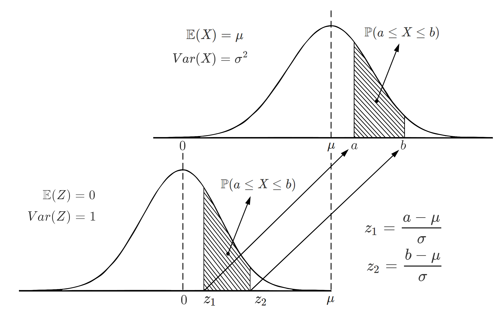
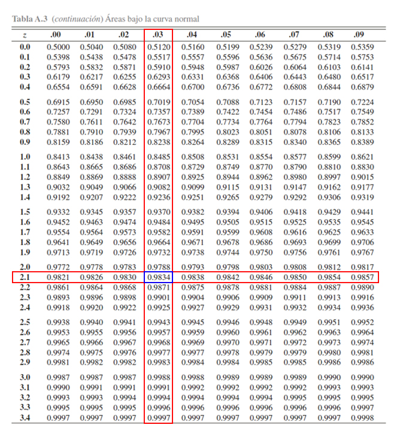
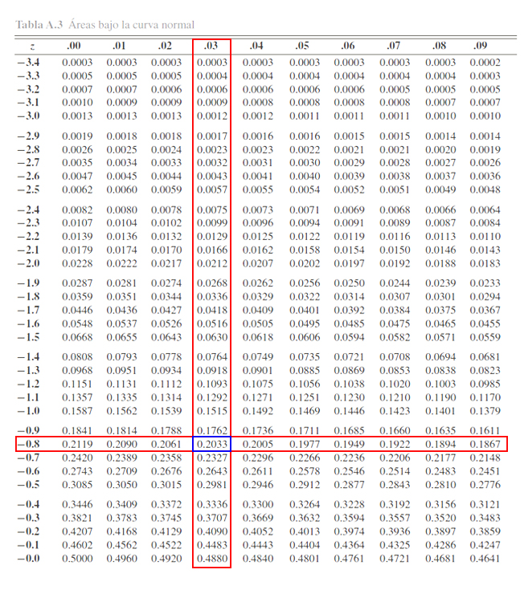
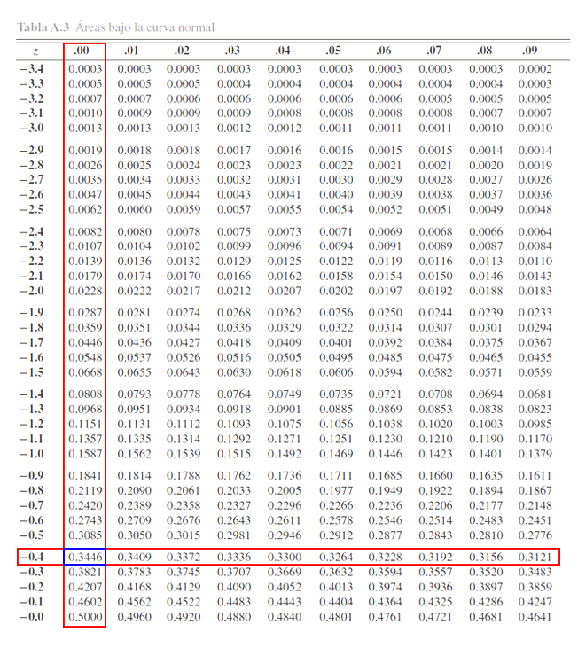

```{r knitr_init, echo=FALSE, cache=FALSE}
library(knitr)
## Global options
opts_chunk$set(echo=TRUE,
               cache=TRUE,
               prompt=FALSE,
               tidy=TRUE,
               comment=NA,
               message=FALSE,
               warning=FALSE,
               fig.path = paste0("../../EspecializacionSocioeconomica/images/", "SesionEsp02"),
               cache.path = "../../EspecializacionSocioeconomica/cache/",
               cache = FALSE)
```

## Variables aleatorias
Es una función que asocia un número real a cada elemento del espacio muestral `$S$`. Comúnmente las variables aleatorias se denotan por letras mayúsculas del final del abecedario `$(X,Y,Z)$` y a los valores observados por letras minúsculas `$(x,y,z)$`.

Las variables aleatorias se pueden clasificar en tres tipos

* **Variables Bernoulli:** Cualquier variable aleatoria cuyos posibles valores sean 0 o 1. Por ejemplo: __Productos exentos de IVA; Cumplimientos de pronóstico__
* **Variables discretas:** Son aquellas que tienen un número finito de posibilidades o una serie interminable de elementos como números enteros existentes (es decir, es enumerable). Por ejemplo: __El número de personas que habitan en una manzana; El número reformas que hay que hacerle a un edificio__
* **Variables continuas:** Son aquellas que contienen un número infinito de posibilidades, o igual número de puntos que un segmento de recta. Por ejemplo: __Los costos variables que pueden incurrir una empresa en un mes; Los beneficios recibidos por la construcción de una vía__

## Distribución de probabilidad discreta

Se dice que el conjunto de pares ordenados `$(x,p(x))$` es una función de masa de probabilidad `$(fmp)$` de la variable aleatoria discreta `$X$`, si para cualquier valor  posible de `$X$` se cumple que

1. `$p(x)\geq0$` para todo `$x \in$` en el dominio de `$X$`
2. `$\sum_x p(x)=1$`
3. `$\mathbb{P}(X\in A)= \sum_{x\in A}p(x) $` con `$A$` un conjunto de valores `$\in$` al dominio de `$X$`.

<button id="Show1" class="btn btn-secondary">Mostrar Ejercicio </button>
<button id="Hide1" class="btn btn-info">Ocultar Ejercicio </button>
<main id="botoncito1"> 
<h3 data-toc-skip> Ejercicio </h3> 
<p>Suponga que se realiza un estudio para la adecuación de la zona de urgencias de un hospital y para ello necesitan conocer el número de ambulancias que llegan a un hospital en una hora, encontrando que la función de distribución de probabilidad está dada por 

```{r echo=FALSE}
library(kableExtra)
tabla <- rbind("$X$" = c("$0$", "$1$", "$2$", "$3$", "$4$", "$5\\text{ o más}$"),
              "$p(x)$" = c("$0.0498$", "$0.1494$", "$0.2240$", "$0.2240$", "$0.1680$", "$0.1848$"))

kable(data.frame(tabla),
  format = "html", booktabs = T, col.names = NULL) %>%
kable_styling("striped", full_width = F)
```

Si la probabilidad de que lleguen al menos $4$ ambulancias en una hora es muy alta, el hospital considerará ampliar el estacionamiento, de otro modo, lo dejará tal y como está. Basado en ésto, aconsejaría usted al hospital que es necesario ampliar el estacionamiento?</p>

<h3 data-toc-skip> Solución </h3> 
<p> Como $X$ es la variable aleatoria del número de ambulancias que llegan al hospital en una hora, se tendrá que nos preguntan por la probabilidad
$$\begin{align*}
\mathbb{P}(X>=4)
\end{align*}$$
la cual, al ser una variable aleatoria discreta podremos calcularla mediante sumatorias, tal que
$$\begin{align*}
\mathbb{P}(X\geq 4) &= 1 - \mathbb{P}(X < 4) \\
                    &= 1 - \sum_{x=0}^{3} p(x) \\
                    &= 1 - [p(0) + p(1) + p(2) + p(3)] \\
                    &= 1 - [p(0) + p(1) + p(2) + p(3)] \\
                    &= 1 - [0.0498 + 0.1494 + 0.2240 + 0.2240] \\
                    &= 1 - 0.6472 \\
                    &= 0.3528 \\
\end{align*}$$

Es decir, que se tendrá una probabilidad del $35.28\%$ de que lleguen al menos $4$ ambulancia en una hora
</p>
</main>

## Función de distribución acumulada caso discreto

La función de distribución acumulada `$(fda)$` denotada por `$F(x)$`, para una variable aleatoria discreta `$X$` con distribución de probabilidad `$p(x)$` es de la forma 
`\begin{align*}
F(x)=P(X\leq x)=\sum_{t\leq x}p(t) \quad \quad -\infty<x<\infty
\end{align*}`

Para cualquier `$x$` dentro del dominio de `$X$`, `$F(x)$` será la suma acumulada de todos los `$X$` menores a `$x$`, evaluados en `$f(x)$`.

**Nota:** Si se quieren calcular probabilidades con la función de distribución acumulada en el caso discreto, entonces, si `$a$` y `$b$` son dos números **constantes enteras**, deberán tenerse en cuenta las siguientes reglas

* `$\mathbb{P}(a \leq X \leq b) = F(b) - F(a - 1)$`
* `$\mathbb{P}(a < X \leq b) = F(b) - F(a)$`
* `$\mathbb{P}(a \leq X < b) = F(b - 1) - F(a - 1)$`
* `$\mathbb{P}(a < X < b) = F(b - 1) - F(a)$`
* `$\mathbb{P}(X \geq a) = 1 - F(a-1)$`
* `$\mathbb{P}(X > a) = 1 - F(a)$`
* `$\mathbb{P}(X \leq b) = F(b)$`
* `$\mathbb{P}(X < b) = F(b - 1)$`

<button id="Show2" class="btn btn-secondary">Mostrar Ejercicio </button>
<button id="Hide2" class="btn btn-info">Ocultar Ejercicio </button>
<main id="botoncito2"> 
<h3 data-toc-skip> Ejercicio </h3> 
<p>Suponga que se realiza un estudio para la adecuación de la zona de urgencias de un hospital y para ello necesitan conocer el número de ambulancias que llegan a un hospital en una hora, encontrando que la función de distribución de probabilidad está dada por 

```{r echo=FALSE}
library(kableExtra)
tabla <- rbind("$X$" = c("$0$", "$1$", "$2$", "$3$", "$4$", "$5\\text{ o más}$"),
              "$p(x)$" = c("$0.0498$", "$0.1494$", "$0.2240$", "$0.2240$", "$0.1680$", "$0.1848$"))

kable(data.frame(tabla),
  format = "html", booktabs = T, col.names = NULL) %>%
kable_styling("striped", full_width = F)
```

Construya la función de distribución acumulada asociada al número de ambulancias que llegan a la zona de urgencias en una hora y calcule la probabilidad de que este vañpr sea al menos de $4$.</p>

<h3 data-toc-skip> Solución </h3> 
<p>Como la función de distribución acumulada parte de la función de masa de probabilidad, partimos de esta tabla y se procede a realizar el cálculo de la función de distribución acumulada $F(x)$. Para ello, debemos calcular las siguientes probabilidades $F(0) = \mathbb{P}(X\leq 0)$, $F(1) = \mathbb{P}(X\leq1)$, $F(2) = \mathbb{P}(X\leq2)$, $F(3) = \mathbb{P}(X\leq3)$ y $F(4) = \mathbb{P}(X\leq4)$.

$$\begin{align*}
F(0) & = \mathbb{P}(X\leq0) = p(0) = 0.0498 \\
F(1) & = \mathbb{P}(X\leq1) = p(0) + p(1) = 0.0498 + 0.1494 =  0.1992\\
F(2) & = \mathbb{P}(X\leq2) = \sum_{x=0}^{2} p(x) = 0.0498 + 0.1494 + 0.2240 =  0.4232 \\
F(3) & = \mathbb{P}(X\leq3) = \sum_{x=0}^{3} p(x) = 0.0498 + 0.1494 + 0.2240 + 0.2240 = 0.6472 \\
F(4) & = \mathbb{P}(X\leq4) = \sum_{x=0}^{4} p(x) = 0.0498 + 0.1494 + 0.2240 + 0.2240 + 0.2240 = 0.8712
\end{align*}$$

Entonces, mediante el empleo de estas probabilidades, podemos construir la función de distribución acumulada para la variable aleatoria $X$, tal que

$$\begin{align*}
F(x) = \begin{cases} 0 & x<0 \\
                     0.0498  & 0\leq x<1 \\
                     0.1992  & 1\leq x<2 \\
                     0.4232  & 2\leq x<3 \\
                     0.6472  & 3\leq x<4 \\
                     0.8712  & 4\leq x<5 \\
                     1       & x\geq5
       \end{cases}
\end{align*}$$
En donde se aprecia, que para valores menores a $0$, no hay ninguna probabilidad definida, para valores mayores o iguales a $0$ pero menores que $1$ solo está definido $F(0)=p(0)$, para valores mayores o iguales a $1$ pero menores que $2$ está definido $F(1)=p(0)+p(1)$, para valores mayores o iguales a $2$ pero menores que $3$ está definido $F(2)=p(0)+p(1)+p(2)$, y así sucesivamente.<br>
<br>
Ahora dado que estamos interesados en calcular la probabilidad de que el número de ambulancias que llegan a la zona de urgencias en una hora sea de al menos $4$ ambulancias, se tendrá que se debe calcular
$$\begin{align*}
\mathbb{P}(X \geq 4)
\end{align*}$$

Entonces, siguiendo las reglas anteriormente expuestas, dicha probabilidad puede calcularse mediante distribuciones acumuladas como
$$\begin{align*}
\mathbb{P}(X \geq 4) & = 1 - F(4-1) \\
                     & = 1 - F(3) \\
                     & = 1 - 0.6472 \\
                     & = 0.3528
\end{align*}$$

y por tanto, se tendrá que la probabilidad de que en una hora lleguen al menos $4$ ambulancias a un hospital es del $35.28\%$.
</li>
</ol>

</main>

## Distribuciones de probabilidad discreta
### Proceso Bernoulli
Un proceso Bernoulli es aquel que cumple

1. El experimento consta de ensayos repetidos bajo las mismas condiciones.
2. Cada ensayo produce un resultado que se puede clasificar como éxito o fracaso.
3. La probabilidad de éxito se denota por `$p$` y permanece constante de un ensayo a otro.
4. Los ensayos repetidos son independientes entre si.

<button id="Show3" class="btn btn-secondary">Mostrar Ejemplo </button>
<button id="Hide3" class="btn btn-info">Ocultar Ejemplo </button>
<main id="botoncito3"> 
<h3 data-toc-skip> Ejemplo </h3> 
<p> Los siguientes, son algunos ejemplos de casos que pueden considerarse como Procesos Bernoulli, debido a que cumplen las $4$ condiciones propuestas anteriormente.</p>
<ul>
<li>El número de accionistas que están a favor de un proyecto.</li>
<li>Verificar los metas que están alcanzando en un proyecto.</li>
<li>Comprar una empanada y determinar si tiene buen sabor o mal sabor.</li>
<li>Seleccionar un estudiante de la Universidad, y determinar si éste nació o no en Antioquia.</li>
</ul>
</main>

### Ensayo de Bernoulli
Si la probabilidad de éxito de un experimento es `$p$`, entonces la probabilidad de fallo debe ser `$1-p$` y la función de probabilidad de la variable aleatoria `$X\sim Be(p)$` para un ensayo Bernoulli será
`\begin{align*}
f(x) = p^x(1-p)^{1-x} \quad \quad x=0,1
\end{align*}`

#### Teorema
Si `$X\sim Be(p)$`, entonces se puede probar que la media y la varianza de la variable aleatoria `$X$` están dadas por 
`\begin{align*}
\mathbb{E}(X)=p \quad \quad Var(X)=p(1-p)
\end{align*}`

<button id="Show2" class="btn btn-secondary">Mostrar Ejercicio </button>
<button id="Hide2" class="btn btn-info">Ocultar Ejercicio </button>
<main id="botoncito2"> 
<h3 data-toc-skip> Ejercicio </h3> 
<p> Suponga que en un estudio se encontró que $2$ de cada $5$ estudiantes no desea tomar clases virtuales. Si se selecciona aleatoriamente un estudiante, cuál es la probabilidad de que éste desee tomar clases virtuales, y determine su media y desviación estándar.</p>

<h3 data-toc-skip> Solución </h3> 
<p>En este caso estamos interesados en la variable $X$, que representa el número de estudiantes que desean tomar clases virtuales, en donde sabemos que si, $2$ de cada $5$ no quieren tomar clases virtuales, entonces se tendrá que $3$ de cada $5$ si desean tomar clases virtuales. Por tanto al aplicar la definición de frecuencia relativa se tiene que 

$$\begin{align*}
p &= \frac{\text{Número de éxitos}}{\text{Número de muestras}}\\
  &= \frac{3}{5} \\
  &= 0.6
\end{align*}$$
siendo $p$ la probabilidad de que un estudiante desee tomar clases virtuales.

Ahora, la probabilidad de que se seleccione un estudiante al azar, y éste desee tomar clases virtuales será
$$\begin{align*}
\mathbb{P}(X = 1) &= p(1-p)^{1-x} \\
                  &= 0.6(0.4)^{1-1} \\
                  &= 0.6(0.4)^0 \\
                  &= 0.6
\end{align*}$$

es decir, que la probabilidad de que el estudiante seleccionado desee tomar clases virtuales será del $60\%$.

Ahora, para calcular la desviación estándar se requiere calcular inicialmente la varianza de la variable aleatoria, la cual está dada por 
$$\begin{align*}
Var(X) &= p(1-p) \\
       &= 0.6(0.4) \\
       &= 0.24
\end{align*}$$

y a partir de éste valor, se tendrá que la desviación estándar es igual a 
$$\begin{align*}
Sd(X) &= \sqrt{Var(X)} \\
      &= \sqrt{0.24} \\
      &= 0.4898979
\end{align*}$$
Entonces, como el valor esperado de un proceso Bernoulli es igual a $p$, esto es
$$\begin{align*}
\mathbb{E}(X) &= p \\
              &= 0.6
\end{align*}$$
Por tanto, al seleccionar un solo estudiante, se espera que $0.6$ estudiantes respondan que desean tomar clases virtuales, con una desviación estándar de $0.489$.
</p>
</main>

### Distribución Binomial
Si `$X$` es la variable aleatoria del número de éxitos de `$n$` ensayos de Bernoulli, con probabilidad de éxito `$p$`, entonces se dice que `$X\sim b(n,p)$` tal que
`\begin{align*}
f(x) = \left(\begin{array}{c}n\\ x\end{array}\right)p^x(1-p)^{n-x} \quad \quad x=0,1,\ldots,n
\end{align*}`

**Nota:** Esta distribución es usada cuando se realiza muestreo con reemplazo o en poblaciones infinitas en donde es posible **suponer que la probabilidad de éxito `$p$` es la misma** en cada ensayo Bernoulli.

#### Teorema
Si `$X\sim b(n,p)$`, entonces se puede probar que la media y varianza de la variable aleatoria `$X$` están dadas por
`\begin{align*}
\mathbb{E}(X)=np \quad \quad Var(X)=np(1-p)
\end{align*}`

<button id="Show3" class="btn btn-secondary">Mostrar Ejercicio </button>
<button id="Hide3" class="btn btn-info">Ocultar Ejercicio </button>
<main id="botoncito3"> 
<h3 data-toc-skip> Ejercicio </h3> 
<p> Suponga que en un estudio se encontró que $2$ de cada $5$ estudiantes no desea tomar clases virtuales. Si se selecciona aleatoriamente $20$ estudiantes, calcule
<ol>
<li>Cuál es la probabilidad de que no más de $3$ estudiantes deseen tomar clases virtuales?</li> 
<li>Cuál es la probabilidad de que no menos de $6$ pero menos de $12$ deseen tomar clases virtuales?</li>
<li>Cuál es el número promedio y desviación estándar del número de estudiantes que desean tomar clases virtuales?.</li>
</ol>
</p>

<h3 data-toc-skip> Solución </h3> 
<p>En este caso estamos interesados en la variable $X$, que representa el número de estudiantes que desean tomar clases virtuales, en donde sabemos que si, $2$ de cada $5$ no quieren tomar clases virtuales, entonces se tendrá que $3$ de cada $5$ si desean tomar clases virtuales. Por tanto al aplicar la definición de frecuencia relativa se tiene que 

$$\begin{align*}
p &= \frac{\text{Número de éxitos}}{\text{Número de muestras}} \\
  &= \frac{3}{5} \\
  &= 0.6
\end{align*}$$
siendo $p$ la probabilidad de que un estudiante desee tomar clases virtuales.
</p>
<ol>
<li>En este caso, estamos interesados en calcular la probabilidad de que no más de $3$ estudiantes deseen tomar clases virtuales, lo cual puede representarse mediante la siguiente probabilidad
$$\begin{align*}
P(X\leq 3) &= \sum_{x=0}^3 \left(\begin{array}{c}20\\ x\end{array}\right)0.6^x(1-0.6)^{20-x} \\
           &= \left(\begin{array}{c}20\\ 0\end{array}\right)0.6^0(0.4)^{20-0} + \ldots + \left(\begin{array}{c}20\\ 3\end{array}\right)0.6^3(0.4)^{20-3} \\
           &= 0.00000001099512 + 0.0000003298535 + 0.000004700412 + 0.00004230371 \\
           &= 0.00004734497
\end{align*}$$
Es decir, la probabilidad de que como máximo $3$ estudiantes de los $20$ seleccionados, deseen tomar clases virtuales, es del $0.0047\%$.
</li>
<li>Ahora, se tiene interés en conocer la probabilidad de que no menos de $6$ pero menos de $12$ deseen tomar clases virtuales. En este caso, la probabilidad asociada puede calcularse de la siguiente manera.
$$\begin{align*}
P(6 \leq x < 12) &= \sum_{x=6}^{11} \left(\begin{array}{c}20\\ x\end{array}\right)0.6^x(1-0.6)^{20-x} \\
           &= \left(\begin{array}{c}20\\ 6\end{array}\right)0.6^6(0.4)^{20-6} + \ldots + \left(\begin{array}{c}20\\ 11\end{array}\right)0.6^{11}(0.4)^{20-11} \\
           &= 0.4027898
\end{align*}$$
Es decir que, la probabilidad de que como mínimo $6$ pero menos de $12$ estudiantes deseen tomar clases virtuales de los $20$ seleccionados, es del $40.28\%$.
</li>
<li>Finalmente, se tiene interés en conocer cual será el número promedio y desviación estándar, de estudiantes que desean tomar clases virtuales, cuando se realiza la selección aleatoria de $20$. Al aplicar la formular de esperanza matemática para la distribución binomial, se tiene que el valor esperado de estudiantes que desean tomar clases virtuales es de
$$\begin{align*}
\mathbb{E}(X) & = np \\
              & = 20(0.6)\\
\mathbb{E}(X) & = 12
\end{align*}$$

Se procede a realizar el cálculo de la varianza para poder calcular la desviación estándar, del número de estudiantes que desean tomar clases virtuales, tal que
$$\begin{align*}
Var(X) &= np(1-p) \\
       &= 20(0.6)(1-0.6)\\
Var(X) & = 4.8
\end{align*}$$
y con este valor, se procede a calcular la desviación estándar
$$\begin{align*}
Sd(X) &= \sqrt{Var(X)} \\
      &= \sqrt{Var(4.8)} \\
Sd(X) & = 2.19089
\end{align*}$$
De lo anterior se tiene que, al realizar la selección aleatoria de $20$ estudiantes, es espera que $12$ estudiantes desean tomar clases virtuales, con una desviación estándar de $2.19$ estudiantes.
</li>
</ol>
</main>

### Proceso Poisson
Un proceso Poisson es aquel que cumple

1. El número de resultados que ocurren en un intervalo o región específica es independiente del número que ocurre en cualquier otro intervalo de tiempo o región del espacio disjunto.
2. La probabilidad de que ocurra un solo resultado durante un intervalo de tiempo corto o región pequeña es proporcional a la longitud del intervalo o al tamaño de la región, y no depende del número de resultados que ocurren por fuera de este intervalo de tiempo o región.
3. La probabilidad de que ocurra más de un resultado en tal intervalo o región pequeña es insignificante.

<button id="Show4" class="btn btn-secondary">Mostrar Ejemplo </button>
<button id="Hide4" class="btn btn-info">Ocultar Ejemplo </button>
<main id="botoncito4"> 
<h3 data-toc-skip> Ejemplo </h3> 
<ul>
<li>El número de carros que transitan por una glorieta en dos horas.</li>
<li>El número de estudiantes que entrar a la universidad en un día.</li>
<li>Mirar el número de carros que pasa por debajo de un puente, en $5$ minutos.</li>
<li>El número de empanada que se venden en media hora.</li>
<li>El número de resaltos para reducción de velocidad que se encuentran en la carretera en un kilómetro.</li>
</ul>
</main>

### Distribución Poisson
El número de sucesos que ocurren en un intervalo de tiempo o región específica, es una variable aleatoria `$X$` con distribución de probabilidad Poisson, tal que
`\begin{align*}
f(x) = \frac{e^{-\lambda}\lambda^x}{x!} \quad \quad x=0,1,\ldots
\end{align*}`
donde `$\lambda$` es el parámetro de la distribución y representa el número promedio de sucesos por unidad de tiempo o región específica.

#### Teorema
Si `$X\sim P(\lambda)$` entonces se puede probar que la media y varianza de la variable aleatoria `$X$` están dadas por
`\begin{align*}
\mathbb{E}(X)=\lambda \quad \quad Var(X)=\lambda
\end{align*}`

<button id="Show5" class="btn btn-secondary">Mostrar Ejercicio </button>
<button id="Hide5" class="btn btn-info">Ocultar Ejercicio </button>
<main id="botoncito5"> 
<h3 data-toc-skip> Ejercicio </h3> 
<p> Los huecos en las carreteras pueden ser un problema grave y requieren de reparación constante con un tipo específico de mezcla de concreto. La experiencia sugiere que hay en promedio $1.5$ huecos por cada dos kilómetros recorridos, después de cierta cantidad de uso. Si se supone que $X$ representa el número de huecos que hay en la carretera
<ol>
<li>Cuál es la probabilidad de que no aparezca más de un hueco en la carretera en un tramo de dos kilómetros? </li> 
<li>Cuál es la probabilidad de que aparezca más de hueco en un tramo de un kilómetro?</li>
<li>Cuál es el número promedio y desviación estándar del número de huecos que se encuentran en $5$ kilómetros?.</li>
</ol>
</p>

<h3 data-toc-skip> Solución </h3> 
<p>En este caso nos dicen que nuestra variable aleatorias es $X$ el número de huecos que se encuentran en la carretera, y que en promedio se encuentran $1.5$ huecos cada dos kilómetros.
</p>
<ol>
<li>Basados en lo anterior, nos preguntan por la probabilidad de que no aparezca más de un hueco en la carretera en un tramo de dos kilómetros. Es decir, nos preguntan por la probabilidad de que aparezca como máximo $1$ hueco en la carretera en un tramo de dos kilómetros. En este caso se tendrá la siguiente probabilidad
$$\begin{align*}
P(X\leq 1) &= \sum_{x=0}^1 \frac{e^{-1.5}1.5^x}{x!} \\
           &= \frac{e^{-1.5}1.5^0}{0!} + \frac{e^{-1.5}1.5^1}{1!} \\\\
           &= 0.2231302 + 0.3346952 \\
           &= 0.5578254
\end{align*}$$
Es decir, la probabilidad de que no aparezca más de un hueco en la carretera en el tramo de dos kilómetros es del $55.78\%$.
</li>
<li>Ahora, se tiene interés en conocer la probabilidad de que aparezca más de un hueco en un tramo de un kilómetro. En este caso debe notarse que se cambió la unidad de medida, en donde en lugar de dos kilómetros se habla de un kilómetro.<br>
<br>
Debido a ésto, será necesario actualizar nuestro parámetro $\lambda$ mediante el empleo de una regla de $3$, de la siguiente manera.
$$\begin{align*}
 2_{\text{km}} &- 1.5_{\text{huecos}} \\
 1_{\text{km}} &- \lambda
\end{align*}$$
esto es,
$$\begin{align*}
 \lambda &= \frac{1.5_{\text{huecos}} \times 1_{\text{km}}}{2_{\text{km}}} \\
 \lambda &= 0.75_{\text{huecos}}
\end{align*}$$
Es decir, que en un tramo de un kilómetro ocurren $0.75$ huecos en promedio. Conocido el valor del parámetro $\lambda$ para el tramo de un kilómetro, se procede a calcular la probabilidad de que aparezca más de un hueco en el tramo de un kilómetro, tal que
$$\begin{align*}
 \mathbb{P}(X>1) = \sum_{x=2}^\infty \frac{e^{-0.75}0.75^x}{x!} \\
\end{align*}$$
En donde se aprecia que es una suma infinita, y en consecuencia se procede a trabajar tal probabilidad por su complemento.
$$\begin{align*}
 \mathbb{P}(X>1) &= 1 - \mathbb{P}(X\leq1)  \\
                 &= 1 - \sum_{x=0}^1 \frac{e^{-0.75}0.75^x}{x!} \\
                 &= 1 - \frac{e^{-0.75}0.75^0}{0!} - \frac{e^{-0.75}0.75^1}{1!} \\
                 &= 1 - 0.4723666 - 0.3542749 \\
                 &= 0.1733585
\end{align*}$$

Es decir que, la probabilidad de que se encuentre más de $1$ hueco en un tramo de $1$ kilómetro cuando se viaja por carretera, es del $17.33\%$.
</li>
<li>Finalmente, se tiene interés en conocer cual será el promedio y desviación estándar, del número de huecos que se encontrarán en la carretera en el tramo de $5$ kilómetro. En este caso, como se cambia la unidad de medida de $2$ kilómetros a $5$ kilómetros, será necesario recalcular el valor de $\lambda$, ta que

$$\begin{align*}
 2_{\text{km}} &- 1.5_{\text{huecos}} \\
 5_{\text{km}} &- \lambda
\end{align*}$$
esto es,
$$\begin{align*}
 \lambda &= \frac{1.5_{\text{huecos}} \times 5_{\text{km}}}{2_{\text{km}}} \\
 \lambda &= 3.75_{\text{huecos}}
\end{align*}$$


Ahora, al aplicar la formular de esperanza matemática para la distribución Poisson, se tiene que el número esperado de huecos en $5$ kilómetros es de
$$\begin{align*}
\mathbb{E}(X) & = \lambda \\
              & = 3.75\\
\end{align*}$$

Similarmente, se procede a realizar el cálculo de la varianza para poder calcular la desviación estándar, del número de huecos que hay en un tramo de $5$ kilómetros
$$\begin{align*}
Var(X) &= \lambda \\
       &= 3.75\\
\end{align*}$$
y con este valor, se procede a calcular la desviación estándar
$$\begin{align*}
Sd(X) &= \sqrt{Var(X)} \\
      &= \sqrt{Var(3.75)} \\
Sd(X) & = 1.936492
\end{align*}$$
De lo anterior se tiene que, en el tramo de $5$ kilómetros de carretera, se espera encontrar $3.75$ huecos, con una desviación estándar de $1.93$ huecos.
</li>
</ol>
</main>


## Distribución de probabilidad continua
La función `$f(x)$` es una función de densidad de probabilidad (*fdp*) para la variable aleatoria continua `$X$`, definida en el conjunto de números reales, si

1. `$f(x)\geq0$` para todo `$x\in \mathbb R$`
2. `$\int_{-\infty}^\infty f(x)dx=1$`
3. `$P(a<x<b) = \int_a^b f(x)dx$` con `$a$` y `$b$` dos constantes `$\in \mathbb{R}$`

<button id="Show4" class="btn btn-secondary">Mostrar Ejercicio </button>
<button id="Hide4" class="btn btn-info">Ocultar Ejercicio </button>
<main id="botoncito4"> 
<h3 data-toc-skip> Ejercicio </h3> 
<p>Suponga que el tiempo que tarda una serie financiera en cumplir un ciclo, es una variable aleatoria continua con función de densidad de probabilidad dada por 
$$\begin{align*}
f(x)=x^2(1-x)^2 \quad \quad 0<x<1
\end{align*}$$
siendo $X$ una variable aleatoria que representa el tiempo en horas que tarda la serie financiera en cumplir un ciclo. A partir de dicha función
</p>
<ol> 
<li>Verifique si la función de densidad de probabilidad está bien definida? De no estarlo, multiplique la función por una constante $k$ para que quede bien definida.</li>
<li>Calcule la probabilidad de que el tiempo que tarda la serie en cumplir un ciclo sea de $30$ minutos a $50$ minutos.</li>
</ol>
<h3 data-toc-skip> Solución </h3> 
<ol>
<li>Para verificar si la función está bien definida, es necesario en primer lugar observar si para todo $X$ en el dominio definido, la función de probabilidad de densidad de probabilidad es mayor o igual a $0$. Para ello supongamos $3$ números diferentes, $0.1$ $0.4$ y $0.7$, los cuales vamos a evaluar en la función de densidad.
$$\begin{align*}
f(0.1)=(0.1)^2(1-0.1)^2=0.0081 \\
f(0.4)=(0.4)^2(1-0.4)^2=0.0576 \\
f(0.7)=(0.7)^2(1-0.7)^2=0.0441
\end{align*}$$
La idea entonces, es apreciar que para todo $0<x<1$, $f(x)\geq0$.<br>

En segundo lugar, para observar si la función de densidad de probabilidad está bien definida, es necesario observar si al integrar dicha función su resultado es igual a $1$, es decir,

$$\begin{align*}
\int_{-\infty}^\infty f(x)dx & = \int_{-\infty}^0 0\; dx + \int_{0}^1 x^2(1-x)^2\; dx + \int_{1}^\infty 0\; dx \\
 & = \int_{0}^1 x^2(1-x)^2\; dx \\
 & = \int_{0}^1 x^2(1^2-2x+x^2)\; dx \\
 & = \int_{0}^1 x^2-2x^3+x^4\; dx \\
 & = \left(\frac{x^3}{3} - \frac{2x^4}{4} + \frac{x^5}{5} \right)\Bigg|^1_0 \\
 & = \left(\frac{1^3}{3} - \frac{1^4}{2} + \frac{1^5}{5} \right) - \left(\frac{0^3}{3} - \frac{0^4}{2} + \frac{0^5}{5} \right) \\
 & = \frac{1}{30}
\end{align*}$$
Entonces, como la integral no da exactamente $1$, se tendrá que multiplicar dicha función de densidad por una constante $k$ que haga que su resultado sea $1$, es decir, si multiplicamos la función por $k=30$, se tendrá como resultado que la integral será igual a $1$, ya que,
$$\begin{align*}
30\int_{-\infty}^\infty f(x)dx & = 30 \int_{0}^1 x^2(1-x)^2\; dx \\
 & = 30 \left(\frac{1^3}{3} - \frac{1^4}{2} + \frac{1^5}{5} \right) \\
 & = \frac{30}{30} \\
 & = 1
\end{align*}$$
Y en consecuencia, se tendrá que la nueva función de densidad de probabilidad está bien definida.
$$\begin{align*}
f(x) = 30x^2(1-x)^2 \quad \quad 0<x<1
\end{align*}$$

</li>
<li> Dado que la función de densidad está en horas, será necesario pasar los minutos a horas, en donde, al aplicar una regla de tres para cada límite de la integral que nos piden se tendrá que
$$\begin{align*}
60_\text{min}  &- 1_\text{hora} & \quad \quad & 60_\text{min} - 1_\text{hora}\\30_\text{min} &- a & \quad \quad & 50_\text{min} - b
\end{align*}$$
Entonces, al realizar la operación encontramos que los límites de la integral serán
$$\begin{align*}a&=\frac{30_\text{min}\times1_{\text{hora}}}{60
_\text{min}}=0.5_\text{horas} \\
b&=\frac{50_\text{min}\times1_{\text{hora}}}{60
_\text{min}}=0.8333_\text{horas}
\end{align*}$$
Ahora, al realizar la integral tendremos que

$$\begin{align*}
\mathbb{P}(0.5 < X < 0.8333) & = \int_{0.5}^{0.8333} 30 x^2(1-x)^2\; dx \\
 & = 30\int_{0.5}^{0.8333} x^2-2x^3+x^4\; dx \\
 & = 30\left(\frac{x^3}{3} - \frac{2x^4}{4} + \frac{x^5}{5} \right)\Bigg|^{0.8333}_{0.5} \\
 & = 30 \left[\left(\frac{0.8333^3}{3} - \frac{0.8333^4}{2} + \frac{0.8333^5}{5} \right) - \left(\frac{0.5^3}{3} - \frac{0.5^4}{2} + \frac{0.5^5}{5} \right)\right] \\
 & = 0.4645
\end{align*}$$

En consecuencia, se tendrá una probabilidad del $46.45\%$ de que el tiempo que tarda la serie financiera en cumplir un ciclo estará entre $30$ minutos y $50$ minutos.
</li>

</ol>
</main>

## Función de distribución acumulada caso continuo

La función de distribución acumulada (*fda*) denotada por `$F(x)$`, para una variable aleatoria continua `$X$` con distribución de densidad de probabilidad `$f(x)$` es de la forma 
`\begin{align*}
F(x)=P(X\leq x)=\int_{-\infty}^x f(t)dt \quad \quad -\infty<x<\infty
\end{align*}`
para cualquier `$x$`, `$F(x)$` es el área bajo la curva de densidad a la izquierda de valor que tome `$x$`.

**Nota:** Si se quieren calcular probabilidades con la función de distribución acumulada en el caso continuo, entonces, si `$a$` y `$b$` son dos números constantes, deberán tenerse en cuenta las siguientes reglas

* `$\mathbb{P}(a \leq X \leq b) = F(b) - F(a)$`
* `$\mathbb{P}(X \geq a) = 1 - F(a)$`
* `$\mathbb{P}(X \leq b) = F(b)$`

**Nota:** Recordar que en el caso continuo, las probabilidad con o sin la igualdad son equivalentes, y por tanto, solo se escriben las tres reglas anteriores para generalizar todos los casos.

<button id="Show5" class="btn btn-secondary">Mostrar Ejercicio </button>
<button id="Hide5" class="btn btn-info">Ocultar Ejercicio </button>
<main id="botoncito5"> 
<h3 data-toc-skip> Ejercicio </h3> 
<p>Suponga que el tiempo que tarda una serie financiera en cumplir un ciclo, es una variable aleatoria continua con función de densidad de probabilidad dada por 
$$\begin{align*}
f(x)=30x^2(1-x)^2 \quad \quad 0<x<1
\end{align*}$$
siendo $X$ una variable aleatoria que representa el tiempo en horas que tarda la serie financiera en cumplir un ciclo. A partir de dicha función </p>
<ol> 
<li>Calcule la función de distribución acumulada $F(x)$.</li>
<li>Calcule la probabilidad de que el tiempo que tarda la serie financiera en cumplir un ciclo, se encuentre entre $30$ minutos y $50$ minutos, mediante el uso de $F(x)$. </li>
</ol>
<h3 data-toc-skip> Solución </h3> 
<ol>
<li>Para encontrar la función de distribución acumulada a partir de una función de densidad de probabilidad, es necesario realizar la integral de la función de densidad, de la forma
$$\begin{align*}
F(x)& = \int_{-\infty}^x f(t)dt \\
    & = \int_{-\infty}^0 0dt + \int_{0}^x 30t^2(1-t)^2 dt \\
    & = 30\int_{0}^{x} t^2-2t^3+t^4\; dt \\
    & = 30\left(\frac{t^3}{3} - \frac{2t^4}{4} + \frac{t^5}{5} \right)\Bigg|^{x}_{0} \\
    & = 30\left[\left(\frac{x^3}{3} - \frac{x^4}{2} + \frac{x^5}{5} \right) - \left(\frac{0^3}{3} - \frac{0^4}{2} + \frac{0^5}{5} \right)\right]  \\
F(x)& = 30\left(\frac{x^3}{3} - \frac{x^4}{2} + \frac{x^5}{5} \right)
\end{align*}$$
</li>
<li> Dado que el interés es calcular la probabilidad de que el tiempo que tarda la serie financiera en cumplir un ciclo, se encuentre entre $30$ minutos y $50$ minutos, entonces se tendrá que la probabilidad de interés, en horas, es la siguiente
$$\begin{align*}
\mathbb{P}(0.5 < X < 0.8333)
\end{align*}$$

Entonces, siguiendo las reglas anteriormente expuestas, dicha probabilidad puede calcularse mediante

$$\begin{align*}
\mathbb{P}(0.5 < X < 0.8333) & = F(0.8333) - F(0.5) \\
                         & = 30\left(\frac{0.8333^3}{3} - \frac{0.8333^4}{2} + \frac{0.8333^5}{5} \right) - 30\left(\frac{0.5^3}{3} - \frac{0.5^4}{2} + \frac{0.5^5}{5} \right) \\
                         & = 0.4645
\end{align*}$$

y por tanto, se tendrá que la probabilidad de que el tiempo que tarde la serie financiera en cumplir un ciclo estará entre $30$ minutos y $50$ minutos, es de $46.45\%$.
</li>
</ol>
</main>

## Distribuciones de probabilidad continua
## Distribución Exponencial
Se dice que la variable aleatoria `$X$` tiene una distribución Exponencial con parámetro `$\beta$`, si su función de densidad de probabilidad es de la forma
`\begin{align*} 
f(x) = \begin{cases} \frac{1}{\beta}e^{-\frac{x}{\beta}} & x\geq 0, \beta>0 \\ 0 & \text{en otro caso} \end{cases}
\end{align*}`

#### Teorema
Si `$X\sim Exp(\beta)$`, entonces se puede probar que la media y la varianza de la variable aleatoria `$X$` están dadas por 
`\begin{align*}
\mathbb{E}(X)=\beta \quad \quad Var(X)=\beta^2
\end{align*}`

<button id="Show1" class="btn btn-secondary">Mostrar Ejercicio </button>
<button id="Hide1" class="btn btn-info">Ocultar Ejercicio </button>
<main id="botoncito1"> 
<h3 data-toc-skip> Ejercicio </h3> 
<p> Un ingeniero industrial afirma que encontró un catalizador solido que permite aumentar la velocidad de reacción química promedio, requerida en un proceso de producción de una bebida gaseosa. Dicho ingeniero asegura que con este catalizador solido la velocidad de la reacción química se reduce en promedio en $3$ minutos, lo cual mejoraría la eficiencia de la producción en un $28\%$. Dado lo anterior
<ol>
<li>Cuál es la probabilidad de en un lote cualquiera, el catalizador sólido reduzca la velocidad de la reacción química en al menos $5$ minutos?</li> 
<li>Cuál es la probabilidad de en un lote cualquiera, el catalizador sólido reduzca la velocidad de la reacción química en menos de $4$ minutos, pero en más de $2.5$ minutos?</li>
<li>Cuál es el promedio y desviación estándar del tiempo que reduce el catalizador solido para la reacción química empleada para la producción de bebidas gaseosas?.</li>
</ol>
</p>

<h3 data-toc-skip> Solución </h3> 
<p>Como se aprecia en el enunciado del ejercicio, se pregunta por el tiempo de reducción y se hace referencia en que el catalizador solido reduce <strong>en promedio</strong> $3$ minutos, sin dar más información al respecto. Debido a ésto, podríamos asumir que la distribución de los tiempos que reduce el catalizador sólido se distribuye exponencial con parámetro $\beta=3_{min}$.
<ol>
<li>En este caso estamos interesados en calcular la probabilidad en que el catalizador sólido reduzca la velocidad de la reacción química en al menos $5$ minutos. Esto es
$$\begin{align*}
\mathbb{P}(X\geq5) = \int_5^\infty \frac{1}{3}e^{-\frac{x}{3}} dx
\end{align*}$$
Al hacer cambio de variable tenemos que
$$\begin{align*}
u= \frac{x}{3} \quad \quad du = \frac{1}{3} dx
\end{align*}$$
Entonces, al evaluar los límites de la integral debido al cambio de variable, se tiene que cuando $x=5$, el valor de $u=5/3$, y cuando $x=\infty$, el valor de $u=\infty/3 = \infty$. Por tanto, al hacer el cambio de variable y cambiar los límites de integración tenemos que 
$$\begin{align*}
\mathbb{P}(X\geq5) &= \int_{\frac{5}{3}}^\infty e^{-u} du \\
                   &=  -e^{-u} \Bigg|_{\frac{5}{3}}^\infty \\
                   &=  -e^{-\infty} + e^{-\frac{5}{3}} \\
                   &=  0 + 0.1888756 \\
                   &=  0.1888756
\end{align*}$$
Es decir, se tendrá que la probabilidad de que el catalizador sólido encontrado por el Ingeniero Industrial, reduzca la velocidad de reacción quiímica en al menos $5$ minutos, es del $18.89\%$.
</li>
<li>Para esta pregunta, se desea conocer la probabilidad de que el catalizador sólido reduzca la velocidad de reacción química usado en la producción de bebidas gaseosas, en más de $2.5$ minutos pero en menos de $4$ minutos. Es decir, se desea calcular la siguiente probabilidad
$$\begin{align*}
\mathbb{P}(2.5<X<4) = \int_{2.5}^4 \frac{1}{3}e^{-\frac{x}{3}} dx
\end{align*}$$
Al aplicar el cambio de variable usado en el punto anterio se tiene que 
$$\begin{align*}
u= \frac{x}{3} \quad \quad du = \frac{1}{3} dx
\end{align*}$$
en donde, al evaluar el límite inferior y superior de la integrar en $u$, se tendrá que cuando $x=2.5$, $u=2.5/3$, mientras que, cuando $x=4$, $u=4/3$, obteniendo con ello, la siguiente expresión
$$\begin{align*}
\mathbb{P}(2.5<X<4) &= \int_{\frac{2.5}{3}}^{\frac{4}{3}} e^{-u} du \\
                    &=  -e^{-u} \Bigg|_{\frac{2.5}{3}}^{\frac{4}{3}} \\
                    &=  -e^{-\frac{4}{3}} + e^{-\frac{2.5}{3}} \\
                    &=  -0.2635971 + 0.4345982 \\
                    &=  0.1710011
\end{align*}$$
Es decir, se tendrá un $17.10\%$ de probabilidad, de que el catalizador sólido reduzca la velocidad de reacción química entre $2.5$ y $4$ minutos.
</li>
<li>
Para calcular el tiempo promedio y desviación estándar de reducción que genera emplear el catalizador sólido propuesto por el Ingeniero Industrial, y sabiendo que la distribución de estos tiempos se distribuye exponencialmente con parámetro $\beta=3$. Se emplean las ecuaciones de esperanza matemática y varianza de la distribución exponencial, tal que la esperanza será igual a
$$\begin{align*}
\mathbb{E}(X)&=\beta \\
             &=3
\end{align*}$$

y la varianza será igual a
$$\begin{align*}
Var(X)& = \beta^2 \\
      & = 3^2 \\
      & = 9
\end{align*}$$
y ahora, empleando el resultado de la varianza se procede a calcular la desviación estándar, tal que
$$\begin{align*}
Sd(X)& = \sqrt{Var(X)} \\
      & = \sqrt{9} \\
      & = 3
\end{align*}$$
Es decir, se espera que la reducción promedio del tiempo que reduce el catalizador sólido propuesto por el Ingeniero Industrial, sea de $3$ minutos con una desviación estándar de $3$ minutos.
</li>
</ol>
</p>
</main>

#### Función de distribución acumulada Exponencial
Si `$X\sim Exp(\beta)$`, entonces se puede probar que la función de distribución acumulada de `$X$` está dada por
`\begin{align*} 
F(x) = \mathbb{P}(X\leq x) = \begin{cases} 0 & x<0 \\ 1- e^{-\frac{x}{\beta}} & x\geq 0, \beta>0  \end{cases}
\end{align*}`

<button id="Show2" class="btn btn-secondary">Mostrar Ejercicio </button>
<button id="Hide2" class="btn btn-info">Ocultar Ejercicio </button>
<main id="botoncito2"> 
<h3 data-toc-skip> Ejercicio </h3> 
<p> Un ingeniero industrial afirma que encontró un catalizador solido que permite aumentar la velocidad de reacción química promedio, requerida en un proceso de producción de una bebida gaseosa. Dicho ingeniero asegura que con este catalizador solido la velocidad de la reacción química se reduce en promedio en $3$ minutos, lo cual mejoraría la eficiencia de la producción en un $28\%$. Dado lo anterior, calcule la función de distribución acumulada, y con ésta, calcule la probabilidad de que la reducción promedio en la reacción química sea de entre $5$ y $8$ minutos.
</p>

<h3 data-toc-skip> Solución </h3> 
<p> Como el interés es calcular inicialmente la función de distribución acumulada, entonces aplicamos la ecuación de la distribución acumulada, reemplazando a $\beta$ por $3$, tal que
$$\begin{align*} 
F(x) = 1- e^{-\frac{x}{3}}
\end{align*}$$

Ahora, al realizar el cálculo de la probabilidad de que la reducción del tiempo que logra el catalizador sólido para la reacción química sea de entre $5$ y $8$ minutos, y para ello, se realiza el siguiente procedimiento, aplicando las propiedades de la función de distribución acumulada para el caso continuo, ya presentadas en la <a href="../../ProbabilidadeInferencia/PeIEClase08.html#función-de-distribución-acumulada-caso-continuo">Clase 08</a>.
$$\begin{align*}
\mathbb{P}(5<X<8) &= F(8) - F(5) \\
                  &= \left(1- e^{-\frac{8}{3}}\right) - \left(1- e^{-\frac{5}{3}}\right)  \\
                  &=  e^{-\frac{5}{3}} - e^{-\frac{8}{3}} \\
                  &=  0.1888756 + 0.06948345 \\
                  &=  0.1193922
\end{align*}$$
Es decir, que se tendrá un $11.93\%$ de probabilidad, de que el catalizador sólido, reduzca el tiempo de la reacción química en un valor entre $5$ y $8$ minutos.
</p>
</main>

## Relación entre la distribución Exponencial y el proceso Poisson
Suponga que el número de eventos que ocurren en un intervalo de tiempo `$t$`, tiene una distribución Poisson con parámetro `$\lambda$` y que el número ocurrencias en intervalos de tiempo distintos son independientes entre si. Entonces se tendrá que la distribución del tiempo transcurrido entre dos eventos de Poisson suesivos es Exponencial con parámetro `$\beta = \frac{t}{\lambda}$`.


<button id="Show3" class="btn btn-secondary">Mostrar Ejercicio </button>
<button id="Hide3" class="btn btn-info">Ocultar Ejercicio </button>
<main id="botoncito3"> 
<h3 data-toc-skip> Ejercicio </h3> 
<p> En cierta ciudad el número de automoviles que excede el límite de velocidad de $80_{km/h}$, es un intervalo de media hora, es una variable aleatoria Poisson con media de $8.4$ automóviles. ¿Cuál es la probabilidad de que el tiempo de espera sea menor a $5$ minutos para que el próximo automóvil exceda el limite de velocidad de $80_{km/h}$?.
</p>

<h3 data-toc-skip> Solución </h3> 
<p>En este caso, nos dicen que el número de automoviles que excede el límite de velocidad en <strong>media hora</strong> se distribuye Poisson con parámetro $\lambda=\mathbb{E}(X)=8.4$, pero nos preguntan por la probabilidad de que el tiempo de espera sea menor de $5$ minutos hasta que transite el próximo automovil. Es decir nos preguntan, por una variable aleatoria diferente a la inicialmente planteada, la cual puede asumirse Exponencial, debido a que nos preguntan por un solo suceso, es decir "el próximo automóvil". <br>
Para calcular el parámetro de la distribución Exponencial, podemos emplear la relación que hay entre la distribución Exponencial y el proceso Poisson, contruyendo una regla de tres, para realizar el cálculo, tal que
$$\begin{align*}
8.4_{Autos} &- 30_{min}\\
1_{Auto} &- a
\end{align*}$$
Lo anterior significa que si, $8.4$ automóviles transitan en promedio en $30$ minutos, entonces $1$ automovil, transitará en promedio en cuanto tiempo?. Al resolver la regla de tres, tenemos que
$$\begin{align*}
a = \frac{1_{Auto} \times 30_{min}}{8.4_{Autos}} = 3.57_{min}
\end{align*}$$
El tiempo promedio que tardar en pasar un solo auto movil es de $3.57$, es decir, El parámetro $\beta$ de la distribución Exponencial es igual a $3.57$. Y ahora, como ya conocemos el parámetro de la distribución Exponencial, podemos realizar el cálculo de la probabilidad de que el tiempo que tarda en hasta que el próximo automóvil exceda el límite de velocidad sea menor a $5$ minutos.
$$\begin{align*}
\mathbb{P}(Y<5) & = F(5) \\
                & = 1 - e^{-\frac{5}{3.57}}\\
                & = 1 - 0.2464589 \\
                & = 0.7535411
\end{align*}$$
Es decir, existe una probabilidad de $75.35\%$, de que el tiempo de espera sea menor a $5$ minutos para que el próximo automóvil exceda el limite de velocidad.
</p>
</main>

<button id="Show4" class="btn btn-secondary">Mostrar Ejercicio </button>
<button id="Hide4" class="btn btn-info">Ocultar Ejercicio </button>
<main id="botoncito4"> 
<h3 data-toc-skip> Ejercicio </h3> 
<p> Suponga que el tiempo entre llegadas de taxis a un acopio del Metro, tiene una distribución exponencial con media de $3$ minutos. ¿Cuál es la probabilidad de que en media hora lleguen más de $15$ taxis?.
</p>

<h3 data-toc-skip> Solución </h3> 
<p>En este caso, se inicia hablando del tiempo que hay entre la llegada de dos taxis a un acopio, es decir, el tiempo que tarda en llegar el próximo taxi a un acopio. Y nos dicen que este tiempo se distribuye exponencial con parámetro $\beta=\mathbb{E}(X)=3_{min}$. Pero nos preguntan por el número de llegadas al acopio durante media hora, es decir, nos preguntan, por una variable aleatoria diferente a la inicialmente planteada, la cual puede asumirse Poisson, debido a que nos preguntan por el número de sucesos en un periodo de tiempo.

Para calcular el parámetro de la distribución Poisson, podemos emplear la relación que hay entre la distribución Exponencial y el proceso Poisson, contruyendo una regla de tres, para realizar el cálculo, tal que
$$\begin{align*}
3_{min} &- 1_{taxi}\\
30_{min} &- b
\end{align*}$$
Lo anterior significa que si, en promedio tarda $3$ minutos en llegar $1$ taxi al acopio, entonces, cuantos taxis llegarán al acopio en un intervalo de $30$ minutos?. Al resolver la regla de tres, tenemos que
$$\begin{align*}
b = \frac{1_{taxi} \times 30_{min}}{3_{min}} = 10_{taxis}
\end{align*}$$
El número promedio de taxis que llegan al acopio en un intervalo de $30$ minutos será de $10$ taxis, es decir, el parámetro $\lambda$ de la distribución Poisson es igual a $10$. Y ahora, como ya conocemos el parámetro de la distribución Poisson, podemos realizar el cálculo de la probabilidad de que lleguen más de $15$ taxis en media hora.
$$\begin{align*}
\mathbb{P}(X>15) & = 1 - \mathbb{P}(X\leq15)  \\
                 & = 1 - \sum_{0}^{15} \frac{e^{-10} 10^{x}}{x!}\\
                 & = 1 - 0.9512596 \\
                 & = 0.0487404
\end{align*}$$
Es decir, existe una probabilidad del $4.87\%$, de que en un intervalo de media hora lleguen más de $15$ taxis al acopio del Metro.
</p>
</main>

## Propiedad de carencia de memoria
Suponga que `$X$` es una variable aleatoria tal que `$X\sim Exp(\beta)$`, entonces sean dos reales positivos `$a$` y `$b$`, entonces se puede probar que

1. `$\mathbb{P}(X\geq a+b | x \geq b) = \mathbb{P}(X\geq a)$` 
2. `$\mathbb{P}(X\leq a+b | x \geq b) = \mathbb{P}(X\leq a)$`

<button id="Show5" class="btn btn-secondary">Mostrar Ejercicio </button>
<button id="Hide5" class="btn btn-info">Ocultar Ejercicio </button>
<main id="botoncito5"> 
<h3 data-toc-skip> Ejercicio </h3> 
<p> Suponga que se realiza un estudio en un Call Center, y se encuentra que el tiempo promedio entre llamadas es de $2$ minutos. Entonces, si han pasado ya $2$ minutos y no ha entrado ninguna llamada al Call Center, cuál es la probabilidad de que tarde al menos $1.5$ minutos más en entrar la próxima llamada?.
</p>

<h3 data-toc-skip> Solución </h3> 
<p>En este ejercicio, nos preguntan por una probabilidad condicional, debido a que nos dicen que ya han pasado $2$ minutos y no ha entrado ninguna llamada, y nos preguntan por la probabilidad de que la próxima llamada tarde menos de $1.5$ minutos más. Al aplicar el procedimiento para resolver la probabilidad condicional se tendrá que
$$\begin{align*}
\mathbb{P}(X\geq3.5|X>1.5) & = \frac{\mathbb{P}(X\geq3.5 \cap X>1.5)}{\mathbb{P}(X>1.5)}  \\
                        & = \frac{\mathbb{P}(X\geq3.5)}{\mathbb{P}(X>1.5)} \\
                        & = \frac{\mathbb{P}(X\geq3.5)}{\mathbb{P}(X>1.5)} \\
                        & = \frac{1 - \mathbb{P}(X<3.5)}{1 - \mathbb{P}(X\leq1.5)} \\
                        & = \frac{1 - F(3.5)}{1 - F(1.5)} \\
                        & = \frac{1 - \left(1 - e^{-\frac{3.5}{2}}\right)}{1 - \left(1 - e^{-\frac{1.5}{2}}\right)} \\
                        & = \frac{e^{-\frac{3.5}{2}}}{e^{-\frac{1.5}{2}}} \\
                        & = 0.3678794
\end{align*}$$
Ahora, si empleamos la propiedad de carencia de memoria de la distribución Exponencial, se tendrá que, dicha probabilidad peude resolverse de forma más rápida, de la forma
$$\begin{align*}
\mathbb{P}(X\geq3.5|X>1.5) & = \mathbb{P}(X\geq2 + 1.5 |X>1.5) \\
                        & = \mathbb{P}(X\geq2) \\
                        & = 1 - \mathbb{P}(X<2) \\
                        & = 1 - F(2) \\
                        & = 1 - \left(1 - e^{-\frac{2}{2}}\right) \\
                        & = e^{-1} \\
                        & = 0.3678794
\end{align*}$$
Obteniendo el mismo resultado. Ahora la interpretación del resultado es que, si ya han pasado $2$ minutos y no ha entrado ninguna llamada al Call Center, la probabilidad de que tarde almenos $1.5$ minutos más en entrar la próxima llamada será de $36.78\%$.
</p>
</main>

## Distribuciones de probabilidad continuas
## Distribución Weibull
Se dice que la variable aleatoria `$X$` tiene una distribución Weibull con parámetros `$\alpha$` y `$\beta$`, si su función de densidad de probabilidad es de la forma
`\begin{align*} 
f(x) = \begin{cases} \frac{\alpha}{\beta}\left(\frac{x}{\beta}\right)^{\alpha - 1}e^{-\left(\frac{x}{\beta}\right)^\alpha} & x\geq 0, \alpha>0, \beta>0 \\ 0 & \text{en otro caso} \end{cases}
\end{align*}`

donde, `$\alpha$` se conoce como el parámetro de forma y `$\beta$` como el parámetro de escala. Además, si `$\alpha=1$` se tendrá que la distribución Weibull será igual a la distribución Exponencial.

#### Teorema
Si `$X\sim Wei(\alpha, \beta)$`, entonces se puede probar que la media y la varianza de la variable aleatoria `$X$` están dadas por 
`\begin{align*}
\mathbb{E}(X)=\beta\;\Gamma\left(1 + \frac{1}{\alpha}\right) \quad \quad Var(X)=\beta^2\left[\Gamma\left(1 + \frac{2}{\alpha}\right) - \Gamma\left(1 + \frac{1}{\alpha}\right)^2\right]
\end{align*}`

<button id="Show1" class="btn btn-secondary">Mostrar Ejercicio </button>
<button id="Hide1" class="btn btn-info">Ocultar Ejercicio </button>
<main id="botoncito1"> 
<h3 data-toc-skip> Ejercicio </h3> 
<p> Un ingeniero industrial realiza un estudio sobre la vida útil, en años, de un nuevo aire acondicionado que fabrican en la compañía donde trabaja, y luego de probar muchos aires, encontró que el tiempo de vida, en años, se distribuye Weibull con parámetros $\alpha=2$ y $\beta = 8$. Dado lo anterior
<ol>
<li>Cuál es la probabilidad de que un aire acondicionado falle después de $3$ años de uso?</li> 
<li>Cuál es la probabilidad de que la vida útil del aire acondicionado se encuentre entre $6$ y $9$ años de uso?</li>
<li>Cuál es el tiempo de vida útil promedio y desviación estándar en años del aire acondicionado?</li>
</ol>
</p>

<h3 data-toc-skip> Solución </h3> 
<p>En el enunciado del ejercicio nos dicen tanto la distribución de la vida útil del aire acondicionado, y los parámetros de la distribución, tal que, $X \sim Wei(\alpha=2,\beta=8)$.
<ol>
<li>En este primer punto, nos encontramos interesados en calcular la probabilidad de que el aire acondicionado falle después de $3$, es decir, que la vida útil supere los $3$ años. Esto es
$$\begin{align*}
\mathbb{P}(X>3) = \int_3^\infty \frac{2}{8}\left(\frac{x}{8}\right)^{2 - 1}e^{-\left(\frac{x}{8}\right)^2} dx
\end{align*}$$
Al hacer cambio de variable tenemos que
$$\begin{align*}
u= \left(\frac{x}{8}\right)^2 \quad \quad du = \frac{2}{8}\left(\frac{x}{8}\right)^{2-1} dx
\end{align*}$$
Entonces, al evaluar los límites de la integral debido al cambio de variable, se tiene que cuando $x=3$, el valor de $u=(3/8)^2$, y cuando $x=\infty$, el valor de $u=(\infty/8)^2 = \infty$. Por tanto, al hacer el cambio de variable y cambiar los límites de integración tenemos que 
$$\begin{align*}
\mathbb{P}(X\geq3) &= \int_{\left(\frac{3}{8}\right)^2}^\infty e^{-u} du \\
                   &=  -e^{-u} \Bigg|_{\left(\frac{3}{8}\right)^2}^\infty \\
                   &=  -e^{-\infty} + e^{-\left(\frac{3}{8}\right)^2} \\
                   &=  0 + 0.8688151 \\
                   &=  0.8688151
\end{align*}$$
Es decir, se tendrá una probabilidad del $86.88\%$ de que el aire acondicionado falle después de los $3$ años de uso.
</li>
<li>Esta preguntar es similar al caso anterior, y se desea conocer la probabilidad de que la vida útil del aire acondicionado se encuentre entre $6$ y $9$ años. Es decir, se desea calcular la siguiente probabilidad
$$\begin{align*}
\mathbb{P}(6<X<9) = \int_{6}^9 \frac{2}{8}\left(\frac{x}{8}\right)^{2 - 1}e^{-\left(\frac{x}{8}\right)^2} dx
\end{align*}$$
Al aplicar el cambio de variable usado en el punto anterior se tiene que 
$$\begin{align*}
u= \left(\frac{x}{8}\right)^2 \quad \quad du = \frac{2}{8}\left(\frac{x}{8}\right)^{2-1} dx
\end{align*}$$
en donde, al evaluar el límite inferior y superior de la integrar en $u$, se tendrá que cuando $x=6$, $u=(6/8)^2$, mientras que, cuando $x=9$, $u=(9/8)^2$, obteniendo con ello, la siguiente expresión
$$\begin{align*}
\mathbb{P}(6<X<9) &= \int_{\left(\frac{6}{8}\right)^2}^{\left(\frac{9}{8}\right)^2} e^{-u} du \\
                    &=  -e^{-u} \Bigg|_{\left(\frac{6}{8}\right)^2}^{\left(\frac{9}{8}\right)^2} \\
                    &=  -e^{-\left(\frac{9}{8}\right)^2} + e^{-\left(\frac{6}{8}\right)^2} \\
                    &=  -0.282063 + 0.5697828 \\
                    &=  0.2877199
\end{align*}$$
Es decir, se tendrá un $28.77\%$ de probabilidad, de que el aire acondicionado dure entre entre $6$ y $9$ años.
</li>
<li>Para calcular el tiempo de vida útil promedio y desviación estándar en años para el aire acondicionado, se emplea el conocimiento sobre que el tiempo de vida se distribuye Weibull con parámetros $\alpha=2$ y $\beta=8$, y las las ecuaciones de esperanza matemática y varianza de la distribución Weibull, tal que, la esperanza será igual a
$$\begin{align*}
\mathbb{E}(X)&=\beta\;\Gamma\left(1 + \frac{1}{\alpha}\right) \\
             &=8\;\Gamma\left(1 + \frac{1}{2}\right)\\
             &=8\;\frac{1}{2}\Gamma\left(\frac{1}{2}\right)\\
             &=4\sqrt{\pi} \\
             &=7.089815
\end{align*}$$

y la varianza será igual a
$$\begin{align*}
Var(X)& = \beta^2\left[\Gamma\left(1 + \frac{2}{\alpha}\right) - \Gamma\left(1 + \frac{1}{\alpha}\right)^2\right] \\
      & = 8^2\left[\Gamma\left(1 + \frac{2}{2}\right) - \Gamma\left(1 + \frac{1}{2}\right)^2\right] \\
      & = 64\left[1! - \left(\frac{1}{2}\sqrt{\pi}\right)^2\right] \\
      & = 64\left[1 - \frac{\pi}{4}\right] \\
      & = 64(0.2146018) \\
      & = 13.73452
\end{align*}$$
y ahora, empleando el resultado de la varianza se procede a calcular la desviación estándar, tal que
$$\begin{align*}
Sd(X)& = \sqrt{Var(X)} \\
      & = \sqrt{13.73452} \\
      & = 3.706011
\end{align*}$$
Es decir, se espera que el tiempo de vida promedio del aire acondicionado es de $7.09$ años con una desviación estándar de $3.706$ años.
</li>
</ol>
</p>
</main>

#### Función de distribución acumulada Weibull
Si `$X\sim Wei(\alpha, \beta)$`, entonces se puede probar que la función de distribución acumulada de `$X$` está dada por
`\begin{align*} 
F(x) = \mathbb{P}(X\leq x) = \begin{cases} 0 & x<0 \\ 1- e^{-\left(\frac{x}{\beta}\right)^\alpha} & x\geq 0 \end{cases}
\end{align*}`

<button id="Show2" class="btn btn-secondary">Mostrar Ejercicio </button>
<button id="Hide2" class="btn btn-info">Ocultar Ejercicio </button>
<main id="botoncito2"> 
<h3 data-toc-skip> Ejercicio </h3> 
<p> Un ingeniero industrial realiza un estudio sobre la vida útil, en años, de un nuevo aire acondicionado que fabrican en la compañía donde trabaja, y luego de probar muchos aires, encontró que el tiempo de vida, en años, se distribuye Weibull con parámetros $\alpha=2$ y $\beta = 8$. Dado lo anterior, calcule la función de distribución acumulada, y con ésta, calcule la probabilidad de que el tiempo de vida útil, de aire a condicionado sea mayor a $7$ años pero menor de $12$ años. </p>

<h3 data-toc-skip> Solución </h3> 
<p> Como el interés es calcular inicialmente la función de distribución acumulada, aplicamos la ecuación de la distribución acumulada para la distribución Weibull, reemplazando a $\alpha$ por $2$ y a $\beta$ por $8$, tal que
$$\begin{align*} 
F(x) = 1 - e^{-\left(\frac{x}{8}\right)^2}
\end{align*}$$

Ahora, al realizar el cálculo de la probabilidad de que la vida útil del aire acondicionado sea mayor a $7$ años pero menor de $12$ años, se emplea las propiedades de la función de distribución acumulada para el caso continuo, ya presentadas en la <a href="../../ProbabilidadeInferencia/PeIEClase08.html#función-de-distribución-acumulada-caso-continuo">Clase 08</a>.
$$\begin{align*}
\mathbb{P}(7<X<12) & = F(12) - F(7) \\
                   & = \left(1 - e^{-\left(\frac{12}{8}\right)^2}\right) - \left(1 - e^{-\left(\frac{7}{8}\right)^2}\right)  \\
                   & = e^{-\left(\frac{7}{8}\right)^2} - e^{-\left(\frac{12}{8}\right)^2} \\
                   & = 0.4650432 - 0.1053992 \\
                   & = 0.359644
\end{align*}$$
Es decir, se tendrá un $35.96\%$ de probabilidad, de que la vida útil del aire acondicionado se encuentre entre $7$ y $12$ años.
</p>
</main>

### Distribución Normal
Se dice que la variable aleatoria `$X$` tiene una distribución Normal con parámetros `$\mu$` y `$\sigma^2)$`, si su función de densidad de probabilidad es de la forma
`\begin{align*} 
f(x) = \begin{cases} \frac{1}{\sqrt{2\pi\sigma^2}}e^{-\frac{(x - \mu)^2}{2\sigma^2}} & -\infty<x<\infty, -\infty<\mu<\infty, \sigma^2>0 \\ 0 & \text{en otro caso} \end{cases}
\end{align*}`

#### Teorema
Si `$X\sim N(\mu, \sigma^2)$`, entonces se puede probar que la media y la varianza de la variable aleatoria `$X$` están dadas por 
`\begin{align*}
\mathbb{E}(X)=\mu \quad \quad Var(X)=\sigma^2
\end{align*}`

### Distribución Normal estándar
Un caso particular de la distribución normal cuando la media `$\mu=0$` y ka varianza `$\sigma^2=1$`, recibe el nombre de distribución normal estándar, cuya variable aleatoria se simboliza con `$Z$`, tal que `$Z\sim N(0,1)$`, y donde su función de densidad de probabilidad está dada por

`\begin{align*} 
f(z) = \begin{cases} \frac{1}{\sqrt{2\pi}}e^{-\frac{z^2}{2}} & -\infty<z<\infty \\ 0 & \text{en otro caso} \end{cases}
\end{align*}`

### Teorema de Estandarización
Si `$X\sim N(\mu, \sigma^2)$`, siendo `$a$` y `$b$` dos constantes cualquiera, entonces si se realiza la transformación `$Z=\frac{x-\mu}{\sigma}$` conocida como **estandarización**, se tendrá que `$Z\sim N(0,1)$`, con `$z_1$` y `$z_2$` las dos constantes transformadas.




### Propiedades
Si `$X\sim N(\mu, \sigma^2)$`, entonces al aplicar el teorema de estandarización `$Z=\frac{x-\mu}{\sigma} \sim N(0,1)$`, y por tanto, si `$z_1$` y `$z_2$` son constantes, se tendrá que


1. `$\mathbb{P}(Z\leq z_1) = \mathbb{P}(Z\geq -z_1)$`
2. `$\mathbb{P}(Z\geq z_1) = \mathbb{P}(Z\leq -z_1) = 1- \mathbb{P}(Z\leq z_1)$`
3. `$\mathbb{P}(z_1\leq Z\leq z_2) = \mathbb{P}(Z\leq z_2) - \mathbb{P}(Z< z_1)$`
4. Si `$z_1 = - z_2$` entonces `$\mathbb{P}(z_1\leq Z\leq z_2) = \mathbb{P}(-z_2\leq Z\leq z_2) =2\mathbb{P}(Z\leq z_2) - 1$`
5. `$Z_\alpha$` es el valor de la variable aleatoria `$Z\sim N(0,1)$` tal que `$\mathbb{P}(Z\geq Z_\alpha)=\alpha$`, y `$\mathbb{P}(Z\leq Z_\alpha)=1 - \alpha$`

En donde, debe recordarse que, al ser la distribución normal una distribución continua, la `$\mathbb{P}(Z\leq z_1) = \mathbb{P}(Z< z_1)$` y `$\mathbb{P}(Z\geq z_1) = \mathbb{P}(Z > z_1)$`. Lo anterior debido a que en la distribuciones continuas la probabilidad puntual es igual a `$0$`.


<button id="Show1" class="btn btn-secondary">Mostrar Ejercicio Manejo de Tabla Normal Estándar</button>
<button id="Hide1" class="btn btn-info">Ocultar Ejercicio Manejo de Tabla Normal Estándar</button>
<main id="botoncito1"> 
<h3 data-toc-skip> Ejercicio </h3> 
<p> Suponga que poseemos una distribución normal estándar, tal que $Z\sim N(0,1)$. Entonces, a partir de esta distribución y empleando la <a href="https://github.com/jiperezga/jiperezga.github.io/raw/master/Dataset/Documentos/DistNormEst.pdf">Tabla de la Distribución Normal Estándar</a>, calcule </p>
<ol>
<li>$\mathbb{P}(Z\leq 1.96)$</li> 
<li>$\mathbb{P}(Z> 2.13)$</li>
<li>$\mathbb{P}(-2.42 <Z \leq 0.24)$</li>
<li>$\mathbb{P}(Z>z) = 0.0129$</li>
</ol>

<h3 data-toc-skip> Solución </h3> 
<p>Para calcular probabilidades con la tabla de la distribución normal estándar, es necesario tener en cuenta el funcionamiento de la tabla misma. Y para ello se presenta la siguiente imagen.</p>


<p>En donde, se aprecia que, <strong>los cuadros rojos representan los valores críticos</strong> $z$ que se emplea para calcular probabilidades, en donde, el cuadro rojo de la parte izquierda muestra la parte entera y el primer decimal, mientras que el cuadro rojo de la parte superior muestra el segundo decimal. <strong>El cuadro azul representa las probabilidades</strong> $\alpha$ que se desean calcular a partir de los valores críticos. Finalmente, <strong>el cuadro azul claro representa el funcionamiento de la tabla </strong>, la cual muestra las probabilidades que poseen la forma $\mathbb{P}(Z<z)=\alpha$. </p>

<ol>
<li>Con la explicación de la tabla en mente, la primera probabilidad a calcular es $\mathbb{P}(Z\leq 1.96)$. Entonces como esta probabilidad tiene la estructura establecida por la tabla $\mathbb{P}(Z\leq z)$, será cuestión de buscar el valor crítico $1.96$ para localizar la probabilidad asociada, tal que se busca en la parte izquierda, el valor $1.9$ y en la parte superior el valor $0.06$, y en donde se encuentre el cruce de ambos valores, se encontrará el valor de la probabilidad asociada a $1.96$. Dicho procedimiento se muestra en la siguiente imagen 


Donde se aprecia que 

$$\begin{align*}\mathbb{P}(Z\leq 1.96)=0.9750\end{align*}$$

</li> 
<li>A diferencia del punto anterior, observamos que la probabilidad propuesta $\mathbb{P}(Z> 2.13)$ tiene una estructura diferente a la establecida por la tabla $\mathbb{P}(Z\leq z)$, y por tanto, será necesario emplear el complemento de la probabilidad propuesta para obtener una estructura similar a la propuesta por la tabla, tal que

$$\begin{align*}
\mathbb{P}(Z> 2.13)= 1 - \mathbb{P}(Z\leq 2.13)
\end{align*}$$
En donde, se aprecia que ahora podemos calcular la $\mathbb{P}(Z> 2.13)$, mediante el empleo de la $\mathbb{P}(Z\leq 2.13)$, la cual podemos buscar en la tabla directamente. Para localizar $\mathbb{P}(Z\leq 2.13)$, se busca el valor $2.1$ en la parte izquierda de la tabla, y el valor $0.03$ en la parte superior de la tabla, y en donde se encuentre el cruce de ambos valores, se encontrará el valor de la probabilidad asociada a $2.13$.



Donde se aprecia que 

$$\begin{align*}
\mathbb{P}(Z\leq 2.13)=0.9834
\end{align*}$$

y por tanto, se tendrá que 

$$\begin{align*}
\mathbb{P}(Z> 2.13)&= 1 - \mathbb{P}(Z\leq 2.13)\\
                   &= 1 - 0.9834 \\
                   &= 0.0166
\end{align*}$$

</li>
<li>En este caso, se desea calcular la $\mathbb{P}(-2.42 <Z \leq 0.24)$, y se observa que la estructura de dicha probabilidad es diferente a la establecida por la tabla $\mathbb{P}(Z\leq z)$, pero también podemos apreciar que si aplicamos las propiedades de la función de distribución acumulada para el caso continuo, ya presentadas en la <a href="../../ProbabilidadeInferencia/PeIEClase08.html#función-de-distribución-acumulada-caso-continuo">Clase 08</a>, podemos llevar la probabilidad de interés a la forma

$$\begin{align*}
\mathbb{P}(-2.42 <Z \leq 0.24) = \mathbb{P}(Z \leq 0.24) - \mathbb{P}(Z \leq -2.42)
\end{align*}$$
obteniendo que la probabilidad $\mathbb{P}(-2.42 <Z \leq 0.24)$, puede calcularse mediante el empleo de las probabilidades acumuladas $\mathbb{P}(Z \leq 0.24)$ y $\mathbb{P}(Z \leq -2.42)$, las cuales pueden calcularse en la tabla de forma similar a los dos puntos anteriores.


Donde se aprecia que 

$$\begin{align*}
\mathbb{P}(Z \leq -2.42)=0.0078 \quad \text{ y } \quad \mathbb{P}(Z \leq 0.24)=0.5948
\end{align*}$$

y por tanto, se tendrá que 

$$\begin{align*}
\mathbb{P}(-2.42 <Z \leq 0.24) &= \mathbb{P}(Z \leq 0.24) - \mathbb{P}(Z \leq -2.42)\\
                               &= 0.5948 - 0.0078  \\
                               &= 0.587
\end{align*}$$
</li>

<li>En este punto, a diferencia de los puntos anteriores, no están dando el valor de la probabilidad y nos piden encontrar el valor crítico $z$. Es decir debemos calcular el valor crítico asociado a la probabilidad
$$\begin{align*}
\mathbb{P}(Z>z) = 0.0129
\end{align*}$$

Y para ello, debemos llevar inicialmente la estructura de la probabilidad, a la estructura manejada por la tabla, tal que

$$\begin{align*}
\mathbb{P}(Z>z) &= 0.0129 \\
1 - \mathbb{P}(Z\leq z) &= 0.0129 \\
1- 0.0129 &= \mathbb{P}(Z\leq z) \\
0.9871 &= \mathbb{P}(Z\leq z)
\end{align*}$$

En donde observamos que la probabilidad $\mathbb{P}(Z\leq z)$ ya posee la estructura de la tabla, y en consecuencia, podemos proceder a encontrar el valor crítico $z$, buscando el valor de la probabilidad $0.9871$ en la parte interior de la tabla, y luego buscando cual es el valor crítico $z$ asociado a dicha probabilidad.


En la tabla se aprecia, que al buscar la probabilidad $0.9871$ encontramos que el valor crítico $z$ asociado es de $2.24$, es decir

$$\begin{align*}
\mathbb{P}(Z\leq 2.24) &= 0.9871
\end{align*}$$

o equivalentemente

$$\begin{align*}
\mathbb{P}(Z > 2.24) &= 0.0129
\end{align*}$$

</li>
</ol>
</main>

<button id="Show2" class="btn btn-secondary">Mostrar Ejercicio</button>
<button id="Hide2" class="btn btn-info">Ocultar Ejercicio</button>
<main id="botoncito2"> 
<h3 data-toc-skip> Ejercicio </h3> 
<p>Suponga que cierto tipo de batería para celular dura en promedio $5$ años con una desviación estándar de $1.2$ años. Si se sabe por experiencia que la distribución de las baterías se distribuye normalmente, cuál es la probabilidad de que una batería de celular dure al menos $4$ años?</p>

<h3 data-toc-skip> Solución </h3> 
<p>En este caso estamos interesados en que la batería de una celular dure al menos $4$ años, es decir, queremos calcular la siguiente probabilidad.
$$\begin{align*}
\mathbb{P}(X \geq 4)
\end{align*}$$
Pero en este caso tenemos que la distribución de los datos no se distribuye $N(0,1)$, si no que se distribuye $N(5, 1.2)$, y por ello debemos aplicar el teorema de estandarización, con el fin de llevar la distribución $N(5, 1.2)$ a una normal estándar, tal que
$$\begin{align*}
\mathbb{P}(X \geq 4)&=\mathbb{P}\left(\frac{X-\mu}{\sigma}\geq \frac{4-5}{1.2}\right)\\
\mathbb{P}(X \geq 4)&=\mathbb{P}\left(\frac{X-\mu}{\sigma}\geq \frac{4-5}{1.2}\right)\\
\mathbb{P}(X \geq 4)&=\mathbb{P}(Z \geq -0.83)
\end{align*}$$
En donde $Z\sim N(0,1)$. Ahora, como la estructura de la probabilidad de $Z$ no posee la estructura de la probabilidad de se maneja en la tabla, entonces procedemos a calcular el complemento de la probabilidad, tal que
$$\begin{align*}
\mathbb{P}(Z \geq -0.83)&= 1 - \mathbb{P}(Z < -0.83) \\
\end{align*}$$
y en consecuencia podemos ahora buscar la probabilidad $\mathbb{P}(Z < -0.83)$ en la tabla de la distribución normal estándar, de la siguiente manera



Donde se aprecia que 

$$\begin{align*}
\mathbb{P}(Z < -0.83)=0.2033
\end{align*}$$

y por tanto, se tendrá que 

$$\begin{align*}
\mathbb{P}(Z \geq -0.83)&= 1 - \mathbb{P}(Z < -0.83) \\
                        &= 1 - 0.2033 \\
                        &= 0.7967
\end{align*}$$

lo cual es equivalente a 

$$\begin{align*}
\mathbb{P}(X \geq 4)&= \mathbb{P}(Z \geq -0.83) \\
                    &= 0.7967
\end{align*}$$

En consecuencia, se tendrá que la probabilidad de que una batería de celular dure al menos $4$ años, es del $76.67\%$.
</p>
</main>

## Teoremas de Aproximación
### Teorema de Aproximación Binomial a Poisson
Si `$X\sim b(n,p)$` con `$n$` grande `$(n\geq 100)$` y `$p$` pequeña `$(p\leq 0.01)$` entonces se dice que `$X\stackrel{a}{\sim}Pois(\lambda)$` donde `$\lambda = np$`.

<button id="Show3" class="btn btn-secondary">Mostrar Ejercicio</button>
<button id="Hide3" class="btn btn-info">Ocultar Ejercicio</button>
<main id="botoncito3"> 
<h3 data-toc-skip> Ejercicio </h3> 
<p>Suponga que al realizar un estudio sobre un proceso de producción, se encontró que el $3\%$ de los artículos producidos resultaba tener algún tipo de defecto. Si se producen $900$ artículos en un día, cuál es la probabilidad de que $30$ artículos o menos resulten tener algún tipo de defecto. Emplee tanto la distribución binomial como la aproximación a Poisson y comente sobre los resultados obtenidos.</p>

<h3 data-toc-skip> Solución </h3> 
<p>En este caso estamos interesados en calcular una probabilidad binomial de un grupo $n$ de $900$ artículos, de los cuales se busca a que el número de artículos defectuosos $X$, sea de al menos $30$ defectuosos, sabiendo que la probabilidad de producir un artículo defectuoso es del $3\%$. Esto es
$$\begin{align*}
\mathbb{P}(X \geq 30)&= \sum_{x=30}^{900} \left(\begin{array}{c}900\\ x\end{array}\right) (0.03)^x(0.97)^{900-x}
\end{align*}$$
En donde, como se tiene una sumatoria desde $30$ hasta $900$ se decide emplear el complemento de la probabilidad, tal que 
$$\begin{align*}
\mathbb{P}(X \geq 30) &= 1 - \mathbb{P}(X < 30) \\
                      &= 1 - \sum_{x=0}^{29} \left(\begin{array}{c}900\\ x\end{array}\right) (0.03)^x(0.97)^{900-x} \\
                      &= 1 - 0.695578212 \\
                      &= 0.3044218
\end{align*}$$
Es decir, que la probabilidad de que al menos $30$ artículos de los $900$ sean defectuosos es del $30.44\%$. <br> <br>

Ahora, si realizamos la aproximación de la distribución binomial a la distribución Poisson que resultado tendríamos?. <br> <br>

Para ello será necesario calcular el parámetro $\lambda$ de la distribución Poisson, el cual está dado por
$$\begin{align*}
\lambda &= np \\
        &= 900(0.03) \\
        &= 27
\end{align*}$$
Es decir que la distribución $b(n=900, p=0.03)$ puede aproximarse a una distribución $Pois(\lambda=27)$, que $n$ es grande y $p$ es pequeño (aunque éste no cumpla la condición de que $p\leq 0.01$, pero dichas condiciones son valores para tener como puntos de referencia). Por tanto, al calcular la probabilidad con la distribución Poisson tenemos que
$$\begin{align*}
\mathbb{P}(X \geq 30) &= 1 - \mathbb{P}(X < 30) \\
                      &= 1 - \sum_{x=0}^{29} \frac{e^{-27}27^x}{x!} \\
                      &= 1 - 0.6934654545 \\
                      &= 0.3065345
\end{align*}$$
Lo cual indica que, al realizar la aproximación, se tiene un $30.65\%$ de probabilidad de que al menos $30$ artículos de los $900$ seleccionados, resulten tener algún tipo de defecto. <br> <br>

Al observar las dos probabilidades anteriores, la calculada con la distribución binomial $30.44\%$, y la calculada con la distribución Poisson $30.65\%$, se aprecia que las dos son muy similares, y en consecuencia, se dice que la distribución Poisson dadas las características del ejercicio ofrece una buena aproximación al que se obtendría con la distribución binomial.
</p>
</main>

### Teorema de Aproximación Binomial a Normal
Si `$X\sim b(n,p)$` con `$n$` grande `$(n\geq 30)$` y `$p$` cercano a 0.5 `$(p\approx 0.5)$` entonces se dice que `$X\stackrel{a}{\sim}N(\mu,\sigma^2)$` donde `$\mu = np$` y `$\sigma^2 = np(1-p)$`.

Además, se tendrá que `$Z\stackrel{a}{\sim}N(0,1)$`, tal que
`\begin{align*}
Z=\frac{x-np}{\sqrt{np(1-p)}}\stackrel{a}{\sim}N(0,1)
\end{align*}`

La aproximación será buena si `$np$` y `$n(1-p)>5$`.

**Nota:** 
Para realizar la aproximación de binomial a normal, se debe usar un factor de corrección de continuidad de 0.5, así
`\begin{align*} 
\text{Binomial} & & & & \text{Normal} \quad \quad \quad \quad \quad \\
\mathbb{P}(X\leq a) & & & & \mathbb{P}(X\leq a + 0.5) \quad \quad \quad \quad \; \\
\mathbb{P}(X<a) & & & & \mathbb{P}(X\leq a - 0.5) \quad \quad \quad \quad \; \\
\mathbb{P}(X\geq a) & & & & \mathbb{P}(X\geq a - 0.5) \quad \quad \quad \quad \; \\
\mathbb{P}(X>a) & & & & \mathbb{P}(X\geq a + 0.5) \quad \quad \quad \quad \; \\
\mathbb{P}(X=a) & & & & \mathbb{P}(a - 0.5 \leq X\leq a + 0.5)
\end{align*}`

<button id="Show4" class="btn btn-secondary">Mostrar Ejercicio</button>
<button id="Hide4" class="btn btn-info">Ocultar Ejercicio</button>
<main id="botoncito4"> 
<h3 data-toc-skip> Ejercicio </h3> 
<p>Suponga que el ministerio de salud realiza un estudio sobre la probabilidad de que una persona de $40$ años muera antes de la edad de jubilación a los $62$ años, y encuentra que dicha probabilidad es de $15\%$. Si se toma como referencia un grupo de $1500$ personas que posee $40$ años de edad, cuál es la probabilidad de que menos de $225$ muera antes de la edad de jubilación?.</p>
 
<h3 data-toc-skip> Solución </h3> 
<p>En este caso estamos interesados en calcular cuál es la probabilidad de que menos de $220$ personas mueran antes de los $62$ años, y se toma como grupo de estudio un total de $1500$ personas, sabiendo que la probabilidad de que mueran antes de los $62$ es del $15\%$, es decir, tenemos que $X\sim b(n=1500, p=0.15)$, y deseamos calcular 
$$\begin{align*}
\mathbb{P}(X<220)&= \sum_{x=0}^{219} \left(\begin{array}{c}1500\\ x\end{array}\right) (0.15)^x(0.85)^{1500-x} \\
                 &= 0.3480602
\end{align*}$$
Es de anotar que el valor de la probabilidad presentada no es posible calcularla en una calculadora, debido a que las limitaciones que posee ésta, no permiten calcular una combinatoria de tal magnitud, y en consecuencia, resulta el intento de calcular dicha sumatoria en el mensaje $Math$ $ERROR$. Y es por ello que la probabilidad anterior se calculó en el programa <tt>R</tt> para poder tomar dicho valor como referencia para compararlo con el valor de la aproximación normal.<br> <br>

Ahora, dado que no es posible calcular dicha probabilidad en la calculadora, se procede a la aplicación del teorema de aproximación a la distribución normal, si $X\sim b(n=1500, p=0.15)$ entonces se tendrá que la media será igual a $X\stackrel{a}{\sim}N(\mu=np,\sigma^2=np(1-p))$, en donde
$$\begin{align*}
\mu &= np \\
    &= 1500(0.15) \\
    &= 225
\end{align*}$$

y la varianza igual a

$$\begin{align*}
\sigma^2 &= np(1-p) \\
         &= 1500(0.15)(0.85) \\
         &= 191.25
\end{align*}$$

Ahora, conocidos los parámetros $\mu=225$ y $\sigma=\sqrt{191.25}=13.82932$, se procede al cálculo de la probabilidad de interés, en donde, al aplicar el factor corrector de continuidad a la probabilidad se tendrá que 
$$\begin{align*}
\text{Binomial} & & & & \text{Normal} \quad \quad \quad \quad \quad \\
\mathbb{P}(X< 220) & & & & \mathbb{P}(X\leq 220 - 0.5) \quad \quad \quad \quad \; \\
\end{align*}$$
es decir que, si $X\sim b(n=1500, p=0.15)$ estamos interesados en calcular $\mathbb{P}(X< 220)$, mientras que si $X\stackrel{a}{\sim}N(\mu=225,\sigma^2=191.25)$ estaríamos interesados en calcular $\mathbb{P}(X\leq 219.5)$. Por tanto, al aplicar el teorema de estandarización para transformar dicha probabilidad una distribución normal estándar, se tendrá que

$$\begin{align*}
\mathbb{P}(X \leq 219.5) &= \mathbb{P}\left(\frac{X-\mu}{\sigma}\leq \frac{219.5 - 225}{13.82932}\right)\\
                     &= \mathbb{P}(Z \leq -0.40)
\end{align*}$$

En donde se aprecia que la $\mathbb{P}(Z \leq -0.40)$ tiene la misma estructura establecida por la tabla de distribución normal estándar $\mathbb{P}(Z\leq z)$, y por tanto será cuestión de buscar el valor crítico $0.40$ en la tabla, para encontrar la probabilidad asociada a dicho valor, tal que



Donde se aprecia que 

$$\begin{align*}
\mathbb{P}(Z \leq -0.40)=0.3446
\end{align*}$$
o equivalentemente, se tendrá que 

$$\begin{align*}
\mathbb{P}(X \leq 219.5) &= \mathbb{P}(Z \leq -0.40) \\
                         &= 0.3446
\end{align*}$$
Es decir que la probabilidad aproximada de que menos de $220$ personas mueran de los $1500$ antes de llegar a los $62$ años, es del $34.46\%$. <br> <br>

Al comparar el resultado exacto de la distribución binomial $34.81\%$, con respecto al resultado aproximado con la distribución normal $34.46\%$, se aprecia que la diferencia es muy pequeña, y en consecuencia, se dice que la distribución normal ofrece una buena aproximación para la distribución binomial.
</p>
</main>

