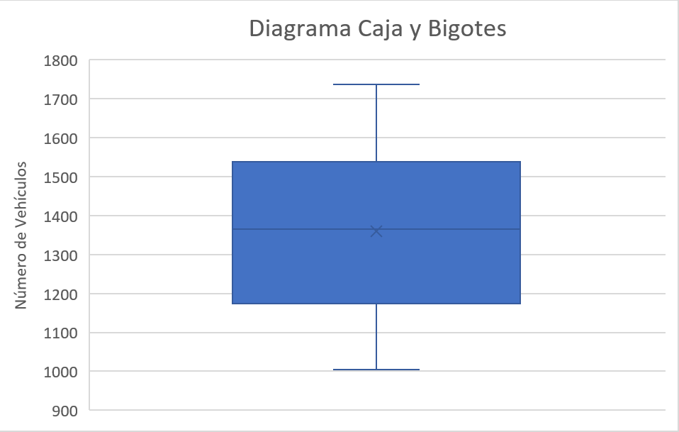
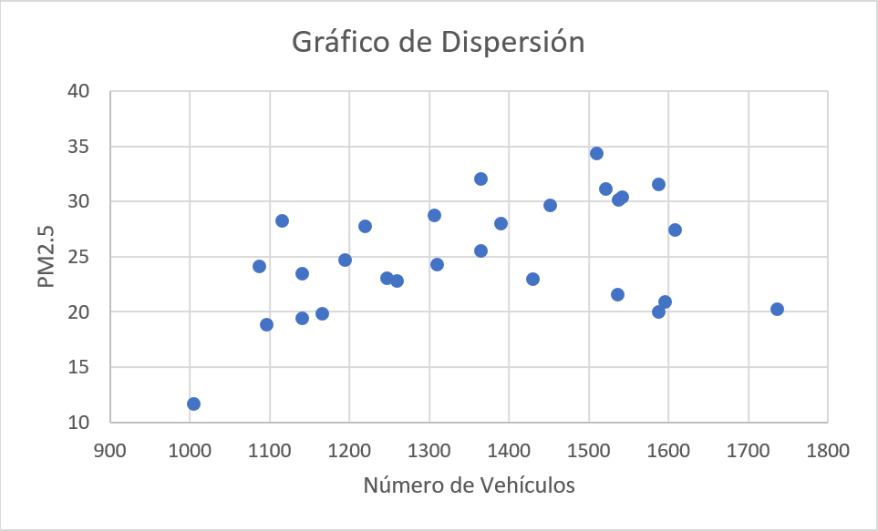
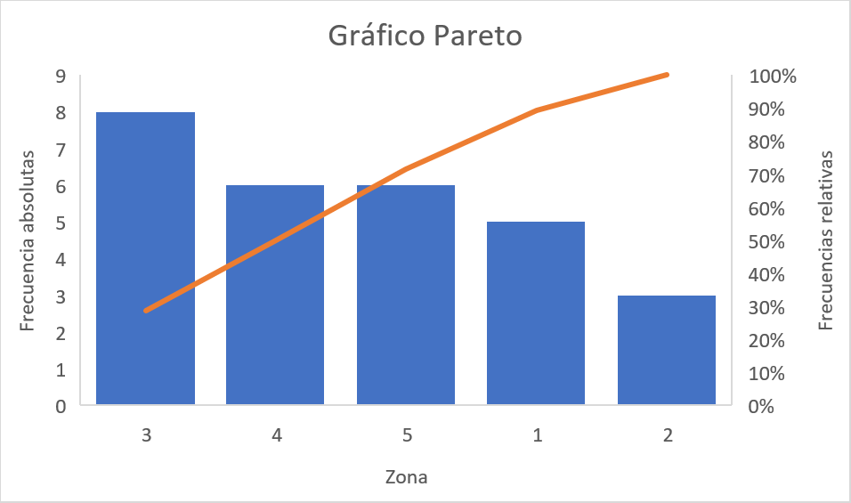
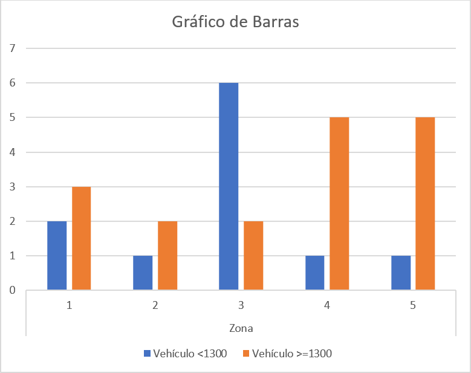
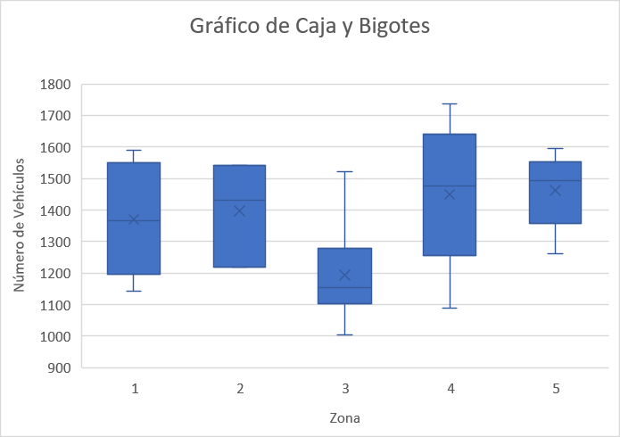

```{r knitr_init, echo=FALSE, cache=FALSE}
library(knitr)
## Global options
opts_chunk$set(echo=TRUE,
               cache=TRUE,
               prompt=FALSE,
               tidy=TRUE,
               comment=NA,
               message=FALSE,
               warning=FALSE,
               fig.path = paste0("../../EspecializacionSocioeconomica/images/", "SesionEsp02"),
               cache.path = "../../EspecializacionSocioeconomica/cache/",
               cache = FALSE)
```

## Análisis gráfico
Otro aspecto importante del análisis descriptivo, es el que se realiza mediante análisis gráfico. **El análisis gráfico es una forma de simplificar lo tedioso y complejo de un conjunto de observaciones**, además de ser una forma más accesible de presentación de la información cuando se tienen muchas variables, puesto que permiten mostrar el comportamiento de los datos presentados, y hacer juicios respecto a su tendencia central, variabilidad, formas, patrones, tendencias, etc.

El análisis gráfico, puede ser dividido en  

* Gráficos para variables cuantitativa
* Gráficos para variables cualitativas
* Gráficos para cruces entre variables cuantitativas y cualitativas

En la siguiente tabla se hace un resumen de qué gráficos pueden ser apropiados para usar en cada uno de los casos

<table class="table table-striped" style="width: auto !important; margin-left: auto; margin-right: auto;"><thead>
  <tr>
   <th style="text-align:left;"> Categoría</th>
   <th style="text-align:left; text-align: center" colspan="3"> Tipo de Gráficos </th>
  </tr>
 </thead>
<tbody>
<tr>
<td style="text-align:left;"> <a href="http://jiperezga.github.io/EspecializacionSocioeconomica/EspSocProySesion02.html#una-variable-cuantitativa" style="
    color: #ffffff;
"><b><u>Una Cuantitativa</u></b></a></td>
<td style="text-align:center;"><a href="http://jiperezga.github.io/EspecializacionSocioeconomica/EspSocProySesion02.html#gráfico-de-caja-y-bigotes" style="color: #ffffff;">Gráfico de caja y bigotes</a></td>
<td style="text-align:center;"><a href="http://jiperezga.github.io/EspecializacionSocioeconomica/EspSocProySesion02.html#histograma" style="color: #ffffff;">Histograma</a></td>
<td style="text-align:center;"></td>
</tr>
<tr>
<td style="text-align:left;"> <a href="https://jiperezga.github.io/EspecializacionSocioeconomica/EspSocProySesion02.html#dos-variables-cuantitativas" style="
    color: #ffffff;
"><b><u>Dos Cuantitativas</u></b></a></td>
<td style="text-align:center;"><a href="http://jiperezga.github.io/EspecializacionSocioeconomica/EspSocProySesion02.html#diagrama-de-dispersión" style="color: #ffffff;">Diagrama de dispersión</a></td>
<td style="text-align:center;"></td>

<td style="text-align:center;">
</td>
</tr>
<tr>
<td style="text-align:left;"> <a href="https://jiperezga.github.io/EspecializacionSocioeconomica/EspSocProySesion02.html#una-variable-cualitativa" style="
    color: #ffffff;
"><b><u>Una Cualitativa</u></b></a></td>
<td style="text-align:center;"><a href="http://jiperezga.github.io/EspecializacionSocioeconomica/EspSocProySesion02.html#gráfico-de-barras" style="color: #ffffff;">Gráfico de
barras</a></td>
<td style="text-align:center;"><a href="http://jiperezga.github.io/EspecializacionSocioeconomica/EspSocProySesion02.html#gráfico-de-pareto" style="color: #ffffff;">Gráfico de
pareto</a></td>
<td style="text-align:center;"><a href="http://jiperezga.github.io/EspecializacionSocioeconomica/EspSocProySesion02.html#gráfico-de-pastel" style="color: #ffffff;">Gráfico de
pastel</a></td>
</tr>
<tr>
<td style="text-align:left;"> <a href="https://jiperezga.github.io/EspecializacionSocioeconomica/EspSocProySesion02.html#dos-variables-cualitativas" style="
    color: #ffffff;
"><b><u>Dos Cualitativas</u></b></a></td>
<td style="text-align:center;"><a href="http://jiperezga.github.io/EspecializacionSocioeconomica/EspSocProySesion02.html#gráfico-de-barras-1" style="color: #ffffff;">Gráfico de barras</a></td>
<td style="text-align:center;"></td>
<td style="text-align:center;"></td>
</tr>
<tr>
<td style="text-align:left;"> <a href="https://jiperezga.github.io/EspecializacionSocioeconomica/EspSocProySesion02.html#cualitativa---cuantitativa" style="
    color: #ffffff;
"><b><u>Cualitativa - Cuantitativa</u></b></a></td>
<td style="text-align:center;"><a href="http://jiperezga.github.io/EspecializacionSocioeconomica/EspSocProySesion02.html#gráfico-de-caja-y-bigotes-1" style="color: #ffffff;">Gráfico de caja y bigotes</a></td>
<td style="text-align:center;"></td>
<td style="text-align:center;"></td>
</tr>
</tbody>
</table>

### Una variable cuantitativa

#### Gráfico de caja y bigotes
Este gráfico sirve para presentar de forma visual, datos numéricos a través de sus cuartiles, además de presentar otras **características importantes, tales como el valor de los cuartiles, dispersión, simetría y datos potencialmente atípicos**.

<h4 align="center"> Representación de un Gráfico de Caja y Bigotes </h4>


Este gráfico puede ser realizado en <tt>Excel</tt> en la pestaña Insertar>Gráficos>Insertar Gráficos de Estadística>Cajas y Bigotes. 

<button id="Show14" class="btn btn-secondary">Mostrar gráfico de caja y bigotes</button>
<button id="Hide14" class="btn btn-info">Ocultar gráfico de caja y bigotes</button>
<main id="botoncito14"> 
<h3 data-toc-skip> Ejercicio caso de estudio</h3> 
<p>Construya un diagrama de caja y bigotes para el número de automóviles que transitan por la avenida Guayabal sur-norte en un día. </p>

<h3 data-toc-skip> Solución </h3> 
<h4 data-toc-skip> Gráfico de Caja y Bigotes </h4> 
<p></p>

<h3 data-toc-skip> Interpretación </h3> 

<p> En el diagrama de caja y bigotes se aprecia que la mediana del número de automóviles que transitan por la avenida gauyaban en un día se encuentra alrededor de $1350$ vehículos, en donde el primer y tercer cuartil (percentil $25\%$ y $75\%$ se encuentran cercanos a $1200$ y $1550$ vehículos, respectivamente. No se aprecian observaciones extremas por fuera de los bigotes del gráfico y se observa un comportamiento simétrico, pues se aprecia que la mediana se encuentra relativamente central respecto al primer y tercer cuartil y que la media y la mediana se encuentran muy cercanas.
</p>

</main>

#### Histograma
Este gráfico muestra la distribución de frecuencia o densidades del grupo de observaciones, **brinda información sobre el valor más probables, la dispersión, la asimetría y valores extremos**. Adicionalmente, tiene la ventaja de que su interpretación es muy intuitiva y por tanto es de los gráficos más preferidos para resumir información. Este gráfico puede ser realizado en <tt>Excel</tt> en la pestaña Insertar>Gráficos>Insertar Gráficos de Estadística>Histograma. 

<button id="Show15" class="btn btn-secondary">Mostrar histograma</button>
<button id="Hide15" class="btn btn-info">Ocultar histograma</button>
<main id="botoncito15"> 
<h3 data-toc-skip> Ejercicio caso de estudio</h3> 
<p>Construya un histograma para el número de automóviles que transitan por la avenida Guayabal sur-norte en un día. </p>

<h3 data-toc-skip> Solución </h3> 
<h4 data-toc-skip> Histograma </h4> 
<p></p>

<h3 data-toc-skip> Interpretación </h3> 

<p> En la primera figura, se aprecia que en este caso el histograma realiza agrupaciones para el número de vehículos que transitan por la avenida Guayabal en un día, con categorías que posee distancias entre $122$ vehículos, en donde se evidencia que el número de registros que se encuentra entre $1493-1615$ vehículos, poseen la mayor frecuencia con un total de $9$ registros. También se puede observar que la frecuencia de observaciones que se encuentra en las tres primeras categorías es casi igual a la que se encuentra en las tres últimas categorías, con lo cual podría pensarse que el número de vehículos que transitan por la avenida Guayabal posee un comportamiento relativamente simétrico. </p>
</main>

### Dos variables cuantitativas

#### Diagrama de dispersión
Este gráfico se emplea para hacer cruces entre dos variables cuantitativas, y **sirve para ver tendencias y relaciones entre dos variables cuantitativas, además de permitir apreciar donde se centra el total de observaciones, y detección de datos atípicos** dados dos atributos cuantitativos. Este gráfico puede ser realizado en <tt>Excel</tt> en la pestaña Insertar>Gráficos>Insertar Gráficos de Dispersión>Dispersión. 

<button id="Show16" class="btn btn-secondary">Mostrar gráfico de dispersión</button>
<button id="Hide16" class="btn btn-info">Ocultar gráfico de dispersión</button>
<main id="botoncito16"> 
<h3 data-toc-skip> Ejercicio caso de estudio</h3> 
<p>Construya un histograma para el número de automóviles que transitan por la avenida Guayabal sur-norte en un día. </p>

<h3 data-toc-skip> Solución </h3> 
<h4 data-toc-skip> Gráfico de Dispersión </h4> 
<p></p>

<h3 data-toc-skip> Interpretación </h3> 

<p>En el gráfico de dispersión anterior, se aprecia una relación positiva entre el número de vehículos que transitan por la avenida guayaban por día y la cantidad de material particulado $2.5$, pues es posible observar que el conjunto de observaciones tiene una leve tendencia creciente a medida que aumenta una de las variables. Adicionalmente, no se observa gran dispersión entre el conjunto de observaciones, ni se detectan de datos atípicos entre los puntos, debido a que no hay una separación significativa entre éstos.
</p>
</main>


### Una variable cualitativa

#### Gráfico de barras
Sirve para resumir una cualitativas mediante barras de frecuencias absolutas o relativas. Éste **permite observar la concentración de observaciones en una o más categorías diferentes**. Este gráfico puede ser realizado en <tt>Excel</tt> en la pestaña Insertar>Gráficos>Insertar Gráficos de Columnas o Barras>Columnas agrupadas. 

Para realizar estas gráficas deben usarse una tabla de frecuencias, la cual puede ser construida en <tt>Excel</tt> mediante la función `FRECUENCIA()`, guardando la función con la secuencia <tt>Ctrl+Shift+Enter</tt>, con la función `CONTAR.SI()` o con una tabla dinámica.

<button id="Show17" class="btn btn-secondary">Mostrar gráfico de barras</button>
<button id="Hide17" class="btn btn-info">Ocultar gráfico de barras</button>
<main id="botoncito17"> 
<h3 data-toc-skip> Ejercicio caso de estudio</h3> 
<p>Construya un gráfico de barras para la zona en donde fue realizada la medición, del número de automóviles que transitan por la avenida Guayabal sur-norte en un día. </p>

<h3 data-toc-skip> Solución </h3> 

<h4 data-toc-skip> Tabla de Frecuencias </h4> 
<p></p>

<h4 data-toc-skip> Gráfico de Barras </h4> 
<p></p>

<h3 data-toc-skip> Interpretación </h3> 

<p>En el gráfico de barras, se observa que de los $28$ días en los cuales se realizaron los registros del número de vehículos, la mayoría de los días se realizó el registro en la zona $3$ con un total de $8$ días, seguido de las zonas $4$ y $5$ con un total de $6$ días, la zona $1$ con un total de $5$ días y finalmente la zona $2$ con un total de $3$ días.
</p>
</main>

#### Gráfico de pareto
Este gráfico es similar al gráfico de barras para una sola variable cualitativa, pero con la ventaja de que **presenta las frecuencias absolutas, relativas, y las frecuencias acumuladas absolutas y acumuladas relativas en el mismo gráfico**. Este gráfico puede ser realizado en <tt>Excel</tt> en la pestaña Insertar>Gráficos>Insertar Gráficos de Estadística>Pareto. 

Para realizar estas gráficas deben usarse una tabla de frecuencias, la cual puede ser construida en <tt>Excel</tt> mediante la función `FRECUENCIA()`, guardando la función con la secuencia <tt>Ctrl+Shift+Enter</tt>, con la función `CONTAR.SI()` o con una tabla dinámica.


<button id="Show18" class="btn btn-secondary">Mostrar gráfico de Pareto</button>
<button id="Hide18" class="btn btn-info">Ocultar gráfico de Pareto</button>
<main id="botoncito18"> 
<h3 data-toc-skip> Ejercicio caso de estudio</h3> 
<p>Construya un gráfico Pareto para la zona en donde fue realizada la medición, del número de automóviles que transitan por la avenida Guayabal sur-norte en un día. </p>

<h3 data-toc-skip> Solución </h3> 

<h4 data-toc-skip> Tabla de Frecuencias </h4> 
<p></p>

<h4 data-toc-skip> Gráfico de Barras </h4> 
<p></p>

<h3 data-toc-skip> Interpretación </h3> 

<p>El gráfico Pareto anterior agregada diferente información sobre la zona en donde se realizó el registro del número de automóviles que transitan por la avenida Guayabal sur-norte en un día, en donde, en el eje izquierdo se observa el valor de las frecuencias absolutas, mientras que en el eje derecho se observa el valor de las frecuencias relativas. Las barras representan las frecuencias absolutas, mientras que la línea representa las frecuencias relativas.<br>
<br>
En dicho gráfico se aprecia que la zona en la cual se realizó la mayor cantidad de registros fue en la zona $3$ con un total de $8$ registros, lo cual equivale al $28.57\%$ del total de los registros, mientras que la menor cantidad de registros se realizó en la zona $2$ con un total de $3$ registros, lo cual equivale al $10.71\%$ del total de los registros.
</p>

</main>

#### Gráfico de pastel
Este gráfico también **sirve para representar gráficamente las tablas de frecuencias absolutas y relativas para una variable cualitativa**. Este gráfico puede ser realizado en <tt>Excel</tt> en la pestaña Insertar>Gráficos>Insertar Gráficos Circular o de Anillos>Circular. 

Para realizar estas gráficas deben usarse una tabla de frecuencias, la cual puede ser construida en <tt>Excel</tt> mediante la función `FRECUENCIA()`, guardando la función con la secuencia <tt>Ctrl+Shift+Enter</tt>, con la función `CONTAR.SI()` o con una tabla dinámica.

<button id="Show19" class="btn btn-secondary">Mostrar gráfico de pastel</button>
<button id="Hide19" class="btn btn-info">Ocultar gráfico de pastel</button>
<main id="botoncito19"> 
<h3 data-toc-skip> Ejercicio caso de estudio</h3> 
<p>Construya un gráfico de Pastel para la zona en donde fue realizada la medición, del número de automóviles que transitan por la avenida Guayabal sur-norte en un día. </p>

<h3 data-toc-skip> Solución </h3> 

<h4 data-toc-skip> Tabla de Frecuencias </h4> 
<p></p>

<h4 data-toc-skip> Gráfico de Barras </h4> 
<p></p>

<h3 data-toc-skip> Interpretación </h3> 

<p>En el gráfico anterior, se presenta la proporción de días que se realizó el conteo de vehículos que transitan por la avenida Guayabal sur-norte en un día, en donde el gráfico de pastel representa el $100\%$ de los días registrados, y cada triángulo del gráfico la proporción asociada a cada una de las zonas. En donde, se observa que las proporciones observadas para los registros realizados por zona es respectivamente para las zonas $1$, $2$, $3$, $4$ y $5$ del $18\%$, $11\%$, $29\%$, $21\%$ y $21\%$.
</p>
</main>

### Dos variables cualitativas

#### Gráfico de barras
El gráfico de barras también sirve para resumir dos variable cualitativa mediante barras de frecuencias absolutas o relativas. **La interpretación, será la misma que para una sola variable cualitativa, con la diferencia de que en este caso, se podrán hacer comparaciones por categorías adicionales.** Este gráfico puede ser realizado en <tt>Excel</tt> en la pestaña Insertar>Gráficos>Insertar Gráficos de Columnas o Barras>Columnas agrupadas. 

Para realizar estas gráficas deben usarse una tabla de frecuencias, la cual puede ser construida en <tt>Excel</tt> mediante la función `CONTAR.SI.COJUNTO()` o con una tabla dinámica.

<button id="Show20" class="btn btn-secondary">Mostrar gráfico de barras para dos variables</button>
<button id="Hide20" class="btn btn-info">Ocultar gráfico de barras para dos variables</button>
<main id="botoncito20"> 
<h3 data-toc-skip> Ejercicio caso de estudio</h3> 
<p>Construya un gráfico de barras para la zona en donde fue realizada la medición, del número de automóviles que transitan por la avenida Guayabal sur-norte en un día y la cantidad de días en que el número de vehículos que transita por la avenida Guayabal es menor a $1300$ o mayor o igual a $1300$. </p>

<h3 data-toc-skip> Solución </h3> 

<h4 data-toc-skip> Tabla de Frecuencias Conjunta </h4> 
<p></p>

<h4 data-toc-skip> Gráfico de Barras </h4> 
<p></p>

<h3 data-toc-skip> Interpretación </h3> 

<p>En el gráfico de barras para el cruce entre la zona donde se realizaron los registros y el número de veces que se registraron menos o al menos $1300$ vehículos, se observa que solo en la zona $3$ se evidencia que el número de  días en los cuales el número de vehículos que transitan por la avenida Guayabal menores a $1300$ es superior a cuando transitan al menos $1300$, lo cual puede significar que la zona $3$ es un cruce con menor transito con los demás, tal vez por estar luego de un puente o debido a que la zona $3$ se seleccionó días de baja afluencia como un domingo o días festivos.
</p>
</main>

### Cualitativa - Cuantitativa

#### Gráfico de caja y bigotes
Este gráfico sirve para presentar de forma visual, datos numéricos **por categorías** a través de sus cuartiles, además de presentar **otras características importantes, tales como la dispersión, simetría y datos potencialmente atípicos**. Este gráfico puede ser realizado en <tt>Excel</tt> en la pestaña Insertar>Gráficos>Insertar Gráficos de Estadística>Cajas y Bigotes.

<button id="Show21" class="btn btn-secondary">Mostrar gráfico de caja y bigotes</button>
<button id="Hide21" class="btn btn-info">Ocultar gráfico de caja y bigotes</button>
<main id="botoncito21"> 
<h3 data-toc-skip> Ejercicio caso de estudio</h3> 
<p>Construya un gráfico de caja y bigotes para el número de vehículos que transitan por la avenida Guayabal por día y la zona donde fue registrada.</p>

<h3 data-toc-skip> Solución </h3> 

<h4 data-toc-skip> Gráfico de Barras </h4> 
<p></p>

<h3 data-toc-skip> Interpretación </h3> 

<p>En el gráfico anterior, se hace una comparación entre el número de vehículos que transitan por la avenida Guayabal en un día y la zona donde se realizó el registro del número de vehículos. En éste se aprecia que de las $5$ zonas, la zona $3$ es la única que tiene una media y una mediana inferior a las demás zonas. <br>
<br>
Adicionalmente, se evidencia que de las $5$ zonas, la zona $4$ es la que presenta mayor variabilidad, mientras que las zonas $3$ y $4$ son la que posee datos más alejados respecto al $50\%$ central de los datos.<br>
<br>
Finalmente, puede notarse que no se evidencia ningún punto en la parte superior o inferior de los bigotes de las diferentes cajas, lo cual quiere decir, que no se identificaron datos extremos para ninguna de las zonas registradas.
</p>

</main>

