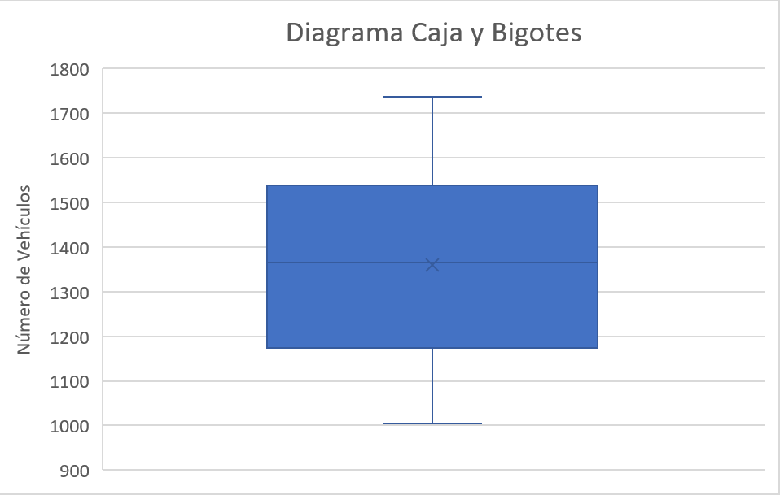
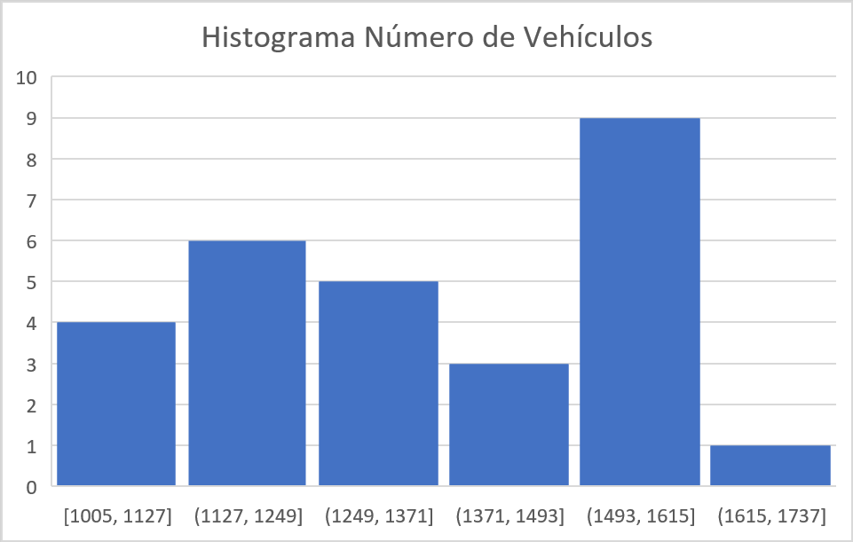
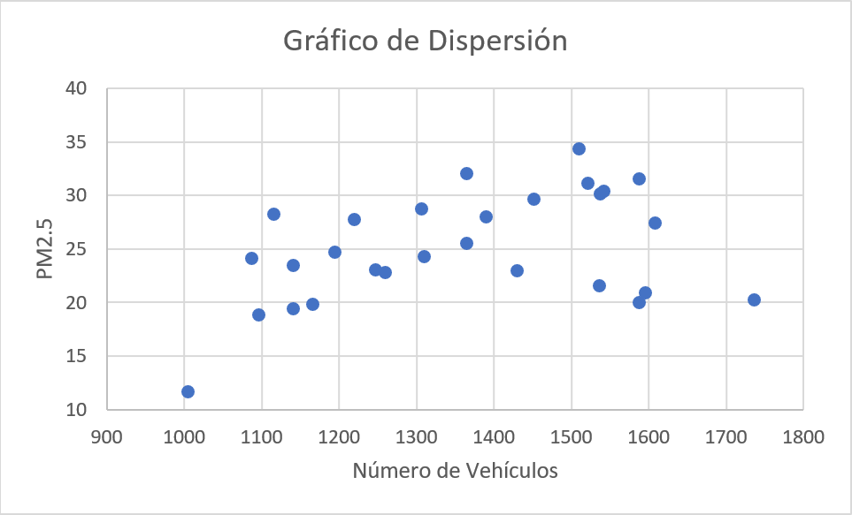
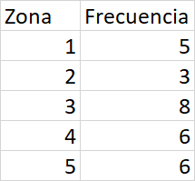
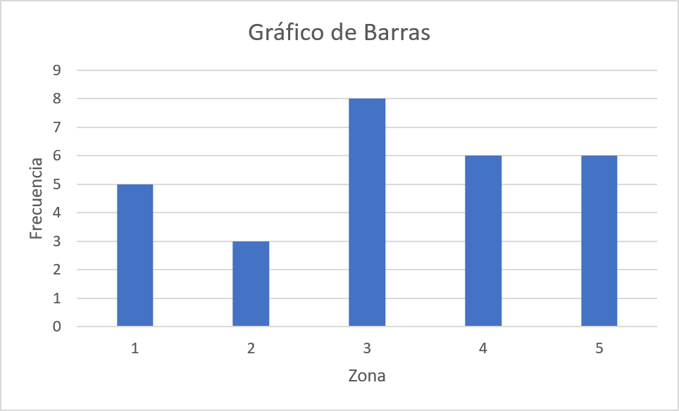
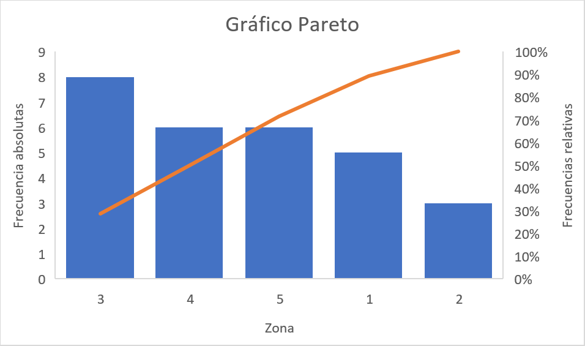
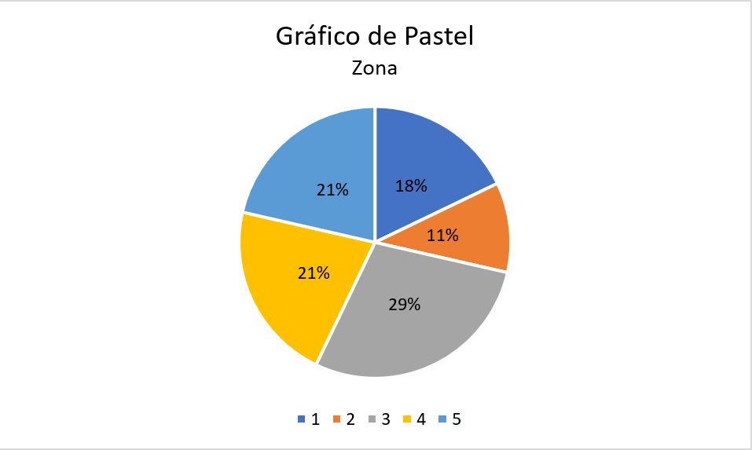
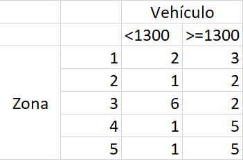
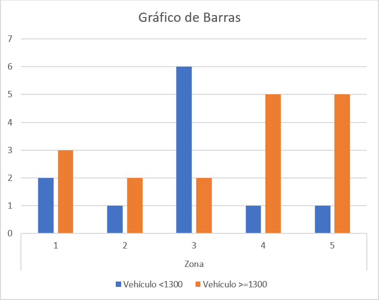
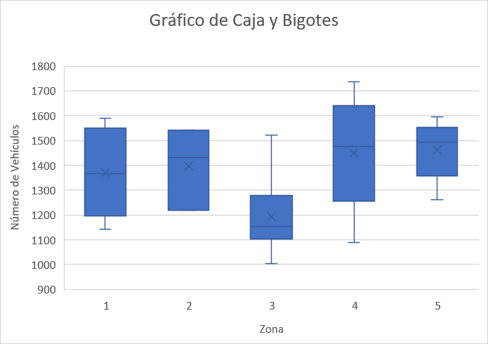

```{r knitr_init, echo=FALSE, cache=FALSE}
library(knitr)
## Global options
opts_chunk$set(echo=TRUE,
               cache=TRUE,
               prompt=FALSE,
               tidy=TRUE,
               comment=NA,
               message=FALSE,
               warning=FALSE,
               fig.path = paste0("../../EspecializacionSocioeconomica/images/", "SesionEsp01"),
               cache.path = "../../EspecializacionSocioeconomica/cache/",
               cache = FALSE)
```

## La estadística en la evaluación socioeconómica de proyectos

La evaluación socioeconómica de proyecto es una herramienta de planeación que busca **identificar, cuantificar y valorar los costos y beneficios** generados por un proyecto en el bienestar de la sociedad y **determinar el efecto y la rentabilidad** de las inversiones sobre la población afectada por el proyecto, con el fin de decidir mediante juicios objetivos y técnicos la conveniencia de ejecutar dicho proyecto.

@Thomas2008[, p. 51] señala que **para decidir si un proyecto es o no rentable** en términos del ingreso nacional **debe observarse los beneficios y los costos sociales anuales brutos** del proyecto, en donde el primero se mide mediante el aumento que dicho proyecto provoque en el ingreso nacional, mientras que el segundo se mide mediante el ingreso nacional sacrificado por el hecho de haber efectuado este proyecto en lugar de otro, en donde **el objetivo será que la rentabilidad del proyecto sea mayor o igual que obtenido al ejecutar un proyecto alternativo**.

**Es aquí donde el análisis estadístico toma relevancia** dentro de la evaluación de proyectos, puesto que, permite al investigador realizar análisis cualitativos o cuantitativos dentro de la gestión de un proyecto para la toma de decisiones, ya que al emplear herramientas estadísticas éste puede cuantificar el riesgo y la incertidumbre que tiene un proyecto, además de permitirle calcular diferentes probabilidades asociadas a partir de distribuciones de probabilidad.

## Introducción a la Estadística

La Estadística es una **herramienta** ampliamente utilizada en diferentes disciplinas científicas, debido a su gran potencial para **recolectar, analizar, interpretar, estimar y presentar** de forma amigable, la información que se genera en las distintas áreas del conocimiento, para así **poder argumentar y soportar de mejor manera las investigaciones realizadas, y/o mejorar los resultados obtenidos en la toma de decisiones**. 

Adicionalmente, la estadística tiene como ventaja respecto a otras áreas, que permite extraer información de **variables tanto númerica como categórica** de la población de interés o de una muestra de la misma, permitiendo al investigador establecer conclusiones acerca de la misma población, o de alguno de los parámetros que la conforman. Y es debido a ésto, que puede considerarse a la estadística como **uno de los pilares fundamental** dentro de la investigación científica teórica y aplicada.

En general, el análisis estadístico puede dividirse en dos partes:

* La **Estadística descriptiva**, la cual se encarga de resumir la información suministrada mediante el empleo de tablas, gráficas y medidas numéricas, junto con el análisis de las mismas, para facilitar la interpretación y la presentación de la información.
* La **Inferencia estadística**, la cual se encarga de la inferencias, modelamiento y predicción de la información, para facilitar la obtención de conclusiones y toma decisiones.

## Estadística descriptiva
En general, la importancia del análisis estadístico radica en la **resolución de problemas vinculados con datos**, en donde la variabilidad de los mismos es quién guiará la importancia del empleo de diferentes técnicas para el manejo de la información. Desde este punto de vista, se discute en esta sección sobre la implementación de resúmenes de información, así como la presentación por medio de cuadros, diagramas o gráficos, cálculo y uso de medidas estadísticas de tendencia central, localización, variabilidad y forma.

Un aspecto importante a tener en cuenta al realizar análisis estadísticos, es señalado por @Esquivel2016[, p. 29],  el cual menciona que dentro de un análisis con información estadística, se debe tener en cuenta las siguientes etapas: 

1. **Leer entre los datos**: que consiste en llevar a cabo una lectura literal de la información, sin interpretar su contenido.
2. **Leer dentro de los datos**: implica no solamente interpretar los datos sino integrarlos dentro del contexto.
3. **Leer más allá de los datos**: significa tomar los datos como referente para identificar patrones que transciendan el grupo de datos observado, ya sea mediante la interpolación o extrapolación de resultados.
4. **Leer detrás de los datos**: consiste en llevar a cabo un análisis crítico de la información que se estudia, esto implica analizar integralmente el problema, desde su origen, el tipo de dato que se utiliza, su validez y fiabilidad para analizar el problema y la posibilidad de generalizar los hallazgos.

### Tipos de datos
En términos generales, los datos son cualquier pieza de información recolectada del fenómeno que se pretende analizar, y que, dependiendo de las características que posean, deben clasificarse dentro de una determinada categoría.

* **Cuantitativos**: Son datos que pueden ser medidos o cuantificados. Estos se subdividen en dos categorías:
  * **Datos cuantitativos discretos**: Son aquellos datos que provienen de procesos que involucran conteos, y por tanto, solo pueden tomar valores enteros. Por ejemplo: __El número de automóviles que transitan por la carretera que conecta dos pueblos; El número de pacientes que llega a la Unidad de Cuidados Intensivos de un Hospital__
  - **Datos cuantitativos continuos**: Son aquellos datos que provienen de procesos que involucran mediciones, y por tanto, solo pueden tomar cualquier valor real dentro de un intervalo. Por ejemplo: __El tiempo que tarda una ambulancia en recoger un paciente y llevarlo a un hospital; el valor de la mercancía que transita por una zona__
* **Cualitativos**: Son datos asociados a una cualidad o propiedad, y por tanto, no pueden representarse numéricamente, a pesar de poder caracterizarse alfanuméricamente. Por ejemplo: __Estrato socioeconómico, nivel de aceptación de la población por el planteamiento de una obra pública__
* **Lógicos**: Son datos asociados a valores de lógica binaria, usualmente denotados como Verdadero y Falso, o Éxito y Fracaso. Por ejemplo: __Zona costera, El proyecto es de interés social__

## Medidas estadísticas
Las medidas estadísticas tienen por objetivo resumir la información contenida en un conjunto de datos, en pocos valores numéricos que representan diferentes características. Estas medidas estadísticas nos darán información sobre la situación, dispersión, forma, asociación que posee un conjunto de datos de manera que sea posible captar rápidamente la estructura de los mismos.

#### Caso de estudio
Suponga que se está interesado en la construcción de una nueva vía sur-norte para la avenida Guayabal y para ello debe registrarse el número de vehículos que transitan dicha vía por día. Si se toma de referencia un total de `$28$` días obteniendo los siguientes resultados

```{r echo=FALSE}
options(scipen = 20)
# Se guardan los datos en R
set.seed(1752)
datos <- round(rnorm(n = 28, mean = 1259, sd = 250))
PM25 <- round(10 + 0.01 * datos + rnorm(28)*5, 2)
zona <- sample(1:5, 28, T)
```

<pre style="font-family: 'Open Sans',sans-serif; margin-bottom: -4rem; margin-top: -2rem; font-size: 120%;">
<table class="table table-striped" style="width: auto !important; margin-left: auto; margin-right: auto;">
<tbody>
  <tr>
    <td>`r datos[1]`</td>
    <td>`r datos[2]`</td>
    <td>`r datos[3]`</td>
    <td>`r datos[4]`</td>
    <td>`r datos[5]`</td>
    <td>`r datos[6]`</td>
    <td>`r datos[7]`</td>
    <td>`r datos[8]`</td>
    <td>`r datos[9]`</td>
    <td>`r datos[10]`</td>
  </tr>
  <tr>
    <td>`r datos[11]`</td>
    <td>`r datos[12]`</td>
    <td>`r datos[13]`</td>
    <td>`r datos[14]`</td>
    <td>`r datos[15]`</td>
    <td>`r datos[16]`</td>
    <td>`r datos[17]`</td>
    <td>`r datos[18]`</td>
    <td>`r datos[19]`</td>
    <td>`r datos[20]`</td>
  </tr>
  <tr>
    <td>`r datos[21]`</td>
    <td>`r datos[22]`</td>
    <td>`r datos[23]`</td>
    <td>`r datos[24]`</td>
    <td>`r datos[25]`</td>
    <td>`r datos[26]`</td>
    <td>`r datos[27]`</td>
    <td>`r datos[28]`</td>
    <td></td>
    <td></td>
  </tr>
</tbody>
</table>
</pre>

adicionalmente se decide medir el material particulado `$2.5$` `$PM_{2.5}$` generado en estos días, obteniendo los siguientes resultados

<pre style="font-family: 'Open Sans',sans-serif; margin-bottom: -4rem; margin-top: -2rem; font-size: 120%;">
<table class="table table-striped" style="width: auto !important; margin-left: auto; margin-right: auto;">
<tbody>
  <tr>
    <td>`r PM25[1]`</td>
    <td>`r PM25[2]`</td>
    <td>`r PM25[3]`</td>
    <td>`r PM25[4]`</td>
    <td>`r PM25[5]`</td>
    <td>`r PM25[6]`</td>
    <td>`r PM25[7]`</td>
    <td>`r PM25[8]`</td>
    <td>`r PM25[9]`</td>
    <td>`r PM25[10]`</td>
  </tr>
  <tr>
    <td>`r PM25[11]`</td>
    <td>`r PM25[12]`</td>
    <td>`r PM25[13]`</td>
    <td>`r PM25[14]`</td>
    <td>`r PM25[15]`</td>
    <td>`r PM25[16]`</td>
    <td>`r PM25[17]`</td>
    <td>`r PM25[18]`</td>
    <td>`r PM25[19]`</td>
    <td>`r PM25[20]`</td>
  </tr>
  <tr>
    <td>`r PM25[21]`</td>
    <td>`r PM25[22]`</td>
    <td>`r PM25[23]`</td>
    <td>`r PM25[24]`</td>
    <td>`r PM25[25]`</td>
    <td>`r PM25[26]`</td>
    <td>`r PM25[27]`</td>
    <td>`r PM25[28]`</td>
    <td></td>
    <td></td>
  </tr>
</tbody>
</table>
</pre>

y la zona en la cual se realizó la medición 
<pre style="font-family: 'Open Sans',sans-serif; margin-bottom: -4rem; margin-top: -2rem; font-size: 120%;">
<table class="table table-striped" style="width: auto !important; margin-left: auto; margin-right: auto;">
<tbody>
  <tr>
    <td>`r zona[1]`</td>
    <td>`r zona[2]`</td>
    <td>`r zona[3]`</td>
    <td>`r zona[4]`</td>
    <td>`r zona[5]`</td>
    <td>`r zona[6]`</td>
    <td>`r zona[7]`</td>
    <td>`r zona[8]`</td>
    <td>`r zona[9]`</td>
    <td>`r zona[10]`</td>
  </tr>
  <tr>
    <td>`r zona[11]`</td>
    <td>`r zona[12]`</td>
    <td>`r zona[13]`</td>
    <td>`r zona[14]`</td>
    <td>`r zona[15]`</td>
    <td>`r zona[16]`</td>
    <td>`r zona[17]`</td>
    <td>`r zona[18]`</td>
    <td>`r zona[19]`</td>
    <td>`r zona[20]`</td>
  </tr>
  <tr>
    <td>`r zona[21]`</td>
    <td>`r zona[22]`</td>
    <td>`r zona[23]`</td>
    <td>`r zona[24]`</td>
    <td>`r zona[25]`</td>
    <td>`r zona[26]`</td>
    <td>`r zona[27]`</td>
    <td>`r zona[28]`</td>
    <td></td>
    <td></td>
  </tr>
</tbody>
</table>
</pre>

### Medidas de tendencia central
Estas medidas tienen por objetivo buscar valores que muestren el lugar en el cual se encuentra el centro de un conjunto de observaciones. Si se define `$x_1, x_2, \ldots, x_n$` como un conjunto de `$n$` observaciones, entonces 

#### Media
Es el promedio numérico de las `$n$` observaciones.
`\begin{align*}
  \bar{X}=\sum_{i=1}^n\frac{x_i}{n}
\end{align*}`

En <tt>Excel</tt>, puede calcularse el valor promedio de un conjunto de observaciones mediante la función `PROMEDIO()`.

<button id="Show2" class="btn btn-secondary">Mostrar Ejercicio</button>
<button id="Hide2" class="btn btn-info">Ocultar Ejercicio</button>
<main id="botoncito2"> 
<h3 data-toc-skip> Ejercicio caso de estudio</h3> 
<p>Calcule el número promedio de automóviles que transitan por la avenida Guayabal sur-norte en un día. </p>

<h3 data-toc-skip> Solución </h3> 
<p>A partir de los datos se tiene entonces que el número promedio de automóviles que transitan por la avenida Guayabal es de
$$\begin{align*}
  \bar{X} &= \sum_{i=1}^n\frac{x_i}{n}\\
          &= \frac{`r datos[1]` + `r datos[2]` + `r datos[3]` + \ldots + `r datos[28]`}{28} \\
          &= `r mean(datos)`
\end{align*}$$

Lo anterior significa que, el número promedio de datos transitan por la avenida Guayabal en un día es igual a $`r mean(datos)`$ automóviles.</p>
</main>

#### Mediana
Es el valor que ocupa el lugar central en un conjunto de datos, es decir, el valor que divide el conjunto de observaciones en dos partes que contienen el `$50\%$` de las observaciones. Para realizar el cálculo de la mediana es necesario ordenar inicialmente el conjunto de observaciones de forma ascendente.
`\begin{align*}
  \tilde{X}=\begin{cases}x_{\left[\frac{(n+1)}{2}\right]} & \text{si } n \text{ es impar}\\\frac{1}{2}\left(x_{\left[\frac{n}{2}\right]}+x_{\left[\frac{n}{2}+1\right]}\right) & \text{si } n \text{ es par}\end{cases}
\end{align*}`
donde `$x_{\left[j\right]}$` representa la `$j$`-ésima observación ordenada.

En <tt>Excel</tt> puede calcularse la mediana de un conjunto de observaciones mediante la función `MEDIANA()`.

<button id="Show3" class="btn btn-secondary">Mostrar Ejercicio</button>
<button id="Hide3" class="btn btn-info">Ocultar Ejercicio</button>
<main id="botoncito3"> 
<h3 data-toc-skip> Ejercicio caso de estudio</h3> 
<p>Calcule la mediana obtenida del número de automóviles que transitan por la avenida Guayabal sur-norte en un día. </p>

<h3 data-toc-skip> Solución </h3> 
<p>Inicialmente, se observa que el número de días registrados fue de $28$, por lo cual, se tiene que $n$ es un número par, haciendo que la ecuación empleada sea

$$\begin{align*}
  \tilde{X} &= \frac{1}{2}\left(x_{\left[\frac{n}{2}\right]}+x_{\left[\frac{n}{2}+1\right]}\right) \\
            &= \frac{1}{2}\left(x_{\left[\frac{28}{2}\right]}+x_{\left[\frac{28}{2}+1\right]}\right) \\
            &= \frac{1}{2}\left(x_{\left[14\right]}+x_{\left[15\right]}\right)
\end{align*}$$

En donde se observa que debe localizarse la observación que ocupa la posición número $14$ y $15$ en los registros del número de vehículos que transitan por día <strong>luego de ordenarlas de menor a mayor</strong>. 

Realizando el ordenamiento se tendrá que</p>
```{r echo=FALSE}
datos2 <- sort(datos)
```
<pre style="font-family: 'Open Sans',sans-serif; margin-bottom: -4rem; margin-top: -2rem; font-size: 120%;">
<table class="table table-striped" style="width: auto !important; margin-left: auto; margin-right: auto;">
<tbody>
  <tr>
    <td>`r datos2[1]`</td>
    <td>`r datos2[2]`</td>
    <td>`r datos2[3]`</td>
    <td>`r datos2[4]`</td>
    <td>`r datos2[5]`</td>
    <td>`r datos2[6]`</td>
    <td>`r datos2[7]`</td>
    <td>`r datos2[8]`</td>
    <td>`r datos2[9]`</td>
    <td>`r datos2[10]`</td>
  </tr>
  <tr>
    <td>`r datos2[11]`</td>
    <td>`r datos2[12]`</td>
    <td>`r datos2[13]`</td>
    <td>`r datos2[14]`</td>
    <td><span style="border-radius: 4px; padding-right: 4px; padding-left: 4px; background-color: #974c55 !important;">`r datos2[15]`</span></td>
    <td><span style="border-radius: 4px; padding-right: 4px; padding-left: 4px; background-color: #974c55 !important;">`r datos2[16]`</span></td>
    <td>`r datos2[17]`</td>
    <td>`r datos2[18]`</td>
    <td>`r datos2[19]`</td>
    <td>`r datos2[20]`</td>
  </tr>
  <tr>
    <td>`r datos2[21]`</td>
    <td>`r datos2[22]`</td>
    <td>`r datos2[23]`</td>
    <td>`r datos2[24]`</td>
    <td>`r datos2[25]`</td>
    <td>`r datos2[26]`</td>
    <td>`r datos2[27]`</td>
    <td>`r datos2[28]`</td>
    <td></td>
    <td></td>
  </tr>
</tbody>
</table>
</pre>

<p>donde se observa que las observaciones $14$ y $15$ para el número de vehículos que transitan sur-norte por la avenida Guayabal es $x_{[14]}=`r datos2[14]`$ y $x_{[15]}=`r datos2[15]`$, respectivamente.<br> 
<br>
Con dichos valores se realiza entonces, el cálculo de la mediana, tal que </p>

$$\begin{align*}
  \tilde{X} &= \frac{1}{2}(`r datos2[14]`+ `r datos2[15]`) \\
            &=`r (datos2[14] + datos2[15])/2`
\end{align*}$$

<p>De lo anterior se obtiene que el $50\%$ inferior de los días transitan por la avenida Guayabal sur-norte a lo más $`r (datos2[14] + datos2[15])/2`$ vehículos, mientras que el $50\%$ superior de los días transitan por la avenida Guayabal sur-norte al menos $`r (datos2[14] + datos2[15])/2`$ vehículos.</p>
</main>

#### Moda
Es el valor que ocurre con mayor frecuencia en un conjunto de datos, es decir, es la observación que se repite con mayor frecuencia. Es de anotar que en un conjunto de observaciones, se puede tener más de una moda, en cuyo caso se dirá que el conjunto de datos es bimodal, trimodal o multimodal.

En <tt>Excel</tt> puede calcularse la moda de un conjunto de observaciones mediante la función `MODA.UNO()` para calcular el valor que más se repite, o la función `MODA.VARIOS()` para calcular una lista con los valores que más se repiten para el caso bimodal, trimodal o multimodal, guardando la función con la secuencia <tt>Ctrl+Shift+Enter</tt>.

<button id="Show4" class="btn btn-secondary">Mostrar Ejercicio</button>
<button id="Hide4" class="btn btn-info">Ocultar Ejercicio</button>
<main id="botoncito4"> 
<h3 data-toc-skip> Ejercicio caso de estudio</h3> 
<p>Calcule la moda del número de automóviles que transitan por la avenida Guayabal sur-norte en un día. </p>

<h3 data-toc-skip> Solución </h3> 
<p>Para encontrar el número modal de automóviles, es necesario localizar el número de vehículos que más se repita por día. Con el fin de ilustrar cual es este valor, se presenta nuevamente la tabla ordenada con el número de vehículos que transitaron cada uno de los $28$ días para facilitar su visualización. </p>

<pre style="font-family: 'Open Sans',sans-serif; margin-bottom: -4rem; margin-top: -2rem; font-size: 120%;">
<table class="table table-striped" style="width: auto !important; margin-left: auto; margin-right: auto;">
<tbody>
  <tr>
    <td>`r datos2[1]`</td>
    <td>`r datos2[2]`</td>
    <td>`r datos2[3]`</td>
    <td>`r datos2[4]`</td>
    <td><span style="border-radius: 4px; padding-right: 4px; padding-left: 4px; background-color: #974c55 !important;">`r datos2[5]`</span></td>
    <td><span style="border-radius: 4px; padding-right: 4px; padding-left: 4px; background-color: #974c55 !important;">`r datos2[6]`</span></td>
    <td>`r datos2[7]`</td>
    <td>`r datos2[8]`</td>
    <td>`r datos2[9]`</td>
    <td>`r datos2[10]`</td>
  </tr>
  <tr>
    <td>`r datos2[11]`</td>
    <td>`r datos2[12]`</td>
    <td>`r datos2[13]`</td>
    <td><span style="border-radius: 4px; padding-right: 4px; padding-left: 4px; background-color: #974c55 !important;">`r datos2[14]`</span></td>
    <td><span style="border-radius: 4px; padding-right: 4px; padding-left: 4px; background-color: #974c55 !important;">`r datos2[15]`</span></td>
    <td>`r datos2[16]`</td>
    <td>`r datos2[17]`</td>
    <td>`r datos2[18]`</td>
    <td>`r datos2[19]`</td>
    <td>`r datos2[20]`</td>
  </tr>
  <tr>
    <td>`r datos2[21]`</td>
    <td>`r datos2[22]`</td>
    <td>`r datos2[23]`</td>
    <td><span style="border-radius: 4px; padding-right: 4px; padding-left: 4px; background-color: #974c55 !important;">`r datos2[24]`</span></td>
    <td><span style="border-radius: 4px; padding-right: 4px; padding-left: 4px; background-color: #974c55 !important;">`r datos2[25]`</span></td>
    <td>`r datos2[26]`</td>
    <td>`r datos2[27]`</td>
    <td>`r datos2[28]`</td>
    <td></td>
    <td></td>
  </tr>
</tbody>
</table>
</pre>

<p> De la tabla anterior, se observa que estamos ante una situación trimodal en la cual los valores $`r datos2[5]`$, $`r datos2[14]`$ y $`r datos2[24]`$ son el número de vehículos que más se repiten en para los días registrados, ya que estos se repiten dos veces en el conjunto de observaciones.</p> 
</main>

### Medidas de localización
Estas medidas tienen por objetivo dividir un conjunto de datos ordenado en partes iguales, entendidas estas como intervalos que contienen la misma proporción de observaciones. Si se define `$x_{[1]}, x_{[2]}, \ldots, x_{[n]}$`, como un conjunto de `$n$` observaciones ordenadas en forma creciente, entonces 

#### Percentil
Son los **noventa y nueve valores** `$(j=1,2,\ldots,99)$`, que dividen a un conjunto de datos ordenados en **cien partes** iguales. Para ello, es necesario calcular inicialmente una variable `$h_j$` de posicionamiento dado el cuartil `$j$` de interés, tal que
`\begin{align*}
  h_j = \frac{j(n-1)}{100} + 1 \quad \quad j=1,2,\dots,99
\end{align*}`

y posteriormente, con éste valor se realiza el cálculo del cuartil de interés
`\begin{align*}
  P_j=x_{[\lfloor h_j\rfloor} + \left((h_j - \lfloor h_j\rfloor) \times  (x_{[\lfloor h_j\rfloor + 1]} - x_{\lfloor h_j\rfloor}) \right) \quad \quad j=1,2,\dots,99
\end{align*}`

siendo `$\lfloor h_j\rfloor$` el valor piso de `$h_j$`, **es decir, el entero de `$h$` aproximando siempre hacia abajo**.

En <tt>Excel</tt> puede calcularse el k-ésimo percentil de un conjunto de observaciones mediante la función `PERCENTIL.INC()` para calcular el valor que más se repite, o la función `MODA.VARIOS()` para calcular una lista con los valores que más se repiten para el caso bimodal, trimodal o multimodal, guardando la función con la secuencia <tt>Ctrl+Shift+Enter</tt>.

<button id="Show5" class="btn btn-secondary">Mostrar Ejercicio</button>
<button id="Hide5" class="btn btn-info">Ocultar Ejercicio</button>
<main id="botoncito5"> 
<h3 data-toc-skip> Ejercicio caso de estudio</h3> 
<p>Calcule el percentil $95$ del número de automóviles que transitan por la avenida Guayabal sur-norte en un día. </p>

<h3 data-toc-skip> Solución </h3> 
<p> Para realizar el cálculo del percentil número $j=95$, es necesario ordenar el número de automóviles que transitan por la avenida Guayabal por día, tal que </p>

<pre style="font-family: 'Open Sans',sans-serif; margin-bottom: -4rem; margin-top: -2rem; font-size: 120%;">
<table class="table table-striped" style="width: auto !important; margin-left: auto; margin-right: auto;">
<tbody>
  <tr>
    <td>`r datos2[1]`</td>
    <td>`r datos2[2]`</td>
    <td>`r datos2[3]`</td>
    <td>`r datos2[4]`</td>
    <td>`r datos2[5]`</td>
    <td>`r datos2[6]`</td>
    <td>`r datos2[7]`</td>
    <td>`r datos2[8]`</td>
    <td>`r datos2[9]`</td>
    <td>`r datos2[10]`</td>
  </tr>
  <tr>
    <td>`r datos2[11]`</td>
    <td>`r datos2[12]`</td>
    <td>`r datos2[13]`</td>
    <td>`r datos2[14]`</td>
    <td>`r datos2[15]`</td>
    <td>`r datos2[16]`</td>
    <td>`r datos2[17]`</td>
    <td>`r datos2[18]`</td>
    <td>`r datos2[19]`</td>
    <td>`r datos2[20]`</td>
  </tr>
  <tr>
    <td>`r datos2[21]`</td>
    <td>`r datos2[22]`</td>
    <td>`r datos2[23]`</td>
    <td>`r datos2[24]`</td>
    <td>`r datos2[25]`</td>
    <td>`r datos2[26]`</td>
    <td>`r datos2[27]`</td>
    <td>`r datos2[28]`</td>
    <td></td>
    <td></td>
  </tr>
</tbody>
</table>
</pre>

<p>Con los datos ordenados, se realiza el cálculo para la variable de posicionamiento $h_j$, con $j=95$, dado que se posee un total de $28$ observaciones, tal que 
$$h_{95} = \frac{95(28-1)}{100} + 1 = 26.65$$
Al reemplazar el valor obtenido en la variable de posicionamiento, en la formula de percentiles, con $j=95$, obtenemos que 

$$\begin{align*}P_{95} &=x_{\lfloor h_{95}\rfloor} + \left((h_{95} - \lfloor h_{95}\rfloor) \times  (x_{[\lfloor h_{95}\rfloor + 1]} - x_{\lfloor h_{33}\rfloor}) \right) \\ &= x_{\lfloor 26.65\rfloor} + \left((26.65 - \lfloor 26.65\rfloor) \times  (x_{[\lfloor v\rfloor + 1]} - x_{\lfloor 26.65\rfloor}) \right) \\ & = x_{[26]} + \left((26.65 - 26) \times  (x_{[26+1]}-x_{[26]})\right) \\ &= x_{[26]} + \left(0.65 \times  (x_{[27]}-x_{[26]})\right)\end{align*}$$

En donde, $x_{[26]}=`r datos2[26]`$ y $x_{[27]}=`r datos2[27]`$, son las notas que ocupan la posición $26$ y $27$ en el conjunto de datos ordenados para el número de automóviles que transitan por la avenida Guayabal en un día. Finalmente, al reemplazar dichos valores en la ecuación de percentiles se tendrá que

$$\begin{align*}
  P_{95} &= `r datos2[26]` + \left(0.65 \times  (`r datos2[27]`-`r     datos2[26]`)\right)\\
  P_{95} &= `r datos2[26] + (0.65 *  (datos2[27] - datos2[26]))`
\end{align*}$$

De lo anterior, se podrá concluir que el $95\%$ inferior de los días transita una cantidad de automóviles menor o igual a $`r datos2[26] + (0.65 *  (datos2[27] - datos2[26]))`$, mientras que el $5\%$ superior de los días transita una cantidad mayor o igual a $`r datos2[26] + (0.65 *  (datos2[27] - datos2[26]))`$.</p>
</main>

### Medidas de dispersión
Estas medidas tienen por objetivo determinar la dispersión o variabilidad que posee un conjunto de observaciones, en donde, entre mayor sean estas medidas, mayor será el grado de dispersión de los datos. Si se define `$x_1, x_2, \ldots, x_n$` como un conjunto de `$n$` observaciones, entonces 

#### Varianza
Mide la distancia media **al cuadrado** del conjunto de datos respecto a la media
`\begin{align*}
  S^2=\frac{1}{n-1}\sum_{i=1}^n{(x_i-\bar{X})^2}
\end{align*}` <!--el n-1 se conoce como corrección de Bessel, y se realiza para corregir el sesgo del estimador-->

En <tt>Excel</tt> puede calcularse la varianza de un conjunto de observaciones mediante la función `VAR.S()`.

<button id="Show6" class="btn btn-secondary">Mostrar Ejercicio</button>
<button id="Hide6" class="btn btn-info">Ocultar Ejercicio</button>
<main id="botoncito6"> 
<h3 data-toc-skip> Ejercicio caso de estudio</h3> 
<p>Calcule la varianza para el número de automóviles que transitan por la avenida Guayabal sur-norte en un día. </p>

<h3 data-toc-skip> Solución </h3> 
<p> Para realizar el cálculo de la varianza del número de automóviles que transitan por la avenida Guayabal por día, se emplea la fórmula de la varianza en donde se observa que se requiere el número promedio de automóviles, en donde se emplea el valor de la media $\bar{X}=`r mean(datos)`$, tal que 
$$\begin{align*}
  S^2 &= \frac{1}{n-1}\sum_{i=1}^n{(x_i-\bar{X})^2} \\
      &= \frac{1}{28-1}\left[(`r datos[1]` - `r mean(datos)`)^2 + \ldots + (`r datos[26]` - `r mean(datos)`) ^2\right] \\
      &= `r var(datos)`
\end{align*}$$
Es de anotar, que la interpretación de la varianza no tiene mucho sentido, debido a que la unidad de medición estará elevada al cuadrado, así que en general, los valores calculados se usan para realizar el cálculo de la desviación estándar. </p>
</main>

#### Desviación estándar
Es la raíz cuadrada de la distancia media del conjunto de datos respeto a la media, es decir, indica qué tan dispersos se encuentra el conjunto de observaciones de su valor promedio.
`\begin{align*}
  S=\sqrt{S^2}
\end{align*}`

En <tt>Excel</tt> puede calcularse la desviación estándar de un conjunto de observaciones mediante la función `DESVEST.M()`.

<button id="Show7" class="btn btn-secondary">Mostrar Ejercicio</button>
<button id="Hide7" class="btn btn-info">Ocultar Ejercicio</button>
<main id="botoncito7"> 
<h3 data-toc-skip> Ejercicio caso de estudio</h3> 
<p>Calcule la desviación estándar para el número de automóviles que transitan por la avenida Guayabal sur-norte en un día. </p>

<h3 data-toc-skip> Solución </h3> 
<p>La desviación estándar para el número de automóviles que transitan por la avenida guayaban en un día, puede ser calculada de forma simple mediante la raíz cuadrada de la varianza, que se calculó anteriormente, obteniendo que 
$$\begin{align*}
  S &= \sqrt{S^2} \\
    &= \sqrt{`r var(datos)`} \\
    &= `r sd(datos)`
\end{align*}$$

En donde, de los resultados obtenidos se tiene que, la dispersión que poseen los datos respecto a su valor promedio es de $`r sd(datos)`$ para el número de automóviles que transitan la avenida Guayabal en un día. Esto quiere decir, que el número promedio de automóviles que transitan la avenida es de $`r mean(datos)`$ con una desviación estándar de $`r sd(datos)`$.</p>
</main>

#### Coeficiente de variación
Es la desviación estándar como un porcentaje de la media aritmética de un conjunto de datos. Sirve para observar el grado de variabilidad que tiene un conjunto de observaciones respecto a su promedio
`\begin{align*}
  CV = \frac{S}{|\bar{X}|} \times 100\%
\end{align*}`

Entre las funciones base de <tt>Excel</tt> no hay ninguna función que calcule el coeficiente de variación de un conjunto de observaciones de forma directa, pero éste es fácil de calcular mediante el empleo de la desviación estándar `$S$` y el valor absoluto de la media `$\bar{X}$`, los cuales pueden calcularse mediante las funciones `DESVEST.M()` y `PROMEDIO()`, respectivamente.

<button id="Show8" class="btn btn-secondary">Mostrar Ejercicio</button>
<button id="Hide8" class="btn btn-info">Ocultar Ejercicio</button>
<main id="botoncito8"> 
<h3 data-toc-skip> Ejercicio caso de estudio</h3> 
<p>Calcule la desviación estándar para el número de automóviles que transitan por la avenida Guayabal sur-norte en un día. </p>

<h3 data-toc-skip> Solución </h3> 
<p>El coeficiente de variación refleja la variación porcentual que tiene un conjunto de observaciones respecto a su valor promedio, por tanto, al aplicar la ecuación del coeficiente de variación al número de automóviles que transitan por la avenida Guayabal en un día, se tiene que
$$\begin{align*}
  CV &= \frac{S}{|\bar{X}|} \\
     &= \frac{`r sd(datos)`}{|`r mean(datos)`|} \times 100\% \\
     &= `r sd(datos)/mean(datos) * 100` \% 
\end{align*}$$
De lo anterior, se aprecia que la variación porcentual del número de automóviles en un día no es muy alto respecto a su media ya que el porcentaje de variación asciende solo hasta el $`r sd(datos)/mean(datos) * 100` \%$ y por tanto se tendrá que los datos no se encuentran muy dispersos respecto a su media.</p>
</main>

#### Rango intercuartílico
Es la distancia o amplitud que hay entre el percentil `$25$` y percentil `$75$`, de un conjunto de datos. Éste muestra la amplitud del `$50\%$` de los datos centrales de un conjunto de observaciones. Esta medida puede ser tomada como una medida de variabilidad para la mediana.
`\begin{align*}
  IQR = P_{75} - P_{25}
\end{align*}`

Entre las funciones base de <tt>Excel</tt> no hay ninguna función que calcule el rango intercuartílico de un conjunto de observaciones de forma directa, pero éste es fácil de calcular mediante el empleo del percentil `$75$` `$P_{75}$` y percentil `$25$`, `$P_{25}$`, los cuales pueden calcularse mediante la función `PERCENTIL.EXC()`.

<button id="Show9" class="btn btn-secondary">Mostrar Ejercicio</button>
<button id="Hide9" class="btn btn-info">Ocultar Ejercicio</button>
<main id="botoncito9"> 
<h3 data-toc-skip> Ejercicio caso de estudio</h3> 
<p>Calcule el rango intercuartílico para el número de automóviles que transitan por la avenida Guayabal sur-norte en un día. </p>

<h3 data-toc-skip> Solución </h3> 
<p>El rango intercuartílico se calcula mediante la diferencia de los percentiles del $75\%$ y del $25\%$, y por ello se hace necesario realizar el cálculo de dichos valores. <br>

Entonces, al realizar el cálculo de los dos percentiles con la formula anteriormente presentada se encontrará que $P_{75}=`r quantile(datos, 0.75)`$, mientras que, $P_{25}=`r quantile(datos, 0.25)`$, y por tanto, al reemplazar en la formula del rango intercuartílico se tendrá que
$$\begin{align*}
  IQR &= P_{75} - P_{25} \\
      &= `r quantile(datos, 0.75)` - `r quantile(datos, 0.25)` \\
      &= `r IQR(datos)` 
\end{align*}$$

Mostrando que, al eliminar el $50\%$ de los datos más extremos, se obtiene un rango intercuartil de $`r IQR(datos)`$ para el número de vehículos que transitan por la avenida Guayabal en un día.</p>
</main>

#### Desviación absoluta mediana
Es una medida de la dispersión de un conjunto de observaciones respecto a su mediana

`\begin{align*}
  MAD=b\times Me(|X_i-\tilde{X}|)
\end{align*}`

donde `$b$` es una constante definida como `$b=1/C_{3}$`, con `$C_{3}$` el valor del tercer cuartil de la distribución de interés (no el obtenido de los datos) y con `$Me(|X_i-\tilde{X}|)$` la mediana del valor absoluto de la diferencia `$X_i-\tilde{X}$`. Además, si la distribución es normal, entonces `$b\approx1.4826$`.

Entre las funciones base de <tt>Excel</tt> no hay ninguna función que calcule la desviación absoluta mediana de un conjunto de observaciones de forma directa, pero éste es fácil de calcular mediante el empleo de las funciones para la mediana `MEDIANA()` y valor absoluto `ABS()`.

<button id="Show10" class="btn btn-secondary">Mostrar Ejercicio</button>
<button id="Hide10" class="btn btn-info">Ocultar Ejercicio</button>
<main id="botoncito10"> 
<h3 data-toc-skip> Ejercicio caso de estudio</h3> 
<p>Calcule la desviación absoluta mediana del número de automóviles que transitan por la avenida Guayabal sur-norte en un día. </p>

<h3 data-toc-skip> Solución </h3> 
<p>Para realizar el cálculo de la desviación absoluta mediana para el número de vehículos que transitan por la avenida Guayabal en un día, es necesario inicialmente realizar el cálculo de $|X_i-\tilde{X}|$ para cada uno de los días registrados, siendo $\tilde{X}=`r median(datos)`$ el valor de la mediana calculada previamente. Entonces al realizar el cálculo de la diferencia absoluta y ordenando de mayor a menor se obtienen los siguientes datos </p>

```{r echo=FALSE}
datos3 <- sort(abs(datos - median(datos)))
```

<pre style="font-family: 'Open Sans',sans-serif; margin-bottom: -4rem; margin-top: -2rem; font-size: 120%;">
<table class="table table-striped" style="width: auto !important; margin-left: auto; margin-right: auto;">
<tbody>
  <tr>
    <td>`r datos3[1]`</td>
    <td>`r datos3[2]`</td>
    <td>`r datos3[3]`</td>
    <td>`r datos3[4]`</td>
    <td>`r datos3[5]`</td>
    <td>`r datos3[6]`</td>
    <td>`r datos3[7]`</td>
    <td>`r datos3[8]`</td>
    <td>`r datos3[9]`</td>
    <td>`r datos3[10]`</td>
  </tr>
  <tr>
    <td>`r datos3[11]`</td>
    <td>`r datos2[12]`</td>
    <td>`r datos3[13]`</td>
    <td><span style="border-radius: 4px; padding-right: 4px; padding-left: 4px; background-color: #974c55 !important;">`r datos3[14]`</span></td>
    <td><span style="border-radius: 4px; padding-right: 4px; padding-left: 4px; background-color: #974c55 !important;">`r datos3[15]`</span></td>
    <td>`r datos3[16]`</td>
    <td>`r datos3[17]`</td>
    <td>`r datos3[18]`</td>
    <td>`r datos3[19]`</td>
    <td>`r datos3[20]`</td>
  </tr>
  <tr>
    <td>`r datos3[21]`</td>
    <td>`r datos3[22]`</td>
    <td>`r datos3[23]`</td>
    <td>`r datos3[24]`</td>
    <td>`r datos3[25]`</td>
    <td>`r datos3[26]`</td>
    <td>`r datos3[27]`</td>
    <td>`r datos3[28]`</td>
    <td></td>
    <td></td>
  </tr>
</tbody>
</table>
</pre>

<p> Seguidamente, se realiza el cálculo de la mediana de los valores obtenidos en la tabla anterior, en donde, dado que se tienen $28$ observaciones, entonces $Me(|X_i-\tilde{X}|)$ para el número de vehículos que transitan por la avenida Guayabal en un día es igual a 

$$\begin{align*}
  Me(|X_i-\tilde{X}|) &= \frac{1}{2}\left(|X_i-\tilde{X}|_{\left[\frac{n}{2}\right]}+|X_i-\tilde{X}|_{\left[\frac{n}{2}+1\right]}\right) \\
                      &= \frac{1}{2}\left(|X_i-\tilde{X}|_{\left[\frac{28}{2}\right]}+|X_i-\tilde{X}|_{\left[\frac{28}{2}+1\right]}\right) \\
                      &= \frac{1}{2}\left(|X_i-\tilde{X}|_{\left[14\right]}+|X_i-\tilde{X}|_{\left[15\right]}\right)
\end{align*}$$

donde se observa que las observaciones $14$ y $15$ para de la diferencia absoluta respecto a la mediana es $|X_i-\tilde{X}|_{[14]}=`r datos3[14]`$ y $|X_i-\tilde{X}|_{[15]}=`r datos3[15]`$, respectivamente.<br> 
<br>
Con dichos valores se realiza entonces, el cálculo de la mediana, tal que

$$\begin{align*}
  Me(|X_i-\tilde{X}|) &= \frac{1}{2}(`r datos3[14]`+ `r datos3[15]`) \\
            &=`r (datos3[14] + datos3[15])/2`
\end{align*}$$

Ahora, al emplear este valor, y asumiendo que $b=1.4826$, se tendrá que la desviación absoluta mediana el número de vehículos que transitan por la avenida Guayabal en un día es igual a

$$\begin{align*}
MAD &= b\times Me(|X_i-\tilde{X}|)\\
    &= 1.4826 \times `r (datos3[14] + datos3[15])/2` \\
    &= `r 1.4826 * (datos3[14] + datos3[15])/2` 
\end{align*}$$
De lo anterior se obtiene que la mediana del número de vehículo que transitan en un día por la avenida Guayabal sur-norte es de $`r (datos2[14] + datos2[15])/2`$ vehículos, con una desviación absoluta mediana de $`r 1.4826 * (datos3[14] + datos3[15])/2`$.</p>
</main>

### Medidas de forma
Estas medidas tienen por objetivo evidenciar si el conjunto de observaciones tiene o no una forma simétrica y observar su nivel de concentración.

#### Coeficiente de asimetría
Este valor permite identificar si el conjunto de datos se distribuye uniformemente alrededor de las medidas de tendencia central. 
`\begin{align*}
  \gamma_1 = \frac{n}{(n-1)(n-2)}\frac{\sum_{i=1}^n{(x_i-\bar{X})^3}}{S^3} \quad \quad -\infty<\gamma_1<\infty
\end{align*}`
El signo de `$\gamma_1$` indica la dirección de la asimetría.

* `$\gamma_1>0$` indica asimetría positiva, es decir, las observaciones se reúnen más en la parte izquierda de las medidas de tendencia central.
* `$\gamma_1<0$` indica asimetría negativa, es decir, las observaciones se reúnen más en la parte derecha de las medidas de tendencia central.
* `$\gamma_1\sim0$` indica simetría, es decir, existe aproximadamente la misma cantidad de observaciones a los dos lados de las medidas de tendencia central.

<h4 align="center"> Representación tipos de Asimetría </h4> 


En <tt>Excel</tt> puede calcularse la mediana de un conjunto de observaciones mediante la función `COEFICIENTE.ASIMETRIA()`.

<button id="Show11" class="btn btn-secondary">Mostrar Ejercicio</button>
<button id="Hide11" class="btn btn-info">Ocultar Ejercicio</button>
<main id="botoncito11"> 
<h3 data-toc-skip> Ejercicio caso de estudio</h3> 
<p>Calcule el coeficiente de asimetría del número de automóviles que transitan por la avenida Guayabal sur-norte en un día. </p>

<h3 data-toc-skip> Solución </h3> 
<p>El coeficiente de asimetría asociado al número de automóviles que transitan por la avenida Guayabal en un día depende del valor promedio $\bar{X}= `r mean(datos)`$ y la desviación estándar $S=`r sd(datos)`$. Por tanto al emplear los valores ya calculados previamente, se tendrá que el coeficiente de asimetría estará dado por
$$\begin{align*}
  \gamma_{1} &= \frac{n}{(n-1)(n-2)}\frac{\sum_{i=1}^n{(x_i-\bar{X})^3}}{S^3}\\
             &= \frac{28}{(27)(26)}\left[\frac{(`r datos[1]` - `r mean(datos)`)^3 + \ldots + (`r datos[28]` - `r mean(datos)`)^3}{`r sd(datos)`^3}\right] \\
             &= `r e1071::skewness(datos, type = 2)`
\end{align*}$$
De lo anterior se observa que el coeficiente de asimetría es negativa pero cercana a $0$, lo cual significa que el número de vehículos que transita por la avenida Guayabal en un día es aproximadamente simétrica con un leve sesgo hacia la izquierda, es decir, es un poco menos probable que ocurran valores inferiores a la media a que ocurran valores mayores.</p>
</main>

#### Coeficiente de exceso de curtosis
Este valor permite observar el grado de concentración del conjunto de datos
`\begin{align*}
  \gamma_2 = \frac{n(n+1)}{(n-1)(n-2)(n-3)}\frac{\sum_{i=1}^n{(x_i-\bar{X})^4}}{S^4}-\frac{3(n-1)^2}{(n-2)(n-3)} \quad -2<\gamma_2<\infty
\end{align*}`

El signo de `$\gamma_2$` indica el nivel de concentración.

* `$\gamma_2>0$` indica leptocurtosis, es decir, la forma de los datos es más en punta y posee colas menos anchas.
* `$\gamma_2<0$` indica platicurtosis, es decir, la forma de los datos es más plana y posee colas más anchas.
* `$\gamma_2\sim0$` indica mesocurtosis, es decir, tanto la punta como las colas son similares a la distribución normal.

<h4 align="center"> Representación tipos de kurtosis </h4> 


En <tt>Excel</tt> puede calcularse la mediana de un conjunto de observaciones mediante la función `CURTOSIS()`.

<button id="Show12" class="btn btn-secondary">Mostrar Ejercicio</button>
<button id="Hide12" class="btn btn-info">Ocultar Ejercicio</button>
<main id="botoncito12"> 
<h3 data-toc-skip> Ejercicio caso de estudio</h3> 
<p>Calcule el coeficiente de exceso de kurtosis del número de automóviles que transitan por la avenida Guayabal sur-norte en un día. </p>

<h3 data-toc-skip> Solución </h3> 
<p>Similar al coeficiente de asimetría, el coeficiente de exceso de curtosis depende del valor promedio $\bar{X}= `r mean(datos)`$ y la desviación estándar $S=`r sd(datos)`$, del número de automóviles que transitan por la avenida Guayabal en un día, dando como resultado
$$\begin{align*}
  \gamma_{2} &= \frac{n(n+1)}{(n-1)(n-2)(n-3)}\frac{\sum_{i=1}^n{(x_i-\bar{X})^4}}{S^4}-\frac{3(n-1)^2}{(n-2)(n-3)}\\
             &= \frac{28(29)}{27}(26)(25)\left[\frac{(`r datos[1]` - `r mean(datos)`)^4 + \ldots + (`r datos[1]` - `r mean(datos)`)^4}{`r sd(datos)`^4}\right] - \frac{3(27)^2}{(26)(25)} \\
             &= `r (((28*29)/(27*26*25))*sum((datos - mean(datos))^4) / sd(datos)^4) - ((3*27^2)/(26*25))`
\end{align*}$$
A partir del valor calculado, se observa que el coeficiente de exceso de curtosis es menor que $0$, y por tanto, se puede concluir que el número de automóviles que transitan por la avenida Guayabal en un día posee un comportamiento platicúrtico, es decir que el número de automóviles que transitan por día, poseen un comportamiento relativamente uniforme, debido a que su comportamiento es muy plano. </p>
</main>

### Medidas de asociación
Estas medidas tienen por objetivo estimar la magnitud con la que dos fenómenos se relacionan, en donde, entre mayor sean estas medidas, mayor será el grado de asociación que tendrán las variables. Si se define `$x_1, x_2, \ldots, x_n$` y `$y_1, y_2, \ldots, y_n$` como dos conjuntos de `$n$` observaciones, entonces 

#### Covarianza
Mide si existe o no dependencia lineal entre las variables, e indica el grado de variación conjunta de dos variables respecto a sus medias
`\begin{align*}
  S_{xy} = \frac{1}{n}\sum_{i=1}^n{(x_i-\bar{X})(y_i-\bar{Y})} 
\end{align*}`

El signo de `$S_{xy}$` indica el tipo de dependencia lineal que hay entre las variables.

* `$S_{xy} > 0$` indica que hay dependencia lineal positiva entre las variables, es decir, cuando aumenta una variable, la otra también aumenta.
* `$S_{xy} < 0$` indica que hay dependencia lineal negativa entre las variables, es decir, cuando aumenta una variable, la otra disminuye.
* `$S_{xy} \approx 0$` indica que no existencia dependencia lineal entre las dos variables.

En <tt>Excel</tt> puede calcularse la covarianza de dos conjunto de observaciones mediante la función `COVARIANZA.M()`.

<button id="Show13" class="btn btn-secondary">Mostrar Ejercicio</button>
<button id="Hide13" class="btn btn-info">Ocultar Ejercicio</button>
<main id="botoncito13"> 
<h3 data-toc-skip> Ejercicio caso de estudio</h3> 
<p>Calcule el covarianza que hay entre el número de automóviles que transitan la avenida Guayabal en un día y el $CO_2$ generado en dichos días, para saber si existe o no dependencia lineal entre estas variables. </p>

<h3 data-toc-skip> Solución </h3> 
<p>A diferencia de las anteriores medidas, el coeficiente de covarianza buscar observar si existe o no una dependencia lineal entre dos grupos de observaciones. Y para ello, se requiere los valores promedio asociados a las dos variables $\bar{X}_{Vehículos}=`r mean(datos)`$ y $\bar{X}_{PM_{2.5}}=`r mean(PM25)`$, obteniendo que la covarianza entre las variables es igual a

$$\begin{align*}
  S_{Vehículos;\; PM_{2.5}} &= \frac{1}{n}\sum_{i=1}^n{(x_i-\bar{X})(y_i-\bar{Y})}  \\
                            &= \frac{1}{28}\left[(`r datos[1]`-`r mean(datos)`)(`r PM25[1]`- `r mean(PM25)`) + \ldots + (`r datos[28]`-`r mean(datos)`)(`r PM25[28]`- `r mean(PM25)`)\right] \\
                            &= `r cov(datos, PM25)`
\end{align*}$$

Dado que del coeficiente de covarianza, solo es posible interpretar el signo o cuando el valor está muy cercano a $0$, se concluye entonces que existe una relación lineal positiva entre el número de vehículos que transitan por la avenida Guayabal y el material particulado $2.5$ registrado en un día.</p>
</main>

#### Correlación
Mide la fuerza de la dependencia lineal que hay entre variables, esta va entre `$-1$` y `$1$`
`\begin{align*}
  \rho_{xy} = \frac{S_{xy}}{S_{x}S_{y}} \quad \quad -1<\rho_{xy}<1
\end{align*}`

El valor de `$\rho_{xy}$` indica el tipo y fuerza de la dependencia lineal que hay entre las variables

* `$\rho_{xy} = 1$` indica que existe dependencia lineal positiva exacta entre las variables, es decir, cuando aumenta una variable, la otra aumenta proporcionalmente en la misma cantidad. Este aumento es de la forma `$Y = a + bX$`, siendo `$a$` y `$b$` dos constantes, con `$b>0$`.
* `$\rho_{xy} = -1$` indica que existe dependencia lineal negativa exacta entre las variables, es decir, cuando aumenta una variable, la otra disminuye proporcionalmente en la misma cantidad. Este aumento es de la forma `$Y = a + bX$` con `$a y b$` dos constantes, y `$b<0$`.
* `$\rho_{xy} = 0$` No existe dependencia lineal entre las variables.

Además, se tendrá que si 

* `$0.5 < \rho_{xy} \leq 1$` fuerte correlación positiva entre `$X$` y `$Y$`.
* `$0.3 < \rho_{xy} \leq 0.5$` moderada correlación positiva entre `$X$` y `$Y$`.
* `$0.1 < \rho_{xy} \leq 0.3$` débil correlación positiva entre `$X$` y `$Y$`.
* `$-0.1 \leq \rho_{xy} \leq 0.1$` débil o ninguna correlación entre `$X$` y `$Y$`.
* `$-0.3 \leq \rho_{xy} < -0.1$` débil correlación negativa entre `$X$` y `$Y$`.
* `$-0.5 \leq \rho_{xy} < -0.3$` moderada correlación negativa entre `$X$` y `$Y$`.
* `$-1 \leq \rho_{xy} < -0.5$` fuerte correlación negativa entre `$X$` y `$Y$`.

En <tt>Excel</tt> puede calcularse la correlación de dos conjunto de observaciones mediante la función `COEF.DE.CORREL()`.

<button id="Show14" class="btn btn-secondary">Mostrar Ejercicio</button>
<button id="Hide14" class="btn btn-info">Ocultar Ejercicio</button>
<main id="botoncito14"> 
<h3 data-toc-skip> Ejercicio caso de estudio</h3> 
<p>Calcule la fuerza de la correlación que hay entre el número de automóviles que transitan la avenida Guayabal en un día y el $CO_2$ generado en dichos días, para saber si existe o no dependencia lineal entre estas variables. </p>

<h3 data-toc-skip> Solución </h3> 
<p>Similar al coeficiente de covarianza, el coeficiente de correlación buscar si existe o no una dependencia lineal entre dos grupos de observaciones, pero a diferencia de éste, el coeficiente de correlación muestra la fuerza de dicha relación. Por tanto, para realizar el cálculo del coeficiente de correlación entre el número de vehículos que transitan la avenida Guayabal en un día y el $CO_2$ registrado, es necesario emplear el valor del coeficiente de covarianza $S_{Vehículos;\; PM_{2.5}} = `r cov(datos, PM25)`$ y las desviaciones estándar calculadas para cada variable $S_{Vehículos}= `r sd(datos)`$ y $S_{PM_{2.5}}=`r sd(PM25)`$, tal que 
$$\begin{align*}
  \rho_{xy} &= \frac{S_{xy}}{S_{x}S_{y}} \\
            &= \frac{`r cov(datos, PM25)`}{(`r sd(datos)`)(`r sd(PM25)`)} \\
            & = `r cor(datos, PM25)`
\end{align*}$$

Del resultado anterior se concluye, que hay existe una correlación positiva moderada entre el número de vehículos que transitan por la avenida Guayabal y el material particulado $2.5$ registrado en un día, es decir que cuando aumenta una variable, también aumenta en menor proporción la otra variable. </p>
</main>

## Análisis gráfico
Otro aspecto importante del análisis descriptivo, es el que se realiza mediante análisis gráfico. **El análisis gráfico es una forma de simplificar lo tedioso y complejo de un conjunto de observaciones**, además de ser una forma más accesible de presentación de la información cuando se tienen muchas variables, puesto que permiten mostrar el comportamiento de los datos presentados, y hacer juicios respecto a su tendencia central, variabilidad, formas, patrones, tendencias, etc.

El análisis gráfico, puede ser dividido en  

* Gráficos para variables cuantitativa
* Gráficos para variables cualitativas
* Gráficos para cruces entre variables cuantitativas y cualitativas

En la siguiente tabla se hace un resumen de qué gráficos pueden ser apropiados para usar en cada uno de los casos

<pre style="font-family: 'Open Sans',sans-serif; margin-bottom: -3rem; margin-top: -3rem; font-size: 120%;"><table class="table table-striped" style="width: auto !important; margin-left: auto; margin-right: auto;"><thead>
  <tr>
   <th style="text-align:left;"> Categoría</th>
   <th style="text-align:left; text-align: center" colspan="3"> Tipo de Gráficos </th>
  </tr>
 </thead>
<tbody>
<tr>
<td style="text-align:left;"> <a href="http://jiperezga.github.io/EspecializacionSocioeconomica/EspSocProySesion01.html#una-variable-cuantitativa" style="
    color: #ffffff;
"><b><u>Una Cuantitativa</u></b></a></td>
<td style="text-align:center;">Gráfico de 
caja y bigotes</td>
<td style="text-align:center;">Histograma</td>
<td style="text-align:center;"></td>
</tr>
<tr>
<td style="text-align:left;"> <a href="https://jiperezga.github.io/EspecializacionSocioeconomica/EspSocProySesion01.html#dos-variables-cuantitativas" style="
    color: #ffffff;
"><b><u>Dos Cuantitativas</u></b></a></td>
<td style="text-align:center;">Diagrama de
dispersión</td>
<td style="text-align:center;"></td>

<td style="text-align:center;">
</td>
</tr>
<tr>
<td style="text-align:left;"> <a href="https://jiperezga.github.io/EspecializacionSocioeconomica/EspSocProySesion01.html#una-variable-cualitativa" style="
    color: #ffffff;
"><b><u>Una Cualitativa</u></b></a></td>
<td style="text-align:center;">Gráfico de
barras
</td>
<td style="text-align:center;">Gráfico de
pareto
</td>
<td style="text-align:center;">Gráfico de
pastel
</td>
</tr>
<tr>
<td style="text-align:left;"> <a href="https://jiperezga.github.io/EspecializacionSocioeconomica/EspSocProySesion01.html#dos-variables-cualitativas" style="
    color: #ffffff;
"><b><u>Dos Cualitativas</u></b></a></td>
<td style="text-align:center;">Gráfico de
barras</td>
<td style="text-align:center;"></td>
<td style="text-align:center;"></td>
</tr>
<tr>
<td style="text-align:left;"> <a href="https://jiperezga.github.io/EspecializacionSocioeconomica/EspSocProySesion01.html#cualitativa---cuantitativa" style="
    color: #ffffff;
"><b><u>Cualitativa - Cuantitativa</u></b></a></td>
<td style="text-align:center;">Gráfico de
caja y bigotes</td>
<td style="text-align:center;"></td>
<td style="text-align:center;"></td>
</tr>
</tbody>
</table></pre>


### Una variable cuantitativa

#### Gráfico de caja y bigotes
Este gráfico sirve para presentar de forma visual, datos numéricos a través de sus cuartiles, además de presentar otras **características importantes, tales como el valor de los cuartiles, dispersión, simetría y datos potencialmente atípicos**.

<h4 align="center"> Representación de un Gráfico de Caja y Bigotes </h4>


Este gráfico puede ser realizado en <tt>Excel</tt> en la pestaña Insertar>Gráficos>Insertar Gráficos de Estadística>Cajas y Bigotes. 

<button id="Show15" class="btn btn-secondary">Mostrar gráfico de caja y bigotes</button>
<button id="Hide15" class="btn btn-info">Ocultar gráfico de caja y bigotes</button>
<main id="botoncito15"> 
<h3 data-toc-skip> Ejercicio caso de estudio</h3> 
<p>Construya un diagrama de caja y bigotes para el número de automóviles que transitan por la avenida Guayabal sur-norte en un día. </p>

<h3 data-toc-skip> Solución </h3> 
<h4 data-toc-skip> Gráfico de Caja y Bigotes </h4> 
<p></p>

<h3 data-toc-skip> Interpretación </h3> 

<p> En el diagrama de caja y bigotes se aprecia que la mediana del número de automóviles que transitan por la avenida gauyaban en un día se encuentra alrededor de $1350$ vehículos, en donde el primer y tercer cuartil (percentil $25\%$ y $75\%$ se encuentran cercanos a $1200$ y $1550$ vehículos, respectivamente. No se aprecian observaciones extremas por fuera de los bigotes del gráfico y se observa un comportamiento simétrico, pues se aprecia que la mediana se encuentra relativamente central respecto al primer y tercer cuartil y que la media y la mediana se encuentran muy cercanas.
</p>

</main>

#### Histograma
Este gráfico muestra la distribución de frecuencia o densidades del grupo de observaciones, **brinda información sobre el valor más probables, la dispersión, la asimetría y valores extremos**. Adicionalmente, tiene la ventaja de que su interpretación es muy intuitiva y por tanto es de los gráficos más preferidos para resumir información. Este gráfico puede ser realizado en <tt>Excel</tt> en la pestaña Insertar>Gráficos>Insertar Gráficos de Estadística>Histograma. 

<button id="Show16" class="btn btn-secondary">Mostrar histograma</button>
<button id="Hide16" class="btn btn-info">Ocultar histograma</button>
<main id="botoncito16"> 
<h3 data-toc-skip> Ejercicio caso de estudio</h3> 
<p>Construya un histograma para el número de automóviles que transitan por la avenida Guayabal sur-norte en un día. </p>

<h3 data-toc-skip> Solución </h3> 
<h4 data-toc-skip> Histograma </h4> 
<p></p>

<h3 data-toc-skip> Interpretación </h3> 

<p> En la primera figura, se aprecia que en este caso el histograma realiza agrupaciones para el número de vehículos que transitan por la avenida Guayabal en un día, con categorías que posee distancias entre $122$ vehículos, en donde se evidencia que el número de registros que se encuentra entre $1493-1615$ vehículos, poseen la mayor frecuencia con un total de $9$ registros. También se puede observar que la frecuencia de observaciones que se encuentra en las tres primeras categorías es casi igual a la que se encuentra en las tres últimas categorías, con lo cual podría pensarse que el número de vehículos que transitan por la avenida Guayabal posee un comportamiento relativamente simétrico. </p>
</main>

### Dos variables cuantitativas

#### Gráfico de dispersión
Este gráfico se emplea para hacer cruces entre dos variables cuantitativas, y **sirve para ver tendencias y relaciones entre dos variables cuantitativas, además de permitir apreciar donde se centra el total de observaciones, y detección de datos atípicos** dados dos atributos cuantitativos. Este gráfico puede ser realizado en <tt>Excel</tt> en la pestaña Insertar>Gráficos>Insertar Gráficos de Dispersión>Dispersión. 

<button id="Show17" class="btn btn-secondary">Mostrar gráfico de dispersión</button>
<button id="Hide17" class="btn btn-info">Ocultar gráfico de dispersión</button>
<main id="botoncito17"> 
<h3 data-toc-skip> Ejercicio caso de estudio</h3> 
<p>Construya un histograma para el número de automóviles que transitan por la avenida Guayabal sur-norte en un día. </p>

<h3 data-toc-skip> Solución </h3> 
<h4 data-toc-skip> Gráfico de Dispersión </h4> 
<p></p>

<h3 data-toc-skip> Interpretación </h3> 

<p>En el gráfico de dispersión anterior, se aprecia una relación positiva entre el número de vehículos que transitan por la avenida guayaban por día y la cantidad de material particulado $2.5$, pues es posible observar que el conjunto de observaciones tiene una leve tendencia creciente a medida que aumenta una de las variables. Adicionalmente, no se observa gran dispersión entre el conjunto de observaciones, ni se detectan de datos atípicos entre los puntos, debido a que no hay una separación significativa entre éstos.
</p>
</main>


### Una variable cualitativa

#### Gráfico de barras
Sirve para resumir una cualitativas mediante barras de frecuencias absolutas o relativas. Éste **permite observar la concentración de observaciones en una o más categorías diferentes**. Este gráfico puede ser realizado en <tt>Excel</tt> en la pestaña Insertar>Gráficos>Insertar Gráficos de Columnas o Barras>Columnas agrupadas. 

Para realizar estas gráficas deben usarse una tabla de frecuencias, la cual puede ser construida en <tt>Excel</tt> mediante la función `FRECUENCIA()`, guardando la función con la secuencia <tt>Ctrl+Shift+Enter</tt>, con la función `CONTAR.SI()` o con una tabla dinámica.

<button id="Show18" class="btn btn-secondary">Mostrar gráfico de barras</button>
<button id="Hide18" class="btn btn-info">Ocultar gráfico de barras</button>
<main id="botoncito18"> 
<h3 data-toc-skip> Ejercicio caso de estudio</h3> 
<p>Construya un gráfico de barras para la zona en donde fue realizada la medición, del número de automóviles que transitan por la avenida Guayabal sur-norte en un día. </p>

<h3 data-toc-skip> Solución </h3> 

<h4 data-toc-skip> Tabla de Frecuencias </h4> 
<p></p>

<h4 data-toc-skip> Gráfico de Barras </h4> 
<p></p>

<h3 data-toc-skip> Interpretación </h3> 

<p>En el gráfico de barras, se observa que de los $28$ días en los cuales se realizaron los registros del número de vehículos, la mayoría de los días se realizó el registro en la zona $3$ con un total de $8$ días, seguido de las zonas $4$ y $5$ con un total de $6$ días, la zona $1$ con un total de $5$ días y finalmente la zona $2$ con un total de $3$ días.
</p>
</main>

#### Gráfico de pareto
Este gráfico es similar al gráfico de barras para una sola variable cualitativa, pero con la ventaja de que **presenta las frecuencias absolutas, relativas, y las frecuencias acumuladas absolutas y acumuladas relativas en el mismo gráfico**. Este gráfico puede ser realizado en <tt>Excel</tt> en la pestaña Insertar>Gráficos>Insertar Gráficos de Estadística>Pareto. 

Para realizar estas gráficas deben usarse una tabla de frecuencias, la cual puede ser construida en <tt>Excel</tt> mediante la función `FRECUENCIA()`, guardando la función con la secuencia <tt>Ctrl+Shift+Enter</tt>, con la función `CONTAR.SI()` o con una tabla dinámica.


<button id="Show19" class="btn btn-secondary">Mostrar gráfico de Pareto</button>
<button id="Hide19" class="btn btn-info">Ocultar gráfico de Pareto</button>
<main id="botoncito19"> 
<h3 data-toc-skip> Ejercicio caso de estudio</h3> 
<p>Construya un gráfico Pareto para la zona en donde fue realizada la medición, del número de automóviles que transitan por la avenida Guayabal sur-norte en un día. </p>

<h3 data-toc-skip> Solución </h3> 

<h4 data-toc-skip> Tabla de Frecuencias </h4> 
<p></p>

<h4 data-toc-skip> Gráfico de Barras </h4> 
<p></p>

<h3 data-toc-skip> Interpretación </h3> 

<p>El gráfico Pareto anterior agregada diferente información sobre la zona en donde se realizó el registro del número de automóviles que transitan por la avenida Guayabal sur-norte en un día, en donde, en el eje izquierdo se observa el valor de las frecuencias absolutas, mientras que en el eje derecho se observa el valor de las frecuencias relativas. Las barras representan las frecuencias absolutas, mientras que la línea representa las frecuencias relativas.<br>
<br>
En dicho gráfico se aprecia que la zona en la cual se realizó la mayor cantidad de registros fue en la zona $3$ con un total de $8$ registros, lo cual equivale al $28.57\%$ del total de los registros, mientras que la menor cantidad de registros se realizó en la zona $2$ con un total de $3$ registros, lo cual equivale al $10.71\%$ del total de los registros.
</p>

</main>

#### Gráfico de pastel
Este gráfico también **sirve para representar gráficamente las tablas de frecuencias absolutas y relativas para una variable cualitativa**. Este gráfico puede ser realizado en <tt>Excel</tt> en la pestaña Insertar>Gráficos>Insertar Gráficos Circular o de Anillos>Circular. 

Para realizar estas gráficas deben usarse una tabla de frecuencias, la cual puede ser construida en <tt>Excel</tt> mediante la función `FRECUENCIA()`, guardando la función con la secuencia <tt>Ctrl+Shift+Enter</tt>, con la función `CONTAR.SI()` o con una tabla dinámica.

<button id="Show20" class="btn btn-secondary">Mostrar gráfico de pastel</button>
<button id="Hide20" class="btn btn-info">Ocultar gráfico de pastel</button>
<main id="botoncito20"> 
<h3 data-toc-skip> Ejercicio caso de estudio</h3> 
<p>Construya un gráfico de Pastel para la zona en donde fue realizada la medición, del número de automóviles que transitan por la avenida Guayabal sur-norte en un día. </p>

<h3 data-toc-skip> Solución </h3> 

<h4 data-toc-skip> Tabla de Frecuencias </h4> 
<p></p>

<h4 data-toc-skip> Gráfico de Barras </h4> 
<p></p>

<h3 data-toc-skip> Interpretación </h3> 

<p>En el gráfico anterior, se presenta la proporción de días que se realizó el conteo de vehículos que transitan por la avenida Guayabal sur-norte en un día, en donde el gráfico de pastel representa el $100\%$ de los días registrados, y cada triángulo del gráfico la proporción asociada a cada una de las zonas. En donde, se observa que las proporciones observadas para los registros realizados por zona es respectivamente para las zonas $1$, $2$, $3$, $4$ y $5$ del $18\%$, $11\%$, $29\%$, $21\%$ y $21\%$.
</p>
</main>

### Dos variables cualitativas

#### Gráfico de barras
El gráfico de barras también sirve para resumir dos variable cualitativa mediante barras de frecuencias absolutas o relativas. **La interpretación, será la misma que para una sola variable cualitativa, con la diferencia de que en este caso, se podrán hacer comparaciones por categorías adicionales.** Este gráfico puede ser realizado en <tt>Excel</tt> en la pestaña Insertar>Gráficos>Insertar Gráficos de Columnas o Barras>Columnas agrupadas. 

Para realizar estas gráficas deben usarse una tabla de frecuencias, la cual puede ser construida en <tt>Excel</tt> mediante la función `CONTAR.SI.COJUNTO()` o con una tabla dinámica.

<button id="Show21" class="btn btn-secondary">Mostrar gráfico de barras para dos variables</button>
<button id="Hide21" class="btn btn-info">Ocultar gráfico de barras para dos variables</button>
<main id="botoncito21"> 
<h3 data-toc-skip> Ejercicio caso de estudio</h3> 
<p>Construya un gráfico de barras para la zona en donde fue realizada la medición, del número de automóviles que transitan por la avenida Guayabal sur-norte en un día y la cantidad de días en que el número de vehículos que transita por la avenida Guayabal es menor a $1300$ o mayor o igual a $1300$. </p>

<h3 data-toc-skip> Solución </h3> 

<h4 data-toc-skip> Tabla de Frecuencias Conjunta </h4> 
<p></p>

<h4 data-toc-skip> Gráfico de Barras </h4> 
<p></p>

<h3 data-toc-skip> Interpretación </h3> 

<p>En el gráfico de barras para el cruce entre la zona donde se realizaron los registros y el número de veces que se registraron menos o al menos $1300$ vehículos, se observa que solo en la zona $3$ se evidencia que el número de  días en los cuales el número de vehículos que transitan por la avenida Guayabal menores a $1300$ es superior a cuando transitan al menos $1300$, lo cual puede significar que la zona $3$ es un cruce con menor transito con los demás, tal vez por estar luego de un puente o debido a que la zona $3$ se seleccionó días de baja afluencia como un domingo o días festivos.
</p>
</main>

### Cualitativa - Cuantitativa

#### Gráfico de caja y bigotes
Este gráfico sirve para presentar de forma visual, datos numéricos **por categorías** a través de sus cuartiles, además de presentar **otras características importantes, tales como la dispersión, simetría y datos potencialmente atípicos**. Este gráfico puede ser realizado en <tt>Excel</tt> en la pestaña Insertar>Gráficos>Insertar Gráficos de Estadística>Cajas y Bigotes.

<button id="Show22" class="btn btn-secondary">Mostrar gráfico de caja y bigotes</button>
<button id="Hide22" class="btn btn-info">Ocultar gráfico de caja y bigotes</button>
<main id="botoncito22"> 
<h3 data-toc-skip> Ejercicio caso de estudio</h3> 
<p>Construya un gráfico de caja y bigotes para el número de vehículos que transitan por la avenida Guayabal por día y la zona donde fue registrada.</p>

<h3 data-toc-skip> Solución </h3> 

<h4 data-toc-skip> Gráfico de Barras </h4> 
<p></p>

<h3 data-toc-skip> Interpretación </h3> 

<p>En el gráfico anterior, se hace una comparación entre el número de vehículos que transitan por la avenida Guayabal en un día y la zona donde se realizó el registro del número de vehículos. En éste se aprecia que de las $5$ zonas, la zona $3$ es la única que tiene una media y una mediana inferior a las demás zonas. <br>
<br>
Adicionalmente, se evidencia que de las $5$ zonas, la zona $4$ es la que presenta mayor variabilidad, mientras que las zonas $3$ y $4$ son la que posee datos más alejados respecto al $50%$ central de los datos.<br>
<br>
Finalmente, puede notarse que no se evidencia ningún punto en la parte superior o inferior de los bigotes de las diferentes cajas, lo cual quiere decir, que no se identificaron datos extremos para ninguna de las zonas registradas.
</p>

</main>

## Referencias
<h7 id="ref-Esquivel2016"></h7>
<h7 id="ref-Thomas2008"></h7>


