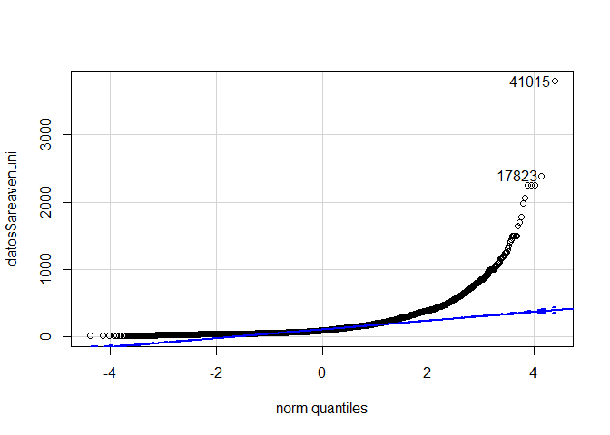
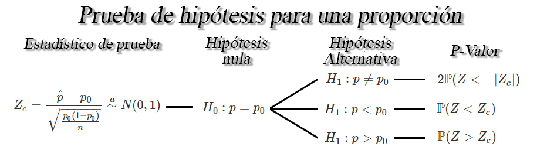

```{r knitr_init, echo=FALSE, cache=FALSE}
library(knitr)
## Global options
opts_chunk$set(echo=TRUE,
               cache=TRUE,
               prompt=FALSE,
               tidy=TRUE,
               comment=NA,
               message=FALSE,
               warning=FALSE,
               fig.path = paste0("../../MaestriaPoliticasPublicas/images/", "MaesPolPubSesion04"),
               cache.path = "../../MaestriaPoliticasPublicas/cache/",
               cache = FALSE)
```

```{r echo=F}
# Lo que se hizo en la sesión 01
## Este código no se muestra, y es de uso interno de la presentación
datos <- read.csv2("C:/Users/user/Desktop/Repo/pagina de control/Dataset/CesoEdificaciones2012-2018.csv")
# Elimina algunos carácteres especiales y abuso de mayúsculas
library(janitor)
datos <- clean_names(datos)

# Coerción de variable por variable
datos$ano_censo <- factor(datos$ano_censo, ordered = T)
datos$trimestre <- factor(datos$trimestre, ordered = T)
datos$region <- factor(datos$region, levels = c(5, 8, 11, 13, 17, 19, 41, 50, 52, 54,
                                                63, 66, 68, 73, 76),
                       labels = c("Antioquia", "Atlántico", "Bogotá", "Bolívar", "Caldas",
                                  "Cauca", "Huila", "Meta", "Nariño", "Norte de Santander",
                                  "Quindío", "Risaralda", "Santander", "Tolima", "Valle"))
datos$ob_formal <- factor(datos$ob_formal, level = c(1, 2), labels = c("Sí", "No"))
datos$estado_act <- factor(datos$estado_act, level = c(1, 2, 3, 4, 5, 6),
                           labels = c("Proceso", "ParalizadaInfC", "CulminadaInfC",
                                      "ParalizadaInfI", "CulminadaInfI", "Demolida"))
datos$movimiento <- factor(datos$movimiento, levels = c("A", "C", "I", "N", "R", "T"),
                           labels = c("Ampliación", "Continua", "Inactiva",
                                      "Nueva", "Reinicia", "Culmina"))
datos$estrato <- factor(datos$estrato, ordered = T)
datos$areatotzc <- as.numeric(datos$areatotzc)
datos$areaunitga <- as.numeric(datos$areaunitga)
datos$preciounig <- as.numeric(datos$preciounig)
datos$tipovalor <- factor(datos$tipovalor, level = c(0, 1, 2), labels = c("No responde", "Real", "Estimado"))
datos$mano_obrap <- as.numeric(datos$mano_obrap)
datos$mano_obrat <- as.numeric(datos$mano_obrat)
datos$area_lote <- as.numeric(datos$area_lote)
datos$areavendib <- as.numeric(datos$areavendib)
datos$nro_pisos <- as.numeric(datos$nro_pisos)
datos$gradoavanc <- as.numeric(datos$gradoavanc)
datos$preciovtax <- as.numeric(datos$preciovtax)
datos$areavenuni <- as.numeric(datos$areavenuni)
datos$tipovivi <- factor(datos$tipovivi, level = c(1, 2), labels = c("Social", "No Social"))
datos$ranvivi <- factor(datos$ranvivi, ordered = T)
datos$destino2 <- factor(datos$destino2, level = c(1, 2, 3, 4, 5, 6),
                         labels = c("Apartamento", "Oficina", "Comercio", "Casas", "Bodega",
                                    "Otros"))

# Elimina filas y columnas que poseen solo valores NA
datos <- remove_empty(datos, which = c("rows", "cols"))

library(dplyr)
# Elimina filas que poseen registros duplicados
datos <- distinct(datos)
```

## Introducción Inferencia estadística
La inferencia estadística es la obtención de conclusiones basadas en datos experimentales. Para entender la naturaleza de la inferencia estadística, se debe entender primero la diferencia entre "población" y "muestra".

**Población:** Consta del total de observaciones del suceso o proceso en que estamos interesados. En muchas ocasiones, no es posible obtener o replicar dicha información.

**Muestra:** Es un subconjunto de la población de interés, extraída con el objetivo de hacer inferencia sobre la población.

**Muestra aleatoria:** Es un subconjunto de la población seleccionado de forma independiente e idénticamente distribuidos (*iid* en adelante).

## Levantamiento de información
### Qué es una encuesta
La encuesta **es un método de investigación y recopilación de datos** que consta de una serie de preguntas estandarizadas hechas a una muestra representativa de la población de la que buscamos obtener información sobre diversos temas. Éstas poseen una gran variedad de propósitos y pueden llevarse a cabo de muchas maneras dependiendo de la metodología elegida y los objetivos que se deseen alcanzar.

### Tipos de encuestas
El tipo de las encuestas dependen de las componentes que se deseen abordar, las cuales se reparten en tres características principales

* **Según la forma de aplicación**
  * **Encuesta por correo:** En la que se emplea el servicio postal como medio para el envío y recepción de información a través de un cuestionario.
  * **Encuesta telefónicas:** En la que se emplea el servicio telefónico o celular como medio para realizar una entrevista que permita recopilar la información del interesado.
  * **Encuesta personal:** En la que se emplea una entrevista directa o personal con cada encuestado para recopilar información.
  * **Encuesta online:** En la que se emplea una página web o correo electrónico para establecer el cuestionario que se pretende respondan los encuestados potenciales.
  * **Combinación de los anteriores:** Emplea dos o más métodos de los anteriormente descritos para realizar la recolección de la información.
* **Según sus objetivos**
  * **Encuestas descriptivas:** buscan crear un registro sobre las actitudes o condiciones presentes dentro de una población en un momento determinado, es decir, en el momento en el que se realiza la encuesta.
  * **Encuestas análiticas:** su objetivo es explicar y describir el problema para poder encontrar la mejor solución.
* **Según las el tipo de cuestionario**
  * **Respuesta abierta:** permiten al encuestado tener la libertad de responder libremente cada pregunta, esto permite obtener respuestas más profundas y también obtener respuestas en las que no había pensado, sin embargo, el problema de este tipo de encuestas es que es muy difícil de cuantificar, por el contrario se deben interpretar las respuestas.
  * **Respuesta cerrada:** en este tipo, los encuestados deberán elegir alguna de las posibles opciones, su principal ventaja es que son más fáciles de cuantificar, sin embargo, en ocasiones ninguna de las opciones refleja el pensamiento de los participantes, para ello, siempre es recomendable añadir la casi “otro”.
  
### Objetivos de una encuesta
Existen varios razones u objetivos que tienen las encuestas, entre las cuales puede destacarse como las razones más comunes:

* Medir las relaciones entre variables demogrráficas, económicas y sociales.
* Evaluar las estadísticas demográficas como errores, omisiones e inexactitudes.
* Conocer profundamente patrones de las variables demográficas y sus factores asociados como fecundidad y migraciones determinantes.
* Evaluar periódicamente los resultados de un programa en ejecución.
* Saber la opinión del público acerca de un determinado tema.
* Investigar previamente de las características de la población para hacer las preguntas correctas.

### Etapas de la encuesta
Generalmente, el origen de la encuesta ocurre cuando una persona, empresa u organización se enfrenta a la necesidad de obtener información sobre un tema en específico, y no existen o no tienen a la mano dato suficientes para la realización de un análisis adecuado. Debido a lo anterior, en @Hilario2013[, pp. 323-325], los autores establecen las etapas que deben tenerse en cuenta para la realización de encuestas:

1. **Planteamiento de objetivos de la encuesta:** Estos objetivos deben ser claros y específicos, para poder remitirse a ellos a medida que se vaya progresando en el diseño e instrumentación de la encuesta. Se deben de mantener los objetivos suficientemente simples, de tal manera que sean entendidos por quienes trabajan en la encuesta y sean logrados exitosamente cuando se complete la misma.
2. **Selección de la población objetivo:** Definir de forma cuidadosa el segmento de la población de interés, para la cual debe precisarse de acuerdo a los conceptos y variables que se quieren medir. Para seleccionar la muestra correctamente, la población objetivo deberá de coincidir con la que se muestrea; en caso de no ser así los resultados son aplicables únicamente a la población muestreada.
Por ejemplo, en una encuesta política ¿la población objetivo debieran ser todos los adultos que pueden votar? ¿Todos los votantes registrados? ¿Todas las personas que votaron en la última elección? En ocasiones se deben definir los conceptos o nociones que sean necesarios para el planteamiento de la población. Así por ejemplo si se van a hacer un muestreo de adultos, defina qué se entiende por adulto, pues la elección de la población objetivo afectará profundamente las estadísticas resultantes.  
3. **Elección del marco de muestreo:** El marco de muestreo es la lista de las unidades de muestreo. Éstas últimas son las unidades donde realizamos la muestra; por ejemplo una familia es una unidad de muestreo y los individuos que viven en ella serán unidades de observación. Se debe seleccionar el marco (o marcos) de tal forma que la lista de las unidades muestrales y la población objetivo concuerden lo más posible. Para las encuestas telefónicas el marco de muestreo podría ser una lista de todos los números residenciales de la ciudad; para las entrevistas personales, una lista de las direcciones de todas las calles; para una encuesta de agricultura, una lista de todas las granjas o un mapa de las áreas que contienen granjas. Debe tenerse en cuenta que marcos múltiples pueden hacer el muestreo más eficiente. Hay que tener cuidado con las posibles deficiencias que presente el marco, como información incompleta, obsoleta, inadecuada, etcétera, pues afectará los resultados a obtener.
4. **Establecimiento del método de medición:** Decidir sobre el método de medición. Estos son usualmente: entrevistas personales, telefónicas, cuestionarios enviados por correo u observación directa. En este aspecto, la encuesta puede clasificarse dependiendo si su método de aplicación es realizado mediante autoaplicación (Entrega directa,  por correo electrónico u online) o usando encuestador (Vía telefónica o de forma personal)
5. **Instrumento de medición:** Junto a las etapas anteriores, es necesario especificar cuidadosamente qué mediciones van a ser obtenidas. Si se va usar un cuestionario planee las preguntas de tal manera que se minimice la no respuesta y el sesgo en las mismas. Hay que tener siempre en mente que la disposición de un encuestado para responder, dependerá de la presentación de la encuesta. Ésta debe contener la presentación de los objetivos del estudio e instrucciones sobre el llenado. Es conveniente incluir datos de identificación como: nombre de la institución, nombre del entrevistador, número del cuestionario de la muestra, hora de inicio de la entrevista y todo tipo de datos que sirvan para el control de la investigación. La sección final deberá contener el cierre de la entrevista, la hora de terminación y espacio para que el entrevistador anote sus observaciones, o para algún otro dato que el entrevistador determine es conveniente observar y anotar. Se debe tener en cuenta también
   * **Orden de las preguntas:** Se recomienda que aparezcan primero las preguntas más generales y después las específicas. Conviene que la complejidad de las preguntas vaya de menos a más. Enseguida deberán estar las preguntas referentes al tema de investigación y finalmente, si se desea, las preguntas de opinión o actitudes. La secuencia de las preguntas debe diseñarse de manera que evite la llamada contaminación, que consiste en la influencia o sesgo que el orden de las preguntas puede ejercer en las respuestas del informante.
   * **Contenido de las preguntas:** Debe verificarse que las preguntas realmente permitan recabar la información necesaria para cubrir el o los objetivos planteados. Para ello puede haber preguntas cortas o de opinión, si el tema lo requiere. A veces es recomendable la combinación de **preguntas abiertas** (el entrevistado no enfrenta categorías en la respuesta) y **preguntas cerradas** (se presentan opciones múltiples), para darle motivación al encuestado. Éstas últimas permiten una sencilla codificación y captura de la información. En consecuencia con lo anterior, la mayoría de las preguntas deben de tener una respuesta numérica simple (como la edad del entrevistado) o un número fijo de selecciones predeterminadas, una de las cuales será elegida por el entrevistado
   * **Redacción de las preguntas:** Éstas deben realizarse con un lenguaje acorde a las personas a quienes van dirigidas. No es comparable la terminología de un especialista con la de la población en general. Por otra parte, muchas preguntas que pueden parecer claras para quien diseña la encuesta, no lo serán para el encuestado. Digamos, preguntar *¿cuántos niños hay en su familia?*, en este caso no es claro para muchos, pues no se especifica hasta que edad se considerara que la persona es todavía un niño. Se debe evitar asimismo preguntas que induzcan al entrevistado a decir lo que se quiere escuchar. Por ejemplo plantear, La Iglesia Católica está en contra del uso del condón, ¿y usted? Incrementa la proporción de encuestados que quieren compartir la opinión de la Iglesia. Asimismo, preguntas como ¿cuál es el problema principal que enfrenta el magisterio? Brinda un rango de posibilidades que tal vez origine respuestas que no corresponden a la información que se quería recabar. Es por eso que se debe ser muy cuidadoso en la redacción de las preguntas de una encuesta.
6. **Diseño de muestreo:** Se debe planear cuidadosamente el diseño de muestreo, calculando un número apropiado de elementos de la muestra, de tal manera ésta proporcione suficiente información para los objetivos de la encuesta. Muchas encuestas producen poca o inútil información porque no fueron diseñadas apropiadamente.
   * **Muestreo dirigido o de juicio:** Sus elementos son seleccionados mediante decisión personal.
     * Generalmente un experto selecciona los elementos de la muestra.
   * **Muestreo aleatorio simple:** Cada elemento de la población tiene igual oportunidad de ser seleccionado.
     * La selección de la muestra es objetiva y el error muestral puede ser medido.
     * Toma una muestra de tamaño `$n$` de una población de tamaño `$N$`.
     * Cada elemento tiene una probabilidad `$n/N$` de entrar en la muestra.
   * **Muestreo sistemático:** Los elementos seleccionados en una manera ordenada.
     * Los elementos de la población están ordenados al azar.
     * El número de elementos en la población es dividido por el número deseado en la muestra.
   * **Muestreo aleatorio estratificado:** Se utiliza para garantizarla representativa cuando hay indicios que la población es muy heterogénea.
     * La población se divide en grupos (estratos) que son más homogéneos.
   * **Muestreo por conglomerados:** Se selecciona una parte de los grupos al azar o por un método sistemático, cuando existen agrupaciones "naturales" relativamente homogéneos.
     * Se toman todos los elementos de cada grupo seleccionado o una parte.
7. **Selección y adiestramiento de los investigadores de campo:** Se debe de seleccionar y adiestrar cuidadosamente a los investigadores de campo ya que después de que el plan de muestreo está claro y completamente establecido, alguien debe de recolectar apropiadamente los datos. Las personas que van a reunir los datos, deben ser cuidadosamente adiestrados sobre qué mediciones hacer y cómo realizarlas. El adiestramiento es especialmente importante si se usan entrevistas personales, porque la tasa de respuesta y la exactitud de las respuestas son afectadas por el estilo personal del entrevistador.
8. **Prueba piloto:** Es recomendable seleccionar una pequeña muestra para una prueba piloto. La prueba piloto es crucial, ya que permite, probar en el campo el cuestionario y otros instrumentos de medición, calificar a los entrevistadores, etc. Los resultados de la prueba piloto usualmente sugieren algunas modificaciones antes de realizar el muestreo completo. 
9. **Redacción del cuestionario definitivo:** Con los resultados de la prueba piloto, se revisan los distintos aspectos del cuestionario que se haya comprobado que no cumplen los objetivos establecidos y se hace la redacción definitiva del mismo. El diseño definitivo del cuestionario debe contemplar la futura codificación del mismo, ya sea reservando espacio para la misma, ya sea haciendo una pre-codificación del mismo, así como su presentación gráfica.
10. **Organización del trabajo de campo:** Se debe planear con detalle el trabajo de campo. Cualquier encuesta a gran escala involucra un gran número de personas trabajando como entrevistadores, coordinadores o personal dedicado al manejo de datos. Antes de empezar con la encuesta se debe organizar cuidadosamente los trabajos, delimitando claramente las tareas, y estableciendo las líneas de autoridad.
11. **Organización y manejo de datos:** Se debe elaborar un esquema el manejo apropiado de la información en todas las etapas de la encuesta. Las grandes encuestas generan gran cantidad de información y por ello requieren un plan bien preparado para el manejo de los datos. Este plan debe de incluir los pasos a seguir en el proceso de los datos, desde el momento en que se hace una medición en el campo hasta que el análisis final ha sido completado. Se debe incluir también un esquema de control de calidad para verificar la correlación entre los datos procesados y los datos recolectados en el campo.
12. **Análisis de los datos:** Definir los análisis que deberán realizarse. Este punto está estrechamente relacionado con el paso anterior, e involucra la especificación detallada de los análisis que deben ser ejecutados. Se puede también listar los temas que se deberán incluir en el reporte final.

### Recomendaciones para la realización de encuestas
1. Asegúrese de que las preguntas sean imparciales, no trate de guiar al encuestado hacia una respuesta u otra.
2. Formule las preguntas de la forma más sencilla posible. Las preguntas que incluyen indeas múltiples o dos interrogantes simultáneos confundirán a los encuestados.
3. Formule preguntas concretas y sea muy específico con los tiempos. 
4. Evite utilizar lenguaje técnico y abreviaturas. Tampoco emplee palabras especializadas de una industria, ni acrónimos o iniciales que no sean de uso común.
5. No utilice palabras rebuscadas o poco comunes. Es conveniente emplear exclusivamente términos de lenguaje común.
6. Evite el uso de palabras ambiguas. Palabras como normalmente o frecuentemente no tienen significado específico.
7. Evite formular preguntas en negativo.
8. Evite las preguntas hipotéticas. Es difícil responder preguntas sobre situaciones imaginarias, debido a que no siempre se puede confiar en las respuestas.
9. No utilice palabras que puedan malintepretarse. Esto es especialmente importante cuando la entrevista se realiza por teléfono.
10. Relativice las respuestas utilizando rangos de respuesta. Al usar cuestionarios en los que se pregunta por ejemplo por la edad, o el número de empleados despedidos en una empresa, es mejor ofrecer una serie de alternativas con diferentes rangos cuantitativos.
11. Asegúrese de que las respuestas fijas no se solapen. Las categorías de las preguntas con respuesta fija deberían ser secuenciales y no sobreponerse unas con otras.
12. Incluya la opción "otros" en las preguntas de respuesta fija. Cuando las respuestas están definidas, es recomendable dar siempre la opción de responder algo que no está en la lista.
13. Evite realizar encuestas muy largas, debido a que estas pueden llegar a cansar al encuestado y hacer que abandone la encuesta o te responda apresuradamente y con errores.

### Diseño de un cuestionario
El cuestionario es un conjunto de preguntas sobre los hechos o aspectos que interesan en una investigación y son contestados por los encuestados. Se trata de un instrumento fundamental para la obtención de datos.

Éste debe redactarse una vez se ha determinado el objetivo de la encuesta, en donde, las preguntas que se hagan deben responder a la información que se desea recolectar, con el fin de alcanzar los objetivos propuestos.

Existen diferentes tipos de preguntas que pueden realizarse en una encuesta, entre las cuales se destaca

* **Preguntas de hecho o identificación:** Referidas a caracterizar al individuo de interés.
* **Preguntas de acción:** Referidas a actividades de los encuestados.
* **Preguntas de información:** Para conocer los conocimientos de los encuestados.
* **Preguntas de intención:** Para conocer la intención de los encuestados.
* **Preguntas de opinión:** Para conocer la opinión de los encuestados.

## Métodos de muestreo
Los métodos de muestreo son aquellas estrategias que poseen una correspondencia directa con el tipo de muestra que se requiere seleccionar, ya sea debido a los objetivos del trabajo o el tipo de estudio. 

Para la selección del método de muestreo más conveniente, existen diferentes criterios de clasificación, los cuales pueden agruparse en dos grupos, a saber, los métodos de **muestreo probabilístico** y los métodos de **muestreo no probabilístico**.

### Métodos no probabilísticos
Los método de muestreo no probabilístico son una serie de técnicas de muestreo en la cual **NO** se brinda a todos los individuos de la población la misma probabilidad de ser seleccionados, haciendo que los individuos seleccionados no provengan de un proceso de selección aleatoria.

Por tanto, en los métodos no probabilísticos, se dice que **los sujetos en la muestra, son seleccionados generalmente en función de su accesibilidad, criterio personal y conocimientos del investigador sobre la población en específico**, debido a que se desconoce la probabilidad de que un individuo concreto de la población sea incluido en la muestra.

#### Muestreo por cuotas
Es una técnica que consiste en reunir muestras compuestas por la misma proporción de individuos de toda la población en grupos, con respecto a un fenómeno, característica o rasgo conocido. Esta técnica, se basa en el conocimiento de las diferentes clases o estratos que componen la población, o en su defecto, de los individuos más representativos o adecuados para los fines de la investigación.

La selección de las muestras en el muestreo por cuotas, **se hace mediante la selección de grupos de individuos que cumplen determinadas condiciones**, tales como edad, sexo, residencia, entre otras. Una vez determinados los grupos, se elige a las personas que vayan cumpliendo las condiciones predefinidas para cada grupo sin tener en cuenta la aleatoriedad.

#### Muestreo de opinión u opinatico
Esta técnica de muestreo **se caracteriza por la selección intencional o deliberada para obtener muestras "representativas" de cada grupo de interés**, seleccionando a individuos supuestamente "típico" de dicha población. El caso más frecuente de este procedimiento el utilizar como muestra los individuos a los que se tiene fácil acceso.

#### Muestreo casual o incidental
El muestreo casual, incidental o accidental, es un método de muestreo en donde los individuos se eligen de manera casual sin ningún jucio previo, en donde, la selección se basa exclusivamente en lo que es conveniente para el investigador, y por tanto, el muestreo **se basa en la selección de un lugar o un medio**, y desde allí, se realiza el estudio a los individuos de la población que accidentalmente crucen y estén dispuestas a participar.

#### Muestreo bola de nieve
El método de muestreo de bola de nieve **consiste en la localización de un individuo del grupo de interés, y a partir de éste, localizar a otros individuos**, y así sucesivamente hasta lograr conseguir una muestra suficientemente grande. 
<!-- Aunque pueda parecer que no tiene utilidad, se utiliza frecuentemente cuando con conocemos la población, por ejemplo con poblaciones como delincuentes, sectas, determinados tipos de enfermedades, entre otros -->

#### Muestreo discrecional
El muestreo discrecional o intencional, **es una técnica de muestreo no probabilístico que consta de elegir individuos por el investigador**, dado prioridad a unos individuos sobre otros, debido a que en este método, el investigador puede creer que algunos sujetos son mas adecuados que otros para la investigación, y por esta razón ellos son elegidor de forma deliberada como los individuos del muestreo.

### Métodos probabilísticos
Los métodos de muestreo probabilísticos son aquellos que se basan en el principio de equiprobabilidad. Es decir, aquellos en los que todos los individuos tienen la misma probabilidad de ser elegidos para formar parte de una muestra y, consiguientemente, todas las posibles muestras de tamaño `$n$` tienen la misma probabilidad de ser seleccionadas. **Sólo estos métodos de muestreo probabilísticos nos aseguran la representatividad de la muestra extraída** y son, por tanto, los más recomendables. 

#### Muestreo aleatorio simple (MAS)
El muestreo aleatorio simple es un procedimiento estadístico a partir del cual **se selecciona, sin reemplazo, una muestra de tamaño `$n$` de una población de tamaño `$N$` unidades, garantizando que cada muestra de tamaño `$n$` tenga a misma probabilidad de ser seleccionada**.

En la práctica, cuando se emplea este tipo de muestreo, las unidades muestrales deben ser seleccionadas una a una, en donde, inicialmente, las unidades muestrales deben ser enumeradas de `$1$` a `$N$`, con el fin de generar posteriormente, `$n$` números aleatorios por algún algoritmo de aleatorización. Éstos números aleatorios pueden ser generados mediante el programa <tt>R</tt>, Excel, tablas de números aleatorios, calculadora, etc.

Adicionalmente, para emplear este método se requiere que las estimaciones de interés se refiera a toda la población objetivo y no a subconjuntos o subpoblaciones de la misma, de tal forma que dicha población objetivo, tenga un comportamiento **homogeneo** con respecto a las características de interés.

#### Muestreo aleatorio estratificado (MAE)
Es una técnica de muestreo mediante la cual se obtiene una
muestra a partir la segmentación o separación de los elementos de una población en grupos **mutuamente excluyentes**, denotados como estratos. Posteriormente, a partir de la segmentación realizada, se realiza el muestreo de cada estrato, mediante la técnica de MAS, independiente.

Para emplear este método se requiere que la población objetivo, tenga un comportamiento **homogeneo** dentro de cada uno de los `$L$` estrato, y un comportamiento **heterogeneo** entre estratos, con respecto a las características de interés.

El objetivo del método de MAE, será maximizar la información obtenida o minimizar el valor del límite del error de estimación `$B$`, para cada una de los estratos, teniendo en
cuenta la variabilidad de la población cuando ésta debido a que ésta no posee un comportamiento **homogeneo**, además de obtener estimaciones
de los parámetros poblacionales de interés para cada uno de los
estratos individualmente.

En la práctica, cuando se emplea este tipo de muestreo, **se debe especificar claramente cada uno de los estratos**, así como el estrato en la cual se ubica cada unidad muestral. Adicionalmente, se debe seleccionar **la muestra de cada estrato de forma independiente**, mediante un MAS Finalmente, se debe asegurar la independencia en la selección de MAS de cada uno de los estratos.

#### Muestreo por conglomerados
El muestreo por conglomerados es una técnica que puede emplearse cuando dentro de la población objetivo, existen **agrupamientos "naturales" relativamente homogéneas**, con **comportamientos tan heterogéneos como sea posible**, de tal forma que cada conglomerado individual pueda ser visto como una pequeña representación de la población total de interés. Es de anotar los conglomerado que conforman la población deben ser **mutuamente excluyentes y exhaustivos**.

Algunas razones que pueden hacer que el muestreo por conglomerados sea una alternativa más viable al muestreo aleatorio simple, son señaladas por @Gutierrez2015[, pp. 183], en donde el autor introduce el tema mencionando que toda estrategia de muestreo tiene un común denominador, **tener un marco de muestreo bien definido** y la detallada **identificación y ubicación**, de todos y cada uno de los elementos que conforman la población. 

El autor señala que de no tener bien definidos estos dos elementos, pueden generarse **problemas financieros y logísticos** de eficiencia estadística, asociados a los costos que implicaría realizar un censo, para la enumeración, identificación y ubicación de cada elemento de la población. Ya que este procedimiento es requerido para la correcta construcción de un marco de muestreo. 

Adicionalmente, @Gutierrez2015[, pp. 183] señala que, aunque se tuviera un marco de muestreo bien definido para toda la población, **los costos financieros** asociados a la realización de un proceso de muestreo aleatorio simple, **sería sumamente elevado** debido a la posible alta dispersión de cada uno de los elementos que conforman el marco muestral.

<!-- Por ejemplo suponga que se desea realizar un estudio para evaluar la calidad de vida de las personas en un determinado país. Si llegara a existir un marco de muestreo de elementos, realizar (o seleccionar) una muestra aleatoria simple demandaría la contratación de un encuestador por cada persona encuestada, puesto que la dispersión geográfica natural de los elementos seleccionados en la muestra aleatoria simple sería demasiado alta -->

Una alternativa de muestreo probabilístico **de bajo costo** cuando no se posee un marco muestral de elementos, es mediante la selección de conglomerados dentro de la población objetivo, para realizar todo el proceso de medición, puesto que, es más eficiente por cuestiones financieras y logísticas, seleccionar una muestra de 20 manzanas de una ciudad, que contienen cada una en promedio 30 casas, que realizar una muestra aleatoria de 600 casas de dicha ciudad, ya que se incurren en mayores costos al ubicar las 600 casas y viajar entre ellas, que ubicar las 20 manzanas y visitar todas las casas que las conforman [@Cochran1977, p. 233].

Por tanto, para la construcción del marco de muestreo en estos casos, se tendrá entonces que ubicar e identificar cada uno de los conglomerados que conforman la población, realizar el proceso de muestreo entre los mismos, lo cual pueden realizarse mediante muestreo aleatorio simple, y posteriormente, realizar un censo de los individuos que conforman cada uno de los conglomerados seleccionados. Este procedimiento se conoce como **muestreo por conglomerados en una sola etapa.**

Si se observa que aún en los conglomerados se encuentra que la dispersión de la población es bastante grande, puede realizarse **un muestreo por conglomerados en dos etapas**, en donde, luego de hacer el proceso de muestreo entre los conglomerados, se aplica a los elementos de cada uno de los grupos seleccionados un nuevo proceso de muestreo. Este tipo de muestreo también es conocido como **muestreo bietápico**, el cual es un caso particular del **muestreo polietápico**, el cual será introducido en la próxima sección.

@Gutierrez2015[, pp. 184] señala que, a pesar de que **el muestreo por conglomerados** otorga una ganancia significativa en términos operativos, logísticos y financieros, dicho muestreo **pierde eficiencia en términos estadísticos**. Y basado en lo anterior, el autor plantea una serie de comentarios a tener en cuenta acerca del muestreo por conglomerados.

1. El muestreo por conglomerados debe utilizarse cuando:
   * La construcción de un marco de muestreo de elementos es muy difícil, muy costosa o imposible
de conseguir. Por ejemplo, Enumerar abejas, enumerar clientes, enlistar árboles en un sector, enlistar
hogares en los barrios conglomerados (dispersión geográfica, reducción de costos).
   * La población objetivo se encuentra geográficamente muy dispersa o aparece en agrupaciones
naturales: familias, escuelas, etc.
2. Los elementos individuales de una población sólo participan en la muestra si pertenecen a un
conglomerado incluido en la muestra.
3. El muestreo estratificado aumenta la precisión de las estimaciones, mientras que el muestreo por
conglomerados tiende a disminuirla. Es un precio que se paga al no poseer un marco de muestreo
definido para los elementos de la población objetivo.
4. Al obtener una muestra de elementos que pertenecen a un conglomerado repetimos la información
del conglomerado (dada la agrupación natural). Lo ideal es conseguir información nueva en cada
individuo, por lo anterior se pierde precisión en las estimaciones.
5. Una posible solución para disminuir la varianza o la perdida de eficiencia a causa de muestreo por conglomerados, es mediante el aumento del tamaño de muestra, pero esto traerá consigo el aumento de los costos operativos.

<!-- Falta parte matemática Ver Gutierrez2015-->

### Muestreo polietápico o por en varias etapas
El muestreo aleatorio polietápico es un método de muestreo que consisten en tomar muestras de las unidades muestrales de orden más alto (unidades de muestreo primarias), para obtener unidades muestrales de orden más bajo (unidades de muestreo secundarias), **ésto debido a que puede ser muy costoso o innecesario realizar el proceso de muestreo de todos los elementos que conforman una unidad muestral**. Si se toma una nueva muestra de la unidad muestral de segundo orden, se tendrá entonces una unidad muestral de orden aún más bajo (unidades de muestreo terciarias), y así sucesivamente. 

Lo anterior permite que el proceso de construcción del marco muestral sea más práctico, debido a que **solo es necesario realizar la construcción del marco muestral en las unidades muestrales seleccionadas**. En consecuencia, en el muestreo polietápico las unidades con las cuales se realiza el proceso de medición, serán aquellas unidades que componen la muestra en etapas sucesivas.

En @Gutierrez2015[, pp. 205], el autor presenta el principio que sigue el muestreo polietápico, el cual puede define como un proceso jerárquico que se realiza `$l$` veces, siguiente los siguientes dos pasos.

1. Construcción de `$l$` marcos de muestreo de unidades (se realizan conglomerados en las primeras `$l-1$` etapas del diseño muestral y de elementos en la última etapa).
2. Aplicación del diseño muestral y selección de la muestras (o submuestras) de cada marco de
muestreo.

Con el fin de ilustrar y entender mejor el funcionamiento de este tipo de muestreo, se presenta el ejemplo planteado en @Gutierrez2015[, pp. 205-206]. Suponga que se quiere obtener estimaciones acerca del comportamiento de los alumnos en determinada ciudad, y no se dispone de un marco de muestreo de los alumnos (**Es decir, no se tienen identificados a todos los alumnos de la ciudad**). Por tanto, es posible como **primera etapa** se puede realizar un muestreo por conglomerados, adquiriendo un marco de muestreo mediante la información de cuales son todas las escuelas que se encuentran ubicadas en la ciudad, y con éstas, realizando una primera selección.

Una vez se seleccionan las escuelas mediante muestreo por conglomerados, se procede a realizar una **segunda etapa**, en donde, se realiza un nuevo muestreo por conglomerados, para un nuevo marco de muestreo mediante la información de los cursos o clases que se ofrecen dentro de las escuelas, y con éstos, realizar un nuevo proceso de selección.

De tal forma que en la **tercera y última etapa** se levante un marco de muestreo de elementos, es decir, un muestreo de los alumnos pertenecientes a los cursos seleccionado, en donde, estos alumnos serán los individuos que participarán en los procesos de medición.

En este ejemplo, se tendrá el siguiente comportamiento jerárquico, que subdivide la población


La notación suministrada en la imagen es:

* **UPM:** Unidad Primaria de Muestreo, la cual será la primera subdivisión de la población original
* **USM:** Unidad Secundaria de Muestreo, la cual será la segunda división de la población original, o la sub-subdivisión de la población original.
* **UTM:** Unidad Terciaria de Muestreo, la cual será corresponde a los elementos de la población objetivo, que en este caso particular son los alumnos de la ciudad.


Es de anotar, que los resultados de la estimación basada en el diseño de muestreo sean aplicables, deben satisfacerse los siguientes dos supuestos

* **Invariancia:** La probabilidad de selección de una muestra de unidades de muestreo
(conglomerados o elementos) no depende del diseño de muestreo de la anterior etapa.
* **Independencia:** El submuestreo de cualquier unidad de muestreo se lleva a cabo de manera independiente con las otras unidades de muestreo, tanto en etapas superiores, inferiores o en la misma etapa.

<!-- Falta parte matemática Ver Gutierrez2015-->

## Estadísticos muestrales
Son funciones de las variables aleatorias obtenidas a partir de muestras aleatorias, que **tienen por objetivo estimar o hacer inferencia acerca de parámetros desconocidos de una población**.

Entonces, si se tiene un conjunto de observaciones `$X_1, X_2, \ldots, Xn$` obtenidas de una muestra aleatoria *iid* de tamaño `$n$`, entonces se tendrán los siguientes estadísticos muestrales

### Media muestral
Es el promedio aritmético del total de las `$n$` observaciones pertenecientes a una muestra aleatoria. Éste estadístico se define como
`\begin{align*}
  \bar{X}=\sum_{i=1}^n\frac{x_i}{n}=\frac{x_1+x_2+\ldots+x_n}{n}
\end{align*}`

En <tt>R</tt>, puede calcularse el valor de la media muestral de una muestra aleatoria mediante la función `mean(datos)`.

### Varianza muestral
Es la distancia media **al cuadrado** del conjunto de observaciones pertenecientes a una muestra aleatoria, respecto a la media muestra.
`\begin{align*}
  S^2=\frac{1}{n-1}\sum_{i=1}^n{(x_i-\bar{X})^2}
\end{align*}` 

siendo el valor `$n-1$` conocido como la corrección de Bessel, el cuál se usa en lugar de la división sobre `$n$` con el fin de corregir el sesgo tendría el estimador.

En <tt>R</tt> puede calcularse la varianza muestral de una muestra aleatoria mediante la función `var(datos)`.

### Desviación estándar muestral
Es la raíz cuadrada de la distancia media **al cuadrado** del conjunto de observaciones pertenecientes a una muestra aleatoria, respeto a la media, es decir, indica qué tan dispersos se encuentra el conjunto de observaciones de una muestra aleatoria respecto a su valor promedio.
`\begin{align*}
  S=\sqrt{S^2}
\end{align*}`

En <tt>R</tt> puede calcularse la desviación estándar de una muestra aleatoria mediante la función `sd(datos)`.

### Proporción muestral
Como su nombre lo indica, es la proporción de observaciones que cumplen una condición específica dentro de una muestra, respecto al total de observaciones dentro de la muestra, e indica el porcentaje de individuos que cumplen una característica dentro de un conjunto de observaciones.

`\begin{align*}
  \hat{p}= \frac{x}{n} = \frac{\text{Número de éxitos}}{\text{Total de observaciones}}
\end{align*}`

En <tt>R</tt> puede calcularse la proporción de observaciones que cumple una condición mediante la función `table(datos)`.

## Distribuciones muestrales
Debido a que **todos los estadístico** son funciones de las variables aleatorias observadas en una muestra, se tendrá que, éstos también serán variables aleatorias que **tendrán distribuciones de probabilidad asociadas**, las cuales son llamadas distribuciones muestrales.

### Distribución muestral `$Z$`
**Se usa para hacer inferencia sobre la media de una o dos poblaciones normales con varianzas conocidas**. Para el caso de una población, sea `$X_1, X_2, \ldots, X_n$` una muestra aleatoria de tamaño `$n$` de una distribución normal con media `$\mu$` y varianza `$\sigma^2$` conocida, entonces se tendrá que
`\begin{align*}
Z = \frac{\bar{X}-\mu}{\sigma/\sqrt{n}} \sim N(0,1)
\end{align*}`

se distribuirá como una normal estándar de forma exacta.

Mientras que, para el caso de dos poblaciones, sea `$X_{11}, X_{12}, \ldots, X_{1n_1}$` y `$X_{21}, X_{22}, \ldots, X_{2n_1}$` dos muestras aleatorias *iid* con medias `$\mu_1$` y `$\mu_2$`, y varianzas `$\sigma_1^2$` y `$\sigma_2^2$`, para `$i=1,2,\ldots,n_1$` y `$j=1,2,\ldots,n_2$`, entonces se tendrá que 

`\begin{align*}
Z_c=\frac{(\bar{X}_1 - \bar{X}_2) - (\mu_1 - \mu_2)}{\sqrt{\frac{\sigma^2_1}{n_1} + \frac{\sigma^2_2}{n_2}}} \sim N(0,1)
\end{align*}`

se distribuirá como una normal estándar de forma exacta.

### Distribución muestral `$t$` de Student
**Se usa para hacer inferencia sobre la media de una o dos poblaciones normales con varianzas desconocidas**. Para el caso de una población, sea `$X_1, X_2, \ldots, X_n$` una muestra aleatoria de una población normal con media `$\mu$` y varianza `$\sigma^2$` desconocida, se tendrá

`\begin{align*}
t_c = \frac{\bar{X}-\mu}{S/\sqrt{n}} \sim t_{n-1}
\end{align*}`

tiene una distribución `$t$` con `$(n-1)$` grados de libertad.

Mientras que, para el caso de dos poblaciones, sea `$X_{11}, X_{12}, \ldots, X_{1n_1}$` y `$X_{21}, X_{22}, \ldots, X_{2n_1}$` dos muestras aleatorias *iid* con medias `$\mu_1$` y `$\mu_2$`, y varianzas `$\sigma_1^2$` y `$\sigma_2^2$` desconocidas, para `$i=1,2,\ldots,n_1$` y `$j=1,2,\ldots,n_2$`, entonces si se cumple que `$\sigma_1^2=\sigma_2^2$`, se tendrá que

`\begin{align*}
t_c=\frac{(\bar{X}_1 - \bar{X}_2) - (\mu_1 - \mu_2)}{S_p\sqrt{\frac{1}{n_1} + \frac{1}{n_2}}} \sim t_{n_1+n_2-2}
\end{align*}`
donde
`\begin{align*}
S_p^2 = \frac{(n_1-1)S^2_1+(n_2-1)S^2_2}{n_1+n_2-2}
\end{align*}`

o si se cumple que `$\sigma_1^2\neq\sigma_2^2$`, se tendrá que

`\begin{align*}
t_c=\frac{(\bar{X}_1 - \bar{X}_2) - (\mu_1 - \mu_2)}{\sqrt{\frac{S^2_1}{n_1} + \frac{S^2_2}{n_2}}} \sim t_\nu
\end{align*}`
donde
`\begin{align*}
\lceil\nu\rceil = \frac{\left(\frac{S_1^2}{n_1} + \frac{S_2^2}{n_2}\right)^2}{\left[\frac{(S_1^2/n_1)^2}{n_1-1}\right] + \left[\frac{(S_2^2/n_2)^2}{n_2-1}\right]}
\end{align*}`

En estos dos casos, `$t_c$` se distribuirá como una `$t$` con `$(n_1+n_2-1)$`  grados de libertad o `$(n-1)$` grados de libertad, respectivamente.

### Teorema del límite central
**Se usa para hacer inferencia sobre la media de una o dos poblaciones no normales con varianzas conocidas o desconocidas**. Para el caso de una población, sea `$X_1, X_2, \ldots, X_n$` una muestra aleatoria *iid* con media `$\mu$` y varianza `$\sigma^2$` entonces, cuando `$n\to \infty$`, se tendrá que
`\begin{align*}
Z_c = \frac{\bar{X}-\mu}{\sigma/\sqrt{n}} \stackrel{a}{\sim} N(0,1)
\end{align*}`
tendrá una distribución aproximadamente normal estándar, cuando `$n\sim \infty$`.

Para el caso de dos poblaciones, sea `$X_{11}, X_{12}, \ldots, X_{1n_1}$` y `$X_{21}, X_{22}, \ldots, X_{2n_1}$` dos muestras aleatorias *iid* con medias `$\mu_1$` y `$\mu_2$`, y varianzas `$\sigma_1^2$` y `$\sigma_2^2$`, para `$i=1,2,\ldots,n_1$` y `$j=1,2,\ldots,n_2$`, entonces se tendrá que 

`\begin{align*}
Z_c=\frac{(\bar{X}_1 - \bar{X}_2) - (\mu_1 - \mu_2)}{\sqrt{\frac{\sigma^2_1}{n_1} + \frac{\sigma^2_2}{n_2}}} \stackrel{a}{\sim} N(0,1)
\end{align*}`

tendrá una distribución aproximadamente normal estándar, cuando `$n\sim \infty$`. En caso de que la varianza sea desconocida se reemplaza en las formulas la varianza poblacional `$\sigma^2_i$` por la varianza muestral `$S^2_i$`.

### Distribución muestral `$\chi^2$`
**Se usa para hacer inferencia sobre la varianza de una población normal**. Para el caso de una población, sea `$X_1, X_2, \ldots, X_n$` una muestra aleatoria de una población normal con media `$\mu$` y varianza `$\sigma^2$` desconocida, se tendrá

`\begin{align*}
\chi^2_c = \frac{(n-1)S^2}{\sigma^2} \sim \chi^2_{n-1}
\end{align*}`
tiene una distribución chi-cuadrado con `$n-1$` grados de libertad.

### Distribución muestral `$F$` de Fisher-Snedecor
**Se usa para hacer inferencia sobre el cociente de varianzas de dos poblaciones normales**. Si `$X_{1,1}, X_{1,2}, \ldots, X_{1,n_1}$` y `$X_{2,1}, X_{2,2}, \ldots, X_{2,n_2}$` son dos muestras aleatorias independientes de poblaciones normales con medias `$\mu_1, \mu_2$` y varianzas `$\sigma^2_1, \sigma^2,2$`, respectivamente, entonces

`\begin{align*}
F_c = \frac{S^2_1\sigma^2_2}{S^2_2\sigma^2_1} \sim F_{n_1-1, n_2-1}
\end{align*}`

tienen una distribución `$F$` con `$n_1-1$` grados de libertad en el numerador y `$n_2-1$` grados de libertad en el denominador.

### Distribución muestral para proporciones `$p$`
**Se usa para hacer inferencia sobre la proporción de una o dos poblaciones**. Sea `$X_1, X_2, \ldots, X_n$` una muestra aleatoria *iid* de tamaño `$n$`, tal que `$X\sim b(n,p)$`. Entonces si `$n$` es suficientemente grande, y la proporción `$p$` no está muy cercana a `$0$` o a `$1$`, tal que `$np$` y `$n(1-p)>5$`, entonces se puede probar que
`\begin{align*}
\hat{p}  = \frac{x}{n} \stackrel{a}{\sim} N\left(p, \frac{p(1-p)}{n}\right)
\end{align*}`
donde por teorema de estandarización se obtendrá que
`\begin{align*}
Z_c = \frac{\hat{p}-p}{\sqrt{\frac{p(1-p)}{n}}} \stackrel{a}{\sim} N(0,1)
\end{align*}`

Mientras que, para el caso de dos poblaciones, sea tendrá que si `$X_{11}, X_{12}, \ldots, X_{1n_1}$` y `$X_{21}, X_{22}, \ldots, X_{2n_1}$` dos muestras aleatorias *iid* de tamaño `$n_1$` y `$n_2$`, tal que `$X_{1i}\sim b(n_1,p_1)$` y `$X_{2i}\sim b(n_2,p_2)$`. Entonces si `$n_1$` y `$n_2$` son suficientemente grandes, y las proporción `$p_1$`, `$p_2$` no está muy cercana a `$0$` o a `$1$`, tal que `$n_ip_i$` y `$n_i(1-p_i)>5$`, entonces se puede probar que
`\begin{align*}
\hat{p_1}  = \frac{x_1}{n_1} \stackrel{a}{\sim} N\left(p_1, \frac{p_1(1-p_1)}{n_1}\right) \quad \quad \text{ y } \quad \quad \hat{p_2}  = \frac{x_2}{n_2} \stackrel{a}{\sim} N\left(p_2, \frac{p_2(1-p_2)}{n_2}\right)
\end{align*}`
Y por teorema de estandarización se obtendrá que
`\begin{align*}
Z_c = \frac{(\hat{p_1} - \hat{p_2}) - (p_1 - p_2)}{\sqrt{\frac{p_1(1-p_1)}{n_1} + \frac{p_2(1-p_2)}{n_2}}} \stackrel{a}{\sim} N(0,1)
\end{align*}`

## Prueba de hipótesis
Una hipótesis estadística **es una afirmación o conjetura que se realiza sobre una población o sobre los parámetros de la misma**, en donde el objetivo es decidir si la afirmación hecha se encuentra apoyada por la información obtenida de una muestra de la población de interés.

### Componentes de una prueba de hipótesis
#### Hipótesis nula
Sea `$\theta$` un parámetro de interés desconocido y sea `$\theta_0$` un valor particular de `$\theta$`, entonces se tendrá que la hipótesis nula estará dado por

* **Bilateral** `$H_0: \theta = \theta_0$`
* **Unilateral izquierda** `$H_0: \theta \geq \theta_0$`
* **Unilateral derecho** `$H_0: \theta \leq \theta_0$`

matemáticamente `$H_0: \theta \geq \theta_0$` y `$H_0: \theta \leq \theta_0$` es matemáticamente equivalente a escribir `$H_0: \theta = \theta_0$` y por tanto, se acostumbra a usar esta última en los tres casos.

#### Hipótesis alternativa
Es el complemento lógico de la hipótesis nula, y por tanto, ésta estará dado por

* **Bilateral** `$H_0: \theta \neq \theta_0$`
* **Unilateral izquierda** `$H_0: \theta < \theta_0$`
* **Unilateral derecho** `$H_0: \theta > \theta_0$`

Ésta hipótesis no puede contener la igualdad, a menos que se quiera una hipótesis alternativa específica.

#### Estadístico de prueba
El estadístico de prueba será el valor usado para tomar la decisión entre `$H_0$` y `$H_1$`. Éste dependerá del parámetro de interés y de la distribución muestral del estadístico asociado.

#### P-valor
Es el nivel de significancia más bajo en el que el valor observado del estadístico de prueba es significativo. Por tanto, un valor relativamente pequeño puede sugerir que el valor observado del estadístico de prueba sea poco probable, y por tanto, `$H_0$` deba ser rechazado.

En general, como criterio de decisión para el P-valor, dado un nivel de significancia preestablecido, es de la forma
`\begin{align*}
\text{P-valor }<\alpha \Rightarrow \text{ Rechazar } H_0
\end{align*}`

### Prueba de bondad de ajuste
Las pruebas de bondad de ajuste **son un contraste de hipótesis para determinar el grado o nivel de ajuste de nuestros datos a una distribución teórica**. 

Estas pruebas se basan en la comparación de las frecuencias de ocurrencia observadas en una muestra empírica y las frecuencias esperadas de una distribución teórica. En donde, el objetivo será si existe o no discrepancia entre los valores observados y los valores esperados de la distribución de interés.

La hipótesis a probar de interés estará dada por
`\begin{align*}
H_0: X \sim F_0(x) \quad \text{vs} \quad H_1: X \nsim F_0(x)
\end{align*}`

Siendo `$F_0(x)$` la distribución de probabilidad hipótetica que se quiere probar.

Entre las pruebas de bondad de ajuste más usadas se tiene:

```{r echo=FALSE}
library(kableExtra)

tablita <- cbind(
  "Prueba" = c("Kolmogorov–Smirnov", "Cramér–von Mises", "Anderson–Darling", "Kuiper", "QQPlot"),
  "Librería" = c("truncgof", "truncgof", "truncgof", "truncgof", "car"),
  "Función" = c("ks.test()", "w2.test()", "ad.test()", "v.test()", "qqPlot"))

kable(tablita, 
  format = "html", booktabs = T) %>%
kable_styling("striped", full_width = F)

options(scipen = 10)
```

Donde éstas pruebas, **requieren de los parámetros de la distribución que se quiere probar**, y para encontrarlos, es posible emplear **métodos de optimización** que nos permitan observar cuales son los parámetros ajustados para un conjunto de datos determinado. Para emplear estos método de optimización es posible usar la función <tt>fitdistr()</tt> de la librería <tt>MASS</tt>. 

<button id="Show1" class="btn btn-secondary">Mostrar Ejemplo</button>
<button id="Hide1" class="btn btn-info">Ocultar Ejemplo</button>
<main id="botoncito1"> 
<h3 data-toc-skip> Prueba de bondad de ajuste </h3> 
<p> Para ilustrar el método de empleo, suponga que se desea probar si, el área del lote (<tt>area$\_$lote</tt>), posee el comportamiento de una distribución Weibull. Entonces, para probar esta distribución, será necesario usar la función <tt>fitdistr()</tt> para encontrar los parámetros que nos servirán para el ajuste, y posteriormente emplear una prueba de bondad de ajuste, como por ejemplo la Kuiper y el gráfico QQ, para saber si se rechaza o no la hipótesis de interés.</p>

<section class="language-r highlighter-rouge"><section class="highlight"><pre class="highlight"><code><span class="nf">library</span><span class="p">(</span><span class="n">MASS</span><span class="p">)</span><span class="w">
</span><span class="c1">## Se hace el ajuste para encontrar el valor de los parámetros</span><span class="w">
</span><span class="n">parametros</span><span class="w"> </span><span class="o">&lt;-</span><span class="w"> </span><span class="nf">fitdistr</span><span class="p">(</span><span class="nf">na.omit</span><span class="p">(</span><span class="n">datos</span><span class="o">$</span><span class="n">area_lote</span><span class="p">),</span><span class="w"> </span><span class="n">densfun</span><span class="w"> </span><span class="o">=</span><span class="w"> </span><span class="s2">"weibull"</span><span class="p">)</span><span class="w">

</span><span class="nf">library</span><span class="p">(</span><span class="n">truncgof</span><span class="p">)</span><span class="w">
</span><span class="c1">## Se hace la prueba de bondad de ajuste</span><span class="w">
</span><span class="nf">v.test</span><span class="p">(</span><span class="nf">na.omit</span><span class="p">(</span><span class="n">datos</span><span class="o">$</span><span class="n">area_lote</span><span class="p">),</span><span class="w"> </span><span class="n">distn</span><span class="w"> </span><span class="o">=</span><span class="w"> </span><span class="s2">"pweibull"</span><span class="p">,</span><span class="w"> </span><span class="n">fit</span><span class="w"> </span><span class="o">=</span><span class="w"> </span><span class="nf">list</span><span class="p">(</span><span class="n">shape</span><span class="w"> </span><span class="o">=</span><span class="w"> </span><span class="n">parametros</span><span class="o">$</span><span class="n">estimate</span><span class="p">[</span><span class="m">1</span><span class="p">],</span><span class="w"> 
    </span><span class="n">scale</span><span class="w"> </span><span class="o">=</span><span class="w"> </span><span class="n">parametros</span><span class="o">$</span><span class="n">estimate</span><span class="p">[</span><span class="m">2</span><span class="p">]))</span><span class="w">
</span></code></pre></section></section>

<section class="highlighter-rouge"><section class="highlight"><pre class="highlight"><code>    Kuiper Test

data:  na.omit(datos$area_lote)
V = 138.16, p-value &lt; 2.2e-16
alternative hypothesis: NA

treshold = -Inf, simulations: 100
</code></pre></section></section>

<section class="language-r highlighter-rouge"><section class="highlight"><pre class="highlight"><code><span class="nf">library</span><span class="p">(</span><span class="n">car</span><span class="p">)</span><span class="w">
</span><span class="c1">## Se hace el QQplot</span><span class="w">
</span><span class="nf">qqPlot</span><span class="p">(</span><span class="nf">na.omit</span><span class="p">(</span><span class="n">datos</span><span class="o">$</span><span class="n">area_lote</span><span class="p">),</span><span class="w"> </span><span class="n">dist</span><span class="w"> </span><span class="o">=</span><span class="w"> </span><span class="s2">"weibull"</span><span class="p">,</span><span class="w"> </span><span class="n">shape</span><span class="w"> </span><span class="o">=</span><span class="w"> </span><span class="n">parametros</span><span class="o">$</span><span class="n">estimate</span><span class="p">[</span><span class="m">1</span><span class="p">],</span><span class="w"> 
    </span><span class="n">scale</span><span class="w"> </span><span class="o">=</span><span class="w"> </span><span class="n">parametros</span><span class="o">$</span><span class="n">estimate</span><span class="p">[</span><span class="m">2</span><span class="p">])</span><span class="w">
</span></code></pre></section></section>

<p></p>

<section class="highlighter-rouge"><section class="highlight"><pre class="highlight"><code>[1] 3806 7530
</code></pre></section></section>

```{r echo=F, eval=F}
library(MASS)
## Se hace el ajuste para encontrar el valor de los parámetros
parametros <- fitdistr(na.omit(datos$area_lote), densfun = "weibull")

library(truncgof)
## Se hace la prueba de bondad de ajuste
v.test(na.omit(datos$area_lote), distn = "pweibull", fit = list(shape = parametros$estimate[1], 
    scale = parametros$estimate[2]))

library(car)
## Se hace el QQplot
qqPlot(na.omit(datos$area_lote), dist="weibull", shape = parametros$estimate[1], scale = parametros$estimate[2])
```
</main>

Adicionalmente, existen pruebas específicas que permiten probar si un conjunto de datos se distribuyen o no normalmente, en donde las pruebas más usadas son:

```{r echo=FALSE}
library(kableExtra)

tablita <- cbind(
  "Prueba" = c("Shapiro-Wilk", "Lilliefors", "Shapiro-Francia", "Cramer Von-Mises", "Anderson-Darling", "QQPlot"),
  "Librería" = c("stats", "nortest", "nortest", "nortest", "nortest", "car"),
  "Función" = c("shapiro.test()", "lillie.test()", "sf.test()", "cvm.test()", "ad.test()", "qqPlot"))

kable(tablita, 
  format = "html", booktabs = T) %>%
kable_styling("striped", full_width = F)

options(scipen = 10)
```

<button id="Show2" class="btn btn-secondary">Mostrar Ejemplo</button>
<button id="Hide2" class="btn btn-info">Ocultar Ejemplo</button>
<main id="botoncito2"> 
<h3 data-toc-skip> Prueba de bondad de ajuste </h3> 
<p> Para ilustrar el método de empleo de las pruebas de normalidad, suponga que se desea probar si, el área total vendible (<tt>areavenuni</tt>), se distribuye normalmente. Suponga que en este caso decidimos emplear la prueba Lilliefors para probar la hipótesis. (Se decide emplear ésta prueba debido a que otras prueden generar problemas debido a la cantidad tan grande de datos).</p>

<section class="language-r highlighter-rouge"><section class="highlight"><pre class="highlight"><code><span class="nf">library</span><span class="p">(</span><span class="n">nortest</span><span class="p">)</span><span class="w">
</span><span class="c1">## Se hace la prueba de bondad de ajuste de normalidad</span><span class="w">
</span><span class="nf">lillie.test</span><span class="p">(</span><span class="n">datos</span><span class="o">$</span><span class="n">areavenuni</span><span class="p">)</span><span class="w">
</span></code></pre></section></section>

<section class="highlighter-rouge"><section class="highlight"><pre class="highlight"><code>    Lilliefors (Kolmogorov-Smirnov) normality test

data:  datos$areavenuni
D = 0.17805, p-value &lt; 2.2e-16
</code></pre></section></section>

```{r echo=F, eval=F}
## Se hace la prueba de bondad de ajuste de normalidad
nortest::lillie.test(datos$areavenuni)
```

<p>Y también se decide visualizar la prueba de normalidad, mediante el
gráfico QQ, de la forma</p>

<section class="language-r highlighter-rouge"><section class="highlight"><pre class="highlight"><code><span class="nf">library</span><span class="p">(</span><span class="n">car</span><span class="p">)</span><span class="w">
</span><span class="c1">## Se hace la prueba de bondad de ajuste de normalidad</span><span class="w">
</span><span class="nf">qqPlot</span><span class="p">(</span><span class="n">datos</span><span class="o">$</span><span class="n">areavenuni</span><span class="p">)</span><span class="w">
</span></code></pre></section></section>

<p></p>

<section class="highlighter-rouge"><section class="highlight"><pre class="highlight"><code>[1] 41015 17823
</code></pre></section></section>

```{r echo=F, eval=F}
## Se hace la prueba de bondad de ajuste de normalidad
car::qqPlot(datos$areavenuni)
```
</main>

### Prueba de hipótesis para la media `$\mu$`
Sea `$X_1, X_2, \ldots, X_n$` una muestra aleatoria *iid* de tamaño `$n$` con media desconocida `$\mu$`, y varianza `$\sigma^2<\infty$`, entonces dependiendo de las condiciones, se tendrán los siguientes pruebas de hipótesis para la media `$\mu$`.


<button id="Show3" class="btn btn-secondary">Mostrar Ejemplo</button>
<button id="Hide3" class="btn btn-info">Ocultar Ejemplo</button>
<main id="botoncito3"> 
<h3 data-toc-skip> Prueba para una media </h3> 
<p> Suponga que se desea probar con nivel de significancia del $5\%$, la hipótesis de que el número promedio en $m^2$ de las áreas comunes es superior a $154$ $m^2$ (<tt>areatotzc</tt>). Para realizar la prueba de hipótesis para una media, bajo los supuestos de que, la distribución es normal o aproximadamente normal y que la varianza poblacional no es conocidas, puede emplearse la función <tt>t.test()</tt> de <tt>R</tt>, de la forma.</p>

<section class="language-r highlighter-rouge"><section class="highlight"><pre class="highlight"><code><span class="c1"># Calcula pueba de hipótesis para una media</span><span class="w">
</span><span class="nf">t.test</span><span class="p">(</span><span class="n">x</span><span class="w"> </span><span class="o">=</span><span class="w"> </span><span class="n">datos</span><span class="o">$</span><span class="n">areatotzc</span><span class="p">,</span><span class="w"> </span><span class="n">mu</span><span class="w"> </span><span class="o">=</span><span class="w"> </span><span class="m">154</span><span class="p">,</span><span class="w"> </span><span class="n">alternative</span><span class="w"> </span><span class="o">=</span><span class="w"> </span><span class="s2">"greater"</span><span class="p">,</span><span class="w"> </span><span class="n">conf.level</span><span class="w"> </span><span class="o">=</span><span class="w"> </span><span class="m">0.95</span><span class="p">)</span><span class="w">
</span></code></pre></section></section>

<section class="highlighter-rouge"><section class="highlight"><pre class="highlight"><code>    One Sample t-test

data:  datos$areatotzc
t = 0.39854, df = 86143, p-value = 0.3451
alternative hypothesis: true mean is greater than 154
95 percent confidence interval:
 151.2926      Inf
sample estimates:
mean of x 
 154.8657 
</code></pre></section></section>

```{r echo=F, eval=F}
# Calcula pueba de hipótesis para una media
t.test(x = datos$areatotzc, mu = 154, alternative = "greater", conf.level = 0.95)
```
</main>

### Prueba de hipótesis para diferencia de medias `$\mu_1 - \mu_2$`
Sea `$X_{1,1}, X_{1,2}, \ldots, X_{1,n_1}$` y `$X_{2,1}, X_{2,2}, \ldots, X_{2,n_1}$` dos muestras aleatorias *iid* de tamaños `$n_1$`, y `$n_2$` con medias desconocidas `$\mathbb{E}(X_{1})=\mu_1$` y `$\mathbb{E}(X_{2})=\mu_2$`, y varianzas `$Var(X_{1})=\sigma_1^2<\infty$` y `$Var(X_{2})=\sigma^2_2<\infty$`, respectivamente, entonces dependiendo de las condiciones, se tendrán los siguientes pruebas de hipótesis para la diferencia de medias `$\mu_1 - \mu_2$`.


<button id="Show4" class="btn btn-secondary">Mostrar Ejemplo</button>
<button id="Hide4" class="btn btn-info">Ocultar Ejemplo</button>
<main id="botoncito4"> 
<h3 data-toc-skip> Prueba para diferencia de medias </h3> 
<p> Suponga que se desea probar con nivel de significancia del $1\%$, la hipótesis de que el precio promedio de venta por $m^2$ en Antioquia, es menor que el precio promedio de venta por $m^2$ en el Valle (<tt>preciovtax</tt>) y (<tt>region</tt>). <br>
<br>
Si pudieramos suponer normalidad, y varianzas desconocidas, en <tt>R</tt> es posible emplear la función <tt>t.test()</tt> para probar la hipótesis de interés. Tal como se muestra a continuación.</p>

<section class="language-r highlighter-rouge"><section class="highlight"><pre class="highlight"><code><span class="c1"># Calcula pueba de hipótesis para una media</span><span class="w">
</span><span class="nf">t.test</span><span class="p">(</span><span class="n">x</span><span class="w"> </span><span class="o">=</span><span class="w"> </span><span class="n">datos</span><span class="o">$</span><span class="n">preciovtax</span><span class="p">[</span><span class="n">datos</span><span class="o">$</span><span class="n">region</span><span class="w"> </span><span class="o">==</span><span class="w"> </span><span class="s2">"Antioquia"</span><span class="p">],</span><span class="w"> </span><span class="n">y</span><span class="w"> </span><span class="o">=</span><span class="w"> </span><span class="n">datos</span><span class="o">$</span><span class="n">preciovtax</span><span class="p">[</span><span class="n">datos</span><span class="o">$</span><span class="n">region</span><span class="w"> </span><span class="o">==</span><span class="w"> 
    </span><span class="s2">"Valle"</span><span class="p">],</span><span class="w"> </span><span class="n">mu</span><span class="w"> </span><span class="o">=</span><span class="w"> </span><span class="m">0</span><span class="p">,</span><span class="w"> </span><span class="n">alternative</span><span class="w"> </span><span class="o">=</span><span class="w"> </span><span class="s2">"less"</span><span class="p">,</span><span class="w"> </span><span class="n">conf.level</span><span class="w"> </span><span class="o">=</span><span class="w"> </span><span class="m">0.99</span><span class="p">)</span><span class="w">
</span></code></pre></section></section>

<section class="highlighter-rouge"><section class="highlight"><pre class="highlight"><code>    Welch Two Sample t-test

data:  datos$preciovtax[datos$region == "Antioquia"] and datos$preciovtax[datos$region == "Valle"]
t = 66.884, df = 16153, p-value = 1
alternative hypothesis: true difference in means is less than 0
99 percent confidence interval:
     -Inf 910.2621
sample estimates:
mean of x mean of y 
 2090.394  1210.732 
</code></pre></section></section>

```{r echo=F, eval=F}
# Calcula pueba de hipótesis para una media
t.test(x = datos$preciovtax[datos$region == "Antioquia"], y = datos$preciovtax[datos$region == "Valle"], mu = 0, alternative = "less", conf.level = 0.99)
```
</main>

### Prueba de hipótesis para una proporción `$p$` 
Sea `$X_1,X_2, \ldots, X_n$` una muestra aleatoria *iid* de tamaño `$n$`, tal que `$X\sim b(n,p)$` entonces si `$n$` es suficientemente grande tal que `$n\geq30$`, y la proporción desconocida `$p$` no se encuentre cercana a `$0$` o `$1$`, tal que `$np>5$` y `$n(1-p)>5$`, entonces un una prueba de hipótesis para la proporción verdadera `$p$` será de la forma



<button id="Show5" class="btn btn-secondary">Mostrar Ejemplo</button>
<button id="Hide5" class="btn btn-info">Ocultar Ejemplo</button>
<main id="botoncito5"> 
<h3 data-toc-skip> Prueba para una proporción </h3> 
<p> Suponga que se desea probar con nivel de significancia del $10\%$, la hipótesis de que la proporción de viviendas de interés social es superior al $43\%$ (<tt>tipovivi</tt>). En este caso, es posible emplear la función <tt>prop.test</tt> de <tt>R</tt> para probar la hipótesis de interés. <br>
<br>
Si pudieramos suponer normalidad, y varianzas desconocidas, en <tt>R</tt> es posible emplear la función <tt>t.test()</tt> para probar la hipótesis de interés. Tal como se muestra a continuación.</p>

<section class="language-r highlighter-rouge"><section class="highlight"><pre class="highlight"><code><span class="c1"># Calcula prueba de hipótesis para una proporcion</span><span class="w">
</span><span class="n">exitos3</span><span class="w"> </span><span class="o">&lt;-</span><span class="w"> </span><span class="nf">table</span><span class="p">(</span><span class="n">datos</span><span class="o">$</span><span class="n">tipovivi</span><span class="p">)[</span><span class="m">1</span><span class="p">]</span><span class="w">
</span><span class="n">total3</span><span class="w"> </span><span class="o">&lt;-</span><span class="w"> </span><span class="nf">sum</span><span class="p">(</span><span class="nf">table</span><span class="p">(</span><span class="n">datos</span><span class="o">$</span><span class="n">tipovivi</span><span class="p">))</span><span class="w">
</span><span class="nf">prop.test</span><span class="p">(</span><span class="n">x</span><span class="w"> </span><span class="o">=</span><span class="w"> </span><span class="n">exitos3</span><span class="p">,</span><span class="w"> </span><span class="n">n</span><span class="w"> </span><span class="o">=</span><span class="w"> </span><span class="n">total3</span><span class="p">,</span><span class="w"> </span><span class="n">conf.level</span><span class="w"> </span><span class="o">=</span><span class="w"> </span><span class="m">0.9</span><span class="p">,</span><span class="w"> </span><span class="n">alternative</span><span class="w"> </span><span class="o">=</span><span class="w"> </span><span class="s2">"greater"</span><span class="p">,</span><span class="w"> </span><span class="n">p</span><span class="w"> </span><span class="o">=</span><span class="w"> </span><span class="m">0.43</span><span class="p">)</span><span class="w">
</span></code></pre></section></section>

<section class="highlighter-rouge"><section class="highlight"><pre class="highlight"><code>    1-sample proportions test with continuity correction

data:  exitos3 out of total3, null probability 0.43
X-squared = 255.82, df = 1, p-value = 1
alternative hypothesis: true p is greater than 0.43
90 percent confidence interval:
 0.4008701 1.0000000
sample estimates:
        p 
0.4030157 
</code></pre></section></section>

```{r echo=F, eval=F}
# Calcula prueba de hipótesis para una proporcion
exitos3 <- table(datos$tipovivi)[1]
total3 <- sum(table(datos$tipovivi))
prop.test(x = exitos3, n = total3, conf.level = 0.90, alternative = "greater", p = 0.43)
```
</main>

### Prueba de hipótesis para diferencia de proporciones `$p_1 - p_2$` 
Sean `$X_{1,1}, X_{1,2}, \ldots, X_{1,n_1}$` y `$X_{2,1}, X_{2,2}, \ldots, X_{2,n_1}$` dos muestras aleatorias *iid* de tamaño `$n_1$` y `$n_2$`, tal que `$X_{i}\sim b(n_i,p_i)$`, para `$i=1,2$`, entonces si `$n_1$` y `$n_2$` son suficientemente grandes tal que `$n_1, n_2\geq30$`, y si las proporciones desconocidas `$p_1$` y `$p_2$` no se encuentran cercanas a `$0$` o `$1$`, tal que `$n_ip_i>5$` y `$n_i(1-p_i)>5$`, para `$i=1,2$`, entonces un una prueba de hipótesis para la diferencia de las proporciones `$p_1-p_2$` será de la forma


<button id="Show6" class="btn btn-secondary">Mostrar Ejemplo</button>
<button id="Hide6" class="btn btn-info">Ocultar Ejemplo</button>
<main id="botoncito6"> 
<h3 data-toc-skip> Prueba para diferencia de proporciones </h3> 
<p> Suponga que se tiene interés en probar la hipótesis si la proporción de viviendas de interés social en el $2016$ es inferior a la proporción de viviendas de interés social en el $2018$ (<tt>tipovivi</tt>) y (<tt>ano$\_$censo</tt>), empleando un nivel de significancia del $12\%$. En este caso, puede emplearse la función <tt>prop.table</tt> de <tt>R</tt>, mediante la estructura.</p>

<section class="language-r highlighter-rouge"><section class="highlight"><pre class="highlight"><code><span class="c1"># Calcula intervalo de confianza para diferencia de proporciones R</span><span class="w">
</span><span class="n">exitos4</span><span class="w"> </span><span class="o">&lt;-</span><span class="w"> </span><span class="nf">table</span><span class="p">(</span><span class="n">datos</span><span class="o">$</span><span class="n">tipovivi</span><span class="p">[</span><span class="n">datos</span><span class="o">$</span><span class="n">ano_censo</span><span class="w"> </span><span class="o">==</span><span class="w"> </span><span class="s2">"2016"</span><span class="p">])[</span><span class="m">1</span><span class="p">]</span><span class="w">
</span><span class="n">total4</span><span class="w"> </span><span class="o">&lt;-</span><span class="w"> </span><span class="nf">sum</span><span class="p">(</span><span class="nf">table</span><span class="p">(</span><span class="n">datos</span><span class="o">$</span><span class="n">tipovivi</span><span class="p">[</span><span class="n">datos</span><span class="o">$</span><span class="n">ano_censo</span><span class="w"> </span><span class="o">==</span><span class="w"> </span><span class="s2">"2016"</span><span class="p">]))</span><span class="w">
</span><span class="n">exitos5</span><span class="w"> </span><span class="o">&lt;-</span><span class="w"> </span><span class="nf">table</span><span class="p">(</span><span class="n">datos</span><span class="o">$</span><span class="n">tipovivi</span><span class="p">[</span><span class="n">datos</span><span class="o">$</span><span class="n">ano_censo</span><span class="w"> </span><span class="o">==</span><span class="w"> </span><span class="s2">"2018"</span><span class="p">])[</span><span class="m">1</span><span class="p">]</span><span class="w">
</span><span class="n">total5</span><span class="w"> </span><span class="o">&lt;-</span><span class="w"> </span><span class="nf">sum</span><span class="p">(</span><span class="nf">table</span><span class="p">(</span><span class="n">datos</span><span class="o">$</span><span class="n">tipovivi</span><span class="p">[</span><span class="n">datos</span><span class="o">$</span><span class="n">ano_censo</span><span class="w"> </span><span class="o">==</span><span class="w"> </span><span class="s2">"2018"</span><span class="p">]))</span><span class="w">
</span><span class="nf">prop.test</span><span class="p">(</span><span class="n">x</span><span class="w"> </span><span class="o">=</span><span class="w"> </span><span class="nf">c</span><span class="p">(</span><span class="n">exitos4</span><span class="p">,</span><span class="w"> </span><span class="n">exitos5</span><span class="p">),</span><span class="w"> </span><span class="n">n</span><span class="w"> </span><span class="o">=</span><span class="w"> </span><span class="nf">c</span><span class="p">(</span><span class="n">total4</span><span class="p">,</span><span class="w"> </span><span class="n">total5</span><span class="p">),</span><span class="w"> </span><span class="n">conf.level</span><span class="w"> </span><span class="o">=</span><span class="w"> </span><span class="m">0.88</span><span class="p">,</span><span class="w"> </span><span class="n">alternative</span><span class="w"> </span><span class="o">=</span><span class="w"> </span><span class="s2">"less"</span><span class="p">)</span><span class="w">
</span></code></pre></section></section>

<section class="highlighter-rouge"><section class="highlight"><pre class="highlight"><code>    2-sample test for equality of proportions with continuity correction

data:  c(exitos4, exitos5) out of c(total4, total5)
X-squared = 4.4719, df = 1, p-value = 0.01723
alternative hypothesis: less
88 percent confidence interval:
 -1.000000000 -0.005788361
sample estimates:
   prop 1    prop 2 
0.3549380 0.3680311 
</code></pre></section></section>

```{r echo=F, eval=F}
# Calcula intervalo de confianza para diferencia de proporciones R
exitos4 <- table(datos$tipovivi[datos$ano_censo == "2016"])[1]
total4 <- sum(table(datos$tipovivi[datos$ano_censo == "2016"]))
exitos5 <- table(datos$tipovivi[datos$ano_censo == "2018"])[1]
total5 <- sum(table(datos$tipovivi[datos$ano_censo == "2018"]))
prop.test(x = c(exitos4, exitos5), n = c(total4, total5), conf.level = 0.88, alternative = "less")
```
</main>

### Prueba de hipótesis para una varianza `$\sigma^2$`
Sea `$X_{1}, X_{2}, \ldots, X_{n}$` una muestra aleatoria normal de tamaño `$n$` con media `$\mathbb{E}(X)=\mu$` y varianza desconocida `$Var(X)=\sigma^2<\infty$`, respectivamente, entonces un contraste de hipótesis para una varianza `$\sigma^2$`, a un nivel de significancia `$\alpha$` será de la forma


<button id="Show7" class="btn btn-secondary">Mostrar Ejemplo</button>
<button id="Hide7" class="btn btn-info">Ocultar Ejemplo</button>
<main id="botoncito7"> 
<h3 data-toc-skip> Prueba para una varianza </h3> 
<p> Suponga que se tiene interés en probar con un nivel de significancia del $5\%$, si existe evidencia significativa respecto a que la variabilidad del precio unitario de ventas por metro cuadrado (<tt>preciovtax</tt>), es mayor a $1250000$ pesos. En este caso, puede emplearse la función <tt>varTest</tt> de la librería <tt>EnvStats</tt>, mediante la estructura.</p>

<section class="language-r highlighter-rouge"><section class="highlight"><pre class="highlight"><code><span class="nf">library</span><span class="p">(</span><span class="n">EnvStats</span><span class="p">)</span><span class="w">
</span><span class="c1"># Calcula prueba de hipótesis para una de varianza</span><span class="w">
</span><span class="nf">varTest</span><span class="p">(</span><span class="n">datos</span><span class="o">$</span><span class="n">preciovtax</span><span class="p">,</span><span class="w"> </span><span class="n">alternative</span><span class="w"> </span><span class="o">=</span><span class="w"> </span><span class="s2">"greater"</span><span class="p">,</span><span class="w"> </span><span class="n">conf.level</span><span class="w"> </span><span class="o">=</span><span class="w"> </span><span class="m">0.95</span><span class="p">,</span><span class="w"> </span><span class="n">sigma.squared</span><span class="w"> </span><span class="o">=</span><span class="w"> </span><span class="m">1250000</span><span class="p">)</span><span class="w">
</span></code></pre></section></section>

<section class="highlighter-rouge"><section class="highlight"><pre class="highlight"><code>    Chi-Squared Test on Variance

data:  datos$preciovtax
Chi-Squared = 85325, df = 86147, p-value = 0.9765
alternative hypothesis: true variance is greater than 1250000
95 percent confidence interval:
 1228315     Inf
sample estimates:
variance 
 1238067 
</code></pre></section></section>

```{r echo=F, eval=F}
library(EnvStats)
# Calcula prueba de hipotesis para una de varianza
varTest(datos$preciovtax, alternative = "greater", conf.level = 0.95, sigma.squared = 1250000)
```
</main>

### Prueba de hipótesis para cociente de varianzas `$\sigma^2_1/\sigma^2_2$`
Sea `$X_{1,1}, X_{1,2}, \ldots, X_{1,n_1}$` y `$X_{2,1}, X_{2,2}, \ldots, X_{2,n_1}$` dos muestras aleatorias normales de tamaños `$n_1$`, y `$n_2$` con medias `$\mathbb{E}(X_{1})=\mu_1$` y `$\mathbb{E}(X_{2})=\mu_2$`, y varianzas desconocidas `$Var(X_{1})=\sigma_1^2<\infty$` y `$Var(X_{2})=\sigma^2_2<\infty$`, respectivamente, entonces un contraste de hipótesis para el cociente de varianzas `$\sigma^2_1/\sigma^2_2$`, a un nivel de significancia `$\alpha$` será de la forma


<button id="Show8" class="btn btn-secondary">Mostrar Ejemplo</button>
<button id="Hide8" class="btn btn-info">Ocultar Ejemplo</button>
<main id="botoncito8"> 
<h3 data-toc-skip> Prueba para cociente de varianzas </h3> 
<p> Empleando un nivel de significancial del $5\%$, verifique si existe evidencia significativa respecto a que la variabilidad del área de los lotes, es diferente para las viviendas de interés social y las viviendas que no son de interés social (<tt>area$\_$lote</tt>) y (<tt>tipovivi</tt>). <br>
<br>
En este caso, como la hipótesis de interés es probar si la varianza entre dos poblaciones es o no igual, es posible usar la función <tt>var.test()</tt> de <tt>R</tt> de la forma.</p>

<section class="language-r highlighter-rouge"><section class="highlight"><pre class="highlight"><code><span class="c1"># Calcula prueba de hipótesis para cociente de varianzas</span><span class="w">
</span><span class="nf">var.test</span><span class="p">(</span><span class="n">x</span><span class="w"> </span><span class="o">=</span><span class="w"> </span><span class="n">datos</span><span class="o">$</span><span class="n">area_lote</span><span class="p">[</span><span class="n">datos</span><span class="o">$</span><span class="n">tipovivi</span><span class="w"> </span><span class="o">==</span><span class="w"> </span><span class="s2">"Social"</span><span class="p">],</span><span class="w"> </span><span class="n">y</span><span class="w"> </span><span class="o">=</span><span class="w"> </span><span class="n">datos</span><span class="o">$</span><span class="n">area_lote</span><span class="p">[</span><span class="n">datos</span><span class="o">$</span><span class="n">tipovivi</span><span class="w"> </span><span class="o">==</span><span class="w"> 
    </span><span class="s2">"No Social"</span><span class="p">],</span><span class="w"> </span><span class="n">ratio</span><span class="w"> </span><span class="o">=</span><span class="w"> </span><span class="m">1</span><span class="p">,</span><span class="w"> </span><span class="n">alternative</span><span class="w"> </span><span class="o">=</span><span class="w"> </span><span class="s2">"two.sided"</span><span class="p">,</span><span class="w"> </span><span class="n">conf.level</span><span class="w"> </span><span class="o">=</span><span class="w"> </span><span class="m">0.95</span><span class="p">)</span><span class="w">
</span></code></pre></section></section>

<section class="highlighter-rouge"><section class="highlight"><pre class="highlight"><code>    F test to compare two variances

data:  datos$area_lote[datos$tipovivi == "Social"] and datos$area_lote[datos$tipovivi == "No Social"]
F = 2.0344, num df = 34718, denom df = 51428, p-value &lt; 2.2e-16
alternative hypothesis: true ratio of variances is not equal to 1
95 percent confidence interval:
 1.995607 2.073951
sample estimates:
ratio of variances 
          2.034365 
</code></pre></section></section>

```{r echo=F, eval=F}
# Calcula prueba de hipótesis para cociente de varianzas
var.test(x = datos$area_lote[datos$tipovivi == "Social"], y = datos$area_lote[datos$tipovivi == "No Social"], ratio = 1, alternative = "two.sided", conf.level = 0.95)
```
</main>

## Intervalos de confianza
Un intervalo de confianza **es un rango de valores**, construidos a partir de los estadísticos muestrales, **que tienen por objetivo, incluir** con un nivel de confianza preestablecido, **el valor real de un parámetro desconocido de una población**.

**Nota**<br>
<ol type = "a">
<li>Usualmente se usan valores de \alpha de $0.1, 0.05$ y $ 0.01$, es decir, niveles de confianza de $0.9, 0.95$ y $0.99$.</li>
<li>La longitud o amplitud del intervalo construido, medirá la <strong>precisión</strong> de la estimación realizada, por tanto, intervalos largos proporcionan estimaciones más imprecisas, mientras que intervalos cortos proporcionan estimaciones más precisas.</li>
<li>A medida que aumenta el nivel de confianza, la amplitud del intervalo se hace más grande.</li>
<li>A medida que aumenta el tamaño de muestra, la amplitud del intervalo se hace más pequeño.</li>
</ol>

<!-- Para facilitar el cálculo de cualquier intervalo, se crean funciones que puede ser descargada mediante la siguiente linea de código -->

<!-- ```{r} -->
<!-- ## Código descargar funciones para intervalos -->
<!-- fun.int <- tempfile(fileext = ".R")  # Crea archivo temporal -->
<!-- URL <- "https://raw.githubusercontent.com/jiperezga/jiperezga.github.io/master/Dataset/Codigos%20R/Intervalos.R"  # URL base de datos -->
<!-- download.file(URL, destfile = fun.int, mode = "wb")  # Descarga archivo en el archivo temporal creado -->

<!-- source(fun.int) # Carga funciones guardadas -->
<!-- ``` -->

### Intervalos de confianza para una media `$\mu$`
Sea `$X_1, X_2, \ldots, X_n$` una muestra aleatoria *iid* de tamaño `$n$` con media `$\mu$` desconocida, y varianza `$\sigma^2<\infty$`, entonces dependiendo de las condiciones, se tendrán los siguientes intervalos de confianza para la media `$\mu$`.


<button id="Show9" class="btn btn-secondary">Mostrar Ejemplo</button>
<button id="Hide9" class="btn btn-info">Ocultar Ejemplo</button>
<main id="botoncito9"> 
<h3 data-toc-skip> Intervalo de confianza para una media </h3> 
<p> Suponga que se desea crear un intervalo de confianza del $90\%$ para el número promedio de pisos de la construcción (<tt>nro$\_$pisos</tt>). En este caso, podemos calcular un intervalo de confianza para una media en <tt>R</tt> mediante la función <tt>t.test</tt> de la forma. </p>

<section class="language-r highlighter-rouge"><section class="highlight"><pre class="highlight"><code><span class="c1"># Calcula intervalo de confianza para una media R</span><span class="w">
</span><span class="nf">t.test</span><span class="p">(</span><span class="n">x</span><span class="w"> </span><span class="o">=</span><span class="w"> </span><span class="n">datos</span><span class="o">$</span><span class="n">nro_pisos</span><span class="p">,</span><span class="w"> </span><span class="n">conf.level</span><span class="w"> </span><span class="o">=</span><span class="w"> </span><span class="m">0.9</span><span class="p">)</span><span class="w">
</span></code></pre></section></section>

<section class="highlighter-rouge"><section class="highlight"><pre class="highlight"><code>    One Sample t-test

data:  datos$nro_pisos
t = 267.18, df = 86146, p-value &lt; 2.2e-16
alternative hypothesis: true mean is not equal to 0
90 percent confidence interval:
 3.303944 3.344877
sample estimates:
mean of x 
 3.324411 
</code></pre></section></section>

```{r echo=F, eval=F}
# Calcula intervalo de confianza para una media R
t.test(x = datos$nro_pisos, conf.level = 0.90)
```
</main>

<!-- Suponga que se desea crear un intervalo de confianza del `$90\%$` para el número promedio de pisos de la construcción (<tt>nro_pisos</tt>). En este caso, una vez descargadas las funciones para intervalos, podemos calcular un intervalo de confianza para una media en <tt>R</tt> mediante la función <tt>IntUnaMedia</tt> de la forma -->

<!-- ```{r eval=F} -->
<!-- # Calcula intervalo de confianza para una media creada -->
<!-- IntUnaMedia(datos = datos$nro_pisos, nivel.conf = 0.90) -->
<!-- ``` -->

<!-- Similarmente, puede emplearse la función <tt>t.test()</tt> de <tt>R</tt>, que permite probar la situación en donde la varianza poblacional no es conocida, y la distribución es normal. -->

<!-- ```{r} -->
<!-- # Calcula intervalo de confianza para una media R -->
<!-- t.test(x = datos$nro_pisos, conf.level = 0.90) -->
<!-- ``` -->

### Intervalos de confianza para diferencia de medias `$\mu_1 - \mu_2$`
Sea `$X_{1,1}, X_{1,2}, \ldots, X_{1,n_1}$` y `$X_{2,1}, X_{2,2}, \ldots, X_{2,n_1}$` dos muestras aleatorias *iid* de tamaños `$n_1$`, y `$n_2$` con medias `$\mu_1$` y `$\mu_2$` desconocidas, y varianzas `$\sigma_1^2<\infty$` y `$\sigma^2_2<\infty$`, respectivamente, entonces dependiendo de las condiciones, se tendrán los siguientes intervalos de confianza para la diferencia de medias `$\mu_1 - \mu_2$`.


<button id="Show10" class="btn btn-secondary">Mostrar Ejemplo</button>
<button id="Hide10" class="btn btn-info">Ocultar Ejemplo</button>
<main id="botoncito10"> 
<h3 data-toc-skip> Intervalo de confianza para diferencia de medias </h3> 
<p> Suponga que se desea crear un intervalo de confianza del $95\%$ para la diferencia promedio entre el precio de venta por $m^2$ (<tt>preciovtax</tt>), en los estratos $2$ y $4$ (<tt>estrato</tt>). En este caso, podemos calcular un intervalo de confianza para la diferencia de media en <tt>R</tt> mediante la función <tt>t.test</tt> de la forma. </p>

<section class="language-r highlighter-rouge"><section class="highlight"><pre class="highlight"><code><span class="c1"># Calcula intervalo de confianza para diferencia de medias R</span><span class="w">
</span><span class="nf">t.test</span><span class="p">(</span><span class="n">x</span><span class="w"> </span><span class="o">=</span><span class="w"> </span><span class="n">datos</span><span class="o">$</span><span class="n">preciovtax</span><span class="p">[</span><span class="n">datos</span><span class="o">$</span><span class="n">estrato</span><span class="w"> </span><span class="o">==</span><span class="w"> </span><span class="m">2</span><span class="p">],</span><span class="w"> </span><span class="n">y</span><span class="w"> </span><span class="o">=</span><span class="w"> </span><span class="n">datos</span><span class="o">$</span><span class="n">preciovtax</span><span class="p">[</span><span class="n">datos</span><span class="o">$</span><span class="n">estrato</span><span class="w"> </span><span class="o">==</span><span class="w"> 
    </span><span class="m">4</span><span class="p">],</span><span class="w"> </span><span class="n">conf.level</span><span class="w"> </span><span class="o">=</span><span class="w"> </span><span class="m">0.95</span><span class="p">,</span><span class="w"> </span><span class="n">var.equal</span><span class="w"> </span><span class="o">=</span><span class="w"> </span><span class="nb">F</span><span class="p">)</span><span class="w">
</span></code></pre></section></section>

<section class="highlighter-rouge"><section class="highlight"><pre class="highlight"><code>    Welch Two Sample t-test

data:  datos$preciovtax[datos$estrato == 2] and datos$preciovtax[datos$estrato == 4]
t = -131.04, df = 14252, p-value &lt; 2.2e-16
alternative hypothesis: true difference in means is not equal to 0
95 percent confidence interval:
 -1254.805 -1217.818
sample estimates:
mean of x mean of y 
 938.2444 2174.5557 
</code></pre></section></section>

```{r echo=F, eval=F}
# Calcula intervalo de confianza para diferencia de medias R
t.test(x = datos$preciovtax[datos$estrato == 2], y = datos$preciovtax[datos$estrato == 4], conf.level = 0.95, var.equal = F)
```
</main>

<!-- Suponga que se desea crear un intervalo de confianza del `$95\%$` para la diferencia promedio entre el precio de venta por `$m^2$` (<tt>preciovtax</tt>), en los estratos `$2$` y `$4$` (<tt>estrato</tt>). En este caso, una vez descargadas las funciones para intervalos, podemos calcular un intervalo de confianza para la diferencia de media en <tt>R</tt> mediante la función <tt>IntDosMedias</tt> de la forma -->

<!-- ```{r eval=F} -->
<!-- # Calcula intervalo de confianza para diferencia de medias creada -->
<!-- IntDosMedias(datos1 = datos$preciovtax[datos$estrato == 2], datos2 = datos$preciovtax[datos$estrato == 4], nivel.conf = 0.95) -->
<!-- ``` -->

<!-- Similarmente, puede emplearse la función <tt>t.test()</tt> de <tt>R</tt>, que permite probar la situación en donde las varianzas poblacionales no son conocidas, y las distribuciones son normal y se puede establecer si las varianzas poblacionales son o no iguales. -->

<!-- ```{r} -->
<!-- # Calcula intervalo de confianza para diferencia de medias R -->
<!-- t.test(x = datos$preciovtax[datos$estrato == 2], y = datos$preciovtax[datos$estrato == 4], conf.level = 0.95, var.equal = F) -->
<!-- ``` -->

### Intervalos de confianza para una proporción `$p$` 
Sea `$X_1,X_2, \ldots, X_n$` una muestra aleatoria *iid* de tamaño `$n$`, tal que `$X\sim b(n,p)$` entonces si `$n$` es suficientemente grande tal que `$n\geq30$`, y la proporción desconocida `$p$` no se encuentre cercana a `$0$` o `$1$`, tal que `$np>5$` y `$n(1-p)>5$`, entonces un intervalo de confianza para la proporción `$p$` es de la forma


<button id="Show11" class="btn btn-secondary">Mostrar Ejemplo</button>
<button id="Hide11" class="btn btn-info">Ocultar Ejemplo</button>
<main id="botoncito11"> 
<h3 data-toc-skip> Intervalo de confianza para una proporción </h3> 
<p> Suponga que se desea crear un intervalo de confianza del $90\%$ para la proporción de empresas que poseen licencia de construcción (<tt>ob$\_$formal</tt>). En este caso, podemos calcular un intervalo de confianza para una proporción en <tt>R</tt> mediante la función <tt>prop.test</tt> de la forma. </p>

<section class="language-r highlighter-rouge"><section class="highlight"><pre class="highlight"><code><span class="c1"># Calcula intervalo de confianza para una proporción R</span><span class="w">
</span><span class="n">exitos</span><span class="w"> </span><span class="o">&lt;-</span><span class="w"> </span><span class="nf">table</span><span class="p">(</span><span class="n">datos</span><span class="o">$</span><span class="n">ob_formal</span><span class="p">)[</span><span class="m">1</span><span class="p">]</span><span class="w">
</span><span class="n">total</span><span class="w"> </span><span class="o">&lt;-</span><span class="w"> </span><span class="nf">sum</span><span class="p">(</span><span class="nf">table</span><span class="p">(</span><span class="n">datos</span><span class="o">$</span><span class="n">ob_formal</span><span class="p">))</span><span class="w">
</span><span class="nf">prop.test</span><span class="p">(</span><span class="n">x</span><span class="w"> </span><span class="o">=</span><span class="w"> </span><span class="n">exitos</span><span class="p">,</span><span class="w"> </span><span class="n">n</span><span class="w"> </span><span class="o">=</span><span class="w"> </span><span class="n">total</span><span class="p">,</span><span class="w"> </span><span class="n">conf.level</span><span class="w"> </span><span class="o">=</span><span class="w"> </span><span class="m">0.9</span><span class="p">)</span><span class="w">
</span></code></pre></section></section>

<section class="highlighter-rouge"><section class="highlight"><pre class="highlight"><code>    1-sample proportions test with continuity correction

data:  exitos out of total, null probability 0.5
X-squared = 9080.5, df = 1, p-value &lt; 2.2e-16
alternative hypothesis: true p is not equal to 0.5
90 percent confidence interval:
 0.3350122 0.3403242
sample estimates:
        p 
0.3376631 
</code></pre></section></section>

```{r echo=F, eval=F}
# Calcula intervalo de confianza para una proporción R
exitos <- table(datos$ob_formal)[1]
total <- sum(table(datos$ob_formal))
prop.test(x = exitos, n = total, conf.level = 0.90)
```
</main>

<!-- Suponga que se desea crear un intervalo de confianza del `$90\%$` para la proporción de empresas que poseen licencia de construcción (<tt>ob_formal</tt>). En este caso, una vez descargadas las funciones para intervalos, podemos calcular un intervalo de confianza para una proporción en <tt>R</tt> mediante la función <tt>IntDosMedias</tt> de la forma -->

<!-- ```{r eval=F} -->
<!-- # Calcula intervalo de confianza para una proporción creada -->
<!-- IntUnaProp(datos = datos$ob_formal, factor = "Sí", nivel.conf = 0.90) -->
<!-- ``` -->

<!-- Similarmente, puede emplearse la función <tt>prop.test()</tt> de <tt>R</tt>, de la forma -->

<!-- ```{r} -->
<!-- # Calcula intervalo de confianza para una proporción R -->
<!-- exitos <- table(datos$ob_formal)[1] -->
<!-- total <- sum(table(datos$ob_formal)) -->
<!-- prop.test(x = exitos, n = total, conf.level = 0.90) -->
<!-- ``` -->

### Intervalos de confianza para diferencia de proporciones `$p_1 - p_2$` 

Sea `$X_{1,1}, X_{1,2}, \ldots, X_{1,n_1}$` y `$X_{2,1}, X_{2,2}, \ldots, X_{2,n_1}$` dos muestras aleatorias *iid* de tamaños `$n_1$`, y `$n_2$` tal que `$X_1\sim b(n,p)$` y `$X_2\sim b(n,p)$`. Entonces si, `$n_1$`, y `$n_2$` son suficientemente grandes tal que `$n_1, n_2 \geq 30$`, y las proporciones desconocidas `$p_1$` y `$p_2$` no se encuentran cercanas a `$0$` o `$1$`, tal que `$n_1p_1, n_2p_2, n_1(1-p_1)$` y `$n_2(1-p_2)>5$`, entonces un intervalo de confianza para la diferencia de proporciones `$p_1 - p_2$` es de la forma


<button id="Show12" class="btn btn-secondary">Mostrar Ejemplo</button>
<button id="Hide12" class="btn btn-info">Ocultar Ejemplo</button>
<main id="botoncito12"> 
<h3 data-toc-skip> Intervalo de confianza para diferencia de proporciones </h3> 
<p> Suponga que se desea crear un intervalo de confianza del $90\%$ para la diferencia entre la proporción de empresas que poseen licencia de construcción (<tt>ob$\_$formal</tt>), respecto a las regiones de Bogotá y Antioquia (<tt>region</tt>). En este caso, podemos calcular un intervalo de confianza para la diferencia entre proporción en <tt>R</tt> mediante la función <tt>prop.test()</tt> de la forma. </p>

<section class="language-r highlighter-rouge"><section class="highlight"><pre class="highlight"><code><span class="c1"># Calcula intervalo de confianza para diferencia de proporciones R</span><span class="w">
</span><span class="n">exitos1</span><span class="w"> </span><span class="o">&lt;-</span><span class="w"> </span><span class="nf">table</span><span class="p">(</span><span class="n">datos</span><span class="o">$</span><span class="n">ob_formal</span><span class="p">[</span><span class="n">datos</span><span class="o">$</span><span class="n">region</span><span class="w"> </span><span class="o">==</span><span class="w"> </span><span class="s2">"Bogotá"</span><span class="p">])[</span><span class="m">1</span><span class="p">]</span><span class="w">
</span><span class="n">total1</span><span class="w"> </span><span class="o">&lt;-</span><span class="w"> </span><span class="nf">sum</span><span class="p">(</span><span class="nf">table</span><span class="p">(</span><span class="n">datos</span><span class="o">$</span><span class="n">ob_formal</span><span class="p">[</span><span class="n">datos</span><span class="o">$</span><span class="n">region</span><span class="w"> </span><span class="o">==</span><span class="w"> </span><span class="s2">"Bogotá"</span><span class="p">]))</span><span class="w">
</span><span class="n">exitos2</span><span class="w"> </span><span class="o">&lt;-</span><span class="w"> </span><span class="nf">table</span><span class="p">(</span><span class="n">datos</span><span class="o">$</span><span class="n">ob_formal</span><span class="p">[</span><span class="n">datos</span><span class="o">$</span><span class="n">region</span><span class="w"> </span><span class="o">==</span><span class="w"> </span><span class="s2">"Antioquia"</span><span class="p">])[</span><span class="m">1</span><span class="p">]</span><span class="w">
</span><span class="n">total2</span><span class="w"> </span><span class="o">&lt;-</span><span class="w"> </span><span class="nf">sum</span><span class="p">(</span><span class="nf">table</span><span class="p">(</span><span class="n">datos</span><span class="o">$</span><span class="n">ob_formal</span><span class="p">[</span><span class="n">datos</span><span class="o">$</span><span class="n">region</span><span class="w"> </span><span class="o">==</span><span class="w"> </span><span class="s2">"Antioquia"</span><span class="p">]))</span><span class="w">
</span><span class="nf">prop.test</span><span class="p">(</span><span class="n">x</span><span class="w"> </span><span class="o">=</span><span class="w"> </span><span class="nf">c</span><span class="p">(</span><span class="n">exitos1</span><span class="p">,</span><span class="w"> </span><span class="n">exitos2</span><span class="p">),</span><span class="w"> </span><span class="n">n</span><span class="w"> </span><span class="o">=</span><span class="w"> </span><span class="nf">c</span><span class="p">(</span><span class="n">total1</span><span class="p">,</span><span class="w"> </span><span class="n">total2</span><span class="p">),</span><span class="w"> </span><span class="n">conf.level</span><span class="w"> </span><span class="o">=</span><span class="w"> </span><span class="m">0.9</span><span class="p">)</span><span class="w">
</span></code></pre></section></section>

<section class="highlighter-rouge"><section class="highlight"><pre class="highlight"><code>    2-sample test for equality of proportions with continuity correction

data:  c(exitos1, exitos2) out of c(total1, total2)
X-squared = 52.232, df = 1, p-value = 0.0000000000004933
alternative hypothesis: two.sided
90 percent confidence interval:
 -0.05258971 -0.03289650
sample estimates:
   prop 1    prop 2 
0.4006542 0.4433973 
</code></pre></section></section>

```{r echo=F, eval=F}
# Calcula intervalo de confianza para diferencia de proporciones R
exitos1 <- table(datos$ob_formal[datos$region == "Bogotá"])[1]
total1 <- sum(table(datos$ob_formal[datos$region == "Bogotá"]))
exitos2 <- table(datos$ob_formal[datos$region == "Antioquia"])[1]
total2 <- sum(table(datos$ob_formal[datos$region == "Antioquia"]))
prop.test(x = c(exitos1, exitos2), n = c(total1, total2), conf.level = 0.90)
```
</main>

<!-- Suponga que se desea crear un intervalo de confianza del `$90\%$` para la diferencia entre la proporción de empresas que poseen licencia de construcción (<tt>ob_formal</tt>), respecto a las regiones de Bogotá y Antioquia (<tt>region</tt>). En este caso, una vez descargadas las funciones para intervalos, podemos calcular un intervalo de confianza para la diferencia entre proporción en <tt>R</tt> mediante la función <tt>IntDosProp</tt> de la forma -->

<!-- ```{r eval=F} -->
<!-- # Calcula intervalo de confianza para diferencia de proporciones creada -->
<!-- IntDosProp(datos1 = datos$ob_formal[datos$region == "Bogotá"], datos2 = datos$ob_formal[datos$region == "Antioquia"], factor1 = "Sí", factor2 = NULL, nivel.conf = 0.90) -->
<!-- ``` -->

<!-- Similarmente, puede emplearse la función <tt>prop.test()</tt> de <tt>R</tt>, de la forma -->

<!-- ```{r} -->
<!-- # Calcula intervalo de confianza para diferencia de proporciones R -->
<!-- exitos1 <- table(datos$ob_formal[datos$region == "Bogotá"])[1] -->
<!-- total1 <- sum(table(datos$ob_formal[datos$region == "Bogotá"])) -->
<!-- exitos2 <- table(datos$ob_formal[datos$region == "Antioquia"])[1] -->
<!-- total2 <- sum(table(datos$ob_formal[datos$region == "Antioquia"])) -->
<!-- prop.test(x = c(exitos1, exitos2), n = c(total1, total2), conf.level = 0.90) -->
<!-- ``` -->

### Intervalos de confianza para una varianza `$\sigma^2$`
Sea `$X_{1}, X_{2}, \ldots, X_{n}$` una muestra aleatoria normal de tamaño `$n$` con media `$\mathbb{E}(X)=\mu$` y varianza desconocida `$Var(X)=\sigma^2<\infty$`, respectivamente, entonces un intervalo de confianza del `$100(1-\alpha)\%$` para una varianza `$\sigma^2$` estará dado por


<button id="Show13" class="btn btn-secondary">Mostrar Ejemplo</button>
<button id="Hide13" class="btn btn-info">Ocultar Ejemplo</button>
<main id="botoncito13"> 
<h3 data-toc-skip> Intervalo de confianza para una varianza </h3> 
<p> Suponga que se tiene interés en encontrar un intervalo de confianza del $95\%$, para la varianza del precio unitario de ventas por metro cuadrado (<tt>preciovtax</tt>). En este caso, podemos calcular el intervalo de confianza de interés mediante la función <tt>varTest</tt> de la librería <tt>EnvStats</tt>, mediante la estructura.</p>

<section class="language-r highlighter-rouge"><section class="highlight"><pre class="highlight"><code><span class="nf">library</span><span class="p">(</span><span class="n">EnvStats</span><span class="p">)</span><span class="w">
</span><span class="c1"># Calcula intervalo de confianza para una de varianza</span><span class="w">
</span><span class="nf">varTest</span><span class="p">(</span><span class="n">datos</span><span class="o">$</span><span class="n">preciovtax</span><span class="p">,</span><span class="w"> </span><span class="n">alternative</span><span class="w"> </span><span class="o">=</span><span class="w"> </span><span class="s2">"two.sided"</span><span class="p">,</span><span class="w"> </span><span class="n">conf.level</span><span class="w"> </span><span class="o">=</span><span class="w"> </span><span class="m">0.95</span><span class="p">)</span><span class="w">
</span></code></pre></section></section>

<section class="highlighter-rouge"><section class="highlight"><pre class="highlight"><code>    Chi-Squared Test on Variance

data:  datos$preciovtax
Chi-Squared = 106655714921, df = 86147, p-value &lt; 2.2e-16
alternative hypothesis: true variance is not equal to 1
95 percent confidence interval:
 1226457 1249842
sample estimates:
variance 
 1238067 
</code></pre></section></section>

```{r echo=F, eval=F}
library(EnvStats)
# Calcula intervalo de confianza para una de varianza
varTest(datos$preciovtax, alternative = "two.sided", conf.level = 0.95)
```
</main>


### Intervalos de confianza para razón de varianzas `$\sigma^2_1/\sigma^2_2$`
Sea `$X_{1,1}, X_{1,2}, \ldots, X_{1,n_1}$` y `$X_{2,1}, X_{2,2}, \ldots, X_{2,n_1}$` dos muestras aleatorias normales de tamaños `$n_1$`, y `$n_2$` con medias `$\mu_1$` y `$\mu_2$`, y varianzas desconocidas `$\sigma_1^2<\infty$` y `$\sigma^2_2<\infty$`, respectivamente, entonces un intervalo de confianza del `$100(1-\alpha)\%$` para `$\sigma^2_1/\sigma^2_2$` estará dada por


<button id="Show14" class="btn btn-secondary">Mostrar Ejemplo</button>
<button id="Hide14" class="btn btn-info">Ocultar Ejemplo</button>
<main id="botoncito14"> 
<h3 data-toc-skip> Intervalo de confianza para cociente de varianzas </h3> 
<p> Suponga que se desea crear un intervalo de confianza del $95\%$ para el cociente de varianzas entre el precio de venta por $m^2$ (<tt>preciovtax</tt>), en los estratos $1$ y $5$ (<tt>estrato</tt>). En este caso, podemos calcular un intervalo de confianza para el cociente de varianzas en <tt>R</tt> mediante la función <tt>var.test()</tt> de la forma.</p>

<section class="language-r highlighter-rouge"><section class="highlight"><pre class="highlight"><code><span class="c1"># Calcula intervalo de confianza para cociente de varianzas R</span><span class="w">
</span><span class="nf">var.test</span><span class="p">(</span><span class="n">x</span><span class="w"> </span><span class="o">=</span><span class="w"> </span><span class="n">datos</span><span class="o">$</span><span class="n">preciovtax</span><span class="p">[</span><span class="n">datos</span><span class="o">$</span><span class="n">estrato</span><span class="w"> </span><span class="o">==</span><span class="w"> </span><span class="m">1</span><span class="p">],</span><span class="w"> </span><span class="n">y</span><span class="w"> </span><span class="o">=</span><span class="w"> </span><span class="n">datos</span><span class="o">$</span><span class="n">preciovtax</span><span class="p">[</span><span class="n">datos</span><span class="o">$</span><span class="n">estrato</span><span class="w"> </span><span class="o">==</span><span class="w"> 
    </span><span class="m">5</span><span class="p">],</span><span class="w"> </span><span class="n">conf.level</span><span class="w"> </span><span class="o">=</span><span class="w"> </span><span class="m">0.95</span><span class="p">)</span><span class="w">
</span></code></pre></section></section>

<section class="highlighter-rouge"><section class="highlight"><pre class="highlight"><code>    F test to compare two variances

data:  datos$preciovtax[datos$estrato == 1] and datos$preciovtax[datos$estrato == 5]
F = 0.034198, num df = 11170, denom df = 5010, p-value &lt; 2.2e-16
alternative hypothesis: true ratio of variances is not equal to 1
95 percent confidence interval:
 0.03261627 0.03584061
sample estimates:
ratio of variances 
        0.03419778 
</code></pre></section></section>

```{r echo=F, eval=F}
# Calcula intervalo de confianza para cociente de varianzas R
var.test(x = datos$preciovtax[datos$estrato == 1], y = datos$preciovtax[datos$estrato == 5], conf.level = 0.95)
```
</main>

<!-- Suponga que se desea crear un intervalo de confianza del `$95\%$` para el cociente de varianzas entre el precio de venta por `$m^2$` (<tt>preciovtax</tt>), en los estratos `$1$` y `$5$` (<tt>estrato</tt>). En este caso, una vez descargadas las funciones para intervalos, podemos calcular un intervalo de confianza para la diferencia de media en <tt>R</tt> mediante la función <tt>IntCosVar</tt> de la forma -->

<!-- ```{r eval=F} -->
<!-- # Calcula intervalo de confianza para cociente de varianzas creada -->
<!-- IntCosVar(datos1 = datos$preciovtax[datos$estrato == 1], datos2 = datos$preciovtax[datos$estrato == 5], nivel.conf = 0.95) -->
<!-- ``` -->

<!-- Similarmente, puede emplearse la función <tt>var.test()</tt> de <tt>R</tt>, de la forma -->

<!-- ```{r} -->
<!-- # Calcula intervalo de confianza para cociente de varianzas R -->
<!-- var.test(x = datos$preciovtax[datos$estrato == 1], y = datos$preciovtax[datos$estrato == 5], conf.level = 0.95) -->
<!-- ``` -->

## Referencias