```{r knitr_init, echo=FALSE, cache=FALSE}
library(knitr)
## Global options
opts_chunk$set(echo=TRUE,
               cache=TRUE,
               prompt=FALSE,
               tidy=TRUE,
               comment=NA,
               message=FALSE,
               warning=FALSE,
               fig.path = paste0("../../MaestriaPoliticasPublicas/images/", "MaesPolPubSesion03"),
               cache.path = "../../MaestriaPoliticasPublicas/cache/",
               cache = FALSE)
```

```{r echo=F}
# Lo que se hizo en la sesión 01
## Este código no se muestra, y es de uso interno de la presentación
datos <- read.csv2("C:/Users/user/Desktop/Repo/pagina de control/Dataset/CesoEdificaciones2012-2018.csv")
# Elimina algunos carácteres especiales y abuso de mayúsculas
library(janitor)
datos <- clean_names(datos)

# Coerción de variable por variable
datos$ano_censo <- factor(datos$ano_censo, ordered = T)
datos$trimestre <- factor(datos$trimestre, ordered = T)
datos$region <- factor(datos$region, levels = c(5, 8, 11, 13, 17, 19, 41, 50, 52, 54,
                                                63, 66, 68, 73, 76),
                       labels = c("Antioquia", "Atlántico", "Bogotá", "Bolívar", "Caldas",
                                  "Cauca", "Huila", "Meta", "Nariño", "Norte de Santander",
                                  "Quindío", "Risaralda", "Santander", "Tolima", "Valle"))
datos$ob_formal <- factor(datos$ob_formal, level = c(1, 2), labels = c("Sí", "No"))
datos$estado_act <- factor(datos$estado_act, level = c(1, 2, 3, 4, 5, 6),
                           labels = c("Proceso", "ParalizadaInfC", "CulminadaInfC",
                                      "ParalizadaInfI", "CulminadaInfI", "Demolida"))
datos$movimiento <- factor(datos$movimiento, levels = c("A", "C", "I", "N", "R", "T"),
                           labels = c("Ampliación", "Continua", "Inactiva",
                                      "Nueva", "Reinicia", "Culmina"))
datos$estrato <- factor(datos$estrato, ordered = T)
datos$areatotzc <- as.numeric(datos$areatotzc)
datos$areaunitga <- as.numeric(datos$areaunitga)
datos$preciounig <- as.numeric(datos$preciounig)
datos$tipovalor <- factor(datos$tipovalor, level = c(0, 1, 2), labels = c("No responde", "Real", "Estimado"))
datos$mano_obrap <- as.numeric(datos$mano_obrap)
datos$mano_obrat <- as.numeric(datos$mano_obrat)
datos$area_lote <- as.numeric(datos$area_lote)
datos$areavendib <- as.numeric(datos$areavendib)
datos$nro_pisos <- as.numeric(datos$nro_pisos)
datos$gradoavanc <- as.numeric(datos$gradoavanc)
datos$preciovtax <- as.numeric(datos$preciovtax)
datos$areavenuni <- as.numeric(datos$areavenuni)
datos$tipovivi <- factor(datos$tipovivi, level = c(1, 2), labels = c("Social", "No Social"))
datos$ranvivi <- factor(datos$ranvivi, ordered = T)
datos$destino2 <- factor(datos$destino2, level = c(1, 2, 3, 4, 5, 6),
                         labels = c("Apartamento", "Oficina", "Comercio", "Casas", "Bodega",
                                    "Otros"))

# Elimina filas y columnas que poseen solo valores NA
datos <- remove_empty(datos, which = c("rows", "cols"))

library(dplyr)
# Elimina filas que poseen registros duplicados
datos <- distinct(datos)
```

## Resúmenes de información
### Resumen numéricos (Variables cuantitativas)
Una parte importante en la estadística descriptiva, son **las medidas estadísticas que tienen por objetivo resumir la información contenida en un conjunto de datos, en pocos valores números que representan diferentes características**. Estas medidas estadísticas nos darán información sobre la situación, dispersión, forma, asociación que posee un conjunto de datos de manera que sea posible captar rápidamente la estructura de los mismos.

**Una alternativa para presentar la información que aportan las medidas estadísticas**, sin tener que realizar el cálculo de cada una de forma individual, **es mediante el empleo de resúmenes numéricos**, los cuales permiten presentar de forma simple, ordenada y simultanea las diferentes medidas que representan el comportamiento de un conjunto de datos.

#### Resumen numérico individual

Entre las diferentes funciones que permiten realizar resúmenes numéricos en <tt>R</tt>, se destaca la función <tt>describe()</tt> de la librería <tt>psych</tt>, que presentan diferentes medidas estadísticas para variables tipo numéricas. 

Suponga que se desea realizar un resumen numérico de la variable <tt>areavenuni</tt> (Área total vendible por unidad). En este caso podríamos emplear la función <tt>describe()</tt> especificando las variables que se desean calcular.

<button id="Show1" class="btn btn-secondary">Mostrar Ejemplo</button>
<button id="Hide1" class="btn btn-info">Ocultar Ejemplo</button>
<main id="botoncito1"> 
<h3 data-toc-skip> Resumen numérico individual </h3> 

<section class="language-r highlighter-rouge"><section class="highlight"><pre class="highlight"><code><span class="nf">library</span><span class="p">(</span><span class="n">psych</span><span class="p">)</span><span class="w">

</span><span class="c1"># resumen numérico mediante librería psych</span><span class="w">
</span><span class="nf">describe</span><span class="p">(</span><span class="n">datos</span><span class="o">$</span><span class="n">areavenuni</span><span class="p">,</span><span class="w"> </span><span class="n">ranges</span><span class="w"> </span><span class="o">=</span><span class="w"> </span><span class="kc">TRUE</span><span class="p">,</span><span class="w"> </span><span class="n">trim</span><span class="w"> </span><span class="o">=</span><span class="w"> </span><span class="m">0.1</span><span class="p">,</span><span class="w"> </span><span class="n">type</span><span class="w"> </span><span class="o">=</span><span class="w"> </span><span class="m">3</span><span class="p">,</span><span class="w"> </span><span class="n">quant</span><span class="w"> </span><span class="o">=</span><span class="w"> </span><span class="nf">c</span><span class="p">(</span><span class="m">0.25</span><span class="p">,</span><span class="w"> </span><span class="m">0.75</span><span class="p">),</span><span class="w"> 
    </span><span class="n">IQR</span><span class="w"> </span><span class="o">=</span><span class="w"> </span><span class="kc">TRUE</span><span class="p">)</span><span class="w">
</span></code></pre></section></section>

<section class="highlighter-rouge"><section class="highlight"><pre class="highlight"><code>  vars     n   mean     sd median trimmed   mad min  max range skew kurtosis
1    1 86148 124.81 100.08     92  106.83 54.86  11 3792  3781 4.15    51.58
    se IQR Q0.25 Q0.75
1 0.34  88    62   150
</code></pre></section></section>

```{r echo=F, eval=F}
library(psych)

# resumen numérico mediante librería psych
describe(datos$areavenuni, ranges = TRUE, trim = 0.1, type = 3, quant = c(0.25, 0.75), IQR = TRUE)
```
</main>

#### Resumen numérico por grupos

También es posible realizar resúmenes numérico por grupos, en donde, se busca tomar una variable cuantitativa, y discriminarla por una variable cualitativa. Para ello, es posible emplear la función <tt>describeBy</tt> de la librería <tt>psych</tt>, la cual permite establecer una variable de tipo **numerica**, y agrupar los resultados por los niveles de una variable tipo **factor**.

Suponga que se desea realizar un resumen numérico de la variable <tt>areavenuni</tt> (Área total vendible por unidad), discriminando por la variable estrato (estrato socioeconómico de un espacio geográfico). En este caso podríamos emplear la función <tt>describeBy()</tt> especificando las variables que se desean calcular, de la forma.

<button id="Show2" class="btn btn-secondary">Mostrar Ejemplo</button>
<button id="Hide2" class="btn btn-info">Ocultar Ejemplo</button>
<main id="botoncito2"> 
<h3 data-toc-skip> Resumen numérico por grupos </h3> 

<section class="language-r highlighter-rouge"><section class="highlight"><pre class="highlight"><code><span class="c1"># resumen numérico por grupos mediante librería psych</span><span class="w">
</span><span class="nf">describeBy</span><span class="p">(</span><span class="n">x</span><span class="w"> </span><span class="o">=</span><span class="w"> </span><span class="n">datos</span><span class="o">$</span><span class="n">areavenuni</span><span class="p">,</span><span class="w"> </span><span class="n">group</span><span class="w"> </span><span class="o">=</span><span class="w"> </span><span class="n">datos</span><span class="o">$</span><span class="n">estrato</span><span class="p">,</span><span class="w"> </span><span class="n">ranges</span><span class="w"> </span><span class="o">=</span><span class="w"> </span><span class="kc">TRUE</span><span class="p">,</span><span class="w"> </span><span class="n">trim</span><span class="w"> </span><span class="o">=</span><span class="w"> </span><span class="m">0.1</span><span class="p">,</span><span class="w"> 
    </span><span class="n">type</span><span class="w"> </span><span class="o">=</span><span class="w"> </span><span class="m">3</span><span class="p">,</span><span class="w"> </span><span class="n">quant</span><span class="w"> </span><span class="o">=</span><span class="w"> </span><span class="nf">c</span><span class="p">(</span><span class="m">0.25</span><span class="p">,</span><span class="w"> </span><span class="m">0.75</span><span class="p">),</span><span class="w"> </span><span class="n">IQR</span><span class="w"> </span><span class="o">=</span><span class="w"> </span><span class="kc">TRUE</span><span class="p">)</span><span class="w">
</span></code></pre></section></section>

<section class="language-plaintext highlighter-rouge"><section class="highlight"><pre class="highlight"><code> Descriptive statistics by group 
group: 1
  vars     n  mean    sd median trimmed   mad min max range skew kurtosis   se
1    1 11171 87.75 52.11     72   79.03 31.13  11 780   769 2.43    10.96 0.49
  IQR Q0.25 Q0.75
1  50    55   105
------------------------------------------------------------ 
group: 2
  vars     n   mean    sd median trimmed   mad min  max range skew kurtosis
1    1 25852 106.79 69.75     81   95.42 47.44  15 1350  1335 2.14     10.8
    se IQR Q0.25 Q0.75
1 0.43  82    58   140
------------------------------------------------------------ 
group: 3
  vars     n   mean    sd median trimmed   mad min  max range skew kurtosis
1    1 28138 115.84 80.18     85   101.5 45.96  12 1160  1148 2.02     6.64
    se IQR Q0.25 Q0.75
1 0.48  83    61   144
------------------------------------------------------------ 
group: 4
  vars     n   mean    sd median trimmed   mad min max range skew kurtosis  se
1    1 12452 134.54 78.46    115  122.55 57.82  18 800   782 2.14     7.78 0.7
  IQR Q0.25 Q0.75
1  81    81   162
------------------------------------------------------------ 
group: 5
  vars    n   mean     sd median trimmed   mad min  max range skew kurtosis
1    1 5011 187.58 133.89    146  165.24 83.03  21 1400  1379 2.33     8.42
    se IQR Q0.25 Q0.75
1 1.89 131   100   231
------------------------------------------------------------ 
group: 6
  vars    n   mean     sd median trimmed    mad min  max range skew kurtosis
1    1 3524 322.35 222.87    290  293.41 184.58  31 3792  3761 3.34    28.14
    se    IQR Q0.25  Q0.75
1 3.75 248.25   162 410.25
</code></pre></section></section>

```{r echo=F, eval=F}
# resumen numérico por grupos mediante librería psych
describeBy(x = datos$areavenuni, group = datos$estrato, ranges = TRUE, trim = 0.1, type = 3, quant = c(0.25, 0.75), IQR = TRUE)
```
</main>

### Resumen tabular (Variables cualitativas)

Una forma convencional de presentar resúmenes de variables cualitativas, es mediante la construcción de tablas de frecuencias, las cuales permiten presentar de **forma individual** (una vía) algunas de las características que poseen las variables cualitativas, o de **forma conjunta** (dos vías) algunas de las características que comparten dichas variables.

#### Tabla de frecuencias absolutas

Para presentar de forma individual o grupal las características de las variables, puede ser empleada la función <tt>table()</tt> de la base de <tt>R</tt>, la cual agrega la información presentada en de las variables de una forma simple, mediante una tabla que presenta el número **(frecuencia absoluta)** de observaciones que pertenecen a una categoría. Se aconseja que los datos usados dentro de la función <tt>table()</tt> sean de tipo *factor*.

Las tablas de frecuencia pueden ser construida en una o dos vías, es decir, las tablas pueden presentar la frecuencia absoluta de una sola variable, o presentar la frecuencia absoluta del cruce entre dos variables.

<button id="Show3" class="btn btn-secondary">Mostrar Ejemplo una variable</button>
<button id="Hide3" class="btn btn-info">Ocultar Ejemplo una variable</button>
<main id="botoncito3"> 
<h3 data-toc-skip> Resumen tabular individual </h3> 
<p>Para ilustrar su empleo, suponga que se desea observar el estado en el cual se encontraron las obras al momento de realizar el censo (<tt>estado$\_$act</tt>). Al ser una sola variable, se emplea la función <tt>table()</tt> de la forma </p>

<section class="language-r highlighter-rouge"><section class="highlight"><pre class="highlight"><code><span class="c1"># tabla de frecuencias absolutas una vía</span><span class="w">
</span><span class="n">Tunavia</span><span class="w"> </span><span class="o">&lt;-</span><span class="w"> </span><span class="nf">table</span><span class="p">(</span><span class="n">datos</span><span class="o">$</span><span class="n">estado_act</span><span class="p">)</span><span class="w">
</span><span class="n">Tunavia</span><span class="w">
</span></code></pre></section></section>

<section class="language-plaintext highlighter-rouge"><section class="highlight"><pre class="highlight"><code>       Proceso ParalizadaInfC  CulminadaInfC ParalizadaInfI  CulminadaInfI 
         78355           4196           1251           2324             21 
      Demolida 
             1 
</code></pre></section></section>

```{r echo=F, eval=F}
# tabla de frecuencias absolutas una vía
Tunavia <- table(datos$estado_act)
Tunavia
```
</main>

```{r echo=F}
# tabla de frecuencias absolutas una vía
Tunavia <- table(datos$estado_act)
```

<button id="Show4" class="btn btn-secondary">Mostrar Ejemplo dos variables</button>
<button id="Hide4" class="btn btn-info">Ocultar Ejemplo dos variables</button>
<main id="botoncito4"> 
<h3 data-toc-skip> Resumen tabular dos variables </h3> 
<p>Ahora suponga, que se desea observar el cruce que hay entre el año en que se realizó el censo (<tt>ano$\_$censo</tt>) y el estado actual en el cual se encontraron las obras al momento de realizar el censo (<tt>estado$\_$act</tt>). En éste caso, al ser dos variables, se emplea la función <tt>table()</tt> de la forma.</p>

<section class="language-r highlighter-rouge"><section class="highlight"><pre class="highlight"><code><span class="c1"># tabla de frecuencias absolutas doble vía</span><span class="w">
</span><span class="n">Tdosvias</span><span class="w"> </span><span class="o">&lt;-</span><span class="w"> </span><span class="nf">table</span><span class="p">(</span><span class="n">datos</span><span class="o">$</span><span class="n">ano_censo</span><span class="p">,</span><span class="w"> </span><span class="n">datos</span><span class="o">$</span><span class="n">estado_act</span><span class="p">)</span><span class="w">
</span><span class="n">Tdosvias</span><span class="w">
</span></code></pre></section></section>

<section class="language-plaintext highlighter-rouge"><section class="highlight"><pre class="highlight"><code>       Proceso ParalizadaInfC CulminadaInfC ParalizadaInfI CulminadaInfI
  2012    9025            114            14            524             0
  2013   12637            108             3            385             3
  2014   12551             81            18            251             0
  2015   12612            102            14            274             1
  2016   10577            176             5            289             0
  2017   11472            793           163            321             2
  2018    9481           2822          1034            280            15
      
       Demolida
  2012        0
  2013        0
  2014        0
  2015        0
  2016        0
  2017        1
  2018        0
</code></pre></section></section>

```{r echo=F, eval=F}
# tabla de frecuencias absolutas doble vía
Tdosvias <- table(datos$ano_censo, datos$estado_act)
Tdosvias
```
</main>

```{r echo=F}
# tabla de frecuencias absolutas doble vía
Tdosvias <- table(datos$ano_censo, datos$estado_act)
```

#### Tabla de frecuencias relativas
Una alternativa para presentar la información contenida dentro de las variables cualitativas, es mediante la presentación de tablas de frecuencias relativas, las cuales muestran **el valor porcentual al que equivale una categoría específica**.

Para la realización de tablas de frecuencias relativas, se emplea la función <tt>prop.table(tabla)</tt> de base de <tt>R</tt>, en donde <tt>tabla</tt> hace referencia a la tabla de frecuencias absolutas creada en la subsección anterior.

<button id="Show5" class="btn btn-secondary">Mostrar Ejemplo una variable</button>
<button id="Hide5" class="btn btn-info">Ocultar Ejemplo una variable</button>
<main id="botoncito5"> 
<h3 data-toc-skip> Resumen tabular individual </h3> 
<p>Para ilustrar su empleo, suponga que se desea observar el valor porcentual para los diferentes estados en el cual se encontraron las obras al momento de realizar el censo (<tt>estado$\_$act</tt>). Al ser una sola variable, la función <tt>prop.table()</tt> se emplea de la siguiente forma</p>

<section class="language-r highlighter-rouge"><section class="highlight"><pre class="highlight"><code><span class="c1"># tabla de frecuencias relativas una vía</span><span class="w">
</span><span class="n">Punavia</span><span class="w"> </span><span class="o">&lt;-</span><span class="w"> </span><span class="nf">prop.table</span><span class="p">(</span><span class="n">Tunavia</span><span class="p">)</span><span class="w">
</span><span class="n">Punavia</span><span class="w">
</span></code></pre></section></section>

<section class="language-plaintext highlighter-rouge"><section class="highlight"><pre class="highlight"><code>       Proceso ParalizadaInfC  CulminadaInfC ParalizadaInfI  CulminadaInfI 
 0.90953939732  0.04870687654  0.01452152110  0.02697683057  0.00024376654 
      Demolida 
 0.00001160793 
</code></pre></section></section>

```{r echo=F, eval=F}
# tabla de frecuencias relativas una vía
Punavia <- prop.table(Tunavia)
Punavia
```

</main>

```{r echo=F}
# tabla de frecuencias relativas una vía
Punavia <- prop.table(Tunavia)
```

<button id="Show6" class="btn btn-secondary">Mostrar Ejemplo una variable</button>
<button id="Hide6" class="btn btn-info">Ocultar Ejemplo una variable</button>
<main id="botoncito6"> 
<h3 data-toc-skip> Resumen tabular individual </h3> 
<p> En el mismo hílo, suponga que se desea observar en valores porcentuales, el cruce que hay entre el año en que se realizó el censo (<tt>ano_censo</tt>) y el estado actual en el cual se encontraron las obras al momento de realizar el censo (<tt>estado_act</tt>). En éste caso, al ser dos variables, la función <tt>prop.table()</tt> debe emplearse de la siguiente manera </p>

<section class="language-r highlighter-rouge"><section class="highlight"><pre class="highlight"><code><span class="c1"># tabla de frecuencias relativas doble vía</span><span class="w">
</span><span class="n">Pdosvias</span><span class="w"> </span><span class="o">&lt;-</span><span class="w"> </span><span class="nf">prop.table</span><span class="p">(</span><span class="n">Tdosvias</span><span class="p">)</span><span class="w">
</span><span class="n">Pdosvias</span><span class="w">
</span></code></pre></section></section>

<section class="language-plaintext highlighter-rouge"><section class="highlight"><pre class="highlight"><code>             Proceso ParalizadaInfC CulminadaInfC ParalizadaInfI CulminadaInfI
  2012 0.10476157311  0.00132330408 0.00016251103  0.00608255560 0.00000000000
  2013 0.14668941821  0.00125365650 0.00003482379  0.00446905326 0.00003482379
  2014 0.14569113618  0.00094024237 0.00020894275  0.00291359057 0.00000000000
  2015 0.14639921995  0.00118400891 0.00016251103  0.00318057297 0.00001160793
  2016 0.12277708130  0.00204299577 0.00005803965  0.00335469193 0.00000000000
  2017 0.13316617913  0.00920508892 0.00189209268  0.00372614570 0.00002321586
  2018 0.11005478943  0.03275757998 0.01200260018  0.00325022055 0.00017411896
      
            Demolida
  2012 0.00000000000
  2013 0.00000000000
  2014 0.00000000000
  2015 0.00000000000
  2016 0.00000000000
  2017 0.00001160793
  2018 0.00000000000
</code></pre></section></section>

```{r echo=F, eval=F}
# tabla de frecuencias relativas doble vía
Pdosvias <- prop.table(Tdosvias)
Pdosvias
```
</main>

```{r echo=F}
# tabla de frecuencias relativas doble vía
Pdosvias <- prop.table(Tdosvias)
```


## Análisis gráfico
Otro aspecto importante del análisis descriptivo, es el que se realiza mediante análisis gráfico. **El análisis gráfico es una forma de simplificar lo tedioso y complejo de un conjunto de observaciones**, además de ser una forma más accesible de presentación de la información cuando se tienen muchas variables, puesto que permiten mostrar el comportamiento de los datos presentados, y hacer juicios respecto a su tendencia central, variabilidad, formas, patrones, tendencias, etc.

El análisis gráfico, puede ser dividido en  

* Gráficos para variables cuantitativa
* Gráficos para variables cualitativas
* Gráficos para cruces entre variables cuantitativas y cualitativas

En la siguiente tabla se hace un resumen de qué gráficos pueden ser apropiados para usar en cada uno de los casos

```{r echo=FALSE, eval=F}
library(kableExtra)

tablita <- cbind(
  c("Gráfico de caja y bigotes", "Diagrama de dispersión", "Matriz de dispersión",
    "Gráfico de barras", "Gráfico de barras", "Gráfico de caja y bigotes"),
  c("Histograma", "", "", "Gráfico de pareto", "Gráfico de balón", "Gráfico de medias"),
  c("Densidad", "", "", "Gráfico de pastel", "", ""))

rownames(tablita) <- c("Una Cuantitativa", "Dos Cuantitativa", "Más de Dos Cuantitativas",
                       "Una Cualitativa", "Dos Cualitativas", "Cualitativa - Cuantitativa")
kable(tablita, 
  format = "html", booktabs = T, col.names = NULL) %>%
kable_styling("striped", full_width = F)
```

<pre style="font-family: 'Open Sans',sans-serif;"><table class="table table-striped" style="width: auto !important; margin-left: auto; margin-right: auto;"><thead>
  <tr>
   <th style="text-align:left;"> Categoría</th>
   <th style="text-align:left; text-align: center" colspan="3"> Tipo de Gráficos </th>
  </tr>
 </thead>
<tbody>
<tr>
<td style="text-align:left;"> <a href="http://jiperezga.github.io/MaestriaPoliticasPublicas/MaesPolPubSesion03#una-variable-cuantitativa" style="
    color: #ffffff;
"><b><u>Una Cuantitativa</u></b></a></td>
<td style="text-align:center;"><a href="http://jiperezga.github.io/MaestriaPoliticasPublicas/MaesPolPubSesion03#gráfico-de-caja-y-bigotes" style="
    color: #ffffff;
">Gráfico de 
caja y bigotes</a></td>
<td style="text-align:center;"><a href="http://jiperezga.github.io/MaestriaPoliticasPublicas/MaesPolPubSesion03#histograma" style="
    color: #ffffff;
">Histograma</a></td>
<td style="text-align:center;"><a href="http://jiperezga.github.io/MaestriaPoliticasPublicas/MaesPolPubSesion03#densidad" style="
    color: #ffffff;
">Densidad</a></td>
</tr>
<tr>
<td style="text-align:left;"> <a href="https://jiperezga.github.io/MaestriaPoliticasPublicas/MaesPolPubSesion03#dos-variables-cuantitativas" style="
    color: #ffffff;
"><b><u>Dos Cuantitativas</u></b></a></td>
<td style="text-align:center;"><a href="http://jiperezga.github.io/MaestriaPoliticasPublicas/MaesPolPubSesion03#diagrama-de-dispersión" style="
    color: #ffffff;
">Diagrama de dispersión</a></td>
<td style="text-align:left;"></td>
<td style="text-align:left;">
</td>
</tr>
<tr>
<td style="text-align:left;"> <a href="https://jiperezga.github.io/MaestriaPoliticasPublicas/MaesPolPubSesion03#más-de-dos-variables-cuantitativas" style="
    color: #ffffff;
"><b><u>Más de Dos Cuantitativas</u></b></a></td>
<td style="text-align:center;"><a href="http://jiperezga.github.io/MaestriaPoliticasPublicas/MaesPolPubSesion03#matriz-de-dispersión" style="
    color: #ffffff;
">Matriz de dispersión</a></td>
<td style="text-align:left;">
</td>
<td style="text-align:left;">
</td>
</tr>
<tr>
<td style="text-align:left;"> <a href="https://jiperezga.github.io/MaestriaPoliticasPublicas/MaesPolPubSesion03#una-variable-cualitativa" style="
    color: #ffffff;
"><b><u>Una Cualitativa</u></b></a></td>
<td style="text-align:center;"><a href="http://jiperezga.github.io/MaestriaPoliticasPublicas/MaesPolPubSesion03#gráfico-de-barras" style="
    color: #ffffff;
">Gráfico de barras</a></td>
<td style="text-align:center;"><a href="http://jiperezga.github.io/MaestriaPoliticasPublicas/MaesPolPubSesion03#gráfico-de-pareto" style="
    color: #ffffff;
">Gráfico de pareto</a></td>
<td style="text-align:center;"><a href="http://jiperezga.github.io/MaestriaPoliticasPublicas/MaesPolPubSesion03#gráfico-de-pastel" style="
    color: #ffffff;
">Gráfico de pastel</a></td>
</tr>
<tr>
<td style="text-align:left;"> <a href="https://jiperezga.github.io/MaestriaPoliticasPublicas/MaesPolPubSesion03#dos-variables-cualitativas" style="
    color: #ffffff;
"><b><u>Dos Cualitativas</u></b></a></td>
<td style="text-align:center;"><a href="http://jiperezga.github.io/MaestriaPoliticasPublicas/MaesPolPubSesion03#gráfico-de-barras-1" style="
    color: #ffffff;
">Gráfico de barras</a></td>
<td style="text-align:center;"><a href="http://jiperezga.github.io/MaestriaPoliticasPublicas/MaesPolPubSesion03#gráfico-de-balón" style="
    color: #ffffff;
">Gráfico de balón</a></td>
<td style="text-align:left;"></td>
</tr>
<tr>
<td style="text-align:left;"> <a href="https://jiperezga.github.io/MaestriaPoliticasPublicas/MaesPolPubSesion03#cruce-entre-variables-cualitativas-y-cuantitativas" style="
    color: #ffffff;
"><b><u>Cualitativa - Cuantitativa</u></b></a></td>
<td style="text-align:center;"><a href="http://jiperezga.github.io/MaestriaPoliticasPublicas/MaesPolPubSesion03#gráfico-de-caja-y-bigotes-1" style="
    color: #ffffff;
">Gráfico de caja y bigotes</a></td>
<td style="text-align:center;"><a href="http://jiperezga.github.io/MaestriaPoliticasPublicas/MaesPolPubSesion03#gráfico-de-medias" style="
    color: #ffffff;
">Gráfico de medias</a></td>
<td style="text-align:left;"></td>
</tr>
</tbody>
</table></pre>


### Una variable Cuantitativa

#### Gráfico de caja y bigotes

Este gráfico sirve para presentar de forma visual, datos numéricos a través de sus cuartiles, además de presentar otras **características importantes, tales como el valor de los cuartiles, dispersión, simetría y datos potencialmente atípicos**.

<h4 align="center"> Representación de un Gráfico de Caja y Bigotes </h4>


Este gráfico puede ser realizado mediante la función <tt>boxplot()</tt> de la librería <tt>graphics</tt> de la base del <tt>R</tt>. 

<button id="Show7" class="btn btn-secondary">Mostrar Ejemplo</button>
<button id="Hide7" class="btn btn-info">Ocultar Ejemplo</button>
<main id="botoncito7"> 
<h3 data-toc-skip> Gráfico de caja y bigotes individual </h3> 
<p> Suponga que se desea presentar de forma visual, el comportamiento de la variable que corresponde al grado de avance de la obra en contrucción (<tt>gradoavanc</tt>) a partir de el comportamiento de los cuartiles. Para ello, podemos emplear la función <tt>boxplot()</tt> de la forma </p>

<section class="language-r highlighter-rouge"><section class="highlight"><pre class="highlight"><code><span class="c1"># Construcción de gráfico de caja y bigotes</span><span class="w">
</span><span class="nf">boxplot</span><span class="p">(</span><span class="n">datos</span><span class="o">$</span><span class="n">gradoavanc</span><span class="p">,</span><span class="w"> </span><span class="n">horizontal</span><span class="w"> </span><span class="o">=</span><span class="w"> </span><span class="nb">T</span><span class="p">,</span><span class="w"> </span><span class="n">xlab</span><span class="w"> </span><span class="o">=</span><span class="w"> </span><span class="s2">"Porcentaje de avance (%)"</span><span class="p">,</span><span class="w"> </span><span class="n">main</span><span class="w"> </span><span class="o">=</span><span class="w"> </span><span class="s2">"Boxplot del Grado de Avance de la Obra"</span><span class="p">,</span><span class="w"> 
    </span><span class="n">col</span><span class="w"> </span><span class="o">=</span><span class="w"> </span><span class="s2">"lightblue"</span><span class="p">)</span><span class="w">
</span></code></pre></section></section>

```{r echo=F, eval=F}
# Construcción de gráfico de caja y bigotes
boxplot(datos$gradoavanc, horizontal = T, xlab = "Porcentaje de avance (%)", main = "Boxplot del Grado de Avance de la Obra", col = "lightblue")
```

<p>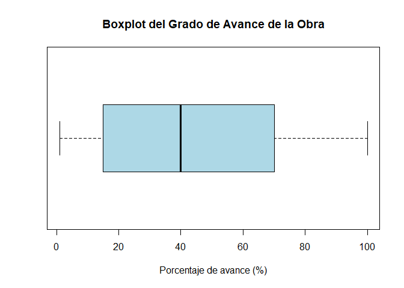</p>

</main>

#### Histograma
Este gráfico muestra la distribución de frecuencia o densidades del grupo de observaciones, **brinda información sobre el valor más probables, la dispersión, la asimetría y valores extremos**. Adicionalmente, tiene la ventaja de que su interpretación es muy intuitiva y por tanto es de los gráficos más preferidos para resumir información. Este gráfico puede ser realizado mediante la función <tt>hist()</tt> de la librería <tt>graphics</tt> de la base del <tt>R</tt>.

<button id="Show8" class="btn btn-secondary">Mostrar Ejemplo una variable</button>
<button id="Hide8" class="btn btn-info">Ocultar Ejemplo una variable</button>
<main id="botoncito8"> 
<h3 data-toc-skip> Histograma </h3> 
<p> Suponga que se desea presentar mediante un histograma, el comportamiento de la variable que corresponde al precio de venta por $m^2$ del inmueble (<tt>preciovtax</tt>). Para ello, podemos emplear la función <tt>hist()</tt> de la forma </p>

<section class="language-r highlighter-rouge"><section class="highlight"><pre class="highlight"><code><span class="c1">## Construcción de histograma</span><span class="w">
</span><span class="nf">hist</span><span class="p">(</span><span class="n">datos</span><span class="o">$</span><span class="n">preciovtax</span><span class="p">,</span><span class="w"> </span><span class="n">main</span><span class="w"> </span><span class="o">=</span><span class="w"> </span><span class="s2">"Histograma del Precio de venta por M2"</span><span class="p">,</span><span class="w"> </span><span class="n">xlab</span><span class="w"> </span><span class="o">=</span><span class="w"> </span><span class="s2">"Precio (en miles de pesos)"</span><span class="p">,</span><span class="w"> 
    </span><span class="n">col</span><span class="w"> </span><span class="o">=</span><span class="w"> </span><span class="m">8</span><span class="p">)</span><span class="w">
</span></code></pre></section></section>

```{r echo=F, eval=F}
## Construcción de histograma
hist(datos$preciovtax, main = "Histograma del Precio de venta por M2", xlab = "Precio (en miles de pesos)", col = 8) 
```

<p>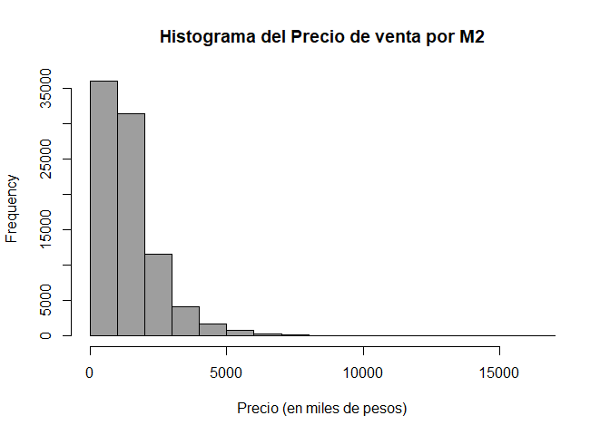</p>

</main>

#### Densidad
Este gráfico funciona similar al histograma de densidades, con la diferencia de que en lugar de mostrar la distribución mediante clases (barras), éste muestra el comportamiento de la distribución de las observaciones mediante una curva. Dicha curva, **brinda mayor información que el histograma respecto al valor promedio, dispersión y asimetría**. Este gráfico puede ser realizado mediante la combinación de las funciones <tt>plot()</tt> y <tt>density()</tt>, de la forma <tt>plot(density())</tt>, siendo <tt>plot()</tt> y <tt>density()</tt> funciones de las librerías <tt>graphics</tt> y <tt>stats</tt> de la base de <tt>R</tt>. 

Adicionalmente se presenta la función <tt>polygon</tt> de la librería <tt>graphics</tt> de la base de <tt>R</tt>, la cual sirve para generar formas, o en este caso, darle color a la densidad.

<button id="Show9" class="btn btn-secondary">Mostrar Ejemplo</button>
<button id="Hide9" class="btn btn-info">Ocultar Ejemplo</button>
<main id="botoncito9"> 
<h3 data-toc-skip> Densidad </h3> 
<p> Suponga que se desea presentar la densidad, de la variable que corresponde al área total vendible por unidad (<tt>areavenuni</tt>). Para ello, podemos emplear la función <tt>hist()</tt> de la forma </p>

<section class="language-r highlighter-rouge"><section class="highlight"><pre class="highlight"><code><span class="c1">## Construcción de la densidad</span><span class="w">
</span><span class="nf">plot</span><span class="p">(</span><span class="nf">density</span><span class="p">(</span><span class="n">datos</span><span class="o">$</span><span class="n">areavenuni</span><span class="p">,</span><span class="w"> </span><span class="n">na.rm</span><span class="w"> </span><span class="o">=</span><span class="w"> </span><span class="nb">T</span><span class="p">),</span><span class="w"> </span><span class="n">main</span><span class="w"> </span><span class="o">=</span><span class="w"> </span><span class="s2">"Gráfico de Densidad para Area Total Vendible"</span><span class="p">,</span><span class="w"> 
    </span><span class="n">xlab</span><span class="w"> </span><span class="o">=</span><span class="w"> </span><span class="s2">"Área Total Vendible"</span><span class="p">,</span><span class="w"> </span><span class="n">lwd</span><span class="w"> </span><span class="o">=</span><span class="w"> </span><span class="m">2</span><span class="p">)</span><span class="w">
</span><span class="c1"># Colorea la densidad</span><span class="w">
</span><span class="nf">polygon</span><span class="p">(</span><span class="nf">density</span><span class="p">(</span><span class="n">datos</span><span class="o">$</span><span class="n">areavenuni</span><span class="p">,</span><span class="w"> </span><span class="n">na.rm</span><span class="w"> </span><span class="o">=</span><span class="w"> </span><span class="nb">T</span><span class="p">),</span><span class="w"> </span><span class="n">col</span><span class="w"> </span><span class="o">=</span><span class="w"> </span><span class="m">3</span><span class="p">)</span><span class="w">
</span></code></pre></section></section>

```{r echo=F, eval=F}
## Construcción de la densidad
plot(density(datos$areavenuni, na.rm = T), main = "Gráfico de Densidad para Area Total Vendible", xlab = "Área Total Vendible", lwd = 2) 
# Colorea la densidad
polygon(density(datos$areavenuni, na.rm = T), col = 3) 
```

<p>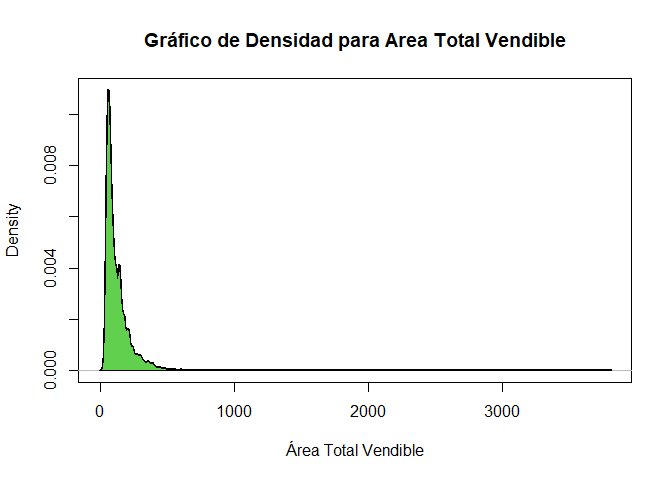</p>

</main>

### Dos variables Cuantitativas

#### Diagrama de dispersión

Este gráfico se emplea para hacer cruces entre dos variables cuantitativas, y **sirve para ver tendencias y relaciones entre dos variables cuantitativas, además de permitir apreciar donde se centra el total de observaciones, y detección de datos atípicos** dados dos atributos cuantitativos. Este gráfico puede ser realizado mediante la función <tt>plot()</tt> de la librería <tt>graphics</tt> de la base del <tt>R</tt>.

<button id="Show10" class="btn btn-secondary">Mostrar Ejemplo</button>
<button id="Hide10" class="btn btn-info">Ocultar Ejemplo</button>
<main id="botoncito10"> 
<h3 data-toc-skip> Diagrama de dispersión </h3> 
<p> Para entender la forma en que se aplica un diagrama de dispersión, suponga que se quiere observar, si éxiste alguna relación entre el área del lote donde se construye la obra o proyecto (<tt>area$\_$lote</tt>) y el precio de venta por $m^2$ (<tt>preciovtax</tt>). Para ello, podemos emplear la función <tt>plot()</tt> de la forma. </p>

<section class="language-r highlighter-rouge"><section class="highlight"><pre class="highlight"><code><span class="c1">## Construcción del diagrama de dispersión</span><span class="w">
</span><span class="nf">plot</span><span class="p">(</span><span class="n">x</span><span class="w"> </span><span class="o">=</span><span class="w"> </span><span class="n">datos</span><span class="o">$</span><span class="n">area_lote</span><span class="p">,</span><span class="w"> </span><span class="n">y</span><span class="w"> </span><span class="o">=</span><span class="w"> </span><span class="n">datos</span><span class="o">$</span><span class="n">preciovtax</span><span class="p">,</span><span class="w"> </span><span class="n">xlab</span><span class="w"> </span><span class="o">=</span><span class="w"> </span><span class="s2">"Área del Lote"</span><span class="p">,</span><span class="w"> </span><span class="n">ylab</span><span class="w"> </span><span class="o">=</span><span class="w"> </span><span class="s2">"Precio de venta (m2)"</span><span class="p">,</span><span class="w"> 
    </span><span class="n">main</span><span class="w"> </span><span class="o">=</span><span class="w"> </span><span class="s2">"Relación entre Área del Lote y Precio de venta m2"</span><span class="p">,</span><span class="w"> </span><span class="n">pch</span><span class="w"> </span><span class="o">=</span><span class="w"> </span><span class="m">19</span><span class="p">)</span><span class="w">
</span></code></pre></section></section>

```{r echo=F, eval=F}
## Construcción del gráfico de dispersión
plot(x = datos$area_lote, y = datos$preciovtax, xlab = "Área del Lote",
     ylab = "Precio de venta (m2)", main = "Relación entre Área del Lote y Precio de venta m2", pch = 19)
```

<p>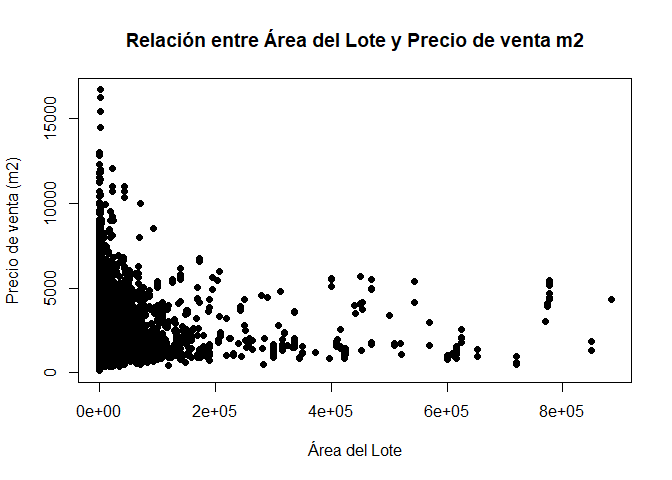</p>

</main>

### Más de dos variables Cuantitativas

#### Matriz de dispersión

Cuando se poseen más de dos variables cuantitativas, es posible presentar un matriz que muestre el cruce entre pares de variables, mediante cuadros con versiones simples de la función <tt>plot()</tt>. Este gráfico puede ser realizado mediante la función <tt>pairs()</tt> de la librería <tt>graphics</tt> de la base de <tt>R</tt>.

<button id="Show11" class="btn btn-secondary">Mostrar Ejemplo</button>
<button id="Hide11" class="btn btn-info">Ocultar Ejemplo</button>
<main id="botoncito11"> 
<h3 data-toc-skip> Matriz de dispersión </h3> 
<p> Para ello, suponga que se desea observar la relación que hay entre las variables, área del lote donde se construye la obra o proyecto (<tt>area$\_$lote</tt>), porcentaje de avance de la obra en contrucción (<tt>gradoavanc</tt>) y área total vendible por unidad (<tt>areavenuni</tt>). Para ello empleamos la función <tt>pairs()</tt> de la forma. </p>

<section class="language-r highlighter-rouge"><section class="highlight"><pre class="highlight"><code><span class="c1">## Matríz de dispersión básica</span><span class="w">
</span><span class="nf">pairs</span><span class="p">(</span><span class="nf">cbind</span><span class="p">(</span><span class="n">datos</span><span class="o">$</span><span class="n">area_lote</span><span class="p">,</span><span class="w"> </span><span class="n">datos</span><span class="o">$</span><span class="n">gradoavanc</span><span class="p">,</span><span class="w"> </span><span class="n">datos</span><span class="o">$</span><span class="n">areavenuni</span><span class="p">),</span><span class="w"> </span><span class="n">labels</span><span class="w"> </span><span class="o">=</span><span class="w"> </span><span class="nf">c</span><span class="p">(</span><span class="s2">"Área Lote"</span><span class="p">,</span><span class="w"> 
    </span><span class="s2">"Porcentaje de Avance"</span><span class="p">,</span><span class="w"> </span><span class="s2">"Área Total Vendible"</span><span class="p">))</span><span class="w">
</span></code></pre></section></section>

```{r echo=F, eval=F}
## Matríz de dispersión básica
pairs(cbind(datos$area_lote, datos$gradoavanc, datos$areavenuni), labels = c("Área Lote", "Porcentaje de Avance", "Área Total Vendible"))
```

<p>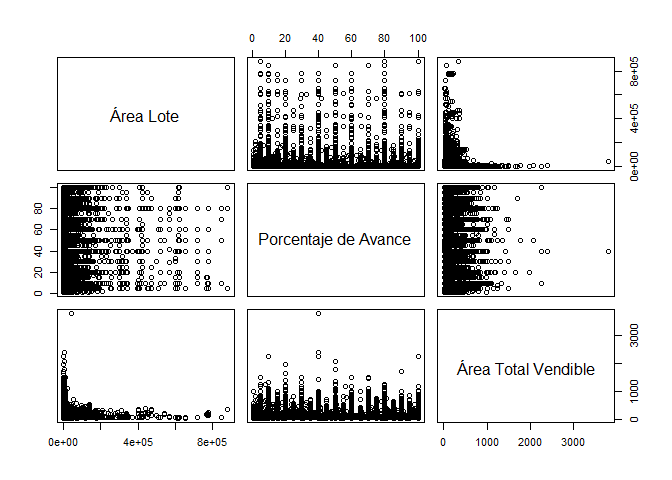</p>

<p>Funciones complementarias pueden ser desarrolladas para mejorar la
visualización los pares de variables. En el libro de <a href="#ref-Hernandez2018">Hernández &amp;
Correa</a> (<a href="#ref-Hernandez2018">2018, pp. 40–49</a>), se
presentan diferentes funciones que pueden ser implementadas. Entre ellas
la siguiente función</p>

<section class="language-r highlighter-rouge"><section class="highlight"><pre class="highlight"><code><span class="c1">## Matríz de dispersión avanzada Función para dibujar la dispersión y agregar la</span><span class="w">
</span><span class="c1">## recta de regresión</span><span class="w">
</span><span class="n">panel.reg</span><span class="w"> </span><span class="o">&lt;-</span><span class="w"> </span><span class="k">function</span><span class="p">(</span><span class="n">x</span><span class="p">,</span><span class="w"> </span><span class="n">y</span><span class="p">)</span><span class="w"> </span><span class="p">{</span><span class="w">
    </span><span class="n">points</span><span class="p">(</span><span class="n">x</span><span class="p">,</span><span class="w"> </span><span class="n">y</span><span class="p">,</span><span class="w"> </span><span class="n">pch</span><span class="w"> </span><span class="o">=</span><span class="w"> </span><span class="m">20</span><span class="p">)</span><span class="w">
    </span><span class="n">abline</span><span class="p">(</span><span class="n">lm</span><span class="p">(</span><span class="n">y</span><span class="w"> </span><span class="o">~</span><span class="w"> </span><span class="n">x</span><span class="p">),</span><span class="w"> </span><span class="n">lwd</span><span class="w"> </span><span class="o">=</span><span class="w"> </span><span class="m">2</span><span class="p">,</span><span class="w"> </span><span class="n">col</span><span class="w"> </span><span class="o">=</span><span class="w"> </span><span class="s2">"dodgerblue2"</span><span class="p">)</span><span class="w">
</span><span class="p">}</span><span class="w">
</span><span class="c1"># Función para crear el histograma</span><span class="w">
</span><span class="n">panel.hist</span><span class="w"> </span><span class="o">&lt;-</span><span class="w"> </span><span class="k">function</span><span class="p">(</span><span class="n">x</span><span class="p">,</span><span class="w"> </span><span class="n">...</span><span class="p">)</span><span class="w"> </span><span class="p">{</span><span class="w">
    </span><span class="n">usr</span><span class="w"> </span><span class="o">&lt;-</span><span class="w"> </span><span class="n">par</span><span class="p">(</span><span class="s2">"usr"</span><span class="p">)</span><span class="w">
    </span><span class="nf">on.exit</span><span class="p">(</span><span class="n">par</span><span class="p">(</span><span class="n">usr</span><span class="p">))</span><span class="w">
    </span><span class="n">par</span><span class="p">(</span><span class="n">usr</span><span class="w"> </span><span class="o">=</span><span class="w"> </span><span class="nf">c</span><span class="p">(</span><span class="n">usr</span><span class="p">[</span><span class="m">1</span><span class="o">:</span><span class="m">2</span><span class="p">],</span><span class="w"> </span><span class="m">0</span><span class="p">,</span><span class="w"> </span><span class="m">1.5</span><span class="p">))</span><span class="w">
    </span><span class="n">h</span><span class="w"> </span><span class="o">&lt;-</span><span class="w"> </span><span class="n">hist</span><span class="p">(</span><span class="n">x</span><span class="p">,</span><span class="w"> </span><span class="n">plot</span><span class="w"> </span><span class="o">=</span><span class="w"> </span><span class="kc">FALSE</span><span class="p">)</span><span class="w">
    </span><span class="n">breaks</span><span class="w"> </span><span class="o">&lt;-</span><span class="w"> </span><span class="n">h</span><span class="o">$</span><span class="n">breaks</span><span class="w">
    </span><span class="n">nB</span><span class="w"> </span><span class="o">&lt;-</span><span class="w"> </span><span class="nf">length</span><span class="p">(</span><span class="n">breaks</span><span class="p">)</span><span class="w">
    </span><span class="n">y</span><span class="w"> </span><span class="o">&lt;-</span><span class="w"> </span><span class="n">h</span><span class="o">$</span><span class="n">counts</span><span class="w">
    </span><span class="n">y</span><span class="w"> </span><span class="o">&lt;-</span><span class="w"> </span><span class="n">y</span><span class="o">/</span><span class="nf">max</span><span class="p">(</span><span class="n">y</span><span class="p">)</span><span class="w">
    </span><span class="n">rect</span><span class="p">(</span><span class="n">breaks</span><span class="p">[</span><span class="o">-</span><span class="n">nB</span><span class="p">],</span><span class="w"> </span><span class="m">0</span><span class="p">,</span><span class="w"> </span><span class="n">breaks</span><span class="p">[</span><span class="m">-1</span><span class="p">],</span><span class="w"> </span><span class="n">y</span><span class="p">,</span><span class="w"> </span><span class="n">col</span><span class="w"> </span><span class="o">=</span><span class="w"> </span><span class="s2">"dodgerblue2"</span><span class="p">,</span><span class="w"> </span><span class="n">...</span><span class="p">)</span><span class="w">
</span><span class="p">}</span><span class="w">
</span><span class="c1"># Función para obtener la correlación</span><span class="w">
</span><span class="n">panel.cor</span><span class="w"> </span><span class="o">&lt;-</span><span class="w"> </span><span class="k">function</span><span class="p">(</span><span class="n">x</span><span class="p">,</span><span class="w"> </span><span class="n">y</span><span class="p">,</span><span class="w"> </span><span class="n">digits</span><span class="w"> </span><span class="o">=</span><span class="w"> </span><span class="m">2</span><span class="p">,</span><span class="w"> </span><span class="n">prefix</span><span class="w"> </span><span class="o">=</span><span class="w"> </span><span class="s2">""</span><span class="p">,</span><span class="w"> </span><span class="n">cex.cor</span><span class="p">)</span><span class="w"> </span><span class="p">{</span><span class="w">
    </span><span class="n">usr</span><span class="w"> </span><span class="o">&lt;-</span><span class="w"> </span><span class="n">par</span><span class="p">(</span><span class="s2">"usr"</span><span class="p">)</span><span class="w">
    </span><span class="nf">on.exit</span><span class="p">(</span><span class="n">par</span><span class="p">(</span><span class="n">usr</span><span class="p">))</span><span class="w">
    </span><span class="n">par</span><span class="p">(</span><span class="n">usr</span><span class="w"> </span><span class="o">=</span><span class="w"> </span><span class="nf">c</span><span class="p">(</span><span class="m">0</span><span class="p">,</span><span class="w"> </span><span class="m">1</span><span class="p">,</span><span class="w"> </span><span class="m">0</span><span class="p">,</span><span class="w"> </span><span class="m">1</span><span class="p">))</span><span class="w">
    </span><span class="n">r</span><span class="w"> </span><span class="o">&lt;-</span><span class="w"> </span><span class="nf">abs</span><span class="p">(</span><span class="n">cor</span><span class="p">(</span><span class="n">x</span><span class="p">,</span><span class="w"> </span><span class="n">y</span><span class="p">))</span><span class="w">
    </span><span class="n">txt</span><span class="w"> </span><span class="o">&lt;-</span><span class="w"> </span><span class="n">format</span><span class="p">(</span><span class="nf">c</span><span class="p">(</span><span class="n">r</span><span class="p">,</span><span class="w"> </span><span class="m">0.123456789</span><span class="p">),</span><span class="w"> </span><span class="n">digits</span><span class="w"> </span><span class="o">=</span><span class="w"> </span><span class="n">digits</span><span class="p">)[</span><span class="m">1</span><span class="p">]</span><span class="w">
    </span><span class="n">txt</span><span class="w"> </span><span class="o">&lt;-</span><span class="w"> </span><span class="n">paste</span><span class="p">(</span><span class="n">prefix</span><span class="p">,</span><span class="w"> </span><span class="n">txt</span><span class="p">,</span><span class="w"> </span><span class="n">sep</span><span class="w"> </span><span class="o">=</span><span class="w"> </span><span class="s2">""</span><span class="p">)</span><span class="w">
    </span><span class="k">if</span><span class="w"> </span><span class="p">(</span><span class="nf">missing</span><span class="p">(</span><span class="n">cex.cor</span><span class="p">))</span><span class="w"> 
        </span><span class="n">cex</span><span class="w"> </span><span class="o">&lt;-</span><span class="w"> </span><span class="m">0.8</span><span class="w">
    </span><span class="n">text</span><span class="p">(</span><span class="m">0.5</span><span class="p">,</span><span class="w"> </span><span class="m">0.5</span><span class="p">,</span><span class="w"> </span><span class="n">txt</span><span class="p">,</span><span class="w"> </span><span class="n">cex</span><span class="w"> </span><span class="o">=</span><span class="w"> </span><span class="n">cex</span><span class="p">)</span><span class="w">
</span><span class="p">}</span><span class="w">

</span><span class="nf">pairs</span><span class="p">(</span><span class="nf">cbind</span><span class="p">(</span><span class="n">datos</span><span class="o">$</span><span class="n">area_lote</span><span class="p">,</span><span class="w"> </span><span class="n">datos</span><span class="o">$</span><span class="n">gradoavanc</span><span class="p">,</span><span class="w"> </span><span class="n">datos</span><span class="o">$</span><span class="n">areavenuni</span><span class="p">),</span><span class="w"> </span><span class="n">labels</span><span class="w"> </span><span class="o">=</span><span class="w"> </span><span class="nf">c</span><span class="p">(</span><span class="s2">"Área Lote"</span><span class="p">,</span><span class="w"> 
    </span><span class="s2">"Porcentaje de Avance"</span><span class="p">,</span><span class="w"> </span><span class="s2">"Área Total Vendible"</span><span class="p">),</span><span class="w"> </span><span class="n">upper.panel</span><span class="w"> </span><span class="o">=</span><span class="w"> </span><span class="n">panel.reg</span><span class="p">,</span><span class="w"> </span><span class="n">diag.panel</span><span class="w"> </span><span class="o">=</span><span class="w"> </span><span class="n">panel.hist</span><span class="p">,</span><span class="w"> 
    </span><span class="n">lower.panel</span><span class="w"> </span><span class="o">=</span><span class="w"> </span><span class="n">panel.cor</span><span class="p">)</span><span class="w">
</span></code></pre></section></section>

```{r echo=F, eval=F}
## Matríz de dispersión avanzada
# Función para dibujar la dispersión y agregar la recta de regresión
panel.reg <- function(x, y)
{
  points(x, y, pch=20)
  abline(lm(y ~ x), lwd=2, col='dodgerblue2')
}
# Función para crear el histograma
panel.hist <- function(x, ...)
{
  usr <- par("usr"); on.exit(par(usr))
  par(usr = c(usr[1:2], 0, 1.5) )
  h <- hist(x, plot = FALSE)
  breaks <- h$breaks; nB <- length(breaks)
  y <- h$counts; y <- y/max(y)
  rect(breaks[-nB], 0, breaks[-1], y, col="dodgerblue2", ...)
}
# Función para obtener la correlación
panel.cor <- function(x, y, digits=2, prefix="", cex.cor)
{
  usr <- par("usr"); on.exit(par(usr))
  par(usr = c(0, 1, 0, 1))
  r <- abs(cor(x, y))
  txt <- format(c(r, 0.123456789), digits=digits)[1]
  txt <- paste(prefix, txt, sep="")
  if(missing(cex.cor)) cex <- 0.8
  text(0.5, 0.5, txt, cex = cex)
}

pairs(cbind(datos$area_lote, datos$gradoavanc, datos$areavenuni), labels = c("Área Lote", "Porcentaje de Avance", "Área Total Vendible"), upper.panel = panel.reg, diag.panel = panel.hist, lower.panel = panel.cor)
```

<p>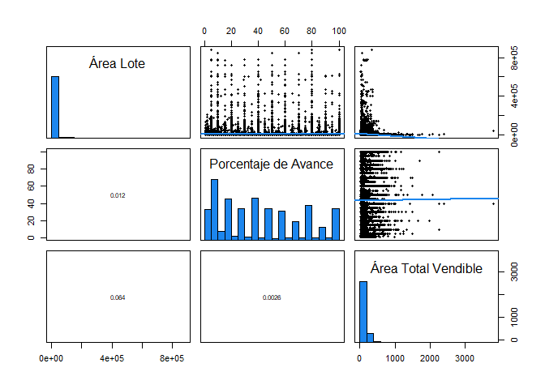</p>

</main>

### Una Variable Cualitativa

#### Gráfico de barras

Sirve para resumir una variable cualitativa mediante barras de frecuencias absolutas o relativas. Éste **permite observar la concentración de observaciones en una o más categorías diferentes**. Este gráfico puede ser realizado mediante la función <tt>barplot()</tt> de la librería <tt>graphics</tt> de la base de <tt>R</tt>.

<button id="Show12" class="btn btn-secondary">Mostrar Ejemplo una variable</button>
<button id="Hide12" class="btn btn-info">Ocultar Ejemplo una variable</button>
<main id="botoncito12"> 
<h3 data-toc-skip> Gráfico de barras una variable</h3> 
<p> Para ilustrar su empleo, suponga que se desea observar el estado en el cual se encontraron las obras al momento de realizar el censo (<tt>estado$\_$act</tt>). En este caso, la función <tt>barplot()</tt> se emplea de la siguiente forma. </p>

<section class="language-r highlighter-rouge"><section class="highlight"><pre class="highlight"><code><span class="c1"># Gráfico de barras</span><span class="w">
</span><span class="n">tabla1</span><span class="w"> </span><span class="o">&lt;-</span><span class="w"> </span><span class="nf">table</span><span class="p">(</span><span class="n">datos</span><span class="o">$</span><span class="n">estado_ac</span><span class="p">)</span><span class="w">
</span><span class="nf">barplot</span><span class="p">(</span><span class="n">tabla1</span><span class="p">,</span><span class="w"> </span><span class="n">main</span><span class="w"> </span><span class="o">=</span><span class="w"> </span><span class="s2">"Estado en el cual se encontraron las obras al momento del censo"</span><span class="p">,</span><span class="w"> 
    </span><span class="n">col</span><span class="w"> </span><span class="o">=</span><span class="w"> </span><span class="n">hcl.colors</span><span class="p">(</span><span class="m">6</span><span class="p">))</span><span class="w">
</span></code></pre></section></section>

```{r echo=F, eval=F}
# Gráfico de barras
tabla1 <- table(datos$estado_ac)
barplot(tabla1, main = "Estado en el cual se encontraron las obras al momento del censo", col = hcl.colors(6)) 
```

<p>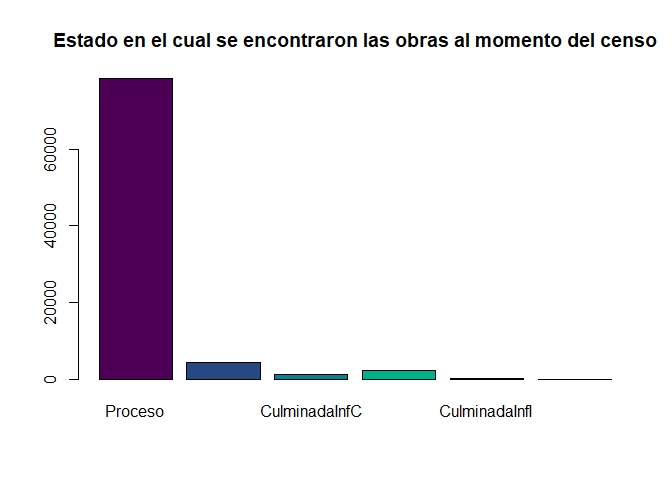</p>

</main>

#### Gráfico de pareto

Este gráfico es similar al gráfico de barras para una sola variable cualitativa, pero con la ventaja de que **presenta las frecuencias absolutas, relativas, y las frecuencias acumuladas absolutas y acumuladas relativas en el mismo gráfico**. Este gráfico puede ser realizado mediante la función <tt>pareto.chart()</tt> de la librería <tt>qqc</tt>.

<button id="Show13" class="btn btn-secondary">Mostrar Ejemplo una variable</button>
<button id="Hide13" class="btn btn-info">Ocultar Ejemplo una variable</button>
<main id="botoncito13"> 
<h3 data-toc-skip> Gráfico de pareto </h3> 
<p> Para ilustrar su empleo, suponga que se desea observar el estrato socioeconómico en donde se está realizado la obra (<tt>estrato</tt>). Al ser una sola variable, la función <tt>pareto.chart()</tt> se emplea de la siguiente forma. </p>

<section class="language-r highlighter-rouge"><section class="highlight"><pre class="highlight"><code><span class="nf">library</span><span class="p">(</span><span class="n">qcc</span><span class="p">)</span><span class="w">

</span><span class="c1"># Gráfico de pareto</span><span class="w">
</span><span class="n">tabla2</span><span class="w"> </span><span class="o">&lt;-</span><span class="w"> </span><span class="nf">table</span><span class="p">(</span><span class="n">datos</span><span class="o">$</span><span class="n">estrato</span><span class="p">)</span><span class="w">
</span><span class="nf">pareto.chart</span><span class="p">(</span><span class="n">tabla2</span><span class="p">,</span><span class="w"> </span><span class="n">main</span><span class="w"> </span><span class="o">=</span><span class="w"> </span><span class="s2">"Gráfico Pareto por Estrato"</span><span class="p">)</span><span class="w">
</span></code></pre></section></section>

```{r echo=F, eval=F}
library(qcc)

# Gráfico de pareto
tabla2 <- table(datos$estrato)
pareto.chart(tabla2, main = "Gráfico Pareto por Estrato")
```

<p>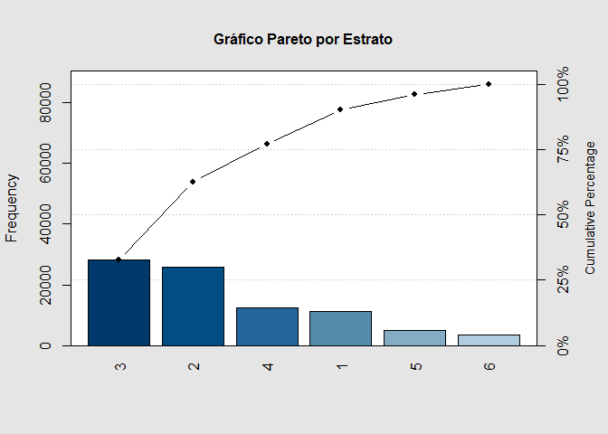</p>

<section class="highlighter-rouge"><section class="highlight"><pre class="highlight"><code>Pareto chart analysis for tabla2
       Frequency    Cum.Freq.   Percentage Cum.Percent.
  3 28138.000000 28138.000000    32.662395    32.662395
  2 25852.000000 53990.000000    30.008822    62.671217
  4 12452.000000 66442.000000    14.454195    77.125412
  1 11171.000000 77613.000000    12.967219    90.092631
  5  5011.000000 82624.000000     5.816734    95.909365
  6  3524.000000 86148.000000     4.090635   100.000000
</code></pre></section></section>

</main>

#### Gráfico de pastel

Este gráfico también **sirve para representar gráficamente las tablas de frecuencias absolutas y relativas para una variable cualitativa**. A pesar de ser un gráfico muy usado en la práctica, **no muestra bien la información que se desea presentar**, ya que siempre debe estar acompañado de los porcentajes o frecuencias que representa cada área, ya que no hacerlo, dicho gráfico puede ser muy engañoso. 

Este gráfico puede ser realizado mediante la función <tt>pie()</tt> de la librería <tt>graphics</tt> de la base de <tt>R</tt>, y donde, para establecer etiquetas de los porcentajes o frecuencias de cada área, puede establecerse mediante la función <tt>legend()</tt> de la librería <tt>graphics</tt> de la base de <tt>R</tt>.

<button id="Show14" class="btn btn-secondary">Mostrar Ejemplo una variable</button>
<button id="Hide14" class="btn btn-info">Ocultar Ejemplo una variable</button>
<main id="botoncito14"> 
<h3 data-toc-skip> Gráfico de pastel </h3> 
<p> Empleamos la variable del estado en que se encuentra la obra (<tt>movimiento</tt>) para ilustrar el empleo del gráfico de pastel. En dicho caso, la estructura de la función <tt>pie()</tt> y <tt>legend()</tt> será de la forma. </p>

<section class="language-r highlighter-rouge"><section class="highlight"><pre class="highlight"><code><span class="c1"># Gráfico de pastel una variable de frecuencias absolutas</span><span class="w">
</span><span class="n">tabla3</span><span class="w"> </span><span class="o">&lt;-</span><span class="w"> </span><span class="nf">prop.table</span><span class="p">(</span><span class="n">table</span><span class="p">(</span><span class="n">datos</span><span class="o">$</span><span class="n">movimiento</span><span class="p">))</span><span class="w">
</span><span class="nf">pie</span><span class="p">(</span><span class="n">tabla3</span><span class="p">,</span><span class="w"> </span><span class="n">main</span><span class="w"> </span><span class="o">=</span><span class="w"> </span><span class="s2">"Estado en que se encuentra la obra"</span><span class="p">,</span><span class="w"> </span><span class="n">col</span><span class="w"> </span><span class="o">=</span><span class="w"> </span><span class="n">cm.colors</span><span class="p">(</span><span class="m">6</span><span class="p">))</span><span class="w">
</span><span class="nf">legend</span><span class="p">(</span><span class="s2">"topleft"</span><span class="p">,</span><span class="w"> </span><span class="n">legend</span><span class="w"> </span><span class="o">=</span><span class="w"> </span><span class="n">paste0</span><span class="p">(</span><span class="nf">names</span><span class="p">(</span><span class="n">tabla3</span><span class="p">),</span><span class="w"> </span><span class="s2">" ("</span><span class="p">,</span><span class="w"> </span><span class="nf">round</span><span class="p">(</span><span class="n">tabla3</span><span class="p">,</span><span class="w"> </span><span class="m">4</span><span class="p">),</span><span class="w"> </span><span class="s2">")"</span><span class="p">),</span><span class="w"> </span><span class="n">fill</span><span class="w"> </span><span class="o">=</span><span class="w"> </span><span class="n">cm.colors</span><span class="p">(</span><span class="m">6</span><span class="p">),</span><span class="w"> 
    </span><span class="n">cex</span><span class="w"> </span><span class="o">=</span><span class="w"> </span><span class="m">0.8</span><span class="p">)</span><span class="w">
</span></code></pre></section></section>

```{r echo=F, eval=F}
# Gráfico de pastel una variable de frecuencias absolutas
tabla3 <- prop.table(table(datos$movimiento))
pie(tabla3, main = "Estado en que se encuentra la obra", col = cm.colors(6))
legend("topleft", legend = paste0(names(tabla3), " (", round(tabla3,4), ")"), fill = cm.colors(6), cex = 0.8)
```

<p>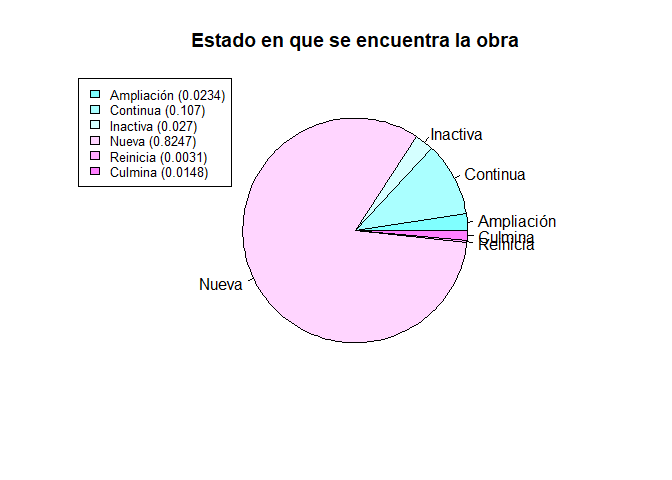</p>

</main>

### Dos Variables Cualitativas

#### Gráfico de barras

El gráfico de barras también sirve para resumir dos variable cualitativa mediante barras de frecuencias absolutas o relativas. **La interpretación, será la misma que para una sola variable cualitativa, con la diferencia de que en este caso, se podrán hacer comparaciones por categorías adicionales.** Este gráfico puede ser realizado mediante la función <tt>barplot()</tt> de la librería <tt>graphics</tt> de la base de <tt>R</tt>, junto a la función <tt>legend()</tt>, para establecer las etiquetas asociadas a cada una de las barras que se presenten en el gráfico.

<button id="Show15" class="btn btn-secondary">Mostrar Ejemplo una variable</button>
<button id="Hide15" class="btn btn-info">Ocultar Ejemplo una variable</button>
<main id="botoncito15"> 
<h3 data-toc-skip> Gráfico de barras dos variables </h3> 
<p> Para ilustrar su empleo, suponga que se desea observar el estado en el cual se encontraron las obras al momento de realizar el censo (<tt>estado$\_$act</tt>), respecto a si la obra cuenta o no con licencia (<tt>ob$\_$formal</tt>). En este caso, la función <tt>barplot()</tt> se emplea junto a la función <tt>legend()</tt> de la siguiente forma. </p>

<section class="language-r highlighter-rouge"><section class="highlight"><pre class="highlight"><code><span class="c1"># Gráfico de barras</span><span class="w">
</span><span class="n">tabla4</span><span class="w"> </span><span class="o">&lt;-</span><span class="w"> </span><span class="nf">table</span><span class="p">(</span><span class="n">datos</span><span class="o">$</span><span class="n">estado_ac</span><span class="p">,</span><span class="w"> </span><span class="n">datos</span><span class="o">$</span><span class="n">ob_formal</span><span class="p">)</span><span class="w">
</span><span class="nf">barplot</span><span class="p">(</span><span class="n">tabla4</span><span class="p">,</span><span class="w"> </span><span class="n">main</span><span class="w"> </span><span class="o">=</span><span class="w"> </span><span class="s2">"Estado de la obra respecto a si la obra cuenta o no con licencia"</span><span class="p">,</span><span class="w"> 
    </span><span class="n">col</span><span class="w"> </span><span class="o">=</span><span class="w"> </span><span class="n">hcl.colors</span><span class="p">(</span><span class="m">6</span><span class="p">),</span><span class="w"> </span><span class="n">beside</span><span class="w"> </span><span class="o">=</span><span class="w"> </span><span class="nb">T</span><span class="p">)</span><span class="w">
</span><span class="nf">legend</span><span class="p">(</span><span class="s2">"topright"</span><span class="p">,</span><span class="w"> </span><span class="n">rownames</span><span class="p">(</span><span class="n">tabla4</span><span class="p">),</span><span class="w"> </span><span class="n">fill</span><span class="w"> </span><span class="o">=</span><span class="w"> </span><span class="n">topo.colors</span><span class="p">(</span><span class="m">6</span><span class="p">),</span><span class="w"> </span><span class="n">cex</span><span class="w"> </span><span class="o">=</span><span class="w"> </span><span class="m">0.8</span><span class="p">)</span><span class="w">
</span></code></pre></section></section>

```{r echo=F, eval=F}
# Gráfico de barras
tabla4 <- table(datos$estado_ac, datos$ob_formal)
barplot(tabla4, main = "Estado de la obra respecto a si la obra cuenta o no con licencia", col = hcl.colors(6), beside = T) 
legend("topright", rownames(tabla4), fill = topo.colors(6), cex = 0.8) 
```

<p>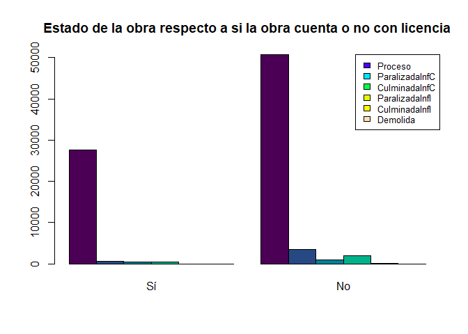</p>

</main>


#### Gráfico de balón

El gráfico de balón, suele ser un gráfico más avanzado para resumir dos variable cualitativa, en donde **se establecen en el cruce de las dos variables, círculos que se asocian al tamaño del cruce de las dos variables cualitativas**. Este gráfico puede ser realizado mediante la función <tt>ggballoonplot()</tt> de la librería <tt>ggpubr</tt>, la cual depende de la librería <tt>ggplot2</tt>.

<button id="Show16" class="btn btn-secondary">Mostrar Ejemplo una variable</button>
<button id="Hide16" class="btn btn-info">Ocultar Ejemplo una variable</button>
<main id="botoncito16"> 
<h3 data-toc-skip> Gráfico de balón </h3> 
<p> Para ilustrar el empleo de la función, suponga que se desea observar el estado en el cual se encontraron las obras al momento de realizar el censo (<tt>estado$\_$act</tt>), respecto al estado en que se encuentra la obra (<tt>movimiento</tt>). En este caso, la función <tt>ggballoonplot()</tt> puede emplearse de la forma. </p>

<section class="language-r highlighter-rouge"><section class="highlight"><pre class="highlight"><code><span class="nf">library</span><span class="p">(</span><span class="n">ggplot2</span><span class="p">)</span><span class="w">
</span><span class="nf">library</span><span class="p">(</span><span class="n">ggpubr</span><span class="p">)</span><span class="w">
</span><span class="nf">theme_set</span><span class="p">(</span><span class="n">theme_pubr</span><span class="p">())</span><span class="w">

</span><span class="c1"># Gráfico de balón</span><span class="w">
</span><span class="n">tabla5</span><span class="w"> </span><span class="o">&lt;-</span><span class="w"> </span><span class="nf">data.frame</span><span class="p">(</span><span class="n">table</span><span class="p">(</span><span class="n">datos</span><span class="o">$</span><span class="n">estado_ac</span><span class="p">,</span><span class="w"> </span><span class="n">datos</span><span class="o">$</span><span class="n">movimiento</span><span class="p">))</span><span class="w">
</span><span class="nf">ggballoonplot</span><span class="p">(</span><span class="n">tabla5</span><span class="p">,</span><span class="w"> </span><span class="n">fill</span><span class="w"> </span><span class="o">=</span><span class="w"> </span><span class="s2">"value"</span><span class="p">)</span><span class="w"> </span><span class="o">+</span><span class="w"> </span><span class="n">scale_fill_viridis_c</span><span class="p">(</span><span class="n">option</span><span class="w"> </span><span class="o">=</span><span class="w"> </span><span class="s2">"C"</span><span class="p">)</span><span class="w">
</span></code></pre></section></section>

```{r echo=F, eval=F}
library(ggplot2)
library(ggpubr)
theme_set(theme_pubr())

# Gráfico de balón
tabla5 <- data.frame(table(datos$estado_ac, datos$movimiento))
ggballoonplot(tabla5, fill = "value")+
  scale_fill_viridis_c(option = "C")
```

<p>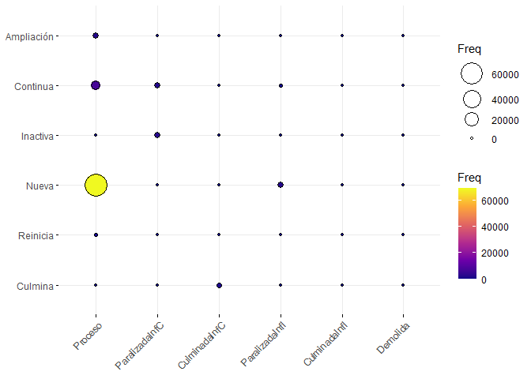</p>

</main>

### Cruce entre Variables Cualitativas y Cuantitativas

#### Gráfico de caja y bigotes

Este gráfico sirve para presentar de forma visual, datos numéricos **por categorías** a través de sus cuartiles, además de presentar **otras características importantes, tales como la dispersión, simetría y datos potencialmente atípicos**. Este gráfico puede ser realizado mediante la función <tt>boxplot()</tt> de la librería <tt>graphics</tt> de <tt>R</tt>.

<button id="Show17" class="btn btn-secondary">Mostrar Ejemplo una variable</button>
<button id="Hide17" class="btn btn-info">Ocultar Ejemplo una variable</button>
<main id="botoncito17"> 
<h3 data-toc-skip> Gráfico de caja y bigotes por grupos </h3> 
<p> Suponga que se tiene interés en realizar un cruce entre la variable cualitativa que indica si la obra cuenta o no con licencia (<tt>ob$\_$formal</tt>) y la variable cuantitativa del grado de avance de la obra (<tt>gradoavanc</tt>). Para ello, puede emplearse el gráfico de caja y bigotes de la forma. </p>

<section class="language-r highlighter-rouge"><section class="highlight"><pre class="highlight"><code><span class="c1"># Construcción de gráfico de caja y bigotes por categorías</span><span class="w">
</span><span class="nf">boxplot</span><span class="p">(</span><span class="n">datos</span><span class="o">$</span><span class="n">gradoavanc</span><span class="w"> </span><span class="o">~</span><span class="w"> </span><span class="n">datos</span><span class="o">$</span><span class="n">ob_formal</span><span class="p">,</span><span class="w"> </span><span class="n">horizontal</span><span class="w"> </span><span class="o">=</span><span class="w"> </span><span class="nb">T</span><span class="p">,</span><span class="w"> </span><span class="n">xlab</span><span class="w"> </span><span class="o">=</span><span class="w"> </span><span class="s2">"Grado de avance"</span><span class="p">,</span><span class="w"> 
    </span><span class="n">ylab</span><span class="w"> </span><span class="o">=</span><span class="w"> </span><span class="s2">"Posee licencia?"</span><span class="p">,</span><span class="w"> </span><span class="n">main</span><span class="w"> </span><span class="o">=</span><span class="w"> </span><span class="s2">"Grado de avance respecto a la posesión de licencia"</span><span class="p">,</span><span class="w"> 
    </span><span class="n">col</span><span class="w"> </span><span class="o">=</span><span class="w"> </span><span class="n">terrain.colors</span><span class="p">(</span><span class="m">2</span><span class="p">))</span><span class="w">
</span></code></pre></section></section>

```{r echo=F, eval=F}
library(ggplot2)
library(ggpubr)
theme_set(theme_pubr())

# Construcción de gráfico de caja y bigotes por categorías
boxplot(datos$gradoavanc ~ datos$ob_formal, horizontal = T, xlab = "Grado de avance", ylab = "Posee licencia?", main = "Grado de avance respecto a la posesión de licencia", col = terrain.colors(2))
```

<p></p>

</main>


#### Gráfico de medias

Este gráfico **sirve para presentar de forma visual, grupos de datos numéricos a través de sus media y desviación estándar**. El gráfico está compuesto por un punto que representa el valor promedio del grupo de observaciones y **las barras representan dos desviación estándar de la media**. En donde, si las barras no se superponen, entonces se tendrá evidencia sólida respecto a que la media de los grupos es diferente.

<button id="Show18" class="btn btn-secondary">Mostrar Ejemplo una variable</button>
<button id="Hide18" class="btn btn-info">Ocultar Ejemplo una variable</button>
<main id="botoncito18"> 
<h3 data-toc-skip> Gráfico de medias </h3> 
<p> Este gráfico puede ser realizado mediante la función <tt>plotMeans()</tt> de la librería <tt>RcmdrMisc</tt>. Y para ilustrar su empleo, suponga que se desea observar área total vendible (<tt>areavendib</tt>), respecto al rango de vivienda calculado (<tt>ranvivi</tt>). Ésto se puede realizar mediante la forma. </p>

<section class="language-r highlighter-rouge"><section class="highlight"><pre class="highlight"><code><span class="nf">library</span><span class="p">(</span><span class="n">RcmdrMisc</span><span class="p">)</span><span class="w">

</span><span class="c1">## Construcción de diagrama de caja y bigotes por categorías Recordar escribir en</span><span class="w">
</span><span class="c1">## error.bars = 'conf.int' porque por defecto se presenta un intervalo para el</span><span class="w">
</span><span class="c1">## error estándar y no para dos desviaciones estándar.</span><span class="w">
</span><span class="nf">plotMeans</span><span class="p">(</span><span class="n">response</span><span class="w"> </span><span class="o">=</span><span class="w"> </span><span class="n">datos</span><span class="o">$</span><span class="n">areavendib</span><span class="p">,</span><span class="w"> </span><span class="n">factor1</span><span class="w"> </span><span class="o">=</span><span class="w"> </span><span class="n">datos</span><span class="o">$</span><span class="n">ranvivi</span><span class="p">,</span><span class="w"> </span><span class="n">error.bars</span><span class="w"> </span><span class="o">=</span><span class="w"> </span><span class="s2">"conf.int"</span><span class="p">,</span><span class="w"> 
    </span><span class="n">xlab</span><span class="w"> </span><span class="o">=</span><span class="w"> </span><span class="s2">"Área total vendible"</span><span class="p">,</span><span class="w"> </span><span class="n">ylab</span><span class="w"> </span><span class="o">=</span><span class="w"> </span><span class="s2">"Rangos de vivienda"</span><span class="p">,</span><span class="w"> </span><span class="n">main</span><span class="w"> </span><span class="o">=</span><span class="w"> </span><span class="s2">"Área vendible respecto a rangos de vivienda"</span><span class="p">)</span><span class="w">
</span></code></pre></section></section>

```{r echo=F, eval=F}
library(RcmdrMisc)

## Construcción de gráfico de medias
# Recordar escribir en error.bars = "conf.int" porque por defecto se presenta un intervalo para el error estándar y no para dos desviaciones estándar.
plotMeans(response = datos$areavendib, factor1 = datos$ranvivi, error.bars = "conf.int", xlab = "Área total vendible", ylab = "Rangos de vivienda", main = "Área vendible respecto a rangos de vivienda")
```

<p>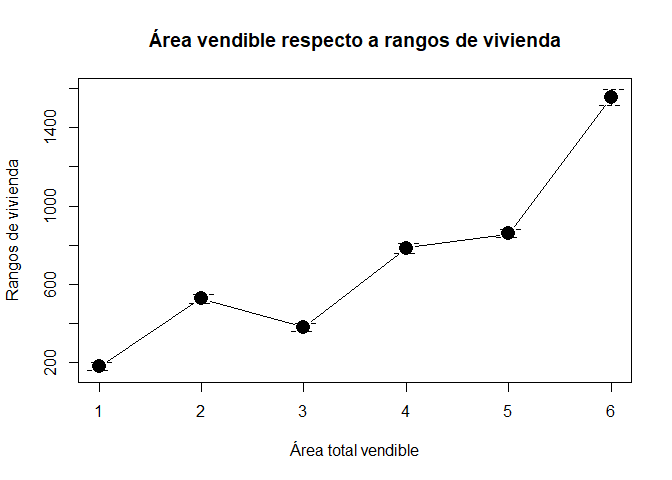</p>

</main>

