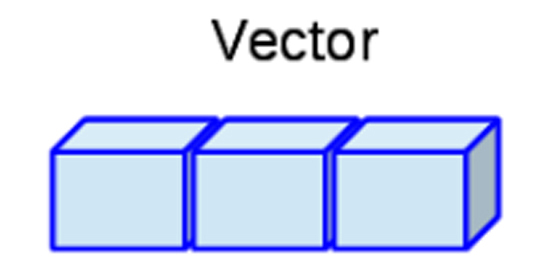

```{r knitr_init, echo=FALSE, cache=FALSE}
library(knitr)
## Global options
opts_chunk$set(echo=TRUE,
               cache=TRUE,
               prompt=FALSE,
               tidy=TRUE,
               comment=NA,
               message=FALSE,
               warning=FALSE,
               fig.path = paste0("../../MaestriaPoliticasPublicas/images/", "SesionEsp01"),
               cache.path = "../../MaestriaPoliticasPublicas/cache/",
               cache = FALSE)
```

## Introducción a R

<tt>R</tt> **es un lenguaje de programación interpretado orientado a objetos** junto con un sistema de ventanas, que permite una interacción directa e intuitiva con el tipo de programación realizada. Este tipo de programación, posee una notable cercanía con la forma en que se expresarían las cosas en la vida real, ya que trabaja sobre objetos visibles que poseen determinadas característica, lo cual hace que puedan ser empleados para la realización de acciones específicas. 

Para entender cómo se crean o manipulan objetos en <tt>R</tt>, es necesario introducir inicialmente el lenguaje de programación, y para ello lo primero que debe hacerse, es entender la estructura de asignación, los tipos de datos, las clases de los objetos y las ayudas que maneja el programa.

### Estructura de asignación
La estructura de asignación del lenguaje <tt>R</tt> puede llevarse a cabo mediante cuatro formas diferentes, donde, cada una de ellas lleva al mismo resultado

<section class="language-r highlighter-rouge"><section class="highlight"><pre class="highlight"><code><span class="n">variable</span><span class="w"> </span><span class="o">&lt;-</span><span class="w"> </span><span class="n">objeto</span><span class="w">       </span><span class="c1"># Primer método</span><span class="w">
</span><span class="n">objeto</span><span class="w"> </span><span class="o">-&gt;</span><span class="w"> </span><span class="n">variable</span><span class="w">       </span><span class="c1"># Segundo método</span><span class="w">
</span><span class="n">variable</span><span class="w"> </span><span class="o">=</span><span class="w"> </span><span class="n">objeto</span><span class="w">        </span><span class="c1"># Tercer método</span><span class="w">
</span><span class="n">assign</span><span class="p">(</span><span class="n">variable</span><span class="p">,</span><span class="w"> </span><span class="n">objeto</span><span class="p">)</span><span class="w"> </span><span class="c1"># Cuarto método</span><span class="w">
</span></code></pre></section></section>

```{r eval=FALSE, echo=FALSE}
variable <- objeto       # Primer método
objeto -> variable       # Segundo método
variable = objeto        # Tercer método
assign(variable, objeto) # Cuarto método
```

De estos cuatro métodos de asignación presentados, **el primero y el segundo poseen la misma estructura**, la diferencia entre ellos radica en que, el primero realiza la asignación a la izquierda y el segundo a la derecha, lo cual depende de la dirección hacia donde apunte la flecha.

El **tercer método**, a pesar de realizar la asignación al igual que los dos primeros métodos, éste **no es el operador habitual de asignación**, pues éste se encuentra reservado para otros propósitos, tales como darle valores a una variable dentro de una función. El **cuarto método**, es una forma de asignación equivalente a las dos primeras, pero **requiere de "más esfuerzo"** para llevarse acabo la asignación.

Por lo tanto, se **recomienda emplear el primer método de asignación**. Es de anotar que el símbolo `<-` puede escribirse de dos formas, presionando la tecla `<` seguida de la tecla `-`, o alternativamente, presionando de forma simultanea las teclas `Alt` y la tecla `-`.

También se señala que **el carácter `#`, se emplea para comentar el código** o una línea específica, lo cual implica que posterior a `#`, no se ejecutará ningún tipo de código en la linea específica en la cual se encuentre `#`.

### Tipo de datos
Existen diferentes tipos de datos en los lenguajes de programación, de estos tipos dependerá las operaciones o funciones que pueden o no emplearse con éstos, y es por ello que debe tenerse especial cuidado cuando se deseen manipular.

Los tipos de datos más que pueden encontrarse en <tt>R</tt> son:

* **<tt>numeric</tt>**: Datos numéricos, los cuales soportan números que se encuentren en el conjunto de los reales, `$\mathbb{R}$`, y por tanto soporta tanto números enteros (<tt>integer</tt>) y números de doble precisión (<tt>double</tt>).
* **<tt>integer</tt>**: Datos enteros, los cuales soportan números que se encuentren en el conjunto de los enteros,  `$\mathbb{Z}$`, y en consecuencia, solo soporta números enteros.
* **<tt>complex</tt>**: Datos complejos, los cuales soportan números que se encuentren en el conjunto de los complejos, `$\mathbb{C}$`, y por tanto, soporta tanto números reales como imaginarios.
* **<tt>character</tt>**: Datos de carácter, los cuales soportan caracteres alfanuméricos, es decir, datos numéricos y alfabéticos. Éstos deben ser escritos entre comillas simples o dobles.
* **<tt>factor</tt>**: Datos categóricos nominales, los cuales soportan caracteres alfanuméricos, y establece entre estos diferentes categorías. Se puede emplear la función <tt>factor()</tt> para crear datos de este tipo. Éstos deben ser escritos entre comillas simples o dobles.
* **<tt>ordered</tt>**: Datos categóricos ordinales, los cuales soportan caracteres alfanuméricos, y establece entre estos diferentes categorías junto con una estructura jerárquica. Se puede emplear la función <tt>ordered()</tt> para crear datos de este tipo. Éstos deben ser escritos entre comillas simples o dobles.
* **<tt>logical</tt>**: Datos lógicos, los cuales soportan caracteres lógicos tales como <tt style="color: #ff628c!important">TRUE</tt> o <tt style="color: #ff628c!important">FALSE</tt>.

Para verificar al estructura de almacenamiento en <tt>R</tt>, puede emplearse la función <tt>str()</tt>, mientras para observar la estructura de almacenamiento pueden emplearse las funciones <tt>mode()</tt>, <tt>typeof</tt>, y para observar la clase interna del objeto puede emplearse la función <tt>class()</tt>.

<button id="Show1" class="btn btn-secondary">Mostrar Ejemplo en <tt>R</tt></button>
<button id="Hide1" class="btn btn-info">Ocultar Ejemplo en <tt>R</tt></button>
<main id="botoncito1"> 
<p>A continuación se presenta un ejemplo en donde se muestran los diferentes tipos de objetos en <tt>R</tt></p>

<h3 data-toc-skip> Dato tipo numérico </h3> 

<section class="language-r highlighter-rouge"><section class="highlight"><pre class="highlight"><code><span class="c1"># Numeric</span><span class="w">
</span><span class="n">a</span><span class="w"> </span><span class="o">&lt;-</span><span class="w"> </span><span class="m">3.3</span><span class="w">
</span><span class="nf">str</span><span class="p">(</span><span class="n">a</span><span class="p">)</span><span class="w">
</span></code></pre></section></section>

<section class="highlighter-rouge"><section class="highlight"><pre class="highlight"><code> num 3.3
</code></pre></section></section>

<h3 data-toc-skip> Dato tipo entero </h3> 

<section class="language-r highlighter-rouge"><section class="highlight"><pre class="highlight"><code><span class="c1"># Integer</span><span class="w">
</span><span class="n">b</span><span class="w"> </span><span class="o">&lt;-</span><span class="w"> </span><span class="m">3L</span><span class="w">
</span><span class="nf">str</span><span class="p">(</span><span class="n">b</span><span class="p">)</span><span class="w">
</span></code></pre></section></section>

<section class="highlighter-rouge"><section class="highlight"><pre class="highlight"><code> int 3
</code></pre></section></section>

<h3 data-toc-skip> Dato tipo lógico </h3> 

<section class="language-r highlighter-rouge"><section class="highlight"><pre class="highlight"><code><span class="c1"># Complex</span><span class="w">
</span><span class="n">c</span><span class="w"> </span><span class="o">&lt;-</span><span class="w"> </span><span class="m">3</span><span class="w"> </span><span class="o">+</span><span class="w"> </span><span class="p">(</span><span class="m">0+0.2i</span><span class="p">)</span><span class="w">
</span><span class="nf">str</span><span class="p">(</span><span class="n">c</span><span class="p">)</span><span class="w">
</span></code></pre></section></section>

<section class="highlighter-rouge"><section class="highlight"><pre class="highlight"><code> cplx 3+0.2i
</code></pre></section></section>

<h3 data-toc-skip> Dato tipo carácter </h3> 

<section class="language-r highlighter-rouge"><section class="highlight"><pre class="highlight"><code><span class="c1"># Character</span><span class="w">
</span><span class="n">d</span><span class="w"> </span><span class="o">&lt;-</span><span class="w"> </span><span class="s2">"Ejemplo :D"</span><span class="w">
</span><span class="nf">str</span><span class="p">(</span><span class="n">d</span><span class="p">)</span><span class="w">
</span></code></pre></section></section>

<section class="highlighter-rouge"><section class="highlight"><pre class="highlight"><code> chr "Ejemplo :D"
</code></pre></section></section>

<h3 data-toc-skip> Dato tipo factor </h3> 

<section class="language-r highlighter-rouge"><section class="highlight"><pre class="highlight"><code><span class="c1"># Factor</span><span class="w">
</span><span class="n">e</span><span class="w"> </span><span class="o">&lt;-</span><span class="w"> </span><span class="nf">factor</span><span class="p">(</span><span class="s2">"Otro ejemplo :o"</span><span class="p">)</span><span class="w">
</span><span class="nf">str</span><span class="p">(</span><span class="n">e</span><span class="p">)</span><span class="w">
</span></code></pre></section></section>

<section class="highlighter-rouge"><section class="highlight"><pre class="highlight"><code> Factor w/ 1 level "Otro ejemplo :o": 1
</code></pre></section></section>

<h3 data-toc-skip> Dato tipo ordinal </h3> 

<section class="language-r highlighter-rouge"><section class="highlight"><pre class="highlight"><code><span class="c1"># Ordered</span><span class="w">
</span><span class="n">f</span><span class="w"> </span><span class="o">&lt;-</span><span class="w"> </span><span class="nf">ordered</span><span class="p">(</span><span class="s2">"Uno más &gt;:o"</span><span class="p">)</span><span class="w">
</span><span class="nf">str</span><span class="p">(</span><span class="n">f</span><span class="p">)</span><span class="w">
</span></code></pre></section></section>

<section class="highlighter-rouge"><section class="highlight"><pre class="highlight"><code> Ord.factor w/ 1 level "Uno más &gt;:o": 1
</code></pre></section></section>

<h3 data-toc-skip> Dato tipo lógico </h3> 

<section class="language-r highlighter-rouge"><section class="highlight"><pre class="highlight"><code><span class="c1"># logic</span><span class="w">
</span><span class="n">g</span><span class="w"> </span><span class="o">&lt;-</span><span class="w"> </span><span class="kc">FALSE</span><span class="w">
</span><span class="nf">str</span><span class="p">(</span><span class="n">g</span><span class="p">)</span><span class="w">
</span></code></pre></section></section>

<section class="highlighter-rouge"><section class="highlight"><pre class="highlight"><code> logi FALSE
</code></pre></section></section>

```{r eval=FALSE, echo=FALSE}
# Numeric
a <- 3.3 
str(a)

# Integer
b <- 3L 
str(b)

# Complex
c <- 3+0.2i
str(c)

# Character
d <- "Ejemplo :D"
str(d)

# Factor
e <- factor("Otro ejemplo :o")
str(e)

# Ordered
f <- ordered("Uno más >:o")
str(f)

# Logic
g <- FALSE
str(g)
```

</main>

### Clases de objetos
Adicionalmente, con el fin de organizar los datos, se presentan algunas de las clases de objetos más comúnmente usados en <tt>R</tt> 

* **Vector:** este objeto admite datos numéricos, caracteres, complejos o lógicos, pero solo permite un solo tipo de dato a la vez. Puede construirse mediante la función `c()`.

<h4 align="center"> Representación de un Vector </h4>
{ width=60% }

<button id="Show4" class="btn btn-secondary">Mostrar Ejemplos de <tt>R</tt></button>
<button id="Hide4" class="btn btn-info">Ocultar Ejemplos de <tt>R</tt></button>
<main id="botoncito4"> 
<h3 data-toc-skip> Ejemplo en <tt>R</tt> </h3> 

<section class="language-r highlighter-rouge"><section class="highlight"><pre class="highlight"><code><span class="n">vecN</span><span class="w"> </span><span class="o">&lt;-</span><span class="w"> </span><span class="nf">c</span><span class="p">(</span><span class="m">1</span><span class="p">,</span><span class="w"> </span><span class="m">4</span><span class="p">,</span><span class="w"> </span><span class="m">5</span><span class="p">,</span><span class="w"> </span><span class="m">-6.2</span><span class="p">,</span><span class="w"> </span><span class="m">2</span><span class="p">,</span><span class="w"> </span><span class="m">-3</span><span class="p">)</span><span class="w">  </span><span class="c1"># Númerico</span><span class="w">
</span><span class="n">vecC</span><span class="w"> </span><span class="o">&lt;-</span><span class="w"> </span><span class="nf">c</span><span class="p">(</span><span class="s2">"a"</span><span class="p">,</span><span class="w"> </span><span class="s2">"c"</span><span class="p">,</span><span class="w"> </span><span class="s2">"a"</span><span class="p">,</span><span class="w"> </span><span class="s2">"b"</span><span class="p">,</span><span class="w"> </span><span class="s2">"c"</span><span class="p">,</span><span class="w"> </span><span class="s2">"a"</span><span class="p">)</span><span class="w">  </span><span class="c1"># Alfanumérico</span><span class="w">
</span><span class="n">vecL</span><span class="w"> </span><span class="o">&lt;-</span><span class="w"> </span><span class="nf">c</span><span class="p">(</span><span class="nb">F</span><span class="p">,</span><span class="w"> </span><span class="nb">T</span><span class="p">,</span><span class="w"> </span><span class="kc">NA</span><span class="p">,</span><span class="w"> </span><span class="nb">F</span><span class="p">,</span><span class="w"> </span><span class="nb">T</span><span class="p">,</span><span class="w"> </span><span class="nb">F</span><span class="p">)</span><span class="w">  </span><span class="c1"># Lógico</span><span class="w">
</span></code></pre></section></section>

</main>

* **Matriz:** este objeto admite datos numéricos, caracteres, complejos o lógicos, pero solo permite un solo tipo de dato a la vez. Puede construirse mediante la función `matrix()`.

<h4 align="center"> Representación de un Matriz </h4>
{ width=60% }

<button id="Show5" class="btn btn-secondary">Mostrar Ejemplos de <tt>R</tt></button>
<button id="Hide5" class="btn btn-info">Ocultar Ejemplos de <tt>R</tt></button>
<main id="botoncito5"> 
<h3 data-toc-skip> Ejemplo en <tt>R</tt> </h3> 

<section class="language-r highlighter-rouge"><section class="highlight"><pre class="highlight"><code><span class="n">matN</span><span class="w"> </span><span class="o">&lt;-</span><span class="w"> </span><span class="n">matrix</span><span class="p">(</span><span class="n">data</span><span class="w"> </span><span class="o">=</span><span class="w"> </span><span class="nf">c</span><span class="p">(</span><span class="m">1</span><span class="p">,</span><span class="w"> </span><span class="m">4</span><span class="p">,</span><span class="w"> </span><span class="m">5</span><span class="p">,</span><span class="w"> </span><span class="m">6</span><span class="p">,</span><span class="w"> </span><span class="m">2</span><span class="p">,</span><span class="w"> </span><span class="m">3</span><span class="p">),</span><span class="w"> </span><span class="n">nrow</span><span class="w"> </span><span class="o">=</span><span class="w"> </span><span class="m">3</span><span class="p">,</span><span class="w"> </span><span class="n">ncol</span><span class="w"> </span><span class="o">=</span><span class="w"> </span><span class="m">2</span><span class="p">,</span><span class="w"> </span><span class="n">byrow</span><span class="w"> </span><span class="o">=</span><span class="w"> </span><span class="nb">T</span><span class="p">)</span><span class="w">  </span><span class="c1"># Númerico      </span><span class="w">
</span><span class="n">matC</span><span class="w"> </span><span class="o">&lt;-</span><span class="w"> </span><span class="n">matrix</span><span class="p">(</span><span class="n">data</span><span class="w"> </span><span class="o">=</span><span class="w"> </span><span class="nf">c</span><span class="p">(</span><span class="s2">"a"</span><span class="p">,</span><span class="w"> </span><span class="s2">"c"</span><span class="p">,</span><span class="w"> </span><span class="s2">"a"</span><span class="p">,</span><span class="w"> </span><span class="s2">"b"</span><span class="p">,</span><span class="w"> </span><span class="s2">"c"</span><span class="p">,</span><span class="w"> </span><span class="s2">"a"</span><span class="p">),</span><span class="w"> </span><span class="n">nrow</span><span class="w"> </span><span class="o">=</span><span class="w"> </span><span class="m">2</span><span class="p">,</span><span class="w"> </span><span class="n">ncol</span><span class="w"> </span><span class="o">=</span><span class="w"> </span><span class="m">3</span><span class="p">,</span><span class="w"> </span><span class="n">byrow</span><span class="w"> </span><span class="o">=</span><span class="w"> </span><span class="nb">F</span><span class="p">)</span><span class="w">  </span><span class="c1"># Alfanumérico</span><span class="w">
</span><span class="n">matL</span><span class="w"> </span><span class="o">&lt;-</span><span class="w"> </span><span class="n">matrix</span><span class="p">(</span><span class="n">data</span><span class="w"> </span><span class="o">=</span><span class="w"> </span><span class="nf">c</span><span class="p">(</span><span class="n">vecL</span><span class="p">,</span><span class="w"> </span><span class="nb">T</span><span class="p">,</span><span class="w"> </span><span class="nb">T</span><span class="p">,</span><span class="w"> </span><span class="nb">F</span><span class="p">),</span><span class="w"> </span><span class="n">nrow</span><span class="w"> </span><span class="o">=</span><span class="w"> </span><span class="m">3</span><span class="p">,</span><span class="w"> </span><span class="n">ncol</span><span class="w"> </span><span class="o">=</span><span class="w"> </span><span class="m">3</span><span class="p">,</span><span class="w"> </span><span class="n">byrow</span><span class="w"> </span><span class="o">=</span><span class="w"> </span><span class="nb">F</span><span class="p">)</span><span class="w">  </span><span class="c1"># Lógico</span><span class="w">
</span><span class="n">rownames</span><span class="p">(</span><span class="n">matN</span><span class="p">)</span><span class="w"> </span><span class="o">&lt;-</span><span class="w"> </span><span class="nf">c</span><span class="p">(</span><span class="s2">"F1"</span><span class="p">,</span><span class="w"> </span><span class="s2">"F2"</span><span class="p">,</span><span class="w"> </span><span class="s2">"bla"</span><span class="p">)</span><span class="w">  </span><span class="c1"># Poner nombre filas</span><span class="w">
</span><span class="n">colnames</span><span class="p">(</span><span class="n">matN</span><span class="p">)</span><span class="w"> </span><span class="o">&lt;-</span><span class="w"> </span><span class="nf">c</span><span class="p">(</span><span class="s2">"D:"</span><span class="p">,</span><span class="w"> </span><span class="s2">"C2"</span><span class="p">)</span><span class="w">  </span><span class="c1"># Poner nombre columnas</span><span class="w">
</span><span class="n">matV</span><span class="w"> </span><span class="o">&lt;-</span><span class="w"> </span><span class="n">matrix</span><span class="p">(</span><span class="n">data</span><span class="w"> </span><span class="o">=</span><span class="w"> </span><span class="nf">c</span><span class="p">(</span><span class="m">-5</span><span class="p">,</span><span class="w"> </span><span class="m">-6</span><span class="p">,</span><span class="w"> </span><span class="m">8.1</span><span class="p">,</span><span class="w"> </span><span class="m">12.3</span><span class="p">,</span><span class="w"> </span><span class="m">2</span><span class="p">,</span><span class="w"> </span><span class="m">-1</span><span class="p">),</span><span class="w"> </span><span class="n">nrow</span><span class="w"> </span><span class="o">=</span><span class="w"> </span><span class="m">1</span><span class="p">)</span><span class="w">  </span><span class="c1"># Crear vector con función matrix</span><span class="w">
</span></code></pre></section></section>

</main>

* **Marco de Datos:** Permite datos numéricos, caracteres, complejos o lógicos, además de permitir múltiples tipos por objeto a la vez. Puede construirse mediante la función `data.frame()`.

<h4 align="center"> Representación de un Marco de Datos </h4>
{ width=60% }

<button id="Show6" class="btn btn-secondary">Mostrar Ejemplos de <tt>R</tt></button>
<button id="Hide6" class="btn btn-info">Ocultar Ejemplos de <tt>R</tt></button>
<main id="botoncito6"> 
<h3 data-toc-skip> Ejemplo en <tt>R</tt> </h3> 

<section class="language-r highlighter-rouge"><section class="highlight"><pre class="highlight"><code><span class="n">dataf</span><span class="w"> </span><span class="o">&lt;-</span><span class="w"> </span><span class="n">data.frame</span><span class="p">(</span><span class="n">cbind</span><span class="p">(</span><span class="n">vecN</span><span class="p">,</span><span class="w"> </span><span class="n">vecC</span><span class="p">,</span><span class="w"> </span><span class="n">vecL</span><span class="p">))</span><span class="w">
</span><span class="c1"># Las funciones cbind() y rbind() combinan vectores, matrices o data-frame</span><span class="w">
</span><span class="c1"># por columna o fila, respectivamente.</span><span class="w">
</span></code></pre></section></section>

</main>

* **Arreglos:** Permite datos numéricos, caracteres, complejos o lógicos, pero solo permite un solo tipo de dato a la vez. Puede construirse mediante la función `array()`.

<h4 align="center"> Representación de un Arreglo </h4>
{ width=60% }

<button id="Show7" class="btn btn-secondary">Mostrar Ejemplos de <tt>R</tt></button>
<button id="Hide7" class="btn btn-info">Ocultar Ejemplos de <tt>R</tt></button>
<main id="botoncito7"> 
<h3 data-toc-skip> Ejemplo en <tt>R</tt> </h3> 

<section class="language-r highlighter-rouge"><section class="highlight"><pre class="highlight"><code><span class="n">arrN</span><span class="w"> </span><span class="o">&lt;-</span><span class="w"> </span><span class="n">array</span><span class="p">(</span><span class="n">data</span><span class="w"> </span><span class="o">=</span><span class="w"> </span><span class="nf">c</span><span class="p">(</span><span class="m">1</span><span class="p">,</span><span class="w"> </span><span class="m">4</span><span class="p">,</span><span class="w"> </span><span class="m">5</span><span class="p">,</span><span class="w"> </span><span class="m">6</span><span class="p">,</span><span class="w"> </span><span class="m">2</span><span class="p">,</span><span class="w"> </span><span class="m">3</span><span class="p">,</span><span class="w"> </span><span class="m">2</span><span class="p">,</span><span class="w"> </span><span class="m">3</span><span class="p">,</span><span class="w"> </span><span class="m">4</span><span class="p">,</span><span class="w"> </span><span class="m">1</span><span class="p">,</span><span class="w"> </span><span class="m">2</span><span class="p">,</span><span class="w"> </span><span class="m">4</span><span class="p">),</span><span class="w"> </span><span class="n">dim</span><span class="w"> </span><span class="o">=</span><span class="w"> </span><span class="nf">c</span><span class="p">(</span><span class="m">3</span><span class="p">,</span><span class="w"> </span><span class="m">2</span><span class="p">,</span><span class="w"> </span><span class="m">2</span><span class="p">))</span><span class="w">  </span><span class="c1"># Númerico</span><span class="w">
</span><span class="n">arrC</span><span class="w"> </span><span class="o">&lt;-</span><span class="w"> </span><span class="n">array</span><span class="p">(</span><span class="n">data</span><span class="w"> </span><span class="o">=</span><span class="w"> </span><span class="nf">c</span><span class="p">(</span><span class="n">vecC</span><span class="p">,</span><span class="w"> </span><span class="s2">"o"</span><span class="p">,</span><span class="w"> </span><span class="s2">"m"</span><span class="p">),</span><span class="w"> </span><span class="n">dim</span><span class="w"> </span><span class="o">=</span><span class="w"> </span><span class="nf">c</span><span class="p">(</span><span class="m">2</span><span class="p">,</span><span class="w"> </span><span class="m">2</span><span class="p">,</span><span class="w"> </span><span class="m">2</span><span class="p">))</span><span class="w">  </span><span class="c1"># Alfanumérico</span><span class="w">
</span><span class="n">arrL</span><span class="w"> </span><span class="o">&lt;-</span><span class="w"> </span><span class="n">array</span><span class="p">(</span><span class="n">data</span><span class="w"> </span><span class="o">=</span><span class="w"> </span><span class="nf">c</span><span class="p">(</span><span class="n">vecL</span><span class="p">,</span><span class="w"> </span><span class="nb">F</span><span class="p">,</span><span class="w"> </span><span class="nb">F</span><span class="p">,</span><span class="w"> </span><span class="kc">NA</span><span class="p">,</span><span class="w"> </span><span class="nb">F</span><span class="p">,</span><span class="w"> </span><span class="nb">T</span><span class="p">,</span><span class="w"> </span><span class="kc">NA</span><span class="p">),</span><span class="w"> </span><span class="n">dim</span><span class="w"> </span><span class="o">=</span><span class="w"> </span><span class="nf">c</span><span class="p">(</span><span class="m">2</span><span class="p">,</span><span class="w"> </span><span class="m">2</span><span class="p">,</span><span class="w"> </span><span class="m">3</span><span class="p">))</span><span class="w">  </span><span class="c1"># Lógico</span><span class="w">
</span><span class="n">arrV</span><span class="w"> </span><span class="o">&lt;-</span><span class="w"> </span><span class="n">array</span><span class="p">(</span><span class="n">data</span><span class="w"> </span><span class="o">=</span><span class="w"> </span><span class="nf">c</span><span class="p">(</span><span class="m">-5</span><span class="p">,</span><span class="w"> </span><span class="m">-6</span><span class="p">,</span><span class="w"> </span><span class="m">8.1</span><span class="p">,</span><span class="w"> </span><span class="m">12.3</span><span class="p">,</span><span class="w"> </span><span class="m">2</span><span class="p">,</span><span class="w"> </span><span class="m">-1</span><span class="p">))</span><span class="w">  </span><span class="c1"># Crear vector con función array</span><span class="w">
</span><span class="n">arrM</span><span class="w"> </span><span class="o">&lt;-</span><span class="w"> </span><span class="n">array</span><span class="p">(</span><span class="n">data</span><span class="w"> </span><span class="o">=</span><span class="w"> </span><span class="n">vecC</span><span class="p">,</span><span class="w"> </span><span class="n">dim</span><span class="w"> </span><span class="o">=</span><span class="w"> </span><span class="nf">c</span><span class="p">(</span><span class="m">2</span><span class="p">,</span><span class="w"> </span><span class="m">3</span><span class="p">,</span><span class="w"> </span><span class="m">1</span><span class="p">))</span><span class="w">  </span><span class="c1"># Crear matriz con función array</span><span class="w">
</span></code></pre></section></section>

</main>

* **Listas:** Permite datos numéricos, caracteres, complejos, lógicos, funciones, expresiones, etc, además de permitir múltiples tipos por objetos a la vez. Puede construirse mediante la función `list()`.

<h4 align="center"> Representación de listas </h4>


<button id="Show8" class="btn btn-secondary">Mostrar Ejemplos de <tt>R</tt></button>
<button id="Hide8" class="btn btn-info">Ocultar Ejemplos de <tt>R</tt></button>
<main id="botoncito8"> 
<h3 data-toc-skip> Ejemplo en <tt>R</tt> </h3> 

<section class="language-r highlighter-rouge"><section class="highlight"><pre class="highlight"><code><span class="n">listica</span><span class="w"> </span><span class="o">&lt;-</span><span class="w"> </span><span class="nf">list</span><span class="p">(</span><span class="n">dataf</span><span class="p">,</span><span class="w"> </span><span class="n">matN</span><span class="p">,</span><span class="w"> </span><span class="nf">expression</span><span class="p">(</span><span class="n">beta</span><span class="p">))</span><span class="w">
</span></code></pre></section></section>

</main>

### Ayuda sobre funciones
Para obtener información sobre una función concreta o carácter en <tt>R</tt>, existen dos métodos que permiten abrir la ventana de ayuda, el primero es mediante la función <tt>help()</tt>, la segunda es mediante el signo `?`. Para ilustrar dichos métodos, empleamos la función <tt>if()</tt> y el carácter <tt>+</tt>, para consultar su ventana de ayuda.

<section class="language-r highlighter-rouge"><section class="highlight"><pre class="highlight"><code><span class="n">help</span><span class="p">(</span><span class="s2">"if"</span><span class="p">)</span><span class="w">  </span><span class="c1"># Primer método</span><span class="w">
</span><span class="n">?</span><span class="s2">"+"</span><span class="w">        </span><span class="c1"># Segundo método</span><span class="w">
</span></code></pre></section></section>

```{r eval=FALSE, echo=FALSE}
help("if")     # Primer método
?"+"           # Segundo método
```

## La estadística en políticas públicas

**Las políticas públicas tienen como finalidad abordar problemas sociales** que requieren de intervención desde el ámbito público, que tienen como finalidad **gestionar planes, programas o proyectos que permitan dar solución** de la mejor manera a dichos problemas.

Cada una de las estrategias que buscan dar solución a los problemas sociales, **requieren de procesos de seguimiento y evaluación**, cuyo papel puede ser igual o más importante que el objetivo mismo que se desea alcanzar. Ésto debido a que, los procesos de seguimiento y evaluación permiten analizar la planificación realizada **para retroalimentar el proceso de ejecución a través de la medición del impacto que generan las políticas** para la comunidad. [@Recchioni2016, p. 162]

**Es aquí donde la estadística toma relevancia** dentro de las políticas públicas, puesto que el análisis estadístico es una herramienta indispensable en el análisis cualitativo o cuantitativo de información, lo cual hace que se convierta en una parte esencial en el momento de diseñar planes de evaluación de políticas.

Es debido a lo anterior que, **todo expertos en políticas públicas, debe desarrollar una fuerte fundamentación en análisis de datos**, ya que deben enfrentarse continuamente a problemas que requieren la tomar decisiones, basados en informes estadísticos descriptivos o inferenciales, que tiene por finalidad apoyar la formulación, implementación, gestión o evaluación de políticas públicas.

## Introducción a la estadística

La Estadística es una **herramienta** ampliamente utilizada en diferentes disciplinas científicas, debido a su gran potencial para **recolectar, analizar, interpretar, estimar y presentar** de forma amigable, la información que se genera en las distintas áreas del conocimiento, para así **poder argumentar y soportar de mejor manera las investigaciones realizadas, y/o mejorar los resultados obtenidos en la toma de decisiones**. 

Adicionalmente, la estadística tiene como ventaja respecto a otras áreas, que permite extraer información de **variables tanto númerida como categórica** de la población de interés o de una muestra de la misma, permitiendo al investigador establecer conclusiones acerca de la misma población, o de alguno de los parámetros que la conforman. Y es debido a ésto, que puede considerarse a la estadística como **uno de los pilares fundamental** dentro de la investigación científica teórica y aplicada.

En general, el análisis estadístico puede dividirse en dos partes:

* La **Estadística descriptiva**, la cual se encarga de resumir la información suministrada mediante el empleo de tablas, gráficas y medidas numéricas, junto con el análisis de las mismas, para facilitar la interpretación y la presentación de la información.
* La **Inferencia estadística**, la cual se encarga de la inferencias, modelamiento y predicción de la información, para facilitar la obtención de conclusiones y toma decisiones.

## Estadística descriptiva
En general, la importancia del análisis estadístico radica en la **resolución de problemas vinculados con datos**, en donde la variabilidad de los mismos es quién guiará la importancia del empleo de diferentes técnicas para el manejo de la información. Desde este punto de vista, se discute en esta sección sobre la implementación de resúmenes de información, así como la presentación por medio de cuadros, diagramas o gráficos, cálculo y uso de medidas estadísticas de tendencia central, localización, variabilidad y forma.

Un aspecto importante a tener en cuenta en realización de análisis estadísticos, es señalado por @Esquivel2016[, p. 29], el cual establece una serie de etapas que deben tenerse en cuenta cuando se realizan análisis de información estadística: 

1. **Leer entre los datos**: que consiste en llevar a cabo una lectura literal de la información, sin interpretar su contenido.
2. **Leer dentro de los datos**: implica no solamente interpretar los datos sino integrarlos dentro del contexto.
3. **Leer más allá de los datos**: significa tomar los datos como referente para identificar patrones que transciendan el grupo de datos observado, ya sea mediante la interpolación o extrapolación de resultados.
4. **Leer detrás de los datos**: consiste en llevar a cabo un análisis crítico de la información que se estudia, esto implica analizar integralmente el problema, desde su origen, el tipo de dato que se utiliza, su validez y fiabilidad para analizar el problema y la posibilidad de generalizar los hallazgos.

## Pre-prosesamiento de datos
La limpieza o pre-procesamiento de los datos **es uno de los aspectos más importantes cuando se desea trabajar con conjuntos de datos**, a tal punto que muchos investigadores aseguran que en este procedimiento se emplea regularmente desde el `$50\%$` hasta el `$80\%$` del tiempo total de una investigación.

El objetivo principal de la limpieza de datos, es el **asegurar la calidad de la información** que se usará en los análisis, además de minimizar el riesgo en la toma de decisiones, en base a información perdida, poco precisa, duplicada, contradictoria, errónea o incompleta, ya qué ésta podría influir significativamente en los resultados estadísticos y conclusiones.

Uno de los primeros procedimientos en la limpieza de datos, corresponde en **transformar los datos sin procesar a datos técnicamente correctos**, y para ello es necesario corregir aquellos problemas que pueden generarse en el momento de realizar la lectura de datos, que pueden impedir o complicar la manipulación de la base de datos. 

Dichos problemas están relacionados con, el hallazgo de caracteres especiales, tipos o clases incorrectos para los conjuntos de datos, datos faltantes, datos duplicados, entre otros.

En la segunda fase, corresponde en **transformar los datos técnicamente correcto a datos consistentes**, para lograr llevar los datos a una **etapa en la que el conjunto de observaciones están listos para la realización estadística descriptiva e inferencial**.

Este procedimiento consta en solucionar problemas relacionados con datos faltantes o datos duplicados, que inflan la totalidad de la información que se posea.

### Caso de estudio y variables
Como caso de estudio para esta sesión, se propone una base de datos construida a partir del `$10\%$` de la información contenida en el Censo de Edificaciones que posee el DANE para el periodo comprendido entre 2012-2018. Dicha base de datos puede ser descargada desde el siguiente [Link](https://github.com/jiperezga/jiperezga.github.io/raw/master/Dataset/CesoEdificaciones2012-2018.csv){:target="_blank"}. 

<button id="Show9" class="btn btn-secondary">Mostrar Variables</button>
<button id="Hide9" class="btn btn-info">Ocultar Variables</button>
<main id="botoncito9"> 
<h3 data-toc-skip> Variables base de datos</h3> 
<p>Las variables contenidas en la base de datos anterior son:
<ul>
<li> <strong><tt>ANO$\color{#28c74c}{\_}$CENSO</tt>:</strong> Año al que corresponde la información recolectada en el Censo.</li>
<li> <strong><tt>TRIMESTRE</tt>:</strong> Trimestre al que corresponde la información recolectada en el Censo.</li>
<li> <strong><tt>REGION</tt>:</strong> Región de acuerdo con las áreas urbanas y metropolitanas en las cuales se realiza la publicación de la información.</li>
<ul>
  <li> 5 = Antioquia </li>
  <li> 66 = Risaralda </li>
  <li> 11 = Bogotá </li>
  <li> 63 = Quindío </li>
  <li> 76 = Valle </li>
  <li> 54 = Norte de Santander </li>
  <li> 50 = Meta </li>
  <li> 8 = Atlántico </li>
  <li> 41 = Huila </li>
  <li> 68 = Santander </li>
  <li> 13 = Bolívar </li>
  <li> 52 = Nariño </li>
  <li> 19 = Cauca </li>
  <li> 73 = Tolima </li>
  <li> 17 = Caldas </li>
</ul>
<li> <strong><tt>OB$\color{#28c74c}{\_}$FORMAL</tt>:</strong> Define si la obra cuenta o no con licencia de construcción</li>
<ul>
  <li> 1 = Si </li>
  <li> 2 = No </li>
</ul>
<li> <strong><tt>ESTADO$\color{#28c74c}{\_}$ACT</tt>:</strong> El estado determina como se encontró la obra al momento del censo y se capta el código correspondiente. </li>
<ul>
  <li> 1 = Proceso </li>
  <li> 2 = Paralizada con información completa </li>
  <li> 3 = Culminada completa </li>
  <li> 4 = Paralizada incompleta </li>
  <li> 5 = Culminada con información incompleta </li>
  <li> 6 = Demolida </li>
</ul>
<li> <strong><tt>MOVIMIENTO</tt>:</strong> El movimiento es el código de cambio de estado </li>
<ul>
  <li> C = Continua </li>
  <li> I = Inactiva </li>
  <li> N = Nueva </li>
  <li> A = Ampliación cobertura </li>
  <li> R = Reinicia </li>
  <li> T = Culmina </li>
  <li> D = Demolida </li>
</ul>
<li> <strong><tt>ESTRATO</tt>:</strong> Clasificación dada por las empresas de servicios públicos. División numérica que caracteriza el entorno socio económico de un espacio geográfico y arquitectónico determinado </li>
<ul>
  <li> 1 = Bajo bajo </li>
  <li> 2 = Bajo </li>
  <li> 3 = Medio bajo </li>
  <li> 4 = Medio </li>
  <li> 5 = Medio Alto </li>
  <li> 6 = Alto </li>
</ul>
<li> <strong><tt>AREATOTZC</tt>:</strong> Área total de zonas comunes cubiertas (incluido garaje y los depósitos o cuartos útiles como: portería, salones comunales, pasillos, etc.).</li>
<li> <strong><tt>AREAUNITGA</tt>:</strong> Metros cuadrados de la unidad de garaje (cubiertos).</li>
<li> <strong><tt>PRECIOUNIG</tt>:</strong> Valor de las unidades de garaje cubierto en miles de pesos.</li>
<li> <strong><tt>TIPOVALOR</tt>:</strong> Tipo de valor de garaje cubierto </li>
<ul>
  <li> 1 = Real </li>
  <li> 2 = Estimado </li>
</ul>
<li> <strong><tt>MANO$\color{#28c74c}{\_}$OBRAP</tt>:</strong> Corresponde a la cantidad de mano de obra permanente generada en el período intercensal por tipo de mano de obra. </li>
<li> <strong><tt>MANO$\color{#28c74c}{\_}$OBRAT</tt>:</strong> Corresponde a la cantidad de mano de obra temporal generada en el período intercensal por tipo de mano de obra. </li>
<li> <strong><tt>AREA$\color{#28c74c}{\_}$LOTE</tt>:</strong> Corresponde al área del terreno donde se construye la obre o proyecto. </li>
<li> <strong><tt>AREAVENDIB</tt>:</strong> Área total vendible (no incluye garaje y los depósitos o cuartos útiles). </li>
<li> <strong><tt>NRO$\color{#28c74c}{\_}$PISOS</tt>:</strong> Número de pisos del destino corresponde al número de pisos que conformarán cada destino que este en proceso de construcción. </li>
<li> <strong><tt>GRADOAVANC</tt>:</strong> Grado de avance. Porcentaje de avance de obra del capítulo constructivo. </li>
<li> <strong><tt>PRECIOVTAX</tt>:</strong> Precio de venta por M2 del destino, sin incluir garaje, en miles de pesos. </li>
<li> <strong><tt>AREAVENUNI</tt>:</strong> Área total vendible por unidad (no incluye garaje y los depósitos o cuartos útiles). </li>
<li> <strong><tt>TIPOVIVI</tt>:</strong> Tipo de vivienda hace referencia a si el destino es vivienda de interés social o no. Valor calculado </li>
<ul>
  <li> 1 = Vivienda de interés social </li>
  <li> 2 = Vivienda diferente de VIS </li>
</ul>
<li> <strong><tt>RANVIVI</tt>:</strong> Rango de vivienda, valor calculado </li>
<ul>
  <li> 1 = SMLMV < 50 </li>
  <li> 2 = 50 < SMLMV ≤ 70 </li>
  <li> 3 = 70 < SMLMV ≤ 100 </li>
  <li> 4 = 100 < SMLMV ≤ 135 </li>
  <li> 5 = 135 < SMLMV ≤ 350 </li>
  <li> 6 = SMLMV ≥ 350 </li>
</ul>
<li> <strong><tt>Destino2</tt>:</strong> Identificación de la obra, según tipo o uso de la edificación, que se está construyendo. </li>
<ul>
  <li> 1 = Apartamento </li>
  <li> 2 = Oficinas </li>
  <li> 3 = Comercio </li>
  <li> 4 = Casas </li>
  <li> 5 = Bodegas </li>
  <li> 6 = Destinos no comercializables (educación, hoteles, hospitales y centros de salud, administración pública y otros) </li>
</ul>
</ul>
</p>
</main>

### Lectura de datos en <tt>R</tt>
Para realizar la lectura de datos en <tt>R</tt> es necesario conocer la extensión que posee el archivo de interés, debido a que <tt>R</tt> **posee diferentes librerías y funciones que permiten la lectura de bases de datos**. En la siguiente tabla se resume el origen, la extensión, la librería, y la función para cargar cada base de datos dependiendo de su extensión.

<pre style="margin-bottom: 0px;">
```{r echo=FALSE}
library(kableExtra)

tablita <- cbind(
  "Origen" = c("Texto", "Texto", "Texto",  "Excel", "Excel", "SPSS", "SAS", "STATA"),
  "Extensión" = c(".txt", ".csv (comas)", ".csv (punto y coma)",  ".xls", ".xlsx", ".sav", ".sas7bdat", ".dta"),
  "Librería" = c("utils*", "utils*", "utils*", "readxl", "readxl", "foreign", "foreign", "foreign"),
  "Función" = c("read.table()", "read.csv()", "read.csv2()", "read_xls()", "read_xlsx()", "read.spss()", "read.ssd()", "read.dta()"))

kable(tablita, 
  format = "html", booktabs = T) %>%
kable_styling("striped", full_width = F)

options(scipen = 10)
```
</pre>

**Nota:** Las librerías con * hacen referencia a funciones integradas en <tt>R</tt>, y en consecuencia, no es necesario cargarlas antes de usarlas.

```{r echo=F}
## Este código no se muestra, y es de uso interno de la presentación
datos <- read.csv2("C:/Users/user/Desktop/Repo/pagina de control/Dataset/CesoEdificaciones2012-2018.csv")
```

<button id="Show10" class="btn btn-secondary">Mostrar Ejemplo</button>
<button id="Hide10" class="btn btn-info">Ocultar Ejemplo</button>
<main id="botoncito10"> 
<h3 data-toc-skip> Ejemplo lectura de datos </h3> 
<p>A modo de ejemplo, suponga que se desea cargar una base de datos de excel con extensión <tt>.xlsx</tt> **mediante la búsqueda del archivo en el ordenador**. En este caso será necesario cargar la librería <tt>readxl</tt> y posteriormente, cargar la base de datos mediante la función <tt>read.xlsx()</tt> que sirve para cargar archivos con extensión xlsx, y la función <tt>file.choose()</tt> que permite buscar el archivo en el ordenador.</p>

<section class="language-r highlighter-rouge"><section class="highlight"><pre class="highlight"><code><span class="c1">## Código de ejemplo NO CORRER</span><span class="w">
</span><span class="nf">library</span><span class="p">(</span><span class="n">readxl</span><span class="p">)</span><span class="w">
</span><span class="n">datos</span><span class="w"> </span><span class="o">&lt;-</span><span class="w"> </span><span class="nf">read_xlsx</span><span class="p">(</span><span class="n">file.choose</span><span class="p">())</span><span class="w">
</span></code></pre></section></section>

```{r eval=F, echo=F}
## Código de ejemplo NO CORRER
library(readxl)
datos <- read_xlsx(file.choose())
```

<p> Por otro lado, suponga que deseamos cargar una base de datos de STATA con extensión <tt>.dta</tt> **de forma automática**. En este caso será necesario cargar la librería <tt>foreign</tt> y posteriormente, cargar la base de datos mediante la función <tt>read.dta()</tt>, estableciendo la localización en donde se encuentra el archivo en el ordenador. </p>

<section class="language-r highlighter-rouge"><section class="highlight"><pre class="highlight"><code><span class="c1">## Código de ejemplo NO CORRER</span><span class="w">
</span><span class="nf">library</span><span class="p">(</span><span class="n">foreign</span><span class="p">)</span><span class="w">
</span><span class="n">datos</span><span class="w"> </span><span class="o">&lt;-</span><span class="w"> </span><span class="nf">read.dta</span><span class="p">(</span><span class="s2">"C:/Users/user/Desktop/datos.dta"</span><span class="p">)</span><span class="w">
</span></code></pre></section></section>

```{r eval=F, echo=F}
## Código de ejemplo NO CORRER
library(foreign)
datos <- read.dta("C:/Users/user/Desktop/datos.dta") 
```

<p>Finalmente, suponga que se desea cargar una base de datos de Texto con extensión <tt>.csv</tt>, la cual usa como separador de columnas el punto y coma (;). En este caso será necesario descargar el archivo en una locación temporal, mediante las funciones <tt>tempfile()</tt> y <tt>download.file</tt>, y posteriormente, emplear la función <tt>read.cvs2()</tt>, de la forma </p>

<section class="language-r highlighter-rouge"><section class="highlight"><pre class="highlight"><code><span class="c1">## Código de ejemplo CORRER :D</span><span class="w">
</span><span class="n">temp</span><span class="w"> </span><span class="o">&lt;-</span><span class="w"> </span><span class="nf">tempfile</span><span class="p">(</span><span class="n">fileext</span><span class="w"> </span><span class="o">=</span><span class="w"> </span><span class="s2">".cvs"</span><span class="p">)</span><span class="w">  </span><span class="c1"># Crea archivo temporal</span><span class="w">
</span><span class="n">URL</span><span class="w"> </span><span class="o">&lt;-</span><span class="w"> </span><span class="s2">"https://raw.githubusercontent.com/jiperezga/jiperezga.github.io/master/Dataset/CesoEdificaciones2012-2018.csv"</span><span class="w">  </span><span class="c1"># URL base de datos</span><span class="w">
</span><span class="nf">download.file</span><span class="p">(</span><span class="n">URL</span><span class="p">,</span><span class="w"> </span><span class="n">destfile</span><span class="w"> </span><span class="o">=</span><span class="w"> </span><span class="n">temp</span><span class="p">,</span><span class="w"> </span><span class="n">mode</span><span class="w"> </span><span class="o">=</span><span class="w"> </span><span class="s2">"wb"</span><span class="p">)</span><span class="w">  </span><span class="c1"># Descarga archivo en el archivo temporal creado</span><span class="w">
</span><span class="n">datos</span><span class="w"> </span><span class="o">&lt;-</span><span class="w"> </span><span class="nf">read.csv2</span><span class="p">(</span><span class="n">temp</span><span class="p">)</span><span class="w">
</span></code></pre></section></section>

```{r eval=F, echo=F}
## Código de ejemplo CORRER :D
temp <- tempfile(fileext = ".cvs")  # Crea archivo temporal
URL <- "https://raw.githubusercontent.com/jiperezga/jiperezga.github.io/master/Dataset/CesoEdificaciones2012-2018.csv"  # URL base de datos
download.file(URL, destfile = temp, mode = "wb")  # Descarga archivo en el archivo temporal creado
datos <- read.csv2(temp)
```

</main>

### Limpieza de datos (Datos sin procesar a datos ténicamente correctos)
#### Corrección encabezados en <tt>R</tt>
En muchas ocasiones, podemos enfrentarnos a bases de datos que **poseen problemas en el nombre de los encabezados**, asociados caracteres especiales tales como <tt>! " # $ % & ' ( ) * + , - . / : ; < = > ? @ [ ] ^ _ ` { | } ~</tt>, o abuso de letras mayúsculas en los encabezados, entre otros.

Por ello **es necesario luego de cargar la base de datos, verificar si tales problemas existen para poder corregirlos de alguna manera**. A pesar de que en nuestro caso, no hay problemas de caracteres especiales poseemos el problema del abuso de letras mayúsculas en el nombre de las variables, lo cual podría ser tedioso en la programación, debido a que <tt>R</tt> diferencia entre caracteres en mayúscula y minúscula.

Con el fin de darle solución a dicho problema, es posible emplear la función <tt>clean_names()</tt> de la librería <tt>janitor</tt>, con el fin de 

* Analizar las mayúsculas y minúsculas y separadores a un formato consistente.
* Maneja caracteres y espacios especiales.
* Agrega números a nombres duplicados.
* Convierte “%” en “percent” y “#” en “number” para conservar el significado de la variable.

<button id="Show11" class="btn btn-secondary">Mostrar Ejemplo</button>
<button id="Hide11" class="btn btn-info">Ocultar Ejemplo</button>
<main id="botoncito11"> 
<h3 data-toc-skip> Ejemplo limpieza encabezados </h3> 
<p> Se observa inicialmente la estructura inicial de los nombres que posee la base de datos </p>

<section class="language-r highlighter-rouge"><section class="highlight"><pre class="highlight"><code><span class="c1"># Se observa el nombre de las variables</span><span class="w">
</span><span class="nf">names</span><span class="p">(</span><span class="n">datos</span><span class="p">)</span><span class="w">
</span></code></pre></section></section>

<section class="highlighter-rouge"><section class="highlight"><pre class="highlight"><code> [1] "ANO_CENSO"  "TRIMESTRE"  "REGION"     "OB_FORMAL"  "AMPLIACION"
 [6] "ESTADO_ACT" "MOVIMIENTO" "ESTRATO"    "AREATOTZC"  "AREAUNITGA"
[11] "PRECIOUNIG" "TIPOVALOR"  "MANO_OBRAP" "MANO_OBRAT" "AREA_LOTE" 
[16] "AREAVENDIB" "NRO_PISOS"  "GRADOAVANC" "PRECIOVTAX" "AREAVENUNI"
[21] "TIPOVIVI"   "RANVIVI"    "Destino2"  
</code></pre></section></section>

```{r eval=F, echo=F}
# Se observa el nombre de las variables
names(datos)
```

<p> De lo anterior se observa que, a pesar de no poseer caracteres especiales, los encabezados se encuentran escritos con mayúsculas sostenidas, por lo cual se procede a realizar la limpieza de los mismos con la función <tt>clean$\_$names()</tt> de la librería <tt>janitor</tt>.</p>

<section class="language-r highlighter-rouge"><section class="highlight"><pre class="highlight"><code><span class="c1"># Elimina algunos caracteres especiales y abuso de mayúsculas</span><span class="w">
</span><span class="nf">library</span><span class="p">(</span><span class="n">janitor</span><span class="p">)</span><span class="w">
</span><span class="n">datos</span><span class="w"> </span><span class="o">&lt;-</span><span class="w"> </span><span class="nf">clean_names</span><span class="p">(</span><span class="n">datos</span><span class="p">)</span><span class="w">

</span><span class="c1"># Se observa el nombre de las variables</span><span class="w">
</span><span class="nf">names</span><span class="p">(</span><span class="n">datos</span><span class="p">)</span><span class="w">
</span></code></pre></section></section>

<section class="highlighter-rouge"><section class="highlight"><pre class="highlight"><code> [1] "ano_censo"  "trimestre"  "region"     "ob_formal"  "ampliacion"
 [6] "estado_act" "movimiento" "estrato"    "areatotzc"  "areaunitga"
[11] "preciounig" "tipovalor"  "mano_obrap" "mano_obrat" "area_lote" 
[16] "areavendib" "nro_pisos"  "gradoavanc" "preciovtax" "areavenuni"
[21] "tipovivi"   "ranvivi"    "destino2"  
</code></pre></section></section>

```{r eval=F, echo=F}
# Elimina algunos caracteres especiales y abuso de mayúsculas
library(janitor)
datos <- clean_names(datos)

# Se observa el nombre de las variables
names(datos)
```
</main>

```{r echo=F}
library(janitor)
datos <- clean_names(datos)
```

#### Corrección contenido de base de datos en <tt>R</tt>
Similar a los encabezados, puede ocurrir que se **encuentren problemas en los valores contenidos dentro de cada variable**, a causa de caracteres especiales o espacios, que puede generar que al transformar las variables se creen categorías extras, o se pierdan datos numéricos.

Para dar solución a dicho problema, se pueden emplear en cojunto las funciones <tt>lapply()</tt> y <tt>gsub()</tt> de la base de <tt>R</tt>, para eliminar caracteres especiales y espacios dentro de la totalidad de la base de datos. Posteriormente, se debe emplear la función <tt>data.frame</tt> para que el conjunto de datos vuelva a tomar la estructura de una base de datos. Dicho procedimiento se presenta en el siguiente ejemplo.

<button id="Show12" class="btn btn-secondary">Mostrar Ejemplo</button>
<button id="Hide12" class="btn btn-info">Ocultar Ejemplo</button>
<main id="botoncito12"> 
<h3 data-toc-skip> Ejemplo corrección contenido de base de datos </h3> 
<p> Suponga que se desean corregir aquellos valores o caracteres especiales que pueden llegar a poner problema a la hora de manipular la base de datos, puede emplearse el siguiente código con cualquier base de datos.</p>

<section class="language-r highlighter-rouge"><section class="highlight"><pre class="highlight"><code><span class="c1"># Elimina carácteres especiales y espacios dentro de la base de datos</span><span class="w">
</span><span class="n">datos</span><span class="w"> </span><span class="o">&lt;-</span><span class="w"> </span><span class="n">lapply</span><span class="p">(</span><span class="n">datos</span><span class="p">,</span><span class="w"> </span><span class="k">function</span><span class="p">(</span><span class="n">x</span><span class="p">)</span><span class="w"> </span><span class="n">gsub</span><span class="p">(</span><span class="s2">"[[:punct:] [:blank:]]"</span><span class="p">,</span><span class="w"> </span><span class="s2">""</span><span class="p">,</span><span class="w"> </span><span class="n">x</span><span class="p">))</span><span class="w">
</span><span class="n">datos</span><span class="w"> </span><span class="o">&lt;-</span><span class="w"> </span><span class="n">data.frame</span><span class="p">(</span><span class="n">datos</span><span class="p">,</span><span class="w"> </span><span class="n">stringsAsFactors</span><span class="w"> </span><span class="o">=</span><span class="w"> </span><span class="nb">F</span><span class="p">)</span><span class="w">
</span></code></pre></section></section>

</main>

```{r echo=F}
# Elimina caracteres especiales y espacios dentro de la base de datos
datos <- lapply(datos, function(x) gsub("[[:punct:] [:blank:]]","", x))
datos <- data.frame(datos, stringsAsFactors = F)
```

### Tipos de datos y escalas de medicción
En términos generales, los datos son cualquier pieza de información recolectada del fenómeno que se pretende analizar, y que, dependiendo de las características que posean, deben clasificarse dentro de una determinada categoría junto a una determinada escala de medición.

* **Cuantitativos**: Son datos que pueden ser medidos o cuantificados. Estos se subdividen en dos categorías:
  * **Discretos**: Son aquellos datos que provienen de procesos que involucran conteos, y por tanto, solo pueden tomar valores enteros. Por ejemplo: __Edad de una persona, número de estudiantes que perdieron un curso, cantidad de profesores que dictan seminarios__
  - **Continuos**: Son aquellos datos que provienen de procesos que involucran mediciones, y por tanto, solo pueden tomar cualquier valor real dentro de un intervalo. Por ejemplo: __Temperatura de congelación del agua, Tiempo que dura una clase, Utilidad diaria de un negocio.__
* **Cualitativos**: Son datos asociados a una cualidad o propiedad, y por tanto, no pueden representarse numéricamente, a pesar de poder caracterizarse alfanúmericamente. 
  - **Nominal**: Son aquellos factores que establecen etiquetas o categorías a los datos, sin estar sujetos a un orden específico. Por ejemplo: __Partido político, Comuna de residencia, Tipo de animales en una granja__
  - **Ordinal**: Son aquellos factores que establecen etiquetas o categorías a los datos, junto a una estructura jerárquica. Por ejemplo: __Estrato socioeconómico, Nivel de una enfermedad, Grado de escolaridad__

#### Estructura de datos en <tt>R</tt>
**Para observar la estructura de los datos** en <tt>R</tt> puede emplearse la función <tt>str()</tt>, la cual muestra la forma cómo está siendo leída la información contenida en la base de datos por el programa.

<button id="Show13" class="btn btn-secondary">Mostrar Ejemplo</button>
<button id="Hide13" class="btn btn-info">Ocultar Ejemplo</button>
<main id="botoncito13"> 
<h3 data-toc-skip> Ejemplo estructura de datos en <tt>R</tt> </h3>

<section class="language-r highlighter-rouge"><section class="highlight"><pre class="highlight"><code><span class="c1"># Estructura de los datos</span><span class="w">
</span><span class="nf">str</span><span class="p">(</span><span class="n">datos</span><span class="p">)</span><span class="w">
</span></code></pre></section></section>

<section class="highlighter-rouge"><section class="highlight"><pre class="highlight"><code>'data.frame':   94432 obs. of  23 variables:
 $ ano_censo : chr  "2012" "2015" "2016" "2013" ...
 $ trimestre : chr  "2" "2" "2" "2" ...
 $ region    : chr  "41" "54" "76" "52" ...
 $ ob_formal : chr  "2" "2" "2" "1" ...
 $ ampliacion: chr  "2" "2" "2" "2" ...
 $ estado_act: chr  "1" "1" "1" "1" ...
 $ movimiento: chr  "N" "N" "N" "N" ...
 $ estrato   : chr  "2" "4" "4" "3" ...
 $ areatotzc : chr  "0" "0" "0" "590" ...
 $ areaunitga: chr  "0" "0" "0" "11" ...
 $ preciounig: chr  "0" "0" "0" "6000" ...
 $ tipovalor : chr  "0" "0" "0" "2" ...
 $ mano_obrap: chr  "0" "0" "0" "1" ...
 $ mano_obrat: chr  "3" "4" "3" "34" ...
 $ area_lote : chr  "84" "79" "85" "14548" ...
 $ areavendib: chr  "63" "155" "156" "7939" ...
 $ nro_pisos : chr  "1" "2" "2" "16" ...
 $ gradoavanc: chr  "30" "30" "50" "10" ...
 $ preciovtax: chr  "1200" "1160" "995" "1340" ...
 $ areavenuni: chr  "63" "155" "156" "62" ...
 $ tipovivi  : chr  "1" "2" "2" "2" ...
 $ ranvivi   : chr  "4" "5" "5" "5" ...
 $ destino2  : chr  "4" "4" "4" "1" ...
</code></pre></section></section>

```{r echo=F, eval=F}
# Estructura de los datos
str(datos)
```
</main>

#### Coerción de datos en <tt>R</tt>
Muchas veces cuando tenemos una variable, puede que esta no tenga almacenados los datos bajo el tipo que queremos tenerlo realmente, por ello, será necesario transformar (coercionar) cada variable, que permita ajustar la variable a tipo deseado. En <tt>R</tt> existen funciones que permiten redefinir una variable, para transformarlo al tipo que necesitamos. Estás funciones son

* **<tt>as.numeric()</tt>:** Convierte una variable a tipo numérico (double).
* **<tt>as.logical()</tt>:** Convierte una variable a tipo lógico.
* **<tt>as.integer()</tt>:** Convierte una variable a tipo entero.
* **<tt>factor()</tt>:** Convierte una variable a tipo factor asumiendo o no un orden o jerarquía entre los niveles.
* **<tt>as.character()</tt>:** Convierte una variable a tipo carácter (character).

<button id="Show14" class="btn btn-secondary">Mostrar Ejemplo</button>
<button id="Hide14" class="btn btn-info">Ocultar Ejemplo</button>
<main id="botoncito14"> 
<h3 data-toc-skip> Ejemplo coerción de variables en <tt>R</tt> </h3>
<p> En nuestro caso, tenemos que todas las variables aparecen como si fuesen variables de tipo carácter, debido al procedimiento de la corrección que se hizo para eliminar caracteres especiales y espacios dentro de la base de datos. En consecuencia, debemos transformar cada variable dependiendo de su estructura y escala de medición. </p>

<p>En sí, tenemos que en primer lugar, las variables <tt>ano$\_$censo, trimestre, estrato y ranvivi</tt> son <strong>variables cualitativas ordinales</strong> y por ello deben se transformadas a variables de tipo factor ordinal. En segundo lugar, las variables <tt>region, ob$\_$formal, estado$\_$act, movimiento, tipovalor, tipovivi y destino2</tt> son <strong>variables cualitativas nominales</strong> y deben ser transformadas a variables de tipo factor. Finalmente, las demás son <strong>variables cuantitativas discretas o continuas</strong> que pueden trabajarse como variables de tipo numéricas o enteros.</p>

<p>Para llevar a cabo la transformación, podemos emplear la función <tt>factor()</tt> para realizar el cambio de las <strong>variables cualitativas ordinales</strong>, la función <tt>factor()</tt> para realizar el cambio de las <strong>variables cualitativas nominales</strong> y la función <tt>as.numeric()</tt> para realizar el cambio de las variables a tipo numérica.</p>

<section class="language-r highlighter-rouge"><section class="highlight"><pre class="highlight"><code><span class="c1"># Coerción de variable por variable</span><span class="w">
</span><span class="n">datos</span><span class="o">$</span><span class="n">ano_censo</span><span class="w"> </span><span class="o">&lt;-</span><span class="w"> </span><span class="nf">factor</span><span class="p">(</span><span class="n">datos</span><span class="o">$</span><span class="n">ano_censo</span><span class="p">,</span><span class="w"> </span><span class="n">ordered</span><span class="w"> </span><span class="o">=</span><span class="w"> </span><span class="nb">T</span><span class="p">)</span><span class="w">
</span><span class="n">datos</span><span class="o">$</span><span class="n">trimestre</span><span class="w"> </span><span class="o">&lt;-</span><span class="w"> </span><span class="nf">factor</span><span class="p">(</span><span class="n">datos</span><span class="o">$</span><span class="n">trimestre</span><span class="p">,</span><span class="w"> </span><span class="n">ordered</span><span class="w"> </span><span class="o">=</span><span class="w"> </span><span class="nb">T</span><span class="p">)</span><span class="w">
</span><span class="n">datos</span><span class="o">$</span><span class="n">region</span><span class="w"> </span><span class="o">&lt;-</span><span class="w"> </span><span class="nf">factor</span><span class="p">(</span><span class="n">datos</span><span class="o">$</span><span class="n">region</span><span class="p">,</span><span class="w"> </span><span class="n">levels</span><span class="w"> </span><span class="o">=</span><span class="w"> </span><span class="nf">c</span><span class="p">(</span><span class="m">5</span><span class="p">,</span><span class="w"> </span><span class="m">8</span><span class="p">,</span><span class="w"> </span><span class="m">11</span><span class="p">,</span><span class="w"> </span><span class="m">13</span><span class="p">,</span><span class="w"> </span><span class="m">17</span><span class="p">,</span><span class="w"> </span><span class="m">19</span><span class="p">,</span><span class="w"> </span><span class="m">41</span><span class="p">,</span><span class="w"> </span><span class="m">50</span><span class="p">,</span><span class="w"> </span><span class="m">52</span><span class="p">,</span><span class="w"> 
    </span><span class="m">54</span><span class="p">,</span><span class="w"> </span><span class="m">63</span><span class="p">,</span><span class="w"> </span><span class="m">66</span><span class="p">,</span><span class="w"> </span><span class="m">68</span><span class="p">,</span><span class="w"> </span><span class="m">73</span><span class="p">,</span><span class="w"> </span><span class="m">76</span><span class="p">),</span><span class="w"> </span><span class="n">labels</span><span class="w"> </span><span class="o">=</span><span class="w"> </span><span class="nf">c</span><span class="p">(</span><span class="s2">"Antioquia"</span><span class="p">,</span><span class="w"> </span><span class="s2">"Atlántico"</span><span class="p">,</span><span class="w"> </span><span class="s2">"Bogotá"</span><span class="p">,</span><span class="w"> </span><span class="s2">"Bolívar"</span><span class="p">,</span><span class="w"> 
    </span><span class="s2">"Caldas"</span><span class="p">,</span><span class="w"> </span><span class="s2">"Cauca"</span><span class="p">,</span><span class="w"> </span><span class="s2">"Huila"</span><span class="p">,</span><span class="w"> </span><span class="s2">"Meta"</span><span class="p">,</span><span class="w"> </span><span class="s2">"Nariño"</span><span class="p">,</span><span class="w"> </span><span class="s2">"Norte de Santander"</span><span class="p">,</span><span class="w"> </span><span class="s2">"Quindío"</span><span class="p">,</span><span class="w"> 
    </span><span class="s2">"Risaralda"</span><span class="p">,</span><span class="w"> </span><span class="s2">"Santander"</span><span class="p">,</span><span class="w"> </span><span class="s2">"Tolima"</span><span class="p">,</span><span class="w"> </span><span class="s2">"Valle"</span><span class="p">))</span><span class="w">
</span><span class="n">datos</span><span class="o">$</span><span class="n">ob_formal</span><span class="w"> </span><span class="o">&lt;-</span><span class="w"> </span><span class="nf">factor</span><span class="p">(</span><span class="n">datos</span><span class="o">$</span><span class="n">ob_formal</span><span class="p">,</span><span class="w"> </span><span class="n">level</span><span class="w"> </span><span class="o">=</span><span class="w"> </span><span class="nf">c</span><span class="p">(</span><span class="m">1</span><span class="p">,</span><span class="w"> </span><span class="m">2</span><span class="p">),</span><span class="w"> </span><span class="n">labels</span><span class="w"> </span><span class="o">=</span><span class="w"> </span><span class="nf">c</span><span class="p">(</span><span class="s2">"Sí"</span><span class="p">,</span><span class="w"> </span><span class="s2">"No"</span><span class="p">))</span><span class="w">
</span><span class="n">datos</span><span class="o">$</span><span class="n">estado_act</span><span class="w"> </span><span class="o">&lt;-</span><span class="w"> </span><span class="nf">factor</span><span class="p">(</span><span class="n">datos</span><span class="o">$</span><span class="n">estado_act</span><span class="p">,</span><span class="w"> </span><span class="n">level</span><span class="w"> </span><span class="o">=</span><span class="w"> </span><span class="nf">c</span><span class="p">(</span><span class="m">1</span><span class="p">,</span><span class="w"> </span><span class="m">2</span><span class="p">,</span><span class="w"> </span><span class="m">3</span><span class="p">,</span><span class="w"> </span><span class="m">4</span><span class="p">,</span><span class="w"> </span><span class="m">5</span><span class="p">,</span><span class="w"> </span><span class="m">6</span><span class="p">),</span><span class="w"> </span><span class="n">labels</span><span class="w"> </span><span class="o">=</span><span class="w"> </span><span class="nf">c</span><span class="p">(</span><span class="s2">"Proceso"</span><span class="p">,</span><span class="w"> 
    </span><span class="s2">"ParalizadaInfC"</span><span class="p">,</span><span class="w"> </span><span class="s2">"CulminadaInfC"</span><span class="p">,</span><span class="w"> </span><span class="s2">"ParalizadaInfI"</span><span class="p">,</span><span class="w"> </span><span class="s2">"CulminadaInfI"</span><span class="p">,</span><span class="w"> </span><span class="s2">"Demolida"</span><span class="p">))</span><span class="w">
</span><span class="n">datos</span><span class="o">$</span><span class="n">movimiento</span><span class="w"> </span><span class="o">&lt;-</span><span class="w"> </span><span class="nf">factor</span><span class="p">(</span><span class="n">datos</span><span class="o">$</span><span class="n">movimiento</span><span class="p">,</span><span class="w"> </span><span class="n">levels</span><span class="w"> </span><span class="o">=</span><span class="w"> </span><span class="nf">c</span><span class="p">(</span><span class="s2">"A"</span><span class="p">,</span><span class="w"> </span><span class="s2">"C"</span><span class="p">,</span><span class="w"> </span><span class="s2">"I"</span><span class="p">,</span><span class="w"> </span><span class="s2">"N"</span><span class="p">,</span><span class="w"> </span><span class="s2">"R"</span><span class="p">,</span><span class="w"> 
    </span><span class="s2">"T"</span><span class="p">),</span><span class="w"> </span><span class="n">labels</span><span class="w"> </span><span class="o">=</span><span class="w"> </span><span class="nf">c</span><span class="p">(</span><span class="s2">"Ampliación"</span><span class="p">,</span><span class="w"> </span><span class="s2">"Continua"</span><span class="p">,</span><span class="w"> </span><span class="s2">"Inactiva"</span><span class="p">,</span><span class="w"> </span><span class="s2">"Nueva"</span><span class="p">,</span><span class="w"> </span><span class="s2">"Reinicia"</span><span class="p">,</span><span class="w"> </span><span class="s2">"Culmina"</span><span class="p">))</span><span class="w">
</span><span class="n">datos</span><span class="o">$</span><span class="n">estrato</span><span class="w"> </span><span class="o">&lt;-</span><span class="w"> </span><span class="nf">factor</span><span class="p">(</span><span class="n">datos</span><span class="o">$</span><span class="n">estrato</span><span class="p">,</span><span class="w"> </span><span class="n">ordered</span><span class="w"> </span><span class="o">=</span><span class="w"> </span><span class="nb">T</span><span class="p">)</span><span class="w">
</span><span class="n">datos</span><span class="o">$</span><span class="n">areatotzc</span><span class="w"> </span><span class="o">&lt;-</span><span class="w"> </span><span class="nf">as.numeric</span><span class="p">(</span><span class="n">datos</span><span class="o">$</span><span class="n">areatotzc</span><span class="p">)</span><span class="w">
</span><span class="n">datos</span><span class="o">$</span><span class="n">areaunitga</span><span class="w"> </span><span class="o">&lt;-</span><span class="w"> </span><span class="nf">as.numeric</span><span class="p">(</span><span class="n">datos</span><span class="o">$</span><span class="n">areaunitga</span><span class="p">)</span><span class="w">
</span><span class="n">datos</span><span class="o">$</span><span class="n">preciounig</span><span class="w"> </span><span class="o">&lt;-</span><span class="w"> </span><span class="nf">as.numeric</span><span class="p">(</span><span class="n">datos</span><span class="o">$</span><span class="n">preciounig</span><span class="p">)</span><span class="w">
</span><span class="n">datos</span><span class="o">$</span><span class="n">tipovalor</span><span class="w"> </span><span class="o">&lt;-</span><span class="w"> </span><span class="nf">factor</span><span class="p">(</span><span class="n">datos</span><span class="o">$</span><span class="n">tipovalor</span><span class="p">,</span><span class="w"> </span><span class="n">level</span><span class="w"> </span><span class="o">=</span><span class="w"> </span><span class="nf">c</span><span class="p">(</span><span class="m">0</span><span class="p">,</span><span class="w"> </span><span class="m">1</span><span class="p">,</span><span class="w"> </span><span class="m">2</span><span class="p">),</span><span class="w"> </span><span class="n">labels</span><span class="w"> </span><span class="o">=</span><span class="w"> </span><span class="nf">c</span><span class="p">(</span><span class="s2">"No responde"</span><span class="p">,</span><span class="w"> 
    </span><span class="s2">"Real"</span><span class="p">,</span><span class="w"> </span><span class="s2">"Estimado"</span><span class="p">))</span><span class="w">
</span><span class="n">datos</span><span class="o">$</span><span class="n">mano_obrap</span><span class="w"> </span><span class="o">&lt;-</span><span class="w"> </span><span class="nf">as.numeric</span><span class="p">(</span><span class="n">datos</span><span class="o">$</span><span class="n">mano_obrap</span><span class="p">)</span><span class="w">
</span><span class="n">datos</span><span class="o">$</span><span class="n">mano_obrat</span><span class="w"> </span><span class="o">&lt;-</span><span class="w"> </span><span class="nf">as.numeric</span><span class="p">(</span><span class="n">datos</span><span class="o">$</span><span class="n">mano_obrat</span><span class="p">)</span><span class="w">
</span><span class="n">datos</span><span class="o">$</span><span class="n">area_lote</span><span class="w"> </span><span class="o">&lt;-</span><span class="w"> </span><span class="nf">as.numeric</span><span class="p">(</span><span class="n">datos</span><span class="o">$</span><span class="n">area_lote</span><span class="p">)</span><span class="w">
</span><span class="n">datos</span><span class="o">$</span><span class="n">areavendib</span><span class="w"> </span><span class="o">&lt;-</span><span class="w"> </span><span class="nf">as.numeric</span><span class="p">(</span><span class="n">datos</span><span class="o">$</span><span class="n">areavendib</span><span class="p">)</span><span class="w">
</span><span class="n">datos</span><span class="o">$</span><span class="n">nro_pisos</span><span class="w"> </span><span class="o">&lt;-</span><span class="w"> </span><span class="nf">as.numeric</span><span class="p">(</span><span class="n">datos</span><span class="o">$</span><span class="n">nro_pisos</span><span class="p">)</span><span class="w">
</span><span class="n">datos</span><span class="o">$</span><span class="n">gradoavanc</span><span class="w"> </span><span class="o">&lt;-</span><span class="w"> </span><span class="nf">as.numeric</span><span class="p">(</span><span class="n">datos</span><span class="o">$</span><span class="n">gradoavanc</span><span class="p">)</span><span class="w">
</span><span class="n">datos</span><span class="o">$</span><span class="n">preciovtax</span><span class="w"> </span><span class="o">&lt;-</span><span class="w"> </span><span class="nf">as.numeric</span><span class="p">(</span><span class="n">datos</span><span class="o">$</span><span class="n">preciovtax</span><span class="p">)</span><span class="w">
</span><span class="n">datos</span><span class="o">$</span><span class="n">areavenuni</span><span class="w"> </span><span class="o">&lt;-</span><span class="w"> </span><span class="nf">as.numeric</span><span class="p">(</span><span class="n">datos</span><span class="o">$</span><span class="n">areavenuni</span><span class="p">)</span><span class="w">
</span><span class="n">datos</span><span class="o">$</span><span class="n">tipovivi</span><span class="w"> </span><span class="o">&lt;-</span><span class="w"> </span><span class="nf">factor</span><span class="p">(</span><span class="n">datos</span><span class="o">$</span><span class="n">tipovivi</span><span class="p">,</span><span class="w"> </span><span class="n">level</span><span class="w"> </span><span class="o">=</span><span class="w"> </span><span class="nf">c</span><span class="p">(</span><span class="m">1</span><span class="p">,</span><span class="w"> </span><span class="m">2</span><span class="p">),</span><span class="w"> </span><span class="n">labels</span><span class="w"> </span><span class="o">=</span><span class="w"> </span><span class="nf">c</span><span class="p">(</span><span class="s2">"Social"</span><span class="p">,</span><span class="w"> </span><span class="s2">"No Social"</span><span class="p">))</span><span class="w">
</span><span class="n">datos</span><span class="o">$</span><span class="n">ranvivi</span><span class="w"> </span><span class="o">&lt;-</span><span class="w"> </span><span class="nf">factor</span><span class="p">(</span><span class="n">datos</span><span class="o">$</span><span class="n">ranvivi</span><span class="p">,</span><span class="w"> </span><span class="n">ordered</span><span class="w"> </span><span class="o">=</span><span class="w"> </span><span class="nb">T</span><span class="p">)</span><span class="w">
</span><span class="n">datos</span><span class="o">$</span><span class="n">destino2</span><span class="w"> </span><span class="o">&lt;-</span><span class="w"> </span><span class="nf">factor</span><span class="p">(</span><span class="n">datos</span><span class="o">$</span><span class="n">destino2</span><span class="p">,</span><span class="w"> </span><span class="n">level</span><span class="w"> </span><span class="o">=</span><span class="w"> </span><span class="nf">c</span><span class="p">(</span><span class="m">1</span><span class="p">,</span><span class="w"> </span><span class="m">2</span><span class="p">,</span><span class="w"> </span><span class="m">3</span><span class="p">,</span><span class="w"> </span><span class="m">4</span><span class="p">,</span><span class="w"> </span><span class="m">5</span><span class="p">,</span><span class="w"> </span><span class="m">6</span><span class="p">),</span><span class="w"> </span><span class="n">labels</span><span class="w"> </span><span class="o">=</span><span class="w"> </span><span class="nf">c</span><span class="p">(</span><span class="s2">"Apartamento"</span><span class="p">,</span><span class="w"> 
    </span><span class="s2">"Oficina"</span><span class="p">,</span><span class="w"> </span><span class="s2">"Comercio"</span><span class="p">,</span><span class="w"> </span><span class="s2">"Casas"</span><span class="p">,</span><span class="w"> </span><span class="s2">"Bodega"</span><span class="p">,</span><span class="w"> </span><span class="s2">"Otros"</span><span class="p">))</span><span class="w">
</span><span class="c1"># Estructura de los datos</span><span class="w">
</span><span class="nf">str</span><span class="p">(</span><span class="n">datos</span><span class="p">)</span><span class="w">
</span></code></pre></section></section>

<section class="highlighter-rouge"><section class="highlight"><pre class="highlight"><code>'data.frame':   94432 obs. of  23 variables:
 $ ano_censo : Ord.factor w/ 7 levels "2012"&lt;"2013"&lt;..: 1 4 5 2 7 5 5 1 3 6 ...
 $ trimestre : Ord.factor w/ 4 levels "1"&lt;"2"&lt;"3"&lt;"4": 2 2 2 2 1 4 1 4 1 1 ...
 $ region    : Factor w/ 15 levels "Antioquia","Atlántico",..: 7 10 15 9 4 11 3 3 3 8 ...
 $ ob_formal : Factor w/ 2 levels "Sí","No": 2 2 2 1 1 1 2 1 1 2 ...
 $ ampliacion: chr  "2" "2" "2" "2" ...
 $ estado_act: Factor w/ 6 levels "Proceso","ParalizadaInfC",..: 1 1 1 1 1 1 1 1 1 1 ...
 $ movimiento: Factor w/ 6 levels "Ampliación","Continua",..: 4 4 4 4 4 4 4 4 4 4 ...
 $ estrato   : Ord.factor w/ 6 levels "1"&lt;"2"&lt;"3"&lt;"4"&lt;..: 2 4 4 3 4 3 4 3 3 1 ...
 $ areatotzc : num  0 0 0 590 1820 1990 0 390 0 0 ...
 $ areaunitga: num  0 0 0 11 12 11 0 0 0 0 ...
 $ preciounig: num  0 0 0 6000 20000 16000 0 0 0 0 ...
 $ tipovalor : Factor w/ 3 levels "No responde",..: 1 1 1 3 3 3 1 1 1 1 ...
 $ mano_obrap: num  0 0 0 1 1 3 0 10 2 0 ...
 $ mano_obrat: num  3 4 3 34 25 20 3 70 36 2 ...
 $ area_lote : num  84 79 85 14548 1661 ...
 $ areavendib: num  63 155 156 7939 13581 ...
 $ nro_pisos : num  1 2 2 16 14 10 2 6 3 1 ...
 $ gradoavanc: num  30 30 50 10 2 15 50 60 10 80 ...
 $ preciovtax: num  1200 1160 995 1340 4150 1450 1600 1200 2550 580 ...
 $ areavenuni: num  63 155 156 62 206 66 150 49 85 68 ...
 $ tipovivi  : Factor w/ 2 levels "Social","No Social": 1 2 2 2 2 2 2 1 2 1 ...
 $ ranvivi   : Ord.factor w/ 6 levels "1"&lt;"2"&lt;"3"&lt;"4"&lt;..: 4 5 5 5 6 5 5 4 6 2 ...
 $ destino2  : Factor w/ 6 levels "Apartamento",..: 4 4 4 1 1 1 4 1 4 4 ...
</code></pre></section></section>


```{r echo=F, eval=F}
# Coerción de variable por variable
datos$ano_censo <- factor(datos$ano_censo, ordered = T)
datos$trimestre <- factor(datos$trimestre, ordered = T)
datos$region <- factor(datos$region, levels = c(5, 8, 11, 13, 17, 19, 41, 50, 52, 54,
                                                63, 66, 68, 73, 76),
                       labels = c("Antioquia", "Atlántico", "Bogotá", "Bolívar", "Caldas",
                                  "Cauca", "Huila", "Meta", "Nariño", "Norte de Santander",
                                  "Quindío", "Risaralda", "Santander", "Tolima", "Valle"))
datos$ob_formal <- factor(datos$ob_formal, level = c(1, 2), labels = c("Sí", "No"))
datos$estado_act <- factor(datos$estado_act, level = c(1, 2, 3, 4, 5, 6),
                           labels = c("Proceso", "ParalizadaInfC", "CulminadaInfC",
                                      "ParalizadaInfI", "CulminadaInfI", "Demolida"))
datos$movimiento <- factor(datos$movimiento, levels = c("A", "C", "I", "N", "R", "T"),
                           labels = c("Ampliación", "Continua", "Inactiva",
                                      "Nueva", "Reinicia", "Culmina"))
datos$estrato <- factor(datos$estrato, ordered = T)
datos$areatotzc <- as.numeric(datos$areatotzc)
datos$areaunitga <- as.numeric(datos$areaunitga)
datos$preciounig <- as.numeric(datos$preciounig)
datos$tipovalor <- factor(datos$tipovalor, level = c(0, 1, 2), labels = c("No responde", "Real", "Estimado"))
datos$mano_obrap <- as.numeric(datos$mano_obrap)
datos$mano_obrat <- as.numeric(datos$mano_obrat)
datos$area_lote <- as.numeric(datos$area_lote)
datos$areavendib <- as.numeric(datos$areavendib)
datos$nro_pisos <- as.numeric(datos$nro_pisos)
datos$gradoavanc <- as.numeric(datos$gradoavanc)
datos$preciovtax <- as.numeric(datos$preciovtax)
datos$areavenuni <- as.numeric(datos$areavenuni)
datos$tipovivi <- factor(datos$tipovivi, level = c(1, 2), labels = c("Social", "No Social"))
datos$ranvivi <- factor(datos$ranvivi, ordered = T)
datos$destino2 <- factor(datos$destino2, level = c(1, 2, 3, 4, 5, 6),
                         labels = c("Apartamento", "Oficina", "Comercio", "Casas", "Bodega",
                                    "Otros"))
# Estructura de los datos
str(datos)
```
</main>


```{r echo=F}
# Coerción de variable por variable
datos$ano_censo <- factor(datos$ano_censo, ordered = T)
datos$trimestre <- factor(datos$trimestre, ordered = T)
datos$region <- factor(datos$region, levels = c(5, 8, 11, 13, 17, 19, 41, 50, 52, 54,
                                                63, 66, 68, 73, 76),
                       labels = c("Antioquia", "Atlántico", "Bogotá", "Bolívar", "Caldas",
                                  "Cauca", "Huila", "Meta", "Nariño", "Norte de Santander",
                                  "Quindío", "Risaralda", "Santander", "Tolima", "Valle"))
datos$ob_formal <- factor(datos$ob_formal, level = c(1, 2), labels = c("Sí", "No"))
datos$estado_act <- factor(datos$estado_act, level = c(1, 2, 3, 4, 5, 6),
                           labels = c("Proceso", "ParalizadaInfC", "CulminadaInfC",
                                      "ParalizadaInfI", "CulminadaInfI", "Demolida"))
datos$movimiento <- factor(datos$movimiento, levels = c("A", "C", "I", "N", "R", "T"),
                           labels = c("Ampliación", "Continua", "Inactiva",
                                      "Nueva", "Reinicia", "Culmina"))
datos$estrato <- factor(datos$estrato, ordered = T)
datos$areatotzc <- as.numeric(datos$areatotzc)
datos$areaunitga <- as.numeric(datos$areaunitga)
datos$preciounig <- as.numeric(datos$preciounig)
datos$tipovalor <- factor(datos$tipovalor, level = c(0, 1, 2), labels = c("No responde", "Real", "Estimado"))
datos$mano_obrap <- as.numeric(datos$mano_obrap)
datos$mano_obrat <- as.numeric(datos$mano_obrat)
datos$area_lote <- as.numeric(datos$area_lote)
datos$areavendib <- as.numeric(datos$areavendib)
datos$nro_pisos <- as.numeric(datos$nro_pisos)
datos$gradoavanc <- as.numeric(datos$gradoavanc)
datos$preciovtax <- as.numeric(datos$preciovtax)
datos$areavenuni <- as.numeric(datos$areavenuni)
datos$tipovivi <- factor(datos$tipovivi, level = c(1, 2), labels = c("Social", "No Social"))
datos$ranvivi <- factor(datos$ranvivi, ordered = T)
datos$destino2 <- factor(datos$destino2, level = c(1, 2, 3, 4, 5, 6),
                         labels = c("Apartamento", "Oficina", "Comercio", "Casas", "Bodega",
                                    "Otros"))
```

### Limpieza de datos (Datos ténicamente correctos a datos consistentes)
#### Remover filas o columnas vacías en <tt>R</tt>
Este procedimiento, **permite buscar y eliminar aquellas filas o columnas que se encuentran totalmente vacías** y que pueden de alguna manera inflar la totalidad de información que se posee en la base de datos.

Para ello se emplea la función <tt>remove_empty()</tt> de la librería <tt>janitor</tt>.

<button id="Show15" class="btn btn-secondary">Mostrar Ejemplo</button>
<button id="Hide15" class="btn btn-info">Ocultar Ejemplo</button>
<main id="botoncito15"> 
<h3 data-toc-skip> Ejemplo remover filas o columnas vacías en <tt>R</tt> </h3>
<p> Dado que se tiene la sospecha de que hay filas o columnas vacías en la base de datos, se emplea la función <tt>remove$\_$empty()</tt> de la librería <tt>janitor</tt>, tal que</p>

<section class="language-r highlighter-rouge"><section class="highlight"><pre class="highlight"><code><span class="c1"># Muestra dimensión de filas y columnas antes de la eliminación</span><span class="w">
</span><span class="nf">dim</span><span class="p">(</span><span class="n">datos</span><span class="p">)</span><span class="w">
</span></code></pre></section></section>

<section class="highlighter-rouge"><section class="highlight"><pre class="highlight"><code>[1] 94432    23
</code></pre></section></section>

<section class="language-r highlighter-rouge"><section class="highlight"><pre class="highlight"><code><span class="c1"># Elimina filas y columnas que poseen solo valores NA</span><span class="w">
</span><span class="n">datos</span><span class="w"> </span><span class="o">&lt;-</span><span class="w"> </span><span class="nf">remove_empty</span><span class="p">(</span><span class="n">datos</span><span class="p">,</span><span class="w"> </span><span class="n">which</span><span class="w"> </span><span class="o">=</span><span class="w"> </span><span class="nf">c</span><span class="p">(</span><span class="s2">"rows"</span><span class="p">,</span><span class="w"> </span><span class="s2">"cols"</span><span class="p">))</span><span class="w">
</span><span class="c1"># Muestra dimensión de filas y columnas despues de la eliminación</span><span class="w">
</span><span class="nf">dim</span><span class="p">(</span><span class="n">datos</span><span class="p">)</span><span class="w">
</span></code></pre></section></section>

<section class="highlighter-rouge"><section class="highlight"><pre class="highlight"><code>[1] 94281    23
</code></pre></section></section>

```{r echo=F, eval=F}
# Muestra dimensión de filas y columnas antes de la eliminación
dim(datos)
# Elimina filas y columnas que poseen solo valores NA
datos <- remove_empty(datos, which = c("rows", "cols"))
# Muestra dimensión de filas y columnas despues de la eliminación
dim(datos)
```
</main>

```{r echo=F}
# Elimina filas y columnas que poseen solo valores NA
datos <- remove_empty(datos, which = c("rows", "cols"))
```

#### Remover filas duplicadas en <tt>R</tt>
Este procedimiento **se emplea preferiblemente cuando se posee una variable de identificación única**, tal como cédula o nit, que permita comparar cada fila y eliminar solo aquellas que realmente se encuentren duplicadas.

Para eliminar las filas que se encuentren duplicadas, es posible emplear la función <tt>distinct()</tt> de la librería <tt>dplyr</tt>.

<button id="Show16" class="btn btn-secondary">Mostrar Ejemplo</button>
<button id="Hide16" class="btn btn-info">Ocultar Ejemplo</button>
<main id="botoncito16"> 
<h3 data-toc-skip> Ejemplo remover filas duplicadas en <tt>R</tt> </h3>
<p> Dado que se tiene la sospecha de que hay filas duplicadas en la base de datos, se emplea la función <tt>distinct()</tt> de la librería <tt>dplyr</tt>, tal que</p>

<section class="language-r highlighter-rouge"><section class="highlight"><pre class="highlight"><code><span class="nf">library</span><span class="p">(</span><span class="n">dplyr</span><span class="p">)</span><span class="w">
</span><span class="c1"># Muestra dimensión de filas y columnas antes de la eliminación</span><span class="w">
</span><span class="nf">dim</span><span class="p">(</span><span class="n">datos</span><span class="p">)</span><span class="w">
</span></code></pre></section></section>

<section class="highlighter-rouge"><section class="highlight"><pre class="highlight"><code>[1] 94281    23
</code></pre></section></section>

<section class="language-r highlighter-rouge"><section class="highlight"><pre class="highlight"><code><span class="c1"># Elimina filas que poseen registros duplicados</span><span class="w">
</span><span class="n">datos</span><span class="w"> </span><span class="o">&lt;-</span><span class="w"> </span><span class="nf">distinct</span><span class="p">(</span><span class="n">datos</span><span class="p">)</span><span class="w">
</span><span class="c1"># Muestra dimensión de filas y columnas despues de la eliminación</span><span class="w">
</span><span class="nf">dim</span><span class="p">(</span><span class="n">datos</span><span class="p">)</span><span class="w">
</span></code></pre></section></section>

<section class="highlighter-rouge"><section class="highlight"><pre class="highlight"><code>[1] 86148    23
</code></pre></section></section>

```{r echo=F, eval=F}
library(dplyr)
# Muestra dimensión de filas y columnas antes de la eliminación
dim(datos)
# Elimina filas que poseen registros duplicados
datos <- distinct(datos)
# Muestra dimensión de filas y columnas despues de la eliminación
dim(datos)
```
</main>

```{r echo=F}
library(dplyr)
# Elimina filas que poseen registros duplicados
datos <- distinct(datos)
```

#### Detección de datos faltantes en <tt>R</tt>
La detección de datos faltantes radica en localizar para cada variable, si se encuentran casillas vacías, valores especiales, tales como <code style="color: #ff628c!important">Na, NaN</code> o <code style="color: #ff628c!important">NULL</code>.

* **<code style="color: #ff628c!important">NA</code> (Not Available):** Es un carácter especial para indicar valores perdidos. Éstos pueden ser detectados en <tt>R</tt> mediante la función <tt>is.na()</tt>.
* **<code style="color: #ff628c!important">NaN</code> (Not a number):** Es un carácter especial para datos de clase numérica, para indicar un valor asociado a un cálculo cuyo resultado es desconocido, el cual seguramente no es un número. Este puede obtenerse mediante operaciones tales como `$0/0$`, `$Inf/Inf$`, `$Inf-Inf$`. Éstos pueden ser detectados en <tt>R</tt> mediante la función <tt>is.nan()</tt>, aunque también son detectados por la función <tt>is.na()</tt>.
* **<code style="color: #ff628c!important">NULL</code>:** Es un carácter especial para indicar valores indefinidos o indicar la no existencia de valor dentro de la base de datos o de una entrada de la misma. Éstos pueden ser detectados en <tt>R</tt> mediante la función <tt>is.null()</tt>.

Para detectar aquellas filas que se encuentren faltantes dentro de una base de datos, podemos usar una combinación entre las funciones <tt>apply()</tt>, <tt>which()</tt>, tal como se muestra en la siguiente linea de código, adicionando las funciones <tt>is.na()</tt> e <tt>is.null()</tt>, dentro de la función <tt>which()</tt>.

<button id="Show17" class="btn btn-secondary">Mostrar Ejemplo</button>
<button id="Hide17" class="btn btn-info">Ocultar Ejemplo</button>
<main id="botoncito17"> 
<h3 data-toc-skip> Ejemplo detección de datos faltantes en <tt>R</tt> </h3>
<p> Con el fin de detectar si existen o no datos faltantes dentro de una base de datos puede emplearse el siguiente código </p>

<section class="language-r highlighter-rouge"><section class="highlight"><pre class="highlight"><code><span class="c1">## Detectar NA, NaN y NULL dentro de la base de datos</span><span class="w">
</span><span class="n">faltantes</span><span class="w"> </span><span class="o">&lt;-</span><span class="w"> </span><span class="nf">apply</span><span class="p">(</span><span class="n">X</span><span class="w"> </span><span class="o">=</span><span class="w"> </span><span class="n">datos</span><span class="p">,</span><span class="w"> </span><span class="n">MARGIN</span><span class="w"> </span><span class="o">=</span><span class="w"> </span><span class="m">2</span><span class="p">,</span><span class="w"> </span><span class="n">FUN</span><span class="w"> </span><span class="o">=</span><span class="w"> </span><span class="k">function</span><span class="p">(</span><span class="n">x</span><span class="p">)</span><span class="w"> </span><span class="n">which</span><span class="p">(</span><span class="nf">is.na</span><span class="p">(</span><span class="n">x</span><span class="p">)</span><span class="w"> </span><span class="o">|</span><span class="w"> </span><span class="nf">is.null</span><span class="p">(</span><span class="n">x</span><span class="p">)</span><span class="w"> </span><span class="o">|</span><span class="w"> 
    </span><span class="n">x</span><span class="w"> </span><span class="o">==</span><span class="w"> </span><span class="s2">"Na"</span><span class="w"> </span><span class="o">|</span><span class="w"> </span><span class="n">x</span><span class="w"> </span><span class="o">==</span><span class="w"> </span><span class="s2">"NA"</span><span class="w"> </span><span class="o">|</span><span class="w"> </span><span class="n">x</span><span class="w"> </span><span class="o">==</span><span class="w"> </span><span class="s2">"NaN"</span><span class="p">))</span><span class="w">  </span><span class="c1"># se pueden agregar más caracteres</span><span class="w">
</span><span class="n">faltantes</span><span class="w">
</span></code></pre></section></section>

<section class="highlighter-rouge"><section class="highlight"><pre class="highlight"><code>$ano_censo
integer(0)

$trimestre
integer(0)

$region
integer(0)

$ob_formal
integer(0)

$ampliacion
integer(0)

$estado_act
integer(0)

$movimiento
[1] 69018

$estrato
integer(0)

$areatotzc
[1] 15450 26675 48622 85119

$areaunitga
integer(0)

$preciounig
[1] 46372

$tipovalor
integer(0)

$mano_obrap
[1] 36956

$mano_obrat
[1] 49959

$area_lote
integer(0)

$areavendib
integer(0)

$nro_pisos
[1] 51050

$gradoavanc
integer(0)

$preciovtax
integer(0)

$areavenuni
integer(0)

$tipovivi
integer(0)

$ranvivi
integer(0)

$destino2
integer(0)
</code></pre></section></section>

```{r echo=F, eval=F}
## Detectar NA, NaN y NULL dentro de la base de datos
faltantes <- apply(X = datos, MARGIN = 2, FUN = function(x) which(is.na(x) | is.null(x) | x == "Na" | x == "NA" | x == "NaN")) # se pueden agregar más caracteres
faltantes
```
</main>
### Exportar datos en <tt>R</tt>
Una vez corregida la base de datos, es posible exportar la información para emplearla posteriormente en <tt>R</tt> o en otros programas. <tt>R</tt> **posee diferentes librerías y funciones que permiten exportar bases de datos** dependiendo de la extensión de interés. En la siguiente tabla se resume el origen, la extensión, la librería, y la función para cargar cada base de datos dependiendo de su extensión.

<pre style="margin-bottom: 0px;">
```{r echo=FALSE}
library(kableExtra)

tablita2 <- cbind(
  "Origen" = c("Texto", "Texto", "Texto",  "Excel", "SPSS", "SAS", "STATA"),
  "Extensión" = c(".txt", ".csv (comas)", ".csv (punto y coma)",  ".xlsx", ".sav", ".sas7bdat", ".dta"),
  "Librería" = c("utils*", "utils*", "utils*", "openxlsx", "haven", "haven", "haven"),
  "Función" = c("write.table()", "write.csv()", "write.csv2()", "write.xlsx()", "write_sav()", "write_sas()", "write_dta()"))

kable(tablita2, 
  format = "html", booktabs = T) %>%
kable_styling("striped", full_width = F)
```
</pre>

<button id="Show18" class="btn btn-secondary">Mostrar Ejemplo</button>
<button id="Hide18" class="btn btn-info">Ocultar Ejemplo</button>
<main id="botoncito18"> 
<h3 data-toc-skip> Ejemplo exportar datos en <tt>R</tt> </h3>
<p> Para mostrar el empleo de estas funciones, suponga que queremos exportar la base de datos en extensión, <tt>.xlsx</tt>. Para ello se emplea entonces la función <tt>write.xlsx()</tt> de la librería <tt>openxlsx</tt>. </p>

<section class="language-r highlighter-rouge"><section class="highlight"><pre class="highlight"><code><span class="nf">library</span><span class="p">(</span><span class="n">openxlsx</span><span class="p">)</span><span class="w">
</span><span class="c1">## Se escribe el nombre del archivo, junto a la extensión de donde se quiera</span><span class="w">
</span><span class="c1">## guardar</span><span class="w">
</span><span class="nf">write.xlsx</span><span class="p">(</span><span class="n">x</span><span class="w"> </span><span class="o">=</span><span class="w"> </span><span class="n">datos</span><span class="p">,</span><span class="w"> </span><span class="s2">"C:/Users/user/Desktop/datos.xlsx"</span><span class="p">)</span><span class="w">
</span></code></pre></section></section>
  
```{r eval=FALSE, echo=F}
library(openxlsx)
## Se escribe el nombre del archivo, junto a la extensión de donde se quiera guardar
write.xlsx(x = datos, "C:/Users/user/Desktop/datos.xlsx")
```
</main>

## Referencias
<h7 id="ref-Esquivel2016"></h7>
<h7 id="ref-Hernandez2018"></h7>
<h7 id="ref-Recchioni2016"></h7>

